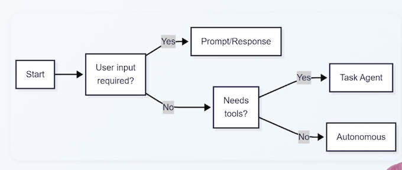
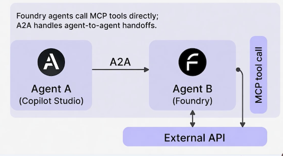

# Microsoft AB-100 Agentic AI Exam Prep

## 1 Prep Course for AB100

WHAT YOU'LL GET FROM THIS COURSE

- **Foundational Knowledge** — Understand agentic Al architecture and mechanics
- **Practical Skills** — Design workflows, patterns, orchestration
- **Exam Alignment** — Every lecture maps to AB-100 exam blueprint
- Confidence — Understand the why behind each concept

### COURSE STRUCTURE (8 SECTIONS)

#### Agentic Ai can handle complex problems:

- • Customer support escalation
- • Contract negotiation
- • Supply chain optimization
- • Strategic planning

----

- • Safety guardrails
- • Governance frameworks
- • Continuous monitoring
- • Ethical oversight

HOW TO ALLOCATE YOUR TIME

- Deploy/Govern/Secure (40-45%) → ~40% of study time
- Plan + Design (50-60%) → ~45% of study time
- Platform + Evaluation + Scenarios → ~15% of study time

### KEY TAKEAWAYS

1. - Format: 80 Q's, 90 min, adaptive, ~70% to pass
2. - Pacing: Simple Q's are quick; scenarios take 2-4 minutes
3. - Question types: Multiple choice, multi-select, scenario, drag-drop
4. - Competencies: 5 areas; governance is the heaviest
5. - Focus: Business reasoning & safe deployment, not coding

### WHAT THE EXAM TESTS

IS Testing:

- • Real-world scenario reasoning
- • Trade-offs (speed vs. safety, autonomy vs. control)
- • Best practices for design & deployment
- • Business problem mapping
- • Governance & ethical thinking

IS NOT Testing:

- • Deep ML theory or mathematics
- • Coding or programming ability
- • Model training or fine-tuning
- • Specific tool APIs or syntax

### DOMAIN AREAS (3 TOTAL)

1. Plan Al-Powered Business Solutions — 25-30%
2. Design Al-Powered Business Solutions — 25-30%
3. Deploy Al-Powered Business Solutions — 40-45%

> (includes governance, evaluation, monitoring)

### EXAM BASICS

- • Total questions: 80
- • Time limit: 90 minutes
- • Passing score: 700/1000 (~70%)
- • Question types: Multiple choice, scenario, drag-and-drop
- • Format: Adaptive (difficulty adjusts to your performance)
- • Cost: $165 USD
- • Delivery: Computer-based, proctored online

Average time per question: ~1 min 7 sec (but scenarios take longer)

**Exam Insight**

The AB-100 exam is testing whether you can:

* **Plan** solutions that fit business needs
* **Design** systems that work
* **Deploy & Govern** them safely
* **Measure** success
* **Align** with real-world business goals

NOT testing deep ML knowledge or coding ability

## 2 Microsoft AI Landscape

**What is Agentic AI, Really?**

- Define the key terms
- Explore what's happening in the industry
- Set the foundation for everything that follows

**What Is Agentic AI?**

**Agentic AI = Goal + Reasoning + Tools + Action**

* **Goal** — the target outcome
* **Reasoning** — decides what to do next
* **Tools** — APls, workflows, data sources
* **Action** — executes steps to reach the goal

#### **KEY TERMS (QUICK DEFINITIONS)**

* **Agent** — decision-maker that chooses actions
* **Tools** — capabilities the agent can invoke
* **Orchestration** — coordinates steps and tool calls
* **Planning** — breaks goals into sub-tasks
* **Memory** — retains context over time
* **Guardrails** — safety and compliance constraints

#### ANALOGY: AGENT AS PROJECT MANAGER

**Receives a goal**  

- Defines success criteria
- Prioritizes tasks

**Breaks it down**

- Creates a plan
- Delegates steps

**Uses tools**

- Calls systems and APls
- Requests info from teams

**Adapts**

- Updates plan
- Stays within guardrails

#### WHAT AGENTIC AI IS NOT

* **Not just a chatbot** — chat can be part of an agent
* **Not traditional automation** — "if X then Y" only
* **Not a standalone model** — the model is one component

#### BUSINESS IMPACT

* **Faster decisions** through automated reasoning
* **Reduced operational** load via delegated tasks
* **Scalable workflows** that adapt to variability
* **Better alignment** with business goals

> Guardrails are constraints that keep agents safe, compliant, and aligned

#### KEY TAKEAWAYS

- Agentic Al is **goal-driven, tool-using, action-taking** Al.
- Know the terms: **agent, tools, orchestration, planning, memory, guardrail**s.
- It's not just chat or automation — **it's decision + action + adaptation.**
- The exam emphasizes **business impact and safe deployment.**

### 2-1 Microsoft AI Landscape: Copilot Studio vs. AI Foundry

* Agentic solutions are rarely built on a single tool
* Exam scenarios test your ability to select the right platform mix
* Focus: Business alignment, governance, and scale — not tool mastery

Key platforms:

* **Copilot Studio** → No-code agent building
* **Azure Al Foundry** → Custom models & advanced orchestration
* **Power Platform** → Low-code flows & connectors
* **Dynamics 365** → Industry-specific business apps
* **Microsoft 365 Copilot** → Productivity & extensibility

**PLATFORM COMPARISON TABLE**

| Platform | Strength | Role | Best For | Weight |
|----------|----------|------|----------|--------|
| Copilot Studio | No-code agent builder | Task, autonomous, prompt | Quick prototyping | High |
| Azure AI Foundry | Custom models, fine-tune | Advanced reasoning, multi | Complex, scalable agents | High |
| Power Platform | Connectors, flows | Data grounding, orchestration | Low-code workflows | Medium |

#### **ECOSYSTEM INTEGRATION FLOW**

* Copilot Studio agents call Azure Al Foundry models via MCP
* Power Automate triggers Dynamics actions
* Microsoft 365 Copilot extends with custom agents from Copilot Studio

#### **Agentic Solution**

- Copilot Studio agents call Foundry models via MCP
- Power Automate triggers Dynamics actions
- Microsoft 365 Copilot extends with custom agents from Copilot Studio

#### KEY TAKEAWAYS

* Microsoft ecosystem is **modular** — mix platforms for the best fit
* AB-100 tests **platform selection** based on business requirements
* Always consider **governance, scale, and cost in your answers**
* Know when to pick **speed (Copilot Studio) vs. customization (Azure Al Foundry)**

### 2-2 Microsoft AI Agent Types & Capabilities Explained

**AB-100 AGENT TYPES**

| Agent Type | Autonomy Level | Key Capabilities | Best Microsoft Platform(s) | Typical Use Case |
|------------|----------------|------------------|----------------------------|--------------------|
| Prompt/Response | Low | Responds to user input with reasoning | Copilot Studio, Microsoft 365 Copilot | Chat-based support, simple Q&A |
| Task | Medium | Executes bounded tasks with tools | Copilot Studio + Power Automate | Escalation, data lookup, approval workflows |
| Autonomous | High | Independent planning, multi-step actions | Copilot Studio + Azure AI Foundry Agent Service | Background monitoring, proactive workflows |

#### **CAPABILITIES BY PLATFORM**

* **Copilot Studio**: All three types + topics, actions, connectors
* **Azure Al Foundry:** Enhances autonomous agents with custom models & multi-agent orchestration
* **Power Platform**: Adds grounding & flows for task/autonomous agents
* **Dynamics 365**: Prebuilt task & autonomous agents (e.g., Sales Copilot)
* **Microsoft 365 Copilot**: Primarily prompt/response, extensible to task

**KEY TAKEAWAYS**

- Know the three agent types: prompt/response, task, autonomous
- Autonomous agents are powerful but require strong guardrails
- Exam favors **balancing autonomy with governance**

### 2-3 Copilot Studio Core Concepts: Topics, Tools & Connectors

###$ **COPILOT STUDIO OVERVIEW**

* No-code/low-code platform for building agents
* Core building blocks: Topics, Tools, Connectors, Knowledge
* Supports all agent types (prompt/response, task, autonomous)

Exam focus: Designing agents in Copilot Studio (topics → tools → flows)

#### CORE COMPONENTS TABLE

| Component | Purpose | Exam Relevance |
|-----------|---------|----------------|
| Topics | Conversation scenarios & branching | Defines agent behavior & user interaction |
| Tools | Connectors, API calls, prompts, agent flows | Enables agent to take real-world actions |
| Connectors | 1000+ prebuilt (Dynamics, Dataverse, etc.) | Grounds agents in enterprise data |
| Knowledge | Grounding sources (Dataverse, SharePoint, web) | Prevents hallucinations, improves accuracy |

Example: Topic "Escalate Issue" → Tool "Create Case in Dynamics" → Connector to Dynamics
365

#### AGENT DESIGN FLOW IN COPILOT STUDIO

GOVERNANCE & SECURITY IN COPILOT STUDIO

* Built-in guardrails (content filters, data loss prevention)
* Environment isolation (dev/test/prod)
* Role-based access control

#### KEY TAKEAWAYS

* Copilot Studio is the primary no-code agent builder
* Know the four core components: topics, tools, connectors, knowledge
* Exam emphasizes grounding & guardrails for reliable agents

### 2-4 Azure AI Foundry Tools & Model Selection

#### WHAT IS AZURE AI FOUNDRY?

**Centralized platform for Al model discovery, hosting, and customization — your model headquarters.**

1. **Model Catalog** - Thousands of models: Azure OpenAl (GPT-4), Anthropic Claude, Meta
Llama, Mistral, and more
2. **Fine-Tuning Tools** — Adapt models to your specific domain data and industry terminology
3. **Agent Service** — Scalable agent hosting (LangGraph, Semantic Kernel)

> Key distinction: Copilot Studio = speed & accessibility. 
> 
> Azure AI Foundry = deeper customization, scale, and control.

#### WHEN TO USE AZURE AI FOUNDRY

The exam loves testing this decision point. Use Foundry when:

* **Off-the-shelf models lack accuracy** for your industry data (financial, medical, legal)
* **Dynamic routing needed** - route simple queries to cheaper models, complex to premium (cost optimization)
* Multi-agent orchestration or complex custom tool integration required
* **Strict data privacy or compliance** — full control over where data goes and deployment

**Trigger words: domain-specific, fine-tuning, compliance, multi-agents enterprise scale → Think Foundry**

#### FOUNDRY CAPABILITIES FOR AGENTS

Agent Service hosts your agents with built-in scaling, observability, and cost tracking.

* **Dynamic model routing** — Cost optimization at scale
* **Multi-agent orchestration** — Agent2Agent protocol support
* **Built-in telemetry** - Performance metrics and cost tracking
* **Tool integration via MCP** — Expose agents securely to other systems

> "Quick deployment" → Copilot Studio. 

> "Custom reasoning and scale" Azure Al Foundry. The answer depends on what the scenario emphasizes.

#### KEY TAKEAWAYS

* **Azure AI Foundry = custom models + agent hosting at enterprise scale**
* Choose Foundry for fine-tuning, dynamic routing, complex workflows, or high-scale needs
* Always weigh against Copilot Studio - simpler is better when it meets requirements
* Foundry is the answer when off-the-shelf isn't enough

### 2-5 How AI Agents Talk to Each Other: MCP & AgentAgent Protocol 

#### MODEL CONTEXT PROTOCOL (MCP)

MCP — Originated from Anthropic, adopted by Microsoft Agents securely request tools, APIs, or context from MCP servers

* Agent calls MCP server (not direct API endpoints)
* MCP server acts as secure intermediary
* Build your own with Azure Functions or use existing servers

#### WHY MCP?  🧑‍💻🧑‍💻🧑‍💻

* **Secure Access**:  Central control over what agents can call
* **Auditability** All tool calls logged and traceable
* **Reusability** Share MCP servers across multiple agents
* **Interoperability** Works across Copilot Studio, Foundry, custom code

**MCP EXAM EXAMPLE**

> **"How do you let an Azure Al Foundry agent securely access a private database?"**

Answer: Register an MCP server that connects to that database

**Agent → MCP Server → Database (with proper credentials & access control)**

#### AGENTZAGENT (A2A) PROTOCOL. 👩🏻‍💻👩🏻‍💻👩🏻‍💻

Open protocol — Originated from Google, supported by Microsoft

- **MCP**： Agent-to-tool communication
- **A2A**：  Agent-to-agent communication

A2A enables agents to communicate, delegate, and collaborate across platform

#### A2A IN ACTION

Multi-agent workflow example:

1. **Research Agent** → finds relevant documents
2. **Summarizer Agent** → distills key points
3. **Approver Agent** → validates before surfacing to user

Works cross-platform: Copilot Studio + Azure Ai Foundry + custom agents

> INTEGRATION EXAMPLE

> "**Orchestrating multiple agents securely" → AZA + MCP**

- AZA handles agent-to-agent coordination
- MCP handles agent-to-tool access
- Together, they cover both bases for enterprise scenarios

#### KEY TAKEAWAYS

- MCP = secure, auditable tool access across agents
- **A2A = multi-agent collaboration and delegation**
- Use both for governance, scalability, or interoperability questions 
- Together, these protocols enable enterprise-grade agentic systems

### 2-6 Build Custom AI Models in Azure Foundry - Build vs. Buy vs. Extend

#### THE PRAGMATIC HIERARCHY

1. **Off-the-shelf models + prompt engineering + RAG**
2. Only escalate to custom fine-tuning when that fails

"Fails" must mean something specific — not just preference

#### WHEN TO ESCALATE TO CUSTOM

| Trigger | Example |
|---------|---------|
| **Domain accuracy critical** | Legal, financial, medical terminology |
| **Privacy/compliance** | Data must stay on your infrastructure |
| **Scale demands cost optimization** | Thousands of queries daily |
| **Proprietary patterns**| Internal jargon, unique business logic |

#### DESIGNING CUSTOM MODELS IN FOUNDRY

| Step | Action | Note |
|------|--------|------|
| 1 | Select **base model** from catalog | GPT-4, Llama, etc. |
| 2 | **Prepare training data** | Clean, label, format — 80% of the work |
| 3 | **Fine-tune** | Supervised or LoRA adapters |
| 4 | **Evaluate rigorously** | Auto-scaling |
| 5 | **Deploy to Agent Service** | Accuracy, safety, bias, hallucinations |
| 6 | **Expose via MCP** | Other agents can call securely |

#### ADVANCED FOUNDRY FEATURES

- **Dynamic routing — Simple queries → cheap model, complex → premium**
- **Multi-agent orchestration** — Custom models participate via A2A
- **Telemetry & governance** — Track usage, costs, hallucination rates

#### KEY TAKEAWAYS

- Custom models solve **domain accuracy and compliance gaps**
- Azure AI Foundry = fine-tuning, evaluation, and hosting
- Always **justify with business trade-offs (cost, governance, performance)**
- **Evaluate first**, deploy second, monitor continuously 
- Exam mantra: **"Start simple, escalate thoughtfully"**

## 3 Agentic AI Solutions 🤖

### 3-1 Requirement Analysis for Agentic AI Solutions 

#### WHY REQUIREMENT ANALYSIS MATTERS

- First step in the "Plan" domain (25-30% of the exam)
- Exam scenarios: "A company wants to automate X — should they use agents?"
- Goal: Determine if agentic Al is the right fit vs. traditional automation

**Three key questions:**

- What is the business goal?
- What are the constraints (budget, timeline, regulation, data)?
- Does the task need adaptive, multi-step, tool-using

#### GOOD FIT FOR AGENTIC AI

**Characteristic**

- **Multi-step, decision-heavy tasks**： Customer escalation with research
- **Ambiguous, variable processes**： Supply chain exception handling
- **Requires calling tools or APIs**： Query multiple systems and act on results
- **High compliance needs (with guardrails)**： Financial decision support

**Purely repetitive, rule-based tasks** ： Better Alternative： Power Automate flow

**Simple Q&A with no follow-up action**： Standard Copilot or FAQ bot

**Static, single-step processes**： Traditional workflow automation

#### REQUIREMENT ANALYSIS FRAMEWORK

> Best answers identify goal first, then constraints, then justif not) with trade-offs.

**Business Goal -> Constraints & Risks -> Agentic Fit -> Recomendedd Solutuon**

**RISK ASSESSMENT FRAMEWORK**

| Dimension   | Question                         | Example (Contract Review Agent)          |
|-------------|----------------------------------|------------------------------------------|
| Likelihood  | How probable is this risk?       | Data staleness — Medium                  |
| Impact      | How severe if it occurs?         | Hallucination on legal clause — High     |
| Mitigation  | What reduces risk?               | Human review for flagged items           |

#### **KEY TAKEAWAYS**

* Always start with business goal and constraints
* Agentic shines in adaptive, multi-step, tool-dependent processes
* Assess risks early — likelihood, impact, mitigation 
* Exam rewards "Is agentic the right tool?" reasoning