# Microsoft AB-100 Agentic AI Exam Prep

## 1 Prep Course for AB100

WHAT YOU'LL GET FROM THIS COURSE

- **Foundational Knowledge** — Understand agentic Al architecture and mechanics
- **Practical Skills** — Design workflows, patterns, orchestration
- **Exam Alignment** — Every lecture maps to AB-100 exam blueprint
- Confidence — Understand the why behind each concept

### COURSE STRUCTURE (8 SECTIONS)


#### Agentic Ai can handle complex problems:


- • Customer support escalation
- • Contract negotiation
- • Supply chain optimization
- • Strategic planning


----

- • Safety guardrails
- • Governance frameworks
- • Continuous monitoring
- • Ethical oversight

HOW TO ALLOCATE YOUR TIME


- Deploy/Govern/Secure (40-45%) → ~40% of study time
- Plan + Design (50-60%) → ~45% of study time
- Platform + Evaluation + Scenarios → ~15% of study time


### KEY TAKEAWAYS

1. - Format: 80 Q's, 90 min, adaptive, ~70% to pass
2. - Pacing: Simple Q's are quick; scenarios take 2-4 minutes
3. - Question types: Multiple choice, multi-select, scenario, drag-drop
4. - Competencies: 5 areas; governance is the heaviest
5. - Focus: Business reasoning & safe deployment, not coding

### WHAT THE EXAM TESTS

IS Testing:

- • Real-world scenario reasoning
- • Trade-offs (speed vs. safety, autonomy vs. control)
- • Best practices for design & deployment
- • Business problem mapping
- • Governance & ethical thinking

IS NOT Testing:

- • Deep ML theory or mathematics
- • Coding or programming ability
- • Model training or fine-tuning
- • Specific tool APIs or syntax

### DOMAIN AREAS (3 TOTAL)

1. Plan Al-Powered Business Solutions — 25-30%
2. Design Al-Powered Business Solutions — 25-30%
3. Deploy Al-Powered Business Solutions — 40-45%

> (includes governance, evaluation, monitoring)

### EXAM BASICS

- • Total questions: 80
- • Time limit: 90 minutes
- • Passing score: 700/1000 (~70%)
- • Question types: Multiple choice, scenario, drag-and-drop
- • Format: Adaptive (difficulty adjusts to your performance)
- • Cost: $165 USD
- • Delivery: Computer-based, proctored online

Average time per question: ~1 min 7 sec (but scenarios take longer)


**Exam Insight**

The AB-100 exam is testing whether you can:

* **Plan** solutions that fit business needs
* **Design** systems that work
* **Deploy & Govern** them safely
* **Measure** success
* **Align** with real-world business goals

NOT testing deep ML knowledge or coding ability


## 2 Microsoft AI Landscape

**What is Agentic AI, Really?**

- Define the key terms
- Explore what's happening in the industry
- Set the foundation for everything that follows

**What Is Agentic AI?**

**Agentic AI = Goal + Reasoning + Tools + Action**

* **Goal** — the target outcome
* **Reasoning** — decides what to do next
* **Tools** — APls, workflows, data sources
* **Action** — executes steps to reach the goal


#### **KEY TERMS (QUICK DEFINITIONS)**

* **Agent** — decision-maker that chooses actions
* **Tools** — capabilities the agent can invoke
* **Orchestration** — coordinates steps and tool calls
* **Planning** — breaks goals into sub-tasks
* **Memory** — retains context over time
* **Guardrails** — safety and compliance constraints


#### ANALOGY: AGENT AS PROJECT MANAGER

**Receives a goal**  

- Defines success criteria
- Prioritizes tasks


**Breaks it down**

- Creates a plan
- Delegates steps


**Uses tools**

- Calls systems and APls
- Requests info from teams

**Adapts**

- Updates plan
- Stays within guardrails


#### WHAT AGENTIC AI IS NOT

* **Not just a chatbot** — chat can be part of an agent
* **Not traditional automation** — "if X then Y" only
* **Not a standalone model** — the model is one component


#### BUSINESS IMPACT

* **Faster decisions** through automated reasoning
* **Reduced operational** load via delegated tasks
* **Scalable workflows** that adapt to variability
* **Better alignment** with business goals

> Guardrails are constraints that keep agents safe, compliant, and aligned

#### KEY TAKEAWAYS


- Agentic Al is **goal-driven, tool-using, action-taking** Al.
- Know the terms: **agent, tools, orchestration, planning, memory, guardrail**s.
- It's not just chat or automation — **it's decision + action + adaptation.**
- The exam emphasizes **business impact and safe deployment.**


### 2-1 Microsoft AI Landscape: Copilot Studio vs. AI Foundry

* Agentic solutions are rarely built on a single tool
* Exam scenarios test your ability to select the right platform mix
* Focus: Business alignment, governance, and scale — not tool mastery


Key platforms:

* **Copilot Studio** → No-code agent building
* **Azure Al Foundry** → Custom models & advanced orchestration
* **Power Platform** → Low-code flows & connectors
* **Dynamics 365** → Industry-specific business apps
* **Microsoft 365 Copilot** → Productivity & extensibility


**PLATFORM COMPARISON TABLE**

| Platform | Strength | Role | Best For | Weight |
|----------|----------|------|----------|--------|
| Copilot Studio | No-code agent builder | Task, autonomous, prompt | Quick prototyping | High |
| Azure AI Foundry | Custom models, fine-tune | Advanced reasoning, multi | Complex, scalable agents | High |
| Power Platform | Connectors, flows | Data grounding, orchestration | Low-code workflows | Medium |


#### **ECOSYSTEM INTEGRATION FLOW**

* Copilot Studio agents call Azure Al Foundry models via MCP
* Power Automate triggers Dynamics actions
* Microsoft 365 Copilot extends with custom agents from Copilot Studio


#### **Agentic Solution**

- Copilot Studio agents call Foundry models via MCP
- Power Automate triggers Dynamics actions
- Microsoft 365 Copilot extends with custom agents from Copilot Studio


#### KEY TAKEAWAYS

* Microsoft ecosystem is **modular** — mix platforms for the best fit
* AB-100 tests **platform selection** based on business requirements
* Always consider **governance, scale, and cost in your answers**
* Know when to pick **speed (Copilot Studio) vs. customization (Azure Al Foundry)**

### 2-2 Microsoft AI Agent Types & Capabilities Explained

**AB-100 AGENT TYPES**


| Agent Type | Autonomy Level | Key Capabilities | Best Microsoft Platform(s) | Typical Use Case |
|------------|----------------|------------------|----------------------------|--------------------|
| Prompt/Response | Low | Responds to user input with reasoning | Copilot Studio, Microsoft 365 Copilot | Chat-based support, simple Q&A |
| Task | Medium | Executes bounded tasks with tools | Copilot Studio + Power Automate | Escalation, data lookup, approval workflows |
| Autonomous | High | Independent planning, multi-step actions | Copilot Studio + Azure AI Foundry Agent Service | Background monitoring, proactive workflows |


#### **CAPABILITIES BY PLATFORM**


* **Copilot Studio**: All three types + topics, actions, connectors
* **Azure Al Foundry:** Enhances autonomous agents with custom models & multi-agent orchestration
* **Power Platform**: Adds grounding & flows for task/autonomous agents
* **Dynamics 365**: Prebuilt task & autonomous agents (e.g., Sales Copilot)
* **Microsoft 365 Copilot**: Primarily prompt/response, extensible to task

**KEY TAKEAWAYS**

- Know the three agent types: prompt/response, task, autonomous
- Autonomous agents are powerful but require strong guardrails
- Exam favors **balancing autonomy with governance**

### 2-3 Copilot Studio Core Concepts: Topics, Tools & Connectors

###$ **COPILOT STUDIO OVERVIEW**

* No-code/low-code platform for building agents
* Core building blocks: Topics, Tools, Connectors, Knowledge
* Supports all agent types (prompt/response, task, autonomous)


Exam focus: Designing agents in Copilot Studio (topics → tools → flows)

#### CORE COMPONENTS TABLE


| Component | Purpose | Exam Relevance |
|-----------|---------|----------------|
| Topics | Conversation scenarios & branching | Defines agent behavior & user interaction |
| Tools | Connectors, API calls, prompts, agent flows | Enables agent to take real-world actions |
| Connectors | 1000+ prebuilt (Dynamics, Dataverse, etc.) | Grounds agents in enterprise data |
| Knowledge | Grounding sources (Dataverse, SharePoint, web) | Prevents hallucinations, improves accuracy |

Example: Topic "Escalate Issue" → Tool "Create Case in Dynamics" → Connector to Dynamics
365


#### AGENT DESIGN FLOW IN COPILOT STUDIO

GOVERNANCE & SECURITY IN COPILOT STUDIO

* Built-in guardrails (content filters, data loss prevention)
* Environment isolation (dev/test/prod)
* Role-based access control

#### KEY TAKEAWAYS

* Copilot Studio is the primary no-code agent builder
* Know the four core components: topics, tools, connectors, knowledge
* Exam emphasizes grounding & guardrails for reliable agents

### 2-4 Azure AI Foundry Tools & Model Selection

#### WHAT IS AZURE AI FOUNDRY?

**Centralized platform for Al model discovery, hosting, and customization — your model headquarters.**

1. **Model Catalog** - Thousands of models: Azure OpenAl (GPT-4), Anthropic Claude, Meta
Llama, Mistral, and more
2. **Fine-Tuning Tools** — Adapt models to your specific domain data and industry terminology
3. **Agent Service** — Scalable agent hosting (LangGraph, Semantic Kernel)


> Key distinction: Copilot Studio = speed & accessibility. 
> 
> Azure AI Foundry = deeper customization, scale, and control.

#### WHEN TO USE AZURE AI FOUNDRY

The exam loves testing this decision point. Use Foundry when:

* **Off-the-shelf models lack accuracy** for your industry data (financial, medical, legal)
* **Dynamic routing needed** - route simple queries to cheaper models, complex to premium (cost optimization)
* Multi-agent orchestration or complex custom tool integration required
* **Strict data privacy or compliance** — full control over where data goes and deployment

**Trigger words: domain-specific, fine-tuning, compliance, multi-agents enterprise scale → Think Foundry**

#### FOUNDRY CAPABILITIES FOR AGENTS

Agent Service hosts your agents with built-in scaling, observability, and cost tracking.


* **Dynamic model routing** — Cost optimization at scale
* **Multi-agent orchestration** — Agent2Agent protocol support
* **Built-in telemetry** - Performance metrics and cost tracking
* **Tool integration via MCP** — Expose agents securely to other systems


> "Quick deployment" → Copilot Studio. 

> "Custom reasoning and scale" Azure Al Foundry. The answer depends on what the scenario emphasizes.

#### KEY TAKEAWAYS

* **Azure AI Foundry = custom models + agent hosting at enterprise scale**
* Choose Foundry for fine-tuning, dynamic routing, complex workflows, or high-scale needs
* Always weigh against Copilot Studio - simpler is better when it meets requirements
* Foundry is the answer when off-the-shelf isn't enough


### 2-5 How AI Agents Talk to Each Other: MCP & AgentAgent Protocol 

#### MODEL CONTEXT PROTOCOL (MCP)

MCP — Originated from Anthropic, adopted by Microsoft Agents securely request tools, APIs, or context from MCP servers

* Agent calls MCP server (not direct API endpoints)
* MCP server acts as secure intermediary
* Build your own with Azure Functions or use existing servers


#### WHY MCP?  🧑‍💻🧑‍💻🧑‍💻

* **Secure Access**:  Central control over what agents can call
* **Auditability** All tool calls logged and traceable
* **Reusability** Share MCP servers across multiple agents
* **Interoperability** Works across Copilot Studio, Foundry, custom code


**MCP EXAM EXAMPLE**

> **"How do you let an Azure Al Foundry agent securely access a private database?"**


Answer: Register an MCP server that connects to that database

**Agent → MCP Server → Database (with proper credentials & access control)**

#### AGENTZAGENT (A2A) PROTOCOL. 👩🏻‍💻👩🏻‍💻👩🏻‍💻

Open protocol — Originated from Google, supported by Microsoft

- **MCP**： Agent-to-tool communication
- **A2A**：  Agent-to-agent communication

A2A enables agents to communicate, delegate, and collaborate across platform

#### A2A IN ACTION

Multi-agent workflow example:

1. **Research Agent** → finds relevant documents
2. **Summarizer Agent** → distills key points
3. **Approver Agent** → validates before surfacing to user

Works cross-platform: Copilot Studio + Azure Ai Foundry + custom agents

> INTEGRATION EXAMPLE


> "**Orchestrating multiple agents securely" → AZA + MCP**

- AZA handles agent-to-agent coordination
- MCP handles agent-to-tool access
- Together, they cover both bases for enterprise scenarios


#### KEY TAKEAWAYS

- MCP = secure, auditable tool access across agents
- **A2A = multi-agent collaboration and delegation**
- Use both for governance, scalability, or interoperability questions 
- Together, these protocols enable enterprise-grade agentic systems

### 2-6 Build Custom AI Models in Azure Foundry - Build vs. Buy vs. Extend

#### THE PRAGMATIC HIERARCHY


1. **Off-the-shelf models + prompt engineering + RAG**
2. Only escalate to custom fine-tuning when that fails

"Fails" must mean something specific — not just preference

#### WHEN TO ESCALATE TO CUSTOM

| Trigger | Example |
|---------|---------|
| **Domain accuracy critical** | Legal, financial, medical terminology |
| **Privacy/compliance** | Data must stay on your infrastructure |
| **Scale demands cost optimization** | Thousands of queries daily |
| **Proprietary patterns**| Internal jargon, unique business logic |

#### DESIGNING CUSTOM MODELS IN FOUNDRY

| Step | Action | Note |
|------|--------|------|
| 1 | Select **base model** from catalog | GPT-4, Llama, etc. |
| 2 | **Prepare training data** | Clean, label, format — 80% of the work |
| 3 | **Fine-tune** | Supervised or LoRA adapters |
| 4 | **Evaluate rigorously** | Auto-scaling |
| 5 | **Deploy to Agent Service** | Accuracy, safety, bias, hallucinations |
| 6 | **Expose via MCP** | Other agents can call securely |


#### ADVANCED FOUNDRY FEATURES

- **Dynamic routing — Simple queries → cheap model, complex → premium**
- **Multi-agent orchestration** — Custom models participate via A2A
- **Telemetry & governance** — Track usage, costs, hallucination rates

#### KEY TAKEAWAYS

- Custom models solve **domain accuracy and compliance gaps**
- Azure AI Foundry = fine-tuning, evaluation, and hosting
- Always **justify with business trade-offs (cost, governance, performance)**
- **Evaluate first**, deploy second, monitor continuously 
- Exam mantra: **"Start simple, escalate thoughtfully"**


## 3 Agentic AI Solutions 🤖

### 3-1 Requirement Analysis for Agentic AI Solutions 

#### WHY REQUIREMENT ANALYSIS MATTERS

- First step in the "Plan" domain (25-30% of the exam)
- Exam scenarios: "A company wants to automate X — should they use agents?"
- Goal: Determine if agentic Al is the right fit vs. traditional automation


**Three key questions:**

- What is the business goal?
- What are the constraints (budget, timeline, regulation, data)?
- Does the task need adaptive, multi-step, tool-using


#### GOOD FIT FOR AGENTIC AI


**Characteristic**

- **Multi-step, decision-heavy tasks**： Customer escalation with research
- **Ambiguous, variable processes**： Supply chain exception handling
- **Requires calling tools or APIs**： Query multiple systems and act on results
- **High compliance needs (with guardrails)**： Financial decision support


**Purely repetitive, rule-based tasks** ： Better Alternative： Power Automate flow

**Simple Q&A with no follow-up action**： Standard Copilot or FAQ bot

**Static, single-step processes**： Traditional workflow automation


#### REQUIREMENT ANALYSIS FRAMEWORK

> Best answers identify goal first, then constraints, then justif not) with trade-offs.

**Business Goal -> Constraints & Risks -> Agentic Fit -> Recomendedd Solutuon**

**RISK ASSESSMENT FRAMEWORK**

| Dimension   | Question                         | Example (Contract Review Agent)          |
|-------------|----------------------------------|------------------------------------------|
| Likelihood  | How probable is this risk?       | Data staleness — Medium                  |
| Impact      | How severe if it occurs?         | Hallucination on legal clause — High     |
| Mitigation  | What reduces risk?               | Human review for flagged items           |


#### **KEY TAKEAWAYS**

* Always start with business goal and constraints
* Agentic shines in adaptive, multi-step, tool-dependent processes
* Assess risks early — likelihood, impact, mitigation 
* Exam rewards "Is agentic the right tool?" reasoning


### 3-2 Data Grounding Readiness for AI Agents  - Quality, relevance, availability

#### WHY GROUNDING MATTERS IN AB-100

- Ungrounded agents make up answers — they hallucinate
- Exam scenarios test: "Is the data ready? What are the risks if not?"
- **<mark>Grounding = giving agents real, relevant context to work with</mark>**

**Three dimensions to assess:**

- **Quality** — Accurate, complete, up-to-date
- **Relevance** — Matches the agent's tasks and use cases
- **Availability** — Accessible securely, quickly, and reliably


#### GROUNDING SOURCES IN MICROSOFT ECOSYSTEM

- **Copilot Studio Knowledge** — SharePoint, Dataverse, web
- **Azure Al Foundry** — Custom retrieval pipelines, vector databases
- **Power Platform** — Connectors to 1000+ sources
- **Dynamics 365 / M365** — Native grounding in CRM/ERP data
- **Planning focus: Assess gaps now**; architect the integration in Lecture 8.


Exam Insight

> Best answers assess grounding gaps first, then recommend fixes.


#### KEY TAKEAWAYS

**Poor grounding** = unreliable agents → **always assess quality/relevance/availability**

Focus on identifying gaps during planning; architecture comes later

Exam rewards proactive risk identification in planning

### 3-3 AI Adoption Strategy - Cloud Adoption Framework for AI

#### CLOUD ADOPTION FRAMEWORK (CAF) FOR AI OVERVIEW

* Microsoft's structured roadmap for Al adoption
* Phases: Strategy → Plan → Ready → Adopt → Govern
* Applies to agentic Al: Identify use cases, align tech, scale responsibly


> Exam Insight
> 
> Scenarios test strategic planning (e.g., "How should this company adopt agentic solutions organization-wide?").


#### CAF FOR AI PHASES

| Phase    | Key Activities                                                      | AB-100 Relevance                                      |
|----------|---------------------------------------------------------------------|-------------------------------------------------------|
| **Strategy**| Define vision, identify high-impact use cases, set metrics          | Align AI to business goals                            |
| **Plan**     | Assess readiness, prioritize use cases, build roadmap              | Requirement analysis, data readiness                  |
| **Ready**    | Set up environments, governance, security baselines                | Infrastructure and compliance foundations             |
| **Adopt**    | **Pilot, measure, then scale agents**                                   | Proving value before full rollout                     |
| **Govern**   | **Responsible AI, monitoring, compliance**                              | Ongoing governance (heaviest exam weight)             |


#### BUILDING AN AI CENTER OF EXCELLENCE (COE)

- Cross-functional team: Business, IT, data, legal
- Responsibilities: Use case intake, standards, governance
- Microsoft tools: Purview for compliance, Azure Al Foundry for experimentation


> Exam Insight
> 
> Strong answers include CoE for sustainable adoption.

#### DESIGNING AN EFFECTIVE PILOT

| Element         | Description                | Example                                      |
|-----------------|----------------------------|----------------------------------------------|
| Scope           | Bounded use case           | Tier 1 support, NA team only                 |
| Duration        | Fixed timeframe            | 6–8 weeks                                    |
| Success Metrics | Defined before launch      | Resolution rate, CSAT, handle time           |
| Go/No-Go        | Clear thresholds           | Resolution > 70%, CSAT > 4.0                 |
| Feedback Loop   | Continuous input           | Weekly retros + surveys                      |


> Exam Insight
> 
> Structured pilot design with success criteria beats "deploy and monitoring"


#### KEY TAKEAWAYS

* Follow CAF phases: **Strategy → Plan → Ready → Adopt → Govern**
* Start with high-value use cases and responsible AI
* Design pilots with **clear scope, metrics, and go/no-go criteria** 
* Exam rewards structured, business-aligned strategies


### 3-4 Build vs. Buy vs. Extend Decisions

#### DECISION FRAMEWORK: WHEN TO CHOOSE


> Exam Insight
> 
> Most enterprise projects are "Extend" — buy the foundation, customize on top.

| Approach   | When to Choose                                    | AB-100 Example                              |
|------------|---------------------------------------------------|---------------------------------------------|
| **Buy**    | Prebuilt agents meet 80–90% of needs              | Use Copilot for Sales                       |
| **Extend** | Prebuilt covers most; minor tweaks needed         | Extend M365 Copilot with custom topic       |
| **Build**  | Unique requirements, proprietary logic            | Custom autonomous agent in Foundry          |


#### DECISION FRAMEWORK: TRADE-OFFS

| Approach   | Pros                                    | Cons                                                      |
|------------|-----------------------------------------|-----------------------------------------------------------|
| **Buy**    | Fast, governed, vendor-supported        | Limited customization                                     |
| **Extend** | Speed + tailoring                       | **Still constrained by base platform**                        |
| **Build**  | Full control, high differentiation      | Highest cost, longest timeline, you own maintenance       |

**Exam Insight**

>  Best answer is pragmatic—extend prebuilt first, build only when justified

#### **KEY TAKEAWAYS**

* Build when the problem is truly unique or you have deep expertise
* Buy when the vendor solution covers 80%+ of your needs
* Extend is usually the answer in enterprise — take a vendor solution and adapt it ) 
* Always factor in maintenance cost and team expertise, not just initial delivery


### 3-5 ROI & Total Cost of Ownership Analysis

#### WHY ROI/TCO MATTERS IN AB-100

* **"Plan" domain requires quantifying business value**
* Exam scenarios: "Is this agent worth the investment?"
* **ROI - Return on Investment: Measures value vs. cost**
* **TCO - Total Cost of Ownership: All costs over lifecycle**


Key formulas:


* **ROI = (Benefits - Costs) / Costs × 100**
* TCO includes all lifecycle costs (dev, hosting, monitoring, tuning)

**Focus: Measurable outcomes (time saved, revenue lift, error reduction)**

#### TCO COST CATEGORIES

| Category              | Examples                                        | Typical % of TCO |
|-----------------------|-------------------------------------------------|------------------|
| Development           | **Design, build, testing**                          | 20–30%           |
| Model & Inference     | **Token usage, routing, fine-tuning**               | 25–40%           |
| Infrastructure        | **Azure AI Foundry hosting, storage**               | 10–20%           |
| Governance & Ops      | **Monitoring, tuning, compliance, security**        | 10–20%           |
| Change Management     | Training, adoption, process redesign            | 5–15%            |

#### REDUCING TCO

| Category              | Mitigation Strategy                                    |
|-----------------------|--------------------------------------------------------|
| **Development**           | Use Copilot Studio and prebuilt agents                 |
| Model & Inference     | Dynamic routing, smaller models for simple tasks       |
| **Infrastructure**        | Optimize scale, reserved capacity                      |
| **Governance & Ops**     | Microsoft Purview, automated alerts                    |
| Change Management     | Center of Excellence support, pilot programs           |

#### ROI CALCULATION EXAMPLE

Customer support automation:

- Benefits: `2.15M/year (labor reallocation + reduced churn)`
- Year 1 TCO: 600K (development + inference + ops)
- ROI: (2.15M - 600K) / 600K = 258%

> Exam Insight
> 
> Include all cost categories. Show phased thinking: pilot first, expand after proving value.

**KEY TAKEAWAYS**

- TCO includes development, inference, infrastructure, governance, and change costs — not just tokens
- **ROI is benefits minus costs, divided by costs — use realistic, quantifiable numbers** 
- Show phased approaches to reduce risk and demonstrate value early
- **Identify cost reduction opportunities like model routing and reusable components**

### 3-6 Prompt Library & Prompt Engineering Guidelines

#### WHY PROMPT ENGINEERING MATTERS IN PLANNING

* Core to reliable agent behavior (especially prompt/response & task agents)
* Poor prompts → inconsistent, unsafe outputs
* Exam tests: "How to ensure consistent quality across agents?"


Four core techniques:


* Chain-of-thought prompting
* Few-shot examples
* Role prompting
* Guardrails

#### PROMPT STRUCTURE TECHNIQUES

| Technique             | Description                               | Example                                 |
|-----------------------|-------------------------------------------|-----------------------------------------|
| Be specific & clear   | Define goal, constraints, output format   | "Summarize in bullet points, max 5 items" |
| Chain-of-thought      | Instruct step-by-step reasoning           | "Think step by step before answering"   |
| Few-shot examples     | **Provide 2–3 input/output examples**         | Sample customer query response          |


#### PROMPT BEHAVIOR CONTROLS


> Exam Insight
> 
> Combine techniques: role prompt + guardrails + few-shot examples for production-aualitv agents.

#### BUILDING A PROMPT LIBRARY

- Centralized repo (SharePoint, Azure DevOps)
- Categories: Use case, agent type, tone
- Version control + testing results
- Reuse across topics/actions in Copilot Studio


#### PROMPT GOVERNANCE FRAMEWORK

> Exam Insight
> 
> Strong answers recommend libraries with versioning, ownership, and governance.

| Element                  | Description                                       | Responsibility      |
|--------------------------|---------------------------------------------------|---------------------|
| Ownership                | Every template has an accountable owner           | CoE or team lead    |
| Review process           | Pre-production review for guardrails & edge cases | Peer + CoE review   |
| Testing cadence          | Periodic effectiveness checks                     | Quarterly minimum   |
| Cross-agent consistency  | Shared templates for common behaviors             | CoE-managed library |


#### KEY TAKEAWAYS

* Understand core techniques: chain-of-thought, few-shot, role prompting, guardrails
* Build a centralized prompt library to ensure consistency across agents
* Govern prompts with ownership, review processes, and versioning
* Tie prompt governance to your Center of Excellence and organizational strategy


### 3-7 Model Routing & When to Use Custom Models

#### WHAT IS MODEL ROUTING?

- Match each task to the right model based on cost, quality, and speed
- Simple tasks → lightweight models (lower cost, faster)
- Complex tasks → premium models (higher accuracy)
- **Azure Al Foundry enables automatic, dynamic routing**

> Definition
>
> Model routing — dynamically selecting the best model for each query based on complexity, cost, latency, and accuracy requirements

#### ROUTING IN ACTION

Customer support agent — same system, different queries:


> Over thousands of calls, intelligent routing saves significantly while maintaining quality where it matters.


|| Simple Query | Complex Query |
|---|---|---|
|Customer says | "My password isn't working" | "Enterprise feature X broke after last update" |
| Route to | Lightweight model | Premium model |
| Response | Scripted reset instructions | Contextual troubleshooting |
| Cost per call | Fraction of a cent | A few cents |

#### ROUTING CRITERIA

- **Query Complexity** — Simple yes/no → lightweight; open-ended analysis → premium
- **Latency** — Time-sensitive tasks may justify a faster (costlier) model
- **Cost Targets** — Per-query cost thresholds built into routing rules
- **Accuracy Requirements** — Safety-critical or compliance decisions need your best model

> Real routing policies combine all four dimensions based on business priorities

#### CUSTOM MODEL TRIGGERS


| Trigger | Example | Why It's Worth It |
|---------|---------|-------------------|
| Domain accuracy is mission-critical | Legal contract analysis | Hallucination risk = lawsuits |
| Compliance demands isolation | Healthcare data residency | Patient data can't leave environment |
| High-volume ROI | 1M emails/year, 2% accuracy gain = $500K | $50K fine-tuning pays back in months |


> Exam Insight
>
>
> Most of the time, routing and prompt engineering are enough. Custom models are the exception, not the rule.

#### THE DECISION PROCESS

**Escalation ladder — start at the bottom, climb only with evidence:**

1. **Model routing** — match tasks to models by complexity and cost
2. **Advanced prompting & grounding** - improve accuracy without custom training
3. **Fine-tuned / custom models** — only when metrics show persistent gaps

> Exam Insight
>
> On the exam, the best answer almost always starts simple and escalates only with data to justify it

#### KEY TAKEAWAYS

- Model routing balances cost and performance dynamically — use it as your first move
- Custom models solve specific problems only when routing and prompting aren't enough
- Justify model decisions with metrics: accuracy, cost savings, compliance needs
- On the exam, show you understand the trade-offs and start with the simplest effective approach

### 3-8 Organizing Business Data for AI Interoperability

#### THE DATA SILO PROBLEM

- Agents need data from multiple systems (CRM, ERP, knowledge bases, finance)
- **Siloed data with different schemas and formats** → inconsistent context
- **Inconsistent context** → hallucinations and poor decisions
- Interoperability is an ongoing architecture practice, not a one-time fix

> Exam Insight
>
> Lecture 2 assessed data readiness. This lecture architects the solution.

#### THREE PRACTICES FOR INTEROPERABILITY

| Trigger | Example | Why It's Worth It |
|---------|---------|-------------------|
| **Domain accuracy is mission-critical** | Legal contract analysis | Hallucination risk = lawsuits |
| **Compliance demands isolation** | Healthcare data residency | Patient data can't leave environment |
| **High-volume ROI** | 1M emails/year, 2% accuracy gain = $500K | $50K fine-tuning pays back in months |


#### MICROSOFT DATA TOOLS

| Tool | Role |
|------|------|
| **Microsoft Purview** | **Catalogs all data across Azure, SQL, SharePoint — unified map with lineage and ownership** |
| **Dataverse** | Common data platform with built-in governance — your critical business entities live here |
| **Connectors & MCP** | **Pull data from legacy systems into Dataverse; Model Context Protocol standardizes agent-to-system interaction** |


#### INTEROPERABILITY IN PRACTICE

Healthcare organization with three separate systems:

- **Patient data** → electronic health record system
- **Insurance data** → claims system
- **Billing data** → finance system

Solution: Sync critical fields (patient ID, insurance status, balance) into Dataverse daily. Set permissions per role — front-desk agent sees insurance status but not medical records.

#### KEY TAKEAWAYS

- Siloed data causes agent failures — interoperability is foundational 
- Semantic organization means consistent terminology across all systems
- Leverage Purview for cataloging, Dataverse for critical data, connectors for integration 
- Governance and access control prevent compliance violations

### 3-7 Use Cases for Prebuilt Agents and Customized Small Language Models

#### **PREBUILT AGENT LINEUP**

**Agent**

**Copilot for Sales**： Deal management — summarizes relationships, suggests next actions, drafts emails from CRM data

**Copilot for Service**： Frontline support — suggests solutions from knowledge articles, drafts responses, handles escalations

**Copilot for M365**: Productivity — meeting summaries, email drafting, document creation in Office

> **Exam Insight**
>
> Prebuilt agents are your fastest path to demonstrating value — ideal for pilots


#### WHEN PREBUILT FITS (AND WHEN IT DOESN'T)

**Prebuilt excels when:**

- Use case maps to standard CRM, ERP, or productivity workflows
- You need fast time-to-value for pilots
- You can customize prompts in Copilot Studio for your context

**Prebuilt falls short when:**

- Highly specialized industry workflows
- Deeply customized integrations
- Processes that don't map to standard business patterns

> That's where you extend prebuilt capabilities — or look at Small Language Models.

#### WHAT ARE SMALL LANGUAGE MODELS?

- Models like Phi-3 — smaller, faster, cheaper than large models
- Fine-tune in Azure Al Foundry for domain-specific tasks

Analogy: GPT-4 is a truck — massive, powerful, hauls anything. Phi-3 is a scooter - nimble, efficient, and faster for most daily tasks.

**Definition**

> SLM (Small Language Model) — a compact model optimized for specific tasks, offering lower cost, faster inference, and easier deployment than large models

#### SLMS IN PRACTICE

**Manufacturing**: Thousands of sensors streaming data. Need anomaly detection under 100ms. Deploy fine-tuned Phi-3 locally - 50ms response, 40% cost savings, no sensitive data leaves the plant.

**Financial services:** Proprietary trading rules. Fine-tune Phi-3 on your domain language and deploy internally — fully governed, faster, and cheaper than a generic large model.

**Exam Insight**

"Start with prebuilt. Evaluate SLMs for cost, privacy, or edge requirements. Custom large models only as a last resort." — That's the pattern the exam rewards.

#### KEY TAKEAWAYS

- Prebuilt agents are your first choice — fast, governed, lower cost ) 
- Small Language Models excel for specialized, privacy-sensitive, high-volume tasks
- Custom large models are the last resort when neither prebuilt nor SLMs suffice
- Always ask: "What's the simplest solution that solves the problem?"

## 4 Agent Design

### 4-1 Agentic Al System Components & Design Patterns

#### THE SIX CORE COMPONENTS


| Component | What It Does | Example |
|-----------|--------------|---------|
| **Perception** | Captures input — queries, events, data | User question in Teams, invoice arriving in D365 |
| **Reasoning** | LLM plans next steps (chain-of-thought, ReAct) | "I need to check inventory before answering" |
| **Memory** | Short-term (context window) + long-term (Dataverse) | Remembering a customer's prior requests |
| **Tools** | Connectors, APIs, flows the agent can call | Query CRM, send email, update a record |
| **Execution** | Runtime that hosts and runs the agent | Copilot Studio, Foundry Agent Service |
| **Guardrails** | Safety, compliance, escalation rules | "Escalate if amount exceeds $5,000" |


#### HOW COMPONENTS WORK TOGETHER

1. User input → **Perception** captures intent
2. **Reasoning checks Memory** and plans next steps
3. Agent calls **Tools** through the *Execution* runtime
4. **Reasoning** evaluates tool results
5. **Guardrails** validate before responding
6. Response delivered — or escalated to a human

> Exam Insight
>
> Exam Insight: Scenarios test the full cycle — expect questions where a proposed design is missing a component.

#### COMPONENTS ON THE MICROSOFT PLATFORM

| Component | Microsoft Implementation |
|-----------|--------------------------|
| **Perception** | Copilot Studio triggers, Teams messages, Dataverse events |
| **Reasoning** | Azure OpenAI (GPT-4o, o1), Copilot Studio generative orchestration |
| **Memory** | Dataverse, Azure AI Search, SharePoint knowledge sources |
| **Tools** | Power Platform connectors, MCP servers, Power Automate flows |
| **Execution** | Copilot Studio, Azure AI Foundry Agent Service |
| **Guardrails** | Content Safety, DLP policies, Entra ID authentication |


#### THE AUTONOMY SPECTRUM

| Level | How It Works | When to Use |
|-------|--------------|-------------|
| **Copilot mode**| **Human drives, agent assists** | Low trust, high-risk decisions |
| **Semi-autonomous** | **Agent proposes, human approves** | Regulatory oversight, medium trust |
| **Fully autonomous** | **Agent acts, human monitors** | High-volume, low-risk tasks |


> Exam Insight
>
> Exam Insight: Match autonomy to business risk — not technical capability. A single agent can operate at different levels depending on the task.

#### KEY TAKEAWAYS

- Every agent has six components: perception, reasoning, memory, tools, execution, guardrails
- Know how each component maps to Microsoft platforms
- Match autonomy level to business risk, not technical capability
- AB-100 rewards designs that balance autonomy with governance

### 4-2 Orchestration Patterns & Multi-Agent Workflows

#### WHAT IS ORCHESTRATION?

- Coordinating steps, tool calls, and agents into a reliable workflow
- Single agent # orchestration — orchestration starts when multiple steps or agents must cooperate
- Microsoft tools: Copilot Studio flows, Azure Al Foundry Agent Service, Power Automate


> Exam Insight
>
> Exam Insight: Scenarios describe a multi-step business process and ask you to choose the right orchestration pattern. Know the tradeoffs.

#### ORCHESTRATION PATTERNS


| Pattern | How It Works | Tradeoff | Use When |
|---------|--------------|----------|----------|
| **Sequential** | Steps run in order, each depends on the previous | **Predictable but slow at scale** | Loan approval: validate → credit check → decision |
| **Parallel** | Independent tasks run simultaneously | **Fast but must handle partial failures** | Claims: pull policy + run fraud check + verify ID at once |
| **Hierarchical** | Supervisor delegates to specialist agents | **Strong governance + scalable** | Financial analysis: supervisor → revenue, expense, cash flow specialists |
| **Dynamic** | Agent reasons about what to do next at each step | **Flexible but harder to audit** | Ambiguous research: agent decides which tools to call based on findings |
| **Event-Driven** | Agents react to business events (triggers) | **Responsive but requires idempotency** | Order placed → check inventory → reorder if low |


**Sequential Pattern — Loan Approval**

Each step depends on the previous step's output


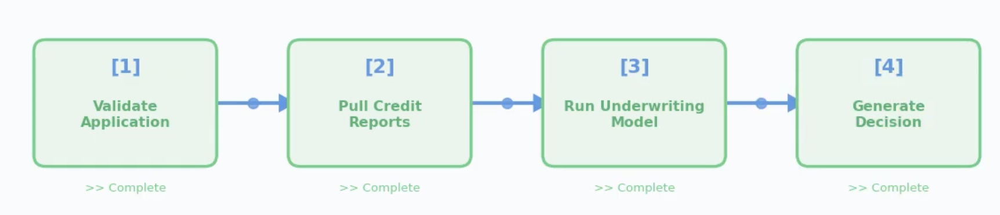


**Parallel Pattern - Insurance Claims**

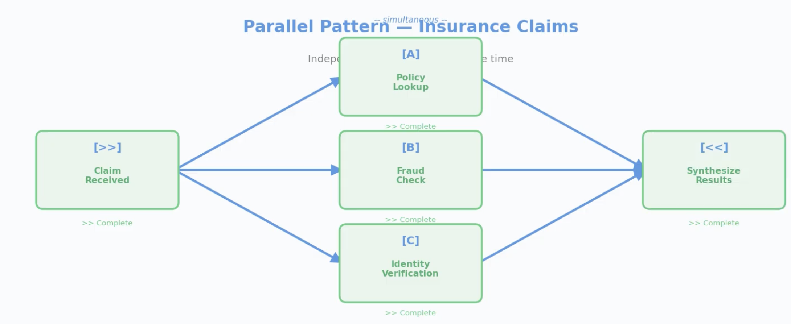


**Hierarchical Pattern — Quarterly Performance**

> Supervisor delegates to specialists, then synthesizes

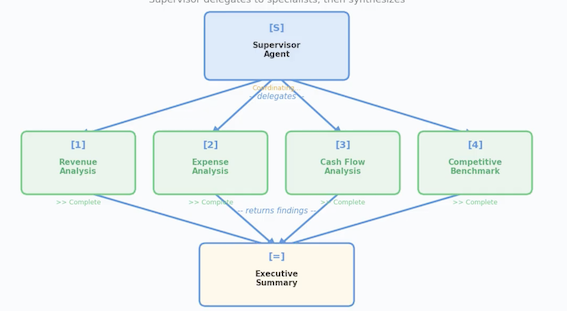

**Event-Driven Pattern — Inventory Reorder**

> Events cascade and agents react

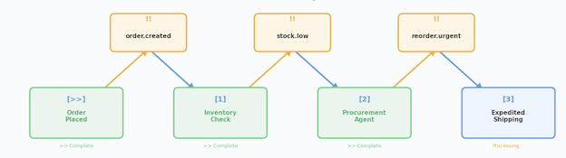


#### MULTI-AGENT SCENARIO: SUPPLY CHAIN REORDER

1. **Trigger** - Inventory drops below threshold (Dataverse event)
2. **Supervisor agent** receives alert, delegates three parallel tasks
3. **Demand agent** — forecasts 90-day demand from sales data
4. **Supplier agent** — checks lead times and pricing via MCP connector
5. **Budget agent** — verifies spending authority in ERP
6. Supervisor **synthesizes** results and recommends reorder quantity
7. If order exceeds $50K → **escalate to human buyer** for approval

> Exam Insight
>
> Exam Insight: Best answers combine patterns — hierarchical at top, parallel within, human-in-the-loop for risk.

#### AGENT-TO-AGENT COMMUNICATION


| Method | How It Works | Best For |
|--------|--------------|----------|
| **A2A protocol** | **Agents call each other directly through Foundry** | Fast hand-offs between co-located agents |
| **MCP-wrapped tools** | Agent B exposed as an MCP tool — Agent A calls it like any tool | Security, auditability, policy enforcement |
| **Shared Dataverse** | Agent A writes results; Agent B reads them | Async workflows, audit trail, simpler architecture |


#### GOVERNANCE & RELIABILITY PATTERNS


| Pattern | What It Does | Example |
|---------|--------------|---------|
| **Circuit breaker** | Stops sending requests to a failing agent | Supplier agent fails 5x → stop calling, use cached data |
| **Retry with backoff** | Retries transient failures with increasing delays | API timeout → retry at 1s, 2s, 4s |
| **Timeout** | Caps wait time per step | If demand forecast takes >30s, escalate |
| **Fallback** | Uses a backup if primary fails | Primary model unavailable → use simpler rule-based logic |
| **Observability** | Logs every handoff, monitors latency, alerts on anomalies | Copilot Analytics + Application Insights |


#### KEY TAKEAWAYS

- Five patterns: sequential, parallel, hierarchical, dynamic, event-driven — know the tradeoffs
- Real-world solutions combine patterns (hierarchical + parallel + human-in-the-loop)
- AZA for speed, MCP for security, Dataverse for async and audit
- Governance patterns (circuit breakers, timeouts, fallbacks) prevent cascading failure

### 4-3 Designing Agents in Copilot Studio

#### TOPICS, TOOLS & FLOWS

| Building Block | Role | Example |
|----------------|------|---------|
| Topics | What the agent understands — descriptions (generative) or trigger phrases (classic) + conversation flow | "Check order status" with input capture, tool call, response |
| Tools | Execute work — connectors, API calls, prompts, agent flows | Fetch order from Dynamics 365, send confirmation email |
| Flows | Orchestrate the sequence — branching, loops, error handling | Order found → show status; not found → escalate to human |

> Exam Insight
>
> Exam Insight: Topics handle intent, tools handle execution, flows hand! logic. Keep them separate for maintainability.

#### TOPIC ORCHESTRATION METHODS

| Method | How It Works | Best For |
|--------|--------------|----------|
| Classic NLU | Rule-based trigger phrases matched to topics | Simple, predictable intent matching with known phrases |
| CLU (Conversational Language Understanding) | ML model trained on labeled examples, recognizes intent + entities | Complex intent recognition across varied phrasing |
| Generative orchestration | LLM dynamically selects topics, tools, and knowledge based on context | Flexible, natural conversation where rigid matching fails |

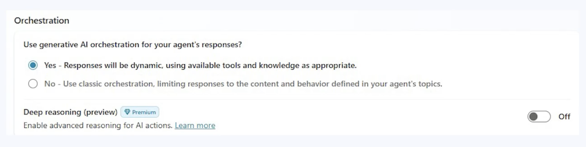

> Exam Insight
>
> Exam Insight: Generative orchestration is the default for new agents. It lets the LLM reason about which topic or tool to invoke based on descriptions, rather than relying on fixed trigger phrases.

#### PROMPT ACTIONS

**What**: An action where the LLM itself is the tool — no API, no connector


**How**: Define inputs → write a prompt template → define expected output shape


Shine when you need to **transform, summarize, classify, or generate** structured content from unstructured input

> Definition
>
> Definition: Prompt actions let you use the LLM itself as a tool — just a well-crafted prompt that transforms input into structured output.


#### PROMPT ACTION EXAMPLES


**Support ticket triage:**

"Given this support ticket: {ticket_text}, provide a one-sentence summary and classify severity as
Low, Medium, or High."

**Personalized recommendations:**

"Based on this purchase history: {history), recommend three products the customer is likely to buy next. Return as a numbered list with brief reasons."


> Fast to build, easy to iterate — you're editing a prompt, not writing code

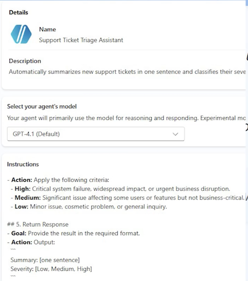

> Exam Insight
>
> Exam Insight: Match agent type to task complexity. The exam penalizes over-engineering (autonomous for simple Q&A) and under-engineerin (prompt & response for multi-step workflows).

#### DESIGN EXAMPLE: IT SUPPORT AGENT

1. **Topic** - "Password Reset" matched by description: "Handles password resets, account unlocks, and login recovery"
2. **Orchestration** — Generative orchestration selects the topic from context
3. **Tool 1** — Verify employee identity via Entra ID connector
4. **Tool 2** — Trigger password reset through Power Automate agent flow
5. **Guardrail** — If identity verification fails twice → escalate to help desk
6. **Response** — "Your password has been reset. Check your email for instructions."


**Agent type:** Task agent — it completes a defined workflow with tools and error handling.

#### KEY TAKEAWAYS

- Topics handle intent, tools handle execution, flows handle logic - keep them separate 
- Know the three orchestration methods: classic NLU, CLU, and generative orchestration
- Prompt actions turn the LLM itself into a tool — no API needed
- Three agent types: prompt & response, task, autonomous — match type to complexity


### 4-3 Copilot for Sales & Copilot for Service Design

#### COPILOT FOR SALES — WHAT IT DOES

| Capability | How It Works | Business Impact |
|------------|--------------|-----------------|
| **Lead & opportunity scoring** | Ranks leads using CRM data (engagement, deal stage) | Reps prioritize high-probability deals |
| **Meeting preparation** | Summarizes customer history, open issues, deal context | Prepared in 2 minutes, not 20 |
| **Email drafting** | Generates follow-ups grounded in deal details | 15-minute task becomes 2 minutes |
| **Win/loss analysis** | Identifies patterns across closed deals | Better coaching and forecasting |


> Exam Insight
>
>
> Exam Insight: Copilot for Sales spans D365, Outlook, and Teams — it bridges CRM and Microsoft 365.


#### COPILOT FOR SERVICE - WHAT IT DOES

**Dynamics 365  Customer Service   <——>   Dynamics 365 Contact Center**

| Capability | How It Works | Business Impact |
|------------|--------------|-----------------|
| **Case summarization** | Combines emails, calls, and chat into one summary | New reps pick up cases instantly |
| **Resolution suggestions** | Matches case to similar past cases and KB articles | Faster, more consistent resolution |
| **KB article authoring** | Drafts articles when reps solve novel issues | Captures knowledge automatically |
| **Intelligent routing** | Routes by issue type, urgency, and sentiment | Right agent first time |


Exam Insight: Copilot for Service integrates with D365 Contact Center - omnichannel routing across voice, chat, email, and social.

#### KEY BUSINESS TERMS FOR THE EXAM

- Pipeline — total value of open opportunities across all stages
- Opportunity - a qualified lead with defined revenue potential and stage
- Case — a customer issue tracked from creation to resolution
- SLA (Service Level Agreement) — contractual response/resolution time targets
- CSAT (Customer Satisfaction) — post-interaction satisfaction score
- First Contact Resolution (FCR) — percentage of cases resolved without escalation


**Definition**

Definition: The exam uses these terms in scenario questions. "A company's CSAT dropped 15% — which Copilot capability addresses this?" Answer: intelligent routing + resolution suggestions.


#### EXTENDING SALES & SERVICE COPILOTS


Exam Insight: Extend progressively: configure first → Copilot Studio for logic → connectors for data → Power Automate for cross-app flows.

| Extension Level | How | Sales Example | Service Example |
|-----------------|-----|---------------|-----------------|
| Configure | Settings & field mapping | Custom fields in meeting prep | VIP routing rules |
| Copilot Studio | Topics + tools | Credit check before qualification | Sentiment-triggered escalation |
| Connectors | External data | Enrich leads (D&B data) | Pull warranty from ERP |
| Power Automate | Cross-app flows | Deal approval workflow | SLA breach alerts |


#### DESIGN EXAMPLE: B2B SALES PIPELINE AGENT

1. **Trigger** — Opportunity moves to "Proposal Sent" stage in D365 Sales
2. **Copilot Studio topic** — "Proposal Follow-Up" activates
3. **Action 1** — Pull customer stakeholder map from Dataverse
4. **Action 2** — Enrich with latest engagement data from Outlook (via Sales connector)
5. **Prompt action** — "Summarize this stakeholder's concerns and draft a personalized follow-up"
6. **Guardrail** — If deal value >$500K, require manager review before sending
7. Result — Rep gets a ready-to-send follow-up in 2 minutes, manager reviews large deals

#### KEY TAKEAWAYS

- Copilot for Sales spans D365 + Outlook + Teams — it accelerates pipeline, prep, and follow-up
- Copilot for Service integrates with Contact Center for omnichannel case resolution
- Know the business terms: pipeline, opportunity, case, SLA, CSAT, FCR
- Extend progressively: configure → Copilot Studio → connectors → Power Automate

### 4-4 Copilot for Sales & Copilot for Service Design

#### FINANCE COPILOT CAPABILITIES

| Capability | What It Does | Design Consideration |
|------------|--------------|----------------------|
| **Invoice Matching** | 3-way match: invoice → PO → receipt | **Auto-approve exact; flag variances** |
| **Anomaly Detection** | Flags unusual amounts, duplicates | **Tune thresholds, manage false positives** |
| **Compliance & Fraud** | **Checks spending rules, vendor blacklists** | Audit trail + human review |
| **Accrual Recording** | Automates month-end accrual entries | Validate accuracy before posting |
| **Variance Analysis** | **Compares actuals to budget** | **Configurable tolerance thresholds** |

> Exam Insight: Finance scenarios test invoice matching + escalation design — know audit trails and approval thresholds.


#### SUPPLY CHAIN COPILOT CAPABILITIES

| Capability | What It Does | Design Consideration |
|------------|--------------|----------------------|
| **Stockout Prediction** | Forecasts shortfalls before they happen | Demand data quality, lead-time accuracy |
| **Quality Flagging** | Detects abnormal defect rates | Threshold config, supplier notification |
| **Logistics Optimization** | Consolidates shipments, optimizes routes | Cost vs. speed trade-offs |
| **Inventory Monitoring** | Tracks slow/fast-moving SKUs | Auto-reorder triggers, disposal alerts |

> Exam Insight
>
> Exam Insight: SCM agents are autonomous and event-driven — expect questions on confidence thresholds and escalation rules.

#### CROSS-MODULE ORCHESTRATION EXAMPLE

**Scenario: Customer reports a defective product**

1. **Service** — Copilot creates case, verifies warranty, determines replacement covered
2. Supply Chain — Agent checks nearest warehouse inventory, initiates shipment
3. Finance — Agent creates credit memo, schedules vendor chargeback
4. Service - Case updated with tracking number, customer notified proactively

**Key**: Dataverse is the shared backbone — every handoff is logged and auditable.


**Exam Insight**

> Exam Insight: Cross-module scenarios test governance at every handoff — audit trails, error handling, and human escalation.

#### AGENT CHAT & KNOWLEDGE SOURCES IN F&O

- F&O apps support **agent chat** — users ask questions about data directly in Finance or SCM
- Extend agents with **custom knowledge sources**: internal policies, compliance guides, SOPS
- **In-app** help can be grounded in custom KB articles for role-specific guidance
- Map knowledge sources to roles: AP clerk needs invoice policies, planner needs procurement rules


> Exam Insight: Know that F&O agent chat supports custom knowledge sources — the exam tests this as an extension point.

#### KEY TAKEAWAYS

- Finance Copilot automates invoice matching, anomaly detection, and compliance — w audit trails
- Supply Chain Copilot runs autonomously: stockout prediction, quality flagging, logistic optimization
- **Cross-module orchestration across D365 apps uses Dataverse as the shared backbone**
- F&O agent chat can be extended with custom knowledge sources for role-specific guidance

### 4-5 Microsoft 365 Copilot & Teams Agent Design

#### M365 COPILOT EXTENSIBILITY MODEL

| Extension Type | What It Does | Best For |
|----------------|--------------|----------|
| **Copilot Studio plugin** | Custom agent as plugin in Teams/Outlook | Multi-step workflows, external queries |
| **Declarative agent** | **Manifest-defined, no code, scoped instructions** | Focused Q&A, policy lookup |
| **Graph connector** | **Exposes external data through Microsoft Graph** | Non-M365 data in Copilot search |
| **Message extension*** | Card-based actions in Teams compose box | Quick lookups, approvals |


> Exam Insight: Simple Q&A → declarative agent.
>
> External data → Graph connector.
>
> Multi-step logic → Copilot Studio plugin.

##### DECLARATIVE AGENTS

> Manifest-defined — JSON file specifies instructions, knowledge sources, and capabilities

```
{
  "schema": "https://developer.microsoft.com/json-schemas/copilot/declarative-agent/v1.6/schema.json",
  "version": "v1.6",
  "name": "HR Policy Assistant",
  "description": "Answers employee questions about company HR policies, benefits, leave, and workplace guidelines",
  "instructions": "You are an HR policy assistant for Contoso Corporation. Answer questions about company policies",
  "conversation_starters": [
    {
      "title": "Leave Policy",
      "text": "How many vacation days do I accrue per year?"
    },
    {
      "title": "Benefits Enrollment",
      "text": "when is the next open enrollment period for health insurance?"
    },
    {
      "title": "Parental Leave",
      "text": "what is our parental leave policy?"
    },
    {
      "title": "401(k) Match",
      "text": "what is the company 401(k) match percentage?"
    }
  ],
  "capabilities": [
    {
      "name": "OneDriveAndSharePoint",
      "items_by_url": [
        {
          "url": "https://contoso.sharepoint.com/sites/HRPolicies"
        },
        {
          "url": "https://contoso.sharepoint.com/sites/Benefits/Documents"
        }
      ]
    },
    {
      "name": "GraphConnectors",
      "connections": [
        {
          "connection_id": "contosoHRIS"
        }
      ]
    }
  ]
}
```

#### DECLARATIVE AGENTS

- **Manifest-defined** — JSON file specifies instructions, knowledge sources, and capabilities
- **No custom code required** — configuration only, deployed through Teams admin
- **Scoped behavior** — agent only answers within its defined domain
- **Knowledge sources** — SharePoint sites, specific files, web URLs
- **Capabilities** — can enable/disable code interpreter, image generation, Graph skills

#### GRAPH CONNECTORS & EXTERNAL DATA

| Design Element | How It Works |
|----------------|--------------|
| **Connection** | Adapter maps external data (HRIS, contracts, wikis) into Microsoft Graph |
| **Schema** | You define properties, labels, and content fields for each item |
| **Item-level ACL** | Each item carries access control — Copilot only returns items the user can see |
| **Semantic labels** | Mark fields as title, body, or URL so Copilot understands structure |
| **Freshness** | Schedule crawls or push updates to keep data current |


> Exam Insight: Graph connectors must implement item-level access control. Without it, Copilot could surface confidential data to unauthorized users.

#### M365 AGENT SECURITY & GOVERNANCE

- **Sensitivity labels** — classify data as Public, Internal, Confidential, or Restricted
- **DLP policies** — prevent agents from surfacing restricted data
- **Conditional access** — enforce device, location, and compliance requirements
- **Audit logging** — every interaction logged: who asked, what was retrieved
- **Responsible Al** — test for hallucinations and bias before deployment

> Exam Insight: Governance depends on sensitivity labels + DLP. If data isn't classified, Copilot can't enforce access boundaries.

#### DESIGN EXAMPLE: HR AGENT IN TEAMS

| Step | What Happens |
|------|--------------|
| 1. **Graph connector** | Connect to HRIS with row-level security |
| 2. **Knowledge sources** | Index HR policy docs in SharePoint |
| 3. **Declarative agent** | Manifest scopes agent to HR domain |
| 4. Deploy to Teams | Employees ask questions in chat |

> Goal: Reduce repetitive HR queries (leave balance, benefits, policies)

### 4-6 Grounding, Knowledge Sources & Data Processing

#### WHAT IS GROUNDING & WHY IT MATTERS

- **Grounding** = anchoring responses in real company data, not general training knowledge
- **Without grounding**: agent guesses → hallucinations → lost trust
- <mark>**With grounding**: agent retrieves facts first, then generates → accurate, cited responses</mark>
- **RAG pattern:** Retrieve context → Augment the prompt → Generate grounded answer


#### KNOWLEDGE SOURCE OPTIONS

| Source | Best For | Governance |
|--------|----------|------------|
| **Dataverse** | Structured real-time queries (orders, balances) | Built-in RBAC |
| **SharePoint / OneDrive** | Documents, policies, compliance docs | Sensitivity labels, DLP |
| **Azure AI Search** | Large doc sets, semantic retrieval | Purview integration |
| **Microsoft Graph** | Cross-app M365 context (email, files) | M365 security stack |
| **Custom APIs / MCP** | Legacy systems, proprietary data | MCP for secure access |

 
> Exam Insight:

Structured real-time → Dataverse. 

Unstructured docs → Azure AI Search. 

M365 context → Graph. 

Legacy → MCP-wrapped APIs.


#### **COPILOT STUDIO KNOWLEDGE CONFIGURATION**

| Knowledge Type | Connects To | When to Use |
|----------------|-------------|-------------|
| **Public websites** | External URLs crawled and indexed | Product docs, FAQs |
| **SharePoint sites** | Specific sites or libraries | Internal policies, procedures |
| **Dataverse tables** | Structured records | Customer data, case history |
| **Uploaded files** | PDFs, Word, Excel | Small doc sets, prototyping |
| **Microsoft Graph** | User's M365 data | Personalized context |

Combine multiple types in one agent — the orchestrator searches all sources and returns the most relevant results.


#### DATA PROCESSING — CHUNKING, EMBEDDING & SEARCH

- **Chunking** — split documents into focused segments (paragraphs, sections) for precise retrieval
- **Embedding** — convert chunks into vectors; similar meaning = similar vectors
- **Hybrid search** — combine vector (semantic) + keyword (exact match) for best accuracy

Exam Insight

- Exam Insight: Vector search finds semantically similar content even when wording differs. 
- **Hybrid search (vector + keyword) gives the best accuracy**
- Azure AI Search provides this out of the box.

#### DATA PROCESSING — QUALITY, FRESHNESS & SCHEMA


**Data cleaning** — **remove duplicates, outdated versions before indexing;**

> garbage in = garbage out


**Freshness — schedule re-crawls or push updates;**

> stale data = wrong answers


**Schema design — apply semantic labels (title, body, URL) to help the model understand structure and produce citations**


> Exam Insight: Data quality and freshness are design decisions, not afterthoughts. An agent citing outdated policies is worse than no agent.

#### RAG ARCHITECTURE & VERIFICATION

Retrieval-Augmented Generation flow:

1. **Query** — user asks a question
2. **Retrieve** — search knowledge sources for top 3-5 relevant chunks
3. **Re-rank** - score by relevance and recency
4. **Augment** — inject context into prompt: "Answer based on this context only"
5. **Generate** — LLM produces a grounded response
6. **Cite** — attach source references (doc, section, page)
7. **Verify** - check: is the answer consistent with retrieved context?


> Citation and verification are required. Designs must include source attribution and confidence thresholds — low confidence should trigger escalation.


#### IT SUPPORT AGENT — EXAMPLE RESPONSE

"Your VPN drops when switching networks. Per Runbook IT-2024-VPN, section 3: reset your network adapter. Source: IT Runbook, updated March
2025."

**Key design points:**

- Every response cites a specific source document and section
- Confidence below 70% triggers escalation instead of guessing
- Fallback: "I can't find an answer — creating a ticket for you"

#### KEY TAKEAWAYS

- Grounding prevents hallucination — every agent must retrieve real data before generating answers
- Choose knowledge sources by data type: Dataverse for structured, Azure Al Search for documents, Graph for M365 context
- Data processing matters: chunk for precision, embed for semantic search, manage freshness so answers stay current
- RAG architecture must include citation and verification — if the agent isn't confident, escalate rather than guess

### 4-7 Extensibility: MCP, UI Automation and RPA & Agent Behaviors

#### MODEL CONTEXT PROTOCOL (MCP) OVERVIEW

**The problem:** agents calling APls directly → exposed keys, no audit trail, doesn't scale

**MCP adds a middleman** between agents and services:


- Agent asks MCP → MCP checks permissions, validates input, enforces rate limits
- MCP forwards to the actual service and logs the entire interaction

Three advantages:

- **Security** — agents never see API keys
- **Auditability** — every request logged with user context and timestamp
- **Interoperability** — shared tools across Copilot Studio, Foundry, and custom apps

#### MCP DESIGN GUIDANCE

- **Register tools** as MCP servers in Azure
- **Standardize tool schemas** so any agent can call them
- **Use context passing** with A2A to share session state during handoffs

Exam Insight

> When the exam says "securely integrate with a legacy system" or "ensure compliance with full traceability" — MCP is almost always the answer.

#### REST API TOOLS & SKILLS

**REST API tools** — define custom HTTP endpoints directly in the agent

- Provide an OpenAPI spec, configure auth, the agent calls it as a tool
- Simpler than MCP for single, straightforward integrations

**Skills** — prebuilt, reusable Al building blocks

- Entity extraction, document summarization, language translation
- Snap into any agent without building from

> Exam Insight
>
> Simple, direct API access for one agent? REST API tool. Secure, shared, auditable access across multiple agents? MCP.

#### UI AUTOMATION AND RPA IN COPILOT STUDIO

- Agents interact with Uls: click buttons, type text, read screens
- For **legacy system automation** where no API exists
- Currently in preview — expect exam questions on guardrails

**Guardrails:**

- **Whitelist allowed actions (specific buttons, fields)**
- Require user confirmation for sensitive operations
- Define safe action boundaries and timeouts


> Exam Insight
>
> MCP when APls exist. Ul Automation and RPA only when no API is available — always with whitelisted actions, user confirmation, and


#### AGENT BEHAVIORS IN COPILOT STUDIO


Beyond APIs and MCP — configure **how agents think and interact**

Four key behaviors tested on the exam:

- **Reasoning mode** — chain-of-thought for complex, multi-step problems
- **Voice mode** — spoken interaction via phone or Teams
- **Autonomous triggers** — event-driven actions without user prompt
- **Generative answers** — LLM fallback when no topic matches

Every behavior must be grounded in real data


#### AGENT BEHAVIORS — AUTONOMOUS TRIGGERS & GENERATIVE ANSWERS

- Example: supply chain agent detects stockout → auto-triggers reorder
- Requires **confidence thresholds and escalation rules**
- No human in the loop — guardrails are essential

Generative answers — LLM fallback when no topic matches


- Agent uses the language model to generate a response
- Must be grounded — configure which knowledge sources it can pull from
- Ungrounded generative answers = hallucinations

#### KEY TAKEAWAYS

- MCP enables secure, auditable tool access — agents never see API keys, every call is logged. REST API tools and Skills offer lighter-weight alternatives for simpler scenarios
- UI Automation and RPA automates legacy Uis when no API exists — always pair with whitelisted actions, user confirmation, and timeouts
- Agent behaviors (reasoning, voice, autonomous, generative) expand capabilities — all must be grounded in real data
- Exam decision rule: Simple API call → REST API tool. Shared/auditable access → MCP. No API → Ul Automation and RPA with guardrails. Complex logic → reasoning mode. Spoken interaction → voice mode

### 4-8 Will Architected for AI Solutions

#### responsible AI Will Architected

- Reliability
- Operational Excellence
- Performance Efficiency
- Cost Optimization
- Security

#### WHY WELL-ARCHITECTED MATTERS FOR AI

Power Platform WAF adapts **Azure WAF to agentic AI solutions**

Five pillars + Responsible AI = the complete design lens

The exam presents scenarios and asks: "Which pillar is most at risk?"

Strong answers apply multiple pillars — especially Security + Responsible Al together

> Exam Insight
>
> WAF questions are scenario-based.
>
> You'll see a design and choose which principle to prioritize.
>
> Expect Security, Responsible Al, and Reliability most often.

#### WAF PILLARS FOR AGENTIC Al


| Pillar | Key Al Considerations | Exam Clue |
|----------------|-------------|-------------|
| **Reliability** | Uptime, retry logic, fallback | "Agent fails intermittently" |
| **Security** | Data leakage, prompt injection, over-privileged agents | "Protect sensitive data" |
| **Cost Optimization** | Token spend, unnecessary model calls| "Reduce costs at scale" |
| **Operational Excellence** | Monitoring, alerting, CI/CD | "Track performance over time"|
| **Performance Efficiency** | Latency, throughput| "Agent too slow"|
| **Responsible AI** | Fairness, transparency, accountability, safety | "Avoid bias in decisions" |


#### RELIABILITY PATTERNS

- Retry with exponential backoff — 1s, 2s, 4s; don't hammer a struggling service
- Circuit breakers — stop calling failed services; switch to fallback (cached data, human escalation)
- Graceful degradation — use basic data when premium unavailable; keep the agent functional

> Exam Insight

> "Agent fails intermittently" → Reliability. Look for retry logic, fallback behavior, and graceful degradation in answer choices.

#### SECURITY PATTERNS

- **Least privilege** — agent sees only what the current user is authorized for
- **MCP wrapping** — agents never hold API keys directly
- **Prompt injection defense** — validate and sanitize inputs before processing

> Exam Insight
>
> Reliability + Security work together.
>
> Circuit breakers prevent cascading failures.
>
> MCP prevents credential exposure. Both must be in the design.

#### COST OPTIMIZATION


- **Model routing** — small, fast models for simple tasks; route complex queries to powerful models
- **Caching** — retrieve grounding data once, reuse across requests
- **Batch processing** — 1,000 items in one call, not 1,000 individual calls

> Exam Insight
>
> "Reduce costs at scale" → Cost Optimization. Look for model routing, caching, and batch processing in answer choices.

#### OPERATIONAL EXCELLENCE & PERFORMANCE

**Operational Excellence**:

- Dashboards: latency, error rate, escalation rate, token consumption
- Alerts when metrics spike; runbooks for common failures

**Performance Efficiency:**

- Parallel execution for independent steps
- Async notifications (don't block on email/SMS)
- Optimized retrieval: 3-5 relevant chunks, not 100

#### RESPONSIBLE AI — THE AI-SPECIFIC LAYER

- **Fairness** — audit models for bias by protected characteristics
- **Transparency** — explain decisions in plain language
- **Accountability** - log every decision; assign human owners for Al outcomes
- **Safety** — content filters + human review for high-stakes decisions

> Exam Insight
>
> Responsible Al is tested alongside other pillars. A loan system needs Security (protect credit data) AND Responsible Al (no bias). The best answer addresses both.

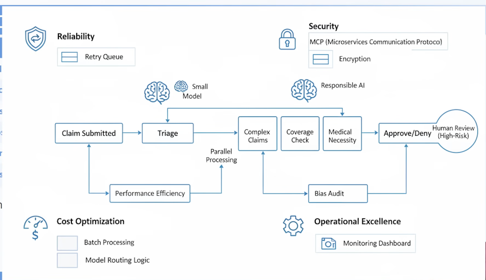

#### SCENARIO: HEALTH INSURANCE CLAIMS AGENT

**Reliability**: 

- Queue + retry if model down;
- auto-approve low-risk, escalate high-risk

**Security:** 

- Claims via MCP;
- PII encrypted;
- role-based patient access

**Cost:** 

- Batch hourly;
- cheap model for triage, expensive for complex

**Ops Excellence:** 

- Dashboard: claims/hour, error rate; 
- alert on escalation spikes

**Performance**: 

- Validation,
- coverage,
- necessity run in parallel

**Responsible Al:** 

- Monthly bias audit on denials;
- explanations + appeal instructions

This is what the exam expects: applying all six lenses to one design.


#### AI ACROSS POWER PLATFORM 

**Generative pages & agent feed (model-driven apps)**

- Al dynamically renders content — low-code or code-first (React / PCF)
- Agent feed surfaces Al activity in the app sidebar
- WAF: Performance Efficiency + Responsible Al (content must be grounded)

**Power Platform Al hub (admin dashboard)**

- Visibility into models, token consumption, and policy compliance
- WAF: Operational Excellence + Cost Optimization

Exam Insight

"Track Al usage across teams" → Al hub. "Custom Al in a model-driven app" → generative pages.

#### AI BUILDER & COPILOT CONTROL IN CANVAS APPS

**Al Builder components** — prebuilt Al for structured tasks:

- Text recognition, sentiment analysis, object detection, form processing
- Use when the task is repeatable and well-defined

Copilot control — embedded conversational Al in canvas apps

- Use when users need freeform, conversational help


WAF connections:

- Security — data processed by Al models must follow DLP policies
- Cost — Al Builder consumes credits; plan capacity and monitor usage via Al hub

#### KEY TAKEAWAYS

- Five pillars plus Responsible Al — address all six in every agentic design, not just the ones that seem most interesting
- Reliability and Security are the most critical for agents that call external services — circuit breakers and MCP are must-haves
- Cost Optimization matters at scale — use model routing, caching, and batch processing to control token spend
- Responsible Al is not a feature, it's a foundation — fairness, transparency, accountability, and safety apply to every agent that makes or influences decisions
- Generative pages, Al hub, and Al Builder in canvas apps all connect back to WAF design with performance, security, cost, and responsible Al in mind

### 4-9 Designing Custom Models in Microsoft Foundry

#### WHEN TO USE CUSTOM MODELS


> Exam Insight
>
> Exam Insight: The exam tests when custom models are justified versus when prebuilt models suffice.
>
> Start with prebuilt.
>
> Fine-tune for domain accuracy.
>
> Go fully custom only when the business case justifies the investment.

| Scenario | Recommended Approach | Rationale |
|----------------|-------------|-------------|
| **Standard Q&A, summarization** | Prebuilt model (GPT-40, etc.) | Fast, no training needed |
| **Domain-specific language (legal, medical)** | Fine-tuned model | Better accuracy on specialized terms |
| **Proprietary classification or prediction** | Custom-trained model | Unique to your data and business logic |
| **Cost-sensitive high-volume tasks** | Small language model (SLM) | Lower token cost, faster inference |


#### FOUNDRY MODEL CATALOG

- Model catalog: browse & deploy from Microsoft, OpenAl, Meta, Mistral, and others
- Match model to task requirements, latency, and budget

#### DEVELOPMENT TOOLS

| Tool | Purpose | Use When |
|----------------|-------------|-------------|
| Prompt Flow | Visual prompt prototyping & pipelines | Rapid experimentation |
| Evaluation | Test against labeled datasets | Measuring accuracy, latency, bias |
| Fine-tuning | Train base model on domain data | Domain-specific accuracy needed |
| Deployment | Managed endpoint with scaling & monitoring | Production readiness |


#### DESIGN WORKFLOW — DEFINE, PREPARE & FINE-TUNE

1. **Define the task** — classification, extraction, generation, or prediction
2. **Prepare training data** — labeled, high-quality, representative, bias-free
3. **Select base model** - match model size to task complexity from the catalog
4. **Fine-tune** — train on your domain data; Foundry manages compute
5. **Evaluate** — test against held-out data; measure accuracy, latency, bias
6. **Deploy** — publish as managed endpoint with auto-scaling and access controls
7. **Integrate** — connect to agents via MCP or Copilot Studio actions; add monitoring

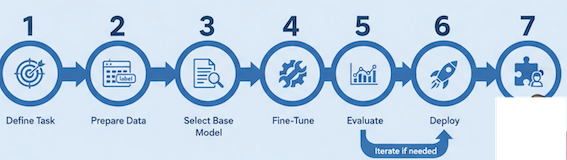

#### CONNECTING CUSTOM MODELS TO AGENTS

- **Copilot Studio**: Use custom model as an action (API call to Foundry endpoint)
- **Model routing**: Route simple requests to SLMs, complex to custom or large models
- **Multi-model pipelines**: Chain models — one extracts, another classifies, a third generates
- **Governance:** Version models, audit predictions, monitor drift over time

#### KEY TAKEAWAYS

- Use custom models only when prebuilt models can't meet domain, accuracy, or cost requirements — the exam rewards pragmatism
- Foundry provides end-to-end tools: model catalog, prompt flow, fine-tuning, evaluation, deployment, and monitoring
- Connect custom models to agents via MCP or Copilot Studio actions and use model routing for cost optimization
- Govern custom models with versioning, prediction auditing, and drift monitoring - production models degrade over time without oversight

## 2 Introduction to agentic AI business solutions

### AI Transformation Framework

- Define business goals
- Develop Al strategy
- Design architecture
- Implement solutions
- Monitor and optimize performance

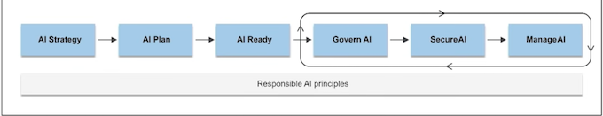

### Best Practices for Al Architects

- Start with business outcomes focusing on measurable impact.
- Adopt modular design for flexibility and scalability.
- Prioritize Responsible AI principles: fairness, transparency, accountability.
- Collaborate across teams: data scientists, developers, business leaders.
- Leverage Azure AI services for speed and reliability.

### Scaling Al Across the Enterprise

- **Automation** to streamline deployment and monitoring.
- **Standardization** using common frameworks and tools.
- **Continuous learning** enabling models to evolve with new data.
- **User training** to foster a culture of continuous learning.

### **Overview of Microsoft AI Technologies**

- Microsoft Al technologies empower organizations to build intelligent solutions
- Enhance productivity, improve decision-making, and deliver measurable business value
- Introduces key Azure Al services, development tools, and Copilot solutions
- Tools help businesses innovate, automate, and scale processes
- Support measurable outcomes and enhanced collaboration


### Core Components of Microsoft Al Technologies

- Azure Al Services: **Azure Machine Learning, Azure OpenAl Service, Azure Foundry**
- Tools and SDKs: **Azure Machine Learning Studio, SDKs, APIs, CLI, REST APIs**
- Microsoft Copilot Solutions: **Embedded Al in Microsoft 365 and Dynamics 365**
- Copilot automates tasks, generates content, and provides actionable insights
- Enhances productivity across business processes

### Phase-by-phase guidance


| Phase | Goals | Key activities | Outputs |
|-------|-------|----------------|---------|
| Azure AI Services | Provide AI capabilities via APIs and platforms | Develop, train, deploy AI models; access generative AI | Prebuilt APIs, ML models, generative AI services |
| Tools and SDKs | Enable AI integration and automation | Use SDKs, APIs, CLI, REST APIs for development and workflows | Visual interfaces, multi-language SDKs, automation tools |
| Copilot Solutions | Embed AI to enhance productivity | Automate tasks, generate content, provide insights | Improved business process efficiency and insights |

#### Microsoft Al Ecosystem


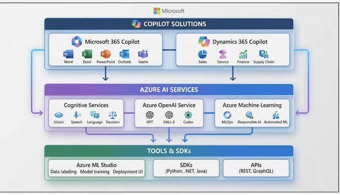

### Best Practices for Business Value

- Start with measurable business outcomes
- Implement Al responsibly: fairness, reliability, safety, privacy, security, inclusiveness, transparency, accountability
- Leverage cloud scalability for enterprise-wide adoption

### Identify Out-of-the-Box (OOB) Microsoft Al Agent & Resources

#### Overview

- Microsoft offers out-of-the-box Al agent resources to accelerate Al implementation.
- Resources include prebuilt agents, templates, and tools integrated vith Azure Al and Copilot Studio.
- These agents reduce development time, ensure compliance, and enable enterprise scalability.

#### Microsoft Al Agent Ecosystem

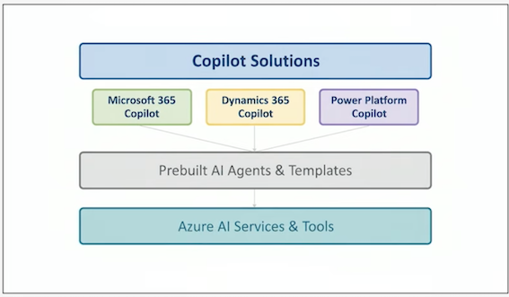

#### OOB Al Agent Resources

- Prebuilt Agents: Automate common business workflows
- Copilot Studio: Customize and deploy Al agents
- Azure Al Services: Vision, Speech, Language, Decision-making capabilities
- Scenario Library: Best practices and adoption guides

#### Best Practices

- Start with business outcomes before selecting tools
- Use prebuilt agents for quick deployment
- Ensure Responsible Al principles: Fairness, Reliability and Safety, Privacy and Security, Inclusiveness, Transparency, Accountability
- Leverage Azure Al for scalability and compliance

### Summary

#### Introduction to Agentic Al Business Solution Architecture

- Explain the architect's role in driving Al adoption and transformation.
- Identify key responsibilities of an Al architect in business contexts.
- Understand how architects align Al solutions with organizational goals.
- Apply best practices for scaling Al across enterprise environments.
- Identify core Microsoft Al services and tools.
- Explore Microsoft Copilot solutions and their business value.
- Understand how generative Al unlocks productivity in enterprise environments.
- Identify OOB Microsoft Al agent resources available for business solutions.


## 3 Analyze requirements for Al-powered business solutions

## 4 Design overall AI strategy for business solutions Part 1

## 5 Design overall AI strategy for business solutions Part 2

## 6 Evaluate costs and benefits of Al solutions

## 7 Design AI agents for business solutions Part 1

## 8 Design AI agents for business solutions Part 2


## 9 Design extensibility of Al solutions
## 10 Orchestrate configuration of prebuilt agents and apps
## 11 Monitor, analyze, and tune Al agents
## 12 Manage testing Al-powered business solutions
## 13 Design ALM process for Al-powered business solutions
## 14 Design responsible Al security, governance, risk management, and compliance
## 15 Course Closeout and next steps