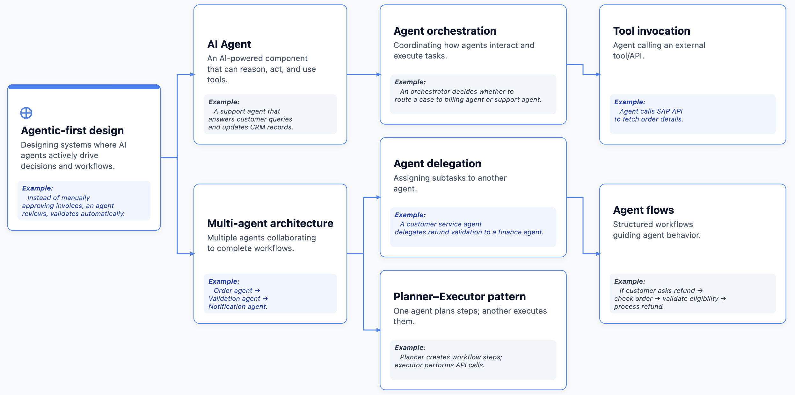
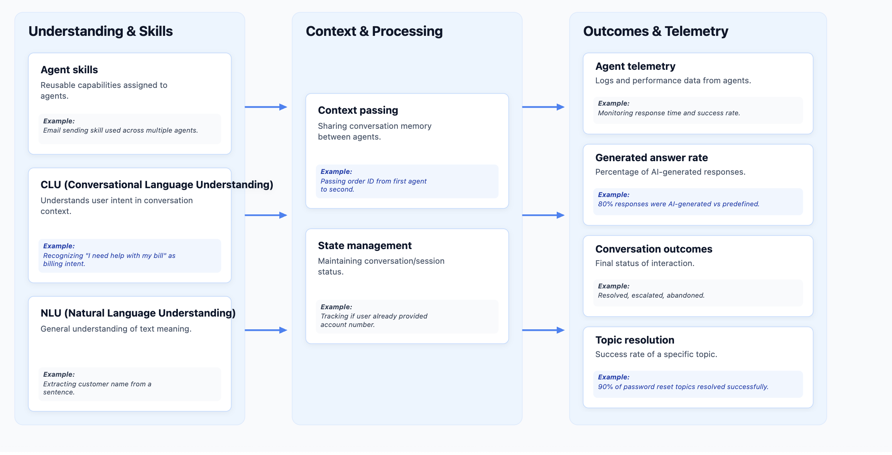
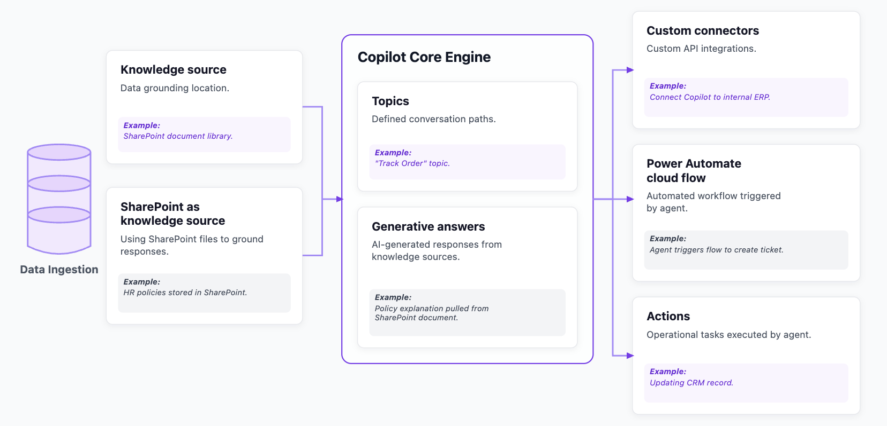
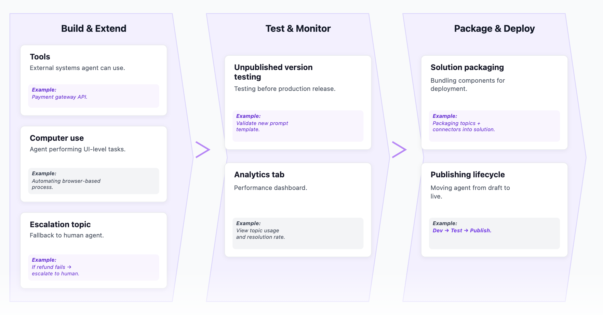
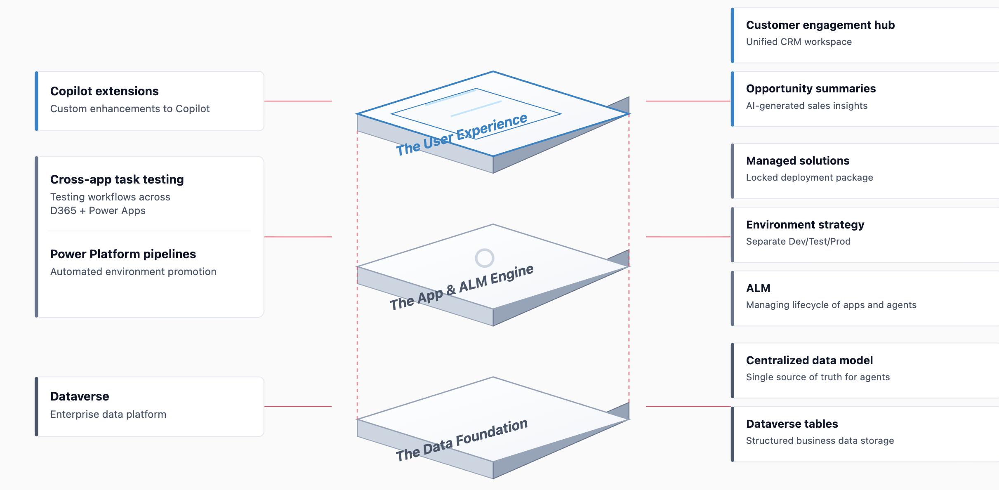
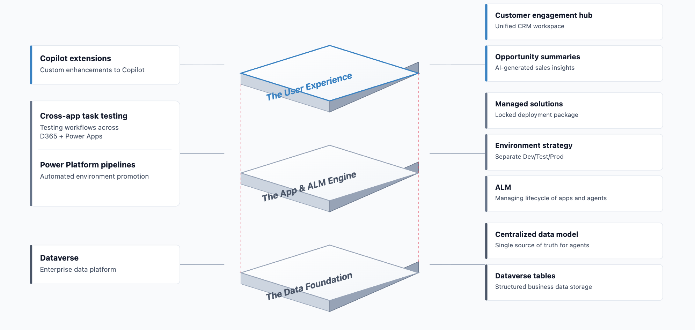
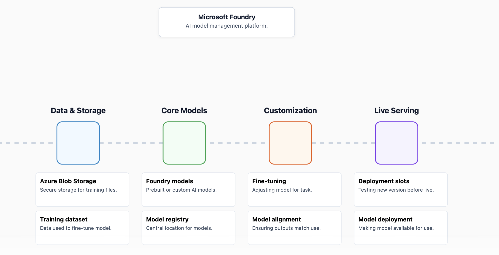

# 3 AB100 Agentic AI Architect Exam Prep

## Microsoft Agentic AI Architect Certification (Full Breakdown + Tips)


### Theme 1: Agentic AI Architecture

* Agent-first solution design
* Multi-agent orchestration
* Cross-platform AI solutions
* Copilot Studio agents
* Foundry tools usage


### Theme 2: Copilot & Dynamics 365

- Customizing Copilot behavior
- Opportunity summaries
- Copilot Studio analytics
- Agent configuration vs. extension


> Note: Heavily scenario-driven content.

### Theme 3: Governance & Responsibility


- Microsoft Purview
- RBAC
- Azure Policy
- Data Residency
- Audit Trails


### Theme 4: The Security Perimeter

* Azure Monitor
* Prompt Injection Prevention
* Grounding Data Protection
* AI Content Safety
* Defender

### Theme 5: ALM & Deployment Strategy

- Power Platform Solutions
- Pipelines
- Environment Strategy
- Quality Gates


### Theme 6: Measuring Business Value


Moving beyond technical implementation to business implemenation


###  Assessing Difficulty Levels

- Architect-level thinking requirked.
- Less coding, more design decisions.
- Prerequisite: Strong grasp of Dynamics 365, Power Platform, Azure AI.


### Preparation Protocol


Understand Agentic AI architecture -> Study Governance tools (RBAC, Purview, Policy) -> Master the "When to use what" logic. -> Mental Model: Select the BEST solution, not just a correct one.


### Final Deployment Tactics

**Keywords to Watch**

- Restrict access

- Monitor changes

- Compliance

- Fine-tuning

- Grounding data

**Execution**

- Read scenarios carefully.


- Caution on Yes/No hot spots.


- Manage time strictly.


- Good luck.


### Agentic AI & Architecture Terminology (Part 1)




| 模块名称 | 定义 (Definition) | 示例 (Example) |
| :--- | :--- | :--- |
| **Agentic-first design**<br>(Agent优先设计) | Designing systems where AI agents actively drive decisions and workflows.<br>(设计由AI Agent主动驱动决策和工作流的系统。) | *Example:* Instead of manually approving invoices, an agent reviews, validates, and routes them automatically.<br>(*示例：* 代替人工审批发票，由Agent自动进行审核、验证和分发。) |
| **AI Agent**<br>(AI智能体) | An AI-powered component that can reason, act, and use tools.<br>(一个具备推理、行动和工具使用能力的AI驱动组件。) | *Example:* A support agent that answers customer queries and updates CRM records.<br>(*示例：* 一个负责回答客户咨询并同步更新CRM记录的支持Agent。) |
| **Multi-agent architecture**<br>(多智能体架构) | Multiple agents collaborating to complete workflows.<br>(多个Agent协同配合以完成复杂工作流。) | *Example:* Order agent → Validation agent → Notification agent.<br>(*示例：* 订单Agent → 验证Agent → 通知Agent。) |
| **Agent orchestration**<br>(智能体编排) | Coordinating how agents interact and execute tasks.<br>(协调不同Agent之间的交互与任务执行方式。) | *Example:* An orchestrator decides whether to route a case to billing agent or support agent.<br>(*示例：* 编排器决定将案例路由给计费Agent还是支持Agent。) |
| **Agent delegation**<br>(智能体委派) | Assigning subtasks to another agent.<br>(将子任务分派给另一个特定的Agent。) | *Example:* A customer service agent delegates refund validation to a finance agent.<br>(*示例：* 客服Agent将退款验证工作委派给财务Agent。) |
| **Planner–Executor pattern**<br>(规划者-执行者模式) | One agent plans steps; another executes them.<br>(一个Agent负责规划步骤，另一个Agent负责具体执行。) | *Example:* Planner creates workflow steps; executor performs API calls.<br>(*示例：* 规划者创建工作流步骤，执行者负责调用API接口。) |
| **Tool invocation**<br>(工具调用) | Agent calling an external tool/API.<br>(Agent调用外部工具或API接口。) | *Example:* Agent calls SAP API to fetch order details.<br>(*示例：* Agent调用SAP的API来获取订单详情。) |
| **Agent flows**<br>(智能体工作流) | Structured workflows guiding agent behavior.<br>(引导Agent行为的结构化工作流。) | *Example:* If customer asks refund → check order → validate eligibility → process refund.<br>(*示例：* 客户请求退款 → 检查订单 → 验证资格 → 处理退款。) |


### Agentic AI & Architecture Terminology (Part 2)





| 分类板块 (Columns) | 专业术语 (Terminology) | 概念定义 (Definition) | 具体示例 (Example) |
| :--- | :--- | :--- | :--- |
| **Understanding & Skills**<br>(理解与技能) | **Agent skills**<br>(智能体技能) | Reusable capabilities assigned to agents.<br>(分配给智能体的可复用能力。) | *Example:* Email sending skill used across multiple agents.<br>(*示例：* 在多个智能体之间复用发送电子邮件的技能。) |
| | **CLU (Conversational Language Understanding)**<br>(对话语言理解) | Understands user intent in conversation context.<br>(理解对话上下文中的用户意图。) | *Example:* Recognizing "I need help with my bill" as billing intent.<br>(*示例：* 将“我需要查看我的账单”识别为账单查询意图。) |
| | **NLU (Natural Language Understanding)**<br>(自然语言理解) | General understanding of text meaning.<br>(对文本含义的通用理解。) | *Example:* Extracting customer name from a sentence.<br>(*示例：* 从句子中提取客户的姓名。) |
| **Context & Processing**<br>(上下文与处理) | **Context passing**<br>(上下文传递) | Sharing conversation memory between agents.<br>(在不同的智能体之间共享对话记忆。) | *Example:* Passing order ID from first agent to second.<br>(*示例：* 将订单ID从第一个智能体传递给第二个。) |
| | **State management**<br>(状态管理) | Maintaining conversation/session status.<br>(维护对话/会话的即时状态。) | *Example:* Tracking if user already provided account number.<br>(*示例：* 追踪并记录用户是否已经提供了账号。) |
| **Outcomes & Telemetry**<br>(结果与遥测) | **Agent telemetry**<br>(智能体数据遥测) | Logs and performance data from agents.<br>(来自智能体的运行日志和性能数据。) | *Example:* Monitoring response time and success rate.<br>(*示例：* 监控响应时间以及任务成功率。) |
| | **Generated answer rate**<br>(生成式回答比例) | Percentage of AI-generated responses.<br>(由AI自动生成的回答所占的百分比。) | *Example:* 80% responses were AI-generated vs predefined.<br>(*示例：* 80% 的回答为 AI 自动生成，其余为预设回答。) |
| | **Conversation outcomes**<br>(对话结果) | Final status of interaction.<br>(会话交互的最终状态。) | *Example:* Resolved, escalated, abandoned.<br>(*示例：* 已解决、已升级转人工、已放弃。) |
| | **Topic resolution**<br>(主题解决率) | Success rate of a specific topic.<br>(特定主题下的任务解决成功率。) | *Example:* 90% of password reset topics resolved successfully.<br>(*示例：* “密码重置”主题中 90% 的问题均被成功解决。) |


### Copilot Studio Terminology (Part 1)





| 架构层级 | 术语名称 (Terminology) | 术语定义 (Definition) | 具体示例 (Example) |
| :--- | :--- | :--- | :--- |
| **Data Ingestion**<br>(数据接入与知识源) | **Knowledge source**<br>(知识源) | Data grounding location.<br>(数据定位与检索的底层依据。) | *Example:* SharePoint document library.<br>(*示例：* SharePoint 文档库。) |
| | **SharePoint as knowledge source**<br>(SharePoint 作为知识源) | Using SharePoint files to ground responses.<br>(利用 SharePoint 文件作为回答问题的基础依据。) | *Example:* HR policies stored in SharePoint.<br>(*示例：* 存储在 SharePoint 中的人力资源政策文档。) |
| **Copilot Core Engine**<br>(核心引擎) | **Topics**<br>(主题/对话路径) | Defined conversation paths.<br>(预先定义好的对话或交互路径。) | *Example:* "Track Order" topic.<br>(*示例：* “追踪订单”主题。) |
| | **Generative answers**<br>(生成式回答) | AI-generated responses from knowledge sources.<br>(基于知识源自动分析并由 AI 生成的答复。) | *Example:* Policy explanation pulled from SharePoint document.<br>(*示例：* 从 SharePoint 文档中自动提取并生成的政策条款解读。) |
| **Output / Integrations**<br>(执行操作与外部接口) | **Custom connectors**<br>(自定义连接器) | Custom API integrations.<br>(自定义 API 外部接口集成。) | *Example:* Connect Copilot to internal ERP.<br>(*示例：* 将 Copilot 接入公司内部的 ERP 系统。) |
| | **Power Automate cloud flow**<br>(Power Automate 云端流) | Automated workflow triggered by agent.<br>(由智能体自动触发的自动化工作流流程。) | *Example:* Agent triggers flow to create ticket.<br>(*示例：* Agent自动触发流程去创建工单。) |
| | **Actions**<br>(操作/行动) | Operational tasks executed by agent.<br>(由智能体执行的具体业务操作任务。) | *Example:* Updating CRM record.<br>(*示例：* 更新 CRM 系统中的客户记录。) |


### Copilot Studio Terminology (Part 2)





| 业务环节 (Stages) | 核心概念 (Terminology) | 英文定义 (Definition) | 中文解析及示例 (Example) |
| :--- | :--- | :--- | :--- |
| **Build & Extend**<br>(构建与扩展) | **Tools**<br>(外部工具) | External systems agent can use.<br>(智能体可直接调用的外部系统。) | *Example:* Payment gateway API.<br>(*示例：* 支付网关服务 API。) |
| | **Computer use**<br>(计算机使用能力) | Agent performing UI-level tasks.<br>(智能体直接模拟人类在 UI 层面执行的操作。) | *Example:* Automating browser-based process.<br>(*示例：* 自动操作浏览器执行表单填写等任务。) |
| | **Escalation topic**<br>(转人工/升级策略) | Fallback to human agent.<br>(智能体无法处理时，后撤回滚至人工座席的策略。) | *Example:* If refund fails → escalate to human.<br>(*示例：* 若自动退款失败，自动转单给人工客服处理。) |
| **Test & Monitor**<br>(测试与监控) | **Unpublished version testing**<br>(未发布版本测试) | Testing before production release.<br>(在将智能体正式发布至生产环境前的沙盒测试。) | *Example:* Validate new prompt template.<br>(*示例：* 验证新的提示词/Prompt模板效果。) |
| | **Analytics tab**<br>(分析看板) | Performance dashboard.<br>(用于直观查看运行表现的数据仪表盘。) | *Example:* View topic usage and resolution rate.<br>(*示例：* 查看各个对话主题的使用频率和问题解决率。) |
| **Package & Deploy**<br>(打包与部署) | **Solution packaging**<br>(解决方案打包) | Bundling components for deployment.<br>(将各种组件（如主题、连接器等）打包成一个独立整体，方便分发和迁移。) | *Example:* Packaging topics + connectors into solution.<br>(*示例：* 将对话主题和自定义连接器打包至解决方案中。) |
| | **Publishing lifecycle**<br>(发布生命周期) | Moving agent from draft to live.<br>(将智能体从草稿阶段正式推向线上生产环境的完整流程。) | *Example:* Dev → Test → Publish.<br>(*示例：* 开发环境 → 测试环境 → 线上正式发布。) |


### Dynamics 365 & Power Platform




| 架构分层 | 对应术语 (Terminology) | 英文定义 (Definition) | 中文解析 (Translation/Explanation) |
| :--- | :--- | :--- | :--- |
| **The User Experience**<br>(用户体验层) | **Copilot extensions**<br>(Copilot 扩展) | Custom enhancements to Copilot. | 针对 Copilot 的自定义功能增强与扩展。 |
| | **Customer engagement hub**<br>(客户参与中心) | Unified CRM workspace. | 统一的客户关系管理 (CRM) 工作空间。 |
| | **Opportunity summaries**<br>(商机摘要) | AI-generated sales insights. | 由 AI 自动生成的销售洞察与数据分析。 |
| **The App & ALM Engine**<br>(应用与生命周期引擎层) | **Cross-app task testing**<br>(跨应用任务测试) | Testing workflows across D365 + Power Apps. | 在 Dynamics 365 和 Power Apps 之间进行的跨工作流验证。 |
| | **Power Platform pipelines**<br>(Power Platform 部署管道) | Automated environment promotion. | 实现不同环境间（开发/测试/生产）自动晋升部署的管道。 |
| | **Managed solutions**<br>(托管解决方案) | Locked deployment package. | 已锁定且不可直接修改的打包部署件。 |
| | **Environment strategy**<br>(环境策略) | Separate Dev/Test/Prod. | 划分独立的开发环境、测试环境以及生产环境的规划策略。 |
| | **ALM**<br>(应用生命周期管理) | Managing lifecycle of apps and agents. | 全生命周期管理低代码应用及智能体 (Agent) 的生成与演进。 |
| **The Data Foundation**<br>(数据基础层) | **Dataverse** | Enterprise data platform. | 微软官方提供的企业级统一数据底座与平台。 |
| | **Centralized data model**<br>(集中式数据模型) | Single source of truth for agents. | 充当智能体的“唯一可信数据源”。 |
| | **Dataverse tables**<br>(Dataverse 数据表) | Structured business data storage. | 存储业务数据的各类结构化关系型数据表。 |





| 架构层级 | 专业术语 (Terminology) | 英文定义 (Definition) | 中文原意解析 |
| :--- | :--- | :--- | :--- |
| **The User Experience**<br>(用户体验层) | **Copilot extensions**<br>(Copilot 扩展) | Custom enhancements to Copilot. | 用于为 Copilot 引入自定义功能和场景的扩展插件。 |
| | **Customer engagement hub**<br>(客户联合体验中心) | Unified CRM workspace. | 提供跨业务线一致协作的统一客户关系管理 (CRM) 工作空间。 |
| | **Opportunity summaries**<br>(商机摘要洞察) | AI-generated sales insights. | 利用生成式 AI 自动汇总的销售商机摘要与商业洞察。 |
| **The App & ALM Engine**<br>(应用与生命周期引擎) | **Cross-app task testing**<br>(跨应用自动化测试) | Testing workflows across D365 + Power Apps. | 跨 Dynamics 365 和 Power Apps 进行的自动化业务流任务校验。 |
| | **Power Platform pipelines**<br>(集成部署管道) | Automated environment promotion. | 实现各个阶段（开发、测试、生产）之间自动流转的持续部署通道。 |
| | **Managed solutions**<br>(托管解决方案) | Locked deployment package. | 处于受保护状态、防止在测试或生产环境中被随意篡改的部署包。 |
| | **Environment strategy**<br>(环境分发策略) | Separate Dev/Test/Prod. | 遵循行业最佳实践将开发、测试和生产进行物理隔离的安全策略。 |
| | **ALM**<br>(应用生命周期管理) | Managing lifecycle of apps and agents. | 贯穿应用程序和 AI 智能体 (Agent) 开发、集成到上线的整个生命周期。 |
| **The Data Foundation**<br>(数据底座层) | **Dataverse** | Enterprise data platform. | 微软低代码生态中的企业级关系型数据平台。 |
| | **Centralized data model**<br>(集中式数据模型) | Single source of truth for agents. | 作为统一的“可信数据源”，保证各个 AI 智能体的数据标准一致。 |
| | **Dataverse tables**<br>(Dataverse 数据表) | Structured business data storage. | 用于存储企业核心业务数据的结构化实体表。 |


### Microsoft Foundry & Models





| 阶段 (Stage) | 核心术语 (Terminology) | 英文定义 (Definition) | 中文解析 (Explanation) |
| :--- | :--- | :--- | :--- |
| **Data & Storage** | **Azure Blob Storage** | Secure storage for training files. | 用于存储训练数据文件的高度安全云存储。 |
| | **Training dataset** | Data used to fine-tune model. | 专门用于模型微调的基础训练数据集。 |
| **Core Models** | **Foundry models** | Prebuilt or custom AI models. | 平台预构建的或用户自定义的 AI 基础模型。 |
| | **Model registry** | Central location for models. | 用于统一存储、追踪所有可用模型的中央中心。 |
| | **Model versioning** | Tracking model updates. | 对模型迭代进行版本控制（如 v1.0, v1.1）。 |
| **Customization** | **Fine-tuning** | Adjusting model for task. | 通过特定数据对基础模型进行微调，以适应特定任务。 |
| | **Model alignment** | Ensuring outputs match use. | 确保模型输出内容符合预期的逻辑与道德基准。 |
| | **Domain-specific alignment** | Tailoring for specific sectors. | 针对医疗、金融等行业进行垂直领域专业化调整。 |
| **Live Serving** | **Deployment slots** | Testing version before live. | 在正式发布前，用于测试新版本模型的灰度部署插槽。 |
| | **Model deployment** | Making model available for use. | 将模型推向生产环境的 API 终点以供业务使用。 |


### 第一部分：Agentic AI 核心概念与架构设计 (Agentic AI Architecture)


#### 1. 智能体设计模式 (Agent Design Patterns)

*   **Agentic-first design (智能体优先设计)**：将 AI Agent 作为系统的核心驱动力，由其主动做出决策并调度工作流，而非仅作为被动调用的辅助工具。
    *   *考点*：传统工作流（手动审批）与 Agentic 工作流（Agent 自主审计、验证、路由）的区别。
*   **Single Agent (单智能体)** vs. **Multi-agent architecture (多智能体架构)**：
    *   **AI Agent**：具备推理（Reasoning）、行动（Acting）和工具调用（Tool Invocation）能力的独立组件。
    *   **Multi-agent**：多个专用 Agent 协同配合完成复杂任务（例如：订单 Agent $\rightarrow$ 验证 Agent $\rightarrow$ 通知 Agent）。
*   **Agent orchestration (智能体编排)**：编排器负责决策任务的路由分配（如：判断该将用户请求分配给“客服 Agent”还是“计费 Agent”）。
*   **Agent delegation (智能体委派)**：一个 Agent 将其子任务委派给另一个更专业的 Agent。
*   **Planner-Executor pattern (规划者-执行者模式)**：
    *   **Planner**：负责拆解复杂任务并规划执行步骤。
    *   **Executor**：负责调用 API 或工具具体执行每一步骤。

#### 2. 语言理解与状态管理 (Language, Context & State)

*   **CLU (对话语言理解)** vs. **NLU (自然语言理解)**：
    *   **CLU (Conversational Language Understanding)**：专注于**对话上下文**中的意图识别（Intent）和实体提取（Entities）（例如：将“我需要查看我的账单”识别为 `billing` 意图）。
    *   **NLU (Natural Language Understanding)**：更宽泛的自然语言文本含义理解（例如：从一段杂乱的文本中抽取人名或地址）。
*   **Context passing (上下文传递)**：在不同的 Agent 之间共享或传递对话记忆（Conversation Memory）（如：将第一阶段 Agent 收集到的 `Order ID` 传递给第二阶段的退款 Agent）。
*   **State management (状态管理)**：在多轮对话中持续维护会话状态或变量状态（Session Status）（如：记录用户在当前会话中是否已经提供了手机号）。


### 第二部分：Microsoft Copilot Studio 开发与可扩展性 (Copilot Studio & Extensibility)

本模块关注如何使用 Copilot Studio 快速构建、测试及扩展企业级 Copilot。

#### 1. 知识库集成 (Knowledge Grounding)

*   **Knowledge source (知识源/数据源)**：Copilot 用来进行 RAG（检索增强生成）和回答定位（Grounding）的数据存储位置。
*   **SharePoint as knowledge source**：微软生态中首选的文档知识源。Copilot 可以直接读取 SharePoint 文档库中的 Office 固件、PDF、HR 政策来直接生成回答。

#### 2. 核心交互机制 (Core Interacting)

*   **Topics (主题)**：预先定义的、结构化的对话分支或逻辑路径。
*   **Generative answers (生成式回答)**：当用户提出的问题没有命中预设的 Topics 时，系统利用大模型（LLM）结合绑定的知识源自动生成答复。

#### 3. 可扩展性与操作 (Extensibility & Actions)
*   **Custom connectors (自定义连接器)**：通过 Open API 标准封装的自定义接口，允许 Copilot 调用企业内部系统（如 ERP、CRM）的 API。
*   **Power Automate cloud flow (云端流集成)**：通过无代码/低代码工作流来执行后台自动化任务（如：创建工单、发送邮件、审批流）。
*   **Actions (操作)**：智能体可执行的具体业务操作（如：更新 CRM 记录、重置密码）。


### 第三部分：生命周期、测试与部署 (ALM, Testing & Deployment)

本模块考察应用生命周期管理（ALM）在 Copilot、Power Platform 和 Azure 上的落地。

#### 1. 测试与监控 (Testing & Monitoring)

*   **Unpublished version testing (未发布版本测试)**：在测试沙盒（Sandbox）中对未公开的版本进行 Prompt 调试和逻辑验证。
*   **Analytics tab (分析看板)**：通过性能仪表盘监控 Copilot 的使用情况（如：会话量、问题解决率 Resolution Rate、人工转接率 Escalation Rate）。
*   **Escalation topic (转人工主题)**：当 AI 无法解决问题（例如退款失败）时，自动触发回滚并转接给人工客服的兜底路径。

#### 2. 环境策略与 ALM (Environment Strategy & ALM)
*   **Environment strategy (环境策略)**：必须严格隔离**开发 (Dev) $\rightarrow$ 测试 (Test) $\rightarrow$ 生产 (Prod)** 环境。
*   **Power Platform pipelines (管道自动化)**：用于在不同 Power Platform 环境之间自动化迁移和晋升解决方案。
*   **Solution packaging (解决方案打包)**：将 Topics、Connectors、Flows 等所有组件打包在一起，便于统一分发。
    *   *考点*：**Managed solutions (托管解决方案)**（只读，部署到生产环境）与 **Unmanaged solutions (非托管解决方案)**（可编辑，用于开发环境）的区别。


### 第四部分：Microsoft Foundry 与大模型管理 (Foundry & Model Lifecycle)

本模块考察企业级大模型（Foundation Models）的管理、微调与托管部署。

#### 1. 模型资产管理 (Model Assets)

*   **Azure Blob Storage**：企业用于存储原始训练数据、微调数据或日志文件的安全云存储空间。
*   **Foundry models**：由微软或合作伙伴（如 OpenAI, Meta）提供的、开箱即用的预构建基础大模型。
*   **Model registry (模型注册表)**：集中管理、追踪和记录企业内部所有可用模型资产的中央仓库。
*   **Model versioning (模型版本控制)**：追踪模型的更新迭代版本（如：`v1.0` $\rightarrow$ `v1.1`）。

#### 2. 模型定制与部署 (Customization & Serving)

*   **Fine-tuning (微调)**：使用特定领域的训练集对基础模型进行参数调整，使其在特定任务上表现更专业。
*   **Model alignment (模型对齐)**：利用强化学习（如 RLHF）或系统提示词（System Prompts），确保模型的输出安全、符合人类道德、避免幻觉。
*   **Deployment slots (部署插槽)**：支持蓝绿部署或灰度测试，在将新模型完全推向生产环境前，先在备用插槽中进行验证。


### 第五部分：安全、治理与合规 (Governance, Security & Compliance)


本模块是任何 Azure 企业级 AI 考试的**高频重难点**，考察多层防御（Defense-in-Depth）安全架构。

```
                       [ 1. Outer Ring: Monitoring & Posture ]
                             - Defender for Cloud (态势)
                             - Azure Monitor (指标) / App Insights (Telemetry)
                                         ▼
                             [ 2. Middle Ring: Policy & Filters ]
                                   - Azure AI Content Safety (过滤)
                                   - Microsoft Purview (治理)
                                   - Data Residency (合规)
                                               ▼
                                   [ 3. Inner Core: Identity ]
                                         - Azure RBAC (授权)
                                         - Azure Policy (规则)
```

#### 1. 内环：身份与基础安全 (Identity & Foundation)


*   **Azure RBAC (基于角色的访问控制)**：控制**“谁”**（用户、服务主体）有权操作**“什么资源”**（如：只有 AI 开发者才能读取模型终点）。
*   **Azure Policy (安全策略)**：强制执行资源配置合规规则（如：禁止创建不带加密的存储账户、强制要求所有 AI 服务必须启用专用终点 Private Endpoint）。
*   **Access control (访问控制)**：最小特权原则，限制和阻断不必要的网络和实体访问。

#### 2. 中环：合规与内容过滤 (Policy & Filters)

*   **Azure AI Content Safety (内容安全)**：实时检测并阻断有害的**输入 (Prompt Injection/Jailbreak)** 和**输出 (Hate speech/Violence)**。
*   **Data residency (数据落地限制)**：确保数据处理和存储始终保留在合规和法律允许的指定地理区域（Geo-Region）内。
*   **Microsoft Purview (数据治理)**：对 AI 训练或使用的数据进行敏感度标记（Sensitivity Labels）、防泄露（DLP）以及全链路审计。

#### 3. 外环：监控与态势感知 (Monitoring & Posture)

*   **Defender for Cloud**：提供全局云安全态势管理 (CSPM)，主动扫描并发现 AI 应用架构中的漏洞和配置缺陷。
*   **Azure Monitor** & **Application Insights**：收集 AI 应用的日志、延迟、调用成功率和会话遥测数据，实现近乎实时的监控与告警。

-------


This video serves as **Module 0: Foundations** for the **AB-100 certification**, which prepares learners to become a *Microsoft Certified: Agentic AI Business Solutions Architect*. 

**Course Overview and Structure:**
* The training includes 9 modules, 42 hours of instruction, and 20 hours of hands-on assignments (2:05-3:41). 
* The curriculum is divided into three key domains: **Plan** (Modules 1-3), **Deploy** (Modules 4-6), and practical application (Modules 7-9) (2:50-3:38).

**Key Foundational Concepts:**
* **Agentic AI Evolution:** The video traces the history from rule-based bots to current autonomous agents that can plan, take action, use tools, and iterate to solve complex problems (4:00-6:10).
* **Core Building Blocks:** Six fundamental elements are identified: **LLMs** (reasoning), **Grounding** (data connection), **Orchestration** (workflow coordination), **Tools** (external integration), **Memory** (short and long-term), and **Human-in-the-loop** (oversight) (6:13-9:00).
* **Agent Taxonomy:** Microsoft classifies agents into three types: **Task agents** (well-defined, single functions), **Prompt agents** (LLM-driven, conversational), and **Autonomous agents** (proactive, multi-step workflows) (9:02-10:48).

**Microsoft AI Platform Ecosystem:**
* **Microsoft (Azure) AI Foundry:** The underlying infrastructure for professional-grade, enterprise-scale AI development (10:50-11:32, 14:00-15:40).
* **Power Platform AI:** Targeted at makers and business analysts, utilizing tools like *AI Builder*, *Power Automate*, and *Copilot Studio* (11:33-11:51, 15:42-17:01).
* **Copilot Experiences:** User-facing interfaces integrated into *M365*, *Dynamics 365*, and *GitHub* (11:52-12:12, 12:22-13:58).

**Exam Strategy & Tips:**
* The **AB-100 exam** is a 120-minute, scenario-based assessment focused on judgment, governance, and architecture (19:14-19:58).
* Key focus areas include understanding **managed vs. unmanaged solutions**, the **six principles of Responsible AI**, and licensing prerequisites (e.g., *M365 Copilot* requiring an *E3* or *E5* license) (19:59-22:23).

The session concludes with a knowledge check emphasizing that *Copilot Studio* is the primary low-code/no-code platform for building and deploying AI agents (23:10-23:59).