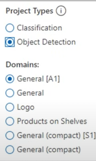

# Azure AI Engineer Associate Certification - AI102

## 1 AI VS GenAI

### 1-1 What is Artificial Intelligence (AI)?

AI is computer systems that perform tasks typically requiring human intelligence.

These include:

* problem-solving
* decision-making
* understanding natural language
* recognizing speech and images


> AI's goal is to **interpret, analyze, and respond to human actions**.
> 
> To simulate human intelligence in machines.

* **Simulate**: mimic aspects, resembles behaviour
* **Emulate**: replicates exact processes and mechanisms.

AI applications are vast and include areas like:

* expert systems
* natural language processing
* speech recognition
* robotics

**AI is used in various industries for tasks such as:**

* **B2C** : customer service chatbots
* **commerce**: recommendation systems
* **Auto**: autonomous vehicles
* **Medical**: medical diagnosis.

### 1-2 What is Generative AI?

Generative AI (GenAI) is a subset of AI that focuses on **creating new content or data** that is novel and realistic. 

It can interpret or analyze data but also **generates new data itself**.

**It includes generating text, images, music, speech, and other forms of media.**

It often involves advanced machine learning techniques:

* Generative Adversarial Networks (GANs)
* Variational Autoencoders (VAEs)
* Transformer models gGPT

**Generative AI has multiple modalities:**

* **Vision**: realistic images and videos
* **Text**: generating human-like text
* **Audio**: composing music
* **Molecular**: Drug discovery via genomic data

> Large Language Models (LLMs) which generate out human-like text is a subset of GenAI but is often conflating with being AI due to it being the most popular and developed.


### 1-3 Artificial Intelligence (AI)

**Functionality**: AI focuses on understanding and decision-making

**Data Handling** AI analyzes and makes decisions based on existing data

**Applications**: Spans across various sectors, including data analysis, automation, natural language processing, and healthcare

### 1-4 Generative AI

**Functionality** Generative AI is about creating new, original outputs.

**Data Handling** Generative AI uses existing data to generate new, unseen outputs. 

**Applications**: creative and innovative, focusing on content creation, synthetic data generation, deepfakes, and design


### 1-5 What is a Foundational Model?

A Foundational Model (FM) is a general purpose model that is trained on vast amounts of data.


We say that an FM is pretrained because it can be fined tuned for specific tasks.


> Ms are a specialized subset of FMs that uses transformer architecture.

## 2 What is a Large Language Model (LLM)?

A Large Language Model (LLM) is a Foundational Model **that implements the transformer architecture.**


During this training phase, the model learns semantics (patterns) of language, such as grammar, word usage, sentence structure, style and tone.


> It is simple to say that LLM just predicts the next sequences of words, but researchers don't know how LLMs generate their outputs.

### 2-1 Transformer Architecture

<mark>**Transformer Architecture** was developed by researchers at Google that is effective at **Natural Language Processing (NLP)** due to **multi-head attention** and **positional encoding**.</mark>


**1. Encoder: reads and understands the input text**. 

It's like a smart system that goes through everything it's been taught (which is a lot of text) and picks up on the meanings of words and how they're used in different contexts.

### 2-2 **Tokens and Capacity**

**When using transformers the decoder continuously feeds the sequence of tokens back** in as output to help predict the next word in the input.


**Memory**

* Each token in a sequence requires memory

* As the token count increases, the memory increases.
 
* The memory usage eventually becomes exhausted.

**Compute**

* model perform more operations for each additional token
* Longer sequences require more compute

> AI services that offer Models-as-a-Service will often have a limit of combined input and output.

### 2-3 What are Embeddings?

**What is a Vector?**

An arrow with a length and a direction

**What is a Vector Space Model?**

Represents text documents or other types of data as vectors in a High Dimensional space


**What are embeddings?**

They are vectors of data used by ML models to **find relationships between data.**

ML models can also create embeddings.

_**Different embedding algorithms capture different kinds of relationships.**_

> You can think of embeddings as external memory for performing a task for ML models.
> 
> 
> Embeddings can be shared across models (Multi-model pattern) to help coordinate a task between models.

### 2-4 Positional encoding 

**Positional encoding** is a technique used to preserve **order of words** when processing natural language.

Transformers need positional encoders because **they do not process data sequentially** and would lose order of understanding when analyze large bodies of text.


> Positional encoding adds a **positional vector** to each word to keep track of the positions of the words.

### 2-5 Attention 

**Attention** figures out how each word (or token) **in a sequence** is important to other words within that sequence **by assigning the words weights**.

#### **Self-Attention**

Computes attention weights within the same input sequence, where each element attends to all other elements.

> Used in transformers to model relationships in sequences (e.g., words in a sentence).

#### **Cross-Attention**

Computes attention weights between two different sequences. **allowing one sequence to attend to another sequence**.

> Used in tasks like translation where the output sequence (decoder) needs to focus on the input sequence (encoder).

#### **Multi-head Attention**

**Combines multiple self-attention (or cross-attention) heads in parallel, each focusing on different aspects of the input.**

> Used in transformers to improve performance and capture various dependencies simultaneously.

**Multi-headed** because it receiving multiple inputs

**Self-Attention** Self-attention because it feeds back its own sequence


**Multi-headed** because it receiving multiple inputs

**Cross-attention** because it feeds sequence inputs from two different sources

## 3 Supervised  vs Unsupervised vs Reinforcement

### 3-1 Supervised Learning (SL)

Data that has been labeled for training Task-driven - **make a prediction**

* **When the labels are known and you want a precise outcome.**
* When you need a specific value returned

**<mark>eg. Classification, Regression</mark>**

### 3-2 Unsupervised Learning (SL)

Data has not been labeled, the ML model needs to do its own labeling

**Data-driven - recognize a structure or pattern**

* **When the labels are not known and the outcome does not need to be precise.**
* When you're trying to make sense of data.

**<mark>eg. Clustering, Dimensionality Reduction, Association</mark>**

### 3-3 Reinforcement Learning (RI)

There is no data, there is an environment and an **ML model generates data any many attempt to reach a goal**

**Decisions-driven - Game AI, Learning Tasks, Robot Navigation**

### 3-4 Neural Networks and Deep Learning

**Activation Functions**

An algorithm applied to a hidden layer node that affects connected output e.g. ReLu

**Dense**

When the next layer increases the amount of nodes

**Sparse**

When the next layer decreases the amount of nodes

**What are Neural Networks? (NN)**

* Often described as **mimicking the brain**, a **neuron/node represents an algorithm**.
* Data is inputted into a neuron and based on the output the data will be passed to
* one of many other connected neurals.
* **The connection between neurons is weighted**.
* The network is organized in layers.
* **There will be a input layer, 1 to many hidden layers and an output layer.**


**What is Deep Learning?**

A neural network that has **3 or more hidden layers** is considered deep learning.

**What is Feed Forward? (FNN)**

Neural Networks where connections between nodes do not form a cycle (always move forward)

**What is Backpropagation (BP)?**

**Moves backwards through the neural network adjusting weights** to improve outcome on next iteration. This is how a neural net learns.

**Loss Function**

A function that compares the ground truth to the prediction to determine the error rate (how bad the network performed)


## 4 What is a GPU?

**A General Processing Unit (GPU)** that is specially designed to quickly render high-resolution images and video **concurrently**.

GPUs can perform **<mark>parallel operations on multiple sets of data</mark>**, and so they are commonly used for **non-graphical tasks such as machine learning** and scientific computation.

CPU can have **average 4 to 16 processor cores.**

GPU can thousands of processor cores 4 to 8 GPUs can provide as many as 40.000 cores

GPUs are best suited for repetitive and highly-parallel computing tasks:

* Rendering graphics
* Cryptocurrency mining


### 4-1 What is CUDA?

**What is NVIDA?**

NVIDA is a company that manufactures **graphical processing units (GPUs)** for gaming and professional markets


**What is CUDA?**

**Compute Unified Device Architecture (CUDA)** is a **parallel computing platform** and **API** by NVIDIA that allows developers to use **CUDA-enabled GPUs** for **general-purpose computing on GPUs (GPGPU)**

All major deep learning frameworks are integrated with **NVIDIA Deep Learning SDK**

The NVIDA Deep Learning SDK is a collection of NVIDIA libraries for deep learning.

One of those libraries is the **CUDA Deep Neural Network library (cuDNN)**

cuDNN provides highly tuned implementations for standard routines such as:

* forward and backward convolution
* Pooling
* Normalization
* activation layers

### 4-2 What is Jupyter Notebook?

**Jupyter Notebook**

A Web-based application for authoring documents that combine:

* live-code
* narrative text
* equations
* visualizations

iPython's notebook feature became Jupyter Notebook

Jupyter Notebooks were overhauled and better **integrated into an IDE called JupyterLab**


You generally want to open Notebooks in Labs

The legacy web-based interface is known as **Jupyter classic notebook**


### 4-3 What is JupyterLab?

**JupyterLab is a a next-generation web-based user interface**

All the familiar features of the classic Jupyter Notebook in a flexible and powerful user interface:

* notebook
* Terminal
* text editor
* file browser
* rich outputs

JupyterLab will ***eventually replace*** the classic Jupyter Notebook


## 5 Responsible AI

**Responsible AI focuses on ethical, transparent and accountable use of AI** technologies

Microsoft puts into practice Responsible AI via its six Microsoft AI principles


1. **Fairness** - AI systems should treat all people fairly
2. **Reliability and Safety** - AI systems should perform reliably and safely
3. **Privacy and Security** - AI systems should be secure and respect privacy
4. **Inclusiveness** - AI systems should empower everyone and engage people
5. **Transparency** - AI systems should be understandable
6. **Accountability** - People should be accountable for AI systems


### 5-1 Fairness

* **AI systems should treat all people fairly**
* AI systems can reinforce existing societal stereotypical
* **Bias can be introduced during the development of a pipeline**

**AI systems that are used to allocate or withhold:**

* opportunities
* resources
* Information

**In domains:**

* Criminal Justice
* Employment and Hiring
* Finance and Credit

eg. an ML model designed to select final applicants **for a hiring pipeline without incorporating any bias based on gender, ethnicity or may result in an unfair advantage**

***Azure ML can tell you how each feature can influence a model's prediction for bias***

**Fairlearn** is an open-source python project to help data scientist to improve fairness in their AI systems

### 5-2 Responsible AI - Reliability and safety

***AI systems should perform reliably and safely***

AI software must be rigorous tested to ensure they work as expected before release to the end user

If there are scenarios where AI is making mistakes its important to release a report **quantified risks and harms** to end-users so they are informed of the short-comings of an AI solution

AI where concern for reliability and safety for humans is critically important:

* Autonomous Vehicle
* AI health diagnosis, AI suggesting prescriptions
* Autonomous Weapon Systems

### 5-3 Responsible AI - Privacy and security

***AI systems should be secure and respect privacy***

AI can require vasts amounts of data to train Deep Learning ML models.

The nature of the ML model may require **personally identifiable information (PII)**

***It is important that we ensure protection of user data that it is not leaked or disclosed***


In some cases ML Models can be run locally on a user's device so their PII remains on their device avoiding that vulnerability

AI Security Principles to detect malicious actors:

* Data Origin and Lineage
* Data Use Internal vs External
* Data Corruption Considerations
* Anomaly detection

### 5-4 Responsible AI - Inclusiveness

**AI systems should empower everyone and engage people**

If we can design AI solutions for the minority of users 

Then we can design AI solutions for the majority of users

**Minority Groups**

* physical ability
* gender
* sexual orientation
* ethnicity
* other factors

### 5-5 Responsible AI - Transparency

**AI systems should be understandable**

Interpretability / Intelligibility is when end-users can understand the behaviour of the UI

Transparency of AI systems can result in

* Mitigating unfairness
* Help developers debug their AI systems
* **Gaining more trust from our users**

Those build AI systems should be:

* open about the why they are using AI
* open about the limitations of their AI systems

Adopting an open-source AI framework can provide transparency (at least from a technical perceptive) on the internal workings of an AI systems

### 5-6 Responsible AI - Accountability

**People should be accountable for AI systems**

**The structure put in place to consistently enacting AI principles and taking them into account**

AI systems should work within:

* framework of governance
* organizational principles

ethical and legal standards that are clearly defined

Principles guide Microsoft on how they **Develop, Sell and Advocate** when working with third-parties and this can push towards regulations towards Al Principles

## 6 Guidelines for Human-AI Interaction

Microsoft has a free web-app that goes through practical scenarios to teach Microsoft Al Principle


### 6-1 Responsible AI Standard V2

**The Microsoft Responsible AI Standard** is **playbook** that organizations can use to **implement responsibility controls** to ensure governance of the AI Responsibility


### 6-2 AI Transparency Report

**Responsible AI (RAI) Transparency Report** is a **PDF Report** that outlines the steps the Microsoft has taken to be responsible with AI technologies.

The report includes:

* How they build GenAl: Govern, Map, Measure, Manage
* AI Customer Commitments
* Governance of Responsible AI at Microsoft
* and more ...

> AI Transparency Report is not an industry wide report and its just something Microsoft made up.

## 7 Azure AI Services

**What is Azure AI Services?**

Azure AI Services is a consolidation of fully-managed, and serverless Azure
AI Services APIs.

When you create an Azure AI Service you don't need to create a resource for each targeted API. You use a **single key** for multiple endpoints.

You manage security, monitoring and automation from one interface.


### 7-1 Azure AI Services Containers

**Azure AI Services Containers** allow you to **deploy a subset of AI service APIs via a container**.

Containers can be deployed to:

* Local Docker servers for on-premise workloads
* Azure Container Instances (ACI)
* Azure Kubernetes Service (AKS)

Step 1: Download the container image from the **Microsoft Container Registry**,

Step 2: Deploy the container image to your chosen container host.

Step 3: Configure the container with necessary settings (API key, billing endpoint, EULA acceptance).


**Client Interaction**

* Client applications send data to the containerized service endpoint.
* The service processes the data and returns results to the client.

**Billing and Metrics**

* Usage metrics are periodically sent to Azure to calculate billing.
* Ensure the container can connect to the Azure AI services resource for this purpose.

### 7-2 Available Azure AI Services containers

**Language Containers**

* **Key Phrase Extraction**: mcr.microsoft.com/azure-cognitive-services/textanalytics/keyphrase
* **Sentiment Analysis**: mcr.microsoft.com/azure-cognitive-services/textanalytics/sentiment
* **Translator**: mcr.microsoft.com/product/azure-cognitive-services/translator/text-translation/about


**Speech Containers**

* **Speech to Text**: mcr.microsoft.com/product/azure-cognitive-services/speechservices/speech-to-text/about
* **Neural Text to Speech**: mcr.microsoft.com/product/azure-cognitive-services/speechservices/neural-text-to-speech/about

**Vision Containers**

* **Read OCR:** mcr.microsoft.com/product/azure-cognitive-services/vision/read/about
* **Spatial Analysis**: mcr.microsoft.com/product/azure-cognitive-services/vision/spatial-analysis/about

### 7-3 Configure Diagnostic Logging

**Enable Diagnostic Settings**

Configure diagnostic settings to send logs and metrics to various destinations like Log Analytics, Event Hubs, or Storage Accounts.


**Enable Diagnostic Settings**

* Configure diagnostic settings to send logs and metrics
* to various destinations like Log Analytics, Event Hubs, or Storage Accounts.

**Select Log Categories**

Choose specific log categories to capture, such as
requests, errors, and performance metrics.

**Define Retention Policy**

Specify how long the logs and metrics should be
retained.

### 7-4 View Diagnostic Logging

**Log Analytics**: Use Log Analytics to query and analyze logs. Create custom queries to filter and visualize data.


**Capturing Diagnostic Data**

* It may take up to an hour or more for diagnostic data to start flowing to your specified destinations.
* Once the data is captured, it can be analyzed using Azure Log Analytics.

**Accessing Log Data**

* Navigate to your Azure Log Analytics resource in the Azure portal.
* Use the query editor to run queries against your log data.

## Monitor an Azure AI Resource

### Azure Monitor

**Azure Monitor**

* Integrate with Azure Monitor to set up alerts based on specific log or metric conditions.
* Centralized platform for collecting, analyzing, and acting on telemetry from Azure AI resources.

**Azure Metrics**

* **Request Count**: Track the number of API requests to the service.
* **Latency**: Measure the time taken to process requests.
* **Error Rates**: Monitor the frequency of errors and failures.
* **Resource Utilization**: Keep an eye on CPU, memory, and other resource usage.

**Event Hubs**

Stream logs to Event Hubs for real-time analytics and integration with third-party monitoring tools.

### Monitor an Azure AI Resource

Azure provides alerting support for resources through the creation of alert rules.

These rules ensure the correct team is notified when an issue arises.

#### **Defining the Alert Rule**

**Scope**: Specify the resource you want to monitor.

**Condition**: Define the trigger based on a signal type:

* **Activity Log**: An entry in the activity log created by an action performed on the resource (e.g.,
regenerating subscription keys).
* **Metric**: A metric threshold (e.g., number of errors exceeding 10 in an hour).

**Optional Actions**: Configure actions such as sending an email to an administrator or running an Azure Logic App to address the issue automatically.


**Alert Rule Details**: Provide a name for the alert rule and select the resource group.

### Add metrics to a dashboard

**Dashboard Overview**

* Combine multiple visualizations from different resources.
* Gain an overall view of Azure resource health and performance.

**Steps to Create a Dashboard**

* Select **Dashboard** in the Azure portal menu.
* Add up to 100 named dashboards.
* Add a range of tiles and visualizations.
* Include charts from the **Metrics** page.

**Monitoring Dashboards**

* Customize dashboards to visualize key metrics and alerts.
* Use them for real-time monitoring and historical analysis.


## Azure AI Services vs Azure AI Studio

#### **Azure Open AI Services**

A resource that provides API access to allow you to
deploy and programmatically work with OpenAl LLM
models.

#### Azure AI Services

A collection of Azure AI Services APls intended to
be used programmatically via single API key.

#### Azure Open AI Studio

A GUI that provides an easy way to interact with
OpenAI Services API and Azure AI Services APIs

#### Azure AI Studio

A GUI that provides an easy way to interact with Azure AI Services, LLMs, Generative Images and more.

When you provision Azure AI Studio it will create
an Azure AI Service resource so it can programmatically interact with Azure API Services

* Similar to OpenAI Studio but: 
	* provides access to a wider range of IM models.
* allows you to scope workloads into projects.

### Azure OpenAI Service

**Azure OpenAI Service** is an API that allows you to deploy, use and manage multiple OpenAI's LLM models.

**The same python library** used to interact with
OpenAI's API allows also lets you interact via the
Azure OpenAI Service.

```
from openai import AzureOpenAI

endpoint = "https://###.openai.azure.com/'
deployment = "gpt-35-turbo'
api_key = "###"

client = AzureOpenAI(azure_endpoint=endpoint, api_key=api_key)

completion = client.chat.completions.create(
	model=deployment,
	messages=[
			{"roles":"system", "content": prompt_documenrt },
			{"roles":"user", "content": "Hello" },],
	max_tokens=800,
	temperature=0.7,
	temperature=0.7,
   top_p=0.95,
	...
)
```

In order to use an OpenAI LLM model you will need
to first deploy it within the Azure OpenAI Studio.

### Azure OpenAI Studio

Azure OpenAI Studio is a GUI for the Azure OpenAI Services

You can do the following in OpenAI Studio:

* View available models in the Model Catalog
* Use a Chat completion LLM Model
* Use a Completion model
* Generate images with Dalle
* Fine tune a select amount of models
* Upload data to be used for RAG


## Azure OpenAI Services - Models

### **Chat Completion Models**

**GPT-3.5-Turbo-0125**

* An earlv version of GPT 3.5, better than GPT3
* Turbo because its optimized for performance
* 16K Context

**GPT-3.5-Turbo-Instruct**

Fine-tuned to to accept and return step by step instructions  4K Context

**GPT4**

* Better than GPT 3.5
* 128K Context

**GPT4 Turbo**

Faster, more cost effective variant with less reasoning capabilities 128K Context

**GPT4 Turbo Vision**

* MultiModal (Text and images) variant
* 128K Context

**GPT4o (omni)**

MultiModal (Text and images) with improved reasons and understanding 128K Context

**GPT4o-mini**

MonoModal (Text) trained

### Completion Models

* Babbage-002
* Davinci-002

> These were the early models of OpenAI, in the GPT3 series

* Small, less complex very fast for low compute 4K Context
* Largest and most complex of the GPT3 series ~4K Context

**Embedding Models**

* Ada
* Text-embedding-3-small
* Text-embedding-3-large

* GPT3 Family (old)
* Less complex embedding
* More complex embedding

**Speech-to-Text Models**

Whisper

**Text-to-Speech Models**

* TTS
* TTS-HD

**Image Models**

* Dall-e-2
* Dall-e-3

**Fine-Tuning Models**

* Babbage-002
* Davinci-002
* GPT-3.5-Turbo-Instruct
* GPT4o-mini

### Azure OpenAl Services - Deployment Types


When you deploy a model you may have varying deployment type available.


## What is RAG?

#### **What is RAG?**

Retrieval-Augmented-Generation (RAG) is **access patterns for retrieving external data to inform an LLM agent** prior to providing a response to the user.

A common RAG pattern is representing information as vectors in a vector database and then
using a Search Engine to vectorize a search term to return relevant documents


* Returned information is directly inserted into the context windows of an LLM.
* A RAG access pattern doesn't require a vector database
	* What's important to remember is if you have to fetch external data, than you are utilizing a RAG.

### What is Document Cracking?

**What is Document Cracking?**

* Document cracking is the **process of opening files and extracting content**.
* It's an alternative (and cooler sounding) term for ***Document Extraction***.
* When we say document we are not limiting to just text, could also be images or video.


Various file mediums, and file formats the LLM can't understand


**Parsers** are used to convert data into a format the the LLM can understand.

### What is HNSW?

**Hierarchical Navigable Small World (HNSW)** is a **graph-based algorithm** that performs Approximate Nearest Neighbor searches (ANN) in vector databases

* Skip Link Lists (SLL) is a data structure that lets you jump to farther away nodes
* Navigable Small Word (NSW) is graph structure to relate similar nodes. 
* SLL + NWS = HNSW

**HNSW is an efficient algorithm for querying a vector database.**


### What is Semantic Ranking?

**Semantic Ranking** are algorithms used to **rerank search queries based on semantic understanding**,

Embeddings are algorithms that vectorize data, and embedding captures semantic understanding, so by using a Vector database ***you don't need a Semantic Reranker.***

Traditional engines use keyword search so they cannot ***contextually understand*** if the result they are returning are correct.

* Companies that want to use their traditional datastores instead of a vectorstore to search against for their
RAGS can get similar results that a vector store would provide.
* A Semantic Rerank can be combined with a vectorstore (which can vield better even better results)
	* Cohere's Reranker claims it works better without even a vectorstore


### Azure AI Search

**Azure AI Search** (formally Azure Cognitive Search) is a search engine for both traditional search and for RAG

> It combines a search engine with AI features to provide advanced search capabilities, ideal for
applications needing full-text search, vector similarity search, and hybrid search.

* The **Vectorstore** of the Azure AI Search **is the Index**
* The vectors aren't being stored in CosmosDB


Azure AI Search has some additional paid addons:

* Customized Entity Lookup Skill
* Document Cracking: Image Extraction

**Azure AI Search - Pricing**

If you want to use any add ons you have to **at least the Basic offering**:


### Azure AI Search - Components

Data source - data that will be indexed for retrieval:

* Unstructured Files in **Azure Blob Storage**.
* Tables in **Azure SQL Database**
* Documents in **Azure Cosmos DB**


**Index** - stores vector data, chunked data and reference to your data sources.

**Default fields:**

* **Key**: A unique identifier for each document in the index.
* **Searchable**: queried using full-text search.
* **Filterable**: used in filter expressions to return only documents that match specified criteria.
* **Sortable**: used to order the search results.
* **Facetable**: used to create facets, which are Ul elements that help filter results based on a list of known values.
* **Retrievable**: Fields included in the search results. By default, all fields are retrievable unless explicitly excluded


**Indexer** - A data crawler that extract data from the data source and populate the indexes

**Skillets** - Attached to indexers to process data extract from the data source

* Can create custom skills sets
* Often leverage Azure AI Services g. Translate text into different languages

## Natural Language Processing (NLP)

**Natural Language Processing** is Machine Learning technique that can **understand the context of a corpus (a body of related text).**

NLP enables you to:

* Analyze and interpret text within documents, email messages
* Interpret or contextualise spoken token e.g., sentiment analysis
* Synthesize speech e.g., a voice assistance talking to you
* Automatically translate spoken or written phrases and sentences between languages.
* Interpret spoken or written commands and determine appropriate actions.

**Cortana was a virtual assistant** developed by Microsoft which uses the Bing search engine to perform tasks such as setting reminders and answering questions for the user. (Retired in 2023)

> Microsoft AI Powered Assistants called Copilots is current Al agents.

### Natural Language Processing (NLP)

**Azure's LP Service Offering**

**Text Analytics**

* Sentiment analysis to find out what customers think
* Find topic-relevant phrases using key phrase extraction
* Identify the language of the text with language detection
* Detect and categorize entities in your text with named entity recognition

**Language Understanding (LUIS)**

Natural language processing service that enables you to understand human language in your own application, website, chatbot, loT device, and more

**Question Answering**

* **Custom Question Answering**: Allows for the creation of custom question-answering models from your content.
* **Prebuilt Question Answering**: Provides a prebuilt model that can answer questions from a set of documents.

**Speech**

Transcribe audible speech into readable, searchable text

### Computer Vision

Computer Vision is when we use Machine Learning Neural Networks to **gain high-level understanding from digital images or video**

**Computer Vision Deep Learning Algorithms:**

* **Convolutional neural network (CNN)** - image and video recognition
	* Inspired after how human eyes actually process information and send it back to brain to be processed
* **Recurrent neural network (RNN)** - handwriting recognition or speech recognition

### Types of Computer Vision

* **Image Classification** - look at an image or video and classify (place it in a category)
* **Object Detection** - identify objects within an image or video and apply labels and location boundaries
* **Semantic Segmentation** - identify segments or objects by drawing pixel mask (great for objects in movement)
* **Image Analysis** - analyze an and image or video to apply descriptive and context labels
	* e.g., An employee sitting at a desk in Tokyo
* **Optical Character Recognition** - Find text in images or videos and extract them into digital text for editing

### Computer Vision

**Azure's Computer Vision Service Offering**

**Azure AI Vision** analyze images and video, and extract descriptions, tags, objects, and text

**Azure AI Custom Vision** custom image classification and object detection models using your own images

**Optical Character Recognition (OCR)** uses the Read API to extract printed and handwritten text from various surfaces, supporting multiple languages.

**Image Analysis** extracts visual features from images, including objects, faces, adult content and auto-generated text descriptions.

**Face** detect and identify people and emotions in images.

**Video Analysis** includes Spatial Analysis for detecting movement and Video Retrieval
for creating searchable video indexes using natural language.


### Azure AI Vision Studio

**Azure AI Vision Image Studio** is a no-code/low-code playground to perform various ML Vision tasks.


> Azure AI Vision Studio using the various Azure AI APIs g. Computer Vision, Face, Image Analysis

### **Image Analysis SDK**

**Image Analysis SDK** can analyze various visual features in images, such as detecting adult content, identifying brands or objects, and recognizing human faces.

**Key Features**

* **Image Analysis 4.0 (Latest Version)**: Recommended for most use cases.
* **Image Analysis 3.2:** Offers a broader range of features. Use this if 4.0 doesn't support your needs.


**Image Analysis SDK will use a Computer Visions' resource endpoint**

```
client = ImageAnalysisClient(
	endpoint=endpoint,
	credential=AzureKeyCredential(key)
)

result = client.analyze_from_url(
	image_url="https://myimage.com/myimage.png",
	visual_features=[VisualFeatures.CAPTION, VisualFeatures.READ],
	gender_neutral_caption=True,  # Optional (default is False)
```

### Types of Image Analysis


* **Model Customization (v4.0)**: Create custom models for image classification or object detection.
* **Read Text from Images (v4.0 only)**: Extract text from images using OCR.
* **Detect People in Images (v4.0 only)**: Identify and locate people in images.
* **Generate Image Captions**: Create human-readable captions for images.
* **Detect Objects**: Identify objects and their locations in images.
* **Tag Visual Features**: Tag objects, scenery, and actions in images.
* **Get the Area of Interest / Smart Crop**: Identify the most important part of an image.
* **Detect Brands (v3.2 only)**: Identify commercial brands in images.
* **Categorize an Image (v3.2 only)**: Categorize images using a hierarchical taxonomy.
* **Detect Faces (v3.2 only)**: Detect faces and provide basic details.
* **Detect Image Types (v3.2 only**): Determine if an image is a line drawing, clip art, or photo.
* **Detect Domain-Specific Content (v3.2 only)**: Identify celebrities or landmarks in images.
* **Detect the Color Scheme (v3.2 only)**: Analyze color usage in images.
* **Moderate Content in Images (v3.2 only)**: Detect and classify adult content in images.
	
### Optical Character Recognition (OCR)

**Optical character recognition (OCR)** is the process of extracting printed or handwritten textinto a digital and editable format

OCR can be applied to:

* photos of street signs
* Products
* Documents
* Invoices
* Bills
* Financial Reports
* Articles
* and more


Azure has two different APIs that can perform OCR: **OCR API and Read API**


**OCR API**


* older recognition model
* supports only images
* executes synchronouslv
	* returning immediately with the detected text
	* Suited for less text
* Support more languages
* Easier to implement


**Read API**

* updated recognition model
* Supports images and PDFs
* Executes asynchronously
	* parallelizes tasks per line for faster results
	* Suited for lots of text
* Supports fewer languages
* A bit more difficult to implement


**OCR is performed via the Computer Vision SDK**

## Introduction to Custom Vision

Within Custom Vision you setup projects and **you need to select a Project Type**

**Classification**

* **Multi-label**
	* When we want to apply many tags to an image
	* Image contains both a Cat and a Dog

* **Multi-class**
	* when we only have one possible tag to apply to an image:
		* It is either a Apple, Banana, Orange

* **Object Detection**
	* When we to detect various objects in an image

You will need to also choose a **Domain**

A Domain is a Microsoft Managed dataset that is used for training the ML model、


### Custom Vision - Image Classification Domains

**Classification Domains**

* **General** Optimized for a broad range of image classification tasks. If none of the other specific domains are appropriate, or if you're unsure of which domain to choose, select one of the General domains.
* **General [A1]** Optimized for better accuracy with comparable inference time as General domain.
Recommended for larger datasets or more difficult user scenarios. This domain requires more training time.
* **General [A2]** Optimized for better accuracy with faster inference time than General[A1] and
General domains. Recommended for most datasets. This domain requires less training time than General and General [A1] domains.
* **Food** Optimized for photographs of dishes as you would see them on a restaurant menu. If you
want to classify photographs of individual fruits or vegetables, use the Food domain.
* **Landmarks** Optimized for recognizable landmarks, both natural and artificial. This domain works
best when the landmark is clearly visible in the photograph. This domain works even if the landmark is slightly obstructed by people in front of it.
* **Retail** Optimized for images that are found in a shopping catalog or shopping website. If you want high-precision classifying between dresses, pants, and shirts, use this domain.


###  Custom Vision - Object Detection Domains

**Object Detection Domains**

**General**

Optimized for a broad range of object detection tasks. If none of the other domains are appropriate, or you are unsure of which domain to choose, select the General domain.

**General [A1]**

* Optimized for better accuracy with comparable inference time as General domain.
* Recommended for more accurate region location needs, larger datasets, or more difficult user scenarios. 
* This domain requires more training time, and results are not deterministic:
	* expect a +-1% mean Average Precision (mAP) difference with the same training data provided.

**Logo**: Optimized for finding brand logos in images.

**Products on shelves**: Optimized for detecting and classifying products on shelves.



### Custom Vision - Object Detection

**For Object Detection** you apply tags to objects in an image for data labeling


### Custom Vision - Training

When you are ready to train you model you have two options:

* **Quick Training** - trains quickly but can be less accurate
* **Advanced Training** - increase the compute time to improve your results


With each iteration of training our ML model will improve the evaluation metrics **(precision and recall**) 

**The probability threshold value** determines when to stop training when our evaluation metrics meet our desired threshold


Once the **Classification** training job is complete we will get a report of the evaluation metrics **outcome**

**Precision**

* being exact and accurate
* select items that are relevant

**Recall (Sensitivity or True Positive Rate)**

* How many relevant items returned

**Average Precision (AP)**


### Custom Vision - Quick Test

Before deploying our final trained model that can be invoked via an API Endpoint 

It is good practice to test our ML model using the **Quick Test** feature

### Custom Vision - Publish

To deploy our ML model to be accessible using our API Key and Endpoint we need to trigger the **Publish** action.


###  ***Custom Vision - Smart Labeler***

When you have a very large dataset you can use Smart Labeler to predict labels.

Smart Labeler only works if you have trained the label


Smart labeler is when you want to increase your training set, and want to ML-assisted labeling to speed up this process.

## Azure Al Document Intelligence

**Azure Al Document Intelligence (formerly Form Recognizer)** is a **specialize OCR service** (translates printed text into digital and editable content) and **preserves that structure and relationship of form-like data**

**Document Intelligence can automate data entry in your applications** and **enrich your documents search capabilities**

It can identify:

* Key Value Pairs
* Selection Marks
* Table Structures

**Document Intelligence** outputs structures such as:

* Original file relationships
* Bounding boxes
* Confidence scores

**Azure Al Document Intelligence** is composed of

* Custom document processing models
* Prebuilt models for invoices, receipts, IDs, business cards


## Azure AI Content Safety

Azure AI Content Safety API detects harmful user.
generated and AI-generated content in apps and services.

It **includes text and image APIs** that allow you to detect material that is harmful.

**Regulatory Compliance:** Helps applications adhere to regulations and maintain a safe and appropriate user environment.

Use Cases


* Generative AI services
* Online marketplaces
* Gaming companies
* Social messaging platforms
* Enterprise media companies
* K-12 education solutions


### Image Moderation in Content Safety Studio

**Image Moderation** with Azure AI Content Safety Studio provides a streamlined way to ensure your images comply with your content standards.


**User-Friendly Interface:**

* Easily test images for content compliance.
* Evaluate results directly in the portal for immediate feedback.

**Customizable Sensitivity:**

* Adjust sensitivity levels to fine-tune content filters.
* Tailor settings to meet specific moderation needs.


**Streamlined Integration:**

* Export code to implement the image moderation tool in your application.
* Simplify your workflow and save time with easy integration.


### Azure AI Content Safety Studio

Azure AI Content Safety Studio is an is GUI for Azure AI Content Safety API.


* Handle offensive, risky, or undesirable content using advanced content moderation ML models.
* Provide templates and customized workflows to build your own content moderation system.


**Key Features**

* **Out-of-the-Box AI Models**: Includes pre-trained models and Microsoft's built-in blocklists for flagging profanities.

* **Custom Blocklists**: Allows users to upload their own blocklists for specific use cases.

* **Content Upload**: Users can upload their content or use provided sample content to test the system.

Three main features:

* Moderate Text Content
* Moderate Image Content
* Monitor Online Activity


## Monitor Online Activity

Monitor Online Activity provides a comprehensive overview of your content moderation performance, enabling you to track API usage and trends across different content types.


**Detailed Response Information:**

* Access detailed metrics such as category and severity distribution.
* Monitor latency, errors, and blocklist detections.

**Complete Performance Overview:**

Get a full picture of your content moderation performance.
Optimize your workflow based on detailed insights.

**User-Friendly Interface:**

* Easily navigate the monitoring page to access necessary information.
* Make informed decisions about your content moderation strategy.

**Performance Tracking Tools:**

* Track trends and usage across different modalities.
* Stay on top of your content moderation performance and achieve your content goals.

## Language Understanding Service (LUIS)

**Language Understanding (LUIS) is a no-code ML service to build natural language into apps**, bots, and IoT devices.

Quickly create enterprise-ready, custom models that continuously improve.

LUIS is accessed via its own isolate domain at luis.ai

LUIS utilizes Natural Language Processing (NLP) and **Natural Language Understanding (NLU)**

NLU is the ability to transform a linguistic statement to a representation that enables you to understand your users naturally


LUIS is intended to focus on **intention and extraction**:

* What the user wants
* What they are talking about

### A LUIS application is composed of a schema

This schema is autogenerated for you when you use the LUIS.ai web interface

The schema defines:

* **intentions** - what the user is asking for
	* a LUIS app always contains a None Intent
* **entities** - what parts of the intent is used to determine the answer
* **utterances** - Examples of user input that includes intent and entities to train the ML model to match predictions against real user input
	* An intent requires one or more example utterance for training
	* It is recommended to have 15-30 example utterances
	* To explicitly train to ignore an utterance use the None Intent

	
* Intents **classify** user utterances
* Entities **extract** data from utterance

> Example Utterance


## QA Maker Service

**QA Maker** is a **cloud-based Natural Language Processing (NLP) service** that allows you to c**reate a natural conversational layer over your data.**

QnAMaker is hosted on its own isolate domain at **www.gnamaker.ai**

It will find the most appropriate answer for any input from your **custom knowledge base (KB) of information**

Commonly used to build conversationalclient applications, which include:

* social media applications
* chat bots
* speech-enabled desktop applications

---

* QnA Maker doesn't store customer data
* All customer data is stored in the region the customer deploys the dependent service instances in

### QnA Maker Service - the Exan Use Cases

**When you have static information**

* Use QnA Maker when you have static information in your knowledge base of answers. 
* This knowledge base is custom to your needs, which you've built with documents such as PDFs and URLs.

**When you want to provide the same answer to a request, question, or command**

* when different users submit the same question, the same answer is returned.


**When you want to filter static information based on meta-information**

* add metadata tags to provide additional filtering options relevant to your client application's users and the information. 
* Common metadata information includes chit-chat, content type or format, content purpose, and content freshness.

**When you want to manage a bot conversation that includes static information**

* your knowledge base takes a user's conversational text or command and answers it. 
* If the answer is part of a pre-determined conversation flow, represented in your knowledge base with multi-turn context, the bot can easily provide this flow.

### QnA Maker Service - Knowledgebase

QnA Maker imports your content into a knowledge base of question and answer pairs.

QnA Maker can build you knowledge base from an **existing document, manual or website (URL, DOCX, PDF)**

It will use ML to extract the question and answer pairs.

The content of the question and answer pair includes:

* All the alternate forms of the question
* Metadata tags used to filter answer choices during the search
* Follow-up prompts to continue the search refinement

QnA Maker stores answer text as **markdown**

Once your Knowledge Base is imported you can **fine-tune the imported results by editing the Question and Answer pairs**

### QnA Maker Service - Chat box

* You converse with your bot through a Chat Box.
* There are many oppuritines to interact with your bot in QNAMaker.ai, Azure Bot Service, Bot Composer.


Via Channels you can even get embeddable chatbox code

### QnA Maker Service - Chit Chat

The chit-chat feature in QnA maker allows you to easily add a **pre-populated set of the top chit-chat**, into your knowledge base.

This dataset has about **100 scenarios** of chit-chat in the voice of multiple personas


### QnA Maker Service - Multi-turn conversation

**Multi-turn conversation** is **follow-up prompts** and context to manage the multiple

When a question **can't be answered in a single turn**

QA Maker provides multi-turn prompts and active learning to help you improve your basic question and answer pairs.

**Multi-turn prompts** give you the opportunity to connect question and answer pairs. This connection allows the client application to provide a top answer and provides more questions to refine the search for a final answer.

After the knowledge base receives questions from users at the published endpoint, QnA Maker applies **active learning** to these real-world questions to suggest changes to your knowledge base to improve the quality.

## Face Service

Azure Face service provides Al algorithms that **detect, recognize, and analyze human faces in images**

Azure Face can detect:

* faces in an image
* faces with specific attributes
* face landmarks
* similar faces
* the same face as a specific identity across a gallery of images


### Face Attributes

* Accessories. (Wearing accessories)
* Age
* Blur (blurriness of the face in the image)
* Emotion.
* Exposure
* Facial hair
* Gender
* Glasses
* Hair
* Head pose
* Makeup
* Mask. (are they wearing a mask?)
* Noise. The visual noise detected in the face image
* Occlusion. (objects blocking parts of the face)
* Smile