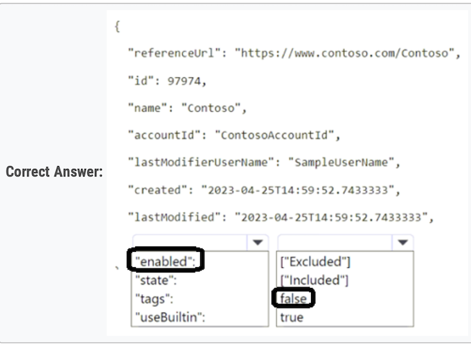

# AI-102 Designing and Implementing a Microsoft Azure AI Solution

## Topic 1

### Question #1

You have 100 chatbots that each has its own Language Understanding model.

Frequently, you must add the same phrases to each model.

**You need to programmatically update the Language Understanding models to include the new phrases.**

How should you complete the code? To answer, drag the appropriate values to the correct targets. 

Each value may be used once, more than once, or not at all.

You may need to drag the split bar between panes or scroll to view content.


**Box 1: AddPhraseListAsync -**

)

```
var phraselistId = await client.Features.AddPhraseListAsync(appId, versionId, new PhraselistCreateObject
{
	EnabledForAllModels = false,
	IsExchangeable = true,
	Name = "QuantityPhraselist",
    Phrase = "few,more,extra"
});
```

**Box 2: PhraselistCreateObject -**


1. AddPhraseListAsync
2. PhraselistCreateObject

### Question #2

You plan to use a Language Understanding application named app1 that is deployed to a container.

- App1 was developed by using a Language Understanding authoring resource named lu1.
- App1 has the versions shown in the following table.


**You need to create a container that uses the latest deployable version of app1.**

Which three actions should you perform in sequence? To answer, move the appropriate actions from the list of actions to the answer area and
arrange them in the correct order.


1. Step -1 --> Select v1.1 of app1.( We need to use latest version which can be trained or published)
2. Step 2 --> Export the model by using the Export for container (GZIP) option
3. Step -3--> Run the Container and mount the model file.


1. Select v1.1
2. Export as GZIP
3. Run and mount


### Question #3

You need to build a chatbot that meets the following requirements:

- ✑ Supports chit-chat, knowledge base, and multilingual models
- ✑ Performs sentiment analysis on user messages
- ✑ Selects the best language model automatically
  
What should you integrate into the chatbot?


- A. QnA Maker, Language Understanding, and Dispatch
- B. Translator, Speech, and Dispatch
- **C. Language Understanding, Text Analytics, and QnA Maker**  ✅
- D. Text Analytics, Translator, and Dispatch


**Language Understanding**: An AI service that allows users to interact with your applications, bots, and IoT devices by using natural language.

**QnA Maker** is a cloud-based Natural Language Processing (NLP) service that allows you to create a natural conversational layer over your
data.  It is used to find the most appropriate answer for any input from your custom knowledge base (KB) of information.

**Text Analytics:** Mine insights in unstructured text using natural language processing (NLP)ג€"no machine learning expertise required. 

Gain a deeper understanding of customer opinions with sentiment analysis. 

The Language Detection feature of the Azure Text Analytics REST API evaluates text input

**A. QnA Maker, Language Understanding, and Dispatch**

These tools together will support chit-chat, knowledge base queries, multilingual capabilities, sentiment analysis, and automatic selection of the
best language model.

- **Language Understanding**: An AI service that allows users to interact with your applications, bots, and IoT devices by using natural language.
- **QnA Maker is a cloud-based Natural Language Processing (NLP)** service that allows you to create a natural conversational layer over your data. It is used to find the most appropriate answer for any input from your custom knowledge base (KB) of information.
- **Text Analytics**: Mine insights in unstructured text using natural language processing (NLP)"no machine learning expertise required.
	- Gain a deeper understanding of customer opinions with sentiment analysis. The Language Detection feature of the Azure Text Analytics REST API evaluates text input

Incorrect Answers:

A, B, D: Dispatch uses sample utterances for each of your bot's different tasks (LUIS, QnA Maker, or custom), and builds a model that can be
used to properly route your user's request to the right task, even across multiple bots.


### Question #4

Your company wants to **reduce how long it takes for employees to log receipts in expense reports**. All the receipts are in English.

You need to extract top-level information from the receipts, such as the vendor and the transaction total. The solution must minimize development effort.

Which Azure service should you use?

- A. Custom Vision
- B. Personalizer
- **C. Form Recognizer** ✅
- D. Computer Vision


**Correct Answer: C**

Azure Form Recognizer is a cognitive service that lets you build automated data processing software using machine learning technology.
Identify and extract text, key/value pairs, selection marks, tables, and structure from your documentsג€"the service outputs structured data
that includes the relationships in the original file, bounding boxes, confidence and more.

###  Question #5

You need to create a new resource that will be used to perform sentiment analysis and optical character recognition (OCR). The solution must
meet the following requirements:


- ✑ Use a single key and endpoint to access multiple services.
- ✑ Consolidate billing for future services that you might use.
- ✑ Support the use of Computer Vision in the future

**How should you complete the HTTP request to create the new resource?** To answer, select the appropriate options in the answer area.
NOTE: Each correct selection is worth one point.


**Box 1: PUT -**

Sample Request: 

PUT https://management.azure.com/subscriptions/00000000-0000-0000-0000-000000000000/resourceGroups/test-rg/providers/
Microsoft.DeviceUpdate/accounts/contoso?api-version=2020-03-01-preview

Incorrect Answers:

**PATCH is for updates.**

**Box 2: CognitiveServices -**

Microsoft Azure Cognitive Services provide us to use its pre-trained models for various Business Problems related to Machine Learning.

List of Different Services are:

- ✑ Decision
- ✑ Language (includes sentiment analysis)
- ✑ Speech
- ✑ Vision (includes OCR)
- ✑ Web Search


PUT: 

- puts a file or resource at a specific URI, and exactly at that URI.
- If there's already a file or resource at that URI, PUT replaces that file or resource.
- If there is no file or resource there, PUT creates one.

**POST: POST sends data to a specific URI and expects the resource at that URI to handle the request.**

### Question #6

You are developing a new sales system that will process the video and text from a public-facing website.

**You plan to monitor the sales system to ensure that it provides equitable results regardless of the user's location or background.**

Which two responsible AI principles provide guidance to meet the monitoring requirements? Each correct answer presents part of the solution.

NOTE: Each correct selection is worth one point.


- A. transparency
- **B. fairness**  ✅
- **C. inclusiveness**  ✅
- D. reliability and safety
- E. privacy and security


Correct Answer: BC

- AI systems should treat all people fairly.
- AI systems should perform reliably and safely.


**Fairness** is a core ethical principle that all humans aim to understand and apply. This principle is even more important when AI systems are being
developed. Key checks and balances need to make sure that the system's decisions don't discriminate or run a gender, race, sexual orientation, or
religion bias toward a group or individual.


**Inclusiveness** mandates that AI should consider all human races and experiences, and inclusive design practices can help developers to understand
and address potential barriers that could unintentionally exclude people. Where possible, speech-to-text, text-to-speech, and visual recognition
technology should be used to empower people with hearing, visual, and other impairments.


### Question #7

You plan to use containerized versions of the Anomaly Detector API on local devices for testing and in on-premises datacenters.

You need to ensure that the containerized deployments meet the following requirements:

- ✑ Prevent billing and API information from being stored in the command-line histories of the devices that run the container.
- ✑ Control access to the container images by using Azure role-based access control (Azure RBAC).


Which four actions should you perform in sequence? To answer, move the appropriate actions from the list of actions to the answer area and
arrange them in the correct order.


1. Create a custom docker file
2. Pull the container image (in the dockerfile)
3. Build the image
4. Push to ACR


### Question #8

You plan to deploy a containerized version of an Azure Cognitive Services service that will be used for text analysis.

You configure **https://contoso.cognitiveservices.azure.com** as the endpoint URI for the service, and you pull the latest version of the Text Analytics Sentiment Analysis container.

You need to run the container on an Azure virtual machine by using Docker.

How should you complete the command? To answer, select the appropriate options in the answer area.

NOTE: Each correct selection is worth one point.


```
Box 1: mcr.microsoft.com/azure-cognitive-services/textanalytics/sentiment

To run the Sentiment Analysis v3 container, execute the following docker run command. 

docker run --rm -it -p 5000:5000 --memory 8g --cpus \ 
	mcr.microsoft.com/azure-cognitive-services/textanalytics/sentiment \
	Eula=accept \
	Billing={ENDPOINT_URI} \
	ApiKey={API_KEY} 

is the endpoint for accessing the Text Analytics API. https://<your-custom-subdomain>.cognitiveservices.azure.com


Box 2: https://contoso.cognitiveservices.azure.com

{ENDPOINT_URI} is the endpoint for accessing the Text Analytics API: https://<your-custom-subdomain>.cognitiveservices.a The endpoint for
accessing the Text
```


### Question #9

You have the following C# method for creating Azure Cognitive Services resources programmatically.


You need to call the method to create a free Azure resource in the West US Azure region. The resource will be used to generate captions of images automatically.

Which code should you use?

```
A. create_resource(client, "res", "ComputerVision", "FO", "westus")
B. create_resource(client, "res1", "CustomVision Prediction", "FO", "westus")
C. create_resource(client, "res1", "ComputerVision", "SO", "westus")
D. create_resource(client, "res1", "CustomVision.Prediction", "SO", "westus")
```


**A, as there is free tier available for Computer Vision service.**

- Free - Web/Container
- 20 per minute
- 5,000 free transactions per month

The ComputerVision resource is more commonly used because it comes with pre-built capabilities for image analysis, including caption generation, without the need to train a custom model. 

On the other hand, the CustomVision.Prediction you must be specifically trained to support generating captions


### Question #10

You successfully run the following HTTP request.

```
POST https://management.azure.com/subscriptions/18c51a87-3a69-47a8-aedc-a54745f708a1/resourceGroups/RG1/providers/
Microsoft.CognitiveServices/accounts/contoso1/regenerateKey?api-version=2017-04-18
Body{"keyName": "Key2"}
```


What is the result of the request?


- A. A key for Azure Cognitive Services was generated in Azure Key Vault.
- B. A new query key was generated.
- C. The primary subscription key and the secondary subscription key were rotated.
- **D. The secondary subscription key was reset**.   ✅

This response is indicated by the "keyName": "Key2" in the request body, specifying that the secondary subscription key (Key2) should be regenerated.

> B is wrong. Query key is for search service. The Rest request of create query key is like POST

The request is to the Azure Management API to regenerate a key for an Azure Cognitive Services account (contoso1). The body of the request
specifies {"keyName": "Key2"}, which indicates that the operation is targeted at the secondary subscription key (commonly referred to as Key2 in Azure Cognitive Services management). The regenerateKey action causes the specified key to be reset, generating a new key value for it while invalidating the old one.

### Question #11

You build a custom Form Recognizer model.

You receive sample files to use for training the model as shown in the following table


Which three files can you use to train the model? Each correct answer presents a complete solution. NOTE: Each correct selection is worth one point


- **A. File1**

- B. File2

- **C. File3**

- D. File4

- E. File5

- **F. File6**


**ACF**


Form Recognizer works on input documents that meet these requirements:

Format must be JPG, PNG, PDF (text or scanned), or TIFF. Text-embedded PDFs are best because there's no possibility of error in character extraction and location.

**File size must be less than 50 MB.**


**File 2 and 5 are excluded.**

New service limits now goes up to 500MB so...

File 1, 3, and 6 are correct for "training the model", however if MSFT remove the word "training" from the question - be careful.

For custom model training the total size is still 50MB. Answer is correct

A. File1 (PDF)

C. File3 (JPG)

F. File6 (JPG)


### Question #12

A customer uses Azure Cognitive Search.

The customer plans to enable a server-side encryption and use customer-managed keys (CMK) stored in Azure. What are three implications of the planned change? Each correct answer presents a complete solution.

NOTE: Each correct selection is worth one point


- **A. The index size will increase.**

- **B. Query times will increase**.

- C. A self-signed X.509 certificate is required.

- D. The index size will decrease.

- E. Query times will decrease.

- **F. Azure Key Vault is required**.


**Should be ABF (use AKV for customer managed key)**


"Customer-managed keys require an additional billable service, Azure Key Vault, which can be in a different region, but under the same subscription, as Azure Cognitive Search. Enabling CMK encryption will increase index size and degrade query performance."

A. **The index size will increase. Enabling CMK encryption increases the index size1**.

B. Query times will increase. Enabling CMK encryption degrades query performance. **You can expect to see an increase of 30-60 percent in query times1**.

F. Azure Key Vault is required. CMK encryption depends on Azure Key Vault. You can create your own encryption keys and store them in a key vault, or you can use Azure Key Vault APIs to generate encryption keys1


### Question #13

You are developing a new sales system that will process the video and text from a public-facing website. You plan to notify users that their data has been processed by the sales system.

Which responsible AI principle does this help meet?

- **A. transparency**

- B. fairness

- C. inclusiveness

- D. reliability and safety

The correct answer is A, transparency: "When an AI application relies on personal data, such as a facial recognition system that takes images of people to recognize them; you should make it clear to the user how their data is used and retained, and who has access to it."


- "Transparency: AI systems should be understandable."


- "Reliability and safety: AI systems should perform reliably and safely."

### Question #14


Note: This question is part of a series of questions that present the same scenario. Each question in the series contains a unique solution that might meet the stated goals. Some question sets might have more than one correct solution, while others might not have a correct solution.

After you answer a question in this section, you will NOT be able to return to it. As a result, these questions will not appear in the review screen.

You create a web app named app1 that runs on an Azure virtual machine named vm1. Vm1 is on an Azure virtual network named vnet1. You plan to create a new Azure Cognitive Search service named service1.

You need to ensure that app1 can connect directly to service1 without routing traffic over the public internet.

**Solution: You deploy service1 and a public endpoint to a new virtual network, and you configure Azure Private Link.**

Does this meet the goal?


- A. Yes

- **B. No**

**The Azure Private Link should use a private endpoint, not a public endpoint.**

**Private Link service can be accessed from approved private endpoints in any public region.**


Answer is no. **you should create a private link with private endpoint**


### Question #15

You create a web app named app1 that runs on an Azure virtual machine named vm1. Vm1 is on an Azure virtual network named vnet1. You plan to create a new Azure Cognitive Search service named service1.

You need to ensure that app1 can connect directly to service1 without routing traffic over the public internet.

Solution: **You deploy service1 and a public endpoint, and you configure an IP firewall rule.**

Does this meet the goal?


- A. Yes

- **B. No**
  
**Instead deploy service1 and a private (not public) endpoint to a new virtual network, and you configure Azure Private Link.**

The answer is B because the traffic should not be routed over internet. 

"By default, Azure AI Search is configured to allow connections over a public endpoint. Access to a search service through the public endpoint is protected by authentication and authorization protocols, but the endpoint itself is open to the internet at the network layer for data plane requests."


### Question #16

You create a web app named app1 that runs on an Azure virtual machine named vm1. Vm1 is on an Azure virtual network named vnet1. You plan to create a new Azure Cognitive Search service named service1.

You need to ensure that app1 can connect directly to service1 without routing traffic over the public internet.

**Solution: You deploy service1 and a public endpoint, and you configure a network security group (NSG) for vnet1.**

Does this meet the goal?


- A. Yes

- **B. No**

Instead deploy service1 and a private (not public) endpoint to a new virtual network, and you configure Azure Private Link.

###  Question #17

You plan to perform predictive maintenance.


You collect IoT sensor data from 100 industrial machines for a year. Each machine has 50 different sensors that generate data at one-minute intervals. In total, you have 5,000 time series datasets.

You need to identify unusual values in each time series to help predict machinery failures.

Which Azure service should you use?

- **A. Anomaly Detector**

- B. Cognitive Search

- C. Form Recognizer

- D. Custom Vision

A is the answer.

**Anomaly Detector is an AI service with a set of APIs, which enables you to monitor and detect anomalies in your time series data with little machine learning (ML) knowledge, either batch validation or real-time inference**.

**A. Azure AI Anomaly Detector**

### Question #18

You are developing a streaming Speech to Text solution that will use the Speech SDK and MP3 encoding. You need to develop a method to convert speech to text for streaming MP3 data.

How should you complete the code? To answer, select the appropriate options in the answer area. NOTE: Each correct selection is worth one point.


1. AudioStreamFormat.GetCompressedFormat.

2. SpeechRecognizer


### Question #19


You are developing an internet-based training solution for remote learners.

Your company identifies that during the training, some learners leave their desk for long periods or become distracted.


You need to use a video and audio feed from each learner's computer to detect whether the learner is present and paying attention. The solution must minimize development effort and identify each learner.

Which Azure Cognitive Services service should you use for each requirement? To answer, select the appropriate options in the answer area. NOTE: Each correct selection is worth one point.


1. Face
2. Face
3. Speech

- From Video feed - Face 
- Facial Expression from - Face 
- Audio Feed is - Speech


### Question #20

You plan to provision a QnA Maker service in a new resource group named RG1.

In RG1, you create an App Service plan named AP1.

Which two Azure resources are automatically created in RG1 when you provision the QnA Maker service? Each correct answer presents part of the solution.

NOTE: Each correct selection is worth one point.


- A. Language Understanding

- B. Azure SQL Database

- C. Azure Storage

- **D. Azure Cognitive Search**

- **E. Azure App Service**

"When you create a QnAMaker resource, you host the data in your own Azure subscription. Azure Search is used to index your data." & "When you create a QnAMaker resource, you host the runtime in your own Azure subscription. App Service is the compute engine that runs the QnA Maker queries for you."


### Question #21

You are building a language model by using a Language Understanding (classic) service. 

You create a new Language Understanding (classic) resource.

You need to add more contributors

What should you use?

- A. a conditional access policy in Azure Active Directory (Azure AD)

- **B. the Access control (IAM) page for the authoring resources in the Azure portal**

- C. the Access control (IAM) page for the prediction resources in the Azure portal

B is the answer.

In the Azure portal, find your Language Understanding (LUIS) authoring resource. It has the type LUIS.Authoring. In the resource's Access Control (IAM) page, add the role of contributor for the user that you want to contribute.

### Question #22

You have an Azure Cognitive Search service.

During the past 12 months, query volume steadily increased.

You discover that some search query requests to the Cognitive Search service are being throttled.

You need to reduce the likelihood that search query requests are throttled.

**Solution: You migrate to a Cognitive Search service that uses a higher tier.**

Does this meet the goal?

- A. Yes

- **B. No**

**Using a higher tier does not imply scaling replicas or partitions.**


### Question #23

You need to develop an automated call handling system that can respond to callers in their own language. The system will support only French and English.

Which Azure Cognitive Services service should you use to meet each requirement? To answer, drag the appropriate services to the correct requirements. Each service may be used once, more than once, or not at all. You may need to drag the split bat between panes or scroll to view content.


1. **Speech to Text**
2. **Text to Speech**

---
- Speech to Text with AutoDetectSourceLanguageConfig. It can't be Text Analytics because the input is callers' voice.
- Text to Speech: the output is voice.


### Question #24

You have receipts that are accessible from a URL.

You need to extract data from the receipts by using Form Recognizer and the SDK. The solution must use a prebuilt model. Which client and method should you use?

- A. the FormRecognizerClient client and the StartRecognizeContentFromUri method

- B. the FormTrainingClient client and the StartRecognizeContentFromUri method

- **C. the FormRecognizerClient client and the StartRecognizeReceiptsFromUri method**

- D. the FormTrainingClient client and the StartRecognizeReceiptsFromUri method


**Should be C**

```
private static async Task AnalyzeReceipt(
	FormRecognizerClient recognizerClient, string receiptUri)
	RecognizedFormCollection receipts = await recognizerClient.StartRecognizeReceiptsFromUri(new Uri(receiptUrl)).WaitForCompletionAsync();
)
```

Option A: **The StartRecognizeContentFromUri method is used to extract layout information such as tables, lines, words, and selection marks. It’ not specifically designed for receipts**.

Option B: **The FormTrainingClient is used to train custom models, not to extract data from documents using prebuilt models**. Also, the StartRecognizeContentFromUri method, as mentioned above, is not specifically designed for receipts.

Option D: Similar to option B, the FormTrainingClient is not suitable for this scenario as it’s used for training custom models. The StartRecognizeReceiptsFromUri method would be correct if used with FormRecognizerClient.


### Question #25

You have a collection of 50,000 scanned documents that contain text.

You plan to make the text available through Azure Cognitive Search.

**You need to configure an enrichment pipeline to perform optical character recognition (OCR) and text analytics. The solution must minimize costs**.

What should you attach to the skillset?

- A. a new Computer Vision resource

- B. a free (Limited enrichments) Cognitive Services resource

- C. an Azure Machine Learning Designer pipeline

- **D. a new Cognitive Services resource that uses the S0 pricing tier**

**Selected Answer: D**

You need to configure an enrichment pipeline to perform optical character recognition (OCR) and "text analytics"... Just because of this second requirement Answer is a Multi Cognitive Service (D), alone vision service (=OCR wont make any text analytics, text extraction is not text analytics !)


Based on the information from the official Azure documentation, the most cost-effective way to configure an enrichment pipeline for OCR and text analytics in Azure Cognitive Search would be to use a billable Cognitive Services resource. This is because built-in skills, such as OCR and text analytics, are based on the Cognitive Services APIs and unless your content input is small, you would need to attach a billable Cognitive Services resource to run larger workloads.


**D. a new Cognitive Services resource that uses the S0 pricing tier**

This option allows you to use the necessary built-in skills for OCR and text analytics and can handle larger workloads, which would be necessary for processing a large number of documents. The S0 pricing tier is a standard tier that provides a balance between cost and capabilities.


D - free tier is limited to 10,000 documents


### Question #26

You have an Azure Cognitive Search service.

During the past 12 months, query volume steadily increased.

You discover that some search query requests to the Cognitive Search service are being throttled.

You need to reduce the likelihood that search query requests are throttled.

**Solution: You add indexes.**

Does this meet the goal?

- A. Yes

- B. No

**Correct Answer: B**


**Instead, you could migrate to a Cognitive Search service that uses a higher tier**.

Note: A simple fix to most throttling issues is to throw more resources at the search service (typically replicas for query-based throttling, or partitions for indexing- based throttling). However, increasing replicas or partitions adds cost, which is why it is important to know the reason why throttling is occurring at all.

> "How your search queries perform is directly connected to the size and complexity of your indexes. The smaller and more optimized your indexes, the fast Azure Cognitive Search can respond to queries.

If your index has been optimized but the performance still isn't where it needs to be, you can choose to scale up or scale out your search service.

**The solution provided does not directly address the issue of search query requests being throttled. Adding indexes can improve search performance by optimizing the search process, but it may not directly address throttling issues.**


### Question #27

During the past 12 months, query volume steadily increased.

You discover that some search query requests to the Cognitive Search service are being throttled.

You need to reduce the likelihood that search query requests are throttled.

Solution: You enable customer-managed key (CMK) encryption.

Does this meet the goal?

- A. Yes

- **B. No**

Customer-managed key (CMK) encryption does not affect throttling.

Instead, you could migrate to a Cognitive Search service that uses a higher tier.


Note: A simple fix to most throttling issues is to throw more resources at the search service (typically replicas for query-based throttling, or partitions for indexing- based throttling). However, increasing replicas or partitions adds cost, which is why it is important to know the reason why throttling is occurring at all.

**Reason for choosing this option: Enabling customer-managed key (CMK) encryption does not directly impact the throttling of search query requests in Azure Cognitive Search service. CMK encryption is used for data-at-rest encryption and does not affect the performance or capacity of the search service.**


### Question #28

You create a web app named app1 that runs on an Azure virtual machine named vm1. Vm1 is on an Azure virtual network named vnet1. You plan to create a new Azure Cognitive Search service named service1.

**You need to ensure that app1 can connect directly to service1 without routing traffc over the public internet.**

**Solution: You deploy service1 and a private endpoint to vnet1.**

Does this meet the goal?

- **A. Yes**

- B. No

**"deploy service1 and a private endpoint to vnet1." is correct.**


**A private endpoint is a network interface that uses a private IP address from your virtual network. This network interface connects you privately and securely to a service powered by Azure Private Link. By enabling a private endpoint, you're bringing the service into your virtual network**.

The service could be an Azure service such as:

- ✑ Azure Storage 
- ✑ Azure Cosmos DB 
- ✑ Azure SQL Database 
- ✑ Your own service using a Private Link Service.

### Question #29

You have a **Language Understanding resource** named lu1.

You build and deploy an Azure bot named bot1 that uses lu1.

You need to ensure that bot1 adheres to the Microsoft responsible AI principle of inclusiveness. How should you extend bot1?


- A. Implement authentication for bot1.

- B. Enable active learning for lu1.

- C. Host lu1 in a container.

- **D. Add Direct Line Speech to bot1.**


Correct Answer: D

Inclusiveness: AI systems should empower everyone and engage people.

**Direct Line Speech is a robust, end-to-end solution for creating a flexible, extensible voice assistant.** 

**It is powered by the Bot Framework and its Direct Line Speech channel, that is optimized for voice-in, voice-out interaction with bots.**


Incorrect:

Not B: The Active learning suggestions feature allows you to improve the quality of your knowledge base by suggesting alternative questions, based on user- submissions, to your question and answer pair. You review those suggestions, either adding them to existing questions or rejecting them.


### Question #30

You are building an app that will process incoming email and direct messages to either French or English language support teams. Which Azure Cognitive Services API should you use? To answer, select the appropriate options in the answer area.

NOTE: Each correct selection is worth one point.


**Box1:**

**`https://eastus.api.cognitive.microsoft.com `**


Box2:

**`/text/analytics/v3.1/languages`**

NOTE:

Pay special attention to the Sample Request provided. Request to the API should be of the form:


**`POST {Endpoint}/text/analytics/v3.0/languages `**


**Where the {Endpoint} as stated under the sub-heading "URI Parameters" was described as quoted here (see "Description" column of the table): "Supported Cognitive Services endpoints (protocol and hostname, for example: https://westus.api.cognitive.microsoft.com)."**

**So the sample given shows the correct format of the *endpoint* as `https://{location}.api.cognitive.microsoft.com`**

### Question #31


You have an Azure Cognitive Search instance that indexes purchase orders by using Form Recognizer.

You need to analyze the extracted information by using Microsoft Power BI. The solution must minimize development effort. What should you add to the indexer?


- A. a projection group

- **B. a table projection**

- C. a file projection

- D. an object projection

**Should be B . Its for Tables the Power BI**

"Use Power BI for data exploration. This tool works best when the data is in Azure Table Storage. Within Power BI, you can manipulate data into new tables that are easier to query and analyze"


You receive a JSON object, so ObjectProjection is the most appropriate way to explore:

Objects: "Used when you need the full JSON representation of your data and enrichments in one JSON document. **As with table projections, only valid JSON objects can be projected as objects, and shaping can help you do that.**"


**B is the correct answer. See below to understand the workflow:**

Purchase Orders (POs) -> Form Recognizer -> OCR -> JSON (extracted info from POs) -> Shaper skill -> JSON -> Table Projection -> JSON -> Power BI


### Question #32


You have an Azure Cognitive Search service.

During the past 12 months, query volume steadily increased.

You discover that some search query requests to the Cognitive Search service are being throttled.

You need to reduce the likelihood that search query requests are throttled.

**Solution: You add replicas.**

Does this meet the goal?


- **A. Yes**

- B. No

**A simple fix to most throttling issues is to throw more resources at the search service (typically replicas for query-based throttling, or partitions for indexing-based throttling). However, increasing replicas or partitions adds cost, which is why it is important to know the reason why throttling is occurring at all.**


**"add replicas" is correct.**


### Question #33

You need to create a Text Analytics service named Text12345678, and then enable logging for Text12345678. The solution must ensure that any changes to Text12345678 will be stored in a Log Analytics workspace.

**To complete this task, sign in to the Azure portal.**


Step 1: Sign in to the QnA portal.

Step 2: Create an Azure Cognitive multi-service resource:


Step 3: On the Create page, provide the following information.


Step 4: Configure additional settings for your resource as needed, read and accept the conditions (as applicable), and then select Review + create.

Step 5: Navigate to the Azure portal. Then locate and select The Text Analytics service resource Text12345678 (which you created in Step 4).

Step 6: Next, from the left-hand navigation menu, locate Monitoring and select Diagnostic settings. This screen contains all previously created diagnostic settings for this resource.

Step 7: Select + Add diagnostic setting.

Step 8: When prompted to configure, select the storage account and OMS workspace that you'd like to use to store you diagnostic logs. Note: If you don't have a storage account or OMS workspace, follow the prompts to create one.

Step 9: Select Audit, RequestResponse, and AllMetrics. Then set the retention period for your diagnostic log data. If a retention policy is set to zero, events for that log category are stored indefinitely.

Step 10: Click Save.

It can take up to two hours before logging data is available to query and analyze. So don't worry if you don't see anything right away.


**#Step 1 - create your language service:**

azure portal > search > azure ai services, + create language services, continue to create your resource, create your resource and accept the responsible AI notice,  Review & Create,


**#Step 2 - add your LAW:**

- open your new language service, 
- search for diagnostic settings,
- you may need to search across the top for your specific resource, 
- now + add your diagnostic setting, name, desination log analytics workspace, 
- select your logs and metrics as required to minimize storage costs.

### Question #34

You need to create a search service named search12345678 that will index a sample Azure Cosmos DB database named hotels-sample. The solution must ensure that only English language fields are retrievable.

To complete this task, sign in to the Azure portal

Part 1: Create a search service search12345678 

- Step 1: Sign in to the QnA portal.

- Step 2: Create an Azure Cognitive multi-service resource

- Step 3: On the Create page, provide the following information.

Name: search12345678 -


- Step 4: Click Review + create 

Part 2: Start the Import data wizard and create a data source 

- Step 5: Click Import data on the command bar to create and populate a search index


- Step 6: In the wizard, click Connect to your data > Samples > hotels-sample. This data source is built-in. If you were creating your own data source, you would need to specify a name, type, and connection information. Once created, it becomes an "existing data source" that can be reused in other import operations.


- Step 7: Continue to the next page.

- Step 8: Skip the "Enrich content" page 

- Step 9: Configure index.

Make sure English is selected for the fields.


Step 10: Continue and finish the wizard.


### Question #35

SIMULATION You plan to create a solution to generate captions for images that will be read from Azure Blob Storage.


You need to create a service in Azure Cognitive Services for the solution. The service must be named captions12345678 and must use the Free pricing tier.

To complete this task, sign in to the Azure portal.


Correct Answer: 

Part 1: Create a search service captions12345678 

- Step 1: Sign in to the QnA portal.
- Step 2: Create an Azure Cognitive multi-service resource:
- Step 3: On the Create page, provide the following information.

Name: captions12345678.

Pricing tier: Free -


Step 4: Click Review + create 

Step 5: Create a data source In Connect to your data, choose Azure Blob Storage. Choose an existing connection to the storage account and container you created. Give the data source a name, and use default values for the rest.)


1. Create a Computer Vision resource in Azure AI services using the Free pricing tier.

2. Launch Vision Studio.

3. Select your Computer Vision resource.

4. Add new dataset.

5. Enter a dataset name and select Image classification as the model type.

6. Select an Azure blob storage container and Create dataset.

(I don't know in the exam simulation whether the Storage account with a Blob container already exists, if not this would need to be created first)


### Question #36


You need to create a Form Recognizer resource named fr12345678.

Use the Form Recognizer sample labeling tool at https://fott-2-1.azurewebsites.net/ to analyze the invoice located in the C:\Resources\Invoices folder.

Save the results as `C:\Resources\Invoices\Results.json`.

To complete this task, sign in to the Azure portal and open the Form Recognizer sample labeling tool.

Step 1: Sign in to the Azure Portal.

Step 2: Navigate to the Form Recognizer Sample Tool (at https://fott-2-1.azurewebsites.net) 

Step 3: On the sample tool home page select Use prebuilt model to get data.


Step 4: Select the Form Type you would like to analyze from the dropdown window.

Step 5: In the Source: URL field, paste the selected URL and select the Fetch button.

Step 6: In the Choose file for analysis use the file in the C:\Resources\Invoices folder and select the Fetch button.


Step 7: Select Run analysis. The Form Recognizer Sample Labeling tool will call the Analyze Prebuilt API and analyze the document. 

Step 8: View the results - see the key-value pairs extracted, line items, highlighted text extracted and tables detected.


Step 9: Save the results as C:\Resources\Invoices\Results.json.

1. Create a Document Intelligence resource in Azure AI services

2. Launch Document Intelligence Studio

3. Select Invoices from the Prebuilt models

4. Configure the service resource by selecting your Document Intelligence Resource

5. Drag & drop of browse for the invoice in C:\Resources\Invoices

6. Click Run analysis

7. Click on Result and the Download icon to save the JSON results file

### Question #37

You have a factory that produces food products.

You need to build a monitoring solution for staff compliance with personal protective equipment (PPE) requirements. The solution must meet the following requirements:

* **Identify staff who have removed masks or safety glasses**.
* Perform a compliance check every 15 minutes.
* Minimize development effort.
* Minimize costs.

Which service should you use?


- **A. Face**
- B. Computer Vision
- C. Azure Video Analyzer for Media (formerly Video Indexer)

**Correct Answer: A**

Face API is an AI service that analyzes faces in images.

- **Embed facial recognition into your apps for a seamless and highly secured user experience**.

- No machine-learning expertise is required.

- Features include face detection that perceives facial features and attributes, such as a face mask, glasses, or face location

- An image, and identification of a person by a match to your private repository or via photo ID

### Question #38


You have an Azure Cognitive Search solution and a collection of blog posts that include a category field. You need to index the posts. The solution must meet the following requirements:

* Include the category field in the search results.

* Ensure that users can search for words in the category field.

* Ensure that users can perform drill down filtering based on category.

Which index attributes should you configure for the category field?


- A. searchable, sortable, and retrievable

- **B. searchable, facetable, and retrievable**

- C. retrievable, filterable, and sortable

- D. retrievable, facetable, and key


**Retrievable: Include the category field in the search results.**

**Searchable: Ensure that users can search for words in the category field. **

**Facetable: Ensure that users can perform drill down filtering based on category.**

### Question #39

Use the following login credentials as needed:

To enter your username, place your cursor in the Sign in box and click on the username below.

To enter your password, place your cursor in the Enter password box and click on the password below.

Azure Username: admin@abc.com -

Azure Password: XXXXXXXXXXXX The following information is for technical support purposes only:

Lab Instance: 12345678 -

**Task -**

You plan to build an API that will identify whether an image includes a Microsoft Surface Pro or Surface Studio.

You need to deploy a service in Azure Cognitive Services for the API. The service must be named AAA12345678 and must be in the East US Azure region. The solution must use the Free pricing tier.

To complete this task, sign in to the Azure portal

Correct Answer: See explanation below.


- Step 1: In the Azure dashboard, click Create a resource.

- Step 2: In the search bar, type "Cognitive Services."

You'll get information about the cognitive services resource and a legal notice. Click Create.


- Step 3: You'll need to specify the following details about the cognitive service (refer to the image below for a completed example of this page):

  - Subscription: choose your paid or trial subscription, depending on how you created your Azure account.
  
  - Resource group: click create new to create a new resource group or choose an existing one.
  
  - Region: choose the Azure region for your cognitive service. Choose: East US Azure region.
  
  - Name: choose a name for your cognitive service. Enter: AAA12345678 Pricing Tier: Select: Free pricing tier


Step 4: Review and create the resource, and wait for deployment to complete. Then go to the deployed resource.

Note: The Computer Vision Image Analysis service can extract a wide variety of visual features from your images. For example, it can determine whether an image contains adult content, find specific brands or objects, or find human faces.


**Computer Vision** should be the resource we need to create.


### Question #40


Use the following login credentials as needed:

To enter your username, place your cursor in the Sign in box and click on the username below.

To enter your password, place your cursor in the Enter password box and click on the password below.

- Azure Username: admin@abc.com -

- Azure Password: XXXXXXXXXXXX 

The following information is for technical support purposes only:

- Lab Instance: 12345678 -

Task You need to build an API that uses the service in Azure Cognitive Services named AAA12345678 to identify whether an image includes a Microsoft Surface Pro or Surface Studio.

- To achieve this goal, you must use the sample images in the C:\Resources\Images folder.
- To complete this task, sign in to the Azure portal.


**Correct Answer:**

- Step 1: In the Azure dashboard, click Create a resource.

- Step 2: In the search bar, type "Cognitive Services."

You'll get information about the cognitive services resource and a legal notice. Click Create.

- Step 3: You'll need to specify the following details about the cognitive service (refer to the image below for a completed example of this page):

Subscription: choose your paid or trial subscription, depending on how you created your Azure account.

Resource group: click create new to create a new resource group or choose an existing one.

Region: choose the Azure region for your cognitive service. Choose: East US Azure region.

Name: choose a name for your cognitive service. Enter: AAA12345678 Pricing Tier: Select: Free pricing tier

- Step 4: Review and create the resource, and wait for deployment to complete. Then go to the deployed resource.

Note: **The Computer Vision Image Analysis service can extract a wide variety of visual features from your images**. For example, it can determine whether an image contains adult content, find specific brands or objects, or find human faces.


### Question #41

SIMULATION 

Use the following login credentials as needed:

To enter your username, place your cursor in the Sign in box and click on the username below.

To enter your password, place your cursor in the Enter password box and click on the password below.

Azure Username: admin@abc.com -

Azure Password: XXXXXXXXXXXX -

The following information is for technical support purposes only:

Lab Instance: 12345678 -

Task You need to get insights from a video file located in the C:\Resources\Video\Media.mp4 folder.

Save the insights to the C:\Resources\Video\Insights.json folder.

To complete this task, sign in to the Azure Video Analyzer for Media at https://www.videoindexer.ai/ by using admin@abc.com

Correct Answer: See explanation below.

- Step 1: Login Browse to the Azure Video Indexer website and sign in. URL: https://www.videoindexer.ai/

Login admin@abc.com -

- Step 2: Create a project from your video

You can create a new project directly from a video in your account.

1. Go to the Library tab of the Azure Video Indexer website.

2. Open the video that you want to use to create your project. On the insights and timeline page, select the Video editor button.

Folder: C:\Resources\Video\Media.mp4

This takes you to the same page that you used to create a new project. Unlike the new project, you see the timestamped insights segments of the video, that you had started editing previously.


Step 3: Save the insights to the C:\Resources\Video\Insights.json folder.

### Question #42

**SIMULATION** 

Use the following login credentials as needed:

To enter your username, place your cursor in the Sign in box and click on the username below.

To enter your password, place your cursor in the Enter password box and click on the password below.


Azure Username: admin@abc.com -

Azure Password: XXXXXXXXXXXX The following information is for technical support purposes only:

Lab Instance: 12345678 -

Task You plan to analyze stock photography and automatically generate captions for the images.

You need to create a service in Azure to analyze the images. The service must be named caption12345678 and must be in the East US Azure region. The solution must use the Free pricing tier.

In the C:\Resources\Caption\Params.json folder, enter the value for Key 1 and the endpoint for the new service.

To complete this task, sign in to the Azure portal.

- **Step 1: Provision a Cognitive Services resource**

If you don't already have one in your subscription, you'll need to provision a Cognitive Services resource

1. Open the Azure portal at https://portal.azure.com, and sign in using the Microsoft account associated with your Azure subscription
2. Select the Create a resource button, search for cognitive services, and create a Cognitive Services resource with the following settings:

* Subscription: Your Azure subscription
* Resource group: Choose or create a resource group (if you are using a restricted subscription, you may not have permission to create a new resource group - use the one provided)
* Name: caption12345678 -
* Pricing tier: Free F0 -

3. Select the required checkboxes and create the resource.

Wait for deployment to complete, and then view the deployment details.

4. When the resource has been deployed, go to it and view its Keys and Endpoint page. You will need the endpoint and one of the keys from this page in the next procedure.


Step 2: Save Key and Endpoint values in Params.json Open the configuration file, C:\Resources\Caption\Params.json. and update the configuration values it contains to reflect the endpoint and an authentication key for your cognitive services resource. Save your changes.

### Question #43

**SIMULATION -**


Use the following login credentials as needed:

To enter your username, place your cursor in the Sign in box and click on the username below.

To enter your password, place your cursor in the Enter password box and click on the password below.

Azure Username: admin@abc.com -

Azure Password: XXXXXXXXXXXX The following information is for technical support purposes only:

Lab Instance: 12345678 -

Task You plan to build an application that will use caption12345678. The application will be deployed to a virtual network named VNet1. You need to ensure that only virtual machines on VNet1 can access caption12345678.

To complete this task, sign in to the Azure portal.


**Step 1: Create private endpoint for your web app**


1. In the left-hand menu, select All Resources > caption12345678 - the name of your web app.

2. In the web app overview, select Settings > Networking.

3. In Networking, select Private endpoints.

4. Select + Add in the Private Endpoint connections page.

5. Enter or select the following information in the Add Private Endpoint page:

- Name: Enter caption12345678.
- Subscription Select your Azure subscription.
- Virtual network Select VNet1
- Subnet: Integrate with private DNS zone: Select Yes.


### Question #44

SIMULATION 

Use the following login credentials as needed:

To enter your username, place your cursor in the Sign in box and click on the username below.

To enter your password, place your cursor in the Enter password box and click on the password below.

Azure Username: admin@abc.com -

Azure Password: XXXXXXXXXXXX The following information is for technical support purposes only:

Lab Instance: 12345678 -

Task You need to ensure that a user named admin@abc.com can regenerate the subscription keys of AAA12345678. The solution must use the principle of least privilege.

To complete this task, sign in to the Azure portal.


**Manually rotate subscription keys**

1. (Update your application code to reference the secondary key for the Azure account and deploy.)

2. In the Azure portal, navigate to your Azure account.

3. Under Settings, select Authentication.

4. To regenerate the primary key for your Azure account, select the Regenerate button next to the primary key.

5. (Update your application code to reference the new primary key and deploy.)

6. Regenerate the secondary key in the same manner.

**Cognitive Services Contributor**

Lets you create, read, update, delete and manage keys of Cognitive Services.


### Question #45

You have an Azure IoT hub that receives sensor data from machinery.

You need to build an app that will perform the following actions:

- • Perform anomaly detection across multiple correlated sensors.

- • Identify the root cause of process stops.

- • Send incident alerts.

The solution must minimize development time.

Which Azure service should you use?


- **A. Azure Metrics Advisor**

- B. Form Recognizer

- C. Azure Machine Learning

- D. Anomaly Detector


**Metrics Advisor is a part of Azure Applied AI Services that uses AI to perform data monitoring and anomaly detection in time series data.**

The service automates the process of applying models to your data, and provides a set of APIs and a web-based workspace for data ingestion, anomaly detection, and diagnostics - without needing to know machine learning. Developers can build AIOps, predicative maintenance, and business monitor applications on top of the service.


**"Use Metrics Advisor to:**

- Analyze multi-dimensional data from multiple data sources

- Identify and correlate anomalies

- Configure and fine-tune the anomaly detection model used on your data

- Diagnose anomalies and help with root cause analysis"

#### **Azure Metrics Advisor**

- **collect time series data**

- **detect anomalies**

- **send incident alert**s

- **analyze root cause**

### Question #46

You have an app that analyzes images by using the Computer Vision API.

You need to configure the app to provide an output for users who are vision impaired. The solution must provide the output in complete sentences.

Which API call should you perform?

- A. readInStreamAsync

- B. analyzeImagesByDomainInStreamAsync

- C. tagImageInStreamAsync

- **D. describeImageInStreamAsync**

**Correct Answer: D**


The API call you should perform to provide an output in complete sentences for users who are vision impaired is **describeImageInStreamAsync**.

The describe feature of the Computer Vision API generates a human-readable sentence to describe the contents of an image. This is particularly useful for accessibility purposes, as it allows visually impaired users to understand what is in an image without needing to see it. 

The describe feature can also be customized to provide additional details or context, if desired.

### Question #47

You have a Custom Vision service project that performs object detection. The project uses the General domain for classification and contains a trained model.

**You need to export the model for use on a network that is disconnected from the internet.**

Which three actions should you perform in sequence? To answer, move the appropriate actions from the list of actions to the answer area and arrange them in the correct order.


1. Change Domains to General (compact)

2. Retain model

3. Export model

### Question #48


You are building an AI solution that will use Sentiment Analysis results from surveys to calculate bonuses for customer service staff.

You need to ensure that the solution meets the Microsoft responsible AI principles.

What should you do?


- **A. Add a human review and approval step before making decisions that affect the staff's financial situation.**

- B. Include the Sentiment Analysis results when surveys return a low confidence score.

- C. Use all the surveys, including surveys by customers who requested that their account be deleted and their data be removed.

- D. Publish the raw survey data to a central location and provide the staff with access to the location.

To ensure that the AI solution meets the Microsoft responsible AI principles, you should:

**A. Add a human review and approval step before making decisions that affect the staff's financial situation.**

This option aligns with the responsible AI principle of fairness and accountability. By adding a human review and approval step, you ensure that the decisions affecting staff bonuses are reviewed by humans who can consider factors beyond just the sentiment analysis results. It adds an element of transparency, accountability, and fairness to the process, reducing the risk of biased or unfair decisions. (ChatGPT)


### Question #49

You have an Azure subscription that contains a Language service resource named ta1 and a virtual network named vnet1.

You need to ensure that only resources in vnet1 can access ta1.

What should you configure?


- A. a network security group (NSG) for vnet1

- B. Azure Firewall for vnet1

- **C. the virtual network settings for ta1**

- D. a Language service container for ta1

**Correct Answer: C**


### Question #50

You are developing a monitoring system that will analyze engine sensor data, such as rotation speed, angle, temperature, and pressure. The system must generate an alert in response to atypical values.

What should you include in the solution?

- A. Application Insights in Azure Monitor

- B. metric alerts in Azure Monitor

- **C. Multivariate Anomaly Detection**

- D. Univariate Anomaly Detection


**if there is no metrics advisor, then choose Multivariate Anomaly detection as secondary option, Metrics Advisor is the best answer**


### Question #51

You have an app named App1 that uses an Azure Cognitive Services model to identify anomalies in a time series data stream.

You need to run App1 in a location that has limited connectivity. The solution must minimize costs.

What should you use to host the model?


- A. Azure Kubernetes Service (AKS)

- B. Azure Container Instances

- C. a Kubernetes cluster hosted in an Azure Stack Hub integrated system

- **D. the Docker Engine**

You must satisfy the following prerequisites before using Azure AI containers:

**Docker Engine: You must have Docker Engine installed locally. **

Docker provides packages that configure the Docker environment on macOS, Linux, and Windows. On Windows, Docker must be configured to support Linux containers. Docker containers can also be deployed directly to Azure Kubernetes Service or Azure Container Instances.


### Question #52

You have an Azure Cognitive Search resource named Search1 that is used by multiple apps.

You need to secure Search1. The solution must meet the following requirements:

- Prevent access to Search1 from the internet.

- Limit the access of each app to specific queries.

What should you do? To answer, select the appropriate options in the answer area.

NOTE: Each correct selection is worth one point.


- **Create Private Endpoint** 
- **Use Azure Roles**

Private Endpoints for Azure Cognitive Search allow a client on a virtual network to securely access data in a search index over a Private Link. The private endpoint uses an IP address from the virtual network address space for your search service. Network traffic between the client and the search service traverses over the virtual network and a private link on the Microsoft backbone network, eliminating exposure from the public internet.


In some scenarios, you may want to limit application's access to a single resource, such as an index.

The portal doesn't currently support role assignments at this level of granularity, but it can be done with PowerShell or the Azure CLI.


### Question #53

You are building a solution that will detect anomalies in sensor data from the previous 24 hours.

You need to ensure that the solution scans the entire dataset, at the same time, for anomalies.

Which type of detection should you use?

- **A. batch**

- B. streaming

- C. change points

Batch detection 

Use your time series to detect any anomalies that might exist throughout your data. This operation generates a model using your entire time series data, with each point analyzed with the same model.

### Question #54

You are building an app that will scan confidential documents and use the Language service to analyze the contents.

You provision an Azure Cognitive Services resource.

You need to ensure that the app can make requests to the Language service endpoint. The solution must ensure that confidential documents remain on-premises.

Which three actions should you perform in sequence? To answer, move the appropriate actions from the list of actions to the answer area and arrange them in the correct order.


1. Provision on-premise k8 cluster that is isolated from Internet

2. Pull image from MCR

3. Run container and specify API key and endpoint URL of Cognitive Services Services

Containers enable you to run Cognitive Services APIs in your own environment, and are great for your specific security and data governance requirements. Disconnected containers enable you to use several of these APIs disconnected from the internet.

These containers are hosted on the Microsoft Container Registry and available for download on Microsoft Artifact Registry and Docker Hub. You won't be able to run the container if your Azure subscription has not been approved after completion of the request form


### Question #55

You have an Azure subscription that has the following configurations:

- Subscription ID: 8d3591aa-96b8-4737-ad09-00f9b1ed35ad

- Tenant ID: 3edfe572-cb54-3ced-ae12-c5c177f39a12


You plan to create a resource that will perform sentiment analysis and optical character recognition (OCR).

You need to use an HTTP request to create the resource in the subscription. The solution must use a single key and endpoint.

How should you complete the request? To answer, select the appropriate options in the answer area.

NOTE: Each correct selection is worth one point.


1. subscriptions/8d3591aa-96b8-4737-ad09-00f9b1ed35ad

2. Microsoft.CognitiveServices


You can access Azure Cognitive Services through two different resources: A multi-service resource, or a single-service one.

- Multi-service resource:

**Access multiple Azure Cognitive Services with a single key and endpoint.**


- The solution must use a single key and endpoint. - Cognitive Services 
- You need to use an HTTP request to create the resource in the subscription. - obviously subscription


### Question #56

You have an Azure subscription that contains an Anomaly Detector resource.

You deploy a Docker host server named Server1 to the on-premises network.

You need to host an instance of the Anomaly Detector service on Server1.

Which parameter should you include in the docker run command?


- A. Fluentd

- **B. Billing**

- C. Http Proxy

- D. Mounts

**The Eula, Billing**, and ApiKey options must be specified to run the container; otherwise, the container won't start. For more information, see Billing The ApiKey value is the Key from the Keys and Endpoints page in the LUIS portal and is also available on the Azure Cognitive Services resource keys page.

```
Billing={ENDPOINT_URI}


docker run --rm -it -p 5000:5000 --memory 4g --cpus 1 
	\ mcr.microsoft.com/azure-cognitive-services/decision/anomaly-detector:latest 
    \ Eula=accept 
    \ Billing={ENDPOINT_URI} 
    \ ApiKey={API_KEY}
```


### Question #57

You are building an app that will use the Speech service.

Topic 1

You need to ensure that the app can authenticate to the service by using a Microsoft Azure Active Directory (Azure AD), part of Microsoft Entra, token.

Which two actions should you perform? Each correct answer presents part of the solution.

NOTE: Each correct selection is worth one point.

- A. Enable a virtual network service endpoint.

- **B. Configure a custom subdomain.**

- C. Request an X.509 certificate.

- **D. Create a private endpoint.**

- E. Create a Conditional Access policy.


To authenticate with a Microsoft Entra token, the Speech resource must have a custom subdomain and use a private endpoint. 

The Speech service uses custom subdomains with private endpoints only


To authenticate with a Microsoft Entra token, the Speech resource must have a custom subdomain and use a private endpoint. The Speech service uses custom subdomains with private endpoints only.


- B. Configure a custom subdomain: This is necessary because Azure AD authentication requires a custom domain for the Speech service.

- D. Create a private endpoint: This ensures secure communication between the app and the Speech service.

These actions align with the best practices for securing Azure services and enable the app to use Azure AD tokens for authentication.

B. Configure a custom subdomain: This is necessary when using Azure AD authentication with a private endpoint. However, it's also a requirement for using Azure AD authentication in general with the Speech service.

C. Request an X.509 certificate: This is not needed for Azure AD token-based authentication. It's typically used for client certificate authentication


### Question #58

You plan to deploy an Azure OpenAI resource by using an Azure Resource Manager (ARM) template.

You need to ensure that the resource can respond to 600 requests per minute.

How should you complete the template? To answer, select the appropriate options in the answer area.

NOTE: Each correct selection is worth one point.


Azure OpenAI allows you to manage how frequently your application can make inferencing requests. Your rate limits are based on Tokens-perMinute (TPM). For example, if you have a capacity of 1, this equals 1,000 TPM, and the rate limit of requests you can make per minute (RPM) is calculated using a ratio. For every 1,000 TPM, you can make 6 RPM.

When a deployment is created, the assigned TPM will directly map to the tokens-per-minute rate limit enforced on its inferencing requests. A Requests-Per-Minute (RPM) rate limit will also be enforced whose value is set proportionally to the TPM assignment using the following ratio:

**6 RPM per 1000 TPM.**

**So the math is 600 RPM needs 100000 TPM which translates to capacity 100**

### Question #59

You have an app that manages feedback.

You need to ensure that the app can detect negative comments by using the Sentiment Analysis API in Azure AI Language. The solution must ensure that the managed feedback remains on your company’s internal network.

Which three actions should you perform in sequence? To answer, move the appropriate actions from the list of actions to the answer area and arrange them in the correct order.

NOTE: More than one order of answer choices is correct. You will receive credit for any of the correct orders you select.


1. **Provision the Language service resource in Azure**. This step involves creating the Azure Language service resource, which will provide you with the necessary credentials and endpoint URL to use the Sentiment Analysis API.

2. **Deploy a Docker container to an on-premises server**. By deploying a Docker container on-premises, you can run the Sentiment Analysis API locally, ensuring that the feedback data does not leave your internal network.

3. **Run the container and query the prediction endpoint**. Once the container is running on your on-premises server, you can start sending feedback data to the Sentiment Analysis API by querying the prediction endpoint provided by the Language service.


### Question #60

You have an Azure OpenAI resource named AI1 that hosts three deployments of the GPT 3.5 model. Each deployment is optimized for a unique workload.

You plan to deploy three apps. Each app will access AI1 by using the REST API and will use the deployment that was optimized for the app's intended workload.

You need to provide each app with access to AI1 and the appropriate deployment. The solution must ensure that only the apps can access AI1.

What should you use to provide access to AI1, and what should each app use to connect to its appropriate deployment? To answer, select the appropriate options in the answer area.

NOTE: Each correct selection is worth one point.


- An API key 

- A deployment endpoint

```
API Key 
Deployment Name:

 
curl $AZURE_OPENAI_ENDPOINT/openai/deployments/gpt-35-turbo-instruct/completions?api-version=2023-05-15 \

	-H "Content-Type: application/json" \

	-H "api-key: $AZURE_OPENAI_API_KEY" \

	-d "{\"prompt\": \"Once upon a time\"}"
```


### Question #61

You build a bot by using the Microsoft Bot Framework SDK.

You start the bot on a local computer.

You need to validate the functionality of the bot.

What should you do before you connect to the bot?

- **A. Run the Bot Framework Emulator**.

- B. Run the Bot Framework Composer.

- C. Register the bot with Azure Bot Service.

- D. Run Windows Terminal

### Question #62

You have an Azure OpenAI model named AI1.

You are building a web app named App1 by using the Azure OpenAI SDK.

You need to configure App1 to connect to AI1.

What information must you provide?


- A. the endpoint, key, and model name

- B. the deployment name, key, and model name

- **C. the deployment name, endpoint, and key**

- D. the endpoint, key, and model type


### Question #63

You are building a solution in Azure that will use Azure Cognitive Service for Language to process sensitive customer data.


You need to ensure that only specific Azure processes can access the Language service. The solution must minimize administrative effort.

What should you include in the solution?

- A. IPsec rules

- B. Azure Application Gateway

- C. a virtual network gateway

- **D. virtual network rules**


because it helps configure IP range address to restrict access to an end point only to services deployed in those IP ranges. this way the access can be restricted. 


Gateway can work but too much of an effort, and IPsec is for securing an already established channel of communication between 2 points.


### Question #64

You have a Microsoft OneDrive folder that contains a 20-GB video file named File1.avi.

You need to index File1.avi by using the Azure Video Indexer website.

What should you do?

- A. Upload File1.avi to the www.youtube.com webpage, and then copy the URL of the video to the Azure AI Video Indexer website.

- B. Download File1.avi to a local computer, and then upload the file to the Azure AI Video Indexer website.

- **C. From OneDrive, create a download link, and then copy the link to the Azure AI Video Indexer website**.

- D. From OneDrive, create a sharing link for File1.avi, and then copy the link to the Azure AI Video Indexer website.

Copy the embed code and extract only the URL part including the key. For example:

https://onedrive.live.com/embed?cid=5BC591B7C713B04F&resid=5DC518B6B713C40F%2110126&authkey=HnsodidN_50oA3lLfk

Replace embed with download. You will now have a url that looks like this:

https://onedrive.live.com/download?cid=5BC591B7C713B04F&resid=5DC518B6B713C40F%2110126&authkey=HnsodidN_50oA3lLfk

Now enter this URL in the Azure AI Video Indexer website in the URL field.


### Question #65


You have an Azure subscription that contains an Azure AI Service resource named CSAccount1 and a virtual network named VNet1. CSAaccount1 is connected to VNet1.

You need to ensure that only specific resources can access CSAccount1. The solution must meet the following requirements:

- Prevent external access to CSAccount1.
- Minimize administrative effort.

Which two actions should you perform? Each correct answer presents part of the solution.

NOTE: Each correct answer is worth one point.

- **A. In VNet1, enable a service endpoint for CSAccount1**.

- B. In CSAccount1, configure the Access control (IAM) settings.

- C. In VNet1, modify the virtual network settings.

- D. In VNet1, create a virtual subnet.

- **E. In CSAccount1, modify the virtual network settings.**

A. **In VNet1, enable a service endpoint for CSAccount1**. This allows you to secure your Azure service resources to the virtual network.

E. **In CSAccount1, modify the virtual network settings**. This will allow you to configure CSAccount1 to accept connections only from the virtual network VNet1.

Enabling service endpoints and modifying the virtual network settings for the AI Service resource will limit access to the resources within VNet1, effectively fulfilling both requirements.


- A - creating a service endpoint for csaccount1 on vnet1 ensures that its the only way of accessing the service and it ensures a secure connection 
- E - adding network settings on service csaccount1 will ensure that the access is restricted to resources within vnet1

To ensure that only specific resources can access CSAccount1 and prevent external access while minimizing administrative effort, you should perform the following actions:

A. In VNet1, enable a service endpoint for CSAccount1.

E. In CSAccount1, modify the virtual network settings.

Explanation:

Enable a Service Endpoint for CSAccount1 (Action A):

Service endpoints provide direct connectivity to Azure services over an optimized route over the Azure backbone network. By enabling a service endpoint for CSAccount1 on VNet1, you ensure that the traffic between VNet1 and CSAccount1 does not go over the internet, enhancing security and meeting the requirement to prevent external access.

Modify the Virtual Network Settings in CSAccount1 (Action E):

Configuring the virtual network settings in CSAccount1 allows you to specify which subnets within VNet1 can access the AI service. This way, can control access at a more granular level and ensure that only specific resources within those subnets can access CSAccount1.


### Question #69

You are building an internet-based training solution. The solution requires that a user's camera and microphone remain enabled.

You need to monitor a video stream of the user and detect when the user asks an instructor a question. The solution must minimize development effort.

What should you include in the solution?

- **A. speech-to-text in the Azure AI Speech service**

- B. language detection in Azure AI Language Service

- C. the Face service in Azure AI Vision

- D. object detection in Azure AI Custom Vision

**speech-to-text in the Azure AI Speech service**

This service can transcribe spoken words into written text in real-time, allowing you to monitor the audio for specific triggers, like questions, which can then be further processed or flagged for response. This solution is efficient and requires minimal development effort for integrating audio streaming and speech recognition capabilities.


### Question #70

You have an Azure DevOps pipeline named Pipeline1 that is used to deploy an app. Pipeline1 includes a step that will create an Azure AI services account.

You need to add a step to Pipeline1 that will identify the created Azure AI services account. The solution must minimize development effort.

Which Azure Command-Line Interface (CLI) command should you run?

- A. az resource link

- B. az cognitiveservices account network-rule

- **C. az cognitiveservices account show**

- D. az account list

### Question #71

You have 1,000 scanned images of hand-written survey responses. The surveys do NOT have a consistent layout.

You have an Azure subscription that contains an Azure AI Document Intelligence resource named AIdoc1.

You open Document Intelligence Studio and create a new project.

You need to extract data from the survey responses. The solution must minimize development effort.


To where should you upload the images, and which type of model should you use? To answer, select the appropriate options in the answer area.


## Topic 2 - Question Set 2

### Question #1

You are developing an application that will use the Computer Vision client library. The application has the following code.


For each of the following statements, select Yes if the statement is true. 

Otherwise, select No. NOTE: Each correct selection is worth one point.


- The code will perform face recognition --> No 
- **The code will list tags and their associated confidence --> Yes** 
- **The code will read a file from the local file system --> Yes**

### **Question #2**

You are developing a method that uses the Computer Vision client library. The method will perform optical character recognition (OCR) in images. The method has the following code.


During testing, you discover that the call to the GetReadResultAsync method occurs before the read operation is complete. 

You need to prevent the GetReadResultAsync method from proceeding until the read operation is complete.

Which two actions should you perform? Each correct answer presents part of the solution.


- A. Remove the Guid.Parse(operationId) parameter.

- **B. Add code to verify the results.Status value.**

- C. Add code to verify the status of the txtHeaders.Status value.

- **D. Wrap the call to GetReadResultAsync within a loop that contains a delay**.

```
do { 
	results = await client.GetReadResultAsync(Guid.Parse(operationId)); } 

while ((results.Status == OperationStatusCodes.Running || results.Status == OperationStatusCodes.NotStarted));
```

### Question #3

You have a Computer Vision resource named contoso1 that is hosted in the West US Azure region.

You need to use contoso1 to make a different size of a product photo by using the smart cropping feature. How should you complete the API URL? To answer, select the appropriate options in the answer area. NOTE: Each correct selection is worth one point.


**https://contoso1.cognitiveservices.azure.com/**

**generateThumbnail**

### Question #4

You are developing a webpage that will use the Azure Video Analyzer for Media (previously Video Indexer) service to display videos of internal company meetings.

You embed the Player widget and the Cognitive Insights widget into the page.

You need to configure the widgets to meet the following requirements:

✑ Ensure that users can search for keywords.

✑ Display the names and faces of people in the video.

✑ Show captions in the video in English (United States).


How should you complete the URL for each widget? To answer, drag the appropriate values to the correct targets. Each value may be used once, more than once, or not at all. You may need to drag the split bar between panes or scroll to view content.


**1. people, keywords / search**

**2. true / en-US**


1. widgets is people,keywords

2. controls is search

3. showcaptions is true

4. captions is en-US

### Question #5

You train a Custom Vision model to identify a company's products by using the Retail domain.

You plan to deploy the model as part of an app for Android phones.

You need to prepare the model for deployment.


Which three actions should you perform in sequence? To answer, move the appropriate actions from the list of actions to the answer area and arrange them in the correct order.


Actually the model should be retrained prior to publishing:

"From the top of the page, select Train to retrain using the new domain."

So it should be:

1. Change the model domain
2. Retrain the model
3. **Publish the model （Exporting the Model）**

**Change the model domain {Retail(compact)} / Retrain the model / Export the model**

1. Change model domain

2. Retrain model

3. Test model

4. Export model

### Question #6

You are developing an application to recognize employees' faces by using the Face Recognition API. Images of the faces will be accessible from a URI endpoint.

The application has the following code.


For each of the following statements, select Yes if the statement is true. Otherwise, select No.


- Yes, the code will add a face image to a person object in a person group, provided the code is corrected for syntax errors and proper API usage. 
- No. The second box should be No. The given answers are correct. The second box states that the code will work for up to 10,000 people. While this is true for S0 tier, it is false for free-tier. Since the price tier is not given, we will have to say that it is not always true, and that means it is false upvoted 10 times

- Yes, the add_face function can be called multiple times to add multiple face images to a person object, subject to the limits imposed by the Azure Face API.


### Question #7

You have a Custom Vision resource named acvdev in a development environment.

You have a Custom Vision resource named acvprod in a production environment.

**In acvdev, you build an object detection model named obj1 in a project named proj1.**

**You need to move obj1 to acvprod.**

Which three actions should you perform in sequence? To answer, move the appropriate actions from the list of actions to the answer area and arrange them in the correct order.


1. Use GetProjects endpoint on acvDEV

2. Use ExportProjects endpoint on acvDEV

3. Use ImportProjects endpoint on avcPROD


* First call GetProjects to see a list of your existing Custom Vision projects and their IDs. Use the training key and endpoint of your source account.
* Call ExportProject using the project ID and your source training key and endpoint.
* Call ImportProject using your target training key and endpoint, along with the reference token. You can also give your project a name in its new account.

- First, you get the ID of the project in your source account you want to copy.

- Then you call the ExportProject API using the project ID and the training key of your source account. You'll get a temporary token string.

- Then you call the ImportProject API using the token string and the training key of your target account. The project will then be listed under your target account.


### Question #8

You are developing an application that will recognize faults in components produced on a factory production line. The components are specific to your business.

You need to use the Custom Vision API to help detect common faults.


Which three actions should you perform in sequence? To answer, move the appropriate actions from the list of actions to the answer area and arrange them in the correct order.


- Step 1: Create a project Create a new project.

- Step 2: Upload and tag the images Choose training images. Then upload and tag the images. 

- Step 3: Train the classifier model.

### Question #9


You are building a model that will be used in an iOS app.

You have images of cats and dogs. Each image contains either a cat or a dog.

You need to use the Custom Vision service to detect whether the images is of a cat or a dog.

How should you configure the project in the Custom Vision portal? To answer, select the appropriate options in the answer area. NOTE: Each correct selection is worth one point.


**Box 1: Classification Incorrect Answers:**

An object detection project is for detecting which objects, if any, from a set of candidates are present in an image.

**Box 2: Multiclass -**


A multiclass classification project is for classifying images into a set of tags, or target labels. An image can be assigned to one tag only. Incorrect Answers:

A multilabel classification project is similar, but each image can have multiple tags assigned to it.


The third choice should be **General compact**, in other that the model can be exported to be used in iOS device


- Classification 
- Multiclass 
- General (compact)

### Question #10


You have an Azure Video Analyzer for Media (previously Video Indexer) service that is used to provide a search interface over company videos on your company's website.

You need to be able to search for videos based on who is present in the video.

What should you do?


- **A. Create a person model and associate the model to the videos**.

- B. Create person objects and provide face images for each object.

- C. Invite the entire staff of the company to Video Indexer.

- D. Edit the faces in the videos.

- E. Upload names to a language model.

**Correct Answer: A**

Video Indexer supports multiple Person models per account. Once a model is created, you can use it by providing the model ID of a specific Person model when uploading/indexing or reindexing a video. Training a new face for a video updates the specific custom model that the video was associated with.

Note: Video Indexer supports face detection and celebrity recognition for video content. The celebrity recognition feature covers about one million faces based on commonly requested data source such as IMDB, Wikipedia, and top LinkedIn influencers. Faces that aren't recognized by the celebrity recognition feature are detected but left unnamed. Once you label a face with a name, the face and name get added to your account's Person model. Video Indexer will then recognize this face in your future videos and past videos.\


### Question #11

You use the Custom Vision service to build a classifier.

After training is complete, you need to evaluate the classifier.

Which two metrics are available for review? Each correct answer presents a complete solution. NOTE: Each correct selection is worth one point.


- **A. recall**

- B. F-score

- C. weighted accuracy

- **D. precision**

- E. area under the curve (AUC)


Custom Vision provides three metrics regarding the performance of your model: precision, recall, and AP.


### Question #12

You are developing a call to the Face API. The call must find similar faces from an existing list named employeefaces. The employeefaces list contains 60,000 images.

How should you complete the body of the HTTP request? To answer, drag the appropriate values to the correct targets. Each value may be used once, more than once, or not at all. You may need to drag the split bar between panes or scroll to view content.

NOTE: Each correct selection is worth one point.


**Box 1: LargeFaceListID LargeFaceList: Add a face to a specified large face list, up to 1,000,000 faces.**

Note: Given query face's faceId, to search the similar-looking faces from a faceId array, a face list or a large face list. A "faceListId" is created by FaceList - Create containing persistedFaceIds that will not expire. And a "largeFaceListId" is created by LargeFaceList - Create containing persistedFaceIds that will also not expire.

Incorrect Answers:

Not "faceListId": Add a face to a specified face list, up to 1,000 faces.


**Box 2: matchFace**


Find similar has two working modes, "matchPerson" and "matchFace". "matchPerson" is the default mode that it tries to find faces of the same person as possible by using internal same-person thresholds. It is useful to find a known person's other photos. Note that an empty list will be returned if no faces pass the internal thresholds. "matchFace" mode ignores same-person thresholds and returns ranked similar faces anyway, even the similarity is low. It can be used in the cases like searching celebrity-looking faces.


1. LargeFaceListId
2. matchFace

### Question #13

You are developing a photo application that will fiond photos of a person based on a sample image by using the Face API.

You need to create a POST request to find the photos.


How should you complete the request? To answer, drag the appropriate values to the correct targets. Each value may be used once, more than once, or not at all.

You may need to drag the split bar between panes or scroll to view content.


**1. findsimilars**

**2. matchPerson**

### Question #14

You develop a test method to verify the results retrieved from a call to the Computer Vision API. The call is used to analyze the existence of company logos in images. The call returns a collection of brands named brands.

You have the following code segment.


For each of the following statements, select Yes if the statement is true. Otherwise, select No. NOTE: Each correct selection is worth one point.


Box 1: Yes -

Box 2: Yes Coordinates of a rectangle in the API refer to the top left corner.

Box 3: No -

**Y, Y, N**

- x Left-coordinate of the top left point of the area, in pixels.
- y Top-coordinate of the top left point of the area, in pixels.
- w Width measured from the top-left point of the area, in pixels.
- h Height measured from the top-left point of the area, in pixels.

### Question #15

You develop an application that uses the Face API.

You need to add multiple images to a person group.

How should you complete the code? To answer, select the appropriate options in the answer area. NOTE: Each correct selection is worth one point.


**A - Stream (this is correct)**

**B - AddFaceFromStreamAsync**

```
File.OpenRead() returns a Stream object.

using (Stream stream = File.OpenRead(imagePath)) { 
	await faceClient.PersonGroupPerson.AddFaceFromStreamAsync(personGroupId, personId, stream); 
  }
```


### Question #16

Your company uses an Azure Cognitive Services solution to detect faces in uploaded images. The method to detect the faces uses the following code.


You discover that the solution frequently fails to detect faces in blurred images and in images that contain sideways faces.

You need to increase the likelihood that the solution can detect faces in blurred images and images that contain sideways faces. What should you do?

- A. Use a different version of the Face API.

- B. Use the Computer Vision service instead of the Face service.

- C. Use the Identify method instead of the Detect method.

- **D. Change the detection model**.

**D**

**Evaluate different models.**

The best way to compare the performances of the detection models is to use them on a sample dataset. We recommend calling the Face Detect API on a variety of images, especially images of many faces or of faces that are di®cult to see, using each detection model. Pay attention to the number of faces that each model returns.

The different face detection models are optimized for different tasks. See the following table for an overview of the differences.


**use `detection_02` or `detection_03`.**

### Question #17 

You have the following Python function for creating Azure Cognitive Services resources programmatically. 

```
def create_resource (resource_name, kind, account_tier, location) : 

	parameters = CognitiveServicesAccount(sku=Sku(name=account_tier), kind=kind, location=location, properties={}) 
    	result = client.accounts.create(resource_group_name, resource_name, parameters) 
```
You need to call the function to create a free Azure resource in the West US Azure region. The resource will be used to generate captions of images automatically.

Which code should you use?


```
A. create_resource("res1", "ComputerVision", "F0", "westus")

B. create_resource("res1", "CustomVision.Prediction", "F0", "westus")

C. create_resource("res1", "ComputerVision", "S0", "westus")

D. create_resource("res1", "CustomVision.Prediction", "S0", "westus")
```

**`A. create_resource("res1", "ComputerVision", "F0", "westus")`**


**Computer vision provide automatic vision solutions including captions. The key-phrase is "automatic".**


### Question #18

You are developing a method that uses the Computer Vision client library. The method will perform optical character recognition (OCR) in images. The method has the following code.


During testing, you discover that the call to the GetReadResultAsync method occurs before the read operation is complete. 

You need to prevent the GetReadResultAsync method from proceeding until the read operation is complete.

Which two actions should you perform? Each correct answer presents part of the solution.

NOTE: Each correct selection is worth one point


```
A. Remove the operation_id parameter.

B. Add code to verify the read_results.status value.

C. Add code to verify the status of the read_operation_location value.

D. Wrap the call to get_read_result within a loop that contains a delay.
```

- **B. Add code to verify the `read_results.status` value.**

- **D. Wrap the call to `get_read_result` within a loop that contains a delay.**


In order to prevent the GetReadResultAsync method from proceeding until the read operation is complete, we need to check the status of the read operation and wait until it's completed. 


To do this, we can add code to verify the status of the `read_results.status` value. If the status is not "succeeded", we can add a delay and then retry the operation until it's complete. 

**This can be achieved by wrapping the call to `get_read_result` within a loop that contains a delay.**

Removing the `operation_id` parameter or adding code to verify the status of the `read_operation_location` value will not solve the issue of waiting for the read operation to complete before proceeding with the GetReadResultAsync method.


### Question #19

You are building an app that will enable users to upload images. The solution must meet the following requirements: * Automatically suggest alt text for the images.

* Detect inappropriate images and block them.
* Minimize development effort.
* You need to recommend a computer vision endpoint for each requirement.

What should you recommend? To answer, select the appropriate options in the answer area.

NOTE: Each correct selection is worth one point


1. `https://westus.api.cognitive.microsoft.com/vision/v3.2/analyze/?visualFeatures=Adult,Description`

2. `https://westus.api.cognitive.microsoft.com/vision/v3.2/analyze/?visualFeatures=Adult,Description`

Computer Vision can analyze an image and generate a human-readable phrase that describes its contents. The algorithm returns several descriptions based on different visual features, and each description is given a confidence score. 

The final output is a list of descriptions ordered from highest to lowest confidence.

### Question #20

You need to build a solution that will use optical character recognition (OCR) to scan sensitive documents by using the Computer Vision API. The solution must **NOT be deployed to the public cloud**.

What should you do?

- A. Build an on-premises web app to query the Computer Vision endpoint.

- **B. Host the Computer Vision endpoint in a container on an on-premises server.**

- C. Host an exported Open Neural Network Exchange (ONNX) model on an on-premises server.

- D. Build an Azure web app to query the Computer Vision endpoint.

**One option to manage your Computer Vision containers on-premises is to use Kubernetes and Helm.**

Three primary parameters for all Cognitive Services containers are required. The Microsoft Software License Terms must be present with a value of accept. An Endpoint URI and API key are also needed.


### Question #21

You have an Azure Cognitive Search solution and a collection of handwritten letters stored as JPEG files.

You plan to index the collection. The solution must ensure that queries can be performed on the contents of the letters.

You need to create an indexer that has a skillset.

Which skill should you include?

- A. image analysis

- **B. optical character recognition (OCR)**

- C. key phrase extraction

- D. document extraction

To ensure that queries can be performed on the contents of the letters, the skill that should be included in the indexer is optical character recognition (OCR).


Option B, optical character recognition (OCR), is a technology that can recognize text within an image and convert it into machine-readable text. This skill will enable the search engine to read the handwritten letters and convert them into searchable text that can be indexed by Azure Cognitive Search.

Option A, image analysis, is a useful skill for analyzing images to extract metadata, but it does not directly enable text recognition.

Option C, key phrase extraction, extracts important phrases and concepts from text, but it requires the text to be already recognized and extracted by OCR or other text extraction techniques.

Option D, document extraction, is a skill that extracts specific pieces of information from documents, but it does not address the challenge of recognizing and extracting text from handwritten letters.

### Question #22

You have a library that contains thousands of images.

You need to tag the images as photographs, drawings, or clipart.

Which service endpoint and response property should you use? To answer, select the appropriate options in the answer area.

NOTE: Each correct selection is worth one point.


- 1 - Computer Vision analyze image 

- 2 - imageType

With the Analyze Image API, Computer Vision can analyze the content type of images, indicating whether an image is clip art or a line drawing.

- Service endpoint: Computer Vision image classification 
- Property: imageType

  
The Computer Vision image classification endpoint allows you to classify images into different categories, and the imageType property specifically provides information about the type of image, such as whether it is a photograph, drawing, or clipart.


### Question #23

You have an app that captures live video of exam candidates.

You need to use the Face service to validate that the subjects of the videos are real people.

What should you do?

- A. Call the face detection API and retrieve the face rectangle by using the FaceRectangle attribute.

- **B. Call the face detection API repeatedly and check for changes to the FaceAttributes.HeadPose attribute.**

- C. Call the face detection API and use the FaceLandmarks attribute to calculate the distance between pupils.

- D. Call the face detection API repeatedly and check for changes to the FaceAttributes.Accessories attribute.

**B is the answer.**

You can detect head gestures like nodding and head shaking by tracking HeadPose changes in real time. You can use this feature as a custom liveness detector.

Liveness detection is the task of determining that a subject is a real person and not an image or video representation. A head gesture detector could serve as one way to help verify liveness, especially as opposed to an image representation of a person.

### Question #24

You make an API request and receive the results shown in the following exhibits.


Use the drop-down menus to select the answer choice that completes each statement based on the information presented in the graphic.


**1. detects**

**2. 797, 201**

Each detected face corresponds to a faceRectangle field in the response. This is a set of pixel coordinates for the left, top, width, and height of th detected face. Using these coordinates, you can get the location and size of the face. In the API response, faces are listed in size order from larges to smallest.


- QualityForRecognition

The overall image quality regarding whether the image being used in the detection is of sufficient quality to attempt face recognition on. The value is an informal rating of low, medium, or high. Only "high" quality images are recommended for person enrollment, and quality at or above "medium" is recommended for identification scenarios.


```
To answer the first question see the endpoint .../face/v1.0/detect?....


To answer the second question see the first object from the response "faceRectangle": {"TOP":201, "LEFT:"797....}
```

### Question #25

You have an Azure subscription that contains an AI enrichment pipeline in Azure Cognitive Search and an Azure Storage account that has 10 GB of scanned documents and images.

You need to index the documents and images in the storage account. The solution must minimize how long it takes to build the index.

What should you do?

- **A. From the Azure portal, configure parallel indexing.**

- B. From the Azure portal, configure scheduled indexing.

- C. Configure field mappings by using the REST API.

- D. Create a text-based indexer by using the REST API.

If you partition your data, you can create multiple indexer-data-source combinations that pull from each data source and write to the same search index. Because each indexer is distinct, you can run them at the same time, populating a search index more quickly than if you ran them sequentially.

### Question #26

You need to analyze video content to identify any mentions of specific company names.

Which three actions should you perform in sequence? To answer, move the appropriate actions from the list of actions to the answer area and arrange them in the correct order


1. Sign in to Azure Video Analyzer for Media website

2. From Content model customization, select Brands

3. Add specific company names to include list

### Question #27

You have a mobile app that manages printed forms.

You need the app to send images of the forms directly to Forms Recognizer to extract relevant information. For compliance reasons, the image files must not be stored in the cloud.

In which format should you send the images to the Form Recognizer API endpoint?

- **A. raw image binary**

- B. form URL encoded

- C. JSON

**Selected Answer: A**

To send images to the Form Recognizer API endpoint without storing them in the cloud, you should send the images in the following format:

**A. raw image binary**

Sending the images as raw image binary data allows you to transmit the image directly to the Form Recognizer API without the need to store them in the cloud or convert them into other formats. This format ensures compliance with your requirements

### Question #28

You plan to build an app that will generate a list of tags for uploaded images. The app must meet the following requirements:

- Generate tags in a user's preferred language.

- • Support English, French, and Spanish.

- • Minimize development effort.

You need to build a function that will generate the tags for the app.

Which Azure service endpoint should you use?

- A. Content Moderator Image Moderation

- B. Custom Vision image classification

- **C. Computer Vision Image Analysis**

- D. Custom Translator

**Selected Answer: C**

I think the answer should be C, because of the minimized developement effort. Since the prebuilt model of C also fits the other two requirements, so there is no need to train a custom model.


### Question #29

You develop a test method to verify the results retrieved from a call to the Computer Vision API. The call is used to analyze the existence of company logos in images. The call returns a collection of brands named brands

You have the following code segment.


For each of the following statements, select Yes if the statement is true. Otherwise, select No.


**YYN is the answer.**


**A bounding box for an area inside an image.**

`-x: X-coordinate of the top left point of the area, in pixels`.

`-y Y-coordinate of the top left point of the area, in pixels.`

`-h Height measured from the top-left point of the area, in pixels.`

`-w Width measured from the top-left point of the area, in pixels.`


### Question #30

You have a factory that produces cardboard packaging for food products. The factory has intermittent internet connectivity.

The packages are required to include four samples of each product.


You need to build a Custom Vision model that will identify defects in packaging and provide the location of the defects to an operator. The model must ensure that each package contains the four products.

Which project type and domain should you use? To answer, drag the appropriate options to the correct targets. Each option may be used once, more than once, or not at all. You may need to drag the split bar between panes or scroll to view content.


1. Object detection
2. General (compact)

**Select Object Detection under Project Types.**

**The models generated by compact domains can be exported to run locally.**


### Question #31

You are building a model to detect objects in images.

The performance of the model based on training data is shown in the following exhibit.


Use the drop-down menus to select the answer choice that completes each statement based on the information presented in the graphic.

NOTE: Each correct selection is worth one point.


1. 0
2. 25

- Precision: Measures how precise/accurate your model is. It's the ratio between the correctly identified positives (true positives) and all identified positives. The precision metric reveals how many of the predicted classes are correctly labeled.

**`Precision = #True_Positive / (#True_Positive + #False_Positive)`**

- Recall: Measures the model's ability to predict actual positive classes. It's the ratio between the predicted true positives and what was actually tagged. The recall metric reveals how many of the predicted classes are correct. Recall = #True_Positive / (#True_Positive + #False_Negatives)

### Question #32


You are building an app that will include one million scanned magazine articles. Each article will be stored as an image file.

You need to configure the app to extract text from the images. The solution must minimize development effort.

What should you include in the solution?


- A. Computer Vision Image Analysis

- **B. the Read API in Computer Vision**

- C. Form Recognizer

- D. Azure Cognitive Service for Language

**Selected Answer: B**


With the new Image Analysis API 4.0 (in preview) you could use OCR feature too, but as i said, it is in preview. don't think it is considered in the exam.

Instead the Read API is particularly adapted for text-heavy documents and it seems this is the case


A - Computer Vision Image Analysis: This is a service provided by Azure that can extract a wide variety of visual features from your images. It determine whether an image contains adult content, find specific brands or objects, or find human faces. However, while it does have OCR capabilities, it is not specifically designed for large-scale text extraction from images.

B - Read API in Computer Vision: This is a part of the Azure Computer Vision service that is designed to extract printed and handwritten text images. It uses state-of-the-art Optical Character Recognition (OCR) algorithms optimized for text-heavy documents2. This could be a good your needs as it is designed to handle large amounts of text in images.

the key here is option A it is not specifically designed for large-scale text extraction from images.

### Question #33

You have a 20-GB video file named File1.avi that is stored on a local drive.

You need to index File1.avi by using the Azure Video Indexer website.

What should you do first?

- A. Upload File1.avi to an Azure Storage queue.

- B. Upload File1.avi to the Azure Video Indexer website.

- **C. Upload File1.avi to Microsoft OneDrive.**

- D. Upload File1.avi to the www.youtube.com webpage.

Max file size for direct upload is 2 GB . 30 GB is through url.so answer C

**B. Upload File1.avi to the Azure Video Indexer website.**

Upload file size and video duration If uploading a file from your device, the file size limit is 2 GB.

**If the video is uploaded from a URL, the file size limit is 30 GB.** 

The URL must lead to an online media file with a media file extension (for exampl myvideo.MP4) and not a webpage such as https://www.youtube.com.

### Question #34

You are building an app that will share user images.

You need to configure the app to meet the following requirements:

- • Uploaded images must be scanned and any text must be extracted from the images.

- • Extracted text must be analyzed for the presence of profane language.

- • The solution must minimize development effort.

What should you use for each requirement? To answer, select the appropriate options in the answer area.

NOTE: Each correct selection is worth one point.


1. Azure AI Document Intelligence

2. Content Moderator


### Question #35

You are building an app that will share user images.

You need to configure the app to perform the following actions when a user uploads an image:

- • Categorize the image as either a photograph or a drawing.

- • Generate a caption for the image.

The solution must minimize development effort.

Which two services should you include in the solution? Each correct answer presents part of the solution.

NOTE: Each correct selection is worth one point.


- A. object detection in Azure AI Computer Vision

- B. content tags in Azure AI Computer Vision

- **C. image descriptions in Azure AI Computer Vision**

- **D. image type detection in Azure AI Computer Vision**

- E. image classification in Azure AI Custom Vision

**Image Categorization doesn't identify image as photograph or drawing:**


**Captions are generated using image descriptions in V3.2. However in V4.0 it is image captions**


### Question #36

You are building an app that will use the Azure AI Video Indexer service.

You plan to train a language model to recognize industry-specific terms.

You need to upload a file that contains the industry-specific terms.

Which file format should you use?


- A. XML

- **B. TXT**

- C. XLS

- D. PDF

**Selected Answer: B**

This step creates the model and gives the option to upload text files to the model.


### Question #37

You have an app that uses Azure AI and a custom trained classifier to identify products in images.

You need to add new products to the classifier. The solution must meet the following requirements:

- • Minimize how long it takes to add the products.

- • Minimize development effort.

Which five actions should you perform in sequence? To answer, move the appropriate actions from the list of actions to the answer area and arrange them in the correct order.


**Actions**

- Label the sample images.
- From Vision Studio, open the project.
- Publish the model.
- From the Custom Vision portal, open the project.
- Retrain the model.
- Upload sample images of the new products.
- From the Azure Machine Learning studio, open the workspace.


1. From the Custom Vision Portal, Open the Project. 

2. Upload Sample images of the new products. 

3. Label the Sample images.

4. Retrain the model.

5. Publish the model.

### Question #38

You are developing an application that will use the Azure AI Vision client library. The application has the following code


For each of the following statements, select Yes if the statement is true. Otherwise, select No.

NOTE: Each correct selection is worth one point


**No Yes Yes**


### Question #39

You are developing a method that uses the Azure AI Vision client library. The method will perform optical character recognition (OCR) in images. The method has the following code.


During testing, you discover that the call to the `get_read_result` method occurs before the read operation is complete.

You need to prevent the get_read_result method from proceeding until the read operation is complete.

Which two actions should you perform? Each correct answer presents part of the solution.

NOTE: Each correct selection is worth one point.


- A. Remove the `operation_id` parameter.

- **B. Add code to verify the `read_results.status` value.**

- C. Add code to verify the status of the `read_operation_location` value.

- **D. Wrap the call to `get_read_result` within a loop that contains a delay**.

### Question #40

You are developing an app that will use the Azure AI Vision API to analyze an image.

You need configure the request that will be used by the app to identify whether an image is clipart or a line drawing.

How should you complete the request? To answer, select the appropriate options in the answer area.

NOTE: Each correct selection is worth one point.


### Question #41

You have an Azure subscription that contains an Azure AI Video Indexer account.

You need to add a custom brand and logo to the indexer and configure an exclusion for the custom brand.

How should you complete the REST API call? To answer, select the appropriate options in the answer area.

NOTE: Each correct selection is worth one point.




### Question #42

You have a local folder that contains the files shown in the following table.


You need to analyze the files by using Azure AI Video Indexer.

Which files can you upload to the Video Indexer website?

- A. File1 and File3 only

- **B. File1, File2, File3 and File4**

- C. File1, File2, and File3 only

- D. File1 and File2 only

- E. File1, File2, and File4 only

Question #42

You have a local folder that contains the files shown in the following table.

You need to analyze the files by using Azure AI Video Indexer.

Which files can you upload to the Video Indexer website?


A. File1 and File3 only

**B. File1, File2, File3 and File4**

C. File1, File2, and File3 only

D. File1 and File2 only

E. File1, File2, and File4 only

**Correct Answer: B**

## Topic 3 - Question Set 3

### Question #1

Note: This question is part of a series of questions that present the same scenario. Each question in the series contains a unique solution that might meet the stated goals. Some question sets might have more than one correct solution, while others might not have a correct solution.

After you answer a question in this section, you will NOT be able to return to it. As a result, these questions will not appear in the review screen.

You build a language model by using a Language Understanding service. The language model is used to search for information on a contact list by using an intent named FindContact.

A conversational expert provides you with the following list of phrases to use for training.

- ✑ Find contacts in London.

- ✑ Who do I know in Seattle?

- ✑ Search for contacts in Ukraine.

You need to implement the phrase list in Language Understanding.

**Solution: You create a new pattern in the FindContact intent.**

Does this meet the goal?


**A. Yes**

B. No

Using a pattern could be a good solution IMHO... ✑ Find contacts in London.

✑ Who do I know in Seattle?

✑ Search for contacts in Ukraine.


**Like Where is {FormName}[?] Who authored {FormName}[?] {FormName} is published in French[?]**


we could do:

- ✑ Find contacts in {CityOrCountry}.
- ✑ Who do I know in {CityOrCountry}[?] 
- ✑ Search for contacts in {CityOrCountry}[?].

So, to me a pattern is a Solution (A)


> **You create a new intent for location.**

Does this meet the goal?


- A. Yes
- **B. No**

The intent is for FindContact, not location really.\

An utterance having wo intents? This is illogical.

The model should have an Entity "Location" that will help in finding the contacts


> **You create a new entity for the domain**.

**Should be YES**

We create a new location entity for domain to keep the location of FindContact intent

The model should have an Entity "Location" that will help in finding the contacts.

### Question #2

Note: This question is part of a series of questions that present the same scenario. Each question in the series contains a unique solution that might meet the stated goals. Some question sets might have more than one correct solution, while others might not have a correct solution.

After you answer a question in this section, you will NOT be able to return to it. As a result, these questions will not appear in the review screen.

You develop an application to identify species of flowers by training a Custom Vision model.

You receive images of new flower species.

You need to add the new images to the classifier.

Solution: You add the new images, and then use the Smart Labeler tool.

Does this meet the goal?


- A. Yes

- **B. No**


**Correct Answer: B**

**The model need to be extended and retrained.**

Note: Smart Labeler to generate suggested tags for images. This lets you label a large number of images more quickly when training a Custom Vision model.


The answer is B is because the limitations of the smart labeler: You should only request suggested tags for images whose tags have already been trained on once. Don't get suggestions for a new tag that you're just beginning to train. You are given new images of species that have not been seen by the model how can you expect it to suggest what they are? Also you can train the model right in the smart labeler: check the workflow

**Selected Answer: B**

**Smart Labeler will generate suggested tags for images. This lets you label a large number of images more quickly when you're training a Custom Vision model.**

When you tag images for a Custom Vision model, the service uses the latest trained iteration of the model to predict the labels of new images. It shows these predictions as suggested tags, based on the selected confidence threshold and prediction uncertainty. You can then either confirm o change the suggestions, speeding up the process of manually tagging the images for training.

**Solution: You add the new images and labels to the existing model. You retrain the model, and then publish the model.**

Does this meet the goal?

> **Correct Answer: A The model needs to be extended and retrained.**
>
> uploading, tagging, retraining and publishing the model


**Solution: You create a new model, and then upload the new images and labels.**

Does this meet the goal?


Correct Answer: B

The model needs to be extended and retrained.


**Correct. Instead you need to add the new images and labels to the existing model. You retrain the model, and then publish the model**


### Question #5

You are developing a service that records lectures given in English (United Kingdom).

You have a method named AppendToTranscriptFile that takes translated text and a language identifier.

You need to develop code that will provide transcripts of the lectures to attendees in their respective language. The supported languages are English, French, Spanish, and German.

How should you complete the code? To answer, select the appropriate options in the answer area.

NOTE: Each correct selection is worth one point.


**Box 1: {"fr", "de", "es"}**


A common task of speech translation is to specify target translation languages, at least one is required but multiples are supported. The following code snippet sets both French and German as translation language targets. 

```
static async Task TranslateSpeechAsync() { 
var translationConfig = SpeechTranslationConfig.FromSubscription(SPEECH__SUBSCRIPTION__KEY, SPEECH__SERVICE__REGION); translationConfig.SpeechRecognitionLanguage = "it-IT";

// Translate to languages. See, https://aka.ms/speech/sttt-languages translationConfig.AddTargetLanguage("fr"); translationConfig.AddTargetLanguage("de"); }
```


**Box 2: TranslationRecognizer -**

After you've created a SpeechTranslationConfig, the next step is to initialize a TranslationRecognizer.

```
static async Task TranslateSpeechAsync() { 
	var translationConfig = SpeechTranslationConfig.FromSubscription(SPEECH__SUBSCRIPTION__KEY, SPEECH__SERVICE__REGION); 
    var fromLanguage = "en-US"; var toLanguages = new List<string> { "it", "fr", "de" }; 
    translationConfig.SpeechRecognitionLanguage = fromLanguage; toLanguages.ForEach(translationConfig.AddTargetLanguage); 
    using var recognizer = new TranslationRecognizer(translationConfig); }
```


### Question #6


You train a Custom Vision model used in a mobile app.

You receive 1,000 new images that do not have any associated data.

You need to use the images to retrain the model. The solution must minimize how long it takes to retrain the model.

Which three actions should you perform in the Custom Vision portal? To answer, move the appropriate actions from the list of actions to the answer area and arrange them in the correct order


- Upload the images by category.
- Get suggested tags.
- Upload all the images.
- Group the images locally into category folders.
- Review the suggestions and confirm the tags.
- Tag the images manually.


**1.) upload all the images**

**2.) Get suggested tags**

**3.) Review the suggestions and confirm the tags**

### Question #7

You are building a Conversational Language Understanding model for an e-commerce chatbot. Users can speak or type their billing address when prompted by the chatbot.

You need to construct an entity to capture billing addresses.

Which entity type should you use?

-** A. machine learned**

- B. Regex

- C. list

- D. Pattern.any

The link provided mentions addresses under 'ML Entities with Structure'. Will be hard to identify all possible international addresses with RegEx.

**A - MAchine Learned**


- ML Entity with Structure

An ML entity can be composed of smaller sub-entities, each of which can have its own properties. For example, an Address entity could have the following structure:

Address: 4567 Main Street, NY, 98052, USA Building Number: 4567 Street Name: Main Street State: NY Zip Code: 98052 Country: USA


### Question #8


You are building an Azure WebJob that will create knowledge bases from an array of URLs.

You instantiate a QnAMakerClient object that has the relevant API keys and assign the object to a variable named client. You need to develop a method to create the knowledge bases.

Which two actions should you include in the method? Each correct answer presents part of the solution.

NOTE: Each correct selection is worth one point.

- A. Create a list of FileDTO objects that represents data from the WebJob.

- B. Call the client.Knowledgebase.CreateAsync method.

- C. Create a list of QnADTO objects that represents data from the WebJob.

- D. Create a CreateKbDTO object.


**It should be BD.**

A. Create a list of FileDTO objects that represents data from the WebJob. NO - as it is from URL - so optional

**B. Call the client.Knowledgebase.CreateAsync method. YES - Mandatory to Call the Method**

C. Create a list of QnADTO objects that represents data from the WebJob. NO - as it is from URL - so optional

**D. Create a CreateKbDTO object. YES - Mandatory to Create**


###  Question #9

HOTSPOT You are developing an application that includes language translation.

The application will translate text retrieved by using a function named getTextToBeTranslated. The text can be in one of many languages. The content of the text must remain within the Americas Azure geography.

You need to develop code to translate the text to a single language.

How should you complete the code? To answer, select the appropriate options in the answer area.

NOTE: Each correct selection is worth one point.


- Box 1: `api-nam/translate https://docs.microsoft.com/en-us/azure/cognitive-services/translator/reference/v3-0-reference#base-urls `

- Box 2: `"?to=en";`

api-nam/translate to=en


### Question #10


You are building a conversational language understanding model. You need to enable active learning.

What should you do?


A. Add show-all-intents=true to the prediction endpoint query.


B. Enable speech priming.

**C. Add log=true to the prediction endpoint query.**

D. Enable sentiment analysis.


Correct Answer: C

"To enable active learning, you must log user queries. This is accomplished by calling the endpoint query with the log=true query string parameter and value."

### Question #11

You run the following command.


For each of the following statements, select Yes if the statement is true. Otherwise, select No. NOTE: Each correct selection is worth one point.

**Yes No Yes**

Log location is not mounted. The ET answer relates to an example provided on the given website which DOES mount a log location.


Going to http://localhost:5000/status will query the Azure endpoint to verify whether the API key used to start the container is valid.

 
Yes. Typically, Azure Cognitive Services containers provide a /status endpoint that can be used to check the status of the service, including the validity of the API key. Since the service is mapped to localhost:5000, accessing this URL should provide the status of the containerized service, including the API key's validity.

The container logging provider will write log data.

No (Assuming). This statement is somewhat ambiguous and depends on the configuration of the Docker container and the Azure Cognitive Services container.

Going to http://localhost:5000/swagger will provide the details to access the documentation for the available endpoints.

Yes. It is a common practice for web services and APIs, including those provided by Azure Cognitive Services, to offer a Swagger UI at a /swagger endpoint.


### Question #12


You are building a Language Understanding model for an e-commerce platform. You need to construct an entity to capture billing addresses.

Which entity type should you use for the billing address?


- **A. machine learned**

- B. Regex

- C. geographyV2

- D. Pattern.any

- E. list


Question #13

You need to upload speech samples to a Speech Studio project for use in training. How should you upload the samples?

- A. Combine the speech samples into a single audio file in the .wma format and upload the file.

- **B. Upload a .zip file that contains a collection of audio files in the .wav format and a corresponding text transcript file.**

- C. Upload individual audio files in the FLAC format and manually upload a corresponding transcript in Microsoft Word format.

- D. Upload individual audio files in the .wma format

**Correct Answer: B**

To upload your data, navigate to the Speech Studio . From the portal, click Upload data to launch the wizard and create your first dataset. You'll be asked to select a speech data type for your dataset, before allowing you to upload your data.

The default audio streaming format is WAV

Use this table to ensure that your audio files are formatted correctly for use with Custom Speech:


The best option is B. Upload a .zip file that contains a collection of audio files in the .wav format and a corresponding text transcript file. 

This method provides a balance of audio quality (with .wav files) and organization (having audio and transcripts together), which is essential for efficient and accurate training of speech recognition models

### Question #14

You are developing a method for an application that uses the Translator API.


The method will receive the content of a webpage, and then translate the content into Greek (el). The result will also contain a transliteration that uses the Roman alphabet.

You need to create the URI for the call to the Translator API.

You have the following URI.

https://api.cognitive.microsofttranslator.com/translate?api-version=3.0 Which three additional query parameters should you include in the URI? Each correct answer presents part of the solution.

NOTE: Each correct selection is worth one point.

- A. toScript=Cyrl

- B. from=el

- C. textType=html

- D. to=el

- E. textType=plain

- F. toScript=Latn


**CDF**

- C: textType is an optional parameter. It defines whether the text being translated is plain text or HTML text (used for web pages).

- D: to is a required parameter. It specifies the language of the output text. The target language must be one of the supported languages included in the translation scope.

- F: toScript is an optional parameter. It specifies the script of the translated text.

**textType=html / to=el / toScript=Latn**

### Question #15

You have a chatbot that was built by using the Microsoft Bot Framework.

You need to debug the chatbot endpoint remotely.

Which two tools should you install on a local computer? Each correct answer presents part of the solution. NOTE: Each correct selection is worth one point.


- A. Fiddler

- B. Bot Framework Composer

- **C. Bot Framework Emulator**

- D. Bot Framework CLI

- **E. ngrok**

- F. nginx

**CE**


Bot Framework Emulator is a desktop application that allows bot developers to test and debug bots, either locally or remotely. ngrok is a cross-platform application that "allows you to expose a web server running on your local machine to the internet." Essentially, what we'll be doing is using ngrok to forward messages from external channels on the web directly to our local machine to allow debugging, as opposed to the standard messaging endpoint configured in the Azure portal.


C. Bot Framework Emulator: This is an essential tool for debugging Microsoft Bot Framework bots. It allows you to test and debug your bots on your local machine by emulating the Bot Framework's channels and activities. It can be very helpful in a local development environment but is les suited for remote debugging.

E. ngrok: ngrok is a tool that creates a secure tunnel to your localhost. This is very useful for remote debugging because it allows you to expose your local development server to the internet, which is necessary for testing and debugging interactions with services like the Microsoft Bot Framework.

### Question #16

You are building a retail chatbot that will use a QnA Maker service.

You upload an internal support document to train the model. The document contains the following question: "What is your warranty period?" Users report that the chatbot returns the default QnA Maker answer when they ask the following question: "How long is the warranty coverage?" The chatbot returns the correct answer when the users ask the following question: 'What is your warranty period?" Both questions should return the same answer.

You need to increase the accuracy of the chatbot responses.

Which three actions should you perform in sequence? To answer, move the appropriate actions from the list of actions to the answer area and arrange them in the correct order.


**Step 1: Add alternative phrasing to the question and answer (QnA) pair.**

Add alternate questions to an existing QnA pair to improve the likelihood of a match to a user query. 


**Step 2: Retrain the model.**

Periodically select Save and train after making edits to avoid losing changes.

**Step 3: Republish the model Note:** 

A knowledge base consists of question and answer (QnA) pairs. Each pair has one answer and a pair contains all the information associated with that answer.


1. Add alternative phrasing to the QnA pair.
2. Retrain model.
3. Republish model.


### Question #17

You are training a Language Understanding model for a user support system. 

You create the first intent named GetContactDetails and add 200 examples. 

You need to decrease the likelihood of a false positive.

What should you do?


A. Enable active learning.

B. Add a machine learned entity.

C. Add additional examples to the GetContactDetails intent.

**D. Add examples to the None intent.**

You should also consider adding false positive examples to the None intent."

**False positive means =>**

The model needs examples of what it should not classify as "GetContactDetails," which is the role of the "None" intent.

Therefore, the most effective approach is to add a diverse range of examples to the "None" intent, covering various phrases and queries that are outside the scope of "GetContactDetails." 

This helps create a clear boundary for the model, reducing the likelihood of it mistakenly classifying unrelated inputs as belonging to the "GetContactDetails" intent


### **Question #20**

You are building a Language Understanding model for purchasing tickets.

You have the following utterance for an intent named PurchaseAndSendTickets.

Purchase [2 audit business] tickets to [Paris] [next Monday] and send tickets to [email@domain.com] You need to select the entity types. The solution must use built-in entity types to minimize training data whenever possible.


Which entity type should you use for each label? To answer, drag the appropriate entity types to the correct labels. Each entity type may be used once, more than once, or not at all.


**Box 1: GeographyV2**

The prebuilt geographyV2 entity detects places. Because this entity is already trained, you do not need to add example utterances containing GeographyV2 to the application intents.

**Box 2: Email **

Email prebuilt entity for a LUIS app: Email extraction includes the entire email address from an utterance. Because this entity is already trained, you do not need to add example utterances containing email to the application intents.

**Box 3: Machine learned** 

The machine-learning entity is the preferred entity for building LUIS applications.

### Question #21

You have the following C# method.


You need to deploy an Azure resource to the East US Azure region. The resource will be used to perform sentiment analysis. How should you call the method?

```
A. create_resource("res1", "ContentModerator", "S0", "eastus")

B. create_resource("res1", "TextAnalytics", "S0", "eastus")

C. create_resource("res1", "ContentModerator", "Standard", "East US")

D. create_resource("res1", "TextAnalytics", "Standard", "East US")
```

**Correct Answer: B**

To perform sentiment analysis, we specify TextAnalytics, not ContentModerator.

Possible SKU names include: 'F0','F1','S0','S1','S2','S3','S4','S5','S6','S7','S8' Possible location names include: westus, eastus

- SKU is S0.

- Region is eastus.

- Sentiment analysis uses TextAnalytics

### Question #22

You build a Conversational Language Understanding model by using the Language Services portal. You export the model as a JSON file as shown in the following sample.


To what does the Weather.Historic entity correspond in the utterance?

- **A. by month**

- B. chicago

- C. rain

- D. location


**by month** 23 to 30 is by month

### Question #23

You are examining the Text Analytics output of an application.

The text analyzed is: `Our tour guide took us up the Space Needle during our trip to Seattle last week.` 

The response contains the data shown in the following table.


Which Text Analytics API is used to analyze the text?

- A. Entity Linking

- **B. Named Entity Recognition**

- C. Sentiment Analysis

- D. Key Phrase Extraction

Named Entity Recognition (NER) is one of the features offered by Azure Cognitive Service for Language, a collection of machine learning and AI algorithms in the cloud for developing intelligent applications that involve written language. The NER feature can identify and categorize entities in unstructured text. For example: people, places, organizations, and quantities.

### Question #24

You need to configure and publish bot12345678 to support task management. The intent must be named TaskReminder. The LUDown for the intent is in the C:

\Resources\LU folder.

To complete this task, use the Microsoft Bot Framework Composer.


- Step 1: Open Microsoft Bot Framework Composer 
- Step 2: Select the bot bot12345678 
- Step 3: Select Import existing resources. Read the instructions on the right side of the screen and select Next.


- Step 4: Browse to the C:\Resources\LU folder and select the available .lu file 
- Step 5: In the pop-up window Importing existing resources, modify the JSON file content based on your resources information: Name the intent TaskReminder 
- Step 6: Select Publish from the Composer menu. In the Publish your bots pane, select the bot to publish (bot12345678), then select a publish profile from the Publish target drop-down list.


### Question #25

You need to configure bot12345678 support the French (FR-FR) language. Export the bot to C:\Resources\Bot\Bot1.zip.

To complete this task, use the Microsoft Bot Framework Composer.


- Step 1: Open Microsoft Bot Framework Composer 
- Step 2: Select the bot bot12345678 
- Step 3: Select Configure.
- Step 4: Select the Azure Language Understanding tab 
- Step 5: Select the Set up Language Understanding button. The Set up Language Understanding window will appear, shown below:


- Step 6: Select Use existing resources and then select Next at the bottom of the window.

- Step 7: Now select the Azure directory, Azure subscription, and Language Understanding resource name (French). 
- tep 8: Select Next on the bottom. Your Key and Region will appear on the next on the next window, shown below:

### Question #26

IMULATION You need to configure and publish bot12345678 to answer questions by using the frequently asked questions (FAQ) located at https://docs.microsoft.com/en-us/ azure/bot-service/bot-service-resources-bot-framework-faq. 

The solution must use bot%@lab.LabInstance.Id-qna-qna%.

To complete this task, use the Microsoft Bot Framework Composer.

Correct Answer: See explanation below.

- Step 1: Open Microsoft Bot Framework Composer 
- Step 2: Select the bot bot12345678 
- Step 3: Open the Configure page in Composer. Then select the Development resources, and scroll down to Azure QnA Maker.


Step 4: To access the Connect to QnA Knowledgebase action, you need to select + under the node you want to add the QnA knowledge base and then select Connect to QnAKnowledgeBase from the Access external resources action menu


Step 5: Review the QnA Maker settings panel after selecting the QnA Maker dialog.


Use:

Instance: bot%@lab.LabInstance.Id-qna-qna%


### Question #27

You need to measure the public perception of your brand on social media by using natural language processing. Which Azure service should you use?

- **A. Language service**

- B. Content Moderator

- C. Computer Vision

- D. Form Recognizer

Correct Answer: A

Azure Cognitive Service for Language is a cloud-based service that provides Natural Language Processing (NLP) features for understanding and analyzing text.

Use this service to help build intelligent applications using the web-based Language Studio, REST APIs, and client libraries.

Note: Natural language processing (NLP) has many uses: sentiment analysis, topic detection, language detection, key phrase extraction, and document categorization


### Question #28

You are developing an application that includes language translation.

The application will translate text retrieved by using a function named `get_text_to_be_translated`. The text can be in one of many languages. The content of the text must remain within the Americas Azure geography.

You need to develop code to translate the text to a single language.

How should you complete the code? To answer, select the appropriate options in the answer area.

NOTE: Each correct selection is worth one point.


**Box 1: ("api-nam.cognitive.microsofttranslator.com")** 

- Geography USA: api-nam.cognitive.microsofttranslator.com
- Datacenters: East US, South Central US, West Central US, and West US 2

**Box 2: "/translate?to=en" Must specify the language which it is being translated to. The 'to' parameter is required**


1. api-nam.cognitive.microsofttranslator.com

2. /translate?to=en

https://learn.microsoft.com/en-us/azure/cognitive-services/Translator/reference/v3-0-reference#base-urls Requests to Translator are, in most cases, handled by the datacenter that is closest to where the request originated. If there's a datacenter failure when using the global endpoint, the request may be routed outside of the geography.

To force the request to be handled within a specific geography, use the desired geographical endpoint. All requests are processed among the datacenters within the geography.

```
- United States api-nam.cognitive.microsofttranslator.com

- translate Translate specified source language text into the target language text.

api-nam.cognitive.microsofttranslator.com translate?to=en
```

### Question #29 (duplicate)

You have the following data sources:

- ✑ Finance: On-premises Microsoft SQL Server database 
- ✑ Sales: Azure Cosmos DB using the Core (SQL) API 
- ✑ Logs: Azure Table storage 
- ✑ HR: Azure SQL database 

You need to ensure that you can search all the data by using the Azure Cognitive Search REST API. What should you do?


- A. Migrate the data in HR to Azure Blob storage.

- B. Migrate the data in HR to the on-premises SQL server.

- **C. Export the data in Finance to Azure Data Lake Storage.**

- D. Ingest the data in Logs into Azure Sentinel.

In Azure Cognitive Search, a data source is used with indexers, providing the connection information for ad hoc or scheduled data refresh of a target index, pulling data from supported Azure data sources.


Note: Supported data sources Indexers crawl data stores on Azure and outside of Azure. Amazon Redshift (in preview)

Azure Blob Storage -

Azure Cosmos DB -

- Azure Data Lake Storage Gen2 
- Azure MySQL (in preview)

Azure SQL Database -

Azure Table Storage Elasticsearch (in preview) 
PostgreSQL (in preview)
Salesforce Objects (in preview) 
Salesforce Reports (in preview) 
Smartsheet (in preview) 
Snowfake (in preview)


Azure SQL Managed Instance 

- **SQL Server on Azure Virtual Machines**
- **Azure Files (in preview)**

### Question #30

To enter your username, place your cursor in the Sign in box and click on the username below.

To enter your password, place your cursor in the Enter password box and click on the password below.


Azure Username: admin@abc.com -

Azure Password: XXXXXXXXXXXX 

**The following information is for technical support purposes only:  Lab Instance: 12345678 -**

Task You need to create and publish a Language Understanding (classic) model named 1u12345678. 


The model will contain an intent of Travel that has an utterance of Boat.

To complete this task, sign in to the Language Understanding portal at httptc//www.luis-ai/.


**Create your LUIS model 1. **


You should navigate to your LUIS.ai management portal and create a new application. In the portal create a model.

Model name: 1u12345678 

and add an example utterances of Boat. Define one intent as


3. Publish the model In order to use your model, you have to publish it. This is as easy as hitting the Publish tab, selecting between the production or staging environments, and hitting Publish. As you can see from this page, you can also choose to enable sentiment analysis, speech priming to improve speech recognition, or the spell checker.

For now, you can leave those unchecked.

### Question #31

SIMULATION 

Use the following login credentials as needed:

- To enter your username, place your cursor in the Sign in box and click on the username below.

- To enter your password, place your cursor in the Enter password box and click on the password below.

Azure Username: admin@abc.com -

Azure Password: XXXXXXXXXXXX 


The following information is for technical support purposes only:

Lab Instance: 12345678 -

Task You need to create a version of the 1u12345678 Language Understanding (classic) model. The new version must have a version name of 1.0 and must be active.

To complete this task, sign in to the Language Understanding portal at https://www.luis.ai/.


**Step 1: Clone a version -**

1. Select the version you want to clone (1u12345678) then select Clone from the toolbar.

2. In the Clone version dialog box, type a name for the new version. Type 1.0


**Step 2: Set active version **

Select a version from the list, then select Activate from the toolbar.

### Question #32

You have a Language service resource that performs the following:

- • Sentiment analysis

- • Named Entity Recognition (NER)

- • Personally Identifiable Information (PII) identification

You need to prevent the resource from persisting input data once the data is analyzed.

Which query parameter in the Language service API should you configure?

- A. model-version

- B. piiCategories

- C. showStats

- **D. loggingOptOut**

**Selected Answer: D The LoggingOptOut parameter is true by default for the PII and health feature endpoints.**


### Question #33

You have an Azure Cognitive Services model named Model1 that identifies the intent of text input.

You develop an app in C# named App1.

You need to configure App1 to use Model1.

Which package should you add to App1?

- A. Universal.Microsoft.CognitiveServices.Speech

- B. SpeechServicesToolkit

- **C. Azure.AI.Language.Conversations**

- D. Xamarin.Cognitive.Speech

Selected Answer: C


Azure Conversational Language Understanding is part of Azure Cognitive Services and is designed to understand the intent of text input. The Azure.AI.Language.Conversations package provides C# developers with the client libraries needed to interact with these services, enabling you to send text to models and receive the results of intent and entity recognition.

Explanation of other options:

A. Universal.Microsoft.CognitiveServices.Speech is primarily used for speech services such as speech-to-text conversion, and not specifically text intent recognition.


### Question #34

You are building content for a video training solution.

You need to create narration to accompany the video content. The solution must use Custom Neural Voice.

Topic 3

What should you use to create a custom neural voice, and which service should you use to generate the narration? To answer, select the appropriate options in the answer area.

NOTE: Each correct answer is worth one point.


**1. Speech Studio portal**

**2. Text-to-speech**

To create a custom neural voice, use Speech Studio to upload the recorded audio and corresponding scripts, train the model, and deploy the voice to a custom endpoint.


Text to speech enables your applications, tools, or devices to convert text into humanlike synthesized speech. The text to speech capability is also known as speech synthesis. Use humanlike prebuilt neural voices out of the box, or create a custom neural voice that's unique to your product or brand.


### Question #35

You are building a call handling system that will receive calls from French-speaking and German-speaking callers. The system must perform the following tasks:

- • Capture inbound voice messages as text.

- • Replay messages in English on demand.

Which Azure Cognitive Services services should you use? To answer, select the appropriate options in the answer area.

NOTE: Each correct selection is worth one point.


1. Speech-to-text

**With real-time speech to text, the audio is transcribed as speech is recognized from a microphone or file.**

3. Text-to-speech and Translator

ext to speech enables your applications, tools, or devices to convert text into humanlike synthesized speech. The text to speech capability is also known as speech synthesis. Use humanlike prebuilt neural voices out of the box, or create a custom neural voice that's unique to your product or brand.


### Question #36

You are building a social media extension that will convert text to speech. The solution must meet the following requirements:

- • Support messages of up to 400 characters.

- • Provide users with multiple voice options.

- • Minimize costs.

You create an Azure Cognitive Services resource.

Which Speech API endpoint provides users with the available voice options?

- A. `https://uksouth.api.cognitive.microsoft.com/speechtotext/v3.0/models/base`

- B. `https://uksouth.customvoice.api.speech.microsoft.com/api/texttospeech/v3.0/longaudiosynthesis/voices`

- **C. `https://uksouth.tts.speech.microsoft.com/cognitiveservices/voices/list`**

- D.` `https://uksouth.voice.speech.microsoft.com/cognitiveservices/v1?deploymentId={deploymentId}`


Selected Answer: C


The correct answer is C The question is about providing users with all the available voice options.

Get a list of voices You can use the `tts.speech.microsoft.com/cognitiveservices/voices/list` endpoint to get a full list of voices for a specific region or endpoint.

### Question #37

You develop a custom question answering project in Azure Cognitive Service for Language. The project will be used by a chatbot.

You need to configure the project to engage in multi-turn conversations.

What should you do?

- **A. Add follow-up prompts**.

- B. Enable active learning.

- C. Add alternate questions.

- D. Enable chit-chat.

**A is the answer.**


Question answering provides multi-turn prompts and active learning to help you improve your basic question and answer pairs.

Multi-turn prompts give you the opportunity to connect question and answer pairs. This connection allows the client application to provide answer and provides more questions to refine the search for a final answer.

### Question #38


You are building a solution that students will use to find references for essays.

You use the following code to start building the solution.


For each of the following statements, select Yes is the statement is true. Otherwise, select No.

NOTE: Each correct selection is worth one point


**NNY is the answer.**

**No No Yes**

Entity linking is one of the features offered by Azure Cognitive Service for Language, a collection of machine learning and AI algorithms in the cloud for developing intelligent applications that involve written language. Entity linking identifies and disambiguates the identity of entities found in text. For example, in the sentence "We went to Seattle last week.", the word "Seattle" would be identified,

### Question #39

You train a Conversational Language Understanding model to understand the natural language input of users.

You need to evaluate the accuracy of the model before deploying it.

What are two methods you can use? Each correct answer presents a complete solution.

NOTE: Each correct selection is worth one point.

- **A. From the language authoring REST endpoint, retrieve the model evaluation summary**.

- B. From Language Studio, enable Active Learning, and then validate the utterances logged for review.

- **C. From Language Studio, select Model performance.**

- D. From the Azure portal, enable log collection in Log Analytics, and then analyze the logs.

**Selected Answer: AC**


Active Learning cannot be initiated prior to the deployment of the model. The primary purpose of the 'Active Learning' feature is to leverage actual user interaction data to enhance the model's understanding capabilities. This is a continuous learning and optimization process that takes place after the model has been deployed and put into actual use.

so the answer is AC.


A. From the language authoring REST endpoint, retrieve the model evaluation summary.

This summary typically includes metrics like precision, recall, and accuracy, which are crucial for evaluating the effectiveness of a language understanding model.

C. From Language Studio, select Model performance.

In Language Studio, the Model performance section typically provides detailed analytics about the model's performance, including various metrics and possibly confusion matrices


### Question #40

You develop an app in C# named App1 that performs speech-to-speech translation.

You need to configure App1 to translate English to German.


How should you complete the SpeechTranslationConfig object? To answer, drag the appropriate values to the correct targets. Each value may be used once, more than once, or not at all. You may need to drag the split bar between panes or scroll to view content.


**1) SpeechRecognitionLanguage**

**2) AddTargetLanguage**

### Question #41

You have an Azure subscription that contains an Azure Cognitive Service for Language resource.

You need to identify the URL of the REST interface for the Language service.

Which blade should you use in the Azure portal?

- A. Identity

- **B. Keys and Endpoint**

- C. Networking

- D. Properties

**Correct Answer: B**

This blade provides the endpoint URL needed to access the Cognitive Services API, along with the keys required for authentication. The endpoint URL is essential for making API calls to the service, including those for Language features such as sentiment analysis, key phrase extraction, named entity recognition, and more

### Question #42

You are building a transcription service for technical podcasts.

Testing reveals that the service fails to transcribe technical terms accurately.

You need to improve the accuracy of the service.


Which five actions should you perform in sequence? To answer, move the appropriate actions from the list of actions to the answer area and arrange them in the correct order

**Actions**

- Deploy the model.
- Create a Custom Speech project.
- Upload training datasets.
- Create a speech-to-text model.
- Create a Speaker Recognition model.
- Train the model.
- Create a Conversational Language Understanding


1. Create Custom Speech project

2. Create speech-to-text model

3. Upload training datasets

4. Train model

5. Deploy model

### Question #43

You are building a retail kiosk system that will use a custom neural voice.

You acquire audio samples and consent from the voice talent.

You need to create a voice talent profile.

What should you upload to the profile?


- A. a .zip file that contains 10-second .wav files and the associated transcripts as .txt files

- B. a five-minute .flac audio file and the associated transcript as a .txt file

- **C. a .wav or .mp3 file of the voice talent consenting to the creation of a synthetic version of their voice**

- D. a five-minute .wav or .mp3 file of the voice talent describing the kiosk system

**Selected Answer: C**


Based on the Azure AI documentation, the correct option for creating a voice talent profile for a custom neural voice is:

**C. a .wav or .mp3 file of the voice talent consenting to the creation of a synthetic version of their voice.**

This is because the documentation specifies the need for a recording of the voice talent's consent statement, acknowledging the use of their voice recordings by a specified company to create and use a synthetic version of their voice

### Question #44

You have a Language Understanding solution that runs in a Docker container.

You download the Language Understanding container image from the Microsoft Container Registry (MCR).

You need to deploy the container image to a host computer.

Which three actions should you perform in sequence? To answer, move the appropriate actions from the list of actions to the answer area and arrange them in the correct order.

**Actions**

- From the host computer, move the package file to the Docker input directory.
- From the Language Understanding portal, export the solution as a package file.
- From the host computer, build the container and specify the output directory.
- From the host computer, run the container and specify the input directory.
- From the Language Understanding portal, retrain the model.


1. From portal, export solution as package file.

2. From host computer, move package file to Docker input directory.

3. From host computer, run container and specify input directory.

`https://learn.microsoft.com/en-us/azure/cognitive-services/luis/luis-container-howto?tabs=v3#how-to-use-the-container`

- Export package for container from LUIS portal or LUIS APIs.

- Move package file into the required input directory on the host computer. Do not rename, alter, overwrite, or decompress the LUIS package file

- Run the container, with the required input mount and billing settings.


**export / move / run**

### Question #45

You are building a text-to-speech app that will use a custom neural voice.

You need to create an SSML file for the app. The solution must ensure that the voice profile meets the following requirements:

- • Expresses a calm tone

- • Imitates the voice of a young adult female

How should you complete the code? To answer, select the appropriate options in the answer area.

NOTE: Each correct selection is worth one point


1. role

2. style

By default, neural voices have a neutral speaking style. You can adjust the speaking style, style degree, and role at the sentence level.


The following table has descriptions of each supported style attribute.

**`- style="gentle"` Expresse“ a mild, polite, and pleasant tone, with lower pitch and vocal energy.**

The following table has descriptions of each supported role attribute. 

`- role="YoungAdultFemale"` 

The voice imitates a young adult female.

### Question #46

You have a collection of press releases stored as PDF files.

You need to extract text from the files and perform sentiment analysis.

Which service should you use for each task? To answer, select the appropriate options in the answer area.

NOTE: Each correct selection is worth one point.


**1. Computer Vision**

**2. Language**

OCR or Optical Character Recognition is also referred to as text recognition or text extraction. Machine-learning based OCR techniques allow you to extract printed or handwritten text from images, such as posters, street signs and product labels, as well as from documents like articles, reports, forms, and invoices. The text is typically extracted as words, text lines, and paragraphs or text blocks, enabling access to digital version of the scanned text. This eliminates or significantly reduces the need for manual data entry.

### Question #47


You have a text-based chatbot.

You need to enable content moderation by using the Text Moderation API of Content Moderator.

Which two service responses should you use? Each correct answer presents part of the solution.

NOTE: Each correct selection is worth one point.

- **A. personal data**

- B. the adult classification score

- **C. text classification**

- D. optical character recognition (OCR)

- E. the racy classification score

Selected Answer: AC

**AC is the answer.**

The service response includes the following information:

- Profanity: term-based matching with built-in list of profane terms in various languages

- Classification: machine-assisted classification into three categories

- Personal data

- Auto-corrected text

- Original text

- Language

### Question #48

You are developing a text processing solution.

You have the function shown below.


For the second argument, you call the function and specify the following string.

Our tour of Paris included a visit to the Eiffel Tower

For each of the following statements, select Yes if the statement is true. Otherwise, select No.

**Should be NYN:**


**Definition:**

Runs a predictive model to identify a collection of named entities in the passed-in document, and categorize those entities into types such as person, location, or organization.

This method does not extract phrases.

### Question #49

You are building an Azure web app named App1 that will translate text from English to Spanish.


You need to use the Text Translation REST API to perform the translation. The solution must ensure that you have data sovereignty in the United States.

How should you complete the URI? To answer, select the appropriate options in the answer area.

NOTE: Each correct selection is worth one point.


1. api-nam.cognitive.microsofttranslator.com

2. translate

Requests to Translator are, in most cases, handled by the datacenter that is closest to where the request originated. If there's a datacenter failure when using the global endpoint, the request may be routed outside of the geography.

To force the request to be handled within a specific geography, use the desired geographical endpoint. All requests are processed among the datacenters within the geography.

- United States api-nam.cognitive.microsofttranslator.com
- translate Translate specified source language text into the target language text.

### Question #50

You have a Docker host named Host1 that contains a container base image.

You have an Azure subscription that contains a custom speech-to-text model named model1.

You need to run model1 on Host1.


Which three actions should you perform in sequence? To answer, move the appropriate actions from the list of actions to the answer area and arrange them in the correct order


1. Request approval to run container

2. Export model1 to Host1

3. Run the container

### Question #51

Note: This question is part of a series of questions that present the same scenario. Each question in the series contains a unique solution that might meet the stated goals. Some question sets might have more than one correct solution, while others might not have a correct solution.

After you answer a question in this section, you will NOT be able to return to it. As a result, these questions will not appear in the review screen.

You build a language model by using a Conversational Language Understanding. The language model is used to search for information on a contact list by using an intent named FindContact.

A conversational expert provides you with the following list of phrases to use for training.

- • Find contacts in London.

- • Who do I know in Seattle?

- • Search for contacts in Ukraine.

You need to implement the phrase list in Conversational Language Understanding.

Solution: You create a new utterance for each phrase in the FindContact intent.

Does this meet the goal?

- A. Yes

- B. No

**Selected Answer: A**

Creating a new utterance for each phrase in the FindContact intent is a correct approach to implement the phrase list in Conversational Language Understanding. This method trains the language model to recognize variations of how users might express the intent to find contacts in different locations, thereby improving the model's accuracy in identifying the FindContact intent.

### Question #52

You have a question answering project in Azure Cognitive Service for Language.

You need to move the project to a Language service instance in a different Azure region.

Which three actions should you perform in sequence? To answer, move the appropriate actions from the list of actions to the answer area and arrange them in the correct order.

**Actions**

- From the new Language service instance, train and publish the project.
- From the new Language service instance, import the project file.
- From the new Language service instance, enable custom text classification.
- From the original Language service instance, export the existing project.
- From the new Language service instance, regenerate the keys.
- From the original Language service instance, train and publish the model.


**1. From original instance, export existing project.**

**2. From new instance, import the project file.**

**3. From new instance, train and publish model**

### Question #53

You are building a customer support chatbot.

You need to configure the bot to identify the following:

- • Code names for internal product development

- • Messages that include credit card numbers

The solution must minimize development effort.


Which Azure Cognitive Service for Language feature should you use for each requirement? To answer, drag the appropriate features to the correct requirements. Each feature may be used once, more than once, or not at all. You may need to drag the split bar between panes or scroll to view content.


**1. Custom NER**

**2. PII detection**

Custom NER enables users to build custom AI models to extract domain-specific entities from unstructured text, such as contracts or financial documents. By creating a Custom NER project, developers can iteratively label data, train, evaluate, and improve model performance before making it available for consumption. The quality of the labeled data greatly impacts model performance.

PII detection is one of the features offered by Azure Cognitive Service for Language, a collection of machine learning and AI algorithms in the cloud for developing intelligent applications that involve written language. The PII detection feature can identify, categorize, and redact sensitive information in unstructured text. For example: phone numbers, email addresses, and forms of identification.

### Question #54

You are building an app by using the Speech SDK. The app will translate speech from French to German by using natural language processing.

You need to define the source language and the output language.

How should you complete the code? To answer, select the appropriate options in the answer area.

NOTE: Each correct selection is worth one point.


- SpeechRecognitionLanguage = "fr" 

- AddTargetLanguage.("de")

You create a blob container for German fies and a blob container for French fies. You upload the original fies to the container for German fies.

Which three actions should you perform in sequence to complete the solution? To answer, move the appropriate actions from the list of actions to the answer area and arrange them in the correct order.

**Actions**

- Perform an asynchronous translation by using the list of files to be translated.
- Perform an asynchronous translation by using the document translation specification.
- Generate a list of files to be translated.
- Upload a glossary file to the container for German files.
- Upload a glossary file to the container for French files.
- Define a document translation specification that has a French target.


**1. Upload a Glossary file to the french files container**

**2. Define a document translation specification that has french target**

**3. Perform asynchronous translation by using the document specification**

### Question #56

You have the following C# function.


You call the function by using the following code.


Which output will you receive?


A. The quick The lazy

B. the quick brown fox jumps over the lazy dog

C. jumps over the

**D. quick brown fox lazy dog**


I tried it out. D is correct. Key Phrases: quick brown fox

### Question #57

You have the following Python method.


You need to deploy an Azure resource to the East US Azure region. The resource will be used to perform sentiment analysis.

How should you call the method?

```
A. create_resource("res1", "TextAnalytics", "Standard", "East US")

B. create_resource("res1", "ContentModerator", "S0", "eastus")

C. create_resource("res1", "ContentModerator", "Standard", "East US")

D. create_resource("res1", "TextAnalytics", "S0", "eastus")
```

Correct Answer: D

**D. `create_resource("res1", "TextAnalytics", "S0", "eastus")`**

**ComputerVision, F0. TextAnalysis, S0.**

The correct answer can be found by a process of elimination:

1. Need to provide reference to correct service -> Text Analytics

2. Need to provide reference to a correct service tier: S0 or F0

3. Need to provide reference to a correct name for a computer


region: United States:

East US: eastus East US 2: eastus2 Central US: centralus North Central US: northcentralus South Central US: southcentralus West US: westus West US 2: westus2

D is the only answer that captures all these correctly.


### Question #58


You develop a Python app named App1 that performs speech-to-speech translation.

You need to configure App1 to translate English to German.


How should you complete the SpeechTranslationConfig object? To answer, drag the appropriate values to the correct targets. Each value may be used once, more than once or not at all. You may need to drag the split bar between panes or scroll to view content.

NOTE: Each correct selection is worth one point


1. speech_recognition_language

2. `add_target_language`

```
def translate_speech_to_text():

translation_config = speechsdk.translation.SpeechTranslationConfig(subscription=speech_key, region=service_region) translation_config.speech_recognition_language = "en-US" translation_config.add_target_language("de")
```

### Question #59


You are developing a streaming Speech to Text solution that will use the Speech SDK and MP3 encoding.

You need to develop a method to convert speech to text for streaming MP3 data.

How should you complete the code? To answer, select the appropriate options in the answer area.

NOTE: Each correct selection is worth one point.


first one has to configure the format as MP3, so **"AudioStreamFormat"** option is chosen. Second, since it is speech to text, the **SpeechRecognition** option is needed.


1. AudioStreamFormat

2. SpeechRecognizer

### Question #60

You are building a chatbot.

You need to use the Content Moderator API to identify aggressive and sexually explicit language.

Which three settings should you configure? To answer, select the appropriate settings in the answer area.

NOTE: Each correct selection is worth one point.


- Resource Name 
- classify 
- ocp-Apim-Subscription-Key


### Question #61

You are developing an app that will use the Decision and Language APIs.

You need to provision resources for the app. The solution must ensure that each service is accessed by using a single endpoint and credential.

Which type of resource should you create?

- A. Language

- B. Speech

- **C. Azure Cognitive Services**

- D. Content Moderator

C is right answer, but now this service name changed "Azure AI".


### Question #62


You are building a chatbot.

You need to ensure that the bot will recognize the names of your company’s products and codenames. The solution must minimize development effort.

Which Azure Cognitive Service for Language service should you include in the solution?

- A. custom text classification

- B. entity linking

- **C. custom Named Entity Recognition (NER)**

- D. key phrase extraction

Named Entity Recognition (NER) identifies and categorizes specific names or terms in text, such as names of people, organizations, places, and more. By customizing NER, you can tailor it to recognize your company-specific entities, making it an efficient solution for your chatbot’s needs


### Question #63


You have an Azure subscription that contains an Azure App Service app named App1.

You provision a multi-service Azure Cognitive Services resource named CSAccount1.

You need to configure App1 to access CSAccount1. The solution must minimize administrative effort.

What should you use to configure App1?

A. a system-assigned managed identity and an X.509 certificate

B. the endpoint URI and an OAuth token

C. the endpoint URI and a shared access signature (SAS) token

**D. the endpoint URI and subscription key**

### Question #64

You have an Azure subscription that contains a multi-service Azure Cognitive Services Translator resource named Translator1.

You are building an app that will translate text and documents by using Translator1.

You need to create the REST API request for the app.

Which headers should you include in the request?


- A. the access control request, the content type, and the content length

- B. the subscription key and the client trace ID

- C. the resource ID and the content language

- **D. the subscription key, the subscription region, and the content type**

When you use a multi-service secret key, you must include two authentication headers with your request. There are two headers that you need to call the Translator.

- Ocp-Apim-Subscription-Key The value is the Azure secret key for your multi-service resource.

- Ocp-Apim-Subscription-Region The value is the region of the multi-service resource.

Region is required for the multi-service Text API subscription. The region you select is the only region that you can use for text translation when using the multi-service key. It must be the same region you selected when you signed up for your multi-service subscription through the Azure portal.

### Question #65

You have a file share that contains 5,000 images of scanned invoices.

You need to analyze the images. The solution must extract the following data:

• Invoice items

• Sales amounts

• Customer details

What should you use?

- A. Custom Vision

- B. Azure AI Computer Vision

- C. Azure AI Immersive Reader

- **D. Azure AI Document Intelligence**

- • Invoice items

- • Sales amounts

- • Customer details

so, we use "Azure AI Document Intelligence ".

### Question #66

You are developing a text processing solution.

You have the function shown below.


For the second argument, you call the function and specify the following string.

Our tour of Paris included a visit to the Eiffel Tower

For each of the following statements, select Yes if the statement is true. Otherwise, select No.


**Should by N Y N**

**Key phrases would be (tested with API): Eiffel Tower, tour, Paris, visit **

Entities are: Eiffen Tower, Paris

### Question #67

You are developing a text processing solution.

You develop the following method.


You call the method by using the following code.

**`get_key_phrases(text_analytics_client, "the cat sat on the mat")`**

For each of the following statements, select Yes if the statement is true. Otherwise, select No.

NOTE: Each correct selection is worth one point.


**Should be YNN**

**Box 1: Yes The Key Phrase Extraction API evaluates unstructured text, and for each JSON document, returns a list of key phrases.**

**Box 2: No 'the' is not a key phrase.**

This capability is useful if you need to quickly identify the main points in a collection of documents. For example, given input text "The food was delicious and there were wonderful staff", the service returns the main talking points: "food" and "wonderful staff".

Box 3: No Key phrase extraction does not have confidence levels.


### Question #68

You are developing a service that records lectures given in English (United Kingdom).

You have a method named append_to_transcript_file that takes translated text and a language identifier.


You need to develop code that will provide transcripts of the lectures to attendees in their respective language. The supported languages are English, French, Spanish, and German.

How should you complete the code? To answer, select the appropriate options in the answer area.

NOTE: Each correct selection is worth one point.


- `fr,de,es `

- **TranslationRecognizer**

### Question #69

You are developing an app that will use the text-to-speech capability of the Azure AI Speech service. The app will be used in motor vehicles.

You need to optimize the quality of the synthesized voice output.

Which Speech Synthesis Markup Language (SSML) attribute should you configure?

- A. the style attribute of the mstts:express-as element

- **B. the effect attribute of the voice element**

- C. the pitch attribute of the prosody element

- D. the level attribute of the emphasis element

**Answer is correct:**

The audio effect processor that's used to optimize the quality of the synthesized speech output for specific scenarios on devices.

For some scenarios in production environments, the auditory experience might be degraded due to the playback distortion on certain devices. For example, the synthesized speech from a car speaker might sound dull and muffled due to environmental factors such as speaker response, room reverberation, and background noise. The passenger might have to turn up the volume to hear more clearly. To avoid manual operations in such a scenario, the audio effect processor can make the sound clearer by compensating the distortion of playback.


The following values are supported:

`eq_car` – Optimize the auditory experience when providing high-fidelity speech in cars, buses, and other enclosed automobiles. 

`eq_telecomhp8k` – Optimize the auditory experience for narrowband speech in telecom or telephone scenarios. You should use a sampling 8 kHz. If the sample rate isn't 8 kHz, the auditory quality of the output speech isn't optimized.


Question #70

You are designing a content management system.

You need to ensure that the reading experience is optimized for users who have reduced comprehension and learning differences, such as dyslexia. The solution must minimize development effort.

Which Azure service should you include in the solution?

- **A. Azure AI Immersive Reader**

- B. Azure AI Translator

- C. Azure AI Document Intelligence

- D. Azure AI Language

### Question #71

You are building an app that will answer customer calls about the status of an order. The app will query a database for the order details and provide the customers with a spoken response.

You need to identify which Azure AI service APIs to use. The solution must minimize development effort.

Which object should you use for each requirement? To answer, select the appropriate options in the answer area.

NOTE: Each correct selection is worth one point.


**SpeechRecognizer / SpeechSynthesizer** 


doesn't say anything about translation recognizer, which needs more code

1. SpeechRecognizer

2. SpeechSynthesizer

### Question #72

You have an Azure AI service model named Model1 that identifies the intent of text input.

You develop a Python app named App1.

You need to configure App1 to use Model1.

Which package should you add to App1?

- **A. azure-cognitiveservices-language-textanalytics**

- B. azure-ai-language-conversations

- C. azure-mgmt-cognitiveservices

- D. azure-cognitiveservices-speech

The correct package for working with Azure AI service for text intent identification, like Model1, is:

**A. azure-cognitiveservices-language-textanalytics**

Therefore, you should add the azure-cognitiveservices-language-textanalytics package to App1 for configuring it to use Model1. This package provides functionalities for working with the Language API in Azure Cognitive Services, which includes text analytics capabilities, such as identifying language and sentiment, and can be used for processing text input to determine intent.

### Question #73

You are building an app that will automatically translate speech from English to French, German, and Spanish by using Azure AI service.

You need to define the output languages and configure the Azure AI Speech service.

How should you complete the code? To answer, select the appropriate options in the answer area.

NOTE: Each correct selection is worth one point.


**1. fr, de, es**

**2. TranslationRecognizer**


### Question #74

You plan to implement an Azure AI Search resource that will use custom skill based on sentiment analysis.

You need to create a custom model and configure Azure AI Search use the model.


Which five actions should you perform in sequence? To answer, move the appropriate actions from the list of actions to the answer area and arrange them in the correct order

**Actions**

- Create an endpoint for the model.
- Rerun the indexer to enrich the index.
- Create an Azure Machine Learning workspace.
- Create and train the model in the Azure Machine Learning studio.
- Provision an Azure Al Services resource and obtain the endpoint.
- Connect the custom skill the endpoint.


1. Create an Azure Machine Learning workspace.

2. Create and train the model in the Azure Machine Learning studio.

3. Create an endpoint for the model.

4. Connect the custom skill to the endpoint.

5. Rerun the indexer to enrich the index.


### Question #75

You have a collection of press releases stored as PDF files.

You need to extract text from the files and perform sentiment analysis.

Which service should you use for each task? To answer, select the appropriate options in the answer area.


- AI Vision
- AI Language

### Question #76

You are building an internet-based training solution. The solution requires that a user's camera and microphone remain enabled.

You need to monitor a video stream of the user and verify that the user is alone and is not collaborating with another user. The solution must minimize development effort.

What should you include in the solution?

- A. speech-to-text in the Azure AI Speech service

- B. object detection in Azure AI Custom Vision

- **C. Spatial Analysis in Azure AI Vision**

- D. object detection in Azure AI Custom Vision

**"How does Azure AI Vision analyze people in a physical space? The spatial analysis AI models detect and track movements in the video feed on algorithms that identify the presence of one or more humans by a body bounding box."**


To monitor a video stream of the user and verify that the user is alone and not collaborating with another user, you should include Spatial Analysi in Azure AI Vision in your solution. This service can analyze the spatial relationships between people, movements, and interactions in a physical space using video data. So, the correct answer is:

**C. Spatial Analysis in Azure AI Vision**

### Question #79

You are developing a text processing solution.

You have the following function.

You call the function and use the following string as the second argument.

Our tour of London included a visit to Buckingham Palace

What will the function return?


**A. London and Buckingham Palace only**

B. Tour and visit only

C. London and Tour only

D. Our tour of London included visit to Buckingham Palace

**Correct Answer: A**

### Question #80

You have the following Python function.


You call the function by using the following code.

`my_function(text_analytics_client, "the quick brown fox jumps over the lazy dog")`

Following 'Key phrases', what output will you receive?

- A. The quick The lazy

- B. jumps over the

- **C. quick brown fox lazy dog**

- D. the quick brown fox jumps over the lazy dog

### Question #81

You have an Azure subscription.

You need to deploy an Azure AI Search resource that will recognize geographic locations.

Which built-in skill should you include in the skillset for the resource?

- A. AzureOpenAIEmbeddingSkill

- B. DocumentExtractionSkill

- **C. EntityRecognitionSkill**

- D. EntityLinkingSkill


## Topic 4 - Question Set 4

### Question #2

You deploy a web app that is used as a management portal for indexing in Azure Cognitive Search. The app is configured to use the primary admin key.

During a security review, you discover unauthorized changes to the search index. You suspect that the primary access key is compromised. You need to prevent unauthorized access to the index management endpoint. The solution must minimize downtime.

What should you do next?

A. Regenerate the primary admin key, change the app to use the secondary admin key, and then regenerate the secondary admin key.

B. Change the app to use a query key, and then regenerate the primary admin key and the secondary admin key.

**C. Regenerate the secondary admin key, change the app to use the secondary admin key, and then regenerate the primary key.**

D. Add a new query key, change the app to use the new query key, and then delete all the unused query keys.

logicly it should be C. A can not be the answer as you regenerated the secondry key after your already add to your app. the right order to minize downtime is to regenerate the secondary, add to your app and then regenerate the primary

**Selected Answer: C**

- First you regenerate the secondary Key, which previously might have been compromised too - no downtime. 
- Then you switch your app to use that new uncompromised secondary Key - no downtime 
- Then you regenerate the compromised primary Key

### Question #3

You have an existing Azure Cognitive Search service.

You have an Azure Blob storage account that contains millions of scanned documents stored as images and PDFs. You need to make the scanned documents available to search as quickly as possible.

What should you do?

A. Split the data into multiple blob containers. Create a Cognitive Search service for each container. Within each indexer definition, schedule the same runtime execution pattern.

B. Split the data into multiple blob containers. Create an indexer for each container. Increase the search units. Within each indexer definition, schedule a sequential execution pattern.

C. Create a Cognitive Search service for each type of document.

D. Split the data into multiple virtual folders. Create an indexer for each folder. Increase the search units. Within each indexer definition, schedule the same runtime execution pattern.

**Correct Answer: D**

Incorrect Answers:

A: Need more search units to process the data in parallel.

B: Run them in parallel, not sequentially.

C: Need a blob indexer.

Note: A blob indexer is used for ingesting content from Azure Blob storage into a Cognitive Search index.


Index large datasets Indexing blobs can be a time-consuming process. In cases where you have millions of blobs to index, you can speed up indexing by partitioning your data and using multiple indexers to process the data in parallel. Here's how you can set this up:

- ✑ Partition your data into multiple blob containers or virtual folders 

- ✑ Set up several data sources, one per container or folder.

- ✑ Create a corresponding indexer for each data source. All of the indexers should point to the same target search index.

- ✑ One search unit in your service can run one indexer at any given time. Creating multiple indexers as described above is only useful if they actually run in parallel.

### Question #4

You need to implement a table projection to generate a physical expression of an Azure Cognitive Search index.


Which three properties should you specify in the skillset definition JSON configuration table node? Each correct answer presents part of the solution.

NOTE: Each correct selection is worth one point.

- A. tableName

- B. generatedKeyName

- C. dataSource

- D. dataSourceConnection

- E. source

**Selected Answer: ABE**

Correct Answer: ABE

Defining a table projection.

Each table requires three properties:

✑ tableName: The name of the table in Azure Storage.

✑ generatedKeyName: The column name for the key that uniquely identifies this row.

✑ source: The node from the enrichment tree you are sourcing your enrichments from. This node is usually the output of a shaper, but could be the output of any of the skills.

- A. tableName: Necessary for defining where the output data should be stored.

- B. generatedKeyName: Important for scenarios requiring unique identification of rows, though its necessity can vary.

- E. source: Essential for specifying the input data that will be processed and projected into the table.

**Therefore, the correct answers are A (tableName), B (generatedKeyName), and E (source), as they play direct roles in the configuration of a table projection within a skillset for Azure Cognitive Search.**


### Question #5

You are creating an enrichment pipeline that will use Azure Cognitive Search. The knowledge store contains unstructured JSON data and scanned PDF documents that contain text.

Which projection type should you use for each data type? To answer, select the appropriate options in the answer area.

NOTE: Each correct selection is worth one point


**Box 1: Object projection**

Object projections are JSON representations of the enrichment tree that can be sourced from any node.

**Box 2: File projection**

File projections are similar to object projections and only act on the normalized_images collection.

### Question #6

You are building an Azure Cognitive Search custom skill. 

You have the following custom skill schema definition.


For each of the following statements, select Yes if the statement is true. Otherwise, select No.

NOTE: Each correct selection is worth one point.


Box 1: Yes Once you have defined a skillset, you must map the output fields of any skill that directly contributes values to a given field in your search index.

Box 2: Yes The definition is a custom skill that calls a web API as part of the enrichment process.

Box 3: No For each organization identified by entity recognition, this skill calls a web API to find the description of that organization

### Question #7

You have the following data sources:

- ✑ Finance: On-premises Microsoft SQL Server database 
- ✑ Sales: Azure Cosmos DB using the Core (SQL) API 
- ✑ Logs: Azure Table storage

HR: Azure SQL database -

You need to ensure that you can search all the data by using the Azure Cognitive Search REST API. What should you do?

- A. Configure multiple read replicas for the data in Sales.

- **B. Mirror Finance to an Azure SQL database**.

- C. Ingest the data in Logs into Azure Data Explorer.

- D. Ingest the data in Logs into Azure Sentinel.

**Correct Answer: B**

B is correct answer : Mirror Finance to an Azure SQL database.

On-premises Microsoft SQL Server database cannot be used as an index data source.

Note: Indexer in Azure Cognitive Search: : Automate aspects of an indexing operation by configuring a data source and an indexer that you can schedule or run on demand. This feature is supported for a limited number of data source types on Azure.

Indexers crawl data stores on Azure.

- ✑ Azure Blob Storage 
- ✑ Azure Data Lake Storage Gen2 (in preview) 
- ✑ Azure Table Storage 
- ✑ Azure Cosmos DB 
- ✑ Azure SQL Database 
- ✑ SQL Managed Instance 
- ✑ SQL Server on Azure Virtual Machines

### Question #8

You are developing a solution to generate a word cloud based on the reviews of a company's products. Which Text Analytics REST API endpoint should you use?

- **A. keyPhrases**

- B. sentiment

- C. languages

- D. entities/recognition/general

The key phrases provide us with the important words from our customer comments, not just the most common words. Also, word sizing in the resulting cloud isn't skewed by the frequent use of a word in a relatively small number of comments.

The best choice for this scenario is **A. keyPhrases**. This endpoint extracts the main points or topics from a text document, which can be used to generate a word cloud that shows the most frequent or relevant terms in the reviews. The other endpoints are not suitable for this task because:

- B. sentiment analyzes the positive, negative, or neutral tone of a text document, which is not relevant for generating a word cloud.

- C. languages detects the language of a text document, which is not relevant for generating a word cloud.

- D. entities/recognition/general identifies and categorizes named entities in a text document, such as person names, locations, organizations, etc This might not capture the main points or topics of the reviews, and might include irrelevant or sensitive information in the word cloud.


### Question #9

You have a web app that uses Azure Cognitive Search.

When reviewing billing for the app, you discover much higher than expected charges. You suspect that the query key is compromised.

You need to prevent unauthorized access to the search endpoint and ensure that users only have read only access to the documents collection. The solution must minimize app downtime.

Which three actions should you perform in sequence? To answer, move the appropriate actions from the list of actions to the answer area and arrange them in the correct order.

**Actions**

- Add a new query key.
- Regenerate the secondary admin key.
- Change the app to use the secondary admin key.
- Change the app to use the new key.
- Regenerate the primary admin key.
- Delete the compromised key.

**regenerated secondary key**

**update the app to use the secondary key** 

**regenarated the primary key**


### Question #10

You are developing an application that will use Azure Cognitive Search for internal documents.

You need to implement document-level filtering for Azure Cognitive Search.

Which three actions should you include in the solution? Each correct answer presents part of the solution. NOTE: Each correct selection is worth one point.

- A. Send Azure AD access tokens with the search request.

- B. Retrieve all the groups.

- **C. Retrieve the group memberships of the user.**

- **D. Add allowed groups to each index entry.**

- E. Create one index per group.

- **F. Supply the groups as a filter for the search requests.**

**Correct Answer: CDF**

**D: Add allowed groups to each index entry.**

Your documents must include a field specifying which groups have access.


**C. Retrieve the group memberships of the user. To understand which documents the user is allowed to access.**

**D. Add allowed groups to each index entry. To tag documents with the groups that can access them.**

**F. Supply the groups as a filter for the search requests. To ensure that search results are filtered according to the user's group memberships**

### Question #11

You have an Azure Cognitive Search solution and an enrichment pipeline that performs Sentiment Analysis on social media posts. 


You need to define a knowledge store that will include the social media posts and the Sentiment Analysis results.

Which two fields should you include in the definition? Each correct answer presents part of the solution.

NOTE: Each correct selection is worth one point.


A. storageContainer

**B. storageConnectionString**

C. files

D. tables

**E. objects**

**BE is the answer.**


**A knowledge store is defined inside a skillset definition and it has two components:**

- A connection string to Azure Storage

- Projections that determine whether the knowledge store consists of tables, objects or files. The projections element is an array. You can create multiple sets of table-object-file combinations within one knowledge store.

### Question #12

SIMULATION Use the following login credentials as needed:

To enter your username, place your cursor in the Sign in box and click on the username below.

To enter your password, place your cursor in the Enter password box and click on the password below.

Azure Username: admin@abc.com -

Azure Password: XXXXXXXXXXXX 

The following information is for technical support purposes only:

Lab Instance: 12345678 -

Task 

You need to create an Azure resource named solution12345678 that will index a sample database named realestate-us-sample. The solution must ensure that users can search the index in English for people, organizations, and locations.

To complete this task, sign in to the Azure portal.


1. Create the Cognitive Search Result

2. Import data

3. On Connect to your data choose Samples --> realestate_us_sample

4. Add enrichments

5. select Extract people, organization and location names

6. Select English Microsoft for each one

7. Create an indexer

### Question #13

Question #13

HOTSPOT -

You create a knowledge store for Azure Cognitive Search by using the following JSON.


Use the drop-down menus to select the answer choice that completes each statement based on the information presented in the graphic.

NOTE: Each correct selection is worth one point.


- Two projection groups 
- Be projected to azure blog storage


### Question #14


You plan create an index for an Azure Cognitive Search service by using the Azure portal. The Cognitive Search service will connect to an Azure SQL database.

The Azure SQL database contains a table named UserMessages. Each row in UserMessages has a field named MessageCopy that contains the text of social media messages sent by a user.

Users will perform full text searches against the MessageCopy field, and the values of the field will be shown to the users.

You need to configure the properties of the index for the MessageCopy field to support the solution.

Which attributes should you enable for the field?

- A. Sortable and Retrievable

- B. Filterable and Retrievable

- C. Searchable and Facetable

- **D. Searchable and Retrievable**

**Selected Answer: D**


**- retrievable**

Indicates whether the field can be returned in a search result.

**- searchable**
You send a request to App1 and receive the following response
Indicates whether the field is full-text searchable and can be referenced in search queries.

### Question #16

You plan to provision Azure Cognitive Services resources by using the following method.

You need to create a Standard tier resource that will convert scanned receipts into text.


How should you call the method? To answer, select the appropriate options in the answer area.

NOTE: Each correct selection is worth one point.


The current name for Form Recognizer (as of May 2024) is Document Intelligence.

1. Document Intelligence(Form Recognizer)

2. "S0", "eastus"

### Question #17

You have an app named App1 that uses Azure AI Document Intelligence to analyze medical records and provide pharmaceutical dosage recommendations for patients.

You send a request to App1 and receive the following response.


For each of the following statements, select Yes if the statement is true. Otherwise, select No.


**The form elements were recognized with greater than 70 percent confidence: No. **

The fields object in the response is empty, which suggests that no form elements were recognized.

Therefore, we cannot say that they were recognized with greater than 70 percent confidence.

**N - Y - N, no form elements**

### Question #18

You have an Azure subscription that contains an Azure AI Document Intelligence resource named DI1.

You build an app named App1 that analyzes PDF files for handwritten content by using DI1.

You need to ensure that App1 will recognize the handwritten content.

How should you complete the code? To answer, select the appropriate options in the answer area.


The first answer should be read:

Read OCR - Extract print and handwritten text including words, locations, and detected languages.

**Prebuilt-read is correct which can classify the test extracted as handwrittern or printed**


1. "prebuilt-document"

2. 0.75

### Question #18

You have an app named App1 that uses a custom Azure AI Document Intelligence model to recognize contract documents.

You need to ensure that the model supports an additional contract format. The solution must minimize development effort.

What should you do?

A. Lower the confidence score threshold of App1.

B. Create a new training set and add the additional contract format to the new training set. Create and train a new custom model.

**C. Add the additional contract format to the existing training set. Retrain the model.**

D. Lower the accuracy threshold of App1.


### Question #20

You have an Azure subscription.

You need to deploy an Azure AI Document Intelligence resource.

How should you complete the Azure Resource Manager (ARM) template? To answer, select the appropriate options in the answer area.

NOTE: Each correct selection is worth one point.


* **“Microsoft.CognitiveServices“**
* **FormRecognizer***


### Question #21


You are building an app named App1 that will use Azure AI Document Intelligence to extract the following data from scanned documents:

- • Shipping address

- • Billing address

- • Customer ID

- • Amount due

- • Due date

- • Total tax

- • Subtotal

You need to identify which model to use for App1. The solution must minimize development effort.

Which model should you use?

A. custom extraction model

B. contract

**C. invoice**

D. general document

### Question #22

You have the following data sources:

- • Finance: On-premises Microsoft SQL Server database

- • Sales: Azure Cosmos DB using the Core (SQL) API

- • Logs: Azure Table storage

- • HR: Azure SQL database
  
You need to ensure that you can search all the data by using the Azure AI Search REST API.

What should you do?


- A. Migrate the data in HR to Azure Blob storage.

- B. Migrate the data in HR to the on-premises SQL server.

- **C. Export the data in Finance to Azure Data Lake Storage**.

- D. Migrate the data in Sales to the MongoDB API.

**C. migrate what is on-promises to Azure**

### Question #23

You are building an app that will process scanned expense claims and extract and label the following data:

- • Merchant information

- • Time of transaction

- • Date of transaction

- • Taxes paid

- • Total cost

You need to recommend an Azure AI Document Intelligence model for the app. The solution must minimize development effort.

What should you use?

A. the prebuilt Read model

B. a custom template model

C. a custom neural model

**D. the prebuilt receipt model**

### Question #24

You are building a language learning solution.

You need to recommend which Azure services can be used to perform the following tasks:

1. • Analyze lesson plans submitted by teachers and extract key fields, such as lesson times and required texts.

2. • Analyze learning content and provide students with pictures that represent commonly used words or phrases in the text.

The solution must minimize development effort.

Which Azure service should you recommend for each task? To answer, select the appropriate options in the answer area.

NOTE: Each correct selection is worth one point.


**Analyze lesson plans: Azure AI Document Intelligence**

**Analyze learning content: Immersive Reader**

### Question #25

You have an Azure subscription.

You plan to build a solution that will analyze scanned documents and export relevantfields to a database.

You need to recommend which Azure AI service to deploy for the following types of documents:

- • Internal expenditure request authorization forms
- • Supplier invoices

The solution must minimize development effort.

What should you recommend for each document type? To answer, select the appropriate options in the answer area.

NOTE: Each correct selection is worth one point.


**Internal expenditure request authorization forms: An Azure Al Document Intelligence custom model**

**Supplier invoices: An Azure Al Document Intelligence pre-built model**

### Question #26

You have an Azure AI Search resource named Search1.

You have an app named App1 that uses Search1 to index content.

You need to add a custom skill to App1 to ensure that the app can recognize and retrieve properties from invoices by using Search1.

What should you include in the solution?

- A. Azure AI Immersive Reader

- B. Azure OpenAI

- **C. Azure AI Document Intelligence**

- D. Azure AI Custom Vision

**Correct Answer: C**

### Question #27

You have an Azure subscription.

You plan to build a solution that will analyze scanned documents and export relevantfields to a database.

You need to recommend an Azure AI Document Intelligence model for the following types of documents:

- • Expenditure request authorization forms

- • Structured and unstructured survey forms

- • Structured employment application forms

The solution must minimize development effort and costs.

Which type of model should you recommend for each document type? To answer, select the appropriate options in the answer area.

NOTE: Each correct selection is worth one point.


### Question #28

You have an Azure subscription that contains an Azure AI Document Intelligence resource named AIdoc1 in the S0 tier.

You have the files shown in the following table.


You need to train a custom extraction model by using AIdoc1.

Which files can you upload to Document Intelligence Studio?


A. File1, File2, and File4 only

B. File2, and File5 only

C. File2, File4, and File5 only

D. File1, File2, File3, File4, and File5

**E. File1 and File2 only**

**Correct Answer: E**

### Question #29

You have an Azure subscription that contains an Azure AI Document Intelligence resource named DI1. DI1 uses the Standard S0 pricing tier.

You have the files shown in the following table.


Which files can you analyze by using DI1?

A. File 1.pdf only

**B. File2.jpg only**

C. File3.tiff only


D. File2.jpg and File3.tiff only

E. File1.pdf, File2.jpg, and File3.tiff

**Correct Answer: B**

### Question #30


You have an Azure subscription that contains an Azure AI Document Intelligence resource named DI1.

You build an app named App1 that analyzes PDF files for handwritten content by using DI1.

You need to ensure that App1 will recognize the handwritten content.

How should you complete the code? To answer, select the appropriate options in the answer area.

NOTE: Each correct selection is worth one point.


**"prebuilt-document",**

**0.75**


### Question #31

You have an Azure subscription that contains a storage account named sa1 and an Azure AI Document Intelligence resource named DI1.

You need to create and train a custom model in DI1 by using Document Intelligence Studio. The solution must minimize development effort.

Which four actions should you perform in sequence? To answer, move the appropriate actions from the list of actions to the answer area and arrange them in the correct order.


**Actions**

- Upload five sample documents.
- Upload 50 sample documents.
- Upload JSON files that contain the document layout and labels.
- Train and test the model.
- Create a custom model project and link the project to sa 1.
- Apply labels to the sample documents.

**Correct Answer:**

- Upload five sample documents.
- Create a custom model project and link the project to sa1.
- Apply labels to the sample documents.
- Train and test the model.


### Question #32

You have an Azure subscription that contains an Azure AI Document Intelligence resource named DI1 and a storage account named sa1. The sa1 account contains a blob container named blob1 and an Azure Files share named share1.

You plan to build a custom model named Model1 in DI1.

You create sample forms and JSON files for Model1.

You need to train Model1 and retrieve the ID of the model.

Which four actions should you perform in sequence? To answer, move the appropriate actions from the list of actions to the answer area and arrange them in the correct order.

NOTE: More than one order of answer choices is correct. You will receive credit for any of the correct orders you select.


**Correct Answer:**

- Retrieve the access key for sa1.
- Upload the forms and JSON files to blob1.
- Call the Build model REST API function.
- Call the Get model REST API function.

### Question #33

You have an Azure subscription that contains an Azure AI Document Intelligence resource named AIdoc1.

You have an app named App1 that uses AIdoc1. App1 analyzes business cards by calling business card model v2.1.

You need to update App1 to ensure that the app can interpret QR codes. The solution must minimize administrative effort.

What should you do first?


- **A. Upgrade the business card model to v3.0.**

- B. Implement the read model.

- C. Deploy a custom model.

- D. Implement the contract model.

**Correct Answer: A**

## Topic 5 - Question Set 5

### Question #1

You build a bot by using the Microsoft Bot Framework SDK and the Azure Bot Service.

You plan to deploy the bot to Azure.

You register the bot by using the Bot Channels Registration service.

Which two values are required to complete the deployment? Each correct answer presents part of the solution. NOTE: Each correct selection is worth one point.

- A. botId

- B. tenantId

- **C. appId**

- D. objectId

- **E. appSecret**

**Correct Answer: CE**

The identity information you need to add depends on the bot's application type. Provide the following values in your configuration file.

- **MicrosoftAppId The bot's app ID.**

- **MicrosoftAppPassword The bot's app password.**

**appId appSecret**


### Question #2

You are building a chatbot by using the Microsoft Bot Framework Composer. 

You have the dialog design shown in the following exhibit.


For each of the following statements, select Yes if the statement is true. Otherwise, select No. NOTE: Each correct selection is worth one point.


**Box 1: No -  User.name is a property.**

**Box 2: Yes -**

**Box 3: Yes The coalesce() function evaluates a list of expressions and returns the first non-null (or non-empty for string) expression.**

I am not sure if the correct answer for third is yes - the fields are showing examples, not the actual values typed in the boxes.

### Question #3

You are building a multilingual chatbot.

You need to send a different answer for positive and negative messages.

Which two Language service APIs should you use? Each correct answer presents part of the solution. NOTE: Each correct selection is worth one point.

- A. Linked entities from a well-known knowledge base

- **B. Sentiment Analysis**

- C. Key Phrases

- **D. Detect Language**

- E. Named Entity Recognition

**Correct Answer: BD**

B: The Text Analytics API's Sentiment Analysis feature provides two ways for detecting positive and negative sentiment. If you send a Sentiment Analysis request, the API will return sentiment labels (such as "negative", "neutral" and "positive") and confidence scores at the sentence and document-level

D: The Language Detection feature of the Azure Text Analytics REST API evaluates text input for each document and returns language identifiers with a score that indicates the strength of the analysis.

This capability is useful for content stores that collect arbitrary text, where language is unknown.

**Selected Answer: BD**

- **B. Sentiment Analysis <-- different answer for positive and negative messages**

- **D. Detect Language <-- multilingual chatbot**

### Question #4

You plan to build a chatbot to support task tracking.

You create a Language Understanding service named lu1.

You need to build a Language Understanding model to integrate into the chatbot. The solution must minimize development time to build the model.

Which four actions should you perform in sequence? To answer, move the appropriate actions from the list of actions to the answer area and arrange them in the correct order.

**Actions**

- Train the application.
- Publish the application.
- Add a new application.
- Add example utterances.
- Add the prebuilt domain ToDo.


- Add a new application.

- Add the prebuilt domain ToDo.

- Train the application.

- Publish the application

### Question #5

You are building a bot on a local computer by using the Microsoft Bot Framework. The bot will use an existing Language Understanding model.

You need to translate the Language Understanding model locally by using the Bot Framework CLI.

What should you do first?


- A. From the Language Understanding portal, clone the model.

- **B. Export the model as an .lu file.**

- C. Create a new Speech service.

- D. Create a new Language Understanding service.

**Correct Answer: B**

B. Export the model as an .lu file.

When you need to translate a Language Understanding (LUIS) model using the Microsoft Bot Framework CLI locally, the first step is to export the existing LUIS model as a .lu file. The .lu file format (Language Understanding file format) allows you to represent intents, entities, and other mode components in a text-based form, enabling you to process, modify, or translate them using the Bot Framework CLI. This is a crucial step for working with and integrating LUIS models in a local environment."

### Question #6

ou are using a Language Understanding service to handle natural language input from the users of a web-based customer agent.

The users report that the agent frequently responds with the following generic response: "Sorry, I don't understand that."

You need to improve the ability of the agent to respond to requests.

Which three actions should you perform in sequence? To answer, move the appropriate actions from the list of actions to the answer area and arrange them in the correct order.

**Actions**

- Add prebuilt domain models as required.
- Validate the utterances logged for review and modify the model.
- Migrate authoring to an Azure resource authoring key.
- Enable active learning.
- Enable log collection by using Log Analytics.
- Train and republish the Language Understanding model.

**1. Enable active learning**

**2. Validate the utterances logged for review and modify the model**

**3. Train and republish the language understanding model Understanding model**


### Question #7

You build a conversational bot named bot1.

You need to configure the bot to use a QnA Maker application.

From the Azure Portal, where can you find the information required by bot1 to connect to the QnA Maker application?

- A. Access control (IAM)

- B. Properties

- **C.Keys and Endpoint**

- D. Identity

1. In the QnA Maker site, select your knowledge base.

2. With your knowledge base open, select the SETTINGS tab. Record the value shown for service name. This value is useful for finding your knowledge base of interest when using the QnA Maker portal interface. It's not used to connect your bot app to this knowledge base.

3. Scroll down to find Deployment details and record the following values from the Postman sample HTTP request:

4. POST /knowledgebases/<knowledge-base-id>/generateAnswer

5. Host: <your-host-url>

6. Authorization: EndpointKey <your-endpoint-key>

### Question #8

You are building a chatbot for a Microsoft Teams channel by using the Microsoft Bot Framework SDK. The chatbot will use the following code.


For each of the following statements, select Yes if the statement is true. 

Otherwise, select No. NOTE: Each correct selection is worth one point.


**A1. Yes**

`ActivityHandler.OnMembersAddedAsync(IList<ChannelAccount>, ITurnContext<IConversationUpdateActivity>, CancellationToken)` Method invoked when members other than the bot join the conversation


**A2. No**

Sends a message activity to the sender of the incoming activity in turncontext

**A3: No**

**`ActivityHandler.OnConversationUpdateActivityAsync(ITurnContext<IConversationUpdateActivity>, CancellationToken) ` **

Method invoked when a conversation update activity that indicates one or more users other than the bot are joining the conversation

### Question #9

You are reviewing the design of a chatbot. The chatbot includes a language generation file that contains the following fragment.

```
# Greet(user) 

- ${Greeting()}, ${user.name}
```

For each of the following statements, select Yes if the statement is true. Otherwise, select No.


**COrrect answer is : NYY**

**`${user.name}` retrieves the user's name using a prompt.-->No.**

In this context, ${user.name} directly retrieves the user's name from the incoming user object. It doesn't obtain the user's name through a prompt but assumes that the user object already contains the name property.


**`Greet()` is the name of the language generation template.-->Yes.**

Greet(user) defines a language generation template named Greet. This template takes a user parameter, indicating that Greet is the template name used to generate personalized greeting messages.


**`${Greeting()}` is a reference to a template in the language generation file.-->Yes.**

`${Greeting()}` is a reference to another template in the language generation file. This syntax indicates that Greeting is a template that will be invoked to generate all or part of a greeting when messages are generated. This allows developers to reuse and combine templates in the language generation file to create more complex messages.

### Question #10

You are building a chatbot by using the Microsoft Bot Framework SDK.


You use an object named UserProfile to store user profile information and an object named ConversationData to store information related to a conversation.

You create the following state accessors to store both objects in state. 

```
var userStateAccessors = _userState.CreateProperty<UserProfile> (nameof(UserProfile)); var conversationStateAccessors = _conversationState.CreateProperty<ConversationData>(nameof(ConversationData)); 
```

The state storage mechanism is set to Memory Storage.

For each of the following statements, select Yes if the statement is true. Otherwise, select No.

NOTE: Each correct selection is worth one point.


**YYN is the answer.**

**Box 1: Yes**

You create property accessors using the CreateProperty method that provides a handle to the BotState object. Each state property accessor allows you to get or set the value of the associated state property.

**Box 2: Yes -**

**Box 3: No**

Before you exit the turn handler, you use the state management objects' SaveChangesAsync() method to write all state changes back to storage.

State property accessors are used to actually read or write one of your state properties, and provide get, set, and delete methods for accessing your state properties from within a turn. To create an accessor, you must provide the property name, which usually takes place when you're initializing your bot. Then, you can use that accessor to get and manipulate that property of your bot's state.

The accessors allow the SDK to get state from the underlying storage, and update the bot's state cache for you. The state cache is a local cache maintained by your bot that stores the state object for you, allowing read and write operations without accessing the underlying storage. If it isn't already in the cache, calling the accessor's get method retrieves state and also places it in the cache. Once retrieved, the state property can be manipulated just like a local variable.


### Question #11

You are building a chatbot that will provide information to users as shown in the following exhibit.


Use the drop-down menus to select the answer choice that completes each statement based on the information presented in the graphic. 


**1. Adaptive Card**

**2. image**

### Question #12


You are building a bot and that will use Language Understanding. You have a LUDown file that contains the following content.


Use the drop-down menus to select the answer choice that completes each statement based on the information presented in the graphic.

NOTE: Each correct selection is worth one point.


**SelectItem** is the **intent**, and each item below it are example utterances that capture ways users can express this intent. 

Entities in .lu files are denoted using {<entityName>=<labeled value>} notation. Taking from our sample code once again, you can find the bottom left entity within the following utterance: choose the {DirectionalReference=bottom left}.


1. intent

2. utterance

**sample-utterances**

Intents with their sample utterances are declared in the following way:

```
# <intent-name>

- <utterance1>

- <utterance2>

# <intent-name> describes a new intent definition section. Each line after the intent definition are example utterances that describe that intent using the - <utterance> format.
```

### Question #13

You are designing a conversation flow to be used in a chatbot.

You need to test the conversation flow by using the Microsoft Bot Framework Emulator.

How should you complete the .chat file? To answer, select the appropriate options in the answer area. NOTE: Each correct selection is worth one point.


**1. Typing**

**2. carousel**

**3. adaptivecard**


#### CardCarousel

A horizontally scrollable collection of cards that allows your user to easily view a series of possible user choices.

#### AdaptiveCard

An open card exchange format rendered as a JSON object. Typically used for cross-channel deployment of cards. Cards adapt to the look and fee of each host channel.


### Question #14

You are building a chatbot by using the Microsoft Bot Framework Composer as shown in the exhibit. (Click the Exhibit tab.)


The chatbot contains a dialog named GetUserDetails. GetUserDetails contains a TextInput control that prompts users for their name. The user input will be stored in a property named name.

You need to ensure that you can dispose of the property when the last active dialog ends.

Which scope should you assign to name?


- **A. dialog**

- B. user

- C. turn

- D. conversation

**Correct Answer: A**

**Dialog:  Properties associated with the active dialog. Properties in the dialog scope are kept until the dialog ends.**


### Question #15

You have a chatbot that uses a QnA Maker application.

You enable active learning for the knowledge base used by the QnA Maker application.

You need to integrate user input into the model.

Which four actions should you perform in sequence? To answer, move the appropriate actions from the list of actions to the answer area and arrange them in the correct order.


**Step 1: For the knowledge base, select Show active learning suggestions.**

In order to see the suggested questions, on the Edit knowledge base page, select View Options, then select Show active learning suggestions.

**Step 2: Approve and reject suggestions.**

Each QnA pair suggests the new question alternatives with a check mark, , to accept the question or an x to reject the suggestions. Select the check mark to add the question.

**Step 3: Save and train the knowledge base.**

Select Save and Train to save the changes to the knowledge base.

**Step 4: Publish the knowledge base.**

Select Publish to allow the changes to be available from the GenerateAnswer API.


1. From knowledge base, select show active learning suggestions.

2. Approve and reject the suggestions.

3. Save and train knowledge base.

4. Publish knowledge base.

### Question #16

You need to enable speech capabilities for a chatbot.

Which three actions should you perform? Each correct answer presents part of the solution. NOTE: Each correct selection is worth one point.


- A. Enable WebSockets for the chatbot app.

- B. Create a Speech service.

- C. Register a Direct Line Speech channel.

- D. Register a Cortana channel.

- E. Enable CORS for the chatbot app.

- F. Create a Language Understanding service.

**Correct Answer: ABC**


You can use the Speech service to voice-enable a chat bot.

The Direct Line Speech channel uses the text-to-speech service, which has neural and standard voices.

You'll need to make a small configuration change so that your bot can communicate with the Direct Line Speech channel using web sockets.

**A, B and C are correct answers in order shown below.**

B. Create a Speech service

A. Enable WebSockets for the chatbot app

### Question #17

You use the Microsoft Bot Framework Composer to build a chatbot that enables users to purchase items.

You need to ensure that the users can cancel in-progress transactions. 

The solution must minimize development effort. What should you add to the bot?


- A. a language generator

- B. a custom event

- **C. a dialog trigger**

- D. a conversation activity

C. a dialog trigger Dialog triggers manage conversation flow and handle user inputs, allowing users to cancel in-progress transactions efficiently.


To ensure that users can cancel in-progress transactions with minimal development effort, you should add C. a dialog trigger to the bot. A dialog trigger allows the bot to respond to specific conditions or intents, such as a user's request to cancel a transaction, by invoking predefined dialogs that handle these scenarios efficiently.

### Question #18

You need to create and publish a bot that will use Language Understanding and QnA Maker. The bot must be named bot12345678. You must publish the bot by using the User1-12345678@abc.com account.

NOTE: Complete this task first. It may take several minutes to complete the required deployment steps. While this is taking place, you can complete tasks 2-6 in this lab during the deployment.

To complete this task, use the Microsoft Bot Framework Composer.


Step 1: Sign in to the QnAMaker.ai portal with your Azure credentials. Use the User1-12345678@abc.com account 


Step 2: Publish the knowledge base. In the QnA Maker portal, select Publish. Then to confirm, select Publish on the page. The QnA Maker service is now successfully published. You can use the endpoint in your application or bot code.


Step 3: In the QnA Maker portal, on the Publish page, select Create bot.

This button appears only after you've published the knowledge base.

After publishing the knowledge base, you can create a bot from the Publish page.


Step 4: A new browser tab opens for the Azure portal, with the Azure Bot Service's creation page. 


Configure the Azure bot service. Bot name: bot12345678 The bot will be created.

### Question #19

**SIMULATION **

You need to create a QnA Maker service named QNA12345678 in the East US Azure region. QNA12345678 must contain a knowledge base that uses the questions and answers available at https://support.microsoft.com/en-us/help/12435/windows-10-upgrade-faq.

To complete this task, sign in to the Azure portal and the QnA Maker portal.

**Correct Answer: See explanation below.**

Step 1: Sign in to the Azure portal create and a QnA Maker resource.

Step 2: Select Create after you read the terms and conditions:

Step 3: In QnA Maker, select the appropriate tiers and regions.


Name: QNA12345678 In the Name field, enter a unique name to identify this QnA Maker service. This name also identifies the QnA Maker endpoint that your knowledge bases will be associated with.

Resource Group Location: East US Azure


Step 4: After all the fields are validated, select Create. The process can take a few minutes to complete. 


After deployment is completed, you'll see the following resources created in your subscription:


Remember your Azure Active Directory ID, Subscription, QnA resource name you selected when you created the resource.

Step 5: When you are done creating the resource in the Azure portal, return to the QnA Maker portal, refresh the browser page.

Step 6: In the QnA Maker portal, select Create a knowledge base.

Step 7: Skip Step 1 as you already have your QnA Maker resource.

Step 8: In Step 2, select your Active directory, subscription, service (resource), and the language for all knowledge bases created in the service.

Azure QnA service: QNA12345678 -


### Question #22

You are designing a conversational interface for an app that will be used to make vacation requests. The interface must gather the following data:

- • The start date of a vacation

- • The end date of a vacation

- • The amount of required paid time off

The solution must minimize dialog complexity.

Which type of dialog should you use?

A. adaptive

B. skill

**C. waterfall**

D. component

For designing a conversational interface that gathers data in a structured manner with minimal dialog complexity, you should use C. waterfall dialog. Waterfall dialogs are designed to guide the user through a series of steps or questions, one after another, which is ideal for collecting specific pieces of information sequentially, like vacation start and end dates, and the amount of required paid time off.


### Question #23

You build a bot by using the Microsoft Bot Framework SDK.

You need to test the bot interactively on a local machine.


Which three actions should you perform in sequence? To answer, move the appropriate actions from the list of actions to the answer area and arrange them in the correct order.

NOTE: More than one order of answer choices is correct. You will receive credit for any of the correct orders you select.


1. Build and run the bot

2. Open Bot Framework Emulator

3. Connect to bot endpoint

### Question #24

You create a bot by using the Microsoft Bot Framework SDK.

You need to configure the bot to respond to events by using custom text responses.

What should you use?

A. a dialog

**B. an activity handler**

C. an adaptive card

D. a skill


B. An activity handler is the correct choice for configuring the bot to respond to events by using custom text responses.

An activity handler is a class in the Bot Framework SDK that processes incoming activities (e.g., messages, events, etc.) from the user and generates outgoing activities (e.g., replies). By overriding the OnMessageActivityAsync method of the activity handler, you can provide custom logic for responding to user messages.

### Question #25

You build a bot named app1 by using the Microsoft Bot Framework.

You prepare app1 for deployment.

You need to deploy app1 to Azure.

How should you complete the command? To answer, select the appropriate options in the answer area.

NOTE: Each correct selection is worth one point.


- **webapp**

- **config-zip**


```
az webapp deployment source config-zip --resource-group "<resource-group-name>" --name "<name-of-app-service>" --src "<project-zippath>"
```

### Question #26

Note: This question is part of a series of questions that present the same scenario. Each question in the series contains a unique solution that might meet the stated goals. Some question sets might have more than one correct solution, while others might not have a correct solution.

After you answer a question in this section, you will NOT be able to return to it. As a result, these questions will not appear in the review screen.

You have a chatbot that uses question answering in Azure Cognitive Service for Language.

Users report that the responses of the chatbot lack formality when answering spurious questions.

You need to ensure that the chatbot provides formal responses to spurious questions.

**Solution: From Language Studio, you change the chitchat source to `qna_chitchat_friendly.tsv`, and then retrain and republish the model**.

Does this meet the goal?

- A. Yes

- **B. No**

### Question #27

After you answer a question in this section, you will NOT be able to return to it. As a result, these questions will not appear in the review screen.

You have a chatbot that uses question answering in Azure Cognitive Service for Language.

Users report that the responses of the chatbot lack formality when answering spurious questions.

You need to ensure that the chatbot provides formal responses to spurious questions.

**Solution: From Language Studio, you modify the question and answer pairs for the custom intents, and then retrain and republish the model.**

Does this meet the goal?

- A. Yes

- **B. No**

The formality of responses to spurious questions is not controlled by modifying the question and answer pairs for the custom intents in Language Studio. These pairs are used to train the model to understand and respond to specific intents, not to control the tone or formality of the responses.

To ensure that the chatbot provides formal responses to spurious questions, you would need to adjust the chatbot's response templates or script not the question and answer pairs for the custom intents. This might involve programming the chatbot to use more formal language in its responses, or to respond to unrecognized or spurious inputs with a standard, formal message

### Question #28

After you answer a question in this section, you will NOT be able to return to it. As a result, these questions will not appear in the review screen.

You have a chatbot that uses question answering in Azure Cognitive Service for Language.

Users report that the responses of the chatbot lack formality when answering spurious questions.

You need to ensure that the chatbot provides formal responses to spurious questions.

**Solution: From Language Studio, you change the chitchat source to `qna_chitchat_professional.tsv`, and then retrain and republish the model.**

Does this meet the goal?

**A. Yes**

B. No

Focus on "qna_chitchat_professional.tsv". 

The `qna_chitchat_professional.tsv` is specifically designed to provide responses with a formal tone compared to other chitchat sources. It contains a curated set of question-and-answer pairs that are structured to reflect a professional and formal manner of communication. This makes it more suitable for environments or user interactions where formal responses are preferred, ensuring that the chatbot's replies to spurious or off-topic questions maintain the desired level of professionalism.


### Question #29

You create five bots by using Microsoft Bot Framework Composer.

You need to make a single bot available to users that combines the bots. The solution must support dynamic routing to the bots based on user input.

Which three actions should you perform? Each correct answer presents part of the solution.

NOTE: Each correct selection is worth one point.

- A. Create a composer extension.

- **B. Change the Recognizer/Dispatch type**.

- **C. Create an Orchestrator model**.

- D. Enable WebSockets.

- E. Create a custom recognizer JSON file.

- **F. Install the Orchestrator package.**


- Recognizer/Dispatch type 
- double Orchestrator

B. Change the Recognizer/Dispatch type: Adjusting the recognizer type to one that supports dispatching allows the bot to understand and route user input to the appropriate sub-bot.

================================================

C. Create an Orchestrator model: The Orchestrator is an AI-based component that helps in making decisions on routing the conversation to the most appropriate bot based on the user's intent.

================================================

F. Install the Orchestrator package: This is necessary to use the Orchestrator model within your bot, enabling it to dynamically route conversations to the correct bot based on the context and content of the user input.

### Question #30

After you answer a question in this section, you will NOT be able to return to it. As a result, these questions will not appear in the review screen.

You are building a chatbot that will use question answering in Azure Cognitive Service for Language.

You have a PDF named Doc1.pdf that contains a product catalogue and a price list.

You upload Doc1.pdf and train the model.

During testing, users report that the chatbot responds correctly to the following question: What is the price of ?

The chatbot fails to respond to the following question: How much does cost?

You need to ensure that the chatbot responds correctly to both questions.

Solution: From Language Studio, you add alternative phrasing to the question and answer pair, and then retrain and republish the model.

Does this meet the goal?

- **A. Yes**

- B. No

"From Language Studio, you add alternative phrasing to the question and answer pair, and then retrain and republish the model." is correct solution

### Question #31

After you answer a question in this section, you will NOT be able to return to it. As a result, these questions will not appear in the review screen.

You are building a chatbot that will use question answering in Azure Cognitive Service for Language.

You have a PDF named Doc1.pdf that contains a product catalogue and a price list.

You upload Doc1.pdf and train the model.

During testing, users report that the chatbot responds correctly to the following question: What is the price of ?

The chatbot fails to respond to the following question: How much does cost?

You need to ensure that the chatbot responds correctly to both questions.

**Solution: From Language Studio, you enable chit-chat, and then retrain and republish the model.**

Does this meet the goal?

- A. Yes

- **B. No**

PDF file use for training, it is not rationale.


**Solution: From Language Studio, you create an entity for price, and then retrain and republish the model.**

Does this meet the goal?

A. Yes

**B. No**

here the issue is not the price that could be an entity, but very different utterances that need to be considered

### Question #33

You have a Conversational Language Understanding model.

You export the model as a JSON file. The following is a sample of the file.


What represents the Weather.Historic entity in the sample utterance?


- A. last year

- **B. by month**

- C. amount of

- D. average

**Selected Answer: B**

### Question #34

You are building a chatbot by using Microsoft Bot Framework Composer.


You need to configure the chatbot to present a list of available options. The solution must ensure that an image is provided for each option.

Which two features should you use? Each correct answer presents part of the solution.

NOTE: Each correct selection is worth one point.

- A. an entity

- B. an Azure function

- C. an utterance

- **D. an adaptive card**

- **E. a dialog**

To configure the chatbot to present a list of available options with images, you should use the following features:

D. An adaptive card: Adaptive cards are a flexible, customizable way to present rich, interactive content within a chatbot conversation. You can use adaptive cards to display a list of available options, along with images and other interactive elements, such as buttons or inputs.

E. A dialog: Dialogs are used to manage and organize the conversation flow in your chatbot. You can create a dialog that is responsible for presenting the list of available options using an adaptive card. The dialog can be triggered when needed, and it can handle the user's selection of an option.


**DE is the answer.**

Modern conversational software has many different components. Bot Framework Composer integrates these pieces into dialogs, a single interface for constructing the building blocks of bot functionality.

Each dialog represents a portion of the bot's functionality and contains instructions for how the bot will react to the input. Dialogs can include custom business logic, calls to cloud APIs, training data for language processing systems, and importantly, the actual content used in conversation with the bot's end users. Simple bots will have just a few dialogs. Sophisticated bots might have dozens or hundreds of individual dialogs.

### Question #35

You are building a chatbot.

You need to configure the bot to guide users through a product setup process.

Which type of dialog should you use?

A. component

B. action

**C. waterfall**

D. adaptive


### Question #36

You have a chatbot that was built by using Microsoft Bot Framework and deployed to Azure.

You need to configure the bot to support voice interactions. The solution must support multiple client apps.

Which type of channel should you use?


A. Cortana

B. Microsoft Teams

**C. Direct Line Speech**

**C is the answer.**

The Bot Framework offers multiple channels with the Direct Line branding. It's important that you select the version that best fits the conversational AI experience you're designing.

Direct Line Speech. It provides text-to-speech and speech-to-text services within the channel. It allows a client to stream audio directly to the channel which will then be converted to text and sent to the bot. Direct Line Speech can also convert text messages from the bot into audio messages spoken by an AI-powered voice. Combined, this makes Direct Line Speech capable of having audio only conversations with clients.

### Question #37

You are building a bot by using Microsoft Bot Framework.

You need to configure the bot to respond to spoken requests. The solution must minimize development effort.

What should you do?

- **A. Deploy the bot to Azure and register the bot with a Direct Line Speech channel**.

- B. Integrate the bot with Cortana by using the Bot Framework SDK.

- C. Create an Azure function that will call the Speech service and connect the bot to the function.

- D. Deploy the bot to Azure and register the bot with a Microsoft Teams channel.

A. Deploy the bot to Azure and register the bot with a Direct Line Speech channel.

To enable the bot to respond to spoken requests with minimal development effort, you should deploy the bot to Azure and register the bot with a Direct Line Speech channel. Direct Line Speech provides an integrated speech and bot experience without requiring additional development. It combines both the speech-to-text and text-to-speech capabilities with the bot's logic to handle spoken requests and generate spoken responsese

### Question #38

After you answer a question in this section, you will NOT be able to return to it. As a result, these questions will not appear in the review screen.

You have a chatbot that uses question answering in Azure Cognitive Service for Language.

Users report that the responses of the chatbot lack formality when answering spurious questions.

You need to ensure that the chatbot provides formal responses to spurious questions.

Solution: From Language Studio, you remove all the chit-chat question and answer pairs, and then retrain and republish the model.

Does this meet the goal?

- A. Yes

- **B. No**

**Selected Answer: B**  B. You need chitchat with professional personality

Removing all chitchat QA pairs will not solve the problem of lack of formality.

To solve the issue, change the chitchat source to `qna_chitchat_professional.tsv`


### Question #39

You are building a chatbot.

You need to use the Content Moderator service to identify messages that contain sexually explicit language.


Which section in the response from the service will contain the category score, and which category will be assigned to the message? To answer, select the appropriate options in the answer area.

NOTE: Each correct selection is worth one point


1. Classification

2. 1

Content Moderator's machine-assisted text classification feature supports English only, and helps detect potentially undesired content. The flagged content may be assessed as inappropriate depending on context. It conveys the likelihood of each category. The feature uses a trained model to identify possible abusive, derogatory or discriminatory language. This includes slang, abbreviated words, offensive, and intentionally misspelled words.

- Category1 refers to potential presence of language that may be considered sexually explicit or adult in certain situations. 

- Category2 refers to potential presence of language that may be considered sexually suggestive or mature in certain situations. 

- Category3 refers to potential presence of language that may be considered offensive in certain situations.

### Question #40

You are building a chatbot for a travel agent. The bot will ask users for a destination and must repeat the question until a valid input is received, or the user closes the conversation.

Which type of dialog should you use?

**A. prompt**

B. input

C. adaptive

D. QnA Maker

**Selected Answer: A**


- prompt dialogs Ask the user for input and return the result. A prompt will repeat until it gets valid input or it's canceled. They're designed to work with waterfall dialogs.

### Question #41

You are building a chatbot.

You need to configure the chatbot to query a knowledge base.

Which dialog class should you use?

**A. QnAMakerDialog**

B. AdaptiveDialog

C. SkillDialog

D. ComponentDialog

**QnA Maker dialog  Automates access to a QnA Maker knowledge base. This dialog is designed to also work as an action within Composer.**

### Question #42

You have a chatbot.

You need to ensure that the bot conversation resets if a user fails to respond for 10 minutes.

How should you complete the code? To answer, select the appropriate options in the answer area.

NOTE: Each correct selection is worth one point.


1. `send_activity`

2. `clear_state`

```
# Notify the user that the conversation is being restarted.

- await turn_context.send_activity( # Clear state.

- await self.conversation_state.clear_state(turn_context)
```

### Question #43

You develop a Conversational Language Understanding model by using Language Studio.

During testing, users receive incorrect responses to requests that do NOT relate to the capabilities of the model.

You need to ensure that the model identifies spurious requests.

What should you do?

- A. Enable active learning.

- B. Add entities.

- **C. Add examples to the None intent.**

- D. Add examples to the custom intents.

**Selected Answer: C**

The None intent is also treated like any other intent in your project. If there are utterances that you want predicted as None, consider adding similar examples to them in your training data. For example, if you would like to categorize utterances that are not important to your project as None, such as greetings, yes and no answers, responses to questions such as providing a number, then add those utterances to your intent.

You should also consider adding false positive examples to the None intent. For example, in a flight booking project it is likely that the utterance "I want to buy a book" could be confused with a Book Flight intent. Adding "I want to buy a book" or "I love reading books" as None training utterances helps alter the predictions of those types of utterances towards the None intent instead of Book Flight.

### Question #44

You have a Speech resource and a bot that was built by using the Microsoft Bot Framework Composer.

You need to add support for speech-based channels to the bot.

Which three actions should you perform? Each correct answer presents part of the solution.

NOTE: Each correct selection is worth one point.

- **A. Configure the language and voice settings for the Speech resource**.

- **B. Add the endpoint and key of the Speech resource to the bot**.

- C. Add language understanding to dialogs.

- D. Add Orchestrator to the bot.

- **E. Add Speech to the bot responses**.

- F. Remove the setSpeak configuration.

To add support for speech-based channels to a bot built with the Microsoft Bot Framework Composer, you should perform the following actions

Add the endpoint and key of the Speech resource to the bot (B): You need to configure the bot to connect to the Speech resource, which will enable the bot to convert text into speech and vice versa.

Add Speech to the bot responses (E): You should update your bot's responses to include speech output. This is important for speech-based channels, as the bot will need to generate spoken responses for users.

Configure the language and voice settings for the Speech resource (A): Configuring the language and voice settings in your Speech resource important to ensure that the speech output is generated in the desired language and with the appropriate voice.

The other options (C, D, and F) are not directly related to adding support for speech-based channels and can be considered unrelated to this specific task. 

**A. Configure the language and voice settings for the Speech resource.**

This step is crucial for ensuring that the Speech service can accurately recognize and synthesize speech in the desired language and voice.

**B. Add the endpoint and key of the Speech resource to the bot.**

To use the Azure Speech service with your bot, you need to authenticate your requests.

**E. Add Speech to the bot responses.**

To enhance the bot’s interactions over speech-based channels, you should include speech-specific responses.

### Question #45

You are building a bot.

You need to test the bot in the Bot Framework Emulator. The solution must ensure that you can debug the bot interactively.

Which three actions should you perform in sequence? To answer, move the appropriate actions from the list of actions to the answer area and arrange them in the correct order.


1. In code, create new trace activity

2. In code, send a trace activity

3. Run bot app on local host

A trace activity is an activity that your bot can send to the Bot Framework Emulator. You can use trace activities to interactively debug a bot, as the allow you to view information about your bot while it runs locally.

Trace activities are sent only to the Emulator and not to any other client or channel. The Emulator displays them in the log but not the main chat panel.

In order to see a trace activity in the Emulator, you need a scenario in which your bot will send a trace activity, such as throwing an exception and sending a trace activity from the adapter's on turn error handler.

**To send a trace activity from your bot**

- Create a new activity.

- Create a new activity.

**To view a trace activity in the Emulator:**

- Run the bot locally on your machine.

- Test it using the Emulator.

### Question #46

You have a bot that was built by using the Microsoft Bot Framework composer as shown in the following exhibit.


Use the drop-down menus to select the answer choice that completes each statement based on the information presented in the graphic.

NOTE: Each correct selection is worth one point.


**1. identity New York as city entity**

**2. Language Understanding intent recognised**

Entities are a collection of objects, each consisting of data extracted from an utterance such as places, times, and people. Entities and intents are both important data extracted from utterances. An utterance may include zero or more entities, while an utterance usually represents one intent. I Composer, all entities are defined and managed inline. Entities in the .lu file format are denoted using {\<entityName\>=\<labelled value\>} notation.

### Question #47

You are building a fiight booking bot by using the Microsoft Bot Framework SDK.

The bot will ask users for the departure date. The bot must repeat the question until a valid date is given, or the users cancel the transaction.

Which type of dialog should you use?

- **A. prompt**

- B. adaptive

- C. waterfall

- D. action

**Selected Answer: A**

- **prompt dialogs Ask the user for input and return the result. A prompt will repeat until it gets valid input or it's canceled. They're designed to work with waterfall dialogs**

### Question #48

You have a chatbot.


You need to test the bot by using the Bot Framework Emulator. The solution must ensure that you are prompted for credentials when you sign in to the bot.

Which three settings should you configure? To answer, select the appropriate settings in the answer area.

NOTE: Each correct selection is worth one point


**1. Enter the local path to ngrok.**

**2. Enable Run ngrok when the Emulator starts up**.

**3. Enable Use version 1.0 authentication tokens**.

### Question #49

You are building a chatbot by using the Microsoft Bot Framework SDK.

You use an object named UserProfile to store user profile information and an object named ConversationData to store information related to a conversation.

You create the following state accessors to store both objects in state.


The state storage mechanism is set to Memory Storage.

For each of the following statements, select Yes if the statement is true. Otherwise select No.

NOTE: Each correct selection is worth one point.


**Yes Yes No**

### Question #50

You build a bot.

You create an Azure Bot resource.

You need to deploy the bot to Azure.

What else should you create?


- **A. only an app registration in Microsoft Azure Active Directory (Azure AD), part of Microsoft Entra, an Azure App Service instance, and an App Service plan**

- B. only an app registration in Microsoft Azure Active Directory (Azure AD), part of Microsoft Entra, an Azure Kubernetes Service (AKS) instance, and a container image

- C. only an Azure App Service instance, and an App Service plan

- D. only an Azure Machine Learning workspace and an app registration in Microsoft Azure Active Directory (Azure AD), part of Microsoft Entra

**Selected Answer: A**

To deploy a bot to Azure, at a minimum you need:

- An app registration in Azure AD to represent the bot identity 
- An App Service instance to host the bot web service 
- An App Service plan which defines the pricing tier and scale for the App Service

### Question #51

You are building a chatbot by using the Microsoft Bot Framework SDK. The bot will be used to accept food orders from customers and allow the customers to customize each food item.

You need to configure the bot to ask the user for additional input based on the type of item ordered. The solution must minimize development effort.

Which two types of dialogs should you use? Each correct answer presents part of the solution.

NOTE: Each correct selection is worth one point.


A. adaptive

B. action

**C. waterfall**

**D. prompt**

E. input

**Selected Answer: CD**

**=======Waterfall Dialogs===========:**

Guide users through a predefined, linear sequence of steps.

Each step prompts the user for specific input, and the bot moves to the next step based on the user's response. Useful for structured conversation where the bot needs to collect information in a specific order.

Ideal for gathering customization options for food items in a structured way.

**========Prompt Dialogs===========:**

Simple dialogs that present a prompt to the user and wait for their response.

Can be used within waterfall dialogs or as standalone prompts.

Offer flexibility in how you ask questions and collect user input.

### Question #52

After you answer a question in this section, you will NOT be able to return to it. As a result, these questions will not appear in the review screen.

You are building a chatbot that will use question answering in Azure Cognitive Service for Language.

You have a PDF named Doc1.pdf that contains a product catalogue and a price list.

You upload Doc1.pdf and train the model.

During testing, users report that the chatbot responds correctly to the following question: What is the price of ?

The chatbot fails to respond to the following question: How much does cost?

You need to ensure that the chatbot responds correctly to both questions.

Solution: From Language Studio, you create an entity for cost, and then retrain and republish the model.

Does this meet the goal?

A. Yes

**B. No**

Solution: From Language Studio, you add alternative phrasing to the question and answer pair, and then retrain and republish the model. Choice is B

## Topic 6

### Question #1

You have a monitoring solution that uses the Azure AI Anomaly Detector service.

You provision a server named Server1 that has intermittent internet access.

You need to deploy the Azure AI Anomaly Detector to Server1.

Which four actions should you perform in sequence? To answer, move the appropriate actions from the list of actions to the answer area and arrange them in the correct order.


1. Install

2. From pull

3. From run

4. Query

## Topic 7 - Question Set 7

### Question #1

You have an Azure subscription. The subscription contains an Azure OpenAI resource that hosts a GPT-4 model named Model1 and an app named App1. App1 uses Model1.

You need to ensure that App1 will NOT return answers that include hate speech.

What should you configure for Model1?

A. the Frequency penalty parameter

B. abuse monitoring

**C. a content filter**

D. the Temperature parameter


### Question #2

You have an Azure subscription. The subscription contains an Azure OpenAI resource that hosts a GPT-3.5 Turbo model named Model1.

You configure Model1 to use the following system message: “You are an AI assistant that helps people solve mathematical puzzles. Explain your answers as if the request is by a 4-year-old.”

Which type of prompt engineering technique is this an example of?

A. few-shot learning

B. affordance

C. chain of thought

**D. priming**

Priming is utilised in this example because it involves setting up the context or role of the AI model explicitly in a system message. It instructs the model about its role (“You are an AI assistant that helps people solve mathematical puzzles.") and also provides directions about how it should respond ("Explain your answers as if the requestor is a 4-year-old."). This essentially 'primes' the model for the conversation, as it lets the model know the expected behavior and persona that it needs to take on throughout the dialogue.

### Question #3

You build a chatbot by using Azure OpenAI Studio.

You need to ensure that the responses are more deterministic and less creative.

Which two parameters should you configure? To answer, select the appropriate parameters in the answer area.

NOTE: Each correct answer is worth one point.


- Temperature 
- Top P


### Question #4

You are building a chatbot for a travel agent. The chatbot will use the Azure OpenAI GPT 3.5 model and will be used to make travel reservations.

You need to maximize the accuracy of the responses from the chatbot.

What should you do?

**A. Configure the model to include data from the travel agent's database.**

B. Set the Top P parameter for the model to 0.

C. Set the Temperature parameter for the model to 0.

D. Modify the system message used by the model to specify that the answers must be accurate.

**Selected Answer: A**

Configuring the model to include data from the travel agent’s database would allow the chatbot to access a source of relevant and specific information, which can significantly improve the accuracy of its responses. Fine-tuning the model with data specific to travel agent’s services and customer interactions can lead to more precise and contextually appropriate answers.

A system message is designed to give the model instructions, perspective from which to answer, and other helpful information.

It might include, Personality, Tone, Topics to exclude, and specifics such as formatting of answer.

It does NOTHING for accuracy - that is purely incumbent on the training data.


### Question #5

You build a chatbot that uses the Azure OpenAI GPT 3.5 model.

You need to improve the quality of the responses from the chatbot. The solution must minimize development effort.

What are two ways to achieve the goal? Each correct answer presents a complete solution.

NOTE: Each correct answer is worth one point.

- A. Fine-tune the model.

- **B. Provide grounding content**.

- **C. Add sample request/response pairs**.

- D. Retrain the language model by using your own data.

- E. Train a custom large language model (LLM).

1. Provide grounding content: This involves feeding the chatbot with relevant domain-specific information and data. This can include documents, articles, FAQs, or any other content related to the chatbot's purpose. By providing this context, the chatbot can better understand the user's intent and respond in a more relevant and informative way.

2. Add sample request/response pairs: This technique involves providing the chatbot with a set of pre-defined questions and their corresponding answers. This helps the chatbot learn the conversation patterns and phrasing related to its specific domain. By analyzing these examples, the chatbot can improve its ability to generate natural and consistent responses to user queries.

Both options (A. Provide grounding content and C. Add sample request/response pairs) achieve the goal of improving response quality with minimal development effort, as they do not require extensive retraining or model building.


Therefore, the two correct answers are:

**B. Provide grounding content**.

**C. Add sample request/response pairs.**

### Question #6

You have an Azure subscription that contains an Azure OpenAI resource named AI1.

You build a chatbot that will use AI1 to provide generative answers to specific questions.

You need to ensure that the responses are more creative and less deterministic.

How should you complete the code? To answer, select the appropriate options in the answer area.

NOTE: Each correct selection is worth one point.


The ChatRole that should be used is **ChatRole.User.** This role is assigned to the messages that come from the user, which the chatbot is responding to. 

The **Temperature** setting can be adjusted to increase creativity in the responses.

### Question #7

You have an Azure subscription that contains an Azure OpenAI resource named AI1.

You plan to build an app named App1 that will write press releases by using AI1.

You need to deploy an Azure OpenAI model for App1. The solution must minimize development effort.

Which three actions should you perform in sequence in Azure OpenAI Studio? To answer, move the appropriate actions from the list of actions to the answer area and arrange them in the correct order.


1. Create deployment using GPT-3.5-Turbo

2. Apply Market Writing Assistant template

3. Deploy solution to a new web app

### Question #8

You have an Azure subscription that contains an Azure OpenAI resource named AI1.

You build a chatbot that will use AI1 to provide generative answers to specific questions.

You need to ensure that the responses are more creative and less deterministic.

How should you complete the code? To answer, select the appropriate options in the answer area.

NOTE: Each correct selection is worth one point.


**1. user**

**2. temperature**

**ChatRole.User identifies the text as coming from the user in the conversation**. This is important because the AI model will use this information to understand the context of the prompt and tailor its response accordingly.

### Question #9

You have an Azure subscription that contains an Azure OpenAI resource.

You configure a model that has the following settings:

• Temperature: 1

• Top probabilities: 0.5

• Max response tokens: 100

You ask the model a question and receive the following response.


For each of the following statements, select Yes if the statement is true. Otherwise, select No.

NOTE: Each correct selection is worth one point.


**No No No**

**N - the subscription is NOT charged for 86 tokens** - the response does not contain 86 tokens. For reference, each token is roughly four characters for typical English text.

**N - text completion is clearly under 86 and the sentence is not truncated.** the finish_reason here is "stop". If the prompt had been cut off, the finish_reason would have been 'length' N - max tokens is the maximum number to generate in the COMPLETION.

The token count of your prompt plus `max_tokens` can't exceed the model's context length. Most models have a context length of 2048 tokens (except for the newest models, which support 4096).

**N/N/N**

- Subscriptions are charged for both the prompt and completion tokens.

- Completion tokens is less than max response tokens.

- It refers to max response tokens only, not max tokens.


### Question #10

You have an Azure subscription that contains an Azure OpenAI resource named AI1.

You plan to develop a console app that will answer user questions.

You need to call AI1 and output the results to the console.

How should you complete the code? To answer, select the appropriate options in the answer area.

NOTE: Each correct selection is worth one point.


**1) chatcompletion.create - this is the API for creating chat completion**

**2) response.choices[0].text** - for picking the text with highest rated response choice

### Question #11

You have an Azure subscription that contains an Azure OpenAI resource named AI1.

You plan to develop a console app that will answer user questions.

You need to call AI1 and output the results to the console.

How should you complete the code? To answer, select the appropriate options in the answer area.

NOTE: Each correct selection is worth one point.


1. **GetCompletions - this is the api for creating chat.**

2. **(response.Value.Choises[0].Text) - this will output the text from top rated response object.**

### Question #12

You have an Azure subscription.

You need to create a new resource that will generate fictional stories in response to user prompts. The solution must ensure that the resource uses a customer-managed key to protect data.

How should you complete the script? To answer, select the appropriate options in the answer area.

NOTE: Each correct selection is worth one point.


1. OpenAI

2. `--encryption`

```
az cognitiveservices account create \
	--name myresource \
	--resource-group myResourceGroup \
	--kind OpenAI \
	--sku S1 \
	--location WestEurope \
```

### Question #13

You have a chatbot that uses Azure OpenAI to generate responses.

You need to upload company data by using Chat playground. The solution must ensure that the chatbot uses the data to answer user questions.

How should you complete the code? To answer, select the appropriate options in the answer area.

NOTE: Each correct selection is worth one point.


### Question #14

You have an Azure subscription that is linked to a Microsoft Entra tenant. The subscription ID is x1xx11x1-x111-xxxx-xxxx-x1111xxx11x1 and the tenant ID is 1y1y1yyy-1y1y-y1y1-yy11-y1y1y11111y1.

The subscription contains an Azure OpenAI resource named OpenAI1 that has a primary API key of 1111a111a11a111aaa11a1a1a11a11aa. OpenAI1 has a deployment named embeddings1 that uses the text-embedding-ada-002 model.

You need to query OpenAI1 and retrieve embeddings for text input.

How should you complete the code? To answer, select the appropriate options in the answer area.

NOTE: Each correct selection is worth one point.


### Question #15

In Azure OpenAI Studio, you are prototyping a chatbot by using Chat playground.

You need to configure the chatbot to meet the following requirements:

• Reduce the repetition of words in conversations.

• Reduce the randomness of each response.

Which two parameters should you modify? To answer, select the appropriate parameters in the answer area.

NOTE: Each correct answer is worth one point.


### Question #16

You have an Azure subscription.

You need to build an app that will compare documents for semantic similarity. The solution must meet the following requirements:

• Return numeric vectors that represent the tokens of each document.

• Minimize development effort.

Which Azure OpenAI model should you use?

- A. GPT-3.5

- B. GPT-4

- **C. embeddings**

- D. DALL-E

### Question #17

You have an Azure OpenAI model.

You have 500 prompt-completion pairs that will be used as training data to fine-tune the model.

You need to prepare the training data.

Which format should you use for the training data file?

- A. CSV

- B. XML

- **C. JSONL**

- D. TSV

### Question #18

You have a custom Azure OpenAI model.

You have the files shown in the following table.


You need to prepare training data for the model by using the OpenAI CLI data preparation tool.

Which files can you upload to the tool?

**A. File1.tsv only**

B. File2.xml only

C. File3.pdf only

D. File4.xlsx only

E. File1.tsv and File4.xslx only

F. File1.tsv, File2.xml and File4.xslx only

G. File1.tsv, File2.xml, File3.pdf and File4.xslx

### Question #19

You have an Azure subscription that contains an Azure OpenAI resource named OpenAI1 and a user named User1.


You need to ensure that User1 can upload datasets to OpenAI1 and finetune the existing models. The solution must follow the principle of least privilege.

Which role should you assign to User1?


**A. Cognitive Services OpenAI Contributor**

B. Cognitive Services Contributor

C. Cognitive Services OpenAI User

D. Contributor

### Question #20

You have an Azure subscription and 10,000 ASCII files.

You need to identify files that contain specific phrases. The solution must use cosine similarity.

Which Azure OpenAI model should you use?

**A. text-embedding-ada-002**

B. GPT-4

C. GPT-35 Turbo

D. GPT-4-32k

### Question #21

You have an Azure subscription that contains an Azure OpenAI resource named AI1 and a user named User1.

You need to ensure that User1 can perform the following actions in Azure OpenAI Studio:

- • Identify resource endpoints.

- • View models that are available for deployment.

- • Generate text and images by using the deployed models.

The solution must follow the principle of least privilege.


Which role should you assign to User1?

- **A. Cognitive Services OpenAI User**

- B. Cognitive Services Contributor

- C. Contributor

- D. Cognitive Services OpenAI Contributor

###  Question #22

You have a chatbot that uses Azure OpenAI to generate responses.

You need to upload company data by using Chat playground. The solution must ensure that the chatbot uses the data to answer user questions.

How should you complete the code? To answer, select the appropriate options in the answer area.

NOTE: Each correct selection is worth one point.


### Question #23


You are building an app that will provide users with definitions of common AI terms.

You create the following Python code.


For each of the following statements, select Yes if the statement is true. Otherwise, select No.

NOTE: Each correct selection is worth one point.


## Topic 8 - Question Set 8

### Question #1

You have an Azure subscription that contains an Azure OpenAI resource named AI1.

You build a chatbot that uses AI1 to provide generative answers to specific questions.

You need to ensure that the chatbot checks all input and output for objectionable content.

Which type of resource should you create first?

A. Microsoft Defender Threat Intelligence (Defender TI)

**B. Azure AI Content Safety**

C. Log Analytics

D. Azure Machine Leaning

### Question #2

You have an Azure subscription that contains an Azure AI Content Safety resource named CS1.

You create a test image that contains a circle.

You submit the test image to CS1 by using the curl command and the following command-line parameters.


What should you expect as the output?

**A. 0**

B. 0.0

C. 7

D. 100


### Question #3

You have an Azure subscription.

You are building a social media app that will enable users to share images.

You need to ensure that inappropriate content uploaded by the users is blocked. The solution must minimize development effort.

What are two tools that you can use? Each correct answer presents a complete solution.

NOTE: Each correct selection is worth one point.


A. Azure AI Document Intelligence

B. Microsoft Defender for Cloud Apps

**C. Azure AI Content Safety**

D. Azure AI Vision

**E. Azure AI Custom Vision**

### Question #4

You have an Azure subscription that contains an Azure AI Content Safety resource named CS1.

You need to call CS1 to identify whether a user request contains hateful language.

How should you complete the command? To answer, select the appropriate options in the answer area.

NOTE: Each correct selection is worth one point.


### Question #5

After you answer a question in this section, you will NOT be able to return to it. As a result, these questions will not appear in the review screen.

You have an Azure subscription that contains an Azure OpenAI resource named AI1 and an Azure AI Content Safety resource named CS1.

You build a chatbot that uses AI1 to provide generative answers to specific questions and CS1 to check input and output for objectionable content.

You need to optimize the content filter configurations by running tests on sample questions.

**Solution: From Content Safety Studio, you use the Protected material detection feature to run the tests**.

Does this meet the requirement?

**A. Yes**

B. No


**Solution: From Content Safety Studio, you use the Moderate text content feature to run the tests.**

**A. Yes**

**Solution: From Content Safety Studio, you use the Monitor online activity feature to run the tests.**

**Correct Answer: B**


**Solution: From Content Safety Studio, you use the Safety metaprompt feature to run the tests.**

**Correct Answer: B**

### Question #9

You have an Azure subscription that contains an Azure AI Content Safety resource.

You are building a social media app that will enable users to share images.

You need to configure the app to moderate inappropriate content uploaded by the users.

How should you complete the code? To answer, select the appropriate options in the answer area.

NOTE: Each correct selection is worth one point.


### Question #10

You have an Azure subscription that contains an Azure AI Content Safety resource named CS1.

You plan to build an app that will analyze user-generated documents and identify obscure offensive terms.

You need to create a dictionary that will contain the offensive terms. The solution must minimize development effort.

What should you use?

A. a text classifier

B. language detection

C. text moderation

**D. a blocklist**

### Question #11

You have an Azure subscription that contains an Azure AI Content Safety resource named CS1.

You need to use the SDK to call CS1 to identify requests that contain harmful content.

How should you complete the code? To answer, select the appropriate options in the answer area.

NOTE: Each correct selection is worth one point.


### Question #12

You have an Azure subscription that contains an Azure OpenAI resource named AI1.

You build a chatbot that uses AI1 to provide generative answers to specific questions.

You need to ensure that questions intended to circumvent built-in safety features are blocked.

Which Azure AI Content Safety feature should you implement?


A. Monitor online activity

**B. Jailbreak risk detection**

C. Moderate text content

D. Protected material text detection


## Topic 9 - Question Set 9

### Question #1

Overview A company named Wide World Importers is developing an e-commerce platform.

You are working with a solutions architect to design and implement the features of the e-commerce platform. The platform will use microservices and a serverless environment built on Azure.

Wide World Importers has a customer base that includes English, Spanish, and Portuguese speakers.

Existing Environment -

Applications Wide World Importers has an App Service plan that contains the web apps shown in the following table.


Azure Resources You have the following resources:

An Azure Active Directory (Azure AD) tenant

- The tenant supports internal authentication.

- All employees belong to a group named AllUsers.

- Senior managers belong to a group named LeadershipTeam.

An Azure Functions resource

- A function app posts to Azure Event Grid when stock levels of a product change between OK, Low Stock, and Out of Stock. The function app uses the Azure Cosmos DB change feed.

An Azure Cosmos DB account

- The account uses the Core (SQL) API.

- The account stores data for the Product Management app and the Inventory Tracking app.

An Azure Storage account

- The account contains blob containers for assets related to products.

- The assets include images, videos, and PDFs.

An Azure Cognitive Services resource named wwics An Azure Video Analyzer for Media (previously Video Indexer) resource named wwivi


Requirements -

Business Goals Wide World Importers wants to leverage AI technologies to differentiate itself from its competitors.


Planned Changes Wide World Importers plans to start the following projects:

A product creation project: Help employees create accessible and multilingual product entries, while expediting product entry creation. A smart e-commerce project: Implement an Azure Cognitive Search solution to display products for customers to browse.

A shopping on-the-go project: Build a chatbot that can be integrated into smart speakers to support customers.

Business Requirements Wide World Importers identifies the following business requirements for all the projects: Provide a multilingual customer experience that supports English, Spanish, and Portuguese. Whenever possible, scale based on transaction volumes to ensure consistent performance. Minimize costs.

Governance and Security Requirements Wide World Importers identifies the following governance and security requirements:

Data storage and processing must occur in datacenters located in the United States.

Azure Cognitive Services must be inaccessible directly from the internet.


Accessibility Requirements Wide World Importers identifies the following accessibility requirements:

All images must have relevant alt text.

All videos must have transcripts that are associated to the video and included in product descriptions. Product descriptions, transcripts, and alt text must be available in English, Spanish, and Portuguese.


Product Creation Requirements Wide World Importers identifies the following requirements for improving the Product Management app: Minimize how long it takes for employees to create products and add assets.

Remove the need for manual translations.


Smart E-Commerce Requirements Wide World Importers identifies the following requirements for the smart e-commerce project:

Ensure that the Cognitive Search solution meets a Service Level Agreement (SLA) of 99.9% availability for searches and index writes. Provide users with the ability to search insight gained from the images, manuals, and videos associated with the products.

Support autocompletion and suggestion based on all product name variants.

Store all raw insight data that was generated, so the data can be processed later.

Update the stock level field in the product index immediately upon changes.

Update the product index hourly.

Shopping On-the-Go Requirements Wide World Importers identifies the following requirements for the shopping on-the-go chatbot:

Answer common questions.

Support interactions in English, Spanish, and Portuguese.

Replace an existing FAQ process so that all Q&A is managed from a central location.

Provide all employees with the ability to edit Q&As. Only senior managers must be able to publish updates.

Support purchases by providing information about relevant products to customers. Product displays must include images and warnings when stock levels are low or out of stock.

Product JSON Sample You have the following JSON sample for a product.


Question

DRAG DROP You are developing the smart e-commerce project.

You need to design the skillset to include the contents of PDFs in searches.

How should you complete the skillset design diagram? To answer, drag the appropriate services to the correct stages. Each service may be used once, more than once, or not at all. You may need to drag the split bar between panes or scroll to view content.

NOTE: Each correct selection is worth one point.


Box 1: Azure Blob storage At the start of the pipeline, you have unstructured text or non-text content (such as images, scanned documents, or JPEG files). Data must exist in an Azure data storage service that can be accessed by an indexer.


Box 2: Computer Vision API Scenario: Provide users with the ability to search insight gained from the images, manuals, and videos associated with the products. The Computer Vision Read API is Azure's latest OCR technology (learn what's new) that extracts printed text (in several languages), handwritten text (English only), digits, and currency symbols from images and multi-page PDF documents.

Box 3: Translator API Scenario: Product descriptions, transcripts, and alt text must be available in English, Spanish, and Portuguese.


Box 4: Azure Files Scenario: Store all raw insight data that was generated, so the data can be processed later.

Incorrect Answers:

The custom vision API from Microsoft Azure learns to recognize specific content in imagery and becomes smarter with training and time

### Topic 10- Testlet 2

Overview -

General Overview Contoso, Ltd. is an international accounting company that has o®ces in France, Portugal, and the United Kingdom. Contoso has a professional services department that contains the roles shown in the following table.


Infrastructure Contoso has the following subscriptions:

Azure Microsoft 365 Microsoft Dynamics 365 Azure Active (Azure AD) Directory Contoso has Azure Active Directory groups for securing role-based access. The company uses the following group naming conventions: 

```
[Country]-[Level]-[Role] [Level]-[Role]
```

Intellectual Property Contoso has the intellectual property shown in the following table.


Text-based content is provided only in one language and is not translated.

Planned Projects Contoso plans to develop the following:

A document processing worklow to extract information automatically from PDFs and images of financial documents A customer-support chatbot that will answer questions by using FAQs A searchable knowledgebase of all the intellectual property

Technical Requirements -

Contoso identifies the following technical requirements:

All content must be approved before being published.

All planned projects must support English, French, and Portuguese.

All content must be secured by using role-based access control (RBAC).

RBAC role assignments must use the principle of least privilege.

RBAC roles must be assigned only to Azure Active Directory groups.

AI solution responses must have a confidence score that is equal to or greater than 70 percent.

When the response confidence score of an AI response is lower than 70 percent, the response must be improved by human input.

Chatbot Requirements -

Contoso identifies the following requirements for the chatbot:

Provide customers with answers to the FAQs.

Ensure that the customers can chat to a customer service agent.

Ensure that the members of a group named Management-Accountants can approve the FAQs.

Ensure that the members of a group named Consultant-Accountants can create and amend the FAQs.

Ensure that the members of a group named the Agent-CustomerServices can browse the FAQs.

Ensure that access to the customer service agents is managed by using Omnichannel for Customer Service.

When the response confidence score is low, ensure that the chatbot can provide other response options to the customers.

Document Processing Requirements Contoso identifies the following requirements for document processing:

The document processing solution must be able to process standardized financial documents that have the following characteristics:

- Contain fewer than 20 pages.

- Be formatted as PDF or JPEG files.

- Have a distinct standard for each o®ce. The document processing solution must be able to extract tables and text from the financial documents.

The document processing solution must be able to extract information from receipt images.

Members of a group named Management-Bookkeeper must define how to extract tables from the financial documents. Members of a group named Consultant-Bookkeeper must be able to process the financial documents.

Knowledgebase Requirements Contoso identifies the following requirements for the knowledgebase: Supports searches for equivalent terms Can transcribe jargon with high accuracy

Can search content in different formats, including video Provides relevant links to external resources for further research

**Question**

HOTSPOT You build a QnA Maker resource to meet the chatbot requirements.

Which RBAC role should you assign to each group? To answer, select the appropriate options in the answer area. NOTE: Each correct selection is worth one point.


1. Cognitive Service User

2. QnA Maker Editor

3. QnA Maker Read

- Cognitive Service User (read/write/publish)
- QnA Maker Editor (read/write)
- QnA Maker Read (read)

### Topic 11 Question #1

Overview A company named Wide World Importers is developing an e-commerce platform.

You are working with a solutions architect to design and implement the features of the e-commerce platform. The platform will use microservices and a serverless environment built on Azure.

Wide World Importers has a customer base that includes English, Spanish, and Portuguese speakers

Existing Environment -

Applications Wide World Importers has an App Service plan that contains the web apps shown in the following table


Azure Resources You have the following resources:

An Azure Active Directory (Azure AD) tenant

- The tenant supports internal authentication.

- All employees belong to a group named AllUsers.

- Senior managers belong to a group named LeadershipTeam. An Azure Functions resource

- A function app posts to Azure Event Grid when stock levels of a product change between OK, Low Stock, and Out of Stock. The function app uses the Azure Cosmos DB change feed.

An Azure Cosmos DB account

- The account uses the Core (SQL) API.

- The account stores data for the Product Management app and the Inventory Tracking app. An Azure Storage account

- The account contains blob containers for assets related to products.

- The assets include images, videos, and PDFs.

An Azure Cognitive Services resource named wwics An Azure Video Analyzer for Media (previously Video Indexer) resource named wwivi


Requirements -

Business Goals Wide World Importers wants to leverage AI technologies to differentiate itself from its competitors. Planned Changes Wide World Importers plans to start the following projects:

A product creation project: Help employees create accessible and multilingual product entries, while expediting product entry creation. A smart e-commerce project: Implement an Azure Cognitive Search solution to display products for customers to browse.

A shopping on-the-go project: Build a chatbot that can be integrated into smart speakers to support customers.


Business Requirements Wide World Importers identifies the following business requirements for all the projects: Provide a multilingual customer experience that supports English, Spanish, and Portuguese. Whenever possible, scale based on transaction volumes to ensure consistent performance. Minimize costs.

Governance and Security Requirements Wide World Importers identifies the following governance and security requirements:

Data storage and processing must occur in datacenters located in the United States.

Azure Cognitive Services must be inaccessible directly from the internet.

**Accessibility Requirements** 

Wide World Importers identifies the following accessibility requirements:

All images must have relevant alt text.

All videos must have transcripts that are associated to the video and included in product descriptions. Product descriptions, transcripts, and alt text must be available in English, Spanish, and Portuguese.

**Product Creation** 

Requirements Wide World Importers identifies the following requirements for improving the Product Management app: Minimize how long it takes for employees to create products and add assets.

Remove the need for manual translations.

**Smart E-Commerce Requirements** 

Wide World Importers identifies the following requirements for the smart e-commerce project:

Ensure that the Cognitive Search solution meets a Service Level Agreement (SLA) of 99.9% availability for searches and index writes. Provide users with the ability to search insight gained from the images, manuals, and videos associated with the products.

Support autocompletion and suggestion based on all product name variants.

Store all raw insight data that was generated, so the data can be processed later.

Update the stock level field in the product index immediately upon changes.

Update the product index hourly.

**Shopping On-the-Go Requirements** 

Wide World Importers identifies the following requirements for the shopping on-the-go chatbot:

Answer common questions.

Support interactions in English, Spanish, and Portuguese.

Replace an existing FAQ process so that all Q&A is managed from a central location.

Provide all employees with the ability to edit Q&As. Only senior managers must be able to publish updates.

Support purchases by providing information about relevant products to customers. Product displays must include images and warnings when stock levels are low or out of stock.

Product JSON Sample You have the following JSON sample for a product.


Question

DRAG DROP You are planning the product creation project.

You need to recommend a process for analyzing videos.

Which four actions should you perform in sequence? To answer, move the appropriate actions from the list of actions to the answer area and


Step 1: Upload the video to blob storage Given a video or audio file, the file is first dropped into a Blob Storage. 

Step 2: Index the video by using the Video Indexer API.

When a video is indexed, Video Indexer produces the JSON content that contains details of the specified video insights. The insights include: transcripts, OCRs, faces, topics, blocks, etc.

Step 3: Extract the transcript from the Video Indexer API.

Step 4: Translate the transcript by using the Translator API.


1. Upload video to blob storage.

2. Index video using Azure Video Indexer API.

3. Extract transcript from Azure Video Indexer API.

4. Translate transcript using Translator API.


1. Upload the video to blob storage. - choose blob over file

2. Index the video by using the Video Indexer API. - choose Video Indexer over Computer Vision API.

3. Extract the transcript from the Video Indexer API.

4. Translate the transcript by using the Translator API. - Support requirement "Remove the need for manual translations."

#### Question

You need to develop code to upload images for the product creation project. The solution must meet the accessibility requirements. How should you complete the code? To answer, select the appropriate options in the answer area.

NOTE: Each correct selection is worth one point.


1. string

2. **VisualFeatureTypes.Description**

3. **`results.Description.Captions[0]`**

#### Question

You are planning the product creation project.

You need to build the REST endpoint to create the multilingual product descriptions.

How should you complete the URI? To answer, select the appropriate options in the answer area. NOTE: Each correct selection is worth one point.


Box 1: api.cognitive.microsofttranslator.com Translator 3.0: Translate. Send a POST request to: 

`https://api.cognitive.microsofttranslator.com/translate?api-version=3.0`

Box 2: /translate -

1. api-nam.cognitive.microsofttranslator.com

2. /translate

#### Question

You are developing the smart e-commerce project.

You need to implement autocompletion as part of the Cognitive Search solution.

Which three actions should you perform? Each correct answer presents part of the solution. NOTE: Each correct selection is worth one point.


**A. Make API queries to the autocomplete endpoint and include suggesterName in the body.**

**B. Add a suggester that has the three product name fields as source fields.**

C. Make API queries to the search endpoint and include the product name fields in the searchFields query parameter.

D. Add a suggester for each of the three product name fields.

E. Set the searchAnalyzer property for the three product name variants.

**F. Set the analyzer property for the three product name variants.**

A: Call a suggester-enabled query, in the form of a Suggestion request or Autocomplete request, using an API. API usage is illustrated in the following call to the Autocomplete REST API.

```
POST /indexes/myxboxgames/docs/autocomplete?search&api-version=2020-06-30 { "search": "minecraf", "suggesterName": "sg" }
```

B: In Azure Cognitive Search, typeahead or "search-as-you-type" is enabled through a suggester. A suggester provides a list of fields that undergo additional tokenization, generating prefix sequences to support matches on partial terms. For example, a suggester that includes a City field with a value for "Seattle" will have prefix combinations of "sea", "seat", "seatt", and "seattl" to support typeahead.

F. Use the default standard Lucene analyzer ("analyzer": null) or a language analyzer (for example, "analyzer": "en.Microsoft") on the field.


**Eliminate the wrong answers:**

C. Make API queries to the search endpoint and include the product name fields in the searchFields query parameter. - as we need autocomplete endpoint, we rule this one out as this is for a search endpoint

D. Add a suggester for each of the three product name fields. - we cannot have 3 suggesters.

E. Set the searchAnalyzer property for the three product name variants. - searchAnalyzer helps in search not in autocomplete.

#### Question

You are developing the shopping on-the-go project.

You need to build the Adaptive Card for the chatbot.

How should you complete the code? To answer, select the appropriate options in the answer area.、


Box 1: `name [language]` Chatbot must support interactions in English, Spanish, and Portuguese.

Box 2: `"$when:${stockLevel != 'OK’}"` Product displays must include images and warnings when stock levels are low or out of stock. 

Box 3: `image.altText[language]`


1. name[language]

2. != OK

3. image.altText.[language]


#### Question

You are developing the shopping on-the-go project.

You are configuring access to the QnA Maker (classic) resources.

Which role should you assign to AllUsers and LeadershipTeam? To answer, select the appropriate options in the answer area. NOTE: Each correct selection is worth one point


**AllUsers: QnA Maker Editor** 


**Leadership team: Cognitive Service User**


AllUsers: QnA Maker Editor (read/write) 

Leadership Team: Cognitive Service User (read/write/publish)


#### Question

HOTSPOT You are developing the shopping on-the-go project.

You need to build the Adaptive Card for the chatbot.

How should you complete the code? To answer, select the appropriate options in the answer area.


**Box 1: name.en** 

Box 2: "$when": "${stockLevel != 'OK'}" Product displays must include images and warnings when stock levels are low or out of stock. 

**Box 3:image.altText.en**


### Topic 12 - Testlet 4


General Overview 


Contoso, Ltd. is an international accounting company that has o®ces in France, Portugal, and the United Kingdom. Contoso has a professional services department that contains the roles shown in the following table.


Infrastructure Contoso has the following subscriptions:

Azure Microsoft 365 Microsoft Dynamics 365 Azure Active (Azure AD) Directory Contoso has Azure Active Directory groups for securing role-based access. The company uses the following group naming conventions: 

```
[Country]-[Level]-[Role] [Level]-[Role]
```

Intellectual Property Contoso has the intellectual property shown in the following table.


Text-based content is provided only in one language and is not translated.

Planned Projects Contoso plans to develop the following:

A document processing worklow to extract information automatically from PDFs and images of financial documents A customer-support chatbot that will answer questions by using FAQs A searchable knowledgebase of all the intellectual property

Technical Requirements -

Contoso identifies the following technical requirements:

All content must be approved before being published.

All planned projects must support English, French, and Portuguese.

All content must be secured by using role-based access control (RBAC).

RBAC role assignments must use the principle of least privilege.

RBAC roles must be assigned only to Azure Active Directory groups.

AI solution responses must have a confidence score that is equal to or greater than 70 percent.

When the response confidence score of an AI response is lower than 70 percent, the response must be improved by human input.

Chatbot Requirements -

Contoso identifies the following requirements for the chatbot:

Provide customers with answers to the FAQs.

Ensure that the customers can chat to a customer service agent.

Ensure that the members of a group named Management-Accountants can approve the FAQs.

Ensure that the members of a group named Consultant-Accountants can create and amend the FAQs.

Ensure that the members of a group named the Agent-CustomerServices can browse the FAQs.

Ensure that access to the customer service agents is managed by using Omnichannel for Customer Service.

When the response confidence score is low, ensure that the chatbot can provide other response options to the customers.

Document Processing Requirements Contoso identifies the following requirements for document processing:

The document processing solution must be able to process standardized financial documents that have the following characteristics:

- Contain fewer than 20 pages.

- Be formatted as PDF or JPEG files.

- Have a distinct standard for each o®ce. The document processing solution must be able to extract tables and text from the financial documents.

The document processing solution must be able to extract information from receipt images.

Members of a group named Management-Bookkeeper must define how to extract tables from the financial documents. Members of a group named Consultant-Bookkeeper must be able to process the financial documents.

Knowledgebase Requirements Contoso identifies the following requirements for the knowledgebase: Supports searches for equivalent terms Can transcribe jargon with high accuracy

Can search content in different formats, including video Provides relevant links to external resources for further research

**DRAG DROP** 

You are developing a solution for the Management-Bookkeepers group to meet the document processing requirements. The solution must contain the following components:

- ✑ A From Recognizer resource 
- ✑ An Azure web app that hosts the Form Recognizer sample labeling tool The Management-Bookkeepers group needs to create a custom table extractor by using the sample labeling tool.

Which three actions should the Management-Bookkeepers group perform in sequence? To answer, move the appropriate cmdlets from the list of cmdlets to the answer area and arrange them in the correct order.


Step 1: Create a new project and load sample documents Create a new project. Projects store your configurations and settings.

Step 2: Label the sample documents When you create or open a project, the main tag editor window opens.

Step 3: Train a custom model.

#### Question

You are developing the knowledgebase.

You use Azure Video Analyzer for Media (previously Video indexer) to obtain transcripts of webinars. You need to ensure that the solution meets the knowledgebase requirements.

What should you do?

**A. Create a custom language model**

B. Configure audio indexing for videos only

C. Enable multi-language detection for videos

D. Build a custom Person model for webinar presenters

**Keyword "jargon" so choose "A. Create a custom language model" .**

Azure Video Indexer supports automatic speech recognition through integration with the Microsoft Custom Speech Service. You can customize the Language model by uploading adaptation text, namely text from the domain whose vocabulary you'd like the engine to adapt to. Once you train your model, new words appearing in the adaptation text will be recognized, assuming default pronunciation, and the Language model will learn new probable sequences of words.


#### Question

Which expression should you use to trigger a manual review of the extracted information by a member of the Consultant-Bookkeeper group?

A. documentResults.docType == "prebuilt:receipt"

**B. documentResults.fields.*.confidence < 0.7**

C. documentResults.fields.ReceiptType.confidence > 0.7

D. documentResults.fields.MerchantName.confidence < 0.7

**Correct Answer: B**

Need to specify the field name, and then use < 0.7 to handle trigger if confidence score is less than 70%.

Scenario:

✑ AI solution responses must have a confidence score that is equal to or greater than 70 percent.

✑ When the response confidence score of an AI response is lower than 70 percent the response must be improved by human input

#### Question

You are developing the document processing workflow.

You need to identify which API endpoints to use to extract text from the financial documents. The solution must meet the document processing requirements.

Which two API endpoints should you identify? Each correct answer presents part of the solution.

NOTE: Each correct selection is worth one point.

A. /vision/v3.1/read/analyzeResults

**B. /formrecognizer/v2.0/custom/models/{modelId}/analyze**

**C. /formrecognizer/v2.0/prebuilt/receipt/analyze**

D. /vision/v3.1/describe

E. /vision/v3.1/read/analyze


**Selected Answer: BC**

B and C are correct as they are part of Azure Form Recognizer.

To meet Contoso’s document processing requirements for standardized financial documents, consider the following two API endpoints:

/formrecognizer/v2.0/custom/models/{modelId}/analyze: This endpoint is ideal for extracting information from financial documents. It allows yo to analyze custom models specifically designed for invoices and receipts. With this API, you can extract both tables and text from documents that adhere to distinct standards for each office1.

/formrecognizer/v2.0/prebuilt/receipt/analyze: Designed for receipt analysis, this endpoint simplifies the extraction of relevant data from receipt images. It’s well-suited for handling financial paperwork in PDF or JPEG formats, especially when dealing with documents containing fewer than 2 pages1.

**By utilizing these endpoints, you can efficiently process financial documents, extract essential information, and enhance your document processing workflow.**

**B for customization C for prebuilt receipt with minimum efforts**

**B - Members of a group named Management-Bookkeeper must define how to extract tables from the financial documents** 

**C - Extract text for "receipt" images**

#### Question

You are developing the knowledgebase by using Azure Cognitive Search.

You need to build a skill that will be used by indexers.

How should you complete the code? 

To answer, select the appropriate options in the answer area. NOTE: Each correct selection is worth one point.


the Entity Recognition skill is now discontinued replaced by **Microsoft.Skills.Text.V3.EntityRecognitionSkill**.

Also categories will only allow "Person" as valid category type - not "Persons".

**This (old) version allows output to be either "entities" or "namedEntities" New version only allows "namedEntities" from answer list.**

#### Question

You are developing the knowledgebase by using Azure Cognitive Search. 

You need to process wiki content to meet the technical requirements. 

What should you include in the solution?

A. an indexer for Azure Blob storage attached to a skillset that contains the language detection skill and the text translation skill

B. an indexer for Azure Blob storage attached to a skillset that contains the language detection skill

C. an indexer for Azure Cosmos DB attached to a skillset that contains the document extraction skill and the text translation skill

**D. an indexer for Azure Cosmos DB attached to a skillset that contains the language detection skill and the text translation skill**

**Selected Answer: D**

Document extraction skill only works for files. It's less likely to work with CosmoDB.

**Selected Answer: D**

The correct answer is D. Use an indexer connected to Azure Cosmos DB that includes language detection and text translation skills. This solution meets the requirement for handling multiple languages and supports content transformation for English, French, and Portuguese by using the tex translation skill, which aligns with the technical requirement for multilingual support. Additionally, using Azure Cosmos DB and associated skill set ensures content security and role-based access control (RBAC), meeting the requirements for content approval and security.

#### Question

You are developing the knowledgebase by using Azure Cognitive Search.

You need to meet the knowledgebase requirements for searching equivalent terms. What should you include in the solution?

- **A. synonym map**

- B. a suggester

- C. a custom analyzer

- D. a built-in key phrase extraction skill

**Correct Answer: A**

Within a search service, synonym maps are a global resource that associate equivalent terms, expanding the scope of a query without the user having to actually provide the term. For example, assuming "dog", "canine", and "puppy" are mapped synonyms, a query on "canine" will match on a document containing "dog".

Create synonyms: A synonym map is an asset that can be created once and used by many indexes.

**Selected Answer: A**

Quote "In Azure Cognitive Search, a synonym map contains a list of rules for expanding or rewriting a search query to equivalent terms."


### Question

You are developing the chatbot.

You create the following components:

- ✑ A QnA Maker resource 
- ✑ A chatbot by using the Azure Bot Framework SDK

You need to integrate the components to meet the chatbot requirements. Which property should you use?


A. QnAMakerOptions.StrictFilters

B. QnADialogResponseOptions.CardNoMatchText

C. QnAMakerOptions.RankerType

**D. QnAMakerOptions.ScoreThreshold**

**Answer should be D. QnAMakerOptions.ScoreThreshold**

Technical Requirements says "AI solution responses must have a confidence score that is equal to or greater than 70 percent" and "When the response confidence score is low, ensure that the chatbot can provide other response options to the customers"

### Question

You are developing the chatbot.

You create the following components:

- ✑ A QnA Maker resource 
- ✑ A chatbot by using the Azure Bot Framework SDK 


You need to add an additional component to meet the technical requirements and the chatbot requirements. What should you add?


A. Microsoft Translator

**B. Language Understanding**

C. Orchestrator

D. chatdown


**B. Language Understanding Explanation:**


To meet the requirement that the chatbot must support English, French, and Portuguese and provide other response options when the response confidence score is low, the Language Understanding component (often referred to as LUIS - Language Understanding Intelligent Service) is needed. LUIS allows the bot to understand the user's intent in multiple languages and can help to provide alternative responses.

Microsoft Translator could translate between languages, but it does not handle intent understanding, so it's not the best choice here. Orchestrator is more about managing multiple LUIS and QnA Maker models, which isn't specified in the requirements. Chatdown is a tool for creating mockup of chatbot conversations but doesn't provide the functionality needed to meet the requirements.