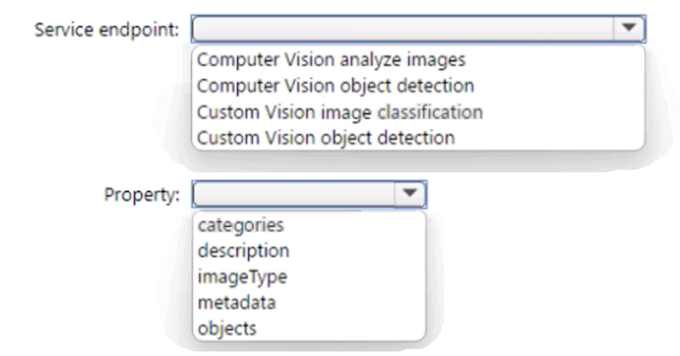

# AI-102 Designing and Implementing a Microsoft Azure AI Solution

## Topic 1

### Question #1

You have 100 chatbots that each has its own Language Understanding model.

Frequently, you must add the same phrases to each model.

**You need to programmatically update the Language Understanding models to include the new phrases.**

How should you complete the code? To answer, drag the appropriate values to the correct targets. 

Each value may be used once, more than once, or not at all.

You may need to drag the split bar between panes or scroll to view content.


**Box 1: AddPhraseListAsync -**

)

```
var phraselistId = await client.Features.AddPhraseListAsync(appId, versionId, new PhraselistCreateObject
{
	EnabledForAllModels = false,
	IsExchangeable = true,
	Name = "QuantityPhraselist",
    Phrase = "few,more,extra"
});
```

**Box 2: PhraselistCreateObject -**


1. AddPhraseListAsync
2. PhraselistCreateObject

### Question #2

You plan to use a Language Understanding application named app1 that is deployed to a container.

- App1 was developed by using a Language Understanding authoring resource named lu1.
- App1 has the versions shown in the following table.


**You need to create a container that uses the latest deployable version of app1.**

Which three actions should you perform in sequence? To answer, move the appropriate actions from the list of actions to the answer area and
arrange them in the correct order.


1. Step -1 --> Select v1.1 of app1.( We need to use latest version which can be trained or published)
2. Step 2 --> Export the model by using the Export for container (GZIP) option
3. Step -3--> Run the Container and mount the model file.


1. Select v1.1
2. Export as GZIP
3. Run and mount


### Question #3

You need to build a chatbot that meets the following requirements:

- ✑ Supports chit-chat, knowledge base, and multilingual models
- ✑ Performs sentiment analysis on user messages
- ✑ Selects the best language model automatically
  
What should you integrate into the chatbot?


- A. QnA Maker, Language Understanding, and Dispatch
- B. Translator, Speech, and Dispatch
- **C. Language Understanding, Text Analytics, and QnA Maker**  ✅
- D. Text Analytics, Translator, and Dispatch


**Language Understanding**: An AI service that allows users to interact with your applications, bots, and IoT devices by using natural language.

**QnA Maker** is a cloud-based Natural Language Processing (NLP) service that allows you to create a natural conversational layer over your
data.  It is used to find the most appropriate answer for any input from your custom knowledge base (KB) of information.

**Text Analytics:** Mine insights in unstructured text using natural language processing (NLP)ג€"no machine learning expertise required. 

Gain a deeper understanding of customer opinions with sentiment analysis. 

The Language Detection feature of the Azure Text Analytics REST API evaluates text input

**A. QnA Maker, Language Understanding, and Dispatch**

These tools together will support chit-chat, knowledge base queries, multilingual capabilities, sentiment analysis, and automatic selection of the
best language model.

- **Language Understanding**: An AI service that allows users to interact with your applications, bots, and IoT devices by using natural language.
- **QnA Maker is a cloud-based Natural Language Processing (NLP)** service that allows you to create a natural conversational layer over your data. It is used to find the most appropriate answer for any input from your custom knowledge base (KB) of information.
- **Text Analytics**: Mine insights in unstructured text using natural language processing (NLP)"no machine learning expertise required.
	- Gain a deeper understanding of customer opinions with sentiment analysis. The Language Detection feature of the Azure Text Analytics REST API evaluates text input

Incorrect Answers:

A, B, D: Dispatch uses sample utterances for each of your bot's different tasks (LUIS, QnA Maker, or custom), and builds a model that can be
used to properly route your user's request to the right task, even across multiple bots.


### Question #4

Your company wants to **reduce how long it takes for employees to log receipts in expense reports**. All the receipts are in English.

You need to extract top-level information from the receipts, such as the vendor and the transaction total. The solution must minimize development effort.

Which Azure service should you use?

- A. Custom Vision
- B. Personalizer
- **C. Form Recognizer** ✅
- D. Computer Vision


**Correct Answer: C**

Azure Form Recognizer is a cognitive service that lets you build automated data processing software using machine learning technology.
Identify and extract text, key/value pairs, selection marks, tables, and structure from your documentsג€"the service outputs structured data
that includes the relationships in the original file, bounding boxes, confidence and more.

###  Question #5

You need to create a new resource that will be used to perform sentiment analysis and optical character recognition (OCR). The solution must
meet the following requirements:


- ✑ Use a single key and endpoint to access multiple services.
- ✑ Consolidate billing for future services that you might use.
- ✑ Support the use of Computer Vision in the future

**How should you complete the HTTP request to create the new resource?** To answer, select the appropriate options in the answer area.
NOTE: Each correct selection is worth one point.


**Box 1: PUT -**

Sample Request: 

PUT https://management.azure.com/subscriptions/00000000-0000-0000-0000-000000000000/resourceGroups/test-rg/providers/
Microsoft.DeviceUpdate/accounts/contoso?api-version=2020-03-01-preview

Incorrect Answers:

**PATCH is for updates.**

**Box 2: CognitiveServices -**

Microsoft Azure Cognitive Services provide us to use its pre-trained models for various Business Problems related to Machine Learning.

List of Different Services are:

- ✑ Decision
- ✑ Language (includes sentiment analysis)
- ✑ Speech
- ✑ Vision (includes OCR)
- ✑ Web Search


PUT: 

- puts a file or resource at a specific URI, and exactly at that URI.
- If there's already a file or resource at that URI, PUT replaces that file or resource.
- If there is no file or resource there, PUT creates one.

**POST: POST sends data to a specific URI and expects the resource at that URI to handle the request.**

### Question #6

You are developing a new sales system that will process the video and text from a public-facing website.

**You plan to monitor the sales system to ensure that it provides equitable results regardless of the user's location or background.**

Which two responsible AI principles provide guidance to meet the monitoring requirements? Each correct answer presents part of the solution.

NOTE: Each correct selection is worth one point.


- A. transparency
- **B. fairness**  ✅
- **C. inclusiveness**  ✅
- D. reliability and safety
- E. privacy and security


Correct Answer: BC

- AI systems should treat all people fairly.
- AI systems should perform reliably and safely.


**Fairness** is a core ethical principle that all humans aim to understand and apply. This principle is even more important when AI systems are being
developed. Key checks and balances need to make sure that the system's decisions don't discriminate or run a gender, race, sexual orientation, or
religion bias toward a group or individual.


**Inclusiveness** mandates that AI should consider all human races and experiences, and inclusive design practices can help developers to understand
and address potential barriers that could unintentionally exclude people. Where possible, speech-to-text, text-to-speech, and visual recognition
technology should be used to empower people with hearing, visual, and other impairments.


### Question #7

You plan to use containerized versions of the Anomaly Detector API on local devices for testing and in on-premises datacenters.

You need to ensure that the containerized deployments meet the following requirements:

- ✑ Prevent billing and API information from being stored in the command-line histories of the devices that run the container.
- ✑ Control access to the container images by using Azure role-based access control (Azure RBAC).


Which four actions should you perform in sequence? To answer, move the appropriate actions from the list of actions to the answer area and
arrange them in the correct order.


1. Create a custom docker file
2. Pull the container image (in the dockerfile)
3. Build the image
4. Push to ACR


### Question #8

You plan to deploy a containerized version of an Azure Cognitive Services service that will be used for text analysis.

You configure **https://contoso.cognitiveservices.azure.com** as the endpoint URI for the service, and you pull the latest version of the Text Analytics Sentiment Analysis container.

You need to run the container on an Azure virtual machine by using Docker.

How should you complete the command? To answer, select the appropriate options in the answer area.

NOTE: Each correct selection is worth one point.


```
Box 1: mcr.microsoft.com/azure-cognitive-services/textanalytics/sentiment

To run the Sentiment Analysis v3 container, execute the following docker run command. 

docker run --rm -it -p 5000:5000 --memory 8g --cpus \ 
	mcr.microsoft.com/azure-cognitive-services/textanalytics/sentiment \
	Eula=accept \
	Billing={ENDPOINT_URI} \
	ApiKey={API_KEY} 

is the endpoint for accessing the Text Analytics API. https://<your-custom-subdomain>.cognitiveservices.azure.com


Box 2: https://contoso.cognitiveservices.azure.com

{ENDPOINT_URI} is the endpoint for accessing the Text Analytics API: https://<your-custom-subdomain>.cognitiveservices.a The endpoint for
accessing the Text
```


### Question #9

You have the following C# method for creating Azure Cognitive Services resources programmatically.


You need to call the method to create a free Azure resource in the West US Azure region. The resource will be used to generate captions of images automatically.

Which code should you use?

```
A. create_resource(client, "res", "ComputerVision", "FO", "westus")
B. create_resource(client, "res1", "CustomVision Prediction", "FO", "westus")
C. create_resource(client, "res1", "ComputerVision", "SO", "westus")
D. create_resource(client, "res1", "CustomVision.Prediction", "SO", "westus")
```


**A, as there is free tier available for Computer Vision service.**

- Free - Web/Container
- 20 per minute
- 5,000 free transactions per month

The ComputerVision resource is more commonly used because it comes with pre-built capabilities for image analysis, including caption generation, without the need to train a custom model. 

On the other hand, the CustomVision.Prediction you must be specifically trained to support generating captions


### Question #10

You successfully run the following HTTP request.

```
POST https://management.azure.com/subscriptions/18c51a87-3a69-47a8-aedc-a54745f708a1/resourceGroups/RG1/providers/
Microsoft.CognitiveServices/accounts/contoso1/regenerateKey?api-version=2017-04-18
Body{"keyName": "Key2"}
```


What is the result of the request?


- A. A key for Azure Cognitive Services was generated in Azure Key Vault.
- B. A new query key was generated.
- C. The primary subscription key and the secondary subscription key were rotated.
- **D. The secondary subscription key was reset**.   ✅

This response is indicated by the "keyName": "Key2" in the request body, specifying that the secondary subscription key (Key2) should be regenerated.

> B is wrong. Query key is for search service. The Rest request of create query key is like POST

The request is to the Azure Management API to regenerate a key for an Azure Cognitive Services account (contoso1). The body of the request
specifies {"keyName": "Key2"}, which indicates that the operation is targeted at the secondary subscription key (commonly referred to as Key2 in Azure Cognitive Services management). The regenerateKey action causes the specified key to be reset, generating a new key value for it while invalidating the old one.

### Question #11

You build a custom Form Recognizer model.

You receive sample ¬les to use for training the model as shown in the following table


Which three ¬les can you use to train the model? Each correct answer presents a complete solution. NOTE: Each correct selection is worth one point


- **A. File1**

- B. File2

- **C. File3**

- D. File4

- E. File5

- **F. File6**


**ACF**


Form Recognizer works on input documents that meet these requirements:

Format must be JPG, PNG, PDF (text or scanned), or TIFF. Text-embedded PDFs are best because there's no possibility of error in character extraction and location.

**File size must be less than 50 MB.**


**File 2 and 5 are excluded.**

New service limits now goes up to 500MB so...

File 1, 3, and 6 are correct for "training the model", however if MSFT remove the word "training" from the question - be careful.

For custom model training the total size is still 50MB. Answer is correct

A. File1 (PDF)

C. File3 (JPG)

F. File6 (JPG)


### Question #12

A customer uses Azure Cognitive Search.

The customer plans to enable a server-side encryption and use customer-managed keys (CMK) stored in Azure. What are three implications of the planned change? Each correct answer presents a complete solution.

NOTE: Each correct selection is worth one point


- **A. The index size will increase.**

- **B. Query times will increase**.

- C. A self-signed X.509 certi¬cate is required.

- D. The index size will decrease.

- E. Query times will decrease.

- **F. Azure Key Vault is required**.


**Should be ABF (use AKV for customer managed key)**


"Customer-managed keys require an additional billable service, Azure Key Vault, which can be in a different region, but under the same subscription, as Azure Cognitive Search. Enabling CMK encryption will increase index size and degrade query performance."

 
A. The index size will increase. Enabling CMK encryption increases the index size1.

B. Query times will increase. Enabling CMK encryption degrades query performance. You can expect to see an increase of 30-60 percent in query times1.

F. Azure Key Vault is required. CMK encryption depends on Azure Key Vault. You can create your own encryption keys and store them in a key vault, or you can use Azure Key Vault APIs to generate encryption keys1


### Question #13

You are developing a new sales system that will process the video and text from a public-facing website. You plan to notify users that their data has been processed by the sales system.

Which responsible AI principle does this help meet?

- **A. transparency**

- B. fairness

- C. inclusiveness

- D. reliability and safety

The correct answer is A, transparency: "When an AI application relies on personal data, such as a facial recognition system that takes images of people to recognize them; you should make it clear to the user how their data is used and retained, and who has access to it."


- "Transparency: AI systems should be understandable."


- "Reliability and safety: AI systems should perform reliably and safely."

### Question #14


Note: This question is part of a series of questions that present the same scenario. Each question in the series contains a unique solution that might meet the stated goals. Some question sets might have more than one correct solution, while others might not have a correct solution.

After you answer a question in this section, you will NOT be able to return to it. As a result, these questions will not appear in the review screen.

You create a web app named app1 that runs on an Azure virtual machine named vm1. Vm1 is on an Azure virtual network named vnet1. You plan to create a new Azure Cognitive Search service named service1.

You need to ensure that app1 can connect directly to service1 without routing tra®c over the public internet.

Solution: You deploy service1 and a public endpoint to a new virtual network, and you con¬gure Azure Private Link.

Does this meet the goal?


- A. Yes

- **B. No**

The Azure Private Link should use a private endpoint, not a public endpoint.

Private Link service can be accessed from approved private endpoints in any public region.


Answer is no. you should create a private link with private endpoint


### Question #15

You create a web app named app1 that runs on an Azure virtual machine named vm1. Vm1 is on an Azure virtual network named vnet1. You plan to create a new Azure Cognitive Search service named service1.

You need to ensure that app1 can connect directly to service1 without routing tra®c over the public internet.

Solution: **You deploy service1 and a public endpoint, and you configure an IP firewall rule.**

Does this meet the goal?


- A. Yes

- **B. No**
  
**Instead deploy service1 and a private (not public) endpoint to a new virtual network, and you configure Azure Private Link.**

The answer is B because the traffic should not be routed over internet. 

"By default, Azure AI Search is configured to allow connections over a public endpoint. Access to a search service through the public endpoint is protected by authentication and authorization protocols, but the endpoint itself is open to the internet at the network layer for data plane requests."


### Question #16

You create a web app named app1 that runs on an Azure virtual machine named vm1. Vm1 is on an Azure virtual network named vnet1. You plan to create a new Azure Cognitive Search service named service1.

You need to ensure that app1 can connect directly to service1 without routing tra®c over the public internet.

**Solution: You deploy service1 and a public endpoint, and you con¬gure a network security group (NSG) for vnet1.**

Does this meet the goal?


- A. Yes

- **B. No**

Instead deploy service1 and a private (not public) endpoint to a new virtual network, and you con¬gure Azure Private Link.

###  Question #17

You plan to perform predictive maintenance.


You collect IoT sensor data from 100 industrial machines for a year. Each machine has 50 different sensors that generate data at one-minute intervals. In total, you have 5,000 time series datasets.

You need to identify unusual values in each time series to help predict machinery failures.

Which Azure service should you use?

- **A. Anomaly Detector**

- B. Cognitive Search

- C. Form Recognizer

- D. Custom Vision

A is the answer.

Anomaly Detector is an AI service with a set of APIs, which enables you to monitor and detect anomalies in your time series data with little machine learning (ML) knowledge, either batch validation or real-time inference.

**D. Azure AI Anomaly Detector**

### Question #18

You are developing a streaming Speech to Text solution that will use the Speech SDK and MP3 encoding. You need to develop a method to convert speech to text for streaming MP3 data.

How should you complete the code? To answer, select the appropriate options in the answer area. NOTE: Each correct selection is worth one point.


1. AudioStreamFormat.GetCompressedFormat.

2. SpeechRecognizer


### Question #19


You are developing an internet-based training solution for remote learners.

Your company identi¬es that during the training, some learners leave their desk for long periods or become distracted.


You need to use a video and audio feed from each learner's computer to detect whether the learner is present and paying attention. The solution must minimize development effort and identify each learner.

Which Azure Cognitive Services service should you use for each requirement? To answer, select the appropriate options in the answer area. NOTE: Each correct selection is worth one point.


1. Face
2. Face
3. Speech

- From Video feed - Face 
- Facial Expression from - Face 
- Audio Feed is - Speech


### Question #20

You plan to provision a QnA Maker service in a new resource group named RG1.

In RG1, you create an App Service plan named AP1.

Which two Azure resources are automatically created in RG1 when you provision the QnA Maker service? Each correct answer presents part of the solution.

NOTE: Each correct selection is worth one point.


- A. Language Understanding

- B. Azure SQL Database

- C. Azure Storage

- **D. Azure Cognitive Search**

- **E. Azure App Service**

"When you create a QnAMaker resource, you host the data in your own Azure subscription. Azure Search is used to index your data." & "When you create a QnAMaker resource, you host the runtime in your own Azure subscription. App Service is the compute engine that runs the QnA Maker queries for you."


### Question #21

You are building a language model by using a Language Understanding (classic) service. 

You create a new Language Understanding (classic) resource.

You need to add more contributors

What should you use?

- A. a conditional access policy in Azure Active Directory (Azure AD)

- **B. the Access control (IAM) page for the authoring resources in the Azure portal**

- C. the Access control (IAM) page for the prediction resources in the Azure portal

B is the answer.

In the Azure portal, find your Language Understanding (LUIS) authoring resource. It has the type LUIS.Authoring. In the resource's Access Control (IAM) page, add the role of contributor for the user that you want to contribute.

### Question #22

You have an Azure Cognitive Search service.

During the past 12 months, query volume steadily increased.

You discover that some search query requests to the Cognitive Search service are being throttled.

You need to reduce the likelihood that search query requests are throttled.

**Solution: You migrate to a Cognitive Search service that uses a higher tier.**

Does this meet the goal?

- A. Yes

- **B. No**

**Using a higher tier does not imply scaling replicas or partitions.**


### Question #23

You need to develop an automated call handling system that can respond to callers in their own language. The system will support only French and English.

Which Azure Cognitive Services service should you use to meet each requirement? To answer, drag the appropriate services to the correct requirements. Each service may be used once, more than once, or not at all. You may need to drag the split bat between panes or scroll to view content.


1. Speech to Text
2. Text to Speech


- Speech to Text with AutoDetectSourceLanguageConfig. It can't be Text Analytics because the input is callers' voice.
- Text to Speech: the output is voice.


### Question #24

You have receipts that are accessible from a URL.

You need to extract data from the receipts by using Form Recognizer and the SDK. The solution must use a prebuilt model. Which client and method should you use?

- A. the FormRecognizerClient client and the StartRecognizeContentFromUri method

- B. the FormTrainingClient client and the StartRecognizeContentFromUri method

- **C. the FormRecognizerClient client and the StartRecognizeReceiptsFromUri method**

- D. the FormTrainingClient client and the StartRecognizeReceiptsFromUri method


**Should be C**

```
private static async Task AnalyzeReceipt(
	FormRecognizerClient recognizerClient, string receiptUri)
	RecognizedFormCollection receipts = await recognizerClient.StartRecognizeReceiptsFromUri(new Uri(receiptUrl)).WaitForCompletionAsync();
)
```

Option A: The StartRecognizeContentFromUri method is used to extract layout information such as tables, lines, words, and selection marks. It’ not specifically designed for receipts.

Option B: The FormTrainingClient is used to train custom models, not to extract data from documents using prebuilt models. Also, the StartRecognizeContentFromUri method, as mentioned above, is not specifically designed for receipts.

Option D: Similar to option B, the FormTrainingClient is not suitable for this scenario as it’s used for training custom models. The StartRecognizeReceiptsFromUri method would be correct if used with FormRecognizerClient.


### Question #25

You have a collection of 50,000 scanned documents that contain text.

You plan to make the text available through Azure Cognitive Search.

You need to con¬gure an enrichment pipeline to perform optical character recognition (OCR) and text analytics. The solution must minimize costs.

What should you attach to the skillset?

- A. a new Computer Vision resource

- B. a free (Limited enrichments) Cognitive Services resource

- C. an Azure Machine Learning Designer pipeline

- **D. a new Cognitive Services resource that uses the S0 pricing tier**

**Selected Answer: D**

You need to configure an enrichment pipeline to perform optical character recognition (OCR) and "text analytics"... Just because of this second requirement Answer is a Multi Cognitive Service (D), alone vision service (=OCR wont make any text analytics, text extraction is not text analytics !)


Based on the information from the official Azure documentation, the most cost-effective way to configure an enrichment pipeline for OCR and text analytics in Azure Cognitive Search would be to use a billable Cognitive Services resource. This is because built-in skills, such as OCR and text analytics, are based on the Cognitive Services APIs and unless your content input is small, you would need to attach a billable Cognitive Services resource to run larger workloads.


**D. a new Cognitive Services resource that uses the S0 pricing tier**

This option allows you to use the necessary built-in skills for OCR and text analytics and can handle larger workloads, which would be necessary for processing a large number of documents. The S0 pricing tier is a standard tier that provides a balance between cost and capabilities.


D - free tier is limited to 10,000 documents


### Question #26

You have an Azure Cognitive Search service.

During the past 12 months, query volume steadily increased.

You discover that some search query requests to the Cognitive Search service are being throttled.

You need to reduce the likelihood that search query requests are throttled.

**Solution: You add indexes.**

Does this meet the goal?

- A. Yes

- B. No

**Correct Answer: B**


Instead, you could migrate to a Cognitive Search service that uses a higher tier.

Note: A simple fix to most throttling issues is to throw more resources at the search service (typically replicas for query-based throttling, or partitions for indexing- based throttling). However, increasing replicas or partitions adds cost, which is why it is important to know the reason why throttling is occurring at all.

> "How your search queries perform is directly connected to the size and complexity of your indexes. The smaller and more optimized your indexes, the fast Azure Cognitive Search can respond to queries.

If your index has been optimized but the performance still isn't where it needs to be, you can choose to scale up or scale out your search service.

The solution provided does not directly address the issue of search query requests being throttled. Adding indexes can improve search performance by optimizing the search process, but it may not directly address throttling issues.


### Question #27

During the past 12 months, query volume steadily increased.

You discover that some search query requests to the Cognitive Search service are being throttled.

You need to reduce the likelihood that search query requests are throttled.

Solution: You enable customer-managed key (CMK) encryption.

Does this meet the goal?

- A. Yes

- **B. No**

Customer-managed key (CMK) encryption does not affect throttling.

Instead, you could migrate to a Cognitive Search service that uses a higher tier.


Note: A simple fix to most throttling issues is to throw more resources at the search service (typically replicas for query-based throttling, or partitions for indexing- based throttling). However, increasing replicas or partitions adds cost, which is why it is important to know the reason why throttling is occurring at all.

Reason for choosing this option: Enabling customer-managed key (CMK) encryption does not directly impact the throttling of search query requests in Azure Cognitive Search service. CMK encryption is used for data-at-rest encryption and does not affect the performance or capacity of the search service.


### Question #28

You create a web app named app1 that runs on an Azure virtual machine named vm1. Vm1 is on an Azure virtual network named vnet1. You plan to create a new Azure Cognitive Search service named service1.

You need to ensure that app1 can connect directly to service1 without routing tra®c over the public internet.

**Solution: You deploy service1 and a private endpoint to vnet1.**

Does this meet the goal?

- **A. Yes**

- B. No

**"deploy service1 and a private endpoint to vnet1." is correct.**


A private endpoint is a network interface that uses a private IP address from your virtual network. This network interface connects you privately and securely to a service powered by Azure Private Link. By enabling a private endpoint, you're bringing the service into your virtual network.

The service could be an Azure service such as:

- ✑ Azure Storage 
- ✑ Azure Cosmos DB 
- ✑ Azure SQL Database 
- ✑ Your own service using a Private Link Service.

### Question #29

You have a Language Understanding resource named lu1.

You build and deploy an Azure bot named bot1 that uses lu1.

You need to ensure that bot1 adheres to the Microsoft responsible AI principle of inclusiveness. How should you extend bot1?


- A. Implement authentication for bot1.

- B. Enable active learning for lu1.

- C. Host lu1 in a container.

- **D. Add Direct Line Speech to bot1.**


Correct Answer: D

Inclusiveness: AI systems should empower everyone and engage people.

Topic 1

Direct Line Speech is a robust, end-to-end solution for creating a flexible, extensible voice assistant. 

**It is powered by the Bot Framework and its Direct Line Speech channel, that is optimized for voice-in, voice-out interaction with bots.**


Incorrect:

Not B: The Active learning suggestions feature allows you to improve the quality of your knowledge base by suggesting alternative questions, based on user- submissions, to your question and answer pair. You review those suggestions, either adding them to existing questions or rejecting them.


### Question #30

You are building an app that will process incoming email and direct messages to either French or English language support teams. Which Azure Cognitive Services API should you use? To answer, select the appropriate options in the answer area.

NOTE: Each correct selection is worth one point.


**Box1:**

**`https://eastus.api.cognitive.microsoft.com `**


Box2:

**`/text/analytics/v3.1/languages`**

NOTE:

Pay special attention to the Sample Request provided. Request to the API should be of the form:


**`POST {Endpoint}/text/analytics/v3.0/languages `**


**Where the {Endpoint} as stated under the sub-heading "URI Parameters" was described as quoted here (see "Description" column of the table): "Supported Cognitive Services endpoints (protocol and hostname, for example: https://westus.api.cognitive.microsoft.com)."**

So the sample given shows the correct format of the *endpoint* as https://{location}.api.cognitive.microsoft.com

### Question #31


You have an Azure Cognitive Search instance that indexes purchase orders by using Form Recognizer.

You need to analyze the extracted information by using Microsoft Power BI. The solution must minimize development effort. What should you add to the indexer?


- A. a projection group

- **B. a table projection**

- C. a file projection

- D. an object projection

**Should be B . Its for Tables the Power BI**

"Use Power BI for data exploration. This tool works best when the data is in Azure Table Storage. Within Power BI, you can manipulate data into new tables that are easier to query and analyze"


You receive a JSON object, so ObjectProjection is the most appropriate way to explore:

Objects: "Used when you need the full JSON representation of your data and enrichments in one JSON document. As with table projections, only valid JSON objects can be projected as objects, and shaping can help you do that."


**B is the correct answer. See below to understand the workflow:**

Purchase Orders (POs) -> Form Recognizer -> OCR -> JSON (extracted info from POs) -> Shaper skill -> JSON -> Table Projection -> JSON -> Power BI


### Question #32


You have an Azure Cognitive Search service.

During the past 12 months, query volume steadily increased.

You discover that some search query requests to the Cognitive Search service are being throttled.

You need to reduce the likelihood that search query requests are throttled.

**Solution: You add replicas.**

Does this meet the goal?


- **A. Yes**

- B. No

A simple fix to most throttling issues is to throw more resources at the search service (typically replicas for query-based throttling, or partitions for indexing-based throttling). However, increasing replicas or partitions adds cost, which is why it is important to know the reason why throttling is occurring at all.


**"add replicas" is correct.**


### Question #33

You need to create a Text Analytics service named Text12345678, and then enable logging for Text12345678. The solution must ensure that any changes to Text12345678 will be stored in a Log Analytics workspace.

**To complete this task, sign in to the Azure portal.**


Step 1: Sign in to the QnA portal.

Step 2: Create an Azure Cognitive multi-service resource:


Step 3: On the Create page, provide the following information.


Step 4: Configure additional settings for your resource as needed, read and accept the conditions (as applicable), and then select Review + create.

Step 5: Navigate to the Azure portal. Then locate and select The Text Analytics service resource Text12345678 (which you created in Step 4).

Step 6: Next, from the left-hand navigation menu, locate Monitoring and select Diagnostic settings. This screen contains all previously created diagnostic settings for this resource.

Step 7: Select + Add diagnostic setting.

Step 8: When prompted to con¬gure, select the storage account and OMS workspace that you'd like to use to store you diagnostic logs. Note: If you don't have a storage account or OMS workspace, follow the prompts to create one.

Step 9: Select Audit, RequestResponse, and AllMetrics. Then set the retention period for your diagnostic log data. If a retention policy is set to zero, events for that log category are stored inde¬nitely.

Step 10: Click Save.

It can take up to two hours before logging data is available to query and analyze. So don't worry if you don't see anything right away.


**#Step 1 - create your language service:**

azure portal > search > azure ai services, + create language services, continue to create your resource, create your resource and accept the responsible AI notice,  Review & Create,


**#Step 2 - add your LAW:**

- open your new language service, 
- search for diagnostic settings,
- you may need to search across the top for your specific resource, 
- now + add your diagnostic setting, name, desination log analytics workspace, 
- select your logs and metrics as required to minimize storage costs.

### Question #34

You need to create a search service named search12345678 that will index a sample Azure Cosmos DB database named hotels-sample. The solution must ensure that only English language fields are retrievable.

To complete this task, sign in to the Azure portal

Part 1: Create a search service search12345678 

- Step 1: Sign in to the QnA portal.

- Step 2: Create an Azure Cognitive multi-service resource

- Step 3: On the Create page, provide the following information.

Name: search12345678 -


- Step 4: Click Review + create 

Part 2: Start the Import data wizard and create a data source 

- Step 5: Click Import data on the command bar to create and populate a search index


- Step 6: In the wizard, click Connect to your data > Samples > hotels-sample. This data source is built-in. If you were creating your own data source, you would need to specify a name, type, and connection information. Once created, it becomes an "existing data source" that can be reused in other import operations.


- Step 7: Continue to the next page.

- Step 8: Skip the "Enrich content" page 

- Step 9: Configure index.

Make sure English is selected for the fields.


Step 10: Continue and finish the wizard.


### Question #35

SIMULATION You plan to create a solution to generate captions for images that will be read from Azure Blob Storage.


You need to create a service in Azure Cognitive Services for the solution. The service must be named captions12345678 and must use the Free pricing tier.

To complete this task, sign in to the Azure portal.


Correct Answer: 

Part 1: Create a search service captions12345678 

- Step 1: Sign in to the QnA portal.
- Step 2: Create an Azure Cognitive multi-service resource:
- Step 3: On the Create page, provide the following information.

Name: captions12345678.

Pricing tier: Free -


Step 4: Click Review + create 

Step 5: Create a data source In Connect to your data, choose Azure Blob Storage. Choose an existing connection to the storage account and container you created. Give the data source a name, and use default values for the rest.)


1. Create a Computer Vision resource in Azure AI services using the Free pricing tier.

2. Launch Vision Studio.

3. Select your Computer Vision resource.

4. Add new dataset.

5. Enter a dataset name and select Image classification as the model type.

6. Select an Azure blob storage container and Create dataset.

(I don't know in the exam simulation whether the Storage account with a Blob container already exists, if not this would need to be created first)


### Question #36


You need to create a Form Recognizer resource named fr12345678.

Use the Form Recognizer sample labeling tool at https://fott-2-1.azurewebsites.net/ to analyze the invoice located in the C:\Resources\Invoices folder.

Save the results as `C:\Resources\Invoices\Results.json`.

To complete this task, sign in to the Azure portal and open the Form Recognizer sample labeling tool.

Step 1: Sign in to the Azure Portal.

Step 2: Navigate to the Form Recognizer Sample Tool (at https://fott-2-1.azurewebsites.net) 

Step 3: On the sample tool home page select Use prebuilt model to get data.


Step 4: Select the Form Type you would like to analyze from the dropdown window.

Step 5: In the Source: URL ¬eld, paste the selected URL and select the Fetch button.

Step 6: In the Choose file for analysis use the ¬le in the C:\Resources\Invoices folder and select the Fetch button.


Step 7: Select Run analysis. The Form Recognizer Sample Labeling tool will call the Analyze Prebuilt API and analyze the document. 

Step 8: View the results - see the key-value pairs extracted, line items, highlighted text extracted and tables detected.


Step 9: Save the results as C:\Resources\Invoices\Results.json.

1. Create a Document Intelligence resource in Azure AI services

2. Launch Document Intelligence Studio

3. Select Invoices from the Prebuilt models

4. Configure the service resource by selecting your Document Intelligence Resource

5. Drag & drop of browse for the invoice in C:\Resources\Invoices

6. Click Run analysis

7. Click on Result and the Download icon to save the JSON results file

### Question #37

You have a factory that produces food products.

You need to build a monitoring solution for staff compliance with personal protective equipment (PPE) requirements. The solution must meet the following requirements:

* Identify staff who have removed masks or safety glasses.
* Perform a compliance check every 15 minutes.
* Minimize development effort.
* Minimize costs.

Which service should you use?


- **A. Face**
- B. Computer Vision
- C. Azure Video Analyzer for Media (formerly Video Indexer)

**Correct Answer: A**

Face API is an AI service that analyzes faces in images.

- Embed facial recognition into your apps for a seamless and highly secured user experience.

- No machine-learning expertise is required.

- Features include face detection that perceives facial features and attributes, such as a face mask, glasses, or face location

- An image, and identi¬cation of a person by a match to your private repository or via photo ID


A. Face. The solution link explains:

**Embed facial recognition into your apps for a seamless and highly secured user experience**. No machine-learning expertise is required. Features include face detection that perceives facial features and attributes—such as a face mask, glasses, or face location—in an image, and identification of a person by a match to your private repository or via photo ID.


### Question #38


You have an Azure Cognitive Search solution and a collection of blog posts that include a category ¬eld. You need to index the posts. The solution must meet the following requirements:

* Include the category ¬eld in the search results.

* Ensure that users can search for words in the category ¬eld.

* Ensure that users can perform drill down ¬ltering based on category.

Which index attributes should you con¬gure for the category field?


- A. searchable, sortable, and retrievable

- **B. searchable, facetable, and retrievable**

- C. retrievable, filterable, and sortable

- D. retrievable, facetable, and key

- Retrievable: Include the category field in the search results.

- Searchable: Ensure that users can search for words in the category field. 

- Facetable: Ensure that users can perform drill down filtering based on category.

### Question #39

Use the following login credentials as needed:

To enter your username, place your cursor in the Sign in box and click on the username below.

To enter your password, place your cursor in the Enter password box and click on the password below.

Azure Username: admin@abc.com -

Azure Password: XXXXXXXXXXXX The following information is for technical support purposes only:

Lab Instance: 12345678 -

**Task -**

You plan to build an API that will identify whether an image includes a Microsoft Surface Pro or Surface Studio.

You need to deploy a service in Azure Cognitive Services for the API. The service must be named AAA12345678 and must be in the East US Azure region. The solution must use the Free pricing tier.

To complete this task, sign in to the Azure portal

Correct Answer: See explanation below.


- Step 1: In the Azure dashboard, click Create a resource.

- Step 2: In the search bar, type "Cognitive Services."

You'll get information about the cognitive services resource and a legal notice. Click Create.


- Step 3: You'll need to specify the following details about the cognitive service (refer to the image below for a completed example of this page):

  - Subscription: choose your paid or trial subscription, depending on how you created your Azure account.
  
  - Resource group: click create new to create a new resource group or choose an existing one.
  
  - Region: choose the Azure region for your cognitive service. Choose: East US Azure region.
  
  - Name: choose a name for your cognitive service. Enter: AAA12345678 Pricing Tier: Select: Free pricing tier


Step 4: Review and create the resource, and wait for deployment to complete. Then go to the deployed resource.

Note: The Computer Vision Image Analysis service can extract a wide variety of visual features from your images. For example, it can determine whether an image contains adult content, find specific brands or objects, or find human faces.


**Computer Vision** should be the resource we need to create.


### Question #40


**SIMULATION **

Use the following login credentials as needed:

To enter your username, place your cursor in the Sign in box and click on the username below.

To enter your password, place your cursor in the Enter password box and click on the password below.

- Azure Username: admin@abc.com -

- Azure Password: XXXXXXXXXXXX 

The following information is for technical support purposes only:

- Lab Instance: 12345678 -

Task You need to build an API that uses the service in Azure Cognitive Services named AAA12345678 to identify whether an image includes a Microsoft Surface Pro or Surface Studio.

- To achieve this goal, you must use the sample images in the C:\Resources\Images folder.
- To complete this task, sign in to the Azure portal.


**Correct Answer:**

- Step 1: In the Azure dashboard, click Create a resource.

- Step 2: In the search bar, type "Cognitive Services."

You'll get information about the cognitive services resource and a legal notice. Click Create.

- Step 3: You'll need to specify the following details about the cognitive service (refer to the image below for a completed example of this page):

Subscription: choose your paid or trial subscription, depending on how you created your Azure account.

Resource group: click create new to create a new resource group or choose an existing one.

Region: choose the Azure region for your cognitive service. Choose: East US Azure region.

Name: choose a name for your cognitive service. Enter: AAA12345678 Pricing Tier: Select: Free pricing tier

- Step 4: Review and create the resource, and wait for deployment to complete. Then go to the deployed resource.

Note: **The Computer Vision Image Analysis service can extract a wide variety of visual features from your images**. For example, it can determine whether an image contains adult content, find specific brands or objects, or find human faces.


### Question #41

SIMULATION 

Use the following login credentials as needed:

To enter your username, place your cursor in the Sign in box and click on the username below.

To enter your password, place your cursor in the Enter password box and click on the password below.

Azure Username: admin@abc.com -

Azure Password: XXXXXXXXXXXX -

The following information is for technical support purposes only:

Lab Instance: 12345678 -

Task You need to get insights from a video file located in the C:\Resources\Video\Media.mp4 folder.

Save the insights to the C:\Resources\Video\Insights.json folder.

To complete this task, sign in to the Azure Video Analyzer for Media at https://www.videoindexer.ai/ by using admin@abc.com

Correct Answer: See explanation below.

- Step 1: Login Browse to the Azure Video Indexer website and sign in. URL: https://www.videoindexer.ai/

Login admin@abc.com -

- Step 2: Create a project from your video

You can create a new project directly from a video in your account.

1. Go to the Library tab of the Azure Video Indexer website.

2. Open the video that you want to use to create your project. On the insights and timeline page, select the Video editor button.

Folder: C:\Resources\Video\Media.mp4

This takes you to the same page that you used to create a new project. Unlike the new project, you see the timestamped insights segments of the video, that you had started editing previously.


Step 3: Save the insights to the C:\Resources\Video\Insights.json folder.

### Question #42

**SIMULATION** 

Use the following login credentials as needed:

To enter your username, place your cursor in the Sign in box and click on the username below.

To enter your password, place your cursor in the Enter password box and click on the password below.


Azure Username: admin@abc.com -

Azure Password: XXXXXXXXXXXX The following information is for technical support purposes only:

Lab Instance: 12345678 -

Task You plan to analyze stock photography and automatically generate captions for the images.

You need to create a service in Azure to analyze the images. The service must be named caption12345678 and must be in the East US Azure region. The solution must use the Free pricing tier.

In the C:\Resources\Caption\Params.json folder, enter the value for Key 1 and the endpoint for the new service.

To complete this task, sign in to the Azure portal.

- **Step 1: Provision a Cognitive Services resource**

If you don't already have one in your subscription, you'll need to provision a Cognitive Services resource

1. Open the Azure portal at https://portal.azure.com, and sign in using the Microsoft account associated with your Azure subscription
2. Select the Create a resource button, search for cognitive services, and create a Cognitive Services resource with the following settings:

* Subscription: Your Azure subscription
* Resource group: Choose or create a resource group (if you are using a restricted subscription, you may not have permission to create a new resource group - use the one provided)
* Name: caption12345678 -
* Pricing tier: Free F0 -

3. Select the required checkboxes and create the resource.

Wait for deployment to complete, and then view the deployment details.

4. When the resource has been deployed, go to it and view its Keys and Endpoint page. You will need the endpoint and one of the keys from this page in the next procedure.


Step 2: Save Key and Endpoint values in Params.json Open the con¬guration file, C:\Resources\Caption\Params.json. and update the configuration values it contains to reflect the endpoint and an authentication key for your cognitive services resource. Save your changes.

### Question #43

**SIMULATION -**


Use the following login credentials as needed:

To enter your username, place your cursor in the Sign in box and click on the username below.

To enter your password, place your cursor in the Enter password box and click on the password below.

Azure Username: admin@abc.com -

Azure Password: XXXXXXXXXXXX The following information is for technical support purposes only:

Lab Instance: 12345678 -

Task You plan to build an application that will use caption12345678. The application will be deployed to a virtual network named VNet1. You need to ensure that only virtual machines on VNet1 can access caption12345678.

To complete this task, sign in to the Azure portal.


**Step 1: Create private endpoint for your web app**


1. In the left-hand menu, select All Resources > caption12345678 - the name of your web app.

2. In the web app overview, select Settings > Networking.

3. In Networking, select Private endpoints.

4. Select + Add in the Private Endpoint connections page.

5. Enter or select the following information in the Add Private Endpoint page:

- Name: Enter caption12345678.
- Subscription Select your Azure subscription.
- Virtual network Select VNet1
- Subnet: Integrate with private DNS zone: Select Yes.


### Question #44

SIMULATION 

Use the following login credentials as needed:

To enter your username, place your cursor in the Sign in box and click on the username below.

To enter your password, place your cursor in the Enter password box and click on the password below.

Azure Username: admin@abc.com -

Azure Password: XXXXXXXXXXXX The following information is for technical support purposes only:

Lab Instance: 12345678 -

Task You need to ensure that a user named admin@abc.com can regenerate the subscription keys of AAA12345678. The solution must use the principle of least privilege.

To complete this task, sign in to the Azure portal.


**Manually rotate subscription keys**

1. (Update your application code to reference the secondary key for the Azure account and deploy.)

2. In the Azure portal, navigate to your Azure account.

3. Under Settings, select Authentication.

4. To regenerate the primary key for your Azure account, select the Regenerate button next to the primary key.

5. (Update your application code to reference the new primary key and deploy.)

6. Regenerate the secondary key in the same manner.

**Cognitive Services Contributor**

Lets you create, read, update, delete and manage keys of Cognitive Services.


### Question #45

You have an Azure IoT hub that receives sensor data from machinery.

You need to build an app that will perform the following actions:

- • Perform anomaly detection across multiple correlated sensors.

- • Identify the root cause of process stops.

- • Send incident alerts.

The solution must minimize development time.

Which Azure service should you use?


- **A. Azure Metrics Advisor**

- B. Form Recognizer

- C. Azure Machine Learning

- D. Anomaly Detector


**Metrics Advisor is a part of Azure Applied AI Services that uses AI to perform data monitoring and anomaly detection in time series data. **

The service automates the process of applying models to your data, and provides a set of APIs and a web-based workspace for data ingestion, anomaly detection, and diagnostics - without needing to know machine learning. Developers can build AIOps, predicative maintenance, and business monitor applications on top of the service.


**"Use Metrics Advisor to:**

- Analyze multi-dimensional data from multiple data sources

- Identify and correlate anomalies

- Configure and fine-tune the anomaly detection model used on your data

- Diagnose anomalies and help with root cause analysis"

**Azure Metrics Advisor**

- collect time series data

- detect anomalies

- send incident alerts

- analyze root cause

### Question #46

You have an app that analyzes images by using the Computer Vision API.

You need to con¬gure the app to provide an output for users who are vision impaired. The solution must provide the output in complete sentences.

Which API call should you perform?

- A. readInStreamAsync

- B. analyzeImagesByDomainInStreamAsync

- C. tagImageInStreamAsync

- **D. describeImageInStreamAsync**

**Correct Answer: D**


The API call you should perform to provide an output in complete sentences for users who are vision impaired is **describeImageInStreamAsync**.

The describe feature of the Computer Vision API generates a human-readable sentence to describe the contents of an image. This is particularly useful for accessibility purposes, as it allows visually impaired users to understand what is in an image without needing to see it. 

The describe feature can also be customized to provide additional details or context, if desired.

### Question #47

You have a Custom Vision service project that performs object detection. The project uses the General domain for classi¬cation and contains a trained model.

**You need to export the model for use on a network that is disconnected from the internet.**

Which three actions should you perform in sequence? To answer, move the appropriate actions from the list of actions to the answer area and arrange them in the correct order.


1. Change Domains to General (compact)

2. Retain model

3. Export model

### Question #48


You are building an AI solution that will use Sentiment Analysis results from surveys to calculate bonuses for customer service staff.

You need to ensure that the solution meets the Microsoft responsible AI principles.

What should you do?


- **A. Add a human review and approval step before making decisions that affect the staff's financial situation.**

- B. Include the Sentiment Analysis results when surveys return a low confidence score.

- C. Use all the surveys, including surveys by customers who requested that their account be deleted and their data be removed.

- D. Publish the raw survey data to a central location and provide the staff with access to the location.

To ensure that the AI solution meets the Microsoft responsible AI principles, you should:

**A. Add a human review and approval step before making decisions that affect the staff's financial situation.**

This option aligns with the responsible AI principle of fairness and accountability. By adding a human review and approval step, you ensure that the decisions affecting staff bonuses are reviewed by humans who can consider factors beyond just the sentiment analysis results. It adds an element of transparency, accountability, and fairness to the process, reducing the risk of biased or unfair decisions. (ChatGPT)


### Question #49

You have an Azure subscription that contains a Language service resource named ta1 and a virtual network named vnet1.

You need to ensure that only resources in vnet1 can access ta1.

What should you configure?


- A. a network security group (NSG) for vnet1

- B. Azure Firewall for vnet1

- **C. the virtual network settings for ta1**

- D. a Language service container for ta1

**Correct Answer: C**


### Question #50

You are developing a monitoring system that will analyze engine sensor data, such as rotation speed, angle, temperature, and pressure. The system must generate an alert in response to atypical values.

What should you include in the solution?

- A. Application Insights in Azure Monitor

- B. metric alerts in Azure Monitor

- **C. Multivariate Anomaly Detection**

- D. Univariate Anomaly Detection


**if there is no metrics advisor, then choose Multivariate Anomaly detection as secondary option, Metrics Advisor is the best answer**


### Question #51

You have an app named App1 that uses an Azure Cognitive Services model to identify anomalies in a time series data stream.

You need to run App1 in a location that has limited connectivity. The solution must minimize costs.

What should you use to host the model?


- A. Azure Kubernetes Service (AKS)

- B. Azure Container Instances

- C. a Kubernetes cluster hosted in an Azure Stack Hub integrated system

- **D. the Docker Engine**

You must satisfy the following prerequisites before using Azure AI containers:

**Docker Engine: You must have Docker Engine installed locally. **

Docker provides packages that configure the Docker environment on macOS, Linux, and Windows. On Windows, Docker must be configured to support Linux containers. Docker containers can also be deployed directly to Azure Kubernetes Service or Azure Container Instances.


### Question #52

You have an Azure Cognitive Search resource named Search1 that is used by multiple apps.

You need to secure Search1. The solution must meet the following requirements:

- Prevent access to Search1 from the internet.

- Limit the access of each app to specific queries.

What should you do? To answer, select the appropriate options in the answer area.

NOTE: Each correct selection is worth one point.


- **Create Private Endpoint** 
- **Use Azure Roles**

Private Endpoints for Azure Cognitive Search allow a client on a virtual network to securely access data in a search index over a Private Link. The private endpoint uses an IP address from the virtual network address space for your search service. Network traffic between the client and the search service traverses over the virtual network and a private link on the Microsoft backbone network, eliminating exposure from the public internet.


In some scenarios, you may want to limit application's access to a single resource, such as an index.

The portal doesn't currently support role assignments at this level of granularity, but it can be done with PowerShell or the Azure CLI.


### Question #53

You are building a solution that will detect anomalies in sensor data from the previous 24 hours.

You need to ensure that the solution scans the entire dataset, at the same time, for anomalies.

Which type of detection should you use?

- **A. batch**

- B. streaming

- C. change points

Batch detection 

Use your time series to detect any anomalies that might exist throughout your data. This operation generates a model using your entire time series data, with each point analyzed with the same model.

### Question #54

You are building an app that will scan con¬dential documents and use the Language service to analyze the contents.

You provision an Azure Cognitive Services resource.

You need to ensure that the app can make requests to the Language service endpoint. The solution must ensure that con¬dential documents remain on-premises.

Which three actions should you perform in sequence? To answer, move the appropriate actions from the list of actions to the answer area and arrange them in the correct order.


1. Provision on-premise k8 cluster that is isolated from Internet

2. Pull image from MCR

3. Run container and specify API key and endpoint URL of Cognitive Services Services

Containers enable you to run Cognitive Services APIs in your own environment, and are great for your specific security and data governance requirements. Disconnected containers enable you to use several of these APIs disconnected from the internet.

These containers are hosted on the Microsoft Container Registry and available for download on Microsoft Artifact Registry and Docker Hub. You won't be able to run the container if your Azure subscription has not been approved after completion of the request form


### Question #55

You have an Azure subscription that has the following con¬gurations:

- Subscription ID: 8d3591aa-96b8-4737-ad09-00f9b1ed35ad

- Tenant ID: 3edfe572-cb54-3ced-ae12-c5c177f39a12


You plan to create a resource that will perform sentiment analysis and optical character recognition (OCR).

You need to use an HTTP request to create the resource in the subscription. The solution must use a single key and endpoint.

How should you complete the request? To answer, select the appropriate options in the answer area.

NOTE: Each correct selection is worth one point.


1. subscriptions/8d3591aa-96b8-4737-ad09-00f9b1ed35ad

2. Microsoft.CognitiveServices


You can access Azure Cognitive Services through two different resources: A multi-service resource, or a single-service one.

- Multi-service resource:

**Access multiple Azure Cognitive Services with a single key and endpoint.**


- The solution must use a single key and endpoint. - Cognitive Services 
- You need to use an HTTP request to create the resource in the subscription. - obviously subscription


### Question #56

You have an Azure subscription that contains an Anomaly Detector resource.

You deploy a Docker host server named Server1 to the on-premises network.

You need to host an instance of the Anomaly Detector service on Server1.

Which parameter should you include in the docker run command?


- A. Fluentd

- **B. Billing**

- C. Http Proxy

- D. Mounts

**The Eula, Billing**, and ApiKey options must be specified to run the container; otherwise, the container won't start. For more information, see Billing The ApiKey value is the Key from the Keys and Endpoints page in the LUIS portal and is also available on the Azure Cognitive Services resource keys page.

```
Billing={ENDPOINT_URI}


docker run --rm -it -p 5000:5000 --memory 4g --cpus 1 
	\ mcr.microsoft.com/azure-cognitive-services/decision/anomaly-detector:latest 
    \ Eula=accept 
    \ Billing={ENDPOINT_URI} 
    \ ApiKey={API_KEY}
```


### Question #57

You are building an app that will use the Speech service.

Topic 1

You need to ensure that the app can authenticate to the service by using a Microsoft Azure Active Directory (Azure AD), part of Microsoft Entra, token.

Which two actions should you perform? Each correct answer presents part of the solution.

NOTE: Each correct selection is worth one point.

- A. Enable a virtual network service endpoint.

- **B. Con¬gure a custom subdomain.**

- C. Request an X.509 certificate.

- **D. Create a private endpoint.**

- E. Create a Conditional Access policy.


To authenticate with a Microsoft Entra token, the Speech resource must have a custom subdomain and use a private endpoint. 

The Speech service uses custom subdomains with private endpoints only


To authenticate with a Microsoft Entra token, the Speech resource must have a custom subdomain and use a private endpoint. The Speech service uses custom subdomains with private endpoints only.


- B. Configure a custom subdomain: This is necessary because Azure AD authentication requires a custom domain for the Speech service.

- D. Create a private endpoint: This ensures secure communication between the app and the Speech service.

These actions align with the best practices for securing Azure services and enable the app to use Azure AD tokens for authentication.

B. Configure a custom subdomain: This is necessary when using Azure AD authentication with a private endpoint. However, it's also a requirement for using Azure AD authentication in general with the Speech service.

C. Request an X.509 certificate: This is not needed for Azure AD token-based authentication. It's typically used for client certificate authentication


### Question #58

You plan to deploy an Azure OpenAI resource by using an Azure Resource Manager (ARM) template.

You need to ensure that the resource can respond to 600 requests per minute.

How should you complete the template? To answer, select the appropriate options in the answer area.

NOTE: Each correct selection is worth one point.


Azure OpenAI allows you to manage how frequently your application can make inferencing requests. Your rate limits are based on Tokens-perMinute (TPM). For example, if you have a capacity of 1, this equals 1,000 TPM, and the rate limit of requests you can make per minute (RPM) is calculated using a ratio. For every 1,000 TPM, you can make 6 RPM.

When a deployment is created, the assigned TPM will directly map to the tokens-per-minute rate limit enforced on its inferencing requests. A Requests-Per-Minute (RPM) rate limit will also be enforced whose value is set proportionally to the TPM assignment using the following ratio:

**6 RPM per 1000 TPM.**

**So the math is 600 RPM needs 100000 TPM which translates to capacity 100**

### Question #59

You have an app that manages feedback.

You need to ensure that the app can detect negative comments by using the Sentiment Analysis API in Azure AI Language. The solution must ensure that the managed feedback remains on your company’s internal network.

Which three actions should you perform in sequence? To answer, move the appropriate actions from the list of actions to the answer area and arrange them in the correct order.

NOTE: More than one order of answer choices is correct. You will receive credit for any of the correct orders you select.


1. **Provision the Language service resource in Azure**. This step involves creating the Azure Language service resource, which will provide you with the necessary credentials and endpoint URL to use the Sentiment Analysis API.

2. **Deploy a Docker container to an on-premises server**. By deploying a Docker container on-premises, you can run the Sentiment Analysis API locally, ensuring that the feedback data does not leave your internal network.

3. **Run the container and query the prediction endpoint**. Once the container is running on your on-premises server, you can start sending feedback data to the Sentiment Analysis API by querying the prediction endpoint provided by the Language service.


### Question #60

You have an Azure OpenAI resource named AI1 that hosts three deployments of the GPT 3.5 model. Each deployment is optimized for a unique workload.

You plan to deploy three apps. Each app will access AI1 by using the REST API and will use the deployment that was optimized for the app's intended workload.

You need to provide each app with access to AI1 and the appropriate deployment. The solution must ensure that only the apps can access AI1.

What should you use to provide access to AI1, and what should each app use to connect to its appropriate deployment? To answer, select the appropriate options in the answer area.

NOTE: Each correct selection is worth one point.


- An API key 

- A deployment endpoint

```
API Key 
Deployment Name:

 
curl $AZURE_OPENAI_ENDPOINT/openai/deployments/gpt-35-turbo-instruct/completions?api-version=2023-05-15 \

	-H "Content-Type: application/json" \

	-H "api-key: $AZURE_OPENAI_API_KEY" \

	-d "{\"prompt\": \"Once upon a time\"}"
```


### Question #61

You build a bot by using the Microsoft Bot Framework SDK.

You start the bot on a local computer.

You need to validate the functionality of the bot.

What should you do before you connect to the bot?

- **A. Run the Bot Framework Emulator**.

- B. Run the Bot Framework Composer.

- C. Register the bot with Azure Bot Service.

- D. Run Windows Terminal

### Question #62

You have an Azure OpenAI model named AI1.

You are building a web app named App1 by using the Azure OpenAI SDK.

You need to con¬gure App1 to connect to AI1.

What information must you provide?


- A. the endpoint, key, and model name

- B. the deployment name, key, and model name

- **C. the deployment name, endpoint, and key**

- D. the endpoint, key, and model type


### Question #63

You are building a solution in Azure that will use Azure Cognitive Service for Language to process sensitive customer data.


You need to ensure that only speci¬c Azure processes can access the Language service. The solution must minimize administrative effort.

What should you include in the solution?

- A. IPsec rules

- B. Azure Application Gateway

- C. a virtual network gateway

- **D. virtual network rules**


because it helps configure IP range address to restrict access to an end point only to services deployed in those IP ranges. this way the access can be restricted. 


Gateway can work but too much of an effort, and IPsec is for securing an already established channel of communication between 2 points.


### Question #64

You have a Microsoft OneDrive folder that contains a 20-GB video ¬le named File1.avi.

You need to index File1.avi by using the Azure Video Indexer website.

What should you do?

- A. Upload File1.avi to the www.youtube.com webpage, and then copy the URL of the video to the Azure AI Video Indexer website.

- B. Download File1.avi to a local computer, and then upload the ¬le to the Azure AI Video Indexer website.

- **C. From OneDrive, create a download link, and then copy the link to the Azure AI Video Indexer website**.

- D. From OneDrive, create a sharing link for File1.avi, and then copy the link to the Azure AI Video Indexer website.

Copy the embed code and extract only the URL part including the key. For example:

https://onedrive.live.com/embed?cid=5BC591B7C713B04F&resid=5DC518B6B713C40F%2110126&authkey=HnsodidN_50oA3lLfk

Replace embed with download. You will now have a url that looks like this:

https://onedrive.live.com/download?cid=5BC591B7C713B04F&resid=5DC518B6B713C40F%2110126&authkey=HnsodidN_50oA3lLfk

Now enter this URL in the Azure AI Video Indexer website in the URL field.


### Question #65


You have an Azure subscription that contains an Azure AI Service resource named CSAccount1 and a virtual network named VNet1. CSAaccount1 is connected to VNet1.

You need to ensure that only speci¬c resources can access CSAccount1. The solution must meet the following requirements:

- Prevent external access to CSAccount1.
- Minimize administrative effort.

Which two actions should you perform? Each correct answer presents part of the solution.

NOTE: Each correct answer is worth one point.

- **A. In VNet1, enable a service endpoint for CSAccount1**.

- B. In CSAccount1, con¬gure the Access control (IAM) settings.

- C. In VNet1, modify the virtual network settings.

- D. In VNet1, create a virtual subnet.

- **E. In CSAccount1, modify the virtual network settings.**

A. **In VNet1, enable a service endpoint for CSAccount1**. This allows you to secure your Azure service resources to the virtual network.

E. **In CSAccount1, modify the virtual network settings**. This will allow you to configure CSAccount1 to accept connections only from the virtual network VNet1.

Enabling service endpoints and modifying the virtual network settings for the AI Service resource will limit access to the resources within VNet1, effectively fulfilling both requirements.


- A - creating a service endpoint for csaccount1 on vnet1 ensures that its the only way of accessing the service and it ensures a secure connection 
- E - adding network settings on service csaccount1 will ensure that the access is restricted to resources within vnet1

To ensure that only specific resources can access CSAccount1 and prevent external access while minimizing administrative effort, you should perform the following actions:

A. In VNet1, enable a service endpoint for CSAccount1.

E. In CSAccount1, modify the virtual network settings.

Explanation:

Enable a Service Endpoint for CSAccount1 (Action A):

Service endpoints provide direct connectivity to Azure services over an optimized route over the Azure backbone network. By enabling a service endpoint for CSAccount1 on VNet1, you ensure that the traffic between VNet1 and CSAccount1 does not go over the internet, enhancing security and meeting the requirement to prevent external access.

Modify the Virtual Network Settings in CSAccount1 (Action E):

Configuring the virtual network settings in CSAccount1 allows you to specify which subnets within VNet1 can access the AI service. This way, can control access at a more granular level and ensure that only specific resources within those subnets can access CSAccount1.


### Question #69

You are building an internet-based training solution. The solution requires that a user's camera and microphone remain enabled.

You need to monitor a video stream of the user and detect when the user asks an instructor a question. The solution must minimize development effort.

What should you include in the solution?

- **A. speech-to-text in the Azure AI Speech service**

- B. language detection in Azure AI Language Service

- C. the Face service in Azure AI Vision

- D. object detection in Azure AI Custom Vision

**speech-to-text in the Azure AI Speech service**

This service can transcribe spoken words into written text in real-time, allowing you to monitor the audio for specific triggers, like questions, which can then be further processed or flagged for response. This solution is efficient and requires minimal development effort for integrating audio streaming and speech recognition capabilities.


### Question #70

You have an Azure DevOps pipeline named Pipeline1 that is used to deploy an app. Pipeline1 includes a step that will create an Azure AI services account.

You need to add a step to Pipeline1 that will identify the created Azure AI services account. The solution must minimize development effort.

Which Azure Command-Line Interface (CLI) command should you run?

- A. az resource link

- B. az cognitiveservices account network-rule

- **C. az cognitiveservices account show**

- D. az account list

### Question #71

You have 1,000 scanned images of hand-written survey responses. The surveys do NOT have a consistent layout.

You have an Azure subscription that contains an Azure AI Document Intelligence resource named AIdoc1.

You open Document Intelligence Studio and create a new project.

You need to extract data from the survey responses. The solution must minimize development effort.


To where should you upload the images, and which type of model should you use? To answer, select the appropriate options in the answer area.


## Topic 2 - Question Set 2

### Question #1

You are developing an application that will use the Computer Vision client library. The application has the following code.


For each of the following statements, select Yes if the statement is true. 

Otherwise, select No. NOTE: Each correct selection is worth one point.


- The code will perform face recognition --> No 
- **The code will list tags and their associated confidence --> Yes** 
- **The code will read a file from the local file system --> Yes**

### **Question #2**

You are developing a method that uses the Computer Vision client library. The method will perform optical character recognition (OCR) in images. The method has the following code.


During testing, you discover that the call to the GetReadResultAsync method occurs before the read operation is complete. 

You need to prevent the GetReadResultAsync method from proceeding until the read operation is complete.

Which two actions should you perform? Each correct answer presents part of the solution.


- A. Remove the Guid.Parse(operationId) parameter.

- **B. Add code to verify the results.Status value.**

- C. Add code to verify the status of the txtHeaders.Status value.

- **D. Wrap the call to GetReadResultAsync within a loop that contains a delay**.

```
do { 
	results = await client.GetReadResultAsync(Guid.Parse(operationId)); } 

while ((results.Status == OperationStatusCodes.Running || results.Status == OperationStatusCodes.NotStarted));
```

### Question #3

You have a Computer Vision resource named contoso1 that is hosted in the West US Azure region.

You need to use contoso1 to make a different size of a product photo by using the smart cropping feature. How should you complete the API URL? To answer, select the appropriate options in the answer area. NOTE: Each correct selection is worth one point.


**https://contoso1.cognitiveservices.azure.com/**

**generateThumbnail**

### Question #4

You are developing a webpage that will use the Azure Video Analyzer for Media (previously Video Indexer) service to display videos of internal company meetings.

You embed the Player widget and the Cognitive Insights widget into the page.

You need to con¬gure the widgets to meet the following requirements:

✑ Ensure that users can search for keywords.

✑ Display the names and faces of people in the video.

✑ Show captions in the video in English (United States).


How should you complete the URL for each widget? To answer, drag the appropriate values to the correct targets. Each value may be used once, more than once, or not at all. You may need to drag the split bar between panes or scroll to view content.


**1. people, keywords / search**

**2. true / en-US**


1. widgets is people,keywords

2. controls is search

3. showcaptions is true

4. captions is en-US

### Question #5

You train a Custom Vision model to identify a company's products by using the Retail domain.

You plan to deploy the model as part of an app for Android phones.

You need to prepare the model for deployment.


Which three actions should you perform in sequence? To answer, move the appropriate actions from the list of actions to the answer area and arrange them in the correct order.


Actually the model should be retrained prior to publishing:

"From the top of the page, select Train to retrain using the new domain."

So it should be:

1. Change the model domain
2. Retrain the model
3. **Publish the model （Exporting the Model）**

**Change the model domain {Retail(compact)} / Retrain the model / Export the model**

1. Change model domain

2. Retrain model

3. Test model

4. Export model

### Question #6

You are developing an application to recognize employees' faces by using the Face Recognition API. Images of the faces will be accessible from a URI endpoint.

The application has the following code.


For each of the following statements, select Yes if the statement is true. Otherwise, select No.


- Yes, the code will add a face image to a person object in a person group, provided the code is corrected for syntax errors and proper API usage. 
- No. The second box should be No. The given answers are correct. The second box states that the code will work for up to 10,000 people. While this is true for S0 tier, it is false for free-tier. Since the price tier is not given, we will have to say that it is not always true, and that means it is false upvoted 10 times

- Yes, the add_face function can be called multiple times to add multiple face images to a person object, subject to the limits imposed by the Azure Face API.


### Question #7

You have a Custom Vision resource named acvdev in a development environment.

You have a Custom Vision resource named acvprod in a production environment.

**In acvdev, you build an object detection model named obj1 in a project named proj1.**

**You need to move obj1 to acvprod.**

Which three actions should you perform in sequence? To answer, move the appropriate actions from the list of actions to the answer area and arrange them in the correct order.


1. Use GetProjects endpoint on acvDEV

2. Use ExportProjects endpoint on acvDEV

3. Use ImportProjects endpoint on avcPROD


* First call GetProjects to see a list of your existing Custom Vision projects and their IDs. Use the training key and endpoint of your source account.
* Call ExportProject using the project ID and your source training key and endpoint.
* Call ImportProject using your target training key and endpoint, along with the reference token. You can also give your project a name in its new account.

- First, you get the ID of the project in your source account you want to copy.

- Then you call the ExportProject API using the project ID and the training key of your source account. You'll get a temporary token string.

- Then you call the ImportProject API using the token string and the training key of your target account. The project will then be listed under your target account.


### Question #8

You are developing an application that will recognize faults in components produced on a factory production line. The components are speci¬c to your business.

You need to use the Custom Vision API to help detect common faults.


Which three actions should you perform in sequence? To answer, move the appropriate actions from the list of actions to the answer area and arrange them in the correct order.


- Step 1: Create a project Create a new project.

- Step 2: Upload and tag the images Choose training images. Then upload and tag the images. 

- Step 3: Train the classifier model.

### Question #9


You are building a model that will be used in an iOS app.

You have images of cats and dogs. Each image contains either a cat or a dog.

You need to use the Custom Vision service to detect whether the images is of a cat or a dog.

How should you con¬gure the project in the Custom Vision portal? To answer, select the appropriate options in the answer area. NOTE: Each correct selection is worth one point.


**Box 1: Classification Incorrect Answers:**

An object detection project is for detecting which objects, if any, from a set of candidates are present in an image.

**Box 2: Multiclass -**


A multiclass classi¬cation project is for classifying images into a set of tags, or target labels. An image can be assigned to one tag only. Incorrect Answers:

A multilabel classification project is similar, but each image can have multiple tags assigned to it.


The third choice should be **General compact**, in other that the model can be exported to be used in iOS device


- Classification 
- Multiclass 
- General (compact)

### Question #10


You have an Azure Video Analyzer for Media (previously Video Indexer) service that is used to provide a search interface over company videos on your company's website.

You need to be able to search for videos based on who is present in the video.

What should you do?


- **A. Create a person model and associate the model to the videos**.

- B. Create person objects and provide face images for each object.

- C. Invite the entire staff of the company to Video Indexer.

- D. Edit the faces in the videos.

- E. Upload names to a language model.

**Correct Answer: A**

Video Indexer supports multiple Person models per account. Once a model is created, you can use it by providing the model ID of a speci¬c Person model when uploading/indexing or reindexing a video. Training a new face for a video updates the speci¬c custom model that the video was associated with.

Note: Video Indexer supports face detection and celebrity recognition for video content. The celebrity recognition feature covers about one million faces based on commonly requested data source such as IMDB, Wikipedia, and top LinkedIn influencers. Faces that aren't recognized by the celebrity recognition feature are detected but left unnamed. Once you label a face with a name, the face and name get added to your account's Person model. Video Indexer will then recognize this face in your future videos and past videos.\


### Question #11

You use the Custom Vision service to build a classi¬er.

After training is complete, you need to evaluate the classi¬er.

Which two metrics are available for review? Each correct answer presents a complete solution. NOTE: Each correct selection is worth one point.


- **A. recall**

- B. F-score

- C. weighted accuracy

- **D. precision**

- E. area under the curve (AUC)


Custom Vision provides three metrics regarding the performance of your model: precision, recall, and AP.


### Question #12

You are developing a call to the Face API. The call must ¬nd similar faces from an existing list named employeefaces. The employeefaces list contains 60,000 images.

How should you complete the body of the HTTP request? To answer, drag the appropriate values to the correct targets. Each value may be used once, more than once, or not at all. You may need to drag the split bar between panes or scroll to view content.

NOTE: Each correct selection is worth one point.


**Box 1: LargeFaceListID LargeFaceList: Add a face to a speci¬ed large face list, up to 1,000,000 faces.**

Note: Given query face's faceId, to search the similar-looking faces from a faceId array, a face list or a large face list. A "faceListId" is created by FaceList - Create containing persistedFaceIds that will not expire. And a "largeFaceListId" is created by LargeFaceList - Create containing persistedFaceIds that will also not expire.

Incorrect Answers:

Not "faceListId": Add a face to a speci¬ed face list, up to 1,000 faces.


**Box 2: matchFace**


Find similar has two working modes, "matchPerson" and "matchFace". "matchPerson" is the default mode that it tries to ¬nd faces of the same person as possible by using internal same-person thresholds. It is useful to ¬nd a known person's other photos. Note that an empty list will be returned if no faces pass the internal thresholds. "matchFace" mode ignores same-person thresholds and returns ranked similar faces anyway, even the similarity is low. It can be used in the cases like searching celebrity-looking faces.


1. LargeFaceListId
2. matchFace

### Question #13

You are developing a photo application that will fiond photos of a person based on a sample image by using the Face API.

You need to create a POST request to find the photos.


How should you complete the request? To answer, drag the appropriate values to the correct targets. Each value may be used once, more than once, or not at all.

You may need to drag the split bar between panes or scroll to view content.


**1. findsimilars**

**2. matchPerson**

### Question #14

You develop a test method to verify the results retrieved from a call to the Computer Vision API. The call is used to analyze the existence of company logos in images. The call returns a collection of brands named brands.

You have the following code segment.


For each of the following statements, select Yes if the statement is true. Otherwise, select No. NOTE: Each correct selection is worth one point.


Box 1: Yes -

Box 2: Yes Coordinates of a rectangle in the API refer to the top left corner.

Box 3: No -

**Y, Y, N**

- x Left-coordinate of the top left point of the area, in pixels.
- y Top-coordinate of the top left point of the area, in pixels.
- w Width measured from the top-left point of the area, in pixels.
- h Height measured from the top-left point of the area, in pixels.

### Question #15

You develop an application that uses the Face API.

You need to add multiple images to a person group.

How should you complete the code? To answer, select the appropriate options in the answer area. NOTE: Each correct selection is worth one point.


**A - Stream (this is correct)**

**B - AddFaceFromStreamAsync**

```
File.OpenRead() returns a Stream object.

using (Stream stream = File.OpenRead(imagePath)) { 
	await faceClient.PersonGroupPerson.AddFaceFromStreamAsync(personGroupId, personId, stream); 
  }
```


### Question #16

Your company uses an Azure Cognitive Services solution to detect faces in uploaded images. The method to detect the faces uses the following code.


You discover that the solution frequently fails to detect faces in blurred images and in images that contain sideways faces.

You need to increase the likelihood that the solution can detect faces in blurred images and images that contain sideways faces. What should you do?

- A. Use a different version of the Face API.

- B. Use the Computer Vision service instead of the Face service.

- C. Use the Identify method instead of the Detect method.

- **D. Change the detection model**.

**D**

**Evaluate different models.**

The best way to compare the performances of the detection models is to use them on a sample dataset. We recommend calling the Face Detect API on a variety of images, especially images of many faces or of faces that are di®cult to see, using each detection model. Pay attention to the number of faces that each model returns.

The different face detection models are optimized for different tasks. See the following table for an overview of the differences.


**use `detection_02` or `detection_03`.**

### Question #17 

You have the following Python function for creating Azure Cognitive Services resources programmatically. 

```
def create_resource (resource_name, kind, account_tier, location) : 

	parameters = CognitiveServicesAccount(sku=Sku(name=account_tier), kind=kind, location=location, properties={}) 
    	result = client.accounts.create(resource_group_name, resource_name, parameters) 
```
You need to call the function to create a free Azure resource in the West US Azure region. The resource will be used to generate captions of images automatically.

Which code should you use?


```
A. create_resource("res1", "ComputerVision", "F0", "westus")

B. create_resource("res1", "CustomVision.Prediction", "F0", "westus")

C. create_resource("res1", "ComputerVision", "S0", "westus")

D. create_resource("res1", "CustomVision.Prediction", "S0", "westus")
```

**`A. create_resource("res1", "ComputerVision", "F0", "westus")`**


**Computer vision provide automatic vision solutions including captions. The key-phrase is "automatic".**


### Question #18

You are developing a method that uses the Computer Vision client library. The method will perform optical character recognition (OCR) in images. The method has the following code.


During testing, you discover that the call to the GetReadResultAsync method occurs before the read operation is complete. 

You need to prevent the GetReadResultAsync method from proceeding until the read operation is complete.

Which two actions should you perform? Each correct answer presents part of the solution.

NOTE: Each correct selection is worth one point


```
A. Remove the operation_id parameter.

B. Add code to verify the read_results.status value.

C. Add code to verify the status of the read_operation_location value.

D. Wrap the call to get_read_result within a loop that contains a delay.
```

- **B. Add code to verify the `read_results.status` value.**

- **D. Wrap the call to `get_read_result` within a loop that contains a delay.**


In order to prevent the GetReadResultAsync method from proceeding until the read operation is complete, we need to check the status of the read operation and wait until it's completed. 


To do this, we can add code to verify the status of the `read_results.status` value. If the status is not "succeeded", we can add a delay and then retry the operation until it's complete. 

**This can be achieved by wrapping the call to `get_read_result` within a loop that contains a delay.**

Removing the `operation_id` parameter or adding code to verify the status of the `read_operation_location` value will not solve the issue of waiting for the read operation to complete before proceeding with the GetReadResultAsync method.


### Question #19

You are building an app that will enable users to upload images. The solution must meet the following requirements: * Automatically suggest alt text for the images.

* Detect inappropriate images and block them.
* Minimize development effort.
* You need to recommend a computer vision endpoint for each requirement.

What should you recommend? To answer, select the appropriate options in the answer area.

NOTE: Each correct selection is worth one point


1. `https://westus.api.cognitive.microsoft.com/vision/v3.2/analyze/?visualFeatures=Adult,Description`

2. `https://westus.api.cognitive.microsoft.com/vision/v3.2/analyze/?visualFeatures=Adult,Description`

Computer Vision can analyze an image and generate a human-readable phrase that describes its contents. The algorithm returns several descriptions based on different visual features, and each description is given a confidence score. 

The final output is a list of descriptions ordered from highest to lowest confidence.

### Question #20

You need to build a solution that will use optical character recognition (OCR) to scan sensitive documents by using the Computer Vision API. The solution must **NOT be deployed to the public cloud**.

What should you do?

- A. Build an on-premises web app to query the Computer Vision endpoint.

- **B. Host the Computer Vision endpoint in a container on an on-premises server.**

- C. Host an exported Open Neural Network Exchange (ONNX) model on an on-premises server.

- D. Build an Azure web app to query the Computer Vision endpoint.

**One option to manage your Computer Vision containers on-premises is to use Kubernetes and Helm.**

Three primary parameters for all Cognitive Services containers are required. The Microsoft Software License Terms must be present with a value of accept. An Endpoint URI and API key are also needed.


### Question #21

You have an Azure Cognitive Search solution and a collection of handwritten letters stored as JPEG files.

You plan to index the collection. The solution must ensure that queries can be performed on the contents of the letters.

You need to create an indexer that has a skillset.

Which skill should you include?

- A. image analysis

- **B. optical character recognition (OCR)**

- C. key phrase extraction

- D. document extraction

To ensure that queries can be performed on the contents of the letters, the skill that should be included in the indexer is optical character recognition (OCR).


Option B, optical character recognition (OCR), is a technology that can recognize text within an image and convert it into machine-readable text. This skill will enable the search engine to read the handwritten letters and convert them into searchable text that can be indexed by Azure Cognitive Search.

Option A, image analysis, is a useful skill for analyzing images to extract metadata, but it does not directly enable text recognition.

Option C, key phrase extraction, extracts important phrases and concepts from text, but it requires the text to be already recognized and extracted by OCR or other text extraction techniques.

Option D, document extraction, is a skill that extracts specific pieces of information from documents, but it does not address the challenge of recognizing and extracting text from handwritten letters.

### Question #22

You have a library that contains thousands of images.

You need to tag the images as photographs, drawings, or clipart.

Which service endpoint and response property should you use? To answer, select the appropriate options in the answer area.

NOTE: Each correct selection is worth one point.



- 1 - Computer Vision analyze image 

- 2 - imageType

With the Analyze Image API, Computer Vision can analyze the content type of images, indicating whether an image is clip art or a line drawing.

- Service endpoint: Computer Vision image classification 
- Property: imageType

  
The Computer Vision image classification endpoint allows you to classify images into different categories, and the imageType property specifically provides information about the type of image, such as whether it is a photograph, drawing, or clipart.


### Question #23

You have an app that captures live video of exam candidates.

You need to use the Face service to validate that the subjects of the videos are real people.

What should you do?

- A. Call the face detection API and retrieve the face rectangle by using the FaceRectangle attribute.

- **B. Call the face detection API repeatedly and check for changes to the FaceAttributes.HeadPose attribute.**

- C. Call the face detection API and use the FaceLandmarks attribute to calculate the distance between pupils.

- D. Call the face detection API repeatedly and check for changes to the FaceAttributes.Accessories attribute.

**B is the answer.**

You can detect head gestures like nodding and head shaking by tracking HeadPose changes in real time. You can use this feature as a custom liveness detector.

Liveness detection is the task of determining that a subject is a real person and not an image or video representation. A head gesture detector could serve as one way to help verify liveness, especially as opposed to an image representation of a person.

### Question #24

You make an API request and receive the results shown in the following exhibits.


Use the drop-down menus to select the answer choice that completes each statement based on the information presented in the graphic.


**1. detects**

**2. 797, 201**

Each detected face corresponds to a faceRectangle field in the response. This is a set of pixel coordinates for the left, top, width, and height of th detected face. Using these coordinates, you can get the location and size of the face. In the API response, faces are listed in size order from larges to smallest.


- QualityForRecognition

The overall image quality regarding whether the image being used in the detection is of sufficient quality to attempt face recognition on. The value is an informal rating of low, medium, or high. Only "high" quality images are recommended for person enrollment, and quality at or above "medium" is recommended for identification scenarios.


```
To answer the first question see the endpoint .../face/v1.0/detect?....


To answer the second question see the first object from the response "faceRectangle": {"TOP":201, "LEFT:"797....}
```

### Question #25

You have an Azure subscription that contains an AI enrichment pipeline in Azure Cognitive Search and an Azure Storage account that has 10 GB of scanned documents and images.

You need to index the documents and images in the storage account. The solution must minimize how long it takes to build the index.

What should you do?

- **A. From the Azure portal, configure parallel indexing.**

- B. From the Azure portal, configure scheduled indexing.

- C. Configure field mappings by using the REST API.

- D. Create a text-based indexer by using the REST API.

If you partition your data, you can create multiple indexer-data-source combinations that pull from each data source and write to the same search index. Because each indexer is distinct, you can run them at the same time, populating a search index more quickly than if you ran them sequentially.

### Question #26

You need to analyze video content to identify any mentions of specific company names.

Which three actions should you perform in sequence? To answer, move the appropriate actions from the list of actions to the answer area and arrange them in the correct order


1. Sign in to Azure Video Analyzer for Media website

2. From Content model customization, select Brands

3. Add specific company names to include list

### Question #27

You have a mobile app that manages printed forms.

You need the app to send images of the forms directly to Forms Recognizer to extract relevant information. For compliance reasons, the image ¬les must not be stored in the cloud.

In which format should you send the images to the Form Recognizer API endpoint?

- **A. raw image binary**

- B. form URL encoded

- C. JSON

**Selected Answer: A**

To send images to the Form Recognizer API endpoint without storing them in the cloud, you should send the images in the following format:

**A. raw image binary**

Sending the images as raw image binary data allows you to transmit the image directly to the Form Recognizer API without the need to store them in the cloud or convert them into other formats. This format ensures compliance with your requirements

### Question #28

You plan to build an app that will generate a list of tags for uploaded images. The app must meet the following requirements:

- Generate tags in a user's preferred language.

- • Support English, French, and Spanish.

- • Minimize development effort.

You need to build a function that will generate the tags for the app.

Which Azure service endpoint should you use?

- A. Content Moderator Image Moderation

- B. Custom Vision image classi¬cation

- **C. Computer Vision Image Analysis**

- D. Custom Translator

**Selected Answer: C**

I think the answer should be C, because of the minimized developement effort. Since the prebuilt model of C also fits the other two requirements, so there is no need to train a custom model.


### Question #29

You develop a test method to verify the results retrieved from a call to the Computer Vision API. The call is used to analyze the existence of company logos in images. The call returns a collection of brands named brands

You have the following code segment.


For each of the following statements, select Yes if the statement is true. Otherwise, select No.


**YYN is the answer.**


**A bounding box for an area inside an image.**

`-x: X-coordinate of the top left point of the area, in pixels`.

`-y Y-coordinate of the top left point of the area, in pixels.`

`-h Height measured from the top-left point of the area, in pixels.`

`-w Width measured from the top-left point of the area, in pixels.`


### Question #30

You have a factory that produces cardboard packaging for food products. The factory has intermittent internet connectivity.

The packages are required to include four samples of each product.


You need to build a Custom Vision model that will identify defects in packaging and provide the location of the defects to an operator. The model must ensure that each package contains the four products.

Which project type and domain should you use? To answer, drag the appropriate options to the correct targets. Each option may be used once, more than once, or not at all. You may need to drag the split bar between panes or scroll to view content.


1. Object detection
2. General (compact)

**Select Object Detection under Project Types.**

**The models generated by compact domains can be exported to run locally.**


### Question #31

You are building a model to detect objects in images.

The performance of the model based on training data is shown in the following exhibit.


Use the drop-down menus to select the answer choice that completes each statement based on the information presented in the graphic.

NOTE: Each correct selection is worth one point.


1. 0
2. 25

- Precision: Measures how precise/accurate your model is. It's the ratio between the correctly identified positives (true positives) and all identified positives. The precision metric reveals how many of the predicted classes are correctly labeled.

**`Precision = #True_Positive / (#True_Positive + #False_Positive)`**

- Recall: Measures the model's ability to predict actual positive classes. It's the ratio between the predicted true positives and what was actually tagged. The recall metric reveals how many of the predicted classes are correct. Recall = #True_Positive / (#True_Positive + #False_Negatives)

### Question #32


You are building an app that will include one million scanned magazine articles. Each article will be stored as an image ¬le.

You need to con¬gure the app to extract text from the images. The solution must minimize development effort.

What should you include in the solution?


- A. Computer Vision Image Analysis

- **B. the Read API in Computer Vision**

- C. Form Recognizer

- D. Azure Cognitive Service for Language

**Selected Answer: B**


With the new Image Analysis API 4.0 (in preview) you could use OCR feature too, but as i said, it is in preview. don't think it is considered in the exam.

Instead the Read API is particularly adapted for text-heavy documents and it seems this is the case


A - Computer Vision Image Analysis: This is a service provided by Azure that can extract a wide variety of visual features from your images. It determine whether an image contains adult content, find specific brands or objects, or find human faces. However, while it does have OCR capabilities, it is not specifically designed for large-scale text extraction from images.

B - Read API in Computer Vision: This is a part of the Azure Computer Vision service that is designed to extract printed and handwritten text images. It uses state-of-the-art Optical Character Recognition (OCR) algorithms optimized for text-heavy documents2. This could be a good your needs as it is designed to handle large amounts of text in images.

the key here is option A it is not specifically designed for large-scale text extraction from images.

### Question #33

You have a 20-GB video file named File1.avi that is stored on a local drive.

You need to index File1.avi by using the Azure Video Indexer website.

What should you do first?

- A. Upload File1.avi to an Azure Storage queue.

- B. Upload File1.avi to the Azure Video Indexer website.

- **C. Upload File1.avi to Microsoft OneDrive.**

- D. Upload File1.avi to the www.youtube.com webpage.

Max file size for direct upload is 2 GB . 30 GB is through url.so answer C

**B. Upload File1.avi to the Azure Video Indexer website.**

Upload file size and video duration If uploading a file from your device, the file size limit is 2 GB.

**If the video is uploaded from a URL, the file size limit is 30 GB.** 

The URL must lead to an online media file with a media file extension (for exampl myvideo.MP4) and not a webpage such as https://www.youtube.com.

### Question #34

You are building an app that will share user images.

You need to con¬gure the app to meet the following requirements:

- • Uploaded images must be scanned and any text must be extracted from the images.

- • Extracted text must be analyzed for the presence of profane language.

- • The solution must minimize development effort.

What should you use for each requirement? To answer, select the appropriate options in the answer area.

NOTE: Each correct selection is worth one point.


1. Azure AI Document Intelligence

2. Content Moderator


### Question #35

You are building an app that will share user images.

You need to con¬gure the app to perform the following actions when a user uploads an image:

- • Categorize the image as either a photograph or a drawing.

- • Generate a caption for the image.

The solution must minimize development effort.

Which two services should you include in the solution? Each correct answer presents part of the solution.

NOTE: Each correct selection is worth one point.


- A. object detection in Azure AI Computer Vision

- B. content tags in Azure AI Computer Vision

- **C. image descriptions in Azure AI Computer Vision**

- **D. image type detection in Azure AI Computer Vision**

- E. image classi¬cation in Azure AI Custom Vision

**Image Categorization doesn't identify image as photograph or drawing:**


**Captions are generated using image descriptions in V3.2. However in V4.0 it is image captions**