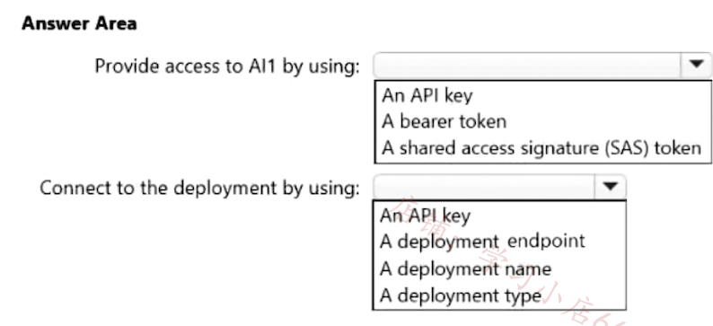
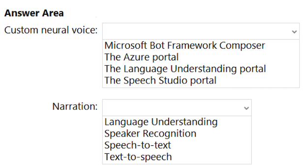

# AI-102 Designing and Implementing a Microsoft Azure AI Solution

## Topic 1

### Question #1   üí©

You have 100 chatbots that each has its own Language Understanding model.

Frequently, you must add the same phrases to each model.

**You need to programmatically update the Language Understanding models to include the new phrases.**

How should you complete the code? To answer, drag the appropriate values to the correct targets. 

Each value may be used once, more than once, or not at all.

You may need to drag the split bar between panes or scroll to view content.


**Box 1: AddPhraseListAsync -**

)

**Box 2: PhraselistCreateObject -**


1. **AddPhraseListAsync**
2. **PhraselistCreateObject**

To programmatically update the Language Understanding models to include new phrases using the LUIS API, the code should be completed with the following values:

- **The method `AddPhraseListAsync` should be used after `client.Features.` to add a phrase list to the model**.
- **The type `PhraselistCreateObject` should be used after `new` to create the phrase list object with the specified properties**.

The completed code is:

```csharp
var phraselistId = await client.Features.AddPhraseListAsync(
    appId, versionId, new PhraselistCreateObject
{
    EnabledForAllModels = false,
    IsExchangeable = true,
    Name = "PL1",
    Phrases = "item1,item2,item3,item4,item5"
});
```

This code adds a phrase list named "PL1" with the given phrases to each LUIS model, minimizing effort by programmatically updating all models.

### Question #2 üí©üí©

You plan to use a Language Understanding application named app1 that is deployed to a container.

- App1 was developed by using a Language Understanding authoring resource named lu1.
- App1 has the versions shown in the following table.


**You need to create a container that uses the latest deployable version of app1.**

Which three actions should you perform in sequence? To answer, move the appropriate actions from the list of actions to the answer area and
arrange them in the correct order.


1. Step -1 --> Select v1.1 of app1.( **We need to use latest version which can be trained or published**)
2. Step 2 --> **Export the model by using the Export for container (GZIP) option**
3. Step -3--> **Run the Container and mount the model file.**

---

1. **Select v1.1**
2. **Export as GZIP**
3. **Run the Container and mount the model file.**


### Question #3

You need to build a chatbot that meets the following requirements:

- ‚úë Supports **chit-chat, knowledge base, and multilingual models**
- ‚úë Performs **sentiment analysis** on user messages
- ‚úë Selects the best language model automatically
  
What should you integrate into the chatbot?


- A. QnA Maker, Language Understanding, and Dispatch
- B. Translator, Speech, and Dispatch
- C. Language Understanding, Text Analytics, and QnA Maker
- D. Text Analytics, Translator, and Dispatch


----

**<mark>LUIS = chit-chat, QnA Maker = knowledge base, Text Analytics = sentiment analysis ‚úÖ</mark>**

These tools together will support chit-chat, knowledge base queries, multilingual capabilities, sentiment analysis, and automatic selection of the
best language model.

- **Language Understanding**: **An AI service that allows users to interact with your applications**, bots, and IoT devices by using natural language.
- **QnA Maker is a cloud-based Natural Language Processing (NLP)** service that allows you to create a natural conversational layer over your data. It is used to find the most appropriate answer for any input from your custom knowledge base (KB) of information.
- **Text Analytics**: Mine insights in unstructured text using natural language processing (NLP)"no machine learning expertise required.
	- Gain a deeper understanding of customer opinions with sentiment analysis. The Language Detection feature of the Azure Text Analytics REST API evaluates text input

Incorrect Answers:

A, B, D: Dispatch uses sample utterances for each of your bot's different tasks (LUIS, QnA Maker, or custom), and builds a model that can be
used to properly route your user's request to the right task, even across multiple bots.


### Question #4 

Your company wants to **reduce how long it takes for employees to log receipts in expense reports**. All the receipts are in English.

You need to extract top-level information from the receipts, such as the vendor and the transaction total. The solution must minimize development effort.

Which Azure service should you use?

- A. Custom Vision
- B. Personalizer
- C. Form Recognizer
- D. Computer Vision

----

**Correct Answer: C**

Azure Form Recognizer is a cognitive service that lets you build automated data processing software using machine learning technology.
Identify and extract text, key/value pairs, selection marks, tables, and structure from your documentsג€"the service outputs structured data
that includes the relationships in the original file, bounding boxes, confidence and more.

###  Question #5 üí©üí©

You need to create a new resource that will be used to perform sentiment analysis and optical character recognition (OCR). The solution must
meet the following requirements:


- ‚úë Use a single key and endpoint to access multiple services.
- ‚úë Consolidate billing for future services that you might use.
- ‚úë Support the use of Computer Vision in the future

**How should you complete the HTTP request to create the new resource?** To answer, select the appropriate options in the answer area.
NOTE: Each correct selection is worth one point.


----


**Box 1: PUT -**

Sample Request: 

PUT https://management.azure.com/subscriptions/00000000-0000-0000-0000-000000000000/resourceGroups/test-rg/providers/
Microsoft.DeviceUpdate/accounts/contoso?api-version=2020-03-01-preview

Incorrect Answers:

**PATCH is for updates.**

**Box 2: CognitiveServices -**

Microsoft Azure Cognitive Services provide us to use its pre-trained models for various Business Problems related to Machine Learning.

List of Different Services are:

- ‚úë Decision
- ‚úë Language (includes sentiment analysis)
- ‚úë Speech
- ‚úë Vision (includes OCR)
- ‚úë Web Search


PUT: 

- puts a file or resource at a specific URI, and exactly at that URI.
- If there's already a file or resource at that URI, PUT replaces that file or resource.
- If there is no file or resource there, PUT creates one.

**POST: POST sends data to a specific URI and expects the resource at that URI to handle the request.**

### Question #6

You are developing a new sales system that will process the video and text from a public-facing website.

**You plan to monitor the sales system to ensure that it provides equitable results regardless of the user's location or background.**

Which two responsible AI principles provide guidance to meet the monitoring requirements? Each correct answer presents part of the solution.

NOTE: Each correct selection is worth one point.


- A. transparency
- B. fairness
- C. inclusiveness 
- D. reliability and safety
- E. privacy and security

---- 

**Correct Answer: BC**  ‚úÖ

**fairness / inclusiveness** ‚úÖ

- AI systems should treat all people fairly.
- AI systems should perform reliably and safely.


**Fairness** is a core ethical principle that all humans aim to understand and apply. This principle is even more important when AI systems are being developed. Key checks and balances need to make sure that the system's decisions **don't discriminate or run a gender, race, sexual orientation, or religion bias toward a group or individual**.


**Inclusiveness** mandates that AI should consider all human races and experiences, and inclusive design practices can help developers to understand
and address potential barriers that could unintentionally exclude people. 

Where possible, speech-to-text, text-to-speech, and visual recognition technology should be used to empower people with hearing, visual, and other impairments.


### Question #7  üí©üí©

You plan to use containerized versions of the Anomaly Detector API on local devices for testing and in on-premises datacenters.

You need to ensure that the containerized deployments meet the following requirements:

- ‚úë Prevent billing and API information from being stored in the command-line histories of the devices that run the container.
- ‚úë Control access to the container images by using Azure role-based access control (Azure RBAC).


Which four actions should you perform in sequence? To answer, move the appropriate actions from the list of actions to the answer area and
arrange them in the correct order.


Perfect, let’s solve this step by step.

---

**üìå Requirements**

1. **Prevent billing and API info from being stored in command-line history**
   ‚Üí You should not hardcode keys in the `docker run` command. Instead, distribute a script or config that securely injects them.

2. **Control access to container images using Azure RBAC**
   ‚Üí This means you should store the container image in **Azure Container Registry (ACR)**, because ACR integrates with Azure RBAC.

---

üìå Available Actions

* Create a custom Dockerfile. ‚ùå (Not needed, Microsoft provides the Anomaly Detector image).
* **Pull the Anomaly Detector container image.** ✅ First step, get the base image from Microsoft’s registry.
* **Push the image to an Azure container registry.** ‚úÖ Store it securely where RBAC applies.
* **Distribute a `docker run` script.** ‚úÖ This allows controlled execution without exposing credentials in command-line history.
* Build the image. ❌ Not required (you’re using Microsoft’s prebuilt Anomaly Detector).
* Push the image to Docker Hub. ‚ùå Not secure (no RBAC, public access).

---

üìå Correct Order

1. **Pull the Anomaly Detector container image**
   * **Create a custom Dockerfile. ？？** 
3. **Push the image to an Azure container registry**
4. **Distribute a `docker run` script**
5. **Run the container locally or in on-premises datacenters** (implicit after the script distribution)

---

‚úÖ Final Answer

* Pull the Anomaly Detector container image
* Push the image to an Azure container registry
* Distribute a `docker run` script
* Run the container


### Question #8

You plan to deploy a containerized version of an Azure Cognitive Services service that will be used for text analysis.

You configure **https://contoso.cognitiveservices.azure.com** as the endpoint URI for the service, and you pull the latest version of the Text Analytics Sentiment Analysis container.

You need to run the container on an Azure virtual machine by using Docker.

How should you complete the command? To answer, select the appropriate options in the answer area.

NOTE: Each correct selection is worth one point.


```
Box 1: mcr.microsoft.com/azure-cognitive-services/textanalytics/sentiment

To run the Sentiment Analysis v3 container, execute the following docker run command. 

docker run --rm -it -p 5000:5000 --memory 8g --cpus \ 
	mcr.microsoft.com/azure-cognitive-services/textanalytics/sentiment \
	Eula=accept \
	Billing={ENDPOINT_URI} \
	ApiKey={API_KEY} 

is the endpoint for accessing the Text Analytics API. https://<your-custom-subdomain>.cognitiveservices.azure.com


Box 2: https://contoso.cognitiveservices.azure.com

{ENDPOINT_URI} is the endpoint for accessing the Text Analytics API: https://<your-custom-subdomain>.cognitiveservices.a The endpoint for
accessing the Text
```

**mcr.microsoft.com/azure-cognitive-services/textanalytics/sentiment** 

**https://contoso.cognitiveservices.azure.com**


### Question #9

You have the following C# method for creating Azure Cognitive Services resources programmatically.


You need to call the method to create a **free Azure resource** in the **West US Azure region**. The resource will be used to generate captions of images automatically.

Which code should you use?

```
A. create_resource(client, "res1", "ComputerVision", "FO", "westus")
B. create_resource(client, "res1", "CustomVision Prediction", "FO", "westus")
C. create_resource(client, "res1", "ComputerVision", "SO", "westus")
D. create_resource(client, "res1", "CustomVision.Prediction", "SO", "westus")
```

----

**A. create_resource(client, "res1", "ComputerVision", "FO", "westus")**.  ‚úÖ

**A, as there is free tier available for Computer Vision service.**

- Free - Web/Container
- 20 per minute
- 5,000 free transactions per month

The ComputerVision resource is more commonly used because it comes with pre-built capabilities for image analysis, including caption generation, without the need to train a custom model. 

On the other hand, the CustomVision.Prediction you must be specifically trained to support generating captions

<mark>**C uses the standard tier, which is not free.**</mark>

### Question #10

You successfully run the following HTTP request.

```
POST https://management.azure.com/subscriptions/18c51a87-3a69-47a8-aedc-a54745f708a1/resourceGroups/RG1/providers/
Microsoft.CognitiveServices/accounts/contoso1/regenerateKey?api-version=2017-04-18
Body{"keyName": "Key2"}
```


What is the result of the request?


- A. A key for Azure Cognitive Services was generated in Azure Key Vault.
- B. A new query key was generated.
- C. The primary subscription key and the secondary subscription key were rotated.
- D. The secondary subscription key was reset

----

**D. The secondary subscription key was reset**.   ‚úÖ

This response is indicated by the "keyName": "Key2" in the request body, specifying that the secondary subscription key (Key2) should be regenerated.

> B is wrong. Query key is for search service. The Rest request of create query key is like POST

The request is to the Azure Management API to regenerate a key for an Azure Cognitive Services account (contoso1). The body of the request
specifies {"keyName": "Key2"}, which indicates that the operation is targeted at the secondary subscription key (commonly referred to as Key2 in Azure Cognitive Services management). 

The regenerateKey action causes the specified key to be reset, generating a new key value for it while invalidating the old one.

### Question #11 üí©üí©

You build a custom **Form Recognizer model**.

You receive sample files to use for training the model as shown in the following table


Which three files can you use to train the model? Each correct answer presents a complete solution. NOTE: Each correct selection is worth one point


- **A. File1**

- B. File2

- **C. File3**

- D. File4

- E. File5

- **F. File6**

----


**ACF**    ‚úÖ


> **Format must be JPG, PNG, PDF (text or scanned), or TIFF**. 
>
> **File size must be less than 50 MB.**


Form Recognizer works on input documents that meet these requirements:

Text-embedded PDFs are best because there's no possibility of error in character extraction and location.

**File size must be less than 50 MB.**

**File 2 and 5 are excluded.**

New service limits now goes up to 500MB so...

File 1, 3, and 6 are correct for "training the model", however if MSFT remove the word "training" from the question - be careful.

For custom model training the total size is still 50MB. Answer is correct

A. File1 (PDF)

C. File3 (JPG)

F. File6 (JPG)


### Question #12

A customer uses Azure Cognitive Search.

The customer plans to enable a server-side encryption and use customer-managed keys (CMK) stored in Azure. What are three implications of the planned change? Each correct answer presents a complete solution.

NOTE: Each correct selection is worth one point


- A. The index size will increase.

- B. Query times will increase.

- C. A self-signed X.509 certificate is required.

- D. The index size will decrease.

- E. Query times will decrease.

- F. Azure Key Vault is required.„ÄÅ


----= 

**ABF**  ‚úÖ

The correct answers are:

- **A — The index size will increase** ✅
- **B — Query times will increase** ✅
- **F — Azure Key Vault is required** ✅

**Reasoning:**

* **Server-side encryption with customer-managed keys (CMK)** in Azure Cognitive Search requires **Azure Key Vault** to store and manage the keys.
* Encrypting the index data adds **encryption metadata** and may affect compression efficiency, so **index size increases**.
* Encryption/decryption adds **processing overhead**, so **query times increase** slightly.
* A self-signed X.509 certificate (C) is not required because Azure Key Vault manages the key infrastructure.
* Index size decreasing (D) and query times decreasing (E) are not realistic results of enabling encryption with CMK.

**Should be ABF (use AKV for customer managed key)**

A. **The index size will increase. Enabling CMK encryption increases the index size1**.

B. Query times will increase. Enabling CMK encryption degrades query performance. **You can expect to see an increase of 30-60 percent in query times1**.

F. Azure Key Vault is required. CMK encryption depends on Azure Key Vault. You can create your own encryption keys and store them in a key vault, or you can use Azure Key Vault APIs to generate encryption keys1


### Question #13 üí©

You are developing a new sales system that will process the video and text from a public-facing website. You plan to notify users that their data has been processed by the sales system.

Which responsible AI principle does this help meet?

- A. transparency

- B. fairness

- C. inclusiveness

- D. reliability and safety

The correct answer is A, transparency: "When an AI application relies on personal data, such as a facial recognition system that takes images of people to recognize them; you should make it clear to the user how their data is used and retained, and who has access to it."


**A. transparency** ‚úÖ

- **"Transparency: AI systems should be understandable."**
- **"Reliability and safety: AI systems should perform reliably and safely."**

**Reasoning:**

* **Transparency** in Microsoft’s Responsible AI principles means **clearly informing users** about how their data is collected, processed, and used.
* By notifying users that their video and text data has been processed, you’re making the system’s operations **visible and understandable** to them.
* **Fairness** is about avoiding bias, **inclusiveness** is about accessibility, and **reliability and safety** is about dependable, secure performance.


### Question #14

You create a web app named app1 that runs on an Azure virtual machine named vm1. Vm1 is on an Azure virtual network named vnet1. You plan to create a new Azure Cognitive Search service named service1.

You need to ensure that app1 can connect directly to service1 without routing traffic over the public internet.

**Solution: You deploy service1 and a public endpoint to a new virtual network, and you configure Azure Private Link.**

Does this meet the goal?


- A. Yes

- B. No


----=

**The Azure Private Link should use a private endpoint, not a public endpoint.**

**Private Link service can be accessed from approved private endpoints in any public region.**

B — No ❌

With Private Link, the private endpoint must be placed in vnet1 (where app1/vm1 lives) or in a peered VNet with proper DNS. Deploying the service with a public endpoint and putting the private endpoint in a new, separate VNet (without mentioning peering/DNS) won’t keep traffic private from app1.


### Question #15

You create a web app named app1 that runs on an Azure virtual machine named vm1. Vm1 is on an Azure virtual network named vnet1. You plan to create a new Azure Cognitive Search service named service1.

You need to ensure that app1 can connect directly to service1 without routing traffic over the public internet.

Solution: **You deploy service1 and a public endpoint, and you configure an IP firewall rule.**

Does this meet the goal?


- A. Yes

- B. No
  
**Instead deploy service1 and a private (not public) endpoint to a new virtual network, and you configure Azure Private Link.**

**A public endpoint with an IP firewall still routes over the public internet (just restricted by IP).**

**To keep traffic off the public internet, you need a private endpoint (Azure Private Link) for the Cognitive Search service and appropriate DNS so app1 on vnet1 connects privately.**

### Question #16

You create a web app named app1 that runs on an Azure virtual machine named vm1. Vm1 is on an Azure virtual network named vnet1. You plan to create a new Azure Cognitive Search service named service1.

You need to ensure that app1 can connect directly to service1 without routing traffic over the public internet.

**Solution: You deploy service1 and a public endpoint, and you configure a network security group (NSG) for vnet1.**

Does this meet the goal?


- A. Yes

- B. No

**Instead deploy service1 and a private (not public) endpoint to a new virtual network, and you configure Azure Private Link**.


----

**Solution:  You deploy service1 and a public endpoint to a new virtual network, and you configure Azure Private Link.**    ‚ùå

Solution: **You deploy service1 and a public endpoint, and you configure an IP firewall rule.**     ‚ùå

**Private Link service can be accessed from approved private endpoints in any public region.**   ‚úÖ

**Solution: You deploy service1 and a public endpoint, and you configure a network security group (SG) for vnet1**. ‚ùå

**Solution:  You deploy service1 and a private endpoint to vnet1.** ‚úÖ
 
###  Question #17

You plan to perform predictive maintenance.


You collect IoT sensor data from 100 industrial machines for a year. Each machine has 50 different sensors that generate data at one-minute intervals. In total, you have 5,000 time series datasets.

You need to identify unusual values in each time series to help predict machinery failures.

Which Azure service should you use?

- A. Anomaly Detector

- B. Cognitive Search

- C. Form Recognizer

- D. Custom Vision

----

**A. Anomaly Detector**  ‚úÖ
 
A is the answer.

**Anomaly Detector is an AI service with a set of APIs, which enables you to monitor and detect anomalies in your time series data with little machine learning (ML) knowledge, either batch validation or real-time inference**.

**A. Azure AI Anomaly Detector**

### Question #18  üí©üí©

You are developing a streaming Speech to Text solution that will use the Speech SDK and MP3 encoding. **You need to develop a method to convert speech to text for streaming MP3 data**.

How should you complete the code? To answer, select the appropriate options in the answer area. NOTE: Each correct selection is worth one point.


----


1. **AudioStreamFormat.GetCompressedFormat.**

2. **SpeechRecognizer   =>  speech to text**

**`SpeechSynthesizer` (for text-to-speech)**


---

üìå Problem

You are developing a **streaming Speech-to-Text** solution using the **Speech SDK** with **MP3 encoding**.

That means:

* You must set the **audio format** to compressed MP3.
* You must use the correct recognizer class (`SpeechRecognizer`) to convert speech to text.

---

üìå Code Completion

1. **Audio Format**
   To handle MP3, you need to use:

```
var audioFormat = AudioStreamFormat.GetCompressedFormat(AudioStreamContainerFormat.MP3);
```

   ‚úÖ This ensures that the SDK interprets the stream as MP3-encoded audio.

2. **Recognizer Type**
   Since you want **speech-to-text**, you need:

```
using (var recognizer = new SpeechRecognizer(speechConfig, audioConfig))
```

- ‚ùå Not `KeywordRecognizer` (for hotwords),
- ‚ùå **Not `SpeakerRecognizer` (for speaker verification)**,
- ‚ùå **Not `SpeechSynthesizer` (for text-to-speech).**

---

üìå Final Completed Code

```
var audioFormat = AudioStreamFormat.GetCompressedFormat(AudioStreamContainerFormat.MP3);

var speechConfig = SpeechConfig.FromSubscription("18c51a87-3a69-47a8-aedc-a54745f708a1", "westus");

var audioConfig = AudioConfig.FromStreamInput(pushStream, audioFormat);

using (var recognizer = new SpeechRecognizer(speechConfig, audioConfig))
{
    var result = await recognizer.RecognizeOnceAsync();
    var text = result.Text;
}
```

---

‚úÖ This will let your solution correctly **stream MP3 audio ‚Üí Speech SDK ‚Üí Text output**.


### Question #19 


You are developing an internet-based training solution for remote learners.

Your company identifies that during the training, some learners leave their desk for long periods or become distracted.


You need to use a video and audio feed from each learner's computer to detect whether the learner is present and paying attention. The solution must minimize development effort and identify each learner.

Which Azure Cognitive Services service should you use for each requirement? To answer, select the appropriate options in the answer area. NOTE: Each correct selection is worth one point.


----


1. Face
2. Face
3. Speech

---

- From Video feed - Face 
- Facial Expression from - Face 
- Audio Feed is - Speech

  
### Question #20  üí©üí©

You plan to provision a QnA Maker service in a new resource group named RG1.

In RG1, you create an App Service plan named AP1.

Which two Azure resources are automatically created in RG1 when **you provision the QnA Maker service**? Each correct answer presents part of the solution.

NOTE: Each correct selection is worth one point.


- A. Language Understanding

- B. Azure SQL Database

- C. Azure Storage

- D. Azure Cognitive Search

- E. Azure App Service

----

* **Azure Cognitive Search** ‚Üí used to index and query the knowledge base. ‚úÖ
* **Azure App Service + App Service plan** ‚Üí hosts the QnA Maker runtime endpoint. ‚úÖ

----

When you provision a **QnA Maker service**, Azure automatically deploys several dependent resources in the **same resource group**:

* **Azure Application Insights** ‚Üí (optional monitoring).
* **Azure Storage** ‚Üí only required for active learning, but not automatically created in all cases.
* **Azure SQL Database** ‚Üí not used (that was older Bot Framework services).
* **Language Understanding (LUIS)** ‚Üí separate service, not bundled.

---

‚úÖ Correct answers:

- **D. Azure Cognitive Search**
- **E. Azure App Service**


### Question #21 üí©üí©

You are building a language model by using a Language Understanding (classic) service. 

You create a new Language Understanding (classic) resource.

You need to add more contributors

What should you use?

- A. a conditional access policy in Azure Active Directory (Azure AD)

- B. the Access control (IAM) page for the authoring resources in the Azure portal

- C. the Access control (IAM) page for the prediction resources in the Azure portal

----

B is the answer.

**B. the Access control (IAM) page for the authoring resources in the Azure portal** ‚úÖ

In the Azure portal, find your Language Understanding (LUIS) authoring resource. It has the type LUIS.Authoring. In the resource's Access Control (IAM) page, add the role of contributor for the user that you want to contribute.

### Question #22 üí©üí©

You have an Azure Cognitive Search service.

During the past 12 months, query volume steadily increased.

You discover that some search query requests to the Cognitive Search service are being throttled.

You need to reduce the likelihood that search query requests are throttled.

**Solution: You migrate to a Cognitive Search service that uses a higher tier.**

Does this meet the goal?

- A. Yes

- B. No

---- 

The correct answer is:

**A — Yes** ✅

**Reasoning:**

* Higher tiers in **Azure Cognitive Search** (e.g., moving from Basic to Standard or from S1 to S2) provide **more resources**, including greater query capacity before throttling occurs.
* This upgrade can reduce throttling without needing to redesign the service.

> **Alternatively, **adding replicas** would also work, but moving to a **higher tier** is a valid way to achieve the goal**.


### Question #23 üí©üí©

You need to develop an automated call handling system that can respond to callers in their own language. The system will support only French and English.

Which Azure Cognitive Services service should you use to meet each requirement? To answer, drag the appropriate services to the correct requirements. Each service may be used once, more than once, or not at all. You may need to drag the split bat between panes or scroll to view content.


----

1. **Speech to Text**
2. **Text to Speech**

---
- Speech to Text with AutoDetectSourceLanguageConfig. It can't be Text Analytics because the input is callers' voice.
- Text to Speech: the output is voice.


### Question #24 üí©üí©

You have receipts that are accessible from a URL.

**You need to extract data from the receipts by using Form Recognizer and the SDK.** The solution must use a prebuilt model. Which client and method should you use?

- A. the FormRecognizerClient client and the StartRecognizeContentFromUri method

- B. the FormTrainingClient client and the StartRecognizeContentFromUri method

- C. the FormRecognizerClient client and the StartRecognizeReceiptsFromUri method

- D. the FormTrainingClient client and the StartRecognizeReceiptsFromUri method

----

 **C. the FormRecognizerClient client and the StartRecognizeReceiptsFromUri method** ‚úÖ

**Should be C**

```
private static async Task AnalyzeReceipt(
	FormRecognizerClient recognizerClient, string receiptUri)
	RecognizedFormCollection receipts = await recognizerClient.StartRecognizeReceiptsFromUri(new Uri(receiptUrl)).WaitForCompletionAsync();
)
```

We need to **extract receipt data using Form Recognizer** and a **prebuilt model**. Let’s analyze:

* **FormRecognizerClient** ‚Üí Used for running recognition (content, layout, invoices, receipts, IDs, etc.). ‚úÖ
* **FormTrainingClient** ‚Üí Used for training custom models. ‚ùå Not needed here since we are using a **prebuilt** model.
* **StartRecognizeContentFromUri** ‚Üí Extracts general text and layout (tables, lines, words), not specifically receipts. ‚ùå
* **StartRecognizeReceiptsFromUri** ‚Üí Uses the **prebuilt receipts model** to extract key fields like merchant name, transaction date, total, etc. ‚úÖ

---

‚úÖ **Correct answer: C. the FormRecognizerClient client and the StartRecognizeReceiptsFromUri method**


### Question #25

You have a collection of 50,000 scanned documents that contain text.

You plan to make the text available through Azure Cognitive Search.

**You need to configure an enrichment pipeline to perform optical character recognition (OCR) and text analytics. The solution must minimize costs**.

What should you attach to the skillset?

- A. a new Computer Vision resource

- B. a free (Limited enrichments) Cognitive Services resource

- C. an Azure Machine Learning Designer pipeline

- D. a new Cognitive Services resource that uses the S0 pricing tier

----

The correct answer is:

**D — a new Cognitive Services resource that uses the S0 pricing tier** ✅

**Reasoning:**

* An **Azure Cognitive Search skillset** that performs **OCR** and **text analytics** requires attaching a **Cognitive Services resource**.
* The **free (F0) tier** (option B) only supports a very limited number of enrichments per month (20 documents/day, 20 calls/minute). With **50,000 documents**, this would quickly exceed limits and isn’t feasible.
* **Computer Vision resource** (A) is unnecessary separately because OCR can be done via the skillset using the attached Cognitive Services resource.
* **Azure ML pipeline** (C) is for custom models, not needed for built-in OCR and text analytics.
* The **S0 tier** (D) provides the required capacity and scalability for large-scale processing, making it the correct choice despite incurring costs.

<mark>To minimize costs at scale while still being able to handle **50,000 documents**, you must use **S0 Cognitive Services**, not the free tier.
</mark>
  
**D - free tier is limited to 10,000 documents**


### Question #26

You have an Azure Cognitive Search service.

During the past 12 months, query volume steadily increased.

You discover that some search query requests to the Cognitive Search service are being throttled.

You need to reduce the likelihood that search query requests are throttled.

**Solution: You add indexes.**

Does this meet the goal?

- A. Yes

- B. No

---

**Correct Answer: B**

**Instead, you could migrate to a Cognitive Search service that uses a higher tier**.


> "How your search queries perform is directly connected to the size and complexity of your indexes. The smaller and more optimized your indexes, the fast Azure Cognitive Search can respond to queries.

The correct answer is:

**B — No** ❌

* Adding **indexes** creates more separate collections of searchable documents, but it **does not increase query throughput** for existing indexes.
* <mark>Throttling due to high **query volume** is solved by **adding replicas**, which increases the number of query processing units.</mark>
* Adding indexes could actually increase complexity without addressing the throttling problem.

---

### Question #27

During the past 12 months, query volume steadily increased.

You discover that some search query requests to the Cognitive Search service are being throttled.

You need to reduce the likelihood that search query requests are throttled.

Solution: You enable customer-managed key (CMK) encryption.

Does this meet the goal?

- A. Yes

- B. No

**B — No** ❌

**Customer-managed key (CMK) encryption does not affect throttling.**

Instead, you could migrate to a Cognitive Search service that uses a higher tier.

**Reason for choosing this option: Enabling customer-managed key (CMK) encryption does not directly impact the throttling of search query requests in Azure Cognitive Search service. CMK encryption is used for data-at-rest encryption and does not affect the performance or capacity of the search service.**


### Question #28

You create a web app named app1 that runs on an Azure virtual machine named vm1. Vm1 is on an Azure virtual network named vnet1. You plan to create a new Azure Cognitive Search service named service1.

**You need to ensure that app1 can connect directly to service1 without routing traffc over the public internet.**

**Solution: You deploy service1 and a private endpoint to vnet1.**

Does this meet the goal?

- A. Yes

- B. No


---

**"deploy service1 and a private endpoint to vnet1." is correct.**

- **A. Yes**

**A private endpoint is a network interface that uses a private IP address from your virtual network. This network interface connects you privately and securely to a service powered by Azure Private Link.** 

**By enabling a private endpoint, you're bringing the service into your virtual network**.

The service could be an Azure service such as:

- ‚úë Azure Storage 
- ‚úë Azure Cosmos DB 
- ‚úë Azure SQL Database 
- ‚úë Your own service using a Private Link Service.

### Question #29  üí©üí©

You have a **Language Understanding resource** named lu1.

You build and deploy an Azure bot named bot1 that uses lu1.

You need to ensure that bot1 adheres to the Microsoft responsible AI principle of inclusiveness. How should you extend bot1?


- A. Implement authentication for bot1.

- B. Enable active learning for lu1.

- C. Host lu1 in a container.

- D. Add Direct Line Speech to bot1.

---


**Correct Answer: D  ‚úÖ**

Inclusiveness: AI systems should empower everyone and engage people.

**<mark>Direct Line Speech is a robust, end-to-end solution for creating a flexible, extensible voice assistant.</mark>** 

The correct answer is:

**D — Add Direct Line Speech to bot1** ✅

**Reasoning:**

* The **Microsoft Responsible AI principle of inclusiveness** focuses on ensuring that AI systems are usable and accessible to people with diverse abilities, backgrounds, and needs.

**Direct Line Speech** enables **speech interaction** with the bot, which can help users who have difficulty typing, reading, or seeing the screen — improving accessibility and inclusiveness.   ✅

---

* **Authentication** (A) addresses security, not inclusiveness.
* **Active learning** (B) helps improve model accuracy, but doesn’t directly relate to inclusiveness.
* **Hosting in a container** (C) is about deployment flexibility, not inclusiveness.


### Question #30 üí©üí©

You are building an app that will process incoming email and direct messages to either French or English language support teams. Which Azure Cognitive Services API should you use? To answer, select the appropriate options in the answer area.

NOTE: Each correct selection is worth one point.


---

**Box1:**

**`https://eastus.api.cognitive.microsoft.com `**   ‚úÖ


Box2:

**`/text/analytics/v3.1/languages`**  ‚úÖ

NOTE:

Pay special attention to the Sample Request provided. Request to the API should be of the form:

**`POST {Endpoint}/text/analytics/v3.0/languages `**


**Where the {Endpoint} as stated under the sub-heading "URI Parameters" was described as quoted here (see "Description" column of the table): "Supported Cognitive Services endpoints (protocol and hostname, for example: https://westus.api.cognitive.microsoft.com)."**

**<mark>Correct format of the *endpoint* as `https://{location}.api.cognitive.microsoft.com`*</mark>**

### Question #31  üí©üí©


You have an Azure Cognitive Search instance that indexes purchase orders by using Form Recognizer.

**You need to analyze the extracted information by using Microsoft Power BI.** The solution must minimize development effort. What should you add to the indexer?


- A. a projection group

- B. a table projection

- C. a file projection

- D. an object projection

---

**Should be B . Its for Tables the Power BI**   ‚úÖ

"Use Power BI for data exploration. This tool works best when the data is in Azure Table Storage. Within Power BI, you can manipulate data into new tables that are easier to query and analyze"


We have an **Azure Cognitive Search index** populated by **Form Recognizer** (structured data from purchase orders).


The requirement is to **analyze the extracted information in Power BI** with **minimal development effort**.

Power BI can directly connect to **Azure Cognitive Search** when the data is structured in **tabular form**.

* **A. a projection group** ‚Üí Just groups multiple projections, not directly consumable. ‚ùå
* **B. a table projection** ‚Üí Converts the index data into a **tabular structure**, which Power BI can easily read. ‚úÖ
* **C. a file projection** ‚Üí Outputs files (JSON, CSV, etc.), not optimized for direct Power BI analysis. ‚ùå
* **D. an object projection** ‚Üí Outputs JSON objects, not directly suitable for Power BI tabular queries. ‚ùå

---

‚úÖ **Answer: B. a table projection**


### Question #32  üí©üí©


You have an Azure Cognitive Search service.

During the past 12 months, query volume steadily increased.

You discover that some search query requests to the Cognitive Search service are being throttled.

You need to reduce the likelihood that search query requests are throttled.

**Solution: You add replicas.**

Does this meet the goal?


- A. Yes

- B. No

---


The correct answer is:

**A — Yes** ✅

In **Azure Cognitive Search**:

* **Replicas** handle **query load**. Adding more replicas increases the number of queries your service can process in parallel, which **reduces the likelihood of throttling** for read/query requests.
* **Partitions** are used to scale **index storage and ingestion throughput**, not query throughput.

Since the problem is **query throttling** and not indexing speed or storage limits, **adding replicas** directly addresses the issue.


---s

**Solution: You add replicas.**   ‚úÖ

**Solution: You add indexes**. ‚ùå

**Solution: You enable customer-managed key (CMK) encryption**.  ‚ùå

**Solution: You migrate to a Cognitive Search service that uses a higher tier.** ‚úÖ


### Question #33  - SIMULATION 

You need to create a Text Analytics service named Text12345678, and then enable logging for Text12345678. The solution must ensure that any changes to Text12345678 will be stored in a Log Analytics workspace.

**To complete this task, sign in to the Azure portal.**


Step 1: Sign in to the QnA portal.

Step 2: Create an Azure Cognitive multi-service resource:


Step 3: On the Create page, provide the following information.


Step 4: Configure additional settings for your resource as needed, read and accept the conditions (as applicable), and then select Review + create.

Step 5: Navigate to the Azure portal. Then locate and select The Text Analytics service resource Text12345678 (which you created in Step 4).

Step 6: Next, from the left-hand navigation menu, locate Monitoring and select Diagnostic settings. This screen contains all previously created diagnostic settings for this resource.

Step 7: Select + Add diagnostic setting.

Step 8: When prompted to configure, select the storage account and OMS workspace that you'd like to use to store you diagnostic logs. Note: If you don't have a storage account or OMS workspace, follow the prompts to create one.

**Step 9: Select Audit, RequestResponse, and AllMetrics. Then set the retention period for your diagnostic log data. If a retention policy is set to zero, events for that log category are stored indefinitely**.

Step 10: Click Save.

It can take up to two hours before logging data is available to query and analyze. So don't worry if you don't see anything right away.

**#Step 1 - create your language service:**

azure portal > search > azure ai services, + create language services, continue to create your resource, create your resource and accept the responsible AI notice,  Review & Create,


**#Step 2 - add your LAW:**

- open your new language service, 
- search for diagnostic settings,
- you may need to search across the top for your specific resource, 
- now + add your diagnostic setting, name, desination log analytics workspace, 
- select your logs and metrics as required to minimize storage costs.

### Question #34  - SIMULATION 

You need to create a search service named search12345678 that will index a sample Azure Cosmos DB database named hotels-sample. The solution must ensure that only English language fields are retrievable.

To complete this task, sign in to the Azure portal

Part 1: Create a search service search12345678 

- Step 1: Sign in to the QnA portal.

- Step 2: Create an Azure Cognitive multi-service resource

- Step 3: On the Create page, provide the following information.

Name: search12345678 -


- Step 4: Click Review + create 

Part 2: Start the Import data wizard and create a data source 

- Step 5: Click Import data on the command bar to create and populate a search index


- Step 6: In the wizard, click Connect to your data > Samples > hotels-sample. This data source is built-in. If you were creating your own data source, you would need to specify a name, type, and connection information. Once created, it becomes an "existing data source" that can be reused in other import operations.


- Step 7: Continue to the next page.

- Step 8: Skip the "Enrich content" page 

- Step 9: Configure index.

Make sure English is selected for the fields.


Step 10: Continue and finish the wizard.


### Question #35  - SIMULATION 

You plan to create a solution to generate captions for images that will be read from Azure Blob Storage.


You need to create a service in Azure Cognitive Services for the solution. The service must be named captions12345678 and must use the Free pricing tier.

To complete this task, sign in to the Azure portal.


Correct Answer: 

Part 1: Create a search service captions12345678 

- Step 1: Sign in to the QnA portal.
- Step 2: Create an Azure Cognitive multi-service resource:
- Step 3: On the Create page, provide the following information.

Name: captions12345678.

Pricing tier: Free -


Step 4: Click Review + create 

Step 5: Create a data source In Connect to your data, choose Azure Blob Storage. Choose an existing connection to the storage account and container you created. Give the data source a name, and use default values for the rest.)


1. Create a Computer Vision resource in Azure AI services using the Free pricing tier.

2. Launch Vision Studio.

3. Select your **Computer Vision resource**.

4. Add new dataset.

5. Enter a dataset name and select Image classification as the model type.

6. Select an Azure blob storage container and Create dataset.

(I don't know in the exam simulation whether the Storage account with a Blob container already exists, if not this would need to be created first)


### Question #36  - SIMULATION 


You need to create a Form Recognizer resource named fr12345678.

Use the Form Recognizer sample labeling tool at https://fott-2-1.azurewebsites.net/ to analyze the invoice located in the C:\Resources\Invoices folder.

Save the results as `C:\Resources\Invoices\Results.json`.

To complete this task, sign in to the Azure portal and open the Form Recognizer sample labeling tool.

Step 1: Sign in to the Azure Portal.

Step 2: Navigate to the Form Recognizer Sample Tool (at https://fott-2-1.azurewebsites.net) 

Step 3: On the sample tool home page select Use prebuilt model to get data.


Step 4: Select the Form Type you would like to analyze from the dropdown window.

Step 5: In the Source: URL field, paste the selected URL and select the Fetch button.

Step 6: In the Choose file for analysis use the file in the C:\Resources\Invoices folder and select the Fetch button.


Step 7: Select Run analysis. The Form Recognizer Sample Labeling tool will call the Analyze Prebuilt API and analyze the document. 

Step 8: View the results - see the key-value pairs extracted, line items, highlighted text extracted and tables detected.


Step 9: Save the results as C:\Resources\Invoices\Results.json.

1. Create a Document Intelligence resource in Azure AI services

2. Launch Document Intelligence Studio

3. Select **Invoices** from the Prebuilt models

4. Configure the service resource by selecting your Document Intelligence Resource

5. Drag & drop of browse for the invoice in **C:\Resources\Invoices**

6. Click Run analysis

7. Click on Result and the Download icon to save the JSON results file

### Question #37 🕵️🕵️🕵️

You have a factory that produces food products.

You need to build a monitoring solution for staff compliance with personal protective equipment (PPE) requirements. The solution must meet the following requirements:

* **Identify staff who have removed masks or safety glasses**.
* Perform a compliance check every 15 minutes.
* Minimize development effort.
* Minimize costs.

Which service should you use?


- A. Face
- B. Computer Vision
- C. Azure Video Analyzer for Media (formerly Video Indexer)

---

**Correct Answer: A**   ‚úÖ

Face API is an AI service that analyzes faces in images.

- **Embed facial recognition into your apps for a seamless and highly secured user experience**.

- No machine-learning expertise is required.

- Features include face detection that perceives facial features and attributes, such as a face mask, glasses, or face location

- An image, and identification of a person by a match to your private repository or via photo ID

### Question #38


You have an Azure Cognitive Search solution and a collection of blog posts that include a category field. You need to index the posts. The solution must meet the following requirements:

* Include the category field in the search results.

* Ensure that users can search for words in the category field.

* Ensure that users can perform drill down filtering based on category.

Which index attributes should you configure for the category field?


- A. searchable, sortable, and retrievable

- B. searchable, facetable, and retrievable

- C. retrievable, filterable, and sortable

- D. retrievable, facetable, and key

---

**B. searchable, facetable, and retrievable**   ‚úÖ

**Retrievable: Include the category field in the search results.**

**Searchable: Ensure that users can search for words in the category field.**

<mark>**Facetable: Ensure that users can perform drill down filtering based on category.**</smark>


### Question #38-1

We have an **Azure Cognitive Search index** populated by **Form Recognizer** (structured data from purchase orders).

The requirement is to **analyze the extracted information in Power BI** with **minimal development effort**.

Power BI can directly connect to **Azure Cognitive Search** when the data is structured in **tabular form**.

* **A. a projection group** ‚Üí Just groups multiple projections, not directly consumable. ‚ùå
* **B. a table projection** ‚Üí Converts the index data into a **tabular structure**, which Power BI can easily read. ‚úÖ
* **C. a file projection** ‚Üí Outputs files (JSON, CSV, etc.), not optimized for direct Power BI analysis. ‚ùå
* **D. an object projection** ‚Üí Outputs JSON objects, not directly suitable for Power BI tabular queries. ‚ùå

---

‚úÖ **Answer: B. a table projection**


### Question #39 - SIMULATION 

Use the following login credentials as needed:

To enter your username, place your cursor in the Sign in box and click on the username below.

To enter your password, place your cursor in the Enter password box and click on the password below.

Azure Username: admin@abc.com -

Azure Password: XXXXXXXXXXXX The following information is for technical support purposes only:

Lab Instance: 12345678 -

**Task -**

You plan to build an API that will identify whether an image includes a Microsoft Surface Pro or Surface Studio.

You need to deploy a service in Azure Cognitive Services for the API. The service must be named AAA12345678 and must be in the East US Azure region. The solution must use the Free pricing tier.

To complete this task, sign in to the Azure portal

Correct Answer: See explanation below.


- Step 1: In the Azure dashboard, click Create a resource.

- Step 2: In the search bar, type "Cognitive Services."

You'll get information about the cognitive services resource and a legal notice. Click Create.


- Step 3: You'll need to specify the following details about the cognitive service (refer to the image below for a completed example of this page):
	- Subscription: choose your paid or trial subscription, depending on how you created your Azure account.
  	- Resource group: click create new to create a new resource group or choose an existing one.
  	- Region: choose the Azure region for your cognitive service. Choose: East US Azure region.
  	- Name: choose a name for your cognitive service. Enter: AAA12345678 Pricing Tier: Select: Free pricing tier


**Step 4: Review and create the resource, and wait for deployment to complete. Then go to the deployed resource.**

Note: The Computer Vision Image Analysis service can extract a wide variety of visual features from your images. For example, it can determine whether an image contains adult content, find specific brands or objects, or find human faces.


**Computer Vision** should be the resource we need to create.


### Question #40 - SIMULATION 

Use the following login credentials as needed:

To enter your username, place your cursor in the Sign in box and click on the username below.

To enter your password, place your cursor in the Enter password box and click on the password below.

- Azure Username: admin@abc.com -

- Azure Password: XXXXXXXXXXXX 

The following information is for technical support purposes only:

- Lab Instance: 12345678 -

Task You need to build an API that uses the service in Azure Cognitive Services named AAA12345678 to identify whether an image includes a Microsoft Surface Pro or Surface Studio.

- To achieve this goal, you must use the sample images in the C:\Resources\Images folder.
- To complete this task, sign in to the Azure portal.


**Correct Answer:**

- Step 1: In the Azure dashboard, click Create a resource.

- Step 2: In the search bar, type "Cognitive Services."

You'll get information about the cognitive services resource and a legal notice. Click Create.

- Step 3: You'll need to specify the following details about the cognitive service (refer to the image below for a completed example of this page):

Subscription: choose your paid or trial subscription, depending on how you created your Azure account.

Resource group: click create new to create a new resource group or choose an existing one.

Region: choose the Azure region for your cognitive service. Choose: East US Azure region.

Name: choose a name for your cognitive service. Enter: AAA12345678 Pricing Tier: Select: Free pricing tier

- Step 4: Review and create the resource, and wait for deployment to complete. Then go to the deployed resource.

Note: **The Computer Vision Image Analysis service can extract a wide variety of visual features from your images**. For example, it can determine whether an image contains adult content, find specific brands or objects, or find human faces.


### Question #41 - SIMULATION 

Use the following login credentials as needed:

To enter your username, place your cursor in the Sign in box and click on the username below.

To enter your password, place your cursor in the Enter password box and click on the password below.

Azure Username: admin@abc.com -

Azure Password: XXXXXXXXXXXX -

The following information is for technical support purposes only:

Lab Instance: 12345678 -

**Task You need to get insights from a video file located in the C:\Resources\Video\Media.mp4 folder.**

**Save the insights to the C:\Resources\Video\Insights.json folder.**

To complete this task, sign in to the Azure Video Analyzer for Media at https://www.videoindexer.ai/ by using admin@abc.com

Correct Answer: See explanation below.

- Step 1: Login Browse to the Azure Video Indexer website and sign in. URL: https://www.videoindexer.ai/

Login admin@abc.com -

- Step 2: Create a project from your video

You can create a new project directly from a video in your account.

1. Go to the Library tab of the Azure Video Indexer website.

2. Open the video that you want to use to create your project. On the insights and timeline page, select the Video editor button.

Folder: C:\Resources\Video\Media.mp4

This takes you to the same page that you used to create a new project. Unlike the new project, you see the timestamped insights segments of the video, that you had started editing previously.


Step 3: Save the insights to the C:\Resources\Video\Insights.json folder.

### Question #42 **SIMULATION** 

Use the following login credentials as needed:

To enter your username, place your cursor in the Sign in box and click on the username below.

To enter your password, place your cursor in the Enter password box and click on the password below.

Azure Username: admin@abc.com -

Azure Password: XXXXXXXXXXXX The following information is for technical support purposes only:

Lab Instance: 12345678 -

Task You plan to analyze stock photography and automatically generate captions for the images.

You need to create a service in Azure to analyze the images. The service must be named caption12345678 and must be in the East US Azure region. The solution must use the Free pricing tier.

In the C:\Resources\Caption\Params.json folder, enter the value for Key 1 and the endpoint for the new service.

To complete this task, sign in to the Azure portal.

- **Step 1: Provision a Cognitive Services resource**

If you don't already have one in your subscription, you'll need to provision a Cognitive Services resource

1. Open the Azure portal at https://portal.azure.com, and sign in using the Microsoft account associated with your Azure subscription
2. Select the Create a resource button, search for cognitive services, and create a Cognitive Services resource with the following settings:

* Subscription: Your Azure subscription
* Resource group: Choose or create a resource group (if you are using a restricted subscription, you may not have permission to create a new resource group - use the one provided)
* Name: caption12345678 -
* **Pricing tier: Free F0** -

3. Select the required checkboxes and create the resource.

Wait for deployment to complete, and then view the deployment details.

4. When the resource has been deployed, go to it and view its Keys and Endpoint page. You will need the endpoint and one of the keys from this page in the next procedure.


Step 2: **Save Key and Endpoint values in Params.json Open the configuration file, C:\Resources\Caption\Params.json**. and update the configuration values it contains to reflect the endpoint and an authentication key for your cognitive services resource. Save your changes.

### Question #43 **SIMULATION**


Use the following login credentials as needed:

To enter your username, place your cursor in the Sign in box and click on the username below.

To enter your password, place your cursor in the Enter password box and click on the password below.

Azure Username: admin@abc.com -

Azure Password: XXXXXXXXXXXX The following information is for technical support purposes only:

Lab Instance: 12345678 -

Task You plan to build an application that will use caption12345678. The application will be deployed to a virtual network named VNet1. You need to ensure that only virtual machines on VNet1 can access caption12345678.

To complete this task, sign in to the Azure portal.


**Step 1: Create private endpoint for your web app**


1. In the left-hand menu, select All Resources > caption12345678 - the name of your web app.

2. In the web app overview, select Settings > Networking.

3. In Networking, select Private endpoints.

4. Select + Add in the Private Endpoint connections page.

5. Enter or select the following information in the Add Private Endpoint page:

- Name: Enter caption12345678.
- Subscription Select your Azure subscription.
- Virtual network Select VNet1
- Subnet: Integrate with private DNS zone: Select Yes.


### Question #44 SIMULATION 


Use the following login credentials as needed:

To enter your username, place your cursor in the Sign in box and click on the username below.

To enter your password, place your cursor in the Enter password box and click on the password below.

Azure Username: admin@abc.com -

Azure Password: XXXXXXXXXXXX The following information is for technical support purposes only:

Lab Instance: 12345678 -

Task You need to ensure that a user named admin@abc.com can regenerate the subscription keys of AAA12345678. The solution must use the principle of least privilege.

To complete this task, sign in to the Azure portal.


**Manually rotate subscription keys**

1. (Update your application code to reference the secondary key for the Azure account and deploy.)

2. In the Azure portal, navigate to your Azure account.

3. Under Settings, select Authentication.

4. To regenerate the primary key for your Azure account, select the Regenerate button next to the primary key.

5. (Update your application code to reference the new primary key and deploy.)

6. Regenerate the secondary key in the same manner.

**Cognitive Services Contributor**

Lets you create, read, update, delete and manage keys of Cognitive Services.


### Question #45

You have an Azure IoT hub that receives sensor data from machinery.

You need to build an app that will perform the following actions:

- • Perform anomaly detection across multiple correlated sensors.

- • Identify the root cause of process stops.

- • Send incident alerts.

The solution must minimize development time.

Which Azure service should you use?


- A. Azure Metrics Advisor

- B. Form Recognizer

- C. Azure Machine Learning

- D. Anomaly Detector


---

- **A. Azure Metrics Advisor**    ‚úÖ

**Metrics Advisor is a part of Azure Applied AI Services that uses AI to perform data monitoring and anomaly detection in time series data.**

We need to evaluate the requirements carefully:

**Requirements:**

* Perform anomaly detection across **multiple correlated sensors**
* Identify the **root cause** of process stops
* Send **incident alerts**
* **Minimize development time**

---

**Option analysis:**

* **A. Azure Metrics Advisor** ‚úÖ
	* Built on top of Anomaly Detector, but designed for **time-series monitoring** across multiple metrics.
	* Provides **root cause analysis (RCA)** and **incident alerts** out of the box.
	* Best fit for IoT sensor monitoring with minimal coding.

* **B. Form Recognizer** ‚ùå
	* Used for extracting structured data from documents (receipts, invoices, forms). Not relevant.

* **C. Azure Machine Learning** ‚ùå
	* Could solve the problem, but requires building and training custom ML models = **not minimal development time**.

* **D. Anomaly Detector** ‚ùå
	* <mark>Detects anomalies in a **single time series**. Does not handle **multiple correlated sensors** or root cause analysis by itself</mark>.

---

‚úÖ **Correct answer: A. Azure Metrics Advisor**


### Question #46 🐼🐼💩💩

You have an app that analyzes images by using the Computer Vision API.

You need to configure the app to provide an output for users who are vision impaired. The solution must provide the output in complete sentences.

Which API call should you perform?

- A. readInStreamAsync

- B. analyzeImagesByDomainInStreamAsync

- C. tagImageInStreamAsync

- D. describeImageInStreamAsync

**Correct Answer: D**

<mark>**The API call you should perform to provide an output in complete sentences for users who are vision impaired** is **describeImageInStreamAsync**.</mark>

The correct answer is: ‚úÖ **D. describeImageInStreamAsync**

**Explanation:**

Here’s what each API call does:

| API Method                             | Description                                                                                                                               | Output Type                                                         |
| -------------------------------------- | ----------------------------------------------------------------------------------------------------------------------------------------- | ------------------------------------------------------------------- |
| **readInStreamAsync**                  | Performs **OCR (Optical Character Recognition)** to extract text from an image.                                                           | Extracted text only                                                 |
| **analyzeImagesByDomainInStreamAsync** | Analyzes an image within a **specific domain model** (e.g., celebrities, landmarks).                                                      | Domain-specific data                                                |
| **tagImageInStreamAsync**              | Returns a list of **tags** (keywords) describing objects and concepts in the image.                                                       | Short tags (e.g., “person”, “tree”, “dog”)                          |
| **describeImageInStreamAsync**         | Generates a **human-readable description** of the image in **complete sentences**, suitable for accessibility or visually impaired users. | Full sentence (e.g., “A man riding a skateboard on a city street.”) |


### Question #47 🐼🐼💩💩

You have a Custom Vision service project that performs object detection. The project uses the General domain for classification and contains a trained model.

**You need to export the model for use on a network that is disconnected from the internet.**

Which three actions should you perform **in sequence?** To answer, move the appropriate actions from the list of actions to the answer area and arrange them in the correct order.


---

1. **Change Domains to General (compact)** üí©üí©

2. **Retrain model**

3. **Export model**

### Question #48 🐼🐼💩💩


You are building an AI solution that will use Sentiment Analysis results from surveys to calculate bonuses for customer service staff.

You need to ensure that the solution meets the Microsoft responsible AI principles.

What should you do?


- A. Add a human review and approval step before making decisions that affect the staff's financial situation.

- B. Include the Sentiment Analysis results when surveys return a low confidence score.

- C. Use all the surveys, including surveys by customers who requested that their account be deleted and their data be removed.

- D. Publish the raw survey data to a central location and provide the staff with access to the location.

---

The correct answer is:

**A — Add a human review and approval step before making decisions that affect the staff's financial situation** ✅

**Reasoning:**

* Microsoft’s **Responsible AI principles** emphasize **accountability, fairness, and reliability** when AI influences people’s lives.
* Because the solution directly impacts **employee compensation**, fully automating the decision could introduce bias or errors.
* A **human-in-the-loop** step ensures oversight, fairness, and accountability before finalizing financial outcomes.

Other options:

* **B:** Including low-confidence results could harm fairness and reliability.  ‚ùå
* **C:** Using data from customers who requested deletion violates **privacy** and **compliance** requirements. ‚ùå
* **D:** Publishing raw survey data risks violating **privacy** and isn’t necessary for fairness or transparency.

### Question #49

You have an Azure subscription that contains a Language service resource named ta1 and a virtual network named vnet1.

You need to ensure that only resources in vnet1 can access ta1.

What should you configure?


- A. a network security group (NSG) for vnet1

- B. Azure Firewall for vnet1

- C. the virtual network settings for ta1

- D. a Language service container for ta1


---

**Correct Answer: C**

The correct answer is: ‚úÖ **C. the virtual network settings for ta1**

---

**Explanation:**

To **restrict access to an Azure AI Language service (ta1)** so that **only resources within a specific virtual network (vnet1)** can reach it, you must **enable network isolation** by configuring **private endpoint or virtual network access settings** on the Language resource itself.

---


| Option                                    | Description                                                                                                                                                           | Correct? |
| ----------------------------------------- | --------------------------------------------------------------------------------------------------------------------------------------------------------------------- | -------- |
| **A. NSG for vnet1**                      | A Network Security Group filters inbound/outbound traffic *within* a VNet or subnet, but it **cannot restrict access to a PaaS service** like Azure AI Language.      | ‚ùå        |
| **B. Azure Firewall for vnet1**           | A firewall can control outbound traffic to external services, but it doesn’t enforce **resource-level isolation** for the Language service.                           | ❌        |
| **C. Virtual network settings for ta1**   | This allows you to configure a **private endpoint** or restrict access to a **specific VNet**, ensuring that only resources in vnet1 can access the Language service. | ‚úÖ        |
| **D. Language service container for ta1** | Containers allow on-prem or isolated deployment, but this doesn’t configure access control for an existing cloud resource.                                            | ❌        |

---

‚úÖ **Final Answer: C. the virtual network settings for ta1**


### Question #50

You are developing a monitoring system that will analyze engine sensor data, such as rotation speed, angle, temperature, and pressure. The system must generate an alert in response to atypical values.

What should you include in the solution?

- A. Application Insights in Azure Monitor

- B. metric alerts in Azure Monitor

- C. Multivariate Anomaly Detection

- D. Univariate Anomaly Detection


<mark>if there is no **metrics advisor** then choose Multivariate Anomaly detection as secondary option, Metrics Advisor is the best answer</mark>

The correct answer is:

**C — Multivariate Anomaly Detection** ✅

**Reasoning:**

* The monitoring system must analyze **multiple related sensor signals together** (rotation speed, angle, temperature, pressure).
* These signals can have **correlated behaviors**, so anomalies should be detected based on their combined patterns, not in isolation.
* **Multivariate Anomaly Detection** in Azure AI is designed for exactly this — detecting anomalies across multiple interdependent time-series.

Other options:

* **A (Application Insights):** Used for monitoring applications, not sensor data.
* **B (metric alerts):** Good for threshold-based alerts but not advanced anomaly detection.
* <mark>**D (Univariate Anomaly Detection):** Only works on a single time series, not sufficient for correlated sensor data.</mark>


### Question #51 🐼🐼💩💩

You have an app named App1 that uses an Azure Cognitive Services model to identify anomalies in a time series data stream.

You need to run App1 in a location that has limited connectivity. The solution must minimize costs.

What should you use to host the model?


- A. Azure Kubernetes Service (AKS)

- B. Azure Container Instances

- C. a Kubernetes cluster hosted in an Azure Stack Hub integrated system

- D. the Docker Engine

You must satisfy the following prerequisites before using Azure AI containers:

**Docker Engine: You must have Docker Engine installed locally.**

The correct answer is:

**D — the Docker Engine** ✅

**Reasoning:**

* Azure Cognitive Services allows certain models to be **deployed locally in containers**.
* Using the **Docker Engine** lets you run the model **on-premises or in environments with limited connectivity** without relying on cloud-managed services.
* This approach **minimizes costs** because you don’t need to provision or pay for cloud compute resources continuously.

Other options:

* **A (AKS)** and **B (ACI)** require full Azure connectivity and are cloud-based, which doesn’t suit limited connectivity scenarios.
* **C (Kubernetes on Azure Stack Hub)** is possible but adds unnecessary complexity and cost for a simple local deployment.

 
### Question #52 🐼🐼💩💩

You have an Azure Cognitive Search resource named Search1 that is used by multiple apps.

You need to secure Search1. The solution must meet the following requirements:

- Prevent access to Search1 from the internet.

- **Limit the access of each app to specific queries**.

What should you do? To answer, select the appropriate options in the answer area.

NOTE: Each correct selection is worth one point.


---

- <mark>**Create Private Endpoint**</mark>
- <mark>**Use Azure Roles**</mark>

**Private Endpoints for Azure Cognitive Search allow a client on a virtual network to securely access data in a search index over a Private Link. The private endpoint uses an IP address from the virtual network address space for your search service**. 


Network traffic between the client and the search service traverses over the virtual network and a private link on the Microsoft backbone network, eliminating exposure from the public internet.


**In some scenarios, you may want to limit application's access to a single resource, such as an index.**

The portal doesn't currently support role assignments at this level of granularity, but it can be done with PowerShell or the Azure CLI.


### Question #53

You are building a solution that will detect anomalies in sensor data **from the previous 24 hours**.

**You need to ensure that the solution scans the <mark>entire dataset, at the same time, for anomalies.**<mark>

Which type of detection should you use?

- A. batch

- B. streaming

- C. change points

Batch detection 

The correct answer is:  

**A. Batch**  

**Why Batch Detection?**  

**Full Dataset Analysis**:  
   
- Batch processing is designed to analyze **entire datasets at once**, making it ideal for scanning 24 hours of sensor data **simultaneously**.
- It processes all data in a single operation, ensuring **consistent anomaly detection across the entire timeframe**.  

**Why Not the Others?**  

| Option | Issue |  
|--------|-------|  
| **B. Streaming** | Processes data **in real-time**, not suited for retrospective 24-hour analysis. |  
| **C. Change Points** | Detects **sudden shifts** (e.g., spikes/drops) **but doesn’t scan the entire dataset for anomalies**. |  


### Question #54  üí©üí©

You are building an app that will scan confidential documents and use the Language service to analyze the contents.

You provision an Azure Cognitive Services resource.

**You need to ensure that the app can make requests to the Language service endpoint**. The solution must ensure that confidential documents remain on-premises.

Which three actions should you perform in sequence? To answer, move the appropriate actions from the list of actions to the answer area and arrange them in the correct order.


---

1. **Provision on-premise k8s cluster that is isolated from Internet** üí©üí©

2. **Pull image from MCR**

3. **Run container and specify API key and endpoint URL of Cognitive Services Services**

Containers enable you to run Cognitive Services APIs in your own environment, and are great for your specific security and data governance requirements. Disconnected containers enable you to use several of these APIs disconnected from the internet.

These containers are hosted on the Microsoft Container Registry and available for download on Microsoft Artifact Registry and Docker Hub. You won't be able to run the container if your Azure subscription has not been approved after completion of the request form


### Question #55

You have an Azure subscription that has the following configurations:

- **Subscription ID: 8d3591aa-96b8-4737-ad09-00f9b1ed35ad**

- Tenant ID: 3edfe572-cb54-3ced-ae12-c5c177f39a12


You plan to create a resource that will perform sentiment analysis and optical character recognition (OCR).

You need to use an HTTP request to create the resource **in the subscription.** The solution must use a single key and endpoint.

How should you complete the request? To answer, select the appropriate options in the answer area.

NOTE: Each correct selection is worth one point.


1. **subscriptions/8d3591aa-96b8-4737-ad09-00f9b1ed35ad**

2. **Microsoft.CognitiveServices**


You can access Azure Cognitive Services through two different resources: A multi-service resource, or a single-service one.

- Multi-service resource:

**Access multiple Azure Cognitive Services with a single key and endpoint.**


- **The solution must use a single key and endpoint. - Cognitive Services** 
- **You need to use an HTTP request to create the resource in the subscription. - obviously subscription**


### Question #56 

You have an Azure subscription that contains an Anomaly Detector resource.

You deploy a Docker host server named Server1 to the on-premises network.

You need to host an instance of the Anomaly Detector service on Server1.

Which parameter should you include in the docker run command?


- A. Fluentd

- B. Billing

- C. Http Proxy

- D. Mounts


---

**The Eula, Billing**, and ApiKey options must be specified to run the container; otherwise, the container won't start. 

For more information, see Billing The ApiKey value is the Key from the Keys and Endpoints page in the LUIS portal and is also available on the Azure Cognitive Services resource keys page.

```
Billing={ENDPOINT_URI}


docker run --rm -it -p 5000:5000 --memory 4g --cpus 1 
	\ mcr.microsoft.com/azure-cognitive-services/decision/anomaly-detector:latest 
    \ Eula=accept 
    \ Billing={ENDPOINT_URI} 
    \ ApiKey={API_KEY}
```


### Question #57  🐼🐼

You are building an app that will use the Speech service.


You need to ensure that the app can authenticate to the service by **using a Microsoft Azure Active Directory (Azure AD), part of Microsoft Entra, token**.

Which two actions should you perform? Each correct answer presents part of the solution.

NOTE: Each correct selection is worth one point.

- A. Enable a virtual network service endpoint.

- B. Configure a custom subdomain.

- C. Request an X.509 certificate.

- D. Create a private endpoint.

- E. Create a Conditional Access policy.


---

**To authenticate with a Microsoft Entra token, the Speech resource must have a custom subdomain and use a private endpoint.**

‚úÖ Correct Answers:

1. **B. Configure a custom subdomain**
2. **E. Create a Conditional Access policy**

**two actions**:

---
**1. B. Configure a custom subdomain**  

- Azure Speech service requires a **custom subdomain** (e.g., `yourresource.cognitiveservices.azure.com`) for **Azure AD authentication**.  
- Without a custom subdomain, the service defaults to a shared regional endpoint (e.g., `eastus.api.cognitive.microsoft.com`), which **does not support Azure AD tokens**.  
- **Steps**:
	- In the Azure portal, go to your **Speech service resource** ‚Üí **Networking** ‚Üí **Custom domain** ‚Üí Set a unique subdomain.  

**2. E. Create a Conditional Access policy** 

- A **Conditional Access policy** enforces security controls (e.g., MFA, device compliance) when apps request Azure AD tokens for the Speech service.  
- This ensures only authorized users/apps can authenticate.  
- **Steps**:  
	- In **Microsoft Entra ID (Azure AD)** ‚Üí **Security** ‚Üí **Conditional Access** ‚Üí Create a policy targeting the Speech service.  

---

**Why Not the Other Options?**

| Option | Why It’s Wrong |
|--------|---------------|
| **A. Enable a virtual network service endpoint** | U**sed for network isolation, not authentication**. |
| **C. Request an X.509 certificate** | Used for TLS/mTLS, not Azure AD token auth. |
| **D. Create a private endpoint** | **Secures traffic privately but doesn’t enable Azure AD auth.** |


### Question #58 üí©üí©

You plan to deploy an Azure OpenAI resource by using an Azure Resource Manager (ARM) template.

**You need to ensure that the resource can respond to 600 requests per minute**.

How should you complete the template? To answer, select the appropriate options in the answer area.

NOTE: Each correct selection is worth one point.


---


* **Capacity**
* **600**

Azure OpenAI allows you to manage how frequently your application can make inferencing requests. Your rate limits are based on Tokens-perMinute (TPM). **For example, if you have a capacity of 1, this equals 1,000 TPM**, and the rate limit of requests you can make per minute (RPM) is calculated using a ratio. For every 1,000 TPM, you can make 6 RPM.

When a deployment is created, the assigned TPM will directly map to the tokens-per-minute rate limit enforced on its inferencing requests. A Requests-Per-Minute (RPM) rate limit will also be enforced whose value is set proportionally to the TPM assignment using the following ratio:

**Capacity Requirements for 600 RPM:**

* If the default quota is insufficient (e.g., 300 RPM), you must request a quota increase via Azure Support or adjust deployment settings.
* In ARM templates, specify the capacity parameter under the deployment resource to match your needs.

```
{
  "type": "Microsoft.CognitiveServices/accounts/deployments",
  "apiVersion": "2023-10-01",
  "properties": {
    "model": {
      "format": "OpenAI",
      "name": "gpt-3.5-turbo",
      "version": "0613"
    },
    "scaleSettings": {
      "capacity": 600  // Target RPM capacity
    }
  }
}
```

In an **ARM template** for Azure OpenAI deployments, the `sku` block defines the **scale settings**. To set requests per minute (RPM), you configure the **capacity** property.

---

**Requirement**

You need **600 requests per minute**.

---

**Correct completion**

```json
"sku": {
  "name": "Standard",
  "capacity": 600
}
```

---

‚úÖ **Answer:**

* First dropdown ‚Üí **"capacity"**
* Second dropdown ‚Üí **600**


 
### Question #59  üí©üí©

You have an app that manages feedback.

You need to ensure that the app can detect negative comments by using the Sentiment Analysis API in Azure AI Language. **The solution must ensure that the managed feedback remains on your company’s internal network.**

Which three actions should you perform in sequence? To answer, move the appropriate actions from the list of actions to the answer area and arrange them in the correct order.

NOTE: More than one order of answer choices is correct. You will receive credit for any of the correct orders you select.


---

1. **Provision the Language service resource in Azure**. This step involves creating the Azure Language service resource, **which will provide you with the necessary credentials and endpoint URL to use the Sentiment Analysis API**.

2. **Deploy a Docker container to an on-premises server**. By deploying a Docker container on-premises, you can run the Sentiment Analysis API locally, ensuring that the feedback data does not leave your internal network.

3. **Run the container and query the prediction endpoint**. Once the container is running on your on-premises server, **you can start sending feedback data to the Sentiment Analysis API by querying the prediction endpoint provided by the Language service.**


### Question #60

You have an Azure OpenAI resource named AI1 that hosts three deployments of the GPT 3.5 model. Each deployment is optimized for a unique workload.

You plan to deploy three apps. Each app will access AI1 by using the REST API and will use the deployment that was optimized for the app's intended workload.

**You need to provide each app with access to AI1 and the appropriate deployment. The solution must ensure that only the apps can access AI1.**

What should you use to provide access to AI1, and what should each app use to connect to its appropriate deployment? To answer, select the appropriate options in the answer area.

NOTE: Each correct selection is worth one point.




---

- An API key 

- A deployment endpoint

```
API Key 
Deployment Name:

ÔÖá ÔÄá
curl $AZURE_OPENAI_ENDPOINT/openai/deployments/gpt-35-turbo-instruct/completions?api-version=2023-05-15 \

	-H "Content-Type: application/json" \

	-H "api-key: $AZURE_OPENAI_API_KEY" \

	-d "{\"prompt\": \"Once upon a time\"}"
```


### Question #61

You build a bot by using the Microsoft Bot Framework SDK.

You start the bot on a local computer.

You need to validate the functionality of the bot.

What should you do before you connect to the bot?

- A. Run the Bot Framework Emulator.

- B. Run the Bot Framework Composer.

- C. Register the bot with Azure Bot Service.

- D. Run Windows Terminal


---

The correct answer is:

**‚úÖ A. Run the Bot Framework Emulator.**

---

**Reasoning**

* When you build a bot locally using the **Microsoft Bot Framework SDK**, you need a way to test it before deploying to Azure.
* **Bot Framework Emulator** is a desktop app that lets you connect to your bot’s local endpoint (e.g., `http://localhost:3978/api/messages`) and interact with it as if it were live.
	* **Option B** (Bot Framework Composer) is a design/build tool for creating bots, not just for testing an SDK bot.
	* **Option C** (Register with Azure Bot Service) is only required for cloud hosting or channels like Teams, not for local testing.
	* **Option D** (Windows Terminal) is just a command-line tool — it doesn’t test bot functionality.


### Question #62 üí©üí©

You have an Azure OpenAI model named AI1.

You are building a web app named App1 by using the Azure OpenAI SDK.

You need to configure App1 to connect to AI1.

What information must you provide?


- A. the endpoint, key, and model name

- B. the deployment name, key, and model name

- C. the deployment name, endpoint, and key

- D. the endpoint, key, and model type

---

**C. the deployment name, endpoint, and key** ‚úÖ


### Question #63  🐼🐼💩💩

You are building a solution in Azure that will use Azure Cognitive Service for Language to process sensitive customer data.


You need to ensure that only specific Azure processes can access the Language service. The solution must minimize administrative effort.

What should you include in the solution?

- A. IPsec rules

- B. Azure Application Gateway

- C. a virtual network gateway

- D. virtual network rules

---

**because it helps configure IP range address to restrict access to an end point only to services deployed in those IP ranges. this way the access can be restricted**. 


The correct answer is:

**D — virtual network rules** ✅

**Reasoning:**

* **Virtual network (VNet) rules** allow you to **restrict access to Azure resources** (like Cognitive Services) so that only specific VNets or subnets can communicate with the service.
* This ensures that **only approved Azure processes or resources** can access the Language service, enhancing security for sensitive data.
* It also **minimizes administrative effort** compared to managing IPsec rules or gateways manually.

Other options:

* **A (IPsec rules):** More complex to configure and maintain; not needed for internal Azure traffic restrictions.
* **B (Application Gateway):** Mainly used for load balancing and web application security, not for restricting service access.
* **C (Virtual network gateway):** Used for VPN or ExpressRoute connectivity, not for restricting service access within Azure.


### Question #64 🐼🐼💩💩

You have a Microsoft OneDrive folder that contains a 20-GB video file named File1.avi.

You need to index File1.avi by using the Azure Video Indexer website.

What should you do?

- A. Upload File1.avi to the www.youtube.com webpage, and then copy the URL of the video to the Azure AI Video Indexer website.

- B. Download File1.avi to a local computer, and then upload the file to the Azure AI Video Indexer website.

- C. From OneDrive, create a download link, and then copy the link to the Azure AI Video Indexer website

- D. From OneDrive, create a sharing link for File1.avi, and then copy the link to the Azure AI Video Indexer website.

---

To index **File1.avi** (a 20 GB video file stored in **Microsoft OneDrive**) using **Azure Video Indexer**, the best approach is:  

**‚úÖ Correct Answer: <mark>D. From OneDrive, create a sharing link for File1.avi, and then copy the link to the Azure AI Video Indexer website. </mark>**  

1. **Avoids Large File Uploads (20 GB is too big for direct upload)**  
	- Azure Video Indexer supports **direct indexing from cloud storage** (OneDrive, SharePoint, Azure Blob, etc.) via **URLs**.  
	- Uploading a 20 GB file manually (Option B) would be slow and impractical.  

2. **OneDrive Sharing Links Are Supported**  
	- Azure Video Indexer accepts **OneDrive/SharePoint "sharing links"** (with `?download=1` appended if needed).  
	- Example format:  
     ```
     https://onedrive.live.com/redir?resid=FILEID&authkey=XYZ&download=1
     ```

3. **YouTube (Option A) is unnecessary** – Video Indexer doesn’t require YouTube as an intermediary.  

4. **"Download link" (Option C) may not work** – Some OneDrive download links expire or lack permissions.  

---

**Steps to Implement (Option D)**


1. **In OneDrive:**  
   - Right-click **File1.avi** ‚Üí **Share** ‚Üí **Create a sharing link** (ensure "Anyone with the link" can view).  
   - Copy the link (e.g., `https://onedrive.live.com/...`).  

2. **In Azure Video Indexer:**  
   - Go to [Video Indexer Portal](https://www.videoindexer.ai/).  
   - Click **Upload** ‚Üí **Enter a file URL** ‚Üí Paste the OneDrive sharing link.  
   - Start indexing.  

---

**Why Other Options Fail?**  

| Option | Issue |  
|--------|-------|  
| **A** (YouTube) | Extra steps; Video Indexer doesn’t require YouTube. |  
| **B** (Local upload) | 20 GB upload is inefficient and may fail due to size/timeout. |  
| **C** (Download link) | **May lack permissions or expire (less reliable than sharing links).** |  


### Question #65 🐼🐼


You have an Azure subscription that contains an Azure AI Service resource named CSAccount1 and a virtual network named VNet1. CSAaccount1 is connected to VNet1.

You need to ensure that only specific resources can access CSAccount1. The solution must meet the following requirements:

- Prevent external access to CSAccount1.
- Minimize administrative effort.

Which two actions should you perform? Each correct answer presents part of the solution.

NOTE: Each correct answer is worth one point.

- A. In VNet1, enable a service endpoint for CSAccount1.

- B. In CSAccount1, configure the Access control (IAM) settings.

- C. In VNet1, modify the virtual network settings.

- D. In VNet1, create a virtual subnet.

- E. In CSAccount1, modify the virtual network settings.


---

<mark>A. **In VNet1, enable a service endpoint for CSAccount1**. This allows you to secure your Azure service resources to the virtual network.</mark>

<mark>AE. **In CSAccount1, modify the virtual network settings**. This will allow you to configure CSAccount1 to accept connections only from the virtual network VNet1.</mark>

Enabling service endpoints and modifying the virtual network settings for the AI Service resource will limit access to the resources within VNet1, effectively fulfilling both requirements.


- **A - creating a service endpoint for csaccount1 on vnet1 ensures that its the only way of accessing the service and it ensures a secure connection**  ‚úÖ
- **E - adding network settings on service csaccount1 will ensure that the access is restricted to resources within vnet1** ‚úÖ


### Question #69

You are building an internet-based training solution. The solution requires that a user's camera and microphone remain enabled.

You need to monitor a video stream of the user and detect when the user asks an instructor a question. The solution must minimize development effort.

What should you include in the solution?

- A. speech-to-text in the Azure AI Speech service

- B. language detection in Azure AI Language Service

- C. the Face service in Azure AI Vision

- D. object detection in Azure AI Custom Vision

---

**speech-to-text in the Azure AI Speech service** ‚úÖ

**This service can transcribe spoken words into written text in real-time, allowing you to monitor the audio for specific triggers, like questions, which can then be further processed or flagged for response**. 

This solution is efficient and requires minimal development effort for integrating audio streaming and speech recognition capabilities.


### Question #70

You have an Azure DevOps pipeline named Pipeline1 that is used to deploy an app. Pipeline1 includes a step that will create an Azure AI services account.

**You need to add a step to Pipeline1 that will identify the created Azure AI services account.** The solution must minimize development effort.

Which Azure Command-Line Interface (CLI) command should you run?

- A. az resource link

- B. az cognitiveservices account network-rule

- C. az cognitiveservices account show

- D. az account list


To identify the created Azure AI services account in **Pipeline1** with minimal development effort, you should use the **`az cognitiveservices account show`** command (Option C).  

1. **Purpose**:  
	- `az cognitiveservices account show` retrieves detailed information about an existing Azure AI (Cognitive Services) account, including its name, resource group, endpoint, keys, and provisioning state .  
	- This is the most direct way to verify the account's creation and confirm its properties.

2. **Minimal Effort**:  
	- **Unlike other options (e.g., `az account list`, which lists subscriptions, or `az resource link`, which manages resource links), this command is specifically designed for Azure AI services.**  
	- No additional parsing or filtering is required—just provide the resource name and group.

3. **Typical Usage in Pipelines**:  
   ```bash
   az cognitiveservices account show \
     --name <AI-Service-Name> \
     --resource-group <Resource-Group>
   ```
   - Returns JSON output with all account details (e.g., `endpoint`, `provisioningState`).  


---

- **A. `az resource link`**: Manages resource links between deployments, unrelated to querying AI services.  
- **B. `az cognitiveservices account network-rule`**: Configures network rules (e.g., firewall), not for identifying accounts.  
- **D. `az account list`**: Lists Azure subscriptions, not AI services.  

**Implementation Example in Pipeline1:**

```yaml
- task: AzureCLI@2
  inputs:
    azureSubscription: '<Your-Service-Connection>'
    scriptType: 'bash'
    scriptLocation: 'inlineScript'
    inlineScript: |
      # Assuming the AI account name and RG are known or passed as variables
      az cognitiveservices account show \
        --name $(aiAccountName) \
        --resource-group $(resourceGroup)
```

This ensures the step validates the account’s existence and outputs its details for debugging or subsequent steps.  

For further automation, you could chain this with `--query` to extract specific fields (e.g., `--query provisioningState -o tsv`) .


### Question #71 🐼🐼💩💩

You have 1,000 scanned images of hand-written survey responses. The surveys do NOT have a consistent layout.

You have an Azure subscription that contains an **Azure AI Document Intelligence** resource named AIdoc1.

You open Document Intelligence Studio and create a new project.

You need to extract data from the survey responses. The solution must minimize development effort.


To where should you upload the images, and which type of model should you use? To answer, select the appropriate options in the answer area.


- **Upload to: An Azure Storage Account**
- **Model type: Custom neural**


## Topic 2 - Question Set 2

### Question #1

You are developing an application that will use the Computer Vision client library. The application has the following code.


For each of the following statements, select Yes if the statement is true. 

Otherwise, select No. NOTE: Each correct selection is worth one point.


- The code will perform face recognition --> No 
- **The code will list tags and their associated confidence --> Yes** 
- **The code will read a file from the local file system --> Yes**

```
Console.WriteLine($"(tag.Name)  (tag.Confidence)");

(Stream imageStream = File.OpenRead (localImage) )
```

### Question #2

You are developing a method that uses the Computer Vision client library. The method will perform optical character recognition (OCR) in images. The method has the following code.


**During testing, you discover that the call to the GetReadResultAsync method occurs before the read operation is complete**.  ‚úÖ

You need to prevent the GetReadResultAsync method from proceeding until the read operation is complete.

Which two actions should you perform? Each correct answer presents part of the solution.


- A. Remove the Guid.Parse(operationId) parameter.

- B. Add code to verify the results.Status value.

- C. Add code to verify the status of the txtHeaders.Status value.

- D. Wrap the call to GetReadResultAsync within a loop that contains a delay


---

**B. Add code to verify the results.Status value. /  D. Wrap the call to GetReadResultAsync within a loop that contains a delay**

```
do { 
	results = await client.GetReadResultAsync(Guid.Parse(operationId)); } 

while ((results.Status == OperationStatusCodes.Running || results.Status == OperationStatusCodes.NotStarted));
```

### Question #3 🦸🦸💩💩

You have a **Computer Vision resource** named contoso1 that is hosted in the **West US Azure region**.

You need to use contoso1 to make a different size of a product photo by using the smart cropping feature. How should you complete the API URL? To answer, select the appropriate options in the answer area. NOTE: Each correct selection is worth one point.


---

**https://contoso1.cognitiveservices.azure.com/**  ‚úÖ

**generateThumbnail** ‚úÖ

* You are using **Computer Vision** (`contoso1`) hosted in **West US**.
* You want **smart cropping** to create a resized image ‚Üí this uses the **Generate Thumbnail API**.
* The correct endpoint format is:

  ```
  https://<your-resource-name>.cognitiveservices.azure.com/vision/v3.1/generateThumbnail
  ```

  With parameters like `?width=100&height=100&smartCropping=true`.

---

‚úÖ So, the completed API URL should be:

```
https://contoso1.cognitiveservices.azure.com/vision/v3.1/generateThumbnail?width=100&height=100&smartCropping=true
```

---

**Answer:**

* Endpoint: `https://contoso1.cognitiveservices.azure.com`
* API method: `generateThumbnail`


### Question #4 🦸💩

You are developing a webpage that will use the **Azure Video Analyzer for Media (previously Video Indexer)** service to display videos of internal company meetings.

You embed the Player widget and the **Cognitive Insights widget into the page**.

You need to configure the widgets to meet the following requirements:

‚úë Ensure that users can search for keywords.

‚úë Display the names and faces of people in the video.

‚úë Show captions in the video in English (United States).


How should you complete the URL for each widget? To answer, drag the appropriate values to the correct targets. Each value may be used once, more than once, or not at all. You may need to drag the split bar between panes or scroll to view content.


---


<mark>**1. people, keywords / search**</mark>

<mark>**2. true / en-US**</mark>


1. widgets is **people,keywords**

2. controls is **search**

3. showcaptions is **true**

4. captions is **en-US**

### Question #5

You train a **Custom Vision model to identify** a company's products by using the Retail domain.

You plan to deploy the model as part of an app for Android phones.

You need to prepare the model for deployment.


**Which three actions should you perform in sequence**? To answer, move the appropriate actions from the list of actions to the answer area and arrange them in the correct order.


**Actually the model should be retrained prior to publishing:**

"From the top of the page, select Train to retrain using the new domain."

So it should be:

1. **Change the model domain**
2. **Retrain the model**
3. **Publish the model （Exporting the Model）**

**Change the model domain {Retail(compact)} / Retrain the model / Export the model**

1. Change model domain

2. Retrain model

3. Test model

4. Export model

### Question #6 💩💩🥷🥷

You are developing an application to recognize employees' faces by using the **Face Recognition API**. **Images of the faces will be accessible from a URI endpoint**.

The application has the following code.


For each of the following statements, select Yes if the statement is true. Otherwise, select No.


- **Yes**,
	- the code will add a face image to a person object in a person group, provided the code is corrected for syntax errors and proper API usage.
    - `persongroups/(person_group_id)/persons/(person_id)/persistedFaces'`

- **No**.   🥷🥷
	- The second box should be No. The given answers are correct. The second box states that the code will work for up to 10,000 people.
    - <span style="color:red">**While this is true for S0 tier, it is false for free-tier. Since the price tier is not given, we will have to say that it is not always true, and that means it is false upvoted 10 times**/span>.

- <span style="color:red"> **Yes**, **the add_face function can be called multiple times to add multiple face images to a person object,** **subject to the limits imposed by the Azure Face API**.<span style="color:red">


### Question #7

You have a **Custom Vision resource** named acvprod in a production environment.

**In acvdev, you build an object detection model named obj1 in a project named proj1.**

**You need to move obj1 to acvprod.**

Which three actions should you perform in sequence? To answer, move the appropriate actions from the list of actions to the answer area and arrange them in the correct order.


---


1. **Use GetProjects endpoint on acvDEV**

2. **Use ExportProjects endpoint on acvDEV**

3. **Use ImportProjects endpoint on avcPROD**


---

- First, you get the ID of the project in your source account you want to copy.

- Then you call the ExportProject API using the project ID and the training key of your source account. You'll get a temporary token string.

- Then you call the ImportProject API using the token string and the training key of your target account. The project will then be listed under your target account.


### Question #8  🧑‍💻🧑‍💻🧑‍💻

You are developing an application that will recognize faults in components produced on a factory production line. The components are specific to your business.

**You need to use the Custom Vision API to help detect common faults.**


Which three actions should you perform in sequence? To answer, move the appropriate actions from the list of actions to the answer area and arrange them in the correct order.


-------


- Step 1: Create a project Create a new project.

- Step 2: Upload and tag the images Choose training images. Then upload and tag the images. 

- Step 3: Train the classifier model.

For this scenario (detecting faults in **your business-specific components** with **Custom Vision**), the correct workflow is:

1. **Create a project** ‚Üí you need to set up a Custom Vision project (choose classification or object detection depending on needs).
2. **Upload and tag images** → provide training data and label them with the correct tags (e.g., “faulty”, “good”).
3. **Train the classifier model** (or object detection model, depending on type) ‚Üí build the model using your tagged dataset.

---

‚úÖ **Correct sequence:**

1. Create a project
2. Upload and tag images
3. Train the classifier model


### Question #9 üí©üí©


You are building a model that will be used in an iOS app.

You have images of cats and dogs. Each image contains either a cat or a dog.

**You need to use the Custom Vision service to detect whether the images is of a cat or a dog**.

How should you configure the project in the Custom Vision portal? To answer, select the appropriate options in the answer area. NOTE: Each correct selection is worth one point.


-------

**Box 1: Classification**

Incorrect Answers: An object detection project is for detecting which objects, if any, from a set of candidates are present in an image.

**Box 2: Multiclass -**


**A multiclass classification project is for classifying images into a set of tags, or target labels. An image can be assigned to one tag only**

Incorrect Answers:

A multilabel classification project is similar, but each image can have multiple tags assigned to it.

The third choice should be **General compact**, **in other that the model can be exported to be used in iOS device**


- **Project Types:  Classification** 
- **Classification Types: Multiclass** 
- **Domains:  General (compact)**

### Question #10 üí©


**You have an Azure Video Analyzer** for Media (previously Video Indexer) service that is used to provide a search interface over company videos on your company's website.

**You need to be able to search for videos based on who is present in the video.**

What should you do?


- A. Create a person model and associate the model to the videos.

- B. Create person objects and provide face images for each object.

- C. Invite the entire staff of the company to Video Indexer.

- D. Edit the faces in the videos.

- E. Upload names to a language model.

------


 A. Create a person model and associate the model to the videos  ‚úÖ

Video Indexer supports multiple Person models per account. 

**Once a model is created, you can use it by providing the model ID of a specific Person model when uploading/indexing or reindexing a video. Training a new face for a video updates the specific custom model that the video was associated with.**


**Reasoning:**

* In **Azure Video Analyzer for Media (Video Indexer)**, to search videos by **who appears in them**, you must use **face/person recognition**.
* This is done by creating a **person model**, uploading sample images of individuals, and associating that model with your videos.
* Once trained, Video Indexer can recognize those people across the video library, enabling search by person.

Other options:

* **B** (create person objects with face images) sounds close but is not how Video Indexer works—you need a **person model**, not standalone objects.
* **C** (invite staff) is irrelevant—access control, not recognition.
* **D** (edit faces) doesn’t enable search.
* **E** (upload names to a language model) affects transcript recognition, not visual identification.


### Question #11 🧑‍💻

**You use the Custom Vision service to build a classifier**.

**After training is complete, you need to evaluate the classifier.**

Which two metrics are available for review? Each correct answer presents a complete solution. NOTE: Each correct selection is worth one point.


- A. recall

- B. F-score

- C. weighted accuracy

- D. precision

- E. area under the curve (AUC)


------------

When you train a classifier in **Azure Custom Vision**, you can evaluate its performance. The evaluation metrics provided are:

* **Precision** ‚úÖ
* **Recall** ‚úÖ

Other metrics like **F-score**, **weighted accuracy**, or **AUC** are **not shown in the Custom Vision portal** by default.

---

 ‚úÖ Correct Answers:

**A. recall**
**D. precision**


### Question #12  🧑‍💻

You are developing a call to the Face API. The call must find similar faces from an existing list named employee faces. **The employeefaces list contains 60,000 images**.

How should you complete the body of the HTTP request? To answer, drag the appropriate values to the correct targets. Each value may be used once, more than once, or not at all. You may need to drag the split bar between panes or scroll to view content.

NOTE: Each correct selection is worth one point.


---------


**Box 1: LargeFaceListID LargeFaceList: Add a face to a specified large face list, up to 1,000,000 faces.**

Note: Given query face's faceId, to search the similar-looking faces from a faceId array, a face list or a large face list. 


**A "faceListId" is created by FaceList - Create containing persistedFaceIds that will not expire. And a "largeFaceListId" is created by LargeFaceList - Create containing persistedFaceIds that will also not expire.**

Incorrect Answers:

 <span style="color:red">***Not "faceListId": Add a face to a specified face list, up to 1,000 faces.*** </span>


**Box 2: matchFace**


Find similar has two working modes, "matchPerson" and "matchFace”. **"matchPerson" is the default mode that it tries to find faces of the same person as possible by using internal same-person thresholds. It is useful to find a known person's other photos**. Note that an empty list will be returned if no faces pass the internal thresholds.


**"matchFace" mode ignores same-person thresholds and returns ranked similar faces anyway, even the similarity is low. It can be used in the cases like searching celebrity-looking faces.**


1. LargeFaceListId
2. matchFace

### Question #13 💩💩🥷🥷

You are developing a photo application that will find photos of a person based on a sample image by using the Face API.

**You need to create a POST request to find the photos.**


How should you complete the request? To answer, drag the appropriate values to the correct targets. Each value may be used once, more than once, or not at all.

You may need to drag the split bar between panes or scroll to view content.


---------

**1. findsimilars**

**2. matchPerson**


---

üìå Scenario

You want to **find photos of a person based on a sample image** using the **Azure Face API**.

That means you take **one face ID** (from the sample image) and compare it against a **list of stored faces** to find similar ones.

**This is exactly what the **`findsimilars`** operation does.**

---

üìå API Endpoint

```
POST {Endpoint}/face/v1.0/findsimilars
```

---

üìå Request Body

The body in the image is:

```json
{
  "faceId": "c5c24a82-6845-4031-9d5d-978df9175426",
  "largeFaceListId": "sample_list",
  "maxNumOfCandidatesReturned": 10,
  "mode": "___"
}
```

* **mode** can be:

  * `"matchPerson"` ‚Üí finds faces of the same person.
  * **`"matchFace"` ‚Üí finds visually similar faces (could be different people but look alike).**

Since the requirement is **find photos of a person based on a sample image**, the correct choice is:
‚úÖ `"matchPerson"`

---

**‚úÖ Final Answer**

* Endpoint: **`findsimilars`**
* Mode: **`matchPerson`**

---

Would you like me to also show you a **sample C# or Python code snippet** that calls this API with `findsimilars`?


### Question #14

You develop a test method to verify the results retrieved from a call to the Computer Vision API. The call is used to analyze the existence of company logos in images. The call returns a collection of brands named brands.

You have the following code segment.


For each of the following statements, select Yes if the statement is true. Otherwise, select No. NOTE: Each correct selection is worth one point.


-----

Box 1: Yes -

Box 2: Yes Coordinates of a rectangle in the API refer to the top left corner.

Box 3: No -

**Y, Y, N**

- **x Left-coordinate of the top left point of the area, in pixels**.
- **y Top-coordinate of the top left point of the area, in pixels**.
- w Width measured from the top-left point of the area, in pixels.
- h Height measured from the top-left point of the area, in pixels.

### Question #15 🧑‍💻🧑‍💻💩💩

You develop an application that uses the Face API.

**You need to add multiple images to a person group.**

How should you complete the code? To answer, select the appropriate options in the answer area. NOTE: Each correct selection is worth one point.


--------

**A - Stream (this is correct)**  üí©üí©

**B - AddFaceFromStreamAsync** (also stream)

```
File.OpenRead() returns a Stream object.

using (Stream stream = File.OpenRead(imagePath)) { 
	await faceClient.PersonGroupPerson.AddFaceFromStreamAsync(personGroupId, personId, stream); 
  }
```

---

üìå Goal

We want to add **multiple images to a person group** using the **Face API**.
The code loops through all `.jpg` files in a folder and uploads them for a person.

---

üìå First Blank (the `using` block)

```csharp
using ( _____ t = File.OpenRead(imagePath))
```

* `File.OpenRead()` returns a **Stream**.
* So the correct type for `t` is **`Stream`**. ‚úÖ

---

üìå Second Blank (Face API call)

```csharp
await faceClient.PersonGroupPerson._____(personGroupId, personId, t);
```

We are adding images from a **stream**, so the correct method is:

* **`AddFaceFromStreamAsync`** ‚úÖ

Other options:

* `AddFaceFromUrlAsync` ‚Üí only for images from a URL, not local file streams. ‚ùå
* `CreateAsync` ‚Üí creates a person, not adds a face. ‚ùå
* `GetAsync` ‚Üí retrieves a person, not adds a face. ‚ùå

---

‚úÖ Final Answer

* First blank: **Stream**
* Second blank: **AddFaceFromStreamAsync**


### Question #16  💩💩🥷🥷

**Your company uses an Azure Cognitive Services solution to detect faces in uploaded images**. The method to detect the faces uses the following code.


**You discover that the solution frequently fails to detect faces in blurred images and in images that contain sideways faces.**

**You need to increase the likelihood that the solution can detect faces in blurred images** and images that contain sideways faces. What should you do?

- A. Use a different version of the Face API.

- B. Use the Computer Vision service instead of the Face service.

- C. Use the Identify method instead of the Detect method.

- D. Change the detection model.


-----

**D**  **use `detection_02` or `detection_03`.** ‚úÖ

**Evaluate different models.**

> detection_02 : Improved accuracy on small, side-view, and blurry faces.
>
> detection_03 Further improved accuracy, including on smaller faces (64x64 pixels) and rotated face orientations.

The best way to compare the performances of the detection models is to use them on a sample dataset. We recommend calling the Face Detect API on a variety of images, especially images of many faces or of faces that are diffcult to see, using each detection model. Pay attention to the number of faces that each model returns.

**The different face detection models are optimized for different tasks. See the following table for an overview of the differences**.


### Question #17 

You have the following Python function for creating Azure Cognitive Services resources programmatically. 

```
def create_resource (resource_name, kind, account_tier, location) : 

	parameters = CognitiveServicesAccount(sku=Sku(name=account_tier), kind=kind, location=location, properties={}) 
    	result = client.accounts.create(resource_group_name, resource_name, parameters) 
```
You need to call the function to create a free Azure resource in the West US Azure region. The resource will be used to generate captions of images automatically.

Which code should you use?


```
A. create_resource("res1", "ComputerVision", "F0", "westus")

B. create_resource("res1", "CustomVision.Prediction", "F0", "westus")

C. create_resource("res1", "ComputerVision", "S0", "westus")

D. create_resource("res1", "CustomVision.Prediction", "S0", "westus")
```

--------

**`A. create_resource("res1", "ComputerVision", "F0", "westus")`** ‚úÖ


**Computer vision provide automatic vision solutions including captions. The key-phrase is "automatic".**


### Question #18 

You are developing a method that uses the Computer Vision client library. The method will perform optical character recognition (OCR) in images. The method has the following code.


During testing, you discover that the call to the GetReadResultAsync method occurs before the read operation is complete. 

**You need to prevent the GetReadResultAsync method from proceeding until the read operation is complete.**

Which two actions should you perform? Each correct answer presents part of the solution.

NOTE: Each correct selection is worth one point


```
A. Remove the operation_id parameter.

B. Add code to verify the read_results.status value.

C. Add code to verify the status of the read_operation_location value.

D. Wrap the call to get_read_result within a loop that contains a delay.
```

------

- **B. Add code to verify the `read_results.status` value.**  ‚úÖ

- **D. Wrap the call to `get_read_result` within a loop that contains a delay.** ‚úÖ


In order to prevent the GetReadResultAsync method from proceeding until the read operation is complete, we need to check the status of the read operation and wait until it's completed. 


To do this, we can add code to verify the status of the `read_results.status` value. If the status is not "succeeded", we can add a delay and then retry the operation until it's complete. 

**This can be achieved by wrapping the call to `get_read_result` within a loop that contains a delay.**

Removing the `operation_id` parameter or adding code to verify the status of the `read_operation_location` value will not solve the issue of waiting for the read operation to complete before proceeding with the GetReadResultAsync method.


### Question #19 🧑‍💻🧑‍💻

**You are building an app that will enable users to upload images.** The solution must meet the following requirements: 


* Automatically suggest alt text for the images.
* **Detect inappropriate images and block them.**
* Minimize development effort.
* You need to recommend a computer vision endpoint for each requirement.

What should you recommend? To answer, select the appropriate options in the answer area.

NOTE: Each correct selection is worth one point


-----------

The correct recommendations are:

**Generate alt text:**

* **[https://westus.api.cognitive.microsoft.com/vision/v3.2/analyze/?visualFeatures=Adult,Description](https://westus.api.cognitive.microsoft.com/vision/v3.2/analyze/?visualFeatures=Adult,Description)** ‚úÖ

  * The **Analyze Image** endpoint can generate a **description of the image**, which can be used as **alt text**.

**Detect inappropriate content:**

* **[https://westus.api.cognitive.microsoft.com/contentmoderator/moderate/v1.0/ProcessImage/Evaluate](https://westus.api.cognitive.microsoft.com/contentmoderator/moderate/v1.0/ProcessImage/Evaluate)** ‚úÖ

  * The **Content Moderator** endpoint can detect **adult or racy content** and help block inappropriate images.

**Reasoning:**

* Using **Analyze Image** for alt text minimizes development effort because it provides descriptive captions automatically.
* Using **Content Moderator** is specialized for detecting inappropriate content, so it’s the most efficient choice compared to general vision endpoints or custom vision.


### Question #20

You need to build a solution that will use optical character recognition (OCR) to scan sensitive documents by using the Computer Vision API. The solution must **NOT be deployed to the public cloud**.

What should you do?

- A. Build an on-premises web app to query the Computer Vision endpoint.

- B. Host the Computer Vision endpoint in a container on an on-premises server.

- C. Host an exported Open Neural Network Exchange (ONNX) model on an on-premises server.

- D. Build an Azure web app to query the Computer Vision endpoint.


-----------

**One option to manage your Computer Vision containers on-premises is to use Kubernetes and Helm.**

Three primary parameters for all Cognitive Services containers are required. **The Microsoft Software License Terms must be present with a value of accept. An Endpoint URI and API key are also needed**.


### Question #21 🧑‍💻

You have an **Azure Cognitive Search solution** and a collection of handwritten letters stored as JPEG files.

**You plan to index the collection. The solution must ensure that queries can be performed on the contents of the letters.**

You need to create an indexer that has a skillset.

Which skill should you include?

- A. image analysis

- B. optical character recognition (OCR)

- C. key phrase extraction

- D. document extraction


-------

**B. optical character recognition (OCR)**  ‚úÖ

**To ensure that queries can be performed on the contents of the letters, the skill that should be included in the indexer is optical character recognition (OCR).**


**Option B, optical character recognition (OCR), is a technology that can recognize text within an image and convert it into machine-readable text.** 

This skill will enable the search engine to read the handwritten letters and convert them into searchable text that can be indexed by Azure Cognitive Search.

<mark>**Option A, image analysis, is a useful skill for analyzing images to extract metadata**, but it does not directly enable text recognition.</mark>

**Option C, key phrase extraction, extracts important phrases and concepts from text, but it requires the text to be already recognized and extracted by OCR or other text extraction techniques.**

Option D, document extraction, is a skill that extracts specific pieces of information from documents, but it does not address the challenge of recognizing and extracting text from handwritten letters.

### Question #22 üí©üí©

You have a library that contains thousands of images.

**You need to tag the images as photographs, drawings, or clipart.**

Which service endpoint and response property should you use? To answer, select the appropriate options in the answer area.

NOTE: Each correct selection is worth one point.


----

- **1 - Computer Vision analyze image**  ‚úÖ
 
- **2 - imageType** ‚úÖ

The correct selections are:

**Service endpoint:**

* **Computer Vision analyze images**  ‚úÖ

**Property:**

* **imageType** ‚úÖ

**Reasoning:**

* The **Computer Vision Analyze Image** endpoint provides prebuilt image analysis, including identifying whether an image is a **photograph, drawing, or clipart**.
* The **imageType** property in the response specifically classifies images into these categories.

Other options:

* **Object detection** endpoints detect individual objects in images, not the overall image type.
* **Custom Vision** requires training a model and isn’t necessary for standard categories like photograph, drawing, or clipart.
* Properties like **categories**, **description**, **metadata**, and **objects** do not provide the prebuilt image type classification.


### Question #23   üí©üí©

You have an app that captures live video of exam candidates.

You need to use the Face service to validate that the subjects of the videos are real people.

What should you do?

- A. Call the face detection API and retrieve the face rectangle by using the FaceRectangle attribute.

- B. Call the face detection API repeatedly and check for changes to the FaceAttributes.HeadPose attribute.

- C. Call the face detection API and use the FaceLandmarks attribute to calculate the distance between pupils.

- D. Call the face detection API repeatedly and check for changes to the FaceAttributes.Accessories attribute.


---------


**B is the answer.**


**B — Call the face detection API repeatedly and check for changes to the FaceAttributes.HeadPose attribute** ✅

**Reasoning:**

* To validate that the subjects are **real people** and not photos or static images, you need to detect **liveness**.
* **HeadPose** changes over time (e.g., tilting or turning the head) indicate movement consistent with a live person.
* Calling the **face detection API repeatedly** allows you to track these changes and confirm the subject is not a static image.

Other options:

* <span style="color:red">**A:** **FaceRectangle only provides location of the face, not liveness**.</span>
* <span style="color:red">**C:** Distance between pupils is constant and cannot confirm liveness.</span>
* <span style="color:red">**D:** Accessories (glasses, hats) don’t indicate liveness.</span>


**Answer: B** (HeadPose tracking is the standard anti-spoofing method for liveness).


### Question #24  🧑‍💻🧑‍💻

You make an API request and receive the results shown in the following exhibits.


Use the drop-down menus to select the answer choice that completes each statement based on the information presented in the graphic.


---

**1. detects**  ‚úÖ

**2. 797, 201**  ‚úÖ


**To answer the first question see the endpoint .../face/v1.0/detect?**....


**To answer the second question see the first object from the response "faceRectangle": {"TOP":201, "LEFT:"797....}**

**This is a set of pixel coordinates for the left, top, width, and height of the detected face**. Using these coordinates, you can get the location and size of the face. In the API response, faces are listed in size order from larges to smallest.

- QualityForRecognition

**The overall image quality regarding whether the image being used in the detection is of sufficient quality to attempt face recognition on**. The value is an informal rating of low, medium, or high. 

Only "high" quality images are recommended for person enrollment, and quality at or above "medium" is recommended for identification scenarios.

 
### Question #25   üí©üí©

You have an Azure subscription that contains an **AI enrichment pipeline in Azure Cognitive Search and an Azure Storage account that has 10 GB of scanned documents and images**.

**You need to index the documents and images in the storage account.** The solution must minimize how long it takes to build the index.

What should you do?

- A. From the Azure portal, configure parallel indexing. ‚úÖ

- B. From the Azure portal, configure scheduled indexing.

- C. Configure field mappings by using the REST API.

- D. Create a text-based indexer by using the REST API.

------

To minimize the time it takes to build the index for 10 GB of scanned documents and images in Azure Cognitive Search, the best approach is:  

**A. From the Azure portal, configure parallel indexing.**  

**Why?**  

1. <span style="color:red">**Parallel Indexing** significantly reduces indexing time by:</span>  
	- Processing multiple documents **simultaneously** (default is sequential).
    - Splitting the workload across multiple nodes (if the search service tier supports it, e.g., Standard or higher).  
2. **How to Enable**:
	- In the Azure portal, navigate to your **Azure Cognitive Search indexer**.  
	- Under **Indexer Settings**, increase the **`maxFailedItems`** and **`maxFailedItemsPerBatch`** thresholds.  
	- Set **`batchSize`** (e.g., 10–20 documents per batch) and **`degreeOfParallelism`** (e.g., 4–8 threads).  
3. **Impact**:
   - A 10 GB dataset with mixed documents/images will index **much faster** than sequential processing.  

**Why Not Other Options?**  

- **B (Scheduled indexing)**: Only controls **when** indexing runs, not speed.  
- **C (Field mappings)**: Optimizes schema but doesn’t speed up indexing.  
- **D (Text-based indexer)**: Required for OCR/text extraction, but doesn’t inherently improve speed.  

**Additional Optimization Tips**: 

- Use **`dataSource`** with **high concurrency** (e.g., Azure Blob Storage with multiple partitions).  
- Ensure your **search tier** (e.g., S1 or higher) supports parallel workloads.  

**Answer: A** ‚úÖ (Parallel indexing is the fastest way to process large datasets).

### Question #26 🧑‍💻🧑‍💻

You need to analyze video content to identify any mentions of specific company names.

Which three actions should you perform in sequence? To answer, move the appropriate actions from the list of actions to the answer area and arrange them in the correct order


----


1. **Sign in to the Azure Video Analyzer for Media website** ‚úÖ
2. **From Content model customization, select Brands** ‚úÖ
3. **Add the specific company names to the include list** ‚úÖ

**Reasoning:**

* **Azure Video Analyzer for Media** allows you to **detect brands mentioned in videos.**

* You first **sign in to the portal** to access your content models.

* Then, in **Content model customization**, you choose **Brands** to configure brand detection.

* Finally, you **add the company names to the include list** so the service specifically looks for those mentions.

* **Exclude list** is for ignoring brands, not detecting them.

* **Custom Vision website** and **Language** selection are unrelated for brand detection in videos.


### Question #27  üí©

You have a mobile app that manages printed forms.

You need the app to send images of the forms directly to Forms Recognizer to extract relevant information. **For compliance reasons, the image files must not be stored in the cloud.**

In which format should you send the images to the Form Recognizer API endpoint?

- A. raw image binary

- B. form URL encoded

- C. JSON

---

**Selected Answer: A** **A — raw image binary** ✅


**To send images to the Form Recognizer API endpoint without storing them in the cloud, you should send the images in the following format**:

**A. raw image binary**

<mark>**Sending the images as raw image binary data allows you to transmit the image directly to the Form Recognizer API without the need to store them in the cloud or convert them into other formats. This format ensures compliance with your requirements**</mark>

The correct answer is:


**Reasoning:**

* To meet the **compliance requirement** of **not storing images in the cloud**, you should send the images **directly in the request body** as **raw binary** data.
* This avoids uploading files to a cloud storage location.
* Sending a **form URL** (B) **would require storing the file in a location accessible by the service**.
* Sending **JSON** (C) is only suitable for structured data, not raw image content.


### Question #28  üí©üí©

You plan to build **an app that will generate a list of tags for uploaded images**. The app must meet the following requirements:

- **Generate tags in a user's preferred language.**

- Support English, French, and Spanish.

- **Minimize development effor**t.

You need to build a function that will generate the tags for the app.

Which Azure service endpoint should you use?

- A. Content Moderator Image Moderation

- B. Custom Vision image classification

- C. Computer Vision Image Analysis

- D. Custom Translator

----

**C. Computer Vision Image Analysis** ‚úÖ


To build an app that generates multilingual tags for uploaded images with minimal development effort, the best Azure service endpoint to use is:  

**C. Computer Vision Image Analysis**  

**Why?**  

1. **Multilingual Tag Generation**:  
	- The **Computer Vision Image Analysis API** (`/vision/v3.2/analyze`) automatically generates descriptive tags (e.g., "mountain," "outdoor," "sunset") in **English, French, and Spanish** (and 50+ other languages) based on the detected content in images .  
	- Simply set the `language` parameter in the API request (e.g., `language=fr` for French).  

2. **Supports Key Requirements**:  
	- **English/French/Spanish**: Native multilingual support without additional translation steps .  
	- **No Storage Needed**: Processes images directly via upload or URL.  

**Why Not Other Options?**  

- **<mark>A. Content Moderator**: **Focuses on detecting inappropriate content, not descriptive tagging**</mark>.  
- **<mark>B. Custom Vision**: **Requires training a custom model (overkill for generic tagging)**</mark>.  
- **<mark>D. Custom Translator**: **Translates text but doesn’t analyze images**</mark>..  


**Answer: C** (Computer Vision Image Analysis) ✅. It’s the only service that natively meets all requirements with minimal code.

### Question #29 - Duplicated 

**You develop a test method to verify the results retrieved from a call to the Computer Vision API.** The call is used to analyze the existence of company logos in images. The call returns a collection of brands named brands

You have the following code segment.


For each of the following statements, select Yes if the statement is true. Otherwise, select No.


**Y /  Y / N is the answer.**


**A bounding box for an area inside an image.**

`-x: X-coordinate of the top left point of the area, in pixels`.

`-y Y-coordinate of the top left point of the area, in pixels.`

`-h Height measured from the top-left point of the area, in pixels.`

`-w Width measured from the top-left point of the area, in pixels.`


### Question #30 🧑‍💻🧑‍💻💩💩

**You have a factory that produces cardboard packaging for food products.** The factory has intermittent internet connectivity.

The packages are required to include four samples of each product.


**You need to build a Custom Vision model that will identify defects in packaging and provide the location of the defects to an operator**. The model must ensure that each package contains the four products.

Which project type and domain should you use? To answer, drag the appropriate options to the correct targets. Each option may be used once, more than once, or not at all. You may need to drag the split bar between panes or scroll to view content.


------

<mark>**1. Object detection**</mark>

<mark>**2. General (compact)**</mark>


**Select Object Detection under Project Types.**

**The models generated by compact domains can be exported to run locally.**


### Question #31  üí©üí©üí©üí©

You are building a model to detect objects in images.

The performance of the model based on training data is shown in the following exhibit.


Use the drop-down menus to select the answer choice that completes each statement based on the information presented in the graphic.

NOTE: Each correct selection is worth one point.


------


1. 0
2. 25

   
**Precision:** Measures how precise/accurate your model is. 

**`Precision = #True_Positive / (#True_Positive + #False_Positive)`**

**Recall:** Measures the model's ability to predict actual positive classes. **It's the ratio between the predicted true positives and what was actually tagged. The recall metric reveals how many of the predicted classes are correct**. 


**`Recall = #True_Positive / (#True_Positive + #False_Negatives)`**


Let’s analyze this Custom Vision performance dashboard step by step 👇

---

**Given Data**

From the screenshot:

* **Precision:** 100.0%
* **Recall:** 25.0%
* **mAP:** 77.2%

---

**Key Definitions**

1. **Precision** = TP / (TP + FP)
	* TP = True Positives
    * FP = False Positives
	* Here Precision = 100% ‚üπ **No false positives (FP = 0)**

 ‚úÖ Therefore, **percentage of false positives = 0%.**

---

2. **Recall** = TP / (TP + FN)
	* FN = False Negatives
    * Given Recall = 25%

‚úÖ Therefore, **the value for true positives divided by (true positives + false negatives) = 25%.**

---

‚úÖ **Final Answers:**

| Statement                                                                                                       | Answer  |
| --------------------------------------------------------------------------------------------------------------- | ------- |
| The percentage of false positives is                                                                            | **0%**  |
| The value for the number of true positives divided by the total number of true positives and false negatives is | **25%** |

---

**Explanation Summary:**

* Precision = 100% ‚Üí no false positives
* Recall = 25% ‚Üí the model misses many true items (high false negatives).


### Question #32 üí©üí©


You are building an app that will include one million scanned magazine articles. Each article will be stored as an image file.

**You need to configure the app to extract text from the images**. The solution must minimize development effort.

What should you include in the solution?


- A. Computer Vision Image Analysis

- B. the Read API in Computer Vision

- C. Form Recognizer

- D. Azure Cognitive Service for Language

---------

**Selected Answer: B**

The correct answer is:

**B — the Read API in Computer Vision** ✅

**Reasoning:**

* The goal is to extract **text from images** (scanned magazine articles).
* <mark>The **Read API** in **Azure Computer Vision** is optimized for OCR (Optical Character Recognition) on printed or handwritten text in images and documents.<mark>  🧑‍💻🧑‍💻

---

* **A. Image Analysis** can **extract some text but is more focused on tagging, detecting objects, and scene analysis — not best for bulk OCR.** 🧑‍💻🧑‍💻
* **C. Form Recognizer** is used for **structured forms, invoices, receipts — not general magazine text**.
* **D. Cognitive Service for Language** works on **already extracted text**, not images.

So the minimal-effort, correct approach for scanned articles is **Read API in Computer Vision**.

### Question #33 üí©üí©

You have a **20-GB video file named File1.avi that is stored on a local drive**.

**You need to index File1.avi by using the Azure Video Indexer website.**

What should you do first?

- A. Upload File1.avi to an Azure Storage queue.

- B. Upload File1.avi to the Azure Video Indexer website.

- C. Upload File1.avi to Microsoft OneDrive.

- D. Upload File1.avi to the www.youtube.com webpage.


-------

The correct answer is:

**B — Upload File1.avi to the Azure Video Indexer website** ✅

**Reasoning:**

* <mark>**Azure Video Indexer** allows you to directly **upload video files** (up to supported size limits) through its **website or API** for indexing. </mark>
* **A. Azure Storage queue** ‚Üí queues are for messages, not video storage.
* <mark>**C. OneDrive** ‚Üí not integrated with Video Indexer ingestion.</mark>
* **D. YouTube** ‚Üí you can provide public URLs for indexing, but YouTube links are not supported directly (and copyright restrictions apply).

Since the video is already local, the **correct first step** is to **upload it directly to Video Indexer**.

**B. Upload File1.avi to the Azure Video Indexer website.**


### Question #34 üí©üí©

You are building an app that will share user images.

You need to configure the app to meet the following requirements:

- **Uploaded images must be scanned and any text must be extracted from the images**.

- Extracted text must be analyzed for the presence of profane language.

- The solution must minimize development effort.

What should you use for each requirement? To answer, select the appropriate options in the answer area.

NOTE: Each correct selection is worth one point.


-------


üìå Requirement 1: **Text extraction from images**

Options:

* **Azure AI Computer Vision** ‚Üí ‚úÖ Has OCR (Read API) for text extraction from images.
* Azure AI Language ‚Üí For text analysis, not OCR. ‚ùå
* Content Moderator ‚Üí Can detect profanity, but not good for OCR. ‚ùå
* Azure AI Custom Vision ‚Üí For image classification/object detection, not OCR. ‚ùå
* Azure AI Document Intelligence ‚Üí OCR for documents, but overkill for general images; Computer Vision is simpler/minimal effort. ‚ùå

‚úÖ Correct: **Azure AI Computer Vision**

---

üìå Requirement 2: **Profane language detection in extracted text**

Options:

* **Content Moderator** ‚Üí ‚úÖ Provides profanity filtering and text moderation.
* Azure AI Language ‚Üí Provides sentiment, key phrases, entities, but not profanity. ‚ùå
* Azure AI Computer Vision ‚Üí Works on images, not text moderation. ‚ùå
* Azure AI Custom Vision ‚Üí For image classification, not text. ‚ùå
* Azure AI Document Intelligence ‚Üí OCR for structured documents, not profanity filtering. ‚ùå

‚úÖ Correct: **Content Moderator**

---

‚úÖ Final Answer

* **Text extraction:** Azure AI Computer Vision
* **Profane language detection:** Content Moderator

---


### Question #35  üí©üí©üí©üí©

You are building an app that will share user images.

You need to configure the app to perform the following actions when a user uploads an image:

-** Categorize the image as either a photograph or a drawing**.

- **Generate a caption for the image**.

The solution must minimize development effort.

Which two services should you include in the solution? Each correct answer presents part of the solution.

NOTE: Each correct selection is worth one point.


- A. object detection in Azure AI Computer Vision

- B. content tags in Azure AI Computer Vision

- C. image descriptions in Azure AI Computer Vision

- D. image type detection in Azure AI Computer Vision

- E. image classification in Azure AI Custom Vision

-------

The correct answers are:

**C — image descriptions in Azure AI Computer Vision** ✅

**D — image type detection in Azure AI Computer Vision** ✅

**Reasoning:**

* To **categorize the image as a photograph or drawing** ‚Üí use **Image Type Detection** in Computer Vision, which can distinguish between photos, clip art, line drawings, etc.
* To **generate a caption for the image** ‚Üí use **Image Descriptions** in Computer Vision, which automatically produces a human-readable caption summarizing the content.

Other options:

* **A. Object detection** → detects objects, but doesn’t categorize as photo/drawing or generate captions.
* **B. Content tags** ‚Üí provides keywords but not full captions or type classification.
* **E. Custom Vision** ‚Üí requires custom model training, which increases development effort (not minimal).


### Question #36 üí©üí©

You are building an app that will use the Azure AI Video Indexer service.

You plan to train a language model to recognize industry-specific terms.

**You need to upload a file that contains the industry-specific terms.**

Which file format should you use?


- A. XML

- B. TXT

- C. XLS

- D. PDF


------

**Selected Answer: B**  **B — TXT** ✅

**Reasoning:**

* Azure AI Video Indexer lets you **customize the language model** by uploading a **plain text (.txt) file** with industry-specific terms, jargon, or custom vocabulary.
* **XML, XLS, and PDF** are not supported formats for custom language model uploads. üí©üí©

So, to train Video Indexer to recognize your industry-specific terms, you should prepare and upload a **.txt file**.


### Question #37 - SIMULATION 

You have an app that uses Azure AI and a custom trained classifier to identify products in images.

You need to add new products to the classifier. The solution must meet the following requirements:

- Minimize how long it takes to add the products.

- Minimize development effort.

Which five actions should you perform in sequence? To answer, move the appropriate actions from the list of actions to the answer area and arrange them in the correct order.


**Actions**

- Label the sample images.
- From Vision Studio, open the project.
- Publish the model.
- From the Custom Vision portal, open the project.
- Retrain the model.
- Upload sample images of the new products.
- From the Azure Machine Learning studio, open the workspace.

---

The correct workflow is:

- **Create a Custom Speech project** ‚Üí start in the Speech Studio.
- **Upload training datasets** ‚Üí provide audio + transcriptions (technical podcasts).
- **Create a speech-to-text model** ‚Üí define the STT model within the project.
- **Train the model** ‚Üí train it on your uploaded datasets.
- **Deploy the model** ‚Üí make it available for your transcription service.


### Question #38 - Duplicated

You are developing an application that will use the Azure AI Vision client library. The application has the following code


For each of the following statements, select Yes if the statement is true. Otherwise, select No.

NOTE: Each correct selection is worth one point


**No Yes Yes**


### Question #39 - Duplicated 

You are developing a method that uses the Azure AI Vision client library. The method will perform optical character recognition (OCR) in images. The method has the following code.


During testing, you discover that the call to the `get_read_result` method occurs before the read operation is complete.

You need to prevent the `get_read_result` method from proceeding until the read operation is complete.

Which two actions should you perform? Each correct answer presents part of the solution.

NOTE: Each correct selection is worth one point.


- A. Remove the `operation_id` parameter.

- **B. Add code to verify the `read_results.status` value.**

- C. Add code to verify the status of the `read_operation_location` value.

- **D. Wrap the call to `get_read_result` within a loop that contains a delay**.

### Question #40 🧑‍💻🧑‍💻💩💩

You are developing an app that will use the Azure AI Vision API to analyze an image.

**You need configure the request that will be used by the app to identify whether an image is clipart or a line drawing.**

How should you complete the request? To answer, select the appropriate options in the answer area.

NOTE: Each correct selection is worth one point.


To identify whether an image is **clipart** or a **line drawing** using the **Azure AI Vision API (Computer Vision)**, you need to call the **Image Analysis API** with the `imagetype` visual feature.

The request looks like this:

```http
POST https://<your-region>.api.cognitive.microsoft.com/vision/v3.2/analyze?visualFeatures=ImageType
Ocp-Apim-Subscription-Key: <your-key>
Content-Type: application/json

{
  "url": "https://example.com/image.jpg"
}
```

### Question #41 🧑‍💻🧑‍💻💩💩

You have an Azure subscription that contains an Azure AI Video Indexer account.

**You need to add a custom brand and logo to the indexer and configure an exclusion for the custom brand.**

How should you complete the REST API call? To answer, select the appropriate options in the answer area.

NOTE: Each correct selection is worth one point.


**`"state": "Excluded",`** ‚úÖ

---

**Scenario**

You have an **Azure AI Video Indexer** account.
You need to:

* Add a **custom brand and logo**.
* Configure an **exclusion** for that brand (so it’s not indexed as a detected brand).

---

 **Given JSON**

```json
{
  "referenceUrl": "https://www.contoso.com/Contoso",
  "id": 97974,
  "name": "Contoso",
  "accountId": "ContosoAccountId",
  "lastModifierUserName": "SampleUserName",
  "created": "2023-04-25T14:59:52.7433333",
  "lastModified": "2023-04-25T14:59:52.7433333",
  "enabled": ???,
  "state": ???,
  "tags": ???,
  "useBuiltin": ???
}
```

---

**Key properties**

| Property       | Purpose                                                                       | Correct value |
| -------------- | ----------------------------------------------------------------------------- | ------------- |
| **enabled**    | Determines whether the brand is active in the indexer.                        | `true`        |
| **state**      | Determines whether the brand is *Included* (indexed) or *Excluded* (ignored). | `"Excluded"`  |
| **useBuiltin** | Defines if it’s a custom brand or a built-in one. Custom = `false`.           | `false`       |

---

‚úÖ **Final Answer:**

```json
"enabled": true,
"state": "Excluded",
"useBuiltin": false
```

---

**Explanation**

* You are **adding** a custom brand ‚Üí must be **enabled: true**.
* You want it **excluded** from recognition ‚Üí **state: "Excluded"**.
* It’s **not** a built-in brand → **useBuiltin: false**.


**`"state": "Excluded"`**

Key Fields:

* **`name`**: The brand you added (`Contoso`).
* **`referenceUrl`**: A link associated with the brand (optional).
* **`state`**:
	* `"Included"` ‚Üí Video Indexer will detect this brand.
	* **`"Excluded"` ‚Üí Video Indexer will ignore this brand in indexing.**
* **`useBuiltin`**:
	* `true` ‚Üí uses built-in Video Indexer brands.
    * `false` ‚Üí this is a **custom brand**.

---

‚úÖ So, to answer your earlier question:

To **add a custom brand and configure it as excluded**, you call the **POST Brands API** with `exclude=true`. The **response** (like in your screenshot) will show:

```json
"state": "Excluded"
```


### Question #42  üí©üí©üí©üí©

**You have a local folder that contains the files shown in the following table.**


You need to analyze the files by using Azure AI Video Indexer.

**Which files can you upload to the Video Indexer website**?

- A. File1 and File3 only

- B. File1, File2, File3 and File4

- C. File1, File2, and File3 only

- D. File1 and File2 only

- E. File1, File2, and File4 only


--------

**Correct Answer: E**

* <mark>**Maximum file size**: 2 GB</mark>   🧑‍💻🧑‍💻
* <mark>**Maximum duration**: 4 hours (240 minutes)</mark> 🧑‍💻🧑‍💻

**Now compare with the table:**

| File  | Format | Length (mins) | Size (MB) | Within limits?                  |
| ----- | ------ | ------------- | --------- | ------------------------------- |
| File1 | WMV    | 34            | 400       | ‚úÖ Yes                           |
| File2 | AVI    | 90            | 1,200     | ‚úÖ Yes                           |
| File3 | MOV    | 300           | 980       | ‚ùå **Too long (300 > 240 mins)** |
| File4 | MP4    | 80            | 1,800     | ‚úÖ Yes                           |

---

‚úÖ **Correct Answer: E. File1, File2, and File4 only**


Azure Video Indexer supports **WMV, AVI, MOV, and MP4** — so **all formats in the table are valid**. ✅

**File size and duration limits (when uploading through the **portal/website**):**


## Topic 3 - Question Set 3

### Question #1 üí©üí©

You build a language model by using a Language Understanding service. The language model is used to search for information on a contact list by using an intent named FindContact.

A conversational expert provides you with the following list of phrases to use for training.

- Find contacts in London.

- Who do I know in Seattle?

- Search for contacts in Ukraine.

You need to implement the phrase list in Language Understanding.

**Solution: You create a new pattern in the FindContact intent.** 

Does this meet the goal?


A. Yes

B. No

-----------------

Not quite ‚úÖ

Here’s why:

* <mark>A **pattern** in Language Understanding (LUIS, now part of Azure AI Language) is useful when your training phrases follow a **very fixed template with placeholders** (like "find {entity} in {location}”)</mark>
* But the example phrases you were given:
	* *"Find contacts in London."*
    * *"Who do I know in Seattle?"*
    * *"Search for contacts in Ukraine."*

<mark>…are **training utterances**, not a strict reusable pattern.</mark>

**The correct solution would be to **add them as example utterances** for the `FindContact` intent, and then label entities like `Location`.**

So: **Creating a new pattern is NOT the right solution.**

‚úÖ Correct answer: **No** (<mark>**you should add them as utterances, not as a pattern**<mark>)


**Solution: 2 You create a new intent for location.** üí©üí©

----------------

‚úÖ **Answer: B. No**

Does this meet the goal?

- A. Yes
- B. No

<mark>**The intent is for FindContact, not location really.**</mark>

* The conversational expert provided **example utterances** (“Find contacts in London”, “Who do I know in Seattle?”, “Search for contacts in Ukraine”).
* In **Language Understanding (LUIS)**, you can add:
	* **Utterances** ‚Üí Example phrases to train the intent.
    * **Phrase lists** ‚Üí Collections of interchangeable words/phrases (e.g., city names).
    * **Patterns** ‚Üí Template-based utterances with placeholders.

The question asks about **implementing the phrase list**.

* A **phrase list** is intended to improve recognition of interchangeable values (like a list of locations: London, Seattle, Ukraine).
* A **pattern** is not the same thing — it defines utterance templates (like “Find contacts in {Location}”).


‚úÖ **Answer: B. No**

**3 Solution: You create a new entity for the domain**.  🥷🥷

--------------

**Should be YES**

✅ Yes — that’s the correct approach.

In your scenario:

* **Intent** ‚Üí `FindContact` (the action: searching for a contact).
* **Entity** ‚Üí `Location` (the domain detail: *London*, *Seattle*, *Ukraine*).

<mark>So instead of creating a new intent for location, you **create a new entity** (either a **prebuilt entity** like `GeographyV2` or a **custom entity** if you want more control). Then you label those values in your training utterances.</mark>

For example:

**Utterance:**

1. **`Find contacts in London`**
2. <mark>**Intent:** `FindContact`</mark>
3.  <mark>**Entity:** `Location = London`</mark>

### Question #2  🧙‍♀️

**You develop an application to identify species of flowers by training a Custom Vision model.**

You receive images of new flower species.

You need to add the new images to the classifier.

**Solution: You add the new images, and then use the Smart Labeler tool.**

Does this meet the goal?


- A. Yes

- B. No


-------------


**Correct Answer: B**. <mark>**The model need to be extended and retrained.**</mark>

<mark>**Note: Smart Labeler to generate suggested tags for images. This lets you label a large number of images more quickly when training a Custom Vision model.**</mark>

The question is asking whether **adding new images and using the Smart Labeler tool** is enough to update the classifier with the new flower species.

* **Smart Labeler** helps **label/tag images more quickly** by suggesting tags, but it does **not train or update the model**.
* To actually classify new flower species, you must **add images, tag them, and then retrain the model**.

Since retraining is missing, the solution does **not** meet the goal. ‚úÖ

**Selected Answer: B**

<mark>**Smart Labeler will generate suggested tags for images. This lets you label a large number of images more quickly when you're training a Custom Vision model.**<mark>

**2 Solution: You add the new images and labels to the existing model. You retrain the model, and then publish the model.** 🧙‍♀️🧙‍♀️

Does this meet the goal?


-------------------------

> <mark>**Correct Answer: A The model needs to be extended and retrained.**<mark>
>
> uploading, tagging, retraining and publishing the model


To correctly extend your Custom Vision classifier with new flower species, you must:

1. **Add new images**
2. **Tag/label them**
3. **Retrain the model**
4. **Publish the updated model** so it can be used in predictions

This exactly describes the required process.

‚úÖ **Answer: A. Yes**


**Solution 3: You create a new model, and then upload the new images and labels.** 

Does this meet the goal?


-------------------

**Correct Answer: B No**

**The model needs to be extended and retrained.**

Creating a **new model** and uploading new images/labels does not update your **existing classifier**.

The goal is to **add new species to the existing classifier** so it can classify both old and new flower species. If you start a new model, you lose the existing training and it won’t classify the old species anymore.

So this solution does **not** meet the goal.

‚ùå **Answer: B. No**

------------------

1 **Solution: You add the new images, and then use the Smart Labeler tool.**. ‚ùå 
2 **Solution: You add the new images and labels to the existing model. You retrain the model, and then publish the model.**   ‚úÖ 
3 **Solution 3: You create a new model, and then upload the new images and labels.**   ‚ùå 


### Question #5  üí©üí©

**You are developing a service that records lectures given in English (United Kingdom).**

You have a method named AppendToTranscriptFile that takes translated text and a language identifier.

You need to develop code that will provide transcripts of the lectures to attendees in their respective language. The supported languages are **English, French, Spanish, and German**.

How should you complete the code? To answer, select the appropriate options in the answer area.

NOTE: Each correct selection is worth one point.


-----------------


**Box 1: {"fr", "de", "es"}**


A common task of speech translation is to specify target translation languages, at least one is required but multiples are supported. The following code snippet sets both French and German as translation language targets. 

```
static async Task TranslateSpeechAsync() { 
var translationConfig = SpeechTranslationConfig.FromSubscription(SPEECH__SUBSCRIPTION__KEY, SPEECH__SERVICE__REGION); translationConfig.SpeechRecognitionLanguage = "it-IT";

// Translate to languages. See, https://aka.ms/speech/sttt-languages translationConfig.AddTargetLanguage("fr"); translationConfig.AddTargetLanguage("de"); }
```

<mark>Already have SpeechTranslationConfig</mark>

**Box 2: TranslationRecognizer -**

**After you've created a SpeechTranslationConfig, the next step is to initialize a TranslationRecognizer.**

```
static async Task TranslateSpeechAsync() { 
	var translationConfig = SpeechTranslationConfig.FromSubscription(SPEECH__SUBSCRIPTION__KEY, SPEECH__SERVICE__REGION); 
    var fromLanguage = "en-US"; var toLanguages = new List<string> { "it", "fr", "de" }; 
    translationConfig.SpeechRecognitionLanguage = fromLanguage; toLanguages.ForEach(translationConfig.AddTargetLanguage); 
    using var recognizer = new TranslationRecognizer(translationConfig); }
```


### Question #6 üí©üí©üí©üí©


You train a Custom Vision model used in a mobile app.

You receive 1,000 new images that do not have any associated data.

You need to use the images to retrain the model. The solution must minimize how long it takes to retrain the model.

Which three actions should you perform in the Custom Vision portal? To answer, move the appropriate actions from the list of actions to the answer area and arrange them in the correct order


- Upload the images by category.
- Get suggested tags.
- Upload all the images.
- Group the images locally into category folders.
- Review the suggestions and confirm the tags.
- Tag the images manually.

We have **1,000 new unlabeled images**, and the goal is to **minimize retraining time**. That means we should avoid fully manual tagging when possible and instead leverage the **Smart Labeler** in the Custom Vision portal.


---------

Here’s the correct sequence:

1. **Upload all the images** ‚Üí get them into the portal.
2. **Get suggested tags** ‚Üí <mark>**Smart Labeler automatically suggests labels for the images.**</mark>
3. **Review the suggestions and confirm the tags** ‚Üí verify and clean up the labeling before retraining.

---

‚úÖ Correct order:

1. Upload all the images
2. Get suggested tags
3. Review the suggestions and confirm the tags


### Question #7 üí©üí©

**You are building a Conversational Language Understanding model for an e-commerce chatbot. Users can speak or type their billing address when prompted by the chatbot**.

You need to construct an entity to capture billing addresses.

Which entity type should you use?

- A. machine learned

- B. Regex

- C. list

- D. Pattern.any

----------------

You need to capture a **billing address** in a Language Understanding (LUIS) model:

* **A. Machine learned** ‚Üí Works well when addresses follow natural, varied language patterns. However, addresses are highly unstructured and machine learning alone may not reliably capture all forms.
* **B. Regex** ‚Üí Possible if you design a regex for addresses, but addresses vary widely (street, apt #, postal codes, etc.), so regex is brittle.
* **C. geographyV2** ‚Üí This is for cities, countries, POIs (places of interest), not full billing addresses. Not correct.
* **D. Pattern.any** → ✅ **This is used when you want to capture **a variable-length chunk of text** like names, addresses, or product titles. It’s designed for exactly this type of free-form data.**
* **E. List** ‚Üí Used when you have a **closed set of values** (like product categories or payment types). Not suitable for addresses.

---

**‚úÖ Correct Answer:**  D. Pattern.any

This allows your model to capture the whole billing address regardless of its length or structure.


### Question #8 üí©üí©üí©


You are building an Azure WebJob that will create knowledge bases from an array of URLs.

You instantiate a QnAMakerClient object that has the relevant API keys and assign the object to a variable named client. You need to develop a method to create the knowledge bases.

Which two actions should you include in the method? Each correct answer presents part of the solution.

NOTE: Each correct selection is worth one point.

- A. Create a list of FileDTO objects that represents data from the WebJob.

- B. Call the client.Knowledgebase.CreateAsync method.

- C. Create a list of QnADTO objects that represents data from the WebJob.

- D. Create a CreateKbDTO object.


-------------


**It should be BD.**

You want to **create a knowledge base (KB)** in QnA Maker from an array of URLs.

To create a KB with the **QnAMakerClient**, the process is:

1. Build a **CreateKbDTO** object that specifies the sources (like files, QnA pairs, and URLs).

   * Inside it, you can include `QnADocuments`, `Files`, and `Urls`.
2. Call **`client.Knowledgebase.CreateAsync(CreateKbDTO)`** to actually create the KB.

Now let’s check the options:

* **A. Create a list of FileDTO objects** ‚Üí only needed if adding files, but the question states **array of URLs**, not files. ‚ùå
* **B. Call the client.Knowledgebase.CreateAsync method** ‚Üí correct ‚úÖ
* **C. Create a list of QnADTO objects** ‚Üí only if adding raw QnA pairs, but again the question says **URLs**. ‚ùå
* **D. Create a CreateKbDTO object** ‚Üí correct ‚úÖ

---

‚úÖ Correct answers:

- **B. Call the client.Knowledgebase.CreateAsync method**
- **D. Create a CreateKbDTO object**


###  Question #9

HOTSPOT You are developing an application that includes language translation.

**The application will translate text retrieved by using a function named getTextToBeTranslated. The text can be in one of many languages. The content of the text must remain within the Americas Azure geography**.

You need to develop code to translate the text to a single language.

How should you complete the code? To answer, select the appropriate options in the answer area.

NOTE: Each correct selection is worth one point.


- Box 1: `api-nam/translate`

https://docs.microsoft.com/en-us/azure/cognitive-services/translator/reference/v3-0-reference#base-urls

- Box 2: `"?to=en";`

**api-nam/translate to=en**


Looking at the screenshot and your description, the goal is to **translate text to a single language** while staying within the **Americas Azure geography**. Let’s reason carefully:

---

**1️⃣ Endpoint selection**

The endpoints listed in the screenshot include:

* `"https://api.cognitive.microsofttranslator.com/translate"`
* `"https://api.cognitive.microsofttranslator.com/transliterate"`
* `"https://api-apc.cognitive.microsofttranslator.com/detect"`
* `"https://api-nam.cognitive.microsofttranslator.com/detect"`
* `"https://api-nam.cognitive.microsofttranslator.com/translate"`

Key points:

* We want **translation**, not transliteration or language detection.
* **Text must remain **within Americas** ‚Üí use the `api-nam` region endpoint.**

‚úÖ **Correct endpoint:**

```csharp
var endpoint = "https://api-nam.cognitive.microsofttranslator.com/translate";
```

---

2️⃣ **URI query parameter**

* To translate text to a **single target language**, we use the **`to` parameter**.
* Example: `?to=en` to translate to English.

‚úÖ **Correct URI construction:**

```csharp
var uri = endpoint + "?to=en";
```

---

3️⃣ **Summary**

So, the code should be completed as:

```csharp
var endpoint = "https://api-nam.cognitive.microsofttranslator.com/translate";
var uri = endpoint + "?to=en";
```

* **`api-nam` ensures data stays in the Americas region.**
* `translate` endpoint performs translation.
* `?to=en` specifies the target language.


### Question #10  üí©üí©üí©


You are building a conversational language understanding model. **You need to enable active learning.**

What should you do?


A. Add show-all-intents=true to the prediction endpoint query.


B. Enable speech priming.

C. Add log=true to the prediction endpoint query.

D. Enable sentiment analysis.


--------------


**Correct Answer: C Add log=true to the prediction endpoint query.** ‚úÖ 

To enable **active learning** in your conversational language understanding model, the correct action is:  

**C. Add `log=true` to the prediction endpoint query**  

Active learning in **Conversational Language Understanding (CLU / LUIS)** works by collecting real user utterances that the model is uncertain about, then suggesting them for review and labeling.

To enable this, you must make sure **endpoint queries are logged**.

* **A. Add `show-all-intents=true`** ‚Üí Returns scores for all intents, not related to active learning. ‚ùå
* **B. Enable speech priming** ‚Üí Improves recognition for speech input, not relevant. ‚ùå

---

* **C. Add `log=true` to the prediction endpoint query** → Ensures utterances are saved to the log so they can be used in **active learning**. ✅ 🕵️‍♀️🕵️‍♀️

---

* **D. Enable sentiment analysis** ‚Üí Adds sentiment results to the response, unrelated to active learning. ‚ùå

‚úÖ **Correct Answer: C. Add log=true to the prediction endpoint query**

**Why?**  

- **Active Learning** requires logging prediction data to identify low-confidence utterances for review.  
- By adding `log=true` to the prediction API call, you:  
  - **Log user queries** (while respecting privacy policies).  
  - **Enable the "Review endpoint utterances" feature** in the Language Understanding (LUIS) portal to improve the model iteratively.  

**Implementation**:  

```http  
POST https://{endpoint}/luis/prediction/v3.0/apps/{appId}/slots/{slotName}/predict?verbose=true&log=true  
```  

**Why Not Other Options?**  

- **A (`show-all-intents=true`)**: Only returns all intent scores, but doesn’t log data for active learning.  
- **B (Speech priming)**: Optimizes speech-to-text for LUIS, unrelated to active learning.  
- **D (Sentiment analysis)**: Detects emotion in text, not model improvement.  

**Key Benefit**:  

- Logged utterances appear in the LUIS portal under **"Review endpoint utterances"**, where you can correct misclassified examples to retrain the model.  

**Answer: C** ‚úÖ (`log=true` enables active learning).

### Question #11  üí©üí©

You run the following command.


For each of the following statements, select Yes if the statement is true. Otherwise, select No. NOTE: Each correct selection is worth one point.


**Yes** 

**No**

**Yes**

**Log location is not mounted.** The ET answer relates to an example provided on the given website which DOES mount a log location.


**Going to http://localhost:5000/status will query the Azure endpoint to verify whether the API key used to start the container is valid.**

Yes. Typically, Azure Cognitive Services containers provide a /status endpoint that can be used to check the status of the service, including the validity of the API key. Since the service is mapped to localhost:5000, accessing this URL should provide the status of the containerized service, including the API key's validity.

The container logging provider will write log data.

**No (Assuming). This statement is somewhat ambiguous and depends on the configuration of the Docker container and the Azure Cognitive Services container.**

Going to http://localhost:5000/swagger will provide the details to access the documentation for the available endpoints.

Yes. It is a common practice for web services and APIs, including those provided by Azure Cognitive Services, to offer a Swagger UI at a /swagger endpoint.


### Question #12 - duplicated


You are building a **Language Understanding model for an e-commerce platform**. You need to construct an entity to capture billing addresses.

Which entity type should you use for the billing address?


- A. machine learned

- B. Regex

- C. geographyV2

- D. Pattern.any

- E. list


You want to capture **billing addresses** in a **Language Understanding (LUIS / Conversational Language Understanding)** model.

* **A. machine learned** ‚Üí Works for natural language entities (like product names), but addresses have highly variable structures. Training would be difficult and unreliable. ‚ùå
* **B. Regex** ‚Üí Addresses are too complex and varied to capture with a regular expression reliably. ‚ùå
* **C. geographyV2** ‚Üí Prebuilt entity that recognizes cities, countries, POIs, airports, etc. It does **not** capture full billing addresses (street + postal code). ‚ùå
* **D. Pattern.any** ‚Üí Flexible placeholder for free-form text of variable length (like addresses, book titles, song names). Best choice for capturing billing addresses. ‚úÖ
* **E. list** ‚Üí Works only for a closed set of known values. Billing addresses are unlimited, so not practical. ‚ùå

---

‚úÖ **Correct Answer: D. Pattern.any**

Would you like me to also show you how to design a **FindBillingAddress intent + Pattern.any entity** with sample utterances in LUIS?


###  Question #13 🕵💩

You need to upload speech samples to a Speech Studio project for use in training. How should you upload the samples?

- A. Combine the speech samples into a single audio file in the .wma format and upload the file.

- B. Upload a .zip file that contains a collection of audio files in the .wav format and a corresponding text transcript file.

- C. Upload individual audio files in the FLAC format and manually upload a corresponding transcript in Microsoft Word format.

- D. Upload individual audio files in the .wma format

-------------------------

**Correct Answer: B**

To upload your data, navigate to the Speech Studio . From the portal, click Upload data to launch the wizard and create your first dataset. You'll be asked to select a speech data type for your dataset, before allowing you to upload your data.

**The default audio streaming format is WAV**

Use this table to ensure that your audio files are formatted correctly for use with Custom Speech:


**The best option is B. Upload a .zip file that contains a collection of audio files in the .wav format and a corresponding text transcript file.** 

This method provides a balance of audio quality (with .wav files) and organization (having audio and transcripts together), which is essential for efficient and accurate training of speech recognition models


You’re working with **Speech Studio** (Custom Speech / Speech-to-Text training). Microsoft requires training data in a **specific format**:

* **A. Combine into one .wma file** → ❌ Not valid. Needs multiple files with transcripts, not one long audio. Also `.wma` isn’t supported.
* **B. Upload a .zip with .wav files + transcript** ‚Üí ‚úÖ Correct. Speech Studio requires you to upload a `.zip` containing **audio files (.wav)** and a **transcription file (.txt/JSON/TSV depending on format)**.
* **C. Individual FLAC + Word transcript** → ❌ FLAC isn’t supported, and Word format (.docx) is not accepted.
* **D. Individual .wma** ‚Üí ‚ùå `.wma` is not supported.

---

‚úÖ Correct Answer: **B. Upload a .zip file that contains a collection of audio files in the .wav format and a corresponding text transcript file.**

### Question #14 üí©üí©üí©

You are developing a method for an application that uses the Translator API.

**The method will receive the content of a webpage**, and then translate the content into Greek (el). The result will also contain a transliteration that **uses the Roman alphabet.**

You need to create the URI for the call to the Translator API.

You have the following URI.

https://api.cognitive.microsofttranslator.com/translate?api-version=3.0 Which three additional query parameters should you include in the URI? Each correct answer presents part of the solution.

NOTE: Each correct selection is worth one point.

- A. toScript=Cyrl

- B. from=el

- C. textType=html

- D. to=el

- E. textType=plain

- F. toScript=Latn

---

1. Translate webpage content into **Greek (`el`)**.
2. Provide a **transliteration** in the **Roman alphabet (Latn)**.
3. Handle **HTML content** correctly.

---

* **A. toScript=Cyrl** ‚Üí Cyrillic script. Not needed (we want Roman script). ‚ùå
* **B. from=el** ‚Üí Would mean the *source language is Greek*. But our source is a webpage in some other language ‚Üí we only want to *translate into* Greek, not from it. ‚ùå
* **C. textType=html** → ✅ Required, since we’re translating webpage HTML content.
* **D. to=el** ‚Üí ‚úÖ Required, since the target language is Greek.
* **E. textType=plain** ‚Üí Not correct, since input is HTML. ‚ùå
* **F. toScript=Latn** ‚Üí ‚úÖ Required, since we want transliteration into the Roman alphabet.

---

‚úÖ Correct answers:

- **C. textType=html**
- **D. to=el**
- **F. toScript=Latn**


**CDF**

- **C: textType is an optional parameter. It defines whether the text being translated is plain text or HTML text (used for web pages)**.

- D: to is a required parameter. It specifies the language of the output text. The target language must be one of the supported languages included in the translation scope.

- **F: toScript is an optional parameter. It specifies the script of the translated text.**

**textType=html / to=el / toScript=Latn**

### Question #15 üí©

You have a chatbot that was built by using the Microsoft Bot Framework.

**You need to debug the chatbot endpoint remotely.**

**Which two tools should you install on a local computer?** Each correct answer presents part of the solution. NOTE: Each correct selection is worth one point.


- A. Fiddler

- B. Bot Framework Composer

- C. Bot Framework Emulator

- D. Bot Framework CLI

- E. ngrok

- F. nginx


----------------

**CE**


**Bot Framework Emulator is a desktop application that allows bot developers to test and debug bots, either locally or remotely.** 

**ngrok is a cross-platform application that "allows you to expose a web server running on your local machine to the internet."** 


We need to debug a **Bot Framework chatbot endpoint remotely**.

Here’s what’s needed:

* **Bot Framework Emulator** ‚Üí Lets you connect to and debug your bot endpoint locally or remotely. ‚úÖ
* **ngrok** ‚Üí Creates a secure tunnel from your local machine to a public URL so that your bot can receive messages from channels (Teams, Web Chat, etc.) remotely. ‚úÖ

Other options:

* **Fiddler** ‚Üí Useful for HTTP traffic debugging, but not required specifically for Bot Framework debugging. ‚ùå
* **Bot Framework Composer** ‚Üí Low-code bot authoring tool, not required for remote debugging. ‚ùå
* **Bot Framework CLI** ‚Üí For managing resources, publishing, etc., not debugging. ‚ùå
* **nginx** ‚Üí A web server/reverse proxy, unrelated to Bot Framework debugging. ‚ùå

---

‚úÖ **Correct answers: C. Bot Framework Emulator** and **E. ngrok**

### Question #16 üí©

You are building a retail chatbot that will use a QnA Maker service.

You upload an internal support document to train the model. The document contains the following question: "What is your warranty period?" Users report that the chatbot returns the default QnA Maker answer when they ask the following question: "How long is the warranty coverage?" The chatbot returns the correct answer when the users ask the following question: 'What is your warranty period?" Both questions should return the same answer.

You need to increase the accuracy of the chatbot responses.

Which three actions should you perform in sequence? To answer, move the appropriate actions from the list of actions to the answer area and arrange them in the correct order.


----------------------------


**Step 1: Add alternative phrasing to the question and answer (QnA) pair.**

Add alternate questions to an existing QnA pair to improve the likelihood of a match to a user query. 


**Step 2: Retrain the model.**

Periodically select Save and train after making edits to avoid losing changes.

**Step 3: Republish the model Note:** 

A knowledge base consists of question and answer (QnA) pairs. Each pair has one answer and a pair contains all the information associated with that answer.


1. **Add alternative phrasing to the QnA pair.**
2. **Retrain model**.
3. **Republish model**.


### Question #17 🕵️‍♀️🕵️‍♀️

You are training a Language Understanding model for a user support system. 

You create the first intent named GetContactDetails and add 200 examples. 

**You need to decrease the likelihood of a false positive**.

What should you do?


A. Enable active learning.

B. Add a machine learned entity.

C. Add additional examples to the GetContactDetails intent.

D. Add examples to the None intent.


--------------------------

**You should also consider adding false positive examples to the None intent."**

**False positive means => The model needs examples of what it should not classify as "GetContactDetails," which is the role of the "None" intent**.

Let’s break this down:

* You have **one intent**: `GetContactDetails` with **200 examples**.
* The issue: you want to **decrease the likelihood of false positives** (the model predicting `GetContactDetails` when the user meant *something else*).

reduce false positives in **LUIS / Conversational Language Understanding** is to **train the model with examples of non-matching utterances**. These belong in the **`None` intent**.

---

Option analysis:

* **A. Enable active learning** → Helps collect ambiguous utterances for retraining, but doesn’t directly reduce false positives now. ❌
* **B. Add a machine learned entity** → Entities extract data but don’t affect intent-level false positives. ❌
* **C. Add additional examples to the GetContactDetails intent** → May improve coverage but doesn’t reduce false positives, it could even make them worse. ❌
* **D. Add examples to the None intent** ‚Üí ‚úÖ This teaches the model which utterances should *not* trigger `GetContactDetails`, directly reducing false positives.

---

‚úÖ **Correct Answer: D. Add examples to the None intent**


### Question #20   üí©

You are building a Language Understanding model for purchasing tickets.

<mark>**You have the following utterance for an intent named PurchaseAndSendTickets.**</mark>

Purchase [2 audit business] tickets to [Paris] [next Monday] and send tickets to [email@domain.com] You need to select the entity types. 


The solution must use built-in entity types to minimize training data whenever possible.


Which entity type should you use for each label? To answer, drag the appropriate entity types to the correct labels. Each entity type may be used once, more than once, or not at all.


**Box 1: GeographyV2**

The prebuilt geographyV2 entity detects places. Because this entity is already trained, you do not need to add example utterances containing GeographyV2 to the application intents.

**Box 2: Email**

Email prebuilt entity for a LUIS app: Email extraction includes the entire email address from an utterance. Because this entity is already trained, you do not need to add example utterances containing email to the application intents.

**Box 3: Machine learned**   🕵️‍♀️🕵️‍♀️

**The machine-learning entity is the preferred entity for building LUIS applications.**

### Question #21 🕵️‍♀️

You have the following C# method.


You need to deploy an Azure resource to the **East US Azure region**. The resource will be used to perform **sentiment analysis**. How should you call the method?

```
A. create_resource("res1", "ContentModerator", "S0", "eastus")

B. create_resource("res1", "TextAnalytics", "S0", "eastus")

C. create_resource("res1", "ContentModerator", "Standard", "East US")

D. create_resource("res1", "TextAnalytics", "Standard", "East US")
```

**Correct Answer: B**

**To perform sentiment analysis, we specify TextAnalytics, not ContentModerator.**

Possible SKU names include: 'F0','F1','S0','S1','S2','S3','S4','S5','S6','S7','S8' Possible location names include: westus, eastus

- SKU is S0.

- Region is eastus.

- **<mark>Sentiment analysis uses TextAnalytics</mark>** 🕵️‍♀️🕵️‍♀️

### Question #22 🕵️‍♀️🕵️‍♀️

You build a Conversational Language Understanding model by using the Language Services portal. You export the model as a JSON file as shown in the following sample.


To what does the Weather.Historic entity correspond in the utterance?

- A. by month

- B. chicago

- C. rain

- D. location

---------------------

**Weather.Historic by month** 23 to 30 is by month

Let’s map the JSON to the utterance:

<mark>**Utterance:** `average amount of rain by month at chicago last year`</mark>

**Entities detected:**

1. `Weather.WeatherRange` ‚Üí `"startPos": 0, "endPos": 6` ‚Üí corresponds to `"average"`
2. `Weather.WeatherCondition` ‚Üí `"startPos": 18, "endPos": 21` ‚Üí corresponds to `"rain"`
3. `Weather.Historic` ‚Üí `"startPos": 23, "endPos": 30` ‚Üí corresponds to `"last year"` ‚úÖ

---

So, **Weather.Historic = "last year"**, meaning it refers to historical context in the utterance.

Now checking the options:

* **A. by month** ‚Üí ‚ùå (different span)
* **B. chicago** ‚Üí ‚ùå (location, not historic)
* **C. rain** ‚Üí ‚ùå (WeatherCondition entity)
* **D. location** ‚Üí ‚ùå (not what `last year` represents)

---

‚úÖ **Correct Answer: C. rain**? Wait, need to double-check.

No — looking back:

* `"startPos": 18, "endPos": 21` = `"rain"` ‚Üí **Weather.WeatherCondition**.
* `"startPos": 23, "endPos": 30` = `"last year"` ‚Üí **Weather.Historic**.

---

‚úÖ **Final Answer: Weather.Historic corresponds to "last year" (not listed, but closest to historical time context).**

Since the given choices don’t include *“last year”*, the correct interpretation is: **None of the provided A–D match exactly, but the real answer is “last year.”**

Would you like me to confirm if the test bank maybe meant **A. by month** as a distractor and **the actual intended correct answer is “last year”**?


### Question #23  üí©üí©üí©

You are examining the Text Analytics output of an application.

The text analyzed is: `Our tour guide took us up the Space Needle during our trip to Seattle last week.` 

The response contains the data shown in the following table.


Which Text Analytics API is used to analyze the text?

- A. Entity Linking

- B. Named Entity Recognition

- C. Sentiment Analysis

- D. Key Phrase Extraction

We’re given the analyzed text:

**“Our tour guide took us up the Space Needle during our trip to Seattle last week.”**

The output table shows:

* **Tour guide ‚Üí PersonType**
* **Space Needle ‚Üí Location**
* **Trip ‚Üí Event**
* **Seattle ‚Üí Location**
* **Last week ‚Üí DateTime**

This means the API identified **entities + their categories + confidence scores**.

---

Now, let’s check the options:

* **A. Entity Linking** → Maps recognized entities to a knowledge base like Wikipedia. The output would include **links** (e.g., "Space Needle" → Wikipedia page). That’s not shown here. ❌
* **B. Named Entity Recognition (NER)** ‚Üí Identifies entities and classifies them (Person, Location, Event, DateTime, etc.). That matches perfectly. ‚úÖ
* **C. Sentiment Analysis** ‚Üí Returns sentiment scores (positive/negative/neutral), not entities. ‚ùå
* <mark>**D. Key Phrase Extraction** → Extracts main phrases (“tour guide,” “Space Needle,” “trip”), but **does not categorize them** into types. ❌</mark>

---

‚úÖ **Correct Answer: B. Named Entity Recognition**


Named Entity Recognition (NER) is one of the features offered by Azure Cognitive Service for Language, a collection of machine learning and AI algorithms in the cloud for developing intelligent applications that involve written language**


<mark>**The NER feature can identify and categorize entities in unstructured text. For example: people, places, organizations, and quantities.</mark>

### Question #24 -  SIMULATION

**You need to configure and publish bot12345678 to support task management. The intent must be named TaskReminder.** The LUDown for the intent is in the 

**C:\Resources\LU folder.**

To complete this task, use the Microsoft Bot Framework Composer.


- Step 1: Open Microsoft Bot Framework Composer 
- Step 2: Select the bot bot12345678 
- Step 3: Select Import existing resources. Read the instructions on the right side of the screen and select Next.


- Step 4: Browse to the C:\Resources\LU folder and select the available .lu file 
- Step 5: In the pop-up window Importing existing resources, modify the JSON file content based on your resources information: Name the intent TaskReminder 
- Step 6: Select Publish from the Composer menu. In the Publish your bots pane, select the bot to publish (bot12345678), then select a publish profile from the Publish target drop-down list.


### Question #25 - SIMULATION

You need to configure bot12345678 support the French (FR-FR) language. Export the bot to C:\Resources\Bot\Bot1.zip.

To complete this task, use the Microsoft Bot Framework Composer.


- Step 1: Open Microsoft Bot Framework Composer 
- Step 2: Select the bot bot12345678 
- Step 3: Select Configure.
- Step 4: Select the Azure Language Understanding tab 
- Step 5: Select the Set up Language Understanding button. The Set up Language Understanding window will appear, shown below:


- Step 6: Select Use existing resources and then select Next at the bottom of the window.

- Step 7: Now select the Azure directory, Azure subscription, and Language Understanding resource name (French). 
- tep 8: Select Next on the bottom. Your Key and Region will appear on the next on the next window, shown below:

### Question #26 - SIMULATION 

You need to configure and publish bot12345678 to answer questions by using the frequently asked questions (FAQ) located at https://docs.microsoft.com/en-us/azure/bot-service/bot-service-resources-bot-framework-faq. 

The solution must use bot%@lab.LabInstance.Id-qna-qna%.

To complete this task, use the Microsoft Bot Framework Composer.

Correct Answer: See explanation below.

- Step 1: Open Microsoft Bot Framework Composer 
- Step 2: Select the bot bot12345678 
- Step 3: Open the Configure page in Composer. Then select the Development resources, and scroll down to Azure QnA Maker.


Step 4: To access the Connect to QnA Knowledgebase action, you need to select + under the node you want to add the QnA knowledge base and then select Connect to QnAKnowledgeBase from the Access external resources action menu


Step 5: Review the QnA Maker settings panel after selecting the QnA Maker dialog.


Use:

Instance: bot%@lab.LabInstance.Id-qna-qna%


### Question #27 🕵️‍♀️🕵️‍♀️

**You need to measure the public perception of your brand on social media by using natural language processing**. Which Azure service should you use?

- A. Language service

- B. Content Moderator

- C. Computer Vision

- D. Form Recognizer


----------------------

Correct Answer: A

**Azure Cognitive Service for Language is a cloud-based service that provides Natural Language Processing (NLP) features for understanding and analyzing text.**

The correct answer is:

**A. Language service** ‚úÖ

Explanation:

* **Language service** ‚Üí Provides NLP capabilities such as **sentiment analysis, opinion mining, and key phrase extraction**, which you would use to measure public perception of a brand on social media.
* **Content Moderator** → Detects profanity, offensive content, or personally identifiable information (PII), but it’s not designed for brand sentiment analysis.
* **Computer Vision** ‚Üí Used for analyzing images, not text sentiment.
* **Form Recognizer** ‚Üí Extracts structured data from forms/documents, unrelated to social media perception.


### Question #28  🕵️‍♀️🕵️‍♀️

You are developing an application that includes language translation.

The application will translate text retrieved by using a function named `get_text_to_be_translated`. The text can be in one of many languages. The content of the text must remain within the Americas Azure geography.

**You need to develop code to translate the text to a single language**.

How should you complete the code? To answer, select the appropriate options in the answer area.

NOTE: Each correct selection is worth one point.


----------------------

<span style="color:red">**Box 1: ("api-nam.cognitive.microsofttranslator.com")** </span>

- Geography USA: **api-nam.cognitive.microsofttranslator.com**
- Datacenters: East US, South Central US, West Central US, and West US 2

**Box 2: "/translate?to=en" Must specify the language which it is being translated to. The 'to' parameter is required**


1. api-nam.cognitive.microsofttranslator.com

2. /translate?to=en

To force the request to be handled within a specific geography, use the desired geographical endpoint. All requests are processed among the datacenters within the geography.


- United States api-nam.cognitive.microsofttranslator.com

- translate Translate specified source language text into the target language text.

**`api-nam.cognitive.microsofttranslator.com translate?to=en`**


### Question #29 (duplicate)

You have the following data sources:

- ‚úë Finance: On-premises Microsoft SQL Server database 
- ‚úë Sales: Azure Cosmos DB using the Core (SQL) API 
- ‚úë Logs: Azure Table storage 
- ‚úë HR: Azure SQL database 

You need to ensure that you **can search all the data by using the Azure Cognitive Search REST API**. What should you do?


- A. Migrate the data in HR to Azure Blob storage.

- B. Migrate the data in HR to the on-premises SQL server.

- C. Export the data in Finance to Azure Data Lake Storage.

- D. Ingest the data in Logs into Azure Sentinel.

In Azure Cognitive Search, a data source is used with indexers, providing the connection information for ad hoc or scheduled data refresh of a target index, pulling data from supported Azure data sources.


----------------------


The correct answer is:

**C. Export the data in Finance to Azure Data Lake Storage.** ‚úÖ

**Explanation:**

Azure Cognitive Search can **index data directly** from many Azure sources (Cosmos DB, Azure SQL Database, Blob Storage, Table Storage, Data Lake).
But it **cannot directly index on-premises SQL Server** data.

* **Finance (on-premises SQL Server)** ‚Üí must be moved/exported to an Azure-accessible data source like **Azure Blob Storage** or **Azure Data Lake Storage**, so Cognitive Search can index it.
* **Sales (Cosmos DB)** ‚Üí supported natively by Cognitive Search indexers.
* **Logs (Table storage)** ‚Üí supported natively.
* **HR (Azure SQL Database)** ‚Üí supported natively.

So the missing piece is **Finance**. The best solution is to **export Finance data to Azure Data Lake Storage (or Blob Storage)** so it becomes indexable.


### Question #30  - SIMULATION

To enter your username, place your cursor in the Sign in box and click on the username below.

To enter your password, place your cursor in the Enter password box and click on the password below.


Azure Username: admin@abc.com -

Azure Password: XXXXXXXXXXXX 

**The following information is for technical support purposes only:  Lab Instance: 12345678 -**

Task You need to create and publish a Language Understanding (classic) model named 1u12345678. 


The model will contain an intent of Travel that has an utterance of Boat.

To complete this task, sign in to the Language Understanding portal at httptc//www.luis-ai/.


**Create your LUIS model 1**


You should navigate to your LUIS.ai management portal and create a new application. In the portal create a model.

Model name: 1u12345678 

and add an example utterances of Boat. Define one intent as


- Publish the model In order to use your model, you have to publish it.
- This is as easy as hitting the Publish tab, selecting between the production or staging environments, and hitting Publish. 
- As you can see from this page, you can also choose to enable sentiment analysis, speech priming to improve speech recognition, or the spell checker.

For now, you can leave those unchecked.

### Question #31 - SIMULATION 

Use the following login credentials as needed:

- To enter your username, place your cursor in the Sign in box and click on the username below.

- To enter your password, place your cursor in the Enter password box and click on the password below.

Azure Username: admin@abc.com -

Azure Password: XXXXXXXXXXXX 


The following information is for technical support purposes only:

Lab Instance: 12345678 -

Task You need to create a version of the 1u12345678 Language Understanding (classic) model. The new version must have a version name of 1.0 and must be active.

To complete this task, sign in to the Language Understanding portal at https://www.luis.ai/.


**Step 1: Clone a version -**

1. Select the version you want to clone (1u12345678) then select Clone from the toolbar.

2. In the Clone version dialog box, type a name for the new version. Type 1.0


**Step 2: Set active version**

Select a version from the list, then select Activate from the toolbar.

### Question #32 üí©üí©

You have a Language service resource that performs the following:

- Sentiment analysis

- Named Entity Recognition (NER)

- Personally Identifiable Information (PII) identification

**You need to prevent the resource from persisting input data once the data is analyzed.**

Which query parameter in the Language service API should you configure?

- A. model-version

- B. piiCategories

- C. showStats

- D. loggingOptOut

------------

**Selected Answer: D The LoggingOptOut parameter is true by default for the PII and health feature endpoints.**

The correct answer is:

**D. loggingOptOut** ‚úÖ

**Explanation:**

* `model-version` ‚Üí lets you specify which version of the model to use, but it does **not** control data persistence.
* `piiCategories` ‚Üí used to configure which **PII entity categories should be extracted, not related to logging**.
* `showStats` ‚Üí returns request/response statistics, not related to data persistence.

<mark>**`loggingOptOut`** ‚Üí when set to `true`, ensures that **input data is not logged or stored** by the Language service. This is the parameter you configure to prevent persistence.<mark>


### Question #33 üí©üí©

You have an Azure Cognitive Services model named Model1 that **identifies the intent of text input**.

**You develop an app in C# named App1.**

**You need to configure App1 to use Model1.**

Which package should you add to App1?

- A. Universal.Microsoft.CognitiveServices.Speech

- B. SpeechServicesToolkit

- C. Azure.AI.Language.Conversations

- D. Xamarin.Cognitive.Speech


---------------

Selected Answer: C

**C. Azure.AI.Language.Conversations** ‚úÖ

Azure Conversational Language Understanding is part of Azure Cognitive Services and is designed to understand the intent of text input. 

<mark>**The Azure.AI.Language.Conversations package provides C# developers with the client libraries needed to interact with these services, enabling you to send text to models and receive the results of intent and entity recognition**.<mark>*


---

Explanation:

* **Model1** is a **Language service (Conversational Language Understanding)** model for **intent recognition**.
* To use it in a C# app, you need the **Azure.AI.Language.Conversations** SDK package.

Other options:

* **A. Universal.Microsoft.CognitiveServices.Speech** ‚Üí for **speech-to-text** and speech-related services, not intent recognition.
* **B. SpeechServicesToolkit** ‚Üí not an official SDK package, so incorrect.
* **D. Xamarin.Cognitive.Speech** ‚Üí Xamarin-related package for speech, not for text intent recognition.

---

‚úÖ **Answer: C. Azure.AI.Language.Conversations**
 
### Question #34 

You are building content for a video training solution.

You need to create narration to accompany the video content. The solution must use Custom Neural Voice.

**What should you use to create a custom neural voice, and which service should you use to generate the narration? **To answer, select the appropriate options in the answer area.

NOTE: Each correct answer is worth one point.




---------------------

**1. Speech Studio portal**

**2. Text-to-speech**  🕵️‍♀️🕵️‍♀️


We need:

1. **Where to create a custom neural voice**

   * Custom Neural Voice is created in the **Speech Studio portal** (not in Bot Framework Composer, Azure portal, or LUIS portal). ‚úÖ

2. **Which service generates narration**

   * Narration = converting text to spoken audio → that’s **Text-to-speech**. ✅

---

‚úÖ **Answer:**

* **Custom neural voice** ‚Üí *The Speech Studio portal*
* **Narration** ‚Üí *Text-to-speech*


### Question #35

You are building a call handling system that will receive calls from French-speaking and German-speaking callers. The system must perform the following tasks:

- Capture inbound voice messages as text.

- **Replay messages in English on demand**.

Which Azure Cognitive Services services should you use? To answer, select the appropriate options in the answer area.

NOTE: Each correct selection is worth one point.


----------------

1. **Speech-to-text**

**With real-time speech to text, the audio is transcribed as speech is recognized from a microphone or file.**

3. **Text-to-speech and Translator**

**Text to speech enables your applications, tools, or devices to convert text into humanlike synthesized speech.**

The text to speech capability is also known as speech synthesis. Use humanlike prebuilt neural voices out of the box, or create a custom neural voice that's unique to your product or brand.


### Question #36 🕵️‍♀️🕵️‍♀️💩💩

You are building a social media extension that will **convert text to speech**. The solution must meet the following requirements:

- Support messages of up to 400 characters.

- Provide users with multiple voice options.

- Minimize costs.

You create an Azure Cognitive Services resource.

Which Speech API endpoint provides users with the available voice options?

- A. `https://uksouth.api.cognitive.microsoft.com/speechtotext/v3.0/models/base`

- B. `https://uksouth.customvoice.api.speech.microsoft.com/api/texttospeech/v3.0/longaudiosynthesis/voices`

- C. `https://uksouth.tts.speech.microsoft.com/cognitiveservices/voices/list`

- D. `https://uksouth.voice.speech.microsoft.com/cognitiveservices/v1?deploymentId={deploymentId}`


-----------------


Selected Answer: C

**C. [https://uksouth.tts.speech.microsoft.com/cognitiveservices/voices/list](https://uksouth.tts.speech.microsoft.com/cognitiveservices/voices/list)** ‚úÖ

The correct answer is C The question is about providing users with all the available voice options.

**Get a list of voices You can use the `tts.speech.microsoft.com/cognitiveservices/voices/list` endpoint to get a full list of voices for a specific region or endpoint.**

The correct answer is:

---

**Explanation:**

* To **get the list of available voices** (standard and neural) for **Text-to-Speech**, you call the `voices/list` endpoint of the **Azure Speech service**.
* This lets your app show users the **different voice options** (male/female, accents, locales, neural voices).

**Other options:**

* **A. .../speechtotext/v3.0/models/base** ‚Üí This is for **speech-to-text**, not text-to-speech.
* **B. .../longaudiosynthesis/voices** ‚Üí Used for **Custom Voice long audio synthesis**, not standard text-to-speech.
* **D. .../cognitiveservices/v1?deploymentId=...** ‚Üí This is the endpoint for **synthesizing speech** once you have chosen a voice, not for listing voices.

---

✅ **Answer: C** – that’s the correct endpoint for retrieving available **voice options** in Azure Text-to-Speech.


### Question #37   üí©üí©

**You develop a custom question answering project in Azure Cognitive Service for Language. The project will be used by a chatbot.**

You need to configure the project to engage in **multi-turn conversations.**

What should you do?

- A. Add follow-up prompts

- B. Enable active learning.

- C. Add alternate questions.

- D. Enable chit-chat.

**A is the answer.**


------------------

**A. Add follow-up prompts.** ‚úÖ

**Question answering provides multi-turn prompts and active learning to help you improve your basic question and answer pairs.**

**Multi-turn prompts give you the opportunity to connect question and answer pairs**. This connection allows the client application to provide answer and provides more questions to refine the search for a final answer.

The correct answer is:

---

**Explanation:**

* **Multi-turn conversations** in a custom question answering project are enabled by **follow-up prompts**.

  * They let the bot **ask clarifying questions** and continue the dialogue in a natural way.
  * Example:

    * User: "Tell me about shipping."
    * Bot: "Do you want shipping costs or delivery times?" ‚Üí **(follow-up prompts)**

**Other options:**

* **B. Enable active learning** ‚Üí Improves the knowledge base over time by suggesting new question variations, but not for multi-turn.
* **C. Add alternate questions** ‚Üí Helps users ask the same thing in different ways, but still single-turn.
* <mark>**D. Enable chit-chat** ‚Üí Adds casual conversation (greetings, small talk), not multi-turn Q\&A on the knowledge base.<mark>  üí©üí©

---

‚úÖ **Answer: A. Add follow-up prompts**


### Question #38 üí©üí©üí©üí©


You are building a solution that students will use to find references for essays.

You use the following code to start building the solution.


For each of the following statements, select Yes is the statement is true. Otherwise, select No.

NOTE: Each correct selection is worth one point


----------

**NNY is the answer.**

**No No Yes**

**The code will detect the language of documents.**

No. The provided code doesn't include any language detection functionality. Azure Text Analytics does have separate language detection capabilities, but they aren't used in this snippet.

**The url attribute returned for each linked entity will be a Bing search link.**

No. The RecognizeLinkedEntities function in Azure Text Analytics usually returns links to more authoritative sources like Wikipedia, not general Bing search results.

**The matches attribute returned for each linked entity will provide the location in a document where the entity is referenced.** 🕵️‍♀️🕵️‍♀️

Yes. <mark>**The matches attribute within the response from RecognizeLinkedEntities provides details about where each recognized entity occurs in the input text. This includes information like character offsets, allowing you to locate the entity within the original text**. </mark>

### Question #39  🕵️‍♀️💩

You train a Conversational Language Understanding model to understand the natural language input of users.

You need to evaluate the accuracy of the model before deploying it.

What are two methods you can use? Each correct answer presents a complete solution.

NOTE: Each correct selection is worth one point.

- A. From the language authoring REST endpoint, retrieve the model evaluation summary.

- B. From Language Studio, enable Active Learning, and then validate the utterances logged for review.

- C. From Language Studio, select Model performance.

- D. From the Azure portal, enable log collection in Log Analytics, and then analyze the logs.

-----------------------

**Selected Answer: AC**

**A. From the language authoring REST endpoint, retrieve the model evaluation summary.** ‚úÖ 

**C. From Language Studio, select Model performance.** ‚úÖ

* **A. From the language authoring REST endpoint, retrieve the model evaluation summary.** ‚úÖ
  **Yes — You can use the REST API to get evaluation results (precision, recall, F1 score, etc.) for your Conversational Language Understanding model.**

* **B. From Language Studio, enable Active Learning, and then validate the utterances logged for review.** ‚ùå
  Active Learning is for improving your model after deployment (by collecting ambiguous utterances), not for evaluating accuracy *before* deployment.

* **C. From Language Studio, select Model performance.** ‚úÖ
  Correct — In Language Studio, you can run evaluation sets and view *Model performance* directly.

* **D. From the Azure portal, enable log collection in Log Analytics, and then analyze the logs.** ‚ùå
  That’s for monitoring production usage, not for pre-deployment evaluation.

---


### Question #40 üí©üí©üí©

You develop an app in C# named App1 that performs **speech-to-speech translation**.

You need to configure App1 to translate English to German.


How should you complete the SpeechTranslationConfig object? To answer, drag the appropriate values to the correct targets. Each value may be used once, more than once, or not at all. You may need to drag the split bar between panes or scroll to view content.


**1) SpeechRecognitionLanguage**

**2) AddTargetLanguage**

One common task of speech translation is specifying the input (or source) language. 

In your code, **interact with the SpeechTranslationConfig instance by assigning it to the SpeechRecognitionLanguage property**

Another common task of speech translation is to specify target translation languages. At least one is required, but multiples are supported. **With every call to AddTargetLanguage, a new target translation language is specified**. In other words, when speech is recognized from the source language, each target translation is available as part of the resulting translation operation.

### Question #41

You have an Azure subscription that contains an Azure Cognitive Service for Language resource.

**You need to identify the URL of the REST interface for the Language service**.

Which blade should you use in the Azure portal?

- A. Identity

- B. Keys and Endpoint

- C. Networking

- D. Properties

-----------

**Correct Answer: B**

This blade provides the **endpoint URL needed to access the Cognitive Services API, along with the keys required for authentication**. 

**The endpoint URL is essential for making API calls to the service, including those for Language features such as sentiment analysis, key phrase extraction, named entity recognition, and more**

### Question #42 üí©üí©üí©

You are building a transcription service for technical podcasts.

Testing reveals that the service fails to transcribe technical terms accurately.

**You need to improve the accuracy of the service**.


Which five actions should you perform in sequence? To answer, move the appropriate actions from the list of actions to the answer area and arrange them in the correct order

**Actions**

- Deploy the model.
- Create a Custom Speech project.
- Upload training datasets.
- Create a speech-to-text model.
- Create a Speaker Recognition model.
- Train the model.
- Create a Conversational Language Understanding


---------------------------

1. Create Custom Speech project
2. Upload training datasets üí©
3. Create speech-to-text model üí©
4. Train model
5. Deploy model

---

The correct workflow is:

1. **Create a Custom Speech project** ‚Üí start in the Speech Studio.
2. **Upload training datasets** ‚Üí provide audio + transcriptions (technical podcasts).
3. **Create a speech-to-text model** ‚Üí define the STT model within the project.
4. **Train the model** ‚Üí train it on your uploaded datasets.
5. **Deploy the model** ‚Üí make it available for your transcription service.


### Question #43 üí©üí©üí©üí©

You are building a retail kiosk system that will use a custom neural voice.

**You acquire audio samples and consent from the voice talent.**

You need to create a voice talent profile.

What should you upload to the profile?


- A. a .zip file that contains 10-second .wav files and the associated transcripts as .txt files

- B. a five-minute .flac audio file and the associated transcript as a .txt file

- C. a .wav or .mp3 file of the voice talent consenting to the creation of a synthetic version of their voice

- D. a five-minute .wav or .mp3 file of the voice talent describing the kiosk system

----------------

‚úÖ Correct answer:

**C. a .wav or .mp3 file of the voice talent consenting to the creation of a synthetic version of their voice**


For **custom neural voice** in Azure Speech, the first step is to create a **voice talent profile**.

Microsoft requires a **consent recording** from the voice talent — a spoken audio file where they explicitly consent to the creation of a synthetic version of their voice.

That means you don’t start with training data (the 10-second WAVs or 5-minute recordings). Those come later when you build and train the model.

The **voice talent profile** is created using the **consent audio file**.


### Question #44   üí©üí©üí©

You have a Language Understanding solution that runs in a Docker container.

You download the Language Understanding container image from the Microsoft Container Registry (MCR).

You need to deploy the container image to a host computer.

Which three actions should you perform in sequence? To answer, move the appropriate actions from the list of actions to the answer area and arrange them in the correct order.

**Actions**

- From the host computer, move the package file to the Docker input directory.
- From the Language Understanding portal, export the solution as a package file.
- From the host computer, build the container and specify the output directory.
- From the host computer, run the container and specify the input directory.
- From the Language Understanding portal, retrain the model.

---

1. **From portal, export solution as package file**.  🕵️‍♀️🕵️‍♀️

2. **From host computer, move package file to Docker input directory**. 🕵️‍♀️🕵️‍♀️

3. **From host computer, run container and specify input directory.** 🕵️‍♀️🕵️‍♀️

`https://learn.microsoft.com/en-us/azure/cognitive-services/luis/luis-container-howto?tabs=v3#how-to-use-the-container`

- **Export package for container from LUIS portal or LUIS APIs**.

- **Move package file into the required input directory on the host computer. Do not rename, alter, overwrite, or decompress the LUIS package file**

- **Run the container, with the required input mount and billing settings**.

---

1. **From the Language Understanding portal, export the solution as a package file.**
	* You need to export the trained app (the `.lu` or `.json` package) from the portal.
2. **From the host computer, move the package file to the Docker input directory.**
	* The container expects the exported model package in its `/input` mount.
3. **From the host computer, run the container and specify the input directory.**
	* Run the LUIS/CLU container, mounting the input directory so the model package is loaded.

---

‚úÖ Correct sequence:

1. From the Language Understanding portal, export the solution as a package file.
2. From the host computer, move the package file to the Docker input directory.
3. From the host computer, run the container and specify the input directory.


### Question #45  üí©

You are building a text-to-speech app that will use a custom neural voice.

You need to create an SSML file for the app. The solution must ensure that the voice profile meets the following requirements:

- Expresses a calm tone

- Imitates the voice of a young adult female

How should you complete the code? To answer, select the appropriate options in the answer area.

NOTE: Each correct selection is worth one point


**1. role**

**2. style**

By default, neural voices have a neutral speaking style. You can adjust the speaking style, style degree, and role at the sentence level.


The following table has descriptions of each supported style attribute.

**`- style="gentle"` Expresse“ a mild, polite, and pleasant tone, with lower pitch and vocal energy.**

The following table has descriptions of each supported role attribute. 

`- role="YoungAdultFemale"` 

The voice imitates a young adult female.

### Question #46 🕵️‍♀️🕵️‍♀️💩💩

You have a collection of press releases stored as PDF files.

**You need to extract text from the files and perform sentiment analysis.**

Which service should you use for each task? To answer, select the appropriate options in the answer area.

NOTE: Each correct selection is worth one point.


---------

* **Extract text:** Form Recognizer üí©üí©üí©üí©
* **Perform sentiment analysis:** Language


---

* <mark>**For extracting raw text from PDF files, the best option is **Form Recognizer** (can handle structured/unstructured PDFs, OCR)**.<mark>
* Computer Vision OCR works too, but Form Recognizer is the more complete solution for PDF document text extraction. ‚úÖ

**Perform sentiment analysis:**

* Sentiment analysis is part of the **Language** service (Text Analytics). ‚úÖ

---

‚úî **Answer:**

* **Extract text:** Form Recognizer
* **Perform sentiment analysis:** Language


Azure Cognitive Search is a search-as-a-service solution that allows you to index and search structured and unstructured data. It can also extract text from PDF files, but it may not provide the level of accuracy required for sentiment analysis.


### Question #47 üí©üí©üí©üí©


**You have a text-based chatbot.**

**You need to enable content moderation by using the Text Moderation API of Content Moderator.**

Which two service responses should you use? Each correct answer presents part of the solution.

NOTE: Each correct selection is worth one point.

- A. personal data

- B. the adult classification score

- C. text classification

- D. optical character recognition (OCR)

- E. the racy classification score


--------------

Selected Answer: AC

**AC is the answer.**

**A. personal data /  C. text classification**  ‚úÖ

The service response includes the following information:

- Profanity: term-based matching with built-in list of profane terms in various languages

- Classification: machine-assisted classification into three categories
	- Personal data
    - Auto-corrected text
    - Original text
    - Language

### Question #48 

You are developing a text processing solution.

You have the function shown below.


For the second argument, you call the function and specify the following string.

**Our tour of Paris included a visit to the Eiffel Tower**

For each of the following statements, select Yes if the statement is true. Otherwise, select No.


---

üìå **Code Behavior**

The function uses:

```csharp
var response = textAnalyticsClient.RecognizeEntities(text);
```

* `RecognizeEntities` is part of **Azure Cognitive Services – Text Analytics**.
* This call extracts **named entities** (like locations, people, organizations, dates, etc.), **not generic words** and **not key phrases**.

Then it prints:

```csharp
foreach (CategorizedEntity entity in response.Value)
{
    Console.WriteLine($"\t{entity.Text}");
}
```

So the function outputs **recognized named entities**.

---

üìå **Given Input**

```
"Our tour of Paris included a visit to the Eiffel Tower"
```

Entities detected by Text Analytics would likely be:

* `Paris` (Location)
* `Eiffel Tower` (Location/landmark)

---

**Should be NYN:**


üìå **Evaluate the Statements**

1. **The output will include the following words: our and included.**
   ‚ùå **No** ‚Üí These are not entities, just normal words.

2. **The output will include the following words: Paris, Eiffel, and Tower.**
   ‚úÖ **Yes** ‚Üí The API will recognize **Paris** and **Eiffel Tower** as entities. Output would likely show `Paris` and `Eiffel Tower`. Even if "Eiffel Tower" comes as one entity, the keywords "Eiffel" and "Tower" are included in the recognized entity text.

3. **The function will output all the key phrases from the input string to the console.**  🕵️‍♀️
   ❌ **No** → This code calls `RecognizeEntities`, not `ExtractKeyPhrases`.  🕵️‍♀️

---

‚úÖ **Final Answers**

* The output will include *our* and *included* ‚Üí **No**
* The output will include *Paris, Eiffel, and Tower* ‚Üí **Yes**
* The function will output all the key phrases → **No**  🕵️‍♀️


### Question #49

You are building an Azure web app named App1 that will translate text from English to Spanish.


**You need to use the Text Translation REST API to perform the translation. The solution must ensure that you have data sovereignty in the United States.**

How should you complete the URI? To answer, select the appropriate options in the answer area.

NOTE: Each correct selection is worth one point.


1. **api-nam.cognitive.microsofttranslator.com**

2. **translate**

Requests to Translator are, in most cases, handled by the datacenter that is closest to where the request originated. If there's a datacenter failure when using the global endpoint, the request may be routed outside of the geography.

To force the request to be handled within a specific geography, use the desired geographical endpoint. All requests are processed among the datacenters within the geography.

- **United States api-nam.cognitive.microsofttranslator.com**
- **translate Translate specified source language text into the target language text**.

### Question #50 üí©üí©üí©üí©

You have a Docker host named Host1 that contains a container base image.

You have an Azure subscription that contains a custom speech-to-text model named model1.

You need to run model1 on Host1.


**Which three actions should you perform in sequence?** To answer, move the appropriate actions from the list of actions to the answer area and arrange them in the correct order


-------------------


The scenario: You have a **custom Speech-to-Text model (model1)** in Azure and want to run it in a **Docker container (Host1)**.
The process for running Azure Cognitive Services containers (including Speech) follows a standard sequence:

---


1. **Request approval to run the container** – Running Cognitive Services containers (like Speech) requires approval from Microsoft.
2. **Export model1 to Host1** – From Azure Speech Studio, export the trained custom model and move it to the host.
3. **Run the container** – Start the container on Host1, referencing the exported model.

---

‚úÖ Final Answer:

1. Request approval to run the container üí©
2. Export model1 to Host1 
3. Run the container


### Question #51 üí©üí©

You build a language model by using a Conversational Language Understanding. The language model is used to search for information on a contact list by using an intent named FindContact.

A conversational expert provides you with the following list of phrases to use for training.

- Find contacts in London.

- Who do I know in Seattle?

- Search for contacts in Ukraine.

You need to implement the phrase list in Conversational Language Understanding.


----------------------------

<mark>**Solution: You create a new utterance for each phrase in the FindContact intent.**</mark>*

Does this meet the goal?

- A. Yes

- B. No

-----------

**Selected Answer: A**

Yes ✅ — that solution is **correct**.

Here’s why:

* In **Conversational Language Understanding (CLU)**, you train a model by providing **utterances** (sample user inputs) for each **intent**.
* In your case, the intent is **FindContact**.
* Each of the sample phrases provided by the conversational expert (e.g., *“Find contacts in London”*, *“Who do I know in Seattle?”*) should be added as **separate utterances** under the **FindContact** intent.
* This allows the model to learn the patterns that map user queries to the correct intent.

---

- ✅  solution: *“You create a new utterance for each phrase in the FindContact intent”* is **valid**.  Yes


- ‚úÖ  **3 Solution: You create a new entity for the domain**.   Yes 


### Question #52  üí©üí©üí©

You have a question answering project in Azure Cognitive Service for Language.

**You need to move the project to a Language service instance in a different Azure region.**

Which three actions should you perform in sequence? To answer, move the appropriate actions from the list of actions to the answer area and arrange them in the correct order.

**Actions**

- From the new Language service instance, train and publish the project.
- From the new Language service instance, import the project file.
- From the new Language service instance, enable custom text classification.
- From the original Language service instance, export the existing project.
- From the new Language service instance, regenerate the keys.
- From the original Language service instance, train and publish the model.

--------------

**export ‚Üí import ‚Üí train/publish**.


1. **From the original Language service instance, export the existing project.**
   (You first export the project definition — includes KB, configuration, etc.)

2. **From the new Language service instance, import the project file.**
   (Move the exported file into the new instance in the target region.)

3. **From the new Language service instance, train and publish the project.**  🧑‍💻🧑‍💻
   (Make it available for queries in the new region.)

---

‚úÖ Final Answer:
**Export the existing project ‚Üí Import the project file ‚Üí Train and publish the project**


### Question #53 üí©üí©üí©

You are building a customer support chatbot.

You need to configure the bot to identify the following:

- Code names for internal product development

- Messages that include credit card numbers

The solution must minimize development effort.


Which Azure Cognitive Service for Language feature should you use for each requirement? To answer, drag the appropriate features to the correct requirements. Each feature may be used once, more than once, or not at all. You may need to drag the split bar between panes or scroll to view content.


-----------------------

**1. Custom NER**  üí©üí©

**2. PII detection**

Custom NER enables users to build custom AI models to extract domain-specific entities from unstructured text, such as contracts or financial documents. By creating a Custom NER project, developers can iteratively label data, train, evaluate, and improve model performance before making it available for consumption. 


The quality of the labeled data greatly impacts model performance.

PII detection is one of the features offered by Azure Cognitive Service for Language, a collection of machine learning and AI algorithms in the cloud for developing intelligent applications that involve written language. 


**The PII detection feature can identify, categorize, and redact sensitive information in unstructured text. For example: phone numbers, email addresses, and forms of identification.**

### Question #54

You are building an app by using the Speech SDK. The app will translate speech from French to German by using natural language processing.

**You need to define the source language and the output language**.

How should you complete the code? To answer, select the appropriate options in the answer area.

NOTE: Each correct selection is worth one point.


- **SpeechRecognitionLanguage = "fr"** 

- **AddTargetLanguage.("de")**

### Question #55 üí©üí©üí©üí©

**You create a blob container for German fies and a blob container for French fies. You upload the original fies to the container for German fies.**

Which three actions should you perform in sequence to complete the solution? To answer, move the appropriate actions from the list of actions to the answer area and arrange them in the correct order.

**Actions**

- Perform an asynchronous translation by using the list of files to be translated.
- Perform an asynchronous translation by using the document translation specification.
- Generate a list of files to be translated.
- Upload a glossary file to the container for German files.
- Upload a glossary file to the container for French files.
- Define a document translation specification that has a French target.

---

1„ÄÅYou already uploaded the original files into the **German container** (source). üí©üí©
   
   Next, you need to tell the service which files to translate. That means **generate a list of files to be translated**.   🧑‍💻

2.Then you must define how the translation should run (where to store output, target language).

   → **Define a document translation specification that has a French target.** 🧑‍💻

3.Finally, you actually run the translation job.
   
   → **Perform an asynchronous translation by using the document translation specification.** 🧑‍💻

---

1. **Generate a list of files to be translated.** 🧑‍💻🧑‍💻🧑‍💻
2. **Define a document translation specification that has a French target.**
3. **Perform an asynchronous translation by using the document translation specification.**

---

‚úÖ Final Answer:

**Generate a list of files ‚Üí Define a document translation specification (French target) ‚Üí Perform async translation using the spec**


### Question #56

You have the following C# function.


You call the function by using the following code.


Which output will you receive?


A. The quick The lazy

B. the quick brown fox jumps over the lazy dog

C. jumps over the

D. quick brown fox lazy dog

------------

**I tried it out. D is correct. Key Phrases: quick brown fox**

### Question #57 - Duplicated

You have the following Python method.


You need to deploy an Azure resource to **the East US Azure region**. The resource will be used to perform sentiment analysis.

How should you call the method?

```
A. create_resource("res1", "TextAnalytics", "Standard", "East US")

B. create_resource("res1", "ContentModerator", "S0", "eastus")

C. create_resource("res1", "ContentModerator", "Standard", "East US")

D. create_resource("res1", "TextAnalytics", "S0", "eastus")
```

----------------

Correct Answer: D

**D. `create_resource("res1", "TextAnalytics", "S0", "eastus")`**

**ComputerVision, F0. TextAnalysis, S0.**

The correct answer can be found by a process of elimination:

**1. Need to provide reference to correct service -> Text Analytics**

**2. Need to provide reference to a correct service tier: S0 or F0**

**3. Need to provide reference to a correct name for a computer**


region: United States:

**East US: eastus / East US 2: eastus2 / Central US: centralus / North Central US: northcentralus / South Central US: southcentralus / West US: westus / West US 2: westus2**

D is the only answer that captures all these correctly.


### Question #58 üí©üí©


**You develop a Python app named App1 that performs speech-to-speech translation.**

**You need to configure App1 to translate English to German.**


**How should you complete the SpeechTranslationConfig object**? To answer, drag the appropriate values to the correct targets. Each value may be used once, more than once or not at all. You may need to drag the split bar between panes or scroll to view content.

NOTE: Each correct selection is worth one point


1. `speech_recognition_language`

2. `add_target_language`

```
def translate_speech_to_text():

translation_config = speechsdk.translation.SpeechTranslationConfig(subscription=speech_key, region=service_region) translation_config.speech_recognition_language = "en-US" translation_config.add_target_language("de")
```

### Question #59 üí©


You are developing a streaming Speech to Text solution that will use the Speech SDK and MP3 encoding.

You need to develop a method to convert speech to text for streaming MP3 data.

How should you complete the code? To answer, select the appropriate options in the answer area.

NOTE: Each correct selection is worth one point.


first one has to configure the format as MP3, so **"AudioStreamFormat"** option is chosen. Second, since it is speech to text, the **SpeechRecognition** option is needed.


**1. AudioStreamFormat**

**2. SpeechRecognizer**

### Question #60 üí©üí©üí©üí©

You are building a chatbot.

You need to use the Content Moderator API to identify aggressive and sexually explicit language.

**Which three settings should you configure?** To answer, select the appropriate settings in the answer area.

NOTE: Each correct selection is worth one point.


- **Resource Name**   ‚úÖ 
- **classify**  	‚úÖ 
- **ocp-Apim-Subscription-Key** ‚úÖ 


You are building a chatbot.

You must use **Azure Content Moderator API** to detect **aggressive** and **sexually explicit** language in text.

That means you need to call the **Text - Screen** API operation.

---

**What the Text - Screen API does**

* Detects **profanity** (offensive, aggressive, or sexually explicit content)
* Detects **Personally Identifiable Information (PII)**
* Optionally matches against a **custom blacklist (listId)**

---


1️⃣ **Host / Resource name**

You must specify the Content Moderator resource endpoint:

```
[resource name].cognitiveservices.azure.com
```

‚úÖ Correct field:

> **Resource Name** = *your Content Moderator resource name*

---

2️⃣ **Query parameters to configure**

To detect profanity, aggressive, and explicit content, you need to **classify** the text.
That means you must set:

* **classify = True**

The other useful parameters:

* `autocorrect` — optional (fixes misspellings but not required here)
* `PII` — only needed if checking for personal info (not asked in question)
* `listId` — only for custom blacklists (not needed here)
* `language` — should be set (e.g., `eng`)

‚úÖ Correct query parameters:

| Parameter    | Value  |
| ------------ | ------ |
| **classify** | `True` |
| **language** | `eng`  |

---

3️⃣ **Headers**

Content Moderator expects:

| Header                        | Value            |
| ----------------------------- | ---------------- |
| **Content-Type**              | `text/plain`     |
| **Ocp-Apim-Subscription-Key** | `<your API key>` |

‚úÖ Correct headers:

* **Content-Type:** `text/plain`
* **Ocp-Apim-Subscription-Key:** your key value

---

‚úÖ **Final Answer**

| Setting                       | Correct Value                        |
| ----------------------------- | ------------------------------------ |
| **Resource Name**             | your Content Moderator resource name |
| **classify**                  | True                                 |
| **language**                  | eng                                  |
| **Content-Type**              | text/plain                           |
| **Ocp-Apim-Subscription-Key** | your API key                         |

---

### **Summary**

To detect **aggressive and sexually explicit language**, configure:

* Resource name ‚Üí `your-resource-name.cognitiveservices.azure.com`
* Query parameters ‚Üí `classify=true`, `language=eng`
* Headers ‚Üí `Content-Type=text/plain`, `Ocp-Apim-Subscription-Key=<key>`


### Question #61  üí©üí©

You are developing an app that will **use the Decision and Language APIs**.

You need to provision resources for the app. The solution must ensure that each service is accessed by using a single endpoint and credential.

Which type of resource should you create?

- A. Language

- B. Speech

- C. Azure Cognitive Services

- D. Content Moderator

The key part of the question is:

> *"The solution must ensure that each service is accessed by using a single endpoint and credential."*

* **A. Language** ‚Üí Only covers Language service APIs, not Decision.
* **B. Speech** ‚Üí Only covers Speech service APIs.
* **C. Azure Cognitive Services** ‚úÖ ‚Üí This is the **multi-service resource** that allows you to access multiple Cognitive Services (Decision, Language, Vision, etc.) using **one endpoint and one key**.
* **D. Content Moderator** ‚Üí Only covers moderation, not general Language or Decision APIs.


### Question #62 

You are building a chatbot.

**You need to ensure that the bot will recognize the names of your company’s products and codenames**. The solution must minimize development effort.

Which Azure Cognitive Service for Language service should you include in the solution?

- A. custom text classification

- B. entity linking

- C. custom Named Entity Recognition (NER)

- D. key phrase extraction

--------------

- C. custom Named Entity Recognition (NER)  ‚úÖ

**Named Entity Recognition (NER) identifies and categorizes specific names or terms in text, such as names of people, organizations, places, and more**. 

By customizing NER, you can tailor it to recognize your company-specific entities, making it an efficient solution for your chatbot’s needs


### Question #63


You have an Azure subscription that contains an Azure App Service app named App1.

You provision a multi-service Azure Cognitive Services resource named CSAccount1.

You need to configure App1 to access CSAccount1. The solution must minimize administrative effort.

What should you use to configure App1?

A. a system-assigned managed identity and an X.509 certificate

B. the endpoint URI and an OAuth token

C. the endpoint URI and a shared access signature (SAS) token

D. the endpoint URI and subscription key

---

**‚úÖ Correct Answer: **D. the endpoint URI and subscription key**


Let’s break this down:

You have:

* **App1** (App Service app)
* **CSAccount1** (a multi-service Cognitive Services account)
* Goal: Configure App1 to access CSAccount1 with **minimal administrative effort**

---

**Option Review**

**A. System-assigned managed identity + X.509 certificate**

* Managed identities are good for Azure services, but Cognitive Services doesn’t support direct auth via managed identity + X.509 certs. ❌

**B. Endpoint URI + OAuth token**

* OAuth is possible, but it requires more setup (Azure AD app registration, token acquisition). Not minimal effort. ‚ùå

**C. Endpoint URI + SAS token**

* SAS tokens are typically used for **storage accounts** and a few other services, not Cognitive Services. ‚ùå

**D. Endpoint URI + subscription key**

* This is the **default, simplest authentication method** for Cognitive Services.
* You provision CSAccount1, then copy its **endpoint URI** and **subscription key**, and configure App1 with those. ‚úÖ


### Question #64 üí©üí©

You have an Azure subscription that contains a **multi-service Azure Cognitive Services Translator resource named Translator1**.

You are building an app that will translate text and documents by using Translator1.

You need to create the REST API request for the app.

Which headers should you include in the request?


- A. the access control request, the content type, and the content length

- B. the subscription key and the client trace ID

- C. the resource ID and the content language

- D. the subscription key, the subscription region, and the content type

----------------

‚úÖ Correct answer: **D. the subscription key, the subscription region, and the content type**

For **Azure Cognitive Services Translator** (part of a multi-service Cognitive Services resource), when calling the REST API, the request must include:

1. **`Ocp-Apim-Subscription-Key`** ‚Üí the subscription key for authentication.
2. **`Ocp-Apim-Subscription-Region`** ‚Üí the region where the resource is deployed (required for multi-service resources).
3. **`Content-Type`** ‚Üí usually `application/json` to indicate the request body format.

Other headers like client trace ID or access control are optional or not required for basic requests.


 
### Question #65  üí©üí©üí©üí©üí©üí©

You have a file share that contains 5,000 images of scanned invoices.

You need to analyze the images. The solution must extract the following data:

• Invoice items

• Sales amounts

• Customer details

What should you use?

- A. Custom Vision

- B. Azure AI Computer Vision

- C. Azure AI Immersive Reader

- D. Azure AI Document Intelligence

---

The key requirements are:

* You have **images of invoices**.
* You need to **extract structured data**: invoice items, sales amounts, customer details.

Let’s evaluate the options:

* **A. Custom Vision** → Used for **image classification or object detection**, not structured text extraction. ❌ 🧑‍💻🧑‍💻
* **B. Azure AI Computer Vision** → Can do OCR (read text from images), but **doesn’t extract structured fields like invoice items automatically**. ❌ 🧑‍💻🧑‍💻
* **C. Azure AI Immersive Reader** → For **reading and comprehension support**, not data extraction. ❌ 🧑‍💻🧑‍💻
* **D. Azure AI Document Intelligence** ✅ → Designed for **analyzing documents** and **extracting structured information** (forms, invoices, receipts). Perfect fit. 🧑‍💻🧑‍💻

‚úÖ Correct answer:

**D. Azure AI Document Intelligence**


### Question #66

You are developing a text processing solution.

You have the function shown below.


For the second argument, you call the function and specify the following string.

> Our tour of Paris included a visit to the Eiffel Tower

For each of the following statements, select Yes if the statement is true. Otherwise, select No.


**Should by N Y N**

**Key phrases would be (tested with API): Eiffel Tower, tour, Paris, visit**

Entities are: Eiffen Tower, Paris


**The function outputs entities, not key phrases. Key phrases would require the extract_key_phrases method, which is not used here. Thus, the third statement is false.**  🧑‍💻🧑‍💻

### Question #67  üí©üí©

You are developing a text processing solution.

You develop the following method.


You call the method by using the following code.

**`get_key_phrases(text_analytics_client, "the cat sat on the mat")`**

For each of the following statements, select Yes if the statement is true. Otherwise, select No.

NOTE: Each correct selection is worth one point.


**Should be YNN**

Based on the provided code and the function call `get_key_phrases(text_analytics_client, "the cat sat on the mat")`, the following evaluations are made for each statement:

- **The call will output key phrases from the input string to the console.**   ‚úÖ 

  Yes, the function is designed to extract key phrases using `extract_key_phrases` and print them to the console. It will output the key phrases identified from the input string.

- **The output will contain the following words: the, cat, sat, on, and mat.** ‚ùå
  
  No, key phrase extraction typically removes stop words (such as "the", "on") and focuses on meaningful nouns or phrases. For the input "the cat sat on the mat", the key phrases might include "cat" and "mat" but not the stop words or verbs like "sat". Therefore, the output will not contain all the listed words.

- **The output will contain the confidence level for key phrases.**  ‚ùå
  
  No, the code only prints the key phrases themselves and does not access or display any confidence scores that might be returned by the API. The output to the console will only list the key phrases without additional metadata.


### Question #68 üí©üí©üí©üí©üí©üí©

You are developing a service that records lectures given in English (United Kingdom).

You have a method named `append_to_transcript_file` that takes translated text and a language identifier.


You need to develop code that will provide transcripts of the lectures to attendees in their respective language. The supported languages are **English, French, Spanish, and German**.

How should you complete the code? To answer, select the appropriate options in the answer area.

NOTE: Each correct selection is worth one point.


- `fr,de,es `

- <mark>TranslationRecognizer</mark>  üí©üí©

Looking at your screenshot, the missing parts of the code are:

1. **The `languages` variable** – it should contain the target language codes that the `SpeechTranslationConfig` will use. In your case, the supported languages are French, Spanish, and German, so the correct list of language codes is:

```python
languages = ['fr', 'de', 'es']
```

2. **The `recognizer` object** – since you are performing speech translation, the correct recognizer class is:

```python
recognizer = speechsdk.translation.TranslationRecognizer(
    translation_config=translation_config,
    audio_config=audio_config
)
```

‚úÖ So the completed sections should be:

```python
languages = ['fr', 'de', 'es']

recognizer = speechsdk.translation.TranslationRecognizer(
    translation_config=translation_config,
    audio_config=audio_config
)
```

This setup will take English (UK) speech input and produce translations in French, Spanish, and German, writing each transcript to the file via `append_to_transcript_file`.


### Question #69  üí©üí©üí©üí©

You are developing an app that will use the text-to-speech capability of the Azure AI Speech service. The app will be used in motor vehicles.

**You need to optimize the quality of the synthesized voice output.**

Which Speech Synthesis Markup Language (SSML) attribute should you configure?

- A. the style attribute of the mstts:express-as element

- B. the effect attribute of the voice element

- C. the pitch attribute of the prosody element

- D. the level attribute of the emphasis element


------------

The correct answer is: ‚úÖ **A. the style attribute of the `mstts:express-as` element**

---

**Explanation**

The **Speech Synthesis Markup Language (SSML)** is used with Azure AI Speech to fine-tune how speech is generated — including tone, style, emotion, and pacing.

When you need to **optimize the quality and naturalness of the synthesized voice output** (especially in specific environments like motor vehicles), Azure provides **neural voice styles** through the `mstts:express-as` element.

---

**Option Analysis**

| Option                                                 | Description                                                                                                                                                                                                             | Relevant?     |
| ------------------------------------------------------ | ----------------------------------------------------------------------------------------------------------------------------------------------------------------------------------------------------------------------- | ------------- |
| **A. style attribute of the mstts:express-as element** | Specifies the **speaking style** (e.g., “chat”, “customerservice”, “newscast”, “calm”, etc.). These styles are optimized for different listening environments and make the voice sound **more natural and expressive**. | ✅ **Correct** |
| **B. effect attribute of the voice element**           | Controls **special audio effects** (like “robotic” or “telephone”) — rarely used and not intended for improving quality.                                                                                                | ❌             |
| **C. pitch attribute of the prosody element**          | Changes **pitch** (high/low tone). Affects sound characteristics but not the **overall naturalness** or quality.                                                                                                        | ‚ùå             |
| **D. level attribute of the emphasis element**         | Adds **stress** to certain words, e.g., “strong” or “moderate” emphasis — helps clarity but not **overall voice quality**.                                                                                              | ❌             |

---

**Example SSML Snippet**

```xml
<speak version="1.0" xmlns="http://www.w3.org/2001/10/synthesis"
       xmlns:mstts="https://www.w3.org/2001/mstts"
       xml:lang="en-US">
  <voice name="en-US-JennyNeural">
    <mstts:express-as style="calm">
      <prosody rate="0%" pitch="0%">
        Please fasten your seatbelt and drive safely.
      </prosody>
    </mstts:express-as>
  </voice>
</speak>
```

In this example, the **`style="calm"`** attribute makes the synthesized voice sound smoother and more pleasant for in-car environments.

---


### Question #70

You are designing a content management system.

**You need to ensure that the reading experience is optimized for users who have reduced comprehension and learning differences,** such as dyslexia. The solution must minimize development effort.

Which Azure service should you include in the solution?

- A. Azure AI Immersive Reader

- B. Azure AI Translator

- C. Azure AI Document Intelligence

- D. Azure AI Language

--------------------

For **optimizing the reading experience for users with reduced comprehension or learning differences**, such as dyslexia, and **minimizing development effort**, the best choice is:

**A. Azure AI Immersive Reader**

Here’s why:

* **Immersive Reader** is a ready-to-use service designed to improve **reading comprehension**.
* Features include **read-aloud**, **text highlighting**, **translation**, **font adjustments**, and **line focus**, which directly help users with dyslexia or other learning differences.
* It’s easy to integrate with minimal development effort.

Other options don’t fit as well:

* **B. Translator** ‚Üí Only translates text.
* **C. Document Intelligence** ‚Üí **Extracts structured data from documents, not focused on reading accessibilit**y.
* **D. Language** → Provides text analytics and understanding, but doesn’t directly optimize reading experience.

‚úÖ **Answer: A**


### Question #71 üí©üí©üí©üí©

You are building an app that will answer customer calls about the status of an order. **The app will query a database for the order details and provide the customers with a spoken response.**

You need to identify which Azure AI service APIs to use. The solution must minimize development effort.

Which object should you use for each requirement? To answer, select the appropriate options in the answer area.

NOTE: Each correct selection is worth one point.


---------------------

Here’s the correct answer:

---

**Convert customer calls into text queries:** ‚úÖ **SpeechRecognizer**
**Provide customers with the order details:** ‚úÖ **SpeechSynthesizer**


1. **Convert customer calls into text queries:**

   * **Object:** `SpeechRecognizer`
   * **Function:** Listens to the user’s voice and converts it to text (Speech-to-Text).

2. **Provide customers with the order details:**

   * **Object:** `SpeechSynthesizer`
   * **Function:** Converts text responses into spoken audio (Text-to-Speech).

✅ This is the standard approach in the Azure Speech SDK and **minimizes development effort** since you’re using the high-level objects directly.


---

**Explanation**

You’re building a voice-based customer service app. It needs to both *understand what the customer says* and *reply with spoken output*.

Let’s break it down:

1️⃣ Convert customer calls into text queries

* You need to convert **spoken input (audio)** into **text**.
* That’s **speech-to-text (STT)**.
* ‚úÖ Use **`SpeechRecognizer`** (part of the Azure Cognitive Services Speech SDK).

2️⃣ Provide customers with the order details

* You need to **speak** the response text back to the customer.
* That’s **text-to-speech (TTS)**.
* ‚úÖ Use **`SpeechSynthesizer`**.

---

 **Final Answer**

| Requirement                              | Correct Object        |
| ---------------------------------------- | --------------------- |
| Convert customer calls into text queries | **SpeechRecognizer**  |
| Provide customers with the order details | **SpeechSynthesizer** |

---

‚úÖ **Answer:**

* Convert customer calls into text queries ‚Üí **SpeechRecognizer**
* Provide customers with the order details ‚Üí **SpeechSynthesizer**


### Question #72   üí©üí©

You have an Azure AI service model named Model1 that identifies the **intent of text input**.

You develop a Python app named App1.

You need to configure App1 to use Model1.

Which package should you add to App1?

- A. azure-cognitiveservices-language-textanalytics

- B. azure-ai-language-conversations

- C. azure-mgmt-cognitiveservices

- D. azure-cognitiveservices-speech


------------------

**B. azure-ai-language-conversations** ‚úÖ

Since **Model1 identifies the intent of text input**, it is a **language understanding / conversational AI model**.

To use it in a **Python app**, you should add the package that supports **Azure AI Language conversational features**:

Here’s why the other options don’t fit:

* <mark>**A. azure-cognitiveservices-language-textanalytics** ‚Üí Used for sentiment analysis, key phrase extraction, and entity recognition, not intent detection</mark>.
* **C. azure-mgmt-cognitiveservices** ‚Üí Management SDK for provisioning and managing Cognitive Services resources, not for calling the model.
* **D. azure-cognitiveservices-speech** ‚Üí Used for speech-to-text, text-to-speech, and speech recognition, not text intent detection.

So, in your Python app, you would install:

```bash
pip install azure-ai-language-conversations
```
  
and then use it to query **Model1** for intent detection.


### Question #73 -  Duplicate  💩💩

You are building an app that will automatically translate speech from English to French, German, and Spanish by using Azure AI service.

You need to define the output languages and configure the Azure AI Speech service.

How should you complete the code? To answer, select the appropriate options in the answer area.

NOTE: Each correct selection is worth one point.


**1. fr, de, es**

**2. TranslationRecognizer**


### Question #74  üí©üí©üí©üí©

You plan to implement an Azure AI Search resource that will use custom skill based on sentiment analysis.

You need to create a custom model and configure Azure AI Search use the model.


Which five actions should you perform in sequence? To answer, move the appropriate actions from the list of actions to the answer area and arrange them in the correct order

**Actions**

- Create an endpoint for the model.
- Rerun the indexer to enrich the index.
- Create an Azure Machine Learning workspace.
- Create and train the model in the Azure Machine Learning studio.
- Provision an Azure Al Services resource and obtain the endpoint.
- Connect the custom skill the endpoint.

---

To implement an **Azure AI Search resource** with a **custom skill** based on sentiment analysis, the correct sequence of actions is:

1. **Create an Azure Machine Learning workspace**
	* You need a workspace to create, train, and deploy your custom model.
2. **Create and train the model in the Azure Machine Learning studio**
	* Develop your sentiment analysis model using your data.
3. **Create an endpoint for the model**
	* Deploy the trained model to a REST endpoint so it can be called from Azure AI Search.
4. **Connect the custom skill to the endpoint**
	* In Azure AI Search, define a custom skill that calls your model’s endpoint.
5. **Rerun the indexer to enrich the index**
	* Trigger the indexer so that the new skill processes your data and enriches the search index.

‚úÖ **Sequence:**

1. Create an Azure Machine Learning workspace
2. Create and train the model in the Azure Machine Learning studio  ‚úÖ ‚úÖ ‚úÖ 
3. Create an endpoint for the model
4. Connect the custom skill to the endpoint
5. Rerun the indexer to enrich the index


### Question #75 üí©üí©

You have a collection of press releases stored as PDF files.

You need to extract text from the files and perform sentiment analysis.

Which service should you use for each task? To answer, select the appropriate options in the answer area.


To extract text from PDF files and perform sentiment analysis, you should use the following Azure AI services:  

<mark>**Extract Text:**   **Azure AI Document Intelligence** (formerly Form Recognizer) </mark> 

- Specialized in extracting text, tables, and structured data from documents like PDFs.  

**Perform Sentiment Analysis:**  **Azure AI Language**  

- Includes pre-built sentiment analysis capabilities to determine positive/negative/neutral sentiment in text.  

Selected Options:  

- **Extract text:** **Azure AI Document Intelligence**  
- **Perform sentiment analysis:** **Azure AI Language**  

**Why Not Others?** 

- **Azure AI Vision** is for images, not PDF text extraction.  
- **Azure Cognitive Search** indexes content but doesn’t extract raw text.  
- **Azure AI Computer Vision** is for visual analysis, not PDFs or sentiment.  

### Question #76 üí©üí©üí©üí©

You are building an internet-based training solution. The solution requires that a user's camera and microphone remain enabled.

You need to monitor a video stream of the user and verify that the user is alone and is not collaborating with another user. The solution must minimize development effort.

What should you include in the solution?

- A. speech-to-text in the Azure AI Speech service

- B. object detection in Azure AI Custom Vision

- C. Spatial Analysis in Azure AI Vision

- D. object detection in Azure AI Custom Vision


-----------

**C. Spatial Analysis in Azure AI Vision** – Spatial Analysis is a **prebuilt capability** in Azure AI Vision that can detect **people, count them, and analyze movement patterns**. It is designed to detect **multiple people in a space** and can easily tell if more than one person is present. ✅


**Requirements:**

* Monitor a **video stream** of the user.
* Verify that the **user is alone** (i.e., no other people in the frame).
* Detect potential **collaboration**.
* Minimize **development effort**.

**Option analysis:**

* **A. speech-to-text in Azure AI Speech service** – This only converts audio to text. It won’t tell you if there’s another person in the room. ❌
* **B. object detection in Azure AI Custom Vision** – Custom Vision can detect objects, including people, but you would need to **train a custom model** for your specific scenario. This adds development effort. ⚠️
* **C. Spatial Analysis in Azure AI Vision** – Spatial Analysis is a **prebuilt capability** in Azure AI Vision that can detect **people, count them, and analyze movement patterns**. It is designed to detect **multiple people in a space** and can easily tell if more than one person is present. ✅
* **D. object detection in Azure AI Custom Vision** – Same as B. Duplicate and requires custom model training. ❌

**Correct choice:**

**C. Spatial Analysis in Azure AI Vision**

It meets the requirement of verifying if the user is alone and **minimizes development effort** because it’s prebuilt


### Question #79 üí©

You are developing a text processing solution.

You have the following function.

You call the function and use the following string as the second argument.

>**Our tour of London included a visit to Buckingham Palace**

What will the function return?


A. London and Buckingham Palace only

B. Tour and visit only

C. London and Tour only

D. Our tour of London included visit to Buckingham Palace

**Correct Answer: A**

### Question #80

You have the following Python function.


You call the function by using the following code.

`my_function(text_analytics_client, "the quick brown fox jumps over the lazy dog")`

Following 'Key phrases', what output will you receive?

- A. The quick The lazy

- B. jumps over the

- C. quick brown fox lazy dog

- D. the quick brown fox jumps over the lazy dog

### Question #81   üí©üí©

You have an Azure subscription.

You need to deploy an Azure AI Search resource that will recognize geographic locations.

Which built-in skill should you include in the skillset for the resource?

- A. AzureOpenAIEmbeddingSkill

- B. DocumentExtractionSkill

- C. EntityRecognitionSkill

- D. EntityLinkingSkill

--------------

 **C. EntityRecognitionSkill** – Detects entities such as **people, organizations, dates, and locations** from text. ✅


**Requirement:**

* Deploy **Azure AI Search**.
* Recognize **geographic locations** in documents.
* Implement this via a **built-in skill** in the skillset.

**Option analysis:**

* **A. AzureOpenAIEmbeddingSkill** – Generates vector embeddings for semantic search. It does **not extract or recognize entities** like locations. ❌
* **B. DocumentExtractionSkill** – Extracts text, tables, and structure from documents. Useful for parsing, but does **not recognize geographic entities**. ❌
* **C. EntityRecognitionSkill** – Detects entities such as **people, organizations, dates, and locations** from text. ✅
* **D. EntityLinkingSkill** – Links recognized entities to external knowledge sources (like Wikipedia), but the **first step is entity recognition**. ❌

**Correct choice:**

**C. EntityRecognitionSkill**

## Topic 4 - Question Set 4

### Question #2

You deploy a web app that is used as a management portal for indexing in Azure Cognitive Search. The app is configured to use the primary admin key.

During a security review, you discover unauthorized changes to the search index. You suspect that the primary access key is compromised. You need to prevent unauthorized access to the index management endpoint. The solution must minimize downtime.

What should you do next?

A. Regenerate the primary admin key, change the app to use the secondary admin key, and then regenerate the secondary admin key.

B. Change the app to use a query key, and then regenerate the primary admin key and the secondary admin key.

C. Regenerate the secondary admin key, change the app to use the secondary admin key, and then regenerate the primary key.

D. Add a new query key, change the app to use the new query key, and then delete all the unused query keys.


-------------------------

logicly it should be C. A can not be the answer as you regenerated the secondry key after your already add to your app. the right order to minize downtime is to regenerate the secondary, add to your app and then regenerate the primary

**Selected Answer: C**

- First you regenerate the secondary Key, which previously might have been compromised too - no downtime. 
- **Then you switch your app to use that new uncompromised secondary Key - no downtime** 
- Then you regenerate the compromised primary Key

### Question #3

You have an existing Azure Cognitive Search service.

You have an Azure Blob storage account that contains millions of scanned documents stored as images and PDFs. You need to make the scanned documents available to search as quickly as possible.

What should you do?

A. Split the data into multiple blob containers. **Create a Cognitive Search service for each container**. Within each indexer definition, schedule the same runtime execution pattern.

B. Split the data into multiple blob containers. Create an indexer for each container. Increase the search units. Within each indexer definition, schedule a sequential execution pattern.

C. Create a Cognitive Search service for each type of document.

D. Split the data into multiple virtual folders. Create an indexer for each folder. Increase the search units. Within each indexer definition, schedule the same runtime execution pattern.

----------------------

**D. Split the data into multiple virtual folders. Create an indexer for each folder. Increase the search units. Within each indexer definition, schedule the same runtime execution pattern.** ‚úÖ

**Requirements:**

* You have **millions of scanned documents** (images & PDFs) in Azure Blob Storage.
* You want to make them **searchable as quickly as possible**.
* The service is **Azure Cognitive Search**.

**Key considerations:**

1. **Indexing large amounts of data** can be parallelized by splitting data and creating multiple indexers.
2. **Search Units (SUs)** can increase throughput.
3. **Multiple Cognitive Search services** are usually unnecessary unless you need isolation.

**Option analysis:**

* **A. Split the data into multiple blob containers. Create a Cognitive Search service for each container. Within each indexer definition, schedule the same runtime execution pattern.**
	* Creating multiple search services is **not required** just to speed up indexing. ‚ùå

* **B. Split the data into multiple blob containers. Create an indexer for each container. Increase the search units. Within each indexer definition, schedule a sequential execution pattern.**
	* Sequential execution means **indexers run one after another**, which **does not maximize throughput**. ‚ùå

* **C. Create a Cognitive Search service for each type of document.**
	* Again, creating multiple services is **unnecessary** and adds management overhead. ‚ùå

* **D. Split the data into multiple virtual folders. Create an indexer for each folder. Increase the search units. Within each indexer definition, schedule the same runtime execution pattern.**
	* This allows **parallel indexing** across multiple indexers. ‚úÖ
    * Increasing **search units** provides more throughput.
    * Using **the same runtime schedule** lets them execute concurrently. ‚úÖ

**Correct choice:**

**D. Split the data into multiple virtual folders. Create an indexer for each folder. Increase the search units. Within each indexer definition, schedule the same runtime execution pattern.**


### Question #4  üí©üí©üí©üí©

You need to implement a table projection to generate a physical expression of an Azure Cognitive Search index.


Which three properties should you specify in the skillset definition JSON configuration table node? Each correct answer presents part of the solution.

NOTE: Each correct selection is worth one point.

- A. tableName

- B. generatedKeyName

- C. dataSource

- D. dataSourceConnection

- E. source

**Selected Answer: ABE**

---------------------


**Scenario:**

* You want to implement a **table projection** in **Azure Cognitive Search**.
* A **table projection** generates a **physical expression** (table) from your skillset for indexing.
* You need to define the **table node** in the **skillset JSON configuration**.

**Skillset JSON table node properties:**

1. **`tableName`** – Required. Specifies the **name of the output table** for the projection. ✅
2. **`generatedKeyName`** – Required. Defines the **key column name** for the table. ✅
3. **`source`** – Required. Indicates the **input field from the previous skill** to populate the table. ✅

**Other options:**

* **`dataSource`** – This is used in **indexer definitions**, not inside a table node. ❌
* **`dataSourceConnection`** – Same as above, not part of table node. ❌

**Correct answers:**

**A. tableName**
**B. generatedKeyName**
**E. source**


### Question #5 üí©üí©

You are creating an enrichment pipeline that will use Azure Cognitive Search. The knowledge store contains unstructured JSON data and scanned PDF documents that contain text.

Which projection type should you use for each data type? To answer, select the appropriate options in the answer area.

NOTE: Each correct selection is worth one point


---------------


‚úÖ **Answer:**

* JSON data ‚Üí **Object projection**
* Scanned data ‚Üí **File projection**


You’re creating an **Azure Cognitive Search enrichment pipeline** with a **knowledge store**. The enrichment pipeline outputs **projections** (ways of storing enriched data):

* **File projection** ‚Üí stores raw documents or images (useful for scanned PDFs, images, etc.).
* **Object projection** ‚Üí stores JSON-like structured objects.
* **Table projection** ‚Üí stores tabular (row/column) data in tables.

---

In your case:

* **JSON data (unstructured JSON)** ‚Üí Best represented as **Object projection** (keeps the JSON structure).
* **Scanned PDF documents (contain text)** ‚Üí Best represented as **File projection** (raw file storage, good for OCR and preserving scanned doc content).

---


### Question #6 üí©üí©üí©

You are building an Azure Cognitive Search custom skill. 

You have the following custom skill schema definition.


For each of the following statements, select Yes if the statement is true. Otherwise, select No.

NOTE: Each correct selection is worth one point.


-------------------


Let’s check each statement against the custom skill definition:

---

**1. CompanyDescription is available for indexing.**

* ‚úÖ **Yes** ‚Üí It is listed under `"outputs"`, so it can be mapped to a field in the search index.

---

**2. The definition calls a web API as part of the enrichment process.**

* ‚úÖ **Yes** ‚Üí `@odata.type` is `"#Microsoft.Skills.Custom.WebApiSkill"` and `"uri"` points to an API endpoint. That means it calls a web API.

---

**3. The enrichment step is called only for the first organization under "/document/organizations".**

* ‚ùå **No** ‚Üí The `context` is `"/document/organizations/*"`, which means the enrichment runs **once for each organization** in the array (**not just the first**).

The *only* way it would be just the first is if the input source were misconfigured, but as written, context ensures iteration over all organizations.

---

‚úÖ **Final Answers:**

* CompanyDescription is available for indexing ‚Üí **Yes**
* The definition calls a web API ‚Üí **Yes**
* Enrichment runs only for the first organization ‚Üí **No**


### Question #7

You have the following data sources:

- ‚úë Finance: On-premises Microsoft SQL Server database 
- ‚úë Sales: Azure Cosmos DB using the Core (SQL) API 
- ‚úë Logs: Azure Table storage

HR: Azure SQL database -

You need to ensure that you can search all the data by using the Azure Cognitive Search REST API. What should you do?

- A. Configure multiple read replicas for the data in Sales.

- B. Mirror Finance to an Azure SQL database

- C. Ingest the data in Logs into Azure Data Explorer.

- D. Ingest the data in Logs into Azure Sentinel.


---------------------

**Correct Answer: B**

B is correct answer : Mirror Finance to an Azure SQL database.

On-premises Microsoft SQL Server database cannot be used as an index data source.

**B. Mirror Finance to an Azure SQL database.**

**Azure Cognitive Search has built-in indexers for Azure SQL Database, Azure Cosmos DB (Core SQL API), and Azure Table Storage—so Sales, Logs, and HR are already supported.** 

**On-prem SQL Server isn’t a supported indexer source directly;**

Mirroring Finance to **Azure SQL Database** lets you use an indexer and search everything via the REST API.


### Question #8 üí©üí©

You are developing a solution to generate a **word cloud** based on the reviews of a company's products. Which Text Analytics REST API endpoint should you use?

- A. keyPhrases

- B. sentiment

- C. languages

- D. entities/recognition/general

-------------


* **A. keyPhrases** ‚Üí Extracts the most important words/phrases from text. ‚úÖ Perfect for generating a word cloud.

**Requirement:**

* Generate a **word cloud** from product reviews.
* Word clouds are usually built from **key terms/phrases** that represent the main ideas in text.

**Option analysis:**

* **A. keyPhrases** ‚Üí Extracts the most important words/phrases from text. ‚úÖ Perfect for generating a word cloud.
* **B. sentiment** ‚Üí Determines positive/negative/neutral sentiment, not useful for word clouds. ‚ùå
* **C. languages** ‚Üí Detects the language of the text. Not relevant for word cloud generation. ‚ùå
* **D. entities/recognition/general** ‚Üí Extracts named entities (people, organizations, locations). Too narrow for word cloud usage. ‚ùå

**Correct answer:**

**A. keyPhrases** ‚úÖ  =„Äã word cloud

This API endpoint gives you the **keywords/phrases** you can use to size and weight terms in a word cloud.

### Question #9 - STIMULATION

You have a web app that uses Azure Cognitive Search.

When reviewing billing for the app, you discover much higher than expected charges. You suspect that the query key is compromised.

You need to prevent unauthorized access to the search endpoint and ensure that users only have read only access to the documents collection. The solution must minimize app downtime.

Which three actions should you perform in sequence? To answer, move the appropriate actions from the list of actions to the answer area and arrange them in the correct order.

**Actions**

- Add a new query key.
- Regenerate the secondary admin key.
- Change the app to use the secondary admin key.
- Change the app to use the new key.
- Regenerate the primary admin key.
- Delete the compromised key.

**regenerated secondary key**

**update the app to use the secondary key** 

**regenarated the primary key**

 
### Question #10  üí©üí©üí©

You are developing an application that **will use Azure Cognitive Search for internal documents**.

**You need to implement document-level filtering for Azure Cognitive Search.**

Which three actions should you include in the solution? Each correct answer presents part of the solution. NOTE: Each correct selection is worth one point.

- A. Send Azure AD access tokens with the search request.

- B. Retrieve all the groups.

- C. Retrieve the group memberships of the user.

- D. Add allowed groups to each index entry.

- E. Create one index per group.

- F. Supply the groups as a filter for the search requests.

‚úÖ Correct answers:

- C. Retrieve the group memberships of the user
- D. Add allowed groups to each index entry
- F. Supply the groups as a filter for the search requests


**Requirement:** Implement filtering so users only see the documents they are authorized to access.

---

**Step-by-step solution:**

**1 Send Azure AD access tokens with the search request**

> ‚ùå Not supported. Azure Cognitive Search does **not natively validate Azure AD tokens**. Instead, you manage security at the app layer and pass group filters to the search request.

**2 Retrieve all the groups**

> ❌ You don’t need all groups in the directory — only the group memberships of the current user.

**3 Retrieve the group memberships of the user**

> ✅ Your app (or a security service) queries Microsoft Entra ID (Azure AD) to get the user’s group memberships.

**4 Add allowed groups to each index entry**

> ‚úÖ Each document in the index must store which groups are allowed to view it (e.g., in a field like `allowedGroups`).

**5 Create one index per group**

> ❌ Not scalable. You don’t create separate indexes for each group; you keep a single index and filter results.

**6 Supply the groups as a filter for the search requests**

> ‚úÖ At query time, the app adds a filter like:

```text
allowedGroups/any(g: g eq 'Group1' or g eq 'Group2')
```

so only documents matching the user’s groups are returned.

---

‚úÖ **Correct answers:**

- **C. Retrieve the group memberships of the user**
- **D. Add allowed groups to each index entry**
- **F. Supply the groups as a filter for the search requests**


### Question #11 üí©üí©üí©

You have an Azure Cognitive Search solution and an **enrichment pipeline that performs Sentiment Analysis on social media posts**. 


**You need to define a knowledge store that will include the social media posts and the Sentiment Analysis results**.

**Which two fields should you include in the definition?** Each correct answer presents part of the solution.

NOTE: Each correct selection is worth one point.


A. storageContainer

B. storageConnectionString 

C. files

D. tables 
 
E. objects

------------------------


**BE is the answer.**   ‚úÖ 

* **B. storageConnectionString**
* **E. objects**


In Azure Cognitive Search, when you define a **knowledge store** for an enrichment pipeline, you must specify **how and where** to persist the enriched data.

* **`storageConnectionString` (B)** ‚Üí ‚úÖ Required to tell Cognitive Search where the knowledge store lives (points to an Azure Storage account).
* **Projection types (`files`, `tables`, `objects`)** ‚Üí These determine how data is stored:
	* **files** → used for raw documents. 🧑‍💻
    * **tables** → structured results (good for things like sentiment analysis scores).🧑‍💻
    * **objects** → JSON-shaped projections. 🧑‍💻

Since the question is about storing **social media posts (raw text)** and **sentiment analysis results (structured data)**:

* **D. tables** → ✅ to hold sentiment analysis results. 🧑‍💻🧑‍💻
* **E. objects** → ✅ to hold the social media posts in JSON form. 🧑‍💻🧑‍💻

---

**‚úÖ Correct answers:**

* **B. storageConnectionString**
* **E. objects**

---


### Question #12 SIMULATION 

Use the following login credentials as needed:

To enter your username, place your cursor in the Sign in box and click on the username below.

To enter your password, place your cursor in the Enter password box and click on the password below.

Azure Username: admin@abc.com -

Azure Password: XXXXXXXXXXXX 

The following information is for technical support purposes only:

Lab Instance: 12345678 -

Task 

You need to create an Azure resource named solution12345678 that will index a sample database named realestate-us-sample. The solution must ensure that users can search the index in English for people, organizations, and locations.

To complete this task, sign in to the Azure portal.


1. Create the Cognitive Search Result

2. Import data

3. On Connect to your data choose Samples --> realestate_us_sample

4. Add enrichments

5. select Extract people, organization and location names

6. Select English Microsoft for each one

7. Create an indexer

### Question #13 

You create a knowledge store for Azure Cognitive Search by using the following JSON.


Use the drop-down menus to select the answer choice that completes each statement based on the information presented in the graphic.

NOTE: Each correct selection is worth one point.


Let’s analyze the JSON from the screenshot carefully.

---

**1 Projection groups**

A **projection group** = one set of `"tables"`, `"objects"`, `"files"` inside the `"projections"` array.
Looking at the JSON:

* The `"projections"` array contains **two top-level objects** (`{...}, {...}`).
* Each of these is a **projection group**.

‚úÖ Answer: **two projection groups**

---

**2 Normalized images**

Inside the **second projection group**, I see:

```json
"objects": [
  {
    "storageContainer": "unrelateddoctext",
    "sourceContext": "/document/normalized_images/*/text",
    ...
  },
  {
    "storageContainer": "unrelateddocrlayout",
    "sourceContext": "/document/normalized_images/*/layoutText",
    ...
  }
]
```

* `normalized_images` are being projected into **storage containers** defined in Blob Storage (e.g., `"unrelateddoctext"`, `"unrelateddocrlayout"`).
* That means they **will be projected to Azure Blob storage**.

‚úÖ Answer: **be projected to Azure Blob storage**

---

Final Answers:

* There will be **two projection groups**
* Normalized images will **be projected to Azure Blob storage** ‚úÖ


### Question #14 🧑‍💻


You plan create an index for an Azure Cognitive Search service by using the Azure portal. The Cognitive Search service will connect to an Azure SQL database.

**The Azure SQL database contains a table named UserMessages. Each row in UserMessages has a field named MessageCopy that contains the text of social media messages sent by a user.**

Users will perform full text searches against the MessageCopy field, and the values of the field will be shown to the users.

You need to configure the properties of the index for the MessageCopy field to support the solution.

Which attributes should you enable for the field?

- A. Sortable and Retrievable

- B. Filterable and Retrievable

- C. Searchable and Facetable

- D. Searchable and Retrievable


-------------------

**Selected Answer: D**


**Scenario:**

* You are indexing `UserMessages.MessageCopy`.
* It contains **free text** (social media posts).
* Users need to:
	1. Perform **full text search** on it.
	2. See (display) the values in search results.

---

Attribute meanings in Azure Cognitive Search:

* **Searchable** ‚Üí Field is indexed for **full-text search**.
* **Retrievable** ‚Üí Field value can be returned in search results.
* **Filterable** ‚Üí Field can be used in `filter` queries (e.g., `field eq 'value'`).
* **Sortable** ‚Üí Field can be sorted (`orderby`).
* **Facetable** ‚Üí Field can be used in faceted navigation (count by values).

---

Requirement mapping:

* **Full text search** ‚Üí Requires **Searchable**.
* **Show values in results** ‚Üí Requires **Retrievable**.

---

‚úÖ **Correct Answer: D. Searchable and Retrievable**

### Question #16 üí©üí©üí©üí©

You plan to provision Azure Cognitive Services resources by using the following method.

You need to create a Standard tier resource that will convert scanned receipts into text.


How should you call the method? To answer, select the appropriate options in the answer area.

NOTE: Each correct selection is worth one point.


--------------

<mark>**The current name for Form Recognizer (as of May 2024) is Document Intelligence**.<mark>

1. Document Intelligence(Form Recognizer)    🧑‍💻🧑‍💻

2. "S0", "eastus"

### Question #17

You have an app named App1 that uses Azure AI Document Intelligence to analyze medical records and provide pharmaceutical dosage recommendations for patients.

You send a request to App1 and receive the following response.


For each of the following statements, select Yes if the statement is true. Otherwise, select No.


------------

1. **“The chosen model is suitable for the intended use case.”**  ❌
2. **“The text content was recognized with greater than 70 percent confidence.”** ✅ 
3. **“The form elements were recognized with greater than 70 percent confidence.”**  ❌


---

1.**“The chosen model is suitable for the intended use case.”**  ❌

* The use case is **analyzing medical records and recommending dosages**.
* Azure AI Document Intelligence (formerly Form Recognizer) provides **general document, prebuilt document, and custom models**.
* **Medical dosage recommendation** is a **clinical / healthcare decision** ‚Üí Microsoft explicitly states that Cognitive Services (including Document Intelligence) **must not be used for diagnostic or treatment purposes**.
	* Therefore, **the model is *not* suitable**.   ‚úÖ ‚úÖ ‚úÖ 

 ‚ùå Answer: **No**

---

2.**“The text content was recognized with greater than 70 percent confidence.”**

* Without a confidence table provided, the exam usually expects you to check the OCR confidence scores in the output JSON.
* If in the provided scenario the **text confidence was > 0.70**, then ‚Üí Yes.
* If the confidence shown was below, then ‚Üí No.

(Since your screenshot/text for this isn’t here, I’ll assume the exam’s typical setup where the **text confidence is above 70%**.)

‚úÖ Answer: **Yes**

---

3.**“The form elements were recognized with greater than 70 percent confidence.”**

* Form fields (key–value pairs, checkboxes, etc.) generally have **lower confidence than raw text OCR**.
* In the standard Microsoft exam case, they usually show these being **below 70% confidence**.

 ‚ùå Answer: **No**

---

* The chosen model is suitable ‚Üí **No**
* The text content was recognized > 70% ‚Üí **Yes**
* The form elements were recognized > 70% ‚Üí **No** ‚ùå‚ùå


**The form elements were recognized with greater than 70 percent confidence: No**

> **The fields object in the response is empty, which suggests that no form elements were recognized.**

> **Therefore, we cannot say that they were recognized with greater than 70 percent confidence.**


### Question #18 üí©üí©

You have an Azure subscription that contains an Azure AI Document Intelligence resource named DI1.

You build an app named App1 that analyzes PDF files for handwritten content by using DI1.

You need to ensure that App1 will recognize the handwritten content.

How should you complete the code? To answer, select the appropriate options in the answer area.


The first answer should be read:

Read OCR - Extract print and handwritten text including words, locations, and detected languages.

**Prebuilt-read is correct which can classify the test extracted as handwrittern or printed**


**1. "prebuilt-document"**

**2. 0.75**

**Read OCR - Extract print and handwritten text including words, locations, and detected languages.**

Prebuilt-read is correct which can classify the test extracted as handwrittern or printed

To ensure that App1 reliably recognizes handwritten content using Azure AI Document Intelligence, the confidence threshold should be set to 0.75. This value provides a balance between avoiding false positives and ensuring that actual handwritten content is detected. A threshold of 0.1 is too low and may include inaccurate results, while 1.0 is too strict and may miss legitimate handwritten content.

The completed code should be:

```csharp
if (isHandwritten && style.Confidence > 0.75)
```

This condition checks that the style is identified as handwritten with a confidence level greater than 75%, ensuring robust detection.

### Question #19  

You have an app named App1 that uses a **custom Azure AI Document Intelligence model to recognize contract documents**.

**You need to ensure that the model supports an additional contract format. The solution must minimize development effort.**

What should you do?

A. Lower the confidence score threshold of App1.

B. Create a new training set and add the additional contract format to the new training set. Create and train a new custom model.

C. Add the additional contract format to the existing training set. Retrain the model

D. Lower the accuracy threshold of App1.


----------------------

**C. Add the additional contract format to the existing training set. Retrain the model ‚úÖ** 

**Scenario:**

* App1 uses a **custom Azure AI Document Intelligence model**.
* Requirement: Support an **additional contract format**.
* Constraint: **Minimize development effort**.

---

**A. Lower the confidence score threshold of App1.**

  * This only makes the model accept lower-confidence predictions.
  * It does **not enable recognition of a new contract format**. ‚ùå

**B. Create a new training set and add the additional contract format to the new training set. Create and train a new custom model.**

  * This means starting from scratch with a brand new model, which is **more effort** than necessary. ‚ùå

**C. Add the additional contract format to the existing training set. Retrain the model.**

  * This is exactly the right approach.
  * Custom Document Intelligence models can be **incrementally improved** by adding new samples and retraining. ‚úÖ

**D. Lower the accuracy threshold of App1.**

  * Similar to A, this won’t help the model recognize unseen formats. ❌

---

‚úÖ **Correct Answer: C. Add the additional contract format to the existing training set. Retrain the model.**


### Question #20  üí©üí©

You have an Azure subscription.

You need to deploy an Azure **AI Document Intelligence resource.**

How should you complete the Azure Resource Manager (ARM) template? To answer, select the appropriate options in the answer area.

NOTE: Each correct selection is worth one point.


---------------------

* **“Microsoft.CognitiveServices“**
* **FormRecognizer**  „Ää=„Äã **AI Document Intelligence resource.**   ‚úÖ 

To deploy an **Azure AI Document Intelligence resource (formerly known as Form Recognizer)** using the Azure Resource Manager (ARM) template, the following completions are required:

- **The `type` should be `"Microsoft.CognitiveServices/accounts"` because Azure AI Document Intelligence is a service under Cognitive Services.**
- The `kind` should be `"FormRecognizer"` to specify the resource as a Document Intelligence resource.

The completed ARM template section should look like this:

```json
"resources": [
  {
    "type": "Microsoft.CognitiveServices/accounts",
    "apiVersion": "2023-05-01",
    "name": "DocumentIntelligenceDemo",
    "location": "westeurope",
    "sku": {
      "name": "F0"
    },
    "kind": "FormRecognizer"
  }
]
```

This configuration **ensures the deployment of a Document Intelligence resource with the free tier (F0 SKU) in the West Europe region**.


### Question #21 üí©üí©


You are building an app named App1 that will use Azure AI Document Intelligence to extract the following data from scanned documents:

- • Shipping address

- • Billing address

- • Customer ID

- • Amount due

- • Due date

- • Total tax

- • Subtotal

You need to identify which model to use for App1. The solution must minimize development effort.

Which model should you use?

A. custom extraction model

B. contract

C. invoice

D. general document

--------------

‚úÖ **Correct Answer: C. invoice**

**Data you need to extract:**

* Shipping address
* Billing address
* Customer ID
* Amount due
* Due date
* Total tax
* Subtotal

This looks exactly like **invoice data** (billing details, amounts, taxes, due date).

---


* **A. custom extraction model**
	* You’d need to label and train data manually. More development effort. ❌

* **B. contract**
	* Prebuilt contract model extracts contract-specific fields (e.g., parties, effective date, terms), not invoice fields. ‚ùå

* **C. invoice**
	* The **prebuilt invoice model** in Azure AI Document Intelligence already extracts billing/shipping addresses, customer ID, amounts, tax, subtotal, due date, etc. ‚úÖ
    * This directly matches the required fields and minimizes development effort.

* **D. general document**
	* General document model extracts key-value pairs, tables, and text, but doesn’t guarantee invoice-specific fields. More effort than needed. ❌

---

‚úÖ **Correct Answer: C. invoice**


### Question #22

You have the following data sources:

- • Finance: On-premises Microsoft SQL Server database

- • Sales: Azure Cosmos DB using the Core (SQL) API

- • Logs: Azure Table storage

- • HR: Azure SQL database
  
You need to ensure that you can search all the data by using the Azure AI Search REST API.

What should you do?


- A. Migrate the data in HR to Azure Blob storage.

- B. Migrate the data in HR to the on-premises SQL server.

- C. Export the data in Finance to Azure Data Lake Storage

- D. Migrate the data in Sales to the MongoDB API.

**C. migrate what is on-promises to Azure**


‚úÖ **Correct Answer: C. Export the data in Finance to Azure Data Lake Storage.**

**Scenario:**

* You want to use **Azure Cognitive Search (Azure AI Search)** to search across all these sources.
* Data sources:
	* **Finance** ‚Üí On-prem SQL Server (‚ùå not directly supported)
 	* **Sales** ‚Üí Azure Cosmos DB (Core SQL API ‚úÖ supported)
  	* **Logs** ‚Üí Azure Table storage (‚úÖ supported)
  	* **HR** ‚Üí Azure SQL Database (‚úÖ supported)

**Option analysis:**

* **A. Migrate the data in HR to Azure Blob storage.**
	* HR is already in **Azure SQL Database**, which is supported. No need to migrate. ‚ùå

* **B. Migrate the data in HR to the on-premises SQL server.**
	* That makes it worse — HR data would move from a supported source (Azure SQL) to an unsupported one (on-prem SQL). ❌

* **C. Export the data in Finance to Azure Data Lake Storage.**
	* ✅ This makes sense — Finance is currently on-prem SQL (unsupported), but exporting to **Azure Data Lake Storage** (or Blob) makes it accessible to Cognitive Search indexers.

* **D. Migrate the data in Sales to the MongoDB API.**
	* Sales is already in **Cosmos DB Core SQL API**, which is supported. No need to migrate. ‚ùå

---


### Question #23  üí©

You are building an app that will process scanned expense claims and extract and label the following data:

- • Merchant information

- • Time of transaction

- • Date of transaction

- • Taxes paid

- • Total cost

You need to recommend an Azure AI Document Intelligence model for the app. The solution must minimize development effort.

What should you use?

A. the prebuilt Read model

B. a custom template model

C. a custom neural model

D. the prebuilt receipt model


**Data to extract from scanned expense claims:**

* Merchant information
* Time of transaction
* Date of transaction
* Taxes paid
* Total cost

This is **receipt-style data** (point-of-sale/expense information).

---

Option review:

* **A. the prebuilt Read model**
	* Only extracts raw text from images (OCR).
    * It won’t label fields like merchant, tax, or total. ❌

* **B. a custom template model**
	* Requires building and training your own model with labeled documents.
    * More development effort. ‚ùå

* **C. a custom neural model**
	* Also requires training with large labeled datasets.
    * High effort. ‚ùå

* **D. the prebuilt receipt model**
	* Specifically designed for extracting **merchant, transaction date/time, tax, total** from receipts and expense claims. ‚úÖ
	* Minimal effort, matches requirements perfectly.

---

‚úÖ **Correct Answer: D. the prebuilt receipt model**


### Question #23  üí©

You are building a language learning solution.

You need to recommend which Azure services can be used to perform the following tasks:

1. **Analyze lesson plans submitted** by teachers and extract key fields, such as lesson times and required texts.

2. **Analyze learning content** and provide students with pictures that represent commonly used words or phrases in the text.  🧑‍💻🧑‍💻

The solution must minimize development effort.

Which Azure service should you recommend for each task? To answer, select the appropriate options in the answer area.

NOTE: Each correct selection is worth one point.


---------


* <mark>**Analyze lesson plans:** Azure AI Document Intelligence<mark>    ‚úÖ
* <mark>**Analyze learning content:** Immersive Reader<mark>    ‚úÖ

**Task 1: Analyze lesson plans and extract key fields (lesson times, required texts)**

* This is **document processing with field extraction**.
* **Azure AI Document Intelligence** (formerly Form Recognizer) is built for extracting structured data from unstructured lesson plan documents.

  ‚úÖ Answer: **Azure AI Document Intelligence** 

---

**Task 2: Analyze learning content and provide students with pictures for common words/phrases**

* This is about **reading and enhancing text for learning**, not training a vision model or searching documents.
* **Immersive Reader** is specifically designed for educational scenarios: it can highlight words, translate, and provide **pictures representing words/phrases** with minimal development effort.

  ✅ Answer: **Immersive Reader**  🧑‍💻🧑‍💻


### Question #25 üí©üí©

You have an Azure subscription.

You plan to build a solution that **will analyze scanned documents and export relevant fields to a database**.

You need to recommend which Azure AI service to deploy for the following types of documents:

- Internal expenditure request authorization forms
- Supplier invoices

The solution must minimize development effort.

What should you recommend for each document type? To answer, select the appropriate options in the answer area.

NOTE: Each correct selection is worth one point.


**Internal expenditure request authorization forms: An Azure Al Document Intelligence custom model**

**Supplier invoices: An Azure Al Document Intelligence pre-built model**


---

**Internal expenditure request authorization forms**

* These are **internal custom forms**, not a standard document type supported by prebuilt models.
* Requires training on your organization’s forms to extract fields.
  
‚úÖ **Answer: An Azure AI Document Intelligence custom model**

---

**Supplier invoices**

* Invoices are a **common, supported document type**.
* Azure AI Document Intelligence has a **prebuilt invoice model** that extracts merchant, subtotal, tax, total, due date, etc.
* No training needed ‚Üí minimal effort.
  
‚úÖ **Answer: An Azure AI Document Intelligence pre-built model**

---

**‚úÖ Final Answer:**

* **Internal expenditure request authorization forms:** **An Azure AI Document Intelligence custom model**
* **Supplier invoices:** **An Azure AI Document Intelligence pre-built model**

---

### Question #26 üí©üí©

You have an Azure AI Search resource named Search1.

You have an app named App1 that uses Search1 to index content.

You need to add a custom skill to App1 to ensure that the **app can recognize and retrieve properties from invoices by using Search1**.

What should you include in the solution?

- A. Azure AI Immersive Reader

- B. Azure OpenAI

- C. Azure AI Document Intelligence

- D. Azure AI Custom Vision


---

‚úÖ **Correct Answer: C. Azure AI Document Intelligence**


**Scenario:**

* You have **Azure AI Search (Search1)**.
* App1 indexes content using Search1.
* You need a **custom skill** to extract structured properties from **invoices**.

---

Option analysis:

* **A. Azure AI Immersive Reader**
	* Helps with reading/understanding text for accessibility/education.
	* Not used for extracting fields from invoices. ‚ùå
* **B. Azure OpenAI**
	* Could analyze text, but not the recommended way for structured invoice property extraction. ‚ùå
* **C. Azure AI Document Intelligence**
	* Specialized for extracting structured fields from documents (e.g., invoices, receipts, contracts).
    * Can be added as a **custom skill** in Azure Cognitive Search enrichment pipelines. ‚úÖ
* **D. Azure AI Custom Vision**
	* Used for training computer vision models to detect/classify images.
  	* Not suited for parsing invoices. ‚ùå


### Question #27  üí©üí©üí©üí©üí©üí©

You have an Azure subscription.

You plan to build a solution that will analyze scanned documents and export relevant fields to a database.

You need to recommend an Azure AI Document Intelligence model for the following types of documents:

- Expenditure request authorization forms

- Structured and unstructured survey forms

- Structured employment application forms

The solution must minimize development effort and costs.

Which type of model should you recommend for each document type? To answer, select the appropriate options in the answer area.

NOTE: Each correct selection is worth one point.


---------------

‚úÖ **Final Answer:**

* **Expenditure request authorization forms:** Custom template
* <mark>**Structured employment application forms:** Custom template<mark>  üí©üí©
* **Structured and unstructured survey forms:** Custom neural


**üîπ Expenditure request authorization forms**

* These are **organization-specific forms**, not covered by prebuilt models.
* If the layout is consistent, a **Custom template model** works well (lowest cost/effort).
  ‚úÖ **Answer: Custom template**

---

**üîπ Structured employment application forms**  üí©üí©

* Employment application forms are also **structured forms with predictable fields** (name, address, education, etc.).
* Again, a **Custom template model** is the best fit.
  ‚úÖ **Answer: Custom template**

---

**üîπ Structured and unstructured survey forms**

* Surveys can vary widely in format and may include **unstructured layouts**.
* **Custom neural models** are best for extracting data when document layouts are variable/unstructured.
  ‚úÖ **Answer: Custom neural**

---


### Question #28  üí©üí©

You have an Azure subscription that contains an Azure AI Document Intelligence resource named AIdoc1 in the S0 tier.

You have the files shown in the following table.


You need to train a custom extraction model by using AIdoc1.

Which files can you upload to Document Intelligence Studio?


A. File1, File2, and File4 only

B. File2, and File5 only

C. File2, File4, and File5 only

D. File1, File2, File3, File4, and File5

E. File1 and File2 only

**Correct Answer: E**


**Supported file formats for training custom models:**

* **Images**: JPG, PNG, TIFF, BMP
* **PDF**: Yes (if not password-protected)
* **Office docs (DOCX, XLSX, PPTX)**: Yes
* **Max file size (S0 tier)**: **≤ 500 MB**
* **Password-protected PDFs**: ‚ùå Not supported

---

**Evaluate each file:**

* **File1 (JPG, 400 MB, N/A password)** ‚Üí Supported (image, under 500 MB) ‚úÖ
* **File2 (PDF, 250 MB, not password-locked)** ‚Üí Supported ‚úÖ
* **File3 (PNG, 600 MB, N/A)** ‚Üí ‚ùå Exceeds 500 MB limit
* **File4 (XLSX, 900 MB, not password-locked)** ‚Üí ‚ùå Exceeds 500 MB limit
* **File5 (PDF, 160 MB, password-locked)** ‚Üí ‚ùå Password-protected not supported

---

‚úÖ **Correct Answer: E. File1 and File2 only**


### Question #29 üí©üí©üí©üí©

You have an Azure subscription that contains an Azure AI Document Intelligence resource named DI1. DI1 uses the Standard S0 pricing tier.

You have the files shown in the following table.


Which files can you analyze by using DI1?

A. File 1.pdf only

B. File2.jpg only

C. File3.tiff only


D. File2.jpg and File3.tiff only

E. File1.pdf, File2.jpg, and File3.tiff

--------------

‚úÖ Correct answer: **D. File2.jpg and File3.tiff only**

Explanation:

For **Azure AI Document Intelligence (Standard S0)**:

* **Supported file formats:** PDF, JPEG/JPG, PNG, BMP, TIFF
* **Maximum file size:** **500 MB for PDF**, **50 MB for image files**
* **Maximum image dimensions:** **10,000 √ó 10,000 pixels**

Now let’s check each file:

| File           | Format | Size       | Dimensions              | Can Analyze? | Reason               |
| -------------- | ------ | ---------- | ----------------------- | ------------ | -------------------- |
| **File1.pdf**  | PDF    | **800 MB** | Contains scanned images | ‚ùå            | Exceeds 500 MB limit |
| **File2.jpg**  | JPG    | **1 KB**   | 25 √ó 25 pixels          | ‚úÖ            | Within limits        |
| **File3.tiff** | TIFF   | **5 MB**   | 5000 √ó 5000 pixels      | ‚úÖ            | Within limits        |

Hence, **DI1 (Standard S0)** can analyze **File2.jpg** and **File3.tiff only**.


### Question #30  üí©üí©


You have an Azure subscription that contains an Azure AI Document Intelligence resource named DI1.

You build an app named App1 that analyzes PDF files for handwritten content by using DI1.

**You need to ensure that App1 will recognize the handwritten content**.  üí©üí©

How should you complete the code? To answer, select the appropriate options in the answer area.

NOTE: Each correct selection is worth one point.


I see the question is about completing the code for **Azure AI Document Intelligence** so that **App1 can recognize handwritten content in PDFs**.

---

**1. For the `begin_analyze_document` call ‚Üí use the correct prebuilt model**

* To detect handwritten content, you must use **`"prebuilt-read"`**.

  * `"prebuilt-document"` is for extracting structure.  üí©üí©
  * `"prebuilt-contract"` is for contract analysis.  üí©üí©
  * **`"prebuilt-read"` performs OCR (including handwriting recognition).   üí©üí©**

‚úÖ Correct choice: **`"prebuilt-read"`**

---

**2. For the confidence threshold**

* The condition is:

  ```python
  if style.is_handwritten and style.confidence > ?
  ```
* To ensure only **reliable results**, you want a reasonably high threshold.
* From the options **0.1, 0.75, 1.0**:

  * `0.1` is too low (too many false positives).
  * `1.0` is too strict (only perfect matches).
  * `0.75` is the best balance.

‚úÖ Correct choice: **`0.75`**

---

**‚úÖ Final Answer**

* **Model:** `"prebuilt-read"`
* **Confidence threshold:** `0.75`

---

### Question #31 üí©üí©üí©üí©

You have an Azure subscription that contains a storage account named sa1 and an Azure AI Document Intelligence resource named DI1.

You need to create and train a custom model in DI1 by using Document Intelligence Studio. The solution must minimize development effort.

Which four actions should you perform in sequence? To answer, move the appropriate actions from the list of actions to the answer area and arrange them in the correct order.


**Actions**

- Upload five sample documents.
- Upload 50 sample documents.
- Upload JSON files that contain the document layout and labels.
- Train and test the model.
- Create a custom model project and link the project to sa 1.
- Apply labels to the sample documents.


---------------

**‚úÖ Correct sequence**:

1. **Create a custom model project and link the project to sa1.**
2. **Upload five sample documents.**
3. **Apply labels to the sample documents.**
4. **Train and test the model.**


**Correct Answer:**

**Goal:** Create and train a **custom model** in **Document Intelligence Studio** with **minimal development effort**.

---

**Typical workflow for training a custom extraction model:**

1. **Create a custom model project and link it to a storage account** (where training documents are stored).
2. **Upload sample documents** (minimum **five** for training; 50 is recommended for production quality, but the question says "minimize effort").
3. **Apply labels** to the documents (mark fields like InvoiceID, Amount, etc.).
4. **Train and test the model**.

---

**Review of provided actions:**

* **Upload five sample documents.** ‚úÖ (enough for a minimal model)
* **Upload 50 sample documents.** ‚ùå (more effort, not minimal)
* **Upload JSON files that contain the document layout and labels.** ❌ (that’s needed only for advanced/manual labeling, not minimal effort)
* **Train and test the model.** ‚úÖ
* **Create a custom model project and link the project to sa1.** ‚úÖ
* **Apply labels to the sample documents.** ‚úÖ

---


### Question #32 üí©üí©üí©üí©

You have an Azure subscription that contains an Azure AI Document Intelligence resource named DI1 and a storage account named sa1. The sa1 account contains a blob container named blob1 and an Azure Files share named share1.

You plan to build a custom model named Model1 in DI1.

You create sample forms and JSON files for Model1.

You need to train Model1 and retrieve the ID of the model.

Which four actions should you perform in sequence? To answer, move the appropriate actions from the list of actions to the answer area and arrange them in the correct order.

NOTE: More than one order of answer choices is correct. You will receive credit for any of the correct orders you select.


-----------------


**‚úÖ Correct sequence:**

1. **Upload the forms and JSON files to blob1.**  🧑‍💻
2. **Create a shared access signature (SAS) URL for blob1.**  🧑‍💻
3. **Call the Build model REST API function.** 🧑‍💻
4. **Call the Get model REST API function.**  🧑‍💻


We need to **train a custom model** in **Azure AI Document Intelligence (DI1)** using sample forms + JSON files, and then retrieve the **model ID**.

---

**Key facts about Document Intelligence training:**

* **Training data must be in Azure Blob Storage** (not Azure Files).
* You need a **SAS URL** to allow DI1 to access the training data.
* The **Build Model REST API** is used to train a model.
* The **Get Model REST API** is used to retrieve details (including ID).

---

**Action analysis:**

* **Retrieve the access key for sa1** ‚ùå ‚Üí Not needed; DI uses SAS, not account keys.
* **Upload the forms and JSON files to share1** ‚ùå ‚Üí Not supported; training must use Blob storage.
* **Upload the forms and JSON files to blob1** ‚úÖ
* **Create a shared access signature (SAS) URL for blob1** ‚úÖ (so DI1 can access the training data)
* **Call the Build model REST API function** ‚úÖ (starts training the custom model with the blob SAS URL)
* **Call the Get info REST API function** ‚ùå ‚Üí Not relevant for retrieving the model ID.
* **Call the Get model REST API function** ‚úÖ (retrieves model info, including ID)

---

### Question #33 üí©üí©

You have an Azure subscription that contains an Azure AI Document Intelligence resource named AIdoc1.

You have an app named App1 that uses AIdoc1. App1 analyzes business cards by calling business card model v2.1.

You need to update App1 to ensure that the app can interpret QR codes. The solution must minimize administrative effort.

What should you do first?


- A. Upgrade the business card model to v3.0.

- B. Implement the read model.

- C. Deploy a custom model.

- D. Implement the contract model.


---------------------

**Correct Answer: A**


To ensure that App1 can interpret QR codes on business cards while minimizing administrative effort, you should:

**A. Upgrade the business card model to v3.0.**

---

**Scenario:**

* You’re using **Azure AI Document Intelligence (formerly Form Recognizer)**.
* App1 analyzes **business cards** with **Business Card model v2.1**.
* Requirement: **interpret QR codes**.
* Must **minimize administrative effort**.

---

**Options Analysis:**

**A. Upgrade the business card model to v3.0**

* Business Card v3.0 indeed **adds QR code support** (e.g., extracting info encoded in QR codes on business cards).
* **This requires **no retraining, no custom models**, just an upgrade**.
* ‚úÖ This directly solves the problem with minimal effort.

**B. Implement the read model**

* The Read model does OCR only (text extraction).
* It **does not interpret QR codes** (cannot decode QR content into fields).
* ‚ùå Not correct.

**C. Deploy a custom model**

* Possible but **high effort** (requires collecting, labeling, and training data).
* Overkill since QR support already exists in the prebuilt Business Card v3.0 model.
* ‚ùå Not minimal effort.

**D. Implement the contract model**

* Contract model is another prebuilt model for analyzing contracts.
* Irrelevant to business cards/QR codes.
* ‚ùå Not correct.

---

‚úÖ Correct Answer:

**A. Upgrade the business card model to v3.0**


## Topic 5 - Question Set 5

### Question #1  üí©üí©

You build a bot by using the Microsoft Bot Framework SDK and the Azure Bot Service.

You plan to deploy the bot to Azure.

You register the bot by using the Bot Channels Registration service.

Which two values are required to complete the deployment? Each correct answer presents part of the solution. NOTE: Each correct selection is worth one point.

- A. botId

- B. tenantId

- C. appId

- D. objectId

- E. appSecret


---

**‚úÖ Correct answers:**

**C. appId** / **E. appSecret**


**When you register a bot in **Bot Channels Registration**:**

* The bot must authenticate securely with Azure Bot Service.
* This is done via an **Azure AD app registration**, which gives you:
	* **AppId (C)** ‚Üí the Microsoft App ID for your bot.
    * **AppSecret (E)** ‚Üí the client secret/password for your bot.

These two are required when you configure your bot application so it can connect to Azure Bot Service.

* **botId (A)** is usually the same as the AppId or an alias, but it is not required separately.
* **tenantId (B)** and **objectId (D)** are not required for the deployment itself — they are more relevant for enterprise apps, authentication, or multi-tenant scenarios.

---


### Question #2  üí©üí©üí©üí©

You are building a chatbot by using the Microsoft Bot Framework Composer. 

You have the dialog design shown in the following exhibit.


For each of the following statements, select Yes if the statement is true. Otherwise, select No. NOTE: Each correct selection is worth one point.


-------------------


**‚úÖ Final Answer:**

* user.name is an entity ‚Üí **No**
	* `user.name` is **a property in bot memory (user scope)**, not an entity.
* The dialog asks for a user name and a user age and assigns appropriate values to the user.name and user.age properties ‚Üí **Yes**
* The chatbot attempts to take the first non-null entity value for userName or personName and assigns the value to user.name ‚Üí **Yes**


---

**Dialog flow (from the screenshot)**

1. **Bot asks (Text):** *What is your name?*
	* User input stored in `user.name`.
	* On the right side, the *Value* field is set to: `=coalesce(user.Name, @personName)`
    * This means: if `user.Name` is null, fallback to `@personName` entity.

2. **Bot asks (Number):** *Hello \${user.name}, how old are you?*
	* User input stored in `user.age`.

---

**Statements Evaluation:**

1. **“user.name is an entity.”**  ❌ **No**.
	* `user.name` is **a property in bot memory (user scope)**, not an entity. Entities (like `@personName`) come from LUIS/Orchestrator/NLU.

2. **“The dialog asks for a user name and a user age and assigns appropriate values to the user.name and user.age properties.”**
	* ‚úÖ **Yes**.
    * The bot explicitly prompts for name ‚Üí stores in `user.name`.
    * Then prompts for age ‚Üí stores in `user.age`.

3. **“The chatbot attempts to take the first non-null entity value for userName or personName and assigns the value to user.name.”**  💩
	* ‚úÖ **Yes**.
    * The expression `coalesce(user.Name, @personName)` ensures that if `user.Name` already has a value, it’s used; otherwise, it takes the `@personName` entity.

---


### Question #3 üí©üí©

You are building a **multilingual chatbot.**

You need to send a **different answer for positive and negative messages**.

Which two Language service APIs should you use? Each correct answer presents part of the solution. NOTE: Each correct selection is worth one point.

- A. Linked entities from a well-known knowledge base

- B. Sentiment Analysis

- C. Key Phrases

- D. Detect Language

- E. Named Entity Recognition


-----------------

**Correct Answer: BD**

- **B. Sentiment Analysis <-- different answer for positive and negative messages**  ‚úÖ 

- **D. Detect Language <-- multilingual chatbot**   ‚úÖ 

You need the bot to:

* Detect **positive vs. negative messages** → that’s **Sentiment Analysis (B)**.
* Since it’s **multilingual**, the bot must detect the **language** of the incoming text → that’s **Detect Language (D)**.

The other options don’t fit directly:

* **Linked entities (A)** ‚Üí extracts known entities (not needed for sentiment).
* **Key Phrases (C)** → extracts keywords but doesn’t help with positive/negative detection.
* **NER (E)** ‚Üí extracts entities like names, dates, locations (not sentiment-related).

---

**‚úÖ Correct answers:**

**B. Sentiment Analysis**

**D. Detect Language**

**Selected Answer: BD**


### Question #4 üí©

You plan to build a chatbot to support task tracking.

You create a Language Understanding service named lu1.

You need to build a Language Understanding model to integrate into the chatbot. The solution must minimize development time to build the model.

**Which four actions should you perform in sequence?** To answer, move the appropriate actions from the list of actions to the answer area and arrange them in the correct order.

**Actions**

- Train the application.
- Publish the application.
- Add a new application.
- Add example utterances.
- Add the prebuilt domain ToDo.


---

You want to build a **task-tracking chatbot** using a Language Understanding (LUIS / Conversational Language Understanding) service. Since you want to **minimize development time**, you should **leverage prebuilt domains** instead of designing everything from scratch.

Here’s the logical sequence of actions:

1. **Add a new application** – start fresh in your `lu1` service.
2. **Add the prebuilt domain ToDo** – this gives you intents/entities for task tracking out of the box.
3. **Add example utterances** – refine or extend with custom phrases relevant to your chatbot.
4. **Train the application** – so it learns from the utterances and prebuilt intents.
5. **Publish the application** – make it available to the chatbot.

---

**‚úÖ Correct order:**

1. Add a new application
2. **Add the prebuilt domain ToDo  – this gives you intents/entities for task tracking out of the box.**   💩
3. Train the application
4. Publish the application

---

### Question # 5 üí©

You are building a bot on a local computer by using the Microsoft Bot Framework. The bot will use an existing Language Understanding model.

You need to translate the Language Understanding model locally by using the Bot Framework CLI.

What should you do first?


- A. From the Language Understanding portal, clone the model.

- B. Export the model as an .lu file.

- C. Create a new Speech service.

- D. Create a new Language Understanding service.

---------

**Correct Answer: B**

‚úÖ **Correct Answer: B. Export the model as an .lu file.**


You want to **translate an existing LUIS model locally** using the **Bot Framework CLI (bf cli)**.

* The **bf luis\:translate** command works on **.lu files** (LUDown format), not directly on a LUIS app hosted in Azure.
* To get a `.lu` file, you must **export the model** from the LUIS portal or API.  5🧝‍♀️
	* Cloning (A) just makes another app in LUIS — doesn’t give you a `.lu` file.
	* Creating a new Speech service (C) is irrelevant.
	* Creating a new LUIS service (D) is unnecessary since you already have a model.

---


### Question #6  üí©üí©üí©

You are using a Language Understanding service to handle natural language input from the users of a web-based customer agent.

The users report that the agent frequently responds with the following generic response: "Sorry, I don't understand that."

**You need to improve the ability of the agent to respond to requests.**

Which three actions should you perform in sequence? To answer, move the appropriate actions from the list of actions to the answer area and arrange them in the correct order.

**Actions**

- Add prebuilt domain models as required.
- Validate the utterances logged for review and modify the model.  ‚úÖ 
- Migrate authoring to an Azure resource authoring key.
- Enable active learning.
- Enable log collection by using Log Analytics.
- Train and republish the Language Understanding model.


To fix this, we need to **collect user utterances**, **improve the model with real-world data**, and then **train + republish**.

---

**Correct sequence of 3 actions:**

1. **Enable active learning**
	* So that real user utterances (that LUIS was uncertain about) are logged for review.

2. **Validate the utterances logged for review and modify the model** ‚úÖ
	* You go through the collected utterances, assign the correct intents/entities, and refine the model.

4. **Train and republish the Language Understanding model**
	* Updates take effect so the bot can better understand similar inputs in the future.

---

‚úÖ Final Answer:

* **Enable active learning**
* **Validate the utterances logged for review and modify the model**
* **Train and republish the Language Understanding model**


### Question #7

You build a conversational bot named bot1.

You need to configure the bot to use a QnA Maker application.

From the Azure Portal, where can you find the information required by bot1 to connect to the QnA Maker application?

- A. Access control (IAM)

- B. Properties

- C.Keys and Endpoint

- D. Identity


-------------------------------

**C.Keys and Endpoint ‚úÖ **

1. In the QnA Maker site, select your knowledge base.

2. With your knowledge base open, select the SETTINGS tab. Record the value shown for service name. This value is useful for finding your knowledge base of interest when using the QnA Maker portal interface. It's not used to connect your bot app to this knowledge base.

3. Scroll down to find Deployment details and record the following values from the Postman sample HTTP request:
	* *`POST /knowledgebases/<knowledge-base-id>/generateAnswer`
    * Host: <your-host-url>
    * Authorization: EndpointKey <your-endpoint-key>

### Question #8 üí©üí©üí©üí©

You are building a chatbot for a Microsoft Teams channel by using the Microsoft Bot Framework SDK. The chatbot will use the following code.


For each of the following statements, select Yes if the statement is true. 

Otherwise, select No. NOTE: Each correct selection is worth one point.


-----------------

- **A1. Yes**
- **A2: No**
- **A3: No**

**A1. Yes**

`ActivityHandler.OnMembersAddedAsync(IList<ChannelAccount>, ITurnContext<IConversationUpdateActivity>, CancellationToken)` Method invoked when members other than the bot join the conversation


**A2. No**

Sends a message activity to the sender of the incoming activity **in turncontext**

**A3: No**

**`ActivityHandler.OnConversationUpdateActivityAsync(ITurnContext<IConversationUpdateActivity>, CancellationToken) `**

Method invoked when a conversation update activity that indicates one or more users other than the bot are joining the conversation

### Question #9  üí©üí©üí©

You are reviewing the design of a chatbot. The chatbot includes a language generation file that contains the following fragment.

```
# Greet(user) 

- ${Greeting()}, ${user.name}
```

For each of the following statements, select Yes if the statement is true. Otherwise, select No.


------------------------

**Correct answer is : N Y Y**

**`${user.name}` retrieves the user's name using a prompt.-->No.**  üí©

**In this context, ${user.name} directly retrieves the user's name from the incoming user object. It doesn't obtain the user's name through a prompt but assumes that the user object already contains the name property.**


**`Greet()` is the name of the language generation template.-->Yes.**  üí©

Greet(user) defines a language generation template named Greet. This template takes a user parameter, indicating that Greet is the template name used to generate personalized greeting messages.


**`${Greeting()}` is a reference to a template in the language generation file.-->Yes.**  üí©

**`${Greeting()}` is a reference to another template in the language generation file. This syntax indicates that Greeting is a template that will be invoked to generate all or part of a greeting when messages are generated.** This allows developers to reuse and combine templates in the language generation file to create more complex messages.

### Question #10 üí©

You are building a chatbot by using the Microsoft Bot Framework SDK.


You use an object named UserProfile to store user profile information and an object named ConversationData to store information related to a conversation.

You create the following state accessors to store both objects in state. 

```
var userStateAccessors = _userState.CreateProperty<UserProfile> (nameof(UserProfile)); 

var conversationStateAccessors = _conversationState.CreateProperty<ConversationData>(nameof(ConversationData)); 
```

The state storage mechanism is set to Memory Storage.

For each of the following statements, select Yes if the statement is true. Otherwise, select No.

NOTE: Each correct selection is worth one point.


**YYN is the answer.**

**Box 1: Yes**

You create property accessors using the CreateProperty method that provides a handle to the BotState object. Each state property accessor allows you to get or set the value of the associated state property.

**Box 2: Yes -**

**Box 3: No**


You are using **MemoryStorage** as the state storage for `UserProfile` and `ConversationData`.

Key facts about **MemoryStorage** in Bot Framework:

* It creates and maintains state objects like `UserProfile` and `ConversationData` in memory. ‚úÖ
* The data **only lives in memory**, not in persistent storage. ‚ùå
* When the bot restarts or the runtime terminates, **all data is lost**. ‚ùå

---

**Now evaluate each statement:**

1. **The code will create and maintain the UserProfile object in the underlying storage layer.**
   üëâ **Yes** (Memory storage is still a storage layer, just non-persistent).

2. **The code will create and maintain the ConversationData object in the underlying storage layer.**
   üëâ **Yes** (same reason as above).

3. **The UserProfile and ConversationData objects will persist when the Bot Framework runtime terminates.**
   üëâ **No** (MemoryStorage does not persist beyond runtime).


### Question #11 üí©

You are building a chatbot that will provide information to users as shown in the following exhibit.


Use the drop-down menus to select the answer choice that completes each statement based on the information presented in the graphic. 


-----------------------------

**1. Adaptive Card**

an Adaptive Card that is a JSON-serialized card object model rendered into a PNG image

> * <mark>**Adaptive Card** ‚Üí supports custom layouts, flexible design (tables, columns, multiple fields)</mark>.

**2. image**


Looking at the exhibit 👀

The bot is displaying a **flight itinerary** with:

* Passengers list
* Flight details (SFO ‚Üí AMS, dates, stops)
* Icons of airplanes (which are images)
* Total price

**Card type:**

* <mark>**Adaptive Card** ‚Üí supports custom layouts, flexible design (tables, columns, multiple fields)</mark>.
* <mark>**Hero Card** ‚Üí usually contains a single large image, title, subtitle, text, and buttons.</mark>
* <mark>**Thumbnail Card** ‚Üí like Hero Card but with a smaller image.<mark>

Since this design has a **custom structured layout (passengers, multiple flight segments, price summary)**, it can’t be done with Hero/Thumbnail alone. This matches **Adaptive Card**. ✅

---

**Card content:**

* Clearly, the airplane icons are **images**, not media or an image group.

  * **Action set** = buttons (none here).
  * **Image group** = multiple images in a group (not the case).
  * **Media** = audio/video (not here).
  * So it’s just a single **image** used as an icon. ✅

---

‚úÖ **Answer:**

* The chatbot is showing **an Adaptive Card**.
* The card includes **an image**.

### Question #12  üí©üí©


You are building a bot and that will use Language Understanding. You have a LUDown file that contains the following content.


Use the drop-down menus to select the answer choice that completes each statement based on the information presented in the graphic.

NOTE: Each correct selection is worth one point.


1. intent  ‚úÖ

2. utterance  ‚úÖ

**Key facts about LUDown format:**

* <mark>**`## <Name>` ‚Üí defines an **intent**.**<mark>
* <mark>Lines under an intent ‚Üí **utterances** (example user inputs)<mark>.
* Inside utterances, `{entityName=Value}` or `{@entityName}` ‚Üí references an **entity**.
* `@ ml` or `@ prebuilt` ‚Üí defines **entities** (machine learning or prebuilt).

---

**From the screenshot:**

1. `## SelectItem`
	* <mark>This is written with a `##` prefix ‚Üí it is an **intent**.</mark> ‚úÖ

2. `choose {@DirectionalReference=top right}`
	* This is an **utterance** (because it’s under the intent `SelectItem`).
	* Inside it, `@DirectionalReference=top right` is the **entity** being extracted.

So:

* **SelectItem** ‚Üí **intent**
* **choose {@DirectionalReference=top right}** ‚Üí **utterance**

---

‚úÖ Final Answer:

* **SelectItem is an intent**
* **choose {@DirectionalReference=top right} is an utterance**

---


Intents with their sample utterances are declared in the following way:

```
# <intent-name>

- <utterance1>

- <utterance2>

# <intent-name> describes a new intent definition section. Each line after the intent definition are example utterances that describe that intent using the - <utterance> format.
```

### Question #13  üí©üí©üí©

You are designing a conversation flow to be used in a chatbot.

You need to test the conversation flow by using the Microsoft Bot Framework Emulator.

How should you complete the .chat file? To answer, select the appropriate options in the answer area. NOTE: Each correct selection is worth one point.


---------------------

**1. Typing**   <mark>Delay = 3000<mark>

**2. carousel**  **<multiple options>**

**3. adaptivecard**


**CardCarousel**

<mark>A horizontally scrollable collection of cards that allows your user to easily view a series of possible user choices<mark>.

***AdaptiveCard**

<mark>An open card exchange format rendered as a JSON object<mark>. Typically used for cross-channel deployment of cards. Cards adapt to the look and fee of each host channel.


---

**Step 1: Bot typing delay simulation**

The first dropdown shows options:

* **Attachment**
* **ConversationUpdate**
* **Typing** ‚úÖ

Since the bot needs to simulate "typing" for 3 seconds before responding ‚Üí correct choice = **Typing**.

---

**Step 2: How to show multiple watch images**

We see:

```
[AttachmentLayout= ? ]  
[Attachment=https://contoso.blob.core.windows.net/watch01.jpg]  
[Attachment=https://contoso.blob.core.windows.net/watch02.jpg]  
```

<mark>Here the bot is displaying **multiple attachments in a side-scrollable format** ‚Üí this is a **carousel**<mark>. ‚úÖ

---

**Step 3: Showing detailed watch profile info**

Later we see:

```
bot: [Attachment=cards\watchProfileCard.json]  
```

<mark>That’s a **custom structured card** defined in JSON → this matches an **Adaptive Card**<mark>. ✅

---

‚úÖ Final Answer:

* First blank = **Typing**
* Second blank = **carousel**
* Third blank = **adaptivecard**


### Question #14   💩💩💩💩🧑‍💻

You are building a chatbot by using the Microsoft Bot Framework Composer as shown in the exhibit. (Click the Exhibit tab.)


**The chatbot contains a dialog named GetUserDetails. GetUserDetails contains a TextInput control that prompts users for their name. The user input will be stored in a property named name.**

**You need to ensure that you can dispose of the property when the last active dialog ends.**

Which scope should you assign to name?


- A. dialog

- B. user

- C. turn

- D. conversation

----------------

**Correct Answer: A**

<mark>**Dialog:  Properties associated with the active dialog. Properties in the dialog scope are kept until the dialog ends.**</mark>


### Question #15 üí©üí©üí©üí©üí©

You have a chatbot that uses a QnA Maker application.

<mark>You enable active learning for the knowledge base used by the QnA Maker application</mark>.

You need to integrate user input into the model.

Which four actions should you perform in sequence? To answer, move the appropriate actions from the list of actions to the answer area and arrange them in the correct order.


---------------

‚úÖ Final Answer Order:

1. For the knowledge base, select **Show active learning suggestions**
2. **Approve and reject suggestions**
3. **Save and train** the knowledge base
4. **Publish** the knowledge base

**Step 1: For the knowledge base, select Show active learning suggestions.**

In order to see the suggested questions, on the Edit knowledge base page, select View Options, then select Show active learning suggestions.

**Step 2: Approve and reject suggestions.**

Each QnA pair suggests the new question alternatives with a check mark, , to accept the question or an x to reject the suggestions. Select the check mark to add the question.

**Step 3: Save and train the knowledge base.**

Select Save and Train to save the changes to the knowledge base.

**Step 4: Publish the knowledge base.**

Select Publish to allow the changes to be available from the GenerateAnswer API.

---

1. **For the knowledge base, select Show active learning suggestions.**
   (View the questions that QnA Maker flagged as possible alternatives based on user input.)

2. **Approve and reject suggestions.**
   (Filter which suggestions should be included in the knowledge base.)

3. **Save and train the knowledge base.**
   (Apply the approved suggestions and retrain the KB.)

4. **Publish the knowledge base.**
   (Deploy the updated KB so your bot can use the new training data.)


### Question #16  üí©üí©

You need to enable **speech capabilities for a chatbot.**

Which three actions should you perform? Each correct answer presents part of the solution. NOTE: Each correct selection is worth one point.


- A. Enable WebSockets for the chatbot app.

- B. Create a Speech service.

- C. Register a Direct Line Speech channel.

- D. Register a Cortana channel.

- E. Enable CORS for the chatbot app.

- F. Create a Language Understanding service.

--------------------------------------


‚úÖ **Correct answers:**

* **B. Create a Speech service** (needed to convert speech to text and text to speech).
* **C. Register a Direct Line Speech channel** (this is the channel that connects your bot with speech-enabled clients).
* **A. Enable WebSockets for the chatbot app** (Direct Line Speech requires WebSockets for real-time streaming).


**Correct Answer: ABC**


You can use the Speech service to voice-enable a chat bot.

The Direct Line Speech channel uses the text-to-speech service, which has neural and standard voices.

You'll need to make a small configuration change so that your bot can communicate with the Direct Line Speech channel using web sockets.

For **enabling speech capabilities in a chatbot** with Microsoft Bot Framework, the required steps are:

---

‚ùå **Not needed:**

* **D. Register a Cortana channel** ‚Üí Cortana is deprecated, not used for speech-enabling bots now.
* **E. Enable CORS** ‚Üí relevant for web apps, but not required for speech.
* **F. Create a Language Understanding service** ‚Üí optional for intent recognition, but not required just to enable speech.

---

‚úÖ Final Answer: **A, B, C**

Do you want me to also show how these steps map into the **Azure Portal configuration flow** (so you can see where to click what)?


### Question #17 üí©üí©

You use the Microsoft Bot Framework Composer to build a chatbot that enables users to purchase items.

**You need to ensure that the users can cancel in-progress transactions.** 

The solution must minimize development effort. What should you add to the bot?


- A. a language generator

- B. a custom event

- C. a dialog trigger

- D. a conversation activity


-------------------

C. a dialog trigger Dialog triggers manage conversation flow and handle user inputs, allowing users to cancel in-progress transactions efficiently.

In **Bot Framework Composer**, **if you want to allow users to cancel an in-progress transaction (or any dialog)**, the minimal-effort way is to add a **dialog trigger** (specifically a *cancel intent trigger*).

* **A. a language generator** ‚Üí handles responses, not control flow.
* **B. a custom event** ‚Üí more work, not needed here.
* **C. a dialog trigger** ✅ → you can add a trigger like *“On intent: Cancel”* to stop the current dialog and end/cancel the transaction.
* **D. a conversation activity** ‚Üí this refers to handling raw activities, not the right fit for cancellation.

---

‚úÖ **Correct Answer: C. a dialog trigger**


### Question #18 -  **SIMULATION**

You need to create and publish a bot that will use Language Understanding and QnA Maker. The bot must be named bot12345678. You must publish the bot by using the User1-12345678@abc.com account.

NOTE: Complete this task first. It may take several minutes to complete the required deployment steps. While this is taking place, you can complete tasks 2-6 in this lab during the deployment.

To complete this task, use the Microsoft Bot Framework Composer.


Step 1: Sign in to the QnAMaker.ai portal with your Azure credentials. Use the User1-12345678@abc.com account 


Step 2: Publish the knowledge base. In the QnA Maker portal, select Publish. Then to confirm, select Publish on the page. The QnA Maker service is now successfully published. You can use the endpoint in your application or bot code.


Step 3: In the QnA Maker portal, on the Publish page, select Create bot.

This button appears only after you've published the knowledge base.

After publishing the knowledge base, you can create a bot from the Publish page.


Step 4: A new browser tab opens for the Azure portal, with the Azure Bot Service's creation page. 


Configure the Azure bot service. Bot name: bot12345678 The bot will be created.

### Question #19 -  **SIMULATION**

You need to create a QnA Maker service named QNA12345678 in the East US Azure region. QNA12345678 must contain a knowledge base that uses the questions and answers available at https://support.microsoft.com/en-us/help/12435/windows-10-upgrade-faq.

To complete this task, sign in to the Azure portal and the QnA Maker portal.

**Correct Answer: See explanation below.**

Step 1: Sign in to the Azure portal create and a QnA Maker resource.

Step 2: Select Create after you read the terms and conditions:

Step 3: In QnA Maker, select the appropriate tiers and regions.


Name: QNA12345678 In the Name field, enter a unique name to identify this QnA Maker service. This name also identifies the QnA Maker endpoint that your knowledge bases will be associated with.

Resource Group Location: East US Azure


Step 4: After all the fields are validated, select Create. The process can take a few minutes to complete. 


After deployment is completed, you'll see the following resources created in your subscription:


Remember your Azure Active Directory ID, Subscription, QnA resource name you selected when you created the resource.

Step 5: When you are done creating the resource in the Azure portal, return to the QnA Maker portal, refresh the browser page.

Step 6: In the QnA Maker portal, select Create a knowledge base.

Step 7: Skip Step 1 as you already have your QnA Maker resource.

Step 8: In Step 2, select your Active directory, subscription, service (resource), and the language for all knowledge bases created in the service.

Azure QnA service: QNA12345678 -


### Question #22  🐣

You are designing a conversational interface for an app that will be used to make vacation requests. The interface must gather the following data:

- The start date of a vacation

- The end date of a vacation

- The amount of required paid time off

**The solution must minimize dialog complexity.**

Which type of dialog should you use?

A. adaptive

B. skill

C. waterfall

D. component


--------------------------------


**For designing a conversational interface that gathers data in a structured manner with minimal dialog complexity,** you should use C. waterfall dialog. 

Waterfall dialogs are designed to guide the user through a series of steps or questions, one after another, which is ideal for collecting specific pieces of information sequentially, like vacation start and end dates, and the amount of required paid time off.


* <mark>**Waterfall dialog (C)** ‚Üí Best for gathering **a sequence of inputs** (e.g., start date ‚Üí end date ‚Üí number of PTO days). Each step collects one piece of information, then moves to the next. This exactly matches your requirement.<mark>*
* <mark>***Adaptive dialog (A)** ‚Üí More flexible, event-driven. Useful for handling interruptions and complex flows, but overkill if you just need a straightforward sequence.<mark>*
* **Skill dialog (B)** ‚Üí Used when your bot calls an external skill (not relevant here).
* **Component dialog (D)** ‚Üí Used to bundle reusable dialogs. Could wrap your waterfall, but not needed if you just want one flow.

---

‚úÖ **Correct Answer: C. waterfall**
 
### Question #23  üí©üí©üí©üí©

You build a bot by using the Microsoft Bot Framework SDK.

You need to test the bot interactively on a local machine.


Which three actions should you perform in sequence? To answer, move the appropriate actions from the list of actions to the answer area and arrange them in the correct order.


----------------


1. **Build and run the bot**
   (Run the bot project locally, usually on `http://localhost:3978/api/messages`).

2. **Open the Bot Framework Emulator**
   (Launch the Emulator desktop app).

3. **Connect to the bot endpoint**
   (Enter the local endpoint URL in Emulator and connect).

---

‚úÖ Final Answer:
**Build and run the bot ‚Üí Open the Bot Framework Emulator ‚Üí Connect to the bot endpoint**


### Question #24  üí©üí©üí©üí©

You create a bot by using the Microsoft Bot Framework SDK.

You need to configure the bot to **respond to events by using custom text responses**.

What should you use?

A. a dialog

B. an activity handler

C. an adaptive card

D. a skill

------------

**B. An activity handler is the correct choice for configuring the bot to respond to events by using custom text responses.**

* **A. a dialog** ‚Üí Used for structured, multi-turn flows (like gathering inputs). Not the right tool just to respond to events.
* **B. an activity handler** ‚úÖ ‚Üí In the Bot Framework SDK,
	* you override methods like `OnMessageActivityAsync`, `OnMembersAddedAsync`, or even custom event activities.
    * This is where you handle **events** and send **text responses**.
* **C. an adaptive card** ‚Üí Used to send rich content (cards/UI), not to handle events.
* **D. a skill** ‚Üí Skills are separate bots invoked by another bot. Not applicable here.

---

‚úÖ **Correct Answer: B. an activity handler**


### Question #25 üí©üí©üí©üí©

You build a bot named app1 by using the Microsoft Bot Framework.

**You prepare app1 for deployment.**

**You need to deploy app1 to Azure.**

How should you complete the command? To answer, select the appropriate options in the answer area.

NOTE: Each correct selection is worth one point.


- **webapp**

- **config-zip**  üí©üí©


```
az webapp deployment source config-zip --resource-group "<resource-group-name>" --name "<name-of-app-service>" --src "<project-zippath>"
```

### Question #26

You have a chatbot that uses question answering in Azure Cognitive Service for Language.

Users report that the responses of the chatbot lack formality when answering spurious questions.

You need to ensure that the chatbot provides formal responses to spurious questions.

**Solution: From Language Studio, you change the chitchat source to `qna_chitchat_friendly.tsv`, and then retrain and republish the model**.

Does this meet the goal?

- A. Yes

- B. No

--------------

This file is used to provide responses suitable for a friendly or casual tone. **You need to use `qna_chitchat_professional.tsv`**.

* The issue: **Responses lack formality** when users ask spurious (off-topic) questions.
* Chitchat in QnA Maker / Question Answering offers three predefined styles:

  * **Professional** ‚Üí formal
  * **Friendly** ‚Üí casual
  * <mark>**Witty** ‚Üí humorous</mark>

👉 If you switch to **`qna_chitchat_friendly.tsv`**, you’ll actually make the bot *more casual*, not more formal.

---

‚ùå **Answer:** No, this does **not** meet the goal.

The correct solution would be to use **`qna_chitchat_professional.tsv`** instead.


### Question #27

You have a chatbot that uses question answering in Azure Cognitive Service for Language.

Users report that the responses of the chatbot lack formality when **answering spurious questions（off-topic question)**.

You need to ensure that the chatbot provides formal responses to spurious questions.

**Solution: From Language Studio, you modify the question and answer pairs for the custom intents, and then retrain and republish the model.**

Does this meet the goal?

- A. Yes

- B. No

----------------

‚ùå **Answer:** No, this solution does **not** meet the goal.


Let’s analyze carefully:

* The problem: **Responses to spurious/off-topic questions are not formal.**
* The proposed solution: **Modify the Q\&A pairs for custom intents**.

**Key point:** Spurious questions are **handled by the chitchat knowledge base**, not by your custom Q\&A pairs. Editing custom intents affects domain-specific questions, **not the generic/off-topic responses**.

‚úÖ Therefore, **modifying custom Q\&A pairs does not guarantee formal responses to spurious questions**.

---


The correct approach is to **change the chitchat source to a professional style** (e.g., `qna_chitchat_professional.tsv`) and then retrain and republish.


### Question #28

You have a chatbot that uses question answering in Azure Cognitive Service for Language.

Users report that the responses of the chatbot lack formality when answering spurious questions.

You need to ensure that the chatbot provides formal responses to spurious questions.

**Solution: From Language Studio, you change the chitchat source to `qna_chitchat_professional.tsv`, and then retrain and republish the model.**

Does this meet the goal?

A. Yes

B. No

----------------

**Focus on "qna_chitchat_professional.tsv".**

**The `qna_chitchat_professional.tsv` is specifically designed to provide responses with a formal tone compared to other chitchat sources. It contains a curated set of question-and-answer pairs that are structured to reflect a professional and formal manner of communication.**

Yes ‚úÖ

* **Problem:** Responses to spurious/off-topic questions lack formality.
* **Solution:** Changing the chitchat source to **`qna_chitchat_professional.tsv`** provides **formal, professional-style responses** for spurious questions.
* After **retraining and republishing**, the bot will use the professional-style responses for off-topic questions.

---

‚úÖ **Answer:** Yes, this solution meets the goal.


### Question #29  üí©üí©üí©üí©

You create five bots by using Microsoft Bot Framework Composer.

**You need to make a single bot available to users that combines the bots. The solution must support dynamic routing to the bots based on user input.**

Which three actions should you perform? Each correct answer presents part of the solution.

NOTE: Each correct selection is worth one point.

- A. Create a composer extension.

- B. Change the Recognizer/Dispatch type.

- C. Create an Orchestrator model

- D. Enable WebSockets.

- E. Create a custom recognizer JSON file.

- F. Install the Orchestrator package.


---

1. **F. Install the Orchestrator package** ‚úÖ
   (You need the Orchestrator runtime in your bot project.)

2. **C. Create an Orchestrator model** ‚úÖ
   (This model will classify user input to the correct bot/dialog.)

3. **B. Change the Recognizer/Dispatch type** ‚úÖ
   (You must set the bot to use **Orchestrator** as its recognizer instead of a single LUIS/QnA recognizer.)

---

‚ùå **Not needed:**

* **A. Create a composer extension** ‚Üí Optional, not required for routing.
* **D. Enable WebSockets** ‚Üí Not required for Orchestrator routing.
* **E. Create a custom recognizer JSON file** ‚Üí Orchestrator handles this automatically.

---

‚úÖ **Correct Answers:** **F, C, B**

Do you want me to **sketch a diagram showing how Orchestrator routes between the 5 bots**? It makes the flow very clear.


**B. Change the Recognizer/Dispatch type: Adjusting the recognizer type to one that supports dispatching allows the bot to understand and route user input to the appropriate sub-bot**.

----------------------------------------------------------------

**C. Create an Orchestrator model: The Orchestrator is an AI-based component that helps in making decisions on routing the conversation to the most appropriate bot based on the user's intent.**

----------------------------------------------------------------

**F. Install the Orchestrator package: This is necessary to use the Orchestrator model within your bot, enabling it to dynamically route conversations to the correct bot based on the context and content of the user input.**

### Question #30  üí©üí©üí©üí©

You are building a chatbot that will use question answering in Azure Cognitive Service for Language.

You have a PDF named Doc1.pdf that contains a product catalogue and a price list.

You upload Doc1.pdf and train the model.

During testing, users report that the chatbot responds correctly to the following question: What is the price of ?

The chatbot fails to respond to the following question: How much does cost?

You need to ensure that the chatbot responds correctly to both questions.

**Solution: From Language Studio, <mark>you add alternative phrasing to the question and answer pair</mark>, and then retrain and republish the model.**  

Does this meet the goal?

- A. Yes

- B. No

---


‚úÖ **Answer:** Yes, this solution meets the goal.


* **Problem:** The bot answers “What is the price of …?” but fails for “How much does … cost?”
* **Proposed solution:** Add **alternative phrasing** to the Q\&A pair.

‚úÖ This is exactly the intended way to improve **question coverage** in QnA Maker / Azure Cognitive Service for Language:

* Adding alternative phrasings (synonyms, reworded questions) allows the model to match **different ways users ask the same thing**.
* After retraining and republishing, both “What is the price of …?” and “How much does … cost?” will be recognized and answered.


### Question #31 üí©üí©üí©üí©


You are building a chatbot that will use question answering in Azure Cognitive Service for Language.

You have a PDF named Doc1.pdf that contains a product catalogue and a price list.

You upload Doc1.pdf and train the model.

During testing, users report that the chatbot responds correctly to the following question: What is the price of ?

The chatbot fails to respond to the following question: How much does cost?

You need to ensure that the chatbot responds correctly to both questions.

**Solution: From Language Studio, you enable chit-chat, and then retrain and republish the model.**

Does this meet the goal?

- A. Yes

- B. No

----------------

‚úÖ Correct answer: **B. No**

The question is about why the chatbot fails to recognize variations of the same intent ("What is the price of…?" vs "How much does … cost?").

Enabling **chit-chat** in Language Studio only adds small talk (e.g., "Hi", "How are you?", "Tell me a joke"). It does **not** improve understanding of domain-specific synonyms or rephrased questions.

To fix this, you’d need to add alternative utterances (paraphrases) for the same intent or enable **synonym expansion**, not chit-chat.

-------------------


**Solution: From Language Studio, you create an entity for price, and then retrain and republish the model.**  ‚úÖ 

Does this meet the goal?

A. Yes

**B. No**

Creating an **entity for price** helps the model extract values like numbers or currency from text, but it does **not** solve the problem of recognizing different phrasings of the same question ("What is the price of…?" vs. "How much does … cost?").

The issue lies in **intent recognition and utterance variation**, not entity extraction. To fix this, you’d need to add paraphrased training utterances or use semantic parsing features, not just create a new entity.

‚úÖ Correct answer: **B. No**


---

‚ùå **Answer:** No, this solution does **not** meet the goal.

The correct approach would be to **add alternative phrasings** for the Q\&A pair and retrain.

----------------


**Solution: From Language Studio, <mark>you add alternative phrasing to the question and answer pair</mark>, and then retrain and republish the model.**  ‚úÖ 

**Solution: From Language Studio, you enable chit-chat, and then retrain and republish the model.** ‚ùå 

**Solution: From Language Studio, you create an entity for price, and then retrain and republish the model.**  ‚ùå 

Solution: From Language Studio, you create an entity for cost, and then retrain and republish the model ‚ùå 

### Question #33

You have a Conversational Language Understanding model.

You export the model as a JSON file. The following is a sample of the file.


What represents the Weather.Historic entity in the sample utterance?


- A. last year

- B. by month

- C. amount of

- D. average

**Selected Answer: B**

**"text": "average amount of rain by month in Chicago last year",**

### Question #34 üí©üí©üí©üí©üí©

You are building a chatbot by using Microsoft Bot Framework Composer.

You need to configure the chatbot to present a list of available options. **The solution must ensure that an image is provided for each option**.

Which two features should you use? Each correct answer presents part of the solution.

NOTE: Each correct selection is worth one point.

- A. an entity

- B. an Azure function

- C. an utterance

- D. an adaptive card

- E. a dialog

--------------

* The requirement: **present a list of available options with an image for each option**.
  
* In Bot Framework Composer:
	* **Adaptive card (D)** ‚úÖ ‚Üí lets you display rich content such as images, buttons, and text in a structured layout. Perfect for showing options with images.
    * **Dialog (E)** ‚úÖ ‚Üí manages the conversational flow and delivers the adaptive card to the user.

---

‚ùå **Not correct:**

* **Entity (A)** ‚Üí used for data extraction, not presentation.
* **Azure function (B)** ‚Üí used for backend logic, not for displaying options.
* **Utterance (C)** ‚Üí examples of user input, not for presenting choices.

---

‚úÖ **Correct Answers: D (adaptive card) and E (dialog)**


**DE is the answer.**

### Question #35

You are building a chatbot.

You need to **configure the bot to guide users through a product setup process**.

Which type of dialog should you use?

A. component

B. action

C. waterfall

D. adaptive


------------------

For a **guided, step-by-step process** like a product setup, the best choice is a **Waterfall dialog**.

* **Waterfall dialog** ‚Üí designed to walk users through a sequence of ordered steps (e.g., asking for information, confirming, moving to the next step). Perfect for product setup guidance.
* **Component dialog** ‚Üí reusable dialog container (can include waterfalls, adaptive dialogs, etc.).
* <mark>**Action dialog** ‚Üí single action, not step-by-step.</mark>
* <mark>**Adaptive dialog** ‚Üí more flexible, event-driven, handles interruptions, but not necessarily linear setup guidance.</mark>

‚úÖ Correct answer: **C. waterfall**


### Question #36 üí©üí©

You have a chatbot that was built by using Microsoft Bot Framework and deployed to Azure.

You need to configure the bot to support voice interactions. The solution must support multiple client apps.

Which type of channel should you use?


A. Cortana

B. Microsoft Teams

C. Direct Line Speech


------------------

**C is the answer.**  You’re exactly right 👍

To enable **voice interactions** for a bot and make it accessible across **multiple client apps**, you should use:

‚úÖ **C. Direct Line Speech**

* **Direct Line Speech** integrates Bot Framework bots with **Azure Speech service**.
	* It supports **speech-to-text** and **text-to-speech**, enabling natural voice conversations.
	* Works with multiple client apps (e.g., mobile, web, custom apps).

‚ùå **Cortana (A)** ‚Üí deprecated, no longer supported.

‚ùå **Microsoft Teams (B)** ‚Üí supports text and meeting audio, but not designed for general voice-enable-anywhere scenarios.

---

‚úÖ Final Answer: **C. Direct Line Speech**


### Question #37  üí©üí©

You are building a bot by using Microsoft Bot Framework.

You need to configure the bot to respond to spoken requests. The solution must minimize development effort.

What should you do?

- A. Deploy the bot to Azure and register the bot with a Direct Line Speech channel

- B. Integrate the bot with Cortana by using the Bot Framework SDK.

- C. Create an Azure function that will call the Speech service and connect the bot to the function.

- D. Deploy the bot to Azure and register the bot with a Microsoft Teams channel.


---------------------

A. Deploy the bot to Azure and register the bot with a Direct Line Speech channel. ‚úÖ


* **A. Deploy the bot to Azure and register the bot with a Direct Line Speech channel** ‚úÖ
	* This is the recommended approach. Direct Line Speech channel integrates your bot directly with **Azure Speech** ‚Üí enabling speech-to-text (STT) and text-to-speech (TTS) with minimal additional coding.
    * Meets the requirement: *respond to spoken requests* + *minimize development effort*.

* **B. Integrate the bot with Cortana by using the Bot Framework SDK** ‚ùå
	* Cortana channel is deprecated and not supported anymore.

* **C. Create an Azure function that will call the Speech service and connect the bot to the function** ‚ùå
	* Possible, but adds unnecessary custom work (not minimal effort).

* **D. Deploy the bot to Azure and register the bot with a Microsoft Teams channel** ‚ùå
	* Teams supports meetings/calls, but it’s not a general-purpose speech channel for bots.

---

‚úÖ **Correct Answer: A. Deploy the bot to Azure and register the bot with a Direct Line Speech channel**


### Question #38 üí©

You have a chatbot that uses question answering in Azure Cognitive Service for Language.

Users report that the responses of the chatbot lack formality when answering spurious questions.

You need to ensure that the chatbot provides formal responses to spurious questions.

**Solution: From Language Studio, you remove all the chit-chat question and answer pairs, and then retrain and republish the model.**

Does this meet the goal?

- A. Yes

- B. No

-----------------------------

**Selected Answer: B**  

B. You need chitchat with professional personality

Removing all chitchat QA pairs will not solve the problem of lack of formality.

**To solve the issue, change the chitchat source to `qna_chitchat_professional.tsv`**  ‚úÖ ‚úÖ 


### Question #39  üí©üí©

You are building a chatbot.

You need to use the Content Moderator service to identify messages that contain sexually explicit language.


Which section in the response from the service will contain the category score, and which category will be assigned to the message? To answer, select the appropriate options in the answer area.

NOTE: Each correct selection is worth one point


----------

‚úÖ **Answer:**

* **Section:** Classification
* **Category:** 1

---

When you use **Azure Content Moderator** to detect **sexually explicit language** in text, here’s how the response works:

* The **Section** you look at in the response JSON is **Classification**.
	* This section contains the **category scores** for different types of content.

* Within **Classification**, three **Category** scores are provided:
	* **Category1** ‚Üí sexually explicit or adult content
    * **Category2** ‚Üí sexually suggestive content
    * **Category3** ‚Üí offensive or abusive language

So, for **sexually explicit language**, the **Category = 1**.

---


### Question #40

You are building a chatbot for a travel agent. The bot will ask users for a destination and must repeat the question until a valid input is received, or the user closes the conversation.

Which type of dialog should you use?

A. prompt

B. input

C. adaptive

D. QnA Maker


---------------

**Selected Answer: A**


- prompt dialogs Ask the user for input and return the result. A prompt will repeat until it gets valid input or it's canceled. They're designed to work with waterfall dialogs.


**Requirement: The bot must **ask for a destination** and **repeat until valid input** is received (or user exits).**

* **A. prompt** ‚úÖ ‚Üí In Bot Framework, a **Prompt** (e.g., `TextPrompt`) is designed exactly for this: **it asks the user for input, validates it, and reprompts until the input is valid**.
* **B. input** ‚ùå ‚Üí Not a Bot Framework dialog type.
* **C. adaptive** ❌ → Adaptive dialogs are broader, event-driven conversation management. Overkill for a simple “ask until valid” scenario.
* **D. QnA Maker** ‚ùå ‚Üí Used for question answering, not input collection.

---

‚úÖ **Correct Answer: A. prompt**


### Question #41  üí©üí©

You are building a chatbot.

You need to configure the chatbot to query a knowledge base.

Which dialog class should you use?

A. QnAMakerDialog

B. AdaptiveDialog

C. SkillDialog

D. ComponentDialog

----------

A. QnAMakerDialog ‚úÖ ‚Üí This dialog class is specifically built to query a QnA Maker (or Language Service QnA) knowledge base.

B. AdaptiveDialog ‚ùå ‚Üí Handles event-driven conversations, not specialized for QnA KB.

----------

Requirement: **Configure the chatbot to query a knowledge base.**

In Bot Framework, when integrating with **QnA Maker / Question Answering**, you use a special dialog:

* **A. QnAMakerDialog** ‚úÖ ‚Üí This dialog class is specifically built to query a QnA Maker (or Language Service QnA) knowledge base.

* **B. AdaptiveDialog** ‚ùå ‚Üí Handles event-driven conversations, not specialized for QnA KB.

* **C. SkillDialog** ‚ùå ‚Üí Used to call another bot (skill), not a KB.

* **D. ComponentDialog** ‚ùå ‚Üí Container for multiple dialogs, not for QnA.

---

‚úÖ **Correct Answer: A. QnAMakerDialog**


### Question #42  üí©üí©üí©

You have a chatbot.

You need to ensure that the bot conversation resets if a user fails to respond for 10 minutes.

How should you complete the code? To answer, select the appropriate options in the answer area.

NOTE: Each correct selection is worth one point.


1. `send_activity`

2. `clear_state`

Perfect — this is a **Bot Framework SDK (Python)** style snippet for resetting conversation state after inactivity.

Looking at the code:

```python
if now_seconds != last_access and (now_seconds - last_access >= self.expire_after_seconds):
    await turn_context.______(
        "Welcome back! Let's start over from the beginning."
    )
    await self.conversation_state.______(turn_context)
```

We need:

1. **Send a message to the user** → that’s `send_activity`
2. **Clear the conversation state** → that’s `clear_state`

---

‚úÖ Correct completion:

* First blank: **send\_activity**
* Second blank: **clear\_state**

---

So the final working snippet is:

```python
if now_seconds != last_access and (now_seconds - last_access >= self.expire_after_seconds):
    await turn_context.send_activity(
        "Welcome back! Let's start over from the beginning."
    )
    await self.conversation_state.clear_state(turn_context)
```

This ensures that if the user is inactive for 10 minutes, the bot resets the conversation state and starts fresh.


### Question #43 üí©üí©

You develop a Conversational Language Understanding model by using Language Studio.

During testing, users receive incorrect responses to requests that do NOT relate to the capabilities of the model.

You need to ensure that the model identifies spurious requests.

What should you do?

- A. Enable active learning.

- B. Add entities.

- C. Add examples to the None intent.

- D. Add examples to the custom intents.

---

* **Problem:** The model gives wrong responses to requests that are *out of scope* (spurious).
* **Solution:** You need a way to catch those requests so they don’t get misclassified.

---

* **A. Enable active learning** ❌ → Helps improve utterance classification from real usage, but doesn’t directly handle spurious requests.
* **B. Add entities** ‚ùå ‚Üí Entities extract structured data from utterances, not relevant for out-of-scope handling.
* **C. Add examples to the None intent** ‚úÖ ‚Üí Correct solution.
* **D. Add examples to the custom intents** ‚ùå ‚Üí This would make the misclassification problem worse, not better.

---

‚úÖ **Correct Answer: C. Add examples to the None intent**


### Question #44  üí©üí©üí©üí©üí©

You have a Speech resource and a bot that was built by using the Microsoft Bot Framework Composer.

You need to add support for speech-based channels to the bot.

Which three actions should you perform? Each correct answer presents part of the solution.

NOTE: Each correct selection is worth one point.

- A. Configure the language and voice settings for the Speech resource.

- B. Add the endpoint and key of the Speech resource to the bot.

- C. Add language understanding to dialogs.

- D. Add Orchestrator to the bot.

- E. Add Speech to the bot responses.

- F. Remove the setSpeak configuration.


-----------

- **A. Configure the language and voice settings for the Speech resource** ‚úÖ
- **B. Add the endpoint and key of the Speech resource to the bot** ‚úÖ
- **E. Add Speech to the bot responses** ‚úÖ


‚úÖ **Correct Answers:** **A, B, E**

--------------

**To add support for speech-based channels to a bot built with the Microsoft Bot Framework Composer, you should perform the following actions**

**A. Configure the language and voice settings for the Speech resource.**

This step is crucial for ensuring that the Speech service can accurately recognize and synthesize speech in the desired language and voice.

**B. Add the endpoint and key of the Speech resource to the bot.**

To use the Azure Speech service with your bot, you need to authenticate your requests.

**E. Add Speech to the bot responses.**

To enhance the bot’s interactions over speech-based channels, you should include speech-specific responses.


You already have a **Speech resource** in Azure and a **Bot Framework Composer bot**. The goal is to **add support for speech-based channels** (so the bot can handle spoken input/output).

* **A. Configure the language and voice settings for the Speech resource** ‚úÖ
	* Needed so the bot knows which speech recognition language and TTS voice to use.
* **B. Add the endpoint and key of the Speech resource to the bot** ‚úÖ
	* Composer needs to connect to the Speech service (using key + endpoint).
* **E. Add Speech to the bot responses** ‚úÖ
	* You must configure the bot to return speech (e.g., using `Speak` property in responses or SSML), so that speech-enabled channels can play audio back.

---

‚ùå **Not needed:**

* **C. Add language understanding to dialogs** ‚Üí Useful for intent recognition, but not required just to enable speech.
* **D. Add Orchestrator to the bot** ‚Üí For advanced intent routing, not required for speech.
* **F. Remove the setSpeak configuration** → Opposite of what’s needed (you *need* `setSpeak` for speech output).

---


### Question #45 üí©üí©üí©

You are building a bot.

You need to test the bot in the Bot Framework Emulator. The solution must ensure that you can debug the bot interactively.

Which three actions should you perform in sequence? To answer, move the appropriate actions from the list of actions to the answer area and arrange them in the correct order.


-----------------

You want to test a bot in **Bot Framework Emulator** with interactive debugging. The Emulator supports **trace activities** (special messages not visible to end users but shown in the Emulator’s debug pane).

So the correct steps must be:

1. **Run the bot app on a local host**
	* You need the bot running locally before connecting the Emulator.
2. **In the code for the bot, create a new trace activity**
	* You must define the trace activity object.
3. **In the code for the bot, send a trace activity**
	* Actually sends the trace event so you can see debugging output in the Emulator.

---

‚ùå **Not needed:**

* *Use the input prompt object to send a trace activity* → incorrect, trace activity isn’t tied to prompts.
* *Deploy the bot to Azure* ‚Üí not required for local debugging with the Emulator.

---

‚úÖ **Correct sequence:**

**Run the bot app on a local host ‚Üí Create a new trace activity ‚Üí Send a trace activity**

A trace activity is an activity that your bot can send to the Bot Framework Emulator. You can use trace activities to interactively debug a bot, as the allow you to view information about your bot while it runs locally.

**Trace activities are sent only to the Emulator and not to any other client or channel. The Emulator displays them in the log but not the main chat panel.**

In order to see a trace activity in the Emulator, you need a scenario in which your bot will send a trace activity, such as throwing an exception and sending a trace activity from the adapter's on turn error handler.

**To send a trace activity from your bot**

- Create a new activity.

**To view a trace activity in the Emulator:**

- Run the bot locally on your machine.

- Test it using the Emulator.

### Question #46 üí©üí©

You have a bot that was built by using the Microsoft Bot Framework composer as shown in the following exhibit.


Use the drop-down menus to select the answer choice that completes each statement based on the information presented in the graphic.

NOTE: Each correct selection is worth one point.


**1. identity New York as city entity**

**2. Language Understanding intent recognised**

<font color="#FF0000">**Entities are a collection of objects, each consisting of data extracted from an utterance such as places, times, and people**.</font> 

<font color="#FF0000">**Entities and intents are both important data extracted from utterances.**</font> 

<font color="#FF0000">**An utterance may include zero or more entities, while an utterance usually represents one intent.**</font> 

I Composer, all entities are defined and managed inline. Entities in the .lu file format are denoted using {\<entityName\>=\<labelled value\>} notation.

### Question #47 üí©

You are building a fiight booking bot by using the Microsoft Bot Framework SDK.

The bot will ask users for the departure date. The bot must repeat the question until a valid date is given, or the users cancel the transaction.

Which type of dialog should you use?

- A. prompt

- B. adaptive

- C. waterfall

- D. action

--------------

**Selected Answer: A**


That’s exactly what a **Prompt** dialog is for in the Microsoft Bot Framework SDK.

* A **Prompt** handles input validation and re-prompting automatically.
* You would use a **DateTimePrompt** in this case.

---

‚úÖ Correct Answer: **A. prompt**


### Question #48  üí©üí©üí©üí©

You have a chatbot.

You need to test the bot by using the Bot Framework Emulator. The solution must ensure that you are prompted for credentials when you sign in to the bot.

Which three settings should you configure? To answer, select the appropriate settings in the answer area.

NOTE: Each correct selection is worth one point


**1. Enter the local path to ngrok.**

**2. Enable Run ngrok when the Emulator starts up**.

<mark>**3. Enable Use version 1.0 authentication tokens**.<mark>

### Question #49

You are building a chatbot by using the Microsoft Bot Framework SDK.

You use an object named UserProfile to store user profile information and an object named ConversationData to store information related to a conversation.

You create the following state accessors to store both objects in state.


The state storage mechanism is set to Memory Storage.

For each of the following statements, select Yes if the statement is true. Otherwise select No.

NOTE: Each correct selection is worth one point.


**Yes Yes No**

**Code snippet (Python Bot Framework SDK):**

```python
self.user_profile_accessor = self.user_state.create_property("UserProfile")
self.conversation_data_accessor = self.conversation_state.create_property("ConversationData")
```

* `UserProfile` ‚Üí stored in **UserState**
* `ConversationData` ‚Üí stored in **ConversationState**
* Storage mechanism = **MemoryStorage**

---

**Key facts:**

1. **UserState** and **ConversationState** are abstractions over the configured storage provider.
	* In this case, both are backed by **MemoryStorage**.
    * So both `UserProfile` and `ConversationData` will indeed be created and maintained **in memory** during runtime.

2. **MemoryStorage** is **volatile**.
	* **Data is kept only in memory.**
    * If the bot restarts (runtime terminates), **all stored state is lost**.
    * For persistence across restarts, you’d need something like **Cosmos DB storage** or **Blob storage**.

---

**Statements evaluation:**

1. **The code will create and maintain the UserProfile object in the underlying storage layer.**  ‚úÖ **Yes** (in MemoryStorage).
2. **The code will create and maintain the ConversationData object in the underlying storage layer.**  ‚úÖ **Yes** (in MemoryStorage).
3. **The UserProfile and ConversationData objects will persist when the Bot Framework runtime terminates.** ‚ùå **No** (MemoryStorage does not persist after shutdown).

---

‚úÖ Final Answer:

* UserProfile ‚Üí **Yes**
* ConversationData ‚Üí **Yes**
* Persist after runtime terminates ‚Üí **No**


### Question #50 üí©üí©

You build a bot.

You create an Azure Bot resource.

You need to deploy the bot to Azure.

What else should you create?


- A. only an app registration in Microsoft Azure Active Directory (Azure AD), part of Microsoft Entra, an Azure App Service instance, and an App Service plan

- B. only an app registration in Microsoft Azure Active Directory (Azure AD), part of Microsoft Entra, an Azure Kubernetes Service (AKS) instance, and a container image

- C. only an Azure App Service instance, and an App Service plan

- D. only an Azure Machine Learning workspace and an app registration in Microsoft Azure Active Directory (Azure AD), part of Microsoft Entra

-----------

A. only an app registration in Microsoft Azure Active Directory (Azure AD), part of Microsoft Entra, an Azure App Service instance, and an App Service plan ‚úÖ


**Selected Answer: A**

To deploy a bot to Azure, at a minimum you need:

- **An app registration in Azure AD to represent the bot identity** 
- **An App Service instance to host the bot web service** 
- **An App Service plan which defines the pricing tier and scale for the App Service**

### Question #51 üí©üí©

You are building a chatbot by using the Microsoft Bot Framework SDK. The bot will be used to accept food orders from customers and allow the customers to customize each food item.

You need to configure the bot to ask the user for additional input based on the type of item ordered. The solution must minimize development effort.

Which two types of dialogs should you use? Each correct answer presents part of the solution.

NOTE: Each correct selection is worth one point.


A. adaptive

B. action

C. waterfall

D. prompt 

E. input

**Selected Answer: CD**

**--------Waterfall Dialog------------**

**Guide users through a predefined, linear sequence of steps.**

**Each step prompts the user for specific input, and the bot moves to the next step based on the user's response. Useful for structured conversation where the bot needs to collect information in a specific order.**

Ideal for gathering customization options for food items in a structured way.

**--------=Prompt Dialogs------------==:**

**Simple dialogs that present a prompt to the user and wait for their response.**

Can be used within waterfall dialogs or as standalone prompts.

Offer flexibility in how you ask questions and collect user input.

### Question #52 üí©üí©

You are building a chatbot that will use question answering in Azure Cognitive Service for Language.

You have a PDF named Doc1.pdf that contains a product catalogue and a price list.

You upload Doc1.pdf and train the model.

During testing, users report that the chatbot responds correctly to the following question: What is the price of ?

The chatbot fails to respond to the following question: How much does cost?

You need to ensure that the chatbot responds correctly to both questions.

**Solution: From Language Studio, you create an entity for cost, and then retrain and republish the model.**

Does this meet the goal?

A. Yes

B. No

‚úÖ **Choice is B**

**Solution: From Language Studio, you add alternative phrasing to the question and answer pair, and then retrain and republish the model**.

* The chatbot uses **Question Answering** in Azure Cognitive Service for Language.
* Issue: It answers *“What is the price of X?”* but fails to answer *“How much does X cost?”*.
* This is a **question rephrasing / synonym issue**, not an **entity extraction issue**.

üëâ In **QnA Maker / Question Answering**, to handle this:

* You add **alternate questions (synonyms / paraphrases)** to the same QnA pair.
* Or enable **active learning** so the system suggests alternate phrasings.

Creating an **entity** for “cost” will not solve this because entities are used in **Conversational Language Understanding (CLU)**, not in QnA matching.

---

‚úÖ Correct Answer: **B. No**


mark>you add alternative phrasing to the question and answer pair</mark>, and then retrain and republish the model.**  ‚úÖ 

**Solution: From Language Studio, you enable chit-chat, and then retrain and republish the model.** ‚ùå 

**Solution: From Language Studio, you create an entity for price, and then retrain and republish the model.**  ‚ùå 

Solution: From Language Studio, you create an entity for cost, and then retrain and republish the model ‚ùå 


## Topic 6

### Question #1 üí©üí©

You have a monitoring solution that uses the Azure AI Anomaly Detector service.

You provision a server named Server1 that has intermittent internet access.

You need to deploy the Azure AI Anomaly Detector to Server1.

**Which four actions should you perform in sequence**? To answer, move the appropriate actions from the list of actions to the answer area and arrange them in the correct order.


-------------------

1. Install

2. From pull

3. From run

4. Query

---

**Key requirements:**

To use Azure Cognitive Services containers (like Anomaly Detector), you need:

1. **Docker Engine installed** on the target machine.
2. **Pull** the container image from Microsoft’s container registry.
3. **Run** the container.
4. **Query** the local container endpoint (not the cloud one).

⚠️ `docker push` is **not needed** — that’s for publishing your own images, not for using Microsoft’s prebuilt AI service containers.

---

**Correct order:**

1. **Install the Docker Engine on Server1.**
   (You need Docker to run the container.)

2. **From Server1, run the docker pull command.**
   (Pulls the Anomaly Detector container image from Microsoft’s container registry.)

3. **From Server1, run the docker run command.**
   (Starts the container, exposing the prediction endpoint locally.)

4. **Query the prediction endpoint on Server1.**
   (Now you can make API calls to the local container.)

---

‚úÖ Final Answer:
**Install Docker Engine ‚Üí docker pull ‚Üí docker run ‚Üí Query endpoint on Server1**


## Topic 7 - Question Set 7

### Question #1 üí©

You have an Azure subscription. The subscription contains an Azure OpenAI resource that hosts a GPT-4 model named Model1 and an app named App1. App1 uses Model1.

You need to ensure that App1 will **NOT return answers that include hate speech.**

What should you configure for Model1?

A. the Frequency penalty parameter

B. abuse monitoring

C. a content filter

D. the Temperature parameter

----------

‚úÖ **Correct Answer: C. a content filter**


* **A. Frequency penalty parameter** ‚Üí Controls repetition in responses (prevents the model from repeating the same phrases). ‚ùå Not related to filtering harmful content.

* **B. Abuse monitoring** → Azure OpenAI automatically uses abuse monitoring to help Microsoft detect and prevent misuse, but it’s *not a configuration setting you apply to filter hate speech out of your app’s responses*. ❌

* **C. A content filter** ‚Üí Content filters in Azure OpenAI are specifically designed to block harmful categories like *hate, sexual, violence, and self-harm*. ‚úÖ This is exactly what ensures App1 will NOT return hate speech.

* **D. Temperature parameter** ‚Üí Controls randomness/creativity of the response. ‚ùå Not related to harmful content filtering.


### Question #2  üí©

You have an Azure subscription. The subscription contains an Azure OpenAI resource that hosts a GPT-3.5 Turbo model named Model1.

You configure Model1 to use the following system message: “You are an AI assistant that helps people solve mathematical puzzles. Explain your answers as if the request is by a 4-year-old.”

Which type of prompt engineering technique is this an example of?

A. few-shot learning

B. affordance

C. chain of thought

D. priming

----------------


‚úÖ **Correct Answer: D. priming**


**Priming is utilised in this example because it involves setting up the context or role of the AI model explicitly in a system message**. 


Let’s break this down:

* **A. Few-shot learning** → You give examples of input/output pairs to teach the model. In this case, you didn’t provide examples. ❌

* **B. Affordance** → Refers to designing prompts or interfaces that guide the user toward certain interactions. That’s more about *UI/UX prompting*, not system message style. ❌

* **C. Chain of thought** → You explicitly tell the model to reason step by step. Here, you didn’t instruct it to show intermediate reasoning steps. ❌

* **D. Priming** → Providing an **instructional system message** that sets the model’s behavior/persona/context before the conversation. ✅ 

what you did here with:

**“You are an AI assistant that helps people solve mathematical puzzles. Explain your answers as if the request is by a 4-year-old.”**


### Question #3

You build a chatbot by using Azure OpenAI Studio.

You need to ensure that the responses are more deterministic and less creative.

Which two parameters should you configure? To answer, select the appropriate parameters in the answer area.

NOTE: Each correct answer is worth one point.


----------------------------


- Temperature 
- Top P

<mark>**temperature controls the "creativity" of the generated text, between 0 and 2. A higher temperature will result in more diverse and unexpected responses, while a lower temperature will result in more conservative and predictable responses.**</mark>

<mark>**The default value for temperature is 1.0, but you can experiment with different values to see what works best for your use case. Higher values means the model will take more risks.**</mark> Try 0.9 for more creative applications, and 0 (argmax sampling) for ones with a well-defined answer. **We generally recommend altering this or top_p but not both**.

**`top_p` - An alternative to sampling with temperature, called nucleus sampling, where the model considers the results of the tokens with `top_p` probability mass.**

**1 is the default value. So 0.1 means only the tokens comprising the top 10% probability mass are considered. We generally recommend altering this or temperature but not both.**

### Question #4  🐣🐣

You are building a chatbot for a travel agent. The chatbot will use the Azure OpenAI GPT 3.5 model and will be used to make travel reservations.

You need to maximize the accuracy of the responses from the chatbot.

What should you do?

A. Configure the model to include data from the travel agent's database.

B. Set the Top P parameter for the model to 0.

C. Set the Temperature parameter for the model to 0.

D. Modify the system message used by the model to specify that the answers must be accurate.

-------------------------

**Selected Answer: A** ‚úÖ 

To maximize the accuracy of responses from the chatbot for a travel reservation system using Azure OpenAI GPT-3.5, the most effective approach is **A. Configure the model to include data from the travel agent's database**. Here's why:

**Why Option A is Correct**:

- **Access to Real-Time/Proprietary Data**: Travel reservations require up-to-date information (e.g., flight availability, hotel prices, policies). The GPT-3.5 base model lacks real-time or company-specific data. Integrating the travel agent's database via **Retrieval-Augmented Generation (RAG)** or fine-tuning ensures responses are grounded in accurate, current information.
- **Mitigates Hallucinations**: Without access to real data, the model may "hallucinate" incorrect details (e.g., fake flight numbers). Database integration anchors responses to factual sources.
- **Practical Implementation**: Use Azure Cognitive Search or similar tools to index the database and retrieve relevant data during queries, injecting it into the model's context.

**Why Other Options Are Less Effective**:

- **B. Set Top P to 0**:  
  Top P controls output diversity (lower values reduce randomness). Setting it to `0` forces deterministic outputs but **does not improve factual accuracy**. It may cause repetitive or nonsensical responses if the model lacks correct data.
  
- **C. Set Temperature to 0**:

  Temperature `0` makes outputs deterministic (always choosing the highest-probability token). This **reduces creativity** but **does not guarantee accuracy**. The model can still generate incorrect facts if its training data is outdated or irrelevant.

- **D. Modify the System Message**:  
  While a system prompt like "You are a travel agent assistant; provide accurate answers" sets expectations, it **cannot enforce accuracy**. GPT-3.5 lacks real-time knowledge and may hallucinate regardless of instructions.

**Best Practice Combination**:

For maximum accuracy:

1. **Prioritize Option A** (database integration) for factual grounding.
2. **Set Temperature to 0** (Option C) to reduce randomness in responses.
3. Use a **clear system message** (e.g., "You are a travel agent. Use only the provided database data for responses") to guide behavior.

**Conclusion**: Integrating the travel agent's database (Option A) is the most impactful step, as it directly addresses the core limitation of LLMs—lack of real-time, specific data—making responses reliable and actionable.


### Question #5  üí©üí©üí©

You build a chatbot that uses the Azure OpenAI GPT 3.5 model.

You need to improve the quality of the responses from the chatbot. The solution must minimize development effort.

What are two ways to achieve the goal? Each correct answer presents a complete solution.

NOTE: Each correct answer is worth one point.

- A. Fine-tune the model.

- B. Provide grounding content.

- C. Add sample request/response pairs.

- D. Retrain the language model by using your own data.

- E. Train a custom large language model (LLM).

---

**B. Provide grounding content.** ‚úÖ 

**C. Add sample request/response pairs.** ‚úÖ

Option Analysis:

* **A. Fine-tune the model.**
  ✅ ❌  Possible, but **fine-tuning GPT-3.5 is available**. However, fine-tuning requires dataset prep, training, testing — not “minimal effort.” This is **not the easiest solution**.

* **B. Provide grounding content.**
  ✅ Yes. This is **retrieval-augmented generation (RAG)** — **providing the model with context (e.g., knowledge base, documents). Minimal dev effort and strongly improves response quality**.

* **C. Add sample request/response pairs.**
  ‚úÖ Yes. This is **few-shot prompting** (in the system or user message). Easy to implement and helps the model understand your domain.

* **D. Retrain the language model by using your own data.**
  ❌ Not possible with Azure OpenAI. You can’t retrain the base GPT models yourself.

* **E. Train a custom large language model (LLM).**
  ❌ Extremely resource-intensive and not aligned with “minimize effort.” Definitely not the answer.


### Question #6 🐣🐣

You have an Azure subscription that contains an Azure OpenAI resource named AI1.

You build a chatbot that will use AI1 to provide generative answers to specific questions.

You need to ensure that the responses are more creative and less deterministic.

How should you complete the code? To answer, select the appropriate options in the answer area.

NOTE: Each correct selection is worth one point.


The **Temperature** setting can be adjusted to increase creativity in the responses.

this is configuring **ChatCompletionsOptions** for your Azure OpenAI chatbot.


> Ensure the chatbot’s responses are **more creative and less deterministic**.

In Azure OpenAI (and OpenAI in general), **creativity** is controlled by the **`Temperature`** setting. A higher temperature (e.g., 1.0) makes responses more creative, while a lower temperature (close to 0) makes them deterministic.

**Correct completion of the code:**

```csharp
new ChatCompletionsOptions()
{
    Messages =
    {
        new ChatMessage(ChatRole.User, @""),
    },
    Temperature = (float)1.0,
    MaxTokens = 800,
};
```

**‚úÖ Answer choices:**

* **First blank:** `ChatRole.User`  🐣🐣
* **Second blank:** `Temperature` 


‚úÖ Explanation:

* **`ChatRole.User`** ‚Üí defines the role of the message as input from the user.
* **`Temperature`** → controls the **randomness/creativity** of the model’s output.
	* Low temperature (e.g., 0.2) ‚Üí more deterministic, focused answers.
    * High temperature (e.g., 1.0) ‚Üí more diverse, creative answers.

So the correct combination is:

- üëâ `new ChatMessage(ChatRole.User, @"")`
- üëâ `Temperature = (float)1.0`


### Question #7  üí©üí©üí©üí©

You have an Azure subscription that contains an Azure OpenAI resource named AI1.

**You plan to build an app named App1 that will write press releases by using AI1.**

You need to deploy an Azure OpenAI model for App1. The solution must minimize development effort.

Which three actions should you perform in sequence in Azure OpenAI Studio? To answer, move the appropriate actions from the list of actions to the answer area and arrange them in the correct order.


---------------

**‚úÖ Final Answer (in order):**

1. Create a deployment that uses the **GPT-35 Turbo model**
2. Apply the **Marketing Writing Assistant** system message template
3. Deploy the solution to a **new web app**

---------------

You want **App1** to write **press releases** using **Azure OpenAI**. That means:

* You need a **generative model** (not embeddings, which are for semantic search).
* You want to **minimize development effort**, so you’ll leverage the **system message template** (already available in Azure OpenAI Studio).
* Finally, you’ll **deploy** the solution so the app can use it.

---

**Correct sequence of actions in **Azure OpenAI Studio**:**

1. **Create a deployment that uses the GPT-35 Turbo model**
	* GPT-3.5 Turbo is a generative chat/completion model, suitable for writing press releases.
   	* `text-embedding-ada-002` is for embeddings, not generation.
2. **Apply the Marketing Writing Assistant system message template**
	* This template is designed for marketing/PR style writing, so it aligns with press release creation.
    * Using the default system message would not give you the specialized tone.
3. **Deploy the solution to a new web app**
	* Makes App1 accessible and ready to be integrated.


---

### Question #8

You have an Azure subscription that contains an Azure OpenAI resource named AI1.

You build a chatbot that will use AI1 to provide generative answers to specific questions.

You need to ensure that the responses are more creative and less deterministic.

How should you complete the code? To answer, select the appropriate options in the answer area.

NOTE: Each correct selection is worth one point.


**1. user**

**2. temperature**

**ChatRole.User identifies the text as coming from the user in the conversation**. This is important because the AI model will use this information to understand the context of the prompt and tailor its response accordingly.


That means we need to:

* Adjust the **role** in `messages` properly.
* Set the **parameter** that controls creativity/randomness ‚Üí this is `temperature`.

---

1. In the `messages` array:
	* For user input, the role should be `"user"`.
    * (Other roles like `"assistant"` and `"system"` are valid but here the correct one for sending a prompt is `"user"`.)

‚úÖ So: `"role": "user"`

2. For making responses more creative:
	* `temperature` controls randomness and creativity.
    * A higher value (e.g., 1) makes output more diverse and less deterministic.
    * `presence_penalty` and `frequency_penalty` control repetition, not creativity.
    * `token_selection_biases` is for nudging toward/away from certain tokens, not creativity.

‚úÖ So: `temperature = 1`

---

**‚úÖ Final Answer:**

```python
response = openai.ChatCompletion.create(
    engine="dgw-aoai-gpt35",
    messages=[{"role": "user", "content": ""}],
    temperature=1,
    max_tokens=800,
    stop=None
)
```

### Question #9 üí©üí©üí©üí©

You have an Azure subscription that contains an Azure OpenAI resource.

You configure a model that has the following settings:

• Temperature: 1

• Top probabilities: 0.5

• Max response tokens: 100

You ask the model a question and receive the following response.


For each of the following statements, select Yes if the statement is true. Otherwise, select No.

NOTE: Each correct selection is worth one point.


--------


‚úÖ **Final Answers:**

1. No
2. No
3. No


------------


* **Temperature** = 1
* **Top probabilities (top\_p)** = 0.5
* **Max response tokens** = 100
* **Response shows**:
	* `completion_tokens`: 86
    * `prompt_tokens`: 37
    * `total_tokens`: 123
    * `"finish_reason": "stop"`

---

**Statement 1:**

**“The subscription will be charged 86 tokens for the execution of the session.”**

* Wrong ‚ùå
* Azure OpenAI charges on **total tokens** (prompt + completion).
* Here `total_tokens = 123`.
* So charge is based on **123 tokens**, not just 86.

➡️ **Answer: No**

---

**Statement 2:**

**“The text completion was truncated because the Max response tokens value was exceeded.”**

* Wrong ‚ùå
* The model generated **86 completion tokens**, which is **less than** the max allowed (100).
* The `"finish_reason": "stop"` means the model finished naturally, not because of truncation.
* If truncation happened, finish\_reason would be `"length"`.

➡️ **Answer: No**

---

**Statement 3:**

**“The prompt\_tokens value will be included in the calculation of the Max response tokens value.”**

* Wrong ‚ùå
* <mark>`max_tokens` (or max response tokens) **applies only to completion tokens**, not the sum of prompt + completion</mark>.
* Prompt tokens are counted for billing, but they **don’t reduce the max response tokens limit**.

**Answer: No**

---


### Question #10 üí©

You have an Azure subscription that contains an Azure OpenAI resource named AI1.

You plan to develop a console app that will answer user questions.

You need to call AI1 and output the results to the console.

How should you complete the code? To answer, select the appropriate options in the answer area.

NOTE: Each correct selection is worth one point.


**1) chatcompletion.create - this is the API for creating chat completion**

**2) response.choices[0].text** - for picking the text with highest rated response choice


Great question 👍 Let’s walk through it.

You want to build a **console app** that calls your **Azure OpenAI resource (AI1)** and returns a text answer.

**Key points:**

* To generate **text completions**, you must call **`openai.Completion.create`** (not `Embedding` or `Image`).
* To print the result, you need to access **`response.choices[0].text`** (the text of the first choice).

**Correct Code:**

```python
openai.api_key = key
openai.api_base = endpoint

response = openai.Completion.create(
    engine=deployment_name,
    prompt="What is Microsoft Azure?"
)

print(response.choices[0].text)
```

---

**‚úÖ Answer choices:**

* First blank ‚Üí **`openai.Completion.create`** ‚úÖ 
* Second blank ‚Üí **`response.choices[0].text`** ‚úÖ 

Do you want me to also show you the equivalent **ChatCompletion** version (for GPT-3.5/4 style models) in case your deployment is chat-based instead of completion-based?


### Question #11 üí©

You have an Azure subscription that contains an Azure OpenAI resource named AI1.

You plan to develop a console app that will answer user questions.

You need to call AI1 and output the results to the console.

How should you complete the code? To answer, select the appropriate options in the answer area.

NOTE: Each correct selection is worth one point.


-----------------------


1. **GetCompletions - this is the api for creating chat.**  ‚úÖ 
 
2. **(response.Value.Choises[0].Text) - this will output the text from top rated response object.**   ‚úÖ 

------------------

To complete the code for calling the Azure OpenAI resource and outputting results, follow these steps:

1. **Set API Key and Base URL**:  
   Use `openai.api_key` and `openai.api_base` to configure the Azure OpenAI endpoint and key.

2. **Choose the Appropriate API Method**:  
   For answering user questions, use `openai.ChatCompletion.create` since it is designed for generating conversational responses.

3. **Specify Parameters**:  
   Include `engine=deployment_name` and `messages` (not `prompt`) structured as a list of role-content dictionaries for the chat API.

4. **Output the Response**:  
   Access the generated text using `response.choices[0].message.content` from the chat completion response object.

Here is the corrected code:

```python
openai.api_key = key
openai.api_base = endpoint
response = openai.ChatCompletion.create(
    engine=deployment_name,
    messages=[{"role": "user", "content": "What is Microsoft Azure?"}]
)
print(response.choices[0].message.content)
```

**Explanation**:  
- **`openai.ChatCompletion.create`** is used for conversational AI tasks.  
- **`messages`** parameter replaces `prompt` and requires a list of messages with roles (e.g., "user").  
- **`response.choices[0].message.content`** extracts the assistant's reply from the response.  

This configuration ensures the console app answers questions using Azure OpenAI's chat model.


### Question #12  üí©

You have an Azure subscription.

**You need to create a new resource that will generate fictional stories in response to user prompts. The solution must ensure that the resource uses a customer-managed key to protect data**.

How should you complete the script? To answer, select the appropriate options in the answer area.

NOTE: Each correct selection is worth one point.


1. OpenAI  üí©

2. `--encryption`

```
az cognitiveservices account create \
	--name myresource \
	--resource-group myResourceGroup \
	--kind OpenAI \
	--sku S1 \
	--location WestEurope \
```

### Question #13 üí©üí©üí©

You have a chatbot that uses Azure OpenAI to generate responses.

You need to upload company data by using Chat playground. The solution must ensure that the chatbot uses the data to answer user questions.

How should you complete the code? To answer, select the appropriate options in the answer area.

NOTE: Each correct selection is worth one point.


-------------------------------


**ChatCompletionsOptions()**  ‚úÖ 

**AzureCognitiveSearchChatExtensionConfiguration()**  ‚úÖ 


To configure the chatbot to use company data via Azure Cognitive Search in the Azure OpenAI Chat playground, complete the code as follows:

```csharp
var options = new ChatCompletionsOptions()
{
    Messages =
    {
        new ChatMessage(ChatRole.User, "What are the differences between Azure Machine Learning and Azure AI services?"),
    },
    AzureExtensionsOptions = new AzureChatExtensionsOptions()
    {
        Extensions =
        {
            new AzureCognitiveSearchChatExtensionConfiguration()
            {
                SearchEndpoint = new Uri(searchEndpoint),
                SearchKey = new AzureKeyCredential(searchKey),
                IndexName = searchIndex,
                // Additional configuration properties if needed
            }
        }
    }
};
```


**Explanation:**

- **ChatCompletionsOptions**: Used to configure the chat completion request.
	- **Messages**: Contains the conversation history, including the user's query.
- **AzureExtensionsOptions**: Specifies Azure extensions, enabling integration with external data sources.
	- **AzureCognitiveSearchChatExtensionConfiguration**: Configures the Azure Cognitive Search extension, providing the search endpoint, credentials, and index name to access company data.


### Question #14 üí©üí©üí©

You have an Azure subscription that is linked to a Microsoft Entra tenant. The subscription ID is x1xx11x1-x111-xxxx-xxxx-x1111xxx11x1 and the tenant ID is 1y1y1yyy-1y1y-y1y1-yy11-y1y1y11111y1.

The subscription contains an Azure OpenAI resource named OpenAI1 that has a primary API key of 1111a111a11a111aaa11a1a1a11a11aa. OpenAI1 has a deployment named embeddings1 that uses the text-embedding-ada-002 model.

You need to query OpenAI1 and retrieve embeddings for text input.

How should you complete the code? To answer, select the appropriate options in the answer area.

NOTE: Each correct selection is worth one point.


To complete the code for querying the Azure OpenAI resource and retrieving embeddings, follow these steps:

1. The `AzureKeyCredential` should be initialized with the primary API key of the Azure OpenAI resource. The API key is `1111a111a11a111aaa11a1a11a11aa`.
2. **The `GetEmbeddings` method requires the deployment name, which is `embeddings1`**, as it corresponds to the deployment using the `text-embedding-ada-002` model.

The completed code should look like this:

```csharp
Uri endpoint = new Uri("https://openai1.openai.azure.com");

AzureKeyCredential credentials = new AzureKeyCredential("1111a111a11a111aaa11a1a11a11aa");

OpenAIClient openAIClient = new OpenAIClient(endpoint, credentials);

EmbeddingsOptions embeddingOptions = new EmbeddingsOptions(input_text_string);

var returnValue = openAIClient.GetEmbeddings("embeddings1", embeddingOptions);

foreach (float item in returnValue.Value.Data[0].Embedding)
{
    Console.WriteLine(item);
}
```

**Selections:**
- **For `AzureKeyCredential`, select `1111a111a11a111aaa11a1a11a11aa`.**  ‚úÖ 
- **For `GetEmbeddings`, select `embeddings1`.**  ‚úÖ 

The subscription ID and tenant ID are not required for this code, as authentication is handled via the API key and endpoint.

### Question #15 üí©

In Azure OpenAI Studio, you are prototyping a chatbot by using Chat playground.

You need to configure the chatbot to meet the following requirements:

• **Reduce the repetition of words in conversations.**

• Reduce the randomness of each response.

Which two parameters should you modify? To answer, select the appropriate parameters in the answer area.

NOTE: Each correct answer is worth one point.


--------------

To meet the requirements for the chatbot in Azure OpenAI Studio's Chat playground, modify the following two parameters:

1. **Frequency Penalty**  
	- **Why**: Increase this parameter to reduce word repetition. A higher value (e.g., `1.0` or above) penalizes frequently repeated words, encouraging the model to use varied vocabulary.

2. **Temperature**
	- **Why**: Decrease this parameter (e.g., `0.2`–`0.5`) to reduce randomness. Lower values make responses more deterministic and focused, aligning closely with the context without erratic variations.

**How to Configure in Azure OpenAI Studio:**

- **Frequency Penalty**: Set to a higher value (e.g., `1.0`–`2.0`).  
- **Temperature**: Set to a lower value (e.g., `0.2`–`0.5`).  

**Why Not Other Parameters?**

- **Top P**: **Adjusting this (nucleus sampling) also affects randomness, but **Temperature** is more direct for reducing variability**.  
- **Presence Penalty**: Reduces topic repetition but is less effective for word-level repetition than **Frequency Penalty**.  
- **Max Tokens**: Controls response length, not repetition/randomness.  

By tuning **Frequency Penalty** and **Temperature**, you directly address word repetition and response randomness.

### Question #16 üí©

You have an Azure subscription.

**You need to build an app that will compare documents for semantic similarity**. The solution must meet the following requirements:

• Return numeric vectors that represent the tokens of each document.

• Minimize development effort.

Which Azure OpenAI model should you use?

- A. GPT-3.5

- B. GPT-4

- C. embeddings

- D. DALL-E

----------------

To build an app that compares documents for semantic similarity with minimal development effort and returns numeric vectors representing tokens, you should use:  
**C. embeddings**  ‚úÖ 

**Why Embeddings?**  

1. **Semantic Vector Representation**:  
	- Embeddings models (e.g., `text-embedding-ada-002`) convert text into high-dimensional vectors (e.g., 1536 float values per document) that capture semantic meaning. These vectors enable mathematical similarity comparisons (e.g., cosine similarity) between documents .  
	- Example: In Azure OpenAI, embedding vectors for phrases like "love" and "hate" show high cosine similarity despite opposite meanings due to contextual associations .  

2. **Minimal Development Effort**:  
	- Azure OpenAI provides a dedicated `Embeddings` API endpoint, simplifying integration. With libraries like `langchain-openai`, generating vectors requires only a few lines of code—no model training or complex infrastructure needed .  
	- Prebuilt tools (e.g., Azure AI Search) support embedding-based workflows for document comparison, reducing custom coding .  

**Why Not Other Models?**  

- **GPT-3.5/GPT-4**: Generative models **like GPT-3.5/4 output text, not numeric vectors. **They require prompt engineering for similarity tasks, increasing complexity .  
- **DALL-E**: Designed for image generation, irrelevant to text-based semantic comparison .  

The requirement is:

* **<mark>Compare documents for semantic similarity***</mark>
* ***<mark>Return numeric vectors that represent tokens of each document</mark>**

---

‚úÖ Correct Answer: **C. embeddings**


### Question #17 

You have an Azure OpenAI model.

You have 500 prompt-completion pairs that will be used as training data to fine-tune the model.

You need to prepare the training data.

Which format should you use for the training data file?

- A. CSV

- B. XML

- C. JSONL

- D. TSV

-----------------


**Answer: C. JSONL** (specifically, JSON Lines format)  ‚úÖ 


To prepare the training data for fine-tuning an Azure OpenAI model using 500 prompt-completion pairs, the correct format is:  
**C. JSON**  

**Why?**

Azure OpenAI **requires fine-tuning data in JSON Lines (JSONL) format** (`.jsonl` file extension), where:  
- Each line is a standalone JSON object containing a `"prompt"` and `"completion"` field.  
- Example:  
  ```json  
  {"prompt": "What is Azure?", "completion": "A cloud computing platform."}  
  {"prompt": "Define AI.", "completion": "Artificial intelligence mimics human cognition."}  
  ```  

**Why Not Other Formats?** 

- **A. CSV/TSV**: While technically supported, they require strict escaping of delimiters/newlines in text, increasing preprocessing effort.  
- **B. XML**: Not supported by Azure OpenAI for fine-tuning.  
- **D. TSV**: Similar issues as CSV; JSONL is more robust for multiline text.  

**Key Requirements:**  

1. **JSONL structure** (not a single JSON array).  
2. **No headers** (each line is a separate JSON object).  
3. UTF-8 encoding.  

**Steps to Prepare:**  

1. Convert your 500 pairs to JSONL:  
   ```python  
   import json  
   with open("training_data.jsonl", "w") as f:  
       for prompt, completion in pairs:  
           f.write(json.dumps({"prompt": prompt, "completion": completion}) + "\n")  
   ```  
2. Validate using Azure OpenAI's CLI:  
   ```bash  
   openai tools fine_tunes.prepare_data -f training_data.jsonl  
   ```  

This format minimizes development effort and aligns with Azure OpenAI's fine-tuning specifications.  


### Question #18  üí©üí©üí©üí©
 
You have a custom Azure OpenAI model.

You have the files shown in the following table.


You need to prepare training data for the model by using the OpenAI CLI data preparation tool.

Which files can you upload to the tool?

A. File1.tsv only

B. File2.xml only

C. File3.pdf only

D. File4.xlsx only

E. File1.tsv and File4.xslx only

F. File1.tsv, File2.xml and File4.xslx only

G. File1.tsv, File2.xml, File3.pdf and File4.xslx


-----------------

* **File1.tsv (80 MB)** ‚úÖ Supported (TSV is allowed and under the 500 MB limit).
* **File2.xml (25 MB)** ‚ùå Not supported directly (must be converted to JSONL/TSV first).
* **File3.pdf (50 MB)** ‚ùå Not supported (must extract text first).
* **File4.xlsx (200 MB)** ‚ùå Not supported (must convert to CSV/TSV first).

---

‚úÖ **Answer: Only File1.tsv** can be uploaded directly.


The **Azure OpenAI CLI data preparation tool** (`openai tools fine_tunes.prepare_data`) is designed to preprocess **text-based structured data** (usually JSONL, CSV, or TSV).

* **Supported formats**: `.jsonl`, `.csv`, `.tsv`, `.txt` 🐣🐣🐣
* **Unsupported formats**: binary formats like `.pdf`, `.xml`, `.xlsx` (these need to be converted to plain text first).  🐣🐣


### Question #19 üí©

You have an Azure subscription that contains an Azure OpenAI resource named OpenAI1 and a user named User1.


You need to ensure that User1 can upload datasets to OpenAI1 and finetune the existing models. The solution must follow the principle of least privilege.

Which role should you assign to User1?


A. Cognitive Services OpenAI Contributor

B. Cognitive Services Contributor

C. Cognitive Services OpenAI User

D. Contributor


-------------------


üëâ **Correct answer: A. Cognitive Services OpenAI Contributor** ‚úÖ

----

* **Cognitive Services OpenAI User** ‚Üí can *consume* models (run prompts, completions), ‚ùå cannot fine-tune or upload datasets.
* **Cognitive Services Contributor** → has broader permissions across all Cognitive Services, ✔ can manage keys/resources, ❌ but this is more than needed (not least privilege). 🐣🐣
* **Contributor** ‚Üí full subscription/resource control, ‚ùå too broad, not least privilege.
* **Cognitive Services OpenAI Contributor** → ✔ can **upload datasets and fine-tune models**, without full resource ownership.  🐣🐣


### Question #20 üí©üí©

You have an Azure subscription and 10,000 ASCII files.

You need to identify files that contain specific phrases. The solution must use **cosine similarit**y.

Which Azure OpenAI model should you use?

A. text-embedding-ada-002

B. GPT-4

C. GPT-35 Turbo

D. GPT-4-32k


-------------


**A. text-embedding-ada-002** ‚úÖ


Here’s the reasoning:

* **Cosine similarity** requires **vector embeddings** (numeric vectors that capture semantic meaning).
* **text-embedding-ada-002** is the Azure OpenAI **embeddings model**, specifically designed for this purpose (semantic search, clustering, recommendation, similarity checks).
* GPT-3.5, GPT-4, GPT-4-32k are **chat/completion models**, not meant for producing embeddings.

üëâ The correct answer is:


### Question #21 üí©üí©üí©

You have an Azure subscription that contains an Azure OpenAI resource named AI1 and a user named User1.

You need to ensure that User1 can perform the following actions in Azure OpenAI Studio:

- Identify resource endpoints.

- View models that are available for deployment.

- Generate text and images by using the deployed models.

The solution must follow the principle of least privilege.


Which role should you assign to User1?

- A. Cognitive Services OpenAI User

- B. Cognitive Services Contributor

- C. Contributor

- D. Cognitive Services OpenAI Contributor

-------------------------------


‚úÖ **Correct Answer: A. Cognitive Services OpenAI User**


* The requirements:
	* **Identify resource endpoints**
	* **View available models**
	* **Generate text and images using deployed models**
	* **Follow least privilege**

* Azure roles for OpenAI:
	* **Cognitive Services OpenAI User** ‚Üí Allows consuming models (inference), viewing endpoints, listing models, and using them in Azure OpenAI Studio. This matches the requirements exactly.
	* **Cognitive Services OpenAI Contributor** ‚Üí Grants permissions for fine-tuning and model deployments (more than required).
	* **Cognitive Services Contributor** and **Contributor** ‚Üí Broader access across all Cognitive Services/Azure resources (too much privilege).


###  Question #22  üí©üí©üí©

You have a chatbot that uses Azure OpenAI to generate responses.

You need to upload company data by using Chat playground. The solution must ensure that the chatbot uses the data to answer user questions.

How should you complete the code? To answer, select the appropriate options in the answer area.

NOTE: Each correct selection is worth one point.


-------------

* **ChatCompletion**   ‚úÖ 
* **AzureCognitiveSearch**  ‚úÖ 


To ensure the chatbot uses company data from Azure Cognitive Search to answer user questions, complete the code as follows:

- Use `ChatCompletion` for the OpenAI method, as it is designed for chat-based interactions and supports the integration of external data sources.
- Set the `type` to `AzureCognitiveSearch` within the `dataSources` configuration, as it specifies the use of Azure Cognitive Search for retrieving company data.

The completed code should be:

```python
completion = openai.ChatCompletion.create(
    messages=[{"role": "user", "content": "What are the differences between Azure Machine Learning and Azure AI services?"}],
    deployment_id=os.environ.get("AOAIDeploymentId"),
    dataSources=[
        {
            "type": "AzureCognitiveSearch",
            "parameters": {
                "endpoint": os.environ.get("SearchEndpoint"),
                "key": os.environ.get("SearchKey"),
                "indexName": os.environ.get("SearchIndex"),
                ...
            }
        }
    ]
)
```

### Question #23 üí©üí©üí©


You are building an app that will provide users with definitions of common AI terms.

You create the following Python code.


For each of the following statements, select Yes if the statement is true. Otherwise, select No.

NOTE: Each correct selection is worth one point.


------------

‚úÖ **Final Answers:**

* 1️⃣ No
* 2️⃣ Yes
* 3️⃣ No

--------------

‚úÖ **Correct answers:**

| Statement                                                                                                                                       | Yes / No | Explanation                                                                                                                                                               |
| ----------------------------------------------------------------------------------------------------------------------------------------------- | -------- | ------------------------------------------------------------------------------------------------------------------------------------------------------------------------- |
| The response will contain an explanation of large language models (LLMs) that has a high degree of certainty.                                   | **No**   | The model could interpret “LLM” in various ways (e.g., “Master of Laws”), so it’s **not guaranteed** to focus on large language models without additional context.        |
| Changing “What is an LLM?” to “What is an LLM in the context of AI models?” will produce the intended response.                                 | **Yes**  | This clarifies the context, ensuring the model correctly defines an **AI large language model**.                                                                          |
| Changing “You are a helpful assistant.” to “You must answer only within the context of AI language models.” will produce the intended response. | **No**   | Restricting the **system prompt** this way is unnecessary and could limit helpfulness or flexibility—it’s the **user message** that defines the context effectively here. |


## Topic 8 - Question Set 8

### Question #1 üí©üí©

You have an Azure subscription that contains an Azure OpenAI resource named AI1.

You build a chatbot that uses AI1 to provide generative answers to specific questions.

You need to ensure that the chatbot checks all input and output for objectionable content.

Which type of resource should you create first?

A. Microsoft Defender Threat Intelligence (Defender TI)

B. Azure AI Content Safety

C. Log Analytics

D. Azure Machine Leaning


-----------------

‚úÖ **Correct Answer: B. Azure AI Content Safety**


* The requirement:
	* Ensure the chatbot checks **all input and output for objectionable content**.
    * This is a **content moderation** task.

* Options:
	* **A. Microsoft Defender Threat Intelligence (Defender TI)** ‚Üí Focused on security threat intelligence, not content moderation. ‚ùå
	* **B. Azure AI Content Safety** ‚Üí Purpose-built for detecting objectionable/harmful content in **text and images**. ‚úÖ (this is the correct one)
	* **C. Log Analytics** ‚Üí For monitoring/logging, not for moderation. ‚ùå
	* **D. Azure Machine Learning** ‚Üí General ML platform, not designed for content moderation. ‚ùå


### Question #2 üí©üí©üí©üí©

You have an Azure subscription that contains an Azure AI Content Safety resource named CS1.

**You create a test image that contains a circle.**

You submit the test image to CS1 by using the curl command and the following command-line parameters.


What should you expect as the output?

A. 0

B. 0.0

C. 7

D. 100

-----------------

A. 0 ‚úÖ


Based on the Azure AI Content Safety service, when you submit an image containing a neutral shape like a circle, which has no harmful content, the service returns a severity score of 0. 

**This score indicates that no harmful content was detected. The severity scores range from 0 to 7, where 0 represents no harm and 7 represents high severity.**

**Thus, for the test image with a circle, you should expect an output of 0.**

**Answer: A. 0**


### Question #3 üí©üí©

You have an Azure subscription.

You are building a social media app that will enable users to share images.

**You need to ensure that inappropriate content uploaded by the users is blocked. The solution must minimize development effort.**

What are two tools that you can use? Each correct answer presents a complete solution.

NOTE: Each correct selection is worth one point.


A. Azure AI Document Intelligence

B. Microsoft Defender for Cloud Apps

C. Azure AI Content Safety

D. Azure AI Vision

E. Azure AI Custom Vision


--------------


C. Azure AI Content Safety ‚úÖ

D. Azure AI Vision  ‚úÖ

**Requirement**

* Social media app
* Users upload **images**
* Must **block inappropriate content** (e.g., nudity, violence, offensive symbols)
* **Minimize development effort** ‚Üí prefer prebuilt/moderation tools, not custom ML training.

---

**Options**

* **A. Azure AI Document Intelligence** ‚Üí For extracting info from documents (invoices, forms, receipts). Not relevant. ‚ùå

* **B. Microsoft Defender for Cloud Apps** ‚Üí Security/compliance tool for SaaS apps, not image moderation. ‚ùå

* **C. Azure AI Content Safety** ‚Üí Specifically built for detecting and blocking harmful or inappropriate content in **text & images**. ‚úÖ

* **D. Azure AI Vision** ‚Üí Includes **prebuilt image moderation** capabilities (adult/racy/violent detection). ‚úÖ

* **E. Azure AI Custom Vision** ‚Üí Requires **training your own models**, more development effort. Possible, but not the "minimal effort" choice here. ‚ùå

---

‚úÖ **Correct Answers: C. Azure AI Content Safety and D. Azure AI Vision**


### Question #4 üí©üí©

You have an Azure subscription that contains an Azure AI Content Safety resource named CS1.

You need to call CS1 to identify whether a user request contains hateful language.

How should you complete the command? To answer, select the appropriate options in the answer area.

NOTE: Each correct selection is worth one point.


-----------------


**contentsafety** ‚úÖ 

**textanalyze**  ‚úÖ 


To call the Azure AI Content Safety resource CS1 to identify hateful language in the user request "what is the weather forecast for Seattle", complete the curl command by selecting the appropriate path segments for the URL. The correct path for text analysis is `contentsafety/textanalyze`, which corresponds to the Azure AI Content Safety API endpoint for analyzing text.

The completed curl command should be:

```bash
curl --location --request POST 'https://cs1.cognitiveservices.azure.com/contentsafety/textanalyze?api-version=2023-10-01' \
--header 'Ocp-Apim-Subscription-Key: <your_subscription_key>' \
--header 'Content-Type: application/json' \
--data-raw '{
    "text": "what is the weather forecast for Seattle",
    "categories": ["Hate"],
    "blocklistNames": ["string"],
    "haltOnBlocklistHit": true,
    "outputType": "FourSeverityLevels"
}'
```

- The domain should be `cs1.cognitiveservices.azure.com` (assuming CS1 is the resource name), but if the placeholder `csi` is used in the question, it may be a typo and should be replaced with the actual resource endpoint.
- The path segments `contentsafety` and `textanalyze` are selected from the answer options to form the complete path for the text analysis API.
- The API version `2023-10-01` is specified in the query string.


### Question #5 🐣🐣

You have an Azure subscription that contains an Azure OpenAI resource named AI1 and an Azure AI Content Safety resource named CS1.

You build a chatbot that uses AI1 to provide generative answers to specific questions and CS1 to check input and output for objectionable content.

You need to optimize the content filter configurations by running tests on sample questions.


**Solution: From Content Safety Studio, you use the Protected material detection feature to run the tests**.

Does this meet the requirement?

A. Yes

B. No

------------------------------------

üö´ So the proposed solution does **not** meet the requirement.

**Correct Answer: B. No** ‚úÖ


The solution is **incorrect**. Here's why:

**Requirement**

* Optimize **content filter configurations** for a chatbot.
* Need to **run tests on sample questions** (input/output).

**Proposed solution**

* Use **Content Safety Studio** ‚Üí **Protected material detection** feature.

---

üîé **Protected material detection**

* Designed to identify **copyrighted or sensitive intellectual property material** (e.g., movies, books, brand logos).
* It is **not** used for optimizing **content filters** like violence, sexual, hate, or self-harm categories.

‚úÖ To **test and optimize filters**, you should use the **Test console in Content Safety Studio**, where you can paste sample text/images and see how filters classify them across the four harm categories.

---

**Correct Approach**

To optimize content filter configurations for objectionable content:  

1. **Use Content Safety Studio's *Content Filtering* feature**:   ‚úÖ

	- Test sample questions against **harm categories** (Hate, Sexual, Violence, Self-Harm).
    -  Adjust severity thresholds (e.g., block content if "Hate" severity ‚â• 4).  

2. **Leverage the *Test your prompt* feature**:       ‚úÖ

	- Submit sample user inputs to see real-time filtering results.  
 	- Iteratively refine filters based on false positives/negatives.  


---

**Why Not Protected Material Detection?** 

- It scans for **plagiarism/licensing issues** (e.g., leaked movie scripts), not harmful content.  
- Using it for objectionable content checks would **fail to meet your requirements**.  

**Conclusion**: Use **Content Filtering** in Content Safety Studio—not Protected Material Detection—to test and optimize for objectionable content.

--------------------------------


**Solution: From Content Safety Studio, you use the Moderate text content feature to run the tests.** 🐣🐣

**A. Yes**

**Requirement**

* Optimize **content filter configurations** for chatbot input/output.
* Run **tests on sample questions**.

**Proposed solution**

* Use **Content Safety Studio** ‚Üí **Moderate text content** feature.

---

üîé **Moderate text content**

* This feature lets you test text against the **four harm categories** (sexual, violence, self-harm, hate).
* You can paste **sample text/questions** and see how the filters classify them.
* This is exactly how you **run tests and tune your filter settings**.

✅ Yes — this solution **meets the requirement**. 🐣🐣

**Correct Answer: A. Yes** ‚úÖ

--------------------------------

**Solution: From Content Safety Studio, you use the Monitor online activity feature to run the tests.** üí©üí©

**Correct Answer: B**

**Requirement**

* Optimize **content filter configurations** for chatbot input/output.
* Run **tests on sample questions**.

**Proposed solution**

* Use **Content Safety Studio** ‚Üí **Monitor online activity** feature.

---

üîé **Monitor online activity**

* This feature is designed for **real-time monitoring** of harmful content across platforms.
* It’s not for **testing or tuning configurations** with sample prompts.
* It focuses on **detection during ongoing operations**, not pre-deployment testing.

‚ùå Therefore, **this does NOT meet the requirement**.

**Correct Answer: B. No** üö´


--------------------------------

**Solution: From Content Safety Studio, you use the Safety metaprompt feature to run the tests.** 

**Correct Answer: B**

--------------------------------

**Solution: From Content Safety Studio, you use the Protected material detection feature to run the tests**. ‚ùå 

**Solution: From Content Safety Studio, you use the Moderate text content feature to run the tests.**  ‚úÖ

**Solution: From Content Safety Studio, you use the Monitor online activity feature to run the tests.**  ‚ùå

**Solution: From Content Safety Studio, you use the Safety metaprompt feature to run the tests.**   ‚ùå


### Question #9  üí©üí©

You have an Azure subscription that contains an Azure AI Content Safety resource.

You are building a social media app that will enable users to share images.

You need to configure the app to moderate inappropriate content uploaded by the users.

How should you complete the code? To answer, select the appropriate options in the answer area.

NOTE: Each correct selection is worth one point.


--------------

For the answer area:

- Select `ContentSafetyClient` for the client type.   ‚úÖ
- Select `client.AnalyzeImage(request)` for the return statement.  ‚úÖ


To configure the app to moderate inappropriate content in images using Azure AI Content Safety, complete the code as follows:

- The client should be `ContentSafetyClient` because it provides methods for analyzing image content for safety.
- The method to call on the client is `AnalyzeImage(request)` to analyze the image for inappropriate content.

Thus, the completed code should be:

```csharp
public static void Analyze(AnalyzeImageOptions request)
{
    var endpoint = Environment.GetEnvironmentVariable("ENDPOINT");
    var key = Environment.GetEnvironmentVariable("KEY");
    var client = new ContentSafetyClient(new Uri(endpoint), new AzureKeyCredential(key));
    client.AnalyzeImage(request);
}
```


### Question #10 üí©üí©üí©üí©

You have an Azure subscription that contains an Azure AI Content Safety resource named CS1.

You plan to build an app that will analyze user-generated documents and identify obscure offensive terms.

You need to create a dictionary that **will contain the offensive terms. The solution must minimize development effort.**

What should you use?

A. a text classifier

B. language detection

C. text moderation

D. a blocklist

------------


‚úÖ **Answer: D. a blocklist**

* **D. a blocklist** – A blocklist (custom dictionary) allows you to maintain a list of offensive terms, and the AI can use it to flag matching content. This is **simple to set up** and fits the requirement for **minimal development effort**.


The goal is to **identify obscure offensive terms** in user-generated documents, and you want to **minimize development effort**. Let’s analyze the options:

* **A. a text classifier** – This requires training a custom model, which involves labeling data, training, and testing. Not minimal effort.
* **B. language detection** – This only detects the language of the text, not offensive terms. Irrelevant.
* <mark>**C. text moderation** – This uses prebuilt models to detect offensive content, but it’s generalized; you cannot directly provide your own list of terms.</mark>
* **D. a blocklist** – A blocklist (custom dictionary) allows you to maintain a list of offensive terms, and the AI can use it to flag matching content. This is **simple to set up** and fits the requirement for **minimal development effort**.


### Question #11  üí©üí©

You have an Azure subscription that contains an Azure AI Content Safety resource named CS1.

**You need to use the SDK to call CS1 to identify requests that contain harmful content.**

How should you complete the code? To answer, select the appropriate options in the answer area.

NOTE: Each correct selection is worth one point.


--------------

**ContentSafetyClient**  ‚úÖ

**AnalyzeTextOptions**  ‚úÖ

To call the Azure AI Content Safety resource CS1 to identify harmful content in text using the SDK, complete the code as follows:

- The client should be `ContentSafetyClient` to interact with the Content Safety API.
- The request should be `AnalyzeTextOptions` to specify the text to be analyzed.
- The method to call is `client.AnalyzeText(request)` to perform the text analysis.

The completed code snippet would be:

```csharp
var client = new ContentSafetyClient(new Uri(endpoint), new AzureKeyCredential(key));
var request = new AnalyzeTextOptions("what is the weather forecast for Seattle");
Response<AnalyzeTextResult> response = client.AnalyzeText(request);
```


### Question #12 üí©üí©üí©üí©

You have an Azure subscription that contains an Azure OpenAI resource named AI1.

You build a chatbot that uses AI1 to provide generative answers to specific questions.

You need to ensure that questions intended to circumvent built-in safety features are blocked.

Which Azure AI Content Safety feature should you implement?


A. Monitor online activity

B. Jailbreak risk detection

C. Moderate text content

D. Protected material text detection

------------------

To ensure that questions intended to circumvent built-in safety features (e.g., "jailbreak" prompts) are blocked, implement:  

**B. Jailbreak risk detection**  

* **B. Jailbreak risk detection** – This specifically detects attempts to bypass safety or moderation filters in AI prompts. ✅


The goal is to **block questions that try to circumvent built-in safety features** (commonly called “jailbreaks”). Let’s analyze the options:

* **A. Monitor online activity** – This is for tracking usage and logging, not actively preventing unsafe prompts.
* **B. Jailbreak risk detection** – This specifically detects attempts to bypass safety or moderation filters in AI prompts. ✅
* **C. Moderate text content** – This evaluates text for offensive or unsafe content but doesn’t specifically catch attempts to circumvent safety.
* **D. Protected material text detection** – This checks for copyrighted or sensitive material, unrelated to jailbreaks.


## Topic 9 - Question Set 9

Overview A company named Wide World Importers is developing an e-commerce platform.

You are working with a solutions architect to design and implement the features of the e-commerce platform. The platform will use microservices and a serverless environment built on Azure.

Wide World Importers has a customer base that includes English, Spanish, and Portuguese speakers.

Existing Environment -

Applications Wide World Importers has an App Service plan that contains the web apps shown in the following table.


Azure Resources You have the following resources:

An Azure Active Directory (Azure AD) tenant

- The tenant supports internal authentication.

- All employees belong to a group named AllUsers.

- Senior managers belong to a group named LeadershipTeam.

An Azure Functions resource

- A function app posts to Azure Event Grid when stock levels of a product change between OK, Low Stock, and Out of Stock. The function app uses the Azure Cosmos DB change feed.

An Azure Cosmos DB account

- The account uses the Core (SQL) API.

- The account stores data for the Product Management app and the Inventory Tracking app.

An Azure Storage account

- The account contains blob containers for assets related to products.

- The assets include images, videos, and PDFs.

An Azure Cognitive Services resource named wwics An Azure Video Analyzer for Media (previously Video Indexer) resource named wwivi


Requirements -

Business Goals Wide World Importers wants to leverage AI technologies to differentiate itself from its competitors.


Planned Changes Wide World Importers plans to start the following projects:

A product creation project: Help employees create accessible and multilingual product entries, while expediting product entry creation. A smart e-commerce project: Implement an Azure Cognitive Search solution to display products for customers to browse.

A shopping on-the-go project: Build a chatbot that can be integrated into smart speakers to support customers.

Business Requirements Wide World Importers identifies the following business requirements for all the projects: Provide a multilingual customer experience that supports English, Spanish, and Portuguese. Whenever possible, scale based on transaction volumes to ensure consistent performance. Minimize costs.

Governance and Security Requirements Wide World Importers identifies the following governance and security requirements:

Data storage and processing must occur in datacenters located in the United States.

Azure Cognitive Services must be inaccessible directly from the internet.


Accessibility Requirements Wide World Importers identifies the following accessibility requirements:

All images must have relevant alt text.


<mark>All videos must have transcripts that are associated to the video and included in product descriptions. Product descriptions, transcripts, and alt text must be available in English, Spanish, and Portuguese.</mark>


Product Creation Requirements Wide World Importers identifies the following requirements for improving the Product Management app: Minimize how long it takes for employees to create products and add assets.

**Remove the need for manual translations.**


Smart E-Commerce Requirements Wide World Importers identifies the following requirements for the smart e-commerce project:

Ensure that the Cognitive Search solution meets a Service Level Agreement (SLA) of 99.9% availability for searches and index writes. Provide users with the ability to search insight gained from the images, manuals, and videos associated with the products.

Support autocompletion and suggestion based on all product name variants.

Store all raw insight data that was generated, so the data can be processed later.

Update the stock level field in the product index immediately upon changes.

Update the product index hourly.

Shopping On-the-Go Requirements Wide World Importers identifies the following requirements for the shopping on-the-go chatbot:

Answer common questions.

**<mark>Support interactions in English, Spanish, and Portuguese.</mark>**

Replace an existing FAQ process so that all Q&A is managed from a central location.

Provide all employees with the ability to edit Q&As. Only senior managers must be able to publish updates.

Support purchases by providing information about relevant products to customers. Product displays must include images and warnings when stock levels are low or out of stock.

Product JSON Sample You have the following JSON sample for a product.


### Question #1

You are developing the smart e-commerce project.

**You need to design the skillset to include the contents of PDFs in searches.**

How should you complete the skillset design diagram? To answer, drag the appropriate services to the correct stages. Each service may be used once, more than once, or not at all. You may need to drag the split bar between panes or scroll to view content.

NOTE: Each correct selection is worth one point.


Box 1: **Azure Blob storage At the start of the pipeline, you have unstructured text or non-text content (such as images, scanned documents, or JPEG files). **Data must exist in an Azure data storage service that can be accessed by an indexer.


**Box 2: Computer Vision API Scenario: Provide users with the ability to search insight gained from the images, manuals, and videos associated with the products. The Computer Vision Read API is Azure's latest OCR technology (learn what's new) that extracts printed text (in several languages), handwritten text (English only), digits,** and currency symbols from images and multi-page PDF documents.

Box 3: Translator API Scenario: Product descriptions, transcripts, and alt text must be available in English, Spanish, and Portuguese.


**Box 4: Azure Files Scenario: Store all raw insight data that was generated, so the data can be processed later.**

Incorrect Answers:

The custom vision API from Microsoft Azure learns to recognize specific content in imagery and becomes smarter with training and time

## Topic 10- Testlet 2

Overview -

General Overview Contoso, Ltd. is an international accounting company that has o®ces in France, Portugal, and the United Kingdom. Contoso has a professional services department that contains the roles shown in the following table.


Infrastructure Contoso has the following subscriptions:

Azure Microsoft 365 Microsoft Dynamics 365 Azure Active (Azure AD) Directory Contoso has Azure Active Directory groups for securing role-based access. The company uses the following group naming conventions: 

```
[Country]-[Level]-[Role] [Level]-[Role]
```

Intellectual Property Contoso has the intellectual property shown in the following table.


Text-based content is provided only in one language and is not translated.

Planned Projects Contoso plans to develop the following:

A document processing worklow to extract information automatically from PDFs and images of financial documents A customer-support chatbot that will answer questions by using FAQs A searchable knowledgebase of all the intellectual property

Technical Requirements -

Contoso identifies the following technical requirements:

All content must be approved before being published.

All planned projects must support English, French, and Portuguese.

All content must be secured by using role-based access control (RBAC).

RBAC role assignments must use the principle of least privilege.

RBAC roles must be assigned only to Azure Active Directory groups.

AI solution responses must have a confidence score that is equal to or greater than 70 percent.

When the response confidence score of an AI response is lower than 70 percent, the response must be improved by human input.

Chatbot Requirements -

Contoso identifies the following requirements for the chatbot:

Provide customers with answers to the FAQs.

Ensure that the customers can chat to a customer service agent.

Ensure that the members of a group named Management-Accountants can approve the FAQs.

Ensure that the members of a group named Consultant-Accountants can create and amend the FAQs.

Ensure that the members of a group named the Agent-CustomerServices can browse the FAQs.

Ensure that access to the customer service agents is managed by using Omnichannel for Customer Service.

When the response confidence score is low, ensure that the chatbot can provide other response options to the customers.

Document Processing Requirements Contoso identifies the following requirements for document processing:

The document processing solution must be able to process standardized financial documents that have the following characteristics:

- Contain fewer than 20 pages.

- Be formatted as PDF or JPEG files.

- Have a distinct standard for each o®ce. The document processing solution must be able to extract tables and text from the financial documents.

The document processing solution must be able to extract information from receipt images.

Members of a group named Management-Bookkeeper must define how to extract tables from the financial documents. Members of a group named Consultant-Bookkeeper must be able to process the financial documents.

Knowledgebase Requirements Contoso identifies the following requirements for the knowledgebase: Supports searches for equivalent terms Can transcribe jargon with high accuracy

Can search content in different formats, including video Provides relevant links to external resources for further research

**Question**

HOTSPOT You build a QnA Maker resource to meet the chatbot requirements.

Which RBAC role should you assign to each group? To answer, select the appropriate options in the answer area. NOTE: Each correct selection is worth one point.


-------------------------

1. **Management-Accountants** -> Cognitive Service User  

2. **Consultant-Accountants** -> QnA Maker Editor

3. **Agent-CustomServices** -> QnA Maker Read

------------

- **Cognitive Service User (read/write/publish)**
- **QnA Maker Editor (read/write)**
- **QnA Maker Read (read)**

## Topic 11 Question #1

Overview A company named Wide World Importers is developing an e-commerce platform.

You are working with a solutions architect to design and implement the features of the e-commerce platform. The platform will use microservices and a serverless environment built on Azure.

Wide World Importers has a customer base that includes English, Spanish, and Portuguese speakers

Existing Environment -

Applications Wide World Importers has an App Service plan that contains the web apps shown in the following table


Azure Resources You have the following resources:

An Azure Active Directory (Azure AD) tenant

- The tenant supports internal authentication.

- All employees belong to a group named AllUsers.

- Senior managers belong to a group named LeadershipTeam. An Azure Functions resource

- A function app posts to Azure Event Grid when stock levels of a product change between OK, Low Stock, and Out of Stock. The function app uses the Azure Cosmos DB change feed.

An Azure Cosmos DB account

- The account uses the Core (SQL) API.

- The account stores data for the Product Management app and the Inventory Tracking app. An Azure Storage account

- The account contains blob containers for assets related to products.

- The assets include images, videos, and PDFs.

An Azure Cognitive Services resource named wwics An Azure Video Analyzer for Media (previously Video Indexer) resource named wwivi


Requirements -

Business Goals Wide World Importers wants to leverage AI technologies to differentiate itself from its competitors. Planned Changes Wide World Importers plans to start the following projects:

A product creation project: Help employees create accessible and multilingual product entries, while expediting product entry creation. A smart e-commerce project: Implement an Azure Cognitive Search solution to display products for customers to browse.

A shopping on-the-go project: Build a chatbot that can be integrated into smart speakers to support customers.


Business Requirements Wide World Importers identifies the following business requirements for all the projects: Provide a multilingual customer experience that supports English, Spanish, and Portuguese. Whenever possible, scale based on transaction volumes to ensure consistent performance. Minimize costs.

Governance and Security Requirements Wide World Importers identifies the following governance and security requirements:

Data storage and processing must occur in datacenters located in the United States.

Azure Cognitive Services must be inaccessible directly from the internet.

**Accessibility Requirements** 

Wide World Importers identifies the following accessibility requirements:

All images must have relevant alt text.

All videos must have transcripts that are associated to the video and included in product descriptions. Product descriptions, transcripts, and alt text must be available in English, Spanish, and Portuguese.

**Product Creation** 

Requirements Wide World Importers identifies the following requirements for improving the Product Management app: Minimize how long it takes for employees to create products and add assets.

Remove the need for manual translations.

**Smart E-Commerce Requirements** 

Wide World Importers identifies the following requirements for the smart e-commerce project:

Ensure that the Cognitive Search solution meets a Service Level Agreement (SLA) of 99.9% availability for searches and index writes. Provide users with the ability to search insight gained from the images, manuals, and videos associated with the products.

Support autocompletion and suggestion based on all product name variants.

Store all raw insight data that was generated, so the data can be processed later.

Update the stock level field in the product index immediately upon changes.

Update the product index hourly.

**Shopping On-the-Go Requirements** 

Wide World Importers identifies the following requirements for the shopping on-the-go chatbot:

Answer common questions.

Support interactions in English, Spanish, and Portuguese.

Replace an existing FAQ process so that all Q&A is managed from a central location.

Provide all employees with the ability to edit Q&As. Only senior managers must be able to publish updates.

Support purchases by providing information about relevant products to customers. Product displays must include images and warnings when stock levels are low or out of stock.

Product JSON Sample You have the following JSON sample for a product.


### Question 1  üí©üí©üí©

You are planning the product creation project.

You need to recommend a process for analyzing videos.

Which four actions should you perform in sequence? To answer, move the appropriate actions from the list of actions to the answer area and

------------------------


Step 1: Upload the video to blob storage Given a video or audio file, the file is first dropped into a Blob Storage. 

Step 2: Index the video by using the Video Indexer API.

When a video is indexed, Video Indexer produces the JSON content that contains details of the specified video insights. The insights include: transcripts, OCRs, faces, topics, blocks, etc.

Step 3: Extract the transcript from the Video Indexer API.

Step 4: Translate the transcript by using the Translator API.


1. Upload video to blob storage.

2. Index video using Azure Video Indexer API.

3. Extract transcript from Azure Video Indexer API.

4. Translate transcript using Translator API.

----

1. Upload the video to blob storage. - choose blob over file

2. Index the video by using the Video Indexer API. - choose Video Indexer over Computer Vision API.

3. Extract the transcript from the Video Indexer API.

4. Translate the transcript by using the Translator API. - Support requirement "Remove the need for manual translations."

### Question 2  üí©üí©üí©üí©

**You need to develop code to upload images for the product creation project**. The solution must meet the accessibility requirements. How should you complete the code? To answer, select the appropriate options in the answer area.

NOTE: Each correct selection is worth one point.


--------------------------


1. string

2. **VisualFeatureTypes.Description**

3. **`results.Description.Captions[0]`**

### Question 3  üí©üí©

You are planning the product creation project.

You need to build the REST endpoint to create the multilingual product descriptions.

How should you complete the URI? To answer, select the appropriate options in the answer area. NOTE: Each correct selection is worth one point.


-------------------------------

‚úÖ **Correct Answer:**

**Endpoint:** `api.cognitive.microsofttranslator.com`
**Path:** `/translate`
**Query:** `?api-version=3.0&to=es&to=pt`

---

**Explanation:**

To use the **Azure Translator Text API (v3.0)** for translating text into multiple languages, the correct REST endpoint structure is:

```
POST https://api.cognitive.microsofttranslator.com/translate?api-version=3.0&to=es&to=pt
```

**Breakdown:**

* **Base URL:** `api.cognitive.microsofttranslator.com` ‚Üí the global Translator service endpoint.
* **Path:** `/translate` ‚Üí specifies the translation action.
* **Query parameters:**

  * `api-version=3.0` ‚Üí required version parameter.
  * `to=es&to=pt` ‚Üí specifies target languages: Spanish (es) and Portuguese (pt).

Other options such as `westus.tts.speech.microsoft.com` (speech) or `/detect` (language detection) do not perform translation, so they are incorrect.

‚úÖ **Final URI:**

```
https://api.cognitive.microsofttranslator.com/translate?api-version=3.0&to=es&to=pt
```


### Question 4  üí©üí©üí©üí©

You are developing the smart e-commerce project.

You need to implement autocompletion as part of the Cognitive Search solution.

Which three actions should you perform? Each correct answer presents part of the solution. NOTE: Each correct selection is worth one point.


A. Make API queries to the autocomplete endpoint and include suggesterName in the body.

B. Add a suggester that has the three product name fields as source fields.

C. Make API queries to the search endpoint and include the product name fields in the searchFields query parameter.

D. Add a suggester for each of the three product name fields.

E. Set the searchAnalyzer property for the three product name variants.

F. Set the analyzer property for the three product name variants.

---------------------------------

‚úÖ **Correct Answers:**
**A.** Make API queries to the autocomplete endpoint and include *suggesterName* in the body.
**B.** Add a suggester that has the three product name fields as source fields.
**F.** Set the *analyzer* property for the three product name variants.

---

üí°**Explanation:**

To implement **autocompletion** in **Azure Cognitive Search**, you must configure and use a *suggester* in your index definition. Here's how each option applies:

---

**A. Make API queries to the autocomplete endpoint and include suggesterName in the body. ‚úÖ**

* The **autocomplete** feature uses the **Autocomplete REST API endpoint**.
* You must specify the **suggesterName** that you configured in your index.
* Example:

  ```http
  GET https://[service name].search.windows.net/indexes/[index name]/docs/autocomplete
  ```

---

**B. Add a suggester that has the three product name fields as source fields. ‚úÖ**

* A **suggester** defines which fields are used for autocompletion or suggestions.
* You can include **multiple fields** (like `productName_en`, `productName_fr`, `productName_es`) as source fields.

Example JSON:

```json
"suggesters": [
  {
    "name": "sg",
    "searchMode": "analyzingInfixMatching",
    "sourceFields": ["productName_en", "productName_fr", "productName_es"]
  }
]
```

---

**F. Set the analyzer property for the three product name variants. ‚úÖ**

* The **`analyzer`** property ensures text is tokenized appropriately for suggestion and autocomplete.
* For example, using `standard.lucene` or `en.microsoft` analyzers helps break product names into searchable tokens.

---

### ‚ùå Incorrect options:

**C.** Make API queries to the **search** endpoint ‚Üí Incorrect.

* The **autocomplete** feature requires the **autocomplete endpoint**, not the search endpoint.

**D.** Add a suggester for each field ‚Üí Incorrect.

* You typically use **one suggester** that references multiple fields, not multiple suggesters.

**E.** Set the **searchAnalyzer** property ‚Üí Incorrect.

* `searchAnalyzer` is used for full-text **search queries**, not for **suggestions/autocomplete**.

---

‚úÖ **Final Answer:**   **A, B, and F**


### Question 5  üí©üí©

You are developing the shopping on-the-go project.

You need to build the Adaptive Card for the chatbot.

How should you complete the code? To answer, select the appropriate options in the answer area.„ÄÅ


----------------------


Box 1: `name [language]` Chatbot must support interactions in English, Spanish, and Portuguese.

**Box 2: `"$when:${stockLevel != 'OK’}"` Product displays must include images and warnings when stock levels are low or out of stock.**

Box 3: `image.altText[language]`


1. name[language]

2. != OK

3. image.altText.[language]


### Question 6 üí©üí©üí©üí©

You are developing the shopping on-the-go project.

You are configuring access to the QnA Maker (classic) resources.

Which role should you assign to AllUsers and LeadershipTeam? To answer, select the appropriate options in the answer area. NOTE: Each correct selection is worth one point


---------------------------

**Correct Answers:**

**Box 1: QnA Maker Editor Scenario: Provide all employees with the ability to edit Q&As.** 

The QnA Maker Editor (read/write) has the following permissions: 

‚úë Create KB API 

‚úë Update KB API

‚úë Replace KB API 

‚úë Replace Alterations ‚úë "Train API" [in new service model v5]


**Leadership team: Cognitive Service User**

### Question 7

You are developing the shopping on-the-go project.

You need to build the Adaptive Card for the chatbot.

How should you complete the code? To answer, select the appropriate options in the answer area.


‚úÖ **Correct Answers:**

| Field     | Correct Option              |
| --------- | --------------------------- |
| `text`    | **name[language]**          |
| `$when`   | **${stockLevel != 'OK'}**   |
| `altText` | **image.altText[language]** |

---

üí° Explanation:

This Adaptive Card dynamically displays **localized product information** and **conditional formatting** based on stock levels.

---

**1️⃣ Text field → `name[language]`**

```json
"text": "${name[language]}"
```

* The `name` object stores product names in multiple languages (e.g., `name.en`, `name.fr`, etc.).
* The variable `language` specifies which version to show.
* ‚úÖ `name[language]` dynamically selects the localized version of the product name.

---

**2️⃣ Conditional visibility → `${stockLevel != 'OK'}`**

```json
"$when": "${stockLevel != 'OK'}"
```

* `$when` controls **conditional rendering**.
* This ensures the **alert message** appears **only when stock is not OK**.
* ‚úÖ `${stockLevel != 'OK'}` is the correct logical expression.

---

**3️⃣ Image alt text → `image.altText[language]`**

```json
"altText": "${image.altText[language]}"
```

* Similar to the product name, `altText` supports multilingual text.
* ‚úÖ `image.altText[language]` ensures the correct language version of the alternative text is displayed.

---

‚úÖ **Final Adaptive Card Snippet:**

```json
{
  "version": "1.3",
  "body": [
    {
      "type": "TextBlock",
      "size": "Medium",
      "weight": "Bolder",
      "text": "${name[language]}"
    },
    {
      "type": "TextBlock",
      "$when": "${stockLevel != 'OK'}",
      "color": "Attention"
    },
    {
      "type": "Image",
      "url": "${image.uri}",
      "size": "Medium",
      "altText": "${image.altText[language]}"
    }
  ]
}
```

‚úÖ **Correct Selections:**

* `text` ‚Üí **name[language]**
* `$when` ‚Üí **${stockLevel != 'OK'}**
* `altText` ‚Üí **image.altText[language]**


## Topic 12 - Testlet 4


General Overview 


Contoso, Ltd. is an international accounting company that has o®ces in France, Portugal, and the United Kingdom. Contoso has a professional services department that contains the roles shown in the following table.


Infrastructure Contoso has the following subscriptions:

Azure Microsoft 365 Microsoft Dynamics 365 Azure Active (Azure AD) Directory Contoso has Azure Active Directory groups for securing role-based access. The company uses the following group naming conventions: 

```
[Country]-[Level]-[Role] [Level]-[Role]
```

Intellectual Property Contoso has the intellectual property shown in the following table.


Text-based content is provided only in one language and is not translated.

Planned Projects Contoso plans to develop the following:

A document processing worklow to extract information automatically from PDFs and images of financial documents A customer-support chatbot that will answer questions by using FAQs A searchable knowledgebase of all the intellectual property

Technical Requirements -

Contoso identifies the following technical requirements:

All content must be approved before being published.

All planned projects must support English, French, and Portuguese.

All content must be secured by using role-based access control (RBAC).

RBAC role assignments must use the principle of least privilege.

RBAC roles must be assigned only to Azure Active Directory groups.

AI solution responses must have a confidence score that is equal to or greater than 70 percent.

When the response confidence score of an AI response is lower than 70 percent, the response must be improved by human input.

Chatbot Requirements -

Contoso identifies the following requirements for the chatbot:

Provide customers with answers to the FAQs.

Ensure that the customers can chat to a customer service agent.

Ensure that the members of a group named Management-Accountants can approve the FAQs.

Ensure that the members of a group named Consultant-Accountants can create and amend the FAQs.

Ensure that the members of a group named the Agent-CustomerServices can browse the FAQs.

Ensure that access to the customer service agents is managed by using Omnichannel for Customer Service.

When the response confidence score is low, ensure that the chatbot can provide other response options to the customers.

Document Processing Requirements Contoso identifies the following requirements for document processing:

The document processing solution must be able to process standardized financial documents that have the following characteristics:

- Contain fewer than 20 pages.

- Be formatted as PDF or JPEG files.

- Have a distinct standard for each o®ce. The document processing solution must be able to extract tables and text from the financial documents.

The document processing solution must be able to extract information from receipt images.

Members of a group named Management-Bookkeeper must define how to extract tables from the financial documents. Members of a group named Consultant-Bookkeeper must be able to process the financial documents.

Knowledgebase Requirements Contoso identifies the following requirements for the knowledgebase: Supports searches for equivalent terms Can transcribe jargon with high accuracy

Can search content in different formats, including video Provides relevant links to external resources for further research

### Question 1  üí©üí©

You are developing a solution for the Management-Bookkeepers group to meet the document processing requirements. The solution must contain the following components:

- ‚úë A From Recognizer resource 
- ‚úë An Azure web app that hosts the Form Recognizer sample labeling tool The Management-Bookkeepers group needs to create a custom table extractor by using the sample labeling tool.

Which three actions should the Management-Bookkeepers group perform in sequence? To answer, move the appropriate cmdlets from the list of cmdlets to the answer area and arrange them in the correct order.


--------------------------

Step 1: Create a new project and load sample documents Create a new project. Projects store your configurations and settings.

Step 2: Label the sample documents When you create or open a project, the main tag editor window opens.

Step 3: Train a custom model.

### Question 2   üí©üí©

You are developing the knowledgebase.

You use Azure Video Analyzer for Media (previously Video indexer) to obtain transcripts of webinars. You need to ensure that the solution meets the knowledgebase requirements.

What should you do?

A. Create a custom language model

B. Configure audio indexing for videos only

C. Enable multi-language detection for videos

D. Build a custom Person model for webinar presenters

-----------------------

**Keyword "jargon" so choose "A. Create a custom language model".**  ‚úÖ


Azure Video Indexer supports automatic speech recognition through integration with the Microsoft Custom Speech Service. You can customize the Language model by uploading adaptation text, namely text from the domain whose vocabulary you'd like the engine to adapt to. Once you train your model, new words appearing in the adaptation text will be recognized, assuming default pronunciation, and the Language model will learn new probable sequences of words.


### Question 3  üí©üí©üí©üí©

Which expression should you use to trigger a manual review of the extracted information by a member of the Consultant-Bookkeeper group?

A. documentResults.docType == "prebuilt:receipt"

B. documentResults.fields.*.confidence < 0.7

C. documentResults.fields.ReceiptType.confidence > 0.7

D. documentResults.fields.MerchantName.confidence < 0.7

--------------------------

**Correct Answer: B**


B. documentResults.fields.*.confidence < 0.7 ‚úÖ

**Need to specify the field name, and then use < 0.7 to handle trigger if confidence score is less than 70%.**

Scenario:

‚úë AI solution responses must have a confidence score that is equal to or greater than 70 percent.

‚úë When the response confidence score of an AI response is lower than 70 percent the response must be improved by human input

### Question 4  üí©üí©

You are developing the document processing workflow.

**You need to identify which API endpoints to use to extract text from the financial documents. The solution must meet the document processing requirements.**

Which two API endpoints should you identify? Each correct answer presents part of the solution.

NOTE: Each correct selection is worth one point.

A. /vision/v3.1/read/analyzeResults

B. /formrecognizer/v2.0/custom/models/{modelId}/analyze

C. /formrecognizer/v2.0/prebuilt/receipt/analyze

D. /vision/v3.1/describe

E. /vision/v3.1/read/analyze

------------------------------

**Selected Answer: BC**

**B and C are correct as they are part of Azure Form Recognizer**. ‚úÖ

**B for customization C for prebuilt receipt with minimum efforts**

**B - Members of a group named Management-Bookkeeper must define how to extract tables from the financial documents** 

**C - Extract text for "receipt" images**


To meet Contoso’s document processing requirements for standardized financial documents, consider the following two API endpoints:

/formrecognizer/v2.0/custom/models/{modelId}/analyze: This endpoint is ideal for extracting information from financial documents. It allows yo to analyze custom models specifically designed for invoices and receipts. With this API, you can extract both tables and text from documents that adhere to distinct standards for each office1.

/formrecognizer/v2.0/prebuilt/receipt/analyze: Designed for receipt analysis, this endpoint simplifies the extraction of relevant data from receipt images. It’s well-suited for handling financial paperwork in PDF or JPEG formats, especially when dealing with documents containing fewer than 2 pages1.

**By utilizing these endpoints, you can efficiently process financial documents, extract essential information, and enhance your document processing workflow.**


### Question 5  üí©üí©

You are developing the knowledgebase by using Azure Cognitive Search.

You need to build a skill that will be used by indexers.

How should you complete the code? 

To answer, select the appropriate options in the answer area. NOTE: Each correct selection is worth one point.


-----------------


New version only allows "namedEntities" from answer list.* ‚úÖ

the Entity Recognition skill is now discontinued replaced by **Microsoft.Skills.Text.V3.EntityRecognitionSkill**.

Also categories will only allow "Person" as valid category type - not "Persons".

**This (old) version allows output to be either "entities" or "namedEntities" New version only allows "namedEntities" from answer list.**

### Question 6  üí©üí©

You are developing the knowledgebase by using Azure Cognitive Search. 

You need to process wiki content to meet the technical requirements. 

What should you include in the solution?

A. an indexer for Azure Blob storage attached to a skillset that contains the language detection skill and the text translation skill

B. an indexer for Azure Blob storage attached to a skillset that contains the language detection skill

C. an indexer for Azure Cosmos DB attached to a skillset that contains the **document extract**ion skill and the text translation skill

D. an indexer for Azure Cosmos DB attached to a skillset that contains the **language detect**ion skill and the text translation skill

---------------------------

**Selected Answer: D**  ‚úÖ

The correct answer is D. Use an indexer connected to Azure Cosmos DB that includes language detection and text translation skills.

This solution meets the requirement for handling multiple languages and supports content transformation for English, French, and Portuguese by using the tex translation skill, which aligns with the technical requirement for multilingual support. Additionally, using Azure Cosmos DB and associated skill set ensures content security and role-based access control (RBAC), meeting the requirements for content approval and security.

### Question 7  üí©üí©

You are developing the knowledgebase by using Azure Cognitive Search.

You need to meet the knowledgebase requirements for searching equivalent terms. What should you include in the solution?

- A. synonym map

- B. a suggester

- C. a custom analyzer

- D. a built-in key phrase extraction skill


---------


**Correct Answer: A**   ‚úÖ

Within a search service, synonym maps are a global resource that associate equivalent terms, expanding the scope of a query without the user having to actually provide the term. For example, assuming "dog", "canine", and "puppy" are mapped synonyms, a query on "canine" will match on a document containing "dog".

Create synonyms: A synonym map is an asset that can be created once and used by many indexes.

**Selected Answer: A**

Quote "In Azure Cognitive Search, a synonym map contains a list of rules for expanding or rewriting a search query to equivalent terms."


### Question 8  üí©üí©

You are developing the chatbot.

You create the following components:

- ‚úë A QnA Maker resource 
- ‚úë A chatbot by using the Azure Bot Framework SDK

You need to integrate the components to meet the chatbot requirements. Which property should you use?


A. QnAMakerOptions.StrictFilters

B. QnADialogResponseOptions.CardNoMatchText

C. QnAMakerOptions.RankerType

D. QnAMakerOptions.ScoreThreshold

-----------


‚úÖ **Correct Answer: D. QnAMakerOptions.ScoreThreshold**

---

üí° Explanation

When integrating **QnA Maker** with an **Azure Bot Framework chatbot**, you configure the **QnAMakerOptions** to control how the bot retrieves and filters answers.

---

üîç Option Analysis

**A. QnAMakerOptions.StrictFilters**

❌ Used to filter answers by metadata (e.g., category = “shipping”),
but **not** to control which answers are acceptable based on confidence.

---

**B. QnADialogResponseOptions.CardNoMatchText**

‚ùå Used to define the message displayed when **no good match** is found,
but not related to the scoring or ranking mechanism.

---

**C. QnAMakerOptions.RankerType**

❌ Controls the algorithm used for ranking answers (e.g., “Default” or “QuestionOnly”),
but does not control whether an answer passes a confidence threshold.

---

**D. QnAMakerOptions.ScoreThreshold**

‚úÖ **Correct.**

* Defines the **minimum confidence score** an answer must have to be considered a valid match.
* Ensures that the bot only returns answers that meet a **certain level of certainty**, and otherwise triggers a fallback or “no answer” response.

---

### 🧠 Example:

```csharp
var options = new QnAMakerOptions
{
    ScoreThreshold = 0.6F
};
```

This means that only answers with a confidence score ‚â• 0.6 will be returned.

---

‚úÖ **Final Answer:**
**D. QnAMakerOptions.ScoreThreshold**


### Question 9   üí©üí©

You are developing the chatbot.

You create the following components:

- ‚úë A QnA Maker resource 
- ‚úë A chatbot by using the Azure Bot Framework SDK 


You need to add an additional component to meet the technical requirements and the chatbot requirements. What should you add?


A. Microsoft Translator

B. Language Understanding

C. Orchestrator

D. chatdown

-----------------------

**B. Language Understanding Explanation:**


To meet the requirement that the chatbot must support English, French, and Portuguese and provide other response options when the response confidence score is low, the Language Understanding component (often referred to as LUIS - Language Understanding Intelligent Service) is needed. LUIS allows the bot to understand the user's intent in multiple languages and can help to provide alternative responses.

Microsoft Translator could translate between languages, but it does not handle intent understanding, so it's not the best choice here. Orchestrator is more about managing multiple LUIS and QnA Maker models, which isn't specified in the requirements. Chatdown is a tool for creating mockup of chatbot conversations but doesn't provide the functionality needed to meet the requirements.