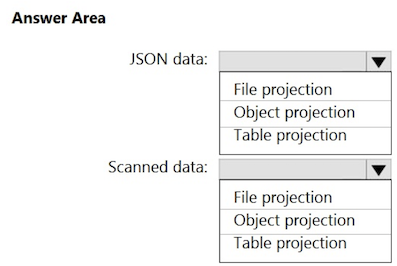

# AI102 -1

### Question 1

You have a chatbot that uses a QnA Maker application. You enable active learning for the knowledge base used by the QnA Maker application.
You need to integrate user input into the model. Which four actions should you perform in sequence?

1. Add a task to the Azure resource.
2. Approve and reject suggestions.
3. Publish the knowledge base.
4. Modify the automation task logic app to run an Azure Resource Manager template that creates the Azure Cognitive Services resource.
5. For the knowledge base, select Show active learning suggestions.
6. Save and train the knowledge base.
7. Select the properties of the Azure Cognitive Services resource.

- A. 5-6-2-3
- B. 5-4-6-3
- C. 5-2-6-3
- D. 5-6-4-3

---------

**A. 5-6-2-3** ✅

Explanation: To integrate user input using active learning, you first view the suggestions by selecting "Show active learning suggestions," then save and train the knowledge base to incorporate any edits. Next, you approve or reject suggestions based on their relevance, and finally publish the knowledge base to apply the changes and update the live chatbot experience.

### Question 2

You are building an app that will use Azure Al to monitor workspaces for safety regulation compliance. You need to recommend a service that meets the following requirements:

- Generates alerts when employees enter high-risk areas
- Monitors video feeds in real time
- Minimizes development effort

What should you recommend?

- A. object detection in Azure Al Custom Vision
- B. Azure Al Vision Spatial Analysis
- C. Azure Al Vision Image Analysis
- D. Azure Al Video

---------

B. Azure Al Vision Spatial Analysis  ✅

Explanation: Azure Al Vision Spatial Analysis is designed for real-time video monitoring and can be used to track and analyze movement in workspaces, such as detecting when employees enter high-risk areas. It minimizes development effort by providing built-in capabilities for spatial understanding, such as people tracking, crowd density, and zone-based monitoring, making it ideal for this use

### Question 3

You are building a chatbot. You need to ensure that the chatbot can classify user input **into separate categories**. The categories must be dynamic and defined at the time of inference.

Which service should you use to classify the input?

- A. Azure OpenAl text summarization
- B. Azure Al Language custom text classification
- C. Azure Al Language custom named entity recognition (NER)
- D. Azure OpenAl text classification

-----------------

D. Azure OpenAl text classification  ✅

Explanation: Azure OpenAl's text classification enables dynamic categorization by allowing categories to be defined at inference time, using prompts.

This flexibility makes it suitable for situations where categories aren't fixed in advance, unlike traditional custom classification models that require predefined labels and training.

### Question 4

You have a factory that produces food products. You need to build a monitoring solution for staff compliance with personal protective equipment (PPE) requirements. The solution must meet the following requirements:

- Identify staff who have removed masks or safety glasses.
- Perform a compliance check every 15 minutes.
- Minimize development effort.
- Minimize costs.

Which service should you use?

* A. Face
* B. Azure Al Vision
* C. Azure Video Analyzer for Media (formerly Video Indexer)

---------------

B. Azure Al Vision  ✅

Explanation: 

Azure Al Vision with Spatial Analysis enables real-time video feed analysis to detect objects such as masks or safety glasses. It is specifically designed for scenarios like PPE compliance monitoring, supports regular interval checks, minimizes development effort through prebuilt models, and is more cost-effective compared to more comprehensive but heavier services like Azure Video Analyzer. Face API, while capable of detecting facial features, does not provide object-level PPE detection.

### Question 5

You have a local folder that contains the files shown in the following table.

You need to analyze the files by using Azure AI Video Indexer.

**Which files can you upload to the Video Indexer website**?

- A. File1 and File3 only

- B. File1, File2, File3 and File4

- C. File1, File2, and File3 only

- D. File1 and File2 only

- E. File1, File2, and File4 only

-----------------

 B. File1, File2, File3 and File4  ✅
 
Explanation:

* File1: Supported because it uses a supported format (WMV), is under the 2 GB size limit, and has a duration of less than 6 hours.
* File2: Supported because it uses a supported format (AVI), is under the 2 GB size limit, and has a duration of less than 6 hours.
* File3: Supported because it uses a supported format (MOV), is under the 2 GB size limit, and has a duration of 5 hours (less than the 6-hour limit).
* File4: Supported because it uses a supported format (MP4), is under the 2 GB size limit, and has a duration of less than 6
 
### Question 6
 
You have an Azure subscription that contains an Azure Al Language custom question answering project named QA1. You need to import question and answer pairs to QA1. Which two file formats can you use?

* A. JSON
* B. TSV
* C. Excel
* D. LU
* E. CSV

-----------------

A. JSON  /  D. LU   ✅

Explanation: You can import question and answer pairs into an Azure Al Language custom question answering project using the JSON format, which is commonly used for structured data. The LU (Language Understanding) format is also supported for importing data in a more conversational

### Question 7

You have a Microsoft OneDrive folder that contains a 20-GB video file named File1.avi. You need to index File1.avi by using the Azure Video Indexer website
What should you do?

* A. Upload File1.avi to the www.youtube.com webpage, and then copy the URL of the video to the Azure Al Video Indexer website.
* B. Download File1.avi to a local computer, and then upload the file to the Azure Al Video Indexer website.
* C. From OneDrive, create a download link, and then copy the link to the Azure Al Video Indexer website.
* D. From OneDrive, create a sharing link for File1.avi, and then copy the link to the Azure Al Video Indexer website.

---------------

C. From OneDrive, create a download link, and then copy the link to the Azure Al Video Indexer website.   ✅

Explanation: To index a video file from OneDrive using the Azure Video Indexer, the video must be accessible via a direct download link that allows Video Indexer to fetch the file. Creating a download link (not just a sharing link) ensures the file can be streamed or downloaded directly by the service. A standard sharing link often leads to a webpage rather than the video file itself, which Video Indexer cannot process.

### Question 8

You have a web app that uses Azure Al Search. When reviewing activity, you see greater than expected search query volumes. You suspect that the query key is compromised. You need to prevent unauthorized access to the search endpoint and ensure that users only have read-only access to the documents collection. The solution must minimize app downtime.

Which three actions should you perform in sequence?

1. Delete the compromised key
2. Change the app to use the secondary admin key
3. Add a new query key
4. Regenerate the secondary admin key
5. Change the app to use the new key
6. Regenerate the primary admin key

* A. 3-4-2
* B. 2-5-1
* C. 3-5-1
* D. 5-1-3

------------------

C. 3-5-1    ✅

### Question 9

You have an Azure subscription that contains an Azure OpenAl resource. You deploy the GPT-4 model to the resource.

You need to ensure that you can upload files that will be used as grounding data for the model. Which two types of resources should you create?

* A. Azure Al Document Intelligence
* B. Azure Blob Storage
* C. Azure Al Bot Service
* D. Azure Al Search
* E. Azure SQL

---------

 B. Azure Blob Storage  ✅

 

D. Azure Al Search  ✅

Explanation: To use grounding data (also known as retrieval-augmented generation or RAG) with GPT-4 in Azure OpenAl, you need to upload files to Azure Blob Storage, which serves as the data source. Then, Azure Al Search indexes and makes this content searchable. GPT-4 can use this indexed data to provide grounded, contextually relevant responses. This setup enables effective grounding without needing custom training. Azure Al Document
Intelligence, Bot Service, and SQL are not required for grounding via file uploads.

### Question 10

You are building an app that will analyze text by using the Azure Al Language service. You need to configure the app to mask the telephone number and email details in a given document.

You need to complete the following code.

What should you choose for Dropdown 1?

* A. RecognizeLinkedEntities
* B. RecognizePiiEntities
* C. SingleLabe|Classify

---------

** B. RecognizePiiEntities**   ✅
 
Explanation: This method detects Personally Identifiable Information (PIl) such as phone numbers, email addresses, and other sensitive data in text.
Since the goal is to mask telephone numbers and email details, using RecognizePiiEntities ensures that these elements are identified and can be redacted or replaced in the output

What should you choose for Dropdown 2?

* A. RedactedText
* B. Statistics
* C. Warnings

-----------

**A. RedactedText**    ✅

###  Question  11

You are building a social media messaging app. You need to identify in real time the language used in messages. Which SDK package should you install?

* A. Azure.Al. Translation. Text
* B. Microsoft.CognitiveServices.Speech
* C. Azure.Al. Translation.Speech
* D. Azure.Al. Translation.Document

-----------

 
**A. Azure.Al. Translation. Text**  ✅

**Explanation**: The Azure.Al. Translation. Text SDK is designed for real-time text translation and language detection, making it ideal for identifying the language of social media messages as they are sent. It supports fast, cloud-based detection and translation for a wide range of languages. The other options are focused on speech translation or document translation, which are not suitable for short, text-based messages in real-time scenarios.

### Question 12

You need to measure the **public perception** of your brand on social media by using natural language processing. Which Azure service should you use?

* A. Azure Al Vision
* B. Azure Al Content Safety
* C. Azure Al Document Intelligence
* D. Azure Al Language service

-----------------

**D. Azure Al Language service**  ✅

### Question 13

"The code will work for up to 10,000 people."

* A. Yes
* B. No

###  Question 14

You are building a Conversational Language Understanding model for an e-commerce chatbot. Users can speak or type their billing address when promptec by the chatbot.

You need to construct an entity to capture billing addresses. Which entity type should you use?

* A. machine learned
* B. Regex
* C. list
* D. Pattern.any

-----------------

**A. machine learned**  ✅

Explanation: A machine learned entity is best suited for capturing complex, variable data like billing addresses, which can differ in format, length, and structure. Unlike list or regex entities, machine learned entities can generalize from training examples and adapt to different ways users might express an address, whether spoken or typed.

### Question #15

You have an Azure Cognitive Search solution and an **enrichment pipeline that performs Sentiment Analysis on social media posts**. 

**You need to define a knowledge store that will include the social media posts and the Sentiment Analysis results**.

**Which two fields should you include in the definition?** Each correct answer presents part of the solution.

NOTE: Each correct selection is worth one point.

* A. storageContainer

* B. storageConnectionString 

* C. files
 
* D. tables 
 
* E. objects

--------------

B. storageConnectionString   ✅

D. tables  ✅

### Question 16

You have an Azure subscription that contains an Azure Al Document Intelligence resource named DI1.

**You create a PDF document named Test.pdf that contains tabular data**.

You need to analyze Test.pdf by using DI1.

You need to complete the following command.
 

What should you choose for Placeholder 1?

* A. prebuilt-contract
* B. prebuilt-document
* C. prebuilt-layout
* D. prebuilt-read

---------------

**C. prebuilt-layout**  ✅

What should you choose for Placeholder 2?

* A. Key1
* B. Ocp-Apim-Subscription-Key
* C. Secret
* D. Subscription-Key

**B. Ocp-Apim-Subscription-Key**  ✅

### Question 17

In Azure Al Studio, you use Completions playground with the GPT-35 Turbo model. You have a prompt that contains the following code.

You need the model to create an explanation of the code. The solution must minimize costs. What should you do?

* **A. Add // what does function F do? to the prompt.**
* B. Add function F(explanation) to the prompt.
* C. Change the model to GPT-4-32k.
* D. Set the temperature parameter to 1.

-----------

**A. Add // what does function F do? to the prompt.**  ✅

Explanation: Adding a simple comment like // what does function F do? 

helps guide the GPT-35 Turbo model to generate an explanation of the code while keeping the prompt size minimal. This approach ensures that the model understands the intent without increasing token usage significantly, thereby minimizing costs. The GPT-35 Turbo model is optimized for cost efficiency compared to GPT-4 models, making this an effective choice.

###  Question 18

You have a product knowledgebase that contains multiple PDF documents. You need to build a chatbot that will provide responses based on data in the knowledgebase. The solution must minimize development effort and costs.

What should you include in the solution?

* A. Azure Al language detection
* B. Azure Al Language custom question answering
* C. Azure OpenAl
* D. Azure Al Language conversational language understanding (CLU)

-----------

**B. Azure Al Language custom question answering**  ✅

> Explanation: Azure Al Language custom question answering is designed specifically to build chatbots that respond based on data from documents like PDFs, websites, or knowledge bases. It allows you to upload content, configure it with minimal effort, and quickly enable question-answering over that data. This approach reduces both development time and cost compared to building solutions from scratch or using generalized models like Azure

### Question 19

You train a Conversational Language Understanding model to understand the natural language input of users. You need to evaluate the accuracy of the model 
before deploying it.

What are two methods you can use?

* A. From the Azure Al language authoring REST endpoint, retrieve the model evaluation summary.
* B. From Language Studio, enable Active Learning, and then validate the utterances logged for review.
* C. From Language Studio, select Model performance.
* D. From the Azure portal, enable log collection in Log Analytics, and then analyze the logs.

-------------

* B. From Language Studio, enable Active Learning, and then validate the utterances logged for review. ✅
* C. From Language Studio, select Model performance.  ✅

> Explanation: To evaluate the accuracy of your Conversational Language Understanding model, you can use Active Learning in Language Studio to review and validate user utterances, improving the model over time. Additionally, selecting "Model performance" in Language Studio will provide insights into how well the model performs based on the data it has been trained with, helping you assess its effectiveness before deployment.

### QUESTION 20

You are creating an enrichment pipeline that will use Azure Cognitive Search. The knowledge store contains unstructured JSON data and scanned PDF documents that contain text.

Which projection type should you use for each data type? To answer, select the appropriate options in the answer area.

NOTE: Each correct selection is worth one point

---------------

✅ **Answer:**

* JSON data → **Object projection**
* Scanned data → **File projection**

### Question 21

You are building an app that will perform translations by using the Azure Al Translator service. You need to ensure that the app will translate user-inputted text. You need to complete the following code.

Which value should you choose for Placeholder 1?

* A. Translate(targetLanguage, input)
* B. TranslateAsync(targetLanguage, input)
* C. TranslationRecognizer)

-------------

**B. TranslateAsync(targetLanguage, input)**   ✅

Which value should you choose for Placeholder 2?

* A. translations. Value'.");
* B. translations[O].text'.");
* C. (Translations. Text).);
* D. (translation?. Translations?[0]?.Text).");

--------------

**D. (translation?. Translations?[0]?.Text).");** ✅

> Explanation: This expression safely accesses the translation result's text property, ensuring that it handles potential null values. It retrieves the translated text from the first item in the Translations list, which is needed to display the translation in the

### Question 22

You build a chatbot that uses an Azure OpenAl GPT-4 model augmented by Azure Al Search to provide generative answers to questions. You need to ensure that responses are based on contextual data.

Which Azure Al Content Safety API should you use?

* A. Analyze Text
* B. Protected material text detection
* C. Prompt Shields
* **D. Groundedness detection**

-----

**D. Groundedness detection** ✅

Explanation: Groundedness detection is used to ensure that responses from a generative Al model are based on the provided contextual data rather than hallucinated content. This is essential in scenarios where GPT-4 is augmented with Azure Al Search to validate that responses stay aligned with the search results.

### Question 22

A. "enabled":     ✅

C. false ✅

### Question 23

You are building an app by using the Semantic Kernel. You need to include complex objects in the prompt templates of the app. The solution must support objects that contain sub-properties.
Which two prompt templates can you use?

* A. Liquid
* B. Handlebars
* C. YAML
* D. Semantic Kernel
* E. JSONL

------

* **A. Liquid**   ✅

* **B. Handlebars**   ✅

Explanation: Liquid and Handlebars are templating languages supported by Semantic Kernel that allow complex object handling, including nested properties (sub-properties). These templates enable dynamic prompt generation with structured data, making them suitable for advanced prompt customization.

 
### Question 24
 
You are building an agent that will retrieve the current time at a given location by using a custom API. You need to test the functionality of the custom API.

You need to complete the following command.
 
 
 
 
What should you choose for Dropdown 1?

* A. assistants
* B. completions
* C. embeddings
* D. threads
 
 -----------
 
 
**A. assistants ✅**
 
 
 
 
What should you choose for Dropdown 2?

* A. content=[
* B. functions=[
* C. tool_resources=K
* D. tools=K

---

**D. tools=[{** ✅

### Question 25

You are building an agent by using the Azure Al Agent Service. You need to ensure that the agent can access publicly accessible data that was released during the past 90 days. You need to complete the following

 

What should you choose for Dropdown 1?

* A. AzureAlSearchResource
* B. BingGrounding ToolDefinition
* C. ToolResources

-------------

* **B. BingGrounding ToolDefinition** ✅

What should you choose for Dropdown 2?

* A. metadata;
* B. ToolResources:
* C. tools:

-------------

**C. tools:  ✅**

### Question 26

You are developing an app that will use the Speech and Language APls. You need to provision resources for the app. The solution must ensure that each service is accessed by using a single endpoint and credential.

Which type of resource should you create?

* A. Azure Al Language
* B. Azure Al Speech
* **C. Azure Al Service**
* D. Azure Al Content Safety

**C. Azure Al Service ✅**

Explanation: The Azure Al Service (f**ormerly known as Cognitive Services** multi-service account) allows you to access multiple Al capabilities-such as Speech and Language APis-using a single endpoint and a single set of credentials. This simplifies authentication and integration when your app uses multiple Al services.

### Question 27

"Changing "You are a helpful assistant." to "You must answer only within the context of Al language models." will produce the intended response."

* **A. Yes** ✅
* B. No

### Question 28

You have an Azure subscription that contains an Azure Al Search resource named AS1. You implement a custom skill in AS1 that performs language and sentiment analysis of documents. You are evaluating the use of AS1 as part of an enrichment pipeline. In which order will AS1 index the documents?

STAGES

1. output field mappings
2. skillset execution
3. document cracking
4. field mappings
5. push to index

* A. 2-3-1-4-5
* B. 5-3-2-4-1
* C. 3-4-2-1-5
* D. 1-4-2-5-3

---------

**C. 3-4-2-1-5 ✅**
 
 
### Question 29

You have an Azure subscription. You are building a chatbot that will use an Azure OpenAl model. You need to deploy the model. Which three actions should you perform in sequence?

ACTIONS

1. Deploy the DALL-E model.
2. Deploy the embeddings model.
3. Provision an Azure OpenAl resource.
4. Provision Azure API Management.
5. Deploy the GPT model.
6. Apply for access to Azure OpenAl.

* A. 3-5-6
* B. 6-3-2
* C. 3-1-4
* D. 6-3-5

---------

**D. 6-3-5**   ✅

### Question 30

You have an Azure subscription. You plan to build an app that will use the Azure OpenAl DALL-E model. You need to deploy the model. What should you use?

* A. the Azure SDK for JavaScript and Azure Machine Learning Studio
* B. the Azure portal and Microsoft Graph API
* C. the Azure SDK for Python and PowerShell cmdlets
* D. Azure Al Studio and Azure Command-Line Interface (CLI)

----------

**D. Azure Al Studio and Azure Command-Line Interface (CLI)  ✅**

> Explanation: To deploy and interact with the DALL•E model in Azure OpenAl, you typically use Azure Al Studio for configuring and managing the model and Azure CLI for deployment and resource setup. This combination supports a streamlined, low-effort way to manage Azure OpenAl services including DALL•E.

### Question 31

You have an Azure subscription that contains an Azure Al Content Safety resource named resource1. You are building an app that will analyze text by using resourcel.

You need to identify text that contains hateful content. You need to complete the following code.

 

What should you choose for Dropdown 1?

* A. BlocklistMatch
* B. CategoriesAnalysis
* C. Equals

**B. CategoriesAnalysis ✅**

What should you choose for Dropdown 2?

* A. Blocklist|temld ?? 0);
* B. BlocklistltemText ?? 0);
* C. Category ?? 0);
* D. Severity ?? 0);

**D. Severity ?? 0); ✅**

### Question 33

You have the following files:

- File1.pdf
- File2.jpg
- File3.docx
- File4.webp
- File5.png

Which files can you analyze by using Azure Al Content Understanding?

* A. File1.pdf and File3.docx only
* B. File1.pdf, File2.jpg, and File5.png only
* C. File1.pdf, File2.jpg, and File3.docx only
* D. File1.pdf, File2.jpg, File3.docx, and File5.png only
* E. File1.pdf, File2.jpg, File3.docx, File4.webp, and File5.png

**B. File1.pdf, File2.jpg, and File5.png only**  ✅

Explanation: Azure Al Content Understanding supports analyzing a limited set of file types, specifically PDF documents and common image formats like JPEG (jpg) and PNG (.png). These formats are supported for tasks such as text extraction, key-value pair extraction, and image-based analysis using
OCR and layout recognition.

### Question 34

You have a blog that allows users to append feedback comments. Some of the feedback comments contain harmful content that includes discriminatory language. You need to create a prototype of a solution that will detect the harmful content. The solution must minimize development effort.

Which two actions should you perform?

* A. From the Azure portal, create an Azure Al Content Safety resource.
* B. Sign in to Azure Al Foundry and select Safety + security.
* C. Sign in to Content Safety Studio and select Protected material detection for text.
* D. From the Azure portal, create an Azure OpenAl resource.
* E. Sign in to Content Safety Studio and select Moderate text content.

---------

**A. From the Azure portal, create an Azure Al Content Safety resource.  ✅**

**E. Sign in to Content Safety Studio and select Moderate text content.  ✅**

> Explanation: To detect harmful content with minimal effort, create an Azure Al Content Safety resource from the Azure portal. Then, sign in to Content Safety Studio and choose the option to moderate text content. This allows you to quickly prototype a solution by analyzing user feedback for discriminatory language using prebuilt models, without writing code or building a custom Al solution.

### Question 35

You have an app that uses an Azure Al Content Safety blocklist. You need to remove an entry from the blocklist. The solution must minimize the impact on existing entries on the list.

You need to complete the following code.

What should you choose for Dropdown 1?

* A. AddOrUpdateBlocklistltems
* B. CreateOrUpdate TextBlocklist
* C. Delete TextBlocklist
* D. RemoveBlocklistltems

**D. RemoveBlocklistltems** ✅

 
 
 
 What should you choose for Dropdown 2?

* A. AddOrUpdateTextBlocklistltemsOptions
* B. BlocklistClient
* C. ContentSafetyClient
* D. RemoveTextBlocklistItemsOptions

**D. RemoveTextBlocklistItemsOptions**  ✅

Explanation: This class is used to specify the options for the RemoveBlocklistltems method. Specifically, it takes the list of blocklist item IDs that you want to remove.

### Question 36

You are building a call handling system that will perform the following action:

- Accept incoming voicemails in French.

Which Azure Al Speech SDK class should you use for the above action?

* A. AudioConfig
* B. SpeechConfig
* C. Speech TranslationConfig
* D. TextTranslationClient

--------

**A. AudioConfig**  ✅

> Explanation: This class specifies the audio input source, enabling the system to capture incoming French voicemails for processing. SpeechConfig configures speech service settings but doesn't handle audio input directly. SpeechTranslationConfig and TextTranslationClient focus on translation tasks, not just receiving audio.

### Question 37

You are building a call handling system that will perform the following action:

- Convert voicemails from French to English.

Which Azure Al Speech SDK class should you use for the above action?

* A. SpeechSynthesizer
* B. TextTranslationClient
* C. TranslationRecognitionResult
* D. TranslationRecognizer

**D. TranslationRecognizer   ✅**

> Explanation: This class handles speech-to-speech or speech-to-text translation, allowing the system to convert French voicemails into English.
> 
> SpeechSynthesizer generates speech from text, Text TranslationClient is for text-to-text translation, and TranslationRecognitionResult represents the result, not the processing class