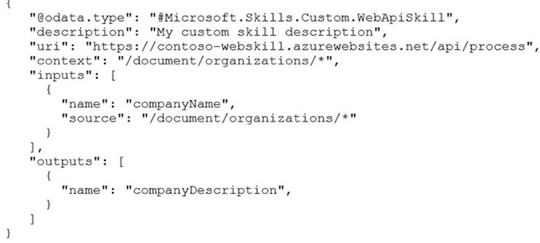
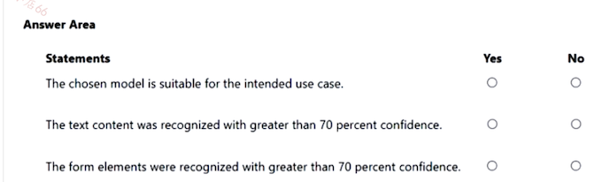
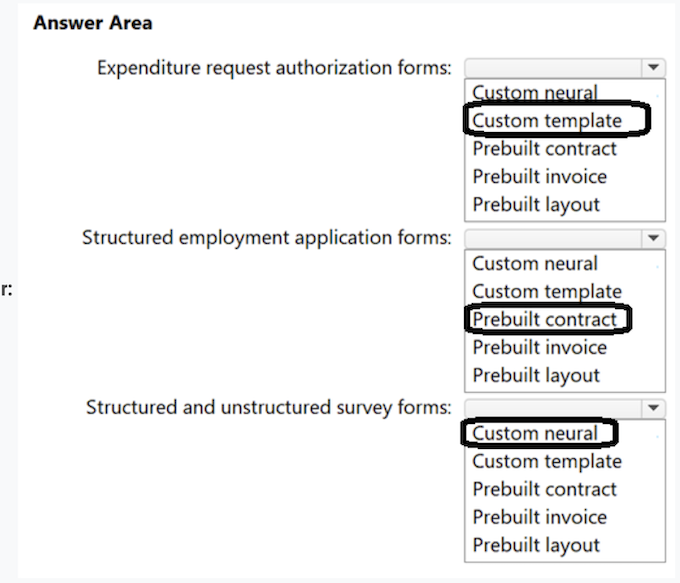

## Topic 4 - Question Set 4

### Question #2

You deploy a web app that is used as a management portal for indexing in Azure Cognitive Search. The app is configured to use the primary admin key.

During a security review, you discover unauthorized changes to the search index. You suspect that the primary access key is compromised. You need to prevent unauthorized access to the index management endpoint. The solution must minimize downtime.

What should you do next?

A. Regenerate the primary admin key, change the app to use the secondary admin key, and then regenerate the secondary admin key.

B. Change the app to use a query key, and then regenerate the primary admin key and the secondary admin key.

**C. Regenerate the secondary admin key, change the app to use the secondary admin key, and then regenerate the primary key.**

D. Add a new query key, change the app to use the new query key, and then delete all the unused query keys.

logicly it should be C. A can not be the answer as you regenerated the secondry key after your already add to your app. the right order to minize downtime is to regenerate the secondary, add to your app and then regenerate the primary

**Selected Answer: C**

- First you regenerate the secondary Key, which previously might have been compromised too - no downtime. 
- **Then you switch your app to use that new uncompromised secondary Key - no downtime** 
- Then you regenerate the compromised primary Key

### Question #3

You have an existing Azure Cognitive Search service.

You have an Azure Blob storage account that contains millions of scanned documents stored as images and PDFs. You need to make the scanned documents available to search as quickly as possible.

What should you do?

A. Split the data into multiple blob containers. Create a Cognitive Search service for each container. Within each indexer definition, schedule the same runtime execution pattern.

B. Split the data into multiple blob containers. Create an indexer for each container. Increase the search units. Within each indexer definition, schedule a sequential execution pattern.

C. Create a Cognitive Search service for each type of document.

D. Split the data into multiple virtual folders. Create an indexer for each folder. Increase the search units. Within each indexer definition, schedule the same runtime execution pattern.

**Correct Answer: D**

Incorrect Answers:

A: Need more search units to process the data in parallel.

B: Run them in parallel, not sequentially.

**C: Need a blob indexer. -> Incorrect**

Note: A blob indexer is used for ingesting content from Azure Blob storage into a Cognitive Search index.

**Index large datasets Indexing blobs can be a time-consuming process. In cases where you have millions of blobs to index, you can speed up indexing by partitioning your data and using multiple indexers to process the data in parallel**. Here's how you can set this up:

- ✑ Partition your data into multiple blob containers or virtual folders 

- ✑ Set up several data sources, one per container or folder.

- ✑ Create a corresponding indexer for each data source. All of the indexers should point to the same target search index.

- ✑ One search unit in your service can run one indexer at any given time. Creating multiple indexers as described above is only useful if they actually run in parallel.

### Question #4

You need to implement a table projection to generate a physical expression of an Azure Cognitive Search index.

Which three properties should you specify in the skillset definition JSON configuration table node? Each correct answer presents part of the solution.

NOTE: Each correct selection is worth one point.

- A. tableName

- B. generatedKeyName

- C. dataSource

- D. dataSourceConnection

- E. source

**Selected Answer: ABE**

Correct Answer: ABE

Defining a table projection.

Each table requires three properties:

- **A. tableName: Necessary for defining where the output data should be stored.**

- **B. generatedKeyName: Important for scenarios requiring unique identification of rows, though its necessity can vary**.

- **E. source: Essential for specifying the input data that will be processed and projected into the table.**

**Therefore, the correct answers are A (tableName), B (generatedKeyName), and E (source), as they play direct roles in the configuration of a table projection within a skillset for Azure Cognitive Search.**

### Question #5

You are creating an enrichment pipeline that will use Azure Cognitive Search. The knowledge store contains unstructured JSON data and scanned PDF documents that contain text.

Which projection type should you use for each data type? To answer, select the appropriate options in the answer area.

NOTE: Each correct selection is worth one point

**Box 1: Object projection**

Object projections are JSON representations of the enrichment tree that can be sourced from any node.

**Box 2: File projection**

File projections are similar to object projections and only act on the normalized_images collection.

### Question #6

You are building an Azure Cognitive Search custom skill. 

You have the following custom skill schema definition.

For each of the following statements, select Yes if the statement is true. Otherwise, select No.

NOTE: Each correct selection is worth one point.

Box 1: Yes Once you have defined a skillset, you must map the output fields of any skill that directly contributes values to a given field in your search index.

Box 2: Yes The definition is a custom skill that calls a web API as part of the enrichment process.

**Box 3: No For each organization identified by entity recognition, this skill calls a web API to find the description of that organization**

### Question #7

You have the following data sources:

- ✑ Finance: On-premises Microsoft SQL Server database 
- ✑ Sales: Azure Cosmos DB using the Core (SQL) API 
- ✑ Logs: Azure Table storage

HR: Azure SQL database -

You need to ensure that you can search all the data by using the Azure Cognitive Search REST API. What should you do?

- A. Configure multiple read replicas for the data in Sales.

- **B. Mirror Finance to an Azure SQL database**.

- C. Ingest the data in Logs into Azure Data Explorer.

- D. Ingest the data in Logs into Azure Sentinel.

**Correct Answer: B**

B is correct answer : Mirror Finance to an Azure SQL database.

On-premises Microsoft SQL Server database cannot be used as an index data source.

Note: Indexer in Azure Cognitive Search: : Automate aspects of an indexing operation by configuring a data source and an indexer that you can schedule or run on demand. This feature is supported for a limited number of data source types on Azure.

Indexers crawl data stores on Azure.

- ✑ Azure Blob Storage 
- ✑ Azure Data Lake Storage Gen2 (in preview) 
- ✑ Azure Table Storage 
- ✑ Azure Cosmos DB 
- ✑ Azure SQL Database 
- ✑ SQL Managed Instance 
- ✑ SQL Server on Azure Virtual Machines

### Question #8

You are developing a solution to generate a word cloud based on the reviews of a company's products. Which Text Analytics REST API endpoint should you use?

- **A. keyPhrases**

- B. sentiment

- C. languages

- D. entities/recognition/general

**The key phrases provide us with the important words from our customer comments, not just the most common words.** Also, word sizing in the resulting cloud isn't skewed by the frequent use of a word in a relatively small number of comments.

The best choice for this scenario is **A. keyPhrases**. **This endpoint extracts the main points or topics from a text document, which can be used to generate a word cloud that shows the most frequent or relevant terms in the reviews**. The other endpoints are not suitable for this task because:

- B. sentiment analyzes the positive, negative, or neutral tone of a text document, which is not relevant for generating a word cloud.

- C. languages detects the language of a text document, which is not relevant for generating a word cloud.

- D. entities/recognition/general identifies and categorizes named entities in a text document, such as person names, locations, organizations, etc This might not capture the main points or topics of the reviews, and might include irrelevant or sensitive information in the word cloud.

### Question #9 - STIMULATION

You have a web app that uses Azure Cognitive Search.

When reviewing billing for the app, you discover much higher than expected charges. You suspect that the query key is compromised.

You need to prevent unauthorized access to the search endpoint and ensure that users only have read only access to the documents collection. The solution must minimize app downtime.

Which three actions should you perform in sequence? To answer, move the appropriate actions from the list of actions to the answer area and arrange them in the correct order.

**Actions**

- Add a new query key.
- Regenerate the secondary admin key.
- Change the app to use the secondary admin key.
- Change the app to use the new key.
- Regenerate the primary admin key.
- Delete the compromised key.

**regenerated secondary key**

**update the app to use the secondary key** 

**regenarated the primary key**

### Question #10

You are developing an application that **will use Azure Cognitive Search for internal documents**.

**You need to implement document-level filtering for Azure Cognitive Search.**

Which three actions should you include in the solution? Each correct answer presents part of the solution. NOTE: Each correct selection is worth one point.

- A. Send Azure AD access tokens with the search request.

- B. Retrieve all the groups.

- **C. Retrieve the group memberships of the user.**

- **D. Add allowed groups to each index entry.**

- E. Create one index per group.

- **F. Supply the groups as a filter for the search requests.**

**Correct Answer: CDF**

**D: Add allowed groups to each index entry.**

Your documents must include a field specifying which groups have access.

**C. Retrieve the group memberships of the user. To understand which documents the user is allowed to access.**

**D. Add allowed groups to each index entry. To tag documents with the groups that can access them.**

**F. Supply the groups as a filter for the search requests. To ensure that search results are filtered according to the user's group memberships**

### Question #11

You have an Azure Cognitive Search solution and an **enrichment pipeline that performs Sentiment Analysis on social media posts**. 

**You need to define a knowledge store that will include the social media posts and the Sentiment Analysis results**.

Which two fields should you include in the definition? Each correct answer presents part of the solution.

NOTE: Each correct selection is worth one point.

A. storageContainer

**B. storageConnectionString**

C. files

D. tables

**E. objects**

**BE is the answer.**

**A knowledge store is defined inside a skillset definition and it has two components:**

- **A connection string to Azure Storage**

- **Projections that determine whether the knowledge store consists of tables, objects or files.** The projections element is an array. You can create multiple sets of table-object-file combinations within one knowledge store.

### Question #12 SIMULATION 

Use the following login credentials as needed:

To enter your username, place your cursor in the Sign in box and click on the username below.

To enter your password, place your cursor in the Enter password box and click on the password below.

Azure Username: admin@abc.com -

Azure Password: XXXXXXXXXXXX 

The following information is for technical support purposes only:

Lab Instance: 12345678 -

Task 

You need to create an Azure resource named solution12345678 that will index a sample database named realestate-us-sample. The solution must ensure that users can search the index in English for people, organizations, and locations.

To complete this task, sign in to the Azure portal.

1. Create the Cognitive Search Result

2. Import data

3. On Connect to your data choose Samples --> realestate_us_sample

4. Add enrichments

5. select Extract people, organization and location names

6. Select English Microsoft for each one

7. Create an indexer

### Question #13

Question #13

HOTSPOT -

You create a knowledge store for Azure Cognitive Search by using the following JSON.

Use the drop-down menus to select the answer choice that completes each statement based on the information presented in the graphic.

NOTE: Each correct selection is worth one point.

- Two projection groups 
- Be projected to azure blog storage

### Question #14

You plan create an index for an Azure Cognitive Search service by using the Azure portal. The Cognitive Search service will connect to an Azure SQL database.

**The Azure SQL database contains a table named UserMessages. Each row in UserMessages has a field named MessageCopy that contains the text of social media messages sent by a user.**

Users will perform full text searches against the MessageCopy field, and the values of the field will be shown to the users.

You need to configure the properties of the index for the MessageCopy field to support the solution.

Which attributes should you enable for the field?

- A. Sortable and Retrievable

- B. Filterable and Retrievable

- C. Searchable and Facetable

- **D. Searchable and Retrievable**

**Selected Answer: D**

**- retrievable**

Indicates whether the field can be returned in a search result.

**- searchable**

You send a request to App1 and receive the following response
Indicates whether the field is full-text searchable and can be referenced in search queries.

### Question #16

You plan to provision Azure Cognitive Services resources by using the following method.

You need to create a Standard tier resource that will convert scanned receipts into text.

How should you call the method? To answer, select the appropriate options in the answer area.

NOTE: Each correct selection is worth one point.

The current name for Form Recognizer (as of May 2024) is Document Intelligence.

1. Document Intelligence(Form Recognizer)

2. "S0", "eastus"

### Question #17

You have an app named App1 that uses Azure AI Document Intelligence to analyze medical records and provide pharmaceutical dosage recommendations for patients.

You send a request to App1 and receive the following response.

For each of the following statements, select Yes if the statement is true. Otherwise, select No.

**The form elements were recognized with greater than 70 percent confidence: No**

> The fields object in the response is empty, which suggests that no form elements were recognized.

> Therefore, we cannot say that they were recognized with greater than 70 percent confidence.

**N - Y - N, no form elements**

The chosen model is suitable for the intended use case: 

No. The model used here is “prebuilt-health InsuranceCard.us”, which is designed to extract information from health insurance cards in the US. However, the intended use case is to analyze medical records and provide pharmaceutical dosage recommendations for patients. A more suitable model would be one specifically trained for medical record analysis.

**The text content was recognized with greater than 70 percent confidence: Yes. The confidence scores for the recognized words “Blood” (0.766), “Pressure” (0.716), and “118/72” (0.761) are all greater than 70 percent.**

### Question #18

You have an Azure subscription that contains an Azure AI Document Intelligence resource named DI1.

You build an app named App1 that analyzes PDF files for handwritten content by using DI1.

You need to ensure that App1 will recognize the handwritten content.

How should you complete the code? To answer, select the appropriate options in the answer area.

The first answer should be read:

Read OCR - Extract print and handwritten text including words, locations, and detected languages.

**Prebuilt-read is correct which can classify the test extracted as handwrittern or printed**

**1. "prebuilt-document"**

**2. 0.75**

**Read OCR - Extract print and handwritten text including words, locations, and detected languages.**

Prebuilt-read is correct which can classify the test extracted as handwrittern or printed

### Question #19

You have an app named App1 that uses a **custom Azure AI Document Intelligence model to recognize contract documents**.

**You need to ensure that the model supports an additional contract format. The solution must minimize development effort.**

What should you do?

A. Lower the confidence score threshold of App1.

B. Create a new training set and add the additional contract format to the new training set. Create and train a new custom model.

**C. Add the additional contract format to the existing training set. Retrain the model.**

D. Lower the accuracy threshold of App1.

### Question #20

You have an Azure subscription.

You need to deploy an Azure **AI Document Intelligence resource.**

How should you complete the Azure Resource Manager (ARM) template? To answer, select the appropriate options in the answer area.

NOTE: Each correct selection is worth one point.

* **“Microsoft.CognitiveServices“**
* **FormRecognizer**

### Question #21

You are building an app named App1 that will use Azure AI Document Intelligence to extract the following data from scanned documents:

- • Shipping address

- • Billing address

- • Customer ID

- • Amount due

- • Due date

- • Total tax

- • Subtotal

You need to identify which model to use for App1. The solution must minimize development effort.

Which model should you use?

A. custom extraction model

B. contract

**C. invoice**

D. general document

To extract the specified data from scanned documents with minimal development effort, you should use the invoice model. The invoice model is specifically designed to handle structured information commonly found in invoices, including shipping and billing addresses, customer IDs, amounts due, due dates, total taxes, and subtotal. Therefore, the correct choice for App1 is C. invoice

### Question #22

You have the following data sources:

- • Finance: On-premises Microsoft SQL Server database

- • Sales: Azure Cosmos DB using the Core (SQL) API

- • Logs: Azure Table storage

- • HR: Azure SQL database
  
You need to ensure that you can search all the data by using the Azure AI Search REST API.

What should you do?

- A. Migrate the data in HR to Azure Blob storage.

- B. Migrate the data in HR to the on-premises SQL server.

- **C. Export the data in Finance to Azure Data Lake Storage**.

- D. Migrate the data in Sales to the MongoDB API.

**C. migrate what is on-promises to Azure**

### Question #23

You are building an app that will process scanned expense claims and extract and label the following data:

- • Merchant information

- • Time of transaction

- • Date of transaction

- • Taxes paid

- • Total cost

You need to recommend an Azure AI Document Intelligence model for the app. The solution must minimize development effort.

What should you use?

A. the prebuilt Read model

B. a custom template model

C. a custom neural model

**D. the prebuilt receipt model**

### Question #24

You are building a language learning solution.

You need to recommend which Azure services can be used to perform the following tasks:

1. **Analyze lesson plans submitted** by teachers and extract key fields, such as lesson times and required texts.

2. **Analyze learning content** and provide students with pictures that represent commonly used words or phrases in the text.

The solution must minimize development effort.

Which Azure service should you recommend for each task? To answer, select the appropriate options in the answer area.

NOTE: Each correct selection is worth one point.

**Analyze lesson plans: Azure AI Document Intelligence**

**Analyze learning content: Immersive Reader**

### Question #25

You have an Azure subscription.

You plan to build a solution that **will analyze scanned documents and export relevant fields to a database**.

You need to recommend which Azure AI service to deploy for the following types of documents:

- Internal expenditure request authorization forms
- Supplier invoices

The solution must minimize development effort.

What should you recommend for each document type? To answer, select the appropriate options in the answer area.

NOTE: Each correct selection is worth one point.

**Internal expenditure request authorization forms: An Azure Al Document Intelligence custom model**

**Supplier invoices: An Azure Al Document Intelligence pre-built model**

### Question #26

You have an Azure AI Search resource named Search1.

You have an app named App1 that uses Search1 to index content.

You need to add a custom skill to App1 to ensure that the app can recognize and retrieve properties from invoices by using Search1.

What should you include in the solution?

- A. Azure AI Immersive Reader

- B. Azure OpenAI

- **C. Azure AI Document Intelligence**

- D. Azure AI Custom Vision

**Correct Answer: C**

### Question #27

You have an Azure subscription.

You plan to build a solution that will analyze scanned documents and export relevant fields to a database.

You need to recommend an Azure AI Document Intelligence model for the following types of documents:

- Expenditure request authorization forms

- Structured and unstructured survey forms

- Structured employment application forms

The solution must minimize development effort and costs.

Which type of model should you recommend for each document type? To answer, select the appropriate options in the answer area.

NOTE: Each correct selection is worth one point.

### Question #28

You have an Azure subscription that contains an Azure AI Document Intelligence resource named AIdoc1 in the S0 tier.

You have the files shown in the following table.

You need to train a custom extraction model by using AIdoc1.

Which files can you upload to Document Intelligence Studio?

A. File1, File2, and File4 only

B. File2, and File5 only

C. File2, File4, and File5 only

D. File1, File2, File3, File4, and File5

**E. File1 and File2 only**

**Correct Answer: E**

### Question #29

You have an Azure subscription that contains an Azure AI Document Intelligence resource named DI1. DI1 uses the Standard S0 pricing tier.

You have the files shown in the following table.

Which files can you analyze by using DI1?

A. File 1.pdf only

**B. File2.jpg only**

C. File3.tiff only

D. File2.jpg and File3.tiff only

E. File1.pdf, File2.jpg, and File3.tiff

**Correct Answer: B**

### Question #30

You have an Azure subscription that contains an Azure AI Document Intelligence resource named DI1.

You build an app named App1 that analyzes PDF files for handwritten content by using DI1.

You need to ensure that App1 will recognize the handwritten content.

How should you complete the code? To answer, select the appropriate options in the answer area.

NOTE: Each correct selection is worth one point.

**"prebuilt-document",**

**0.75**

### Question #31

You have an Azure subscription that contains a storage account named sa1 and an Azure AI Document Intelligence resource named DI1.

You need to create and train a custom model in DI1 by using Document Intelligence Studio. The solution must minimize development effort.

Which four actions should you perform in sequence? To answer, move the appropriate actions from the list of actions to the answer area and arrange them in the correct order.

**Actions**

- Upload five sample documents.
- Upload 50 sample documents.
- Upload JSON files that contain the document layout and labels.
- Train and test the model.
- Create a custom model project and link the project to sa 1.
- Apply labels to the sample documents.

**Correct Answer:**

- Upload five sample documents.
- Create a custom model project and link the project to sa1.
- Apply labels to the sample documents.
- Train and test the model.

### Question #32

You have an Azure subscription that contains an Azure AI Document Intelligence resource named DI1 and a storage account named sa1. The sa1 account contains a blob container named blob1 and an Azure Files share named share1.

You plan to build a custom model named Model1 in DI1.

You create sample forms and JSON files for Model1.

You need to train Model1 and retrieve the ID of the model.

Which four actions should you perform in sequence? To answer, move the appropriate actions from the list of actions to the answer area and arrange them in the correct order.

NOTE: More than one order of answer choices is correct. You will receive credit for any of the correct orders you select.

**Correct Answer:**

- Retrieve the access key for sa1.
- Upload the forms and JSON files to blob1.
- Call the Build model REST API function.
- Call the Get model REST API function.

### Question #33

You have an Azure subscription that contains an Azure AI Document Intelligence resource named AIdoc1.

You have an app named App1 that uses AIdoc1. App1 analyzes business cards by calling business card model v2.1.

You need to update App1 to ensure that the app can interpret QR codes. The solution must minimize administrative effort.

What should you do first?

- **A. Upgrade the business card model to v3.0.**

- B. Implement the read model.

- C. Deploy a custom model.

- D. Implement the contract model.

**Correct Answer: A**