## Topic 3 - Question Set 3

### Question #1

You build a language model by using a Language Understanding service. The language model is used to search for information on a contact list by using an intent named FindContact.

A conversational expert provides you with the following list of phrases to use for training.

- Find contacts in London.

- Who do I know in Seattle?

- Search for contacts in Ukraine.

You need to implement the phrase list in Language Understanding.

**Solution: You create a new pattern in the FindContact intent.**

Does this meet the goal?


**A. Yes**

B. No

Using a pattern could be a good solution IMHO... ✑ Find contacts in London.

✑ Who do I know in Seattle?

✑ Search for contacts in Ukraine.


**Like Where is {FormName}[?] Who authored {FormName}[?] {FormName} is published in French[?]**


we could do:

- ✑ Find contacts in {CityOrCountry}.
- ✑ Who do I know in {CityOrCountry}[?] 
- ✑ Search for contacts in {CityOrCountry}[?].

So, to me a pattern is a Solution (A)


> **You create a new intent for location.**

Does this meet the goal?


- A. Yes
- **B. No**

*The intent is for FindContact, not location really.*

An utterance having wo intents? This is illogical.

The model should have an Entity "Location" that will help in finding the contacts


> **You create a new entity for the domain**.

**Should be YES**

We create a new location entity for domain to keep the location of FindContact intent

The model should have an Entity "Location" that will help in finding the contacts.

### Question #2

**You develop an application to identify species of flowers by training a Custom Vision model.**

You receive images of new flower species.

You need to add the new images to the classifier.

Solution: You add the new images, and then use the Smart Labeler tool.

Does this meet the goal?


- A. Yes

- **B. No**


**Correct Answer: B**

**The model need to be extended and retrained.**

**Note: Smart Labeler to generate suggested tags for images. This lets you label a large number of images more quickly when training a Custom Vision model.**

The answer is B is because the limitations of the smart labeler: You should only request suggested tags for images whose tags have already been trained on once. Don't get suggestions for a new tag that you're just beginning to train. You are given new images of species that have not been seen by the model how can you expect it to suggest what they are? Also you can train the model right in the smart labeler: check the workflow

**Selected Answer: B**

**Smart Labeler will generate suggested tags for images. This lets you label a large number of images more quickly when you're training a Custom Vision model.**

When you tag images for a Custom Vision model, the service uses the latest trained iteration of the model to predict the labels of new images. It shows these predictions as suggested tags, based on the selected confidence threshold and prediction uncertainty. You can then either confirm o change the suggestions, speeding up the process of manually tagging the images for training.

**Solution: You add the new images and labels to the existing model. You retrain the model, and then publish the model.**

Does this meet the goal?

> **Correct Answer: A The model needs to be extended and retrained.**
>
> uploading, tagging, retraining and publishing the model


**Solution: You create a new model, and then upload the new images and labels.**

Does this meet the goal?


Correct Answer: B

**The model needs to be extended and retrained.**


**Correct. Instead you need to add the new images and labels to the existing model. You retrain the model, and then publish the model**


### Question #5

**You are developing a service that records lectures given in English (United Kingdom).**

You have a method named AppendToTranscriptFile that takes translated text and a language identifier.

You need to develop code that will provide transcripts of the lectures to attendees in their respective language. The supported languages are **English, French, Spanish, and German**.

How should you complete the code? To answer, select the appropriate options in the answer area.

NOTE: Each correct selection is worth one point.


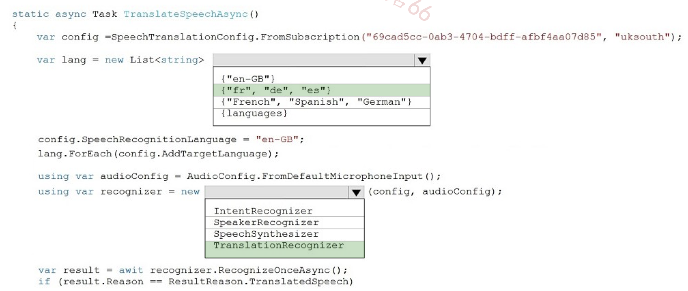

**Box 1: {"fr", "de", "es"}**


A common task of speech translation is to specify target translation languages, at least one is required but multiples are supported. The following code snippet sets both French and German as translation language targets. 

```
static async Task TranslateSpeechAsync() { 
var translationConfig = SpeechTranslationConfig.FromSubscription(SPEECH__SUBSCRIPTION__KEY, SPEECH__SERVICE__REGION); translationConfig.SpeechRecognitionLanguage = "it-IT";

// Translate to languages. See, https://aka.ms/speech/sttt-languages translationConfig.AddTargetLanguage("fr"); translationConfig.AddTargetLanguage("de"); }
```


**Box 2: TranslationRecognizer -**

**After you've created a SpeechTranslationConfig, the next step is to initialize a TranslationRecognizer.**

```
static async Task TranslateSpeechAsync() { 
	var translationConfig = SpeechTranslationConfig.FromSubscription(SPEECH__SUBSCRIPTION__KEY, SPEECH__SERVICE__REGION); 
    var fromLanguage = "en-US"; var toLanguages = new List<string> { "it", "fr", "de" }; 
    translationConfig.SpeechRecognitionLanguage = fromLanguage; toLanguages.ForEach(translationConfig.AddTargetLanguage); 
    using var recognizer = new TranslationRecognizer(translationConfig); }
```


### Question #6


You train a Custom Vision model used in a mobile app.

You receive 1,000 new images that do not have any associated data.

You need to use the images to retrain the model. The solution must minimize how long it takes to retrain the model.

Which three actions should you perform in the Custom Vision portal? To answer, move the appropriate actions from the list of actions to the answer area and arrange them in the correct order


- Upload the images by category.
- Get suggested tags.
- Upload all the images.
- Group the images locally into category folders.
- Review the suggestions and confirm the tags.
- Tag the images manually.


**1.) upload all the images**

**2.) Get suggested tags**

**3.) Review the suggestions and confirm the tags**

### Question #7

**You are building a Conversational Language Understanding model for an e-commerce chatbot. Users can speak or type their billing address when prompted by the chatbot**.

You need to construct an entity to capture billing addresses.

Which entity type should you use?

-** A. machine learned**

- B. Regex

- C. list

- D. Pattern.any

The link provided mentions addresses under 'ML Entities with Structure'. Will be hard to identify all possible international addresses with RegEx.

**A - MAchine Learned**


- ML Entity with Structure

An ML entity can be composed of smaller sub-entities, each of which can have its own properties. For example, an Address entity could have the following structure:

Address: 4567 Main Street, NY, 98052, USA Building Number: 4567 Street Name: Main Street State: NY Zip Code: 98052 Country: USA


### Question #8


You are building an Azure WebJob that will create knowledge bases from an array of URLs.

You instantiate a QnAMakerClient object that has the relevant API keys and assign the object to a variable named client. You need to develop a method to create the knowledge bases.

Which two actions should you include in the method? Each correct answer presents part of the solution.

NOTE: Each correct selection is worth one point.

- A. Create a list of FileDTO objects that represents data from the WebJob.

- B. Call the client.Knowledgebase.CreateAsync method.

- C. Create a list of QnADTO objects that represents data from the WebJob.

- D. Create a CreateKbDTO object.


**It should be BD.**

A. Create a list of FileDTO objects that represents data from the WebJob. NO - as it is from URL - so optional

**B. Call the client.Knowledgebase.CreateAsync method. YES - Mandatory to Call the Method**

C. Create a list of QnADTO objects that represents data from the WebJob. NO - as it is from URL - so optional

**D. Create a CreateKbDTO object. YES - Mandatory to Create**


###  Question #9

HOTSPOT You are developing an application that includes language translation.

**The application will translate text retrieved by using a function named getTextToBeTranslated. The text can be in one of many languages. The content of the text must remain within the Americas Azure geography**.

You need to develop code to translate the text to a single language.

How should you complete the code? To answer, select the appropriate options in the answer area.

NOTE: Each correct selection is worth one point.


- Box 1: `api-nam/translate`

https://docs.microsoft.com/en-us/azure/cognitive-services/translator/reference/v3-0-reference#base-urls

- Box 2: `"?to=en";`

**api-nam/translate to=en**


### Question #10


You are building a conversational language understanding model. You need to enable active learning.

What should you do?


A. Add show-all-intents=true to the prediction endpoint query.


B. Enable speech priming.

**C. Add log=true to the prediction endpoint query.**

D. Enable sentiment analysis.


Correct Answer: C

**"To enable active learning, you must log user queries.** This is accomplished by calling the endpoint query with the log=true query string parameter and value."

### Question #11

You run the following command.


For each of the following statements, select Yes if the statement is true. Otherwise, select No. NOTE: Each correct selection is worth one point.


**Yes** 

**No**

**Yes**

**Log location is not mounted.** The ET answer relates to an example provided on the given website which DOES mount a log location.


**Going to http://localhost:5000/status will query the Azure endpoint to verify whether the API key used to start the container is valid.**

Yes. Typically, Azure Cognitive Services containers provide a /status endpoint that can be used to check the status of the service, including the validity of the API key. Since the service is mapped to localhost:5000, accessing this URL should provide the status of the containerized service, including the API key's validity.

The container logging provider will write log data.

**No (Assuming). This statement is somewhat ambiguous and depends on the configuration of the Docker container and the Azure Cognitive Services container.**

Going to http://localhost:5000/swagger will provide the details to access the documentation for the available endpoints.

Yes. It is a common practice for web services and APIs, including those provided by Azure Cognitive Services, to offer a Swagger UI at a /swagger endpoint.


### Question #12 - duplicated


You are building a **Language Understanding model for an e-commerce platform**. You need to construct an entity to capture billing addresses.

Which entity type should you use for the billing address?


- **A. machine learned**

- B. Regex

- C. geographyV2

- D. Pattern.any

- E. list

**An ML entity can be composed of smaller sub-entities, each of which can have its own properties**. For example, Address could have the following structure:

- Address: 4567 Main Street, NY, 98052, USA
- Building Number: 4567 
- Street Name: Main 
- Street State: NY 
- Zip Code: 98052 
- Country: USA


Question #13

You need to upload speech samples to a Speech Studio project for use in training. How should you upload the samples?

- A. Combine the speech samples into a single audio file in the .wma format and upload the file.

- **B. Upload a .zip file that contains a collection of audio files in the .wav format and a corresponding text transcript file.**

- C. Upload individual audio files in the FLAC format and manually upload a corresponding transcript in Microsoft Word format.

- D. Upload individual audio files in the .wma format

**Correct Answer: B**

To upload your data, navigate to the Speech Studio . From the portal, click Upload data to launch the wizard and create your first dataset. You'll be asked to select a speech data type for your dataset, before allowing you to upload your data.

**The default audio streaming format is WAV**

Use this table to ensure that your audio files are formatted correctly for use with Custom Speech:

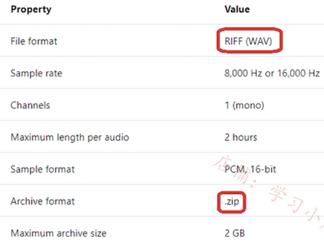

**The best option is B. Upload a .zip file that contains a collection of audio files in the .wav format and a corresponding text transcript file.** 

This method provides a balance of audio quality (with .wav files) and organization (having audio and transcripts together), which is essential for efficient and accurate training of speech recognition models

### Question #14

You are developing a method for an application that uses the Translator API.


The method will receive the content of a webpage, and then translate the content into Greek (el). The result will also contain a transliteration that uses the Roman alphabet.

You need to create the URI for the call to the Translator API.

You have the following URI.

https://api.cognitive.microsofttranslator.com/translate?api-version=3.0 Which three additional query parameters should you include in the URI? Each correct answer presents part of the solution.

NOTE: Each correct selection is worth one point.

- A. toScript=Cyrl

- B. from=el

- C. textType=html

- D. to=el

- E. textType=plain

- F. toScript=Latn


**CDF**

- **C: textType is an optional parameter. It defines whether the text being translated is plain text or HTML text (used for web pages)**.

- D: to is a required parameter. It specifies the language of the output text. The target language must be one of the supported languages included in the translation scope.

- **F: toScript is an optional parameter. It specifies the script of the translated text.**

**textType=html / to=el / toScript=Latn**

### Question #15

You have a chatbot that was built by using the Microsoft Bot Framework.

**You need to debug the chatbot endpoint remotely.**

**Which two tools should you install on a local computer?** Each correct answer presents part of the solution. NOTE: Each correct selection is worth one point.


- A. Fiddler

- B. Bot Framework Composer

- **C. Bot Framework Emulator**

- D. Bot Framework CLI

- **E. ngrok**

- F. nginx

**CE**


**Bot Framework Emulator is a desktop application that allows bot developers to test and debug bots, either locally or remotely.** 

**ngrok is a cross-platform application that "allows you to expose a web server running on your local machine to the internet."** 


Essentially, what we'll be doing is using ngrok to forward messages from external channels on the web directly to our local machine to allow debugging, as opposed to the standard messaging endpoint configured in the Azure portal.


C. Bot Framework Emulator: This is an essential tool for debugging Microsoft Bot Framework bots. It allows you to test and debug your bots on your local machine by emulating the Bot Framework's channels and activities. It can be very helpful in a local development environment but is les suited for remote debugging.

E. ngrok: ngrok is a tool that creates a secure tunnel to your localhost. This is very useful for remote debugging because it allows you to expose your local development server to the internet, which is necessary for testing and debugging interactions with services like the Microsoft Bot Framework.

### Question #16

You are building a retail chatbot that will use a QnA Maker service.

You upload an internal support document to train the model. The document contains the following question: "What is your warranty period?" Users report that the chatbot returns the default QnA Maker answer when they ask the following question: "How long is the warranty coverage?" The chatbot returns the correct answer when the users ask the following question: 'What is your warranty period?" Both questions should return the same answer.

You need to increase the accuracy of the chatbot responses.

Which three actions should you perform in sequence? To answer, move the appropriate actions from the list of actions to the answer area and arrange them in the correct order.


**Step 1: Add alternative phrasing to the question and answer (QnA) pair.**

Add alternate questions to an existing QnA pair to improve the likelihood of a match to a user query. 


**Step 2: Retrain the model.**

Periodically select Save and train after making edits to avoid losing changes.

**Step 3: Republish the model Note:** 

A knowledge base consists of question and answer (QnA) pairs. Each pair has one answer and a pair contains all the information associated with that answer.


1. **Add alternative phrasing to the QnA pair.**
2. **Retrain model**.
3. **Republish model**.


### Question #17

You are training a Language Understanding model for a user support system. 

You create the first intent named GetContactDetails and add 200 examples. 

**You need to decrease the likelihood of a false positive**.

What should you do?


A. Enable active learning.

B. Add a machine learned entity.

C. Add additional examples to the GetContactDetails intent.

**D. Add examples to the None intent.**

You should also consider adding false positive examples to the None intent."

**False positive means => The model needs examples of what it should not classify as "GetContactDetails," which is the role of the "None" intent**.

Therefore, the most effective approach is to add a diverse range of examples to the "None" intent, covering various phrases and queries that are outside the scope of "GetContactDetails." 

This helps create a clear boundary for the model, reducing the likelihood of it mistakenly classifying unrelated inputs as belonging to the "GetContactDetails" intent


### Question #20 

You are building a Language Understanding model for purchasing tickets.

**You have the following utterance for an intent named PurchaseAndSendTickets.**

Purchase [2 audit business] tickets to [Paris] [next Monday] and send tickets to [email@domain.com] You need to select the entity types. 


The solution must use built-in entity types to minimize training data whenever possible.


Which entity type should you use for each label? To answer, drag the appropriate entity types to the correct labels. Each entity type may be used once, more than once, or not at all.


**Box 1: GeographyV2**

The prebuilt geographyV2 entity detects places. Because this entity is already trained, you do not need to add example utterances containing GeographyV2 to the application intents.

**Box 2: Email**

Email prebuilt entity for a LUIS app: Email extraction includes the entire email address from an utterance. Because this entity is already trained, you do not need to add example utterances containing email to the application intents.

**Box 3: Machine learned** 

**The machine-learning entity is the preferred entity for building LUIS applications.**

### Question #21

You have the following C# method.

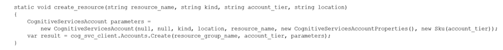

You need to deploy an Azure resource to the **East US Azure region**. The resource will be used to perform sentiment analysis. How should you call the method?

```
A. create_resource("res1", "ContentModerator", "S0", "eastus")

B. create_resource("res1", "TextAnalytics", "S0", "eastus")

C. create_resource("res1", "ContentModerator", "Standard", "East US")

D. create_resource("res1", "TextAnalytics", "Standard", "East US")
```

**Correct Answer: B**

**To perform sentiment analysis, we specify TextAnalytics, not ContentModerator.**

Possible SKU names include: 'F0','F1','S0','S1','S2','S3','S4','S5','S6','S7','S8' Possible location names include: westus, eastus

- SKU is S0.

- Region is eastus.

- **Sentiment analysis uses TextAnalytics**

### Question #22

You build a Conversational Language Understanding model by using the Language Services portal. You export the model as a JSON file as shown in the following sample.


To what does the Weather.Historic entity correspond in the utterance?

- **A. by month**

- B. chicago

- C. rain

- D. location


**Weather.Historic by month** 23 to 30 is by month

### Question #23

You are examining the Text Analytics output of an application.

The text analyzed is: `Our tour guide took us up the Space Needle during our trip to Seattle last week.` 

The response contains the data shown in the following table.


Which Text Analytics API is used to analyze the text?

- A. Entity Linking

- **B. Named Entity Recognition**

- C. Sentiment Analysis

- D. Key Phrase Extraction

**Named Entity Recognition (NER) is one of the features offered by Azure Cognitive Service for Language, a collection of machine learning and AI algorithms in the cloud for developing intelligent applications that involve written language**. 


The NER feature can identify and categorize entities in unstructured text. For example: people, places, organizations, and quantities.

### Question #24 -  SIMULATION

**You need to configure and publish bot12345678 to support task management. The intent must be named TaskReminder.** The LUDown for the intent is in the 

**C:\Resources\LU folder.**

To complete this task, use the Microsoft Bot Framework Composer.


- Step 1: Open Microsoft Bot Framework Composer 
- Step 2: Select the bot bot12345678 
- Step 3: Select Import existing resources. Read the instructions on the right side of the screen and select Next.


- Step 4: Browse to the C:\Resources\LU folder and select the available .lu file 
- Step 5: In the pop-up window Importing existing resources, modify the JSON file content based on your resources information: Name the intent TaskReminder 
- Step 6: Select Publish from the Composer menu. In the Publish your bots pane, select the bot to publish (bot12345678), then select a publish profile from the Publish target drop-down list.


### Question #25 - SIMULATION

You need to configure bot12345678 support the French (FR-FR) language. Export the bot to C:\Resources\Bot\Bot1.zip.

To complete this task, use the Microsoft Bot Framework Composer.


- Step 1: Open Microsoft Bot Framework Composer 
- Step 2: Select the bot bot12345678 
- Step 3: Select Configure.
- Step 4: Select the Azure Language Understanding tab 
- Step 5: Select the Set up Language Understanding button. The Set up Language Understanding window will appear, shown below:

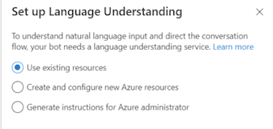

- Step 6: Select Use existing resources and then select Next at the bottom of the window.

- Step 7: Now select the Azure directory, Azure subscription, and Language Understanding resource name (French). 
- tep 8: Select Next on the bottom. Your Key and Region will appear on the next on the next window, shown below:

### Question #26

IMULATION You need to configure and publish bot12345678 to answer questions by using the frequently asked questions (FAQ) located at https://docs.microsoft.com/en-us/azure/bot-service/bot-service-resources-bot-framework-faq. 

The solution must use bot%@lab.LabInstance.Id-qna-qna%.

To complete this task, use the Microsoft Bot Framework Composer.

Correct Answer: See explanation below.

- Step 1: Open Microsoft Bot Framework Composer 
- Step 2: Select the bot bot12345678 
- Step 3: Open the Configure page in Composer. Then select the Development resources, and scroll down to Azure QnA Maker.


Step 4: To access the Connect to QnA Knowledgebase action, you need to select + under the node you want to add the QnA knowledge base and then select Connect to QnAKnowledgeBase from the Access external resources action menu


Step 5: Review the QnA Maker settings panel after selecting the QnA Maker dialog.


Use:

Instance: bot%@lab.LabInstance.Id-qna-qna%


### Question #27

**You need to measure the public perception of your brand on social media by using natural language processing**. Which Azure service should you use?

- **A. Language service**

- B. Content Moderator

- C. Computer Vision

- D. Form Recognizer

Correct Answer: A

**Azure Cognitive Service for Language is a cloud-based service that provides Natural Language Processing (NLP) features for understanding and analyzing text.**

Use this service to help build intelligent applications using the web-based Language Studio, REST APIs, and client libraries.

Note: Natural language processing (NLP) has many uses: sentiment analysis, topic detection, language detection, key phrase extraction, and document categorization


### Question #28

You are developing an application that includes language translation.

The application will translate text retrieved by using a function named `get_text_to_be_translated`. The text can be in one of many languages. The content of the text must remain within the Americas Azure geography.

**You need to develop code to translate the text to a single language**.

How should you complete the code? To answer, select the appropriate options in the answer area.

NOTE: Each correct selection is worth one point.


**Box 1: ("api-nam.cognitive.microsofttranslator.com")** 

- Geography USA: **api-nam.cognitive.microsofttranslator.com**
- Datacenters: East US, South Central US, West Central US, and West US 2

**Box 2: "/translate?to=en" Must specify the language which it is being translated to. The 'to' parameter is required**


1. api-nam.cognitive.microsofttranslator.com

2. /translate?to=en

To force the request to be handled within a specific geography, use the desired geographical endpoint. All requests are processed among the datacenters within the geography.


- United States api-nam.cognitive.microsofttranslator.com

- translate Translate specified source language text into the target language text.

**`api-nam.cognitive.microsofttranslator.com translate?to=en`**


### Question #29 (duplicate)

You have the following data sources:

- ✑ Finance: On-premises Microsoft SQL Server database 
- ✑ Sales: Azure Cosmos DB using the Core (SQL) API 
- ✑ Logs: Azure Table storage 
- ✑ HR: Azure SQL database 

You need to ensure that you **can search all the data by using the Azure Cognitive Search REST API**. What should you do?


- A. Migrate the data in HR to Azure Blob storage.

- B. Migrate the data in HR to the on-premises SQL server.

- **C. Export the data in Finance to Azure Data Lake Storage.**

- D. Ingest the data in Logs into Azure Sentinel.

In Azure Cognitive Search, a data source is used with indexers, providing the connection information for ad hoc or scheduled data refresh of a target index, pulling data from supported Azure data sources.


Note: Supported data sources Indexers crawl data stores on Azure and outside of Azure. Amazon Redshift (in preview)

**Azure Blob Storage -**

**Azure Cosmos DB -**

- Azure Data Lake Storage Gen2 
- Azure MySQL (in preview)

**Azure SQL Database -**

- Azure Table Storage Elasticsearch (in preview) 
- PostgreSQL (in preview)
- Salesforce Objects (in preview) 
- Salesforce Reports (in preview) 
- Smartsheet (in preview) 
- Snowfake (in preview)


Azure SQL Managed Instance 

- **SQL Server on Azure Virtual Machines**
- **Azure Files (in preview)**

### Question #30  - SIMULATION

To enter your username, place your cursor in the Sign in box and click on the username below.

To enter your password, place your cursor in the Enter password box and click on the password below.


Azure Username: admin@abc.com -

Azure Password: XXXXXXXXXXXX 

**The following information is for technical support purposes only:  Lab Instance: 12345678 -**

Task You need to create and publish a Language Understanding (classic) model named 1u12345678. 


The model will contain an intent of Travel that has an utterance of Boat.

To complete this task, sign in to the Language Understanding portal at httptc//www.luis-ai/.


**Create your LUIS model 1**


You should navigate to your LUIS.ai management portal and create a new application. In the portal create a model.

Model name: 1u12345678 

and add an example utterances of Boat. Define one intent as


- Publish the model In order to use your model, you have to publish it.
- This is as easy as hitting the Publish tab, selecting between the production or staging environments, and hitting Publish. 
- As you can see from this page, you can also choose to enable sentiment analysis, speech priming to improve speech recognition, or the spell checker.

For now, you can leave those unchecked.

### Question #31 - SIMULATION 

Use the following login credentials as needed:

- To enter your username, place your cursor in the Sign in box and click on the username below.

- To enter your password, place your cursor in the Enter password box and click on the password below.

Azure Username: admin@abc.com -

Azure Password: XXXXXXXXXXXX 


The following information is for technical support purposes only:

Lab Instance: 12345678 -

Task You need to create a version of the 1u12345678 Language Understanding (classic) model. The new version must have a version name of 1.0 and must be active.

To complete this task, sign in to the Language Understanding portal at https://www.luis.ai/.


**Step 1: Clone a version -**

1. Select the version you want to clone (1u12345678) then select Clone from the toolbar.

2. In the Clone version dialog box, type a name for the new version. Type 1.0

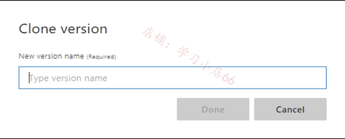

**Step 2: Set active version**

Select a version from the list, then select Activate from the toolbar.

### Question #32

You have a Language service resource that performs the following:

- Sentiment analysis

- Named Entity Recognition (NER)

- Personally Identifiable Information (PII) identification

You need to prevent the resource from persisting input data once the data is analyzed.

Which query parameter in the Language service API should you configure?

- A. model-version

- B. piiCategories

- C. showStats

- **D. loggingOptOut**

**Selected Answer: D The LoggingOptOut parameter is true by default for the PII and health feature endpoints.**


### Question #33

You have an Azure Cognitive Services model named Model1 that identifies the intent of text input.

**You develop an app in C# named App1.**

**You need to configure App1 to use Model1.**

Which package should you add to App1?

- A. Universal.Microsoft.CognitiveServices.Speech

- B. SpeechServicesToolkit

- **C. Azure.AI.Language.Conversations**

- D. Xamarin.Cognitive.Speech

Selected Answer: C


Azure Conversational Language Understanding is part of Azure Cognitive Services and is designed to understand the intent of text input. 

**The Azure.AI.Language.Conversations package provides C# developers with the client libraries needed to interact with these services, enabling you to send text to models and receive the results of intent and entity recognition**.

Explanation of other options:

A. Universal.Microsoft.CognitiveServices.Speech is primarily used for speech services such as speech-to-text conversion, and not specifically text intent recognition.


### Question #34

You are building content for a video training solution.

You need to create narration to accompany the video content. The solution must use Custom Neural Voice.

**What should you use to create a custom neural voice, and which service should you use to generate the narration? **To answer, select the appropriate options in the answer area.

NOTE: Each correct answer is worth one point.


**1. Speech Studio portal**

**2. Text-to-speech**

**To create a custom neural voice, use Speech Studio to upload the recorded audio and corresponding scripts, train the model, and deploy the voice to a custom endpoint**.


**Text to speech enables your applications, tools, or devices to convert text into humanlike synthesized speech**. The text to speech capability is also known as speech synthesis. Use humanlike prebuilt neural voices out of the box, or create a custom neural voice that's unique to your product or brand.


### Question #35

You are building a call handling system that will receive calls from French-speaking and German-speaking callers. The system must perform the following tasks:

- Capture inbound voice messages as text.

- **Replay messages in English on demand**.

Which Azure Cognitive Services services should you use? To answer, select the appropriate options in the answer area.

NOTE: Each correct selection is worth one point.


1. **Speech-to-text**

**With real-time speech to text, the audio is transcribed as speech is recognized from a microphone or file.**

3. **Text-to-speech and Translator**

**Text to speech enables your applications, tools, or devices to convert text into humanlike synthesized speech.**

The text to speech capability is also known as speech synthesis. Use humanlike prebuilt neural voices out of the box, or create a custom neural voice that's unique to your product or brand.


### Question #36

You are building a social media extension that will convert text to speech. The solution must meet the following requirements:

- Support messages of up to 400 characters.

- Provide users with multiple voice options.

- Minimize costs.

You create an Azure Cognitive Services resource.

Which Speech API endpoint provides users with the available voice options?

- A. `https://uksouth.api.cognitive.microsoft.com/speechtotext/v3.0/models/base`

- B. `https://uksouth.customvoice.api.speech.microsoft.com/api/texttospeech/v3.0/longaudiosynthesis/voices`

- **C. `https://uksouth.tts.speech.microsoft.com/cognitiveservices/voices/list`**

- D. `https://uksouth.voice.speech.microsoft.com/cognitiveservices/v1?deploymentId={deploymentId}`


Selected Answer: C


The correct answer is C The question is about providing users with all the available voice options.

**Get a list of voices You can use the `tts.speech.microsoft.com/cognitiveservices/voices/list` endpoint to get a full list of voices for a specific region or endpoint.**

### Question #37

**You develop a custom question answering project in Azure Cognitive Service for Language. The project will be used by a chatbot.**

You need to configure the project to engage in **multi-turn conversations.**

What should you do?

- **A. Add follow-up prompts**.

- B. Enable active learning.

- C. Add alternate questions.

- D. Enable chit-chat.

**A is the answer.**


**Question answering provides multi-turn prompts and active learning to help you improve your basic question and answer pairs.**

**Multi-turn prompts give you the opportunity to connect question and answer pairs**. This connection allows the client application to provide answer and provides more questions to refine the search for a final answer.

### Question #38


You are building a solution that students will use to find references for essays.

You use the following code to start building the solution.

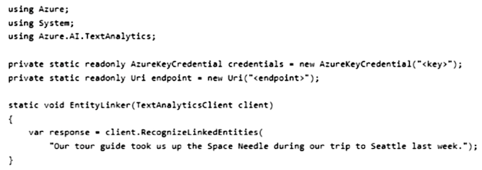

For each of the following statements, select Yes is the statement is true. Otherwise, select No.

NOTE: Each correct selection is worth one point


**NNY is the answer.**

**No No Yes**

Entity linking is one of the features offered by Azure Cognitive Service for Language, a collection of machine learning and AI algorithms in the cloud for developing intelligent applications that involve written language. 

Entity linking identifies and disambiguates the identity of entities found in text. 

For example, in the sentence "We went to Seattle last week.", the word "Seattle" would be identified,

### Question #39

You train a Conversational Language Understanding model to understand the natural language input of users.

You need to evaluate the accuracy of the model before deploying it.

What are two methods you can use? Each correct answer presents a complete solution.

NOTE: Each correct selection is worth one point.

- **A. From the language authoring REST endpoint, retrieve the model evaluation summary**.

- B. From Language Studio, enable Active Learning, and then validate the utterances logged for review.

- **C. From Language Studio, select Model performance.**

- D. From the Azure portal, enable log collection in Log Analytics, and then analyze the logs.

**Selected Answer: AC**


**A. From the language authoring REST endpoint, retrieve the model evaluation summary.**

**This summary typically includes metrics like precision, recall, and accuracy, which are crucial for evaluating the effectiveness of a language understanding model.**

**C. From Language Studio, select Model performance.**

**In Language Studio, the Model performance section typically provides detailed analytics about the model's performance, including various metrics and possibly confusion matrices**


### Question #40

You develop an app in C# named App1 that performs speech-to-speech translation.

You need to configure App1 to translate English to German.


How should you complete the SpeechTranslationConfig object? To answer, drag the appropriate values to the correct targets. Each value may be used once, more than once, or not at all. You may need to drag the split bar between panes or scroll to view content.


**1) SpeechRecognitionLanguage**

**2) AddTargetLanguage**

One common task of speech translation is specifying the input (or source) language. 

In your code, **interact with the SpeechTranslationConfig instance by assigning it to the SpeechRecognitionLanguage property**

Another common task of speech translation is to specify target translation languages. At least one is required, but multiples are supported. **With every call to AddTargetLanguage, a new target translation language is specified**. In other words, when speech is recognized from the source language, each target translation is available as part of the resulting translation operation.

### Question #41

You have an Azure subscription that contains an Azure Cognitive Service for Language resource.

**You need to identify the URL of the REST interface for the Language service**.

Which blade should you use in the Azure portal?

- A. Identity

- **B. Keys and Endpoint**

- C. Networking

- D. Properties

**Correct Answer: B**

This blade provides the **endpoint URL needed to access the Cognitive Services API, along with the keys required for authentication**. 

**The endpoint URL is essential for making API calls to the service, including those for Language features such as sentiment analysis, key phrase extraction, named entity recognition, and more**

### Question #42

You are building a transcription service for technical podcasts.

Testing reveals that the service fails to transcribe technical terms accurately.

**You need to improve the accuracy of the service**.


Which five actions should you perform in sequence? To answer, move the appropriate actions from the list of actions to the answer area and arrange them in the correct order

**Actions**

- Deploy the model.
- Create a Custom Speech project.
- Upload training datasets.
- Create a speech-to-text model.
- Create a Speaker Recognition model.
- Train the model.
- Create a Conversational Language Understanding

---

1. Create Custom Speech project
2. Create speech-to-text model
3. Upload training datasets
4. Train model
5. Deploy model


### Question #43

You are building a retail kiosk system that will use a custom neural voice.

**You acquire audio samples and consent from the voice talent.**

You need to create a voice talent profile.

What should you upload to the profile?


- A. a .zip file that contains 10-second .wav files and the associated transcripts as .txt files

- B. a five-minute .flac audio file and the associated transcript as a .txt file

- **C. a .wav or .mp3 file of the voice talent consenting to the creation of a synthetic version of their voice**

- D. a five-minute .wav or .mp3 file of the voice talent describing the kiosk system

**Selected Answer: C**


Based on the Azure AI documentation, the correct option for creating a voice talent profile for a custom neural voice is:

**C. a .wav or .mp3 file of the voice talent consenting to the creation of a synthetic version of their voice.**

This is because the documentation specifies the need for a recording of the voice talent's consent statement, acknowledging the use of their voice recordings by a specified company to create and use a synthetic version of their voice

### Question #44

You have a Language Understanding solution that runs in a Docker container.

You download the Language Understanding container image from the Microsoft Container Registry (MCR).

You need to deploy the container image to a host computer.

Which three actions should you perform in sequence? To answer, move the appropriate actions from the list of actions to the answer area and arrange them in the correct order.

**Actions**

- From the host computer, move the package file to the Docker input directory.
- From the Language Understanding portal, export the solution as a package file.
- From the host computer, build the container and specify the output directory.
- From the host computer, run the container and specify the input directory.
- From the Language Understanding portal, retrain the model.

---

1. From portal, export solution as package file.

2. From host computer, move package file to Docker input directory.

3. From host computer, run container and specify input directory.

`https://learn.microsoft.com/en-us/azure/cognitive-services/luis/luis-container-howto?tabs=v3#how-to-use-the-container`

- **Export package for container from LUIS portal or LUIS APIs**.

- **Move package file into the required input directory on the host computer. Do not rename, alter, overwrite, or decompress the LUIS package file**

- **Run the container, with the required input mount and billing settings**.


**export / move / run**

### Question #45

You are building a text-to-speech app that will use a custom neural voice.

You need to create an SSML file for the app. The solution must ensure that the voice profile meets the following requirements:

- Expresses a calm tone

- Imitates the voice of a young adult female

How should you complete the code? To answer, select the appropriate options in the answer area.

NOTE: Each correct selection is worth one point


**1. role**

**2. style**

By default, neural voices have a neutral speaking style. You can adjust the speaking style, style degree, and role at the sentence level.


The following table has descriptions of each supported style attribute.

**`- style="gentle"` Expresse“ a mild, polite, and pleasant tone, with lower pitch and vocal energy.**

The following table has descriptions of each supported role attribute. 

`- role="YoungAdultFemale"` 

The voice imitates a young adult female.

### Question #46

You have a collection of press releases stored as PDF files.

**You need to extract text from the files and perform sentiment analysis.**

Which service should you use for each task? To answer, select the appropriate options in the answer area.

NOTE: Each correct selection is worth one point.


**1. Computer Vision**

**2. Language**

OCR or Optical Character Recognition is also referred to as text recognition or text extraction. Machine-learning based OCR techniques allow you to extract printed or handwritten text from images, such as posters, street signs and product labels, as well as from documents like articles, reports, forms, and invoices. 


The text is typically extracted as words, text lines, and paragraphs or text blocks, enabling access to digital version of the scanned text. This eliminates or significantly reduces the need for manual data entry.

### Question #47


**You have a text-based chatbot.**

**You need to enable content moderation by using the Text Moderation API of Content Moderator.**

Which two service responses should you use? Each correct answer presents part of the solution.

NOTE: Each correct selection is worth one point.

- **A. personal data**

- B. the adult classification score

- **C. text classification**

- D. optical character recognition (OCR)

- E. the racy classification score

Selected Answer: AC

**AC is the answer.**

The service response includes the following information:

- Profanity: term-based matching with built-in list of profane terms in various languages

- Classification: machine-assisted classification into three categories

- Personal data

- Auto-corrected text

- Original text

- Language

### Question #48

You are developing a text processing solution.

You have the function shown below.


For the second argument, you call the function and specify the following string.

Our tour of Paris included a visit to the Eiffel Tower

For each of the following statements, select Yes if the statement is true. Otherwise, select No.

**Should be NYN:**

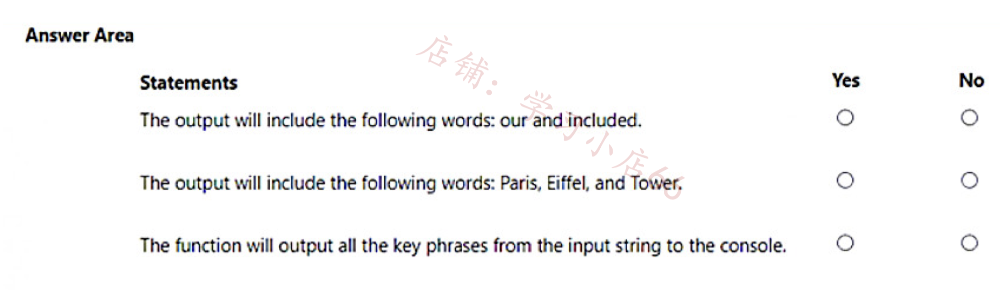

**Definition:**

Runs a predictive model to identify a collection of named entities in the passed-in document, and categorize those entities into types such as person, location, or organization.

This method does not extract phrases.

### Question #49

You are building an Azure web app named App1 that will translate text from English to Spanish.


**You need to use the Text Translation REST API to perform the translation. The solution must ensure that you have data sovereignty in the United States.**

How should you complete the URI? To answer, select the appropriate options in the answer area.

NOTE: Each correct selection is worth one point.


1. **api-nam.cognitive.microsofttranslator.com**

2. **translate**

Requests to Translator are, in most cases, handled by the datacenter that is closest to where the request originated. If there's a datacenter failure when using the global endpoint, the request may be routed outside of the geography.

To force the request to be handled within a specific geography, use the desired geographical endpoint. All requests are processed among the datacenters within the geography.

- **United States api-nam.cognitive.microsofttranslator.com**
- **translate Translate specified source language text into the target language text**.

### Question #50

You have a Docker host named Host1 that contains a container base image.

You have an Azure subscription that contains a custom speech-to-text model named model1.

You need to run model1 on Host1.


Which three actions should you perform in sequence? To answer, move the appropriate actions from the list of actions to the answer area and arrange them in the correct order

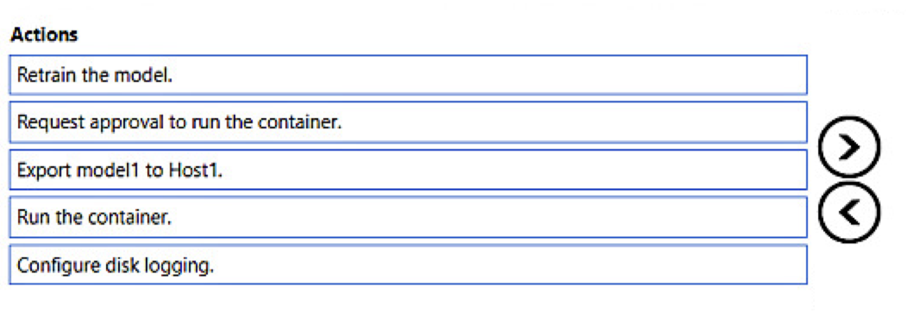

**1. Request approval to run container**

**2. Export model1 to Host1**

**3. Run the container**

### Question #51

You build a language model by using a Conversational Language Understanding. The language model is used to search for information on a contact list by using an intent named FindContact.

A conversational expert provides you with the following list of phrases to use for training.

- Find contacts in London.

- Who do I know in Seattle?

- Search for contacts in Ukraine.

You need to implement the phrase list in Conversational Language Understanding.

**Solution: You create a new utterance for each phrase in the FindContact intent.**

Does this meet the goal?

- **A. Yes**

- B. No

**Selected Answer: A**

Creating a new utterance for each phrase in the FindContact intent is a correct approach to implement the phrase list in Conversational Language Understanding. 

This method trains the language model to recognize variations of how users might express the intent to find contacts in different locations, thereby improving the model's accuracy in identifying the FindContact intent.

### Question #52

You have a question answering project in Azure Cognitive Service for Language.

**You need to move the project to a Language service instance in a different Azure region.**

Which three actions should you perform in sequence? To answer, move the appropriate actions from the list of actions to the answer area and arrange them in the correct order.

**Actions**

- From the new Language service instance, train and publish the project.
- From the new Language service instance, import the project file.
- From the new Language service instance, enable custom text classification.
- From the original Language service instance, export the existing project.
- From the new Language service instance, regenerate the keys.
- From the original Language service instance, train and publish the model.


**1. From original instance, export existing project.**

**2. From new instance, import the project file.**

**3. From new instance, train and publish model**

### Question #53

You are building a customer support chatbot.

You need to configure the bot to identify the following:

- Code names for internal product development

- Messages that include credit card numbers

The solution must minimize development effort.


Which Azure Cognitive Service for Language feature should you use for each requirement? To answer, drag the appropriate features to the correct requirements. Each feature may be used once, more than once, or not at all. You may need to drag the split bar between panes or scroll to view content.


**1. Custom NER**

**2. PII detection**

Custom NER enables users to build custom AI models to extract domain-specific entities from unstructured text, such as contracts or financial documents. By creating a Custom NER project, developers can iteratively label data, train, evaluate, and improve model performance before making it available for consumption. 


The quality of the labeled data greatly impacts model performance.

PII detection is one of the features offered by Azure Cognitive Service for Language, a collection of machine learning and AI algorithms in the cloud for developing intelligent applications that involve written language. 


**The PII detection feature can identify, categorize, and redact sensitive information in unstructured text. For example: phone numbers, email addresses, and forms of identification.**

### Question #54

You are building an app by using the Speech SDK. The app will translate speech from French to German by using natural language processing.

**You need to define the source language and the output language**.

How should you complete the code? To answer, select the appropriate options in the answer area.

NOTE: Each correct selection is worth one point.


- **SpeechRecognitionLanguage = "fr"** 

- **AddTargetLanguage.("de")**

You create a blob container for German fies and a blob container for French fies. You upload the original fies to the container for German fies.

Which three actions should you perform in sequence to complete the solution? To answer, move the appropriate actions from the list of actions to the answer area and arrange them in the correct order.

**Actions**

- Perform an asynchronous translation by using the list of files to be translated.
- Perform an asynchronous translation by using the document translation specification.
- Generate a list of files to be translated.
- Upload a glossary file to the container for German files.
- Upload a glossary file to the container for French files.
- Define a document translation specification that has a French target.


**1. Upload a Glossary file to the french files container**

**2. Define a document translation specification that has french target**

**3. Perform asynchronous translation by using the document specification**

### Question #56

You have the following C# function.

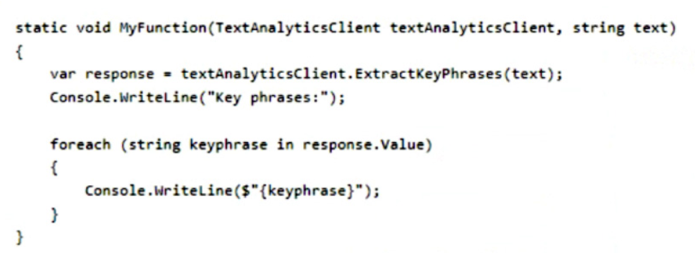


You call the function by using the following code.


Which output will you receive?


A. The quick The lazy

B. the quick brown fox jumps over the lazy dog

C. jumps over the

**D. quick brown fox lazy dog**


**I tried it out. D is correct. Key Phrases: quick brown fox**

### Question #57

You have the following Python method.


You need to deploy an Azure resource to **the East US Azure region**. The resource will be used to perform sentiment analysis.

How should you call the method?

```
A. create_resource("res1", "TextAnalytics", "Standard", "East US")

B. create_resource("res1", "ContentModerator", "S0", "eastus")

C. create_resource("res1", "ContentModerator", "Standard", "East US")

D. create_resource("res1", "TextAnalytics", "S0", "eastus")
```

Correct Answer: D

**D. `create_resource("res1", "TextAnalytics", "S0", "eastus")`**

**ComputerVision, F0. TextAnalysis, S0.**

The correct answer can be found by a process of elimination:

**1. Need to provide reference to correct service -> Text Analytics**

**2. Need to provide reference to a correct service tier: S0 or F0**

**3. Need to provide reference to a correct name for a computer**


region: United States:

**East US: eastus / East US 2: eastus2 / Central US: centralus / North Central US: northcentralus / South Central US: southcentralus / West US: westus / West US 2: westus2**

D is the only answer that captures all these correctly.


### Question #58


**You develop a Python app named App1 that performs speech-to-speech translation.**

**You need to configure App1 to translate English to German.**


**How should you complete the SpeechTranslationConfig object**? To answer, drag the appropriate values to the correct targets. Each value may be used once, more than once or not at all. You may need to drag the split bar between panes or scroll to view content.

NOTE: Each correct selection is worth one point

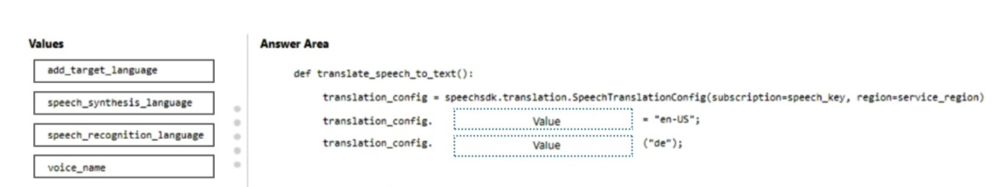

1. `speech_recognition_language`

2. `add_target_language`

```
def translate_speech_to_text():

translation_config = speechsdk.translation.SpeechTranslationConfig(subscription=speech_key, region=service_region) translation_config.speech_recognition_language = "en-US" translation_config.add_target_language("de")
```

### Question #59


You are developing a streaming Speech to Text solution that will use the Speech SDK and MP3 encoding.

You need to develop a method to convert speech to text for streaming MP3 data.

How should you complete the code? To answer, select the appropriate options in the answer area.

NOTE: Each correct selection is worth one point.


first one has to configure the format as MP3, so **"AudioStreamFormat"** option is chosen. Second, since it is speech to text, the **SpeechRecognition** option is needed.


**1. AudioStreamFormat**

**2. SpeechRecognizer**

### Question #60

You are building a chatbot.

You need to use the Content Moderator API to identify aggressive and sexually explicit language.

Which three settings should you configure? To answer, select the appropriate settings in the answer area.

NOTE: Each correct selection is worth one point.


- **Resource Name** 
- **classify** 
- **ocp-Apim-Subscription-Key**


### Question #61

You are developing an app that will use the Decision and Language APIs.

You need to provision resources for the app. The solution must ensure that each service is accessed by using a single endpoint and credential.

Which type of resource should you create?

- A. Language

- B. Speech

- **C. Azure Cognitive Services**

- D. Content Moderator

C is right answer, but now this service name changed "Azure AI".


### Question #62


You are building a chatbot.

You need to ensure that the bot will recognize the names of your company’s products and codenames. The solution must minimize development effort.

Which Azure Cognitive Service for Language service should you include in the solution?

- A. custom text classification

- B. entity linking

- **C. custom Named Entity Recognition (NER)**

- D. key phrase extraction

**Named Entity Recognition (NER) identifies and categorizes specific names or terms in text, such as names of people, organizations, places, and more**. 

By customizing NER, you can tailor it to recognize your company-specific entities, making it an efficient solution for your chatbot’s needs


### Question #63


You have an Azure subscription that contains an Azure App Service app named App1.

You provision a multi-service Azure Cognitive Services resource named CSAccount1.

You need to configure App1 to access CSAccount1. The solution must minimize administrative effort.

What should you use to configure App1?

A. a system-assigned managed identity and an X.509 certificate

B. the endpoint URI and an OAuth token

C. the endpoint URI and a shared access signature (SAS) token

**D. the endpoint URI and subscription key**

### Question #64

You have an Azure subscription that contains a multi-service Azure Cognitive Services Translator resource named Translator1.

You are building an app that will translate text and documents by using Translator1.

You need to create the REST API request for the app.

Which headers should you include in the request?


- A. the access control request, the content type, and the content length

- B. the subscription key and the client trace ID

- C. the resource ID and the content language

- **D. the subscription key, the subscription region, and the content type**

When you use a multi-service secret key, you must include two authentication headers with your request. There are two headers that you need to call the Translator.

- **Ocp-Apim-Subscription-Key The value is the Azure secret key for your multi-service resource**.

- **Ocp-Apim-Subscription-Region The value is the region of the multi-service resource**.

Region is required for the multi-service Text API subscription. The region you select is the only region that you can use for text translation when using the multi-service key. It must be the same region you selected when you signed up for your multi-service subscription through the Azure portal.

### Question #65

You have a file share that contains 5,000 images of scanned invoices.

You need to analyze the images. The solution must extract the following data:

• Invoice items

• Sales amounts

• Customer details

What should you use?

- A. Custom Vision

- B. Azure AI Computer Vision

- C. Azure AI Immersive Reader

- **D. Azure AI Document Intelligence**

---

- Invoice items

- Sales amounts

- Customer details

so, we use "Azure AI Document Intelligence ".

### Question #66

You are developing a text processing solution.

You have the function shown below.


For the second argument, you call the function and specify the following string.

> Our tour of Paris included a visit to the Eiffel Tower

For each of the following statements, select Yes if the statement is true. Otherwise, select No.

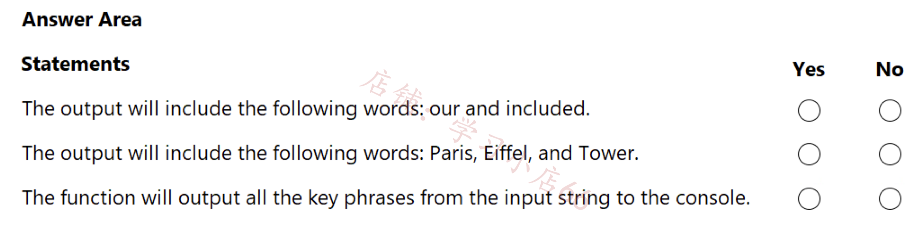

**Should by N Y N**

**Key phrases would be (tested with API): Eiffel Tower, tour, Paris, visit **

Entities are: Eiffen Tower, Paris

### Question #67

You are developing a text processing solution.

You develop the following method.


You call the method by using the following code.

**`get_key_phrases(text_analytics_client, "the cat sat on the mat")`**

For each of the following statements, select Yes if the statement is true. Otherwise, select No.

NOTE: Each correct selection is worth one point.


**Should be YNN**

**Box 1: Yes The Key Phrase Extraction API evaluates unstructured text, and for each JSON document, returns a list of key phrases.**

**Box 2: No 'the' is not a key phrase.**

This capability is useful if you need to quickly identify the main points in a collection of documents. For example, given input text "The food was delicious and there were wonderful staff", the service returns the main talking points: "food" and "wonderful staff".

**Box 3: No Key phrase extraction does not have confidence levels.**


### Question #68

You are developing a service that records lectures given in English (United Kingdom).

You have a method named `append_to_transcript_file` that takes translated text and a language identifier.


You need to develop code that will provide transcripts of the lectures to attendees in their respective language. The supported languages are English, French, Spanish, and German.

How should you complete the code? To answer, select the appropriate options in the answer area.

NOTE: Each correct selection is worth one point.


- `fr,de,es `

- **TranslationRecognizer**

### Question #69

You are developing an app that will use the text-to-speech capability of the Azure AI Speech service. The app will be used in motor vehicles.

**You need to optimize the quality of the synthesized voice output.**

Which Speech Synthesis Markup Language (SSML) attribute should you configure?

- A. the style attribute of the mstts:express-as element

- **B. the effect attribute of the voice element**

- C. the pitch attribute of the prosody element

- D. the level attribute of the emphasis element

**Answer is correct:**

The audio effect processor that's used to optimize the quality of the synthesized speech output for specific scenarios on devices.

For some scenarios in production environments, the auditory experience might be degraded due to the playback distortion on certain devices. For example, the synthesized speech from a car speaker might sound dull and muffled due to environmental factors such as speaker response, room reverberation, and background noise. The passenger might have to turn up the volume to hear more clearly. To avoid manual operations in such a scenario, the audio effect processor can make the sound clearer by compensating the distortion of playback.


The following values are supported:

`eq_car` – Optimize the auditory experience when providing high-fidelity speech in cars, buses, and other enclosed automobiles. 

`eq_telecomhp8k` – Optimize the auditory experience for narrowband speech in telecom or telephone scenarios. You should use a sampling 8 kHz. If the sample rate isn't 8 kHz, the auditory quality of the output speech isn't optimized.


Question #70

You are designing a content management system.

**You need to ensure that the reading experience is optimized for users who have reduced comprehension and learning differences,** such as dyslexia. The solution must minimize development effort.

Which Azure service should you include in the solution?

- **A. Azure AI Immersive Reader**

- B. Azure AI Translator

- C. Azure AI Document Intelligence

- D. Azure AI Language

### Question #71

You are building an app that will answer customer calls about the status of an order. The app will query a database for the order details and provide the customers with a spoken response.

You need to identify which Azure AI service APIs to use. The solution must minimize development effort.

Which object should you use for each requirement? To answer, select the appropriate options in the answer area.

NOTE: Each correct selection is worth one point.


**SpeechRecognizer / SpeechSynthesizer** 


doesn't say anything about translation recognizer, which needs more code

1. SpeechRecognizer

2. SpeechSynthesizer

### Question #72

You have an Azure AI service model named Model1 that identifies the intent of text input.

You develop a Python app named App1.

You need to configure App1 to use Model1.

Which package should you add to App1?

- **A. azure-cognitiveservices-language-textanalytics**

- B. azure-ai-language-conversations

- C. azure-mgmt-cognitiveservices

- D. azure-cognitiveservices-speech

The correct package for working with Azure AI service for text intent identification, like Model1, is:

**A. azure-cognitiveservices-language-textanalytics**

Therefore, you should add the azure-cognitiveservices-language-textanalytics package to App1 for configuring it to use Model1. This package provides functionalities for working with the Language API in Azure Cognitive Services, which includes text analytics capabilities, such as identifying language and sentiment, and can be used for processing text input to determine intent.

### Question #73

You are building an app that will automatically translate speech from English to French, German, and Spanish by using Azure AI service.

You need to define the output languages and configure the Azure AI Speech service.

How should you complete the code? To answer, select the appropriate options in the answer area.

NOTE: Each correct selection is worth one point.


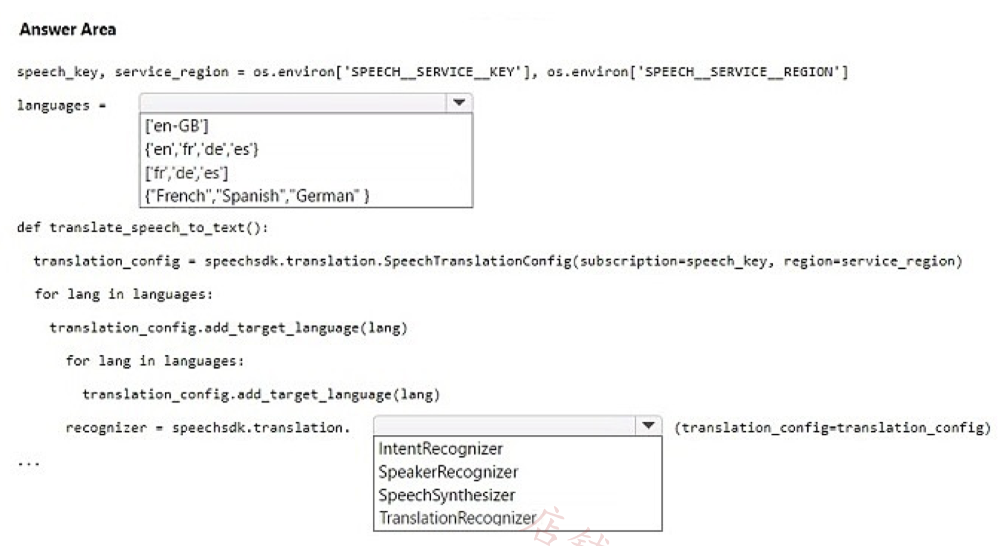

**1. fr, de, es**

**2. TranslationRecognizer**


### Question #74

You plan to implement an Azure AI Search resource that will use custom skill based on sentiment analysis.

You need to create a custom model and configure Azure AI Search use the model.


Which five actions should you perform in sequence? To answer, move the appropriate actions from the list of actions to the answer area and arrange them in the correct order

**Actions**

- Create an endpoint for the model.
- Rerun the indexer to enrich the index.
- Create an Azure Machine Learning workspace.
- Create and train the model in the Azure Machine Learning studio.
- Provision an Azure Al Services resource and obtain the endpoint.
- Connect the custom skill the endpoint.


1. Create an Azure Machine Learning workspace.

2. Create and train the model in the Azure Machine Learning studio.

3. Create an endpoint for the model.

4. Connect the custom skill to the endpoint.

5. Rerun the indexer to enrich the index.


### Question #75

You have a collection of press releases stored as PDF files.

You need to extract text from the files and perform sentiment analysis.

Which service should you use for each task? To answer, select the appropriate options in the answer area.

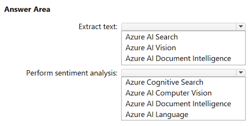

- **AI Vision**
- **AI Language**

### Question #76

You are building an internet-based training solution. The solution requires that a user's camera and microphone remain enabled.

You need to monitor a video stream of the user and verify that the user is alone and is not collaborating with another user. The solution must minimize development effort.

What should you include in the solution?

- A. speech-to-text in the Azure AI Speech service

- B. object detection in Azure AI Custom Vision

- **C. Spatial Analysis in Azure AI Vision**

- D. object detection in Azure AI Custom Vision

**"How does Azure AI Vision analyze people in a physical space? The spatial analysis AI models detect and track movements in the video feed on algorithms that identify the presence of one or more humans by a body bounding box."**


To monitor a video stream of the user and verify that the user is alone and not collaborating with another user, you should include Spatial Analysi in Azure AI Vision in your solution. This service can analyze the spatial relationships between people, movements, and interactions in a physical space using video data. So, the correct answer is:

**C. Spatial Analysis in Azure AI Vision**

### Question #79

You are developing a text processing solution.

You have the following function.

You call the function and use the following string as the second argument.

Our tour of London included a visit to Buckingham Palace

What will the function return?


**A. London and Buckingham Palace only**

B. Tour and visit only

C. London and Tour only

D. Our tour of London included visit to Buckingham Palace

**Correct Answer: A**

### Question #80

You have the following Python function.


You call the function by using the following code.

`my_function(text_analytics_client, "the quick brown fox jumps over the lazy dog")`

Following 'Key phrases', what output will you receive?

- A. The quick The lazy

- B. jumps over the

- **C. quick brown fox lazy dog**

- D. the quick brown fox jumps over the lazy dog

### Question #81

You have an Azure subscription.

You need to deploy an Azure AI Search resource that will recognize geographic locations.

Which built-in skill should you include in the skillset for the resource?

- A. AzureOpenAIEmbeddingSkill

- B. DocumentExtractionSkill

- **C. EntityRecognitionSkill**

- D. EntityLinkingSkill

