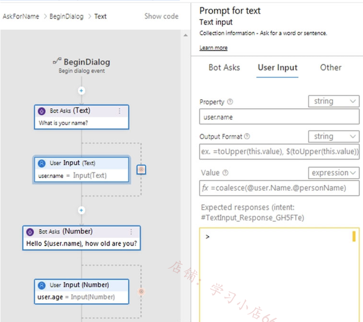
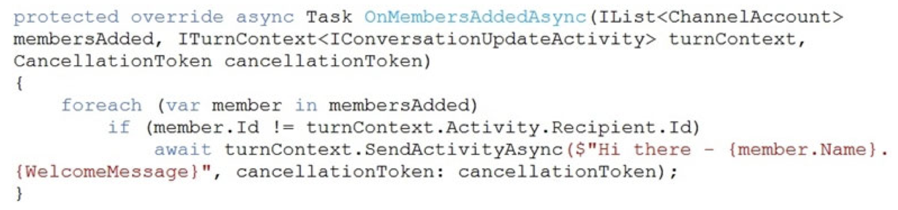
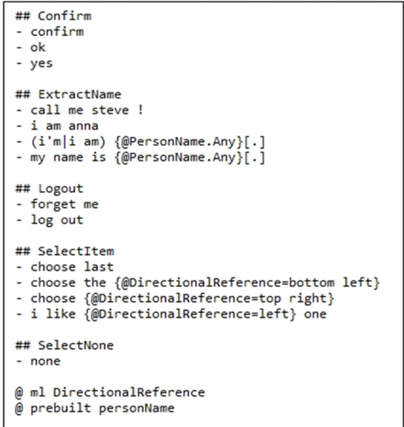
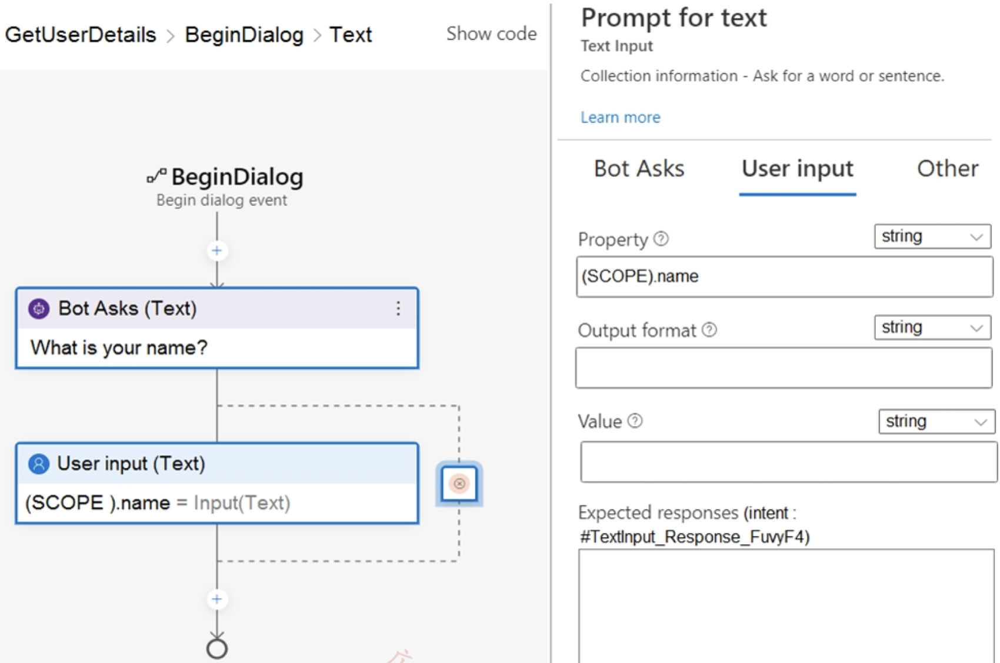
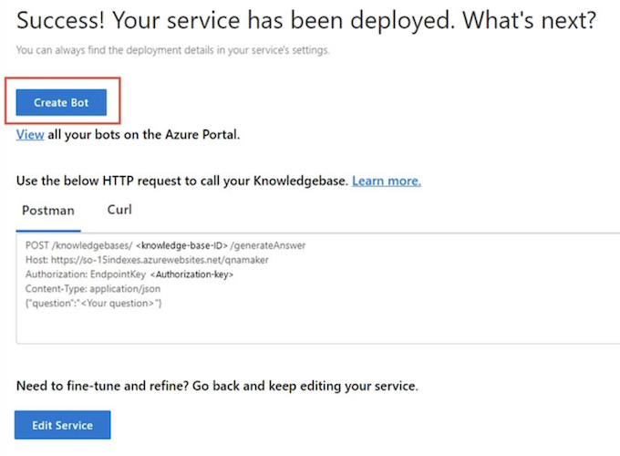
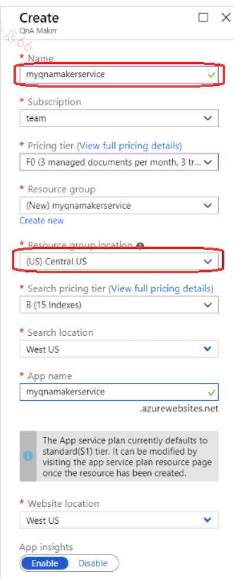
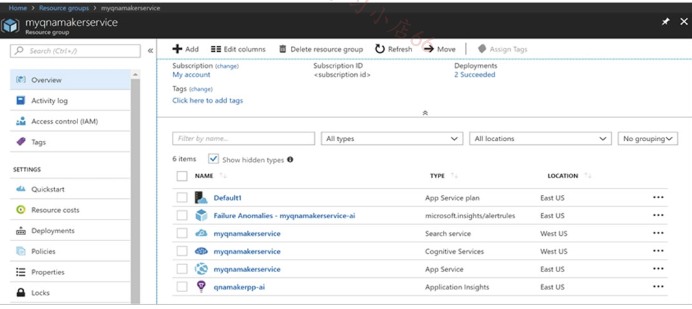
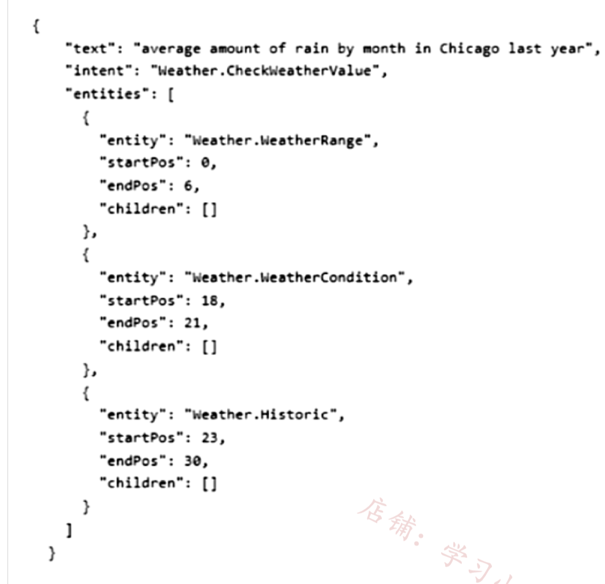
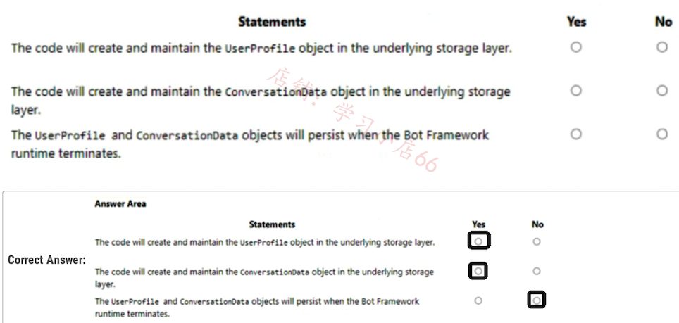

## Topic 5 - Question Set 5

### Question #1

You build a bot by using the Microsoft Bot Framework SDK and the Azure Bot Service.

You plan to deploy the bot to Azure.

You register the bot by using the Bot Channels Registration service.

Which two values are required to complete the deployment? Each correct answer presents part of the solution. NOTE: Each correct selection is worth one point.

- A. botId

- B. tenantId

- **C. appId**

- D. objectId

- **E. appSecret**

**Correct Answer: CE**

The identity information you need to add depends on the bot's application type. Provide the following values in your configuration file.

- **MicrosoftAppId The bot's app ID.**

- **MicrosoftAppPassword The bot's app password.**

**appId appSecret**


### Question #2

You are building a chatbot by using the Microsoft Bot Framework Composer. 

You have the dialog design shown in the following exhibit.



For each of the following statements, select Yes if the statement is true. Otherwise, select No. NOTE: Each correct selection is worth one point.


**Box 1: No -  User.name is a property.**

**Box 2: Yes -**

**Box 3: Yes The coalesce() function evaluates a list of expressions and returns the first non-null (or non-empty for string) expression.**

I am not sure if the correct answer for third is yes - the fields are showing examples, not the actual values typed in the boxes.

### Question #3

You are building a multilingual chatbot.

You need to send a different answer for positive and negative messages.

Which two Language service APIs should you use? Each correct answer presents part of the solution. NOTE: Each correct selection is worth one point.

- A. Linked entities from a well-known knowledge base

- **B. Sentiment Analysis**

- C. Key Phrases

- **D. Detect Language**

- E. Named Entity Recognition

**Correct Answer: BD**

**B: The Text Analytics API's Sentiment Analysis feature provides two ways for detecting positive and negative sentiment**. 

If you send a Sentiment Analysis request, the API will return sentiment labels (such as "negative", "neutral" and "positive") and confidence scores at the sentence and document-level

**D: The Language Detection feature of the Azure Text Analytics REST API evaluates text input for each document and returns language identifiers with a score that indicates the strength of the analysis.**

This capability is useful for content stores that collect arbitrary text, where language is unknown.

**Selected Answer: BD**

- **B. Sentiment Analysis <-- different answer for positive and negative messages**

- **D. Detect Language <-- multilingual chatbot**

### Question #4

You plan to build a chatbot to support task tracking.

You create a Language Understanding service named lu1.

You need to build a Language Understanding model to integrate into the chatbot. The solution must minimize development time to build the model.

Which four actions should you perform in sequence? To answer, move the appropriate actions from the list of actions to the answer area and arrange them in the correct order.

**Actions**

- Train the application.
- Publish the application.
- Add a new application.
- Add example utterances.
- Add the prebuilt domain ToDo.


---

- **Add a new application.**

- **Add the prebuilt domain ToDo.**

- **Train the application.**

- **Publish the application**

### Question #5

You are building a bot on a local computer by using the Microsoft Bot Framework. The bot will use an existing Language Understanding model.

You need to translate the Language Understanding model locally by using the Bot Framework CLI.

What should you do first?


- A. From the Language Understanding portal, clone the model.

- **B. Export the model as an .lu file.**

- C. Create a new Speech service.

- D. Create a new Language Understanding service.

**Correct Answer: B**

**B. Export the model as an .lu file.**

**When you need to translate a Language Understanding (LUIS) model using the Microsoft Bot Framework CLI locally, the first step is to export the existing LUIS model as a .lu file. The .lu file format (Language Understanding file format) allows you to represent intents, entities, and other mode components in a text-based form**, enabling you to process, modify, or translate them using the Bot Framework CLI. This is a crucial step for working with and integrating LUIS models in a local environment."

### Question #6

You are using a Language Understanding service to handle natural language input from the users of a web-based customer agent.

The users report that the agent frequently responds with the following generic response: "Sorry, I don't understand that."

**You need to improve the ability of the agent to respond to requests.**

Which three actions should you perform in sequence? To answer, move the appropriate actions from the list of actions to the answer area and arrange them in the correct order.

**Actions**

- Add prebuilt domain models as required.
- Validate the utterances logged for review and modify the model.
- Migrate authoring to an Azure resource authoring key.
- Enable active learning.
- Enable log collection by using Log Analytics.
- Train and republish the Language Understanding model.


**1. Enable active learning**

**2. Validate the utterances logged for review and modify the model**

**3. Train and republish the language understanding model Understanding model**


### Question #7

You build a conversational bot named bot1.

You need to configure the bot to use a QnA Maker application.

From the Azure Portal, where can you find the information required by bot1 to connect to the QnA Maker application?

- A. Access control (IAM)

- B. Properties

- **C.Keys and Endpoint**

- D. Identity

---

1. In the QnA Maker site, select your knowledge base.

2. With your knowledge base open, select the SETTINGS tab. Record the value shown for service name. This value is useful for finding your knowledge base of interest when using the QnA Maker portal interface. It's not used to connect your bot app to this knowledge base.

3. Scroll down to find Deployment details and record the following values from the Postman sample HTTP request:

4. `POST /knowledgebases/<knowledge-base-id>/generateAnswer`

5. Host: <your-host-url>

6. Authorization: EndpointKey <your-endpoint-key>

### Question #8

You are building a chatbot for a Microsoft Teams channel by using the Microsoft Bot Framework SDK. The chatbot will use the following code.



For each of the following statements, select Yes if the statement is true. 

Otherwise, select No. NOTE: Each correct selection is worth one point.


**A1. Yes**

`ActivityHandler.OnMembersAddedAsync(IList<ChannelAccount>, ITurnContext<IConversationUpdateActivity>, CancellationToken)` Method invoked when members other than the bot join the conversation


**A2. No**

Sends a message activity to the sender of the incoming activity in turncontext

**A3: No**

**`ActivityHandler.OnConversationUpdateActivityAsync(ITurnContext<IConversationUpdateActivity>, CancellationToken) `**

Method invoked when a conversation update activity that indicates one or more users other than the bot are joining the conversation

### Question #9

You are reviewing the design of a chatbot. The chatbot includes a language generation file that contains the following fragment.

```
# Greet(user) 

- ${Greeting()}, ${user.name}
```

For each of the following statements, select Yes if the statement is true. Otherwise, select No.


**COrrect answer is : N Y Y**

**`${user.name}` retrieves the user's name using a prompt.-->No.**

**In this context, ${user.name} directly retrieves the user's name from the incoming user object. It doesn't obtain the user's name through a prompt but assumes that the user object already contains the name property.**


**`Greet()` is the name of the language generation template.-->Yes.**

Greet(user) defines a language generation template named Greet. This template takes a user parameter, indicating that Greet is the template name used to generate personalized greeting messages.


**`${Greeting()}` is a reference to a template in the language generation file.-->Yes.**

**`${Greeting()}` is a reference to another template in the language generation file. This syntax indicates that Greeting is a template that will be invoked to generate all or part of a greeting when messages are generated.** This allows developers to reuse and combine templates in the language generation file to create more complex messages.

### Question #10

You are building a chatbot by using the Microsoft Bot Framework SDK.


You use an object named UserProfile to store user profile information and an object named ConversationData to store information related to a conversation.

You create the following state accessors to store both objects in state. 

```
var userStateAccessors = _userState.CreateProperty<UserProfile> (nameof(UserProfile)); var conversationStateAccessors = _conversationState.CreateProperty<ConversationData>(nameof(ConversationData)); 
```

The state storage mechanism is set to Memory Storage.

For each of the following statements, select Yes if the statement is true. Otherwise, select No.

NOTE: Each correct selection is worth one point.


**YYN is the answer.**

**Box 1: Yes**

You create property accessors using the CreateProperty method that provides a handle to the BotState object. Each state property accessor allows you to get or set the value of the associated state property.

**Box 2: Yes -**

**Box 3: No**

Before you exit the turn handler, you use the state management objects' SaveChangesAsync() method to write all state changes back to storage.

State property accessors are used to actually read or write one of your state properties, and provide get, set, and delete methods for accessing your state properties from within a turn. To create an accessor, you must provide the property name, which usually takes place when you're initializing your bot. Then, you can use that accessor to get and manipulate that property of your bot's state.

The accessors allow the SDK to get state from the underlying storage, and update the bot's state cache for you. The state cache is a local cache maintained by your bot that stores the state object for you, allowing read and write operations without accessing the underlying storage. If it isn't already in the cache, calling the accessor's get method retrieves state and also places it in the cache. Once retrieved, the state property can be manipulated just like a local variable.


### Question #11

You are building a chatbot that will provide information to users as shown in the following exhibit.


Use the drop-down menus to select the answer choice that completes each statement based on the information presented in the graphic. 


**1. Adaptive Card**

an Adaptive Card that is a JSON-serialized card object model rendered into a PNG image

**2. image**

### Question #12


You are building a bot and that will use Language Understanding. You have a LUDown file that contains the following content.



Use the drop-down menus to select the answer choice that completes each statement based on the information presented in the graphic.

NOTE: Each correct selection is worth one point.


**SelectItem** is the **intent**, and each item below it are example utterances that capture ways users can express this intent. 

Entities in .lu files are denoted using {<entityName>=<labeled value>} notation. Taking from our sample code once again, you can find the bottom left entity within the following utterance: choose the {DirectionalReference=bottom left}.


1. intent

2. utterance

**sample-utterances**

Intents with their sample utterances are declared in the following way:

```
# <intent-name>

- <utterance1>

- <utterance2>

# <intent-name> describes a new intent definition section. Each line after the intent definition are example utterances that describe that intent using the - <utterance> format.
```

### Question #13

You are designing a conversation flow to be used in a chatbot.

You need to test the conversation flow by using the Microsoft Bot Framework Emulator.

How should you complete the .chat file? To answer, select the appropriate options in the answer area. NOTE: Each correct selection is worth one point.


**1. Typing**

**2. carousel**

**3. adaptivecard**


**CardCarousel**

A horizontally scrollable collection of cards that allows your user to easily view a series of possible user choices.

**AdaptiveCard**

An open card exchange format rendered as a JSON object. Typically used for cross-channel deployment of cards. Cards adapt to the look and fee of each host channel.


### Question #14

You are building a chatbot by using the Microsoft Bot Framework Composer as shown in the exhibit. (Click the Exhibit tab.)




**The chatbot contains a dialog named GetUserDetails. GetUserDetails contains a TextInput control that prompts users for their name. The user input will be stored in a property named name.**

You need to ensure that you can dispose of the property when the last active dialog ends.

Which scope should you assign to name?


- **A. dialog**

- B. user

- C. turn

- D. conversation

**Correct Answer: A**

**Dialog:  Properties associated with the active dialog. Properties in the dialog scope are kept until the dialog ends.**


### Question #15

You have a chatbot that uses a QnA Maker application.

You enable active learning for the knowledge base used by the QnA Maker application.

You need to integrate user input into the model.

Which four actions should you perform in sequence? To answer, move the appropriate actions from the list of actions to the answer area and arrange them in the correct order.


**Step 1: For the knowledge base, select Show active learning suggestions.**

In order to see the suggested questions, on the Edit knowledge base page, select View Options, then select Show active learning suggestions.

**Step 2: Approve and reject suggestions.**

Each QnA pair suggests the new question alternatives with a check mark, , to accept the question or an x to reject the suggestions. Select the check mark to add the question.

**Step 3: Save and train the knowledge base.**

Select Save and Train to save the changes to the knowledge base.

**Step 4: Publish the knowledge base.**

Select Publish to allow the changes to be available from the GenerateAnswer API.


1. From knowledge base, select show active learning suggestions.

2. Approve and reject the suggestions.

3. Save and train knowledge base.

4. Publish knowledge base.

### Question #16

You need to enable speech capabilities for a chatbot.

Which three actions should you perform? Each correct answer presents part of the solution. NOTE: Each correct selection is worth one point.


- A. Enable WebSockets for the chatbot app.

- B. Create a Speech service.

- C. Register a Direct Line Speech channel.

- D. Register a Cortana channel.

- E. Enable CORS for the chatbot app.

- F. Create a Language Understanding service.

**Correct Answer: ABC**


You can use the Speech service to voice-enable a chat bot.

The Direct Line Speech channel uses the text-to-speech service, which has neural and standard voices.

You'll need to make a small configuration change so that your bot can communicate with the Direct Line Speech channel using web sockets.

**A, B and C are correct answers in order shown below.**

B. Create a Speech service

A. Enable WebSockets for the chatbot app

### Question #17

You use the Microsoft Bot Framework Composer to build a chatbot that enables users to purchase items.

You need to ensure that the users can cancel in-progress transactions. 

The solution must minimize development effort. What should you add to the bot?


- A. a language generator

- B. a custom event

- **C. a dialog trigger**

- D. a conversation activity

C. a dialog trigger Dialog triggers manage conversation flow and handle user inputs, allowing users to cancel in-progress transactions efficiently.


To ensure that users can cancel in-progress transactions with minimal development effort, you should add C. a dialog trigger to the bot. A dialog trigger allows the bot to respond to specific conditions or intents, such as a user's request to cancel a transaction, by invoking predefined dialogs that handle these scenarios efficiently.

### Question #18

You need to create and publish a bot that will use Language Understanding and QnA Maker. The bot must be named bot12345678. You must publish the bot by using the User1-12345678@abc.com account.

NOTE: Complete this task first. It may take several minutes to complete the required deployment steps. While this is taking place, you can complete tasks 2-6 in this lab during the deployment.

To complete this task, use the Microsoft Bot Framework Composer.


Step 1: Sign in to the QnAMaker.ai portal with your Azure credentials. Use the User1-12345678@abc.com account 


Step 2: Publish the knowledge base. In the QnA Maker portal, select Publish. Then to confirm, select Publish on the page. The QnA Maker service is now successfully published. You can use the endpoint in your application or bot code.


Step 3: In the QnA Maker portal, on the Publish page, select Create bot.

This button appears only after you've published the knowledge base.

After publishing the knowledge base, you can create a bot from the Publish page.



Step 4: A new browser tab opens for the Azure portal, with the Azure Bot Service's creation page. 


Configure the Azure bot service. Bot name: bot12345678 The bot will be created.

### Question #19 **SIMULATION**

You need to create a QnA Maker service named QNA12345678 in the East US Azure region. QNA12345678 must contain a knowledge base that uses the questions and answers available at https://support.microsoft.com/en-us/help/12435/windows-10-upgrade-faq.

To complete this task, sign in to the Azure portal and the QnA Maker portal.

**Correct Answer: See explanation below.**

Step 1: Sign in to the Azure portal create and a QnA Maker resource.

Step 2: Select Create after you read the terms and conditions:

Step 3: In QnA Maker, select the appropriate tiers and regions.


Name: QNA12345678 In the Name field, enter a unique name to identify this QnA Maker service. This name also identifies the QnA Maker endpoint that your knowledge bases will be associated with.

Resource Group Location: East US Azure




Step 4: After all the fields are validated, select Create. The process can take a few minutes to complete. 


After deployment is completed, you'll see the following resources created in your subscription:




Remember your Azure Active Directory ID, Subscription, QnA resource name you selected when you created the resource.

Step 5: When you are done creating the resource in the Azure portal, return to the QnA Maker portal, refresh the browser page.

Step 6: In the QnA Maker portal, select Create a knowledge base.

Step 7: Skip Step 1 as you already have your QnA Maker resource.

Step 8: In Step 2, select your Active directory, subscription, service (resource), and the language for all knowledge bases created in the service.

Azure QnA service: QNA12345678 -


### Question #22

You are designing a conversational interface for an app that will be used to make vacation requests. The interface must gather the following data:

- The start date of a vacation

- The end date of a vacation

- The amount of required paid time off

**The solution must minimize dialog complexity.**

Which type of dialog should you use?

A. adaptive

B. skill

**C. waterfall**

D. component

**For designing a conversational interface that gathers data in a structured manner with minimal dialog complexity,** you should use C. waterfall dialog. 

Waterfall dialogs are designed to guide the user through a series of steps or questions, one after another, which is ideal for collecting specific pieces of information sequentially, like vacation start and end dates, and the amount of required paid time off.


### Question #23

You build a bot by using the Microsoft Bot Framework SDK.

You need to test the bot interactively on a local machine.


Which three actions should you perform in sequence? To answer, move the appropriate actions from the list of actions to the answer area and arrange them in the correct order.

NOTE: More than one order of answer choices is correct. You will receive credit for any of the correct orders you select.


1. Build and run the bot

2. Open Bot Framework Emulator

3. Connect to bot endpoint

### Question #24

You create a bot by using the Microsoft Bot Framework SDK.

You need to configure the bot to respond to events by using custom text responses.

What should you use?

A. a dialog

**B. an activity handler**

C. an adaptive card

D. a skill


B. An activity handler is the correct choice for configuring the bot to respond to events by using custom text responses.

An activity handler is a class in the Bot Framework SDK that processes incoming activities (e.g., messages, events, etc.) from the user and generates outgoing activities (e.g., replies). By overriding the OnMessageActivityAsync method of the activity handler, you can provide custom logic for responding to user messages.

### Question #25

You build a bot named app1 by using the Microsoft Bot Framework.

**You prepare app1 for deployment.**

**You need to deploy app1 to Azure.**

How should you complete the command? To answer, select the appropriate options in the answer area.

NOTE: Each correct selection is worth one point.


- **webapp**

- **config-zip**


```
az webapp deployment source config-zip --resource-group "<resource-group-name>" --name "<name-of-app-service>" --src "<project-zippath>"
```

### Question #26

You have a chatbot that uses question answering in Azure Cognitive Service for Language.

Users report that the responses of the chatbot lack formality when answering spurious questions.

You need to ensure that the chatbot provides formal responses to spurious questions.

**Solution: From Language Studio, you change the chitchat source to `qna_chitchat_friendly.tsv`, and then retrain and republish the model**.

Does this meet the goal?

- A. Yes

- **B. No**
- 
This file is used to provide responses suitable for a friendly or casual tone. **You need to use `qna_chitchat_professional.tsv`**.

### Question #27

After you answer a question in this section, you will NOT be able to return to it. As a result, these questions will not appear in the review screen.

You have a chatbot that uses question answering in Azure Cognitive Service for Language.

Users report that the responses of the chatbot lack formality when answering spurious questions.

You need to ensure that the chatbot provides formal responses to spurious questions.

**Solution: From Language Studio, you modify the question and answer pairs for the custom intents, and then retrain and republish the model.**

Does this meet the goal?

- A. Yes

- **B. No**

**The formality of responses to spurious questions is not controlled by modifying the question and answer pairs for the custom intents in Language Studio. These pairs are used to train the model to understand and respond to specific intents, not to control the tone or formality of the responses**.

To ensure that the chatbot provides formal responses to spurious questions, you would need to adjust the chatbot's response templates or script not the question and answer pairs for the custom intents. This might involve programming the chatbot to use more formal language in its responses, or to respond to unrecognized or spurious inputs with a standard, formal message

### Question #28

After you answer a question in this section, you will NOT be able to return to it. As a result, these questions will not appear in the review screen.

You have a chatbot that uses question answering in Azure Cognitive Service for Language.

Users report that the responses of the chatbot lack formality when answering spurious questions.

You need to ensure that the chatbot provides formal responses to spurious questions.

**Solution: From Language Studio, you change the chitchat source to `qna_chitchat_professional.tsv`, and then retrain and republish the model.**

Does this meet the goal?

**A. Yes**

B. No

**Focus on "qna_chitchat_professional.tsv". **

**The `qna_chitchat_professional.tsv` is specifically designed to provide responses with a formal tone compared to other chitchat sources. It contains a curated set of question-and-answer pairs that are structured to reflect a professional and formal manner of communication.**

This makes it more suitable for environments or user interactions where formal responses are preferred, ensuring that the chatbot's replies to spurious or off-topic questions maintain the desired level of professionalism.


### Question #29

You create five bots by using Microsoft Bot Framework Composer.

**You need to make a single bot available to users that combines the bots. The solution must support dynamic routing to the bots based on user input.**

Which three actions should you perform? Each correct answer presents part of the solution.

NOTE: Each correct selection is worth one point.

- A. Create a composer extension.

- **B. Change the Recognizer/Dispatch type**.

- **C. Create an Orchestrator model**.

- D. Enable WebSockets.

- E. Create a custom recognizer JSON file.

- **F. Install the Orchestrator package.**


- Recognizer/Dispatch type 
- double Orchestrator

**B. Change the Recognizer/Dispatch type: Adjusting the recognizer type to one that supports dispatching allows the bot to understand and route user input to the appropriate sub-bot**.

================================================

**C. Create an Orchestrator model: The Orchestrator is an AI-based component that helps in making decisions on routing the conversation to the most appropriate bot based on the user's intent.**

================================================

**F. Install the Orchestrator package: This is necessary to use the Orchestrator model within your bot, enabling it to dynamically route conversations to the correct bot based on the context and content of the user input.**

### Question #30

After you answer a question in this section, you will NOT be able to return to it. As a result, these questions will not appear in the review screen.

You are building a chatbot that will use question answering in Azure Cognitive Service for Language.

You have a PDF named Doc1.pdf that contains a product catalogue and a price list.

You upload Doc1.pdf and train the model.

During testing, users report that the chatbot responds correctly to the following question: What is the price of ?

The chatbot fails to respond to the following question: How much does cost?

You need to ensure that the chatbot responds correctly to both questions.

**Solution: From Language Studio, you add alternative phrasing to the question and answer pair, and then retrain and republish the model.**

Does this meet the goal?

- **A. Yes**

- B. No

"From Language Studio, you add alternative phrasing to the question and answer pair, and then retrain and republish the model." is correct solution

### Question #31


You are building a chatbot that will use question answering in Azure Cognitive Service for Language.

You have a PDF named Doc1.pdf that contains a product catalogue and a price list.

You upload Doc1.pdf and train the model.

During testing, users report that the chatbot responds correctly to the following question: What is the price of ?

The chatbot fails to respond to the following question: How much does cost?

You need to ensure that the chatbot responds correctly to both questions.

**Solution: From Language Studio, you enable chit-chat, and then retrain and republish the model.**

Does this meet the goal?

- A. Yes

- **B. No**

**PDF file use for training, it is not rationale.**


**Solution: From Language Studio, you create an entity for price, and then retrain and republish the model.**

Does this meet the goal?

A. Yes

**B. No**

here the issue is not the price that could be an entity, but very different utterances that need to be considered

### Question #33

You have a Conversational Language Understanding model.

You export the model as a JSON file. The following is a sample of the file.




What represents the Weather.Historic entity in the sample utterance?


- A. last year

- **B. by month**

- C. amount of

- D. average

**Selected Answer: B**

### Question #34

You are building a chatbot by using Microsoft Bot Framework Composer.


You need to configure the chatbot to present a list of available options. The solution must ensure that an image is provided for each option.

Which two features should you use? Each correct answer presents part of the solution.

NOTE: Each correct selection is worth one point.

- A. an entity

- B. an Azure function

- C. an utterance

- **D. an adaptive card**

- **E. a dialog**

To configure the chatbot to present a list of available options with images, you should use the following features:

D. An adaptive card: Adaptive cards are a flexible, customizable way to present rich, interactive content within a chatbot conversation. You can use adaptive cards to display a list of available options, along with images and other interactive elements, such as buttons or inputs.

E. A dialog: Dialogs are used to manage and organize the conversation flow in your chatbot. You can create a dialog that is responsible for presenting the list of available options using an adaptive card. The dialog can be triggered when needed, and it can handle the user's selection of an option.


**DE is the answer.**

Modern conversational software has many different components. Bot Framework Composer integrates these pieces into dialogs, a single interface for constructing the building blocks of bot functionality.

**Each dialog represents a portion of the bot's functionality and contains instructions for how the bot will react to the input. Dialogs can include custom business logic, calls to cloud APIs, training data for language processing systems, and importantly, the actual content used in conversation with the bot's end users. **

Simple bots will have just a few dialogs. Sophisticated bots might have dozens or hundreds of individual dialogs.

### Question #35

You are building a chatbot.

You need to configure the bot to guide users through a product setup process.

Which type of dialog should you use?

A. component

B. action

**C. waterfall**

D. adaptive


### Question #36

You have a chatbot that was built by using Microsoft Bot Framework and deployed to Azure.

You need to configure the bot to support voice interactions. The solution must support multiple client apps.

Which type of channel should you use?


A. Cortana

B. Microsoft Teams

**C. Direct Line Speech**

**C is the answer.**

**The Bot Framework offers multiple channels with the Direct Line branding. It's important that you select the version that best fits the conversational AI experience you're designing.**

**Direct Line Speech. It provides text-to-speech and speech-to-text services within the channel. It allows a client to stream audio directly to the channel which will then be converted to text and sent to the bot.**

**Direct Line Speech can also convert text messages from the bot into audio messages spoken by an AI-powered voice**. Combined, this makes Direct Line Speech capable of having audio only conversations with clients.

### Question #37

You are building a bot by using Microsoft Bot Framework.

You need to configure the bot to respond to spoken requests. The solution must minimize development effort.

What should you do?

- **A. Deploy the bot to Azure and register the bot with a Direct Line Speech channel**.

- B. Integrate the bot with Cortana by using the Bot Framework SDK.

- C. Create an Azure function that will call the Speech service and connect the bot to the function.

- D. Deploy the bot to Azure and register the bot with a Microsoft Teams channel.

A. Deploy the bot to Azure and register the bot with a Direct Line Speech channel.

To enable the bot to respond to spoken requests with minimal development effort, you should deploy the bot to Azure and register the bot with a Direct Line Speech channel. Direct Line Speech provides an integrated speech and bot experience without requiring additional development. It combines both the speech-to-text and text-to-speech capabilities with the bot's logic to handle spoken requests and generate spoken responsese

### Question #38

After you answer a question in this section, you will NOT be able to return to it. As a result, these questions will not appear in the review screen.

You have a chatbot that uses question answering in Azure Cognitive Service for Language.

Users report that the responses of the chatbot lack formality when answering spurious questions.

You need to ensure that the chatbot provides formal responses to spurious questions.

Solution: From Language Studio, you remove all the chit-chat question and answer pairs, and then retrain and republish the model.

Does this meet the goal?

- A. Yes

- **B. No**

**Selected Answer: B**  B. You need chitchat with professional personality

Removing all chitchat QA pairs will not solve the problem of lack of formality.

**To solve the issue, change the chitchat source to `qna_chitchat_professional.tsv`**


### Question #39

You are building a chatbot.

You need to use the Content Moderator service to identify messages that contain sexually explicit language.


Which section in the response from the service will contain the category score, and which category will be assigned to the message? To answer, select the appropriate options in the answer area.

NOTE: Each correct selection is worth one point


**1. Classification**

2. 1

Content Moderator's machine-assisted text classification feature supports English only, and helps detect potentially undesired content. The flagged content may be assessed as inappropriate depending on context. It conveys the likelihood of each category. The feature uses a trained model to identify possible abusive, derogatory or discriminatory language. This includes slang, abbreviated words, offensive, and intentionally misspelled words.

- **Category1 refers to potential presence of language that may be considered sexually explicit or adult in certain situations**. 

- Category2 refers to potential presence of language that may be considered sexually suggestive or mature in certain situations. 

- Category3 refers to potential presence of language that may be considered offensive in certain situations.

### Question #40

You are building a chatbot for a travel agent. The bot will ask users for a destination and must repeat the question until a valid input is received, or the user closes the conversation.

Which type of dialog should you use?

**A. prompt**

B. input

C. adaptive

D. QnA Maker

**Selected Answer: A**


- prompt dialogs Ask the user for input and return the result. A prompt will repeat until it gets valid input or it's canceled. They're designed to work with waterfall dialogs.

### Question #41

You are building a chatbot.

You need to configure the chatbot to query a knowledge base.

Which dialog class should you use?

**A. QnAMakerDialog**

B. AdaptiveDialog

C. SkillDialog

D. ComponentDialog

**QnA Maker dialog  Automates access to a QnA Maker knowledge base. This dialog is designed to also work as an action within Composer.**

### Question #42

You have a chatbot.

You need to ensure that the bot conversation resets if a user fails to respond for 10 minutes.

How should you complete the code? To answer, select the appropriate options in the answer area.

NOTE: Each correct selection is worth one point.


1. `send_activity`

2. `clear_state`

```
# Notify the user that the conversation is being restarted.

- await turn_context.send_activity( # Clear state.

- await self.conversation_state.clear_state(turn_context)
```

### Question #43

You develop a Conversational Language Understanding model by using Language Studio.

During testing, users receive incorrect responses to requests that do NOT relate to the capabilities of the model.

You need to ensure that the model identifies spurious requests.

What should you do?

- A. Enable active learning.

- B. Add entities.

- **C. Add examples to the None intent.**

- D. Add examples to the custom intents.

**Selected Answer: C**

**The None intent is also treated like any other intent in your project. If there are utterances that you want predicted as None, consider adding similar examples to them in your training data.** 

**For example, if you would like to categorize utterances that are not important to your project as None, such as greetings, yes and no answers, responses to questions such as providing a number, then add those utterances to your intent.**

**You should also consider adding false positive examples to the None inten**t. For example, in a flight booking project it is likely that the utterance "I want to buy a book" could be confused with a Book Flight intent. Adding "I want to buy a book" or "I love reading books" as None training utterances helps alter the predictions of those types of utterances towards the None intent instead of Book Flight.

### Question #44

You have a Speech resource and a bot that was built by using the Microsoft Bot Framework Composer.

You need to add support for speech-based channels to the bot.

Which three actions should you perform? Each correct answer presents part of the solution.

NOTE: Each correct selection is worth one point.

- **A. Configure the language and voice settings for the Speech resource**.

- **B. Add the endpoint and key of the Speech resource to the bot**.

- C. Add language understanding to dialogs.

- D. Add Orchestrator to the bot.

- **E. Add Speech to the bot responses**.

- F. Remove the setSpeak configuration.

**To add support for speech-based channels to a bot built with the Microsoft Bot Framework Composer, you should perform the following actions**

Add the endpoint and key of the Speech resource to the bot (B): You need to configure the bot to connect to the Speech resource, which will enable the bot to convert text into speech and vice versa.

Add Speech to the bot responses (E): You should update your bot's responses to include speech output. This is important for speech-based channels, as the bot will need to generate spoken responses for users.

Configure the language and voice settings for the Speech resource (A): Configuring the language and voice settings in your Speech resource important to ensure that the speech output is generated in the desired language and with the appropriate voice.

The other options (C, D, and F) are not directly related to adding support for speech-based channels and can be considered unrelated to this specific task. 

**A. Configure the language and voice settings for the Speech resource.**

This step is crucial for ensuring that the Speech service can accurately recognize and synthesize speech in the desired language and voice.

**B. Add the endpoint and key of the Speech resource to the bot.**

To use the Azure Speech service with your bot, you need to authenticate your requests.

**E. Add Speech to the bot responses.**

To enhance the bot’s interactions over speech-based channels, you should include speech-specific responses.

### Question #45

You are building a bot.

You need to test the bot in the Bot Framework Emulator. The solution must ensure that you can debug the bot interactively.

Which three actions should you perform in sequence? To answer, move the appropriate actions from the list of actions to the answer area and arrange them in the correct order.


1. In code, create new trace activity

2. In code, send a trace activity

3. Run bot app on local host

A trace activity is an activity that your bot can send to the Bot Framework Emulator. You can use trace activities to interactively debug a bot, as the allow you to view information about your bot while it runs locally.

Trace activities are sent only to the Emulator and not to any other client or channel. The Emulator displays them in the log but not the main chat panel.

In order to see a trace activity in the Emulator, you need a scenario in which your bot will send a trace activity, such as throwing an exception and sending a trace activity from the adapter's on turn error handler.

**To send a trace activity from your bot**

- Create a new activity.

**To view a trace activity in the Emulator:**

- Run the bot locally on your machine.

- Test it using the Emulator.

### Question #46

You have a bot that was built by using the Microsoft Bot Framework composer as shown in the following exhibit.


Use the drop-down menus to select the answer choice that completes each statement based on the information presented in the graphic.

NOTE: Each correct selection is worth one point.


**1. identity New York as city entity**

**2. Language Understanding intent recognised**

Entities are a collection of objects, each consisting of data extracted from an utterance such as places, times, and people. Entities and intents are both important data extracted from utterances. 


An utterance may include zero or more entities, while an utterance usually represents one intent. I Composer, all entities are defined and managed inline. Entities in the .lu file format are denoted using {\<entityName\>=\<labelled value\>} notation.

### Question #47

You are building a fiight booking bot by using the Microsoft Bot Framework SDK.

The bot will ask users for the departure date. The bot must repeat the question until a valid date is given, or the users cancel the transaction.

Which type of dialog should you use?

- **A. prompt**

- B. adaptive

- C. waterfall

- D. action

**Selected Answer: A**

- **prompt dialogs Ask the user for input and return the result. A prompt will repeat until it gets valid input or it's canceled. They're designed to work with waterfall dialogs**

### Question #48

You have a chatbot.


You need to test the bot by using the Bot Framework Emulator. The solution must ensure that you are prompted for credentials when you sign in to the bot.

Which three settings should you configure? To answer, select the appropriate settings in the answer area.

NOTE: Each correct selection is worth one point


**1. Enter the local path to ngrok.**

**2. Enable Run ngrok when the Emulator starts up**.

**3. Enable Use version 1.0 authentication tokens**.

### Question #49

You are building a chatbot by using the Microsoft Bot Framework SDK.

You use an object named UserProfile to store user profile information and an object named ConversationData to store information related to a conversation.

You create the following state accessors to store both objects in state.


The state storage mechanism is set to Memory Storage.

For each of the following statements, select Yes if the statement is true. Otherwise select No.

NOTE: Each correct selection is worth one point.



**Yes Yes No**

### Question #50

You build a bot.

You create an Azure Bot resource.

You need to deploy the bot to Azure.

What else should you create?


- **A. only an app registration in Microsoft Azure Active Directory (Azure AD), part of Microsoft Entra, an Azure App Service instance, and an App Service plan**

- B. only an app registration in Microsoft Azure Active Directory (Azure AD), part of Microsoft Entra, an Azure Kubernetes Service (AKS) instance, and a container image

- C. only an Azure App Service instance, and an App Service plan

- D. only an Azure Machine Learning workspace and an app registration in Microsoft Azure Active Directory (Azure AD), part of Microsoft Entra

**Selected Answer: A**

To deploy a bot to Azure, at a minimum you need:

- **An app registration in Azure AD to represent the bot identity** 
- **An App Service instance to host the bot web service** 
- **An App Service plan which defines the pricing tier and scale for the App Service**

### Question #51

You are building a chatbot by using the Microsoft Bot Framework SDK. The bot will be used to accept food orders from customers and allow the customers to customize each food item.

You need to configure the bot to ask the user for additional input based on the type of item ordered. The solution must minimize development effort.

Which two types of dialogs should you use? Each correct answer presents part of the solution.

NOTE: Each correct selection is worth one point.


A. adaptive

B. action

**C. waterfall**

**D. prompt**

E. input

**Selected Answer: CD**

**=======Waterfall Dialogs===========:**

**Guide users through a predefined, linear sequence of steps.**

**Each step prompts the user for specific input, and the bot moves to the next step based on the user's response. Useful for structured conversation where the bot needs to collect information in a specific order.**

Ideal for gathering customization options for food items in a structured way.

**========Prompt Dialogs===========:**

Simple dialogs that present a prompt to the user and wait for their response.

Can be used within waterfall dialogs or as standalone prompts.

Offer flexibility in how you ask questions and collect user input.

### Question #52

After you answer a question in this section, you will NOT be able to return to it. As a result, these questions will not appear in the review screen.

You are building a chatbot that will use question answering in Azure Cognitive Service for Language.

You have a PDF named Doc1.pdf that contains a product catalogue and a price list.

You upload Doc1.pdf and train the model.

During testing, users report that the chatbot responds correctly to the following question: What is the price of ?

The chatbot fails to respond to the following question: How much does cost?

You need to ensure that the chatbot responds correctly to both questions.

**Solution: From Language Studio, you create an entity for cost, and then retrain and republish the model.**

Does this meet the goal?

A. Yes

**B. No**

Solution: From Language Studio, you add alternative phrasing to the question and answer pair, and then retrain and republish the model. Choice is B

## Topic 6

### Question #1

You have a monitoring solution that uses the Azure AI Anomaly Detector service.

You provision a server named Server1 that has intermittent internet access.

You need to deploy the Azure AI Anomaly Detector to Server1.

Which four actions should you perform in sequence? To answer, move the appropriate actions from the list of actions to the answer area and arrange them in the correct order.


1. Install

2. From pull

3. From run

4. Query