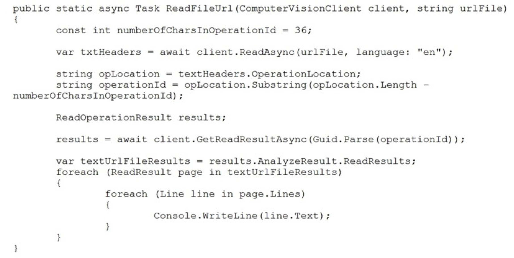
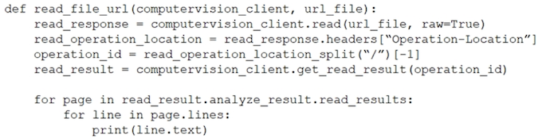
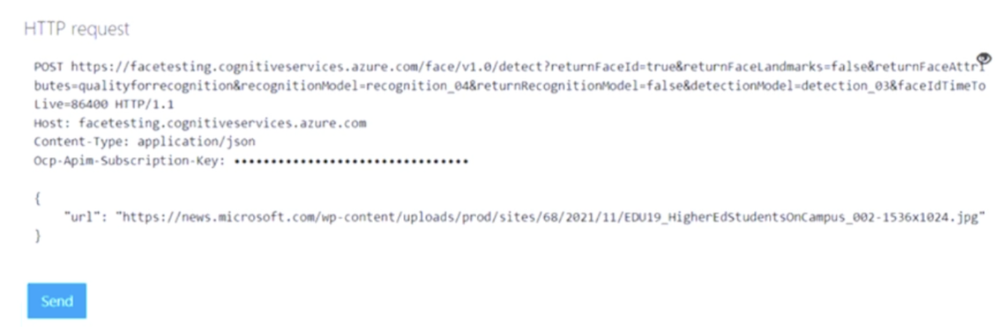
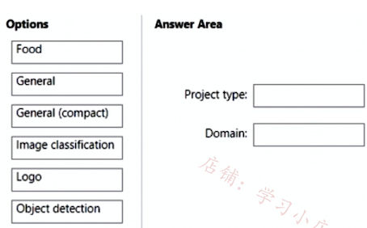
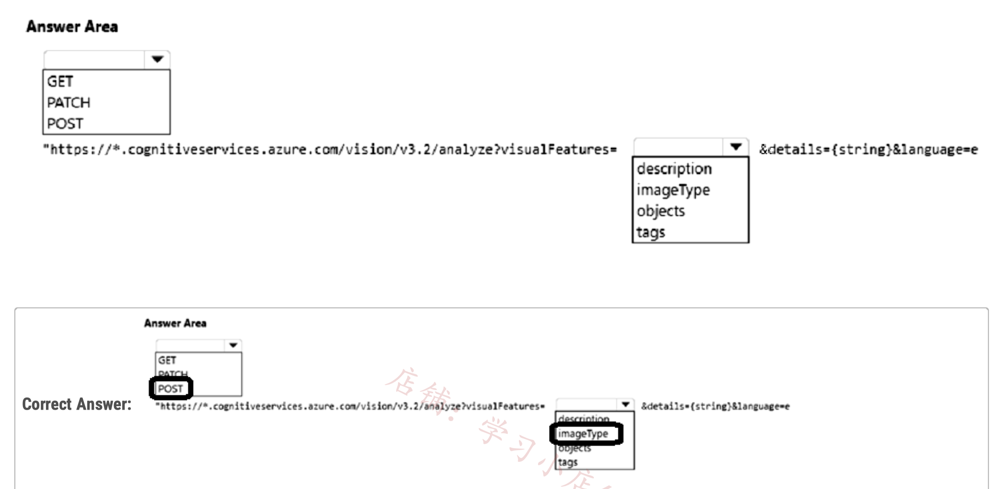

## Topic 2 - Question Set 2

### Question #1

You are developing an application that will use the Computer Vision client library. The application has the following code.


For each of the following statements, select Yes if the statement is true. 

Otherwise, select No. NOTE: Each correct selection is worth one point.


- The code will perform face recognition --> No 
- **The code will list tags and their associated confidence --> Yes** 
- **The code will read a file from the local file system --> Yes**

### **Question #2**

You are developing a method that uses the Computer Vision client library. The method will perform optical character recognition (OCR) in images. The method has the following code.



**During testing, you discover that the call to the GetReadResultAsync method occurs before the read operation is complete**. 

You need to prevent the GetReadResultAsync method from proceeding until the read operation is complete.

Which two actions should you perform? Each correct answer presents part of the solution.


- A. Remove the Guid.Parse(operationId) parameter.

- **B. Add code to verify the results.Status value.**

- C. Add code to verify the status of the txtHeaders.Status value.

- **D. Wrap the call to GetReadResultAsync within a loop that contains a delay**.

```
do { 
	results = await client.GetReadResultAsync(Guid.Parse(operationId)); } 

while ((results.Status == OperationStatusCodes.Running || results.Status == OperationStatusCodes.NotStarted));
```

### Question #3

You have a **Computer Vision resource** named contoso1 that is hosted in the **West US Azure region**.

You need to use contoso1 to make a different size of a product photo by using the smart cropping feature. How should you complete the API URL? To answer, select the appropriate options in the answer area. NOTE: Each correct selection is worth one point.


**https://contoso1.cognitiveservices.azure.com/**

**generateThumbnail**

### Question #4

You are developing a webpage that will use the **Azure Video Analyzer for Media (previously Video Indexer)** service to display videos of internal company meetings.

You embed the Player widget and the **Cognitive Insights widget into the page**.

You need to configure the widgets to meet the following requirements:

✑ Ensure that users can search for keywords.

✑ Display the names and faces of people in the video.

✑ Show captions in the video in English (United States).


How should you complete the URL for each widget? To answer, drag the appropriate values to the correct targets. Each value may be used once, more than once, or not at all. You may need to drag the split bar between panes or scroll to view content.


**1. people, keywords / search**

**2. true / en-US**


1. widgets is **people,keywords**

2. controls is **search**

3. showcaptions is **true**

4. captions is **en-US**

### Question #5

You train a **Custom Vision model to identify** a company's products by using the Retail domain.

You plan to deploy the model as part of an app for Android phones.

You need to prepare the model for deployment.


Which three actions should you perform in sequence? To answer, move the appropriate actions from the list of actions to the answer area and arrange them in the correct order.


**Actually the model should be retrained prior to publishing:**

"From the top of the page, select Train to retrain using the new domain."

So it should be:

1. **Change the model domain**
2. **Retrain the model**
3. **Publish the model （Exporting the Model）**

**Change the model domain {Retail(compact)} / Retrain the model / Export the model**

1. Change model domain

2. Retrain model

3. Test model

4. Export model

### Question #6

You are developing an application to recognize employees' faces by using the **Face Recognition API**. **Images of the faces will be accessible from a URI endpoint**.

The application has the following code.


For each of the following statements, select Yes if the statement is true. Otherwise, select No.


- **Yes**,
	- the code will add a face image to a person object in a person group, provided the code is corrected for syntax errors and proper API usage.

- **No**.
	- The second box should be No. The given answers are correct. The second box states that the code will work for up to 10,000 people. **While this is true for S0 tier, it is false for free-tier. Since the price tier is not given, we will have to say that it is not always true, and that means it is false upvoted 10 times**

- **Yes**, the add_face function can be called multiple times to add multiple face images to a person object, **subject to the limits imposed by the Azure Face API**.


### Question #7

You have a **Custom Vision resource** named acvdev in a development environment.

You have a **Custom Vision resource** named acvprod in a production environment.

**In acvdev, you build an object detection model named obj1 in a project named proj1.**

**You need to move obj1 to acvprod.**

Which three actions should you perform in sequence? To answer, move the appropriate actions from the list of actions to the answer area and arrange them in the correct order.


1. **Use GetProjects endpoint on acvDEV**

2. **Use ExportProjects endpoint on acvDEV**

3. **Use ImportProjects endpoint on avcPROD**


---

- First, you get the ID of the project in your source account you want to copy.

- Then you call the ExportProject API using the project ID and the training key of your source account. You'll get a temporary token string.

- Then you call the ImportProject API using the token string and the training key of your target account. The project will then be listed under your target account.


### Question #8

You are developing an application that will recognize faults in components produced on a factory production line. The components are specific to your business.

**You need to use the Custom Vision API to help detect common faults.**


Which three actions should you perform in sequence? To answer, move the appropriate actions from the list of actions to the answer area and arrange them in the correct order.


- Step 1: Create a project Create a new project.

- Step 2: Upload and tag the images Choose training images. Then upload and tag the images. 

- Step 3: Train the classifier model.

### Question #9


You are building a model that will be used in an iOS app.

You have images of cats and dogs. Each image contains either a cat or a dog.

**You need to use the Custom Vision service to detect whether the images is of a cat or a dog**.

How should you configure the project in the Custom Vision portal? To answer, select the appropriate options in the answer area. NOTE: Each correct selection is worth one point.


**Box 1: Classification**

Incorrect Answers: An object detection project is for detecting which objects, if any, from a set of candidates are present in an image.

**Box 2: Multiclass -**


**A multiclass classification project is for classifying images into a set of tags, or target labels. An image can be assigned to one tag only**

Incorrect Answers:

A multilabel classification project is similar, but each image can have multiple tags assigned to it.

The third choice should be **General compact**, **in other that the model can be exported to be used in iOS device**


- Classification 
- Multiclass 
- General (compact)

### Question #10


**You have an Azure Video Analyzer** for Media (previously Video Indexer) service that is used to provide a search interface over company videos on your company's website.

You need to be able to search for videos based on who is present in the video.

What should you do?


- **A. Create a person model and associate the model to the videos**.

- B. Create person objects and provide face images for each object.

- C. Invite the entire staff of the company to Video Indexer.

- D. Edit the faces in the videos.

- E. Upload names to a language model.

**Correct Answer: A**

Video Indexer supports multiple Person models per account. 

**Once a model is created, you can use it by providing the model ID of a specific Person model when uploading/indexing or reindexing a video. Training a new face for a video updates the specific custom model that the video was associated with.**


### Question #11

**You use the Custom Vision service to build a classifier**.

**After training is complete, you need to evaluate the classifier.**

Which two metrics are available for review? Each correct answer presents a complete solution. NOTE: Each correct selection is worth one point.


- **A. recall**

- B. F-score

- C. weighted accuracy

- **D. precision**

- E. area under the curve (AUC)


Custom Vision provides three metrics regarding the performance of your model: **precision, recall, and AP**.


### Question #12

You are developing a call to the Face API. The call must find similar faces from an existing list named employee faces. **The employeefaces list contains 60,000 images**.

How should you complete the body of the HTTP request? To answer, drag the appropriate values to the correct targets. Each value may be used once, more than once, or not at all. You may need to drag the split bar between panes or scroll to view content.

NOTE: Each correct selection is worth one point.


**Box 1: LargeFaceListID LargeFaceList: Add a face to a specified large face list, up to 1,000,000 faces.**

Note: Given query face's faceId, to search the similar-looking faces from a faceId array, a face list or a large face list. A "faceListId" is created by FaceList - Create containing persistedFaceIds that will not expire. And a "largeFaceListId" is created by LargeFaceList - Create containing persistedFaceIds that will also not expire.

Incorrect Answers:

*Not "faceListId": Add a face to a specified face list, up to 1,000 faces.*


**Box 2: matchFace**


Find similar has two working modes, "matchPerson" and "matchFace”. **"matchPerson" is the default mode that it tries to find faces of the same person as possible by using internal same-person thresholds. It is useful to find a known person's other photos**. Note that an empty list will be returned if no faces pass the internal thresholds.


**"matchFace" mode ignores same-person thresholds and returns ranked similar faces anyway, even the similarity is low. It can be used in the cases like searching celebrity-looking faces.**


1. LargeFaceListId
2. matchFace

### Question #13

You are developing a photo application that will find photos of a person based on a sample image by using the Face API.

**You need to create a POST request to find the photos.**


How should you complete the request? To answer, drag the appropriate values to the correct targets. Each value may be used once, more than once, or not at all.

You may need to drag the split bar between panes or scroll to view content.


**1. findsimilars**

**2. matchPerson**

### Question #14

You develop a test method to verify the results retrieved from a call to the Computer Vision API. The call is used to analyze the existence of company logos in images. The call returns a collection of brands named brands.

You have the following code segment.


For each of the following statements, select Yes if the statement is true. Otherwise, select No. NOTE: Each correct selection is worth one point.


Box 1: Yes -

Box 2: Yes Coordinates of a rectangle in the API refer to the top left corner.

Box 3: No -

**Y, Y, N**

- x Left-coordinate of the top left point of the area, in pixels.
- y Top-coordinate of the top left point of the area, in pixels.
- w Width measured from the top-left point of the area, in pixels.
- h Height measured from the top-left point of the area, in pixels.

### Question #15

You develop an application that uses the Face API.

**You need to add multiple images to a person group.**

How should you complete the code? To answer, select the appropriate options in the answer area. NOTE: Each correct selection is worth one point.


**A - Stream (this is correct)**

**B - AddFaceFromStreamAsync**

```
File.OpenRead() returns a Stream object.

using (Stream stream = File.OpenRead(imagePath)) { 
	await faceClient.PersonGroupPerson.AddFaceFromStreamAsync(personGroupId, personId, stream); 
  }
```


### Question #16

**Your company uses an Azure Cognitive Services solution to detect faces in uploaded images**. The method to detect the faces uses the following code.


**You discover that the solution frequently fails to detect faces in blurred images and in images that contain sideways faces.**

You need to increase the likelihood that the solution can detect faces in blurred images and images that contain sideways faces. What should you do?

- A. Use a different version of the Face API.

- B. Use the Computer Vision service instead of the Face service.

- C. Use the Identify method instead of the Detect method.

- **D. Change the detection model**.

**D**

**Evaluate different models.**

The best way to compare the performances of the detection models is to use them on a sample dataset. We recommend calling the Face Detect API on a variety of images, especially images of many faces or of faces that are diffcult to see, using each detection model. Pay attention to the number of faces that each model returns.

**The different face detection models are optimized for different tasks. See the following table for an overview of the differences**.


**use `detection_02` or `detection_03`.**

### Question #17 

You have the following Python function for creating Azure Cognitive Services resources programmatically. 

```
def create_resource (resource_name, kind, account_tier, location) : 

	parameters = CognitiveServicesAccount(sku=Sku(name=account_tier), kind=kind, location=location, properties={}) 
    	result = client.accounts.create(resource_group_name, resource_name, parameters) 
```
You need to call the function to create a free Azure resource in the West US Azure region. The resource will be used to generate captions of images automatically.

Which code should you use?


```
A. create_resource("res1", "ComputerVision", "F0", "westus")

B. create_resource("res1", "CustomVision.Prediction", "F0", "westus")

C. create_resource("res1", "ComputerVision", "S0", "westus")

D. create_resource("res1", "CustomVision.Prediction", "S0", "westus")
```

**`A. create_resource("res1", "ComputerVision", "F0", "westus")`**


**Computer vision provide automatic vision solutions including captions. The key-phrase is "automatic".**


### Question #18

You are developing a method that uses the Computer Vision client library. The method will perform optical character recognition (OCR) in images. The method has the following code.



During testing, you discover that the call to the GetReadResultAsync method occurs before the read operation is complete. 

You need to prevent the GetReadResultAsync method from proceeding until the read operation is complete.

Which two actions should you perform? Each correct answer presents part of the solution.

NOTE: Each correct selection is worth one point


```
A. Remove the operation_id parameter.

B. Add code to verify the read_results.status value.

C. Add code to verify the status of the read_operation_location value.

D. Wrap the call to get_read_result within a loop that contains a delay.
```

- **B. Add code to verify the `read_results.status` value.**

- **D. Wrap the call to `get_read_result` within a loop that contains a delay.**


In order to prevent the GetReadResultAsync method from proceeding until the read operation is complete, we need to check the status of the read operation and wait until it's completed. 


To do this, we can add code to verify the status of the `read_results.status` value. If the status is not "succeeded", we can add a delay and then retry the operation until it's complete. 

**This can be achieved by wrapping the call to `get_read_result` within a loop that contains a delay.**

Removing the `operation_id` parameter or adding code to verify the status of the `read_operation_location` value will not solve the issue of waiting for the read operation to complete before proceeding with the GetReadResultAsync method.


### Question #19

**You are building an app that will enable users to upload images.** The solution must meet the following requirements: 


* Automatically suggest alt text for the images.
* **Detect inappropriate images and block them.**
* Minimize development effort.
* You need to recommend a computer vision endpoint for each requirement.

What should you recommend? To answer, select the appropriate options in the answer area.

NOTE: Each correct selection is worth one point


1. **`https://westus.api.cognitive.microsoft.com/vision/v3.2/analyze/?visualFeatures=Adult,Description`**

2. **`https://westus.api.cognitive.microsoft.com/vision/v3.2/analyze/?visualFeatures=Adult,Description`**

Computer Vision can analyze an image and generate a human-readable phrase that describes its contents. The algorithm returns several descriptions based on different visual features, and each description is given a confidence score. 

The final output is a list of descriptions ordered from highest to lowest confidence.

### Question #20

You need to build a solution that will use optical character recognition (OCR) to scan sensitive documents by using the Computer Vision API. The solution must **NOT be deployed to the public cloud**.

What should you do?

- A. Build an on-premises web app to query the Computer Vision endpoint.

- **B. Host the Computer Vision endpoint in a container on an on-premises server.**

- C. Host an exported Open Neural Network Exchange (ONNX) model on an on-premises server.

- D. Build an Azure web app to query the Computer Vision endpoint.

**One option to manage your Computer Vision containers on-premises is to use Kubernetes and Helm.**

Three primary parameters for all Cognitive Services containers are required. **The Microsoft Software License Terms must be present with a value of accept. An Endpoint URI and API key are also needed**.


### Question #21

You have an **Azure Cognitive Search solution** and a collection of handwritten letters stored as JPEG files.

**You plan to index the collection. The solution must ensure that queries can be performed on the contents of the letters.**

You need to create an indexer that has a skillset.

Which skill should you include?

- A. image analysis

- **B. optical character recognition (OCR)**

- C. key phrase extraction

- D. document extraction

**To ensure that queries can be performed on the contents of the letters, the skill that should be included in the indexer is optical character recognition (OCR).**


**Option B, optical character recognition (OCR), is a technology that can recognize text within an image and convert it into machine-readable text.** 

This skill will enable the search engine to read the handwritten letters and convert them into searchable text that can be indexed by Azure Cognitive Search.

Option A, image analysis, is a useful skill for analyzing images to extract metadata, but it does not directly enable text recognition.

Option C, key phrase extraction, extracts important phrases and concepts from text, but it requires the text to be already recognized and extracted by OCR or other text extraction techniques.

Option D, document extraction, is a skill that extracts specific pieces of information from documents, but it does not address the challenge of recognizing and extracting text from handwritten letters.

### Question #22

You have a library that contains thousands of images.

You need to tag the images as photographs, drawings, or clipart.

Which service endpoint and response property should you use? To answer, select the appropriate options in the answer area.

NOTE: Each correct selection is worth one point.


- **1 - Computer Vision analyze image** 

- **2 - imageType**

With the Analyze Image API, Computer Vision can analyze the content type of images, indicating whether an image is clip art or a line drawing.

- **Service endpoint: Computer Vision image classification** 
- **Property: imageType**

  
The Computer Vision image classification endpoint allows you to classify images into different categories, and the imageType property specifically provides information about the type of image, such as whether it is a photograph, drawing, or clipart.


### Question #23

You have an app that captures live video of exam candidates.

You need to use the Face service to validate that the subjects of the videos are real people.

What should you do?

- A. Call the face detection API and retrieve the face rectangle by using the FaceRectangle attribute.

- **B. Call the face detection API repeatedly and check for changes to the FaceAttributes.HeadPose attribute.**

- C. Call the face detection API and use the FaceLandmarks attribute to calculate the distance between pupils.

- D. Call the face detection API repeatedly and check for changes to the FaceAttributes.Accessories attribute.

**B is the answer.**

**You can detect head gestures like nodding and head shaking by tracking HeadPose changes in real time. You can use this feature as a custom liveness detector.**

Liveness detection is the task of determining that a subject is a real person and not an image or video representation. A head gesture detector could serve as one way to help verify liveness, especially as opposed to an image representation of a person.

### Question #24

You make an API request and receive the results shown in the following exhibits.




Use the drop-down menus to select the answer choice that completes each statement based on the information presented in the graphic.


**1. detects**

**2. 797, 201**

**Each detected face corresponds to a faceRectangle field in the response**.

**This is a set of pixel coordinates for the left, top, width, and height of the detected face**. Using these coordinates, you can get the location and size of the face. In the API response, faces are listed in size order from larges to smallest.


- QualityForRecognition

**The overall image quality regarding whether the image being used in the detection is of sufficient quality to attempt face recognition on**. The value is an informal rating of low, medium, or high. Only "high" quality images are recommended for person enrollment, and quality at or above "medium" is recommended for identification scenarios.


**To answer the first question see the endpoint .../face/v1.0/detect?**....


**To answer the second question see the first object from the response "faceRectangle": {"TOP":201, "LEFT:"797....}**


### Question #25

You have an Azure subscription that contains an **AI enrichment pipeline in Azure Cognitive Search and an Azure Storage account that has 10 GB of scanned documents and images**.

**You need to index the documents and images in the storage account.** The solution must minimize how long it takes to build the index.

What should you do?

- **A. From the Azure portal, configure parallel indexing.**

- B. From the Azure portal, configure scheduled indexing.

- C. Configure field mappings by using the REST API.

- D. Create a text-based indexer by using the REST API.

If you partition your data, you can create multiple indexer-data-source combinations that pull from each data source and write to the same search index. Because each indexer is distinct, you can run them at the same time, populating a search index more quickly than if you ran them sequentially.

### Question #26

You need to analyze video content to identify any mentions of specific company names.

Which three actions should you perform in sequence? To answer, move the appropriate actions from the list of actions to the answer area and arrange them in the correct order


1. **Sign in to Azure Video Analyzer for Media website**

2. **From Content model customization, select Brands**

3. **Add specific company names to include list**

### Question #27

You have a mobile app that manages printed forms.

You need the app to send images of the forms directly to Forms Recognizer to extract relevant information. For compliance reasons, the image files must not be stored in the cloud.

In which format should you send the images to the Form Recognizer API endpoint?

- **A. raw image binary**

- B. form URL encoded

- C. JSON

**Selected Answer: A**

**To send images to the Form Recognizer API endpoint without storing them in the cloud, you should send the images in the following format**:

**A. raw image binary**

**Sending the images as raw image binary data allows you to transmit the image directly to the Form Recognizer API without the need to store them in the cloud or convert them into other formats. This format ensures compliance with your requirements**

### Question #28

You plan to build an app that will generate a list of tags for uploaded images. The app must meet the following requirements:

- Generate tags in a user's preferred language.

- Support English, French, and Spanish.

- **Minimize development effor**t.

You need to build a function that will generate the tags for the app.

Which Azure service endpoint should you use?

- A. Content Moderator Image Moderation

- B. Custom Vision image classification

- **C. Computer Vision Image Analysis**

- D. Custom Translator

**Selected Answer: C**

I think the answer should be C, because of the minimized developement effort. Since the prebuilt model of C also fits the other two requirements, so there is no need to train a custom model.


### Question #29

**You develop a test method to verify the results retrieved from a call to the Computer Vision API.** The call is used to analyze the existence of company logos in images. The call returns a collection of brands named brands

You have the following code segment.


For each of the following statements, select Yes if the statement is true. Otherwise, select No.


**YYN is the answer.**


**A bounding box for an area inside an image.**

`-x: X-coordinate of the top left point of the area, in pixels`.

`-y Y-coordinate of the top left point of the area, in pixels.`

`-h Height measured from the top-left point of the area, in pixels.`

`-w Width measured from the top-left point of the area, in pixels.`


### Question #30

**You have a factory that produces cardboard packaging for food products.** The factory has intermittent internet connectivity.

The packages are required to include four samples of each product.


**You need to build a Custom Vision model that will identify defects in packaging and provide the location of the defects to an operator**. The model must ensure that each package contains the four products.

Which project type and domain should you use? To answer, drag the appropriate options to the correct targets. Each option may be used once, more than once, or not at all. You may need to drag the split bar between panes or scroll to view content.





**1. Object detection**

**2. General (compact)**

**Select Object Detection under Project Types.**

**The models generated by compact domains can be exported to run locally.**


### Question #31

You are building a model to detect objects in images.

The performance of the model based on training data is shown in the following exhibit.


Use the drop-down menus to select the answer choice that completes each statement based on the information presented in the graphic.

NOTE: Each correct selection is worth one point.


1. 0
2. 25

   
**Precision:** Measures how precise/accurate your model is. It's the ratio between the correctly identified positives (true positives) and all identified positives. The precision metric reveals how many of the predicted classes are correctly labeled.

**`Precision = #True_Positive / (#True_Positive + #False_Positive)`**

**Recall:** Measures the model's ability to predict actual positive classes. **It's the ratio between the predicted true positives and what was actually tagged. The recall metric reveals how many of the predicted classes are correct. Recall = #True_Positive / (#True_Positive + #False_Negatives)**

### Question #32


You are building an app that will include one million scanned magazine articles. Each article will be stored as an image file.

**You need to configure the app to extract text from the images**. The solution must minimize development effort.

What should you include in the solution?


- A. Computer Vision Image Analysis

- **B. the Read API in Computer Vision**

- C. Form Recognizer

- D. Azure Cognitive Service for Language

**Selected Answer: B**


With the new Image Analysis API 4.0 (in preview) you could use OCR feature too

Instead the Read API is particularly adapted for text-heavy documents and it seems this is the case


**A - Computer Vision Image Analysis:** This is a service provided by Azure that can extract a wide variety of visual features from your images. It determine whether an image contains adult content, find specific brands or objects, or find human faces. **However, while it does have OCR capabilities, it is not specifically designed for large-scale text extraction from images**.

**B - Read API in Computer Vision**: This is a part of the **Azure Computer Vision service that is designed to extract printed and handwritten text images. It uses state-of-the-art Optical Character Recognition (OCR) algorithms optimized for text-heavy documents.** This could be a good your needs as it is designed to handle large amounts of text in images.

the key here is option A it is not specifically designed for large-scale text extraction from images.

### Question #33

You have a **20-GB video file named File1.avi that is stored on a local drive**.

**You need to index File1.avi by using the Azure Video Indexer website.**

What should you do first?

- A. Upload File1.avi to an Azure Storage queue.

- B. Upload File1.avi to the Azure Video Indexer website.

- **C. Upload File1.avi to Microsoft OneDrive.**

- D. Upload File1.avi to the www.youtube.com webpage.

Max file size for direct upload is 2 GB . 30 GB is through url.so answer C

**B. Upload File1.avi to the Azure Video Indexer website.**

Upload file size and video duration If uploading a file from your device, the file size limit is 2 GB.

**If the video is uploaded from a URL, the file size limit is 30 GB.** 

The URL must lead to an online media file with a media file extension (for exampl myvideo.MP4) and not a webpage such as https://www.youtube.com.

### Question #34

You are building an app that will share user images.

You need to configure the app to meet the following requirements:

- Uploaded images must be scanned and any text must be extracted from the images.

- Extracted text must be analyzed for the presence of profane language.

- The solution must minimize development effort.

What should you use for each requirement? To answer, select the appropriate options in the answer area.

NOTE: Each correct selection is worth one point.


1. **Text Extraction: Azure AI Document Intelligence**

2. **Profane Language detection:  Content Moderator**


### Question #35

You are building an app that will share user images.

You need to configure the app to perform the following actions when a user uploads an image:

- Categorize the image as either a photograph or a drawing.

- Generate a caption for the image.

The solution must minimize development effort.

Which two services should you include in the solution? Each correct answer presents part of the solution.

NOTE: Each correct selection is worth one point.


- A. object detection in Azure AI Computer Vision

- B. content tags in Azure AI Computer Vision

- **C. image descriptions in Azure AI Computer Vision**

- **D. image type detection in Azure AI Computer Vision**

- E. image classification in Azure AI Custom Vision

**Image Categorization doesn't identify image as photograph or drawing:**


**Captions are generated using image descriptions in V3.2. However in V4.0 it is image captions**


### Question #36

You are building an app that will use the Azure AI Video Indexer service.

You plan to train a language model to recognize industry-specific terms.

**You need to upload a file that contains the industry-specific terms.**

Which file format should you use?


- A. XML

- **B. TXT**

- C. XLS

- D. PDF

**Selected Answer: B**

This step creates the model and gives the option to upload text files to the model.


### Question #37 - SIMULATION 

You have an app that uses Azure AI and a custom trained classifier to identify products in images.

You need to add new products to the classifier. The solution must meet the following requirements:

- Minimize how long it takes to add the products.

- Minimize development effort.

Which five actions should you perform in sequence? To answer, move the appropriate actions from the list of actions to the answer area and arrange them in the correct order.


**Actions**

- Label the sample images.
- From Vision Studio, open the project.
- Publish the model.
- From the Custom Vision portal, open the project.
- Retrain the model.
- Upload sample images of the new products.
- From the Azure Machine Learning studio, open the workspace.


1. From the Custom Vision Portal, Open the Project. 

2. Upload Sample images of the new products. 

3. Label the Sample images.

4. Retrain the model.

5. Publish the model.

### Question #38

You are developing an application that will use the Azure AI Vision client library. The application has the following code


For each of the following statements, select Yes if the statement is true. Otherwise, select No.

NOTE: Each correct selection is worth one point


**No Yes Yes**


### Question #39

You are developing a method that uses the Azure AI Vision client library. The method will perform optical character recognition (OCR) in images. The method has the following code.


During testing, you discover that the call to the `get_read_result` method occurs before the read operation is complete.

You need to prevent the `get_read_result` method from proceeding until the read operation is complete.

Which two actions should you perform? Each correct answer presents part of the solution.

NOTE: Each correct selection is worth one point.


- A. Remove the `operation_id` parameter.

- **B. Add code to verify the `read_results.status` value.**

- C. Add code to verify the status of the `read_operation_location` value.

- **D. Wrap the call to `get_read_result` within a loop that contains a delay**.

### Question #40

You are developing an app that will use the Azure AI Vision API to analyze an image.

**You need configure the request that will be used by the app to identify whether an image is clipart or a line drawing.**

How should you complete the request? To answer, select the appropriate options in the answer area.

NOTE: Each correct selection is worth one point.



### Question #41

You have an Azure subscription that contains an Azure AI Video Indexer account.

You need to add a custom brand and logo to the indexer and configure an exclusion for the custom brand.

How should you complete the REST API call? To answer, select the appropriate options in the answer area.

NOTE: Each correct selection is worth one point.


### Question #42

**You have a local folder that contains the files shown in the following table.**


You need to analyze the files by using Azure AI Video Indexer.

**Which files can you upload to the Video Indexer website**?

- A. File1 and File3 only

- **B. File1, File2, File3 and File4**

- C. File1, File2, and File3 only

- D. File1 and File2 only

- E. File1, File2, and File4 only

**Correct Answer: B**