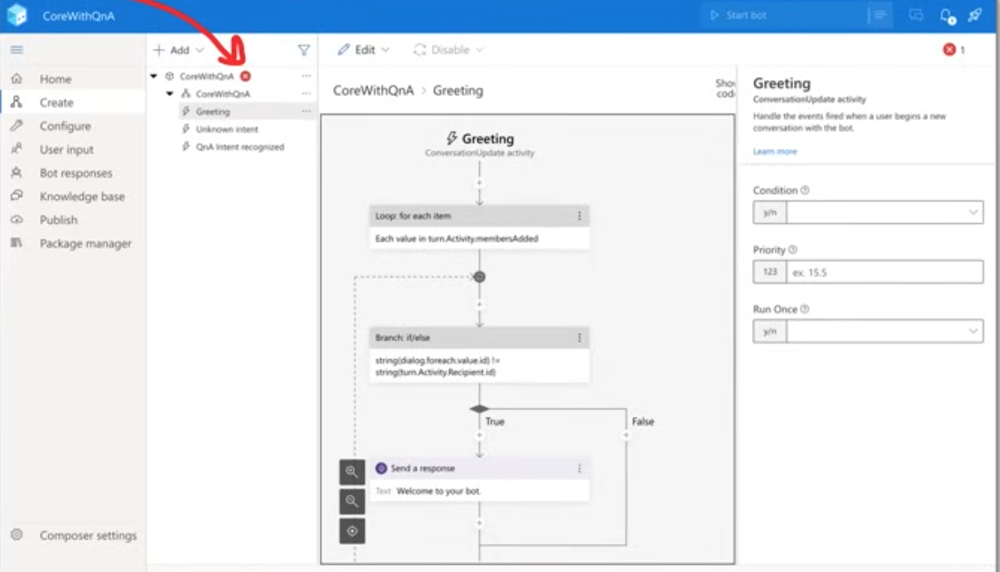

# Azure AI Fundamentals Certification 2024 (AI-900) 


### Exam domains.

* 15-20% Describe **Artificial Intelligence workloads and considerations**
	* 6-9 questions
* 20-25% Describe **fundamental principles of machine learning on Azure**
	* 7-12 questions
* 15-20% Describe features of **computer vision workloads on Azure**
	* 6-9 questions
* 15-20% Describe features of **Natural Language Processing (NLP) workloads on Azure
	* 6-9 questions
* 15-20% Describe features of **generative AI workloads on Azure**
	* 6-9 questions

**There are ~37-47 Questions** / Duration of 60 mins

Format of Questions

* Multiple Choice
* Multiple Answer
* Drag and Drop
* Hot Area

## 1 ☁️ ML Introduction


### **The Layers of Machine Learning**

* **What is Artificial Intelligence (AI)?**

Machines that perform jobs that **mimic human behavior**

* **What is Machine Learning (ML)?**

Machines that get better at a task **without explicit programming**

**What is Deep Learning (DL)?**

Machines that have an **artificial neural network** inspired by the human brain to solve complex problems.

* **What is a Data Scientist?**

A person with **multi-disciplinary skills** in math, statistics, predictive modeling and machine learning **to make future predictions**


### Key Elements of AI

AI is the software that **imitates human behaviors and capabilities.**

Key elements (according to Microsoft/Azure):

* **Machine learning** - the foundation of an AI system, learn and predict like a human 
* **Anomaly detection** - detect outliers or things out of place like a human
* **Computer vision** - be able to see like a human
* **Natural language processing** - be able to process human languages and infer context 
* **Conversational AI** - be able to hold a conversation with a human

### **DataSets**

* **What is a dataset?**

A data set is a **logical grouping of units of data** that are closely related and/or share the samedata structure.

There are **publicly available data sets** that are used in the learning of statistics, data analytics, machine learning

* **MIST database**

Images of handwritten digits used to test classification, clustering, and image processing algorithm.


Commonly used when learning how to build computer vision ML models to translate handwriting into digital text

### More Data Sets..

**Common Objects In Context (COCO) dataset**

A dataset which contains many common images using a JSON file (coco format) that indentify objects or
segments within an image


This dataset features:

* Object segmentation
* Recognition in context
* Superpixel stuff segmentation
* 329K images (>200K labeled)
* 0.5 million obiect instances
* 79 object categories
* 90 stuff categories
* 4 captions per image
* 249,000 people with keypoints


### What is Labeling?

the process of **identifying raw data** (images, text files, videos, etc.) and **adding one or more meaningful and informative labels to provide context** so that a machine learning model can learn


With **supervised machine learning**, labeling is a prerequisite to produce training data and **each piece of data will generally be labeled by a human**

With **unsupervised machine learning, labels will be produced by the machine**, and **may not be human readable**.

* **What is a ground truth?**

A properly labeled dataset that you use as the objective standard to train and assess a given model is often called "ground truth." 

The accuracy of your trained model will depend on the accuracy of your ground truth

### Supervised vs Unsupervised Reinforcement

* **Supervised Learning (SL)**

Data that has been labeled for training Task-driven - **make a prediction**

* When the labels are known and you want a precise outcome.
* When you need a specific value returned eg. Classification, Regression

* **Unsupervised Learning (SL)**

Data has not been labeled, the ML model needs to do its own labeling 

Data-driven - **recognize a structure or pattern**


* When the labels are not known and the outcome does not need to be precise.
* When you're trying to make sense of data

eg. Clustering, Dimensionality Reduction, Association

* **Reinforcement Learning (RI)**

There is no data, there is an environment and an ML model generates data any many attempt to reach a goal

Decisions-driven - **Game AI, Learning Tasks, Robot Navigation**

### Neural Networks and Deep Learning

#### **What are Neural Networks? (NN)**

* Often described as **mimicking the brain, a neuron/node represents an algorithm**
* Data is inputted into a neuron and based on the output the data will be passed to
* one of many other connected neurals.
* The connection between neurons is weighted.
* The network is organized in layers.
* There will be a input layer, 1 to many hidden layers and an output layer.

* **What is Deep Learning?**

A neural network that has 3 or more hidden layers is considered deep learning.

**What is Feed Forward? (FNN)**

Neural Networks where connections between nodes do not form a cycle (always move forward)

* **What is Backpropagation (BP)?**

**Moves backwards through the neural network adjusting weights to improve outcome on next iteration. This is how a neural net learns.**

* **Loss Function**

A function that compares the ground truth to the prediction to determine the error rate (how bad the network performed)


**Activation Functions**

An algorithm applied to a hidden layer node that affects connected output e.g. ReLu

**Dense**

When the next layer increases the amount of nodes

**Sparse**

When the next layer decreases the amount of nodes


### Graphics processing unit（GPU)

**What is a GPU?**

**A General Processing Unit (GPU)** that is specially designed to quickly render high-resolution images and video **concurrently**.

GPUs can perform **parallel operations on multiple sets of
data**, and so they are commonly used for **non-graphical
tasks such as machine learning and scientific computation**.


* CPU can have average 4 to 16 processor cores...
* GPs can **thousands of processor cores**
* 4 to 8 GPs can provide as many as 40,000 cores


GPs are best suited for repetitive and highly-parallel
computing tasks:

* Rendering graphics
* Cryptocurrency mining
* Deep Learning and ML

### What is CUDA?

**What is NVIDA?**

NVIDA is a company that manufactures **graphical processing units (GPUs)** for gaming and professional markets

**What is CUDA?**

**Compute Unified Device Architecture (CUDA)** is a **parallel computing platform** and API by NVIDIA that allows developers to use **CUDA-enabled GPUs** for general-purpose computing on GPs (GPGPU)

All major deep learning frameworks are integrated
with **NVIDIA Deep Learning SDK**

The NVIDA Deep Learning SDK is a collection of NVIDIA libraries for deep learning.

One of those libraries is the **CUDA Deep Neural Network library (cuDNN)**

cuDNN provides highly tuned implementations for standard routines such as:

* forward and backward convolution
* Pooling
* Normalization
* activation layers

### Simple ML Pipeline


* **Data Labeling**

For supervised learning you need to label your data so the ML model can learn by example during training

* **Feature Engineering**

**ML models only work with numerical data.**

So you need to translate it into a format that it can understand, extract out the important data that the ML needs to focus on.

* **Training**

Your model needs to learn how to become smarter. It will perform multiple iterations getting smarter with each iteration

* **Hyperparameter Tunning**

An ML model can have different parameters, we can use ML to try out many different parameters to optimize the outcome

* **Serving**

We need to make are ML model accessible, so we serve by hosting in a virtual machine or container.

* **Batch Processing**

Inference is the act of requesting to make a prediction

Very simplified ML pipeline

### Forecasting vs Prediction

**What is a Forecasting?**

Makes a future prediction with **relevant data**


* **analysis of trends**
* **Its not "guessing"**


**What is a Prediction?**


Makes a future **prediction without relevant data**

* uses statistics to predict future outcomes
* **Its more of "guessing"**
* Uses decision theory

### **What are Metris**

**Performance/Evaluation Metrics** are used to evaluate different Machine Learning Algorithms

For different types of problems different metrics matter, (this is not an exhaustive list)

* Classification Metrics (accuracy, precision, recall, F1-score, ROC, AUC)
* Regression Metrics (MSE, RMSE MAE)
* Ranking Metrics (MRR, DCG, NDCG)
* Statistical Metrics (Correlation)
* Computer Vision Metrics (PSNR. SSIM. loU)
* NLP Metrics (Perplexity, BLEU, METEOR, ROUGE)
* Deep Learning Related Metrics (Inception score, Frechet Inception distance)

There are two categories of evaluation metrics

- **Internal Evaluation**
- **metrics used to evaluate the internals of the ML model**
	- Accuracy, F1 Score, Precision, Recall (The Famous Four) used in all kinds of models 
- External Evaluation
	- metrics used to evaluate the final prediction of the ML model


### What is Jupter Notebook

**Jupyter Notebook**

A Web-based application for authoring

documents that combine:

* live-code
* narrative text
* equations
* visualizations

Python's notebook feature became Jupyter Notebook

Jupyter Notebooks were overhauled and better integrated into an IDE called JupyterLab

* You generally want to open Notebooks in Labs

* The legacy web-based interface is known as **Jupyter classic notebook**


**JupyterLab is a a next-generation web-based user interface**

All the familiar features of the classic Jupyter Notebook in a flexible and powerful user interface:

* notebook
* Terminal
* text editor
* file browser
* rich outputs

JupyterLab will eventually replace the classic Jupyter Notebook


### **Regression**

**Regression** is a process of finding a function to **correlate a labeled dataset into continuous variable/number**.

* Outcome: Predict this variable in the future

Vectors (dots) are plotted on a graph in multiple dimensions eg (X,Y) A regression line is drawn though the dataset.

The **distance** of the vector from the regression line called an **Error Different** **Regression algorithms** use the error to predict future variables:

* Mean squared error (MSE)
* Root mean squared error (RMSE)
* Mean absolute error (MAE)


### Classification

<mark>**Classification** is a process of finding a function to **divide a labeled dataset into classes/categories**</mark>

* Outcome: Predict **category** to apply to the inputted data

**Classification Algorithms**

* Log Regression
* Decision Iree/Random Forest
* Neural Networks
* Naive Bavies
* k-Nearest neighbor
* Support Vector Machines

> A classification line divides the dataset


### Clustering

**Clustering** is a process grouping unlabeled data based on similarities and differences.

**Outcome: Group data based on their similarities or differences**


**Clustering Algorithms**

* K-means
* k-medoids
* Density based
* Hierarchical

### Classification Metrics - Confusion Matrix

A confusion matrix is table to visualize the **model predictions** (predicted) vs **ground truth labels (actual)**

Also known as an error matrix. hey are usetul in classitication problems


## 3 ☁️ Common AI Workloads 

### Anomaly Detection AI

**What is an anomaly?**

An abnormal lining, a marked deviation from the norm, or a standard

**What is anomaly detection?**

Anomaly Detection is the process of finding outliers within a dataset called an **anomaly Detecting** when a piece of data or access patterns appear suspicious or malicious

**Use cases for anomaly detection**

* Data cleaning
* **Intrusion detection**
* **Fraud detection**
* Systems health monitoring
* Event detection in sensor networks
* Ecosystem disturbances
* Detection or critical and cascading flaws


Anomaly detection by hand is a very tedious process.

Using machine learning for anomaly detection is more efficent and accurate

### Computer Vision

**Computer Vision** is when we use Machine Learning Neural Networks to **gain high-level understanding from digital images or video**

**Computer Vision Deep Learning Algorithms**

* **Convolutional neural network (CNN)** - image and video recognition
	* Inspired matter how human eves actually process Information and send it back to the brain to be processed
* **Recurrent neural network (RNN)** - handwriting recognition or speech recognition

**Types of Computer Vision**

* **Image Classification** - look at an Image or Video and classify (place it in a category)
* **Object Detection** - identify objects within an image or video and apply labels and location boundaries
* **Semantic Segmentation** - identify segments or objects by drawing pixel masks (great for objects in movement
* Image Analysis - analyze and image or video to apply descriptive and context labels
	* eg. An employee sitting at a Desk in Tokyo
* **Optical Character Recognition** - Find text in images or videos and extract them into digital text for editing
* **Facial Detection** - detect faces In a photo or video, draw a location boundary, label their expression


### Computer Vision

Seeing AI is an AI app developed by Microsoft for ios

Seeing AI uses the device camera to **identify people and objects**, and then the app audibly **describes those objects for people with visual impairment**.

Azure's Computer Vision Service Offering:

* **Computer Vision** analyze images and video, and extract descriptions, tags, objects, and text
* **Custom Vision** custom image classification and object detection models using your own images
* **Face Detect** and identify people and emotions in images
* **Form Recogniser** translate scanned documents into key /value or tabular editable data


### Natural Language Processing (NLP)


**Natural Language Processing** is Machine Learning that can **understand the context of a corpus (a body of related text)**.

**NLP enables you to:**

* Analyze and interpret text within documents, email messages
* Interpret or contextualise spoken token eg sentiment analysis
* Synthesize speech eg. a voice assistance talking to you
* Automatically translate spoken or written phrases and sentences between languages.
* Interpret spoken or written commands and determine appropriate actions.


**Cortana is a virtual assistant** developed by Microsoft which uses the Bing search engine to perform tasks such as setting reminders and answering questions for the user.

#### Azure's LP Service Offering:

**Text Analytics**

* sentiment analysis to find out what customers think
* Find topic-relevant phrases using keyphrase extraction
* identify language or the language detctor
* Detect and categorize entitles In our text with named entity recognition

**Translator**

* real-time text translation
* multi-language support

**Speech**

transcribe audible speech into readable, searchable text

**Language Understanding (LUIS)**

natural language processing service that enables you to understand human language in your own application, website, chatbot, IoT device, and more

### Conversational AI

Conversational AI is technology that **can participate in conversations with humans.**

* Chatbots
* Voice Assistants
* Interactive Voice Recognition Systems (IVRS)

**Use Cases**

* **Online Customer Support** - replaces human agents for replying about customer FAQs, shipping
* **Accessibility** - voice operated UI for those who are visually impaired
* **HR processes** - employee training, onboarding, updating employee Information
* **Health Care** - accessible and affordable health care eg. claim processes
* **Internet or Things IoT** - Amazon Alexa, Apple Siri and Google Home
* **Combuter Software** - autocomplete search on phone or desktop


**QA Maker** Create a conversational **question-and-answer** bot from your exIsting content (Knowledge base)

**Azure Bot Service** Intelligent, serverless bot service that scales on demand. Used for creating, publishing, and managing bots

## 3 ☁️ Responsible AI

### Responsible AI

**Responsible AI** focuses on **ethical, transparent and accountable** use of AI technologies


Microsoft puts into practice Responsible AI via its six **Microsoft AI principles**

* **Fairness** - AI systems should treat all people fairly
* **Reliability and Safety** - AI systems should perform reliably and safely
* **Privacy and Security** - AI systems should be secure and respect privacy
* **Inclusiveness** - AI systems should empower everyone and engage people
* **Transparency** - AI systems should be understandable
* **Accountability** - People should be accountable for AI systems


**AI systems should treat all people fairly**

AI systems can reinforce existing societal stereotypical

Bias can be introduced during the development of a pipeline

AI systems that are used to allocate or withhold:

* Opportunities
* resources
* Information

**In domains:**

* Criminal Justice
* Employment and Hiring
* Finance and Credit

eg. an ML model designed to select final applicants for a hiring pipeline without incorporating any bias based on gender, or ethnicity or may result in an unfair advantage

**Azure ML can tell you how each feature can influence a model's prediction for bias**

Fairlearn is an open-source python project to help data scientist to Improve tairness In their AI systems

### Responsible AI - Fairness

**AI systems should treat all people fairly**

* AI systems can reinforce existing societal stereotypical
* Bias can be introduced during the development of a pipeline

AI systems that are used to allocate or withhold:

* Opportunities
* resources
* Information

In domains:

* Criminal Justice
* Employment and Hiring
* Finance and Credit

eg. an ML model designed to select final applicants for a hiring pipeline without incorporating any bias based on gender, or ethnicity or may result in an unfair advantage

**Azure ML can tell you how each feature can influence a model's prediction for bias**

Fairlearn is an open-source python project to help data scientist to improve fairness in their AI systems

### Responsible AI - Reliability and safety

**AI systems should perform reliably and safely**

AI software must be **rigorous tested** to ensure they work as expected before release to the end user


If there are scenarios where AI is making mistakes its important to release a report **quantified risks** and harms to end-users so the are informed of the short-comings of an AI solution

AI where concern for reliability and safety for humans is critically important:

* Autonomous Vehicle
* AI health diagnosis, AI suggesting prescriptions
* **Autonomous Weapon Systems**

### Responsible AI - Privacy and security

AI can require vasts amounts of data to train Deep Learning ML models.

The nature of the ML model may require **Personally identifiable information (PII)**

It is important that we ensure protection of user data that it is not leaked or disclosed

In some cases ML Models can be run locally on a user's device so their PII remains on their device avoiding that vulnerability

AI Security Principles to detect malicious actors:

* Data Origin and Lineage
* Data Use Internal vs External
* Data Corruption Considerations
* Anomaly detection


### Responsible AI - Inclusiveness

**AI systems should empower everyone and engage people**

If we can design AI solutions for the **minority** of users

Then we can design AI solutions for the maiority of users

**Minority Groups**

* physical ability
* Gender
* sexual orientation
* ethnicity
* other factors

### Responsible AI - Transparency

**AI systems should be understandable**

Interpretability / Intelligibility is when end-users can understand the behaviour of the UI

Transparency of AI systems can result in

* Mitigating unfairness
* Help developers debug their AI systems
* Gaining more trust from our users

Those built AI systems should be:

* open about the way they are using AI
* open about the limitations of their AI systems

Adopting an open-source AI framework can provide transparency (at least from a technical perceptive) on the internal workings of an AI systems


### Responsible AI - Accountability

People should be accountable for AI systems


* The structure put in place to consistently enact
* AI principles and taking them into account


AI systems should work within:

* framework of governance
* organizational principles

ethical and legal standards that are clearly defined

Principles guide Microsoft on how they **Develop, Sell and Advocate** when working with third-parties and this can push towards regulations towards Al Principles

## 4 ☁️ Azure Cognitive Services

### Azure Cognitive Services

**Azure Cognitive Services** is a **comprehensive family of AI services** and cognitive APIs to help you build intelligent apps

* Create customizable, pretrained models built with "breakthrough" AI research
* Deploy Cognitive Services anywhere from the cloud to the edge with containers
* Get started quickly machine-learning expertise required
* Developed with strict ethical standards, empowering responsible use
with industry-leading tools and guidelines

**Decision**

* **Anomaly Detector** - Identify potential problems early on.
* **Content Moderator** - Detect potentially offensive or unwanted content.
* **Personaliser** - Create rich, personalised experiences for every user.

**Language**

* **Language Understanding** - Build natural language understanding into apps, bots and loT devices.
* **QA Maker** - Create a conversational question and answer layer over your data.
* **Text Analytics** - Detect sentiment, key phrases and named entities.
* **Translator** - Detect and translate more than 90 supported languages.

**Speech**


* **Speech to Text** - Transcribe audible speech into readable, searchable text.
* **Text to Speech** - Convert text to lifelike speech for more natural interfaces.
* **Speech Translation** - Integrate real-time speech translation into your apps.
* **Speaker Recognition** - Identify and verify the people speaking based on audio.

**Vision**

* **Computer Vision** - Analyze content in images and video.
* **Custom Vision** - Customize image recognition to fit your business needs.
* **Face** - Detect and identify people and emotions in images.


### Congitive API Key and Endpoint 


Cognitive Services is an umbrella AI service that enables customers to
**access multiple AI services** with an **API key and an API Endpoint**


### Knowledge Mining

**Knowledge mining is a discipline** in AI that uses a **combination of intelligent services to quickly learn from vast amounts of information**.

It allows organizations to deeply understand and easily explore information, uncover， hidden insights, and find relationships and patterns at scale.


**Ingest** content from a range of sources, using connectors to first and third-party data stores.

**Enrich** the content with AI capabilities that let you extract information, find patterns, and deepen understanding.

**Explore** the newly indexed data via search, bots, existing business applications, and data visualizations.


### Knowledge Mining - Use Cases

* **Content research**

When organizations task employees to review and research of technical data, it can be tedious to read page after page of dense text. 

Knowledge mining helps employees quickly review these dense materials.


* **Customer support and feedback analysis**

For many companies, customer support is costly and inefficient. 

Knowledge mining can help customer support teams quickly find the right answer for a customer inquiry or assess customer sentiment at scale.


* **Digital asset management**

Given the amount of unstructured data created daily, many companies are struggling to make use of or find information within their files. 

**Knowledge mining through a search index makes it easy for end customers and employees to locate what they are looking for faster.**


* **Contract management**

Many companies create products for multiple sectors, hence the business opportunities with different vendors and buyers increases exponentially. 

Knowledge mining can help organizations to scour thousands of pages of sources to create an accurate bid.


### **Face Service**

Azure Face service provides AI algorithms that **detect, recognize,
and analyze human faces in images**

Azure Face can detect:

* faces in an image
* faces with specific attributes
* face landmarks
* similar faces
* the same face as a specific identity across a gallery of images

**Face Landmarks**

easy-to-find points on a face 27 predefined landmark points.


**Face ID**

unique identifier string for each detected face in an image


### **Face Attributes**


* Accessories. (Wearing accessories)
* Age
* Blur (blurriness of the face in the image)
* Emotion.
* Exposure
* Facial hair
* Gender
* Glasses
* Hair
* Head pose
* Makeup
* Mask. (are they wearing a mask?)
* Noise. The visual noise detected in the face image
* Occlusion. (objects blocking parts of the face)
* Smile


### **Speech and Translate Service**

Azure's Translate service is a **translation service.**

It can translate 90 languages and dialects


**It even supports Klingon!**

* It uses **Neural Machine Translation (NMT)** replacing its legacy Statistical Machine Translation (SMT)
* **Custom Translator** allows you to extend the service for translation based on your business and domain use case


Azure Speech service can **speech synthesis service** speech-to-text, text-to-speech, and speech-translation

**Speech-to-Text**

* Real-time Speech-to-text
* **Batch Speech-to-Text**
* Multi-device Conversation
* Conversation Transcription
* **Create Custom Speech Models**

**Text-to-Speech**

* using Speech Synthesis Markup Language (SSML)
* Create Custom Voices

**Voice Assistance**

* integrates with Bot Framework SDK

**Speech Recognition**

Speaker verification & identification

### Text Analytics

Text Analytics API is a **Natural Language Processing (NLP)**

service for text mining and text analysis


Text Analytics can perform:

**sentiment analysis**

* find out what people think of your brand or topic
* feature provides sentiment labels (such as "negative", "neutral" and "positive")

**opinion mining**

* aspect-based sentiment analysis
* granular information about the opinions related to aspects

**key phrase extraction**

* quickly identify the main concepts in text.

**language detection**

* detect the language an input text is written in

**named entity recognition (NER)**

* Identify and categorize entities in your text as people, places, organizations, quantities
* Subset of NER is Personally Identifiable Information (PII)


### NLP - Key Phrase Extraction

* **Key phrase extraction works best when you give it bigger amounts of text to work on**
* This is opposite from sentiment analysis, which performs better on smaller amounts of text
* Document size must be 5,120 or fewer characters per document, and you can have up to 1,000 items (IDs) per collection


### Named Entity Recognition

Named Entity Recognition **detects words and phrases mentioned in
unstructured text** that can be **associated with one or more semantic types**.


Semantic types could be: **Location, Event, Location, Person, Diagnosis, Age**


### NPL -  Sentiment Analysis

Sentiment analysis will apply labels and confidence score to text at the **sentence and document level.**

* Labels include **negative, positive, mixed or neutral**
* Confidence scores ranging from 0 to 1


### Optical Character Recognition (OCR)

Optical character recognition (OCR) is the process of extracting printed or handwritten text into a digital and editable format

**OCR can be applied to:**

* photos of street signs
* Products
* Documents
* Invoices
* Bills
* Financial Reports
* Articles
* and more


### Form Recognizer Service

Azure Form Recognizer is a **specialize OCR service** (translates printed text into digital and editable content) and **preserves that structure and relationship of form-like data**

Form Recognizer to **automate data entry** in your applications and **enrich your documents search capabilities**

**Form Recognizer can identify:**

* Key Value Pairs
* Selection Marks
* Table Structures

**Form Recognizer outputs structures such as:**

* Original file relationships
* Bounding boxes
* Confidence scores

**Form Recognizer is composed of**

* Custom document processing models
* Prebuilt models for invoices, receipts, IDs, business cards

### Form Recognizer Service - Layout

**Extract text, selection marks, and tables structures, along with their bounding box coordinates, from documents**

**Form Recognizer** can extract text, selection marks, and table structure (the row and column numbers associated with the text) using high-definition optical character recognition (OCR) and an enhanced deep learning model
from documents


### Form Recognizer Service - Prebuilt Models

**Receipts**

Sales receipts from Australia, Canada, Great Britain, India, and the United States


Fields Extracted

```
ReceiptType MerchantName MerchantPhoneNumber MerchantAddress TransactionDate 
TransactionTime  Total Subtotal Tax Tip Items Name Quantity Price Total Price
```

### Form Recognizer Service - Prebuilt Models

Business Cards

English business cards


**Fields Extracted**

```
ContactNames FirstName LastName CompanyNames Departments JobTitles Emails
Websites Addresses MobilePhones Faxes WorkPhones OtherPhones
```


### Form Recognizer Service - Prebuilt Models

**Invoices**

extracts data from invoices in various formats and returns structured data

Extracted Line Item Data

```
Items   Amount  Description
Quantity  UnitPrice  ProductCode
Unit  Date
```

### Language understanding Service (LUIS)

**Language Understanding (LUIS) is a no-code ML service to build natural language into apps, bots,** and IoT devices.

LUIS is accessed via its own isolate domain at luis.ai


LUIS utilizes Natural Language Processing (NLP) and **Natural Language Understanding (NLU)**

NLU is the ability to transform a linguistic statement to a representation that enables you to understand your users naturally


**LUIS is intended to focus on intention and extraction:**

* What the user wants


### Language Understanding Service (LUIS)

* A LUIS application is composed of a schema
* This schema is autogenerated for you when youuse the LUIS.ai web interface

**The schema defines:**


* **intentions** - what the user is asking for
	* a LUIS app always contains a **None** Intent
* **entities** - what parts of the intent is used to determine the answer
* **utterances** - Examples of user input that includes intent and entities to train the ML model to match predictions against real user input
	* An intent requires one or more example utterance for training
		* It is recommended to have 15-30 example utterances
	* To explicitly train to ignore an utterance use the None Intent

	
* **Intents classify** user utterances
* **Entities extract data** from utterance


### QNA maker Service

**QnA Maker** is a **cloud-based Natural Language Processing (NLP) service** that allows you **to create a natural conversational layer over your data**.


QnA Maker is hosted on its own isolate domain at www.gnamaker.ai


It will find the most appropriate answer for any input from your **custom knowledge base (KB) of information**


Commonly used to build conversational client applications, which include:

* social media applications
* chat bots
* speech-enabled desktop applications


* QnA Maker doesn't store customer data
* All customer data is stored in the region the customer
* deploys the dependent service instances in

### QnA Maker Service - Use Cases


* **When you have static information**

Use QA Maker when you have static information in your knowledge base of answers. This knowledge base is custom to your needs, which you've built with documents such as PDFs and URLs.


* **When you want to provide the same answer to a request, question, or command**

when different users submit the same question, the same answer is returned.


* **When you want to filter static information based on meta-information**

add metadata tags to provide additional filtering options relevant to your client application's users and the information. Common metadata information includes chitchat, content type or format, content purpose, and content freshness.

* **When you want to manage a bot conversation that includes static information**


your knowledge base takes a user's conversational text or command and answers it. 

If the answer is part of a pre-determined conversation flow, represented in your knowledge base with multi-turn context, the bot can easily provide this flow.

### QnA Maker Service - Knowledgebase

QnA Maker imports your content into a knowledge base of question and answer pairs.

QnA Maker can bulld vou Knowledge base trom an **existing document, manual or website (URL, DOCX, PDF)**

It will use ML to extract the question and answer pairs.

The content of the question and answer pair includes

* All the alternate forms of the question
* Metadata tags used to filter answer choices during the search
* Follow-up prompts to continue the search refinement

QnA Maker stores answer text as **markdown**

### QNA Marker Service - Chit Chat

The chit-chat feature in QnA maker allows you to easily add a pre-populated set of the top chit-chat, into your knowledge base.


This dataset has about 100 scenarios of chit-chat in the voice of multiple personas


### QNAMaker Service - Layered Ranking

QnA Maker's system is a layered ranking approach.

The data is stored in Azure search, which also serves as the first ranking
layer.

The top results from Azure search are then passed through QnA Maker's NLP re-ranking model to produce the final results and confidence score.


### QNA Maker Service - Multi-turn conversation

**Multi-turn conversation is follow-up prompts** and context to manage the multiple turns, known as multi-turn, for your bot from one question to another

**When a question can't be answered in a single turn**

QnA Maker provides multi-turn prompts and active learning to help you improve
your basic question and answer pairs.

**Multi-turn prompts** give you the opportunity to connect question and answer
pairs. This connection allows the client application to provide a top answer and provides more questions to refine the search for a final answer.


After the knowledge base receives questions from users at the published
endpoint, QnA Maker applies **active learning** to these real-world questions to suggest changes to your knowledge base to improve the quality.

### Azure Bot Service

**Azure Bot Service** Intelligent, serverless bot service that scales on demand.

Used for **creating, publishing, and managing bots**

You can **register and publish** a variety of bots from the Azure Portal

Azure Bot Service can integrate your bot with other Azure, Microsoft or Third Party services via **Channels**:

```
Direct Line    Alexa	  Office 365 email
Facebook    Kik   LINE   Microsoft Teams
Skype   Twilo   and e more....
```


### Bot Framework SDK


The Bot Framework SDK v4 is an **open-source SDK** that enable developers to **model and build sophisticated conversations**

The Bot Framework, along with the Azure Bot Service, provides and **end-to-end workflow**:


With this framework, developers can create bots that use speech, understand
natural language, handle questions and answers, and more.

The Bot Framework includes a modular and extensible SDK for building
bots, as well as tools, templates, and related Al services.


### Bot Framework Composer


**Bot Framework Composer,** built on the Bot Framework SDK, is an open-source IDE for developers to author, test, provision and manage conversational experiences.

Composer is **downable app** available for Windows, OSX and Linux

* You can use either C# or Node to build your bot
* Deploy your bots to:
	* Azure Web App
	* Azure Functions
* **Templates to build:**	
	* QnA Maker Bot
	* Enterprise or Personal Assistant Bot
	* Language Bot
	* Calendar or People Bot

* Test and debug via the Bot Framework Emulator
* Built in Package manager



## 5 ☁️ ML Studio 

### Azure Machine Learning Service

**Azure Machine Learning Studio (classic)**

An older service that manages AI/ML workloads. Does not have a pipeline and other limitations.

Workloads are not easily transferable to from classic to the new service.

**Azure Machine Learning Service**

A service that simplifies running AI/ML related workloads allowing you to build flexible  Automated ML Pipelines. Use Python or R, Run DL workloads such as Tensorflow


**Jupyter Notebooks**

build and document your machine learning models as you build them, share and collaborate

**Azure Machine Learning SDK for Python**
An SDK designed specifically to interact with Azure Machine Learning Services

**MLOps**

end to end automation of ML model pipelines eg. CI/CD, training, inference

**Azure Machine Learning Designer**

drag and drop interface to visually build, test, and deploy machine learning models

**Data Labeling Service**

ensemble a team of humans to label your training data

**Responsible Machine Learning**

model fairness through disparity metrics and mitigate unfairness

### **Azure Machine Learning Studio - Overview**


**Author**

* **Notebooks** - Jupyter Notebooks, an IDE to write python code to build ML models
* **AutoML** - Completely automated process to build and train an ML model
* **Designer** - Visual drag and drop designer to construct end to end ML pipelines

**Assets**

* **Datasets** - data that you upload which will be used for training
* **Experiments** - when you run a training job they are detailed here
**Pipelines** - ML workflows you have built, or you have used in the Designer
* **Models** - a model registry containing trained models that can be deployed
**Endpoints** - when you deploy a model its hosted on an accessible endpoint REST API

**Manage**

* **Compute** - the underlying computing instances used to for notebooks, training, inference
* **Environments** - a reproducible Python environment for machine learning experiments
* **Datastores** - a data repository where your dataset resides
* **Data Labeling** - have humans with ML-assisted labeling to label your data for supervised learning
* **Linked Services** - external services you can connect to the workspace g. Azure Synapse Analytics


### Azure Machine Learning Studio - Compute

Azure Machine Learning Studio has **4 kinds of compute**:


1. **Compute Instances** - Development workstations that data scientists can use to work with data and models.
2. **Compute Clusters** - Scalable clusters of virtual machines for on-demand processing of experiment code.
3. **Inference Clusters** - Deployment targets for predictive services that use your trained models.
4. **Attached Compute** - Links to existing Azure compute resources, such as Virtual Machines or Azure Databricks clusters.

### Azure Machine Learning Studio - Data Labeling

Create Data labeling jobs to prepare your Ground Truth for supervised learning


**Human-in-the-loop labeling**

* You have a team of humans that will apply labeling
* These are humans you grant access to labeling

**Machine-learning-assisted data labeling**

You will use ML to perform labeling


You can export the label data for Machine Learning experimentation at any time

Users often export multiple times and train different models, rather than wait for all the

* images to be labeled.
* Image labels can be exported in:
	* COCO format
	* Azure Machine Learning dataset
		* dataset format makes it easy to use for training in Azure Machine Learning


### Azure Machine Learning Studio - Data Stores

**Datastores securely connect to your storage service** on Azure without **putting your authentication credentials** and the integrity of your original data source **at risk**.

**Azure Blob Storage**

data is stored as objects, distributed across man machines 

**Azure File Share**

a mountable file share via SMB and NFS protocols

**Azure Data Lake Storage (Gen 2)**

Azure Blob storage designed for vasts amount of data for Big Data analytics

**Azure SQL database**

Full-managed MS SQL relational database

**Azure Postgres database**

open-source relational database

**Azure MySQL Database**

Open-source relational database

### Azure Machine Learning Studio - Datasets


Azure provides a same code snippet with the **Azure Machine Learning SDK for Python** to **start programmatically using datasets in your Jupyter Notebooks**


**Generate Profile**

You can create a data profile that has summary statistics, distribution of the data and more.

You will need to launch a compute instance to generate a profile.


### Azure Machine Learning Studio - Open Datasets

**Open DataSets** are **publicly hosted datasets** that are commonly **used for learning how to build ML models**


Azure has a curated list of open-datasets that you can quickly add to your data store.

Great for learning how to use AutoML or Azure Machine Learning Designer

### Azure Machine Learning Studio - Experiments

Experiments is a **logical grouping Azure Runs**

**Runs are the act of running an ML task** on a virtual machine or container


The contents of a run will vary based o its **Run Type**

### Azure Machine Learning Studio - Pipelines

**Azure ML Pipelines is an executable workflow** of a complete machine learning task

Subtasks are encapsulated as a series of steps within the pipeline


Independent steps allow multiple data scientists to work on the same pipeline at the same time without over-taxing compute resources


Separate steps also make it easy to use different compute types/sizes for each step.

When you rerun a pipeline, the run jumps to the steps that need to be rerun, such as an updated training script.

Steps that do not need to be rerun are skipped

After a pipeline has been published, you can configure a REST endpoint, which allows you to rerun the pipeline from any platform or stack

You can build pipelines two ways:

* Using the Azure Machine Learning Designer
* Programmatically using the Azure Machine Learning Python SDK


### Azure Machine Learning Studio - Pipelines

The Azure Machine Learning 

Designer lets you quickly **build Azure ML Pipelines without having to write code**.


### Azure Machine Learning Studio - Machine Learning Designer

One a pipeline is trained you can create an **inference pipeline**


You can toggle between your training in inference pipeline

### Azure Machine Learning Studio - Models

**Model Registry** allows you to **create, manage and track your registered models as incremental versions under the same name**

Each time you register a model with the same name as an existing one, the registry assures that **it's a new version**.

Additionally, you can provide metadata tags and use the tags when you search for models.


### Azure, Vac hive Learning Studio - Endpoints

**Azure ML Endpoints** allow you to **deploy machine learning models as a web service**

The workflow for deploying a model:

* Register the model
* Prepare an entry script
* Prepare an inference configuration
* **Deploy the model locally to ensure everything works**
* Choose a compute target
* Re-deploy the model to the cloud
* Test the resulting web service

**Realtime endpoints**

An endpoint that provides remote access to invoke the ML model service running on either:

* Azure Kubernetes Service (AKS)
* Azure Container Instance (ACI)

**Pipeline endpoints**

An endpoint that provide remote access to invoke an ML pipeline.

You can parametrize the pipeline endpoint for managed repeatability in batch scoring and retraining scenarios.

When you deploy a model to an endpoint it will either be deployed to:

* Azure Kubernetes Service (AKS)
* Azure Container Instance (ACI)

The computing resource will not show in Azure Machine Learning Studio

You need to check AKS or ACI


When you have deployed a real-time endpoint you can test the endpoint by sending a **single request or a batch request**.


### Azure Machine Learning Studio - Notebooks


Azure has a **built in Jupyter-like Notebook editor** so you can build and train your ML models


**Choose Compute**

You need to create a compute instance to run your Notebook


**Choose Kernel**


You need to choose a Kernel which preload a programming language and programming libraries for different use cases

**Azure Machine Learning Studio - Notebooks**


You can open the Notebook in a more familiar IDE:

* VSCode
* Jupyter Notebook (classic)
* Jupyter Labs


## 6 ☁️ AutoML

### Introduction to AutoML

Automated machine learning (AutoML) **automates the process of creating an ML model.**

With Azure AutoML you

* supply a dataset
* **Choose a Task Type** (Classification, Regression or Time Series Forecasting)
* Then AutoML will train and tune your model

**Classification**

When you need to make a prediction based on **several classes**:

* binary classification: Yes or No
* multi-class classification: Red, Green, Blue

**Regression**

When you need to predict a continuous number value

**Time Series Forecasting**

When you need to predict the value based on time


### AutoML-Classification

**Classification** is a type of **supervised learning** in which **models learn using training data**, and apply those learnings to new data.


The goal of classification models is to predict which categories new data will fall into based on learnings from its training data:

* **binary classification:** a record is labeled out of two possible labels eg: true or False
* multiclass classification: a record is labeled out of range of labels: happy, sad, mad, rad


### AutoML - Time Series Forecasting

**Regression is a type of supervised learning in which models learn using training data**, and apply those learnings to new data.

* The goal of regression is to predict a variable in the future

Forecast revenue, inventory, sales, or customer demand

An automated time-series experiment is **treated as a multivariate regression problem**

Past time-series values are "pivoted" to become additional dimensions for the regressor together with other predictor


unlike classical time series methods, has an advantage of naturally incorporating multiple contextual variables and their relationship to one another during training


### AutoML - Time Series Forecasting

Advanced forecasting configuration includes:

* holiday detection and featurization
* time-series and DNN learners (Auto-ARIMA, Prophet, ForecastTCN)
* many models support through grouping
* rolling-origin cross validation
* configurable lags
* rolling window aggregate features

### AutoML - Data Guard Rails

Data guardrails are run by Azure AutoML when **automatic featurization** is enabled.

A **sequence of checks to ensure high quality input data** is being used to train model.


### AutoML - Automatic Featurization

During model training with AutoML, one of the following **scaling or normalization techniques** will be applied to each model


**StandardScaleWrapper** - Standardize features by removing the mean and scaling to unit variance

**MinMaxScalar** - Transforms features by scaling each feature by that column's minimum and maximum

**MaxAbsScaler** -Scale each feature by its maximum absolute value

**RobustScalar** - Scales features by their quantile range

**Principal component analysis (PCA)** - Linear dimensionality reduction using Singular Value Decomposition of the data to project it to a lower dimensional space

**TruncatedSVDWrapper** -This transformer performs linear dimensionality reduction by means of truncated singular value decomposition (SVD). **Contrary to PCA, this estimator does not center the data before computing the singular value decomposition, which means it can work with scipy.sparse matrices efficiently**

**SparseNormalizer** - Each sample (that is, each row of the data matrix) with at least one non-zero component is rescaled independently of other samples so that its norm (I1 or I2) equals one


### AutoML - Model Selection

**Model selection is the task of selecting a statistical model** from a set of **candidate models**
Azure AutoML will use **many different ML Algorithms** and will recommend the **best performing candidate**


### AutoML- Explanation

**ML Explainability (MLX)** is the process of **explaining and interpreting** ML and deep learning models.

MLX can help machine learning developers to better understand and interpret the model's behavior


After your top candidate model is selected by Azure AutoML 

you can get an explanation of the internals on various factors:


* Model Performance
* Dataset explorer
* **Aggerate feature importance**
* Individual feature importance


### AutoML - Primary Metrics

The primary metric parameter determines the metric to be used during model training for optimization.

**Classification**

* accuracy
* `AUC_weighted`
* `average_precision_score_weighted`
* `norm_macro_recall`
* `precision_score_weighted`


**Regression and Time Series Forecasting**


* `spearman_correlation`
* `normalized_root_mean_squared_error`
* `r2_score`
* `normalized_mean_absolute_error`


### AutoML - Primary Metrics - Classification

**Classification Scenarios**

Suited for larger datasets that well-balanced

* **accuracy** - Image classification, Sentiment analysis, Churn prediction
* **`average_precision_score_weighted`** - Sentiment analysis
* **`norm_macro_recall`** - Churn prediction
* **`precision_score_weighted`**

Suited for small dataset that are imbalanced

* **`AUC_weighted` - Fraud detection, Image classification, Anomaly detection/spam detection**

### AutoML - Primary Metrics - Time Series

**Regressions Scenarios**

Works well when value to predict encompasses a large range eg. 10K to 200K

* **`spearman correlation`**
* **`r2_score`** - Airline delay, Salary estimation, Bug resolution time

Works well when value to predict encompasses as smaller range eg. 10-20

* `normalized_root_mean_squared_error` Price prediction (house/product/tip), Review
score prediction
* `normalized_mean_absolute_error`


### AutoML - validation type

**Model Validation** is when we **compare the results of our training dataset to our test dataset**.

Model Validation occurs after we train the model


With AutoML you can change the validation type


## 7 ☁️ Custom Vision

Custom Vision is a **fully-managed no-code** service to quickly build your own **Classification and Obiect Detection ML models**.

This service is hosted on its own isolate domain at www.customvision.ai

* **Upload Images**

Bring your own labeled images, or use Custom Vision to quickly add tags to any unlabeled images.


**Train**

Use your labeled images to teach Custom Vision the concepts you care about.

**Evaluate**

Use simple REST API calls to quickly tag images with your new custom computer vision model.


### Custom Vision - Project Types

Within Custom Vision you setup projects and you need to select a **Project Type**

**Classification**

* **Multi-label**
	* When we want to apply many tags to an image
	* Image contains both a Cat and a Dog

* **Multi-class**

	* when we only have one possible tag to apply to an image:
	* It is either a Apple, Banana, Orange


**Object Detection**

When we to detect various objects in an image

**You will need to also choose a Domain**

* A Domain is a Microsoft Managed dataset that is used for training the ML model
* There are different domains that suited for different use cases

### Custom Vision - Image Classification Domains

**Classification Domains**

**General** Optimized for a broad range of image classification tasks. If none of the other specific domains are appropriate, or if you're unsure of which domain to choose, select one of the General domains.

**General [A1]** Optimized for better accuracy with comparable inference time as General domain.  Recommended for larger datasets or more difficult user scenarios. This domain requires more training time.


**General [A2]** Optimized for better accuracy with faster inference time than General[A1] and General domains. Recommended for most datasets. This domain requires less training time than General and General [A1] domains.

**Food** Optimized for photographs of dishes as you would see them on a restaurant menu. If you want to classify photographs of individual fruits or vegetables, use the Food domain.


**Landmarks** Optimized for recognizable landmarks, both natural and artificial. This domain works best when the landmark is clearly visible in the photograph. This domain works even if the landmark is slightly obstructed by people in front of it.

**Retail** Optimized for images that are found in a shopping catalog or shopping website. If you want high-precision classifying between dresses, pants, and shirts, use this domain.


### Custom Vision - Object Detection Domains

**General**
Optimized for a broad range of object detection tasks. If none of the other domains are
appropriate, or you are unsure of which domain to choose, select the General domain.

**General [A1]**


Optimized for better accuracy with comparable inference time as General domain.
Recommended for more accurate region location needs, larger datasets, or more difficult、 user scenarios. 

This domain requires more training time, and results are not deterministic:

expect a +-1% mean Average Precision (mAP) difference with the same training data
provided.

**Logo**

Optimized for finding brand logos in images.

**Products on shelves**

Optimized for detecting and classifying products on shelves.


### Custom Vision - image classification

**For Image Classification** you **upload multiple images** and you apply a single or multiple labels to the entire image.

### Custom Vision - Object Detection

**For Object Detection** you apply tags to objects in an image for data labeling

You have to have at least 15 images for every tag to train


When you hover your cursor over the image  

Custom Vision uses ML to show bounding boxes of possible objects but yet have no label applied

### Custom vision - Training

When you are ready to train you model you have two options:

* **Quick Training** - trains quickly but can be less accurate
* **Advanced Training** - increase the compute time to improve your results


With each iteration of training our ML model will improve the evaluation metrics (**precision and recall**) 

The **probability threshold value** determines when to stop training when our evaluation metrics meet our desired threshold


Once the **Classification** training job is complete we will get a report of the evaluation metrics **outcome**

**Precision**

* being exact and accurate
* select items that are relevant

**Recall (Sensitivity or True Positive Rate)**

* How many relevant items returned

Average Precision (AP)


### Custom vision - Quick Test


Before deploying our final trained model that can be invoked via an API Endpoint

It is good practice to test our ML model using the **Quick Test** feature


### Custom Vision - Publish

To deploy our ML model to be accessible using our API Key and Endpoint we need to trigger the Publish action.


### Custom Vision - Smart Labeler

When you have a very large dataset you can use Smart Labeler to predict labels.

**Smart Labeler only works if you have trained the label**


Smart labeler is when you want to increase your training set, and want to ML-assisted labeling to speed up this process.


## 8 ☁️ Features of generative AI solutions 

### Artificial Intelligence (AI)

AI refers to the development of computer systems that can **perform tasks typically requiring human intelligence**. These include **problem-solving, decision-making, understanding natural language, recognizing speech and images, and more**.


The primary goal of traditional AI is to create systems that can interpret, analyze, and respond to human actions or environmental changes efficiently and accurately.

It aims to replicate or simulate human intelligence in machines.

AI applications are vast and include areas like **expert systems, natural language processing, speech recognition, and robotics**.


AI is used in various industries for tasks such as 

* customer service chatbots,
* recommendation systems in e-commerce, 
* autonomous vehicles, 
* medical diagnosis.

### Generative AI

Generative AI is a subset of AI that focuses on creating new content or data that is novel and realistic. 


It does not just interpret or analyze data but **generates new data itself.**

**It includes generating text, images, music, speech, and other forms of media.**

It often involves advanced machine learning techniques, particularly deep learning models like **Generative Adversarial Networks (GANs), Variational Autoencoders (VAEs), and Transformer models (like GPT).**

Generative AI is used in a range of applications **including creating realistic images and videos, generating human-like text, composing music, creating virtual environments, and even drug discovery**.

Examples: Tools like **GPT (Generative Pre-trained Transformer) for text generation, DALL-E for image creation**, and various deep learning models that compose music.


Feature  | Artificial Intelligence (AI)  | Generative AI
------------- | -------------  | -------------
Functionality  | Regular AI focuses on understanding and decision-making   | Generative AI is about creating new, original outputs.
Data Handling  | AI typically analyzes and makes decisions based on existing data   | Generative Al uses existing data to generate new, unseen outputs.
Applications | Its applications span across various sectors, including data analysis, automation, natural language processing, and healthcare.  | Its applications are more creative and innovative, focusing on content creation, synthetic data generation, deepfakes, and design.


### What is a Large Language Model (LLM)?

**A Large Language Model (LLM)** such as GPT (Generative Pre-trained Transformer) works in a way that's similar to a complex, **automatic system that recognizes patterns and makes predictions.**

**Training on Large Datasets**: Initially, the model is trained on massive amounts of text data. This data can include ***books, articles, websites, and other written material***.

During this training phase, the model learns patterns in language, such as grammar, word usage, sentence structure, and even style and tone.

**Understanding Context**: The model's design allows it to consider a wide context. This means it doesn't just
focus on single words, but understands them **in relation to the words and sentences** that come **before and
after**. 

This context understanding is important for generating coherent and relevant text.


Predicting the Next Word: When you give the model a **prompt** (a starting piece of text), it uses what it has learned to predict the next most likely word.

It then adds this word to the prompt and repeats the
process, **continually predicting the next word** based on
the extended sequence.

Generating Text: This process of predicting the next word continues, **creating a chain of words** that forms a coherent piece of text. 

The length of this generated Refinement with Feedhack text can vary based on specific instructions or limitations set for the model.

**Refinement with Feedback**: The model can be further refined and improved over time with feedback.

This means it gets better at understanding and generating text as it is exposed to more data and usage.

### Transformer models

A transformer model is a type of machine learning model that's especially good at **understanding and generating language**.

It's built using a structure called the transformer architecture, which is really effective for tasks **involving natural language processing (NLP), like translating languages or writing text**.


Transformer model architecture consists of **two components, or blocks**:

1. **Encoder**: This part **reads and understands the input text**. It's like a smart system that goes through everything it's been taught (which is a lot of text) and picks up on the meanings of words and how they're used in different contexts.
2. **Decoder**: Based on what the encoder has learned, **this part generates new pieces of text**.

It's like a skilled writer that can make up sentences that flow well and make sense.


### Transformer models

There are different types of transformer models with specific jobs. For example:


**BERT** is good at understanding the language. It's like a librarian who
knows where every book is and what's inside them. Google uses it to
help its search engine understand what you're looking for.


**GPT** is good at creating text. It's like a skilled author who can write
stories, articles, or conversations based on what it has learned.


### Tokenization

**Tokenization** in a transformer model is like turning a sentence into a puzzle. For example, you have the sentence:

**"I heard a dog bark loudly at a cat.**" To help a computer understand it, we chop up the sentence into pieces

called 'tokens'. Each piece can be a word or even a part of a word.

So, for our sentence, we give each word a number, like this:


* "I" might be 1
* "heard" might be 2
* "a" might be 3
* "dog" might be 4
* "bark" might be 5
* "loudly" might be 6
* "at" might be 7
* "a" is already tokenized as 3
* "cat" might be 8


Now, our sentence becomes a series of numbers: 

**[1, 2, 3, 4, 5, 6, 7, 3, 8]. This is like giving each word a special code.**

The computer uses these codes to **learn about the words and how they fit together**.

If a word repeats, like "a", we use its code again instead of making a new one.

* **As the computer reads more text, it keeps turning new words into new tokens with new numbers.**
* If it learns the word "meow," it might call it 9, and "skateboard" could be 10.

### Embeddings

To help a computer understand language, we turn words into tokens and **then give each token a special numeric code,** called an **embedding**. 

These embeddings are like a secret code that captures the meaning of the word.

As a simple example, suppose the embeddings for our tokens consist of vectors with three elements, for example:


embedding. These embeddings are like a secret code that captures the meaning of the word.

As a simple example, suppose the embeddings for our tokens consist of vectors with three elements, for example:


* **4 ("dog"): [10,3,2]**
* 5 ("bark): [10,2,2]
* 8 ("cat"): [10,3,1]
* 9 ("meow"): [10,2,1]
* 10 ("skateboard"): [3,3,1]


Words that have similar meanings or are used in similar ways get codes that look alike. So, "dog" and "bark" might have similar codes because they are related.


> **Embedding: Turning words (tokens) into vectors (lists of numbers)**

This way, the computer can figure out which words are **similar to each other** just by looking at their codes.

It's like giving each word a home on a map, and words that are neighbors on this map have related meanings.

### Positional encoding


**Positional encoding** is a technique used to ensure that a language model, such as GPT (Generative Pre-trained Transformer) doesn't lose the **order of words** when processing natural language.

This is important because the order in which words appear can change the meaning of a sentence.

Let's take the sentence **"I heard a dog bark loudly at a cat"** from our previous example:

**Without positional encoding,** if we simply tokenize this sentence and convert **the tokens into embedding vectors**, we might end up with a set of vectors that **lose the sequence information**


> **Positional encoding adds a positional vector to each word to keep track of the positions of the words**.

However, by adding **positional encoding vectors to each word's embedding**, we ensure that each **position** in the sentence is uniquely identified:


* The embedding for "" would be modified by adding a positional vector corresponding to position 1, labeled **"I(1)".**
* The embedding for "heard" would be altered by a vector for position 2, labeled "**heard (2)**"
* The embedding for "a" would be updated with a vector for position 3, labeled **"a (3)"**, and reused with the same positional vector for its second occurrence.
* This process continues for each word/token in the sentence, **with "dog (4)", "bark (5)", "loudly(6)",' "at (7)", and "cat (8)"** all receiving their unique positional encodings 


As a result, the sentence **"I heard a dog bark loudly at a cat"** is represented not just by a sequence of vectors for its words, but by a sequence of vectors that are influenced by the **position** of each word in the sentence.


This means that even if another sentence had the same words in a different order, its overall representation would be different because the positional encodings would differ, reflecting the different sequence of words.

### Attention


Attention in Al, especially in transformer models, is a way the model figures out how **important each word (or token) is to the meaning of a sentence**, 

particularly in **relation** to the other words around it. Let's reuse the sentence "**I heard a dog bark loudly at a cat**" to explain this better:

* **Self-Attention**: Imagine each word in the sentence shining a flashlight on the other words.
	* The brightness of the light shows how much one word should pay attention to the others when understanding the sentence.
	* For "bark", the light might shine brightest on "dog" because they're closely related.


* Encoder's Role: In the encoder part of a transformer model, attention helps decide **how to represent each word as a number (or vector)**. It's not just the word itself, but also its context that matters.
	* For example, "bark" in "**the bark of a tree**" would have a different representation than "bark" in **"I heard a dog bark"**, because the surrounding words are different.


* **Decoder's Role**: When generating new text, like completing a sentence, the decoder uses **attention** to figure out which words it already has are **most important** for **deciding what comes next**. If our sentence is "I heard a dog," the model uses attention to know that "heard" and "dog" are key to adding the next word, which might be "bark.'


* **Multi-Head Attention: It's like having multiple flashlights, each highlighting
different aspects of the words**. 
	* Maybe one flashlight looks at the meaning of the word, another looks at its role in the sentence (like subiect or object), and so on.
	* This helps the model get a richer understanding of the text.

* **Building the Output:** The decoder builds the sentence one word at a time, using **attention** at each step. It looks at the sentence so far, decides what's important, and then **predicts the next word. It's an ongoing process, with each new word influencing the next.**


Attention in transformer models is like a guide that helps the Al understand and
create language by focusing on the most relevant parts of the text, **considering
both individual word meanings and their relationships within the sentence**.


### Attention - Process

* **Token Embeddings**: Each word in the sentence is represented as a **vector of numbers (its embedding**).
* **Predicting the Next Token**: The goal is to figure out what the next **word (token)** should be, also represented as a vector.
* **Assigning Weights**: The attention layer looks at the sentence so far and decides how much **influence (weight)** each word should have on the next one.
* **Calculating Attention Scores**: Using these weights, a new vector for the next token is calculated, which includes an attention score. **Multi-head attention** does this several times, focusing on different aspects of the words.
* **Choosing the Most Likely Word**: A neural network takes these vectors with **attention scores** and picks the word from the vocabulary that most likely comes next.
* **Adding to the Sequence**: The chosen word is **added to the existing sequence,
and the process repeats for each new word**.


### GPT-4

A transformer model like GPT-4 works by taking a text **input (prompt)** and producing a well-structured **output (completion)**. During training, it learns from a vast array of text data, understanding how words are typically arranged in sentences.

The model knows the correct sequence of words but **hides (masks)** future words to learn how to **predict them**. When it tries to predict a word, it compares its guess to the actual word, gradually adjusting to reduce errors.

In practice, the model uses its training to assign **importance (weights)** to each word in a sequence, helping it guess the next word accurately. The result is that GPT-4 can create **sentences** that sound like they were written by a human.

However, this doesn't mean the model "knows" things or is "intelligent" in the human sense.

**It's simply very good at using its large vocabulary and training to generate realistic text based on word relationships.**

### Azure OpenAI Service


Azure OpenAl Service is a cloud-based platform designed to **deploy and manage advanced language models** from OpenAI. This service combines OpenAI's latest language model developments with the robust security and scalability of Azure's cloud infrastructure.

Azure OpenAi offers several **types of models** for different purposes:


* **GPT-4 Models**: These are the newest in the line of GPT models and can create **text and programming code** when given a prompt written in natural language.
* **GPT-3.5 Models**: Similar to GPT-4, these models also create text and code from natural language prompts. The GPT-3.5-turbo version is specially designed for **conversations, making it a great choice for chat applications and other interactive AI tasks**.
* **Embedding Models**: These models turn written **text into number sequences,** which is helpful for analyzing and comparing different pieces of text to find out how **similar** they are.
* **DALL-E Models**: These models can make **images from descriptions given in words**. The DALL-E models are still being tested and aren't shown in the Azure OpenAI Studio, so you don't have to set them up for use manually.


**Key concepts** in using Azure OpenAI include **prompts and completions, tokens,
resources, deployments, prompt engineering, and various models**:


**Prompts & Completions**: Users interact with the API by providing a text command in English, known as a prompt, and the model generates a text response, or completion.

* E.g., a prompt to count to five in a loop results in the model returning appropriate code. **Tokens: Azure OpenAl breaks down text into tokens, which are words or character chunks, to process requests**. The number of tokens affects response latency and throughput.
* For images, token cost varies with image size and detail setting, with low-detail images costing fewer tokens and high-detail images costing more.

**Resources**: Azure OpenAI operates like other Azure products where users create a resource within their Azure Subscription.

**Deployments**: To use the service, users must deploy a **model via Deployment APIs, choosing the specific model for their needs.**


**Prompt Engineering**: Crafting **prompts** is crucial as they guide the model's output. This requires skill, as prompt construction is nuanced and impacts the model's response.

**Models: Various models offer different capabilities and pricing. DALL-E **creates images from text, while Whisper transcribes and translates speech to text. Each has unique features suitable for different tasks.


### Azure OpenAI Studio

Developers can work with these models in Azure OpenAl Studio, a web-based environment where Al professionals can **deploy, test, and manage LLMs that support generative AI app development on Azure**.

Access is currently **limited** due to the high demand, upcoming product improvements, and Microsoft's commitment to responsible AI.

Presently, collaborations are being prioritized for those who already have a **partnership with Microsoft**, are engaged in lower-risk use cases, and are dedicated to including necessary safeguards.


In **Azure AI Studio**, you can deploy **large language models**, provide few-shot examples, and test them in Azure OpenAl Studio's Chat playground.

The image shows **Azure OpenAI's Chat playground interface**, where users can test and configure an AI chatbot.

In the middle, there's a chat area to type user messages and see the assistant's replies.

On the left, there's a menu for navigation and a section to set up the assistant, including a reminder to save changes.


On the right, adjustable parameters control the Al's response behavior, like length, randomness, 

Users input queries, adjust settings, and observe how the Al responds to fine-tune its performance.

### Pricing for Language models


### What are copilots?

Copilots are a new type of computing tool that integrates with applications to help users with
**common tasks using generative AI models.** They are designed using a standard architecture,
allowing developers to create **custom copilots** tailored to specific business needs and applications.

Copilots might appear as a chat feature beside your document or file, and **they utilize the
content within the product to generate specific results**.

Creating a copilot involves several steps:


1. Training a **large language model** with a vast amount of data.
2. Utilizing services like **Azure OpenAI Service**, which provide pre-trained models that developers can
either use as-is or fine-tune with their own data for more specific tasks.
3. **Deploying** the model to make it available for use within applications.
4. **Building copilots that prompt** the models to generate usable content.
5. Business users can use copilots to boost their **productivity and creativity** with Al-generated content.

> Copilots have the potential to revolutionize the way we work. These copilots use generative Al
to help with first drafts, information synthesis, strategic planning, and much more.

### Copilot Examples

**Microsoft Copilot** is integrated into various applications to assist users in creating **documents, spreadsheets, presentations, and more, by generating content, summarizing information, and aiding in strategic planning**.

It is used across Microsoft's suite of products and services to enhance user experience and efficiency.


The Microsoft Bing search engine provides a copilot to help when browsing or searching the Internet by generating **natural language answers** to questions based on context rather than just search results of indexed pages.


**Microsoft 365 Copilot** is designed to be a partner in your workflow, integrated with productivity and communication tools like PowerPoint and Outlook.

It's there to help you craft effective **documents design spreadsheets, put together presentations, manage emails, and streamline other tasks**.


**GitHub Copilot** is a tool that helps software developers, offering real-time assistance as they **write code.** It offers more than suggesting code snippets; it can help in **documenting the code** for better understanding and maintenance.

* Copilot also helps test out code, which means coders can work smarter and make fewer mistakes.


### Prompt engineering

**Prompt engineering is a process that improves the interaction between humans and generative Al.** 

prompt & It involves **refining the prompts or instructions** given to an Al application to generate higher quality responses. 

This process is valuable for both the developers who create Al-driven applications and the end-users who interact with them.


For example, developers may build a generative Al application for teachers to create multiple-choice questions related to text students read. During the development of the application, developers can add other rules for what the program should do with the prompts it receives.

### System messages

Prompt engineering techniques include defining a system message. 

**The message sets the context for the model by describing expectations and constraints**.

* For example, **"You're a helpful assistant that responds in a cheerful, friendly manner".**
* These system messages determine constraints and styles for the model's responses.

### Writing good prompts

To maximize the utility of Al responses, it is essential to be **precise and explicit** in your prompts.

A well-structured prompt, such as "**Create a list of 10 things to do in Edinburgh during August**," directs the Al to produce a targeted and relevant output, achieving better results.

### Prompt engineering

Zero-shot learning refers to an Al model's ability to correctly perform a task **without any prior examples or training on that specific task.**

One-shot learning involves the Al model learning from a single example or instance to perform a task.


### Prompt engineering workflow

1. **Task Understanding**: Know what you want the Al to do.
2. **Crafting Prompts**: Write instructions for the Al.
3. **Prompt Alignment**: Make sure instructions match what the Al can do.
4. **Optimizing Prompt**: Improve the instructions for better Al responses.
5. **Al Model Processing**: The Al thinks about the Task Understanding instructions.
6. **Generating Output**: The Al gives an answer or result.
7. **Output Refinement**: Fix or tweak the Al's answer.
8. **Iterative Improvement**: Keep improving the instructions and answers.


### Grounding

**Grounding** in prompt engineering is a technique used in large language models (LLMs) where you provide **specific, relevant context within a prompt**. This helps the Al to produce a more accurate and related response.

For example, if you want an LLM to summarize an email, you would include the actual email text
in the prompt along with a command to summarize it. This approach allows you to leverage the
LLM for tasks it wasn't explicitly trained on, without the need for retraining the model.

**Prompt engineering vs Grounding**

* Prompt engineering broadly refers to the art of crafting effective prompts to produce the desired output from an Al model. 

* **Grounding specifically involves enriching prompts with relevant context to improve the model's understanding and responses.**

**Grounding ensures the Al has enough information to process the prompt correctly,**
whereas **prompt engineering** can also include techniques like format, style, and the
strategic use of examples or questions to guide the Al.

### Grounding options


**Grounding Options**: These are techniques to ensure LLM outputs are accurate and adhere to responsible Al principles.

**Prompt Engineering:** Placed at the top, indicating its broad applicability, this involves designing prompts to direct the Al toward generating the desired output.

**Fine-Tuning**: A step below in complexity, where LLMs are trained on specific data to improve their task performance.

**Training**: The most resource-intensive process, at the triangle's base, suggesting its use in more extensive customization needs.

**LLMOps and Responsible Al**: These foundational aspects emphasize the importance of operational efficiency and ethical standards across all stages of M application development.


## 8 ☁️ Experiment 

* Setup / Computer Vision /  Custom Vision Classification / Custom Vision Object Detection 
* Face Service / Form Recognizer / OCR / Text Analysis /  QnAMaker /  LUIS
* AutoML / Designer/  MNIST / Data Labeling/ Clean up

### **Create Machine learning**


### Cognitive Services


### OCR

ocr.ipynb

```
import sys
import os
import tine
import matplotlib.pyplot as pit

from azure.cognitiveservices.vision.computervision import ComputerVisionClient
from azure.cognitiveservices.vision.computervision.models import OperationSatusCodes
fros mrest.authentication import CognitiveservicesCredentials

#Congitive Key and Endpoint Configuration
my_key = 1459b8<9947042ed80ebd10d1/371984
my_endpoint = 'https://mycogservices5464354.cognitiveservices.azure.com/'

credentials = CognitiveServicesCredentials(my_key)

client = ComputerVisionClient(my_endpoint, credentials)

```

```
def printed_text(results, path):
	for region in results.regions:
		for line in region.lines:
		
			# Read the words in the line of text
			line_text  =  ' '
			
			for word in line.words:
				line_text += word.text + ' '  
				
			print(line_text.rstrip())
		
			# Open image to display it.
			fig = plt.figure (figsize=(7, 7))
			img = Image.open(path)
		
			draw = ImageDraw.Draw (img)
			
			plt.axis('off')
			plt.imshow(img)
```

```
path = os.path.join('assets', 'ocr', 'printed-text.jpg')
stream = open(path, 'rb')
results = client.recognize_printed_text_in_strean(stream)

printed_text(results, path)	
```

```
path = os.path.join('assets', 'ocr', 'printed-text.jpg')
stream = open(path, 'rb')
results = client.recognize_printed_text_in_strean(stream)

printed_text(results, path)	
```
		
Read API

better suited for larger amounts of text read and analyzed asynchronously

```
path = os.path.join('assets', 'ocr', "script.jpg*)
stream = open(path, "rb")

read_operation = client.read_in_stream(stream, raw=True)

operation_location = read_operation.headers["Operation-Location"]
operation_id = operation_location.split("/")[-1]
```

```
# Wait for the asynchronous operation to complete

while True:
	results = client.get_read_result(operation_id)
	if read_results.status not in [OperationStatusCodes.running]:
		break
	time.sleep(1)
	

#  If the operation was successfuly, process the text Line by Line

if results.status == OperationStatusCodes.succeeded:
	for result in results.analyze result.read results:
		for line in result.lines:
			print (line.text)	
	
# Open image and display it.
print('\n')
fig = plt.figure(figsize=(12,12))
img = Image.open(path)
plt.axis('off')
plt.imshow(img)	
```

```
## Handwritten	

path = os.path.join('assets', 'ocr', 'handuritten-essay.jpg')
stream = open(image_path)

read_operation = client.read_in_stream(stream, raw=True)

operation_location = read_operation.headers["Operation-Location"]
operation_id = operation_location.split("/")[-1]
```

```

while True:
	results = client.get_read_result(operation_id)
	if read_results.status not in [OperationStatusCodes.running]:
		break
	time.sleep(1)
	

#  If the operation was successfuly, process the text Line by Line

if results.status == OperationStatusCodes.succeeded:
	for result in results.analyze result.read results:
		for line in result.lines:
			print (line.text)	
			
# Open image and display it.
print('\n')
fig = plt.figure(figsize=(12,12))
img = Image.open(path)
plt.axis('off')
plt.imshow(img)				
```