# 2 Azure AI Fundamentals certification

Learning Objectives

* Describe AI workloads and considerations
* Describe fundamental principles of machine learning on Azure
* Describe features of computer vision workloads on Azure
* Describe features of Natural Language Processing (NLP) workloads on Azure
* Describe features of conversational AI workloads on Azure

### 1 Five key areas:

* AI workloads 
* Fundamental principles of machine learning on Azure, features of computer vision workloads on Azure, 
* Features of natural language processing workloads on Azure, 
* Features of generative AI workloads on Azure.

**INTRODUCTION TO AZURE MACHINE LEARNING**

Let's start with an introduction to Azure Machine Learning designer, a drag-and-drop interface for training and deploying machine learning models without writing any code.

You'll learn about the fundamentals of machine learning, data preparation, and model evaluation, covering classification, regression, and clustering

**AZURE AI SERVICES SUITE**

Next, we'll explore the Azure AI services suite, a collection of pre-built AI components.


We'll delve into its computer vision capabilities, natural language processing capabilities, and the
Azure OpenAI Service, which allows you to create applications using OpenAI's generative AI models

### 2 Introduction to Azure Machine Learning

**HOW MACHINE LEARNING WORKS**

Machine learning is transforming industries, from cybersecurity to customer service 

At its core, its about feeding real-world data into a program to make predictions.

For example, it can analyze emails to predict if they're spam or not.

**CREATING AN AZURE MACHINE LEARNING WORKSPACE**

To get started, we'll create an Azure Machine Learning workspace.

In the Azure portal, we'll set up a workspace and a compute target to run our machine learning experiment.

**EVALUATING THE MODEL**

After training the model, we'll use the **Score Model and Evaluate Model modules** to see how accurate our predictions are.


### 3 OVERFITTING

Lets say We built a model with 98% accuracy, which sounds impressive, but there's a catch.

* **WHAT IS OVERFITTING?**

The problem is that we used the same data to evaluate the model that we used to train it.

**This can lead to overfitting, where the model perfectly fits the training data but performs poorly with new data**.

* **HOW TO AVOID OVERFITTING**

One critical way to reduce the risk of overfitting is to evaluate the model using a separate test dataset.


**By splitting the original dataset into a training dataset (70-80%) and a test dataset (20-30%)**, we can effectively identify overfitting issues.

**IMPLEMENTING THE SOLUTION**

In the "Data Transformation" section, find the "Split Data" module and adjust the settings to create an 80/20 split.

Then, connect the dataset to the Split Data module and proceed to evaluate the model.

By evaluating the model using data that it didn't see during the training phase, we were able to identify and address the overfitting problem.


Remember, accurate evaluation is key in machine learning.

### 4 Cleaning missing data

Let's dive into cleaning missing data to see how it can boost your model's performance.

* **IDENTIFYING MISSING DATA**

First, let's identify the missing data.

We'll explore the dataset and find columns with missing values, like the 'normalized-losses' and 'price' columns.

**CLEANING PROCESS**

Next, we'll clean the data using modules like **'Select Columns in Dataset' and 'Clean Missing Data**'.


We'll exclude the 'normalized-losses' column and remove rows with missing prices.

**RESULTS**

After running the pipeline, the accuracy jumped from 93.5% to 95.1%!

**It's clear that cleaning missing data can significantly enhance your model's accuracy.**

Experimenting with different cleaning methods is key to finding the best approach for your model.

### 5 Deploy our machine learning model for predictions

**CREATING THE INFERENCE PIPELINE**

* To get started, we'll create a **real-time inference pipeline.**
* **This will allow us to submit new data and receive predictions in real-time**.

**SETTING UP THE DEPLOYMENT TARGET**

* Next, we'll create a deployment target, a **compute cluster that will run the inference pipeline**.
* We'll select the region and virtual machine size suitable for our needs.

**DEPLOYING THE MODEL**

* After creating the inference cluster, we'll deploy the real-time inference pipeline to it.
* This may take a while, but once it's ready, we can move on to testing.

* **TESTING THE MODEL**

* In the testing phase, we'll input new data or use the automatically filled fields to see the model's predictions.
* Once satisfied, we'll learn how to call the endpoint from our applications.

### Training and deploying a model

Let's dive into the different compute and deployment targets you can choose from to optimize your model's performance.

* **COMPUTE TARGETS**

When training a model, you have the choice of **<mark>compute instances, compute clusters, and attached compute</mark>**.

Compute instances are individual virtual machines, with the option to select the size and type of processing unit - CPUs or GPUs.


**GPUs are particularly beneficial for deep learning models due to their ability to perform a large number of computations simultaneously.**

If a single compute instance isn't fast enough, a compute cluster, such as an Azure Kubernetes Service cluster, can be utilized for scalability.

* **DEPLOYMENT TARGETS**

For deployment, the default option in the Machine Learning Designer is an Azure Kubernetes Service cluster.

However, **if using the Azure Machine Learning SDK, numerous other options are available, including Azure Container Instances, Azure Functions, and Azure IoT Edge**.

And that's a wrap on the various compute and deployment targets you can leverage for your model training and deployment.

### ADDING CUSTOM CODE

Learn how to add custom code to your Azure Machine Learning pipelines using the "Execute Python Script" module.

**CUSTOM CODE**

To add your own code to a pipeline, you can use the "Execute Python Script" module.

This module allows you to import additional Python resources via a zip bundle and has two output ports for results datasets.

**FLEXIBILITY**

You have the flexibility to input and output data using your Python code.

For instance, you can send output directly to Azure Storage.

**However, if you're building a pipeline with multiple modules, you'll need to use at least one input and one output port**.

**DEVELOPMENT ENVIRONMENT**

Remember, the Designer doesn't provide tools for development and debugging, 

so it's recommended to do your development in a different environment and then paste the code into the module.

### Designing Solutions Using Azure Cognitive Services

**WHAT ARE COGNITIVE SERVICES?**

Cognitive Services allow developers to build AI-infused applications without needing AI, ML, or Data Sciences skills.

It's like having Machine Learning as a Service, providing a huge head start by utilizing refined technologies from Microsoft.

**KEY FEATURES**

Cognitive Services offer a wide language support, keep your data private, and are generally inexpensive to consume.

Plus, many services have a free tier to get you started without an Azure subscription.

**VARIATIONS AND PILLARS**

**With over 20 services divided into 5 pillars, including Vision, Speech, Language, Decision, and Web Search, Cognitive Services cover a wide range of AI capabilities**.

**CONCLUSION**

Cognitive Services are a fast-evolving part of Microsoft's AI strategy, constantly changing and improving.

### Microsoft's Vision APIs

**COMPUTER VISION**

Microsoft's Computer Vision API is a versatile tool that can describe images, identify objects, detect faces, and even extract text from images.

It can also recognize colors, identify adult content, and even celebrities and  dlandmarks.

* **FACE API**

The Face API is specialized for facial recognition and detection.

It can identify emotions, generate face landmarks, and even create a persons group for face recognition and authentication.

* **VIDEO INDEXER**

For video files, the Video Indexer API is the go-to tool.

It can identify people, create subtitles, detect sentiment, and generate keywords for better indexing.

* **CUSTOM VISION**

Custom Vision allows you to train the Vision model to your specific needs, making it a powerful tool for custom image recognition and classification.


Microsoft's Vision APIs offer a wide range of capabilities, from general image analysis to specialized facial recognition and custom model 

### Microsoft Speech Services

* **SPEECH SERVICES OVERVIEW**

Microsoft's Speech Services API offers **Speech-to-Text, Text-to-Speech, and Speech Translation functionalities, all in one comprehensive package**.

This technology is highly mature, low latency, and natively integrated into the Bot Framework for seamless voice interactions.

* **LANGUAGE SUPPORT**

The service supports 40 languages for Speech-to-Text, 45 languages for Text-to-Speech with 75 voices, and 60 languages for Speech Translation, including Klingon for the Star Trek fans out there.

* **SPEAKER RECOGNITION**

Speaker Recognition allows for voice-based authentication, similar to face recognition, with an enrollment phase to create a unique voice signature.

* **SPEECH-TO-TEXT FEATURES**

The speech-to-Text service offers profanity handling, three recognition modes, and JSON response types, making it versatile for various applications.

* **CONNECTING TO THE SERVICE**

Connecting to Speech-to-Text can be done **via REST API, Batch Transcription API, Speech SDKs, or Speech Devices SDK, each with its own unique advantages**.


* **TEXT-TO-SPEECH FEATURES**

Text-to-Speech offers standard and neural voices, as well as the ability to create custom voice models using Custom Speech.


* **SPEECH TRANSLATION**

Speech Translation leverages the Translation Text API and is available through the SDK, offering options to handle profanity in translated text.

* **CUSTOM SOLUTIONS**

Customizing Speech Services is made easy with Speech Studio, allowing for the creation of acoustic models, language models, custom pronunciation models, and even personalized voice fonts.

Microsoft Speech Services opens up a world of possibilities for voice-enabled applications.

### Decision and Web Search

* **DECISION CATEGORY**

* In the Decision category, we have two powerful options.
* The Content Moderator, which ensures user-generated content is appropriate, and the Personalizer, a cloud-based API for tailoring content to specific users.

* **WEB SEARCH CATEGORY**

Now, let's talk about the last pillar of Cognitive Services - Web Search.

This category includes Bing Web, Video, Image, and News Search, all falling under the Bing umbrella.

* **BING SERVICES**

Let's explore the unique Bing services, such as Bing Spell Check, Bing Autosuggest, Bing Entity Search, Bing Visual Search, and Custom Search.


Each of these services offers a distinct and valuable function for your applications.

With these incredible tools, you can take your applications to the next level, providing tailored content and seamless web search experiences.

### Innovations in AI and Machine Learning

**ADVANCEMENTS IN AI**

Cutting-edge technology now allows computers to learn, interact, and reason in unprecedented ways, thanks to advancements in Cloud, Computing, and Data

**MICROSOFT'S COGNITIVE SERVICES.**

Microsoft's Cognitive Services, including Vision, Speech, Language, Decision, and Web Search, offer accessible AI models for various applications, from recognizing objects to enabling apps to listen and speak.

### Understanding the Azure OpenAI Service

* **WHAT IS GENERATIVE AI?**

Generative AI is a fascinating concept that we'll explore, and we'll delve into where the OpenAI models fit into the broader AI landscape.

* **AZURE OPENAI SERVICE CAPABILITIES**

Discover the different capabilities of the Azure OpenAI service, including its natural language, code generation, and image generation capabilities.

* **ACCESS AND RESPONSIBLE AI POLICIES**

We'll wrap things up by reviewing Azure OpenAI's access and responsible AI policies, ensuring a comprehensive understanding of what the service offers.

### WELCOME TO GENERATIVE AI

diving into the transformative capabilities of OpenAI and its ground breaking technologies like ChatGPT and DALL-E.

**These AI models can take natural language input and return human-like responses, making them incredibly versatile tools in the AI landscape.**

* **OPENAI'S GENERATIVE AI CAPABILITIES**

OpenAI's generative AI models can generate natural language, code, and images, performing tasks like summarizing text, suggesting alternative wording, translating code, and creating realistic or artistic images.

These models, such as GPT-3.5 and GPT-4, excel at a variety of natural language tasks and are at the heart of OpenAI's capabilities.

* **THE POWER OF GPT MODELS**

GPT models, like GPT-3.5 and GPT-4, are adept at inferring the context of a user's question based on the prompt, allowing them to answer questions, generate names or phrases, and much more.

They are incredibly versatile and can be applied to various use cases, shaping the future of AI.


* **GENERATIVE AI IN ACTION**

For example, a GPT model can generate a detailed cooking recipe based on certain ingredients.

However, it's important to remember that the responses generated are best guesses from a machine, and should be reviewed for accuracy.

In essence, OpenAI's generative AI models are powerful tools that can produce new content based on the input they receive, shaping the future of AI and its applications across various industries


### OpenAI SERVICE

Leveraging Azure's infrastructure, including security, compliance, and regional availability, this service is designed to assist users in developing enterprise-grade applications.

* **AZURE OPENAI SERVICE COMPONENTS**

The Azure OpenAI Service consists of pre-trained generative AI models, customization capabilities, built-in tools to detect and mitigate harmful use cases, and enterprise-grade security with role-based access control (RBAC) and private networks.

* **WIDE ARRAY OF AI WORKLOADS**

From machine learning to conversational AI and knowledge mining, Azure OpenAI supports a wide array of AI workloads, making it a versatile tool for developers.

* **AZURE OPENAI STUDIO**

Explore the Azure OpenAI Studio, a platform where you can build and deploy AI models for public consumption in software applications.

Whether it's generating code or unique images from text input, the studio has you covered.

* **ACCESSING AZURE OPENAI**

Accessing Azure OpenAI requires an application process.

Once granted access, you can use the service through REST APIs, Python SDK, or the web-based interface in the Azure OpenAI Studio.

### OpenAI's GPT-4 and GPT-3.5

**UNDERSTANDING THE MODELS**

OpenAI's GPT-4 and GPT-3.5 are trained on a diverse range of internet text and excel at tasks like summarizing, classifying, translating, answering questions, and generating content.

**TOKENS AND TRAINING**

These models break down input into tokens and map them into vectors for machine-learning training, allowing them to understand and generate natural language.

**PREDICTIVE CAPABILITIES**

Developers have integrated these models into various applications, such as ChatGPT, where users can interact with generative AI capabilities through a front-end user interface.

Remember, while these models provide impressive responses, they are ultimately best guesses from a machine.

### OpenAI's code generation models

Exciting advancements in AI have led to the development of OpenAI's code generation models, including GPT-4 and GPT-3.5-Turbo.

These models are revolutionizing the way we interact with programming languages and code snippets.

* **UNDERSTANDING THE MODELS**

OpenAI's code generation AI models, such as GPT-4 and GPT-3.5- Turbo, are proficient in over a dozen languages, including Python, C#, JavaScript, Perl, and PHP.

They work by breaking down input into tokens and mapping them into vectors for machine-learning model training.

* **GENERATING CODE**

These models can generate code based on natural language prompts.

For example, they can accurately produce a Python function that adds two numbers when given the prompt.

However, it's important to note that while the generated code is syntactically correct, it may not always be logically correct or optimal.

* **APPLICATION IN DEVELOPMENT**

Developers have integrated these code generation capabilities into front-end user interfaces, allowing users to type prompts and receive automated code snippets.

This integration is available through the OpenAI API and Azure OpenAI API, providing a powerful tool for developers.

OpenAI's code generation models are transforming the landscape of programming and development, offering innovative solutions for code generation and language understanding.

### OpenAI's image generation models

Discover the incredible capabilities of OpenAI's image generation models, like DALL-E, which can create new images based on prompts, base images, or both.

**IMAGE CREATION**

OpenAI's DALL-E can **generate original images by interpreting detailed text prompts**.

For example, a prompt for a 'futuristic cityscape at sunset' can result in a visually accurate representation.

**EDITING AND VARIATIONS**

These generative AI models can also edit images, change layouts or styles, and create variations of provided images.

The possibilities are endless.

**IMPORTANT CONSIDERATION**

It's important to remember that the generated images are best guesses from a machine.

While they can visually represent the prompt, accuracy and optimization are not guaranteed.

### Ethical implications of working with Azure OpenAI

**PRINCIPLES OF ETHICAL AI**


When working with Azure OpenAI, it's crucial to adhere to the six Microsoft AI principles: **fairness, reliability and safety, privacy and security, inclusiveness, accountability, and transparency**.

These principles ensure that AI systems don't discriminate, respond safely to new situations, respect data privacy, **empower everyone, hold people accountable, and provide explanations for user understanding**.


**RESPONSIBLE USE AND ACCESS**

To ensure responsible use, access to Azure OpenAI is currently limited.

Customers must submit a registration form for initial experimentation access and approval for production use.

Additional registration is required for modifying content filters or abuse monitoring settings.

Working with Azure OpenAI comes with great potential, but it's essential to navigate it responsibly.

### Computer Vision

Are you looking to develop computer vision solutions?

Look no further than Microsoft's Azure AI Vision in Azure Vision Studio.

**AZURE AI VISION FEATURES**

Explore the capabilities of **Azure AI Vision, including image analysis, face detection and recognition, and optical character recognition (OCR)**.


- **Image Analysis**: capabilities for analyzing images and video, and extracting descriptions, tags, objects, and text.
- **Face**: capabilities that enable you to build face detection and facial recognition solutions.
- **Optical Character Recognition (OCR)**: capabilities for extracting printed or handwritten text from images, enabling access to a digital version of the scanned text.

### Responsible AI

Lets explore the key principles that guide AI's software development at Microsoft.

**FAIRNESS**

First, let's talk about fairness.

**AI systems should treat all people fairly.**

For example, when creating a machine learning model for a loan approval application, it should predict loan approval without bias based on gender, ethnicity, or other factors.

Azure Machine Learning includes the **capability to interpret models and quantify the extent of bias, helping to identify and mitigate it**.

**RELIABILITY AND SAFETY**

Next, reliability and safety are crucial.

AI systems must perform reliably and safely, especially in applications like autonomous vehicles or medical diagnosis.

Rigorous testing and deployment management processes are essential to ensure these systems work as expected.

**PRIVACY AND SECURITY**

Privacy and security are also key.

AI systems should be secure and respect privacy, especially when dealing with large volumes of personal data.

Even after deployment, privacy and security concerns must be considered.

**INCLUSIVENESS**

Inclusiveness is another important principle.

**AI systems should empower everyone and bring benefits to all parts of society, regardless of physical ability, gender, or ethnicity.**

**TRANSPARENCY**

Transparency is crucial.

Users should be fully aware of the **purpose of the system**, how it works, and its limitations.

**ACCOUNTABILITY**

Lastly, accountability is essential.

Designers and developers of AI-based solutions should work within a framework of governance and organizational principles to ensure ethical and legal standards are met.

### Deep learning and Neural networks

**UNDERSTANDING DEEP LEARNING**

Deep learning is an advanced form of machine learning that emulates the way the human brain learns.

It involves creating artificial neural networks that simulate electrochemical activity in biological neurons using mathematical functions.

**APPLICATION IN CLASSIFICATION**

For example, a deep neural network can be used to classify penguin species based on measurements of their bill length, bill depth, flipper length, and weight.

This demonstrates how deep learning can be applied to solve classification problems.

**TRAINING PROCESS**

During the training process, **the model learns the weights that result in the most accurate predictions by iteratively adjusting the weights to minimize the loss**.

Deep learning and neural networks are powerful tools for solving complex machine learning problems.

They have applications in various fields, including natural language processing and computer vision.

### Machine learning classification techniques

Do you know how machine learning classification techniques work?

Let's dive in and understand how they predict which category something belongs to.

**MACHINE LEARNING CLASSIFICATION**

Machine learning classification models use a set of inputs, called features, **to calculate a probability score for each possible class and predict a label that indicates the most likely class that an object belongs to.**


**IMAGE CLASSIFICATION**


In image classification, **digital images are used as features to train the model based on known image classes**.

The model is then trained to match the patterns in the pixel values to a set of class labels.

**AZURE'S CUSTOM VISION SERVICE**

Azure's Custom Vision service in Microsoft Azure encapsulates common techniques used to train image classification models, making it easy to train a model and publish it as a software service with minimal knowledge of deep learning techniques.

### Object detection

**WHAT IS OBJECT DETECTION?**

**Object detection is a form of computer vision that goes beyond image classification.**

It identifies individual objects within an image and provides the class of each object, the probability score of the classification, and the coordinates of a bounding box for each object.

**OBJECT DETECTION VS Image Classification**

While image classification categorizes images based on primary subject matter, object detection takes it a step further by classifying individual objects within the image and providing their location coordinates.

It's a powerful tool in the world of computer vision.

### Azure AI Face service

**WHAT IS THE AZURE AI FACE SERVICE?**

The Azure AI Face service provides AI algorithms that detect, recognize, and analyze human faces in images.

This technology is crucial for various scenarios, such as identification, touchless access control, and face blurring for privacy.


**HOW TO USE THE AZURE AI FACE SERVICE**

The Azure AI Face service provides AI algorithms that detect, recognize, and analyze human faces in images.

This technology is crucial for various scenarios, such as identification, touchless access control, and face blurring for privacy.

**HOW TO USE THE AZURE AI FACE SERVICE**

You can access the Face service through a client library SDK or by calling the REST API directly.

Plus, you can quickly try out its capabilities in your browser using Vision Studio.

**EXAMPLE USE CASES**

The service has a wide range of applications, from verifying user identity to enabling touchless access control and face redaction for privacy protection.

**CAUTION AND DATA PRIVACY**

It's important to note that Face service access is limited based on eligibility and usage criteria to support Responsible AI principles.

Also, data privacy and security are paramount, so be sure to review Microsoft's policies on customer data.

### Text analysis

**NAMED ENTITY RECOGNITION**

Azure AI Language's text analysis features include named entity recognition, which identifies people, places, events, and more.

It can even be customized to extract custom categories.

**LANGUAGE DETECTION**

The language detection capability can identify the language in which text is written, providing the language name, ISO 639-1 language code, and a confidence score.

**SENTIMENT ANALYSIS**

The text analvtics capabilities can evaluate text and return sentiment scores and labels for each sentence, useful for detecting positive and negative sentiment in various contexts.

**KEY PHRASE EXTRACTION**

Key phrase extraction identifies the main points from text, providing a summary of the most important information.


### Conversational language understanding

* **CORE CONCEPTS**

To work with conversational language understanding, you need to take into account three core concepts: **utterances, entities, and intents**.

* **UTTERANCES**

An utterance is an example of something a user might say, and which your application must interpret.

For example, when using a home automation system, a user might use the following: "Switch the fan on" or "Turn on the light."

**ENTITIES**

An entitv is an item to which an utterance refers.

For example, "fan" and "light" are entities in the utterances "Switch the fan on" and "Turn on the light."

**INTENTS**

An intent represents the purpose, or goal, expressed in a user's utterance.

For example, the intent for the utterances "Switch the fan on" and "Turn on the light" is to turn a device on.

After defining the entities and intents with sample utterances in your conversational language understanding application, you can train a language model to predict intents and entities from user input - even if it doesn't match the sample utterances exactly.

### Conversational language understanding in Azure

**AUTHORING A MODEL**

To begin, you'll define entities, intents, and utterances as part of authoring a model.

This step sets the foundation for generating predictions and creating a robust language understanding model.

**TRAINING THE MODEL**

Once the model is defined, the next step is training.

This process involves using sample utterances to teach the model to recognize natural language expressions and match them to probable intents and entities.

Training and testing is an iterative process, ensuring the model is fine-tuned for accuracy.

**PREDICTING**

After successful training and testing, it's time to publish your Conversational Language Understanding application to a prediction resource for consumption.

Client applications can then connect to the endpoint and submit user input to receive predicted intents and entities.


With Azure AI Language's conversational language understanding, you can build apps with industry-leading natural language understanding capabilities without machine learning expertise.

### Translation in Azure

**AZURE AI TRANSLATOR**

Azure AI Translator supports text-to-text translation between more than 60 languages.

**It uses a Neural Machine Translation (NMT) model for more accurate and complete translations.**

Plus, you can fine-tune results with optional configurations like profanity filtering and selective translation.

**AZURE AI SPEECH**

With Azure AI Speech, you can transcribe speech to text, generate spoken audio from text, and even translate speech in real-time.

This service supports over 60 languages and enables scenarios like real-time closed captioning and two-way translation of spoken conversations

## 2 Real exam

1) You build a machine learning model by using the automated machine learning user interface (UI).

You need to ensure that the model meets the Microsoft **transparency** principle for responsible AI.

What should you do?

* A. Set Validation type to Auto.
* **B. Enable Explain best model.**
* C. Set Primary metric to accuracy.
* D. Set Max concurrent iterations to 0.

**Model Explain Ability.**

Most businesses run on trust and being able to open the ML "black box" helps **build transparency and trust**. 

**In heavily regulated industries like healthcare and banking, it is critical to comply with regulations and best practices.**

One key aspect of this is understanding the relationship between input variables (features) and model output. Knowing both the magnitude and direction of the impact each feature (feature importance) has on the predicted value helps better understand and explain the model. 

**With model explain ability, we enable you to understand feature importance as part of automated ML runs.**

2) Which of the following are examples of data transformation modules available in Azure Machine Learning designer? (Choose 2 answers)

* **A. Split Data**
* **B. Clean Missing Data**
* C. Import Data
* D. Dataset

All of the options listed are examples of modules available in Azure Machine Learning designer. 

However, only **Split Data and Clean Missing Data are data transformation modules**. 

Data transformation modules are used to prepare data before a machine learning experiment. Common machine learning data preparation steps include **cleaning missing data, normalizing data, or converting data from one file format to another**.


3) A company employs a team of customer service agents to provide telephone and email support to customers.

The company develops a webchat bot to provide automated answers to common customer queries. **Which business benefit should the company expect as a result of creating the webchat bot solution?**

* A. increased sales
* **B. a reduced workload for the customer service agents**
* C. Improved product reliability

Correct Answer: B

Agent workload will be reduced by chatbot since it can answer simple questions

4) **You are working on an application that supports an automation line in a factory.** Several sensors provide data about equipment health, and you would like to use this data in real-time to identify potential line issues quickly. 

**Which Azure cognitive service** would be a good choice to help quickly **identify issues based on your sensor data?**

* **A. Anomaly Detector**
* B. Azure Monitor
* C. Form Recognizer
* D. Azure Auto Machine Learning


Anomaly Detector is an Azure Cognitive service API that is used to **identify anomalies in time-series data**. 

This service helps identify problems early and detect issues that might otherwise be too difficult see without automated analysis.

5) For a machine learning progress, how should you **split data for training and evaluation**?

* A. Use features for training and labels for evaluation.
* **B. Randomly split the data into rows for training and rows for evaluation**.
* C. Use labels for training and features for evaluation.
* D. Randomly split the data into columns for training and columns for evaluation.

**Correct Answer: B**

The Split Data module is particularly useful when you need to separate data into training and testing sets.


**Use the Split Rows option if you want to divide the data into two parts. You can specify the percentage of data to put in each split, but by default, the data is divided 50-50.** You can also randomize the selection of rows in each group, and use stratified sampling.

6) You are using Azure Machine Learning to develop a machine learning model to **predict fuel efficiency (miles/gallon)** for automobiles manufactured between 2000 and 2010. Which machine learning algorithm would be the best choice for building this model?

* **A. Regression**
* B. Classification
* C. Clustering
* D. Reinforcement learning

**Correct Answer: A**

In this scenario, you are predicting a single number: fuel efficiency. For problems that predict a continuous value, you would use a regression algorithm to build your model. 

* **Classification algorithms are used to predict discrete values or classes**, 
* **Clustering algorithms help uncover patterns and organize data into associated clusters.**

7) You are developing a model to predict events by using classification.

You have a confusion matrix for the model scored on test data as shown in the following exhibit.


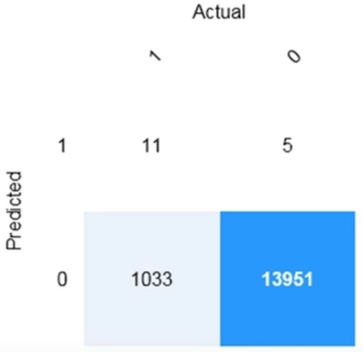

Use the drop-down menus to select the answer choice that completes each statement based on the information presented in the graphic.


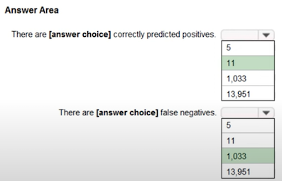

8) A customer support team would like to implement an interactive chat window on their product website that uses artificial intelligence (AI) to answer customer questions. 

The team already has extensive frequently asked questions (FAQ) documentation available.

Which Azure AI solutions should this team use to build a chat program from their existing FAQ documentation?

* **A. QnA Maker + Azure Bot Service**
* B. LUIS (Language Understanding) + Azure Functions
* C. Text Analytics + Azure Bot Service
* D. Form Recognizer + Azure Functions

**Correct Answer: A**

In this case, the correct combination is to use Azure QnA Maker as the knowledge base to power a bot using Azure Bot Service and build a web chatbot. 

It is also possible to use Language Understanding (LUIS) to power a bot instead of QnA Maker or in addition to QnA Maker. 

However, since the organization will use the bot to answer questions from an existing frequently asked questions database, QA Maker is the correct choice.

9） For each of the following statements, select Yes if the statement is true. Otherwise, select No.

NOTE: Each correct selection is worth one point.

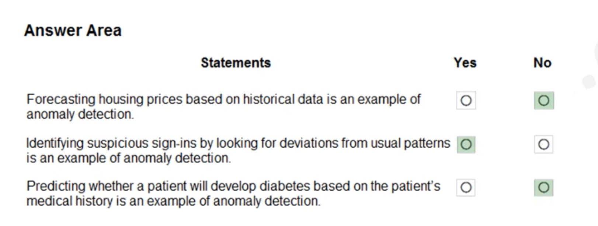

Anomaly detection encompasses many important tasks in machine learning:

* Identifying transactions that are potentially fraudulent.
* Learning patterns that indicate that a network intrusion has occurred.
* Finding abnormal clusters of patients.
* Checking values entered into a system.

10) To complete the sentence, select the appropriate option in the answer area.

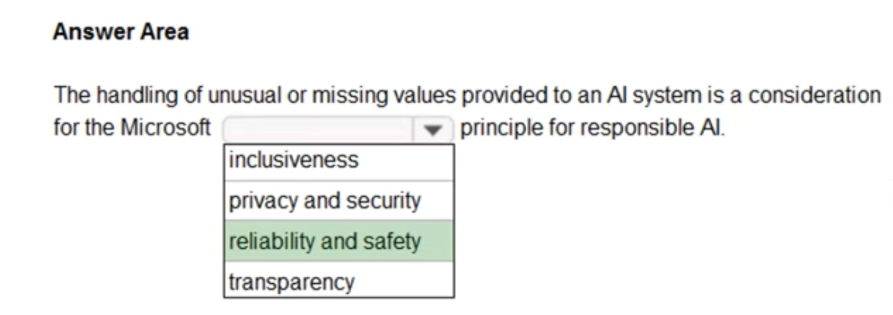


Reliability and safety:

AI systems need to be reliable and safe in order to be trusted. It is important for a system to perform as it was originally designed and for it to respond safely to new situations. 

Its inherent resilience should resist intended or unintended manipulation. Rigorous testing and validation should be established for operating conditions to ensure that the system responds safely to edge cases, and A/B testing and champion/challenger methods should be integrated into the evaluation
process.


An AI system's performance can degrade over time, so a robust monitoring and model tracking process needs to be established to reactively and proactively measure the model's performance and retrain it, as necessary, to modernize it.

11) You are training an Azure Language Understanding (LUIS) model, and you plan to use with an interactive application that responds to user questions/commands. For example, a user may ask, "What is the temperature in Boston today?"

What is the term used to describe what the user might say to the application, in this case asking about the temperature in Boston?

* **A. utterance**
* B. entity
* C. intent
* D. key phrase

**The term utterance is used to describe the user's question or command that is the input sent to a LUIS endpoint for analysis.**

12) Match the types of AI workloads to the appropriate scenarios

To answer, drag the appropriate workload type from the column on the left to its scenario on the right. 

Each workload type may be used once, more than once, or not at all.

NOTE: Each correct selection is worth one point.

Select and Place:

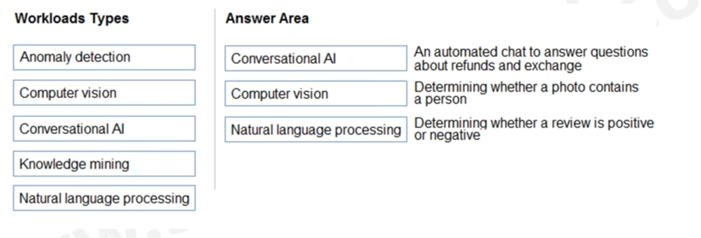


13) You are designing an AI system that empowers everyone, including people who have hearing, visual, and other impairments.

This is an example of which Microsoft guiding principle for responsible AI?


* A. fairness
* **B. inclusiveness**
* C. reliability and safety
* D. accountability

**Correct Answer: B**

Inclusiveness: At Microsoft, we firmly believe everyone should benefit from intelligent technology, meaning it must incorporate and address a broad range of human needs and experiences. For the 1 billion people with disabilities around the world, AI technologies can be a game-changer.

14) You are working on an application that uses computer vision to identify unwanted plant species growing alongside crops in farmer's fields. Which Azure Cognitive Service is the best choice to help you train your image classification model?

* **A. Custom Vision**
* B. Computer Vision
* C. Anomaly Detector
* D. Azure Machine Learning clustering analysis

Correct Answer: A

Though Azure Computer Vision services can identify a wide range of features in images, it will not work well if you need to identify domain-specific features. 


Instead, **Azure Custom Vision services is a no-code option that you can use to train and deploy a custom image classification model.**

15) **Match the Microsoft guiding principles for responsible AI to the appropriate descriptions.** 

To answer, drag the appropriate principle from the column on the left to its description on the right. Each principle may be used once, more than once, or not at all.

NOTE: Each correct selection is worth one point.

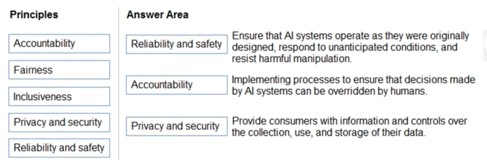

Box 1: Reliability and safety - To build trust, it's critical that AI systems operate reliably, safely, and consistently under normal circumstances and in unexpected conditions. These systems should be able to operate as they were originally designed, respond safely to unanticipated conditions, and resist harmful manipulation.


Box 2: Accountability - The people who design and deploy AI systems must be accountable for how their systems operate. Organizations should draw upon industry standards to develop accountability norms. 

These norms can ensure that AI systems are not the final authority on any decision that impacts people's lives and that humans maintain meaningful control over otherwise highly autonomous AI systems.

Box 3: Privacy and security - As AI becomes more prevalent, protecting privacy and securing important personal and business  information is becoming more critical and complex. 

With AI, privacy and data security issues require especially close attention because access to data is essential for AI systems to make accurate and informed predictions and decisions about people. AI systems must comply with privacy laws that require transparency collection，use，and storage if data and mandate that  consumers have appropriate controls to choose how their data is used 

17) You plan to integrate Azure QnA Maker with Azure Bot Services to build a conversational AI system to help answer user questions. What information do you need to configure a new Azure Bot to connect with your QnA knowledge base? (Choose 3 answers)

* **A. OnA authorization key**
* **B. QnA endpoint hostname**
* **C. QnA knowledge base ID**
* D. QnA app service name

**Correct Answer: ABC**

To configure a new Azure Bot and connect with your QnA knowledge base, you will need:

1. QA authorization key
2. QnA endpoint hostname
3. QnA knowledge base ID

18) You are building an AI system.

Which task should you include to ensure that the service meets the Microsoft transparency principle for responsible AI?

* A. Ensure that all visuals have an associated text that can be read by a screen reader.
* B. Enable autoscaling to ensure that a service scales based on demand.
* **C. Provide documentation to help developers debug code.**
* D. Ensure that a training dataset is representative of the population.

**Correct Answer: C**

Achieving transparency helps the team to understand the data and algorithms used to train the model, what transformation logic was applied to the data, the final model generated, and its associated assets. This information offers insights about how the model was created, which allows it to be reproduced in a transparent way. 

Snapshots within Azure Machine Learning workspaces support transparency by recording or retraining all training-related assets and metrics involved in the experiment.

**19) You have been given a data set that is unlabeled and includes detailed customer information.**

You would like to use Azure Machine Learning to **uncover data patterns and groupings**. Which machine learning algorithm is the best choice?

* **A. Clustering**
* B. Classification
* C. Regression
* D. Reinforcement Learning

Correct Answer: A

This is an example of a clustering machine learning problem. 


Clustering algorithms are an example of unsupervised machine learning. 

You use clustering analysis to uncover patterns in your data and when you are working with unlabeled data. You would use clustering to answer a question like, "How is this data organized?"


**20) Match the types of AI workloads to the appropriate scenarios.**

To answer, drag the appropriate workload type from the column on the left to its scenario on the right. Each workload type may be used once, more than once, or not at all.

NOTE: Each correct selection is worth one point.


21) You are writing an application that **analyzes customer product reviews and flags reviews that have a negative sentiment.** Which Azure Cognitive Service would you use to provide sentiment analysis and mark text as positive, negative, or neutral?

* **A. Text Analytics API**
* B. Language Understanding (LUIS)
* C. Speech Translation
* D. Content Moderator

**Correct Answer: A**

The Text Analytics API has the ability to take an input text document and return the predicted author's sentiment (positive, negative, or neutral).

22) Your company is exploring the use of voice recognition technologies in its smart home devices. The company wants to identify any barriers that might unintentionally leave out specific user groups.

This an example of which Microsoft guiding principle for responsible AI?

* A. accountability
* B. fairness
* **C. inclusiveness**
* D. privacy and security

Correct Answer: C


Inclusiveness mandates that AI should consider all human races and experiences, and inclusive design practices can help developers to understand and address potential barriers that could unintentionally exclude people. 

Where possible, speech-to-text, text-to-speech, and visual recognition technology should be used to empower people with hearing, visual, and other impairments.

23) What are three Microsoft guiding principles for responsible AI? Each correct answer presents a complete solution.

NOTE: Each correct selection is worth one point.


* A. knowledgeability
* B. decisiveness
* **C. inclusiveness**
* **D. fairness**
* E. opinionatedness
* **F. reliability and safety**

**Correct Answer: CDF**

24) To complete the sentence, select the appropriate option in the answer area.

Hot Area:

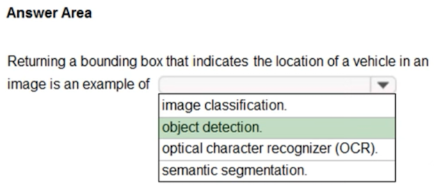


Object detection is similar to tagging, but the API returns the bounding box coordinates (in pixels) for each object found in the image. 

For example, if an image contains a dog, cat and person, the Detect operation will list those objects with their coordinates in the image. You can use this functionality to process the relationships between the objects in an image. 

It also lets you determine whether there are multiple instances of the same object in an image.

25) Which of the following types of machine learning problems are supported with Azure Automated Machine Learning (AutoML)? (Choose 3 answers)

* **A. Regression**
* **B. Classification**
* **C. Time-series forecasting**
* D. Conversational AI

Correct Answer: ABC

Azure AutoML supports finding the best regression, classification, and time-series forecasting models. When you configure an AutoML experiment, you will need to specify which of these types of machine learning problems you are trying to solve.


26) To complete the sentence, select the appropriate option in the answer area.


Hot Area:

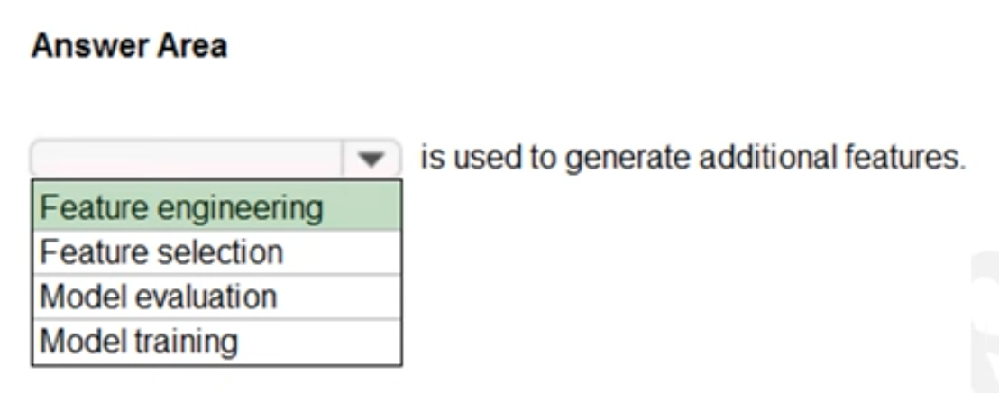

Explaination - feature engineering is applied first to generate additional features, and then feature selection is done to eliminate irrelevant, redundant, or highly correlated features.

27) You run a charity event that involves posting photos of people wearing sunglasses on Twitter.

You need to ensure that you only retweet photos that meet the following requirements:

* Include one or more faces.
* Contain at least one person wearing sunglasses.

What should you use to analyze the images?

* A. the Verify operation in the Face service
* **B. the Detect operation in the Face service**
* C. the Describe Image operation in the Computer Vision service
* D. the Analyze Image operation in the Computer Vision service

**Correct Answer: B**

Face detection is required as a first step in all the other scenarios. The Detect API detects human faces in an image and returns the rectangle coordinates of their locations. It also returns a unique ID that represents the stored face data. 

This is used in later operations to identify or verify faces. Optionally, face detection can extract a set of face-related attributes, such as head pose, age,emotion, facial hair, and glasses. 

These attributes are general predictions, not actual classifications. Some attributes are useful to
ensure that your application is getting high-quality face data when users add themselves to a Face service. For example, yourapplication could advise users to take off their sunglasses if they're wearing sunglasses.

28) Which of the following statements are true about the data used to train and evaluate machine learning model？

* **A. You should split the data set into two datasets; one dataset is used to train the model, and the other dataset to evaluate the model.**
* B. You should always use the same data to evaluate the model that you used to train it.
* C. The only time you need to split a dataset into training and test sets is when using a regression algorithm.
* D. When splitting a dataset into training and test datasets, the data should remain in order with the first 70-80% of the data included in the training dataset, and the remaining rows in the test dataset.

**Correct Answer: A**

When training and evaluating a new machine learning model, it is important to split the dataset into a training and test data set. The training dataset is used to train the model, and the test dataset is used to evaluate the model. 

When splitting the data, the rows in the dataset should be selected randomly for the split operation. As a rule of thumb, 70-80%
of the data goes to the training dataset, with the remaining data added to the test dataset.

29)  When you design an AI system to assess whether loans should be approved, the factors used to make the decision should be
explainable.

This is an example of which Microsoft guiding principle for responsible AI?

* **A. transparency**
* B. inclusiveness
* C. fairness
* D. privacy and security

**Correct Answer: A**

Achieving transparency helps the team to understand the data and algorithms used to train the model, what transformation logic
was applied to the data, the final model generated, and its associated assets. This information offers insights about how the
model was created, which allows it to be reproduced in a transparent way.

Incorrect Answers:

B: Inclusiveness mandates that AI should consider all human races and experiences, and inclusive design practices can help developers to understand and address potential barriers that could unintentionally exclude people. 

Where possible, speech-to-text, text-to-speech, and visual recognition technology should be used to empower people with hearing, visual, and other impairments.

C: Fairness is a core ethical principle that all humans aim to understand and apply. This principle is even more important when AI
systems are being developed.

Key checks and balances need to make sure that the system's decisions don't discriminate or run a gender, race, sexualorientation, or religion bias toward a group or individual.

D: A data holder is obligated to protect the data in an AI system, and privacy and security are an integral part of this system.

Personal needs to be secured, and it should be accessed in a way that doesn't compromise an individual's privacy.

30) For each of the following statements, select Yes if the statement is true. Otherwise, select No.

NOTE: Each correct selection is worth one point.

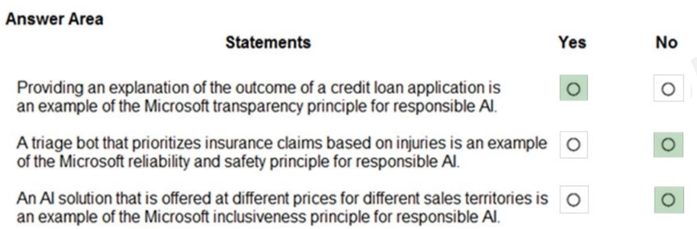

**Box 1: Yes -**

Achieving transparency helps the team to understand the data and algorithms used to train the model, what transformation logic
was applied to the data, the final model generated, and its associated assets. This information offers insights about how the
model was created, which allows it to be reproduced in a transparent way.

**Box 2: No -**

A data holder is obligated to protect the data in an AI system, and privacy and security are an integral part of this system.

Personal needs to be secured, and it should be accessed in a wav that doesn't compromise an individual's privacy.

**Box 3: No -**

Inclusiveness mandates that AI should consider all human races and experiences, and inclusive design practices can help developers to understand and address potential barriers that could unintentionally exclude people. Where possible, speech-to-text, text-to-speech, and visual recognition technology should be used to empower people with hearing, visual, and other impairments.


31) Which of the following Azure Cognitive Services can be integrated with Azure Bot Services as the engine that
recognizes user intent to create an interactive chatbot application?

* **A Language Understanding (LUIS)**
* B. Custom Vision
* C. Anomalv Detector
* D. Text Analytics

When you create a bot using Azure Bot Services, you need an Azure Cognitive Service with natural language processing to understand and respond to user input. A simple solution would be to use QnA Maker that could be based on an existing frequently asked question knowledge base. 

However, if the user interaction goes beyond a simple question and answer conversation and should include understanding and processing commands, QA Maker would not be the right choice. Instead, **the Language Understanding service (LUIS)** would be the best option to
integrate with the chatbot. A LUIS service can extract intent (what the user wants) and entities (the objects associated with the request/action)


32) Match the principles of responsible AI to appropriate requirements.

NOTE: Each correct selection is worth one point.


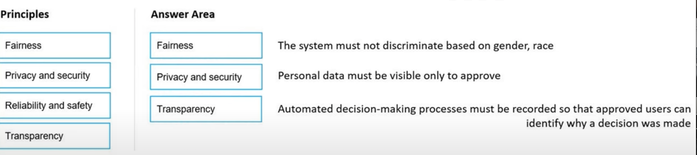

33) You are creating a bot using Azure Bot Service with QnA Maker as its knowledge base. Which of the statements regarding bot communication channels are correct? (Choose 2 answers)

* **A. A web chat channel is automatically created for you when you create a bot**.
* **B. It is possible to send messages to and receive messages from a bot service using Microsoft Teams.**
* C. Communicating with a bot service through an email channel is not supported.
* D. A bot service can be associated with only one communication channel


Correct Answer: AB

When you create a bot using Azure Bot Service, a webchat channel is automatically created for you. There are also many other channels that you can associate with your bot, including an email channel and a Microsoft Teams channel. A bot service can be associated with one or more communication channels.


34) You plan to deploy an Azure Machine Learning model as a service that will be used by client applications.

Which three processes should you perform in sequence before you deploy the model? To answer, move the appropriate processes from the list of processes to the answer area and arrange them in the correct order.

Select and Place:


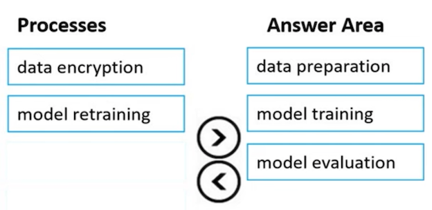


35) **You are building an AI-based app**.

You need to ensure that the app uses the principles for responsible AI.

Which two principles should you follow? Each correct answer presents part of the solution.

NOTE: Each correct selection is worth one point.

* A. Implement an Agile software development methodology
* **B. Implement a process of AI model validation as part of the software review process**
* **C. Establish a risk governance committee that includes members of the legal team, members of the risk management team, and a privacy officer**
* D. Prevent the disclosure of the use of AI-based algorithms for automated decision-making

Correct Answer: BC

36） When setting up an Azure AutoML experiment, which of the following configuration values are specified for the
experiment? Select two answers.

* A. A **primary metric** used to compare the results of individual experimental runs.
* B. A list of **blocked algorithms** that should be excluded from the training runs.
* C. The **hostname** where the best model from the experimental runs should be deployed.
* D. The **maximum time** allowed to run all experimental runs.

Correct Answer: AB

When setting up an AutoML experiment, the **primary metric** is the evaluation metric by which each AutoML run is compared. 


The primary metric you choose will depend on the type of machine learning algorithm you are using; 

Regression algorithms use different primary metrics than classification algorithms. 

Also available for configuration while setting up an AutoML run is the list of blocked algorithms. With this list, you can explicitly specify a set of algorithms that AutoML will skip while running experiments to determine the best algorithm. For a complete list of configuration settings, see the AutoML product documentation.


37) To complete the sentence, select the appropriate option in the answer area.

Hot Area:

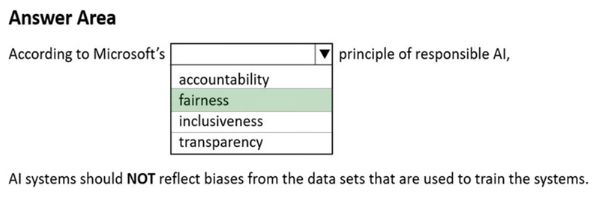


38) Match the types of AI workloads to the appropriate scenarios.

To answer, drag the appropriate workload type from the column on the left to its scenario on the right. Each workload type may be used once, more than once, or not at all.

NOTE: Each correct selection is worth one point.

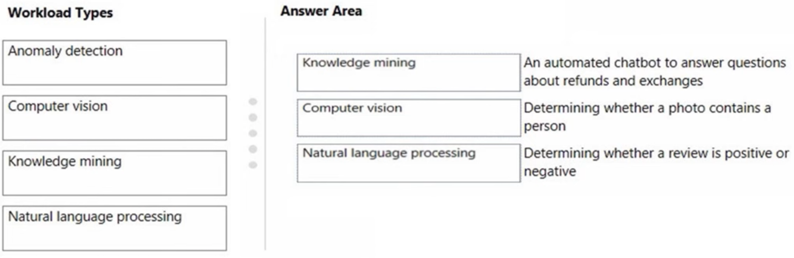

Box 1: Knowledge mining -

You can use Azure Cognitive Search's knowledge mining results and populate the knowledge base of your chatbot.

Box 2: Computer vision -

Box 3: Natural language processing

Natural language processing (NLP) is used for tasks such as sentiment analysis.


39) You are using Azure's Computer Vision service to suggest tags that describe features identified in an image. **You are using the computer vision REST endpoint, and the JSON response includes one or more tags that have been identified.**

What other information is also included with each tag in the JSON response?

* **A. A confidence score that indicates how likely the tag correctly matches the content in the image.**
* B. A set of coordinates is given by a bounding box that identifies the tag's location in the image.
* C. A URL that provides a full description of the tag.
* D. A count indicating how many times the tag is found in the image.

**Correct Answer: A**

Each tag in the response includes the name of the tag and a confidence score that indicates how likely the tag correctly matches the content in the image.

A confidence score is a number from 0 to 1, with values closer to 1 indicating high confidence that the tag correctly identifies features in the image. 

Tags do not include a bounding box to locate each feature. If location information is needed, use the object detection computer vision API instead.


40) Match the machine learning tasks to the appropriate scenarios.

NOTE: Each correct selection is worth one point.

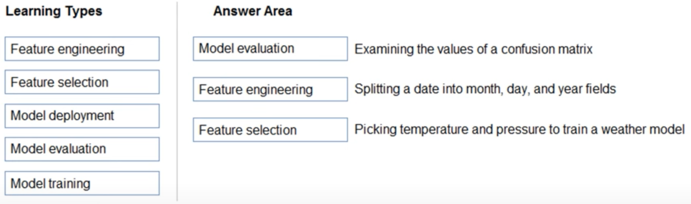

41) To complete the sentence, select the appropriate option in the answer area.

Hot Area:

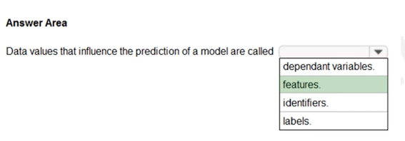


42) You would like to have your web chatbot application support speech output. Which of the following channels would you need to configure for your bot service?

* **A. Direct Line channel**
* B. Custom channel
* C. Voice channel
* D. Speech channel

**Correct Answer: A**

You will need a direct line channel to support speech output for your web chatbot application.

43) You have the Predicted vs. True chart shown in the following exhibit.

Which type of model is the chart used to evaluate?

* A. classification
* **B. regression**
* C. clustering

**Correct Answer: B**

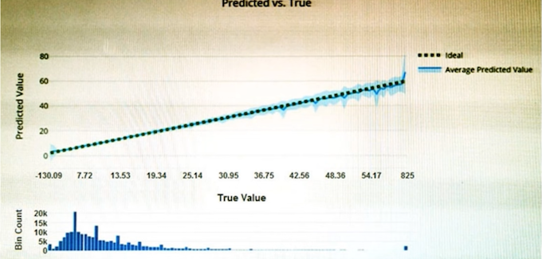

What is a Predicted vs. True chart?

Predicted vs. True shows the relationship between a predicted value and its correlating true value for a regression problem. This graph can be used to measure the performance of a model as the closer to the y=x line the predicted values are, the better the accuracy of a predictive model.


44) Which type of machine learning should you use to predict the number of gift cards that will be sold next month?

* A. classification
* **B. regression**
* C. clustering

**Correct Answer: B**

In the most basic sense, regression refers to prediction of a numeric target.

Linear regression attempts to establish a linear relationship between one or more independent variables and anumeric outcome, or dependent variable.

You use this module to define a linear regression method, and then train a model using a labeled dataset. The trained model can then be used to make predictions

45) Which of the following statements best describes the characteristics of a classification model in Azure Machine Learning? (Choose 2 answers)

* **A. Classification algorithms use labeled training data to build a model and predict the category  (class) of yet unseen data items.**
* B. Classification algorithms are an example of unsupervised machine learning.
* C. Classification algorithms take unlabeled data and groups the data into two or more categories (classes).
* **D. Classification algorithms can predict both binary and multi-class classification problems**.

Classification algorithms use labeled training data to build a model and predict the category (class) of unseen data items. 

Classification algorithms are an example of supervised learning and can predict either binary or multi-class classification problems.

It is clustering algorithms, and not classification algorithms take unlabeled data and group the data into two or more categories (classes).


46) You have a dataset that contains information about taxi journeys that occurred during a given period.

You need to train a model to predict the fare of a taxi journey.

What should you use as a feature?


* A. the number of taxi journeys in the dataset
* **B. the trip distance of individual taxi journeys**
* C. the fare of individual taxi journeys
* D. the trip ID of individual taxi journeys

Correct Answer: B

The label is the column you want to predict. The identified Features are the inputs you give the model to predict the Label.

Example:

The provided data set contains the following columns:

* `vendor_id`: The ID of the taxi vendor is a feature.
* `rate_code`: The rate type of the taxi trip is a feature.
* `passenger_count`: The number of passengers on the trip is a feature. 
* `trip_time_in_secs:` The amount of time the trip took.


You want to predict the fare of the trip before the trip is completed. 

At that moment, you don't know how long the trip would take. Thus, the trip time is not a feature and you'll exclude this column from the model. 

* `trip_distance`: The distance of the trip is a feature. payment_type: The payment method (cash or credit card) is a feature. 

* `fare_amount`: The total taxi fare paid is the label.

47) You need to predict the sea level in meters for the next 10 years. Which type of machine learning should you use?

* A. classification
* **B. regression**
* C. clustering

Correct Answer: B

In the most basic sense, regression refers to prediction of a numeric target.

Linear regression attempts to establish a linear relationship between one or more independent variables and a numeric outcome, or dependent variable.

You use this module to define a linear linear regression method, and then train a model using a labeled dataset. 

The trained model can then be used to make predictions.

48) What key piece of information do you need to call your QnA Maker service from a client application?

* **A. The REST endpoint URL for your QnA Maker service**
* B. The globally unique QnA Maker application name
* C. The hostname for the machine hosting your QnA Maker service
* D. The region where your QnA Maker service is deployed


Correct Answer: A

After setting up and training QnA Maker, you will need the REST endpoint URL for your QnA Maker service.

49) For each of the following statements, select Yes if the statement is true. Otherwise, select No.
NOTE: Each correct selection is worth one point.

Hot Area:

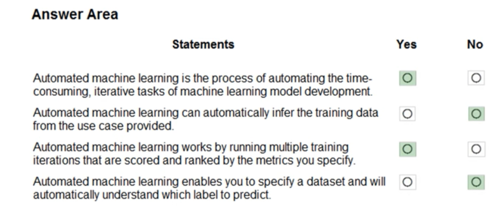

**Box 1: Yes**

Automated machine learning, also referred to as automated ML or AutoML, is the process of automating the time-consuming, iterative tasks of machine learning model development. It allows data scientists, analysts, and developers to build ML models with high scale, efficiency, and productivity all while sustaining model quality.

Box 3: Yes - During training, Azure Machine Learning creates a number of pipelines in parallel that try different algorithms and parameters for you. 

The service iterates through ML algorithms paired with feature selections, where each iteration produces a model with a training score. The higher the score, the better the model is considered to "fit" your data. It will stop once it hits the exit criteria defined in the experiment.

Box 4: No - Apply automated ML when you want Azure Machine Learning to train and tune a model for you using the target metric you specify.

The label is the column you want to predict.

50)  To complete the sentence, select the appropriate option in the answer area.

Hot Area:

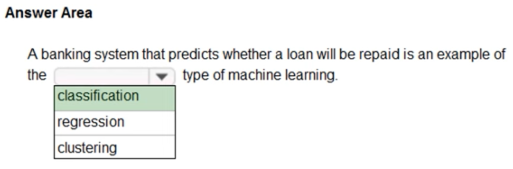


Two-class classification provides the answer to simple two-choice questions such as Yes/No or
True/False.

51） ___ occurs when a model matches training data so closely that it doesn't generalize well to other data.

* A. Underfitting
* **B. Overfitting**
* C. Drift
* D. Root mean squared error

**Correct Answer: B**

A common problem to be on the lookout for with any machine learning model is **overfitting the data**. 


Overfitting happens when the model performs very well on the training dataset but does not perform well with unseen test data.


52)  For each of the following statements, select Yes if the statement is true. Otherwise, select No.

NOTE: Each correct selection is worth one point.

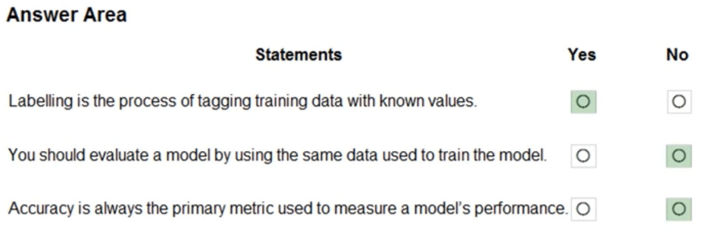

**Box 1: Yes -**

In machine learning, if you have labeled data, that means your data is marked up, or annotated, to show the target, which is the answer you want your machine learning model to predict.

In general, data labeling can refer to tasks that include data tagging, annotation, classification, moderation, transcription, or processing.

**Box 3: No -**

Accuracy is simply the proportion of correctly classified instances. It is usually the first metric you look at when evaluating a classifier. However, when the test data is unbalanced (where most of the instances belong to one of the classes), or you are more interested in the performance on either one of the classes, accuracy doesn't really capture the effectiveness of a classifier.

53) Which service should you use to extract text, key/value pairs, and table data automatically from scanned documents?

* **A. Form Recognizer**
* B. Text Analytics
* C. Language Understanding
* D. Custom Vision

**Correct Answer: A**

Accelerate your business processes by automating information extraction. Form Recognizer applies advanced machine learning to accurately extract text, key/ value pairs, and tables from documents. With just a few samples, Form Recognizer tailors its understanding to your documents, both on-premises and in the cloud. 

Turn forms into usable data at a fraction of the time and cost, so you can focus more time acting on the information rather than compiling it.

54) Azure Speech Services can be used in a variety of applications. Which of the following correctly matches the use case with the appropriate speech service? (Choose 2 answers)

A. **Use case**: Create closed captions for a recorded video

**Service**: Speech-to-Text

B. **Use case**: Read a text message aloud

Service: Text-to-Speech

C. **Use case**: Dictate a note or text message
Service: Speech Translation

D. **Use case**: Identify user sentiment in a recorded voice message

Service: Speech-to-Text

Correct Answer: AB

55) Hot Area:

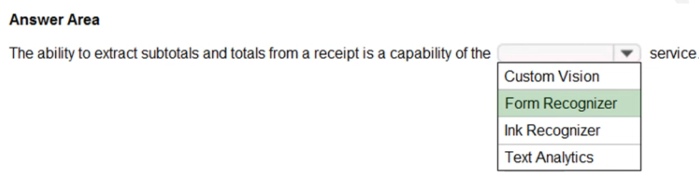

Accelerate your business processes by automating information extraction. 

Form Recognizer applies advanced machine learning to accurately extract text, key/ value pairs, and tables from documents. With just a few samples, Form Recognizer tailors its understanding to your documents, both on-premises and in the cloud. 

Turn forms into usable data at a fraction of the time and cost, so you can focus more time acting on the information rather than compiling it.

56) You use Azure Machine Learning designer to publish an inference pipeline.

Which two parameters should you use to access the web service? Each correct answer presents part of the solution.

NOTE: Each correct selection is worth one point.

* A. the model name
* B. the training endpoint
* **C. the authentication key**
* **D. the REST endpoint**

Correct Answer: CD

You can consume a published pipeline in the Published pipelines page. Select a published pipeline and find the REST endpoint of it.


To consume the pipeline, vou need:

* The REST endpoint for your service
* The Primary Key for vour service

57) Which of the following features are supported by the Azure Text Analytics API? (Choose 2 answers)

* **A. language detection**
* **B. named entity recognition**
* C. text to speech services
* D. text identification in an image

**Correct Answer: AB**

The Azure Text Analytics API supports language detection and named entity recognition, along with several other features. 

Language detection is used to detect the language for a given text document. Named entity recognition can identify people, places, organizations, and quantities included in an input text document.

The other features that are listed in the choice list are available with other Azure Cognitive Services:

* **Feature**: user intent extraction, **Service**: Language Understanding (LUIS)
* **Feature**: text to speech services, **Service**: Text-to-Speech service
* **Feature**: text identification in an image, **Service**: Computer Vision - Optical Character Recognition (OCR)

58) To complete the sentence, select the appropriate option in the answer area.

Hot Area:

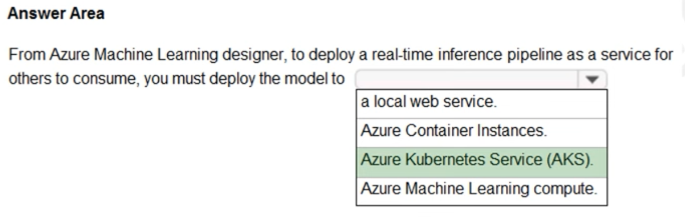

To perform real-time inferencing, you must deploy a pipeline as a real-time endpoint.

Real-time endpoints must be deployed to an Azure Kubernetes Service cluster.

59) To complete the sentence, select the appropriate option in the answer area.

Hot Area:

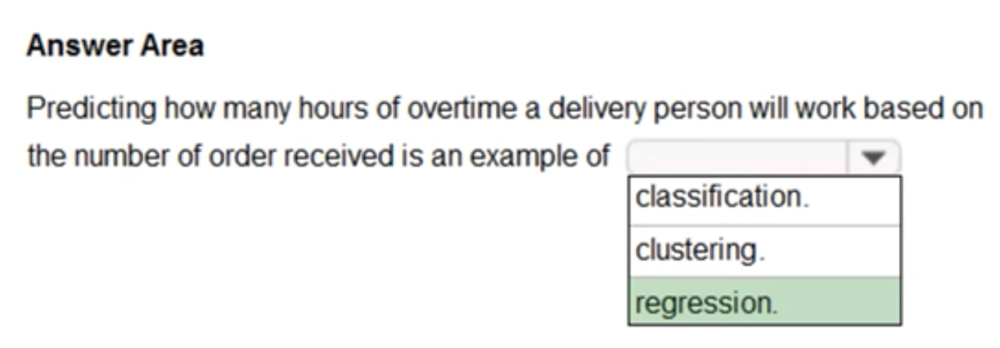

In the most basic sense, regression refers to the prediction of a numeric target.

Linear regression attempts to establish a linear relationship between one or more independent variables and a numeric outcome, or dependent variable.

You use this module to define a linear regression method, and then train a model using a labeled dataset. The trained model can then be used to make predictions.

60) You have just trained and published an Azure Language Understanding (LUIS) model. 

You plan to use the REST endpoint in your application to respond to user questions and commands. When you send a user question or command to the REST endpoint for your LUIS model, what information is included in the response? (Choose 2 answers)

* **A. . A list of intents with a confidence score.**
* B. A list of potential utterances with a confidence score.
* **C. A list of entities extracted from the input question/command**.
* D. The lanquage of the input question/command.

The primary information included in a response from invoking a LUIS endpoint with a command or question as input is:

1. The top intent (best confidence score)
2. A list of all intents (and associated confidence score)
3. A list of entities extracted from the input question/command (utterance)

The confidence score assigned to each intent is a value from 0 to 1, with values closer to 1 indicating greater confidence that the intent has been correctly identified.

For more information about the JSON response from invoking a LUIS endpoint, see the LUIS Documentation.

61) For each of the following statements, select Yes if the statement is true. Otherwise, select No

NOTE: Each correct selection is worth one point.

Hot Area:

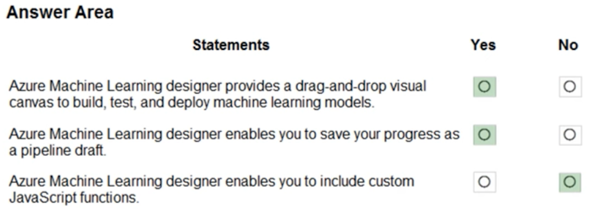

Box 1: Yes

Azure Machine Learning designer lets you visually connect datasets and modules on an interactive canvas to create machine-learning models.

Box 2: Yes -

With the designer you can connect the modules to create a pipeline draft.
As you edit a pipeline in the designer, your progress is saved as a pipeline draft.

Box 3: No -

62) You have the following dataset.

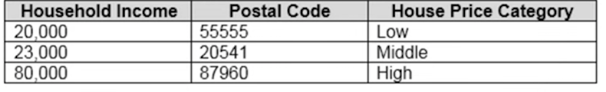

You plan to use the dataset to train a model that will predict the house price categories of houses.

What are Household Income and House Price Categories? To answer, select the appropriate option in the answer area.


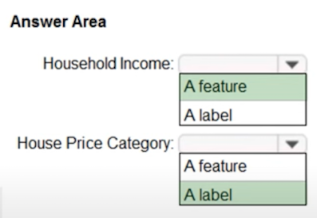

63) To complete the sentence, **select the appropriate option** in the answer area.

Hot Area:

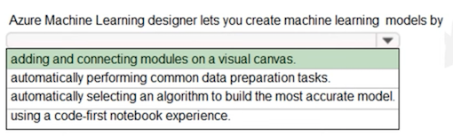


64) You are working on an application that uses Azure Machine Learning to predict the correct medication and dosage for a patient based on their symptoms. 

The application must undergo rigorous testing and validation before product launch to ensure patients are given the proper medication. Which responsible AI practice is addressed with proper testing and validation?

* **A. Reliability and safety**
* B. Continuous improvement
* C. Accountability
* D. Inclusiveness

**Correct Answer: A**

Properly testing and validating an AI product will ensure that it performs reliably and safely.


65) For each of the following statements, select Yes if the statement is true. Otherwise, select No.

NOTE: Each correct selection is worth one point.

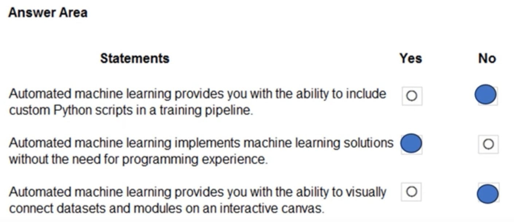


66） A medical research project uses a large anonymized dataset of brain scan images that are categorized into predefined brain hemorrhage types.

You need to use machine learning to support early detection of the different brain hemorrhage types in the images before the images are reviewed by a person.

This is an example of which type of machine learning?

* A. clustering
* B. regression
* **C. classification**

**Correct Answer: C**

67) Which Azure Machine Learning feature offers the ability to build and deploy no-code predictive models using a drag-
and-drop interface?

* **A. Azure Machine Learning designer**
* B. Azure Automated ML
* C. Text Analytics
* D. QnA Maker

Correct Answer: A

Azure Machine Learning designer offers the ability to build and deploy no-code predictive models using a drag-and
drop interface.

68) When training a model, why should you randomly split the rows into separate subsets?

* A. to train the model twice to attain better accuracy
* B. to train multiple models simultaneously to attain better performance
* **C. to test the model by using data that was not used to train the model**

**Correct Answer: C**


69) You need to predict the income range of a given customer by using the following dataset.

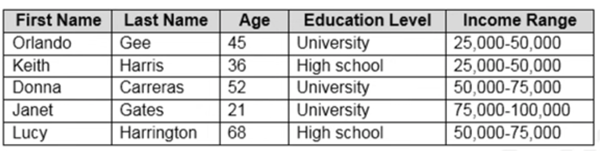

Which two fields should you use as features? Each correct answer presents a complete solution.

NOTE: Each correct selection is worth one point.


* **A. Education Level**
* B. Last Name
* **C. Age**
* D. Income Range
* E. First Name

**Correct Answer: AC**

First Name, Last Name, Age and Education Level are features. Income range is a label (what you want to predict). First
Name and Last Name are irrelevant in that they have no bearing on income. Age and Education level are the features you
should use.

70） Which of the following application features uses Natural Language Processing (NLP)? (Choose 2 answers)

* **A. Analyze written text and highlight key phrases.**
* **B. Translate text from one language to another**.
* C. Translate a handwritten note contained in an image into text.
* D. Locate text that is included in an image

**Correct Answer: AB**

The following features use natural language processing (NLP):

* Translate text from one language to another.
* Analyze written text and highlight key phrases.

The other two features do not involve NLP. Instead, these features use optical character recognition (OCR) and involve identifying text within an image.

71) You are building a tool that will process images from retail stores and identify the products of competitors.

The solution will use a custom model.

Which Azure Cognitive Services service should you use?

* **A. Custom Vision**
* B. Form Recognizer
* C. Face
* D. Computer Vision

**Correct Answer: A**

72) For each of the following statements, select Yes if the statement is true. 

Otherwise, select No.

NOTE: Each correct selection is worth one point.

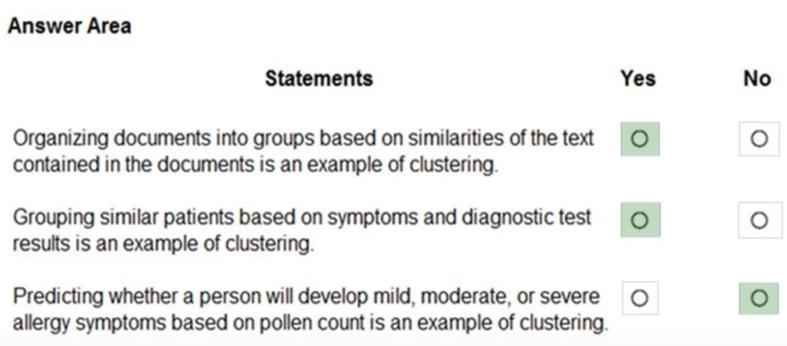

Clustering is a machine learning task that is used to group instances of data into clusters that contain similar
characteristics. 

Clustering can also be used to identify relationships in a dataset 

Regression is a machine learning task that is used to predict the value of the label from a set of related features.

73) Which statement about Azure Automated Machine Learning (AutoML) is true? (Choose 2 answers)

* **A. AutoML is used to automatically select the best machine learning algorithm for your dataset.**
* **B. You can choose to use either the Python SDK or a no-code user interface to build an AutoML experiment**.
* C. In order to use AutoML, developers must have a strong understanding of various machine learning algorithms.
* D. An AutoML will not perform a train-test split operation; you must provide both a train and test dataset for an AutoML experiment. 

**Correct Answer: AB**

Azure AutoML provides a no-code option to select the best machine learning algorithm for your dataset automatically. 

To use AutoML, users do not need to have a strong background in machine learning. AutoML will automatically split your data into the appropriate train and test datasets needed to run and evaluate each experiment.

74) For each of the following statements, select Yes if the statement is true. Otherwise, select No.

NOTE: Each correct selection is worth one point.

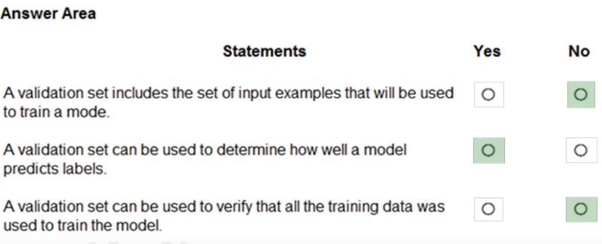

Box 1: No-

The validation dataset is different from the test dataset that is held back from the training of the model.

Box 2: Yes -

A validation dataset is a sample of data that is used to give an estimate of model skill while tuning model's hyperparameters.

Box 3: No -

The Test Dataset, not the validation set, used for this. The Test Dataset is a sample of data used to provide an unbiased evaluation of a final model fit on the training dataset.


75) What are two metrics that you can use to evaluate a regression model? Each correct answer presents a complete solution.

NOTE: Each correct selection is worth one point.

* **A. coefficient of determination (R2)**
* B. F1 score
* **C. root mean squared error (RMSE)**
* D. area under curve (AUC)
* E. balanced accuracy

Correct Answer: AC

**A: R-squared (R2), or Coefficient of determination represents the predictive power of the model as a value between -inf and 1.00. 1.00 means there is a perfect fit, and the fit can be arbitrarily poor so the scores can be negative.**

**C: RMS-loss or Root Mean Squared Error (RMSE) (also called Root Mean Square Deviation, RMSD), measures the difference between values predicted by a model and the values observed from the environment that is being modeled.**

Incorrect Answers:

B: F1 score also known as balanced F-score or F-measure is used to evaluate a classification model.

D: aucROC or area under the curve (AUC) is used to evaluate a classification model.


78) You need to use Azure Machine Learning designer to build a model that will predict automobile prices.

Which type of modules should you use to complete the model? To answer, drag the appropriate modules to the correct
locations. 


NOTE: Each correct selection is worth one point.

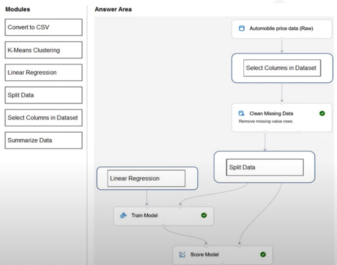


79) Which type of machine learning should you use to identify groups of people who have similar purchasing habits?

* A. classification
* B. regression
* **C. clustering**

**Correct Answer: C**

Clustering is a machine learning task that is used to group instances of data into clusters that contain similar characteristics. 

Clustering can also be used to identify relationships in a dataset

80) When using Azure Cognitive Services, which of the following is not a common computer vision task?

* **A. Translate text found in an image from one language to another.**
* B. Detect human faces within an image.
* C. Detect handwritten text within an image.
* D. Classify an image based on what the image contains.

**Correct Answer: A**

While it is possible to detect text in an image, translating the text from one language to another is not a computer vision
task. 

It is possible to translate text from one language to another using the Translator service.

81) To complete the sentence, select the appropriate option in the answer area.

Hot Area:

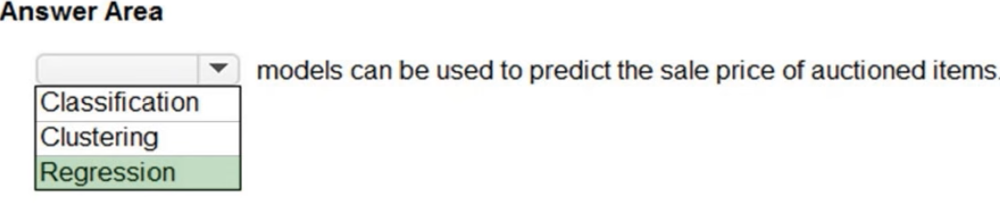

Regression is a machine learning task that is used to predict the value of the label from a set of related features.


82) Which metric can you use to evaluate a classification model?

* **A. true positive rate**
* B. mean absolute error (MAE)
* C. coefficient of determination (R2)
* D. root mean squared error (RMSE)

Correct Answer: A

What does a good model look like?

An ROC curve that approaches the top left corner with 100% true positive rate and 0% false positive rate will be the best model. 

A random model would display as a flat line from the bottom left to the top right corner. Worse than random would dip below the y=x line.

83) You work for an analytics company and are working on an application to detect credit card fraud. You want to create
a model to predict whether or not a particular credit card transaction is fraudulent.

You have historical transaction data to build your model. Which Azure Service should you use to build this model?

* **A. Azure Machine Learning**
* B. Anomalv Detection
* C. Text Analytics
* D. Form Recognizer

Correct Answer: A

The following services are part of the Azure Cognitive Services:

* Form Recognizer
* Text Analytics
* Anomaly Detection

Cognitive Services allow developers to build AI-based applications without significant AI, machine learning, or Data Sciences skills. In a way, you can consider Cognitive Services are MLaaS, Machine Learning as a Service. 

This type of pre-built service is not what is needed in the scenario presented. Instead, you have been asked to build a custom prediction model based on your particular dataset. For this, you would use Azure Machine Learning. 

There are no-code options available to help build models, even if you do not have significant machine learning knowledge.

84) Which two components can you drag onto a canvas in Azure Machine Learning designer? Each correct answer
presents a complete solution.

NOTE: Each correct selection is worth one point.

* **A. dataset**
* B. compute
* C. pipeline
* **D. module**

**Correct Answer: AD**

You can drag-and-drop datasets and modules onto the canvas.

85) You need to create a training dataset and validation dataset from an existing dataset.

Which module in the Azure Machine Learning designer should you use?

* A. Select Columns in Dataset
* B. Add Rows
* **C. Split Data**
* D. Join Data

Correct Answer: C


A common way of evaluating a model is to divide the data into a training and test set by using Split Data, and then validate the model on the training data.

Use the Split Data module to divide a dataset into two distinct sets.

The studio currently supports training/validation data splits

86) Which of the following Azure Cognitive Services would you choose to help build a conversational client application
using artificial intelligence to answer customer questions?


* **A. QnA Maker**
* B. Text Analytics
* C. Form Recognizer
* D. Content Moderator

Correct Answer: A

If you are would like to build a bot that pulls information from existing FAQ documents to answer user questions, then
QnA Make is the right choice to build your bot's knowledge base.

87) Match the types of machine learning to the appropriate scenarios.

To answer, drag the appropriate machine learning type from the column on the left to its scenario on the right. Each
machine learning type may be used once, more than once, or not at all.

NOTE: Each correct selection is worth one point.

Select and Place:

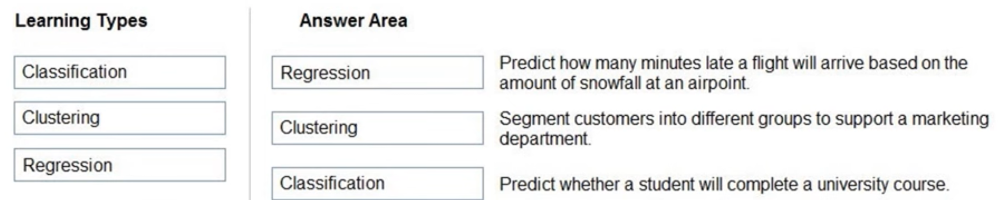

**Box 1: Regression - In the most basic sense, regression refers to prediction of a numeric target.**

Linear regression attempts to establish a linear relationship between one or more independent variables and a numeric outcome, or dependent variable.

You use this module to define a linear regression method, and then train a model using a labeled dataset. The trained model can then be used to make predictions.

Box 2: Clustering - Clustering, in machine learning, is a method of grouping data points into similar clusters. It is also called segmentation.

Over the years, many clustering algorithms have been developed. Almost all clustering algorithms use the features of individual items to find similar items. For example, you might apply clustering to find similar people by demographics. You might use clusterin! with text analysis to group sentences with similar topics or sentiment.


**Box 3: Classification - Two-class classification provides the answer to simple two-choice questions such as Yes/No or True/False.**


88) To complete the sentence, select the appropriate option in the answer area.

Hot Area:

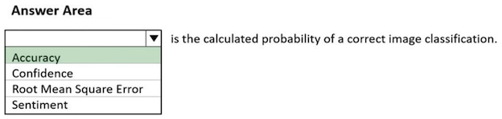


89) Using Azure Machine Learning designer, you have just developed and deployed a machine learning model to predict a used car's price, given key pieces of information about the car. You are now ready to call the deployed model for predictions from an application you are building.

information do you need to make a price prediction using the deployed model? (Choose 2 answers)
 
* **A. The REST endpoint URL for the deployed model.**
* **B. Authentication key.**
* C. Resource group ID
* D. Inference cluster name

**Correct Answer: AB**

To invoke a deployed machine learning model, you will need the REST endpoint URL for the deployed model and the authentication key.

90) To complete the sentence, select the appropriate option in the answer area.

Hot Area:

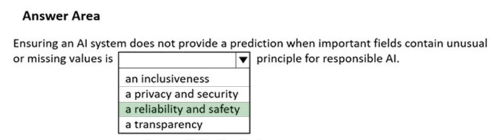


91) Which statements about Azure Speech Services capabilities are true? (Choose 2 answers)

* A. The Speech-to-Text service cannot recognize or moderate profanity in an input audio file.
* **B. The Speech-to-Text API provides a batch transcript API that can be used to batch process larger audio files**.
* **C. When using the Text-to-Speech API, you can configure speech settings such as speed and volume.**
* D. Speech Translation is available through both the SDK and the REST API

**Correct Answer: BC**

The Speech-to-Text service can recognize profanity in an input audio file, and you can choose to keep it as-is, mask it, or remove it. The Speech-to-Text service offers a real-time synchronous API suitable for short audio files or an asynchronous batch API that can be used to process larger input files. Both The Text-to-Speech and Speech-to-Text APls support multiple languages.

When using the Text-to-Speech service, you can use the Speech Synthesis Markup Language (SSML) (an XML-based markup language) to define the synthesized speech settings for things like speaker volume and speed.

Finally, the speech translation service does not provide a REST API; it is only available with a SDK.

92) To complete the sentence, select the appropriate option in the answer area.

Hot Area:

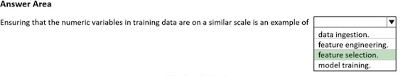

93) Which term completes the following definition of an Azure Machine Learning concept?

An ______ is a workflow you build to manage the data and modules used to train and evaluate a machine learning

* A. pipeline
* B. experiment
* C. jupyter notebook
* D. workspace

**Correct Answer: A**

In Azure Machine Learning, a **pipeline** is a workflow you build to manage the data and modules used to train and evaluate a machine learning model.

94) To complete the sentence, select the appropriate option in the answer area.

Hot Area:

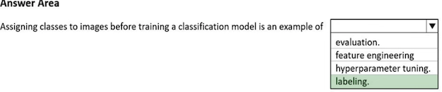

95) Which of the following types of applications are a common consumer of Azure Cognitive Services' QnA
Maker? (Choose 2 answers)

* **A. social media applications**
* **B. chatbots**
* C. lanquage translation applications
* D. applications used to review and moderate content (text and audio)

**Correct Answer: AB**

QnA Maker can be used as a knowledge base when building conversational clients often associated with social media applications and chatbots.

96) You have an Azure Machine Learning model that predicts product quality. The model has a training dataset that contains 50,000 records. A sample of the data is shown in the following table.

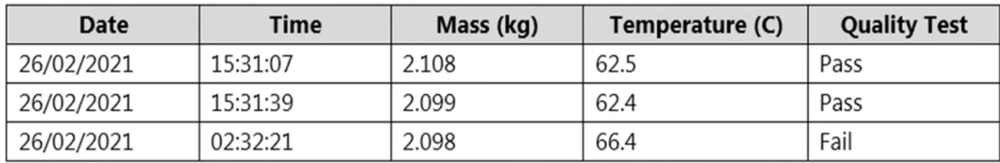

For each of the following statements, select Yes if the statement is true. Otherwise, select No.


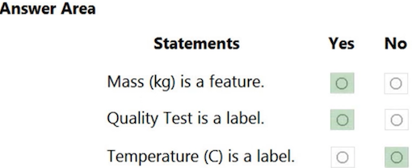

98) Which of the following is not a capability of the Azure Computer Vision service? (Choose 2 answers)

* A. Describe an image with a phrase or sentence.
* B. Detect printed or handwritten text found in an image.
* **C. Train a custom model to identify domain-specific entities in an image.**
* **D. Extract text and key/value pairs from documents.**

Correct Answer: CD

Of the capabilities listed, there are two that are not features offered by the Azure Computer Vision service:

* Train a custom model to identify domain-specific entities in an image
* Extract text and key/value pairs from documents

However, these capabilities do exist with other Azure Cognitive Services. For example, it is possible to train and publish a custom model to identify and locate domain-specific entities in an image using Azure Custom Vision services. 

Also, you can use Form Recognizer to extract text and key/value pairs from documents.

99) Which two actions are performed during the data ingestion and data preparation stage of an Azure Machine Learning process? Each correct answer presents part of the solution.

NOTE: Each correct selection is worth one point.

* A. Calculate the accuracy of the model.
* B. Score test data by using the model.
* **C. Combine multiple datasets.**
* D. Use the model for real-time predictions.
* **E. Remove records that have missing values.**

**Correct Answer: CE**

100) You need to predict the animal population of an area.

Which Azure Machine Learning type should you use?

* A. regression
* B. clustering
* C. classification

**Correct Answer: A**

**Regression is a supervised machine learning technique used to predict numeric values.**


101） Which of the following are one of the Azure Cognitive Services six principles of responsible AI? (Choose 2 answers)

* **A. Transparency**
* **B. Fairness**
* C. Communication
* D. Collaboration

Correct Answer: AB

The Azure Cognitive Services six principles of responsible AI are:

* Fairness
* Transparency
* Inclusiveness
* Accountability
* Safety and Reliability
* Security and Privacy

102） Which two languages can you use to write custom code for Azure Machine Learning designer? Each correct answer presents a complete solution.


* **A. Python**
* **B. R**
* C. C#
* D. Scala

Correct Answer: AB

Use Azure Machine Learning designer for customizing using Python and R code.

103) For each of the following statements, select Yes if the statement is true. Otherwise, select No.

NOTE: Each correct selection is worth one point.

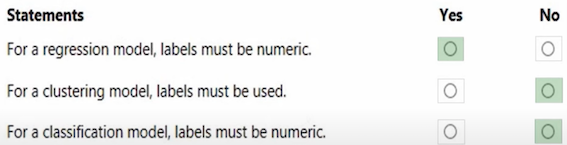

104) You are building an application that allows you to search the transcripts of recorded conversations from your customer support call center. 

Which Azure Cognitive Service would you use to convert audio from call center conversations into text?

* **A. Speech-to-Text**
* B. Language Understanding (LUIS)
* C. Translator
* D. Text Analytics

Correct Answer: A

The Azure Speech-to-Text service can convert audio files to text, and supports a variety of languages.

105） Your company wants to build a recycling machine for bottles. The recycling machine must automatically identify bottles of the correct shape and reject all other items.

Which type of AI workload should the company use?

* A. anomaly detection
* B. conversational AI
* **C. computer vision**
* D. natural lanquage processing

Correct Answer: C

Azure's Computer Vision service gives you access to advanced algorithms that process images and return information based on the visual features you're interested in. 

For example, Computer Vision can determine whether an image contains adult content, find specific brands or objects, or find human faces.

106) For each of the following statements, select Yes if the statement is true. Otherwise, select No.
NOTE: Each correct selection is worth one point.

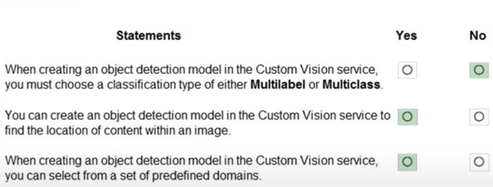

107) In Azure Cognitive Services, what is a QnA knowledge base?

* **A. A data set that includes question and answer pairs.**
* B. A data set that includes a list of utterances and intents.
* C. A data set that includes a set of industry-specific terms and the corresponding definition.
* D. A database that includes training data sets for a variety of conversational AI scenarios.

Correct Answer: A


When you set up QnA Maker, you create a knowledge base that includes a set of question and answer pairs. 

Each answer can have multiple forms of the same question. Once your QnA Maker service is deployed, it can take a user question as input and process it to determine the appropriate answer found in the knowledge base.

108) In which two scenarios can you use the Form Recognizer service? Each correct answer presents a complete solution.

NOTE: Each correct selection is worth one point.

* **A. Extract the invoice number from an invoice**.
* B. Translate a form from French to English.
* C. Find image of product in a catalog.
* **D. Identify the retailer from a receipt.**

**Correct Answer: AD**

 
109) Select the answer that correctly completes the sentence.

Hot Area:

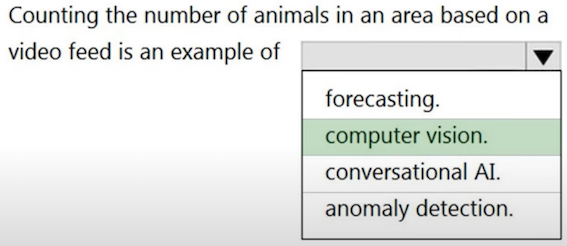

110) You want to build a web-based application that uses conversational AI to answer a variety of user questions. Which Azure service is the best choice?

* **A. Azure Bot Service**
* B. Translator
* C. Text Analytics
* D. Speech Translation

Correct Answer: A

The Azure Bot Service provides the Bot Framework SDK and Bot Framework Composer to help teams build and deploy
bots. 

A bot is a service capable of interacting with a user in a similar way to how the user would interact with another person. The purpose of a bot is to automate relatively simple and repetitive tasks so that human intervention is not needed.

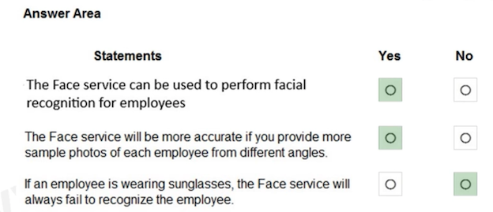

111)  You have a database that contains a list of employees and their photos. You are tagging new photos of the employees.

For each of the following statements select Yes if the statement is true. Otherwise, select No.

NOTE: Each correct selection is worth one point.

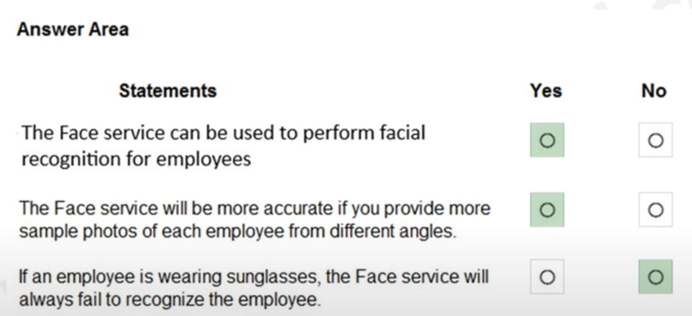


112) You need to develop a mobile app for employees to scan and store their expenses while travelling.
Which type of computer vision should you use?

* A. semantic segmentation
* B. image classification
* C. object detection
* **D. optical character recognition (OCR)**


Azure's Computer Vision API includes Optical Character Recognition (OCR) capabilities that extract printed or
handwritten text from images. You can extract text from images, such as photos of license plates or containers with
serial numbers, as well as from documents - invoices, bills, financial reports, articles, and more.


113) For each of the following statements, select Yes if the statement is true. Otherwise, select No.
NOTE: Each correct selection is worth one point.

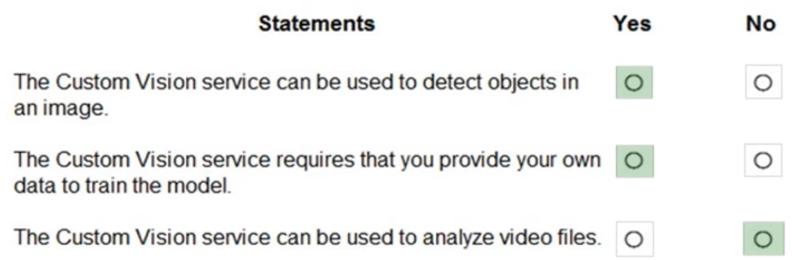

**Box 1: Yes -**

Custom Vision functionality can be divided into two features. Image classification applies one or more labels to an image. Object detection is similar, but it also returns the coordinates in the image where the applied label(s) can be found.

**Box 2: Yes -**

The Custom Vision service uses a machine learning algorithm to analyze images. You, the developer, submit groups of images that feature and lack the characteristics in question. You label the images yourself at the time of submission. 

Then, the algorithm trains to this data and calculates its own accuracy by testing itself on those same images.

**Box 3: No-**

Custom Vision service can be used only on graphic files.

114) You are processing photos of runners in a race.

You need to read the numbers on the runners' shirts to identity the runners in the photos.

Which type of computer vision should you use?

* A. facial recognition
* B. optical character recognition (OCR)
* C. image classification
* D. object detection

**Correct Answer: B**

Optical character recognition (OCR) allows you to extract printed or handwritten text from images and documents.

115) Match the types of machine learning to the appropriate scenarios.

To answer, drag the appropriate machine learning type from the column on the left to its scenario on the right. Each
machine learning type may be used once, more than once, or not at all.

NOTE: Each correct selection is worth one point.

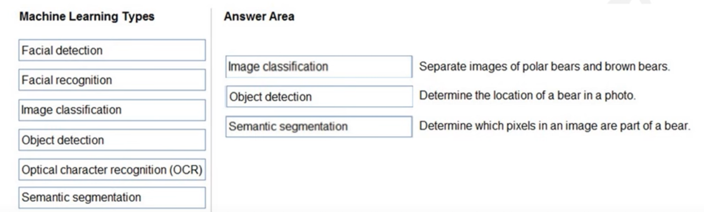

**Box 1: Image classification -**

Image classification is a supervised learning problem: define a set of target classes (objects to identify in images), and train a model to recognize them using labeled example photos.

**Box 2: Obiect detection** -

Object detection is a computer vision problem. While closely related to image classification, object detection performs image classification at a more granular scale. Object detection both locates and categorizes entities within images.


**Box 3: Semantic Segmentation -**

Semantic segmentation achieves fine-grained inference by making dense predictions inferring label for every pixel, so that pixel is labeled with the class of its enclosing object or region

116) You use drones to identify where weeds grow between rows of crops to send an instruction for the removal of the weeds.

This is an example of which type of computer vision?

* **A. object detection**
* B. optical character recognition (OCR)
* C. scene segmentation


**Correct Answer: A**

Object detection is similar to tagging, but the API returns the bounding box coordinates for each tag applied. For example, if an image contains a dog, cat and person, the Detect operation will list those objects together with their coordinates in the image.

Incorrect Answers:

* B: Optical character recognition (OCR) allows you to extract printed or handwritten text from images and documents.

* C: Scene segmentation determines when a scene changes in video based on visual cues. A scene depicts a single event and it's composed by a series of consecutive shots, which are semantically related.


117) Match the facial recognition tasks to the appropriate questions.

To answer, drag the appropriate task from the column on the left to its question on the right. Each task may be used once, more than once, or not at all.

NOTE: Each correct selection is worth one point.


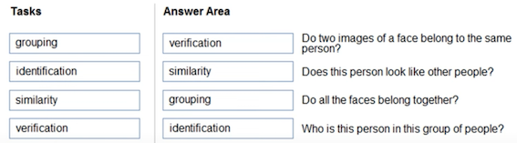


Box 1: verification -

Face verification: Check the likelihood that two faces belong to the same person and receive a confidence score.

Box 2: similarity.

Box 3: Grouping -

Box 4: identification -

Face detection: Detect one or more human faces along with attributes such as: age, emotion, pose, smile, and facial hair, including 27 landmarks for each face in the image.


118） Match the types of computer vision workloads to the appropriate scenarios.

To answer, drag the appropriate workload type from the column on the left to its scenario on the right. Each workload type may be used once, more than once, or not at all.

NOTE: Each correct selection is worth one point.

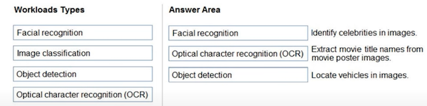


119) You need to determine the location of cars in an image so that you can estimate the distance between the cars.
Which type of computer vision should you use?

* A. optical character recognition (OCR)
* **B. object detection**
* C. image classification
* D. face detection


Correct Answer: B


Object detection is similar to tagging, but the API returns the bounding box coordinates (in pixels) for each object found.

For example, if an image contains a dog, cat and person, the Detect operation will list those objects together with their coordinates in the image. 

You can use this functionality to process the relationships between the objects in an image. It also lets you determine whether there are multiple instances of the same tag in an image.


The Detect API applies tags based on the objects or living things identified in the image. There is currently no formal relationship between the tagging taxonomy and the object detection taxonomy. At a conceptual level, the Detect API only finds objects and living things, while the Tag API can also include contextual terms like "indoor", which can't be localized with bounding boxes.

120) To complete the sentence, select the appropriate option in the answer area.

Hot Area:

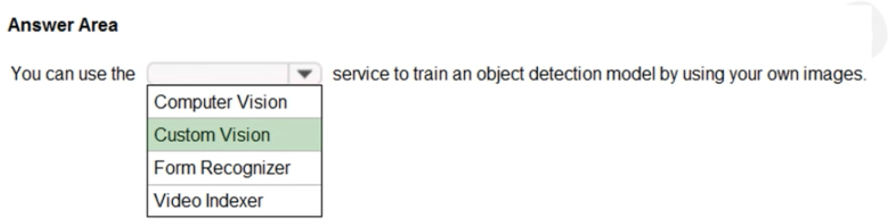


Azure Custom Vision is a cognitive service that lets you build, deploy, and improve your own image classifiers. An image classifier is an AI service that applies labels (which represent classes) to images, according to their visual characteristics. Unlike the Computer Vision service, Custom Vision allows you to specify the labels to apply.


Note: The Custom Vision service uses a machine learning algorithm to apply labels to images. You, the developer, must submit groups of images that feature and lack the characteristics in question. You label the images yourself at the time of submission.

Then the algorithm trains to this data and calculates its own accuracy by testing itself on those same images. Once the algorithm is trained, you can test, retrain, and eventually use it to classify new images according to the needs of your app. You can also export the model itself for offline use.


121) You send an image to a Computer Vision API and receive back the annotated image shown in the exhibit

Which type of computer vision was used?

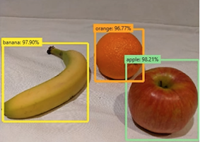

* **A. object detection**
* B. face detection
* C. optical character recognition (OCR)
* D. image classification

**Correct Answer: A**

Object detection is similar to tagging, but the API returns the bounding box coordinates (in pixels) for each object found. For
example, if an image contains a dog, cat and person, the Detect operation will list those objects together with their coordinates
in the image. You can use this functionality to process the relationships between the objects in an image. 

It also lets you determine whether there are multiple instances of the same tag in an image.

The Detect API applies tags based on the objects or living things identified in the image. There is currently no formal
relationship between the tagging taxonomy and the object detection taxonomy. 

At a conceptual level, the Detect API only finds objects and living things, while the Tag API can also include contextual terms like "indoor", which can't be localized with bounding boxes.


122) What are two tasks that can be performed by using the Computer Vision service? Each correct answer presents a
complete solution.

NOTE: Each correct selection is worth one point.

* A. Train a custom image classification model.
* **B. Detect faces in an image**.
* **C. Recognize handwritten text**.
* D. Translate the text in an image between languages.


Correct Answer: BC

B: Azure's Computer Vision service provides developers with access to advanced algorithms that process images and
return information based on the visual features you're interested in. 

For example, Computer Vision can determine whether an image contains adult content, find specific brands or objects, or find human faces.


C: Computer Vision includes Optical Character Recognition (OCR) capabilities. You can use the new Read API to extract printed and handwritten text from images and documents.

123) What is a use case for classification?

* A. predicting how many cups of coffee a person will drink based on how many hours the person slept the previous night.
* B. analyzing the contents of images and grouping images that have similar colors
* **C. predicting whether someone uses a bicycle to travel to work based on the distance from home to work**
* D. predicting how many minutes it will take someone to run a race based on past race times

**Correct Answer: C**

Two-class classification provides the answer to simple two-choice questions such as Yes/No or True/False.

Incorrect Answers:


* A: This is Regression.
* B: This is Clustering.
* D: This is Regression.

124) What are two tasks that can be performed by using computer vision? Each correct answer presents a complete solution.

NOTE: Each correct selection is worth one point.


* A. Predict stock prices.
* **B. Detect brands in an image.**
* **C. Detect the color scheme in an image**
* D. Translate text between languages.
* E. Extract key phrases.

Correct Answer: BC

B: Identify commercial brands in images or videos from a database of thousands of global logos. 

You can use this feature, for example, to discover which brands are most popular on social media or most prevalent in media product placement.


C: Analyze color usage within an image. Computer Vision can determine whether an image is black & white or color and, for color images, identify the dominant and accent colors.

125) You need to build an image tagging solution for social media that tags images of your friends automatically.

Which Azure Cognitive Services service should you use?


* **A. Face**
* B. Form Recognizer
* C. Text Analytics
* D. Computer Vision

**Correct Answer: A**

The Azure Cognitive Services Face service provides facial recognition and analysis capabilities. It can detect and recognize faces in images, identify specific individuals, and analyze facial attributes such as age, gender, emotions, and more. 


By training the Face service with images of your friends, you can create a custom face recognition model that will allow you to automatically tag images of your friends in social media. The Face service provides robust and accurate face detection and recognition capabilities, making it suitable for tasks like image tagging based on specific individuals.


126) In which two scenarios can you use the Form Recognizer service? Each correct answer presents a complete solution

NOTE: Each correct selection is worth one point.

* **A. Identify the retailer from a receipt**
* B. Translate from French to English
* **C. Extract the invoice number from an invoice**
* D. Find images of products in a catalog

Correct Answer: AC

127) DRAG DROP - Match the facial recognition tasks to the appropriate questions

To answer, drag the appropriate task from the column on the left to its question on the right. Each task may be used once, more tham once, or not at all.

NOTE: Each correct selection is worth one point.

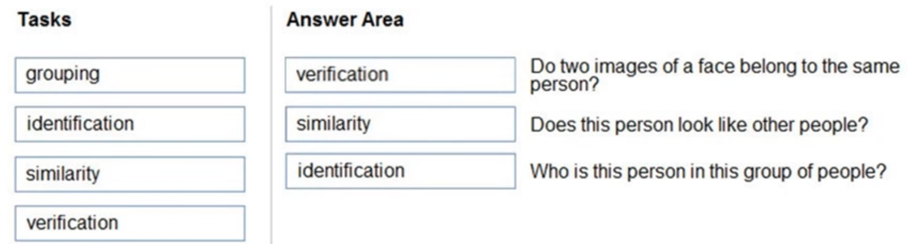

**Box 1: verification - Identity verification**

Modern enterprises and apps can use the Face identification and Face verification operations to verify that a user is who they claim to be.

**Box 2: similarity** - The Find Similar operation does face matching between a target face and a set of candidate faces, finding a smaller set of faces that look similar to the target face. This is useful for doing a face search by image.

The service supports two working modes, matchPerson and matchFace. The matchPerson mode returns similar faces after filtering for the same person by using the Verify API. The matchFace mode ignores the same-person filter. It returns a list of similar candidate faces that mav or mav not belong to the same person.


**Box 3: identification** - Face identification can address "one-to-many" matching of one face in an image to a set of faces in a secure repository. Match candidates are returned based on how closely their face data matches the query face. This scapario is
used in granting building or airport access to a certain group of people or verifying the user of a device.


128) Which Computer Vision feature can you use to generate automatic captions for digital photographs?

* A. Recognize text.
* B. Identify the areas of interest.
* C. Detect obiects.
* **D. Describe the images.**

Correct Answer: D

Describe images with human-readable language Computer Vision can analyze an image and generate a human-readable phrase that describes its contents.

The algorithm returns several descriptions based on different visual features, and each description is given a confidence score. 

The final output is a list of descriptions ordered from highest to lowest confidence.
The image description feature is part of the Analyze Image API.


129) Which service should you use to extract text, key/value pairs, and table data automatically from scanned documents?

* A. Custom Vision
* B. Face
* **C. Form Recognizer**
* D. Language


Correct Answer: C


Form Recognizer applies advanced machine learning to accurately extract text, key-value pairs, tables, and structures from documents.

130) Select the answer that correctly completes the sentence.

Hot Area:

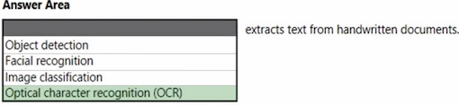

Handwriting OCR (optical character recognition) is the process of automatically extracting handwritten information from paper, scans and other low-quality digital documents.

131) You are developing a solution that uses the Text Analytics service.

You need to identify the main talking points in a collection of documents.
Which type of natural language processing should you use?


* A. entity recognition
* **B. key phrase extraction**
* C. sentiment analysis
* D. language detection

Correct Answer: B


Broad entity extraction: Identify important concepts in text, including key

Key phrase extraction/ Broad entity extraction: Identify important concepts in text, including key phrases and named entities such as people, places, and organizations.

132) In which two scenarios can you use speech recognition? Each correct answer presents a complete solution.

* A. an in-car system that reads text messages aloud
* **B. providing closed captions for recorded or live videos**
* C. creating an automated public address system for a train station
* **D. creating a transcript of a telephone call or meeting**

**Correct Answer: BD**

133) To complete the sentence, select the appropriate option in the answer area.

Hot Area:

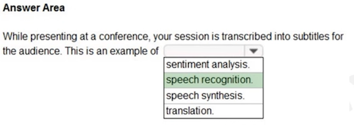


134) You need to build an app that will read recipe instructions aloud to support users who have reduced vision. 

Which version service should you use?


* A. Text Analytics
* B. Translator
* **C. Speech**
* D. Language Understanding (LUIS)


135) HOTSPOT

For each of the following statements, select Yes if the statement is true. Otherwise, select No.


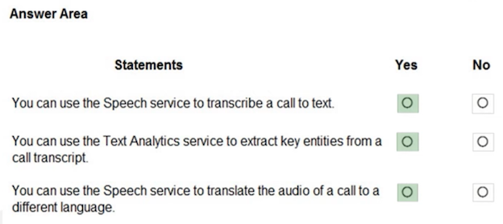


136) Your website has a chatbot to assist customers.

You need to detect when a customer is upset based on what the customer types in the chatbot.

Which type of AI workload should you use?

* A. anomaly detection
* B. computer vision
* C. regression
* **D. natural language processing**

Natural language processing (NLP) is used for tasks such as sentiment analysis, topic detection, language detection,key phrase extraction, and document categorization.

Sentiment Analysis is the process of determining whether a piece of writing is positive, negative or neutral.

137) You plan to develop a bot that will enable users to query a knowledge base by using natural language processing.

Which two services should you include in the solution? Each correct answer presents part of the solution.

NOTE: Each correct selection is worth one point.

* **A. QnA Maker**
* **B. Azure Bot Service**
* C. Form Recognizer
* D. Anomaly Detector

Correct Answer: AB


138）which two scenarios can you use a speech synthesiss solution？ Each correct answer presents a complete solution.

* **A.an automated voice that reads back a credit card number entered into a telephone by using a numeric keypad**
* B.generating live captions for a news broadcast
* C.extracting key phrases from the audio recording of a meeting
* **D.an AI character in a computer game that Speaks audibly to a player**


Correct Answer:AD

Azure Text to Speech is a Speech service feature that converts text to life like speech.

Incorrect Answers:

**C: Extracting key phrases is not speech synthesis**


139)  For each of the following statements, select Yes if the statement is true. Otherwise, select No.


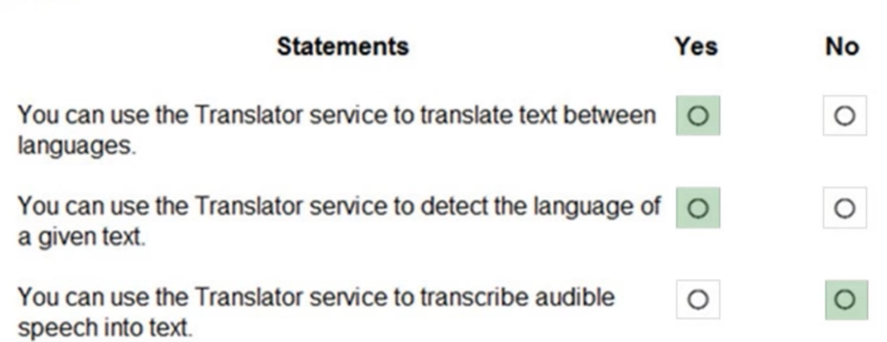


The translator service provides multi-language support for text translation, transliteration, language detection, and dictionaries 

Speech-to-Text, also known as automatic speech recognition (ASR), is a feature of Speech Services that provides transcription.


140) DRAG DROP

You need to scan the news for articles about your customers and alert employees when there is a negative article. Positive articles must be added to a press book.

Which natural language processing tasks should you use to complete the process? To answer, drag the appropriate tasks to the correct locations. Each task may be used once, more than once, or not at all. You may need to drag the split bar between panes or scroll to view content.

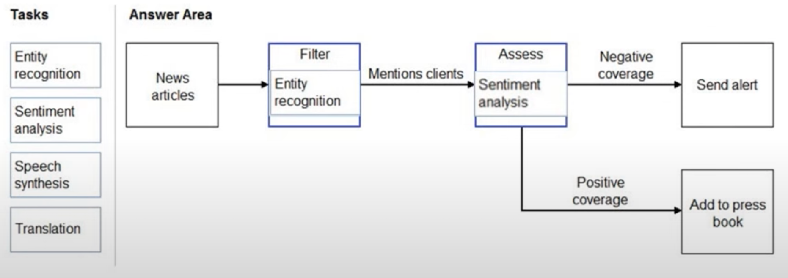


141) You are building a knowledge base by using QnA Maker.

Which file format can you use to populate the knowledge base?

* A. PPTX
* B. XML
* C. ZIP
* **D. PDF**

Correct Answer: D

D: Content types of documents you can add to a knowledge base:

Content types include many standard structured documents such as PDF, DOC, and TXT.

Note: The tool supports the following file formats for ingestion:

* `tsv`: QnA contained in the format Ouestion(tab)Answer.
* `.txt`,`.docx`,`.pdf`: QnA contained as regular FAO content-that is, a sequence of questions and answers.

Incorrect Answers

* A: PPTX is the default presentation file format for new PowerPoint presentations.
* B: It is not possible to ingest xml file directly.


142) In which scenario should you use key phrase extraction?

* A. identifying whether reviews of a restaurant are positive or negative
* B. generating captions for a video based on the audio track
* **C. identifying which documents provide information about the same topics**
* D. translating a set of documents from English to German


Correct Answer: C


143) You have insurance claim reports that are stored as text.

You need to extract key terms from the reports to generate summaries.

Which type of AI workload should you use?


* **A. natural language processing**
* B. conversational AI
* C. anomaly detection
* D. computer vision

Correct Answer: A

144) To complete the sentence, select the appropriate option in the answer area.

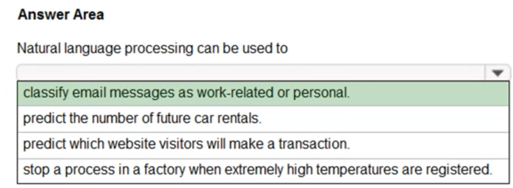

Natural language processing (LP) is used for tasks such as sentiment analysis, topic detection, language detection, key phrase extraction, and document categorization.


145) Which AI service can you use to interpret the meaning of a user input such as Call me back later?

* A. Translator
* B. Text Analytics
* C. Speech
* **D. Language Understanding (LUIS)**

Correct Answer: D

Language Understanding (LUIS) is a cloud-based AI service, that applies custom machine-learning intelligence to a user's conversational, natural language text to predict overall meaning, and pull out relevant, detailed information.


146) You are developing a chatbot solution in Azure.

Which service should you use to determine a user's intent?

* A. Translator
* B. QnA Maker
* C. Speech
* **D. Language Understanding (LUIS)**


Language Understanding (LUIS) is a cloud-based API service that applies custom machine-learning intelligence to a user's conversational, natural language text to predict overall meaning, and pull out relevant, detailed information.

Design your LUIS model with categories of user intentions called intents. Each intent needs examples of user utterances. Each utterance can provide data that needs to be extracted with machine-learning entities.


147) You need to make the written press releases of your company available in a range of languages.

Which service should you use?


* **A. Translator**
* B. Text Analytics
* C. Speech
* D. Language Understanding (LUIS)

Translator is a cloud-based machine translation service you can use to translate text in near real-time through a simple REST API call.

The service uses modern neural machine translation technology and offers statistical machine translation technology. 

Custom Translator is an extension of Translator, which allows you to build neural translation systems.

148 For each of the following statements, select Yes if the statement is true. Otherwise, select No.


The Text Analytics API is a cloud-based service that provides advanced natural language processing over raw text, and includes four main functions: **sentiment analysis, key phrase extraction, named entity recognition, and language detection**.

Box 1: Yes -

You can detect which lanquage the input text is written in and report a single language code for every document submitted on the request in a wide range of languages, variants, dialects, and some regional/cultural languages. The language code is paired with a score indicating the strength of the score.

Box 2: No -

Box 3: Yes -

Named Entity Recognition: Identify and categorize entities in your text as people, places, organizations, date/time, quantities, percentages, currencies, and more.

Well-known entities are also recognized and linked to more information on the web.

149) Match the types of natural language processing workloads to the appropriate scenarios
To answer, drag the appropriate workload type from the column on the left to its scenario on the right. Each workload type may be used once, more than once, or not at all.

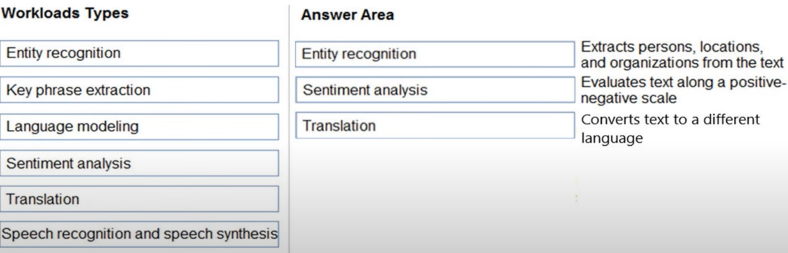


150)  For each of the following statements, select Yes if the statement is true. Otherwise, select No.


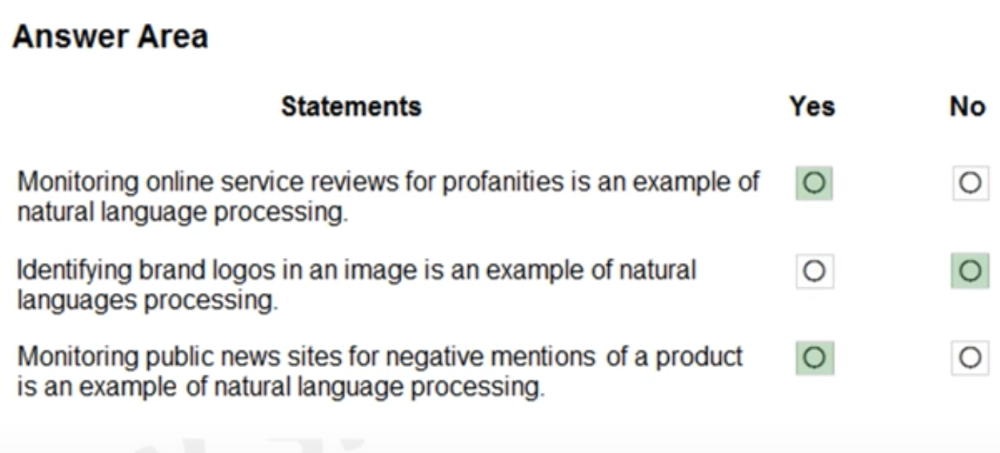

151) You are developing a natural language processing solution in Azure. The solution will analyze customer reviews and determine how positive or negative each review is.

This is an example of which type of natural language processing workload?


* A. language detection
* **B. sentiment analysis**
* C. key phrase extraction
* D. entity recognition

**Correct Answer: B**

Sentiment Analysis is the process of determining whether a piece of writing is positive, negative or neutral.

152) You use natural language processing to process text from a Microsoft news story.
You receive the output shown in the following exhibit.

Which type of natural languages processing was performed?

* **A. entity recognition**
* B. key phrase extraction
* C. sentiment analysis
* D. translation

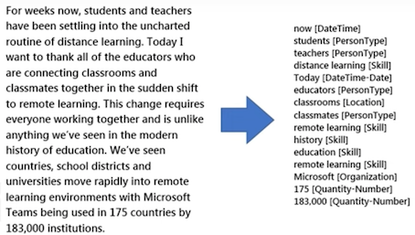


Correct Answer: A

Named Entity Recognition (NER) is the ability to identify different entities in text and categorize them into pre-defined classes or types such as: person, location, event, product, and organization.


In this question, the square brackets indicate the entities such as DateTime, PersonType, Skill.


153) You are using Azure Machine Learning to develop a model to predict whether a potential borrower is likely to default on a loan. The following confusion matrix describes the performance of one of your models (predicted outcome across the top, true value top to bottom)

Which statement about these results is true? (Choose 2 answers)

* **A. There were 35 false negatives**.
* B. There were 11 false negatives.
* **C. There were 11 false positives.**
* D. There were 11 true positives.

Correct Answer: AC

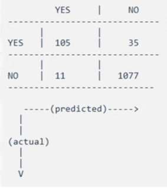

154) You are using Azure Machine Learning to develop a machine learning model to predict fuel efficiency (miles/gallon) for automobiles manufactured between 2000 and 2010. The following information is provided for each automobile in the dataset:

```
mpg (miles per gallon) | number of cylinders | horsepower | weight | model year | car name
```

Currently, the car name includes both the manufacturer and the car model (ex. "honda civic"). You would like to break the car name into two separate pieces of data (columns): manufacturer and model. What is the term used to describe this type of data processing before training a model?

* **A. feature engineering**
* B. feature selection
* C. normalization
* D. data splitting

Correct Answer: A

The scenario given is this problem is an example of feature engineering. Feature engineering is a process where new features are created by transforming raw data. Feature engineering, normalization, and data splitting are examples of three common data transformation steps taken before training a machine learning model. If you are not familiar with normalization, take a look at the documentation for the Normalization module. Normalizing data can be an important step when preparing data to train a model.


155) You are using Azure Machine Learning to develop a machine learning model to predict fuel efficiency (miles/gallon) for automobiles manufactured between 2000 and 2010. The following information is provided for each automobile in the dataset:

* mpg (miles per gallon)
* number of cylinders
* horsepower
* weight
* model year
* manufacturer
* car name (model)


Which of the following statements about the data set and machine learning model are correct? (Choose 2 answers)


* A. MPG (miles per gallon) is the **label** for this machine learning model.
* B. MPG (miles per gallon) is a **feature** for this machine learning model.
* C. The car name (model) is the **label** for this machine learning model.
* D. The manufacturer is an example of a potential **feature** for this machine learning model.


156) You plan to apply Text Analytics API features to a technical support ticketing system.

Match the Text Analytics API features to the appropriate natural language processing scenarios.

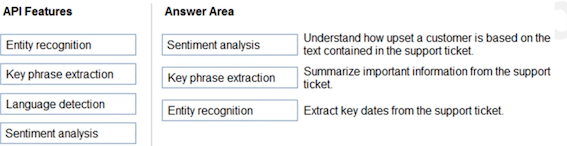


Box1: Sentiment analysis - Sentiment Analysis is the process of determining whether a piece of writing is positive, negative or neutral.

Box 2: Broad entity extraction - Broad entity extraction: Identify important concepts in text, including key
Key phrase extraction/ Broad entity extraction: Identify important concepts in text, including key phrases and named entities such as people, places, and organizations.


Box 3: Entity Recognition - Named Entity Recognition: Identify and categorize entities in your text as people, places, organizations, date/time, quantities, percentages, currencies, and more.

Well-known entities are also recognized and linked to more information on the web.

157) You are authoring a Language Understanding (LUIS) application to support a music festival.
You want users to be able to ask questions about scheduled shows, such as: Which act is playing on the main stage?'

The question Which act is playing on the main stage?" is an example of which type of element?


* A. an intent
* **B. an utterance**
* C. a domain
* D. an entity

Correct Answer: B

Utterances are input from the user that your app needs to interpret.


158) You build a QnA Maker bot by using a frequently asked questions (FAQ) page.

You need to add professional greetings and other responses to make the bot more user friendly.

What should you do?

* A. Increase the confidence threshold of responses
* B. Enable active learning
* C. Create multi-turn questions
* **D. Add chit-chat**

Correct Answer: D


159) You need to develop a chatbot for a website. The chatbot must answer users' questions based on the information in the following documents:

* A product troubleshooting guide in a Microsoft Word document
* A frequently asked questions (FAQ) list on a webpage

Which service should you use to process the documents?

* A. Azure Bot Service
* B. Language Understanding
* C. Text Analytics
* **D. QnA Maker**

Correct Answer: D


160) You are building a Language Understanding model for an e-commerce business.

You need to ensure that the model detects when utterances are outside the intended scope of the model.

What should you do?

* A. Test the model by using new utterances
* **B. Add utterances to the None inten**t
* C. Create a prebuilt task entity
* D. Create a new model

Correct Answer: B

The None intent is filled with utterances that are outside of your domain.