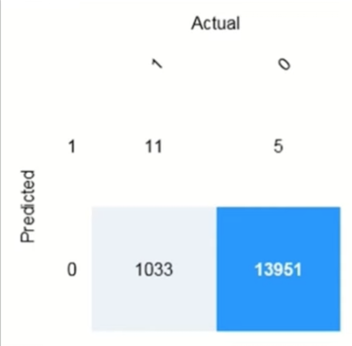
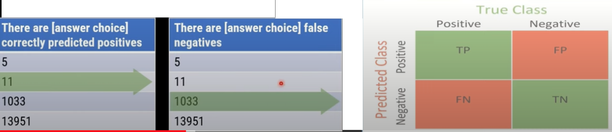
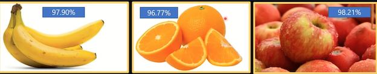
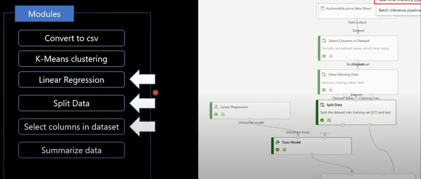
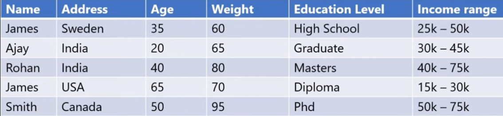

# 3 Practice exam

1.Which AI service should you use to create a bot from a frequently asked questions (FAQ) document?

* **a) QnA Maker**
* b) Language Understanding (LUIS)
* c) Text Analytics
* d) Speech Text

Language Understanding (LUIS) is a cloud-based conversational Al service that applies custom machine learning intelligence to a user's conversational, natural language text to predict overall meaning and pull out relevant, detailed information.

> A newer version of Language Understanding capabilities are now available as part of Azure Cognitive Service for Language.

Text analytics is used for deeper insights, like identifying a pattern or trend from the unstructured text.

> For example, text analytics can be used to understand a negative spike in the customer experience or popularity of a product,

The Azure speech-to-text service analyzes audio in real-time or batch to transcribe the spoken word into text.

> Out of the box, speech to text utilizes a Universal Language Model as a base model that is trained with Microsoft-owned data and reflects commonly used spoken language.

2  You build a machine learning model by using the automated machine learning user interface (UI).

You need to ensure that the model meets the Microsoft transparency principle for responsible Al.

What should you do?

* a) Set Validation type to Auto.
* **b) Enable Explain best model.**
* c) Set Primary metric to accuracy.
* d) Set Max concurrent iterations to 0

Model Explain Ability.

Most businesses run on trust and being able to open the ML black box. 

This helps build transparency and trust. In heavily regulated industries like healthcare and banking, it is critical to comply with regulations and best practices. One key aspect of this is understanding the relationship between input variables (features) and model output. 

Knowing both the magnitude and direction of the impact each feature (feature importance) has on the predicted value helps better understand and explain the
model. 

**With model explain ability, we enable you to understand feature importance as part of automated ML runs.**

3 Which scenario is an example of a **webchat bot**?

* a) Determine whether reviews entered on a website for a concert are positive or negative, and then add a thumbs up or thumbs down emoji to the reviews.
* b) Translate into English questions entered by customers at a kiosk so that the appropriate person can call the customers back.
* c) Accept questions through email, and then route the email messages to the correct person based on the content of the message.
* **d) From a website interface, answer common questions about scheduled events and ticket purchases for a music festival**.

4 For a machine learning process, how should you split data for training and evaluation?

* a) Use features for training and labels for evaluation.
* **b) Randomly split the data into rows for training and rows for evaluation**.
* c) Use labels for training and features for evaluation.
* d) Randomly split the data into columns for training and columns for evaluation.

The Split Data module is particularly useful when you need to separate data into training and testing sets. 

Use the Split Rows option if you want to divide the data into two parts.

You can specify the percentage of data to put in each split, but by default, the data is divided 50-50. You can also randomize the selection of rows in each group and use stratified sampling.

**Stratified random sampling is a method of sampling that involves the division of a population into smaller sub-groups known as strata**

5 Which of the following is the calculated probability of a correct image classification

* a) Accuracy
* **b) Confidence**
* c) Root Mean Square Error
* d) Sentiment

6 Ensuring an AI system does not provide a prediction **when important fields contain unusual or missing values** is __ principle for responsible AI.

* a) an inclusiveness
* b) privacy and security
* **c) a reliability and safety**
* d) a transparency

7 Ensuring that the **numeric variable in training data** are on a similar scale is an example of 

* a) data ingestion
* b) feature engineering
* **c) feature selection**
* d) model training

8 You want to create a model to predict sales of ice cream based on historic data that includes daily
ice cream sales total and weather measurements. Which Azure service should you use?

* **a) Azure Machine Learning**
* b) Azure Bot
* C) Language

* a) Azure Machine Learning enables you to train a predictive model from the existing data.
* b) The Azure Bot Service provides a platform for conversational Al.
* c) The Language Service is used for understanding and analyzing text and creating intelligent applications.

9 The **interactive answering** of questions entered by a user as part of an application is an example

* a) anomaly detection
* b) computer vision
* **c) conversational AI**
* d) forecasting

10 You are designing an AI application that uses images to detect cracks in window-panes of buildings and warns when a window-pane should be repaired or replaced. **What AI workload is described?**

* **a) Computer Vision**
* b) Natural Language Processing
* c) Anomaly Detection

* a) Images of the building's window pane can be analyzed with computer vision and classified into groups based on windshield condition.
* b) **That is incorrect**. Natural Language Processing is used to understand and analyze text and create intelligent applications.
* c) **That is incorrect**. Anomaly Detection is used to analyze data over time and identify unusual changes.

11 For each of the following statements, select Yes if the statement is true. Otherwise, select No.

NOTE: Each correct selection is worth one point.

* a) You can use QnA Maker to query an Azure SQL database.   （No)
* b) You should use QnA Maker when you want a knowledge base to provide the same answer to different users who submit similar questions.   (Yes)
* c) The QnA Maker service can determine the intent of a user utterance.    （No)

12 A company employs a team of customer service agents to provide telephone and email support to customers. 

The company develops a webchat bot to provide automated answers to common customer queries. 

**Which business benefit should the company expect as a result of creating the webchat bot solution?**

* a) increased sales
* b) **a reduced workload for the customer**
* c) improved product reliability

* a) Incorrect: A web chat Bot is just for answer common customer queries - **It will not increase sales**.
* b) Correct: **A webchat bot can most surely reduce workload for the customer service agents**
* c) Incorrect: **There is no relation** with product reliability which company is selling and a web chat bot

13 To answer, drag the appropriate benefit from the column on the left to its description on the right.

Each benefit may be used once, more than once, or not at all.

**Learning Types**

* Classification
* Clustering
* Regression

Answer Area

**Regression**

Predict how many minutes late a flight will arrive
based on the amount of snowfall at an airport

**Clustering**

Segment customers into different groups to support
a marketing department.

**Classification**

Predict whether a student will complete a university
course.

#### Regression

In the most basic sense, **regression refers to prediction of a numeric target**.

Linear regression attempts to establish a linear relationship between one or more independent variables and a numeric outcome, or dependent variable.

You use this module to define a linear regression method, and then train a model using a labeled dataset. The trained model can then be used to make predictions.

#### Clustering

Clustering, in machine learning, **is a method of grouping data points into similar clusters.**

It is also called segmentation. For example, you might apply clustering to find similar people by demographics. 

**You might use clustering with text analysis to
group sentences with similar topics or sentiment**.

#### Classification

Two-class classification provides the answer to simple two-choice questions such as Yes/No or True/False.

14 A predictive app provides audio output for **visually impaired users**. Which principle of Responsible AI is reflected here?

* a) Transparency
* **b) Inclusiveness**
* C) Fairness

a) Incorrect. Transparency is about fully communicating the purpose of the system, how it works, and what limitations may be expected.

b) Correct. Inclusiveness is about how AI should bring benefits to all parts of society, regardless of physical ability, gender, sexual orientation, ethnicity, or other factors.

c) Incorrect. Fairness is about developing models and applications **without incorporating any bias based on gender, ethnicity, or other factors that might result in an unfair advantage or disadvantage to specific groups**.

15 You are developing a model to predict events by using classification.

You have a confusion matrix for the model scored on test data as shown in the following exhibit.

16 You need to determine the location of cars in an image so that you can estimate the distance between the cars. **Which type of computer vision should you use?**

* a) optical character recognition (OCR)
* **b) object detection**
* c) image classification
* d) face detection

17 Complete the sentence by choosing the appropriate option in the answer area Azure Machine Learning designer lets you create machine learning models by:

* **a) adding and connecting modules on a visual canvas**.
* b) automatically performing common data preparation tasks.
* c) automatically selecting an algorithm to build the most accurate model.
* d) using a code-first notebook experience.

18 Your company is exploring the use of voice recognition technologies in its smart home devices.

The company wants to identify any barriers that might unintentionally leave out specific user
groups. **This an example of which Microsoft guiding principle for responsible AI**?

* a) accountability
* b) fairness
* **c) inclusiveness**
* d) privacy and security

The keyword here is "unintentionally" - Inclusive design practices can help system developers understand and address potential barriers in a product environment that could unintentionally exclude people. By addressing these barriers, you can create opportunities to innovate and design better experiences that benefit everyone.

20 What are three Microsoft guiding principles for responsible AI? Each correct ar
complete solution. NOTE: Each correct selection is worth one point.

* a) knowledgeability
* b) decisiveness
* **c) inclusiveness**
* **d) fairness**
* **e) reliability and safety**

21 A bank wants to use historic credit card repayment records to categorize credit card applications as low-risk or high-risk based on characteristics like the credit amount, the income of the borrower, and the credit period. **What kind of machine learning model should the bank use automated machine learning to create?**

* **a) Classification**
* b) Regression
* c) Time series forecasting

> Numeric: Regression
> 
> Category: Classification

22 Returning a bounding box that indicates the location of a vehicle in an image is an example of:

* a) image classification.
* **b) object detection**.
* c) optical character recognizer (OCR)
* d) semantic segmentation.

23 Predicting how many hours of overtime a delivery person will work based on the number of order received is an example of

* a) classification.
* b) clustering.
* **c) regression**.

> Numeric: Regression
> 
> Category: Classification

24 Which following service should you use to train an object detection model by using own images

* a) Computer Vision
* **b) Custom Vision**
* c) Form Recognizer
* d) Video Indexer

25 You are creating a training pipeline for a regression model. 

You use a dataset that has multiple numeric columns in which the values are on different scales. 

You want to transform the numeric columns so that the values are all on a similar scale. You also want the transformation to scale relative to the minimum and maximum values in each column. 

Which module should you add to the pipeline?

* a) Select Columns in a Dataset
* **b) Normalize Bata**
* c) Clean Missing Data

26 What are two tasks that can be performed by using the Computer Vision service? Each correct answer presents a complete solution. NOTE: Each correct selection is worth one point.

* a) Train a custom image classification model.
* **b) Detect faces in an image**.
* **c) Resognize handwritten text**.
* d) Translate the text in an image between languages.

27 ****** is used to generate additional features

* **a) Feature Engineering**
* b) Feature selection
* c) Model evaluation
* d) Model training

**Feature engineering**: The process of creating new features from raw data to increase the predictive power of the learning algorithm. Engineered features should capture additional information that is not easily apparent in the original feature set.

**Feature selection**: The process of selecting the key subset of features to reduce the dimensionality of the training problem.

28.You use Azure Machine Learning designer to create a training pipeline for a classification model.

What must you do before deploying the model as a service?

* **a) Create an inference pipeline from the training pipeline**
* b) Add an Evaluate Model module to the training pipeline
* c) Clone the training pipeline with a different name

29 You want to use automated machine learning to train a regression model with the best possible R2 score. How should you configure the automated machine learning experiment

* **a) Set the Primary metric to R2 score**
* b) Block all algorithms other than GradientBoosting
* c) Enable featurization

30 You send an image to a Computer Vision API and receive back the annotated image shown in the exhibit.

Which type of computer vision was used?

* **a) object detection**
* b) semantic segmentation
* c) optical character recognition (OCR)
* d) image classification

31 You are working in a tour & tourism company. Your company wants to use the Computer Vision service to analyze images of locations and identify well-known monuments. What should you do?

* a) Retrieve the objects in the image.
* b) Retrieve the categories for the image, specifying the celebrities domain
* **c) Retrieve the categories for the image, specifying the landmarks domain**

* a) Incorrect. The obiects might identifv monuments as monuments, but not a specific well-known landmarks.
* b) Incorrect. The celebrities domain includes well-known people, not monuments.
* c) Correct. The landmarks domain includes many well-known monuments around the world.

32 Why do you split data into training and validation sets?

* a) Data is split into two sets in order to create two models, one model with the training set and a different model with the validation set.
* **b) Splitting data into two sets enables you to compare the labels that the model predicts with the actual known labels in the original dataset.**
* c) Only split data when you use the Azure Machine Learning Designer, not in other machine learning scenarios.

--- 

* a) Incorrect. The validation set is used to test the model created with the training set.
* **b) Correct. You want to test the model created with training data on validation data to see how well the model performs with data it was not trained on**.
* c) Incorrect. Splitting data into training and validation sets is an important part of all machine learning scenarios.

33 What are two metrics that you can use to evaluate a regression model? Each correct answer
presents a complete solution. NOTE: Each correct selection is worth one point.

* **a) coefficient of determination (R2)**
* b) F1 score
* **c) root mean squared error (RMSE)**
* d) area under curve (AUC)
* e) balanced accuracy

34 You are processing photos of runners in a race. You need to read the numbers on the runners' shirts to identity the runners in the photos. **Which type of computer vision should you use?**

* a) facial recognition
* **b) optical character recognition (OCR)**
* c) semantic segmentation
* d) object detection

35 Which type of machine learning should you use to identify groups of people who have similar purchasing habits?

* a) classification
* b) regression
* **c) clustering**

**Clustering** is used to group instances of data into clusters that contain similar characteristics. Clustering can also be used to identify relationships in a dataset.

36 For each of the following statements, select Yes if the statement is true. Otherwise, select No.

NOTE: Each correct selection is worth one point.

* a) The Custom Vision service can be used to detect objects in an image.   (Y)
* b) The Custom Vision service requires that you provide your own data to train
* the model.  (Y)
* c) The Custom Vision service can be used to analyze video files.  (N)

37 You use Azure Machine Learning designer to publish an inference pipeline. **Which two parameters should you use to consume the pipeline?** Each correct answer presents part of the solution.

NOTE: Each correct selection is worth one point.

* a) the model name
* b) the training endpoint
* **c) the authentication key**
* **d) the REST endpoint**

38 From Azure Machine Learning designer, to deploy a real time inference pipeline as a service for others to consume, you must deploy the model to which of the following:

* a) a local web service
* b) Azure container instances
* **c) Azure Kubernetes service (AKS)**
* d) Azure Machine Learning computer

> Online endpoints must be deployed to an Azure Kubernetes Service cluster.

39 Which service should you use to extract text, key/value pairs, and table data automatically from scanned documents?

* **a) Form Recognizer**
* b) Text Analytics
* c) Language Understanding
* d) Custom Vision

40 You want to use the Computer Vision service to identify the location of individual items in an image. **Which of the following features should you retrieve?**

* **a) Objects**
* b) Tags
* c) Categories

* **Correct. Computer Vision returns objects with a bounding box to indicate their location in the image**.
* Incorrect. Tags indicate the items in an image, but not their location.
* Incorrect. Categories provide suggested categorizations for the image as a whole, not individual items in it.

41 Predicting how many vehicles will travel across a bridge on a given day is an example of

* a) classification
* **b) regression**
* c) clustering

42 You want to use the Computer Vision service to analyze images and to use the Language service to analyze text. It is a must requirement that developers only use one key and endpoint to access all of your services. What kind of resource should you create in your Azure subscription?

* a) Computer Vision
* **b) Cognitive Services**
* c) Custom Vision

* a) Incorrect. This resource type only supports image analysis. A separate Language resource (with its own key and endpoint) would be required for text analytics.
* b) Correct. A Cognitive Services resource support both Computer Vision and Language.
* c) Incorrect. The Custom Vision service is for image classification and object
detection, and does not support image analysis or text analysis.

43 For each of the following statements, select Yes if the statement is true. Otherwise, select No.

* a) The Face service can be used to perform facial recognition for employees  (Y)
* b) The Face service will be more accurate if you provide more sample photos of each employee from different angles.  (Y)
* c) If an employee is wearing sunglasses, the Face service will always fail to recognize the employee. (N)

44 You need to develop a mobile app for employees to scan and store their expenses while travelling.
**Which type of computer vision should you use?**

* a) semantic segmentation
* b) image classification
* c) object detection
* **d) optical character recognition (OCR)**

45 You need to use Azure Machine Learning designer to build a model that will predict automobile
prices. Which type of modules should you use to complete the model?

46 You use an Azure Machine Learning designer pipeline to train and test a binary classification model. You review the model's performance metrics in an Evaluate Model module and note that it has an AUC score of 0.3. What can you conclude about the model?

> AUC means Area Under the Curve

* a) The model can explain 30% of the variance between true and predicted labels.
* b) The model predicts accurately for 70% of test cases.
* **c) The model performs worse than random guessing.**

* •0.5: As good as random choice
* •0.5-0.7: Poor performance
* •0.7-0.8: OK performance
* •>0.8-0.9: Very good performance

47 You use Azure Machine Learning designer to create a training pipeline for a classification model.
What must you do before deploying the model as a service?

* **a) Create an inference pipeline from the training pipeline**
* b) Add an Evaluate Model module to the trainina pipeline
* c) Clone the training pipeline with a different name

48 You're using Azure Machine Learning designer to create a training pipeline for a binary classification model. You've added a dataset containina features and labels, a Two-Class Decision
Forest module, and a Train Model module. 

You plan to use Score Model and Evaluate Model modules to test the trained model with a subset of the dataset that wasn't used for training. **What's another module should you add?**

* a) Join data
* **b) Split data**
* c) Select column in dataset

> Use a Split Data module to randomly split a dataset into test and validation subsets.

49 The ability to extract subtotals and totals from a receipt is a capability of the

* a) custom vision
* **b) Form Recognizer**
* c) Ink Recognizer
* d) Text Analytics

50 For each of the following statements, select Yes if the statement is true. Otherwise, select No.

NOTE: Each correct selection is worth one point.

* Azure Machine Learning designer provides a drag-and-drop visual canvas to build, test, and deploy machine learning models.  （Y）
* Azure Machine Learning designer enables you to save your progress as a pipeline draft.  （Y）
* Azure Machine Learning designer enables you to include custom JavaScript functions.    （N）

51 You have the following dataset

| Household Income  | Postal Code  | House Price Category |
|:------------- |:---------------:| -------------:|
| 20000     | 55555  |        Low |
| 23000      | 20541        |          Middle |
|  80000 | 87960        |            High | 

You plan to use the dataset to train a model that will predict the house price categories of houses.
What are Household Income and House Price Category? 

Household Income

* **A feature**
* A label

House Price Category

* A feature
* **A label**

**Labels**

* The possible classes of animals are cats or birds.
* In that case the label would be the possible class associations like: cat or bird, that your machine learning algorithm will predict.

**The output you get from your model after training it is called a label.**

**Features**

The features are pattern, colors, forms that are part of your class like: furr, feathers, or more low-level interpretation, pixel values.

**The feature are attributes or properties of class.**

52 You are building a tool that will process images from retail stores and identify the products of
competitors. The solution will use a custom model. Which Azure Cognitive service should you use?

* **a) Custom Vision**
* b) Form Recognizer
* c) Face
* d) Computer Vision

53 You plan to use the Custom Vision service to train an image classification model. You want to
create a resource that can only be used for model training, and not for prediction. **Which kind of
resource should you create in your Azure subscription?**

* **a) Custom Vision**
* b) Cognitive Services
* c) Computer Vision

* a) **Correct: When you create a Custom Vision resource, you can specify whether it is to be
 used for training, prediction, or both**.
* b) Incorrect: A Cognitive Services resource can be used by the Custom Vision service for  both training and prediction.
* c) Incorrect: The Computer Vision service does not support the training of a custom image classification model.

Achieving transparency helps the team to understand the data and algorithms used to train the model, what transformation logic was applied to the data, the final model generated, and its associated assets.

This information offers insights about how the model was created, which allows it to be reproduced in a transparent way.

55 What information must you provide to developers who want to use image classification model?

* a) Only the project ID.
* **b) The project ID, the model name, and the key and endpoint for the prediction resource**
* c) The project ID, iteration number, and the key and endpoint for the training resource.

* (a) Incorrect: The project ID on its own is not enough information to use the published model
* **b) Correct: To use a published model, you need the project ID, the model name, and the key and endpoint for the prediction resource.**
* c) Incorrect: You need the model name rather than the iteration number; and the key and endpoint must be for the prediction resource, not the training resource.

56 You are designing an Al system that empowers everyone, including people who have hearing,
visual, and other impairments. This is an example of which Microsoft guiding principle for
responsible Al

* a) transparency
* **b) inclusiveness**
* c) fairness
* d) privacy and security

57 You run a charity event that involves posting photos of people wearing sunglasses on Twitter.
You need to ensure that you only retweet photos that meet the following requirements:

* Include one or more faces.
* Contain at least one person wearing sunglasses.

**What should you use to analyze the images?**

* a) the Verify operation in the Face service
* **b) the Detect operation in the Face service**
* c) the Describe Image operation in the Computer Vision service
* d) the Analyze Image operation in the Computer Vision service

58 The handling of unusual or missing values provided to an Al system is a consideration for which of
the Microsoft principle for responsible Al

* a) transparency
* b) inclusiveness
* c) fairness
* d) privacy and security
* **e) Reliability and safety**

59 You train an image classification model that achieves less than satisfactory evaluation metrics.
How might you improve it?

* a) Reduce the size of the images used to train the model.
* b) Add a new label for "unknown" classes.
* **c) Add more images to the training set**

a) Incorrect: Changing the size of the images is unlikely to improve performance significantly and reducing them may even lose some resolution and make the model worse.

b) Incorrect: Adding an "unknown" label will not improve the accuracy of predictions for the classes you want to identify.

**c): Correct: Generally, adding more images to the project an retraining the model is likely to improve performance.**

60 For each of the following statements, select Yes if the statement is true. Otherwise, select No.

a) Forecasting housing prices based on historical data is an example of anomaly detection.  (No)

b) Identifying suspicious sign-ins by looking for deviations from usual patterns is an example of anomaly detection.   (Yes)

c) Predicting whether a patient will develop diabetes based on the patient's medical history is an example of anomaly detection.  （No)

61 To answer, drag the appropriate benefit from the column on the left to its description on the right.
Each benefit may be used once, more than once, or not at all.

Learning Types

* Anomaly detection
* Computer vision
* Conversational Al
* Knowledge mining
* Natural language
* processing

**Conversational Al**

An automated chat to answer questions about refunds and exchange

**Computer vision**

Determining whether a photo contains a person

**Natural language processing**

Determining whether a review is positive or negative

62 The handling of unusual or missing values provided to an Al system is a consideration for the
Microsoft ***** principle for responsible Al.

* a) transparency
* b) inclusiveness
* c) fairness
* d) privacy and security
* **e) Reliability and safety**

Al systems need to be reliable and safe in order to be trusted. It's important for a system to perform as it was originally designed and for it to respond safely to new situations. 

Its inherent resilience should resist intended or unintended manipulation.

63 When you design an Al system to assess whether credit card applications should be approved, the
factors used to make the decision should be explainable. 

**This is an example of which Microsoft guiding principle for responsible Al?**

* **a) transparency**
* b) inclusiveness
* c) fairness
* d) privacy and security
* e) Reliability and safety

Achieving transparency helps the team to understand the data and algorithms used to train the model, what transformation logic was applied to the data, the final model generated, and its associated assets. This information offers insights about how the model was created, which allows it to be reproduced in a transparent way.

64  You need to predict the income range of a given customer by using the following dataset.

Which two fields should you use as features? Each correct answer presents a complete solution.

* a) Name
* b) Address
* **c) Age**
* d) Weight
* **e) Education Level**
* f) Income Level

> Labels are prediction or output of your Al model

> Features are properties or attributes of class or subject.

65 You plan to use a set of images to train model to detect mobile phones, and then publish the model as a predictive service. You want to use a single Azure resource with the same key and endpoint for training and prediction. What kind of Azure resource should you create?

* a) Custom Vision
* **b) Cognitive Services**
* c) Computer Vision

> A cognitive services resource can be used for both training and prediction.

66 Organizing documents into groups based on similarities of the text contained in the documents is
an example of clustering.    (Y）

67  Grouping similar patients based on symptoms and diagnostic test results is an example of
clustering.   (Y）

68 Predicting whether a person will develop mild, moderate, or severe allergy symptoms based on
pollen count is an example of clustering.   （No)

69 Which of the following results does an object detection model typically return for an image?

a) A class label and probability score for the image

b) Bounding box coordinates that indicates the region of the image where all of the objects it
contains are located

**c) A class label, probability, and bounding box for each object in the image**

> **An object detection model predicts a class label, probability, and bounding box for each object in the image**

70 Your company 'DigitalLAB' is in business of digitization of a library and needs to read text in a large
PDF document. For this you plan to use the Computer Vision service. Which API best suits this Business need?

* **1) The Read API**
* 2) The OCR API
* 3) The Recognize Text API 

**Read API better suited for larger images. Additionally, it runs asynchronously so it will not block your application while it is running**

71 Your company 'DigitalLAB' is in business of digitization of a library and for that they need to extraci
text from scanned books. Further the need is to use the Text Analytics service to analyze the
extracted text. Company wants developers to use only one key and endpoint to access all of the
services. **What kind of resource should you create in your Azure subscription?**

* a) Computer Vision
* **b) Cognitive Services**
* c) Text Analytics

A Cognitive Services resource support both Computer Vision for text extraction, and Text Analytics for text analysis.

72 You plan to use Face service to detect human faces in an image. **How does the service indicate the
location of the faces it detects?**

* a) A pair of coordinates for each face, indicating the center of the face
* b) Two pairs of coordinates for each face, indicating the location of the eyes
* **(c) A set of coordinates for each face, defining a rectangular bounding box around the face**

> The location of detected faces are indicated by a coordinates for a rectangular bounding box

73 You are building a tool that will process images from retail stores and identify the products of
competitors. The solution will use a custom model. Which Azure Cognitive Services service should
you use?

* **a） Custom Vision**
* b) Cognitive Services
* c) Computer Vision

74 What is one aspect that may impair facial detection?

* a) Smile expression
* **b) Extreme angles**
* c) Fast shutter speed

> Best results are obtained when the faces are full-frontal or as near as possible to full-frontal

75 You want to use Face service to identify named individuals. What must you do?

* a) Use the Computer Vision service
* b) Use Face to retrieve age and emotional state for each person
* **c) Use Face to create a group containing multiple images of each named individual, and train a model based on the group**

> Creating a group that contains multiple images of named individuals enables you to train a facial recognition model.

76 Your company is exploring the use of voice recognition for a smart mobile device. The company is
committed to identify any barriers that might unintentionally leave out specific user groups. This
an example of which Microsoft guiding principle for responsible Al?

* a) accountability
* b) fairness
* **c) inclusiveness**
* d) privacy and security

77 A medical research project uses a large anonymized dataset of brain scan images that are categorized into predefined cancer types. You need to use machine learning to support early detection of the different cancer types in the images before the images are reviewed by a person.

This is an example of which type of machine learning?

* a) clustering
* b) regression
* **c) classification**.

78 You plan to use the Form Recognizer pre-built receipt model. Which kind of Azure resource should
rou create?

* a) Computer Vision resource
* **b) Form Recognizer or Cognitive Services resource**
* c) Only Form Recognizer resource

> Both the Form Recognizer resource and Cognitive Services resource provide access to the Form Recognizer service

79 You are using the Form Recognizer service to analyze receipts that you have scanned into JPG format images. What is the maximum file size of JPG file you can submit to the pre-built receipt model?

* a) 2 MB
* **b) 50 MB**
* c) 200 MB

> The maximum file size for the pre-built receipt model is 50 MB

80 Match the principles of responsible Al to appropriate requirements. 

To answer, drag the appropriate principles from the column on the left to its requirement on the right. Each principle may be used once, more than once, or not at all. You may need to drag the split bar between panes
or scroll to view content.

**Principles**

* Fairness
* Privacy and
* Security
* Reliability and  Safety
* Transparency

**Privacy and Security**:  Personal data must be visible only to approve.

**Fairness**: The system must not discriminate based on gender and race 

**Transparency** Automated decision-making processes must be recorded so that approved users can identify why a decision was made

81 For each of the following statements, select Yes if the statement is true otherwise, select No.

* a) The Text Analytics service can identify in which language text is written.   (Y)
* b) The Text Analytics service can detect handwritten signatures in a document.  (N)
* c) The Text Analytics service can identify companies and organizations mentioned in a document.  (Y)

82 When training a model, why should you randomly split the rows into separate subsets?

* a) to train the model twice to attain better accuracy
* b) to train multiple models simultaneously to attain better performance
* **c) to test the model by using data that was not used to train the model**

83 You need to predict the **mm** amount of rainfall for the next 10 years. **Which type of machine
learning should you use?**

* a) classification
* **b) regression**
* c) clustering

In the most basic sense, regression refers to prediction of a numeric target.

Linear regression attempts to establish a linear relationship between one or more independent variables and a numeric outcome, or dependent variable.

You use this module to define a linear regression method, and then train a model using a labeled dataset. The trained model can then be used to make predictions.

84 You need to predict the temperature rise in degrees due to climate change in next 50 years. **Which
type of machine learning should you use?**

* a) classification
* **b) regression**
* c) clustering

85 You want to use the Language service to determine the key talking points in a text document.
Which feature of the service should you use?

* a) Sentiment analysis
* **b) Key phrase extraction**
* c) Entity detection

Incorrect. Sentiment analysis returns a numeric score indicating how positive or negative the text is.

**Correct. Key phrases can be used to identify the main talking points in a text document.**

Incorrect. Entity detection identifies specific types of entity in the document, not the main talking points.

86 Which following are not Microsoft guiding principles for responsible Al?

* **a) knowledgeability**
* **b) decisiveness**
* c) inclusiveness
* d) fairness
* **e) validity**
* f) reliability and safety

87 Returning a bounding box that indicates the location of a vehicle in an image is a example of

* a) image classification
* **b) object detection**
* c) optical character recognizer
* d) semantic segmentation

88 Automated machine learning provides you with the ability to include custom Python scripts in a
training pipeline.   （Yes)

89 Automated machine learning implements machine learning solutions without the need for
programming experience.    （Yes)

90 Automated machine learning provides you with the ability to visually connect datasets and
modules on an interactive canvas  (Yes)

91 A score of 0.99 of sentiment analysis on a document using Language service. What does this
score indicate about the document sentiment?

* **a) The document is positive.**
* b) The document is neutral.
* c) The document is negative.

Correct. Score values closer to 1 indicated a more positive sentiment where scores closer to 0 indicated negative sentiment.

Incorrect. A neutral document would score around 0.5.

Incorrect. Score values closer to 1 indicated a more positive sentiment where scores closer to 0 indicated negative sentiment.

92
Which service should you use to create a knowledge base for bots?

* a) Conversational Language Understanding
* **b) Question Answering**
* c) Azure Bot

93 You need to develop a chatbot for a website. The chatbot must answer users questions based on
the information in the following documents:

* A product troubleshooting guide in a Microsoft Word document
* A frequently asked questions (FAQ) list on a webpage

Which service should you use to process the documents?

* a) Language Understanding
* b) Text Analytics
* c) Azure Bot Service
* **d) QnA Maker**

94 A banking system that predicts whether a loan will be repaid is an example of regression type of
machine learning

**No**

Select Regression when you need to predict Numeric value.

95 A banking system that predicts whether a loan will be repaid is an example of **classification** type of
machine learning

**Yes**

96 When might you see NaN returned for a score in Language Detection?

* a) When the score calculated by the service is outside the range of O0to 1
* b) When the predominant language in the text is mixed with other languages
* **c) When the language is ambiguous**

97 Your company is in business of providing customer support over the phone. During many years
company has created a frequently asked questions (FAQ) document. Company now wants to
create a knowledge base that includes the questions and answers from the FAQ with the least
possible effort. **What should you do?**

* a Create knowledge base from scratch and manually copy and paste the FAQ entries into it.
* **b) Import from the existing FAQ document into a new knowledge base.**
* c) Import a pre-defined chating data source.

98 Which of the following is used to generate additional features?

* a) Feature selection
* **b) Feature engineering**
* c) Model Evaluation
* d) Model training

99 You need to make the press releases of your company available in a range of languages.

Which service should you use?

* **a) Translator Text**
* b) Text Analytics
* c) Speech
* d) Language Understanding (LUIS)

100 For each of the following statements, select Yes if the statement is true. Otherwise, select No.
NOTE: Each correct selection is worth one point.

* a) Automated machine learning is the process of automating the time-consuming, iterative tasks of machine learning model development  （Y）
* b) Automated machine learning can automatically infer the training data from the use case provided.  （N）
* c) Automated machine learning works by running multiple training iterations that are scored and ranked by the metrics you specify.  （Y） 
* d) Automated machine learning enables you to specify a dataset and will automatically understand which label to predict  （Y） 

101 Data values that influence the prediction of a model are called?

* a) dependant variables
* **b) features**
* c) identifiers
* d) labels

A detailed comparison between - Features and Labels is done in:  Question number 51 

102 You plan to deploy an Azure Machine Learning model as a service that will be used by client
applications. Which three processes should you perform in sequence before you deploy the model?

To answer, move the appropriate processes from the list of processes to the answer area and arrange them in the correct order.

**Processes**     

* Data Encryption
* Model retraining
* Model training
* Model evaluation
* Data Preparation

**Answer Area**

* Data Preparation
* Model training
* Model evaluation

103 You are building an Al-based app. You need to ensure that the app uses the principles for responsible Al. **Which two principles should you follow**? Each correct answer presents part of the solution.

* a) Implement an Agile software development methodology
* **b) Implement a process of Al model validation as part of the software review process**
* **c) Establish a risk governance committee that includes members of the legal team, members of the risk management team, and a privacy officer**
* d) Prevent the disclosure of the use of Al-based algorithms for automated decision making

Option b) ensures Reliability and Safety.

Option c) ensures Privaey and security.

104 JSON data object is used to indicate the recording pattern of the data.   (Yes)

105 XML data format is accepted by Azure Cognitive Search when you are pushing data to the index? (No)

106 You can query a search index even if you set up a search index without including any Al skillsets. (Yes)

107 Which type of machine learning should you use to predict the number of gift cards that will be sold
next month?

* a) classification
* **b) regression**
* c) clustering

* Numeric  => Regression

* Category  =>  Classification

108 Fairness is Microsoft's principle of responsible Al which says that Al systems should not reflect
biases from the data sets that are used to train the systems   (Yes)

109 Specifying granularity in JSON data object is used to indicate the recording pattern of the data.  (Yes)

110 What is a correct explanation of an indexer and an index?

* a) **Azure's indexer exports incoming documents into JSON and pushes the JSON to an index for storage**.
* b) Azure's indexer can be used instead of an index if the files are already in the proper format.
* c) Azure's indexer is only used to implement a knowledge store which is stored in the index.

> Documents in Azure blob storage are exported to JSON before getting stored in the search index. Azure's indexer is a tool that automates the document export process.

111 You have a dataset that contains information about taxi journeys that occurred during a given
period. You need to train a model to predict the fare of a taxi journey. What should you use as a
feature?

* a) the number of taxi journeys in the dataset
* **b) the trip distance of individual taxi journeys**
* c) the fare of individual taxi journeys
* d) the trip ID of individual taxi journeys

112 The Model evaluation module outputs a confusion matrix showing the number of true positives,
false negatives, false positives, and true negatives.   (Yes)

113 Feature Selection helps in splitting a date into a month, day and year fields (No)

114 Feature selection helps in picking temperature and pressure to train a weather model   (Yes)

115 When developing an Al system for self-driving cars, which of the following Microsoft principle for responsible Al should be applied to ensure consistent operation of the system during unexpected circumstances.

* a) inclusiveness
* b) fairness
* c) validity
* **d) reliability and safety**