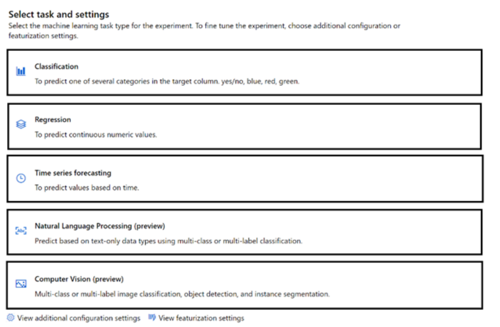

# Real Exam - Chap 3

## Chap3

1 You are developing a system to predict the prices of insurance for drivers in the United Kingdom.

You need to minimize bias in the system.

What should you do?

* A. Remove information about protected characteristics from the data before sampling.
* **B. Take a training sample that is representative of the population in the United Kingdom**.
* C. Create a training dataset that uses data from global insurers.
* D. Take a completely random training sample.

B. Take a training sample that is representative of the population in the United Kingdom.

To minimize bias in the system, it's important that your training data is representative of the population you're modeling. This helps ensure that the model's predictions are valid for the full range of drivers in the United Kingdom.

2 Select the answer that correctly completes the sentence.

**Azure Machine Learning designer lets you create machine learning models by**

* **Adding and connecting modules on a visual canvas**,
* automatically performing common data preparation tasks.
* automatically selecting an algorithm to build the most accurate model.
* using a code-first notebook experience

3 You have a dataset.

You need to build an Azure Machine Learning classification model that will identify defective products.

What should you do first?

* **A. Load the dataset**.
* B. Create a clustering model.
* C. Split the data into training and testing datasets.
* D. Create a classification model.

1. Prepare data: Identify the features and label in a dataset. Pre-process, or clean and transform, the data as needed.
2. **Train model**: Split the data into two groups, a training and a validation set.
3. **Evaluate performance**: Compare how close the model's predictions are to the known labels.
4. **Deploy a predictive service**: After you train a machine learning model, you need to convert the training pipeline into a real-time inference pipeline.

4 You use Azure Machine Learning designer to build a model pipeline

What should you create before you can run the pipeline?

* A. a registered model
* **B. a compute resource**
* C. a Jupyter notebook

You need a compute resource in order to run the model

5 Match the tool to the Azure Machine Learning task.

* ( **The Azure portal** ) Create a Machine Learning workspace
* (**Machine Learning designer** )  Use a drag-and-drop interface used to train and deploy models
* ( **Automated machine learning (automated ML)** ) Use a **wizard to select configurations for a machine learning run**

6 You need to create a customer support solution to help customers access information. The solution must support email, phone, and live chat channels.

Which type of AI solution should you use?

* A. machine learning
* B. computer vision
* **C. chatbot**
* D. natural language processing (NLP)

7 Match the types of AI workloads to the appropriate scenario

**Workload Types**

* Anomaly detection
* Computer vision
* Machine Learning (Clustering)
* Natural language processing

**Answer Area**

* （**Computer vision**）Identify handwritten letters.
* （**Natural language processing**）Predict the sentiment of a social media post.
* （**Anomaly detection**）Identify an unusual credit card payment.
* （**Machine Learning (Clustering)**）Group animals based on multiple measurements.

8 Predicting how many vehicles will travel across a bridge on a give day is an example of _______.

* **A. regression**
* B. translation
* C. classification
* D. clustering

9 In a machine learning model, the data that is used as inputs are called ________.

* A. dataset
* B. labels
* **C. variables**

* **Variables and Features are input**
* **Label is the output**

10 Using Recency, Frequency, and Monetary (RFM) values to identify **segments** of a customer base is an example of

* **clustering.**
* regression.
* classification.
* regularization.

RFM ( Recency, Frequency, Monetary) analysis is a proven marketing model for behavior based customer segmentation. It groups customers based on their transaction history - **CORRECT ANSWER IS CLUSTERING**

**segmentation = grouping and grouping is clustering**

RFM segmentation can be considered an example of Clustering.

11 You plan to deploy an Azure Machine Learning model by using the Machine Learning designer.

Which four actions should you perform in sequence?

Actions

* Train the model.
* Split the data randomly into training data and validation data.
* Evaluate the model against the original dataset.
* Evaluate the model against the validation dataset.
* Ingest and prepare a dataset.


**Answer**

* Ingest and prepare a dataset.
* Split the data randomly into training data and validation data.
* Train the model.
* Evaluate the model against the validation dataset

12 For each of the following statements, select Yes if the statement is true. Otherwise, select No.

* Organizing documents into groups based on different usage statistics is an example of clustering.  **（Yes)**

* Grouping similar patients based on symptoms and diagnostic test results is an example of clustering.  **（Yes)**

* Predicting whether a person will develop mild, moderate, or severe allergy symptoms based on pollen count is an example of clustering.  **（No)**

> **Key work "grouping" "organizing" is clustering**

12 When building a regression model, labels must have a data type of

* boolean.
* datetime.
* **numeric**
* text.

13 You need to create a clustering model and evaluate the model by using Azure Machine Learning designer.

What should you do?

* **A. Split the original dataset into a dataset for training and a dataset for testing. Use the testing dataset for evaluation**.
* B. Use the original dataset for training and evaluation.
* C. Split the original dataset into a dataset for features and a dataset for labels. Use the features dataset for evaluation.
* D. Split the original dataset into a dataset for training and a dataset for testing. Use the training dataset for evaluation.

14 You have a dataset that contains the columns shown in the following table.

```
Name        Type
ColumnA    Integer
ColumnB    Numeric
ColumnC    Numeric
ColumnD    Numeric
ColumnE    Numeric
```

You have a machine learning model that predicts the value of ColumnE based on the other numeric columns.

Which type of model is this?


* A. analysis
* B. clustering
* **C. regression**

15 You need to **track multiple versions** of a model that was trained by using Azure Machine Learning.

What should you do?


* A. Explain the model.
* **B. Register the model.**
* C. Register the training data.
* D. Provision an inference cluster

> Model registration allows you to store and version your models in the Azure cloud, in your workspace. The model registry helps you organize and keep track of your trained models

16 You need to identify groups of rows with similar numeric values in a dataset.

Which type of machine learning should you use?

* **A. clustering**
* B. regression
* C. classification

Anytime you see GROUP whether it says Identify which usually is Classification, it is ALWAYS Cluster. Think of Cluster like saying "A Cluster of things" or "Group of things" essentially.

* Cluster = Group
* Identify/Classify = Classification
* Prediction = Regression


17 Select the answer that correctly completes the sentence.


A banking system that predicts whether a loan will be repaid
is an example of the  ___ type of machine learning.


* clustering
* regression
* **classification**


18 () models can be used to predict the sale price of auctioned items.


* clustering
* **regression**
* classification


19 A historian can use ________ to digitize newspaper articles.
Select the answer that correctly completes the sentence.

* A. Object detection
* B. Facial recognition
* C. Image classification
* **D. Optical character recognition (OCR)**


20 For each of the following statements, select Yes if the statement is true. Otherwise, select No

* Object detection can identify the location of a damaged product in an image.  **(Yes)**
* Object detection can identify multiple instances of a damaged product in an image.   **(Yes)**
* Object detection can identify multiple types of damaged products in an image.  **(Yes)**


With Azure Custom Vision, you can create and train a custom object detection model that is specific to your needs. This means that you can train the model to identify multiple types of damaged products in an image, and the model can be refined and improved over time as more data becomes available

21 You need to create a model that labels a collection of your personal digital photographs

Which Azure Cognitive Services service should you use?

* A. Form Recognizer
* **B. Custom Vision**
* C. Language
* D. Computer Vision

22 (**Object detection** ) is used to identify multiple types of items in one image

* **Object detection**
* Image description
* Image classification
* Optical character recognition (OCR)

Object detection is an extension of image classification. 

The question is asking what is used to "identify" multiple types of items not locating where they are in the image.

23 Identifying whether a kiosk user is annoyed by monitoring a video feed from the kiosk is an example of  ()


* face detection.
* **facial analysis.**
* facial recognition.
* optical character recognition (OCR).

Facial analysis: infer the emotional state of the kiosk users


24 Match the Azure Cognitive Services to the appropriate actions.

**Services**

* Custom Vision
* Face
* Form Recognizer

**Answer Area**

* (**Custom Vision**) Identify objects in an image.
* (**Form Recognizer** ) Automatically import data from an invoice to a database.
* (**Face**) Identify people in an image.

Azure Custom Vision is an image recognition service that lets you build, deploy, and improve your own image identifier models. 

**An image applies labels to images, according to their visual characteristics. Each label represents a classification or object.** 

**Unlike the Computer Vision service. Custom Vision allows you to specify your own labels and train custom models to detect them.**

25 An AI solution that helps photographers take better portrait photographs by providing feedback on exposure, noise, and occlusion is an example of facial ()

* **analysis.**
* detection.
* recognition.

**Analysis. Used in computer vision**

Facial analysis involves extracting information and insights about a person's face, such as their expression, age, gender, or other characteristics. 

The solution described uses facial analysis to evaluate various aspects of portrait photographs, such as exposure, noise, and occlusion, to provide feedback to the photographer on how to improve the quality of their portraits.


**Facial detection is the task of locating and identifying the presence of faces within an image or video, while facial recognition is the process of identifying or verifying a person's identity based on their facial features.** 

These tasks are related to facial analysis but are not the primary focus of the solution described.

Therefore, the AI solution that provides feedback on portrait photographs based on exposure, noise, and occlusion is an example of **facial analysis**, **which involves extracting information about a person's face to gain insights and evaluate various characteristics.**

26 Your company manufactures widgets.

You have 1,000 digital photos of the widgets.

You need to identify the location of the widgets within the photos.

What should you use?

* A. Computer Vision Spatial Analysis
* **B. Custom Vision object detection**
* C. Computer Vision Image Analysis
* D. Custom Vision classification

27 You need to convert handwritten notes into digital text.

Which type of computer vision should you use?

* A. facial detection
* **B. optical character recognition (OCR)**
* C. image classification
* D. object detection

28 （ ） is used to identify multiple types of items in one image.

* Image classification
* Image description
* **Object detection**
* Optical character recognition (OCR)

29 You need to develop a mobile app for employees to scan and store their expenses while travelling.

Which type of computer vision should you use?

* A. face detection
* B. image classification
* C. object detection
* **D. optical character recognition (OCR)**

30 You can use the ____ service to train an object detection model by using your own images.

* Computer Vision
* **Custom Vision**
* Form Recognizer
* Azure Video Analyzer for Media

**Custom vision service requires that you provide *your own data* to train the model. You label the image yourself at the time of submission**

31 An AI solution that helps photographers take better portrait photographs by providing feedback on exposure, noise, and occlusion is an example of facial  ___ 

* **analysis**.
* detection.
* recognition.

32 Match the Azure Cognitive Services to the appropriate AI workloads.

**Services**

* Custom Vision
* Face
* Form Recognized


* (**Custom Vision**) Identify objects in an image.
* (**Form Recognized**) Automatically import data from an invoice to a database.
* (**Face**) Identify people in an image.


33 You need to implement a **pre-built solution** that will identify well-known brands in digital photographs.

Which Azure Cognitive Services service should you use?

* A. Custom Vision
* B. Form Recognizer
* C. Face
* **D. Computer Vision**


34 Natural language processing can be used to __________.

Select the answer that correctly completes the sentence.

* A. Analyze video content
* B. Generate speech
* **C. Classify email messages as work-related or personal**.
* D. Classify images

A. Analyze video content: This is not correct because analyzing video content typically involves computer vision techniques, not NLP.

B. Generate speech: While generating speech can be related to NLP (e.g., text-to-speech systems), it is more directly associated with speech synthesis and not purely NLP.

C. Classify email messages as work-related or personal: This is correct. NLP can be used to analyze the text content of emails and classify them based on their context, making it an appropriate example of an NLP application.

D. Classify images: This is not correct because classifying images typically involves image processing and computer vision techniques, not NLP.

35 You plan to develop a bot that will enable users to query a knowledge base by using natural language processing.

Which two services should you include in the solution? Each correct answer presents part of the solution.

* **A. Language Service**
* **B. Azure Bot Service**
* C. Form Recognizer
* D. Anomaly Detector

36 For each of the following statements, select Yes if the statement is true. Otherwise, select No.

* The following service call will accept English text as an input and output Italian and French text.
	* `/translate?from-it&to=fr&to=en`    **(N)**
* The following service call will accept English text as an input and output Italian and French text.
	* `/translate?from=en&to=fr&to=it`    **(Y)**
* The Translator service can be used to translate documents from English to French.					             **(Y)**		

37 An app that analyzes social media posts to identify their tone is an example of which type of natural language processing (NLP) workload?

* **A. sentiment analysis**
* B. speech recognition
* C. key phrase extraction
* D. entity recognition

38 You are building a chatbot that will use natural language processing (NLP) to perform the following actions based on the text input of a user.

* • Accept customer orders.
* • Retrieve support documents.
* • Retrieve order status updates.

Which type of NLP should you use?

* A. sentiment analysis
* **B. named entity recognition**
* C. translation
* D. language modeling

39 Match the Azure Cognitive Services service to the appropriate actions.

* Azure Cognitive Services
* Language service
* Speech Translator

* (**Speech Translator**) Convert spoken requests into text.
* (**Language service**) Identify the intent of a user's requests.
* (**Language service**) Apply intent to entities and utterances.


40 For each of the following statements, select Yes if the statement is true. Otherwise, select No

* A webchat bot can interact with users visiting a website. **(Y)**
* Automatically generating captions for pre-recorded videos is an example of natural language processing.  **(N - Speech)**
* A smart device in the home that responds to questions such as What will the weather be like today?" is an example of natural language processing.   **(Y - NLP )**

**A webchat bot can interact with users visiting a website:**

Yes, a webchat bot can be implemented on a website to provide automated responses and interact with users in a conversational manner

Automatically generating captions for pre-recorded videos is an example of natural language processing:

No, automatically generating captions for videos typically falls under the domain of speech recognition or audio processing, rather than natural language processing. 

NLP primarily deals with understanding and processing human language in textual form

A smart device in the home that responds to questions such as "What will the weather be like today?" is an example of natural language

processing:

Yes, a smart device that can understand and respond to natural language queries or commands, such as asking about the weather, relies on natural language processing techniques to interpret and process the user's input and provide a relevant response.

40 You have a website that includes customer reviews.

You need to store the reviews in English and present the reviews to users in their respective language by recognizing each user's geographical location.

Which type of natural language processing workload should you use?

* A. key phrase extraction
* B. speech recognition
* C. language modeling
* **D. translation**

41 For each of the following statements, select Yes if the statement is true. Otherwise, select No.

* Chatbots can support voice input. **（Yes)**
* A separate chatbot is required for each communication channel.  **（No)**
* Chatbots manage conversation flows by using a combination of natural language and constrained option responses.  **（Yes)**

42 For each of the following statements, select Yes if the statement is true. Otherwise, select No.

* A bot that responds to queries by internal users is an example
of a natural language processing workload   **(Yes)**

* A mobile application that displays images relating to an
entered search term is an example of a natural language processing workload.   **(No - Azure cognitive search)**

* A web form used to submit a request to reset a password is
an example of a natural language processing workload. **(No)**

42 You have a solution that analyzes social media posts to extract the mentions of city names and the city names discussed most frequently.

Which type of natural language processing (NLP) workload does the solution use?

* A. speech recognition
* B. sentiment analysis
* C. key phrase extraction
* **D. entity recognition**

**Entity recognition is specifically designed to identify and extract named entities**, which can include various types of information such as names of people, organizations, locations (cities, countries), dates, and more.

43 For each of the following statements, select Yes if the statement is true. Otherwise, select No

* You can use Language Service's question answering to query an Azure SQL database.   **（No)**
* You should use Language Service's question answering when you want a knowledge base to provide the same answer to different users who submit similar questions.   **（Yes)**
* Lanquage Service's question answering can determine the intent of a user utterance.   **（No)**

* No. Language Service's question answering is primarily designed to extract answers from pre-defined knowledge bases or documents, not directly query databases.
* Yes. Language Service's question answering can provide consistent answers to similar questions by leveraging the knowledge base and understanding the intent of the user's question
* No. Language Service's question answering is focused on extracting answers from text and documents, rather than determining the intent of user utterances. Intent recognition is typically handled by other NLP components or services

44 You are developing a solution that uses the Language service.
You need to identify the main talking points in a collection of documents.

Which type of natural language processing should you use?

* A. language detection
* B. sentiment analysis
* C. entity recognition
* **D. key phrase extraction**

45 You are designing a system that will generate insurance quotes automatically.

Match the Microsoft responsible AI principles to the appropriate requirement


**Principles**

* Accountability
* Fairness
* Inclusiveness
* Privacy and security
* Reliability and safety
* Transparency

* You can use Language Service's question answering to query an Azure SQL database.    **（Privacy and security）**

* You should use Language Service's question answering when you want a knowledge base to provide the same answer to different users who submit similar questions.  **（Transparency）**

* Lanquage Service's question answering can determine the intent of a user utterance.   **（Inclusiveness）**


46 Which type of natural language processing (NLP) entity is used to identify a phone number?

* **A. regular expression**
* B. machine-learned
* C. list
* D. Pattern.any

47 Returning a bounding box that indicates the location
of a vehicle in an image is an example of 

* image classification
* **object detection**
* optical character recognition (OCR)
* facial detection

48 Your company is exploring the use of voice recognition technologies in its smart home devices. The company wants to identify any barriers that might unintentionally leave out specific user groups.

This is an example of which Microsoft guiding principle for responsible AI? 

* A. accountability
* B. fairness
* C. privacy and security
* **D. inclusiveness**


49 You have a large dataset that contains motor vehicle sales data.

You need to train an automated machine learning (automated ML) model to predict vehicle sale values based on the type of vehicle.



1. "Values" -> Regression
2. Choose column -> Configuration
3. All column data -> No needs featurization

50 When evaluating the performance of a model, the ___ displays the predicted and actual positives and negatives by using a grid of O and 1 values.

* AUC metric
* **confusion matrix**
* ROC curve
* threshold

51 You need to convert receipts into transactions in a spreadsheet. The spreadsheet must include the date of the transaction, the merchant, the total spent, and any taxes paid.

Which Azure AI service should you use?

* A. Custom Vision
* **B. Form Recognizer**
* C. Face
* D. Language

52 Predicting how many vehicles will travel across a bridge on a given day is an example of

* classification
* clustering
* **regression**

53 In a machine learning model, the data that is used as inputs are called

* **features**
* functions
* labels
* instances

54 You have a security system that analyzes images from CCTV to provide authorized staff entry into restricted area.

Which type of computer vision does the system use?

* A. optical character recognition (OCR)
* B. semantic segmentation
* **C. facial detection and facial recognition**
* D. image analysis

55 For which two workloads can you use computer vision? Each correct answer presents a complete solution.

* **A. assigning the color pixels in an image to object names**
* B. detecting inconsistencies and anomalies in a stream of data
* C. creating visual representations of numerical data
* D. creating photorealistic images by using three-dimensional models
* **E. describing the contents of an image**

Describing the content of an image requires understanding the objects, scenes, and relationships depicted in the image. This is what computer vision do

56 You have an app that identifies the coordinates of a product in an image of a supermarket shelf.

Which service does the app use?

* A. Custom Vision classification
* **B. Custom Vision object detection**
* C. Computer Vision Read
* D. Computer Vision optical character recognition (OCR)

Object detection model returns the following information:

- The class of each object identified in the image.
- The probability score of the object classification (which you can interpret as the confidence of the predicted class being correct)
- The coordinates of a bounding box for each object

57 A traffic monitoring system that collects vehicle registration numbers from CCTV footage is an example of __ in the Computer Vision service.

* image classification
* **object detection**
* spatial Analysis
* text extraction

Since the goal is to extract the vehicle registration numbers from the CCTV footage, text extraction using OCR algorithms would be the most appropriate choice. 

OCR algorithms can recognize and extract text information from images, making it possible to retrieve the registration
numbers from the captured video frames. 

This enables automated monitoring and analysis of the traffic data by extracting the relevant textual information.

58 You need to build an image tagging solution for social media that tags images of your friends automatically.

Which Azure Cognitive Services service should you use?

* **A. Face**
* B. Form Recognizer
* C. Language
* D. Computer Vision

59 You have an app that identifies birds in images. The app performs the following tasks:

* Identifies the location of the birds in the image
* Identifies the species of the birds in the image

Which type of computer vision does each task use? To answer, select the appropriate options in the answer area

**Locate the birds:**

* Automated captioning
* Image classification
* **Object detection**
* Optical character recognition (OCR)

**Identify the species of the birds:**

* Automated captioning
* **Image classification**
* Object detection
* Optical character recognition (OCR)

60 You have a solution that reads manuscripts in **different languages** and categorizes the manuscripts based on topic.

Which types of natural language processing (NLP) workloads does the solution use?

* A. speech recognition and entity recognition
* B. speech recognition and language modeling
* **C. translation and key phrase extraction**
* D. translation and sentiment analysis

61 Select the answer that correctly completes the sentence.

The interactive answering of questions entered by a user as part of an application is an example of

* anomaly detection.
* computer vision.
* **natural language processing**
* forecasting.

62 You have 100 instructional videos that do NOT contain any audio. Each instructional video has a script.

You need to generate a narration audio file for each video based on the script.

Which type of workload should you use?


* A. language modeling
* B. speech recognition
* **C. speech synthesis**
* D. translation

You're converting text to speech - so Speech service's text-to-speech option

63 Natural language processing can be used to

* **classify email messages as work-related or personal**
* predict the number of future car rentals
* predict which website visitors will make a transaction
* stop a process in a factory when extremely high temperatures are registered

64 Which AI service can you use to extract intent from a user input such as “Call me back later”?

* A. Azure Cognitive Search
* B. Translator
* **C. Language**
* D. Speech

It's C, the Language service. It doesn't specify that the user input is audio.

To extract intent from user input like “Call me back later,” you can use Conversational Language Understanding (CLU).

CLU enables you to build custom natural language understanding models that predict the overall intention of an incoming utterance and extract relevant information

65 You are building a Language Understanding model for an e-commerce business.

You need to ensure that the model detects when utterances are outside the intended scope of the model.

What should you do?


* A. Export the model
* **B. Add utterances to the None intent**
* C. Create a prebuilt task entity
* D. Create a new model

Every project in conversational language understanding includes a default None intent. The None intent is a required intent and can't be deleted or renamed. 

**The intent is meant to categorize any utterances that do not belong to any of your other custom intents**

66 ( ) can be used to build no-code apps that use built-in
natural language processing models

* Azure Health Bot
* Microsoft Bot Framework
* **Power Virtual Agents**

Power Virtual Agents can be used to build no-code apps that use built-in natural language processing models. Power Virtual Agents is a Microsoft service that enables the creation of chatbots and virtual agents without the need for coding. 

67 For each of the following statement, select Yes if the statement is true. Otherwise, select No

* A smart device in the home that responds to questions such as
"When is my next appointment?" is an example of conversational AI.  **（Yes)**
* An interactive webchat feature on a company website can be
implemented by using Azure Bot Service. **（Yes)**
* Automatically generating captions for pre-recorded videos is
an example of conversation AI.   **（No)**

68 What is an example of the Microsoft responsible AI principle of transparency?

* A. ensuring that opportunities are allocated equally to all applicants
* **B. helping users understand the decisions made by an AI system**
* C. ensuring that developers are accountable for the solutions they create
* D. ensuring that the privileged data of users is stored in a secure manner

69 You need to provide customers with the ability to query the status of orders by using phones, social media, or digital assistants.

What should you use?

* A. an Azure Machine Learning model
* B. the Translator service
* C. a Form Recognizer model
* **D. Azure Bot Service**


70 You plan to build a conversational AI solution that can be surfaced in Microsoft Teams, Microsoft Cortana, and Amazon Alexa.

Which service should you us

* **A. Azure Bot Service**
* B. Azure Cognitive Search
* C. Speech
* D. Language service


71 For each of the following statements, select Yes if the statement is true. Otherwise, select No.

* An interactive webchat feature on a company website can be implemented by using Azure Bot Service.   （**Yes**)
* Automatically generating captions for pre-recorded videos is an example of conversational AI    （**No**)
* A smart device in the home that responds to questions such as "When is my next appointment?" is an example of conversational AI   （**Yes**)


72 Which Azure Cognitive Services service can be used to **identify documents that contain sensitive information**?

* A. Custom Vision
* B. Conversational Language Understanding
* **C. Form Recognizer**

73 Detecting unusual temperature fluctuations for a large machine is an example of

* a computer vision workload.
* a knowledge mining workload.
* a natural language processing (NLP) workload.
* **an anomaly detection workload.**


74 A smart device that responds to the question “What is the stock price of Contoso. Ltd.?” is an example of which AI workload?

* A. knowledge mining
* **B. natural language processing**
* C. computer vision
* D. anomaly detection


The smart device that answers the question “What is the stock price of Contoso, Ltd.?” falls under the category of natural language processing (NLP). 

NLP enables machines to understand and generate human language, allowing them to interpret user queries and provide relevant responses.


75 Match the machine learning models to the appropriate descriptions.

**Models**

* Classification
* Clustering
* Regression

* （ **Regression** ）A supervised machine learning model used to predict numeric values.
* （ **Classification** ）A supervised machine learning model used to predict categories.
* （ **Clustering** ）An unsupervised machine learning model used to group similar entities based on features.

Regression: Prediction, Numerical, Labeled/Supervision, eg.: House price

Clustering: Grouping, Clusters, Unlabeled/UN-Supervision, eg.: Customer segmentation

Classification: Prediction, Categories, Labeled/Supervision , eg.: Spam detection)


76 You are building a tool that will process images from retail stores and identify the products of competitors.

The solution must be trained on images provided by your company.

Which Azure AI service should you use?

* A. Form Recognizer
* **B. Custom Vision**
* C. Face
* D. Computer Vision


Computer Vision: Provides pre-trained computer vision models for OCR, Face service, Image Analysis, and Spatial Analysis.

**Custom Vision: You can use to build, deploy, and improve your own image identifier models.**

Face service: provides AI algorithms that detect, recognize, and analyze human faces in images.

**Form Recognizer: Accelerate information extraction from document**

77 Predicting how many hours of overtime a delivery person will
work based on the number of orders received is an example of

* classification.
* clustering.
* **regression**.

78 Predicting agricultural yields based on weather conditions and soil quality measurements is an example of which type of machine learning model?

* A. classification
* **B. regression**
* C. clustering

79 Match the types of computer vision workloads to the appropriate scenarios.

**Workload Types**

* Image classification
* Object detection
* Optical character recognition (OCR)

* （ **Image classification** ）Generate captions for images.
* （ **Optical character recognition (OCR)** ）Extract movie title names from movie poster images,
* （ **Object detection** ）Locate vehicles in images.


80 You have a bot that identifies the brand names of products in images of supermarket shelves. Which service does the bot use?

* A. AI enrichment for Azure Search capabilities
* B. Computer Vision Image Analysis capabilities
* **C. Custom Vision Image Classification capabilities**
* D. Language Understanding capabilities

Custom Vision is a part of Azure’s Cognitive Services that allows you to build and refine your own custom image classification models. 

It can be trained to recognize various visual elements, including brand logos or specific products on supermarket shelves. 

While Computer Vision Image Analysis capabilities can analyze and describe an image with tags, it’s not specifically designed for custom tasks like identifying specific brand names in images.

81 You are developing a chatbot solution in Azure.

Which service should you use to determine a user’s intent?

* A. Translator
* **B. Language**
* C. Azure Cognitive Search
* D. Speech

B. Language

Azure Language Service (formerly known as Text Analytics) includes features for **understanding user intent from text inputs, making it suitable for chatbots**.

Language Understanding (LUIS)


Incorrect Options:

* A. Translator: Used for language translation, not for intent recognition.
* C. Azure Cognitive Search: Primarily used for search capabilities within large datasets, not for interpreting user intent.
* D. Speech: Focused on converting speech to text and vice versa, not directly on understanding intent.