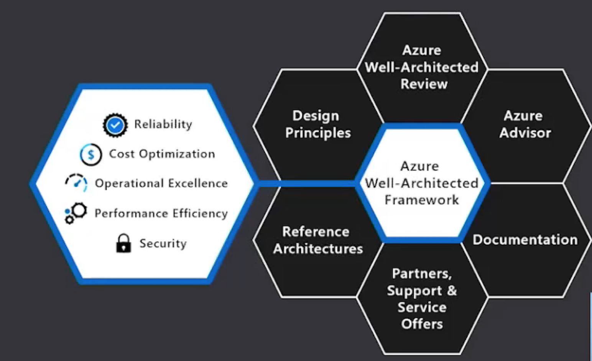
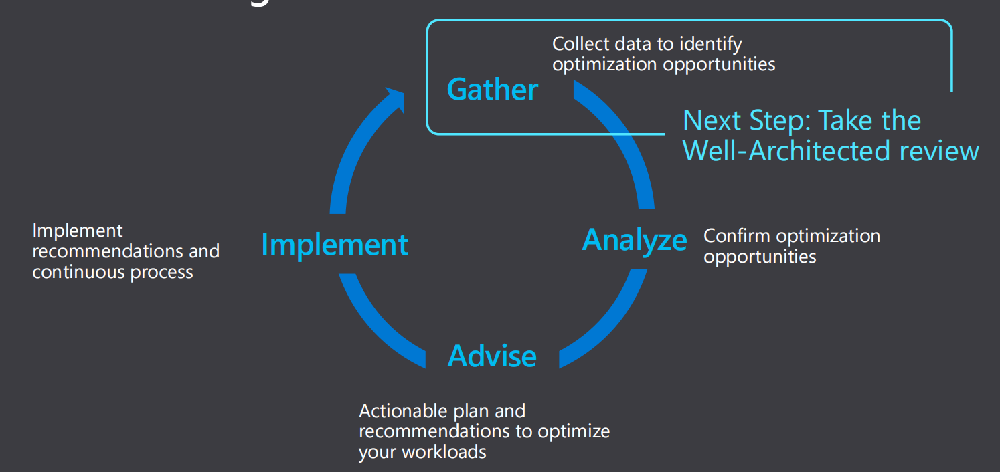

# **Azure Well Architecture Review**

## **1 Run Well-Architected cloud workloads-to create value**

### Invest in **these actions**:

* **Manage** budget
* **Improve** workloads security
* **Increase** incident response
* **Streamline** internal processes
* **Find** costly mistakes
* **Enhance workload** performance

**To avoid these consequences:**

* Expenses, losses
* Trust
* Damages

### **Well-architect—optimize workloads for performance**

* **Build workloads** with confidence with **proven best practices**
* **Design performant workloads** using deep technical guidance
* **Optimize workloads** with actionable focus areas

### **Build and manage high-performing workloads**

### Building well-architected workloads — is a **shared responsibility**

* **Customer application**

Customer **app** or **workload**, built on the Azure platform

* **Platform features**

Optional Azure capabilities **a customer enables** – to ensure security, reliability, operability, performance

* **Platform foundation**

Core capabilities **built into the Azure platform** – how the foundation is designed, operated, and monitored

### **Overcoming** workload **quality inhibitors**

**Cost Optimization**

* No cost and usage monitoring
* Unclear on underused / orphaned resources
* Lack of structured billing  management
* Budget reductions from lack of support for cloud adoption by leadership

**Operational Excellence**

* No rapid issue identification
* No deployment automation
* No communication mechanisms & dashboards
* Unclear expectations and business outcomes
* No visibility on root cause for events

**Performance Efficiency**

* Unclear on resiliency capabilities for improved architecture design
* Lack of data back up practices
* No monitoring of current workload health
* No resiliency testing
* No support for disaster recovery

**Security**

* No access control mechanism (authentication)
* No security threat detection mechanism
* Lack of security thread response plan
* No encryption process

### Best practices to **drive workload quality**

**Cost Optimization**

* Azure Hybrid Benefit
* Reserve Instances
* Shutdown
* Resize
* Move to PaaS

**Operational Excellence**

* DevOps
* Deployment
* Monitor
* Processes & cadence

**Performance Efficiency**

* Design for scaling
* Monitor performance

**Reliability**

* Define requirements
* Test with simulations & forced failovers
* Deploy consistently
* Monitor workload health
* Respond to failure & disaster

**Security**

* Identity & access management
* Infra protection
* App security
* Data encryption & sovereignty
* Security operations

### **How do you get started?**

Optimize **existing** workloads

* **Identify optimization opportunities** with the Azure Advisor Score
* **Understand necessary changes** or past incident occurrences
* **Review technical guidance** of Well-Architected Framework
* **Consider architecture design tradeoffs** to achieve business goals
* **Define & implement** technical **recommendations**
* **Implement workload optimizations** on a **regular cadence**

### **Design & deploy new workloads**

* **Map workload architectures** across business priorities
* **Review technical guidance** of Well-Architected Framework
* **Assess workload architecture design** with 
the **Well-Architected Review**
* **Consider architecture design tradeoffs** to achieve business goals
* **Build, deploy and manage Well-Architected, 
optimized workloads** on Azure

### **Optimize existing workloads - Process**

### **Using the Azure Well-Architected Review**

[https://docs.microsoft.com/en-us/assessments/?mode=pre-assessment&id=azure-architecture-review&session=local](https://docs.microsoft.com/en-us/assessments/?mode=pre-assessment&id=azure-architecture-review&session=local)

## **Security Pillar**

**Azure Security**

* **Operations**： Security operations that work for you
* **Technology**： Enterprise-class  technology
* **Partnerships**： Partnerships for a heterogeneous world

### **Build and manage proactively secured workloads**

> Security provides principles to **protect, detect, and respond to threats** across your Azure environment.

**Build upon a secure foundation**

* Design assuming workload failure with **multi-layer protection controls**
* Build workloads **using zero-trust principles** in both IaaS and PaaS
* Embrace Azure’s **security investments, resources**, and **compliance certifications**

### **Proactively stay secure with native controls**

* Continuously manage your workload security from a single pane of glass with **Azure Security Center.**
* Protect your workloads from malicious attacks with cloudnative **Azure Web Application Firewall**
* Manage identity and access for your workload with **Azure Active Directory**

### **Detect and respond to threats**

* Leverage large-scale intelligence from decades of Microsoft security experience to work with the **Microsoft Intelligent Security Graph**, collected from 8 trillion threat signals analyzed daily
* Embrace automation with **Azure Defender to get threat protection** for your workload
* Establish procedures to **identify and mitigate threats for your workloads with Azure Sentinel**