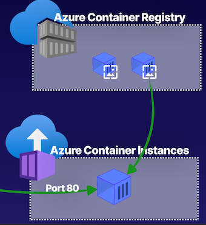

# 10 Web Apps and Containers

## Creating an App Service Plan

App Service plan defines a set of computing resources and the features that are available to a web application that is running on this App Service plan.

An App Service plan is comprised of various components, and these are: 

* The region where we want to deploy our application, the number of virtual machines that is running under a plan, 
* The size of the virtual machines that are running under the plan, 
* The pricing tier that we have selected for our App Service plan. And this can be **Free, Shared, Basic, Standard, one of the Premium tiers, or Isolated, each with their own feature**s and compute resource availability for web applications running on our App Service plan.  

### **What Is an App Service Plan?**

**App Service Plan**

An App Service plan defines a set of compute resources for a web app to run on

**Pricing Tier**

Free, Shared, Basic, Standard, Premium, PremiumV2, PremiumV3, and Isolated

**Size of VMs**

The size of virtual machine instances (Small, Medium, Large)

**Number of VMs**

The number of virtual machine instances running under a plan

**Region**

Azure geolocation where app is deployed (e.g. East US, West US, South Central US, etc.)

### **App Service Plan Compute Types**


The pricing tier of an App Service plan determines the features you get and what you pay. There are three core compute types across the plans.

**Shared**

Less expensive

Run apps on the same VM as other apps, including apps of other customers. (Cannot scale out because of shared compute.)


**Dedicated**

Run only apps using the same App Service Plan on a dedicated VM. (Isolated compute.)

**Isolated**

Run apps using dedicated VMs and dedicated VNets. (Isolated compute and networking.)

So it provides us the isolated computing, so that we have scaling, and provides us isolated networking for our web applications running on this type of compute type App Service plan


### **Traditional vs. App Service**

**Traditionally**, data center; 

* we would have server racks; 
* On these server racks would exist virtual machines 
* Compute resources that host our solution. 

Load balancer that use to be one endpoint for our users, and then the traffic is then balanced between this load balancing endpoint to the backend solution.

<mark>we have to administer and manage the underlying hardware. </mark>


* Administer and manage hardware 1
* Manage patching and security 2
* Manage load balancing

App Service plan only think of is the App Service plan to determine the compute resources and features we want available.


### Traditional vs. App Service

* Managed infrastructure 1
* High availability
* Scalability 3


Traffic is going to be automatically balanced because our solution is running on this underlying VM. 

**We don't have to manage any infrastructure, it is a highly available solution, and it provides scaling features**


 
 
### Demo

**Create Web App Service**

Prod


Dev


Networking


Scale up


Scale out


### Exam Tips

**1 App Service Plan**

A plan that defines the compute resources and available features for a web app.


**2 App Service Plan Compute Resources**

Pricing tier, size of VM instances, number of VM instances, and region.

**3 App Service Plan Compute Types**

Shared, dedicated, and isolated. Each provides a different level of compute isolation, network isolation, and features like scaling.

**4 App Service Plans and Web Apps**

Provides a Platform as a Service (PaaS) to configure and host applications, rather than managing infrastructure. You just manage a few configuration details and your code.


### Summary from chatgpt

1. App Service Plan Overview:
   - An App Service plan defines the computing resources and features available to a web application running on the plan, comprising components such as region, number and size of virtual machines, and selected pricing tier (Free, Shared, Basic, Standard, Premium, or Isolated).

2. Compute Types in App Service Plans:
   - Shared compute type allows running apps on the same virtual machine as other apps, offering cost-efficiency but limited scalability due to shared compute.
   - Dedicated compute type enables running multiple applications on the same App Service plan with isolated compute, providing scaling capabilities at a higher cost.
   - Isolated compute type is the most expensive, offering dedicated virtual machines and networking for web applications, ensuring isolated compute and scaling.

3. Comparison with Traditional Deployment:
   - Traditional deployment involves managing underlying hardware, patching, and load balancing for applications, whereas an App Service plan abstracts these concerns, allowing simplified deployment and management of web apps with underlying virtual machines.

4. App Service Plan Creation in Azure Cloud Sandbox:
   - The demonstration in Azure Cloud Sandbox showcases step-by-step creation of an App Service plan, including resource group selection, operating system choice (Linux or Windows), region selection, and selection of pricing tier for compute resources and features.

5. App Service Plan Management and Features:
   - App Service plan settings provide options for managing apps running on the plan, file system storage, networking integrations, and scaling capabilities such as scaling up to different plans, scaling out manually, or enabling autoscaling.

6. Key Takeaways for AZ-104 Exam:
   - Understanding the role of App Service plans in defining compute resources and features for web applications in Azure.
   - Familiarity with the types of compute available in App Service plans (Shared, Dedicated, Isolated) and their respective capabilities and cost considerations.
   - Knowledge of the abstraction provided by App Service plans compared to traditional deployment, simplifying infrastructure management for web applications.
   - Practical experience in creating and managing an App Service plan in Azure Cloud Sandbox, including resource group selection, operating system choice, region selection, and pricing tier configuration.

Certainly! Here are some additional exam-specific details related to Azure App Service plans:

7. **Scaling in App Service Plans:**
   - Understanding scaling options is crucial for the AZ-104 exam. App Service plans offer manual scaling options where you can change the instance count manually, and autoscaling, allowing Azure to automatically adjust the instance count based on predefined rules and metrics.

8. **Cost Management and Monitoring:**
   - AZ-104 exam candidates should be familiar with cost management features in App Service plans, including options to set budgets, analyze cost trends, and configure alerts for cost overruns. Additionally, monitoring and logging capabilities for App Service plans, such as integration with Azure Monitor for performance and usage insights, are important areas to study.

9. **Security and Compliance Considerations**:
   - The exam may cover security aspects related to App Service plans, including features for SSL certificates, custom domains, and the integration of Azure Active Directory for authentication and authorization. Awareness of compliance standards such as GDPR, HIPAA, and ISO within the context of Azure App Service plans is also valuable.

10. **Availability and Disaster Recovery:**
   - Knowledge of high availability and disaster recovery options in App Service plans is essential. This includes understanding how deployment slots can be used for staging and testing, and how traffic management and failover can be configured for production environments.

11. Integration with Azure Services:
   - The AZ-104 exam may cover integrations with other Azure services, such as Azure SQL Database, Azure Storage, Azure Functions, and Azure Active Directory. Understanding how App Service plans can work in conjunction with these services for data storage, processing, and user authentication is important for the exam.

## Creating Web Apps

### Web App Service Features

**Managed Infrastructure**

No need to patch, maintain, implement, or configure underlying infrastructure components with this Platform as a Service (PaaS)

**Highly Available**

Azure App Service runs apps on multiple nodes to provide high availability

**Autoscaling In/Out**

Scaling capabilities similar to scale sets ensure you can meet the traffic demands of your application

**Development Focused**
 
Development of application code is the focus for web app service deployments

**Deployment Slots**


CI/CD DevOps provides features such as staging slots for deployments, e.g. production slot and staging slot.

> For example, we could have a production slot and a staging slot and we can swap these slots whenever we're ready to deploy what is in staging to production


**Azure Service Integration**

App Service integrates several Azure services, such as Azure AD as an identity provider or VNets for connecting App Service to resources within a virtual network

**Integration with other Azure services with our web applications, such as the ability to use Azure AD as an identity provider, the ability to use virtual networks for connecting to our App Service and integrating it into a virtual network, and the ability to provide hybrid connections for our on-premise environments to our App Service. **

### Web App Architecture


Than traditional on-premise methods of deploying an application solution, with Web Apps, we simply have our App Service plan, and inside of that App Service plan, we're going to deploy our web application. 

Our web application is going to have underlying compute nodes that we don't have to manage because they're going to be managed for us, providing us a Platform as a Service to host our application. 

We also can configure database solutions to work with our web application by **using the database connection strings for our web app in its configuration details**. 

There's various methods of deploying an application, such as deploying with a zip file, using GitHub Actions, 

### Demo 

**Create WebApp**


**SKU**


`https://cloudchasewebappdemo.azurewebsites.net/`


**Deploy**

```
$rg = (Get-AzResourceGroup).ResourceGroupName

$rg
1-a0fb75dl-playground-sandbox

$appname = "cloudchasewebappdemo"

$appname
cloudchasewebappdemo

dotnet new muc -o demowebapp
```


```
dotnet publish -o pub
```


```
/home/cloud/demowebapp> ls
```


```
az webapp deployment source config-zip
>>  --src ./site.zip `
>> --resource-group $rg `
>> --name $appname
```


### Exam Tips

**Web Apps**

**Application Runtime**

Host an application using a specific runtime that is selected as part of the provisioning process.

**Public Accessibility**

Web Apps are publicly accessible by default, and can be accessed using the domain provided to you by Azure.

**Publishing Tools**

Publish your application code to web apps using various publishing tools including Azure DevOps, GitHub, Zip file, SCM, etc.

**Database Support**

Connect your database to your web app using a connection string.

### Chatgpt from summary


From the provided article, we can extract and summarize the following key points relevant to the AZ-104 exam:

1. Web Apps Overview:
   - web apps provide a managed infrastructure, offering Platform as a Service (PaaS) to run applications without the hassle of patching, implementing, or configuring underlying infrastructure components.
   - The availability of multiple nodes (virtual machines) in the App Service Plan ensures high availability for running web applications.

2. Features of Web Apps:
   - Autoscaling capabilities are available in the right type of App Service Plan, allowing scaling in and out based on traffic demands.
   - Web apps are development-focused and not serverless, being suitable for deploying application code in a Platform as a Service environment.
   - Deployment slots provide staging environments for continuous integration/continuous deployment (CI/CD) workflows.

3. Integration with Azure Services:
   - Web applications can integrate with various Azure services, including Azure Active Directory (Azure AD) for identity management, virtual networks for network integration, and hybrid connections for on-premises integration.

4. App Service Plan Creation in Azure Cloud Sandbox:
   - A demonstration in Azure Cloud Sandbox showcases the creation of a web application within an App Service Plan using Azure Cloud Shell, with details on specifying the runtime stack and operating system, creating App Service Plans, and configuring deployment options.

5. Deployment of .NET Application to Web App:
   - The demonstration covers the entire process of creating a .NET application, publishing and zipping the application, and deploying it to the web application using Azure Cloud Shell commands.

6. Azure Cloud Sandbox and Deployment Options:
   - The demonstration emphasizes the use of Azure Cloud Sandbox for practical hands-on experience in creating and deploying web applications, enabling candidates to apply this knowledge in real-world scenarios.

7. Runtime and OS Selection:
   - Understanding how the runtime stack selection affects the operating system choice for web applications is essential for creating and hosting specific runtimes on the web apps.

8. Publishing Options:
   - The demonstration highlights various publishing methods, including zip deployment, Azure DevOps, GitHub, and source control management, offering exam candidates insight into different deployment approaches available for web applications.


9. Scaling and Performance:
   - As part of the AZ-104 exam, understanding the different scaling options for web apps, such as scaling up by changing the pricing tier of the App Service Plan, or scaling out by configuring autoscaling rules, is important. Additionally, candidates should be familiar with performance monitoring and optimization techniques for web applications in Azure.

10. Deployment Slots and Testing:
   - The article mentions the use of deployment slots in Azure App Service for creating staging environments. Understanding how to use deployment slots as part of a deployment and testing strategy is crucial for the exam. Candidates should know how to configure and manage deployment slots, as well as how to swap them as part of a release process.

11. Security and Identity Management:
   - Azure AD integration for authentication and authorization of web applications is a key topic for the AZ-104 exam. Candidates should understand how to configure Azure AD authentication for web apps, including setting up user authentication and access control using Azure AD.

12. Network Integration:
   - The integration of web applications with Azure Virtual Networks for secure access to on-premises resources is a significant aspect of the exam. Candidates should be familiar with configuring network integration for web applications and understanding how to secure traffic between the web app and other Azure resources or on-premises systems.

13. Azure Cloud Shell and Command Line Deployment:
   - The use of Azure Cloud Shell for managing web applications is also relevant to the exam. Understanding how to use Azure Command Line Interface (CLI) commands or PowerShell to manage and deploy web applications is an essential skill for the AZ-104 exam.

14. Monitoring and Troubleshooting:
   - Monitoring the performance and availability of web applications in Azure, as well as troubleshooting common issues, are important areas of knowledge for the exam. Candidates should understand how to use Azure Monitor and Application Insights for monitoring web app performance and diagnosing issues.

## Configuring Web Apps

### Configuration Options

**Custom Domain**

Provide a custom domain to be used by the web application. For example, www.abc.com.

**Scaling**

Specify scaling options to scale up/scale out compute resources for your web apps.


**Deployment**

Deploy applications using DevOps strategies like deployment slots for a staging slot and a production slot

**Network**

Manage network settings and integration by doing things such as connecting web apps with VNets, CDN, etc

### Web App Custom Domain


Using custom domains, **rather than using the Azure-provided domain name**, which is our `appname.azurewebsites.net`

`appname.azurewebsites.net`, which is our Azure-provided domain name. Don't want our users to access this, because **it's not a common name add an A record and assign that A record the value of the public IP address of our web application.** A

Use the Azure-provided TXT record, and this TXT record is going to validate our ownership of this domain. 

### Web App Scaling


* Scale Up Compute
* Scale Out Compute

Like virtual machine scale sets, **scale out compute resources to meet that demand. And when that demand decreases, can scale back in, so that are more appropriately sharing the compute resources** with the web applications that are running on the same App Service plan. 

Scale up our compute resources for our web application by upgrading our App Service plan to provide more compute resources and more features for our web app. 


### Web App Deployment Slots


* Swap Deployment Slots
* Secondary Web App

Using deployment slots, can create slots that will help us deploy our applications, providing some DevOps-like strategies. 

For example, our application can be running in a production slot, and this is the application our end users are going to access. And then we have a **staging slot**, and this is **going to provide a secondary web app resource that's not going to cost us anything, and we're going to stage new versions of our application here**. 

Ready to go to production, then push them to production by swapping these slots here, and staging will go to production and production will go to staging. 

### Web App Network Settings


* Isolated Only 
* VNet Integration

We can manage the **integration with virtual networks for our web applications and manage the integration with our on-prem environments using what is known as hybrid connections**.

Azure CDN to provide our applications to the globe and **provide geographically-specific and unique experiences**


Deploying a web app into a virtual network is something that is an isolated compute type-only feature. And then also can use virtual network integrations should not be using an isolated compute type for our App Service plan.

### Web App backup


* App Configuration
* File Content
* Database Connection


Back up our web applications using full archival backups or our incremental point-in-time restore snapshots that are going to be stored in a storage account via the Blob service as an actual blob


### Demo

1.Deployment slots


2.**Deployment Center**


3.Configuration

* **Connection strings**: Connection strings are encrypted at rest and transmitted over an encrypted channel.
* **Application settings**: Application settings are encrypted at rest and transmitted over an encrypted channel.


4.Add an identity provider


5.Backups

* snapshots
* backup


6.Add custom domain


7.TLS/SSL settings


7.Notework settings


8.Auto Scale up


9.Manual scale


### Exam Tips


* **Scaling**: Limited by pricing tier and compute type.
* **Deployment**: Used for staging applications for a swap.
* **Network**  Web App is public by default, and can be deployed into or integrated with a VNet
* **Backup**: Blob backups of app configs, file content, and database connections


### Key summary from Chatgot

Key points and knowledge for the AZ-104 exam extracted from the article:

1. Custom Domain:
   - Understanding the use of custom domains to provide memorable domain names for web applications in Azure rather than using Azure-provided domain names.
   - Knowledge of configuring A records and TXT records in the DNS zone of the DNS provider to associate the custom domain with the public IP address of the web application.

2. Scaling:
   - Knowledge of scaling options available for web applications, including scaling out compute resources within the App Service plan and scaling up by upgrading the App Service plan to provide more compute resources and features.

3. Deployment Slots:
   - Understanding the use of deployment slots to deploy applications, enabling DevOps-like strategies with a staging slot and a production slot.
   - Insight into swapping deployment slots for easy transition between staging and production environments.

4. Network Configurations:
   - Understanding integration with virtual networks for web applications and the use of hybrid connections to integrate with on-premises environments.
   - Familiarity with Azure CDN for content delivery and providing geographically-specific experiences.

5. Backup Configurations:
   - Knowledge of creating backups for web applications, including full archival backups and incremental point-in-time restore snapshots stored in a storage account as blobs.

6. Use of Azure Cloud Sandbox:
   - Practical hands-on experience in the Azure Cloud Sandbox for visualizing and understanding web app configuration options and settings.

7. Deployment and Configuration Options:
   - Familiarity with various deployment methods such as zip deployment, FTP, GitHub, Bitbucket, LocalGit, Azure Repos, and continuous integration/continuous deployment (CI/CD).
   - Understanding environment variables, connection strings, and authentication options for web applications.

8. TLS and SSL Binding:
   - Knowledge of configuring TLS and adding SSL certificates to ensure the security of web applications and enabling access over HTTPS.

9. Networking Security:
   - Ability to define access restrictions and manage rules to restrict access to IP pools for web applications to enhance security.

10. Scaling Policies:
    - Understanding scaling policies to allow web applications to scale out within the confines of the App Service plan, along with the ability to specify scaling policies for web applications.

11. Compliance and Security Features:
    - Understanding how Azure App Service provides compliance certifications, such as ISO, SOC, and PCI DSS, to ensure regulatory compliance and adherence to industry standards.
    - Knowledge of integrating Azure Key Vault with web applications to securely store and manage sensitive information, such as connection strings and certificates.

12. Application Insights Integration:
    - Familiarity with integrating web applications with Azure Application Insights to monitor the application's performance, availability, and usage, and gathering insights for debugging and optimization.

13. Auto-scaling:
    - Understanding auto-scaling for web applications, enabling automatic adjustment of compute resources based on predefined metrics like CPU percentage, memory usage, or custom metrics.

14. WebJobs and Azure Functions:
    - Understanding the use of WebJobs and Azure Functions for executing background tasks, processing queues, and handling event-driven scenarios within web applications.

15. Continuous Integration/Continuous Deployment Activities:
    - Awareness of integrating web applications with Azure DevOps for managing the application's lifecycle, including build and deployment pipelines, release management, and monitoring.

16. Authentication and Authorization:
    - Understanding the various authentication and authorization options provided by Azure Active Directory, such as Azure AD integration, OAuth, and OpenID Connect for securing web applications.

17. Monitoring and Logging:
    - Familiarity with configuring application logging, implementing log retention policies, and using Azure Monitor to create custom alerts and dashboards for web application monitoring.

18. Disaster Recovery and High Availability:
    - Knowledge of configuring High Availability and Disaster Recovery (HADR) options for web applications, including regional failover and backup/restore strategies.


## Describing Containers in Azure

### What Are Containers?

**Container**
 
A container is a unit of software. This unit consists of code, its dependencies, and configurations to be shipped and run anywhere.


* Docker file, and this will define the code, the dependencies, and the configurations
* Use Docker file to build what is known as a container image. 
	* container image is a lot like a operating system image
* Store the container images in what is known as a container registry(Azure Container Registry) 
* Push a container image into our Azure Container Registry, and this will store it, and this repository then can be used to deploy containers to what is known as a container host. 
* Docker is also a container host, as well as a tool to build containers. But in Azure's case, **we have Azure Container Instances and this is where we push our container images to host an instance of our container itself**.


### What Are Containers?

* **Dockerfile**

A definition of all code and dependencies in a container solution


* **Container Image**

A template of a container built from a Dockerfile

* **Container**

An instance of a container image running.

* Container Host

A platform for running container instances.

### Container Development Concepts


With containers, we can create our applications and we can create what is known as a container image, which is going to have the fully-built solution with the code, the dependencies, and the configurations for running our application. 


### Demonstration

**Create a Container**

Creating containers follows a similar process regardless of where they are hosted.

**Create a Container Registry**

Create the Azure Container Registry that will act as the repository.

**Push Container to Registry**

Push the container image to Azure Container Registry, which is a repository of container images.

```
$ls
Dockerfile
index.html


$cat Dockerfile
FROM nginx:alpine
WORKDIR /usr/share/nginx/html
COPY ./index.html ./
```

```
$cat index.html

<!DOCTYPE html>
<html>
<body>
<h1>Hey Azure Container!</h1>
<p>To learn more about containers checkout our Containers Learning Path</p>
</body>
</html>
```

```
$docker build --tag containerdemo .

$docker run -p 1234:80 containerdemo
```

**Create ARC Registry**


**ARC Access keys**


```
docker login cloudchaseregdemo.azurecr.io -username cloudchasereqdemo
Password:
NARNING! Your password will be stored unencrypted in /home/cloudchase/.docker/config.json.
Configure a credential helper to remove this warning.
See https://docs.docker.com/engine/reference/commandline/login/#credentials-store

Login Succeeded
```

```
$ docker tag containerdemo cloudchasecloudchase@cloudchaseregdemo.azurecr.io/myimages/containerdemo:latest
```
```
docker push cloudchasecloudchase@cloudchaseregdemo.azurecr.io/myimages/containerdemo:latest
```


### Key Takeaways

**Development**

Create and build a container so it can be shipped.

**Registry**

Manage a container registry (repository) of container images in a single place. For example, Azure Container Registry (ACR)

**Host**

Host a container image as an instance of a container on a hosting service. For example, Azure Container Instances (ACI)


### Summary from chatgpt

Here are the key points and knowledge for the AZ-104 exam extracted from the provided article:

1. Docker and Containerization Concepts:
   - Understanding Dockerfile, which defines code, dependencies, and configurations for creating container images.
   - Knowledge of container image as a template for creating instances of containers, and its similarity to an operating system image.
   - Storing container images in a container registry, such as Azure Container Registry, for repository and deploying containers to a container host.

2. Azure Container Services:
   - Understanding Azure Container Instances as the container hosting platform on Azure, used for hosting instances of container images.

3. Container Development:
   - The traditional process of coding applications and potential issues with differing environments and dependencies.
   - The use of containers to package applications, including code, dependencies, and configurations into a container image, enabling consistent application running across different environments.

4. Demonstration of Container Creation and Deployment:
   - Demonstrating the process of creating a container using Docker on a local Ubuntu virtual machine, including building a container image and running a container instance using Docker commands.

5. Use of Azure Container Registry:
   - Creation of an Azure Container Registry within the Azure Cloud Sandbox and pushing a container image to the registry using Docker commands.

6. Azure Container Instances:
   - Understanding the use of Azure Container Instances for hosting container images and creating instances of containers from the registry.


7. Container Orchestration:
   - Understanding the need for container orchestration to manage the lifecycle of containerized applications, including scaling, deploying, and networking.
   - Knowledge of Kubernetes as a popular open-source container orchestration platform, and its capabilities for managing containerized applications.

8. Azure Kubernetes Service (AKS):
   - Understanding Azure Kubernetes Service as a managed Kubernetes service provided by Azure, offering simplified deployment, management, and scaling of containerized applications.

9. Deployment of AKS Cluster:
   - The demonstration of creating an AKS cluster within the Azure Cloud Sandbox, using the Azure CLI commands to create a cluster, deploy a sample application, and expose it to the internet.

10. Container Security:
    - Awareness of container security best practices, including limiting container capabilities, defining resource limits, and using secure images and container runtimes.

11. Monitoring and Logging:
    - Understanding the importance of monitoring and logging in containerized environments and the use of tools such as Azure Monitor and Azure Log Analytics for monitoring and managing containerized applications in Azure.

## Using Azure Container Instances for Containers

### Describing Azure Container Instances

It is a container hosting service like Docker, we can use this to host instances of containers. 

**Azure Container Instances (ACI)**

Azure Container Instances is a container hosting service, much like Docker.



* We can pull container image down and host it as a container instance in the Azure Container Instances service
* Make it accessible via a port such as port 80. 
* Access that container solution using that port, depending on whether or not it's a public or private solution.


### Defining Container Groups

A collection of containers that share a **lifecycle, resources, local networking, and storage**.


* container group that has one container
* a multi-container container group. 

Isolated from one another because they're going to have separate lifecycles and underlying resources, **such as their compute and even things like storage**. 


### **Container Storage**

Can use Azure file shares for persistent data storage.


<mark>Storage for our containers is ephemeral by default</mark> 

when we deploy a container solution, but we can make it persistent by **mounting an Azure file share to our container solution**, and this allows us to have that **data persistently, even whenever the lifecycle of our containers ends**. 

### Container Networking

Can deploy containers as either private or public resources.


For example, our Azure Container Instance container group could be deployed into a virtual network, making it a privately accessible resource with just a private IP.

Deploy it using a public IP address, making it publicly accessible via that IP, and it'll also get a fully qualified domain name that we can use to access the resource


### Demonstration

**Create a Container Instance**


**Restart policy**


**Create a Container Group**

Create a container group using the image stored in the Azure Container Registry (ACR).

**Deploy a Multi-Container Solution**

Using a JSON file to create a multi-container container group

**azuredeploy.json**

```
{
    "$schema": "https://schema.management.azure.com/schemas/2015-01-01/deploymentTemplate.json#",
    "contentVersion": "1.0.0.0",
    "parameters": {
      "containerGroupName": {
        "type": "string",
        "defaultValue": "myContainerGroup",
        "metadata": {
          "description": "Container Group name."
        }
      }
    },
    "variables": {
      "container1name": "aci-tutorial-app",
      "container1image": "mcr.microsoft.com/azuredocs/aci-helloworld:latest",
      "container2name": "aci-tutorial-sidecar",
      "container2image": "mcr.microsoft.com/azuredocs/aci-tutorial-sidecar"
    },
    "resources": [
      {
        "name": "[parameters('containerGroupName')]",
        "type": "Microsoft.ContainerInstance/containerGroups",
        "apiVersion": "2019-12-01",
        "location": "[resourceGroup().location]",
        "properties": {
          "containers": [
            {
              "name": "[variables('container1name')]",
              "properties": {
                "image": "[variables('container1image')]",
                "resources": {
                  "requests": {
                    "cpu": 1,
                    "memoryInGb": 1.5
                  }
                },
                "ports": [
                  {
                    "port": 80
                  },
                  {
                    "port": 8080
                  }
                ]
              }
            },
            {
              "name": "[variables('container2name')]",
              "properties": {
                "image": "[variables('container2image')]",
                "resources": {
                  "requests": {
                    "cpu": 1,
                    "memoryInGb": 1.5
                  }
                }
              }
            }
          ],
          "osType": "Linux",
          "ipAddress": {
            "type": "Public",
            "ports": [
              {
                "protocol": "tcp",
                "port": 80
              },
              {
                  "protocol": "tcp",
                  "port": 8080
              }
            ]
          }
        }
      }
    ],
    "outputs": {
      "containerIPv4Address": {
        "type": "string",
        "value": "[reference(resourceId('Microsoft.ContainerInstance/containerGroups/', parameters('containerGroupName'))).ipAddress.ip]"
      }
    }
  }
```

```
PS /home/cloud> code azuredeploy.json
```

```
az deployment group create `
--resource-group (Get-AzResourceGroup).ResourceGroupName `
--template-file azuredeploy.json
```

**Update the Container Group**

Update the container group with a FQDN.


### ACI Feature Highlights

* **Scaling/Sizing**

No autoscaling options available, manual redeployment of a container group is required. You determine CPU, memory, and GPU

* **Storage**

Persistent storage is available by mounting a storage volume. For example, an **Azure file share in Azure Files**.

* **Container Groups**

A top-level resource in ACI. A collection of containers that **are on the same host machine and share a lifecycle and resources**.

* **Restart Policy**

Restart of containers is available using policies: **Always, Never, and OnFailure**.


* **Networking**

A container group shares an IP address and fully **qualified domain name (FQDN)**. Ports must be opened for external access. Localhost connectivity by default within the group. **Can deploy as public, private, or none**


* **Environment Variables**

Save plaintext and secure environment variables to be used by a container. For example, a database connection string.


### Summary fomr chaptgpt


Based on the provided article, the key points and knowledge relevant to the AZ-104 exam are as follows:

1. Azure Container Instances Service:
   - It is a container hosting service in Azure, similar to Docker, where container images can be hosted as container instances.
   - It allows the hosting of container instances from a container image stored in the Azure Container Registry.
   - Accessibility of container solutions via public or private ports, depending on the configuration.

2. Container Groups and Lifecycle Sharing:
   - Container groups are collections of containers within the Azure Container Instances service that share the same lifecycle and resources.
   - Container groups can consist of multiple containers, which are isolated from one another with separate lifecycles and resources.

3. Storage and Networking for Containers:
   - Ephemeral storage is the default for containers, but persistent storage can be achieved by mounting an Azure file share to the container solution.
   - Containers can be deployed as either private resources within a virtual network or as publicly accessible resources with a public IP address and fully qualified domain name.

4. Azure Container Instance Deployment:
   - Creation of container instances through the Azure portal, allowing configurations for resource group, container image source, compute size, networking (public or private), restart policies, and environment variables.

5. Multi-container Solutions and Deployment:
   - Ability to deploy multi-container solutions using JSON or YAML files to define the container group configuration.
   - Deployment process involves defining the container group through declarative documents and deploying it using Azure CLI commands.

6. Feature Highlights and Limitations:
   - Determining compute sizing for underlying resources, such as CPU, memory, and GPU, for container groups.
   - Lack of autoscaling features, requiring manual redeployment for scaling.
   - Recognition of container group as the top-level resource, with containers sharing the same resources and restart policy settings.
   - Configuring public or private accessibility for container instances, passing environment variables for runtime use.

7. Integration with Azure Monitor:
   - Azure Container Instances service integrates with Azure Monitor, allowing monitoring of container groups and individual containers.
   - Metrics such as CPU usage, memory usage, and network statistics can be collected and analyzed through Azure Monitor.

8. Azure Resource Manager Templates for Deployment:
   - Azure Resource Manager templates can be used to define and deploy Azure Container Instances and container groups.
   - Templates provide a declarative way to define the resources and their configurations, enabling consistent and repeatable deployments.

9. Troubleshooting and Logging:
   - Container groups' logs, including standard output and standard error, can be accessed for troubleshooting and monitoring purposes.
   - Azure Monitor logs and diagnostic settings can be utilized to capture and analyze container group logs for troubleshooting and auditing.

10. Security Considerations:
   - Azure Container Instances provide secure deployment options, including the ability to deploy to a virtual network for enhanced network security.
   - Integration with Azure Key Vault for securely storing and managing application secrets and keys used by the containerized applications.

11. Pricing and Cost Management:
   - Azure Container Instances pricing is based on the vCPU and memory sizes of the container instances and the duration of their execution.
   - Allocation of resources in the form of vCPUs and memory sizes can impact the cost, and understanding the pricing model is essential for effective cost management.


## Using Azure Kubernetes Service

### Traditional Azure Container Instances (ACI) Solution
 
**ACI Limitations**

Traditional Azure Container Instance solution

* A container group for a frontend, 
* A container group for a logic end, 
* A container group for the data end of a total container solution.


Need to be scaled and managed. This is not a automated feature. This is a manual redeployment in order to scale this container solution. 

**Scalability**

Manual redeployment is required to scale up a container group

**Management**

Orchestrating multi-container container group solutions is cumbersome without an orchestration layer.

Cannot autoscale our solutions with our containers in Azure Container Instance, and we have a tough time managing them because there is no orchestration layer. 

### Kubernetes Container Solution

**Kubernetes Benefits**

**Scalability**： Can easily scale containers to meet demand

**Management**  Provides an orchestration layer for clusters.


Kubernetes container solution is a little bit different than an AKS solution. 

* AKS solution is going to provide us autoscaling for pods and clusters inside of our container instance
* Identity and Access Management through Azure AD integration. 
* Storage volumes through Azure Storage
* Networking options through virtual networks, network security groups, and network policies inside of our AKS container solutions. 

### What Is Azure Kubernetes Service (AKS)?

**AKS**

**What is it?**

Azure Kubernetes Service (AKS) is a serverless platform for Kubernetes. It provides scalable container solutions.

**Why use it?**

AKS abstracts away the management of a Kubernetes cluster by managing most of the deployment and orchestration.

**AKS**

* Autoscaling Pods and Clusters
* **Identity and Access Management** Azure AD Integration
* Storage Volumes: Azure Storage
* **Networking** VNets, NSGs, and  network policies

### Azure Kubernetes Service Features

**Management**

**Autoscaling of clusters and horizontal scaling of pods**. Manage node pool configurations, and Kubernetes versioning and upgrades.

**Identity**

Provide access to AKS cluster using Azure AD identity objects and Role-Based Access Control (RBAC). Provide an identity for the cluster to manage underlying resources.

**Networking**

VNet connectivity integrated via **kubenet or Container Network Interface (CNI).** HTTP app routing available. Manage traffic using network policies.

HTTP app routing capabilities, a lot like we do with our Layer 7 load balancers, such as an application load balancer.

**Storage**

Implement storage volumes that are either static or dynamic.

**Registry**

Store container images in Azure Container Registry, Docker Hub, or other public/private repos. Docker images are supported.

### Azure Kubernetes Service Architecture


* AKS cluster consists of a control plane, which consists of a master node that controls all of the orchestration of the AKS cluster. 
*  Worker nodes, which are our node pools where our containers are actually running. And those containers are put into pods, which are a lot like our container groups. 
*  Provide connectivity to our containers using either the default **kubenet, which is going to provide a network interface to the nodes in our node pools and then**, using NAT-style networking, it will communicate to the backend containers; 
*  or, We can provide networking through **Container Network Interface,** which is going to **give our containers their own network interface and IP address**, so that this network address translation that we get with kubenet doesn't have to happen. 


### Demo

**Create Kubernetes cluster**

* Node size： Standard_DS2_v2
* zone: 3


**AKS-managed Azure Active Directory**

**Configure Kubernetes role-based access control (RBAC) using Azure Active Directory
group membership**. This can be used to control access to specific namespaces inside
your Kubernetes cluster based on a user's membership in specified Azure Active
Directory groups.


**Network configuration**

* The **kubenet networking plug-in** creates a new Vet for your cluster using default values.
* The **Azure CNI** **networking plug-in allows clusters to use a new or existing Vet with customizable addresses**. 
	* Application pods are connected directly to the VNet, which allows for native integration with VNet features.


**Node pools**


**Scale**


**Cluster configuration**


### Summary from Chatgpt

Key points and knowledge relevant to the AZ-104 exam from the provided article include:

1. Azure Kubernetes Service (AKS) Features:
   - AKS provides scalable container solutions with features such as autoscaling, identity and access management through Azure AD integration, storage volumes via Azure Storage, and networking options through virtual networks, network security groups, and network policies.
   - AKS abstracts away the management of Kubernetes clusters, offering management features like autoscaling of clusters and pod horizontal scaling, node pool configurations, and identity management.

2. Comparison with Traditional Azure Container Instances Solution:
   - Azure Container Instances lack features such as autoscaling and an orchestration layer for easy management of container solutions, unlike AKS.
   - Kubernetes Service addresses the limitations of Azure Container Instances by providing scalability and easy management through the use of Kubernetes orchestration.

3. AKS Deployment:
   - Creation of an AKS cluster involves specifying resource group, cluster name, region, node pool configurations, Kubernetes version, multi-AZ deployment, and networking options.
   - Authentication and authorization methods for infrastructure, including the use of Azure AD identities, role-based access control, and integration with Azure Container Registry.

4. Cluster Management and Configuration:
   - Managing node pool configurations, scaling options, and the choice of networking options for AKS clusters, such as using kubenet or Azure CNI.
   - Integration with Azure Container Registry for container image storage and Azure Monitor for container monitoring inside the AKS cluster.

5. Operational Aspects:
   - Management capabilities for upgrading Kubernetes versions, providing autoscaling for compute nodes, and configuring network resources within the AKS cluster.


6. Security and Compliance Considerations:
   - AKS provides features for securing containerized applications, including the use of Azure Policy for enforcing compliance requirements, integration with Azure Security Center for threat detection, and the use of Kubernetes Role-Based Access Control (RBAC) for granular access control.

7. Monitoring and Logging:
   - Integration with Azure Monitor for collecting and analyzing telemetry data from AKS clusters, including performance monitoring, logging, and alerting capabilities.
   - Use of Azure Log Analytics for log aggregation and advanced querying of container logs.

8. Networking and Connectivity:
   - Integration of AKS clusters with Azure Virtual Networks using Azure CNI for better networking performance and control, including the use of network security groups and network policies for enforcing network rules.

9. Deployment Strategies:
   - Understanding deployment strategies such as rolling updates and blue-green deployments for managing updates and releases of containerized applications within AKS clusters, as well as leveraging tools like Helm for managing application packages within the Kubernetes environment.

10. High Availability and Disaster Recovery:
   - Configuring AKS clusters for high availability, including the use of multiple availability zones for redundancy and disaster recovery, and the ability to automate failover and recovery processes.

11. Cost Management:
   - Optimizing costs associated with AKS clusters by utilizing features such as virtual node scaling, right-sizing node pools, and leveraging reserved instances for compute resources.


