# Monitoring

## 1 Using Azure Monitor

### Describing Azure Monitor

**Full-Stack Monitoring**

Azure Monitor is a full‑stack monitoring service inside of Azure that gives us **end‑to‑end monitoring for applications and underlying infrastructure.** 

**Captures metrics and logs on monitored resources.**

* Monitor Azure resources
* Monitor on-premises resources, **such as custom resources;**
* Monitor platform services
* Monitor application code
	* web app service
	* As OS‑level logs and metrics from things like virtual machines with a diagnostics agent enabled on them for guest OS‑level metrics and logs. 

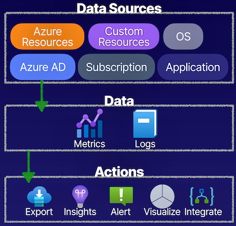

### Metrics vs. Logs

#### **Metrics**

* **Short, time-based data**
* Frequently updated
* **Near real-time data**
* **Alerts based on numeric values**
* Visualization via Metrics Explorer
	* **using Azure Monitor**

#### **Logs**

* L**ong, event-based data**
* Sporadically updated
* **Free-form and/or structured**
* **Stored in Log Analytics workspace**
* Built-in query language (Kusto)

### Monitoring Explained

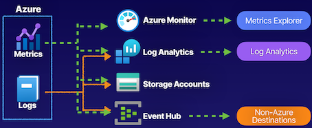

Metrics and logs that we are capturing from monitored resources, and we can take these data sources of metrics and logs and we can actually store them and view them in a few places: 

* **Azure Monitor**
* **Log Analytics**
	* Logs can sent to Log Analytics (Kusto query language)
* **Storage accounts**
	* 	For log archive
* **Event Hub**
	* Send this data outside of Azure, to be able to use it in other tools, to be able to get a deeper understanding of the data. 

### Demo

**Metrics**

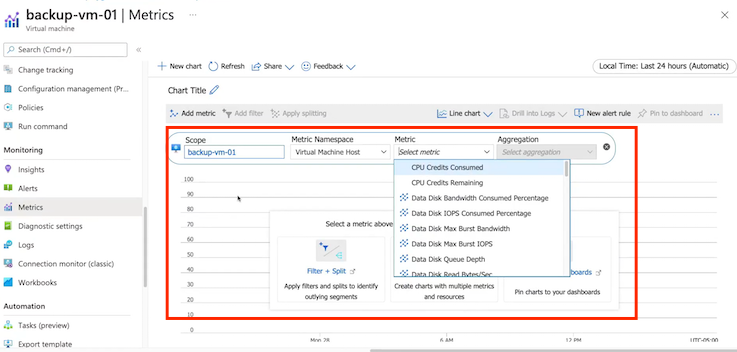

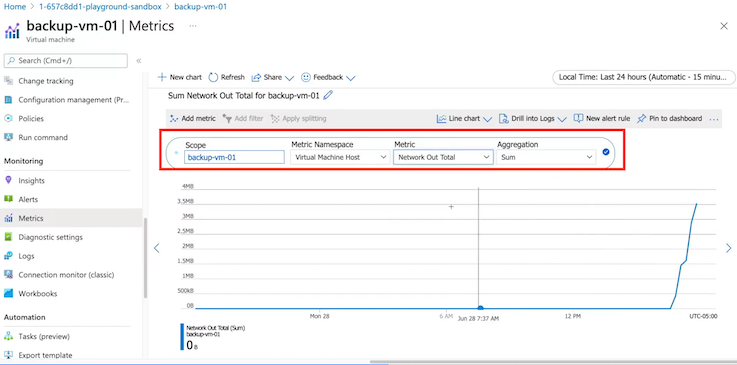

**Diagnostic settings**

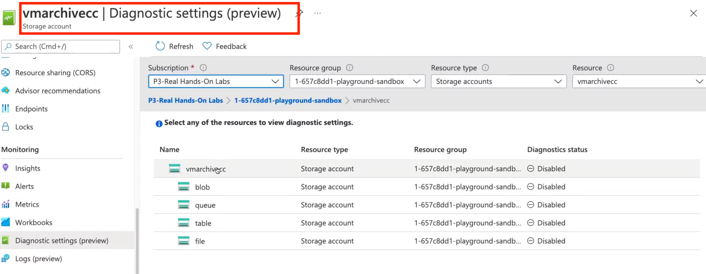

A diagnostic setting specifies a list of categories of platform logs and/or metrics that you want to collect from a resource, and one or more destinations that you would stream them to.

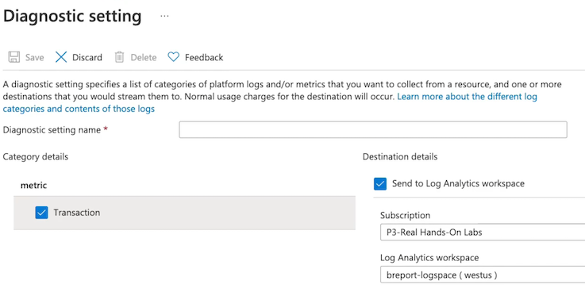

### Key Takeaways

#### **Metrics**

Metrics are gathered on a per-resource basis

How to use metrics?

* **View metrics in Metrics Explorer**
* **Query in Log Analytics**
* **Alert and take action**
* **Export and archive**

#### **Logs**

Logs are not gathered by default by the Azure platform.

How to use logs?

* **Query in Log Analytics**
* Archive
* **Stream to third party**

**Diagnostic Settings**

Define how and where metrics and logs will be stored on a per-resource basis

* Os-level data
* App-level data

### Summary from Chatgpt

1. Azure Monitor:
   - **Azure Monitor is a full-stack monitoring service within Azure that provides end-to-end monitoring for applications and underlying infrastructure**.

2. Metrics vs. Logs:
   - Metrics are short, time-based data, frequently updated, and provided in near real-time. They are used for visualization, alerting, and can be sent to Azure Monitor, Log Analytics, Storage accounts, and the Event Hub.
   - Logs are long, e**vent-based data that can be updated sporadically and can be either free-form or structured.** Diagnostic settings enable the capture of logs, and they can be sent to Log Analytics, Storage accounts for archiving, and the Event Hub.

3. Metric Exploration and Configuration:
   - **The Metrics Explorer within Azure Monitor allows the visualization and selection of specific metrics associated with monitored resources**. It also facilitates metric interpretation and configuration, such as aggregating and scoping to specific resources.

4. **Log Analytics and Diagnostic Settings**:
   - Log Analytics workspace captures and stores logs from diagnostic settings, facilitating the use of the Kusto query language to analyze and derive insights from log data.
   - Diagnostic settings allow the configuration of where metrics and logs are stored on a per-resource basis, **including specifying Log Analytics workspaces, storage accounts for archiving, and streaming to the Event Hub**.

5. **Metric Visualization**:
   - Using the Azure Portal, navigate to the Metrics blade of a specific Virtual Machine resource.
   - In the Metrics Explorer, select the "CPU Percentage" metric and apply a filter to scope the data to the last 24 hours.
   - Visualize the metric by creating a chart that shows CPU usage over time, allowing you to monitor performance trends.

6. **Log Analysis with Kusto Query Language**:
   - Configure a diagnostic setting for the Virtual Machine to send its logs to a Log Analytics workspace.
   - Access the Log Analytics workspace and use the Kusto Query Language (KQL) to query log data related to the Virtual Machine's performance, such as event logs or performance counters.
   - Write a KQL query to analyze the log data, identifying any abnormal events or performance issues.

7. **Diagnostic Settings Configuration:**
   - Within the Azure Portal, configure a diagnostic setting for the Virtual Machine to send its metrics to a specific Log Analytics workspace for long-term analysis and to a storage account for archiving.
   - Ensure that the diagnostic setting captures both performance metrics and specific log categories of interest, such as Windows event logs or system logs.

8. **Alerting and Notification**:
   - Set up an alert rule within Azure Monitor to trigger an alert if the CPU usage of the Virtual Machine exceeds a specified threshold for a sustained period.
   - **Configure an action group to send notifications via email or integrate with Microsoft Teams for alert notifications and possible automated remediation**.

## 2 Setting Up Alerts and Actions
 
### Describing Azure Monitor Alerts

* **Azure Monitor Alerting**

Alerts on signals that prompt you to **take proactive actions and help automate monitoring and diagnostics**

What we can do is actually watch for **signal types inside of these alerts** that we create, where we're **determining metrics, activity logs, and log signals, and providing logic so that we can take action**. 

* **Signal Types**

Metric, activity, and log signals

* **Action Group**

The actions that will take place when an alert has been triggered

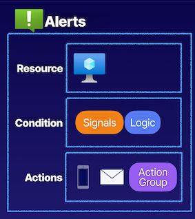

1. An alert rule that we create in **Azure Monitor**, can set it to a specific scope on a resource, such as a virtual machine; 
2. Watch for conditions through signals
3. Provide logic to determine things **such as a virtual machine being restarted**; then can take actions
4. Have some **default actions** that come with our **alert rules**, s**uch as sending emails and SMS**, 
	

### Action Groups

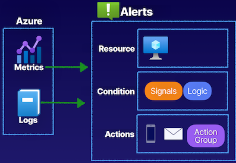

An action group
		
* **run a Logic App**, 
* **Azure Functions**, 
* **run an Azure Automation account**, 
* **webhooks**
* etc.

**Azure Monitor alerting**, it's important for us to understand where this data is coming from for our alerts.

Capturing this data from things like our metrics and our logs that we get through the Azure platform in Azure Monitor. 

**Create an alert**, and this **alert rule that we have is going to be set to a scope of a resource**, have the conditions where evaluating signals and providing logic, and then the actions that we're going to take, **such as the sending of emails and text messages and actually running an action group that gives us access to other features like Logic Apps and Azure Automation.** 

### Demo

What want to do is we want to set up an alert in an action group to be able to determine that this virtual machine has been deallocated and put into a stopped state so that we can send notifications.

**Create Alerts**

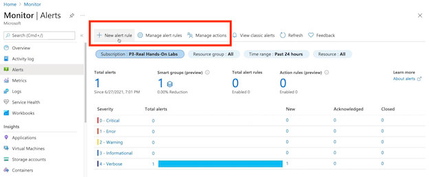

**Filter resource type**

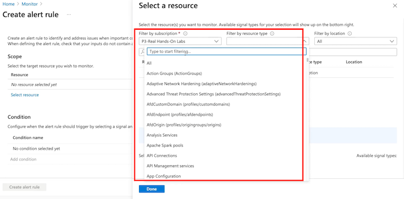

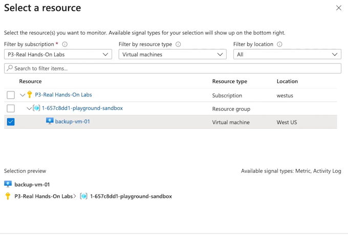

**Select metrics and signal log**

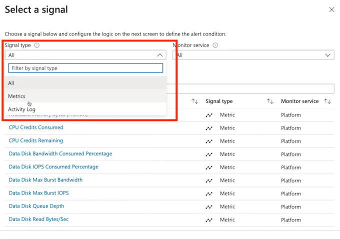

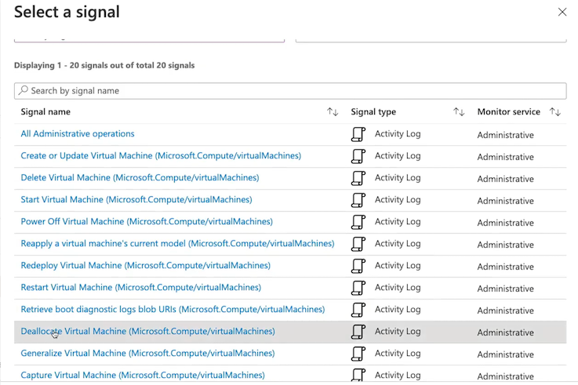

**Create alert rule**

Whenever the Activity Log has an event with Category='Administrative', Signal name='Deallocate Virtual Machine (Microsoft.Compute/virtualMachines).

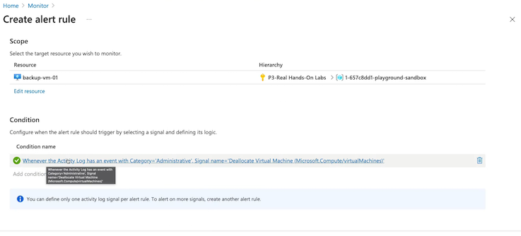

**Create action group**

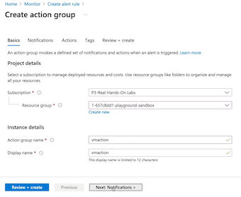

**Create alert rule**

Send notifications or invoke actions when the alert rule triggers, by selecting or creating a new action group. 

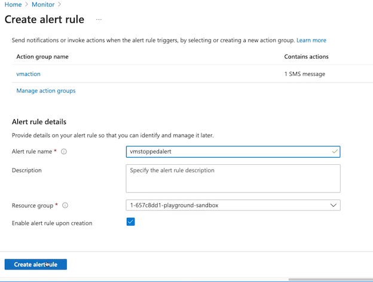

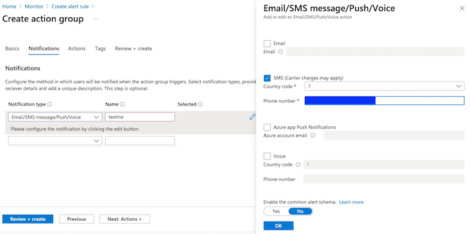

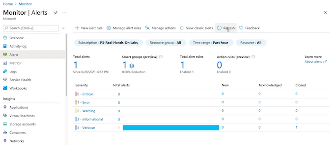

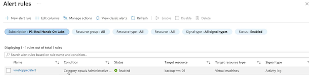

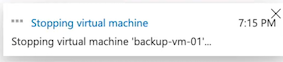

### Key Takeaways

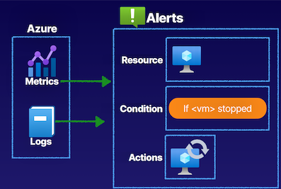

* Setting Up Alerts and Actions, **the data that capturing from Azure, as far as our metrics and our logs like the activity logs** 
* To be able to create alert rules where were going to set the specific scope down to our resource like a virtual machine; 
* **Determine the condition that to use based off of signals, such as if the VM is stopped and put into a deallocated status in the activity log;** 
* then take actions to restart this virtual machine using an action group, **using an action inside of that action group that's going to allow a Automation Runbook to run to perform that restart of the virtual machine**

### Summary from Chatgpt

1. Azure Monitor Alerting and Action Groups:
   - **Azure Monitor provides capabilities to set up alerts and prompt actions based on specific signals. Alerts can be triggered based on metrics, activity logs, and other log signals**.
   - Action groups allow for custom actions to be performed when an alert is triggered, such as **sending notifications, running Logic Apps, Azure Functions, or Automation Runbooks**.

2. **Alert Rule Configuration:**
   - Alert rules are created within Azure Monitor and can be scoped to specific resources, such as virtual machines. 
   - Conditions are defined based on signals, and logic is applied to determine when an alert should be triggered.

3. **Data Sources for Alerts:**
   - Alerts are based on the data captured from metrics and logs obtained from Azure resources. 
   - The activity logs, metrics, and other log signals form the basis for defining conditions and triggering alerts.

4. **Practical Demonstration:**
   - The provided demonstration involves setting up an alert and an action group to monitor the status of a virtual machine. 
   - It includes configuring the alert rule's scope, defining conditions based on activity log signals, and setting up an action group to send SMS notifications and potentially automate the restart of a stopped virtual machine using an Automation Runbook.

5. **Metric Alerts:**
   - Azure Monitor allows you to create metric-based alerts using the metrics data collected from Azure resources such as virtual machines, databases, storage accounts, and more. 
   - You can define specific threshold conditions based on these metrics to trigger alerts.

6. **Log Alerts:**
   - Log alerts are used to trigger actions based on log data obtained from Azure resources. T
   - hese can include activities, errors, or specific events logged by Azure services. Log alerts enable you to create rules based on log data and trigger actions accordingly.

7. **Monitoring and Automation**:
   - Azure Monitor can be integrated with other Azure services such as Azure Automation and Azure Logic Apps. 
   - This integration allows for automated responses to alerts, such as running scripts or workflows in response to triggered alerts.

8. **Diagnostic Settings**:
   - To enable Azure Monitor to capture data for metrics and logs, diagnostic settings need to be configured for each Azure resource. 
   - These settings determine what data is collected, where it is stored, and how it is used for monitoring and alerting purposes.

9. **Scale and Performance**:
   - Understanding how Azure Monitor handles scale and performance is crucial for the exam. 
   - This includes knowing how it can handle monitoring large numbers of resources, and how it ensures efficient and responsive alerting and action processing.

10. **Best Practice**s:
   - It's important to be familiar with best practices for setting up alerting and action groups in Azure Monitor.
   -  This includes considerations such as defining appropriate thresholds, managing alert noise, and implementing effective actions to respond to alerts.

## Configuring Azure Monitor Logs

Log Analytics is a service for aggregating log data in a single pane, where we can **analyze it, visualize it, and query it using the built-in Kusto query language for Log Analytics**. 

Capture data from metrics and logs enabled diagnostic settings to send the data to a Log Analytics workspace that acts as the repository for our data. 

**Get data internally from Azure resources, Azure AD tenants, and subscriptions;** 

Can also get data externally from on-premises resources in hybrid environments, where we're in the cloud and on-prem.

### Describing Azure Monitor Logs

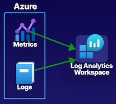

Capture data from **metrics and logs** whenever we have enabled diagnostic settings to send the data to a Log Analytics workspace that acts as the repository for our data. 

**Log Analytics**

A service for aggregating log data in a single pane, **where it can be analyzed, 
visualized, and queried**.

* **Internal Data**

Azure resources, Azure AD tenant, and subscriptions

* **External Data**
 
On-premises resources in hybrid environments

### Components of Log Analytics

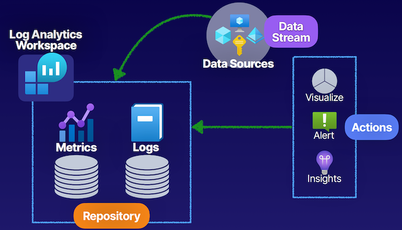

**Log Analytics workspace** acts as the repository for the metrics and logs data that we're capturing whenever we've enabled diagnostic settings to send this data to a Log Analytics workspace. 

**Data from data sources**, such as **Azure AD tenants, subscriptions, resource groups, specific resources that we want to monitor in our Log Analytics workspaces**. 

Keeping all this data in that workspace, a repository of data that can **perform actions such as visualizing, alerting, and capturing insights on this data, as well as querying this data using the Kusto query language**. 

### Demo

**Create Log Analytics workspace**

With Azure Monitor Logs you can easily store, retain, and query data collected from your monitored resources in Azure and other environments for valuable insights. A Log Analytics workspace is the logical storage unit where your log data is collected and stored.

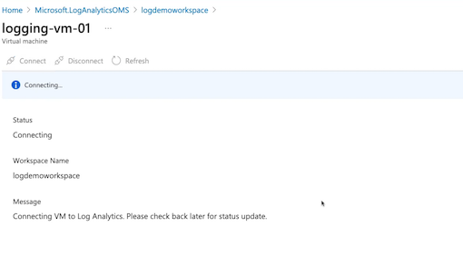

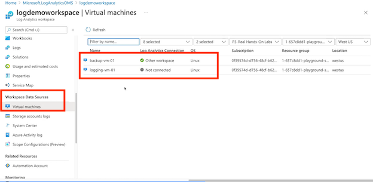

**Get started with Log Analytics**

Log Analytics collects data from a variety of sources and uses a powertul query language to give you insights into the operation of your applications and resources. Use Azure Monitor to access the complete set of tools for monitoring all of your Azure resources.

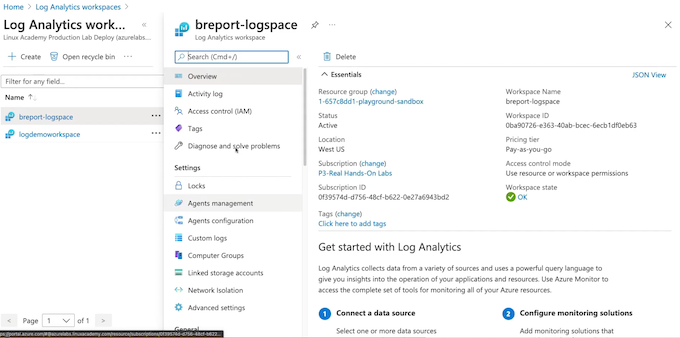

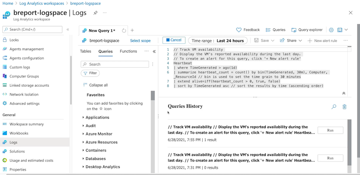

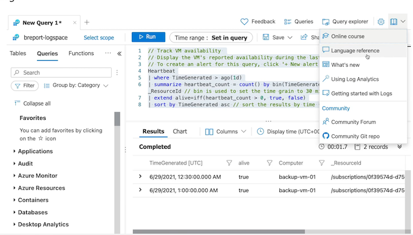

### Key Takeaways

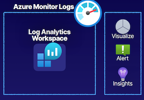

* **Data Sources**

**Azure resources, Azure AD tenant, subscriptions, and on-premises (custom) resources.**

* **Log Analytics Agent**

An extension installed on resources to allow for telemetry to be gathered into the workspace.

1. Configuring Azure Monitor Logs,  our Log Analytics workspace as a repository for us to aggregate data to for our logs and metrics, configure logs inside of our diagnostic settings to send those logs and metrics to a Log Analytics workspace. 
2. Inside of Log Analytics workspace, such as visualize our data, as well as alert on the data that we're capturing. 
3. Insights, such as VMs and Application Insights. 
4. Data sources, such as Azure resources, Azure AD tenants, subscriptions, and even on-prem custom resource
 

### Summary from Chatgpt

1. **Log Analytics and Data Aggregation:**
   - Log Analytics is a service for aggregating log data from various sources into a single pane where it can be analyzed, visualized, and queried using the Kusto query language.
   - Data for log analytics is captured from metrics and logs through diagnostic settings that send the data to a Log Analytics workspace, which serves as the repository for the data.

2. **Data Sources and Components:**
   - Log Analytics captures data from various internal and external sources, including Azure resources, Azure Active Directory (AD) tenants, subscriptions, and hybrid environments with on-premises resources.
   - The components of Log Analytics include the Log Analytics workspace, which acts as the repository for metrics and logs data, and data sources such as Azure resources, resource groups, and specific resources.

3. **Configuring Log Analytics Workspace:**
   - The process of configuring a Log Analytics workspace involves creating it within a specific resource group and region, and connecting data sources like virtual machines to the workspace to capture relevant data.

4. **Querying and Visualizing Data**:
   - Data captured in the Log Analytics workspace can be queried using the Kusto query language to derive insights, analyze performance, and monitor resource availability.
   - Visualization and alerting are also supported within the Log Analytics workspace, allowing for the visualization of data and creating alerts based on the captured data.

5. **Log Analytics Insights**:
   - Log Analytics workspaces can provide special use case-focused insights for specific services, such as virtual machines and Application Insights, enabling a deeper understanding and analysis of the captured data.

7. Diagnostic Settings and Log Collection:
   - Knowledge of how to enable diagnostic settings on Azure resources to send log and metric data to a Log Analytics workspace is crucial for monitoring and aggregation.
   - Understanding the types of data that can be captured and collected, such as performance metrics, activity logs, and diagnostic logs, is important for configuring diagnostic settings effectively.

8. Log Analytics Workspaces Management:
   - Knowledge of how to create, configure, and manage Log Analytics workspaces within specific resource groups and regions, including understanding the pricing tiers and how to allocate resources effectively.

9. Connecting Data Sources:
   - Understanding the process of connecting different data sources such as virtual machines, Azure AD tenants, subscriptions, and on-premises resources to a Log Analytics workspace for data aggregation and analysis.

10. Querying Data with Kusto Query Language:
   - Familiarity with the Kusto query language and its syntax, including the ability to write queries to retrieve specific types of log and metric data from the Log Analytics workspace for analysis and monitoring purposes.

11. Visualization and Alerting:
   - Knowledge of using the Log Analytics workspace to visualize captured data through charts, graphs, and other visual representations, and using alerting capabilities to create notifications based on defined conditions or thresholds.

12. Log Analytics Insights and Use Cases:
   - Understanding the concept of Log Analytics insights and how they provide specialized, service-focused insights for specific Azure resources like virtual machines and Application Insights, enabling more in-depth analysis and monitoring.

13. Hands-On Experience:
   - Practical experience in the Azure environment, such as using Azure Cloud Sandbox or interacting with Log Analytics workspaces in the Azure portal, can provide valuable hands-on experience and deeper understanding of the concepts covered in the article.

## 3 Understanding Monitor Insights

With Azure Insights, what we have are service-specific monitoring features that are built into Azure Monitor, and this includes things **like our VM Insights, Network Insights, Container Insights, as well as Application Insights**. 

### Describing Insights

**Service Monitoring**

Service-specific monitoring features built into Azure Monitor

**Includes:**

* VM Insights
* Network Insights
* Container Insights
* Application Insights

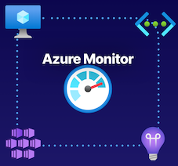

### VM and Network Insights

#### **VM Insights**

Monitoring service specific to **virtual machines and virtual machine scale sets (VMSS)**.

* Requires Log Analytics workspace
* **Requires Log Analytics agent (installed when connected)**
* Also known as Azure Monitor for VMs

#### **Network Insights**

Monitoring service specific to **virtual network resources**.

* **No agent installation required**
* Works in tandem with Network Watcher if enabled
* **Also known as Azure Monitor for Networks**

### Container and Application Insights

#### **Container Insights**

Monitoring service specific to containers or AKS clusters

* Requires Log Analytics workspace
* Requires Log Analytics agent

#### **Application Insights**

Monitoring service specific to application code

* App Insights resource
* Instrumentation of app code

### Demo

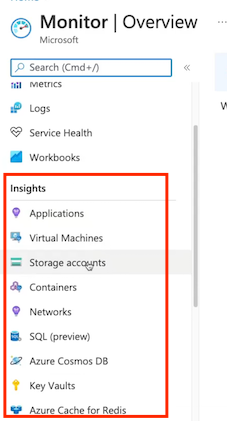

**Enable VM insight**

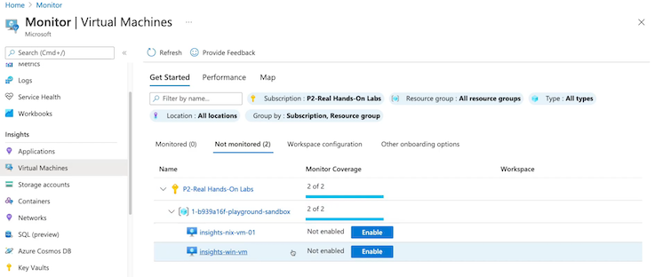

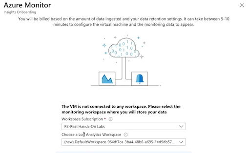

**Enable Network insight**

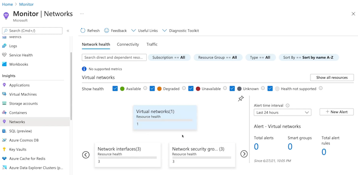

### Key Takeaways

* **VM Insights**

Virtual machine and VMSS-specific monitoring service

* **Network Insight**

Virtual network-specific monitoring service

* **Container Insights**

Container or AKS cluster-specific monitoring service

* **Application Insights**

Application code-specific monitoring service

### Chatgpt summary

1. **Azure Monitor and Service-Specific Insights**:
   - Azure Monitor incorporates service-specific monitoring features called Insights for different resources.
   - **VM Insights monitors virtual machines and scale sets, requiring a Log Analytics workspace and the Log Analytics agent**.
   - Network Insights monitors **virtual networks and works with Network Watcher if enabled in the region**.
   - Container Insights **monitors containers or AKS clusters, needing a Log Analytics workspace and an agent for containers**.
   - Application Insights monitors application code and requires an **Application Insights resource and instrumented code**.

2. **Azure Cloud Sandbox Demonstration**:
   - Inside the Azure Cloud Sandbox, various resources like **storage accounts, network interfaces, virtual networks, and virtual machines can be used to explore and enable Azure Monitor Insights.**
   - The Azure Monitor service provides Insights for different resources **like applications, virtual machines, networks, and containers**.
   - Enabling Insights for specific resources involves selecting and creating a Log Analytics workspace or related resources.

3. **Azure Monitor Insight Capabilities:**
   - VM Insights provides performance data, maps, and dependencies for virtual machines.
   - Network Insights **offers information on connectivity, traffic flow logs, and the ability to create connection monitors**.
   - Further information and categorization of traffic can be obtained from specific network resources.
   - **Container Insights provides monitoring capabilities for containers and AKS clusters**.
   - Application Insights focuses on monitoring application code to gain insights into resource performance.

4. Understanding Azure Monitor Insights:
   - Azure Monitor Insights are service-specific features within Azure Monitor for gathering data from specific resources.
   - VM Insights, Network Insights, Container Insights, and Application Insights are all part of Azure Monitor's service-specific insights capabilities.

## 4 Configuring Application Insights

### Describing Application Insights

**Application Insights**

A full-stack application monitoring solution that developers can use to monitor applications.

* Supports any application instrumented with Application Insights
* **Repository for events and metrics data**
* **Telemetry data is streamed into an Application Insight resource**

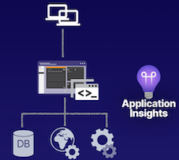

Application Insights resource from our applications can be used to do things such as monitor the usage of our users and determine things such as what pages in our application our users are visiting most frequently and which pages they are leaving, 

**So that we understand our usage of our users and how they interact with our application.**

### Application Insights Features

* **Metrics**

Live Metrics Stream for near-realrtime metrics data and Metrics Explorer for viewing how metrics vary over time

* **Alerts**

Alerting on metrics or event data to notify application administrators of issues.

* **Profiler**

Determine how requests are delivered, **such as page elements and their performance**.

* **Application Map**

A topological view of applications and dependencies, used to identify dependency issues such as bottlenecks.

> **Such as SQL Server database.** 

* **Usage Analytics**

Analyze user metrics from client-side events like user interaction

### **Architectural Components**

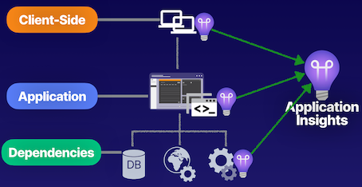

* **Usage analytics** that can gather to analyze user metrics from the client-side events, like **user interactions with our applications and specific forms and buttons that we have in our applications**. 

* **Application Insights are the client-side**, to determine if we want to enable client-side Application Insights for gathering that data from the client-side. 

* **Instrument Application Insights inside of the application.** Have the dependencies where can instrument Application Insights at the dependency level, so that we have a full-stack monitoring service for our applications from the client-side to the application, all the way to the dependencies that support our applications. 

* **Throughout our application stack where we have this Application Insights instrumented**, to be able to collect telemetry data, and feed it into a single pane, be able to view our data and Application Insights.

### Demo

* **Create Web App**

Azure Monitor application insights is an Application Performance Management (APM) service for developers and DevOps professionals. 

It will detect performance anomalies, and includes powerful analytics tools to help you diagnose issues and to understand what users actually do with your app.

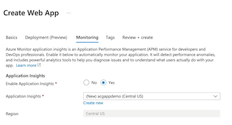

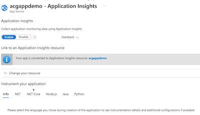

* **Live metrics**

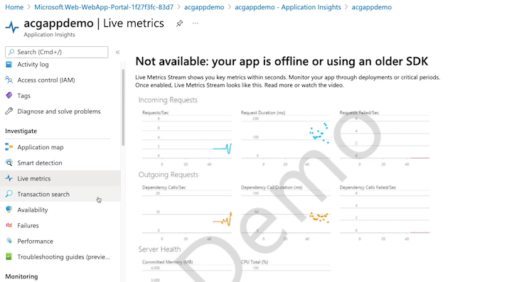

* **Availability**

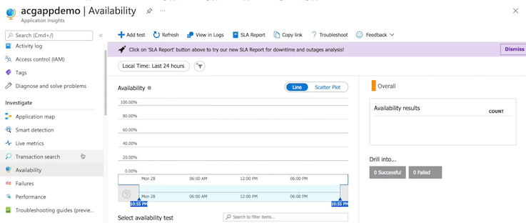

* **Failures**

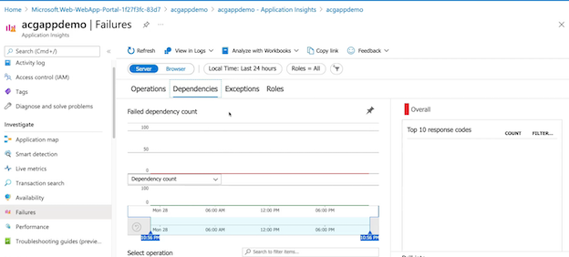

* **Performance**

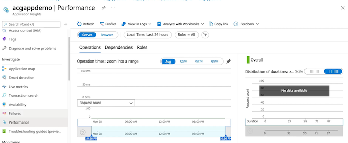

**Connection String key**

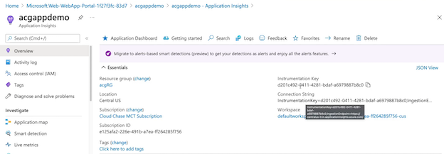

### Key Takeaways

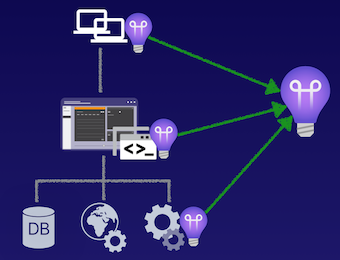

* **Runtime Instrumentation**

Code-less approach with Application Insights, no package implementation.

* **Build-Time Instrumentation**

Code approach with Application Insights, package implemented via SDK.

* **Instrumentation Key**

Key for implementing instrumentation in applications. Stored in Application Insights resource

**Application Insights** is a **full-stack monitoring solution** for applications that allow to **gather data from the client-side, the server-side, and our dependencies**, so that **have tons of telemetry data streamed into a single pane for developers to be able to view that data**, so that **it can drive the development of our applications in a positive direction that increases the performance and the user-base for our applications**. 

### Runtime instrumentation

**Runtime instrumentation, which is to be our codeless approach with Application Insights, where don't have to use any specific packages inside of our application code to implement the Application Insights resource.** 

#### build-time instrumentation

The build-time instrumentation is a coded approach with Application Insights, **going to implement the SDK for Application Insights into our application's code and then we're going to pass the instrumentation key as an environment variable in our applications,** use the application to gather as much data as possible

### Summary from Chatgpt

1. Overview of Application Insights:
   - **Application Insights is a full-stack application monitoring solution focused on developers and supported by any instrumented application**.
   - It provides a repository for events and metrics data, allowing monitoring of user usage and interaction with the application.

2. Features of Application Insights:
   - Metrics: Live metrics for real-time understanding of application performance.
   - Alerts: Allows alerting on metrics or events to notify administrators of potential issues.
   - Profiler: **Helps in understanding how requests are delivered and the performance of page elements in web applications**.
   - Application map: Provides a topology and view of application dependencies to identify issues and bottlenecks.
   - Usage analytics: Allows gathering and analysis of user metrics from client-side events and interactions.

3. Architectural Components and Instrumentation:
   - Application Insights **collects telemetry data from the client-side, the application, and its dependencies, providing a full-stack monitoring service**.
   - Instrumentation can be done using runtime or code-based approaches, with the latter enabling more robust data gathering and other features.

4. Demonstration in Azure portal:
   - Application Insights is set up with a web application using App Services in a personal Azure subscription.
   - Enabling Application Insights for a web application creates an Application Insights resource within the same region, providing real-time metrics, availability, failures, and performance data.

5. Application Insights Configuration:
   - The demonstration includes steps for setting up Application Insights for a web application using App Services, including enabling Application Insights during the creation of the web application.

6. Key Takeaways:
   - Application Insights provides developers with telemetry data to improve application performance and drive application usage.
   - Two approaches for instrumentation: **runtime and build-time, with the latter providing more data and access to additional features**. 

## 5 Using Network Watcher

### Describing Azure Network Watcher

**Azure Network Watchers**

**Azure Network Watcher** is a service comprised of networking tools for monitoring and diagnostics

* Overview of topologies
* Monitor connectivity in Azure
* Monitor connectivity in hybrid networks
* **Troubleshoot connectivity issues**
* **Troubleshoot hybrid network solutions**
* Enable per region in a subscription

### Demo

**Enable network watcher**

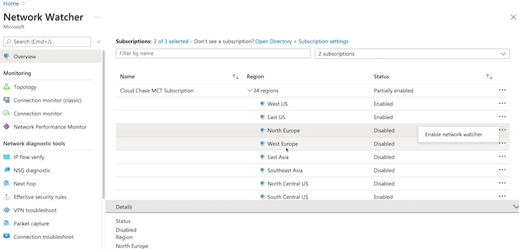

**Network Watcher | Topology**

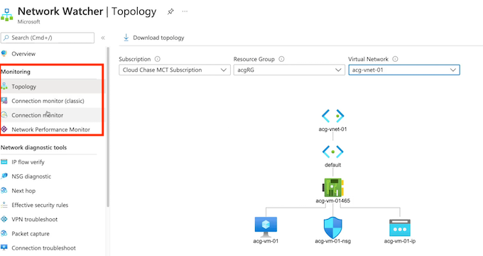

**Connection Monitor**

Connection Monitor provides unified end-to-end connection monitoring capabilities in Azure Network Watcher for hybrid and Azure cloud deployments.

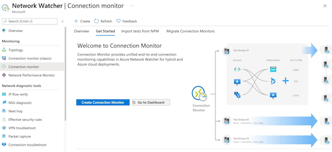

Connection Monitor enables you to monitor connectivity in your Azure and hybrid network.

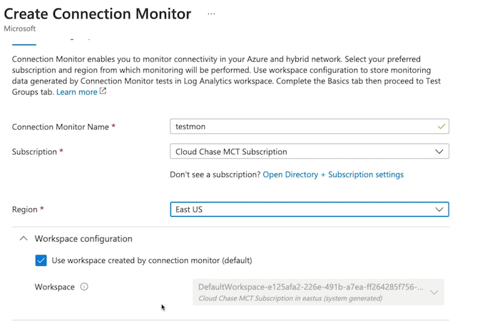

**Add resource**

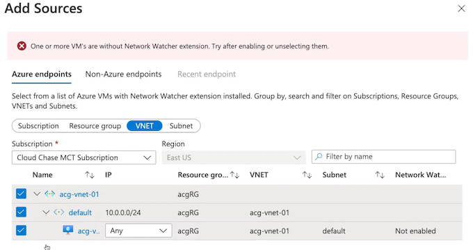

**Add Destinations**

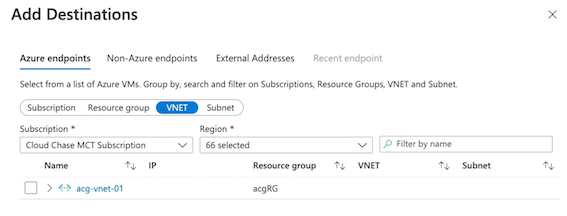

**Add Test configuration**

**IP flow verify**

**NSG diagnostic**

**Next hop**

**Connection troubleshoot**

### Key Takeaways

**Monitoring Tools**

* **Topology**： View a diagram of the resources in the virtual network
* **Connection Monitor**： Monitor connectivity between Azure resources on the network
* **Network Performance Monitor**： Monitor network performance and connectivity between VNets, datacenter, and/or ExpressRoute from a centralized location

**Diagnostic Tools**

* **IP Flow Verify**： Test if traffic is allowed or denied inbound or outbound from VMs
* **Next Hop**： Determine how traffic hops from VM to DEST
* **Effective Security Rules**： Determine effective security rules on a NIC
* **Packet Capture**： Capture packets to and/or from a VM for analysis
* **Connection Troubleshoot** Determine connectivity between SRC and DEST 
* **VPN Diagnostics**：  Diagnose and troubleshoot potential VNet gateway issues

### Summary from chatgpt

1. Overview of Network Watcher:
   - Network Watcher is a service that provides networking tools for monitoring and diagnosing networks in Azure.
   - It enables monitoring and troubleshooting of network connectivity issues in both Azure and hybrid network environments.

2. Features of Network Watcher:
   - **Topology:** Provides a visual diagram of the resources within a virtual network.
   - **Connection Monitor:** Monitors connectivity between Azure and non-Azure resources, including hybrid network environments.
   - **Network Performance Monitor**: Monitors performance and connectivity between virtual networks, datacenters, and ExpressRoutes.
   - **IP flow verify:** Tests if traffic is allowed or denied inbound or outbound from virtual machines.
   - **Next hop:** Determines the traffic hops from a virtual machine to a destination.
   - **Effective security rules**: Monitors the security rules on a specific network interface.
   - **Packet capture**: Captures and analyzes packets to and from a virtual machine.
   - **Connection troubleshooting**: Helps determine connectivity between source and destination virtual machines.
   - **VPN diagnostics**: Helps diagnose and troubleshoot issues with virtual network gateways and VPN connections.

3. Enabling Network Watcher:
   - Network Watcher must be enabled per region within a subscription to use its services and tools.
