# **12 Backup and Recovery**

## 1 Understanding Disaster Recovery

### What is Disaster Recovery?

The process of recovering from a disaster, such as a datacenter power outage. Every business needs a **business continuity and disaster recovery (BCDR)** plan.

* Assess risks
	* Datacenter inside of a location that has natural disasters on a seasonal basis
* Determine critical workloads
* Decide backup technique
* Test disaster recovery

### Recovery Point Objectives (RPO) vs. Recovery Time Objectives (RTO)

**Time graph**, where line graph in hours, have to determine things such as from the **point of the disaster itself**, what can we stand to lose in terms of data and how long does it take to recover? 

<mark>**RPO values**</mark>, which represent the hours from our last backup successfully to the **point of disaster in time**. 

<mark>**RTO values**</mark>, which are recovery time objectives, which represent the **amount of hours in time in representation between the disaster and the full point of recovery**.

### Key Takeaways

**Disaster Recovery Methods**

* **Backup**: A copy of business critical data
* **Cold Site**: A copy of critical infrastructure that needs preparation before disaster recovery is complete
* **Hot Site** A copy of critical infrastructure and data that is ready to be swapped in as the production workload

### Summary from Chatgpt

1. **Business Continuity and Disaster Recovery Plan**:
   - Every business needs a plan to recover from disasters such as power outages or natural disasters.
   - Assess risks and determine critical workloads in the datacenter to ensure minimum business operations.
   - Decide on the backup technique to protect critical workloads.
   - Test the disaster recovery plan by simulating a disaster to evaluate its effectiveness.

2. **RPO and RTO Values**:
   - **RPO (Recovery Point Objective): Represents the hours between the last successful backup and the point of disaster. It determines the amount of data that could potentially be lost**.
   - **RTO (Recovery Time Objective): Represents the amount of time it takes to fully recover from a disaster. It defines the acceptable downtime for the organization**.

3. **Disaster Recovery Methods:**
   - Backup: A copy of business-critical data that can be used for restoration.
   - Cold Site: A copy of critical infrastructure that requires preparation before recovery. Infrastructure is not actively used but needs time to be ready for production.
   - Hot Site: A copy of critical infrastructure and data that is ready to be used as the primary workload at any time.

## Configuring Azure Backup

### Describing Azure Backup

**Backup as a Service**

Azure Backup is a managed service for backing up and recovering workloads.

**<mark>Running in Azure and on-premises.</mark>**

On-premises workloads, 

* Hyper-V workloads 
* VMware workloads running on-premises. 

**Requires an Azure Recovery Services vault.**

Supported workloads:

* Azure virtual machines
* On-premises machines
* SQL Server workloads
* SAP HANA workloads

**Backup policy**, can take a backup of our data, and then in the event of a disaster, or if we need to recover a virtual machine is can recover that virtual machine from the data that backed up. 

### Components of Azure Backup

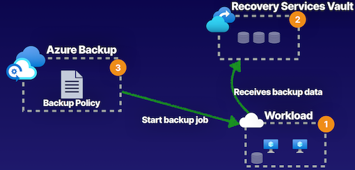

1. Compute workload, (the cloud or on-premises, Azure virtual machines, Hyper-V virtual machines, or VMware SQL servers), have to create our Recovery Services vault. 
2. Inside Recovery Services vault, to create our Azure Backup policy. can use the Azure Backup features of our Recovery Services vault and **this backup policy to run scheduled backups and start those backups of those workloads that we have either in cloud or on-premises**. 
3. Once done the backup job, the data is going to be received by our Recovery Services vault, providing us data to be able to recover our workloads. 

### Demo

**Create Backup service**

* Recovery Services vault

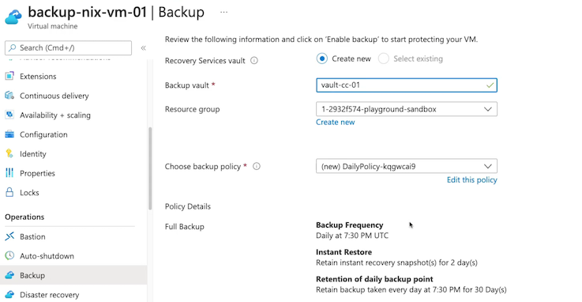

* Create Backup policy

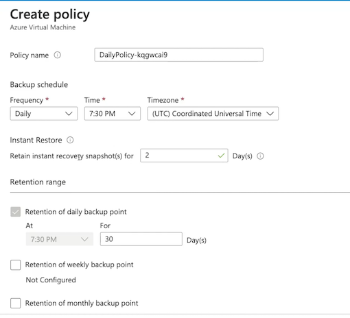

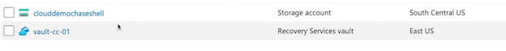

* Properties: Backup Configuration 

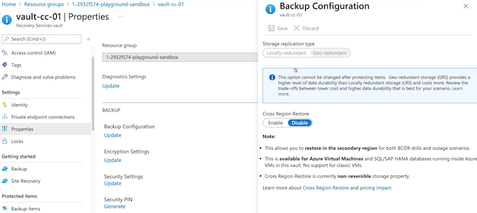

* backup workloads

	* Virtual machine
	* Azure file share
	* soL SQL Server in Azure VM
	* SAP HANA in Azure VM

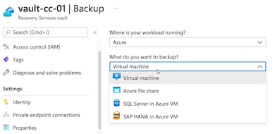

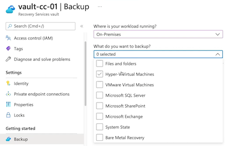

**What do you want to backup?**

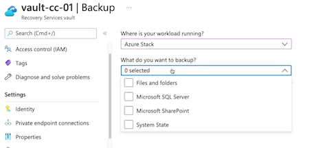

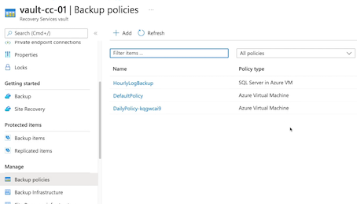

**Backup**

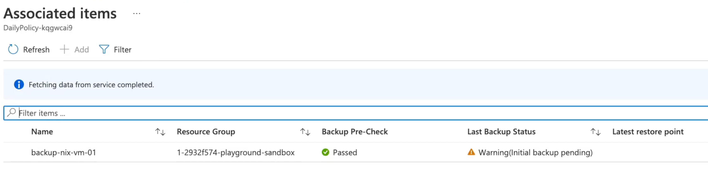

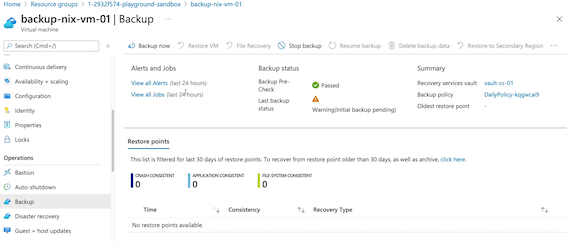

Restore points： 

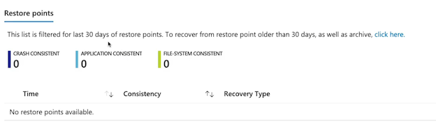

Backup Jobs from retore points (Sever must stopped)

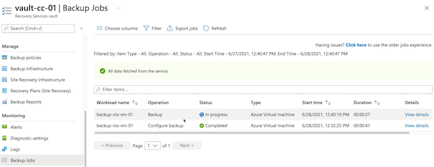

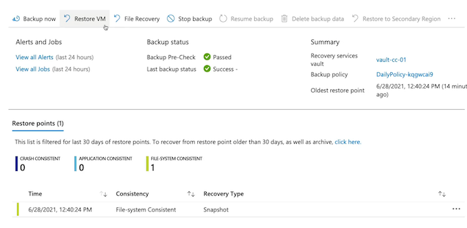

Select restore point

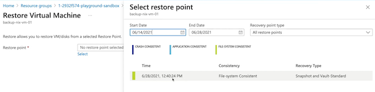

Restore Virtual Machine

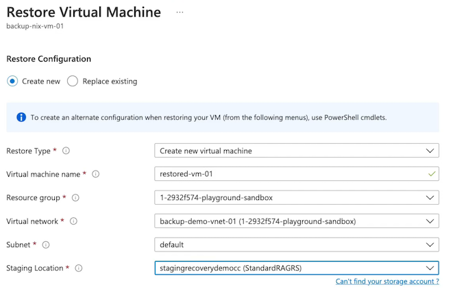

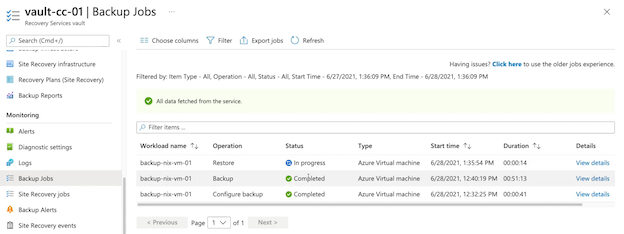

**Backup policies**

### Key Takeaways

**Workload**

* Azure virtual machines
* On-premises machines
* SQL Server workloads
* SAP HANA workloads

**Recovery Services Vault**

Storage management service for all backup data

**Azure Backup**

Cloud-managed backup service for configuring backup frequency and retention

Performing restoration operations with the backup data that we've taken, whether that is **crash consistent, file system consistent, or application-aware backups**.

### Summary from chatgpt

1. **Azure Backup Overview**:
   - Azure Backup is a managed backup-as-a-service offering that allows backup and recovery of workloads running in Azure and on-premises, including Hyper-V and VMware workloads.

2. **Components and Workloads:**
   - Supported workloads for Azure Backup include Azure virtual machines, on-premises virtual machines (Hyper-V, VMware), SQL Server workloads, and SAP HANA workloads.
   - To use Azure Backup, a Recovery Services vault is required in Azure to manage backup policies and store backup data.

3. **Configuration and Policy**:
   - Backup policy creation allows for scheduling of backups for workloads, both in the cloud and on-premises.
   - **The backup policy includes details such as backup frequency, time, time zone, retention range (daily, weekly, monthly, yearly backups), and options for instant restore**.

4. Backup and Restoration:
   - Backup jobs can be initiated for workloads, and the progress of these jobs can be monitored within the Recovery Services vault.
   - Restoring a virtual machine involves creating a storage account for a staging location, selecting the restore point, and configuring the restoration.

5. Key Takeaways:
   - Azure Backup is configured for various supported workloads, and it requires a Recovery Services vault to store and manage backup data.
   - The service provides a cloud-managed backup solution for configuring backup frequency, retention periods, and performing restoration operations.

6. Integration with Azure Services:
   - Azure Backup integrates with Azure Virtual Machines, Azure SQL Database, Azure Files, and Azure Blob Storage for backing up and restoring data.

7. Security and Compliance:
   - Azure Backup encrypts data at rest and in transit to meet security and compliance requirements.
   - It supports role-based access control (RBAC) for managing access and permissions.

8. Monitoring and Reporting:
   - Azure Backup provides monitoring and reporting capabilities, including backup health monitoring, job status reports, and alerts for backup issues.

9. Cross-region and Cross-subscription Backup:
   - It allows the configuration of backup policies for cross-region and cross-subscription data protection, providing flexibility for data redundancy and disaster recovery.

10. Cost Management:
   - Azure Backup offers cost management features such as backup storage consumption monitoring and the ability to define data retention policies to optimize backup storage costs.

11. Azure Site Recovery:
   - While not a direct part of Azure Backup, Azure Site Recovery can be integrated with Azure Backup to provide disaster recovery as well as backup.

12. **Backup and Restore Options:**
   - Azure Backup provides options for backup and restore, including full backups, incremental backups, and the ability to restore data to specific points in time.

## 3 Azure Site Recovery

### Describing Azure Site Recovery

**Disaster Recovery Solution**

Azure Site Recovery is our disaster recovery solution that allows us to automate the process of recovering from a primary location to a secondary location. 

Requires an Azure Recovery Services vault

**Azure Backup as Azure Site Recovery is a feature of a Recovery Services vault.**

* Cross-zone
* Cross-region （same geography)

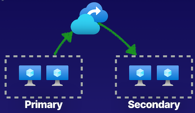

### Components of Azure Site Recovery

 
1. Use Azure Site Recovery with our on-premises solutions, but the components that go into Azure Site Recovery solutions start, with the first physical location in a resource group in East Us that has a virtual network and virtual machines. 
2. These virtual machines use managed disks that are inside of a storage account.
3. Have a disaster recovery solution that will failover to a target resource group inside of the same geography in East US 2.
4. Cached data is getting stored inside of a storage account, and then we then replicate this data to the target location where we then have the ability to failover and provide replication of this data into a target region, providing us that disaster recover solution. 

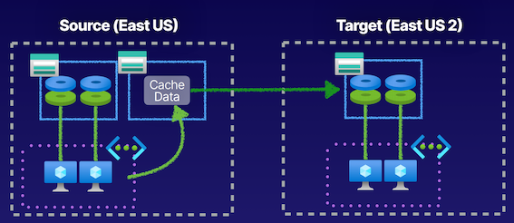

### Demo

**Create Site Recovery**

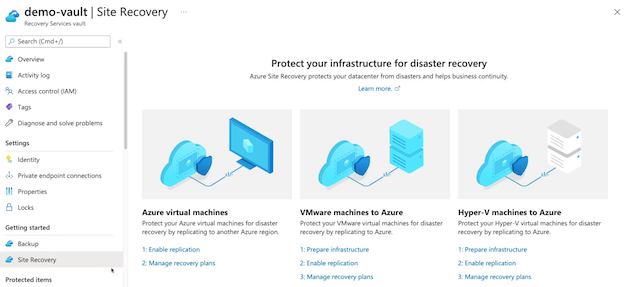

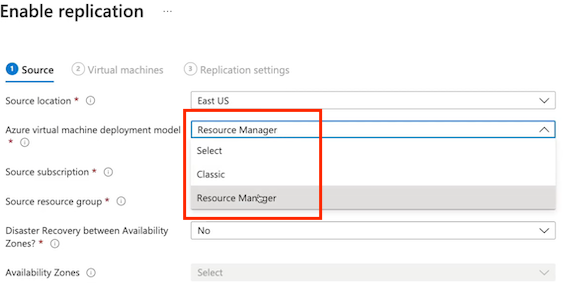

**Enable replication**

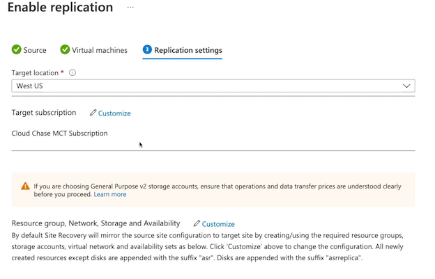

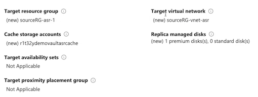

**Replication Policy**

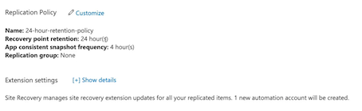

**Replication item**

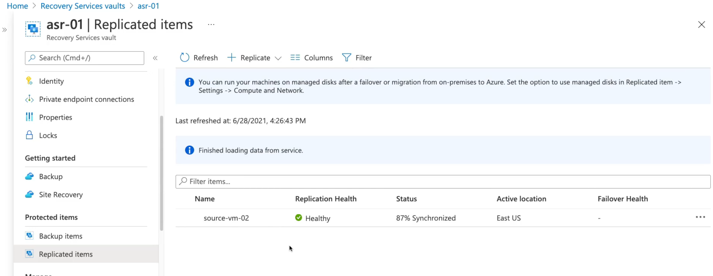

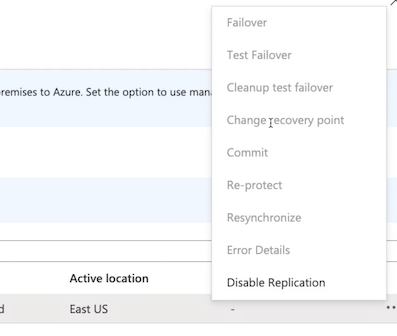

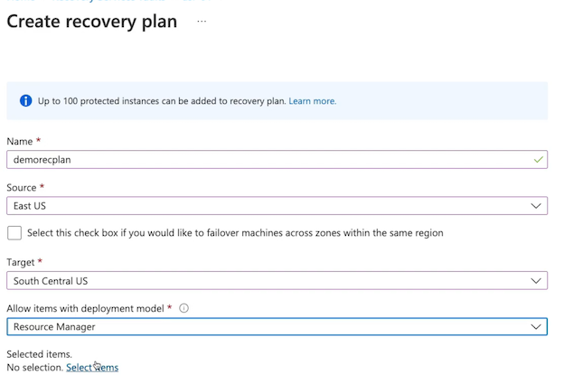

Select items

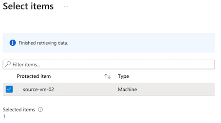

### Key Takeaways

* **Replicated Items**

The workload that will be replicated site-to-site by Azure Site Recovery.

* **Replication Policy**

Defines the frequency of snapshots and retention period of recovery points. Can be app-consistent or crash-consistent.

* **Recovery Plan**

Automate and run test failover events with protected items and pre-and/or post-scripts

**Create recovery plan**

### Summary from chatgpt

1. Azure Site Recovery Overview:
   - Azure Site Recovery (ASR) is a disaster recovery solution that automates the process of recovering from a primary location to a secondary location within Azure.
   - ASR is a feature of the Azure Recovery Services vault, which is required to use Azure Site Recovery.

2. Disaster Recovery Solutions:
   - ASR provides disaster recovery solutions for cross-zone recovery and cross-region recovery within the same geography.
   - It can also be used with on-premises solutions, allowing for replication to Azure.

3. Components of ASR:
   - The components of an Azure Site Recovery solution include the primary location, virtual machines, m**anaged disks within a storage account,** and a target resource group in the secondary location.

4. Provisioning ASR Solution in Azure Portal:
   - Creation of an ASR solution involves enabling replication by selecting a source location, configuring the target location, and customizing the replication policy.
   - Replication caches data in a storage account and replicates it to the target location for failover.

5. Testing Failover and Recovery Plans:
   - **ASR enables testing failover, failover, and cleanup of test from failover for individual virtual machines**.
   - Recovery plans can be created to automate failover events for multiple protected items with pre- and post-scripts options.

6. **Key Takeaways for Azure Site Recovery:**
  - ASR provides disaster recovery solutions within Azure, involving replicating compute workloads and managing the frequency of snapshots and retention periods.
   - Recovery plans automate and orchestrate failover events for multiple protected items with additional scripting capabilities.

## Backup Reports

### Describing Backup Reports

**Backup Reports**

Provides insight on backups from Azure Backup, and those insights can be used to inform items such as:

* **Forecasts for cloud storage consumption**
* Audits of backup and restore 

* Can determine 
	* what backups have taken place 
	* What restores have taken place 
	* Whether or not they were intended and figure out how we can best optimize our backup solution using Azure Backup.

Uses Log Analytics as its logging service.

> such as the restore operations and backup operations.

### Components of Backup Reports

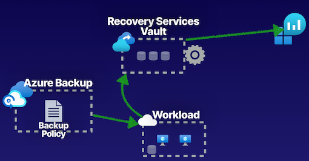

Configure Recovery Services vault with diagnostics to be able to point all the diagnostics to a Log Analytics workspace, as it is the storage for our logging events.

Azure Backup enabled and running, capturing data, in order to be able to log that data and generate reports from those backups. 

1. Create a Log Analytics workspace as this is going to act as the store for all of our logging data. 
2. Configure the **diagnostic settings on the Recovery Services vault to be able to send all of the data** that trying to capture related to Azure Backup to our Log Analytics workspace so that can view in our Backup Reports all of the data, 
	* all of the events, 
	* all of the operations that are taking place for our backup jobs 
3. **Be able to query and filter based off of certain criteria to determine things such as the storage consumption of our backups.** 

### Demo

* **Create Recovery Services vault**

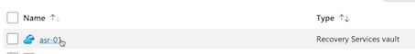

* **Backup items** 

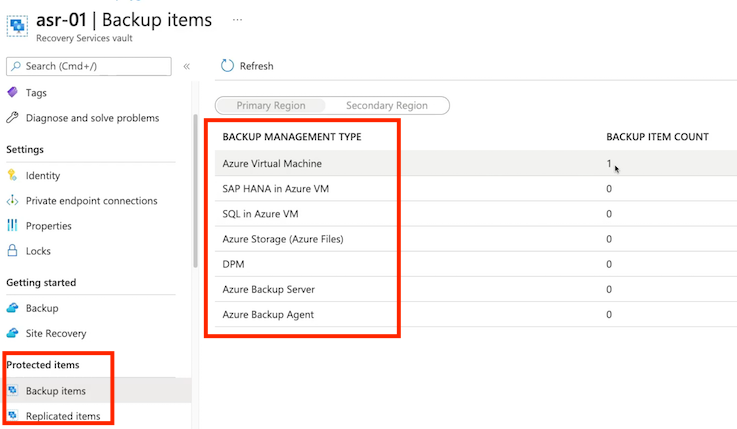

* **Backup Jobs**

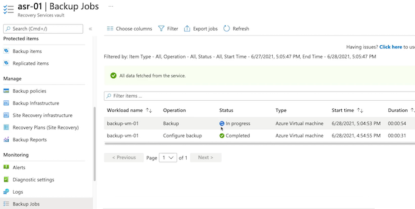
 
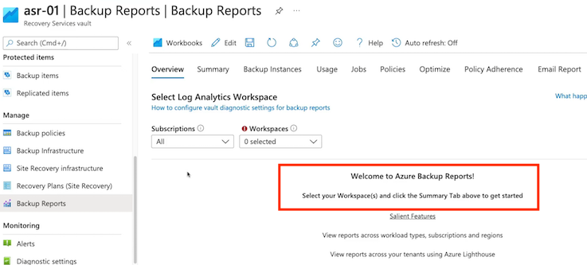
 
* **Diagnostic**

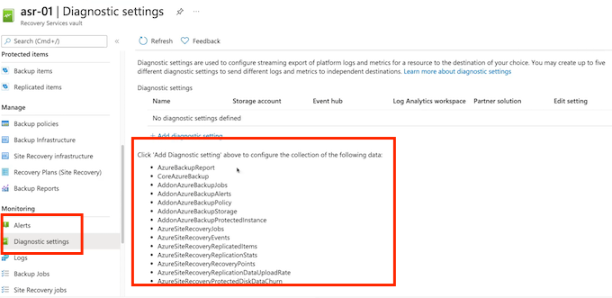

* Create Log Analytics workspace

With Azure Monitor Logs you can easily store, retain, and query data collected from your monitored resources in Azure and other environments for valuable insights. A Log Analytics workspace is the logical storage unit where your log data is collected and stored.

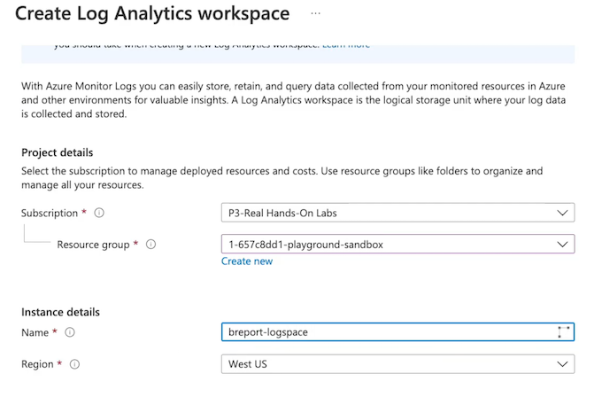

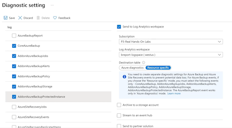

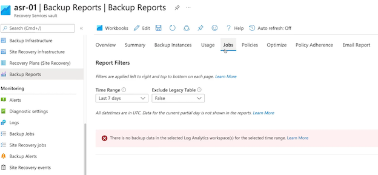

### Key Takeaways

**Backup Reports**

* View backup policies
* View backup jobs
* View backup items
* View summary of estate

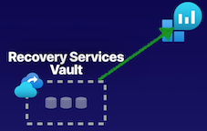

### Chatgpt summary

1. **Backup Reports Overview**:
   - Backup Reports provide insight and auditing capabilities for Azure Backup operations, allowing users to monitor backup and restore events and forecast cloud storage consumption.

2. **Configuration of Backup Reports:**
   - Log Analytics workspace is required to log backup events such as restore operations and backup operations for Azure Backup.
   - The Recovery Services vault needs to be configured with diagnostics to send all backup-related data to the Log Analytics workspace.

3. **Components of Setting up Backup Reports**:
   - Components involved in setting up Backup Reports are similar to those in setting up the Azure Backup service.
   - Initial steps include creating a Log Analytics workspace and configuring diagnostic settings on the Recovery Services vault to capture backup-related data.

4. **Configuring Backup Reports using Log Analytics Workspace:**
   - A demonstration showcases the creation of a Log Analytics workspace and the configuration of diagnostic settings for capturing backup log data within the Recovery Services vault.
   - Once configured, **Backup Reports can be accessed and used to view backup policies, backup jobs, backup items, and the summary of the Azure Backup service**.

5. **Key Takeaways for Backup Reports:**
   - Backup Reports allow for capturing and monitoring backup and restore operations to determine cloud storage usage for Azure Backup.
   - **Configuration with a Log Analytics workspace enables view and analysis of backup policies, backup jobs, and backup items within Backup Reports.**

