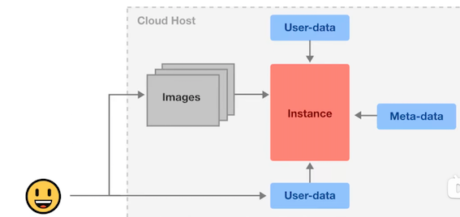

# Administrator Certification (AZ-104) CheatSheet

## Exam Guide - Response Types

**40-60 Questions**

* Multiple Choice
* Multiple Answer
* Drag and Drop
* Hot Area
* Case Studies

**Exam Time/is: 180 mins**

## Introduction to Azure AD

**Azure Active Directory (Azure AD)** is Microsoft's cloud-based **identity and access management service**, which helps your **employees sign in and access resources**

#### **External Resources**

* Microsoft Office 365
* Azure Portal
* SaaS applications

#### **Internal Resources**

* Applications within your internal networking
* Access to workstations on-premise


Use Azure AD to **implement Single-Sign On (SSO)**

Azure Active Directory comes in four editions

1. **Free MFA**, SSO, Basic Security and Usage Reports, User Management
2. **Office 365 Apps,** Company Branding, SLA, Two-Sync between On-Premise and Cloud
3. **Premium 1** Hybrid Architecture, Advanced Group Access, Conditional Access
4. **Premium 2** Identity Protection, Identity Governance


### Azure AD - Use Case

Azure AD can **authorize** and **authenticate** to multiple sources.


* To your **on-premise AD**
* To your **web-application**
* Allow users to login with their IpD eg. Facebook or Google
* To Office 365 or Azure Microsoft


### Active Directory vs Azure Active Directory


Microsoft introduced **Active Directory Domain Services** in Windows 2000 to give organizations the ability to **<mark>manage multiple on-premises infrastructure components and systems using a single identity per user</mark>**.


**Azure AD** takes this approach to the next level by providing organizations with an **Identity as a Service (IDaaS) solution** for all their apps **across cloud and on-premises.**

* **Active Directory The on-premise** version
* **Azure AD** The cloud version


### Active Directory Terminology

* **Domain**

* A domain is an **area of a network organized by a single authentication database**
* **An Active Directory domain is a logical grouping** of AD objects on a network


* **Domain Controller (DC)**

A domain controller is a server that **<mark>authenticates user identities and authorizes their access to resources</mark>**.


* **Domain Computer**


A computer that is registered with a central authentication database A domain computer would be an AD Object

* **AD Object**

An **AD Object is the basic element of Active Directory** such as:

**<mark>Users, Groups, Printers, Computers, Shared folders</mark>**.

* **Group Policy Object (GPO)**

A **virtual collection of policy settings**. It controls what **AD Objects have access to**

* **Organization Units (OU)**

A **subdivision within an Active Directory** into which you can **place users, groups, computers, and other organizational units**

* **Directory Service**

A directory service, such as **Active Directory Domain Services (AD DS)**, provides the methods **for storing directory data and making this data available to network users and administrators**. 

**A Directory service runs on a Domain Controller**

### Azure AD - Tenant

A tenant **represents an organization** in Azure Active Directory.

A tenant is a dedicated Azure AD Service instance.

A tenant is automatically created when you sign up for either

* Microsoft Azure
* Microsoft Intune
* Microsoft 365

**<mark>Each Azure AD tenant is distinct and separate from other Azure AD tenants</mark>**.


### Azure Active Directory Domain Services (AD DS)

When doing a **lift-and-shift from on-premise** to **Microsoft Azure** and migrating Active Directory, **Azure AD does not support some domain services**.


**Azure Active Directory Domain Services (AD DS)** provides **managed domain service** such as:

* Domain joins
* Group policies
* Lightweight directory access protocol (LDAP)
* and Kerberos / NTLM authentication.


You use can these domain services without the need to:

**deploy, manage, and patch domain controllers(DCs)** in the cloud

### Azure AD Connect

**Azure AD Connect** is a **hybrid service** **to connect your on-premise Active Directory to your Azure Account**

Azure AD Connect allows for seamless **Single Sign On** from your on-premise workstation to Microsoft Azure

Azure AD Connect has the following features:

* **Password hash synchronization** - sign-in method, synchronizes a hash of a users on-premises AD password with Azure AD
* **Pass-through authentication**- sign-in method, allows users to use the same password on-premises and in the cloud
* **Federation integration** - hybrid environment using an on-premises AD FS infrastructure, for certificate renewal
* **Synchronization** - Responsible for creating users, groups, and other objects, ensures on-prem and cloud data matches
* **Health Monitoring** - robust monitoring and provide a central location in the Azure portal to view this activity


### Active Directory - Users

**Users** represent an **identity for an person or employee** in your domain.


A user has login credentials and can use them to log into the Azure Portal


* You can assign roles and administrative roles to users
* You can add users to groups
* You can enforce authentication methods such as (MFA)
* Multi-Factor Authentication
* You can track users sign ins
* Track devices user's login from and allow or deny devices.
* Assign Microsoft licenses

**Azure AD has two kinds of users:**

* **Users** - A user belongs to your organization
* **Guest Users** - A guest user belongs to another organization

### Azure AD - Groups

**Groups** lets the **resource owner (or Azure AD directory owner)**, assign a set of access permissions
to all the members of the group, instead of having to provide the rights one-by-one.

**Groups contain:**

* **Owners** - Has permissions to add an remove members
* **Members** - Have permissions to do things

**Assignment**

* You can assign roles directly to a group
* You can assign applications directly to a group

**Request to Join Groups**

The group owner can let users find their own groups to join, instead of assigning them. 

The owner
= can also set up the group to automatically accept all users that join or to require approval.

### Azure AD - Assign Access Rights

There are four ways to assign resource access rights to your users:

* **Direct assignment**. The resource owner directly assigns the user to the resource.

* **Group assignment**. The resource owner assigns an Azure AD group to the resource,
which automatically gives all of the group members access to the resource

* **Rule-based assignment.** The resource owner creates a group and uses a rule to define which users are assigned to a specific resource.

* **External authority assignment.** Access comes from an external source, such as an on-premises directory or a SaaS app.

### Azure AD External Identities

**External Identities** in Azure AD, allow people outside your organization to access your apps and resources, while letting them sign in using whatever identity they prefer.

Your partners, distributors, suppliers, vendors, and other guest users can "**bring their own identities**"

* **Share apps with external users (B2B collaboration)**.
* **Develop apps intended for other Azure AD tenants (single-tenant or multi-tenant)**
* **Develop white-labeled apps for consumers and customers (Azure AD B2C)**

### Azure Active Directory CheatSheet

**Active Directory (AD) is Microsoft's identity and access management service**. Helps your employees sign in and access resources

Azure Active Directory (Azure AD) is Microsoft's cloud-based version of **AD Identity as a Service (IDaaS)**

Azure Active Directory comes in 4 editions:

1. Free MFA, SSO, Basic Security and Usage Reports, User Management
2. Office 365 Apps Company Branding, SLA, Two-Sync between On-Premise and Cloud
3. **Premium 1 (P1) Hybrid Architecture, Advanced Group Access, Conditional Access**
4. **Premium 2 (P2) Identity Protection, Identity Governance**


Azure AD can **authorize and authenticate** to multiple sources.

* To your on-premise AD via Azure **AD Connect**
* To your web-application via **App Registrations**
* Allow users to login with their IpD eg. Facebook or Google via **External Identities**
* To Office 365 or **Azure Microsoft**

**Active Directory Terminology:**

* **Domain** A domain is an area of a network organized by a **single authentication database**
* **An Active Directory domain** is a **logical grouping of AD objects on a network**
* **Domain Controller (DC)** A domain controller is a server that **authenticates user identities and authorizes their access to resources**.
* **Domain Computer** A computer that is registered with a central authentication database 
	* **A domain computer would be an AD Object**
* **AD Object** An AD Object is the basic element of Active Directory such as: Users, Groups, Printers, Computers, Shared folders
* **Group Policy Object (GPO)**: **A virtual collection of policy settings**. It controls what AD Objects have access to
* **Organization Units (OU)** A subdivision within an AD into which you can place users, groups, computers, and other organizational units
* **Directory Service** A **directory service, such as Active Directory Domain Services (AD DS)**, provides the methods for storing directory data and making this data available to network users and administrators. 
	* **A Directory service runs on a Domain Controller**

**A tenant represents an organization** in Azure Active Directory. **A tenant is a dedicated Azure AD Service instance**. 

A tenant is automatically created when you sign up for either: Microsoft Azure, Microsoft Intune, Microsoft 365.

**<mark>Each Azure AD tenant is distinct and separate from other Azure AD tenants</mark>**.

When performing a lift-and-shift of AD to Azure, not all AD features are supported and in that case you need to us AD DS

**Azure Active Directory Domain Services** (AD DS) provides managed domain services (features) such as:

* Domain joins, Group policies, Lightweight directory access protocol (LDAP), and Kerberos / NTLM authentication.


Azure AD Connect has the following features:

* **Password hash synchronization** - sign-in method, synchronizes a hash of a users on-premises AD password with Azure AD
* **Pass-through authentication** - sign-in method, allows users to use the same password on-premises and in the cloud
* **Federation integration** - hybrid environment using an on-premises AD FS infrastructure, for certificate renewal
* **Synchronization** - Responsible for creating users, groups, and other objects, ensures on-prem and cloud data matches
* **Health Monitoring** - robust monitoring and provide a central location in the Azure portal to view this activity

**Users** represent an **identity for an person or employee** in your domain. A user has login credentials and can use them to log into the Azure
Portal. Azure AD has two kinds of users:

* **Users - A user belongs to your organization**
* **Guest Users - A guest user belongs to another organization**


**Groups** lets the resource owner (or Azure AD directory owner), assign a set of access permissions to all the members of the group, instead of
having to provide the rights one-by-one. Groups contain:

* **Owners** - Has permissions to add an remove members
* **Members** - Have permissions to do things

**Assignment**

* You can assign roles directly to a group
* You can assign applications directly to a group

**Request to Join Groups** The group owner can let users find their own groups to join, instead of assigning them. The owner can also set up the
group to automatically accept all users that join or to require approval.

There are **four ways to assign resource access** rights to your users:

* **Direct assignment**. The resource owner directly assigns the user to the resource.
* **Group assignment**. The resource owner assigns an Azure AD group to the resource, which automatically gives all of the group members access to the resource
* **Rule-based assignment**. The resource owner creates a group and uses a rule to define which users are assigned to a specific resource.
* **External authority assignment**. Access comes from an external source, such as an on-premises directory or a SaaS app.


## Azure AD - Device Management

### What is Device identity management?

The management of **physical devices** such as **phones, tablets, laptops and desktop computers**, that are granted access to company resources such as Printers, Cloud Resources via device-based Conditional Access.


For companies with a distributed workforce, that allows remote employees and employees who Are allowed you use their own personal equipment g. **Bring Your Own Device (BYOD).**


A company needs a way to protect their organization's assets such as access to cloud resources
across these devices where they have **_less control over the physical securities of the work environment_**


### Azure AD - Device Management

There are **3 ways** to get devices into Azure AD

#### 1. Azure AD Registered  （Windows 10/iOS/Andriod/MacOS）

* **personally** owned or mobile devices,
* And signed in with a **personal** Microsoft or local account

#### 2. Azure AD Joined 

> Windows 10, Windows Server 2019 VMs running in Azure
(Server core is not supported)

* owned by an **organization**
* And signed in with an Azure AD account belonging to the organization.
* They exist **only in the cloud.**

#### 3. Hybrid Azure AD Joined

> Windows 7, 8.1, or 10 
> 
> Windows Server 2008 or newer

* owned by an organization
* And are signed in with an **Active Directory Domain Services account belonging to that organization**
* They exist **in the cloud and on-premises**


### Azure AD Registered Devices

* **Definition**： Registered to Azure AD without requiring organizational account to sign in to the device
* **Primary audience** Bring your own device (BYOD), Mobile devices
* **Device ownership** User or Organization
* **Operating Systems** Windows 10, iOS, Android, and MacOS


* **Provisioning**

	* Windows 10 - Settings
	* iOS/Android - Company Portal or Microsoft Authenticator app
	* MacOS - Company Portal

* **Device sign in options**

	* End-user local credentials, Password, **Windows Hello,** PIN
	* Biometrics or Pattern for other devices

* **Device management**

	* **Mobile Device Management (example: Microsoft Intune)**
	* **Mobile Application Management**

**Key capabilities**


* **SSO** to cloud resources
* Conditional Access when **Enrolled into Intune**
* Conditional Access via **App protection policy**
* Enables Phone sign in with **Microsoft Authenticator app**

### Azure AD Registered Devices - Windows Hello

**Windows Hello**

Gives Windows 10 users **an alternative way** to log into their devices and applications using:

* fingerprint
* iris scan
* facial recognition

### Azure AD Registered Devices - MDM and MAM

* **Mobile Device Management (MDM)**

control the entire device, can wipe data from it, and also reset it to factory settings

* **Mobile Application Management (MAM)**

Publish, push, configure, secure, monitor, and update mobile apps for our users

* MDM and MAM is managed **via Microsoft Intune**
* To use Microsoft Intune you have to upgrade to **Azure AD Premium 2**
* Microsoft Intune is part of **Microsoft Endpoint Manager**
* Microsoft Endpoint Manager and Intune are part of **Microsoft Enterprise Mobility + Security (EMS)**


### Azure AD Registered Devices - EMS

**Microsoft Enterprise Mobility + Security (EMS)** is an **intelligent mobility management and security platform.**

Protect and secure your organization and empowers your employees to work in new and flexible ways.

**EMS is an umbrella of multiple Microsoft and Azure services**

* **Azure Active Directory**
	* The most trusted identity an access management solution in the  market that helps you sateguard user credentials and connect people securely to the apps they	
* **Microsoft Endpoint Configuration Manager**
	*	Systems management software for managing on-premises PCS, servers, and mobile devices with cloud-powered insights.
* **Microsoft Intune**
	* 	**Cloud-based united endpoint management, access management, and data protection.**
* **Azure Information Protection**
	* Cloud-based data **classification, tracking, protection, and encryption**
* Microsoft Cloud App Security
	* **Cloud access security broker** with discovery, behavioral analytics, risk assessment, data protection, and threat protection
* Microsoft Advanced Threat Analytics
	* On-premises platform that protects **against advanced targeted cyberattacks and insider Threats** 
* **Microsoft Defender for Identity**
	* Cloud-based solution that helps protect your organization's identities from multiple types of advanced targeted cyberattacks.
* **Microsoft Secure Score**
	* Intelligent insights and guidance that help maximize your security posture with Microsoft 365 and Azure

### Azure AD Registered Devices - Microsoft Authenticator

secure sign-ins for all your online accounts using:

* multi-factor authentication
* Passwordless
* password autofill

### Azure AD Joined Devices

* **Definition**

Joined only to Azure AD requiring organizational account to sign-in to the device

* **Primary audience**

* Suitable for both cloud-only and hybrid organizations.
* Applicable to all users in an organization

**Device ownership** Organization

**Operating Systems**

* All Windows 10 devices except Windows 10 Home
* Windows Server 2019 Virtual Machines running in Azure (Server core is not supported)

**Provisioning**

Self-service: Windows OOBE or Settings, Bulk enrollment, Windows Autopilot

**Device sign in options**

Organizational accounts using: Password, Windows Hello for Business, FIDO2.0 security keys (preview)

**Device management**

* Mobile Device Management (Microsoft Intune)
* Co-management with Microsoft Intune and Microsoft Endpoint Configuration Manager

**Key capabilities**

* SSO to both cloud and on-premises resources
* Conditional Access through MDM enrollment and MDM compliance evaluation
* Self-service Password Reset and Windows Hello PIN reset on lock screen
* Enterprise State Roaming across devices

### Azure AD Joined Devices - FIDO2.0 Security Keys

**Fast Identity Online (FIDO) Alliance**

An open industry association whose mission is to **<mark>develop and
promote authentication standards</mark>** that **help reduce the
world's over-reliance on passwords**

FIDO Alliance has published three sets of open specifications for simpler, stronger user authentication:


* FIDO Universal Second Factor (FIDO U2F)
* FIDO Universal Authentication Framework (FIDO UAF)
* Client to Authenticator Protocols (CTAP)
* CAP is complementary to the W3C's Web Authentication (WebAuthn) specification; together, they are known as FIDO2

### Azure AD Joined Devices - FIDO2.0 Security Keys

**What is a Security Key?**

A secondary device used as second step in authentication process to gain access to a device, workstation or application.

A security key can resemble a memory stick. When your finger makes contact with a button er exposed metal on the device it will generate
And autofill a security token.

**A popular brand of security key is an Yubikey**

* Works out of the box with Gmail, Facebook, and hundreds more
* Supports FIDO2/WebAuthn, U2F
* Waterproof and crush resistant
* USB-A and NFC dual connectors on a single key

### Hybrid Azure AD joined devices

**Definition**

Joined to on-premises AD and Azure AD requiring organizational account to sign in to the device

**Primary audience** 

* Suitable for hybrid organizations with existing on-premises AD infrastructure
* Applicable to all users in an organization

**Device ownership** Organization

**Operating Systems**

Windows 10, 8.1 and 7, Windows Server 2008/R2, 2012/R2, 2016 and 2019

**Provisioning**

* Windows 10, Windows Server 2016/2019
* Domain join by IT and autojoin via Azure AD Connect or ADFS config
* Domain join by Windows Autopilot and autojoin via Azure AD Connect or ADFS config
* Windows 8.1, Windows 7, Windows Server 2012 R2, Windows Server 2012, and Windows Server 2008 R2 - Require MSI

**Device sign in options Organizational accounts using:**

* Password
* Windows Hello for Business for Win10

**Device management**

Group Policy, Configuration Manager standalone or co-management with Microsoft Intune

**Key capabilities**

* SSO to both cloud and on-premises resources
* Conditional Access through Domain join or through Intune if co-managed
* Self-service Password Reset and Windows Hello PIN reset on lock screen
* Enterprise State Roaming across devices

### Hybrid Azure AD joined devices - Windows Autopilot

**Windows Autopilot** is a collection of technologies used to set up and pre-configure new devices, getting them ready for productive use.

When initially deploying new Windows devices

* Windows Autopilot uses the OEM-optimized version of Windows 10.
* This version is preinstalled on the device, so you don't have to maintain custom images and  drivers for every device model
* Instead of re-imaging the device, your existing Windows 10 installation can be transformed into a "business-ready" state that can

Once deployed, you can manage Windows 10 devices with:

* Microsoft Intune
* Windows Update for Business
* Microsoft Endpoint Configuration Manager
* other similar tools

### **Device Management CheatSheet**

**Device Management** allows organization to manage laptops, desktops and phones that need access to cloud resources.

Device management is found under Azure Active Directory (Azure AD)

There are 3 ways to join types in (bring devices into) Device Management:

#### **Azure Registered**

* **personally** owned devices or mobile devices
* Signed in with a local or personal account
* Windows 10, iOS, Android and MacOS

#### **Azure AD Joined**

* **Devices owned by the organization**
* **Signed in with an organizational account**
* Access to devices that exist in only in the cloud (**Cloud Native**)
	* Windows 10, Windows Server 2019

	
#### **Hybrid Azure AD Joined**

* **Devices owned by the organization**
* Signed in with Active Directory Domain Services account owned by organization
* **Devices that exist in the cloud or on-premise**
* Windows 7.8.1.10. Windows Server 2008 or newer

#### **Mobile Device Management (MDM)**

control the entire device, can wipe data from it, and also reset it to factory settings

#### **Mobile Application Management (MAM)**

Publish, push, configure, secure, monitor, and update mobile apps for vour users

## Azure roles

### Type of Azure roles

Roles can be confusing because Azure has **three types of roles** that **can serve same purpose**

**1. Classic subscription administrator roles**

The is the original role system.

**2. Azure roles**

This is an authorization system is known as **Role-Based Access Controls (RBAC) and is built on top of Azure Resource Manager**

**3. Azure Active Directory (Azure AD) roles**

<mark>Azure AD roles are used to manage Azure AD resources in a directory</mark>

**Identity Access Management (IAM)** allows you to create and assign roles to users

### Access Controls (IAM)

Roles restrict access to resource actions (also known as operations). There are two types of roles:

1. **BuiltlnRole** - Managed Microsoft roles are read only pre-created roles for you to use
2. **CustomRole** - A role created by you with your own custom logic

**Role Assignment**

Is when you apply a role to a

* service principle
* (user) group
* user

**Deny Assignments**

**block users from performing specific actions** even if a role assignment grants them access. The only way to apply Deny assignments is through **Azure BluePrints**


### Classic Administrators

**Classic Administrators** is the **original role system**. You should use the new RBAC system when possible


**Classic Administrators have three types of roles:**

* **Account Administrator** The billing owner of the subscription. **Has no access to the Azure portal**.
* **Service Administrator** same access of a user assigned the Owner role at subscription scope. Full access to the Azure portal
* **Co-Administrator** same access of a user who is assigned the Owner role at the subscription scope


### Azure Role-Based Access Control (RBAC)

Azure role-based access control (Azure RBAC) helps you manage **who has access to Azure resources,** what they can do with those resources, and what areas they have access to.


**Role Assignments** the way you control access to resources

A Role Assignment is consists of these three elements

1. **security principal**
2. **role definition**
3. **scope**

There are **four fundamental Azure roles**

Azure RBAC includes over **70 built-in roles**

### Azure Role-Based Access Control (RBAC)

**A Security Principal** represents the identities requesting access to an Azure resource such as:

* **User** An individual who has a profile in Azure Active Directory
* **Group** A set of users created in Azure Active Directory.
* **Service Principal** **A security identity used by applications or services to access specific Azure resources.**
* **Managed identity** An identity in Azure Active Directory that is automatically managed by Azure.

Scope is the **set of resources** that access for the Role Assignment applies to.

Scope Access Controls at the **Management, Subscription or Resource Group level**.


**A Role Definition is a collection of permissions.**

A role definition lists the operations that can be performed, such as **read, write, and delete.** 

Roles can be high-level, like owner, or specific, like virtual machine reader.

**Azure has built-in roles and you can define custom roles**

<mark>These are the four fundamental built-in role</mark>


### Azure AD Roles

Azure AD roles are used to **manage Azure AD resources** in a directory such as:

* create or edit users
* assign administrative roles to others
* reset user passwords
* manage user licenses
* manage domains.

A few important Built-In Azure AD roles you should know:


* **Global Administrator** Full access to everything
* **User Administrator** Full access to create and manage users
* **Billing Administrator** Make purchases, manage subscriptions and support tickets

You can create custom roles but you need to purchase either:

**Azure AD Premium P1 or P2**


```
{
"Name": "Virtual Machine Operator"
"Id":
"88888888-8888-8888-8888-888888888888"
"IsCustom": true,
"Description": "Can monitor and restart virtual machines.",
"Actions": [
	"Microsoft. Storage/*/read",
	"Microsoft.Network/*/read",
	"Microsoft. Compute/*/read",
	"Microsoft. Compute/virtualMachines/start/action",
	"Microsoft. Compute/virtualMachines/restart/action",
	"Microsoft.Authorization/*/read",
	"Microsoft.ResourceHealth/availabilityStatuses/read",
	"Microsoft.Resources/subscriptions/resourceGroups/read",
	"Microsoft. Insights/alertRules/*",
	"Microsoft. Insights/diagnosticSettings/*",
	"Microsoft.Support/*",
l.
"NotAtions": [],
"DataActions": [],
"NotDataActions": [].
Il,
"AssignableScopes":
[
	/subscriptions/{subscriptionId1}",
	"/subscriptions/{subscriptionId2}",
	"/providers/Microsoft.Management/managementGroups/{groupId1}
 ] 
}
```


* **Name (roleName)** The display name of the custom role
* **Id (name)** The unique ID of the custom role. This is autogenerated for you
* **IsCustom (roleType)** Indicates whether this is a custom role. (true or false)
* **Description (description)** The description of the custom role
* **Actions (actions)** An array of strings that specifies the management operations that the role allows to be performed.
* **NotAtions (notAtions)** An array of strings that specifies the management operations that are excluded from the allowed Actions
* **DataActions (dataActions)** An array of strings that specifies data operations the role is allowed perform to your data within that object.
* **NotDataActions (notDataActions)** An array of strings that specifies the data operations that are excluded from the allowed DataActions
* **AssignableScopes (assignableScopes)** An array of strings that specifies the scopes that the custom role is available for assignment. You can only define one management group in AssignableScopes of a custom role.


**Wildcard permissions**

* Actions. NotAtions, DataActions, and NotDataActions support wildcards (*)

**A wildcard allows you to apply to match everything**

```
Microsoft.CostManagement/exports/action
Microsoft.CostManagement/exports/read
Microsoft.CostManagement/exports/write
Microsoft.CostManagement/exports/delete
Microsoft.CostManagement/exports/run/action
```

### Azure Policies vs Azure Roles (RBAC)

**Azure Policies**

* They are used to **ensure compliance** of resource.
* Evaluates state by examining properties on resources that are represented in Resource Manager and properties of some Resource Provider
* **doesn't restrict actions (also called operations)**
* ensures that resource state is compliant to your business rules without concern for who made the change or who has permission to make a change


Even if an individual has access to perform an action, if the result is a non-compliant resource, Azure Policy still blocks the create or update

**Azure Roles**

* They are used to **control access** to Azure resources
* Focuses managing user actions at different scopes
* Does restriction on Azure resources


### Azure AD Roles vs Azure Roles (RBAC)

**Azure AD Roles**

* **They are used to control access of AD resources**
* AD resources being:
	* Users
	* Groups
	* Billing
	* Licensing
	* Application Registration

**Azure Roles**

They are used to **control access to Azure resources**

Azure resources being:

* Virtual Machines
* Databases
* Cloud Storage
* Cloud Networking
* Etc.


* By default, Azure roles and Azure AD roles **do not span Azure and Azure AD**
* By default, the **Global Administrator** doesn't have access to Azure resources.
* **Global Administrator can gain access to Azure resource if granted the User Access Administrator role (an Azure role)**

### Azure Roles CheatSheet

Within Azure there are 3 kinds of roles:

1. **Classic subscription administrator roles** which is the original role system.
2. **Azure roles** known as Role-Based Access Controls (RBAC), built on top of Azure Resource Manager
3. **Azure Active Directory (Azure AD) roles Azure AD roles** are used to manage Azure AD resources in a directory 

**Identity Access Management (IAM)** allows you to create and assign  Azure (RBAC system) roles to users

Roles restrict access to resource actions (also known as operations). There are 2 types of roles:

1. **BuiltInRole** - Managed Microsoft roles are read only pre-created roles for you to use
2. **CustomRole** - A role created by you with your own custom logic


**Role assignment** is when you apply a role to user. A role assignment is composed of 

* a Security Principle (USER, GROUP, Service Principa了， managed identity)
* Role Definition 
* Scope.  (M**anagement, Subscription or Resource Group level**.)
* Azure's 4 built in roles are: **Owner(all), Contributor(no grant), Reader(only reead）, User Access Administrator（only grant)**


**Classic Administrators have three types of roles:**

1. **Account Administrator** The **billing owner of the subscription**. Has no **access to the Azure portal.**
2. **Service Administrator** same access of a user assigned the Owner role at subscription scope. Full access to the Azure portal.
3. **Co-Administrator** same access of a user who is assigned the Owner role at the subscription scope

#### **Important Azure AD Roles**

* **Global Administrator** Full access to everything
* **User Administrator** Full access to create and manage users
* **Billing Administrator** Make purchases, manage subscriptions and support tickets

You can create custom Azure AD Roles roles but you need to purchase either: **Azure AD Premium P1 or P2**

## Azure Policies

###  Introduction to Azure Policies


**Azure Policy enforce** organizational standards and to assess **compliance** at-scale 

<mark>Policies **do not restrict access**, they only observe for compliance.<.mark>

**Policy Definitions**

A policy definition is a **JSON** file used to describe business rules to control access to resources.

**Policy Assignment**

The scope of a policy can effect. Assigned to a user, a resource group or management group.

**Policy Parameters**

* Values you can pass into your Policy definition so your Policies are more flexible for re-use.

**Initiative Definitions**

An initiative definition is a collection of policy definitions, that you can assign. eg. A group of policies to enforce **PCI-DSS compliance**


### Viewing Non-Compliant Resources

Once a policy is assigned it will evaluate for the compliance state periodically

We can see how compliant we Are on the **Compliance tab**


* **Display Name** Identifies the policy (128 character limit)
* **Type (readonly)**
	* **Built-in** - Maintained by Microsoft
	* **Custom** - Created by you
	* **Static** - Microsoft Owned, A Regulatory Compliance

* **Description** Provides the context of the policy
* **Metadata**	Optional key value information to store on the policy in the
* **Mode**
	*  determines which resource types are evaluated. Changes whether using Resource Provider or Azure Resource Manager
	*  **Resource Manager**
		*  **All** - resource groups, subscriptions, and all resource types
		*  **Indexed** - only resource types that support tags and location
	* **Resource Provider**
		* Microsoft.ContainerService.Data (deprecated)
		* Microsoft.Kubernetes.Data
		* Microsoft.KeyVault.Data

* **Parameters**
	* Value you can pass into the policy to allow the the policy to be
more flexible. A parameter has the following properties
	 * **name** the name of the parameter
	 * **type** string, array, object, boolean, integer, float, or datetime.
	 * **metadata** used by Azure to display friendly information
		 * description
		 * displayName
		 * strongType (optional, multi-select list)
		 * assignPermissions
	* defaultValue (optional)
	* alloweValues (optional)


```
"field": "location"
"in":  "[parameters( ' allowedLocations ' )]"
```

* **Policy Rule**

consists of **If** and **Then** blocks.

In the **If** block, you define one or more conditions that specify when the policy is enforced.

You can apply logical operators to these conditions to precisely define the scenario for a policy.

```
{
	"if":
		{
		  <condition> | <logical operator>
		},
	"then": {
		"effect": "deny | audit | append | auditIfNotExists | deployIfNotExists | disabled"
	}
}
```

* **Deny** - The resource creation/update fails due to policy.
* **Audit** - Creates a warning event in the activity log when evaluating a non-compliant resource, but it doesn't stop the request.
* **Append** - Adds additional parameters/fields to the requested resource during creation or update. A common example is adding tags on resources such as Cost Center or specifying allowed IPs for a storage resource.
* **Audit If Not Exists** - Creates a warning event in the activity log when evaluating a non-compliant resource, but it doesn't stop the request.
* **Deploy If Not Exists** - Executes a template deployment when a specific condition is met. For example, if SQL encryption is enabled on a database, then it can run a template after the DB is created to set it up a specific way.
* **Disabled** - The policy rule is ignored (disabled). Often used for testing.

### Azure Policies CheatSheet

**Azure Policy** enforce organizational standards and to assess **compliance** at-scale

> <mark>Policies **do not restrict access**, they only observe for compliance</mark>


* Once a policy is assigned it will be evaluated for the compliance state periodically
* The rules of a policy are described in a JSON file and is known as a **policy definition**.


Policy definition can be grouped together which is known as a **policy initiative (formally known as a policy set)**

## Azure Resource Manager

**Azure Resource Manager (ARM)** is a service that allows you to manage Azure resources.

Azure Resource Manager is a collection of services in the Azure Portal, so you can't simply type in "Azure Resource Manager"

It is a management layer that allows you to:

* Create, Update, Delete Resources
* Apply Management features eg. Access Controls, Locks, Tags
* Writing Infrastructure as Code (IaC) via JSON templates.

The specific features we are going to look at that
make up the ARM layer are the following:


* Subscriptions
* Management Groups
* Resource Groups
* Resource Providers
* Resource locks
* Azure Blueprints
* Resource Tags
* Access Control (lAM)
* Role-Based Access Controls (RABC)
* Azure Policies
* ARM Templates


### Azure Resource Manager

A **deployment and management** service for Azure 

Enables you to create, update, and delete resources in your Azure account

### Azure Resource Manager - Use Case


Think of Azure Resource Manager (ARM) as a gate keeper.

All **requests** flow through ARM and it decides whether that request can be performed on a **resource**.

### Azure Resource Manager - Scoping

**What is scope?**

Scope is a **boundary of control** for azure resources. It is a way to **govern** your resource by placing resources

* within a logical grouping
* and also applying logical restrictions in the form of rules.

* **Management Groups**
	* A logical grouping of multiple subscriptions
* **Subscriptions**
	* grants you access to Azure services based on a billing and support agreement
* **Resource Groups**
	* A logical grouping of multiple resources
* **Resources**
	* An azure service eg. Azure VMs

### Subscriptions

Before you can do anything in your Azure account. You'll need to have a subscription.

An Azure Account can have **multiple subscriptions** and the most common three are:

* Free Trial
* Pay-As-You-Go
* Azure for Students

eg. If you wanted Developer support you
Would add a Developer Support Subscription


At the subcription level you'll have the ability to set:

* Resource Tags
* Access Controls
* Resources Groups
* And more ...


### Azure Management Groups

Managing multiple subscriptions (accounts) into a hierarchal structure.

Each directory is given a single top-level management group called the
"Root" management group.

**All subscriptions within a management group automatically inherit the conditions applied to the management group.**


### Resources Groups

**Resource Group**

* A container that holds related resources for an Azure solution
* A resource group containing multiple VMs

**Resource**

* A manageable item that is available through Azure
* An individual Virtual Machine (VM)

**Resource Provider**

A service that supplies Azure resources. eg. Microsoft.Compute

### Resources Providers

In order to use Azure resources you have to **register** Resource Providers

Many Resource Providers are registered by default for you with your Subscription.

**<mark>You can register Resource Providers under your subscription</mark>**


### Resource Tags

A tag is a **key and value pair** that you can assign to azure resources.

Tags allow you to organize your resources in the following ways:

* **Resource management**

specific workloads, environments g. Developer Environments

* **Cost management and optimization**

Cost tracking, Budgets, Alerts

* **Operations management**

Business commitments and SLA operations eg. Mission-Critical Services

* **Security**

Classification of data and security impact

* **Governance and regulatory compliance**
* **Automation**
* **Workload optimization**

* **Tag Examples**

	* Dept = Finance
	* Status = Approved
	* Team = Compliance
	* Environment = Production
	* Project = Enterprise
	* Location = West US

### Resource Locks

As an admin, you may need to **lock a subscription, resource group, or resource to prevent other users from accidentally deleting or modifying critical resources**.


In the **Azure Portal** you can set the following lock levels.

* **CanNotDelete(Delete)**

authorized users can still read and modify a resource, but they can't delete the resource.

* **ReadOnly (Read-only)**

authorized users can read a resource, but they can't delete or update the resource

### Azure Blueprints

**Azure Blueprints enable quick creation of governed subscriptions.**

Compose artifacts based on common or organization-based patterns into re-usable

**The service is designed to help with environment setup**

Blueprints are a declarative way to orchestrate the deployment of various resource templates and other artifacts such as:

* Role Assignments
* Policy Assignments
* Azure Resource Manager templates (ARM templates)
* Resource Groups

The Azure Blueprints service is backed by the globally **distributed Azure Cosmos DB Blueprint** objects are replicated to multiple Azure regions.

* **ARM Templates vs Azure Blueprints**

Nearly everything that you want to include for deployment in Azure Blueprints can be accomplished with an ARM template.

* **ARM Template**
	* ARM templates are stored either locally or in source control.
	* There's no active connection or relationship to the ARM template


* **Azure Blueprints**

* relationship between the blueprint definition (what should be deployed) and the blueprint assignment (what was deployed)
* can also upgrade several subscriptions at once that are governed by the same blueprint
	

Azure Blueprints supports **improved tracking and auditing of deployments**

### Azure Resource Manager CheatSheet

**Azure Resource Manager (ARM)** is a service that allows you to manage Azure resources.

It is a management layer that allows you to: **Create, Update, Delete Resources**

* Apply Management features eg. Access Controls, Locks, Tags
* Writing Infrastructure as Code (laC) via JSON templates.

ARM is a service layer that spans multiple features and services: **Subscriptions, Management Groups, Resource Groups ,Resource Providers, Resource Locks, Azure Blueprints, Resource Tags, Access Control (IAM), Role-Based Access Controls (RABC), Azure Policies, ARM Templates**


Think of Azure Resource Manager (ARM) as a **gate keeper**.

**All requests flow through ARM and it decides whether that request can be performed on a resource.**

**Scope is a boundary of control** for azure resources. It is a way to govern your resource by placing resources within a logical grouping and also applying logical restrictions in the form of rules.

* **Management Groups** A logical grouping of multiple subscriptions
	* **Subscriptions** grants you access to Azure services based on a billing and support agreement
		* **Resource Groups** A logical grouping of multiple resources
			* **Resources** An azure service eg. Azure VMs


An Azure Account can have multiple subscriptions and the most common three are: **Free Trial, Pay-As-You-Go, Azure for Students**


* **Resource Providers** a list of possible services with an Azure, some services are registered by default and other needs to explicitly registered
* **Resource Tags** is a key and value pair that you can assign to azure resources

**Resource Locks prevent users from accidently modifying or deleting resources at the Subscriptions, Resource Group or Resource scope**


* **CanNotDelete (Delete)** authorized users can still read and modify a resource, but they can't delete the resource.
* **ReadOnly (Read-only)** authorized users can read a resource, but they can't delete or update the resource

**Blueprints enable quick creation of governed subscriptions.**

* Nearly everything that you want to include for deployment in Azure Blueprints can be accomplished with an ARM template.
* relationship between the blueprint definition (what should be deployed) and the blueprint assignment (what was deployed)

## ARM Templates

### **What is Infrastructure As Code? (IaC)**

The process of **managing and provisioning** computer data centers (eg, Azure) through machine-**readable definition files (eg. JSON files)** rather than physical hardware configuration or interactive configuration tools.

You write a script that will setup cloud services for you.

IaCs can either be:

* **Declarative** - You defined exactly what you want, and you get exactly that
* **Imperative** - **You define what you generally want**, and the service will guess what you want

**ARM templates are JSON files that define azure resources** you want to provision and azure services you want to configure.

With ARM templates you can:

* **ARM templates** are declarative. (you get exactly what you define)
* **stand up, tear down or share entire architectures in minutes**
* **Reduce configuration mistakes**
* Know exactly what you have defined for a stack to establish an architecture baseline for compliance


### ARM Templates

With ARM templates you can:

* **ARM templates** are declarative. (**you get exactly what you define**)
* stand up, tear down or share entire architectures in minutes
* Reduce configuration mistakes
* Establish an architecture baseline for compliance
* **Modularity** Break up your architecture in multiple files and reuse them
* **Extensibility** Add PowerShell and Bash scripts to your templates
* **Testing** You can use the ARM template tool kit (arm-ttk)
* **Preview Changes** Before you create infrastructure via template, see what it will create
* **Built -In Validation** Will only deploy your template if it passes
* **Tracked Deployments** Keep track of changes to architecture over time
* **Policy as Code** Apply Azure policies to ensure you remain compliant
* **Microsoft Blueprints** (establishes relationship between resource and the template)
* **CI/CD integration**
* **Exportable Code** (exporting the current state of a resource groups and resources)
* **Authoring Tools** Visual Studio Code has advanced features for authoring ARM templates

```
{
	"$schema" : "https://schema.management.azure.com/schemas/2019-04-01/deploymentTemplate.json#",
	"contentVersion":  "1.0.0",
	"apiProfile": " ",
    "parameters": {  },
    "variables": {  },
    "functions":  [ ], 
    "resources":  [ ], 
	"outputs": {  }
}
```

### Skeleton

**The general structure of an ARM template**

* **$Schema** describes the properties that are available within a template
* **contentVersion** the version of the template. You can provide any value for this element
* **apiProfile** Use this value to avoid having to specify API versions for each resource in the template
* **parameters**: **values you can pass along to your template**
* **variables**: you transform parameters or resource properties using function expressions
* **functions** User-defined functions available within the template
* **resources** the azure resources you'll want to deploy or update
* **outputs** values that are returned after deployment

### ARM Template

* **Resource** An Azure Resource you want to provision

**type**

* Type of the resource
* Follows the format of **{ResourceProvider}/ResourceType**

> `"type": "Microsoft.Storage/storageAccounts"`

**apiVersion**

* Version of the REST API to use for the resource
* Each resource provider published its own API versions

> `"apiVersion": "2019-04-01"`

**name**

* Name of the resource

> `"name": "[provide-unique-name}"`

**location**

* Most resources have a location property
* The region where the resource will be deployed

> `"location": "eastus",`

**Other Properties**

* Other properties we can use to configure the resource 
* Will vary per resource type

> ""supportsHttosTrafficOnly": true"


```
...
"parameters": {
	"storageName": {
		"type":  "string"
		"minLength": 5,
		"maxLength": 20
		}
	},
...
```

### ARM Template - Parameters

**Parameters**

Allows you to pass variables to your ARM template

* **type** the expected data type of the inputed value
	* **string, securestring, int, bool, object, secureObject, and array**.
* **defaultValue** if not value is provided it will be set to this value
* **allowedValues** an arrav of allowed values
* **minValue** the minimal possible value
* **maxValue** the maximum possible value
* **minLength** the maximum length of characters or array
* **maxLength** the maximum length of characters or array
* **description** the description that will be displayed to the in the Azure Portal

**Setting a parameter**

```
...
"parameters": {
	"storageName": {
		"type":  "string"
		"minLength": 5,
		"maxLength": 20
		}
	},
...
```

**Accessing a parameter**

```
"name":  "[parameters ('storageName')]"
```

### ARM Template - Functions

**Functions**

Allows you to apply transformations to your ARM variables

* **Template Functions - built-in functions**
* **Used-Defined Functions - custom functions you create**

Functions are called using parentheses eg. ():

```
{ "condition":  " [ equals(parameters ( 'neworExisting' ), 'new')]" }
```

**Template Functions**

* **Array**: array, concat, contains, createArray, empty, first, intersection, last, length, min, max, range, skip, take, union
* **Comparison**: coalesce, equals, less, lessOrQuals, greater, greateOrEquals
* **Date**: dateTimeAdd, utcNow
* **Deployment**: **deployment, environment, parameters, variables**
* **Logical**: and, or, if, not, or
* **Numeric**: add, copylndex, div, float, int, min, max, mod, mul, sub
* **Object**: contains, empty, intersection, json, length, union
* **Resource**: extensionResourceld, ListAccountSas, listKeys, listSecrets, list*, picZones, providers, reference, resourceGroup, resourceID, subscription, subscriptionResourceld, tenantResourceld
* **String**: base64, base64ToJson, base64ToString, concat, contains, dataUri, DataUriTOString, empty, endsWith, first, format, guid, indexOf, last, lastIndexOf, length, newGuid, padLeft, replace, skip, split, startsWith, string, substring, take, toLower, toUpper, trim, uniqueString, uri, uriComponent, uriComponent ToString

### ARM Template - Variables

**Variables**

Template variables are used to simplify your arm templates. You transform parameters and resource properties using functions and then assign them into a reusable variable

```
"variables": {
	"storageName":   "[concat( toLower(parameters ('storageNamePrefix' ) ) , uniqueString(resourceGroup().id) ) ]"
}
```

To call a variable vou use the variable() function

```
"resources": [
	{
		"type": "Microsoft.Storage/storageAccounts",
		"name": "[variables( 'storageName')]",
	}
]
```

**Nested Variables**

You can use json object to have have nested variables to scope your variables for multiple use cases.

* **Scoping/Nesting variables based on environment**


```
"variables": {
	"environmentSettings": {
		"test": {
			"instanceSize": "Small"
			"instanceCount": 1
		},
		"prod": {
			"instanceSize": "Large"
			"instanceCount": 4
	}
	}
}
```

* Using params to choose the environment
* Referencing nested variables g`. Variables()[].property`

```
"[variables('environmentSettings' )[parameters( 'environmentName' )]. instanceSize]"
```

* **Outputs**

Returns values from deployed resources, so you can use them programmatically

**You specific the type and value under outputs**

```
"outputs": 
	"resourceID": {
		"type":  "string"
		"value": "[resourceId('Microsoft.Network/publicIPAddresses', parameters('publicIPAddresses'))]"
	}
}
```

You can use the Azure API via CLI, PowerShell or SDK to fetch outputs

```
az deployment group show \
	-g <resource-group-name> \ 
	-n <deployment-name> \ 
	--query properties.outputs.resourceID.value
```

### ARM Templates CheatSheet

* **Infrastructure As Code (laC)** is the process of **managing and provisioning** computer data centers (eg, Azure) through machine-readable

definition files (eg. JSON files) rather than physical hardware configuration or interactive configuration tools.

laCs can either be:

* **Declarative - You defined exactly what you want, and you get exactly that**
* **Imperative - You define what you generally want, and the service will guess what you want**

**ARM templates** are **JSON files that define azure resources** you want to provision and azure services you want to configure.

ARM templates are declarative. (you get exactly what you define)

An ARM template is made of the following JSON structure:

* **$schema** describes the properties that are available within a template
* **contentVersion** the version of the template. You can provide any value for this element
* **apiProfile** Use this value to avoid having to specify API versions for each resource in the template
* **parameters** values you can pass along to your template
* **variables** you transform parameters or resource properties using function expressions
* **functions** User-defined functions available within the template
* **resources** the Azure resources you'll want to deploy or update
	* **type** Type of the resource
	* **apiVersion** Version of the REST API to use for the resource, Each resource provider published its own API versions
	* **name** Name of the resource
	* **Location** Most resources have a location property, The region where the resource will be deployed
	* **Other Properties** Other properties we can use to configure the resource. Will vary per resource type
* **outputs** values that are returned after deployment


## Azure Storage Accounts

Contains all of your Azure Storage data objects:

**blobs, files, queues, tables, and disks**

### Introduction to Storage Accounts

Azure Storage offers several types of **storage accounts**.、

Each with **different features** and **their own pricing models**

* **General-purpose v1 (legacy)**
* **General-purpose v2**
* **BlobStorage (legacy)**
* **BlockBlobStorage**
* **FileStorage**

Storage accounts vary with the following features:

**Storage type and Account Kind means the same thing**


**Supported Services** (What can I put in this storage account?)
**Blob, File, Queue, Table, Disk, and Data Lake Gen2**

**Performance Tiers** (how fast will my read and writes be?)
**Standard and Premium**

**Access Tiers** (how often do I need guick access to files?)
**Hot. Cool. Archive**

**Replication** (How man redundant copies should be made and where?'
**LRS, GRS, RA-GRS, ZRS, GZRS, RA-GZRS**

**Deployment model** (Who should deploy the supported services?'
**Resource Manager. Classic**


### Introduction to Storage Accounts

* **General-purpose V2**
	* Blob, File, Queue, Table, Disk, Data Lake Gen 2
	* **Standard, Premium**
	* **Hot, Cool, Archive**
	* LRS, GRS, RA-GRS, ZRS, GZRS, RA-GZRS
	* **Resource Manager**


* **General-purpose V1**
	* Blob, File, Queue, Table, Disk （No  Data Lake Gen)
	*  Standard, Premium
	*  N/A   (No Access Tiers)
	*  LRS. GRS. RA-GRS
	*  **Resource Manager Classic**

* **BlockBlobStorage**
	* Blob (block, append)
	* **Premium**
	* N/A   (No Access Tiers)
	* LRS, ZRS
	* Resource Manager

* **FileStorage**
	* **File**
	* **Premium**
	* N/A   (No Access Tiers)
	* LRS, ZRS
	* Resource Manager

* **BlobStorage**  （different from **BlockBlobStorage**)
	* Blob (Block, append)
	* **Standard**
	* Hot, Cool, Archive
	* **LRS, GRS, RA-GRS**
	* Resource Manager

### Core Storage Services

Azure has 5 core storage services

* **Azure Blob**
	* A massively scalable object store for **text and binary data**.
	* Also includes support for **big data analytics** **through Data Lake Storage Gen2**

* **Azure Files**
	* Managed **file shares** for **cloud or on-premises deployments**

* **Azure Tables**
	*  A **NoSQL store** for schemaless storage of structured data.

* **Azure Queues**
	*  A **messaging store** for reliable messaging between application components


* **Azure Disks**

**Block-level storage** volumes for Azure VMs


### Performance Tiers (Blob Storage)

There are **2 types** of performance tiers for storage accounts: **Standard and Premium**


**IOPS** stands for **Input/Output Operations Per Second**

**The higher the IOPS the faster a drive can read and write**

#### **Premium Performance**

* **Stored on Solid State Drives (SSDs)**
* Optimize for low-latency
* **Higher throughput**
* Use cases:
	* Interactive workloads
	* Analytics
	* AI or ML
	* Data transformation

**<mark>An SSD has no moving parts and data is distributed randomly. This is why it can read and write so fast.</mark>**

#### **Standard Performance**

* **Stored on Hard Disk Drives (HDDs)**
* Varied performance based on access tier (Hot, Cool, Archive)
* Use cases: 
	* Backup and disaster recovery
	* Media content
	* Bulk data processing

An **HDD has moving parts**, an arm that needs to read and write data **sequential to a disk**. **It is very good a writing or reading large amounts of data that is close together**

### Access Tiers (Blob Storage)

There are 3 types of access tiers for Standard storage: **Cool, Hot and Archive**


#### **Hot**

* Data that's accessed frequently.
* Highest storage cost, lowest access cost
* **Use Case**
	* Data that's in active use or expected to be accessed frequently.
	* Data that's staged for processing and eventual migration to the cool access tier

**Cool**

* Data that's infrequently accessed and **stored for at least 30 days**.
* Lower storage cost, higher access cost
* **Use Case**
	* Short-term backup and disaster recovery datasets
	* **Older media content not viewed frequently anymore but is expected to be**
	* **available immediately when accessed**
	* Large data sets that need to be stored cost effectively while more data is being
	* gathered for future processing.

**Archive**

* Data that's rarely accessed and stored for at least **180 days**
* Lowest storage cost, highest access cost
* **Use Case**
	* **Long-term backup, secondary backup, and archival datasets**
	* Original (raw) data that must be preserved, even after it has been
	* processed into final usable form.
	* Compliance and archival data that needs to be stored for a long time and is hardly ever accessed.

### **Access Tiers (Blob Storage)**

**Account Level Tiering**

Any blob that doesn't have an explicitly assigned tier infers the tier from the Storage Account access tier setting.

**Blob-Level Tiering**

* You can upload a blob to the tier of your choice.
* Changing tiers happens instantly with the exception from moving out of archive

**Rehydrating a Blob**

When **moving a blob out of archive into another tier** it can take several hours. This is known as **"rehydrating"**


**Blob Lifecycle Management**

You can create rule-based policies to transition data to different tiers

Eg. After 30 days move to cool storage


When a blob is uploaded or moved to another tier
It's charged at the new tier's rate **immediately** upon tier change.

**When moving from a cooler tier:**

* The operation is billed as a **write operation to the destination tier**.
* Where the write operation (per 10,000) and data write (per GB) charges of the destination tier apply.

**When moving from a hotter tier**

* **The operation is billed as a read from the source tier**
* Where the read operation (per 10,000) and data retrieval (per GB) charges of the source tier apply
* Early deletion charges for any blob moved out of the cool or archive tier may apply as well

**Cool and archive early deletion**

* **Any blob that is moved into the cool tier (GPv2 accounts only) is subject to a cool early deletion period of 30 days**.
* **Any blob that is moved into the archive tier is subject to an archive early deletion period of 180 days. This charge is prorated**.


### Replication and Data Redundancy

When you create a Storage Account you need to choose a **Replication Type**

**The greater level of redundancy the more expensive the cost of replication**

Replication stores multiple copies of your data so that it is protected from:

* planned events
* transient hardware failures
* network or power outages
* massive natural disasters

**Primary Region Redundancy**   (Disaster Recovery and Failovers)

* Locally Redundant Storage (LRS)
* Zone-redundant storage (ZRS)

**Secondary Region Redundancy**  (Disaster Recovery and Failovers)

* Geo-redundant storage (GRS)
* Geo-zone-redundant storage (GZRS)

Secondary Region **Redundancy with Read Access**  (Read Replicas)

* **Read-access geo-redundant storage (RA-GRS)**
* **Read-access geo-redundant storage (RA-GZRS)**

### Replication and Data Redundancy

**Redundancy in the Primary Region**

* Data is replicated **3 times** in the primary region
* There are **two options** for storing in the primary region

**Locally Redundant Storage (LRS)**

* Copies data synchronously in the primary region
* 99 999999999% (11 nines) durability
* **Cheapest option**


**Zone-redundant storage (ZRS)**

* Copies data synchronously across **3 As（availability Set) in the primary region**
* 99 9999999999% (12 9's) durability


**Redundancy in the Secondary Region**

* Replicate to a secondary region in case of primary regional disaster
* The secondary region is determined based on your primary's pair region
* Secondary region isn't available for read or write access (except in event of failover)

**Geo Redundant Storage (GRS)**

* Copies data synchronously in the primary region
* Copies data synchronously to another region
* 99.99999999999999% (16 9's) of durability


**Geo-Zone-redundant storage (GZRS)**

* Copies data **synchronously across 3 As** in a physical region
* Copies data synchronously to another region
* 99 99999999999999% (16 9's) of durability


**Redundancy in the Secondary Region with Read Access**

* Data is replicated **synchronously to primary region**
* Your data will be "in-sync" with your primary and you'll have read access.

**Read-Access Geo Redundant Storage (RA-GRS)**

* Copies data **synchronously** in primary region
* Copies data **synchronously** to another region
* 99.99999999999999% (16 9's) of durability


**Read-Access Geo-Zone-redundant storage (RA-GZRS)**

* Copies data **synchronously** **across 3 As** in a physical region
* Copies data **synchronously** to another region
* 99.99999999999999% (16 9's) of durability


### Azure Blob

Blob storage is a **object-store** that is optimized for **storing massive amounts of unstructured data**.

Azure Blobs are composed of the components:


**Storage account**

* unique namespace in Azure for your data
* http://mystorageaccount.blob.core.windows.net

**Containers**

similar to a folder in a file system

**Blobs**

The actual data being stored

### Azure Blob

Azure Storage supports 3 types of blobs:

**1. Block blobs**

* store text and binary data
* made up of blocks of data that can be managed individually
* store up to about 4.75 TiB of data

**2. Append blobs**

* **Optimized for append operations**
* ideal for scenarios such as logging data from virtual machine

**3. Page blobs**

* store random access files up to 8 TB in size.
* store virtual hard drive (VHD) files and serve as disks for Azure virtual machine

**There are multiple ways to move data into Azure Blob Storage**

* **AzCopy**

Easy-to-use command-line tool for Windows and Linux

* **Azure Storage Data Movement library**

.NET library (uses AzCopy underneath)

* **Azure Data Factory**

An ETL service by Azure

* **Blobfuse**

Virtual file system driver. Access data through Linux file system

* **Azure Data Box**

A rugged device used to physically transport data to Azure

* **Azure Import/Export service**

A service where you ship your physical disks for data transfer onto Azure

## Azure Files

**Azure Files** is a fully managed **file share** in the cloud.

A file share is a **centralized server for storage** that allows **multiple connections.**

> like having one big shared drive that everyone (Virtual Machines) can work on at the same time.


To connect to the file share a **network protocol** is used:

* **Server Message Block (SMB)**
* **Network File System (NFS)**

When a connection is established the file share's filesystem will be accessible in the specific directory within your own directory tree. **This is knowing as mounting**

### Azure Files - Use Cases

**Use Cases**

* Completely **replace or supplement on-premises** file servers **Network Attach Storage (NAS) devices**
* **Lift-and-Shift** your on-premise storage to the cloud via Classic Lift or Hybrid Lift
	* "Lift-and-Shift" means when you move workloads **without rearchitecting, eg. importing local VMs to the cloud**
	* Classic Lift - where both the application and its data are moved to Azure
	* Hybrid Lift - **where the application data is moved to Azure Files, and the application continues to run on-premise**s
* **Simplify cloud development**
	* **Shared application settings** - Multiple VMs and developer workstations need to access the same config files.
	* **Diagnostic share** - All VMs log to the file share, developers can mount and debug all logs in a centralized place
	* **Dev/Test/Debug** - Quickly share tools for developer needed for local environments
* **Containerization**
	* You can use Azure Files to persist volumes for stateful containers

**Why use Azure files instead of setting up your own File Share server?**

* **Shared Access** - Already setup to work with standard networking protocols SMB and NFS
* **Fully managed** - Its kept up to date with security patches, designed to scale
* **Scripting and Tooling** - You can automate the management and creation of file shared with Azure API and PowerShell
* **Resiliency** - Build to be durable and always working


**Backups**

You can backup your file share with **shared snapshots**

* The are **read-only**
* Incremental (they only contain as much data as has changed since the previous snapshot)
* You can have up to **200 snapshots** per file share
* You can retain backups for **up to 10 years**
* Backups are stored within your file share (if you delete your file share you will delete your backups)

**Soft Delete**

You can prevent accidental deletion by turning on Soft Delete (Storage will be marked for deletion and retained for a period of time before the final delete occurs）

**Advanced Threat Protection (ATP)**

An additional layer of security intelligence that provides alerts when it detects anomalous activity on your storage account

**Store Tiers:**

* **Premium** - Store on to SSD with single-digit milliseconds for most 10 operation
* **Transaction optimized** - Store on HDD with transaction heavy workloads that don't need the latency offered by
* premium file shares (historically this tier has been called standard)
* **Hot** - optimized for general purpose file sharing scenarios such as **team shares and Azure File Sync.**
* **Cool** - Stored on HDD for cost-efficient storage optimized for online archive storage scenario

### Azure Files

**Types of Storage**

* **General purpose version 2 (GPv2) - deployed on to HDD**
* **FileStorage - deployed onto SSD**

**Identity**

* **On-Premise:** -Azure Storage can be joined to an on-premise Active Directory Domain Service
* **Managed** - Azure Storage can be joined to Microsoft managed Active Directory Domain Service
* **Store Account Key** - A username (storage account name) and password (account key) can be used to mount

**Networking**

* Azure Files are accessible inside or outside your AWS Account from anywhere via storage account **public endpoint.**
* SMB connects to **port 445**, your organization may need to unblock this port so you can mount your file share

**Encryption**


* Azure Files is **encrypted-at-rest using Azure Storage Service **Encryption (SSE)
* Azure Files is **encrypted-in-transit** with SMB 3.0+ with encryption or HTTPS

### Azure File Sync

**Azure File Sync** is a service that allows you to **cache** Azure file shares on an **on-premises Windows Server or cloud VM**.


* You can use any protocol that's available on Windows Server to access your data locally, **including SMB, NFS, and FTP**.
* **You can have as many caches as you need across the world**.

### Azure Storage Explorer

A **standalone app** that makes it easy to work with Azure Storage data on Windows, macOS, and Linux

You can create **Blob containers, upload files, create snapshots of Disk, and more**!


## Azure Import/Export Service

Used to securely **import large amounts of data** to Azure Blob storage and Azure Files **by shipping disk drives** to an Azure datacenter.

You have 2 options for shipping drives on import:

* Use your own disk drives
* Use **Microsoft provided drives**


Microsoft ships up to 5 encrypted solid-state disk drives (SSDs) known as **Azure Data Box Disk** with a 40 TB total capacity per order, to your datacenter through a regional carrier.

You can quickly configure **Azure Data Box Disk drives**, copy data to disk drives over a **USB 3.0 connection, and ship the disk drives back to Azure.**

To prepare you drive you'll need the to use the command-line
**WAlmportExport tool** to

* Prepare your disk drives that are shipped for import.
* Copying your data to the drive.
* Encrypts the data on the drive with AES 256-bit BitLocker.
* Generate the drive **journal files** used during import creation.
* Helps identify numbers of drives needed for export jobs.

There are two version of WAlmportExport

* Version 1 for **import/export into Azure Blob storage**
* Version 2 for **importing data into Azure files.**

**WAlmportExport** tool is **only compatible with 64-bit Windows**

Once you have prepared your drives and generated a journal files you can create an Import Job

The journal file stores basic information such as:

* drive serial number
* encryption key
* storage account details.

**For export jobs you:**

* You can only export from Azure Blob
* **You can ship up to 10 empty drives to Azure per job**,
* You create an export job and the data is loaded onto those drives and shipped back to you


### Shared Access Signatures

A **shared access signature (SAS)** is a URI that grants restricted access rights to **Azure Storage resources**.

Share the URI to grant clients temporary access to specific set of permissions

#### **Types of shared access signatures**

* **Account-level SAS**
	* access to resources **in one or more** of the storage services

* **Service-level SAS**
	* access to single the storage account by using the storage account key

* **User delegation SAS**
	* Access to storage account using **Azure AD credentials**
	* Limited only to **Blob and Containers**
	* **Microsoft considers this method best practice for accessing via SAS**

	
#### A shared access signature comes into different formats:

* **Ad hoc SAS**
	* the start time, expiry time, and permissions are part of the URI
	* Any type of SAS can be an ad hoc SAS

* **Service SAS with stored access policy:**

	* A stored access policy is defined on a resource container (limited to blob container, table, queue, or file share)
	* The stored access policy can be associated to multiple SAS to manage constraints

#### **Shared Access Signatures**

The URI Format itself:

* Blob URI: https://myaccount.blob.core.windows.net/mycontainer/myblob.txt
* **sv (Storage services version)** which version of the storage services to use
* **st (Start Time)** the time the SAS becomes valid
* **se (Expiration Time)** the time when the SAS becomes invalid eg. Container (c) or Blob (b)
* **sr (Storage Resource)** if the resource is a blob, queue
* **sp (Permissions)** what operations can be performed against the storage resource eg. Read (r) and Write (w)
* **sig (Signature)** used to authenticate access a SHA256 algorithm

```
https://myaccount.blob.core.windows.net/mycontainer/myblob.txt
?sv=2014-02-14
&st=2014-12-23T22%3A18%3A267
&se=2014-12 23T22%3A23%3A26Z
&sr=b
&Sp=rw
&sig=Za7816bf8X01cfea414%40We5dae2Y23b00361a39617%a9c
```

### Shared Access Signatures

You can generate SAS via

* Azure SDK
* Azure Portal


### Storage Accounts CheatSheet

#### Azure has 5 core storage services:

1. **Azure Blob** A massively scalable **object store** for text and binary data. Includes support for big data analytics via Data Lake Storage Gen2
2. **Azure Files** Managed **file shares** for cloud or on-premises deployments
3. **Azure Queues** A **messaging store** for reliable messaging between application components
4. **Azure Tables**   A **NoSQL store** for schemaless storage of structured data.
5. **Azure Disks Block-level storage** volumes for Azure VMs


For Blob Storage there are **2 types** of performance tiers for storage accounts: **Standard and Premium**

* **Standard Performance** Stored on Hard Disk Drives (**HDDs**)
* **Premium Performance:** Stored on Solid State Drives (**SSDs**)
	* Varied performance based on access tier (Hot, Cool, Archive)

Azure Storage supports 3 types of blobs:

1. **Block blobs** store text and binary data, made up of blocks of data that can be managed individually, store up to about 4.75 TiB of data
2. **Append blobs** Optimized for append operations, ideal for scenarios such as logging data from virtual machine
3. **Page blobs** store random access files up to 8 TB in size, store virtual hard drive (VHD) files and serve as disks for Azure virtual machine


For Blob Storage there are 3 types of access tiers for Standard storage: **Cool, Hot and Archive**


* **Hot** Data that's accessed frequently. Highest storage cost, lowest access cost
* **Cool** Data that's infrequently accessed and stored for at least 30 days., Lower storage cost, higher access cost
* **Archive** Data that's rarely accessed and stored for at least 180 days. Lowest storage cost, highest access cost

* **Account Level Tiring** Any blob that doesn't have an explicitly assigned tier infers the tier from the Storage Account access tier setting.
* **Blob-Level Tiering** You can upload a blob to the tier of your choice. Changing tiers happens instantly except when moving out of the archive
* **Rehydrating a Blob** When moving a blob out of archive into another tier it can take several hours. This is known as **"rehydrating"**


**Blob Lifecycle Management** You can create rule-based policies to transition data to different tiers Eg. After 30 days move to cool storage

When a blob is uploaded or moved to another tier. It's charged at the new tier's rate immediately upon tier change.

When moving **from a cooler tier:**

* The operation is billed as a **write operation** to **the destination tier**.
* Where the write operation (per 10,000) and data write (per GB) charges of the destination tier apply.

**When moving from a hotter tier**

* The operation is **billed as a read from the source tier**
* Where the **read operation** (per 10,000) and data retrieval (per GB) charges of the source tier apply
* Early deletion charges for any blob moved out of the cool or archive tier may apply as well

**Cool and archive early deletion**

* Any blob that is moved into the cool tier (GPV2 accounts only) **is subject to a cool early deletion period of 30 days**.
* Any blob that is moved into the archive tier is subject to an archive early deletion period of 180 days. This charge is prorated.

There are multiple ways to move data into Azure Blob Storage:

* **AzCopy** Easy-to-use command-line tool for Windows and Linux
* **Azure Storage Data Movement library** .NET library (uses AzCopy underneath)
* **Azure Data Factory**  **An ETL service by Azure**
* **Blobfuse**  Virtual file system driver. Access data through Linux file system
* **Azure Data Box**  A rugged device used to physically transport data to Azure
* **Azure Import/Export service**  A service where you ship your physical disks for data transfer onto Azure

#### When you create a Storage Account you need to choose a Replication Type

**Primary Region Redundancy (Disaster Recovery and Failovers)**

* Locally Redundant Storage (LRS)
	* Copies data synchronously in primary region
	* Cheapest option
* Zone-redundant storage (ZRS)
	* Copies data synchronously across 3 As in primary region

**Secondary Region Redundancy (Disaster Recovery and Failovers)**

* Geo redundant storage (GRS)
	* Copies data **synchronously** in primary region
	* Copies data **asynchronously** to another region
* Geo-zone-redundant storage (GZRS)
	* Copies data **synchronously** across 3 As in a physical region
	* Copies data **asynchronously** to another region

**Secondary Region Redundancy with Read Access (Read Replicas)**

* Read-access geo-redundant storage (RA- GRS)
	* Copies data **synchronously** in primary region
	* Copies data **synchronously** to another region
* Read-access geo-redundant storage (RA-GZRS)
	* Copies data **synchronously** in primary region
	* Copies data **synchronously** to another region

**Azure Files** is a fully managed **file share** in the cloud. A file share is a **centralized server for storage** that allows **multiple connections**.

To connect to the file share a network protocol is used: **Server Message Block (SMB), Network File System (NFS)**

When a connection is established the file share's filesystem will be accessible in the specific directory within your own directory tree

* This is knowing as **mounting**

You can backup your file share with **shared snapshots**

* read-only, Incremental, up to **200 snapshots** per file share, retain backups for up to **10 years**
* Backups are stored within your file share (if you delete your file share you will delete your backups)

**Soft Delete** prevent accidental deletion by turning on Soft Delete (marked for deletion, retained for a period of time before final delete occurs

**Store Tiers:**

* **Premium** - Store on to SSD with single-digit milliseconds for most 10 operation
* **Transaction optimized** - Store on HDD with transaction heavy workloads that don't need the latency offered by premium file shares (historically this tier has been called standard)
* **Hot** - optimized for general purpose file sharing scenarios such as **team shares and Azure File Sync.**
* **Cool** - Stored on HDD for cost-efficient storage optimized for online archive storage scenario


**Types of Storage: General purpose version 2 (GPv2)** - deployed on to HDD and **FileStorage** - deployed onto SSD

**Identity: On-Premise or Managed** via AD DS or **Store Account Key** username (storage account name) and password (account key)

Azure Files are accessible inside or outside your AWS Account from anywhere via storage account **public endpoint.**

* **SMB connects to port 445**, your organization may need to unblock this port so you can mount your file share
* **Encryption**
* Azure Files is **encrypted-at-rest** using Azure Storage Service Encryption (SSE)
* Azure Files is **encrypted-in-transit** with SMB 3.0+ with encryption or HTTPS

**Azure File Sync** is a service that allows you to **cache** Azure file shares on an **on-premises Windows Server or cloud VM.**


**Azure Import/Export Service** is used to securely import large amounts of data to Azure Blob Storage and Azure Files

You have 2 options for shipping drives on import:

* Use your own disk drives
* Use Microsoft provided drives

Microsoft ships up to 5 encrypted solid-state disk drives (SSDs) known as **Azure Data Box Disk** with a 40 TB total capacity per order, to your
datacenter through a regional carrier

To prepare you drive you'll need the to use the command-line **WAlmportExport tool** to

* Prepare your disk drives that are shipped for import.
* Copying your data to the drive.
* Encrypts the data on the drive with AES 256-bit BitLocker.
* Generate the drive journal files used during import creation.
* Helps identify numbers of drives needed for export jobs

There are two **version of WAlmportExport**

* **Version 1 for import/export into Azure Blob storage.**
* **Version 2 for importing data into Azure files.**

**WAlmportExport tool is onlv compatible with 64-bit Windows**

For export jobs you:

* You can only export from Azure Blob
* You can ship up to 10 empty drives to Azure per job,
* You create an export job and the data is loaded onto those drives and shipped back to you

A shared access signature (SAS) is a URI that grants restricted access rights to Azure Storage resources.
Share the URI to grant clients temporary access to specific set of permissions

Types of shared access signatures

* **Account-level SAS**
	* access to resources in one or more of the storage services
* **Service-level SAS**
	* access to single the storage account by using the storage account key
* **User delegation SAS**
	* Access to storage account using Azure AD credentials
	* Limited only to Blob and Containers
	* Microsoft considers this method best practice for accessing via SAS

A shared access signature comes into different formats:

**Ad hoc SAS**

* the start time, expiry time, and permissions are part of the URI
* Any type of SAS can be an ad hoc SAS

**Service SAS with stored access policy:**

* A stored access policy is defined on a resource container (limited to blob container, table, queue, or file share)
* The stored access policy can be associated to multiple SAS to manage constraints


## Azure Virtual Machines

### Introduction to Azure VMs

**Azure Virtual Machines (VMs)** is a highly configurable server.

Virtualization let you run a server **without having to buy and maintain the physical hardware that run**

Virtual Machines still require maintenance such as:

* applying OS system patches
* Installing and configuring packages

Some things you should know:

* The **size** of the virtual machine **is determined by the Image**
	* The image defines the combination of **CPUs, Memory and Storage Capacity**
* The current limit on a per subscription basis is **20 VMs per region**.
* Azure VMs are billed at an **hourly rate**
* A single instance VMs has an availability of 99.9% (when all storage disks are premium)
* Two instances deployed in the Availability Set will give you 99.95% availability
* **You can attach multiple Managed Disk to your Azure VMs**


When you **launch** an Azure Virtual Machine other networking components will be either created or associated to your Virtual Machine.


* **Network Security Group (NSG)** - attached to the NIC, virtual firewall with rules around ports and protocol
* **Network Interface (NIC)**- a device that handle ip protocols and network communication
* **Virtual Machine instance** - The actual running server
* **Public IP Address** - The address that you will use publicly access your VM
* **Virtual Network (VNet)**- The network where your VM will reside


### Azure VMs - Operation Systems

**What is an Operation System (OS)?**

* The OS is the program that manages all other programs in a computer.
* The most commonly known operations systems are Windows ,macOS, and Linux

When you launch a Virtual Machine you need to choose an Image which has a specific Operation System.

Microsoft works closely with partners to ensure the images available are updated and optimized for an
Azure runtime. Most of these images can be found in the Azure Marketplace


* SUSE Linux Enterprise Server
* Red Hat Enterprise Linux
* Ubuntu Server
* Debian
* FreeBSD
* Azure Marketplace - Flatcar Container Linux
* RancherOS
* Bitnami Library for Azure
* Mesosphere DC/OS on Azure
* Docker images
* CloudBees Jenkins Platform

You can **Bring Your Own Linux** by creating a **Linux Virtual Hard Disk (VHD)**

> (Hyper-V virtual hard disk (VHDX) format isn't supported in Azure, only fixed VHD)


### Cloud-Init

**Cloud-init** is the industry standard multi-distribution method for cross-platform **cloud instance initialization** It is supported across all major public cloud providers, provisioning systems for private cloud infrastructure, and bare-metal installations.

**What is Cloud Instance Initialization?**

The process of preparing an instance with configuration data for the operation system and runtime environment.


Cloud instances are initialized from a disk image and instance data:

* Meta-data
* **User-data**
* Vendor-data

**User Data** is a script that you want to run when an instance first boots up. eg. Install Apache web-server

Azure Virtual Machines supports for cloud-init across most Linux Distros that support it



### Azure VMs - Sizes

Azure VMs come in a variety of sizes that are also optimized for specific use cases.
Azure VMs are grouped into

* **Types** eg. **General Purposes, Compute Optimized**
* **Sizes** eg. B, Dsv3 (also called Series or SKU Family)


* **General Purpose** **Balanced CPU-to-Memory ratio**. Testing and development, small to medium databases, and low to medium traffic web server SKUs: B, Dsv3, Dv3, Dasv4, Dav4, DSv2, Dv2, Av2, DC, DCv2, Dv4, Dsv4, Ddv4, Ddsv4
* **Compute Optimized High CPU-to-memory ratio**. Good for medium traffic web servers, network appliances, batch processes, and app servers.  SKUs: F, Fs, Fsv2
* **Memory Optimized High memory-to-CPU ratio**. Great for relational database servers, medium to large caches, and in-memory analytics SKUs: Esv3, Ev3, Easv4, Eav4, Ev4, Esv4, Edv4, Edsv4, Mv2, M, DSV2, DV2
* **Storage Optimized High disk throughput** and I0 ideal for Big Data, SQL, NoSQL databases, **data warehousing and large transactional database**:  **SKUs: Lsv2**
* **GPU Specialized VMs for heavy graphic rendering and video editing**, model training and inferencing (ND) with deep learning. Available with single or multiple GPUs.
	* SKUs: NC, NCV2, NCV3, NCasT4_v3 (Preview), ND, NDV2 (Preview), NV, NVV3, NVV4
* **High performance compute Our fastest and most powerful CPU virtual machines** with optional high-throughput network interfaces (RDMA).
	* SKUs: HB, HBv2, HC. H

### Azure Compute Units

**Azure Compute Unit (ACU)** provides a way of comparing compute (CPU) performance across Azure SKUs.

* ACU is currentlv standardized on a **Small (Standard A1) VM** with the value of **100**
* All other SKUs then represent approximately how much faster that SKU can run a standard benchmark


D1-d14 are **60% to 150% more performant than the A1-A4**

### Monitor VMs via Azure Mobile

You can install the **Azure Mobile App**, and you can monitor your VMs on the go.

### Hyper-V and Generation 1 vs 2

**Hyper-V is Microsoft's hardware virtualization product.**

It lets you **create and run a software version of a computer, called a virtual machine**
Each virtual machine acts like a complete computer, running an operating system and programs.

There are two generations of Hyper-V VMs:

* **Generation 1** - support most guest operating systems
* **Generation 2** - support most 64-bit versions of Windows and more current versions of Linux and FreeBSD operating systems

**Azure** has Generation 1 and Generation 2 VMs which are similar **but not exactly the same as Hyper-V Generations**

The most important difference between Azure Gen 1 and Gen 2:

* Gen 1:  **BIOS-based architecture**
* Gen 2:
	* **UEFI-based boot** architecture (improved boot and installation times)
	* Secure Boot verifies the boot loader is signed by a trusted authoritv
	* Larger boot volume up to 64 TB

**Hyper-V VMs** are packaged into Virtual Hard Disk formats: VHD or VHDX files

### SSH, RDP and Bastions

There are **3 ways to connect to your Virtual Machines**


**Secure Shell (SSH)** is a protocol to establish a secure connection between a client and server.

* This is how you can remotely connect to your Azure VM via terminal
* SSH happens on Port 22 via TCP
* RSA Key Pairs are commonly used to authorize access

**Remote Desktop Protocol (RDP)** is a proprietary protocol developed by Microsoft which provides a user with a graphical interface to connect to another computer over a network connection.

* This is how you can remotely connect to Windows Server via Visual Desktop
* RDP happens on Port 3389 via TCP and UDP

**Bastion**

Azure Bastion is a service you deploy that lets you connect to a virtual machine using your browser and the Azure portal.

It provides secure and seamless RDP/SSH connectivity to your virtual machines directly from the Azure portal over TLS

A bastion is a hardened instance that is monitored. Users connect to this VM which then establishes a connection to the target instance. Sometimes known as jump box since you have one extra security step.

### Secure Shell (SSH)

It is very common to use **SSH key pairs** as a mean to authenticate to your VMs.

SSH Key Pairs is when you generate out two kevs:

* A Private Key
* A Public Key


The private key should remain on vour local svstem and not be shared with others

The public key is stored on VM

When you go to SSH you provide your private key and its matched against the public key to authenticate vou.

```
ssh-keygen -t rsa

ssh -i~/.ssh/id _rsa.pub azureuser@10.111.12.123
```

### Remote Desktop Protocol (RDP)

In order to RDP into your Windows Server you'll need to **download the RDP file.**

* The Remote Desktop Client is already installed in Windows 10.
* If you are macOS you can download the Microsoft Remote Desktop From the Apple Store.


### Azure Bastion

**Azure Bastion is an intermediate harden instance** you can use to connect to your target server via SSH or RDP
It will provision a web-based RDP client or SSH Terminal

**Some devices cannot run an RDP Client such as Google Chromebook** and so Azure Bastion is one of the only ways to allow you to do that

When you create an Azure Bastion You need to add a Subnet to your VNet called **AzureBastionSubet** with at **least a size of /27 (32 addreses)**


**RDP**

* If you have a Windows Server which requires RDP, and have a Bastion in the same VNet
* You just enter in our Username and Password as you normally would

**SSH**

* If vou have a Linux server vou can SSH with the Bastion.
* You can use SSH Private Key or Password that you set when you created your VM


### Windows vs Linux Servers

You can launch both **Windows and Linux** services on Azure VMs

**Windows**

* You need a Windows License (or your Windows account with by unactivated)
* You can bring your own license via Hybrid License
* You set a user name and password
* You have to use a much larger instances to run Windows at least a B2
* It's a full desktop environments

**Linux**

* Most versions of Linux require no type of license.
* You set either a username and password or create an ssh-key pair
* You can utilize smaller VM sizes because you're not running a full desktop experience
* Unix and Linux based system traditionally are terminal based environments

### Update Management


**Update Management allows you to manage and install operating system updates** and patches for both
Windows and Linux virtual machines that are deployed in Azure, on-premises, or in other cloud providers


When you launch an Azure VM you can go to **Operations** and turn on **Guest + Host Updates**. This will install the Microsoft Monitoring Agent (MMA) that will be used to monitor our instances

> **Azure Automations** is the underlying service that is installed the agent.


* Update Management will perform a scan for update compliance
* A compliance scan is by default, **performed every 12 hours on a Windows and every 3 hours on a Linux**
* It can take between **30 minutes and 6 hours** for the dashboard to display updated data from managed computers.

In Azure Automation, you can enable the Update Management, Change Tracking and Inventory, and Start/Stop VMs during off-hours features for your servers and virtual machines. These features have a dependency on a **Log Analytics** workspace, and therefore require linking the workspace with an Automation account.

### Virtual Machines CheatSheet

**Azure Virtual Machines (VMs)** allows you to create Linux and Windows virtual machines

The **size** of the virtual machine is determined by the Image

* The image defines the combination of **vCPUs, Memory and Storage Capacity**

The current limit on a per subscription basis is **20 VMs per region**.

* Azure VMs are billed at an **hourly rate**
* A single instance VMs has an availability of 99.9% (when all storage disks are premium)
* Two instances deployed in Availability Set will give you 99.95% availability
* You can attach multiple Managed Disk to your Azure VMs
* When you **launch** an Azure Virtual Machine other networking components will be either created or associated to your Virtual Machine

**Network Security Group (NSG), Network Interface (NIC), Public IP Address, VNet**

**<mark>You can Bring Your Own Linux by creating a Linux Virtual Hard Disk (VHD)</mark>**

Azure VMs come in a variety of sizes that are also optimized for specific use cases.

**General Purpose, Compute Optimized, Memory Optimized, Storage Optimized, GPU, High performance compute**


**Azure Compute Unit (ACU)** provides a way of comparing compute (CPU) performance across Azure SKUs.

* ACU is currently standardized on a **Small (Standard A1)** VM with the value of 100
* All other SKUs then represent approximately how much faster that SKU can run a standard benchmark
* You can install the **Azure Mobile App,** and you can monitor your VMs on the go.
* Hyper-V is Microsoft's hardware virtualization product.

It lets you **create and run a software version of a computer, called a virtual machine**

There are two generations of Hyper-V VMs:

* **Generation 1** - support most guest operating systems
* **Generation 2** - support most 64-bit versions of Windows and more current versions of Linux and FreeBSD operating systems
* **Hyper-V VMs** are packaged into Virtual Hard Disk formats: VHD or VHDX files

There are 3 ways to connect to your Virtual Machines

* Sure Shell (SSH) to connect via a terminal or SSH client eg. PuTTy
* SSH happens on Port 22 via TCP
* RSA Key Pairs are commonly used to authorize access

**Remote Desktop Protocol (RDP) a graphical interface** to connect to another computer over a network connection

* This is how you can remotely connect to Windows Server via Virtual Desktop
* RDP happens on **Port 3389 via TCP and UDP**

Azure Bastion a service you deploy that lets you connect to a virtual machine using your browser and the Azure portal

* Supports both SSH or RDP, useful when you only have browser like a chromebook, or do not have permission to configure or install software

**Update Management** allows you to **manage and install operating system updates and patches** for both Windows and Linux virtual machines

that are deployed in Azure, on-premises, or in other cloud providers

* Update Management will perform a scan for update compliance
* A compliance scan is by default, **performed every 12 hours on a Windows and every 3 hours on a Linux**
* It can take between **30 minutes and 6 hours for the dashboard to display** updated data from managed computers.

