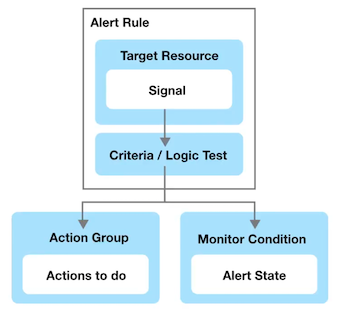

# Administrator Certification (AZ-104) CheatSheet 2

## 1 Azure Disks

**Azure Managed Disks** are **block-level storage volumes** that are managed by Azure and used with Azure VMs

Managed disks **are like a physical disk** in an on-premises server **but, virtualized**.

You specify **size, type and other configurations** without worrying about the underlying hardware


* Managed disks are designed for 99.999% availability.
* Azure creates **three replicas** of your data, allowing for high durability
* You can create up to 50,000 VM **disks** of a type in a subscription per region
* Allowing you to create up to 1,000 VMs in a virtual machine scale set using a Marketplace image.
* Managed disks are integrated with **availability sets**
* Managed disks support **Availability Zones**
* **Azure Backup** can be used to create a backup job with time-based backups and backup retention policies.
* You can use **Azure role-based access control (RBAC)** to assign specific permissions for a managed disk to one or more users.
* You can **directly import** your Virtual Hard drive Disks (VHD) into Azure Disks
* You can use **Azure Private Links** to ensure traffic between Azure Disks and VMs stay within the the Microsoft network

### Azure Disks - Encryption

Azure Managed Disks supports 2 types of encryption:

* **Server Side Encryption (SSE)**
* **Azure Disk Encryption (ADE)**

#### Server Side Encryption (SSE)

Provides encryption-at-rest and safeguards your data to meet your organizational security and compliance commitments. enabled **by default** for all managed disks, snapshots, and images

> **Temporary disk are not encrypted by server-side encryption unless you enable encryption at host**

Keys can be managed two ways:

1. **Platform-managed keys** - Azure manages your keys
2. **Customer-managed keys** - You manage your keys

#### Azure Disk Encryption (ADE)

**Allows you to encrypt the OS and Data disks used by an IaS Virtual Machine**

* For Windows encryption is done by **BitLocker**
* For Linux encryption is done by **DM-Crypt**

There are 3 main disk roles in Azure, the **data disk, the OS disk, the temporary disk** 

Its possible to see these three roles via remote access your VM (Windows 10 Pro below)


* System Reserved: **OS Disk**
* **Windows (C:)**  Data Disk
* Temporary Storage (D:)  Temporary Disk

### Azure Disks - Disk Roles

There are 3 main disk roles in Azure, the **data disk, the OS disk, and the temporary disk**

#### **Data Disk**

* a managed disk that's attached to a virtual machine to store application data, or other data you need to keep
* **registered as SCSI drives and are labeled with a letter that you choose**
* has a maximum capacity of 32,767 gibibytes (GiB)
* The size of the VM determines how many data disks you can attach and the type of storage you can use

#### **OS Disk**

* **Every virtual machine has one attached operating system disk.**
* **That OS disk has a pre-installed OS, which was selected when the VM was created**.
* This disk contains the boot volume.
* This disk has a maximum capacity of 4,095 GiB

#### **Temporary Disk**

* **Most VMs contain a temporary disk, which is not a managed disk.**
* **provides short-term storage for applications and processes, and is intended to only store data such as page or swap files**.
* Data on the temporary disk **may be lost during a maintenance event or when you redeploy a VM**.
* During a successful standard reboot of the VM, data on the temporary disk will persist.
* The temporary disk is typically /dev/sdb and onLinx and Windows VMs the temporary disk is D: by default.
* **not encrypted by SE unless you enable encryption at host**.


### Managed Disk Snapshots and Managed Custom Image

**A managed disk snapshot is a read-only crash-consistent full copy of a managed disk that
is stored as a standard managed disk by default**.

**Snapshots are point-in-time recovery**

* Snapshots exist independent of the source disk and can be used to create new managed disks
* Snapshots are billed based on the used size. (If you have a 64 GB drive and only use 10 GB you're only billed the 10GB)
* You can see the used size of your snapshots by looking at the Azure usage report.

A managed custom image allow you to create an image (a copy) of your disk from you VM

This image contains all managed disks associated with a VM, including both the OS and data disks.

### Managed Disk Snapshots and Managed Custom Image

#### managed disk snapshot

**A managed disk snapshot** is a read-only crash-consistent full copy of a **managed disk** that is stored as a standard managed disk by default.


* Snapshots are point in time recovery
* Snapshots exist independent of the source disk and can be used to create new managed disks
* Snapshots are billed based on the used size. (If you have a 64 GB drive and only use 10 GB you're only billed the 10GB)
* You can see the used size of your snapshots by looking at the Azure usage report.

#### managed custom image

**A managed custom image** allow you to create an image (a copy) of your disk from you VM

This image contains all managed disks associated with a VM, including both the OS and data disks.

A snapshot **doesn't have awareness of any disk except the one it contains**

This makes it problematic to use in scenarios that require the coordination of multiple disks, such as striping.

Snapshots would need to be able to coordinate with each other and this is currentlv not supported.

This is where you would want to use a **Managed Custom Image**

### Azure Disks - Disk Types


Azure offers 4 tiers of disks:

#### **1. Ultra Disks**

* deliver high throughput, high I/OPS, and consistent low latency disk storage for Azure VMs
* dynamically change the performance of the disk, without the need to restart your VM
* **suited for data-intensive workloads such as SAP HANA, top tier databases, and transaction-heavy workloads**
* can onlv be used as **data disks** (use a Premium SSD for OS Disk)
* Only supported with very specific VM series

#### 2. Premium SSD

* **high-performance and low-latency disk support for Azure VMs with input/output (10)-intensive workloads**
* suitable for mission-critical production applications
* only be used with VM series that are premium storage-compatible
* Guaranteed OPS, and throughput of that disk (Standard tiers don't have IOPS guarantees)
* designed to provide low single-digit millisecond latencies and target I0PS and throughput described in the preceding table 99.9% of the time

#### 3. Standard SSD

* cost-effective storage option optimized for workloads that need consistent performance at lower OPS levels
* Compared to standard HDDs, standard SSDs deliver better availability, consistency, reliability, and latency.
* Suitable for Web servers, low OPS application servers, lightly used enterprise applications, and Dev/Test workloads
* designed to provide single-digit millisecond latencies and the OPS and throughput up to the limits described in the preceding table 99% of the time
* IOPS and throughput may vary sometimes depending on the traffic patterns
* Available on all Azure VMs

#### 4. Standard HDD

* reliable, low-cost disk support for VMs running latency-insensitive workloads
* available on all Azure VMs
* Latency, OPS, and Throughput of Standard HDD disks may vary more widely as compared to SSD-based disks
* designed to deliver write latencies under 10ms and read latencies under 20ms for most 10 operations
* Available in all Azure regions and can be used with all Azure VMs


### Azure Disks - Bursting

**Disk Bursting** is the ability to **boost disk storage IOPS and MB/s performance** for a period of time on both VMs and disks.

Bursting allows you to handle unexpected disk traffic.

This allows you to get more use out of your disk, avoid to permanently upgrading to a more performance disk.

* Bursting on Disks and VMs are independent from one another
* If you have bursting disk you don't need a bursting VM

**Burstable VMs**

* Lsv2 series (All Regions)
* Ds3 series (West Central US)
* Esv3 series (West Central US)

> Bursting is enabled by default for virtual machines that support it.

**Burstable Disk**

* Premium SSDs for disk sizes P20 and smaller (All Regions)

### Azure Disks CheatSheet

* **Azure Managed Disks are block-level storage volumes** that are managed by Azure and used with Azure VMs
* Managed disks are designed for 99.999% availability.
* Azure creates **three replicas of your data**, allowing for high durability
* You can create up to **50,000 VM disks** of a type in a subscription per region
* Allowing you to create up to 1,000 VMs in a virtual machine scale set using a Marketplace image.
* Managed disks are integrated with **availability sets**
* Managed disks support **Availability Zones**
* **Azure Backup** can be used to create a backup job with time-based backups and backup retention policies.
* You can use **Azure role-based access control (RBAC)** to assign specific permissions for a managed disk to one or more users.
* You can **directly import** your Virtual Hard drive Disks (VHD) into Azure Disks
* You can use **Azure Private Links** to ensure traffic between Azure Disks and VMs stay within the the Microsoft network
* **Azure Managed Disks** supports 2 types of encryption:
	* Server Side Encryption (SSE) **enabled by default** for all managed disks, snapshots, and images
		* Temporary disk are not encrypted by server-side encryption unless you enable encryption at host
		* Keys can be managed two ways:
			* Platform-managed keys - Azure manages your keys
			* Customer-managed keys - You manage your keys
* Azure Disk Encryption (ADE) allows you to **encrypt the OS and Data disks used by an IaaS Virtual Machine**
* For Windows encryption is **done by BitLocker**
* For Linux encryption is done by **DM-Crypt**


There are 3 main disk roles in Azure, the data disk, the OS disk, the temporary disk

* **Data Disk**

	* a managed disk that's attached to a virtual machine to store application data, or other data you need to keep
	* registered as SCSI drives and are labeled with a letter that you choose
	* has a maximum capacity of 32,767 gibibytes (GiB)
	* The size of the VM determines how many data disks you can attach and the type of storage you can use

* **OS Disk**

	* Every virtual machine has one attached operating system disk.
	* That OS disk has a pre-installed OS, which was selected when the VM was created.
	* This disk contains the boot volume.
	* This disk has a maximum capacity of 4,095 GiB

* **Temporary Disk**
	* Most VMs contain a temporary disk, which is not a managed disk.
	* provides short-term storage for applications and processes, and is intended to only store data such as page or swap files.
	* Data on the temporary disk may be lost during a maintenance event or when you redeplov a VM.
	* During a successful standard reboot of the VM, data on the temporary disk will persist.
	* The temporary disk is typically /dev/sdb and on Linix and Windows VMs the temporary disk is D: by default.
	* not encrypted by SSE unless you enable encruption at host.

**A managed disk snapshot is a read-only crash-consistent full copy of a managed disk** that is stored as a standard managed disk by default.

* Snapshots are point in time recoverv
* Snapshots exist independent of the source disk and can be used to create new managed disks
* Snapshots are billed based on the used size. (If vou have a 64 GB drive and onlv use 10 GB vou're onlv billed the 10GB)
* You can see the used size of your snapshots by looking at the Azure usage report.

#### Managed disks （4 tiers of disks）

**A managed custom image** create an image (of your disk from you VM. Contains **all managed disks** associated with a VM, OS and data disks.


A snapshot **doesn't have awareness of any disk except the one it contains**.

For a single disk use a managed disk snapshot, for multiple disks such as striping use a **managed custom disk**


Azure offers 4 tiers of disks: **Ultra Disks, Premium SSD, Standard SSD, Standard HDD**

1. **Ultra Disks** deliver high throughput, high I/OPS, and consistent low latency disk storage for Azure VMs
	* dynamically change the performance of the disk, without the need to restart your VM
	* suited for data-intensive workloads such as SAP HANA, top tier databases, and transaction-heavy workloads
	* can only be used as data disks (use a Premium SSD for OS Disk), Only supported with very specific VM series
2. **Premium SSD** high-performance and low-latency disk support for Azure VMs with input/output (10)-intensive workloads
	* suitable for mission-critical production applications
	* only be used with VM series that are premium storage-compatible
	* Guaranteed OPS, and throughput of that disk (Standard tiers don't have OPS guarantees)
	* designed to provide low single-digit m latencies and target OPS and throughput described in the preceding table 99.9% of the time
3. **Standard SSD** cost-effective storage option optimized for workloads that need consistent performance at lower OPS levels
	* Compared to standard HDDs, standard SDs deliver better availability, consistency, reliability, and latency.
	* Suitable for Web servers, low OPS application servers, lightly used enterprise applications, and Dev/Test workloads
	* designed to provide single-digit ms latencies and the OPS and throughput up to the limits described in the preceding table 99% of the time
	* lOPS and throughput may vary sometimes depending on the traffic patterns, Available on all Azure VMs
4. **Standard HD reliable**, low-cost disk support for VMs running latency-insensitive workloads
	* vailable on all Azure VMs
	* Latency, lOPS, and Throughput of Standard HDD disks may vary more widely as compared to SSD-based disks
	* designed to deliver write latencies under 10ms and read latencies under 20ms for most I0 operations
	* Available in all Azure regions and can be used with all Azure VMs

## Introduction to Application Gateway

**Azure Application Gateway** is **application-level routing** and **load balancing** service.

Application Gateway operates on **OSI Layer 7** also known as the Application Layer.


* **Azure Web Application Firewall (WAF)** polices can be attached to an Application Gateway to provide additional security


You need to configure a **Frontends**

* **Private IP** will create an Internal Load Balancer
* **Public IP** will create an Public/External Load Balancer


You need to configure a **Backends**

You'll need to create Backend pools

* A backend pool is a collection of resources to which
your application gateway can send traffic.
* A backend pool can contain
	* virtual machines
	* virtual machines scale sets
	* IP addresses
	* domain names
	* App Service


**You need to configure Routing Rules**


### Application Gateway - Routing Rules

* **Listeners**

A listener "listens" on a **specified port and IP address for traffic that uses a specified protocol**.
If the listener criteria are met, the application gateway will apply this routing rule.

There are 2 types of listeners:

1. **Basic** - forward all requests for any domain to backend pools
2. **Multi-site** - forward requests to different backend pools based on **host header and host name**

* requests are matched according to the **order of the rules** and the type of listener
	* Add your basic listeners last otherwise it will capture all requests

**Backend targets**

Chooses where a route should go either **Backend Pool or Redirection**


**HTTP Settings**

* To create a rule for Backend Pool you need to create HTTP Setting.
* This allows to define how we want to handle cookies, connection draining, port request time out and more.


* **Backend Port**

the port where the back-end servers listen to incoming traffic

* **Cookie-based affinity**

Use cookies to keep a user session on the same server

* **Request Timeouts**

the number of seconds that the application gateway will wait to receive a response from the backend pool before it returns a "connection timed out" error message.

* **Override backend path**

allows you to override the path in the URL so that the requests for a specific path can be routed to another path

* **Override Hostname**

Multi-tenant services like App service or API management rely on a specific host header or SNI extension to resolve to the correct endpoint. 

**Change these settings to overwrite the incoming HTTP host header**

### Azure Application Gateway CheatSheet

**Azure Application Gateway is application-level** routing and load balancing service.

Application Gateway operates on **OSI Layer 7 also known as the Application Layer.**

* **Azure Web Application Firewall (WAF)** polices can be attached to an Application Gateway to provide additional security

An Application Gateway is composed of Frontends, Routing Rules and Backends:

* Frontends you choose an address type
	* Private IP will create an Internal Load Balancer
	* Public IP will create an Public/External Load Balancer
* **Backends you create Backend Pools**
	* Backend pools
		* A backend pool is a collection of resources to which your application gateway can send traffic.
		* A backend pool can contain, VMs, VM scale sets, IP addresses, domain names, App Service
* **Routing Rules are composed of Listeners, Backend targets, HTTP Settings**
* **Listeners** "listens" on a specified port and IP address for traffic that uses a specified protocol.
	* If the listener criteria are met, the application gateway will apply this routing rule.
	* There are 2 types of listeners:
		* **Basic** - forward all requests for any domain to backend pools
		* **Multi-site** - forward requests to different backend pools based on host header and host name
		* requests are matched according to the **order of the rules** and the type of listener
			* Add your basic listeners last otherwise it will capture all requests
* **Backend targets** Chooses where a route should go either **Backend Pool or Redirection**
	* To create a rule for Backend Pool you need to create **HTTP Setting.**
		* defines how we want to handle cookies, connection draining, port request time out and more.

## Azure Scale Sets

Azure Scale Sets allows you to **automatically increase or decrease your VM capacity**.

* Create Scaling Policies to automatically add or remove based on **Host Metrics**
* **Create Health checks and set a Repair Policy to replace unhealthy instances**
* Associate A Load Balancer to distribute VMs across AZs
* You can scale to *100s or even 1000s of VMs using scale sets*


A Scale Set is a **group of identical VMs** (same Image and size)

### Azure Scale Sets - Load Balancer

A Load Balancer can be **associated** with a Scale Set.

This will allow you to:

* evenly distribute your VMs across multiple Availability Zones to make your application Highly Available.
* Use Load Balancer probe checks for more robust Health checks


You have the choice between 2 different load balancers:

1. **Application Gateway is an HTTP/HTTPS web traffic** load balancer with 
	* URL-based routing, 
	* SSL termination, 
	* session persistence, 
	* web application firewall.
2. **Azure Load Balancer supports all TCP/UDP network traffic, port-forwarding, and outbound flows**.


### Azure Scale Sets - Scaling Policy

**A Scaling Policy** determine when a VMs should be added or removed to meet current capacity requirements

#### Scale Out

When a instance should be **added** to the Scale Set to **increase** capacity

eg. **When CPU Threshold (%) greater than X for Y minutes add X servers**


#### Scale In

When a instance should be **removed to the Scale Set to decrease capacity**

eg. **When CPU Threshold (%) less than X for Y minutes add X servers**


> When you are creating a Scale Set you have very limited options for your Scaling Policy


you want more metrics there are **2 ways to collect more information**:
 
 
1. **App Insights** installs a small **instrumentation package in your application that monitors the app and sends telemetry to Azure**.
	* When you want application metrics: **Page load performance, Session counts**
2. **Azure Diagnostic extension is an agent that runs inside a VM instance**. It monitors and saves
	* performance metrics to Azure storage so you can collect more detailed information
	* When you want more detailed Host-based metrics


### Azure Scale Sets - Scaling Policy 

#### Scale-In

Scale-In Policy is how determines what VM is removed (deleted) to decrease the capacity of the Scale Set

**Default**

* Delete the VM with the highest Instance ID
* Balanced across Availability Zones (AZs) and Fault Domains (ADs)

**Newest VM**

* Delete the newest created VM
* Balanced across Availability Zones (AZs)

**Oldest VM**

* Delete the oldest VM
* Balanced across Availability Zones (AZs)


#### Azure Scale Sets - Scaling Policy

After you create your ScaleSet you have a-lot more options available to configure the rules of your Scaling Policy

**Built-in Host-based metrics:**


* Percentage CPU
* Network In
* Network Out
* Disk Read Bytes
* Disk Write Bytes
* Disk Read Operations/Sec
* Disk Write Operations/Sec
* CPU Credits Remaining
* CPU Credits Consumed

**Aggerates**

Average / Minimum / Maximum /  Total / Last / Count

**Operators**

Greater than  / Greater than or equal to /  Less than /  Less than or / equal to / Equal to /Not equal to

**Actions**

* Increase count by X   /  Increase percent by X%  / Increase count to X
* Decrease count by X   / Decrease percent by X%   / Decrease count to X


#### Update Policy

**Update Policy** determine how VM instances are brought up-to-date with the latest scale set model

* **Automatic**

Increasing with start upgrading immediately in random order

* **Manual**

Existing instances must be manually upgraded

* **Rolling**

Upgrades roll out in batches with optional pause


* **Automatic OS upgrades**

Automatic OS upgrades can be enabled helps to ease update management by safely and automatically upgrading the OS disk for all instances


### Azure Scale Sets - Health Monitoring

**Health monitoring** can be enabled to determine if you server **is healthy or unhealthy**


There are 2 modes of health monitoring:

* **Application health extension**

Ping an HTTP request to a specific path and except a status 200

* **Load Balancer Probe**

Allow you to check based on TCP, UDP or HTTP requests.


**Automatic repair policy**

If an instance is found to be **unhealthy the delete it and launch a new instance**


### Azure Scale Sets - Advanced

#### **Allocation policy**

By default Scaling Sets are limited to 100 instances. 

You can beyond 100 (up to 1000 instances)


#### Proximity placement

Proximity placement groups allow you to group Azure resources physically closer together in the same region.

**By default a scale set has a a single placement that hold up to 100 VMs.**


If a scale **set property called single <mark>PlacementGroup is set to false</mark>**

then the scale set can be composed of multiple placement groups and has a range of 0-1,000 VMs.

### Scale Sets CheatSheet

Azure Scale Sets allows you to **automatically increase or decrease** your VM capacity.

**A Load Balancer can be associated with a Scale Set.**

* evenly distribute your VMs across multiple Availability Zones to make your application Highly Available.
* Use Load Balancer probe checks for more robust Health checks
* You have the choice between 2 different load balancers:
	* **Application Gateway is an HTTP/HTTPS web traffic load balancer application firewall**.
	* Azure Load Balancer supports all** TCP/UDP network traffic, port-forwarding, and outbound flows**.
* A Scaling Policy determine when a VMs should be added or removed to meet current capacity requirements
	* **Scale Out When a instance should be added to the Scale Set** to increase capacity
	* **Scale In When a instance should be removed to the Scale Set** to decrease capacity

* **Scale-In Policy is how determines what VM is removed** (deleted) to decrease the capacity of the Scale Set
	* Default Delete the VM with the highest Instance ID, Balanced across Availability Zones (AZ) and Fault Domains (ADs)
	* Newest VM Delete the newest created VM, Balanced across Availability Zones (AZs)
	* Oldest VM Delete the oldest VM, Balanced across Availability Zones (AZs)


* **Update Policy** determine how VM instances are brought up-to-date with the latest
	* **Automatic** Increasing with start upgrading immediately in random order
	* **Manual** Existing instances must be manually upgraded
	* **Rolling** Upgrades roll out in batches with optional pause

**Health monitoring** can be enabled to determine if you server is healthy or unhealthy.

There are 2 modes of health monitoring:

1. Application health extension: Ping an HTTP request to a specific path and except a status 200
2. Load Balancer Probe: Allow you to check based on TCP, UDP or HTTP requests.

**Automatic repair policy** If an instance is found to be unhealthy the delete it and launch a new instance

## Azure App Service

Quickly **deploy and manage Web apps** on Azure without worrying about the underlying infrastructure

### Introduction to Azure App Service

**Azure App Service is an HTTP-based service** for hosting **web applications, REST APIs, and mobile back ends**.

You can choose your **programming language** and either a **Windows** and **Linux** environment

It is a Platform as Service, so it's the **Heroku equivalent for Azure**.

**Azure App Service takes** care of the following underlying infrastructure

* Security patches for OS and languages
* Load balancing
* Autoscaling
* Automated manager

**Azure App Service** makes it easy to implement common 

Integrations and features such as:


* Azure DevOps (For deployments)
* Github Integration
* Docker Hub Integration
* Package Management
* Easy to setup staging environments
* Custom Domains
* Attaching TLS/SSL Certificates


When you create your app you have to choose a unique name since **it becomes a fully qualified domain**


You pay based on an Azure App Service Plan:

* **Shared Tier** - Free, Shared (Linux not supported)
* **Dedicated Tier** - Basic. Standard. Premium. PremiumV2. PremiumV3
* **Isolated Tier**

Azure App Services can also run docker single or multi-containers

### Azure App Service - Runtimes

**What is a Runtime Environment?**

A runtime software/instructions that are executed while your program is running,

A runtime generally means what **programming language and libraries and framework you are using**

A runtime for Azure App Services will be a pre-defined **container** that has your programming language and commonly used library for that language installed

With Azure App Services you choose a runtime.

* .NET
* .NET Core
* Java
* Ruby
* Node.is
* PHP
* Python

Azure App Services will have generally multiple latest versions of of a programming language eg. Ruby 2.6, 2.7

Its common to for a cloud provider to stop supporting older versions so you keep current and forces customer to keep good security practices by having latest patches

### Azure App Service - Custom Container

Azure App Service allows you defined **custom containers for Windows or Linux**

You might want to create your own custom container to use a different runtime or bundle in a packages or software


1. Create our own Docker Container on your local environment
2. Push the Docker container to **Azure Container Registry**
3. Deploy our Container Image to **App Service**

### Azure App Service - Deployment Slots

**Deployments Slots** allow you to **create different environments** of your web-application associated to a different hostname. 

This is useful when need a staging, or QA environment.

Think of it as a way to quickly clone your production environment for other uses.


You can also **Swap environments** This could be how you perform a Blue/Green deploy.


You can promote our staging to production by swapping, if something goes wrong you could swap them back.

### Azure App Service - App Service Environment

**App Service Environment (AS)** is an Azure App Service feature that provides a **fully isolated and dedicated environment** for securely running App Service apps at high scale

This allow you to host:

* Windows web apps
* Linux web apps
* Docker containers
* Mobile apps
* Functions

App Service environments (ASEs) are appropriate for application workloads that require:

* Very high scale
* Isolation and secure network access.
* High memory utilization

Customers can create multiple ASEs within a single Azure region or across multiple Azure regions making ASEs ideal for **horizontally scaling stateless application tiers in support of high requests per second (PS) workloads**

* ASE comes with its own pricing tier (Isolated Tier)
* ASEs can be used to configure security architecture
* Apps running on ASEs can have their access gated by upstream devices, such as web application firewalls (WAFs)
* App Service Environments can be deployed into Availability Zones (AZ) using zone pinning.


There are **2 deployment types** for an App Service environment (ASE):

1. External ASE
2. ILB ASE


### Azure App Service - App Service Environment


* **External ASE** exposes the ASE - hosted apps on an **internet-accessible IP address**.
* If the Vet is connected to your on-premises network, apps in your ASE also have access to resources there without additional configuration.
* Because the ASE is within the VNet, it can also access resources within the Vet without any additional configuration.


* **ILB ASE** exposes the ASE-hosted apps on an IP address inside your VNet.
* The internal endpoint is an **internal load balancer (ILB)**

### Azure App Service - Deployment

**What is Deployment?**

The action of pushing changes or updates from a local environment or repository into a remote environment.

Azure App Services provides many ways to deploy your applications:

* Run from Package
* Deploy ZIP or WAR (Uses Kudu)
* Deploy via FTP
* Deploy via cloud sync (Dropbox or One Drive)
* Deploy continuously (GitHub, BitBucket, and Azure Repos) uses Kudu and Azure Pipelines
* Deploy using a custom container CI/CD pipeline (Deploy for Docker Hub or Azure Container Registry)
* Deploy from local Git (Kudu build server,)
* Deploy using Github Actions
* Deploy using Github Actions containers
* Deploy with template (ARM templates)


**Run from a package** is when the files in the package a**re not copied to the wwwroot directory**.

Instead, the ZIP package itself gets **mounted** directly as the **read-only** wwwroot directory.

```
All other deployment methods in App Service have deployed to the following directory:

(Windows) D:\home\site\wwwroot
(Linux)   /home/site/wwwroot
```

Since the same directory is used by your app at runtime, it's **possible for deployment to fail** because of **file lock conflicts**, and for the app to behave unpredictably because some of the files are not yet updated.


### Deployment - Kudu service

**ZIP and WAR file deployment** uses the same **Kudu service** that powers continuous integration-based deployments.


* Kudu is the engine behind git deployments in Azure App Service.
* It's an open-source project that can also run outside of Azure

Kudu supports the following functionality for ZIP file deployment:

* Deletion of files left over from a previous deployment
* Option to turn on the default build process, which includes package restore
* Deployment customization, including running deployment scripts
* Deployment logs
* A file size limit of 2048 MB

You can deploy using

* Azure CLI
* Azure API via REST (cURL)
* Azure Portal

```
# Azure CLI
a webapp deployment source config-zip -resource-group <group-name> --name <app-name> --src clouddrive/<filename>.zip

# cURL
curl -X POST -u deployment_user> --data-binary @"<zip_file_path>" https://<app_name>.scm.azurewebsites.net/api/zipdeploy

# Azure PowerShell
Publish-AzWebapp -ResourceGroupName <group-name> -Name <app-name> -ArchivePath <zip-file-path
```

### Deployment - FTP

* You can use (File Transfer Protocol) FTP protocol to upload files.
* You will need your own FTP client. You just drag and upload your files.

Go to the Deployment Center


Get the FTP credentials for your FTP client

### Deployment - Dropbox  & OneDrive

You can use Dropbox or OneDrive to deploy using a cloud sync.

* Dropbox is third-party cloud storage service
* OneDrive is Microsoft's cloud storage service

You go to Deployment Center, configure for Dropbox or OneDrive.

* OneDrive: Apps\Azure Web Apps
* Dropbox: Apps Azure


This will sync with your **/home/site/wwwroot,** so you just update files in that folder.


### Shared Tiers

There are 2 shared: **Free, Shared**

**Free Tier provides:**

* 1 GB of disk space
* up to 10 apps on a single shared instance
* No SLA for availability
* Each app has a compute quota of 60 minutes per day

**Shared Tier provides**

* up to 100 apps on a single shared instance
* No SLA for availability
* Each app has a compute quota of 240 minutes per day

> Shared Tiers does not support Linux-based instances


**Dedicated Tiers**

Basic, Standard, Premium, PremiumV2, PremiumV3

**Basic**

* More disk space
* Unlimited apps
* 3 levels in this tier that offer varying amounts of compute power, memory, and disk storage


**Standard**

* scale out to three dedicated instances
* SLA of 99.95% availability
* 3 levels in this tier that offer varying amounts of compute
* power, memory, and disk storage

**Premium**

* scale to 10 dedicated instances
* availability SLA of 99.95%
* multiple levels of hardware

**Isolated Tier**

* dedicated Azure virtual network
* Full network and compute isolation
* scale out to 100 instances
* availability SLA of 99.95%

### Azure App Service - WebJobs

**WebJobs** is a feature of Azure App Service that enables you to run a program or script in the same instance as a **web app, API app, or mobile app.**

There is **no additional cost** to use Weblobs.

> WebJobs is not yet supported for App Service on Linux.

The following file types are supported:

* cmd, .bat, .exe (using Windows cmd)
* .ps1 (using PowerShell)
* .sh (using Bash)
* .php (using PHP)
* .py (using Python)
* .js (using Node.js)
* .jar (using Java)

**WebJobs Types**

* **Continuous - run continually until stopped**
	* Supports debugging
* Triggered - **run only when triggered**
	* (expose a webhook that can be called to enable scenarios like scheduling)
	* Doesn't support debugging
* WebJobs Scale (Only for Continuous)
	* **Multi Instance** - will scale your WebJob across all instances of your App Service plan
	* **Single Instance** - will only keep a single copy of your WebJob running regardless of App Service plan instance count 

   

### Azure App Services CheatSheet

**Azure App Service is an HTTP-based service** for hosting web applications, REST APIs, and mobile back ends.

* You can choose your **programming language and either a Windows and Linux environment**
* It is a Platform as Service, so **it's the Heroku or AWS Elastic Beanstalk equivalent for Azure**.


**Azure App Service** makes it easy to implement common
Integrations and features such as:

* Azure DevOps (For deployments)
* Github Integration
* Docker Hub Integration
* Package Management
* Easy to setup staging environments
* Custom Domains
* Attaching TLS/SSL Certificates

You pay based on an Azure App Service Plan:

* **Shared Tier** - Free, Shared (Linux not supported)
* **Dedicated Tier** - Basic, Standard, Premium, PremiumV2, PremiumV3
* **Isolated Tier**

Azure App Services vou supports the following runtimes: .NET, .NET Core, Java, Ruby, Node.js, PHP, Python

Azure App Services can also run **docker** single or multi-containers

* **Custom Containers** are supported, create a docker file, upload to Azure Container Registry and deploy

**Deployments Slots allow you to create different environments of your web-application**

* You can also Swap environments 
* This could be how you perform a Blue/Green deploy.


**App Service Environment (ASE)** is an Azure App Service feature that provides a **fully isolated and dedicated environment** for securely running 

* App Service apps at high scale
* Customers can create multiple ASEs:
	* within a single Azure region
	* across multiple Azure regions making ASEs

* ideal for **horizontally scaling stateless application tiers** in support of **high requests per second (RPS) workloads**.

* ASE comes with its own pricing tier (Isolated Tier)
* ASEs can be used to configure security architecture
* Apps running on ASEs can have their access gated by upstream devices, such as web application firewalls (WAFs)
* App Service Environments can be deployed into Availability Zones (AZ) using zone pinning.
* There are **2 deployment types** for an App Service environment (ASE):
	* External ASE
	* ILB ASE

Azure App Services provides many ways to deploy your applications:

**WebJobs** is a feature of Azure App Service that enables you to run a program or script in the same instance as a web app, API app, or mobile app.

* There is **no additional cost** to use WehJobs

## Azure Monitor

Azure Monitor comprehensive solution **for collecting, analyzing, and acting on telemetry
from your cloud and on-premises environments**

* Create Visual Dashboards
* Smart Alerts
* Automated Actions
* Log Monitoring

**Many Azure services by default are already sending telemetry data to Azure Monitor**

### The Pillars of Observability

**What is Observability?**

* The ability to measure and understand how internal systems
* work in order to answer questions regarding performance, tolerance,
* security and faults with a system/application.


To obtain observability you need to use **Metrics, Logs and Traces**

You have to use them together, using them isolated does not gain you observability

**Metrics**

A number that is measured over period of time eg. If we measured the CPU usage and aggerated it over
an a period we could have an **Average CPU metric**

**Logs**

A text file where each line contains event data about what happened at a certain time

**Traces**

A history of request that is travels through multiple Apps/services so we can pinpoint performance or failure.


### Anatomy of Azure Monitor

The **sources of common monitoring data** to populate datastores order by (Highest to Lowest)


* The two fundamental data stores are **Metrics and Logs**
* The functions that Azure monitor can performed

### Azure Monitor - Sources

**Application Code**: performance and functionality of application and code. **Performance traces, application logs, and user telemetry**.


* You need to install **Instrumentation Package** to collect data for **Application Insights**
* **Metrics** describing the **performance** and **operation** and custom metrics for your application
* **Availability Tests** responsiveness of your application from different locations on the public Internet
* **Logs** store operational data about your application including page views, application requests, exceptions, and traces.


* Send application data to **Azure Storage** for archiving.
* Details of **availability test** stored
* Debug snapshot data that is captured for a subset of exceptions is stored in Azure Storage


### Azure Monitor - Sources


* **Log Analytics Agent** is installed for for comprehensive monitoring
* **Dependency Agent** collects discovered data about **processes running on the virtual machine and external process dependencies**
* Agents can be installed on the OS for VMs running in Azure, On-premise or other cloud provider


* **Diagnostics Extension** collect performance counters store in **Metrics**
* **Application Insights Logs** collect logs and performance counters from the compute resource supporting your application to be analyzed with other application data
* **Azure diagnostics extension** always writes to an Azure Storage account.
	* Azure Monitor for VMs uses the Log Analytics agent to store heath state information in a custom location.
* **Diagnostics Extension** to stream the data to other locations using **Event Hubs**

	


**Metrics**

* **Platform metrics** will write to the **Azure Monitor metrics database** with no configuration.
* Access platform metrics from **Metrics Explorer**.

**Log Analytics**

* Trending and other analysis using **Log Analytics**
* Copy platform metrics to **Logs**

**Azure Storage**

Send resource logs to **Azure Storage** for archiving.


**Azure Event Hub**

Stream metrics to other locations using **Event Hubs**

**Resource Logs**

* Resource logs **provide insights** into the internal operation of an Azure resource.
* **Resource logs are created automatically**
* you must create a diagnostic setting to specify a destination for them to collected for each resource


### Azure subscription

Azure subscription: **Telemetry related to the health and operation of your Azure subscription**

**Azure Service Health** provides information about the health of the Azure services in your subscription that your application and resources rely on.

### Azure Tenant Active Directory

**Telemetry related to your Azure tenant** is collected from **tenant-wide services** such as **Azure Active Directory.**


**Azure Active Directory** reporting contains the history of sign-in activity and audit trail of changes made within a particular tenant.


### Azure Monitor API

You may need to monitor other resources that have telemetry that can't be collected with the other data sources.


For these resources, write this data to either Metrics or Logs using an **Azure Monitor API**.


Collect log data from any REST client and store in Log Analytics and **Azure Monitor metrics database**

### Azure Monitor - Data Stores

Azure Monitor collects **two fundamental**
types of data from sources: **Logs and Metrics**

#### Azure Monitor Logs

* collects and organizes log and performance data from monitored resources
* data logs are consolidated from different **sources into workspaces**
	* platform logs from Azure services,
	* log and performance data from virtual machines agents,
	* usage and performance data from applications can be consolidated
	* In a workspace so they can be analyzed together using a sophisticated query language capable of analyzing millions of records.

* Work with log queries and their results interactively using **Log Analytics**.

#### Azure Monitor Metrics

* collects numeric data from monitored resources into a time series database.
* Metrics are numerical values collected at regular intervals and describe some aspect of a system at a particular time
* lightweight and capable of supporting near real-time scenarios, useful for alerting and fast detection of issues
* You can analyze them interactively with **Metrics Explorer**

### Log Analytics Workspaces

**Log Analytics workspace** is a unique environment for Azure Monitor log data


Each **workspace** has its own data repository and configuration, and data sources and solutions are configured to store their data in a **particular workspace**

### Log Analytics

Log Analytics is a tool in the Azure portal used **to edit and run log queries with data in Azure Monitor Logs**.


**Log Analytics** uses a query language called KQL

### Kusto and Kusto Query Language (KSL)

**Azure Monitor Logs** is based on Azure Data Explorer, and log queries are written using the same **Kusto query language (KQL**

```
StormEvents
where EventType == 'Flood' and State == "WASHINGTON"
sort by DamageProperty desc
take 5
project StartTime, EndTime, State, EventType, DamageProperty, EpisodeNarrative
```

KQL can be used in:

* Log Analytics
* Log alert rules
* Workbooks
* Azure Dashboards
* Logic Apps
* PowerShell
* Azure Monitor Logs API

Kusto is based on relational database management systems, and supports entities such as **databases, tables, and columns.**

Some query operators include

* calculated columns
* searching and filtering on rows
* group by-aggregates
* join functions


Kusto queries execute in the context of some **Kusto database** that is attached to a **Kusto cluster**.

### Kusto Entities

Kusto is generally composed of the following entities: **Clusters, Databases, Tables, Columns, Functions**

* **Clusters** are entities that hold databases
* ***Databases*** are named entities that hold tables and stored functions
* **Stored functions** are named entities that allow reuse of Kusto queries or query parts.
* External tables are entities that reference data storedoutside Kusto database.
* **External tables** are used for exporting data from Kusto to
	* external storage as well as for querying external data without ingesting it into Kusto.
	* Tables are named entities that hold data.
A table has an ordered set of columns, and zero or more rows of data, each row holding one data value for each of the columns of the table
* **Columns** are named entities that have a scalar data type.
	* Columns are referenced in the query relative to the tabular date stream that is in context of the specific operator referencing them.


### Kusto Scalar Data Types

**What are Scalars?**

**Scalars are quantities** that are fully described by a magnitude (or numerical value) alone

In Kusto, data types are used for various things:

* columns can have defined data type,
* Function parameters expect specific data types and there are

**What are Data Types?**

A data type defines how a piece of data is interpreted g. An Integer number could be a datatype

* **bool, Boolean** 
* **datetime, date**
* **decimal** / **Int** / **long** 
* **guid, uuid, uniqueid** represents a 128-bit globally-unique value g. 74be27de-1e4e-49d9-b579-fe0b331d3642
* **real** represents a 64-bit wide, double-precision, floating-point number
* **string**  /  **Timespan**  / **Dynamic**
* **Null** is special value that represents a missing value. Any Datatype can hold a value of null

### Kusto Control Commands

**Control commands** can modify data and metadata and has it own syntax different from KQL

The following control command creates a new Kusto table with two columns

```
.create table Logs (Level:string, Text:string)
```


A verv common control command is "**.show**" for example this will count all tables

```
.show tables
| count
```


### Kusto Functions

**Functions** are reusable queries or query parts. Kusto supports several kinds of functions:

**Stored functions**, which are **user-defined functions** that are stored and managed a one kind of a database's schema entities.

User-defined function belongs to one of two categories:

* Scalar functions (input scalar datatypes, and outputs scalar datatypes)
* Tabular functions (in tabular data, and outputs tabular data)

**Query-defined functions**, which are **user-defined functions** that are defined and used **within the scope of a single query**.

**Built-in functions,** which are hard-coded (defined by Kusto and cannot be modified by users

* **Special functions** selects Kusto entities g. **cluster()**

```
cluster('help').database('Sample').SomeTable
```

* Aggregation functions performs a calculation on a set of values, and returns a single value eg. `count()`

```
StormEvents
where State startswith "W"
| summarize Count=count() by State
```

* Windows functions operate on multiple rows (records) in a row set at a time. eg. `row_number()`

```
range a from 1 to 10 step 1
| sort by a desc
| extend rn=row number( )
```

### Kusto Scalar Operators

* **Bitwise (binary) operators**
* **Logical (binary) operators**
* **Datetime /timespan arithmetic**
* **Numerical operators** (works on int, long and real)
* **String operators**
* **between operator** Matches the input that is inside the inclusive range.

These perform comparisons against a bunch of rows. There are a lot of tabular operators

* **count** - Returns the count of rows in the table

```
StormEvents | count
```

* **take** - returns up to the specified number of rows of data

```
StormEvents | take 5
```

* **sort** - Sort the rows of the input table into order by one or more columns

```
StormEvents
| where EventType == 'Flood'
| sort by DamageProperty desc
| take 5
| project StartTime, EndTime, State, EventType
```

* **project** - **returns a specific set of columns**.

```
StormEvents
| take 5
| project StartTime, EndTime, State, EventType
```

* **where** - Filters a table to the subset of rows that satisfy a predicate.

```
StormEvents
| where EventType == 'Flood' and State == 'WASHINGTON'
| take 5
| project StartTime, EndTime, State, EventType
```

* **top** - returns the **first N** records sorted by the specified

```
StormEvents
| where EventType == 'Flood'
| top 5 by DamageProperty desc
| project StartTime, EndTime, State, EventType
```

* **extend** - creates a new column by computing a value

```
StormEvents
| where EventType == 'Flood'
| top 5 by DamageProperty desc
| extend Duration = EndTime - StartTime
| project StartTime, EndTime, Duration
```

* **sumarize** - Aggregates groups of row

```
StormEvents
| summarize event_count = count() by State
```

* **render** - Renders results as a graphical output

```
StormEvents
| summarize event count=count() by bin(StartTime, 1d)
| render timechart
```

### Metrics Explorer

**Metrics Explorer** is a sub-service of Azure Monitor that allows you to **plot charts, visualize correlating trends, and investigate spikes and dips in metrics values**.


To visualize a metric you need to define:

* **Scope**: You can `select *resource(s)` Eg. VM, **StorageaAccount**
* **Metric**: The actual value you are interested in visualizing
* **Namespace**: a specific group of metric data within a resource
* **Aggregation**: how you want group the values into the final result

### Azure Alerts

**Alerts** notify you when issues are found with your infrastructure or application

They allow you to identify and address issues before the users of your system notice

Azure has 3 kinds of Alerts

1. Metric Alerts
2. Log Alerts
3. Activity Log Alerts

**When an alert is triggered you can be notified and have it take action**



* A resource such as an Azure VM is designated as the **Target Resource** and it omits a **signal**
* The **Alert Rule** defines who should we monitor and when should we react
* The **Signal** is a data payload emitted from the resource that could be the following types:
	* Metric
	* Log
	* Activity log
	* Application Insights
* The signal is evaluated against a **criteria or logical test** to determine if the alert has been triggered eg. **Percentage CPU > 70%**
* An action group contains actions to be that will be performed when alert is triggered
* The current state of your alert
	* **Monitor Condition** is set by the system
	* **Alert state** is set by the user
* An **action** could be a:
	* **Automation runbook, Azure Function, ISM, Logic App, Webhooks or Secure Webhooks**

### Azure Dashboards

Dashboards are a virtual workspaces to **quickly launch tasks for day-to-day operations and monitor resources**

Build custom dashboards based on projects, tasks, or user roles

### Azure Workbooks

**Workbooks** provide a flexible **canvas for data analysis** and the creation of rich visual reports within the Azure portal.

They allow you to tap into multiple data sources from across Azure and combine them into unified interactive experiences.

It tells a **story** about the performance and availability about your applications and services.


Workbooks are temporary workspaces to define a document-like format with visualization intertwined to help investigate and discuss performance.

### Application Insights

**Application Insights is an Application Performance Management (APM)** service 

It is a sub-service of Azure Monitor.

**What is an APM?**

Monitoring and management of **performance and availability** of software apps. APM strives to detect and diagnose complex application performance problems to maintain an expected level of service.

**Why use Application Insights?**

* automatically detect performance anomalies
* includes powerful analytics tools to help you diagnose issues and to understand what users do with your app
* designed to help you continuously improve performance and usability
* works for apps on a for .NET, Node.js, Java, and Python hosted on-premises, hybrid, or any public cloud.
* Integrates with your DevOps process
* can monitor and analyze telemetry from mobile apps by integrating with Visual Studio App Center


**Application Insights**

To use Application Insights **you need to instrument your application.**

* To instrument you need to install the instrument package (SDK)
* Or enable Application Insights using the Application Insights Agents when supported


> There are many ways to view your telemetry data

* Apps can be instrumented from anywhere
* When you set up Application Insights monitoring for your web app, you create an Application Insights resource in Microsoft Azure.
* You open this resource in the Azure portal in order to see and analyze the telemetry collected from your app.
* The resource is identified by an instrumentation key (ikey)

### Application Insights

**What does Application Insights Monitor?**

* Request rates, response times, and failure rates
* Dependency rates, response times, and failure rates
* Exceptions
* Page views and load performance
* AJAX calls
* User and session counts
* Performance counters
* Host diagnostics
* Diagnostic trace logs
* Custom events and metrics

**Where do I see my telemetry?**

* Smart detection and manual alerts
* Application map
* Profiler
* Usage Analysis
* Diagnostic search for instance data
* Metrics Explorer for aggerated data
* Dashboards
* Live Metrics Stream
* Analytics
* Visual Studio
* Snapshot debugger
* Power BI
* REST API
* Continuous Export

### Azure Monitor CheatSheet

* Azure Monitor comprehensive solution **for collecting, analyzing, and acting on telemetry** from your cloud and on-premises environments
	* Create Visual Dashboards
	* Smart Alerts
	* Automated Actions
	* Log Monitoring

Azure Monitor collects two fundamental types of data from sources: **Logs and Metrics**

* data logs are consolidated from different sources into workspaces
	* platform logs from Azure services,
	* log and performance data from virtual machines agents,
	* usage and performance data from applications can be consolidated
	* In a workspace so they can be analyzed together using a sophisticated query language capable of analyzing millions of records

* Work with log queries and their results interactively **using Log Analytics**

* **Azure Monitor Metrics** collects numeric data from monitored resources into a **time series database.**

	* Metrics are numerical values collected at regular intervals and describe some aspect of a system at a particular time
	* lightweight and capable of supporting near real-time scenarios, useful for alerting and fast detection of issues
	* You can analyze them interactively with **Metrics Explorer**

* **Log Analytics** is a tool in the Azure portal used **to edit and run log queries** with data in **Azure Monitor Logs**.
	* Log Analytics uses a query language called KQL

* **Log Analytics workspace** is a unique environment for Azure Monitor log data
	* Each **workspace** has its own data repository and configuration, data sources and solutions are configured to store their data in a **workspace**
* **Azure Monitor Logs** is based on Azure Data Explorer, and log queries are written using the same **Kusto query language (KQL)**
	* KQL can be used in: **Log Analytics, Log alert rules, Workbooks, Azure Dashboards, Logic Apps, PowerShell, Azure Monitor Logs API**
	* Kusto is based on relational database management systems, and supports entities such as **databases, tables, and columns**.
		* Some query operators include
			* **calculated columns, searching and filtering on rows, group by-aggregates, join functions**
		* Kusto queries execute in the context of some **Kusto database that is attached to a Kusto cluster**.
		* Kusto is generally composed of the following entities: **Clusters, Databases, Tables, Columns, Functions**
		* **Clusters** are entities that hold databases
		* **Databases** are named entities that hold tables and stored functions
		* **Stored functions** are named entities that allow reuse of Kusto queries or query parts.
		* **Tables** are named entities that hold data.
		* **Columns** are named entities that have a scalar data type.
		* **External tables** are entities that reference data stored outside Kusto database.
* Metrics Explorer is a sub-service of Azure Monitor that allows you to **plot charts, visualize correlating trends**, and **investigate spikes and dips in metrics values**. To visualize a metric you need to define:
	* **Scope**: You can select *resource(s)
	* **Namespace**: a specific group of metric data within a resource
	* **Metric**: The actual value you are interested in visualizing
	* **Aggregation**: how you want group the values into the final result
* Alerts notify you when issues are found with your infrastructure or application
	* They allow you to **identify** and **address** issues before the users of your system notice them.
	* Azure has 3 kinds of Alerts
		* Metric Alerts
		* Log Alerts
		* Activity Log Alerts
* **Azure Dashboards** are a virtual workspaces to **quickly launch tasks for day-to-day operations and monitor resources**
* Azure Workbooks provide a flexible canvas for data analysis and the creation of rich visual reports within the Azure portal.
	* It tells a story about the performance and availability about your applications and services.
* **Application Insights is an Application Performance Management (APM) service** It is a sub-service of Azure Monitor.
	* automatically detect performance anomalies
	* includes powerful analytics tools to help you diagnose issues and to understand what users do with your app
	* designed to help you continuously improve performance and usability
	* works for apps on a for .NET, Node.is, Java, and Python hosted on-premises, hybrid, or anv public cloud.
	* Integrates with your DevOps process
	* can monitor and analyze telemetry from mobile apps by integrating with Visual Studio App Center
* To use Application Insights **you need to instrument your application**.
	* To instrument you need to install the instrument package (SDK)
	* Or enable Application Insights using the Application Insights Agents when supported
	* Apps can be instrumented from anywhere
	* When you set up Application Insights monitoring for your web app, you create an Application Insights resource in Microsoft Azure.
	* You open this resource in the Azure portal in order to see and analyze the telemetry collected from your app.
	* The resource is identified by an instrumentation key (ikey)

## Azure Backup Service	

**Azure Backup Service** is a backup layer that spans many Azure services.

Azure Backup is directly integrated with Azure Services


**What can I backup?**

* On-Premise
* Azure VMs
* Azure Files
* SQL Server (within Azure VM)
* SAP HANNA databases (within Azure VM)
* Azure Database for PostgreSQL server

**Why use Azure Backup?**

* Offload on-premises backups
* Backup your VMs
* Scales Easily
* Get unlimited data transfer (no limit and no charge)
* Keep data secure (built-in security at-rest and in-transit)
* Centralized monitoring and management
* App Consistent Backups (restore apps back to an exact state)
* Automatic Storage Management
* Multiple Storage Options

### Azure Recovery Service Vault

**Azure Recovery Services (ARS) vault** is a **storage entity** in Azure that **houses data and recovery points** created over time.

The data is copies of data, or configuration information for VMs, workloads, servers, or workstations

Backup data for various Azure services: eg

* IaaS VMs (Linux or Windows)
* Azure SQL databases.

Recovery Services vaults supports:

* System Center (Data Protection Manager) DPM
* Windows Server
* Azure Backup Server
* and more.

Recovery Services vaults has the following **features**:

* Enhanced capabilities to help secure backup data
* Central monitoring for your hybrid IT environment
* Azure role-based access control (Azure RBAC)
* Soft Delete

### MARS agent

Microsoft Azure Recovery Services (MARS) agent can back up **files, folders, and system state** from Windows **on-premises machines and Azure VMs**

* Backups are stored in a Recovery Services vault in Azure
* MARS agent is also known as the Azure Backup agent
* The MARS agent does not support Linux operating systems


To install the agent and perform backups you'll need to:

* create an Azure Recovery Services vault
* Create a backup policy within the vault
* Configure secure route for back g. ExpressRoutes or Private Endpoints (optional)
* Download the MARS agent
* Install and register the Agent to your Windows machine.


### Azure Backup policy


To create a backup policy you choose a datasource type:

**Azure VMs or PSQL database**

* Choose the **frequency**
* How many snapshots you want to retain
* Choose the **time range** for your retention

### Azure Site Recovery

**Azure Site Recovery (ASR) is a hybrid** (on-premise to cloud) backup solution for **site-to-site recovery**.

ASR is one of the tools useful for your **business continuity and disaster recovery (BCDR) strategy**


* Site Recovery replicates workloads from a **primary site to a secondary site.**

* In case primary site suffers a failure, Site Recovery will **failover to** the secondary site to ensure continuity of services

Site Recover can replicate:


* Azure VMs between regions (cross region replication)
* Windows, Any OS and Linux
* On-premise to Azure
* Between other Cloud Service Providers eg AWS to Azure
* VMWare, Hyper-V or Physical Machines


* <Mark>**Recovery Point Objectives (RRO)** how quickly you can recover a backup after expericing a disaster</Mark>
* <Mark>**Recovery Time Objectives (RTO)** how often you backup (how much data lost can you tolerate?</Mark>


### Azure Backup CheatSheet

**Azure Backup Service** is a backup layer that spans many Azure services.


* On-Premise, Azure VMs, Azure Files, SQL Server (via Azure VM), SAP HANNA databases (via Azure VM), Azure Database for PostgreSQL
* Azure Backup is directly integrated with Azure Services (You won't find it by searching based on the service name)
* Offload on-premises backups
* Backup your VMs
* Scales Easily
* Get unlimited data transfer (no limit and no charge)
* Keep data secure (built-in security at-rest and in-transit)
* Centralized monitoring and management
* App Consistent Backups (restore apps back to an exact state)
* Automatic Storage Management
* Multiple Storage Options


**Azure Recovery Services (ARS) vault is a storage entity** in Azure that houses data and recovery points created over time.

* Enhanced capabilities to help secure backup data
* Central monitoring for your hybrid IT environment
* Azure role-based access control (Azure RBAC)
* Soft Delete
* Cross Region Restore

Microsoft Azure Recovery Services (MARS) agent backups **files, folders, and system state** from Windows **on-premises machines and Azure VMs**


* Backups are stored in a Recovery Services vault in Azure
* MARS agent is also known as the Azure Backup agent
* The MARS agent does not support Linux operating systems
* **Azure Site Recovery (ASR) is a hybrid (on-premise to cloud) backup solution for site-to-site recovery**.

## ACI

### Introduction to ACI

Azure Container Instances (ACIs) allow you to **launch containers** without the need to worry about configuring or managing the underlying virtual machine

Azure Container Instances is designed for isolate containers:

* simple applications
* task automation
* build jobs


* Containers can be provisioned **within seconds** where VMs can take several minutes
* Containers are **billed per second** where VMs are billed per hour (greater savings)
* Containers have **granular and custom sizing of CPUs**, Memory and GPs where VMs sizes are predetermined
* ACI can deploy both **Windows and Linux** containers
* You can **persist storage with Azure Files** for your ACI containers
* ACIs are accessed via a fully qualified domain name (FQDN) eg *customlabel.azureregion.azurecontainer.io*.


Azure provides Quickstart images to start launching example applications but you can also **source** containers from:


* Azure Container Registry
* Docker Hub
* Privately Hosted Container Registry


**Container Groups** are collection of containers that get
scheduled on the same host machine.

The containers in a container group share:


* lifecycle
* local network
* storage volumes
* Resources

> Container Groups are similar to a Kubernetes pod

Multi-container groups **currently support only** Linux containers.

There are two was to deplov a multi-container group:


* **Resource Manager Template (ARM template)**  when you need to deploy additional Azure service resources
* **YAMI File** - when vour deployment includes onlv container instances.

### Container Restart Policies

**A container restart policy** specifies what a container should do when their process has completed


Azure Container Instances has 3 restart-policy options:


* **Always** (default) Containers are **always restarted**. Suited for long running tasks eg. **web-server**s
* **Never** Containers run **one time only**. Suited for one off tasks. eg. **background jobs**
* **OnFailure** Containers that encounter an error


### Container Environment Variables

Environment variables (En Vars) allow you to pass configuration details to your containers.

Environment variables can be set via the **Azure Portal, CLI or PowerShell**

**Secured Environment Variables**

By default Environment Variables are store in plaintext.

If you need to secure our environment variables you can use the `--secure-environment-variables` flag

```
az container create
	--resource-group aci-resource-group \
	--name aci-demo-secure \
	--image examoro/rails:backend \
	--in-address Public \
	--location eastus \
	--secure-environment-variables \ 
	 STRIPE_SECRET_KEY=$STRIPE_SECRET_KEY
```

### Container Persistent Storage

**Azure Containers** are **stateless** by default.

When a container crashes or stops all state is loss.

To persist state you need to **mount** an external volume

```
az container create
	--resource-group exampro-resource-group\
	--name my-app\
	--image exampro/web-app\
	--in-address Public \
	--location eastus \
	--azure-file-volume-account-name $STORAGE_ACCOUNT_NAME \
	--azure-file-volume-account-key $STORAGE_KEY \
	--azure-file-volume-share-name my-fileshare \
	-azure-file-volume-mount-path /aci/logs/
```

#### Container Troubleshooting

To troubleshoot a container you can pull logs with 

**az container logs**

```
az container logs \
	--resource-group exampro
	--name prod-web-app
```

To get diagnostic information during container startup use the **`az container attach`**

```
az container attach \
-resource-group exampro
-name prod-web-app
```

To start an interactive container run **`az container exec`**

```
az container exec \
	--resource-group exampro\ 
	--name my-web-app \
	--exec-command /bin/sh
```

To get metrics such as CPU usage **`az monitor metrics list`**
	
```
az monitor metrics list \
	--resource $CONTAINER_ID \
	--metric CPUUsage \
	--output table
```

### Azure Container Images CheatSheet

Azure Container Instances (ACIs) allow you to **launch containers** without the need to worry about configuring or managing the underlying virtual machine

Azure Container Instances is designed for isolate containers:

* simple applications
* task automation
* build jobs

* Containers can be provisioned **within seconds** where VMs can take several minutes
* Containers are **billed per second** where VMs are billed per hour (greater savings)
* Containers have **granular and custom sizing of CPUs**, Memory and GPs where VMs sizes are predetermined
* ACI can deploy both **Windows and Linux** containers
* You can **persist storage with Azure Files** for your ACI containers
* ACIs are accessed via a fully qualified domain name (FQDN) eg *customlabel.azureregion.azurecontainer.io*.

**Container Groups** are collection of containers that get scheduled on the same host machine.

* The containers in a container group share: Lifecycle, Resources, local network, storage volumes
* Container Groups are similar to a Kubernetes pod
* Multi-container groups currently support only Linux containers.

There are two ways to deploy a multi-container group:

* **Resource Manager Template (ARM template)** - when you need to deploy additional Azure service resources
* **YAM File** - when vour deplovment includes only container instances.


Azure Container Instances has 3 restart-policy options:


* **Always** (default) Containers are **always restarted**. Suited for long running tasks eg. **web-servers**
* **Never** Containers run **one time only**. Suited for one off tasks. eg. **background jobs**
* **OnFailure** Containers that encounter an error

Azure Containers are **stateless** by default. When a container crashes or stops all state is loss.

To persist state you need to **mount** an external volume

You can mount **the following external volumes**:

Azure Files (file share), Secret volume, Empty Directory, Cloud git repo


Container troubleshooting (azure CLI commands you show know):

* **az container logs** - pull logs
* **az container attach** - diagnostic information during container startup
* **az container exec** - interactive container run
* **az monitor metrics list** - get metrics such as CPU usage

## Azure Container Registry (ACR)

**Create and maintain** **Azure container registries** to store and manage your private Docker container images and related artifacts.

**Azure Container Registry** is a managed, private **Docker registry service based on the open-source Docker Registry 2.0**

* Use **Azure Container Registries** with your existing container development and deployment pipeline
* use **Azure Container Registry Tasks** to build container images in Azure.

Pull images from an Azure container to **various deployment targets:**

**Kubernetes,  DC/OS,  Docker Swarm**

Many Azure services have direct support to use ACR:

* Azure Kubernetes Service (AKS)
* Azure App Service
* Azure Batch
* Azure Service Fabric


Developers can also **push to a container registry** as part of a container development workflow with delivery tools such as:

* Azure Pipelines
* Jenkins

Many ways to work with ACR via:

* Azure CLI
* Azure PowerShell
* Azure Portal
* Azure SDK
* Docker Extension for Visual Studio Code


### Azure Container Registry Tasks

**ACR Tasks allow you to automate OS and framework patching** for your Docker containers.

For Quick tasks you can push a single container image to a container registry on-demand, in Azure,
_without needing a local Docker Engine installation_

You can trigger automated builds by:

* **source code updates**
* **updates to a container's base image**
* **Timers on a schedule**

**You can create multi-step tasks**

* Each ACR Task has an associated **source code context**
	* the location of a set of source files used to build a container image or other artifact

* Tasks can take **advantage of run variables**
	* reuse task definitions and standardize tags for images and artifact

	
### Azure Container Registry CheatSheet

**Azure Container Registry** is a managed, private **Docker registry service** based on the open-source Docker Registry 2.0

* Use **Azure Container Registries** with your existing container development and deployment pipelines
* use **Azure Container Registry Tasks** to build container images in Azure.

Pull images from an Azure container registry to various deployment targets:

**Kubernetes,  DC/OS,  Docker Swarm**

**Azure Container Registry (ACR) Tasks** allow you to **automate OS and framework patching** for your Docker containers.

* You can trigger automated builds by:

	* source code updates
	* updates to a container's base image
	* Timers on a schedule

* You can create **multi-step tasks**
* Each ACR Task has an associated **source code context**
* Tasks can take advantage of **run variables**

## Azure Kubernetes Service (AKS)

### Introduction to AKS

Azure Kubernetes Service (AKS) makes it simple to **deploy a managed Kubernetes cluster in Azure**

Azure will manage for you the:   (**AKS service is free**)

* Kubernetes masters
* health monitoring
* maintenance

> **You only pay for the agent nodes within the cluster not the masters**

You only have to maintain the:

* agent nodes

When you deploy an AKS cluster, the Kubernetes master and all nodes are deployed and configured for you
Additional features can also be configured during the deployment process such as:

* Advanced networking
* Azure Active Directory integration to use Kubernetes role-based access control (Kubernetes RBAC)
* Monitoring
* Windows Server containers are supported in AKS

You should use AKS for scenarios where you need full container orchestration:

* service discovery across multiple containers
* automatic scaling
* coordinated application upgrades

### Bridge to Kubernetes

**Bridge to Kubernetes is a extension** in **Visual Studio and Visual Studio Code** that allows

developers to write, test and debug microservice code on their development workstations

* Bridge to Kubernetes allows you include a **locally running service** to your AKS cluster.
* Side-stepping to create Docker, Kubernetes configuration

For the lifetime of this connection, a proxy is added to your cluster in place of your Kubernetes deployment that redirects requests to the service to your development computer. When you disconnect, the application deployment will revert to using the original version of the deployment running on the cluster.


```
az aks get-credentials --name 'borg' --resource-group 'borg'
```

### Azure Kubernetes Service CheatSheet

* Azure Kubernetes Service (AKS) makes it simple to deploy a managed Kubernetes cluster in Azure
* Azure will manage for you the:
	* Kubernetes masters
	* health monitoring
	* maintenance
* You only have to maintain the: **agent nodes**
* AKS service is free, You only pay for the agent nodes within the cluster not the masters
* You should use AKS for scenarios where you need **full container orchestration:**
	* service discovery across multiple containers
	* automatic scaling
	* coordinated application upgrades
* **Bridge to Kubernetes is a extension in Visual Studio and Visual Studio Code** that allows developers to write, test and debug microservice code on their development workstations


## Azure DNS

### What is a Domain Name System (DNS)?

It is a service that is responsible for **translating (or resolving) a service name** to its IP address.

**Azure DNS is a hosting service** for **DNS domains** that provides name resolution by using Microsoft Azure infrastructure

#### **Public DNS** Internet-facing


* Allows you to manage domains for internet accessible domains
* Pointing your domain to your website
* Setting records to prove you own the domain
* Records to connect you domain to your email server

#### Private DNS Internal-facing

* Allow you to use your own custom domains instead of the Azure provided domains
* Many Azure Services use fully qualified domain name (FQDN) to identify services on the network.
* eg. Azure Storage Accounts FQDN: **http://storageaccount.file.core.windows.net/**

**You can't use Azure DNS to buy a domain name.**

> You can purchase a domain in App Services or a third-party provider and have Azure DNS manage

### Azure DNS - Zones, Records and Record Sets

**What is a DNS zone?**

A DNS zone is a container for all your DNS records for a specific domain name


**What is a record?**

A DNS record is a rule that says where to send your domain name

A record is composed of **name, type and value:**

* The **name** tells the record how to listen eg. Www
* The **type** tells how to handle the record eg A go to the IP address
* The **value** inform us what we should eg. IP address value 104.194.51.120


**What is a record set?**

Sometimes you need to group a bunch of records together, this is what is called a record set.

In Azure DNS you always create record sets, even if they only contain a single record.

This record set has multiple records for Name Servers(NS), so if your primary DNS server becomes available it will know to you the second, third or fourth DNS server as a backup server.


### Azure DNS - Records Sets

In Azure you always create Record Sets even when you just want a single record.

#### **Naming your Record**

* Name A record that has a name is considered a Fully qualified domain (FQDN) or you can think of it as a subdomain eg. **https://www.exampro.co**
* **No Name** A record that is left emptv is considered an apex or **naked domain** eg. **https://exampro.co**
* **Wildcard** You can set wildcards which act as catch-alls. Eg * or * trek


**@ You can use an at-sign (@) as vour name**. This is shorthand for saying ORIGIN. So this means you're pointing to the naked domain.

#### What is a Time to Live (TTL)?

TTL tells other servers requesting you domain how long it should cache this record so it doesn't need to frequently ask you what to do.

* **A long TTL** can reduce costs because servers check less frequently
* **A short TTL** can have failover happen faster, since you have to wait for the cache to expiry for a server to see that you've changed a record to point to you backup server.

### Azure DNS - Records Sets

Record Type: Azure Supports the following types of records


* A **Address** lets you point your domain to an IPv4 address
* AAAA lets you point your domain to an IPV6 address
* **CAA Certificate Authorities (CAs)** records authorized who can issue certificates for their domain
* **CNAME Canonical Name record** creates an alias from one domain to another so you set the record value to a domain
* **MX Mail Exchange** records point to mail servers that handle emails
* **NS Name Server records** identify multiple DNS servers for the domain and there are multiple in case the primary DNS server fails
* **PTR Pointer record points** to a domain or hostname but is used for reverse DNS lookup
* **SRV Service record** is used to identify computers that host specific services, like locating Domain Controllers for Active Directory
* **TXT Text records** is just text, and can serve multiple purposes, such as documentation or as a means of verification
* **SO Start of Authority** record contains administrative details about a domain


Azure has its own **special record type** called an **Alias** that work with **A, AAAA and NAME records**

Azure Alias record points directly to an Azure resource instead of to an IP or hostname

Imagine you were pointing to an IP or hostname and you deploy a service which causes the IP to change. You domain would be left **dangling** (pointing to now where) And you would have to manually update the record to the new correct address.

Azure Alias records always point to the right place.


### Azure DNS CheatSheet

* **Domain Name System (DNS)** It is a service that is responsible for **translating (or resolving) a service name** to its IP address.
* **Azure DNS is a hosting service for DNS domains** that provides name resolution by using Microsoft Azure infrastructure
	* You can't use Azure DNS to buy a domain name.
* Public DNS Internet-facing
	* Allows you to manage domains for internet accessible domains
	* Pointing your domain to your website
	* Setting records to prove you own the domain
	* Records to connect you domain to your email server

* **Private DNS** Internal-facing
	* Allow you to use your own custom domains instead of the Azure provided domain
* **DNS zone is a container** for all your DNS records for a specific domain name
	* A **Address** lets you point your domain to an IPv4 address
	* AAAA lets you point your domain to an IPV6 address
	* **CAA Certificate Authorities (CAs)** records authorized who can issue certificates for their domain
	* **CNAME Canonical Name record** creates an alias from one domain to another so you set the record value to a domain
	* **MX Mail Exchange** records point to mail servers that handle emails
	* **NS Name Server records** identify multiple DNS servers for the domain and there are multiple in case the primary DNS server fails
	* **PTR Pointer record points** to a domain or hostname but is used for reverse DNS lookup
	* **SRV Service record** is used to identify computers that host specific services, like locating Domain Controllers for Active Directory
	* **TXT Text records** is just text, and can serve multiple purposes, such as documentation or as a means of verification
	* **SO Start of Authority** record contains administrative details about a domain
* Azure has its own s**pecial record type called an Alias that work with A, AAAA and CNAME records**
	* Azure Alias record points directly to an Azure resource instead of to an IP or hostname (helps avoid dangling domains)
* **Record Set A group of records**. Azure always creates a record set, even with a single record
* **Time to Live (TTL)** says how long a value should be cached


## Azure Virtual Network (VNet)

Virtual Network (Net) is a logically isolated section of the Azure Network where you launch your Azure resources.

* Azure DNS - manage your own DNS domain
* **Virtual Network (NET)** - logically isolated section of Azure network
	* Address spaces
	* Route Tables
	* Subnets
* **Network Security Groups** A virtual firewall at the subnet or NIC level
* **ExpressRoute** A 50 Mbps-10 Gbps connection between on-premise to VNET
* **Virtual WAN** a centralized network to route different network connections
* **Virtual Network Gateway** - A site-to-site VPN connection between an Vet and local networks
* **Network Interfaces** virtual network device to allow your VMs to communicate using IP protocols


## VNeT Peering

VET peering is when you connect **multiple Vet so they act as one network.**


There are 2 types of VNet Peering:

1. **Regional Vet Peering** When you peer two Vets from the same region
2. **Global Vet peering** When you peer two Vets from two different regions


## Network Interfaces

**What is a Network Interface?**

**Software or hardware interface** between two pieces of equipment or protocol lavers in a computer network.

**A Network Interface Controller (NIC)**

A computer hardware component that connects a computer to a computer network. Also known as:

* network interface card
* network adapter
* LAN adapter
* physical network interface


* NICs communicate using **Internet Protocol (IP)**
* NICs are devices for both the:
	* Data Link Layer (Layer 2)
	* Physical Layer (Layer 1)


**Azure Network Interfaces (NICs)**

* **Azure Network Interfaces are attached to Azure VM instance**.
* Without an NIC, An Azure VM instance would have no way to communicate.
* **An Azure VM instance has to have an NIC and can have multiple NICs**.

## Network Routes and Routes Tables

**What is a Route Table?**

A Route Table is table of data stored in router or network host that list routes to next destinations.


**Routes are the roads to your virtual network.** Without them data would not know where to go.

**Default System Routes**

By default Azure creates a route table with **defaults routes and associates them to your subnets** so you don't have to do anything to get routing,

<mark>If you were to check the **Azure Route Table service** you won't see these default route tables since it hidden and managed by Azure for you. Azure sets the following **default routes**:</mark>


* A route to your VNet
* A route to the Internet
* Reserved for private use in FC 1918 so don't go anvwhere
* Reserved in REC 6598

### User Defined Routes

You can override the system routes assigned to your subnets by creating a new route table and associating it with a subnet

**A User defined Route table can be assigned to multiple subnets**, but a **Subnet can only have one user defined route table When you create your user defined route table**, all the default system routes remain unless you override them within your route table

* **<mark>If you wanted to have a private subnet (a subnet that cannot reach the internet)</mark>**
* You would just create a **new route for 0.0.0.0/0 that hops to None**


* The Next Hop is where to send the route:
* **The virtual appliance is a VM that runs a network application** eg. Firewall In this hop type you also have to provide the Private IP address to the VM


## VNet - Address Spaces

### What is an Address Space?

It is a **range of available IP addresses** that you are **allocating** for you use within your Virtual Network (VNeT)

The amount of IP addresses available is determined based on the CID range notation g. 10.0.0.0/24


* A CID Block of /24 will allocate 256 possible addresses
* A CID Block of /27 will allocate 32 possible addresses

* Azure Virtual Network (VeT) allows you defined a multiple address spaces
* Address ranges cannot overlap **within the same VNet**

The address count is not the actual available IP addresses as Azure will reserve 5 of the IP addresses:


* x.x.x.0: Network address
* x.x.x.1: Reserved by Azure for the default gateway
* x.X.X.2, x.x.X.3: Reserved by Azure to map the Azure DNS IPs to the VNet space
* x.x.x.255: Network broadcast address (the last IP in the range, its not always 255)

## VNeT - Subnets

* **What is a Subnet?**

A subnet is a **logical division of an address space**. Subnets help you **define different kinds of workloads** and allows you to apply virtual isolation within your network. When you launch an Azure resource you choose the subnet you want to launch within and an IP from that subnet is assigned to your resource

**Associating a Route Table**

A subnet needs a Route Table so it can access

* **Public vs Private Subnet**

	* Public and Private subnet describes whether a subnet is reachable from the internet or not.
	* Azure **has no concept of private and public subnets** and its up to you to configure our subnets to have ensure they do no reach the internet by ensuring they **have no route via the their route table to the Internet Gateway**


* **Associating Network Security Gateways (NSG)**

You can associate an NSG to protect traffic entering and leaving your subnet by applying security rules that can Allow or deny access based on IP address, port and protocol.

* **Gateway Subnet**

Azure has a special type of Gateway Subnet that is used by **Azure Virtual Network Gateway** and that service Launches specialized VMs into that subnet.


## Private Links

**Azure Private Links** allows you to **establish secure connections** between Azure resources so traffic **remains within the Azure Network**


* **Private Link Endpoint** is an **Network Interface** that connects you privately and securely to a service powered by Azure Private Link. Private Endpoint uses a private IP address from your VNet


* **Private Link Service** allows you to connect your own workload to Private Link. You need an **Azure Standard Internal Load Balancer** and associate it with the Link Service


* Third-Party provides can be powered by **Private Link**
* Many Azure services by default work with **Private Link eg. Azure Storage, CosmoDB, SQL**

## Azure ExpressRoute

**Azure ExpressRoutes** creates **private connections** between Azure datacenters and infrastructure on your premises or in a colocation environment

Connectivity can be from an:

* any-to-any (IP VPN) network
* a point-to-point Ethernet network
* virtual cross-connection

ExpressRoute connections don't go over the public Internet and as a result can offer: **more reliability, faster speeds, consistent latencies, higher security**

through a connectivity provider at a **colocation facility**


* Microsoft Peering for Office 365, Dynamics 365, Azure Public Services (Public IP)
* Azure Private Peering for VNets

---

* **ExpressRoute Direct** allows for **greater bandwidth connections** from 50 Mbps to 10Gbps 
* Ideal where for hybrid solutions with massive amounts of data or where latency matters

## Azure Firewall

**Azure Firewall** is a managed, **cloud-based network security service** that protects your **Azure Vets** resources

It is a fully stateful Firewall as a Service (FWaaS) with:

* built-in high availability
* unrestricted cloud scalability

You can centrally **create, enforce, and log** application and network connectivity policies across subscriptions and virtual networks.

Azure Firewall uses a **static public IP address** for your Vet resources allowing outside firewalls to identify traffic originating from your virtual network. 

The service is fully integrated with **Azure Monitor** for logging and analytics.


* You launch an Azure Firewall in its on VNet
* Other Vets pass through this Central Vnet
* You get **Microsoft Threat Intelligence**
	* Blocks know malicious IPs and FODNs

## Azure Network Watcher

**Azure Network Watcher** provides tools to **monitor, diagnose, view network metrics,** and enable or disable logs for resources in an Azure virtual network.

From Network Watcher you can access:

* IP flow verify checks
* Packet Capture
* Troubleshoot VPNs, NSGS
* NSG Flowlogs
* Diagnostic Logs
* Traffic Analytics
* Network Performance Monitor

Network Watcher **can** monitor and repair Azure resources you provision eg:

* Virtual Machines
* Virtual Networks
* Application Gateways
* Load balancer

Network Watcher is disabled by default in most regions so you need to enable it at per region basis


### Network Watcher Topology


* Network Watcher can visualize the topology of your VNets
* You can download the topology as an SVG you to use in presentations and documentation
* You can quickly discover and browse your networking components to quickly monitor and repair your virtual network

## Network Performance Monitor

**Network Performance Monitor (NPM)** is a **cloud-based hybrid network monitoring solution** that helps you **monitor network performance between various points in our network infrastructure**.


It also helps you monitor network connectivity to service and application
endpoints and monitor the performance of **Azure ExpressRoute**.

To use NPM you need to create an NPM resource

* In order to create an PM resource you need to create a **Log Analytics Workspace**


* The solution generates alerts and notifies you when a threshold is breached for a network link.
* It also ensures timely detection of network performance issues and localizes the source of the problem to a particular network segment or device.


Network Performance Monitor detects network issues like:

* traffic blackholing
* routing errors
* unconventional network Issues


## Azure Networking CheatSheet

**Virtual Network (Net)** is a logically isolated section of the Azure Network where you launch your Azure resources.

VNET peering is when you connect multiple Vet so they act as one network.

1. **Regional Net Peering** When you peer two Nets from the same region
2. **Global Vet peering** When you peer two Vets from two different regions


**Network Interface Controller (NIC)** software or hardware interface between two pieces of equipment or protocol layers in a network.

NICs communicate using **Internet Protocol (IP)**

**Azure Network Interfaces (NICs)**

* Azure Network Interfaces are attached to Azure VM instance.
* Without an NIC, An Azure VM instance would have no way to communicate.
* An Azure VM instance has to have an NIC and can have multiple NICs.

**Route Table** is table of data stored in router or network host that list routes to next destinations.

* By default Azure creates a route table with defaults routes (system routes) and associate them to your subnets
* You can override the system routes assigned to your subnets by creating a new route table and associating it with a subnet

**Address Space** **is a range of available IP addresses** that you are **allocating** for you use within your Vnet

* The amount of IP addresses available is determined based on the CID range notation

**Subnet is a logical division of an address space**

* A subnet needs a Route Table so it can access
* Public and Private subnet describes whether a subnet is reachable from the internet or not.
* Azure **has no concept of private and public subnets** and its up to you to configure our subnets to have ensure they do no reach the internet
* You can associate an NSG to protect traffic entering and leaving your subnet
* Azure has a special type of Gateway Subnet that is used by **Azure Virtual Network Gateway**

**Azure Private Links** allows you to **establish secure connections** between Azure resources so traffic **remains within the Azure Network**

* **Private Link Endpoint is an Network Interface** that connects you privately and securely to a service powered by Azure Private Link.
	* uses a private IP address from your Vnet
* **Private Link Service** allows you to connect your own workload to Private Link
	* You need an **Azure Standard Internal Load Balancer** and associate it with the Link Service
* Many Azure services by default work with Private Link eg. Azure Storage, CosmoDB, SQL
* Third-Party provides can be powered by Private Link

**Azure Firewall is a managed**, cloud-based network security service that protects your Azure Vets resources

* It is a fully stateful Firewall as a Service (FWaaS) with: built-in high availability and unrestricted cloud scalability
* You can centrally create, enforce, and log application and network connectivity policies across subscriptions and virtual networks.
* uses a static public IP address for your Net resources allowing outside firewalls to identify traffic originating from your virtual network
* fully integrated with Azure Monitor for logging and analytics.
* You launch an Azure Firewall in its on VNet
* Other Vets pass through this Central Vnet
* You get **Microsoft Threat Intelligence**
	* Blocks know malicious IPs and FQDNs

**Azure ExpressRoutes creates private connections** between Azure datacenters and infrastructure on your premises or in a colocation env

* Connectivity can be from an: **any-to-any (IP VPN) network, a point-to-point Ethernet network, virtual cross-connection**
* through a connectivity provider at a colocation facility

**ExpressRoute Direct** allows for **greater bandwidth connections** from 50 Mbps to 10Gbps.

### Azure Network Watcher CheatSheet

**Azure Network Watcher** provides tools to **monitor, diagnose, view network metrics**, and enable or disable logs for resources in an Azure Vnet

IP flow verify checks, Packet Capture, Troubleshoot VPNs, NSGs, NSG Flowlogs, Diagnostic Logs, Traffic Analytics, NPM

Watcher can monitor and repair Azure resources you provision:

* **Virtual Machines, Virtual Networks, Application Gateways, Load balancer**

* Network Watcher **cannot** be used to monitor PaaS (fully managed services) monitoring or Web Analytics
* Network Watcher is **disabled by default** in most regions so you need to enable it at per region basis
* Network Watcher can **visualize** the topology of your VNets
* **Network Performance Monitor (NPM) is a cloud-based hybrid network monitoring solution** that helps you monitor **network performance between various points** in your network infrastructure.

	* traffic blackholing
	* routing errors
	* unconventional network issues
	* generates alerts and notifies you when a threshold is breached for a network link


## Network Security Group

An NSG is composed of many Security Rules

Each Security Rule has the following properties:


* **Name** - A unique name within the network security group.
* **Source or destination** - An IP Address or CIDR block, Service Tag or
Application Security Group
* **Port Range** - Specify a single or range of ports. eg. 80 or 10000-10005
* **Protocol** - TCP, UDP, ICMP or ANY
* **Action** - Allor or Deny
* **Priority** - A number between 100 and 4096 (lower number higher priority)


**Inbound Rules** apply to traffic ***entering*** the NSG

**Outbound Rules** apply to traffic ***leaving*** the NSG


### NSG - Default Security Rules


### NSG - Security Rules Logic

Security Rules has **a lot of logic** to determine how to apply its rules

* You may not create two security rules with the same priority and direction.
* You can have 5000 NSG per subscription, 1000 NSG rules per NSG

**Priority**

* Rules are processed in priority order, with lower numbers processed before higher number
* Network security group security rules are evaluated by priority using the 5-tuple information to allow or deny
* traffic: 1] source 2] source port 3] Destination 4] destination port 5] protocol

**Flow Records**

* The flow record allows a network security group to be stateful.
* A flow record is created for existing connections
* Communication is allowed or denied based on the connection state of the flow record.

**Statefulness**

* **If you specific an outbound security port you don't need to set the inbound port since it will be set for you**.
* **You only need to specify an inbound security rule if communication is initiated externally.**
* The opposite is also true. If inbound traffic is allowed over a port, it's not necessary to specify an outbound security rule to respond to traffic over the port.

**Interruption**

* Existing connections may not be interrupted when you remove a security rule that enabled the flow.
* Traffic flows are interrupted **when connections are stopped and no traffic is flowing in either direction**, for at least a few minutes.

### Network Security Groups (NSG)

When there is **no NSG assigned to the Subnet or NIC then all traffic is allowed**


When an NSG is assigned to the NIC and **no NSG at the subnet than rules are predictable based on allow and deny rules**


An **NSG applied to a subnet applies its rules to all resources in that subnet**

First the NSG rules are evaluated at the subnet, Then the rules at the NIC are evaluated


If you wanted to **open port 80 you would need to allow port 80 on both the subnet and NIC NSG**


### Azure Network Security Groups CheatSheet

* **Network security group (NSG) filter network traffic** to and from Azure resources in a Vnet
* An NSG is composed of many **Security Rules**
	* **Name** - A unique name within the network security group.
	* **Source or destination** - An IP Address or CID block, Service Tag or Application Security Group
	* **Port Range** - Specify a single or range of ports. eg. 80 or 10000-10005
	* **Protocol** - TCP, UDP, ICMP or ANY
	* **Action** - Allor or Deny
	* **Priority** - A number between 100 and 4096 (lower number higher priority)


**Inbound Rules** apply to traffic ***entering*** the NSG

**Outbound Rules** apply to traffic ***leaving*** the NSG


* B Default Azure will set a bunch of inbound and outbound rules for you
* You may not create two security rules with the same priority and direction.
* You can have 5000 NSG per subscription, 1000 NSG rules per NSG
* Rules are processed in priority order, with lower numbers processed before higher number
* The flow record allows a network security group to be stateful.
* If you specific an outbound security port you don't need to set the inbound port since it will be set for you.
* The opposite is also true. If inbound traffic is allowed over a port, it's not necessary to specify an outbound security rule to respond to traffic over the port

## Azure Virtual WAN

**Azure Virtual WAN** is a **consolidated networking service** that brings many **networking, security, and routing functionalities** in a single operational interface.

These functionalities include

* branch connectivity (via connectivity automation from Virtual WAN Partner devices such as SD-WAN or VPN CPE)
* Site-to-site VPN connectivity,
* remote user VPN (Point-to-site)
* connectivity, private (ExpressRoute) connectivity,
* intra-cloud connectivity (transitive connectivity for virtual networks)
* VPN ExpressRoute inter-connectivity,
* routing
* Azure Firewall encryption for private connectivity.


Azure Virtual WAN itself is a **Software Defined WAN (SD-WAN)**

Azure Virtual WAN is a much better way to route to your branches, datacenters, Vet and cloud services.

### Azure Virtual WAN - PoPs

**A Point of Presence (PoP)**

Is an entry at the edge of a Network. eg. ISP Datacenter

* For enterprises, traversing the internet is not ideal for speed because 
* You have little not control on the fastest route through the internet

### Azure Virtual WAN - MPLS

* What if instead of using the Internet we **establish a private connection** through trusted partners datacenters
* We apply a **special label** to our packets so **special network devices** can read the label's end destination and forward it the packet through the most efficient route through this private network.
* This is what is known as **MPLS**


#### What is Multi-Protocol Label Switching (MPLS)?

It's a method of packet forwarding where instead of using IP Address and Layer 3 information to make forwarding
decisions an **MPLS label** is used to determine the shortest route to end destination.


* **MPLS is a private connection** linking data centers and branch offices.
* **MPLS is outsourced and managed by service providers** who guarantee network performance, quality and availability.
* **MPLS** uses a special network hardware that combines both a router and switch called a **Label Switch Router (LSR)**
* MPLS is efficient because the path for a Label across the network will be pre-determined called a Label Switched Path
* An MPLS Label is data inserted between Layer 2 and Layer 3 of your IP Packet and this is what they call a **Shim**

#### Why use an MPLS?

* **Virtual Private Networks (VPNs)** - It makes it easy to for us to establish private connections
* **Traffic Engineering (TE)** - We can control how are packets traverse the network
* **Quality of Service (QoS)** - We can ensure the performance and availability of our packets

**What is the downsides of MPLS?**

* They get really **expensive**
* Its **private** and **not secure** (its just a routing mechanism, there is no inherit encryption)
* With the rise of cloud services, you still have to traverse the internet any in many cases

If you want a fast and private connect to Azure you traverse the MPLS to a data center owned by trusted Azure partner and you establish your ExpressRoute to your VPN

* If you want to use public-facing cloud service like Office 365, traveling through your MPLS over
* ExpresRoute into the Microsoft Network to Office 365 and back through that route is not always fast


* Azure has Point of Presence (PoP) distributed all around the globe that have regional presence and so connecting to Office 365 will be generally faster going through the internet.

We still have to do some hopping but maybe there is a better way


### Azure Virtual WAN - SD WAN

**What is Software Defined WAN (SD-WAN)?**

SD-WAN decouples CPU intensive tasks from routers such as Management, Operations and the Control plane that can now be controlled in a central location remotely and virtually at your headquarters. Since most ISPs support SD-WAN architecture you can directly control the flow you of traffic through the internet.

* SD-WAN can replace MLPS, so you traverse the internet instead of a private network
* SD-WAN is more cost effective and require less configuration than an MLPS initially and at scale
* SD-WAN is secure because you will use HTTPS which is supported by your ISP


With SD-WAN you are **pre-determining** the path through the Internet. So you can perform the least amount of hops to the closest Azure Point of Presence (PoP)

With Azure VirtualWAN you are deploying Vet with service endpoints on the edge of a region which is called **Hubs**

You are configuring virtual devices in Virtual Wan so your on-premise can connect to your Hub so it has the fastest route to your Azure cloud resources.


### Azure Virtual WAN CheatSheet

**Azure Virtual WAN** is a **consolidated networking service** that brings many **networking, security, and routing** functionalities in a single operational interface.

* These functionalities include
	* branch connectivity (via connectivity automation from Virtual WAN Partner devices such as SD-WAN or VPN CPE)
	* Site-to-site VPN connectivity,
	* remote user VPN (Point-to-site)
	* connectivity, private (ExpressRoute) connectivity,
	* intra-cloud connectivity (transitive connectivity for virtual networks)
	* VPN ExpressRoute inter-connectivity,
	* routing
	* Azure Firewall encryption for private connectivity.

* Azure Virtual WAN itself is a **Software Defined WAN (SD-WAN)**
* Azure Virtual WAN is a much better way to route to your branches, datacenters, Vet and cloud services.
* **A Point of Presence (PoP)** Is an entry at the edge of a Network. eg. ISP Datacenter
* A **Hop** is when you change networks
* **Multi-Protocol Label Switching (MPLS)** a method of packet forwarding where instead of using IP Address and Layer 3 information to make
* forwarding decisions an MPLS label is used to determine the shortest route to end destination
* **Software Defined WAN (SD-WAN)** decouples CPU intensive tasks from routers such as Management, Operations and the Control plane that can
* now be controlled in a central location remotely and virtually at your headquarters
	* replace MLPS, so you traverse the internet instead of a private network
	* more cost effective and require less configuration than an MLPS initially and at scale
	* secure because you will use HTTPS which is supported by your ISP


## Virtual Network Gateways

**What is a (Virtual Private Network) VPN?**

A VPN **extends a private network across a public network** and enables users to send and receive data across shared or public networks as if their computing devices were directly connected to the private network.

**What is a Virtual Network Gateway?**

* **A virtual network gateway** is the software **VPN** device for your Azure virtual network.
* When you deploy a virtual network gateway it will deploy two or specialized VMs in specific subnet you need to create called a "gateway subnet"
* These deployed VMs contain routing tables and run specific gateway services
* You will choose a **Gateway Type** and that will determine if it's a VPN Gateway or an ExpressRoute Gateway

### Azure Virtual Network Gateways ChealSheet

A VPN **extends a private network across a public network** and enables users **to send and receive data across shared or public networks**

A **virtual network gateway** is the software VPN device for your Azure virtual network.


* When you deploy a VNG it will deploy two or more specialized VMs in specific subnet you need to create called a "gateway subnet"
* These deployed VMs contain routing tables and run specific gateway services.
* You will choose a **Gateway Type and that will determine if it's a VPN or ExpressRoute**


When you create a VPN Gateway you are generally designing for one of the following topologies:


* **Site-to-Site (S2S)** When you connect Azure to an On-Premise Data Center
* **Multi-Site** When you connect Azure to multiple On-Premise Data Centers
* **Point-to-Site (P2S)** When you connect Azure to multiple individual computers
* **VNet-to-VNet** When you connect two Vets in different regions, subscriptions or deployment models