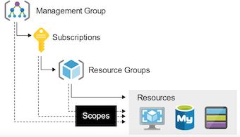

## Azure Active Directory CheatSheet

**Active Directory (AD) is Microsoft's identity and access management service**. Helps your employees sign in and access resources

* **External Resources**： Microsoft Office 365 / Azure Portal / SaaS applications
* **Internal Resources**: 
	* Applications within your internal networking
	* Access to workstations on-premise 

Azure Active Directory (Azure AD) is Microsoft's cloud-based version of **AD Identity as a Service (IDaaS)**

Azure Active Directory comes in 4 editions:

1. Free MFA, SSO, Basic Security and Usage Reports, User Management
2. Office 365 Apps Company Branding, SLA, Two-Sync between On-Premise and Cloud
3. **Premium 1 (P1) Hybrid Architecture, Advanced Group Access, Conditional Access**
4. **Premium 2 (P2) Identity Protection, Identity Governance**

### Azure AD - Use Case

Azure AD can **authorize and authenticate** to multiple sources.

* To your on-premise AD via Azure **AD Connect**
* To your web-application via **App Registrations**
* Allow users to login with their IpD eg. Facebook or Google via **External Identities**
* To Office 365 or **Azure Microsoft**

**Active Directory Terminology:**

* **Domain** A domain is an area of a network organized by a **single authentication database**
* **An Active Directory domain** is a **logical grouping of AD objects on a network**
* **Domain Controller (DC)** A domain controller is a server that **authenticates user identities and authorizes their access to resources**.
* **Domain Computer** A computer that is registered with a central authentication database 
	* **A domain computer would be an AD Object**
* **AD Object** An AD Object is the basic element of Active Directory such as: **Users, Groups, Printers, Computers, Shared folders**
* **Group Policy Object (GPO)**: **A virtual collection of policy settings**. It controls what AD Objects have access to
* **Organization Units (OU)** A subdivision within an AD into which you can place users, groups, computers, and other organizational units
* **Directory Service** A **directory service, such as Active Directory Domain Services (AD DS)**, provides the methods for storing directory data and making this data available to network users and administrators. 
	* **A Directory service runs on a Domain Controller**

	
### Azure AD - Tenant

**A tenant represents an organization** in Azure Active Directory. **A tenant is a dedicated Azure AD Service instance**. 

A tenant is automatically created when you sign up for either: Microsoft Azure, Microsoft Intune, Microsoft 365.

**<mark>Each Azure AD tenant is distinct and separate from other Azure AD tenants</mark>**.

### Azure Active Directory Domain Services (AD DS)

When performing a lift-and-shift of AD to Azure, not all AD features are supported and in that case you need to us AD DS

**Azure Active Directory Domain Services** (AD DS) provides managed domain services (features) such as:

* Domain joins, Group policies, Lightweight directory access protocol (LDAP), and Kerberos / NTLM authentication.

### Azure AD Connect

**Azure AD Connect** is a **hybrid service** **to connect your on-premise Active Directory to your Azure Account**

Azure AD Connect allows for seamless **Single Sign On** from your on-premise workstation to Microsoft Azure

Azure AD Connect has the following features:

* **Password hash synchronization** - sign-in method, synchronizes a hash of a users on-premises AD password with Azure AD
* **Pass-through authentication** - sign-in method, allows users to use the same password on-premises and in the cloud
* **Federation integration** - hybrid environment using an on-premises AD FS infrastructure, for certificate renewal
* **Synchronization** - Responsible for creating users, groups, and other objects, ensures on-prem and cloud data matches
* **Health Monitoring** - robust monitoring and provide a central location in the Azure portal to view this activity

### Active Directory - Users

**Users** represent an **identity for an person or employee** in your domain. **A user has login credentials and can use them to log into the Azure Portal**. Azure AD has two kinds of users:

* **Users - A user belongs to your organization**
* **Guest Users - A guest user belongs to another organization**

**Groups**: lets the **resource owner (or Azure AD directory owner), assign a set of access permissions to all the members of the group**, instead of having to provide the rights one-by-one. Groups contain:

* **Owners** - Has permissions to add an remove members
* **Members** - Have permissions to do things

**Assignment**

* You can assign roles directly to a group
* You can assign applications directly to a group

**Request to Join Groups** The group owner can let users find their own **groups to join**, instead of assigning them. 

The owner can also set up the group to automatically accept all users that join or to require approval.

There are **four ways to assign resource access** rights to your users:

* **Direct assignment**. The resource owner directly assigns the user to the resource.
* **Group assignment**. The resource owner assigns an Azure AD group to the resource, which automatically gives all of the group members access to the resource
* **Rule-based assignment**. The resource owner creates a group and uses a rule to define which users are assigned to a specific resource.
* **External authority assignment**. Access comes from an external source, such as an on-premises directory or a SaaS app.

**External Identities** in Azure AD, allow people outside your organization to access your apps and resources, while letting them sign in using whatever identity they prefer.

## **Device Management CheatSheet**

**Device Management** allows organization to manage laptops, desktops and phones that need access to cloud resources.

Device management is found under Azure Active Directory (Azure AD)

There are 3 ways to join types in (bring devices into) Device Management: **Bring Your Own Device (BYOD).**

#### **Azure Registered**

* **personally** owned devices or mobile devices
* Signed in with a local or personal account
* Windows 10, iOS, Android and MacOS

#### **Azure AD Joined**

* **Devices owned by the organization**
* **Signed in with an organizational account**
* Access to devices that exist in only in the cloud (**Cloud Native**)
	* Windows 10, Windows Server 2019

	
#### **Hybrid Azure AD Joined**

* **Devices owned by the organization**
* Signed in with Active Directory Domain Services account owned by organization
* **Devices that exist in the cloud or on-premise**
* Windows 7.8.1.10. Windows Server 2008 or newer

#### **Mobile Device Management (MDM)**

control the entire device, can wipe data from it, and also reset it to factory settings

#### **Mobile Application Management (MAM)**

Publish, push, configure, secure, monitor, and update mobile apps for your users

* MDM and MAM is managed **via Microsoft Intune**
* To use Microsoft Intune you have to upgrade to **Azure AD Premium 2**
* Microsoft Intune is part of **Microsoft Endpoint Manager**
* Microsoft Endpoint Manager and Intune are part of **Microsoft Enterprise Mobility + Security (EMS)**

### Azure AD Registered Devices - EMS

**Microsoft Enterprise Mobility + Security (EMS)** is an **intelligent mobility management and security platform.**

**EMS is an umbrella of multiple Microsoft and Azure services**

* **Azure Active Directory**
* **Microsoft Endpoint Configuration Manager**
* **Microsoft Intune**
	* 	**Cloud-based united endpoint management, access management, and data protection.**
* **Azure Information Protection**
* Microsoft Cloud App Security
* Microsoft Advanced Threat Analytics
* **Microsoft Defender for Identity**
* **Microsoft Secure Score**

* Azure AD Registered Devices - Microsoft Authenticator
* Azure AD Joined Devices
* Hybrid Azure AD joined devices
* Hybrid Azure AD joined devices - Windows Autopilot
* Azure AD Joined Devices - FIDO2.0 Security Keys

## Azure Roles CheatSheet

Within Azure there are 3 kinds of roles:

1. **Classic subscription administrator roles** which is the original role system.
2. **Azure roles** known as Role-Based Access Controls (RBAC), built on top of Azure Resource Manager
3. **Azure Active Directory (Azure AD) roles Azure AD roles** are used to manage Azure AD resources in a directory 

**Identity Access Management (IAM)** allows you to create and assign  Azure (RBAC system) roles to users

Roles restrict access to resource actions (also known as operations). There are 2 types of roles:

1. **BuiltInRole** - Managed Microsoft roles are read only pre-created roles for you to use
2. **CustomRole** - A role created by you with your own custom logic

**Role assignment** is when you apply a role to user. A role assignment is composed of 

* a Security Principle (USER, GROUP, Service Principal， managed identity)
* Role Definition 
* Scope.  (**Management, Subscription or Resource Group level**.)
* Azure's 4 built-in roles are: **Owner(all), Contributor(no grant), Reader(only read）, User Access Administrator（only grant)**

Azure RBAC includes over **70 built-in roles**

**Classic Administrators have three types of roles:**

1. **Account Administrator** The **billing owner of the subscription**. Has no **access to the Azure portal.**
2. **Service Administrator** same access of a user assigned the Owner role at subscription scope. Full access to the Azure portal.
3. **Co-Administrator** same access of a user who is assigned the Owner role at the subscription scope

### Azure Role-Based Access Control (RBAC)

**A Security Principal** represents the identities requesting access to an Azure resource such as:

* **User**: An individual who has a profile in Azure Active Directory
* **Group**: A set of users created in Azure Active Directory.
* **Service Principal**: **A security identity used by applications or services to access specific Azure resources.**
* **Managed identity**: An identity in Azure Active Directory that is automatically managed by Azure.

A role definition lists the operations that can be performed, such as **read, write, and delete.** 

Roles can be high-level, like owner, or specific, like virtual machine reader.

### **Important Azure AD Roles**

* **Global Administrator** Full access to everything
* **User Administrator** Full access to create and manage users
* **Billing Administrator** Make purchases, manage subscriptions and support tickets

You can create custom Azure AD Roles roles but you need to purchase either: **Azure AD Premium P1 or P2**

**(Actions (actions) /  NotAtions (notAtions)  /  DataActions (dataActions) / NotDataActions (notDataActions) / AssignableScopes (assignableScopes) )**

### Azure Policies vs Azure Roles (RBAC)

**Azure Policies**

* They are used to **ensure compliance** of resource.
* **doesn't restrict actions (also called operations)**

**Azure Roles**

* They are used to **control access** to Azure resources
* Does restriction on Azure resources

### Azure AD Roles vs Azure Roles (RBAC)

* **AD resources**: Users / Groups / Billing / Licensing / Application Registration
* **Azure Roles** VM DB etc

* By default, the **Global Administrator(AD role)** doesn't have access to Azure resources.
* **Global Administrator can gain access to Azure resource if granted the User Access Administrator role (an Azure role)**

## Azure Policies CheatSheet

**Azure Policy** enforce organizational standards and to assess **compliance** at-scale

> <mark>Policies **do not restrict access**, they only observe for compliance</mark>

* Once a policy is assigned it will be evaluated for the compliance state periodically
* The rules of a policy are described in a JSON file and is known as a **policy definition**.

Policy definition can be grouped together which is known as a **policy initiative (formally known as a policy set)**

**Policy Assignment**: The scope of a policy can effect. Assigned to a **user, a resource group or management group**. 

**Initiative Definitions**: is a **collection of policy definitions**

## Azure Resource Manager CheatSheet

**Azure Resource Manager (ARM)** is a service that allows you to manage Azure resources.

It is a management layer that allows you to: **Create, Update, Delete Resources**

* Apply Management features eg. **Access Controls, Locks, Tags**
* Writing Infrastructure as Code (IaC) via JSON templates.

ARM is a service layer that spans multiple features and services: **Subscriptions, Management Groups, Resource Groups ,Resource Providers, Resource Locks, Azure Blueprints, Resource Tags, Access Control (IAM), Role-Based Access Controls (RABC), Azure Policies, ARM Templates**

Think of Azure Resource Manager (ARM) as a **gatekeeper(Authentication)**.

**All requests flow through ARM and it decides whether that request can be performed on a resource.**

**Scope is a boundary of control** for azure resources. It is a way to govern your resource by placing resources within a logical grouping and also applying logical restrictions in the form of rules.

* **Management Groups** A logical grouping of multiple subscriptions
	* **Subscriptions** grants you access to Azure services based on a billing and support agreement
		* **Resource Groups** A logical grouping of multiple resources
			* **Resources** An azure service eg. Azure VMs

An Azure Account can have multiple subscriptions and the most common three are: **Free Trial, Pay-As-You-Go, Azure for Students**

* **Resource Providers** a list of possible services with an Azure, some services are registered by default and other needs to explicitly registered
* **Resource Tags** is a key and value pair that you can assign to azure resources
	* **Resource management**
	* **Cost management and optimization**
	* **Operations management**
	*  **Security**

**Resource Locks prevent users from accidently modifying or deleting resources at the Subscriptions, Resource Group or Resource scope**

* **CanNotDelete (Delete)** authorized users can still read and modify a resource, but they can't delete the resource.
* **ReadOnly (Read-only)** authorized users can read a resource, but they can't delete or update the resource

**Blueprints enable quick creation of governed subscriptions.**

* Compose artifacts based on common or organization-based patterns into re-usable
* Blueprints are a declarative way 
	* Role Assignments / Policy Assignments / Azure Resource Manager templates (ARM templates) / Resource Groups
* Nearly everything that you want to include for deployment in Azure Blueprints can be accomplished with an ARM template.
* relationship between the blueprint definition (what should be deployed) and the blueprint assignment (what was deployed)

## ARM Templates CheatSheet

* **Infrastructure As Code (IaC)** is the process of **managing and provisioning** computer data centers (eg, Azure) through machine-readable （**Create, Update, Delete Resources**）

definition files (eg. JSON files) rather than physical hardware configuration or interactive configuration tools.

IaCs can either be:

* **Declarative - You defined exactly what you want, and you get exactly that**
* **Imperative - You define what you generally want, and the service will guess what you want**

**ARM templates** are **JSON files that define azure resources** you want to provision and azure services you want to configure.

ARM templates are declarative. (you get exactly what you define)

An ARM template is made of the following JSON structure:

* **$schema** describes the **properties that are available within a template**
* **contentVersion** **the version of the template**. You can provide any value for this element
* **apiProfile** Use this value to avoid having to specify API versions for each resource in the template
* **parameters** values you can pass along to your template
* **variables** you transform parameters or resource properties using function expressions
* **functions** **User-defined functions available within the template**
* **resources** the Azure resources you'll want to deploy or update
	* **type** Type of the resource
	* **apiVersion** **Version of the REST API to use for the resource**, Each resource provider published its own API versions
	* **name** Name of the resource
	* **Location** Most resources have a location property, The region where the resource will be deployed
	* **Other Properties** Other properties we can use to configure the resource. Will vary per resource type
* **outputs** values that are returned after deployment

## Storage Accounts CheatSheet

Each with **different features** and **their own pricing models**

* **General-purpose v1 (legacy)**
	* Blob, File, Queue, Table, Disk （No  Data Lake Gen)
	* Standard, Premium
	* N/A   (No Access Tiers)
	* LRS. GRS. RA-GRS  
* **General-purpose v2**
	* Blob, File, Queue, Table, Disk, Data Lake Gen 2
	* **Standard, Premium**
	* **Hot, Cool, Archive**
	* LRS, GRS, RA-GRS, ZRS, GZRS, RA-GZRS
* **BlobStorage (legacy)**
	* Blob (Block, append)
	* **Standard**
	* Hot, Cool, Archive
	* **LRS, GRS, RA-GRS**
* **BlockBlobStorage**
	* Blob (block, append)
	* **Premium**
	* N/A   (No Access Tiers)
	* LRS, ZRS
* **FileStorage**
	* **File**
	* **Premium**
	* N/A   (No Access Tiers)
	* LRS, ZRS

**Supported Services** (What can I put in this storage account?)
**Blob, File, Queue, Table, Disk, and Data Lake Gen2**

**Performance Tiers** (how fast will my read and writes be?)
**Standard and Premium**

**Access Tiers** (how often do I need guick access to files?)
**Hot. Cool. Archive**

**Replication** (How man redundant copies should be made and where?'
**LRS, GRS, RA-GRS, ZRS, GZRS, RA-GZRS**

**Deployment model** (Who should deploy the supported services?'
**Resource Manager. Classic**

### Azure has 5 core storage services:

1. **Azure Blob** A massively scalable **object store** for text and binary data. Includes support for big data analytics via Data Lake Storage Gen2
2. **Azure Files** Managed **file shares** for **cloud or on-premises deployments**
3. **Azure Queues** A **messaging store** for reliable messaging between application components
4. **Azure Tables**   A **NoSQL store** for schemaless storage of structured data.
5. **Azure Disks Block-level storage** volumes for Azure VMs

### Performance Tiers (Blob Storage)

For Blob Storage there are **2 types** of performance tiers for storage accounts: **Standard and Premium**

* **Standard Performance** Stored on Hard Disk Drives (**HDDs**)
	*  Backup and disaster recovery / Bulk data processing
	*  An **HDD has moving parts**, an arm that needs to read and write data **sequential to a disk**.
* **Premium Performance:** Stored on Solid State Drives (**SSDs**)
	* Varied performance based on access tier (Hot, Cool, Archive)
	* **Higher throughput**
	* Analytics, AI or ML, Data transformation
	* **<mark>An SSD has no moving parts and data is distributed randomly. This is why it can read and write so fast.</mark>**

For Blob Storage there are 3 types of access tiers for Standard storage: **Cool, Hot and Archive**

* **Hot** Data that's accessed frequently. Highest storage cost, lowest access cost
* **Cool** Data that's infrequently accessed and stored for at least 30 days, Lower storage cost, higher access cost
* **Archive** Data that's rarely accessed and stored for **at least 180 days**. Lowest storage cost, highest access cost

* **Account Level Tiring** Any blob that doesn't have an explicitly assigned tier infers the tier from the Storage Account access tier setting.
* **Blob-Level Tiering** You can upload a blob to the tier of your choice. Changing tiers happens instantly except when moving out of the archive
* **Rehydrating a Blob** When moving a blob **out of archive into another tier** it can take several hours. This is known as **"rehydrating"**

**Blob Lifecycle Management** You can create rule-based policies to transition data to different tiers Eg. After 30 days move to cool storage

When a blob is uploaded or moved to another tier. **It's charged at the new tier's rate immediately upon tier change.**

When moving **from a cooler tier:**

* The operation is billed as a **write operation** to **the destination tier**.
* Where the write operation (per 10,000) and data write (per GB) charges of the destination tier apply.

**When moving from a hotter tier**

* The operation is **billed as a read from the source tier**
* Where the **read operation** (per 10,000) and data retrieval (per GB) charges of the source tier apply
* Early deletion charges for any blob moved out of the cool or archive tier may apply as well

**Cool and archive early deletion**

* Any blob that is moved into the cool tier (GPV2 accounts only) **is subject to a cool early deletion period of 30 days**.
* Any blob that is moved into the archive tier is subject to an archive early deletion period of 180 days. This charge is prorated.

### When you create a Storage Account you need to choose a Replication Type

**Primary Region Redundancy (Disaster Recovery and Failovers)**

* Locally Redundant Storage (LRS)
	* Copies data synchronously in primary region
	* Cheapest option
* Zone-redundant storage (ZRS)
	* Copies data synchronously across 3 As in primary region

**Secondary Region Redundancy (Disaster Recovery and Failovers)**

* Geo redundant storage (GRS)
	* Copies data **synchronously** in primary region
	* Copies data **asynchronously** to another region
* Geo-zone-redundant storage (GZRS)
	* Copies data **synchronously** across 3 As in a physical region
	* Copies data **asynchronously** to another region

**Secondary Region Redundancy with Read Access (Read Replicas)**

* Read-access geo-redundant storage (RA- GRS)
	* Copies data **synchronously** in primary region
	* Copies data **synchronously** to another region
* Read-access geo-redundant storage (RA-GZRS)
	* Copies data **synchronously** in primary region
	* Copies data **synchronously** to another region

	
### Azure Blob

Blob storage is a **object-store** that is optimized for **storing massive amounts of unstructured data**.

**Storage account**

* unique namespace in Azure for your data
* http://mystorageaccount.blob.core.windows.net

**Containers**

similar to a folder in a file system

**Blobs**

The actual data being stored

Azure Storage supports 3 types of blobs:

1. **Block blobs** store text and binary data, made up of blocks of data that can be managed individually, store up to about 4.75 TiB of data
2. **Append blobs** Optimized for append operations, ideal for scenarios such as logging data from virtual machine
3. **Page blobs** store random access files up to 8 TB in size, store virtual hard drive (VHD) files and serve as disks for Azure virtual machine

There are **multiple ways to move data into Azure Blob Storage**:

* **AzCopy** Easy-to-use command-line tool for Windows and Linux
* **Azure Storage Data Movement library** .NET library (uses AzCopy underneath)
* **Azure Data Factory**  **An ETL service by Azure**
* **Blobfuse**  Virtual file system driver. Access data through Linux file system
* **Azure Data Box**  A rugged device used to physically transport data to Azure
* **Azure Import/Export service**  A service where you ship your physical disks for data transfer onto Azure

### Azure Files

**Azure Files** is a fully managed **file share** in the cloud. A file share is a **centralized server for storage** that allows **multiple connections**.

To connect to the file share a network protocol is used: **Server Message Block (SMB), Network File System (NFS)**

When a connection is established the file share's filesystem will be accessible in the specific directory within your own directory tree

* This is knowing as **mounting**

**Why use Azure files instead of setting up your own File Share server?**

* **Shared Access** - Already setup to work with standard networking protocols SMB and NFS
* **Fully managed** - Its kept up to date with security patches, designed to scale
* **Scripting and Tooling** - You can automate the management and creation of file shared with Azure API and PowerShell
* **Resiliency** - Build to be durable and always working

You can backup your file share with **shared snapshots**

* read-only, Incremental, up to **200 snapshots** per file share, retain backups for up to **10 years**
* Backups are stored within your file share (if you delete your file share you will delete your backups)

**Soft Delete** prevent accidental deletion by turning on Soft Delete (marked for deletion, retained for a period of time before final delete occurs

**Store Tiers:**

* **Premium** - Store on to SSD with single-digit milliseconds for most 10 operation
* **Transaction optimized** - Store on HDD with transaction heavy workloads that don't need the latency offered by premium file shares (historically this tier has been called standard)
* **Hot** - optimized for general purpose file sharing scenarios such as **team shares and Azure File Sync.**
* **Cool** - Stored on HDD for cost-efficient storage optimized for online archive storage scenario

**Types of Storage: General purpose version 2 (GPv2)** - deployed on to HDD and **FileStorage** - deployed onto SSD

* **Identity: On-Premise or Managed** via AD DS or 
* **Store Account Key** username (storage account name) and password (account key)

Azure Files are accessible inside or outside your AWS Account from anywhere via storage account **public endpoint.**

* **SMB connects to port 445**, your organization may need to unblock this port so you can mount your file share
* **Encryption**
	* Azure Files is **encrypted-at-rest** using Azure Storage Service Encryption (SSE)
	* Azure Files is **encrypted-in-transit** with SMB 3.0+ with encryption or HTTPS

### Azure File Sync

**Azure File Sync** is a service that allows you to **cache** Azure file shares on an **on-premises Windows Server or cloud VM.**

### Azure Storage Explorer

A **standalone app** that makes it easy to work with Azure Storage data on Windows, macOS, and Linux

### Azure Import/Export Service

**Azure Import/Export Service** is used to securely import large amounts of data to Azure Blob Storage and Azure Files

You have 2 options for shipping drives on import:

* Use your own disk drives
* Use Microsoft provided drives

Microsoft ships up to 5 encrypted solid-state disk drives (SSDs) known as **Azure Data Box Disk** with a 40 TB total capacity per order, to your datacenter through a regional carrier

To prepare you drive you'll need the to use the command-line **WAlmportExport tool** to

* Prepare your disk drives that are shipped for import.
* Copying your data to the drive.
* Encrypts the data on the drive with AES 256-bit BitLocker.
* Generate the drive journal files used during import creation.
* Helps identify numbers of drives needed for export jobs

There are two **version of WAlmportExport**

* **Version 1 for import/export into Azure Blob storage.**
* **Version 2 for importing data into Azure files.**

**WAlmportExport tool is only compatible with 64-bit Windows**

For export jobs you:

* You can only export from Azure Blob
* You can ship up to 10 empty drives to Azure per job,
* You create an export job and the data is loaded onto those drives and shipped back to you

### Shared Access Signatures

A shared access signature (SAS) is a URI that grants restricted access rights to Azure Storage resources.
Share the URI to grant clients temporary access to specific set of permissions

Types of shared access signatures

* **Account-level SAS**
	* access to resources in one or more of the storage services
* **Service-level SAS**
	* access to single the storage account by using the storage account key
* **User delegation SAS**
	* Access to storage account using Azure AD credentials
	* Limited only to Blob and Containers
	* Microsoft considers this method best practice for accessing via SAS

A shared access signature comes into different formats:

**Ad hoc SAS**

* the start time, expiry time, and permissions are part of the URI
* Any type of SAS can be an ad hoc SAS

**Service SAS with stored access policy:**

* A stored access policy is defined on a resource container (limited to blob container, table, queue, or file share)
* The stored access policy can be associated to multiple SAS to manage constraints

## Virtual Machines CheatSheet

**Azure Virtual Machines (VMs)** allows you to create Linux and Windows virtual machines

The **size** of the virtual machine is determined by the Image

* The image defines the combination of **vCPUs, Memory and Storage Capacity**
* The current limit on a per subscription basis is **20 VMs per region**.
* Azure VMs are billed at an **hourly rate**
* A single instance VMs has an availability of 99.9% (when all storage disks are premium)
* Two instances deployed in Availability Set will give you 99.95% availability
* You can attach multiple Managed Disk to your Azure VMs
* When you **launch** an Azure Virtual Machine other networking components will be either created or associated to your Virtual Machine

**Network Security Group (NSG), Network Interface (NIC), Public IP Address, VNet**

**<mark>You can Bring Your Own Linux by creating a Linux Virtual Hard Disk (VHD)</mark>**

* **Network Security Group (NSG)** - attached to the NIC, virtual firewall with rules around ports and protocol
* **Network Interface (NIC)**- a device that handle ip protocols and network communication
* **Virtual Machine instance** - The actual running server
* **Public IP Address** - The address that you will use publicly access your VM
* **Virtual Network (VNet)**- The network where your VM will reside

Azure VMs come in a variety of sizes that are also optimized for specific use cases.

**General Purpose, Compute Optimized, Memory Optimized, Storage Optimized, GPU, High performance compute**

**Azure Compute Unit (ACU)** provides a way of comparing compute (CPU) performance across Azure SKUs.

* ACU is currently standardized on a **Small (Standard A1)** VM with the value of 100
* All other SKUs then represent approximately how much faster that SKU can run a standard benchmark
* You can install the **Azure Mobile App,** and you can monitor your VMs on the go.
* Hyper-V is Microsoft's hardware virtualization product.

It lets you **create and run a software version of a computer, called a virtual machine**

There are two generations of Hyper-V VMs:

* **Generation 1** - support most guest operating systems
* **Generation 2** - support most 64-bit versions of Windows and more current versions of Linux and FreeBSD operating systems
* **Hyper-V VMs** are packaged into Virtual Hard Disk formats: VHD or VHDX files

There are 3 ways to connect to your Virtual Machines

* Secure Shell (SSH) to connect via a terminal or SSH client eg. PuTTy
* SSH happens on Port 22 via TCP
* RSA Key Pairs are commonly used to authorize access

**Remote Desktop Protocol (RDP) a graphical interface** to connect to another computer over a network connection

* This is how you can remotely connect to Windows Server via Virtual Desktop
* RDP happens on **Port 3389 via TCP and UDP**

### Azure Bastion

Azure Bastion a service you deploy that lets you connect to a virtual machine using your browser and the Azure portal

**Azure Bastion is an intermediate harden instance** you can use to connect to your target server via SSH or RDP
It will provision a web-based RDP client or SSH Terminal

* Supports both SSH or RDP, useful when you only have browser like a chromebook, or do not have permission to configure or install software

### Update Management

**Update Management** allows you to **manage and install operating system updates and patches** for both Windows and Linux virtual machines

that are deployed in Azure, on-premises, or in other cloud providers

* Update Management will perform a scan for update compliance
* A compliance scan is by default, **performed every 12 hours on a Windows and every 3 hours on a Linux**
* It can take between **30 minutes and 6 hours for the dashboard to display** updated data from managed computers.

## Azure Disks CheatSheet

* **Azure Managed Disks are block-level storage volumes** that are managed by Azure and used with Azure VMs
	* Managed disks are designed for 99.999% availability.
	* Azure creates **three replicas of your data**, allowing for high durability
	* You can create up to **50,000 VM disks** of a type in a subscription per region
	* Allowing you to create up to 1,000 VMs in a virtual machine scale set using a Marketplace image.
	* **Managed disks are integrated** 	with **availability sets**
	* Managed disks support **Availability Zones**
	* **Azure Backup** can be used to create a backup job with time-based backups and backup retention policies.
	* You can use **Azure role-based access control (RBAC)** to **assign specific permissions for a managed disk to one or more users**.
	* You can **directly import** your Virtual Hard drive Disks (VHD) into Azure Disks
	* You can use **Azure Private Links** to ensure traffic between Azure Disks and VMs stay within the the Microsoft network

* **Azure Managed Disks** supports 2 types of encryption:
	* **Server Side Encryption (SSE)**
	* **Azure Disk Encryption (ADE)**
	* **Server Side Encryption (SSE) enabled by default** for all **managed disks, snapshots, and images**
		* **Temporary disk are not encrypted by server-side encryption unless you enable encryption at host**
		* Keys can be managed two ways:
			* **Platform-managed keys - Azure manages your keys**
			* **Customer-managed keys - You manage your keys**
* Azure Disk Encryption (ADE) allows you to **encrypt the OS and Data disks used by an IaaS Virtual Machine**
	* For Windows encryption is **done by BitLocker**
	* For Linux encryption is done by **DM-Crypt**

There are 3 main disk roles in Azure, the data disk, the OS disk, the temporary disk

* **Data Disk**

	* a managed disk that's attached to a virtual machine to **store application data, or other data you need to keep**
	* registered as SCSI drives and are labeled with a letter that you choose
	* has a maximum capacity of 32,767 gibibytes (GiB)
	* The size of the VM determines how many data disks you can attach and the type of storage you can use

* **OS Disk**

	* Every virtual machine has one attached operating system disk.
	* That OS disk has a pre-installed OS, which was selected when the VM was created.
	* This disk contains the boot volume.
	* This disk has a maximum capacity of 4,095 GiB

* **Temporary Disk**
	* **Most VMs contain a temporary disk, which is not a managed disk.**
	* **provides short-term storage for applications** and processes, and is intended to only store data such as page or swap files.
	* Data on the temporary disk may be lost during a maintenance event or when you redeploy a VM.
	* During a successful standard reboot of the VM, data on the temporary disk will persist.
	* The temporary disk is typically /dev/sdb and on Linix and Windows VMs the temporary disk is D: by default.
	* **not encrypted by SSE unless you enable encruption at host.**

**A managed disk snapshot is a read-only crash-consistent full copy of a managed disk** that is stored as a standard managed disk by default.

* **Snapshots are point in time recovery**
* Snapshots exist independent of the source disk and can be used to create new managed disks
* **Snapshots are billed based on the used size**. (If you have a 64 GB drive and only use 10 GB you're only billed the 10GB)
* You can see the used size of your snapshots by looking at the Azure usage report.

#### Managed disks （4 tiers of disks）

**A managed custom image** create an image (of your disk from you VM. Contains **all managed disks** associated with a VM, OS and data disks.

A snapshot **doesn't have awareness of any disk except the one it contains**.

For a single disk use a managed disk snapshot, for multiple disks such as striping use a **managed custom disk**

Azure offers 4 tiers of disks: **Ultra Disks, Premium SSD, Standard SSD, Standard HDD**

1. **Ultra Disks** deliver high throughput, high I/OPS, and consistent low latency disk storage for Azure VMs
	* dynamically change the performance of the disk, without the need to restart your VM
	* **suited for data-intensive workloads such as SAP HANA, top-tier databases, and transaction-heavy workloads**
	* can only be used as data disks (use a Premium SSD for OS Disk), Only supported with very specific VM series
2. **Premium SSD** high-performance and low-latency disk support for Azure VMs with input/output (10)-intensive workloads
	* Suitable for mission-critical production applications
	* only be used with VM series that are premium storage-compatible
	* Guaranteed OPS, and throughput of that disk (Standard tiers don't have OPS guarantees)
	* designed to provide low single-digit m latencies and target OPS and throughput described in the preceding table 99.9% of the time
3. **Standard SSD** cost-effective storage option optimized for workloads that need consistent performance at lower OPS levels
	* Compared to standard HDDs, standard SDs deliver better availability, consistency, reliability, and latency.
	* **Suitable for Web servers, low OPS application servers**, lightly used enterprise applications, and Dev/Test workloads
	* designed to provide single-digit ms latencies and the OPS and throughput up to the limits described in the preceding table 99% of the time
	* IOPS and throughput may vary sometimes depending on the traffic patterns, Available on all Azure VMs
4. **Standard HD reliable**, **ow-cost disk support for VMs running latency-insensitive workloads**
	* vailable on all Azure VMs
	* Latency, IOPS, and Throughput of Standard HDD disks may vary more widely as compared to SSD-based disks
	* designed to deliver write latencies under 10ms and read latencies under 20ms for most I0 operations
	* Available in all Azure regions and can be used with all Azure VMs

* **Azure Disks - Bursting**
	* **Disk Bursting** is the ability to **boost disk storage IOPS and MB/s performance** for a period of time on both VMs and disks.
	* Bursting allows you to handle unexpected disk traffic.
	* Bursting on Disks and VMs are independent from one another
	* If you have bursting disk you don't need a bursting VM

## Azure Application Gateway CheatSheet

**Azure Application Gateway is application-level** routing and load balancing service.

Application Gateway operates on **OSI Layer 7 also known as the Application Layer.**

* Application Gateway understand how to **work with HTTP/S requests**
* Advanced routing rules based on the contents of a request.
* **Azure Web Application Firewall (WAF)** policies can be attached to an Application Gateway to provide additional security

An Application Gateway is composed of **Frontends, Routing Rules and Backends:**

* Frontends you choose an address type
	* **Private IP will create an Internal Load Balancer**
	* **Public IP will create an Public/External Load Balance**r
* **Backends you create Backend Pools**
	* Backend pools
		* A backend pool is a collection of resources to which your application gateway can send traffic.
		* A backend pool can contain, VMs, VM scale sets, IP addresses, domain names, App Service
* **Routing Rules are composed of Listeners, Backend targets, HTTP Settings**
* **Listeners** "listens" on a specified port and IP address for traffic that uses a specified protocol.
	* If the listener criteria are met, the application gateway will apply this routing rule.
	* There are 2 types of listeners:
		* **Basic** - forward all requests for any domain to backend pools
		* **Multi-site** - forward requests to different backend pools based on host header and host name
		* requests are matched according to the **order of the rules** and the type of listener
			* Add your basic listeners last otherwise it will capture all requests
* **Backend targets** Chooses where a route should go either **Backend Pool or Redirection**
	* To create a rule for Backend Pool you need to create **HTTP Setting.**
		* defines how we want to handle cookies, connection draining, port request time out and more.

## Scale Sets CheatSheet

Azure Scale Sets allows you to **automatically increase or decrease** your VM capacity.

* Create Scaling Policies to automatically add or remove based on **Host Metrics**
* **Create Health checks and set a Repair Policy to replace unhealthy instances**
* You can scale to *100s or even 1000s of VMs using scale sets*

**A Load Balancer can be associated with a Scale Set.**

* evenly distribute your VMs across multiple Availability Zones to make your application Highly Available.
* Use Load Balancer probe checks for **more robust Health checks**
* You have the choice between 2 different load balancers:
	* **Application Gateway is an HTTP/HTTPS web traffic load balancer application firewall**.
	* **Azure Load Balancer supports all** TCP/UDP network traffic, port-forwarding, and outbound flows.
* A Scaling Policy determines when a VM should be added or removed to meet current capacity requirements
	* **Scale Out When a instance should be added to the Scale Set** to increase capacity
	* **Scale In When a instance should be removed to the Scale Set** to decrease capacity

* **Scale-In Policy is how determines what VM is removed** (deleted) to decrease the capacity of the Scale Set
	* Default Delete the VM with the highest Instance ID, **Balanced across Availability Zones (AZ) and Fault Domains (ADs)**
	* Newest VM Delete the newest created VM, Balanced across Availability Zones (AZs)
	* Oldest VM Delete the oldest VM, Balanced across Availability Zones (AZs)

* **Update Policy** determine how VM instances are brought up-to-date with the latest
	* **Automatic** Increasing with start upgrading immediately in random order
	* **Manual** Existing instances must be manually upgraded
	* **Rolling** Upgrades roll out in batches with optional pause

**Health monitoring** can be enabled to determine if you server is healthy or unhealthy.

There are 2 modes of health monitoring:

1. Application health extension: Ping an HTTP request to a specific path and except a status 200
2. Load Balancer Probe: Allow you to check based on TCP, UDP or HTTP requests.

**Automatic repair policy** If an instance is found to be unhealthy the delete it and launch a new instance

## Azure App Service

**Azure App Service is an HTTP-based service** for hosting web applications, REST APIs, and mobile back ends.

* You can choose your **programming language and either a Windows and Linux environment**
* It is a Platform as Service, so **it's the Heroku or AWS Elastic Beanstalk equivalent for Azure**.

**Azure App Service takes of (Security patches / Load balancing / Autoscaling / Automated manager)**

**Azure App Service** makes it easy to implement common
Integrations and features such as:

* Azure DevOps (For deployments)
* Github Integration
* Docker Hub Integration
* Package Management
* Easy to setup staging environments
* Custom Domains
* Attaching TLS/SSL Certificates

You pay based on an Azure App Service Plan:

* **Shared Tier** - Free, Shared (Linux not supported)
* **Dedicated Tier** - Basic, Standard, Premium, PremiumV2, PremiumV3
* **Isolated Tier**

Azure App Services can also run **docker** single or multi-containers

* **Custom Containers** are supported, create docker file, upload to Azure Container Registry and deploy

**Deployments Slots allow you to create different environments of your web-application**

* You can also Swap environments
* This could be how you perform a Blue/Green deploy.

**App Service Environment (ASE)** is an Azure App Service feature that provides a **fully isolated and dedicated environment** for securely running 

* App Service apps at high scale
* Customers can create multiple ASEs:
	* within a single Azure region
	* across multiple Azure regions making ASEs

* ideal for **horizontally scaling stateless application tiers** in support of **high requests per second (RPS) workloads**.

* ASE comes with **its own pricing tier (Isolated Tier)**
* ASEs can be used to configure security architecture
* Apps running on ASEs can have their access gated by upstream devices, such as web application firewalls (WAFs)
* App Service Environments can be deployed into Availability Zones (AZ) using zone pinning.
* There are **2 deployment types** for an App Service environment (ASE):
	* External ASE
	* ILB ASE

Azure App Services provides many ways to deploy your applications:

**WebJobs** is a feature of Azure App Service that enables you to run a program or script in the same instance as a web app, API app, or mobile app.

* There is **no additional cost** to use WehJobs

* Deployment - Kudu service
	*  **ZIP and WAR file deployment** uses the same **Kudu service** that powers continuous integration-based deployments.
	* (File Transfer Protocol) FTP protocol to upload files.
	* You can use Dropbox or OneDrive to deploy 

**Shared Tiers**

There are 2 shared: **Free, Shared**

* **Free Tier provides**
* **Dedicated Tiers**
	* Basic, Standard, Premium, PremiumV2, PremiumV3

**Azure App Service - WebJobs**

* **WebJobs** is a feature of Azure App Service that enables you to run a program or script in the same instance as a **web app, API app, or mobile app.**
	* Continuous - run continually until stopped
	* Triggered - run only when triggered
	* WebJobs Scale (Only for Continuous)
		* Multi Instance
		* Single Instance

		
## Azure Monitor

* Azure Monitor comprehensive solution **for collecting, analyzing, and acting on telemetry** from your cloud and on-premises environments
	* Create Visual Dashboards
	* Smart Alerts
	* Automated Actions
	* Log Monitoring

**Many Azure services by default are already sending telemetry data to Azure Monitor**

The Pillars of Observability

* **Metrics**  / **Logs**  / 
* **Traces**: A history of request that is travels through multiple Apps/services so we can pinpoint performance or failure.

### Anatomy of Azure Monitor

* **The sources of common monitoring data** 

Application / Operating System / Azure Resource / Azure Subscription / Azure Tenant / Custom Resource 

* Azure Monitor collects two fundamental types of data from sources: **Logs and Metrics**

* **Azure Destination**
	* **Insights**: Application, Containers, VMs, Monitoring Solution 
	* **Visualize**: Dashboards, Views, PowerBI, workbook
	* **Analyze**: Metric Analytics, Log Analytics
	* **Respond**: Alerts, Autoscale
	* **Integrate**: Logic Apps, Export APIs

### Azure Monitor - Sources

* **Application Code**: performance and functionality of application and code. Performance traces, application logs, and user telemetry.

**Instrumentation Package to collect data for Application Insights**

* **OS installed Agent** 
	*  **Diagnostics Extension** 
		*  -> Metrics -> **Metrics Explorer**
		*  -> Azure storage 
		*  -> **Azure Event hub**  -> **No Azure Destination**
	*  **Log Analytics Agent**/**Dependency Agent** 
		*  ->  Logs   -> **Logs Analytics**

### Azure Monitor Logs
		  
* data logs are consolidated from different sources into workspaces
	* **platform logs from Azure services,**
	* log and performance data from virtual machines agents,
	* usage and performance data from applications can be consolidated
	* In a workspace so they can be analyzed together using a sophisticated query language capable of analyzing millions of records

* Work with log queries and their results interactively **using Log Analytics**

### Azure Monitor Metrics

* **Azure Monitor Metrics** collects numeric data from monitored resources into a **time series database.**

	* Metrics are numerical values collected at regular intervals and describe some aspect of a system at a particular time
	* lightweight and capable of supporting near real-time scenarios, useful for alerting and fast detection of issues
	* You can analyze them interactively with **Metrics Explorer**

### Log Analytics Workspaces

* **Log Analytics** is a tool in the Azure portal used **to edit and run log queries** with data in **Azure Monitor Logs**.
	* Log Analytics uses a query language called **KQL**
		* **Kusto and Kusto Query Language (KSL)**

* **Log Analytics workspace** is a unique environment for Azure Monitor log data
	* Each **workspace** has its own data repository and configuration, data sources and solutions are configured to store their data in a **workspace**

* **Azure Monitor Logs** is based on Azure Data Explorer, and log queries are written using the same **Kusto query language (KQL)**

	* KQL can be used in: **Log Analytics, Log alert rules, Workbooks, Azure Dashboards, Logic Apps, PowerShell, Azure Monitor Logs API**
	* Kusto is based on relational database management systems, and supports entities such as **databases, tables, and columns**.
		* Some query operators include
			* **calculated columns, searching and filtering on rows, group by-aggregates, join functions**
		* Kusto queries execute in the context of some **Kusto database that is attached to a Kusto cluster**.
		* Kusto is generally composed of the following entities: **Clusters, Databases, Tables, Columns, Functions**
		* **Clusters** are entities that hold databases
		* **Databases** are named entities that hold tables and stored functions
		* **Stored functions** are named entities that allow reuse of Kusto queries or query parts.
		* **Tables** are named entities that hold data.
		* **Columns** are named entities that have a scalar data type.
		* **External tables** are entities that reference data stored outside Kusto database.

### Metrics Explorer

* Metrics Explorer is a sub-service of Azure Monitor that allows you to **plot charts, visualize correlating trends**, and **investigate spikes and dips in metrics values**. 

To visualize a metric you need to define:
	
* **Scope**: You can `select *resource(s)`
* **Namespace**: a specific group of metric data within a resource
* **Metric**: The actual value you are interested in visualizing
* **Aggregation**: how you want group the values into the final result

### Azure Alerts

* Alerts notify you when issues are found with your infrastructure or application

* They allow you to **identify** and **address** issues before the users of your system notice them.
	
* Azure has 3 kinds of Alerts
	* **Metric Alerts**
	* **Log Alerts**
	* **Activity Log Alerts**

* The **Alert Rule** defines who should we monitor and when should we react
* The **Signal** is a data payload emitted from the resource that could be the following types:
	* **Metric / Log / Activity log / Application Insights**
* An **action** could be a:
	* **Automation runbook, Azure Function, ISM, Logic App, Webhooks or Secure Webhooks**

### Azure Dashboards

* **Azure Dashboards** are a virtual workspaces to **quickly launch tasks for day-to-day operations and monitor resources**

### Azure Workbooks

* Azure Workbooks provide a flexible canvas for data analysis and the creation of rich visual reports within the Azure portal.
	* It tells a story about the performance and availability about your applications and services.

### Application Insights
	
* **Application Insights is an Application Performance Management (APM) service** It is a sub-service of Azure Monitor.

* **Why use Application Insights?**
	* automatically detect performance anomalies
	* includes powerful analytics tools to help you diagnose issues and to understand what users do with your app
	* designed to help you continuously improve performance and usability
	* works for apps on a for .NET, Node.is, Java, and Python hosted on-premises, hybrid, or anv public cloud.
	* Integrates with your DevOps process
	* can monitor and analyze telemetry from mobile apps by integrating with Visual Studio App Center

* To use Application Insights **you need to instrument your application**.
	* To instrument you need to install the instrument package (SDK)
	* Or enable Application Insights using the Application Insights Agents when supported
	* Apps can be instrumented from anywhere
	* When you set up Application Insights monitoring for your web app, you create an Application Insights resource in Microsoft Azure.
	* You open this resource in the Azure portal in order to see and analyze the telemetry collected from your app.
	* The resource is identified by an instrumentation key (ikey)

## Azure Backup Service

**Azure Backup Service** is a backup layer that spans many Azure services.

* On-Premise, Azure VMs, Azure Files, SQL Server (via Azure VM), SAP HANNA databases (via Azure VM), Azure Database for PostgreSQL
* Azure Backup is directly integrated with Azure Services (You won't find it by searching based on the service name)

**Why use Azure Backup?**

* Offload on-premises backups
* Backup your VMs
* Scales Easily
* Get unlimited data transfer (no limit and no charge)
* Keep data secure (built-in security at-rest and in-transit)
* Centralized monitoring and management
* App Consistent Backups (restore apps back to an exact state)
* Automatic Storage Management
* Multiple Storage Options

**Azure Recovery Services (ARS) vault is a storage entity** in Azure that houses data and recovery points created over time.

**Recovery Services vaults supports:**

* System Center (Data Protection Manager) DPM
* Windows Server
* Azure Backup Server

**Recovery Services vaults has the following features:**

* Enhanced capabilities to help secure backup data
* Central monitoring for your hybrid IT environment
* Azure role-based access control (Azure RBAC)
* Soft Delete
* Cross Region Restore

Microsoft Azure Recovery Services (MARS) agent backups **files, folders, and system state** from Windows **on-premises machines and Azure VMs**

* Backups are stored in a Recovery Services vault in Azure
* MARS agent is also known as the **Azure Backup agent**
* The MARS agent does not support Linux operating systems
* **Azure Site Recovery (ASR) is a hybrid (on-premise to cloud) backup solution for site-to-site recovery**.

**Azure Site Recovery**

* Azure Site Recovery (ASR) is a hybrid (on-premise to cloud) backup solution for site-to-site recovery.

* ASR is one of the tools useful for your business continuity and disaster recovery (BCDR) strategy

* <Mark>**Recovery Point Objectives (RRO)** how quickly you can recover a backup after expericing a disaster</Mark>
* <Mark>**Recovery Time Objectives (RTO)** how often you backup (how much data lost can you tolerate?</Mark>

## ACI Azure Container Images CheatSheet

Azure Container Instances (ACIs) allow you to **launch containers** without the need to worry about configuring or managing the underlying virtual machine

Azure Container Instances is designed for isolate containers:

* simple applications
* task automation
* build jobs

* Containers can be provisioned **within seconds** where VMs can take several minutes
* Containers are **billed per second** where VMs are billed per hour (greater savings)
* Containers have **granular and custom sizing of CPUs**, Memory and GPs where VMs sizes are predetermined
* ACI can deploy both **Windows and Linux** containers
* You can **persist storage with Azure Files** for your ACI containers
* ACIs are accessed via a fully qualified domain name (FQDN) eg *customlabel.azureregion.azurecontainer.io*.

**Container Groups** are collections of containers that get scheduled on the same host machine.

* The containers in a container group share: **Lifecycle, Resources, local network, storage volumes**
* Container Groups are similar to a Kubernetes pod
* **Multi-container groups currently support only Linux containers.**

There are two ways to deploy a multi-container group:

* **Resource Manager Template (ARM template)** - when you need to deploy additional Azure service resources
* **YAM File** - when your deployment includes only container instances.

Azure Container Instances has 3 restart-policy options:

* **Always** (default) Containers are **always restarted**. Suited for long running tasks eg. **web-servers**
* **Never** Containers run **one time only**. Suited for one off tasks. eg. **background jobs**
* **OnFailure** Containers that encounter an error

Azure Containers are **stateless** by default. When a container crashes or stops all state is loss.

To persist state you need to **mount** an external volume

You can mount **the following external volumes**:

Azure Files (file share), Secret volume, Empty Directory, Cloud git repo

Container troubleshooting (azure CLI commands you show know):

* **az container logs** - pull logs
* **az container attach** - diagnostic information during container startup
* **az container exec** - interactive container run
* **az monitor metrics list** - get metrics such as CPU usage

## Azure Container Registry CheatSheet

**Azure Container Registry** is a managed, private **Docker registry service** based on the open-source Docker Registry 2.0

* Use **Azure Container Registries** with your existing container development and deployment pipelines
* use **Azure Container Registry Tasks** to build container images in Azure.

Pull images from an Azure container registry to various deployment targets:

**Kubernetes,  DC/OS,  Docker Swarm**

* Azure Kubernetes Service (AKS)
* Azure App Service
* Azure Batch
* Azure Service Fabric

Many Azure services have direct support to use ACR:

**Azure Container Registry (ACR) Tasks** allow you to **automate OS and framework patching** for your Docker containers.

* You can trigger automated builds by:

	* source code updates
	* updates to a container's base image
	* Timers on a schedule

* You can create **multi-step tasks**
* Each ACR Task has an associated **source code context**
* Tasks can take advantage of **run variables**

## Azure Kubernetes Service CheatSheet

* Azure Kubernetes Service (AKS) makes it simple to deploy a managed Kubernetes cluster in Azure
* Azure will manage for you the:
	* Kubernetes masters
	* health monitoring
	* maintenance
* You only have to maintain the: **agent nodes**
* AKS service is free, **You only pay for the agent nodes within the cluster not the masters**
* You should use AKS for scenarios where you need **full container orchestration:**
	* service discovery across multiple containers
	* automatic scaling
	* coordinated application upgrades
* **Bridge to Kubernetes is a extension in Visual Studio and Visual Studio Code** that allows developers to **write, test and debug microservice code on their development workstations**

## Azure DNS CheatSheet

* **Domain Name System (DNS)** It is a service that is responsible for **translating (or resolving) a service name** to its IP address.
* **Azure DNS is a hosting service for DNS domains** that provides name resolution by using Microsoft Azure infrastructure
	* You can't use Azure DNS to buy a domain name.
	* **You can purchase a domain in App Services or a third-party provider and have Azure DNS manage**
* Public DNS Internet-facing
	* Allows you to manage domains for internet accessible domains
	* Pointing your domain to your website
	* Setting records to prove you own the domain
	* Records to connect you domain to your email server

* **Private DNS** Internal-facing
	* Allow you to use your own custom domains instead of the Azure provided domain
* **DNS zone is a container** for all your DNS records for a specific domain name
* A DNS record is a rule that says where to send your domain name
	* A record is composed of **name, type and value:**
* **What is a record set?**
	* Group a bunch of records together, this is what is called a **record set**.

* In Azure you always **create Record Sets** even when you just want a single record.

	* A **Address** lets you point your domain to an IPv4 address
	* AAAA lets you point your domain to an IPV6 address
	* **CAA Certificate Authorities (CAs)** records authorized who can issue certificates for their domain
	* **CNAME Canonical Name record** creates an alias from one domain to another so you set the record value to a domain
	* **MX Mail Exchange** records point to mail servers that handle emails
	* **NS Name Server records** identify multiple DNS servers for the domain and there are multiple in case the primary DNS server fails
	* **PTR Pointer record points** to a domain or hostname but is used for reverse DNS lookup
	* **SRV Service record** is used to identify computers that host specific services, like locating Domain Controllers for Active Directory
	* **TXT Text records** is just text, and can serve multiple purposes, such as documentation or as a means of verification
	* **SO Start of Authority** record contains administrative details about a domain
* Azure has its own s**pecial record type called an Alias that work with A, AAAA and CNAME records**

Azure Alias record points directly to an Azure resource instead of to an IP or hostname (helps avoid dangling domains)

* **Record Set A group of records**. Azure always creates a record set, even with a single record
* **Time to Live (TTL)** says how long a value should be cached

## Azure Networking CheatSheet

**Virtual Network (Net)** is a **logically isolated section** of the Azure Network where you launch your Azure resources.

* **Azure DNS** - manage your own DNS domain
* **Virtual Network (NET)** - logically isolated section of Azure network
	* **Address spaces**
	* **Route Tables**
	* **Subnets**
* **Network Security Groups**: <mark>A virtual firewall at the subnet or NIC level</mark>
* **ExpressRoute** A 50 Mbps-10 Gbps connection between on-premise to VNET
* **Virtual WAN**: <mark>a centralized network to route different network connections</mark>
* **Virtual Network Gateway** - A site-to-site VPN connection between an Vet and local networks
* **Network Interfaces** virtual network device to allow your VMs to communicate using IP protocols

### VNeT Peering

VNET peering is when you connect multiple Vet so they act as one network.

1. **Regional Net Peering** When you peer two Nets from the same region
2. **Global Vet peering** When you peer two Vets from two different regions

**Network Interface Controller (NIC)** software or hardware interface between two pieces of equipment or protocol layers in a network.

NICs communicate using **Internet Protocol (IP)**

**Azure Network Interfaces (NICs)**

* Azure Network Interfaces are attached to Azure VM instance.
* Without an NIC, An Azure VM instance would have no way to communicate.
* **An Azure VM instance has to have an NIC and can have multiple NICs**.

### Network Routes and Routes Tables

**Route Table** is table of data stored in router or **network host that list routes to next destinations**.

* By default Azure creates a route table with **defaults routes (system routes) and associate them to your subnets**

> <mark>If you were to check the **Azure Route Table service** you won't see these default route tables since it hidden and managed by Azure for you. Azure sets the following **default routes**:</mark>
> 
> A route to your VNet / A route to the Internet
> 
> Reserved for private / Reserved in REC 6598

* You can **override the system routes** assigned to your subnets by creating a new route table and associating it with a subnet

**A User defined Route table can be assigned to multiple subnets**, but a **Subnet can only have one user defined route table When you create your user defined route table**, all the default system routes remain unless you override them within your route table

* **<mark>If you wanted to have a private subnet (a subnet that cannot reach the internet)</mark>** You would just create a **new route for 0.0.0.0/0 that hops to `None`**
* Next hop type
	* 	Virtual network gateway
	* Virtual network
	* internet / virtual appliance

### VNet - Address Spaces

**Address Space** **is a range of available IP addresses** that you are **allocating** for you use within your Vnet

* The amount of IP addresses available is determined based on the CID range notation

The address count is not the actual available IP addresses as Azure will reserve 5 of the IP addresses:

* x.x.x.0: Network address
* x.x.x.1: Reserved by Azure for the default gateway
* x.X.X.2, x.x.X.3: Reserved by Azure to map the Azure DNS IPs to the VNet space
* x.x.x.255: Network broadcast address (the last IP in the range, its not always 255)

### VNeT - Subnets

**Subnet is a logical division of an address space**

* A subnet needs a Route Table so it can access
* Public and Private subnet describes whether a subnet is reachable from the internet or not.
* <mark>Azure **has no concept of private and public subnets** and its up to you to configure our subnets to have ensure they do no reach the internet</mark>
* You can associate an NSG to protect traffic entering and leaving your subnet
	* **By applying security rules that can Allow or deny access based on IP address, port and protocol**
* Azure has a special type of Gateway Subnet that is used by **Azure Virtual Network Gateway**

### Private Links

**Azure Private Links** allows you to **establish secure connections** between Azure resources so traffic **remains within the Azure Network**

* **Private Link Endpoint is an Network Interface** that connects you privately and securely to a service powered by Azure Private Link.
	* uses a private IP address from your Vnet
* **Private Link Service** allows you to connect your own workload to Private Link
	* You need an **Azure Standard Internal Load Balancer** and associate it with the Link Service
* Many Azure services by default work with Private Link eg. **Azure Storage, CosmoDB, SQL**
* Third-Party provides can be powered by Private Link

### Azure Firewall

**Azure Firewall is a managed**, cloud-based network security service that protects your Azure VNets resources

* It is a **fully stateful Firewall as a Service (FWaaS)** with: **built-in high availability and unrestricted cloud scalability**
* You can centrally create, enforce, and log application and network connectivity policies across subscriptions and virtual networks.
* uses a static public IP address for **your Net resources allowing outside firewalls to identify traffic originating from your virtual network**
* fully integrated with Azure Monitor for logging and analytics.
* You launch an Azure Firewall in its on VNet
* Other VNets pass through this Central Vnet
* You get **Microsoft Threat Intelligence**
	* Blocks know malicious IPs and FQDNs

### Azure ExpressRoute

**Azure ExpressRoutes creates private connections** between Azure datacenters and infrastructure on your premises or in a colocation env

* Connectivity can be from an: **any-to-any (IP VPN) network, a point-to-point Ethernet network, virtual cross-connection**
* through a connectivity provider at a colocation facility

**ExpressRoute Direct** allows for **greater bandwidth connections** from 50 Mbps to 10Gbps.

### Azure Network Watcher CheatSheet

**Azure Network Watcher** provides tools to **monitor, diagnose, view network metrics**, and enable or disable logs for resources in an Azure Vnet

**IP flow verify checks, Packet Capture, Troubleshoot VPNs, NSGs, NSG Flowlogs, Diagnostic Logs, Traffic Analytics, NPM**

Watcher can monitor and repair Azure resources you provision:

* **Virtual Machines, Virtual Networks, Application Gateways, Load balancer**

* Network Watcher **cannot** be used to monitor PaaS (fully managed services) monitoring or Web Analytics
* Network Watcher is **disabled by default** in most regions so you need to **enable it at per region basi**s
* Network Watcher can **visualize** the topology of your VNets
* **Network Performance Monitor (NPM) is a cloud-based hybrid network monitoring solution** that helps you monitor **network performance between various points** in your network infrastructure.

	* traffic blackholing
	* routing errors
	* unconventional network issues
	* generates alerts and notifies you when a threshold is breached for a network link

## Network Security Group

* **Network security group (NSG) filter network traffic** to and from Azure resources in a Vnet
* An NSG is composed of many **Security Rules**
	* **Name** - A unique name within the network security group.
	* **Source or destination** - An IP Address or CID block, Service Tag or Application Security Group
	* **Port Range** - Specify a single or range of ports. eg. 80 or 10000-10005
	* **Protocol** - TCP, UDP, ICMP or ANY
	* **Action** - **Allor or Deny**
	* **Priority** - A number between 100 and 4096 (**lower number higher priority**)

**Inbound Rules** apply to traffic ***entering*** the NSG

**Outbound Rules** apply to traffic ***leaving*** the NSG

* Default Azure will set a bunch of inbound and outbound rules for you
* You may not create two security rules with the same priority and direction.
* **You can have 5000 NSG per subscription, 1000 NSG rules per NSG**
* Rules are processed in priority order, **with lower numbers processed before higher number**
* **The flow record allows a network security group to be stateful**.
* **If you specific an outbound security port you don't need to set the inbound port since it will be set for you.**
* The opposite is also true. If inbound traffic is allowed over a port, **it's not necessary to specify an outbound security rule to respond to traffic over the port**

An NSG applied to a subnet applies its rules to all resources in that subnet

**First the NSG rules are evaluated at the subnet, Then the rules at the NIC are evaluated**

If you wanted to open port 80 you would need to allow port 80 on both the subnet and NIC NSG

## Azure Virtual WAN CheatSheet

**Azure Virtual WAN** is a **consolidated networking service** that brings many **networking, security, and routing** functionalities in a single operational interface.

* These functionalities include
	* branch connectivity (via connectivity automation from Virtual WAN Partner devices such as SD-WAN or VPN CPE)
	* **Site-to-site VPN connectivity,**
	* **remote user VPN (Point-to-site)**
	* connectivity, private (ExpressRoute) connectivity,
	* intra-cloud connectivity (transitive connectivity for virtual networks)
	* VPN ExpressRoute inter-connectivity,
	* routing
	* Azure Firewall encryption for private connectivity.

* Azure Virtual WAN itself is a **Software Defined WAN (SD-WAN)**
* Azure Virtual WAN is a much better way to route to your branches, datacenters, Vet and cloud services.
* **A Point of Presence (PoP)** Is an entry at the edge of a Network. eg. ISP Datacenter
* A **Hop** is when you change networks
* **Multi-Protocol Label Switching (MPLS)** a method of packet forwarding where instead of using IP Address and Layer 3 information to make
* forwarding decisions an MPLS label is used to determine the shortest route to end destination
* **Software Defined WAN (SD-WAN)** decouples CPU intensive tasks from routers such as Management, Operations and the Control plane that can
* now be controlled in a central location remotely and virtually at your headquarters
	* replace MLPS, so you traverse the internet instead of a private network
	* more cost effective and require less configuration than an MLPS initially and at scale
	* secure because you will use HTTPS which is supported by your ISP

	
## Azure Virtual Network Gateways ChealSheet

A VPN **extends a private network across a public network** and enables users **to send and receive data across shared or public networks**

A **virtual network gateway** is the **software VPN device for your Azure virtual network**.

* When you deploy a VNG it will deploy two or more specialized VMs in specific subnet you need to create called a "gateway subnet"
* These deployed VMs contain routing tables and run specific gateway services.
* You will choose a **Gateway Type and that will determine if it's a VPN or ExpressRoute**

When you create a VPN Gateway you are generally designing for one of the following topologies:

* **Site-to-Site (S2S)** When you connect Azure to an On-Premise Data Center
* **Multi-Site** When you connect Azure to multiple On-Premise Data Centers
* **Point-to-Site (P2S)** When you connect Azure to multiple individual computers
* **VNet-to-VNet** When you connect two Vets in different regions, subscriptions or deployment models
