# AZ104 - 1 

## Topic 1 - Question Set 1

### Question #1

1. Your company has serval departments. Each department has a number of virtual machines (VMs).

The company has an Azure subscription that contains a resource group named RG1.

All VMs are located in RG1.

You want to associate each VM with its respective department. What should you do?

* A. Create Azure Management Groups for each department.
* B. Create a resource group for each department.
* **C. Assign tags to the virtual machines.**
* D. Modify the settings of the virtual machines.


### Question #2

2. Note: The question is included in a number of questions that depicts the identical set-up. However, every question has a distinctive result.

Establish if the solution satisfies the requirements.

* Your company has an Azure Active Directory (Azure AD) subscription.
* You want to implement an Azure AD conditional access policy.
* The policy must be configured to require members of the Global Administrators group to use Multi-Factor 
* Authentication and an Azure AD-joined device when they connect to Azure AD from untrusted locations.

Solution: **You access the multi-factor authentication page to alter the user settings.**

Does the solution meet the goal?


* A. Yes
* **B. No**

> 1- the best way to enforce MFA is by Conditional Access
> 
> 2- the device has to be identified by azure AD as A AD joined Device.
> 
> **3- the trusted ip must be configured**
> 
> You access the Azure portal to alter the grant control of the Azure AD conditional access policy.
> 
> To enable the MFA depending on the condition can only be enabled from the conditional access option.
Not from MFA option

In order to implement MFA and Azure AD-Joined device, you need to create a **'Conditional Access Policy'**. To implement conditional access policy;

Go to Microsoft Entra--> Protection--> Security Center--> Conditional Access Page. **(Microsoft Entra Premium is required to implement Conditional Access policy)**

While accessing the multi-factor authentication page allows you to configure multi-factor authentication for
users, **it does not specifically target the members of the Global Administrators group**. 

To meet the goal of requiring Global Administrators to use Multi-Factor Authentication and an Azure AD-joined device when connecting from untrusted locations, you need to set up an Azure AD conditional access policy.

- 1 Azure Active Directory subscription.
- 1 Azure Active Directory Conditional Access Policy.
- must, require, members, Global Administrators group
- use MFA + Azure-Active-Directory-Joined device (untrusted locations)
- MFA page to Alter the user settings (this is the most key information)


### Question #3

Note: The question is included in a number of questions that depicts the identical set-up. However, every question has a distinctive result.

Establish if the solution satisfies the requirements.

* Your company has an Azure Active Directory (Azure AD) subscription.
* You want to implement an Azure AD conditional access policy.
* The policy must be configured to require members of the Global Administrators group to use Multi-Factor Authentication and an Azure AD-joined device when they connect to Azure AD from untrusted locations.

Solution: **You access the Azure portal to alter the session control of the Azure AD conditional access policy**.

Does the solution meet the goal?


* A. Yes
* **B. No**

**You alter the grant control, not session control**

Under **Access controls > Grant**, select **Grant access, Require multi-factor authentication**, 

In order to implement MFA and Azure AD-Joined device, you need to create a 'Conditional Access Policy'. 

To implement **conditional access policy**;

Go to Microsoft Entra-->**Protection-->Security Center-->Conditional Access Page-->Modify Grant Control (Not Session Control) -->Grant Access**

Altering the session control of the Azure AD conditional access policy alone will not achieve the desired
requirements. 

**You need to configure a conditional access policy that requires Multi-Factor Authentication (MFA) and an Azure AD-joined device for members of the Global Administrators group when connecting from untrusted location**


### Question #4

* Your company has an Azure Active Directory (Azure AD) subscription.
* You want to implement an Azure AD conditional access policy.
* The policy must be configured to require members of the Global Administrators group to use Multi-Factor Authentication and an Azure AD-joined
* device when they connect to Azure AD from untrusted locations.

Solution: You access the Azure portal to alter the **grant control of the Azure AD conditional access policy. Does the solution meet the goal?**

* **A. Yes**
* B. No

> There is another copy of this question that mentions going to the MFA page in Azure Portal as the solution = incorrect. **On that page you cant make a Conditional Access Policy**.

### Question #5

You are planning to deploy an Ubuntu Server virtual machine to your company's Azure subscription.

You are required to implement a custom deployment that includes adding a particular trusted root certification authority (CA).

Which of the following should you use to create the virtual machine?


* A. The New-AzureRmVm cmdlet.
* B. The New-AzVM cmdlet.
* C. The Create-AzVM cmdlet.
* **D. The az vm create command.**

**Correct Answer: D**

https://learn.microsoft.com/en-us/azure/virtual-machines/linux/tutorial-automate-vm-deployment

For example, 

```
az vm create -g MyResourceGroup -n MyVm --image debian --custom-data MyCloudInitScript.yml
```

> "New-AzureRmVm" is the legacy way to create Vms using Powershel
> 
> New-AzVM" Is the current way to create VMs using Powershell
> 
> Using Powershell cmdlets I think that it is not currently **supported to create a VM passing custom data, like a cloud-init file to accomplish the
requested trust for a Custom CA**. 
> 
> Create-AzVM" Does not seem to exist
> 
> "az vm create" command
https://docs.microsoft.com/en-us/azure/virtual-machines/linux/tutorial-automate-vm-deployment
upvoted 1


By using the az vm create command with the --custom-data parameter, you can specify a cloud-init script that will run during the VM's first boot.

**This script can then install the desired trusted root CA certificate and configure the system accordingly**

```
az vm create --resource-group myResourceGroup --name centos74 --image OpenLogic:CentOS-CI:7-CI:latest --custom-data cloud-init.txt -- generate-ssh-keys
```


### Question #6

Note: The question is included in a number of questions that depicts the identical set-up. However, every question has a distinctive result.

Establish if the solution satisfies the requirements

Your company makes use of Multi-Factor Authentication for when users are not in the office. The Per Authentication option has been configured
as the usage model


After the acquisition of a smaller business and the addition of the new staff to Azure Active Directory (Azure AD) obtains a different company and
adding the new employees to Azure Active Directory (Azure AD), you are informed that these employees should also make use of Multi-Factor
Authentication.

To achieve this, the Per Enabled User setting must be set for the usage model.

Solution: **You reconfigure the existing usage model via the Azure portal.**

Does the solution meet the goal?

* A. Yes
* **B. No**

You create a new Multi-Factor Authentication provider with a backup from the existing Multi-Factor Authentication provider data. 

You cannot change the usage model (per enabled user or per authentication) after an MFA provider is created


The correct solution is to create a new conditional access policy that applies to the new employees. This policy should be configured to require MFA for the new employees when they sign in to Azure AD from any location.

### Question #7

Your company's Azure solution makes use of Multi-Factor Authentication for when users are not in the office. The Per Authentication option has been configured as the usage model.

After the acquisition of a smaller business and the addition of the new staff to Azure Active Directory (Azure AD) obtains a different company and
adding the new employees to Azure Active Directory (Azure AD), you are informed that these employees should also make use of Multi-Factor
Authentication

To achieve this, the Per Enabled User setting must be set for the usage model.

Solution: **You reconfigure the existing usage model via the Azure CLI**

Does the solution meet the goal?

* A. Yes
* **B. No**

> You create a new Multi-Factor Authentication provider with a backup from the existing Multi-Factor Authentication provider data. You cannot
change the usage model (per enabled user or per authentication) after an MFA provider is created

the solution mentioned only reconfiguring the existing usage model via the Azure CLI. It does not specify how to change the usage model to "Per
Enabled User," **which requires additional steps such as setting the user-based policy in Azure AD conditional access**. Therefore, the correct answer
is B: No, the solution does not meet the goal.

### Question #8

Your company's Azure solution makes use of Multi-Factor Authentication for when users are not in the office. 

**The Per Authentication option has been configured as the usage model**


After the acquisition of a smaller business and the addition of the new staff to Azure Active Directory (Azure AD) obtains a different company and **adding the new employees to Azure Active Directory (Azure AD), you are informed that these employees should also make use of Multi-Factor Authentication**


To achieve this, the Per Enabled User setting must be set for the usage model.

Solution: **You create a new Multi-Factor Authentication provider with a backup from the existing Multi-Factor Authentication provider data**.

Does the solution meet the goal?


* A. Yes
* **B. No**

> Effective September 1st, 2018 new auth providers may no longer be created. 
> 
> Existing auth providers may continue to be used and updated, but migration is no longer possible. Multi-factor authentication will continue to be available as a feature in Azure AD Premium licenses

### Question #9

Note: The question is included in a number of questions that depicts the identical set-up. However, every question has a distinctive result. Establish if the solution satisfies the requirements.

Your company has an Azure Active Directory (Azure AD) tenant named weyland.com that is configured for hybrid coexistence with the on-premises Active Directory domain.

* You have a server named DirSync1 that is configured as a DirSync server.
* You create a new user account in the on-premise Active Directory. You now need to replicate the user information to Azure AD immediately.

Solution: **You run the Start-ADSyncSyncCycle -PolicyType Initial PowerShell cmdlet**.

Does the solution meet the goal?

* **A. Yes**
* B. No

```
Import-Module ADSync

# Delta sync
# delta:synchronize changes since last full synchronization
Start-ADSyncSyncCycle -PolicyType Delta

# Enable scheduled synchronization

Set-ADSyncScheduler -SyncCycleEnabled $true
```
[https://geekdudes.wordpress.com/2018/06/05/office-365-configuring-ad-synchronization/](https://geekdudes.wordpress.com/2018/06/05/office-365-configuring-ad-synchronization/)

```
Start-ADSyncSyncCycle -policy initial

PS C:\Users\Administrator> Start-ADSyncSyncCycle
Result
------
Success
```

The `Start-ADSyncSyncCycle -PolicyType` Initial PowerShell cmdlet is used to initiate an initial synchronization cycle for Azure AD Connect, which is
the successor to DirSync. 

This command triggers the synchronization process and replicates changes from the on-premises Active Directory to Azure AD immediately.

1. Solution: You run the Start-ADSyncSyncCycle -PolicyType Initial PowerShell cmdlet.
2. Solution: You use Active Directory Sites and Services to force replication of the Global Catalog on a domain controller.
3. Solution: You restart the NetLogon service on a domain controller.


### Question #10

Note: The question is included in a number of questions that depicts the identical set-up. However, every question has a distinctive result.

Establish if the solution satisfies the requirements.

Your company has an Azure Active Directory (Azure AD) tenant named weyland.com that is configured for hybrid coexistence with the onpremises Active Directory domain

You have a server named DirSync1 that is configured as a DirSync server.

You create a new user account in the on-premise Active Directory. You now need to replicate the user information to Azure AD immediately.

Solution: **You use Active Directory Sites and Services to force replication of the Global Catalog on a domain controller.**

Does the solution meet the goal?

* A. Yes
* **B. No**


On a server with **Azure AD Connect installed**, navigate to the Start menu and select AD Connect, then Synchronization Service.

1. Go to the S**ynchronization service manager -> connectors** tab.
2. Select RUN on the ACTIONS pane.


or run `Start-ADSyncSyncCycle -PolicyType Delta`


The solution mentioned in the scenario, which is using Active Directory Sites and Services to force replication of the Global Catalog on a domain
controller, will **replicate the user information to other domain controllers in the same site**, but **it will not replicate the user information to Azure AD
immediately.** 

To replicate the user information to Azure AD immediately, you need to **manually start a synchronization cycle on the DirSync server
or wait for the next scheduled synchronization cycle to occur**. 

Therefore, the solution does not meet the goal of replicating the user information to Azure AD immediately.


### Question #11


Note: The question is included in a number of questions that depicts the identical set-up. However, every question has a distinctive result.

Establish if the solution satisfies the requirements.
Your company has an Azure Active Directory (Azure AD) tenant named weyland.com that is configured for hybrid coexistence with the onpremises Active

Directory domain.

You have a server named DirSync1 that is configured as a DirSync server.

* You create a new user account in the on-premise Active Directory. 
* You now need to replicate the user information to Azure AD immediately.

Solution: **You restart the NetLogon service on a domain controller.**

Does the solution meet the goal

* A. Yes
* **B. No**


If you need to manually run a sync cycle, then from PowerShell run 

`Start-ADSyncSyncCycle -PolicyType Delta.`

To initiate a full sync cycle, run 

`Start-ADSyncSyncCycle -PolicyType` Initial from a PowerShell prompt.

Running a full sync cycle can be very time consuming, so if you need to replicate the user information to Azure AD immediately then run 

`Start-ADSyncSyncCycle -PolicyType Delta`


**Netlogon is a Local Security Authority service that runs in the background**. It handles domain user login authentication. 

It maintains a secure channel between this computer and the domain controller for authenticating users and services. 

**If this service is stopped, the computer may not authenticate users and services, and the domain controller cannot register DNS records**. If this service is disabled, any services that explicitly
depend on it will fail to start.

### Question #12


Your company has a Microsoft Azure subscription.

The company has datacenters in Los Angeles and New York

You are configuring the two datacenters as geo-clustered sites for site resiliency.

You need to recommend an Azure storage redundancy option

You have the following data storage requirements:

* ✑ Data must be stored on **multiple nodes**.
* ✑ **Data must be stored on nodes in separate geographic locations**.
* ✑ Data can be read from the secondary location as well as from the primary location.

Which of the following Azure stored redundancy options should you recommend?

* A. Geo-redundant storage
* **B. Read-only geo-redundant storage**
* C. Zone-redundant storage
* D. Locally redundant storage


RA-GRS allows you to have higher read availability for your storage account by providing read onlyגaccess to the data replicated to the secondary location. 

Once you enable this feature, the secondary location may be used to achieve higher availability in the event the data is not available in the primary region

**Read-access geo-redundant storage (RA-GRS)**

It is based on the GRS, but it also provides an option to read from the secondary region, regardless of whether Microsoft initiates a failover from the primary to the secondary region.


### Question #13

Note: The question is included in a number of questions that depicts the identical set-up. However, every question has a distinctive result. Establish if the solution satisfies the requirements.


Your company has an azure subscription that includes a storage account, a resource group, a blob container and a file share.

A colleague named Jon Ross makes use of a solitary Azure Resource Manager (ARM) template to deploy a virtual machine and an additional Azure Storage account.

You want to review the ARM template that was used by Jon Ross.

Solution: **You access the Virtual Machine blade.**

Does the solution meet the goal?

* A. Yes
* **B. No**


You should use the Resource Group blade

As questions talk **about VM and storage account both which can only be reviewed at RG level**

All templates in a RG are stored in Deployments within the the resource group level

### **Question #14**

Note: The question is included in a number of questions that depicts the identical set-up. However, every question has a distinctive result.

Establish if the solution satisfies the requirements.

Your company has an azure subscription that includes a storage account, a resource group, a blob container and a file share.

A colleague named Jon Ross makes use of a solitary Azure Resource Manager (ARM) template to deploy a virtual machine and an additional Azure Storage account.


You want to review the ARM template that was used by Jon Ross.

Solution: **You access the Resource Group blade.**

Does the solution meet the goal?

* **A. Yes**
* B. No

1.Go to the resource group for your new resource group. Notice that the portal shows the result of the last deployment. Select this link.

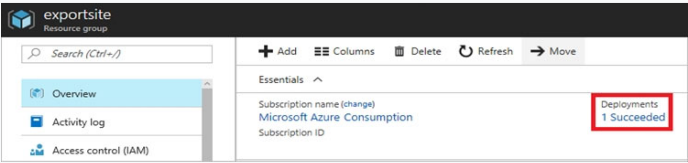

2.You see a history of deployments for the group. In your case, the portal probably lists only one deployment. Select this deployment

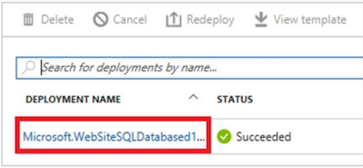

3.The portal displays a summary of the deployment. The summary includes the status of the deployment and its operations and the values that you provided for parameters. 
 
To see the template that you used for the deployment, select View template.
 
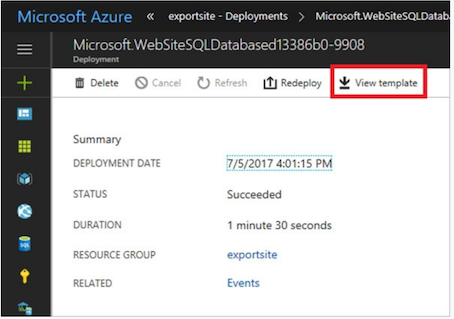

**Resource Group >> Deployment**

### **Question #15**

Note: The question is included in a number of questions that depicts the identical set-up. However, every question has a distinctive result.

Establish if the solution satisfies the requirements.

Your company has an azure subscription that includes a storage account, a resource group, a blob container and a file share.

A colleague named Jon Ross makes use of a solitary Azure Resource Manager (ARM) template to deploy a virtual machine and an additional Azure Storage account.

You want to review the ARM template that was used by Jon Ross.

**Solution: You access the Container blade.**

Does the solution meet the goal?

* A. Yes
* **B. No**

**You should use the Resource Group blade**

No, accessing the Container blade does not provide access to the ARM template used by Jon Ross to deploy the virtual machine and an additional Azure Storage account. 

**The Container blade displays information about the blob container within the storage account, but it does not provide access to the deployment history or ARM templates**.


### Question #16

Your company has three virtual machines (VMs) that are included in an availability set.
You try to resize one of the VMs, w**hich returns an allocation failure message.**

**It is imperative that the VM is resized**

Which of the following actions should you take?

* A. You should only stop one of the VMs.
* B. You should stop two of the VMs.
* **C. You should stop all three VMs.**
* D. You should remove the necessary VM from the availability


If the VM you wish to resize is part of an availability set, then you must stop all VMs in the availability set before changing the size of any VM in
the availability set.


The reason all VMs in the availability set must be stopped before performing the resize operation to a size that requires different hardware is **that all running VMs in the availability set must be using the same physical hardware cluster**. 

Therefore, if a change of physical hardware cluster is **required to change the VM size then all VMs must be first stopped and then restarted one-by-one to a different physical hardware clusters**.

Reference:

[https://azure.microsoft.com/es-es/blog/resize-virtual-machines/](https://azure.microsoft.com/es-es/blog/resize-virtual-machines/)

Stops all the VMs in the availability set. Click Resource groups > your resource group > Resources > your availability set > Virtual Machines > your virtual machine > Stop.


When you try to start a stopped Azure Virtual Machine (VM), or resize an existing Azure VM, the common error you encounter is an **allocation failure**. This error results when the cluster or region either does not have resources available or cannot support the requested VM size”


If the VM you wish to resize is part of an availability set, then you must stop all VMs in the availability set before changing the size of any VM in the availability set.

The reason all VMs in the availability set must be stopped before performing the resize operation to a size that requires different hardware is that all running VMs in the availability set must be using the "If the VM you wish to resize is part of an availability set, then you must stop all VMs in the availability set before changing the size of any VM in the availability set. The reason all VMs in the availability set must be stopped before performing the resize operation to a size that requires different hardware is that all running VMs in the availability set must be using the same physical hardware cluster

### Question #17

You have an Azure virtual machine (VM) that has a single data disk. You have been tasked with attaching this data disk to another Azure VM.

You need to make sure that your strategy allows for the virtual machines to be offline for the least amount of time possible.

Which of the following is the action you should take FIRST?

* A. Stop the VM that includes the data disk.
* B. Stop the VM that the data disk must be attached to.
* **C. Detach the data disk**.
* D. Delete the VM that includes the data disk.

To minimize downtime when attaching a data disk from one Azure virtual machine (VM) to another, you should follow these steps:

**C. Detach the data disk.**

Explanation

Detaching the data disk from the source VM first allows you to remove the disk without affecting the operation of the source VM. **This action can be performed without stopping or deleting the VM, minimizing downtime**.


Once the data disk is detached from the source VM, you can then attach it to the destination VM. This process typically involves stopping the destination VM briefly to attach the disk, but since the disk has already been detached from the source VM, downtime is minimized.


Options A, B, and D involve stopping or deleting VMs, which may not be necessary and can result in additional downtime. Therefore, detaching the data disk (option C) is the most appropriate first action to take in this scenario.

**Resizing a VM which requires the VM to be moved to different hardware clusters is different depending on which deployment model was used to deploy the VM.**

Additionally, the same hardware cluster must be used to host all VMs in a cloud service (for classic deployment model) or all VMs in an availability set (for Azure Resource Manager deployment model). 

This means in some cases multiple VMs must be resized together. If the Resource Manager
(ARM) deployment model was used then the VM(s) can be resized if the VM, and any other VMs in the same availability set, are in a stopped (deallocated) state. 

If a VM was deployed using the Classic (ASM) deployment model, then the cloud service deployment must be removed and redeployed to change the VMs to a size in another size family.

### Question #18

Your company has an Azure subscription

You need to deploy a number of Azure virtual machines (VMs) using Azure Resource Manager (ARM) templates. You have been informed that the VMs will be included in a single availability set.

You are required to make sure that the ARM template you configure **allows for as many VMs as possible to remain accessible in the event of fabric failure or maintenance.**

Which of the following is the value that you should configure for the **platformFaultDomainCount** property?


* A. 10
* B. 30
* C. Min Value
* **D. Max Value**

The number of fault domains for managed availability sets varies by region - either two or three per region.

Reference:

https://docs.microsoft.com/en-us/azure/virtual-machines/windows/manage-availability


**2 or 3 is max for a region so answer should be Max.**

[https://stackoverflow.com/questions/49779604/how-to-find-maximum-update-domains-fault-domains-available-in-an-azure-region](https://stackoverflow.com/questions/49779604/how-to-find-maximum-update-domains-fault-domains-available-in-an-azure-region)

Each virtual machine in your availability set is assigned an update domain and a fault domain by the underlying Azure platform. Each availability set can be configured with up to **three fault domains and twenty update domains**. （**3 FD and 20 Update domains)**

**`az vm list-skus --resource-type availabilitySets --query '[?name==`Aligned`].{Location:locationInfo[0].location, MaximumFaultDomainCount:capabilities[0].value}' -o Table`**

### Question #19

Your company has an Azure subscription.

You need to deploy a number of Azure virtual machines (VMs) using Azure Resource Manager (ARM) templates. You have been informed that the VMs will be included in a single availability set.

You are required to make sure that the ARM template you configure allows for as many VMs as possible to remain accessible in the event of fabric failure or maintenance.

Which of the following is the value that you **should configure for the platformUpdateDomainCount property**

* A. 10
* **B. 20**
* C. 30
* D. 40

Correct Answer: B

Each virtual machine in your availability set is assigned an update domain and a fault domain by the underlying Azure platform. 

Each availability set can be configured **with up to 3 fault and 20 update domains**. So, the best value**** you could configure against the update domain will be its maximum of 20.


### Question #20

You have downloaded an Azure Resource Manager (ARM) template to deploy numerous virtual machines (VMs). The ARM template is based on a current VM, but must be adapted to reference an administrative password.

You need to make **sure that the password cannot be stored in plain text**.

Which of the following should you create to achieve your goal? Answer by dragging the correct option from the list to the answer area.

Select and Place:


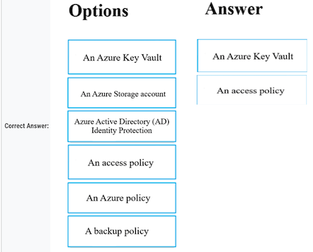

You can use a template that allows you to deploy a simple Windows VM by retrieving the password that is stored in a Key Vault. 

Therefore, **the password is never put in plain text in the template parameter file.**

**Key vault + access policy**

An Azure Key Vault, which can securely store and manage cryptographic keys, certificates, and passwords. 

The password can be stored as a secret in the Key Vault and then accessed by the ARM template using a reference to the Key Vault.


**An access policy, which is used to define who has permissions to access and manage the Key Vault**. This is important to ensure that **only authorized users can access the password stored in the Key Vault**


### Question #21

Your company has an Azure Active Directory (Azure AD) tenant that is **configured for hybrid coexistence with the on-premises Active Directory domain**.

The on-premise virtual environment consists of virtual machines (VMs) running on Windows Server 2012 R2 Hyper-V host servers.

You have created some PowerShell scripts to automate the configuration of newly created VMs. You plan to create several new VMs.

**You need a solution that ensures the scripts are run on the new VMs.**

Which of the following is the best solution?

* **A. Configure a SetupComplete.cmd batch file in the %windir%\setup\scripts directory.**
* B. Configure a Group Policy Object (GPO) to run the scripts as logon scripts.
* C. Configure a Group Policy Object (GPO) to run the scripts as startup scripts.
* D. Place the scripts in a new virtual hard disk (VHD)

After Windows is installed but before the logon screen appears, Windows Setup searches for the SetupComplete.cmd file in the %WINDIR%\Setup\Scripts\ directory


**`%WINDIR%\Setup\Scripts\SetupComplete.cmd`**: This script runs with local system permissions and starts immediately after the user sees the desktop. This setting is disabled when using OEM product keys, except on Enterprise editions and Windows Server operating systems.

https://learn.microsoft.com/en-us/windows-hardware/manufacture/desktop/add-a-custom-script-to-windows-setup?view=windows-11

### Question #22

Your company has an Azure Active Directory (Azure AD) tenant that is configured for hybrid coexistence with the on-premises Active Directory domain.

You plan to deploy several new virtual machines (VMs) in Azure. The VMs will have the same operating system and custom software requirements.

You configure a reference VM in the on-premise virtual environment. You then generalize the VM to create an image.

**You need to upload the image to Azure to ensure that it is available for selection when you create the new Azure VMs.**

Which PowerShell cmdlets should you use?

* A. Add-AzVM
* **B. Add-AzVhd**
* C. Add-AzImage
* D. Add-AzImageDataDisk

**The `Add-AzVhd` cmdlet uploads on-premises virtual hard disks,** in `.vhd` file format, to a blob storage account as fixed virtual hard disks.

Reference:

https://docs.microsoft.com/en-us/azure/virtual-machines/windows/upload-generalized-managed


* **"New-AzVM" is for creating new VMs, not uploading images.**
* **"Add-AzImage" does not exist**. the correct command is "New-AzImage".
* **"Add-AzImageDataDisk" Adds a data disk to an image object.**
* "Add-AzVhd" seems to be the correct option, sing the it "Uploads a virtual hard disk from an on-premises machine to Azure (managed disk or blob)." 

[https://docs.microsoft.com/en-us/powershell/module/az.compute/add-azvhd?view=azps-8.3.0](https://docs.microsoft.com/en-us/powershell/module/az.compute/add-azvhd?view=azps-8.3.0)


`Add-AzVhd -ResourceGroupName $resourceGroup -Destination $urlOfUploadedImageVhd -LocalFilePath $localPath`


### Question #23


Your company has an Azure subscription that includes a number of Azure virtual machines (VMs), which are all part of the same virtual network.

**Your company also has an on-premises Hyper-V server that hosts a VM, named VM1, which must be replicated to Azure.**

Which of the following objects that must be created to achieve this goal? Answer by dragging the correct option from the list to the answer area.

Select and Place

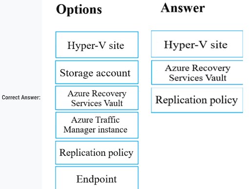


For physical servers

- **Storage Account**
- **Azure Recovery Services Vault**
- **Replication policy**

https://docs.microsoft.com/en-us/azure/site-recovery/physical-azure-disaster-recovery


### Question #24

Note: The question is included in a number of questions that depicts the identical set-up. However, every question has a distinctive result.

Establish if the solution satisfies the requirements.

Your company's Azure subscription includes two Azure networks **named VirtualNetworkA and VirtualNetworkB**.

VirtualNetworkA includes a VPN gateway that is configured to make use of static routing. Also, a site-to-site VPN connection exists between your company's on-premises network and VirtualNetworkA.

You have configured a point-to-site VPN connection to VirtualNetworkA from a workstation running Windows 10. After configuring virtual network peering between


VirtualNetworkA and VirtualNetworkB, you confirm that you are able to access VirtualNetworkB from the company's on-premises network.

However, you find that you cannot establish a connection to VirtualNetworkB from the Windows 10 workstation.

You have to make sure that a connection to VirtualNetworkB can be established from the Windows 10 workstation.

**Solution: You choose the Allow gateway transit setting on VirtualNetworkA.**

Does the solution meet the goal?

* A. Yes
* **B. No**

After configuring virtual network peering between VirtualNetworkA and VirtualNetworkB, you confirm that **you are able to access VirtualNetworkB from the company's on-premises network**." 

This indicates the Allow/Use gateway transit is set up working. 

**The next step will be restart/reinstall the VPN-Client config at the windows 10 WS.**


"Allow gateway transit" setting on VirtualNetworkA will not enable the Windows 10 workstation to connect to VirtualNetworkB.

The "Allow gateway transit" setting is used to **enable traffic to flow between virtual networks when they are connected through virtual network peering**. 

It allows a virtual network to use the VPN gateway in another virtual network to access remote networks

**To enable the Windows 10 workstation to connect to VirtualNetworkB, you need to configure point-to-site VPN connectivity between the Windows 10 workstation and VirtualNetworkB**, and ensure that the necessary routes are configured to allow the traffic to flow between the networks.

### Question #25

Note: The question is included in a number of questions that depicts the identical set-up. However, every question has a distinctive result.

Establish if the solution satisfies the requirements.


Your company's Azure subscription includes two Azure networks named VirtualNetworkA and VirtualNetworkB.

VirtualNetworkA includes a VPN gateway that is configured to make use of static routing. Also, a site-to-site VPN connection exists between your company's on-premises network and VirtualNetworkA.

You have configured a point-to-site VPN connection to VirtualNetworkA from a workstation running Windows 10. 

After configuring virtual network peering between VirtualNetworkA and VirtualNetworkB, you confirm that you are able to access VirtualNetworkB from the company's on-premises network.

However, you find that you cannot establish a connection to VirtualNetworkB from the Windows 10 workstation.


You have to make sure that a connection to VirtualNetworkB can be established from the Windows 10 workstation.

Solution: **You choose the Allow gateway transit setting on VirtualNetworkB.**

Does the solution meet the goal?

* A. Yes
* **B. No**

* After reconfiguring \ creating peering existing point-to-site VPN connections need to be recreated
*  Whenever you made some changes on the azure network, **you basically need to download the P2S client again for the client devices**
*  If you make a change to the topology of your network and have Windows VPN clients, the VPN client package for W**indows clients must be downloaded and installed again in order for the changes to be applied to the client**.
*  You just need to restart/reinstall VPN client on your specified host. If you change option in Network-B to `Allow gateway transit`, it will destroy your routing.


### Question #26

Note: The question is included in a number of questions that depicts the identical set-up. However, every question has a distinctive result.

Establish if the solution satisfies the requirements.

Your company's Azure subscription includes two Azure networks named VirtualNetworkA and VirtualNetworkB.

VirtualNetworkA includes a VPN gateway that is configured to make use of static routing. Also, a **site-to-site VPN connection exists between your company's on-premises network and VirtualNetworkA**.

You have configured a point-to-site VPN connection to VirtualNetworkA from a workstation running Windows 10. After configuring virtual network peering between VirtualNetworkA and VirtualNetworkB, you confirm that you are able to access VirtualNetworkB from the company's on-premises network.

However, you find that you cannot establish a connection to VirtualNetworkB from the Windows 10 workstation.

You have to make sure that a connection to VirtualNetworkB can be established from the Windows 10 workstation.

Solution: **You download and re-install the VPN client configuration package on the Windows 10 workstation.**

Does the solution meet the goal?


* **A. Yes**
* B. No

[https://docs.microsoft.com/en-us/azure/vpn-gateway/vpn-gateway-about-point-to-site-routing](https://docs.microsoft.com/en-us/azure/vpn-gateway/vpn-gateway-about-point-to-site-routing)

If you make a **change to the topology of your network and have Windows VPN clients**, the VPN client package for **Windows clients must be downloaded and installed again in order for the changes to be applied to the client**.


The solution in option A as YES (downloading and re-installing the VPN client configuration package on the Windows 10 workstation) **may resolve the issue of not being able to establish a connection to VirtualNetworkB from the Windows 10 workstation**. 

This is because when **a VPN gateway is configured to use static routing**, it may **require updating the VPN client package configuration after making changes to the VPN gateway, such as adding a virtual network peering**. 

Therefore, downloading and re-installing the VPN client configuration package on the Windows 10 workstation could potentially fix the issue.

### Question #27


Your company has virtual machines (VMs) hosted in Microsoft Azure. The VMs are located in a single Azure virtual network named VNet1.

The company has users that work remotely. The remote workers require access to the VMs on VNet1.
You need to provide access for the remote workers.

What should you do?


* A. Configure a Site-to-Site (S2S) VPN.
* B. Configure a VNet-toVNet VPN.
* **C. Configure a Point-to-Site (P2S) VPN.**
* D. Configure DirectAccess on a Windows Server 2012 server VM.
* E. Configure a Multi-Site VPN

C:

A Point-to-Site (P2S) VPN gateway connection lets you create a secure connection to your virtual network from an individual client computer.


*  S2S would be better if you know that the remote workers work from one location, but we don't know that. They could be working from different locations(like home) that's why P2S is better.\

To provide access for remote workers to virtual machines (VMs) hosted in Microsoft Azure, you **can use a Point-to-Site (P2S) VPN connection**. This type of **connection enables individual remote clients to securely connect to an Azure virtual network (VNet) over the Internet.**


**A Site-to-Site (S2S) VPN connection is used to connect two or more on-premises networks to an Azure virtual network (VNet)**, while a **VNet-toVNet VPN connection is used to connect two or more Azure virtual networks (VNets) together.**

### Question #28

Note: The question is included in a number of questions that depicts the identical set-up. However, every question has a distinctive result.

Establish if the solution satisfies the requirements.

Your company has a Microsoft SQL Server Always On availability group configured on their Azure virtual machines (VMs).

You need to configure an Azure internal load balancer as a listener for the availability group.


Solution: **You create an HTTP health probe on port 1433.**

Does the solution meet the goal?


* A. Yes
* **B. No**

Port 1433 is used by SQL Server for SQL Server Database Engine connections, not HTTP connections. Therefore, creating an HTTP health probe on port 1433 will not work

To configure an Azure internal load balancer as a listener for the availability group, **you need to create a TCP health probe on port 1433, which is the default port for SQL Server.**

### Question #29

Note: The question is included in a number of questions that depicts the identical set-up. However, every question has a distinctive result.

Establish if the solution satisfies the requirements.

Your company has a Microsoft SQL Server Always On availability group configured on their Azure virtual machines (VMs).  **You need to configure an Azure internal load balancer as a listener for the availability group**.

Solution: **You set Session persistence to Client IP**.

Does the solution meet the goal?

* A. Yes
* **B. No**

Session persistence ensures that a client will remain connected to the same server throughout a session or period of time. 

Because load balancing may, by default, **send users to unique servers each time they connect, this can mean that complicated or repeated requests are slowed down.**

The load balancing rules configure how the load balancer routes traffic to the SQL Server instances. For this load balancer, **you enable direct server return because only one of the two SQL Server instances owns the availability group listener resource at a time.**

**Therefore Floating IP (direct server return) is Enabled.**

TCP 1433 is the standard SQL port. **The availability group listener health probe port has to be different from the cluster core IP address health probe port**

The ports on a health probe are TCP59999 and TCP58888.

**key word is 'availability group' means we need redundancy of servers**, servers must talk with each other which uses health probe not session persistence, this is use for communication between client and server.

### Question #30

Note: The question is included in a number of questions that depicts the identical set-up. However, every question has a distinctive result.

Establish if the solution satisfies the requirements

Your company has a Microsoft SQL Server Always On availability group configured on their Azure virtual machines (VMs).

You need to configure an Azure internal load balancer as a listener for the availability group

**Solution: You enable Floating IP.**

Does the solution meet the goal?

* **A. Yes**
* B. No

The load balancing rules configure how the load balancer routes traffic to the SQL Server instances. For this load balancer, **You enable direct server return because only one of the two SQL Server instances owns the availability group listener resource at a time**.

>> Floating IP (direct server return) Enabled

Yes, enabling Floating IP on the Azure internal load balancer as a listener for the availability group can meet the goal. 

**By enabling Floating IP, the load balancer will use a floating IP address as the source IP address for outbound flows from the backend pool.**

This will **ensure that the IP address used by the backend pool remains the same even if a VM is restarted or replaced, which is important for maintaining the listener for the availability group.**


### Question #31

Your company has two on-premises servers named SRV01 and SRV02. Developers have created an application that runs on SRV01. The application calls a service on SRV02 by IP address.

You plan to migrate the application on Azure virtual machines (VMs). **You have configured two VMs on a single subnet in an Azure virtual network.**

**You need to configure the two VMs with static internal IP addresses.**

What should you do?

* A. Run the New-AzureRMVMConfig PowerShell cmdlet.
* B. Run the Set-AzureSubnet PowerShell cmdlet.
* C. Modify the VM properties in the Azure Management Portal.
* D. Modify the IP properties in Windows Network and Sharing Center.
* **E. Run the Set-AzureStaticVNetIP PowerShell cmdlet**


**Specify a static internal IP for a previously created VM**

If you want to set a static IP address for a VM that you previously created, you can do so by using the following cmdlets. **If you already set an IP address for the VM and you want to change it to a different IP address, you'll need to remove the existing static IP address before running these cmdlets**. 

See the instructions below to remove a static IP.

you'll use the Update-AzureVM cmdlet. The Update-AzureVM cmdlet restarts the VM as part of the update process. The DIP that you specify will be assigned after the VM restarts. In this example, we set the IP address for VM2, which is located in cloud service StaticDemo

```
Get-AzureVM -ServiceName StaticDemo -Name VM2 | Set-AzureStaticVNetIP -IPAddress 192.168.4.7 | Update-AzureVM
```

* **`Get-AzureVM -ServiceName StaticDemo -Name VM2 `**
* **`Set-AzureStaticVNetIP -IPAddress 192.168.4.7`**
* **`Update-AzureVM`**

```
$Nic = Get-AzNetworkInterface -ResourceGroupName "ResourceGroup1" -Name "NetworkInterface1"
$Nic.IpConfigurations[0].PrivateIpAddress = "10.0.1.20"
$Nic.IpConfigurations[0].PrivateIpAllocationMethod = "Static"
$Nic.Tag = @{Name = "Name"; Value = "Value"}


Set-AzNetworkInterface -NetworkInterface $Nic
```

The **Set-AzureStaticVNetIP** PowerShell cmdlet is used to set a static internal IP address for an Azure virtual machine. This cmdlet allows you to set the IP address, subnet mask, and default gateway for the virtual machine's network interface.

Option A, **New-AzureRMVMConfig, is used to create a new virtual machine configuration object.**

Option B, Set-AzureSubnet, **is used to modify the properties of an existing Azure subnet, not to set static IP addresses for virtual machines**

Option C, modifying VM properties in the Azure Management Portal, **does not provide a way to set static IP addresses for virtual machines**

Option D, modifying the IP properties in Windows Network and Sharing Center, **only applies to the local network interface of the VM and does not set a static internal IP address for the VM on the Azure virtual network**


### Question #32

Your company has an Azure Active Directory (Azure AD) subscription.

You need to deploy **five virtual machines (VMs) to your company's virtual network subnet.**
The VMs will each have both a public and private IP address. Inbound and outbound security rules for all of these virtual machines must be identical.

**Which of the following is the least amount of network interfaces needed for this configuration?**

* **A. 5**
* B. 10
* C. 20
* D. 40


**5 VM so 5 NIC Cards.**

we have public and private ip address set to them. however they needs same inbound and outbound rule so create NSG and attach to NIC and this req can be fulfilled 5 NIC


### Question #33

Your company has an Azure Active Directory (Azure AD) subscription.

You need to deploy five virtual machines (VMs) to your company's virtual network subnet

The VMs will each have both a public and private IP address. Inbound and outbound security rules for all of these virtual machines must be identical

**Which of the following is the least amount of security groups needed for this configuration?**

* A. 4
* B. 3
* C. 2
* **D. 1**

> all identical security groups so you will only require 1 security group as all the settings are the same

### Question #34

Your company's Azure subscription includes Azure virtual machines (VMs) that run Windows Server 2016. **One of the VMs is backed up every day using Azure Backup Instant Restore**.

**When the VM becomes infected with data encrypting ransomware, you decide to recover the VM's files.** 

Which of the following is TRUE in this scenario?

* A. You can only recover the files to the infected VM.
* **B. You can recover the files to any VM within the company's subscription.**
* C. You can only recover the files to a new VM.
* D. You will not be able to recover the files.


Even the OS compatibility doesn't apply, like some links say.

Test

- I created a Windows Server 2019 VM in Azure
- Activated Backup and did Backup Now
- Did File Recovery, downloaded the script and installed it in my Windows 10 On-Prem, Azure Windows Server 2016 and 2012.

Everything worked, the drives were mounted in every OS, no problem.

Note: **The script downloaded will only work for the same OS as the original VM**:

* Windows - Windows
* Linux - Linux

To restore data, you use the Recover Data wizard in the Microsoft Azure Recovery Services (MARS) Agent. You can:

* Restore data to the same machine from which the backups were taken.
* Restore data to an alternate machine. [OS & Versions must be identical]

If you have Cross Region Restore enabled on your vault, you can restore the backup data from the secondary region.

### Question #35

Your company's Azure subscription includes Azure virtual machines (VMs) that run Windows Server 2016.

**One of the VMs is backed up every day using Azure Backup Instant Restore.**

**When the VM becomes infected with data encrypting ransomware, you are required to restore the VM.**

Which of the following actions should you take?

* A. You should restore the VM after deleting the infected VM.
* B. You should restore the VM to any VM within the company's subscription.
* **C. You should restore the VM to a new Azure VM.**
* D. You should restore the VM to an on-premise Windows device.


	* A - If you delete the VM you cannot recover to that vm it must exist
	* B - You do not know the other VMs
	* **C - Creating a New VM you can recover the VM**
	* D - You can recover from the backup

**Creating a New VM you can recover the VM**

- I can restore a vm to a NEW vm
- I can restore a vw REPLACING any other vm
- I can restore FILES to any other vm	

When the backup is running, the VMs got infected by **Ransomeware ==> in this case => should have to create and re-configure the whole new VM(s) because of the backed-up VMs are infected**


### Question #36

You administer a solution in Azure that is currently having performance issues.

You need to find the cause of the performance issues pertaining to metrics on the Azure infrastructure.

Which of the following is the tool you should use?

* A. Azure Traffic Analytics
* **B. Azure Monitor**
* C. Azure Activity Log
* D. Azure Advisor

Metrics in Azure Monitor are stored in a time-series database which is optimized for analyzing time-stamped data. 

This makes metrics particularly suited for alerting and fast detection of issues.

**Azure Monitor is the tool used to collect and analyze performance metrics and logs in Azure.** 

**It provides insights into the performance of Azure resources, applications, and workloads, and helps identify and troubleshoot issues related to availability, performance, and security.**

* **Azure Traffic Analytics is used to monitor and analyze network traffic,** 
* **Azure Activity Log provides insights into activities performed on Azure resources**, 
* Azure Advisor provides recommendations for improving the performance, security, and reliability of Azure resources

### Question #37

Your company has an Azure subscription that includes a Recovery Services vault.

**You want to use Azure Backup to schedule a backup of your company's virtual machines (VMs) to the Recovery Services vault.**

Which of the following VMs can you back up? Choose all that apply.

* **A. VMs that run Windows 10.**
* **B. VMs that run Windows Server 2012 or higher.**
* **C. VMs that have NOT been shut down**.
* **D. VMs that run Debian 8.2+.**
* **E. VMs that have been shut down.**


* Azure Backup supports backup of 64-bit Windows server operating system from Windows Server 2008.
* Azure Backup supports backup of 64-bit Windows 10 operating system.
* Azure Backup supports backup of 64-bit Debian operating system from Debian 7.9+.
* Azure Backup supports backup of VM that are shutdown or offline


### Question #38

Note: This question is part of a series of questions that present the same scenario. Each question in the series contains a unique solution that might meet the stated goals. Some question sets might have more than one correct solution, while others might not have a correct solution.

After you answer a question in this section, you will NOT be able to return to it. As a result, these questions will not appear in the review screen.

You have an Azure Active Directory (Azure AD) tenant named contoso.com.

* You have a CSV file that contains the names and email addresses of 500 external users.
* You need to create a guest user account in contoso.com for each of the 500 external users.

Solution: **You create a PowerShell script that runs the New-AzureADUser cmdlet for each user**

Does this meet the goal?

* A. Yes
* **B. No**

**Correct Answer: B**

**The New-AzureADUser cmdlet creates a user in Azure Active Directory (Azure AD).**

Instead use the New-AzureADMSInvitation cmdlet which is used to invite a new external user to your directory

* "New-AzureADUser" is for creating new Azure AD users not inviting Guests.
* To invite using Powershell one should use the "New-AzureADMSInvitation" cmdlet.

### Question #39

Note: This question is part of a series of questions that present the same scenario. Each question in the series contains a unique solution that might meet the stated goals. Some question sets might have more than one correct solution, while others might not have a correct solution.

After you answer a question in this section, you will NOT be able to return to it. As a result, these questions will not appear in the review screen.

You have an Azure Active Directory (Azure AD) tenant named contoso.com.

* You have a CSV file that contains the names and email addresses of 500 external users.
* You need to create a guest user account in contoso.com for each of the 500 external users.

Solution: **From Azure AD in the Azure portal, you use the Bulk create user operation**.


Does this meet the goal?

* A. Yes
* **B. No**


Instead use the **New-AzureADMSInvitation** cmdlet which is used to invite a new external user to your directory.

**"Bulk Create" is for new Azure AD Users.**

- **Use "Bulk invite users" to prepare a comma-separated value (.csv) file with the user information and invitation preferences**
- **Upload the .csv file to Azure AD**
- Verify the users were added to the directory


### Question #40

Note: This question is part of a series of questions that present the same scenario. Each question in the series contains a unique solution that might meet the stated goals. Some question sets might have more than one correct solution, while others might not have a correct solution.


After you answer a question in this section, you will NOT be able to return to it. As a result, these questions will not appear in the review screen.

You have an Azure Active Directory (Azure AD) tenant named contoso.com

* You have a CSV file that contains the names and email addresses of 500 external users.
* You need to create a guest user account in contoso.com for each of the 500 external users.

Solution: **You create a PowerShell script that runs the New-AzureADMSInvitation cmdlet for each external user.**

Does this meet the goal?

* **A. Yes**
* B. No

> Use the New-AzureADMSInvitation cmdlet which is used to invite a new external user to your directory.

```
foreach ($email in $invitations)
{	New-AzureADMSInvitation `
	-InvitedUserEmailAddress $email.InvitedUserEmailAddress `
	-InvitedUserDisplayName $email.Name `
	-InviteRedirectUrl https://myapps.microsoft.com `
	-InvitedUserMessageInfo $messageInfo `
	-SendInvitationMessage $true
}
```


## Topic 2 - Question Set 2

### Question #1

You have an Azure subscription named Subscription1 that contains a resource group named RG1.

**In RG1, you create an internal load balancer named LB1 and a public load balancer named LB2.**

You need to ensure that an administrator named Admin1 can manage LB1 and LB2. **The solution must follow the principle of least privilege**. Which role should you assign to Admin1 for each task? To answer, select the appropriate options in the answer area.

NOTE: Each correct selection is worth one point.

Hot Area:

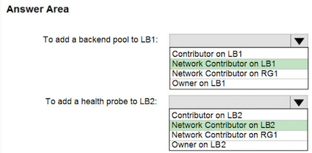

**The Network Contributor role lets you manage networks, but not access them.**


### Question #2

You have an Azure subscription that contains an Azure Active Directory (Azure AD) tenant named contoso.com and an Azure Kubernetes Service  (AKS) cluster named AKS1.

An administrator reports that she is unable to grant access to AKS1 to the users in contoso.com.

**You need to ensure that access to AKS1 can be granted to the contoso.com users.**

What should you do first

* A. From contoso.com, modify the Organization relationships settings.
* **B. From contoso.com, create an OAuth 2.0 authorization endpoint.**
* C. Recreate AKS1.
* D. From AKS1, create a namespace

Cluster administrators can configure Kubernetes role-based access control (Kubernetes RBAC) based on a user's identity or directory group membership. Azure AD authentication is provided to AKS clusters with OpenID Connect. 

**OpenID Connect is an identity layer built on top of the OAuth 2.0 protocol**、 Cluster administrators can configure Kubernetes role-based access control (Kubernetes RBAC) based on a user's identity or directory groupmembership. 

Azure AD authentication is provided to AKS clusters with OpenID Connect. OpenID Connect is an identity layer built on top of the

By modifying the Organization relationships settings in the contoso.com Azure AD tenant, you can establish the necessary trust relationship between the tenant and AKS1. This enables users in contoso.com to authenticate and access AKS1

Once you have modified the Organization relationships settings, the administrator will be able to grant access to AKS1 to the users in contoso.com by assigning appropriate roles or permissions within AKS1

### Question #3

You have a Microsoft 365 tenant and an Azure Active Directory (Azure AD) tenant named contoso.com.

You plan to grant three users named User1, User2, and User3 access to a temporary Microsoft SharePoint document library named Library1.

You need to **create groups for the users. The solution must ensure that the groups are deleted automatically after 180 days.**

Which two groups should you create? Each correct answer presents a complete solution.

NOTE: Each correct selection is worth one point.

* **A. a Microsoft 365 group that uses the Assigned membership type**
* B. a Security group that uses the Assigned membership type
* **C. a Microsoft 365 group that uses the Dynamic User membership type**
* D. a Security group that uses the Dynamic User membership type
* E. a Security group that uses the Dynamic Device membership type

> **You can set expiration policy only for Office 365 groups in Azure Active Directory (Azure AD)**.
> 
> Note: With the increase in usage of Office 365 Groups, administrators and users need a way to clean up unused groups. **Expiration policies can help remove inactive groups from the system and make things cleaner.**
> 
> When a group expires, all of its associated services (the mailbox, Planner, SharePoint site, etc.) are also deleted.
> 
> 
> You can set up a rule for **dynamic membership on security groups** or Office 365 groups

**You can set expiration policy only for Microsoft 365 groups in Azure Active Directory (Azure AD), part of Microsoft Entra.**

### Question #4


You have an Azure Active Directory (Azure AD) tenant named contoso.com that contains the users shown in the following table:

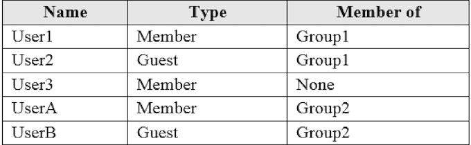

* **User3 is the owner of Group1.**
* **Group2 is a member of Group1.**

You configure an access review named Review1 as shown in the following exhibit:

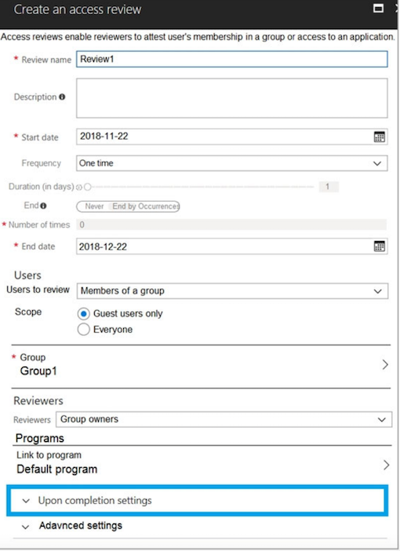

Statement


* User3 can perform an access review of User1   (NO)
* User3 can perform an access review of UserA   (NO)
* User3 can perform an access review of UserB   (YES)


User3 can perform an access review of User1 = No

**User1 is a Member and not a Guest Account, Access Review specified Guests only.**


User3 can perform an access review of UserA = No

**UserA is a Member and not a Guest Account, Access Review specified Guests only**


User 3 can perform an access review of User B: Yes 

Reviewing  a role with nested groups assigned: **For users who have membership through a nested group, the access review will not remove their membership to the nested group and therefore they will retain access to the role being reviewed**

group1

* user1 (member)
* user2 (guest)
* user3 (owner)

group2

* userA (member)
* userB (guest)

group1 = group2 + *

Review1

* member of a group - guest user only
	* **user2, userB**
* group_owner (user3)

* user3 access review user1 --> no
* user3 access review userA --> no
* user3 access review userB --> yes.


### Question #5

You have the Azure management groups shown in the following table:

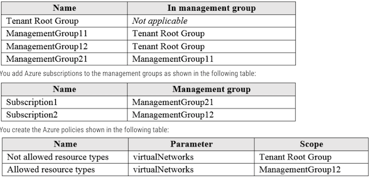

For each of the following statements, select Yes if the statement is true. Otherwise, select No.

NOTE: Each correct selection is worth one point.

Hot Area:

* **You can create a virtual network in Subscription1.   （No)**
* **You can create a virtual machine in Subscription2.    （No)** 
* **You can add Subscription1 to ManagementGroup11.   （No)**


* No - Sub1 > Group21 > Group11 > TenantRoot (Not allowed)
* No - Sub2 > Group12 > TenantRoot (Not allowed)
* No - **Only one management group can be assigned to a subscription (Group21 is already assigned to sub1)**


* **No - Tenant Root not allowed**
* No - **Azure policy is a Strict Deny system, Any deny policy on top level is not overridden by lower level allows. Since you are not allowed to create a VNet you can't create a VM without a VNet**.
* No- **you don't add a subscription group which is already assigned to other** .


**Allowed Resource Type (Deny)**: Defines the resource types that you can deploy. Its effect is to deny all resources that aren't part of this defined list.

**Not allowed resource types (Deny):** Prevents a list of resource types from being deployed.

Based on the Policies, VNETs are not allowed in the Tenant Root Group scope, so you cannot deploy VNETs. **Also, VNETs only allowed in ManagementGroup12 scope, but you cannot deploy any other resource**.


**Box 1: No**

Subscription1 is a member of ManagementGroup21, ManagementGroup21 is a member of ManagementGroup11, ManagementGroup11 is a member of the Tenant Root Group, The Tenant Root group has ‘Not allowed resource types for virtual network’.

**Box 2: No:**

You cannot create a VM, because based on the Policy you can only create VNETs in Sybscription2 (ManagementGroup12).

**Box 3: No**

You cannot ADD Subscription1 to ManagementGroup11, but you can MOVE Subscription1 from ManagementGroup21 to ManagmentGroup11.

**Subscriptions can only be a member of ONE ManagementGroup at a time**

### **Question #6**

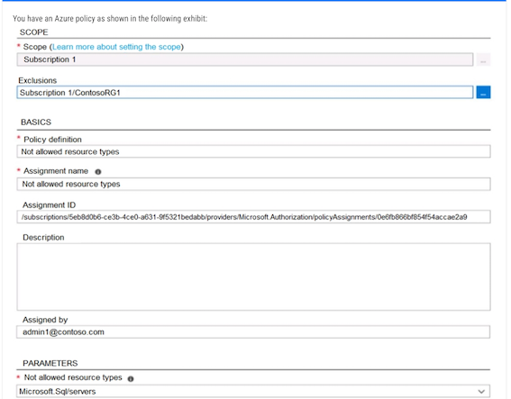


What is the effect of the policy?


* A. You are prevented from creating Azure SQL servers anywhere in Subscription 1.
* **B. You can create Azure SQL servers in ContosoRG1 only.**
* C. You are prevented from creating Azure SQL Servers in ContosoRG1 only.
* D. You can create Azure SQL servers in any resource group within Subscription 1.

#### Question #7

You have an Azure subscription that contains the resources shown in the following table:

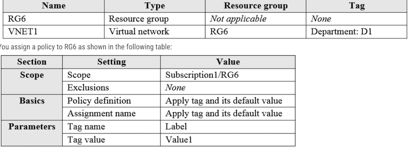

To RG6, you apply the tag: **RGroup: RG6.**

You deploy a virtual network named VNET2 to RG6.


Which tags apply to VNET1 and VNET2? To answer, select the appropriate options in the answer area.


NOTE: Each correct selection is worth one point.

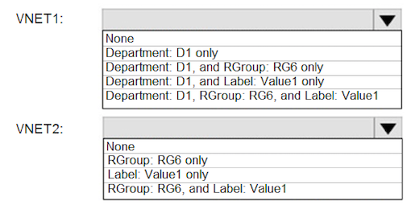


* **VNET1 will only have Department: D1 tag** 
* **VNET 2 will only have Label : Value1 tag**

* VNET1 - Department: D1
* VNET2 - Label : Value1

### Question #8

You have an Azure subscription named AZPT1 that contains the resources shown in the following table:

```	
Name				Type
storage1    Azure Storage account
VNET				Virtual network
VM1				Azure virtual machine
VM1Managed  Managed disk for VM1
VAULT1 		
Recovery Services vault for the site recovery of VM1
```

You create a new Azure subscription named AZPT2.

**You need to identify which resources can be moved to AZPT2.**

Which resources should you identify?


* A. VM1, storage1, VNET1, and VM1Managed only
* B. VM1 and VM1Managed only
* **C. VM1, storage1, VNET1, VM1Managed, and RVAULT1**
* D. RVAULT1 only

**C:**

You can move a VM and its associated resources to a different subscription by using the Azure portal.


You can now move an Azure Recovery Service (ASR) Vault to either a new resource group within the current subscription or to a new subscription

All of them. Moving a resource only moves it to a new Resource Group or Subscription. It doesn't change the location of the resource.


### Question #9

You recently created a new Azure subscription that contains a user named Admin1.

Admin1 attempts to deploy an Azure Marketplace resource by using an Azure Resource Manager template.** Admin1 deploys the template by using Azure**


PowerShell and receives the following error message: `User failed validation to purchase resources. Error message: `Legal terms have not been accepted for this item on this subscription. 

To accept legal terms, please go to the Azure portal (http://go.microsoft.com/fwlink/?LinkId=534873) and configure programmatic deployment for the Marketplace item or create it there for the first time.


You need to ensure that Admin1 can deploy the Marketplace resource successfully.

What should you do?


* A. From Azure PowerShell, run the Set-AzApiManagementSubscription cmdlet
* B. From the Azure portal, register the Microsoft.Marketplace resource provider
* **C. From Azure PowerShell, run the Set-AzMarketplaceTerms cmdlet**
* D. From the Azure portal, assign the Billing administrator role to Admin1

C is correct answer

```
Set-AzMarketplaceTerms -Publisher <String> -Product <String> -Name <String> [-Accept] [-Terms <PSAgreementTerms>] [-DefaultProfile
<IAzureContextContainer>] [-WhatIf] [-Confirm] [<CommonParameters>]
```

### Question #10


You have an Azure Active Directory (Azure AD) tenant that contains 5,000 user accounts.

You create a new user account named AdminUser1.

**You need to assign the User administrator administrative role to AdminUser1**.

What should you do from the user account properties?


* A. From the Licenses blade, assign a new license
* **B. From the Directory role blade, modify the directory role**
* C. From the Groups blade, invite the user account to a new group


**Correct Answer: B**

Assign a role to a user -


* 1. Sign in to the Azure portal with an account that's a global admin or privileged role admin for the directory.
* 2. **Select Azure Active Directory, select Users, and then select a specific user from the list**.
* 3. For the selected user, select Directory role, select Add role, and then pick the appropriate admin roles from the Directory roles list, **such as Conditional access administrator**.
* 4. Press Select to save.


**Active Directory -> Manage Section -> Roles and administrators-> Search for Admin and assign a user to it.**


### Question #11


You have an Azure Active Directory (Azure AD) tenant named contoso.onmicrosoft.com that contains 100 user accounts.

**You purchase 10 Azure AD Premium P2 licenses for the tenant.**

**You need to ensure that 10 users can use all the Azure AD Premium features.**


What should you do?

* **A. From the Licenses blade of Azure AD, assign a license**
* B. From the Groups blade of each user, invite the users to a group
* C. From the Azure AD domain, add an enterprise application
* D. From the Directory role blade of each user, modify the directory role


**Correct Answer: A**

Active Directory-> Manage Section > **Choose Licenses -> All Products -> Select Azure Active Directory Premium P2 -> Then assign a user to it.**


### Question #12

You have an Azure subscription named Subscription1 and an on-premises deployment of Microsoft System Center Service Manager.

**Subscription1 contains a virtual machine named VM1.
You need to ensure that an alert is set in Service Manager when the amount of available memory on VM1 is below 10 percent.**

What should you do first?


* A. Create an automation runbook
* B. Deploy a function app
* **C. Deploy the IT Service Management Connector (ITSM)**
* D. Create a notification

Correct Answer: C

**The IT Service Management Connector (ITSMC)** allows you to connect Azure and a supported IT Service Management (ITSM) product/service, **such as the Microsoft System Center Service Manager**

IT Service Management Connector (ITSMC) allows you to connect Azure to a supported IT Service Management (ITSM) product or service. 

**Azure services like Azure Log Analytics and Azure Monitor provide tools to detect, analyze, and troubleshoot problems with your Azure and non-Azure resources.**


But the work items related to an issue typically reside in an ITSM product or service. ITSMC provides a bi-directional connection between Azure and ITSM tools to help you resolve issues faster. ITSMC supports connections with the following 

ITSM tools: ServiceNow, System Center, Service Manager, Provance, Cherwell.


### Question #13

You sign up for Azure Active Directory (Azure AD) Premium P2.


You need to add a user named admin1@contoso.com as an administrator on all the computers that will be joined to the Azure AD domain.

What should you configure in Azure AD?


* **A. Device settings from the Devices blade**
* B. Providers from the MFA Server blade
* C. User settings from the Users blade
* D. General settings from the Groups blade

**Correct Answer: A**

When you connect a Windows device with Azure AD using an Azure AD join, Azure AD adds the following security principles to the local administrators group on the device:

* ✑ **The Azure AD global administrator role**
* ✑ **The Azure AD device administrator role**
* ✑ **The user performing the Azure AD join**

In the Azure portal, you can manage the device administrator role on the Devices page. To open the Devices page:

1. Sign in to your Azure portal as a **global administrator or device administrator.**
2. On the left navbar, click **Azure Active Directory**.
3. In the Manage section, **click Devices**.
4. **On the Devices page, click Device settings**.
5. **To modify the device administrator role, configure Additional local administrators on Azure AD joined devices**.

### Question #14

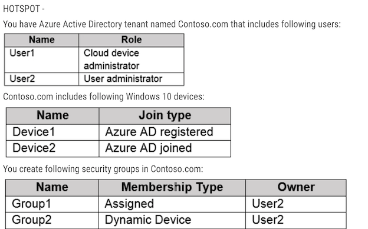

* User1 can add Device2 to Group1: No
* User2 can add Device1 to Group1: Yes
* User2 can add Device2 to Group2: No

**Groups can contain both registered and joined devices as members.**

* **As a global administrator or cloud device administrator**, you can manage the registered or joined devices. Intune Service administrators can update and delete devices. 
* User administrator can manage users but not devices


**User1 is a cloud device administrator**. 

Users in this role can enable, disable, and delete devices in Azure AD and read Windows 10 BitLocker keys (if
present) in the Azure portal. **The role does not grant permissions to manage any other properties on the device**.


**User2 is the owner of Group1. He can add Device1 to Group1.**


**Group2 is configured for dynamic membership.** 

This implies that any given resource MUST MEET the
criteria/requirement outlined within the group dynamic membership scope to be added to this group as a member. 

The properties of dynamic group membership requirements **CANNOT be changed by either end user nor user administrator**

Additionally, Dynamic Groups feature require Entra ID Premium P1 or P2 licensing.

* User1 can add Device2 to Group1: No (because User1 is Cloud Device Admin and cannot change the group membership for Group1)

* User2 can add Device1 to Group1: Yes (because User2 is Group Owner which has the requisite authority for changing group membership. furthermore, Group1 has Assigned membership type)

* User2 can add Device2 to Group2: No (b**ecause though User2 is Group Owner with requisite rights but Group2 has Dynamic Device membership type**)

* NO Cloud device admin cannot add/join devices
* YES: user admin can add device/user/groups
* NO: Dynamic groups dont require manual intervention, it uses criteria to add or remove devices/users/groups only assigned groups you can add

### Question #15

You have an Azure subscription that contains a resource group named RG26.

RG26 is set to the West Europe location and is used to create temporary resources for a project. **RG26 contains the resources shown in the following table**


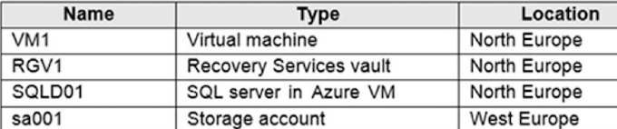

SQLDB01 is backed up to RGV1.

* When the project is complete, you attempt to delete RG26 from the Azure portal. The deletion fails.
* You need to delete RG26.

What should you do first?


* A. Delete VM1
* B. Stop VM1
* **C. Stop the backup of SQLDB01**
* D. Delete sa001

You can't delete a Recovery Services vault with any of the following dependencies:

1. You can't delete a vault that contains backup data. Once backup data is deleted, it will go into the soft deleted state.
2. You can't delete a vault that contains backup data in the soft deleted state.

###  Question #16

You have an Azure subscription named Subscription1 that contains a virtual network named VNet1. VNet1 is in a resource group named RG1.

Subscription1 has a user named User1. User1 has the following roles:

* ✑ Reader
* ✑ Security Admin
* ✑ Security Reader

You need to ensure that **User1 can assign the Reader role for VNet1 to other users.**

What should you do?

* A. Remove User1 from the Security Reader and Reader roles for Subscription1.
* **B. Assign User1 the User Access Administrator role for VNet1.**
* C. Assign User1 the Network Contributor role for VNet1.
* D. Assign User1 the Network Contributor role for RG1.

Correct B

There are several versions of this question in the exam. The question has two possible correct answers:

*  Assign User1 the User Access Administrator role for VNet1.
* Assign User1 the Owner role for VNet1.

A. Other incorrect answer options you may see on the exam include the following:

	
The User Access Administrator role allows users to manage user access to Azure resources, but it does not provide the ability to assign roles to other users. for that specific virtual networ

### Question #17

You have an Azure Active Directory (Azure AD) tenant named contosocloud.onmicrosoft.com.

* Your company has a public DNS zone for contoso.com.
* You add contoso.com as a custom domain name to Azure AD.
* You need to ensure that Azure can verify the domain name.

Which type of DNS record should you create?

Correct Answer: A


To verify your custom domain name (example)

1. Sign in to the Azure portal using a Global administrator account for the directory.
2. Select Azure Active Directory, and then select Custom domain names.
3. On the Fabrikam - Custom domain names page, select the custom domain name, Contoso.
4. On the Contoso page, select Verify to make sure your custom domain is properly registered and is valid for Azure AD. **Use either the TXT or the MX record type.**


Correct ;

1. **MX    correct**
2. TXT

1. SRV   
2. NSEC3


### Question #18


You have an Azure Directory (Azure AD) tenant named Adatum and an Azure Subscription named Subscription1. Adatum contains a group named Developers.

Subscription1 contains a resource group named Dev.

You need to provide the Developers group with the ability to create Azure logic apps in the Dev resource group.

Solution: **On Subscription1, you assign the DevTest Labs User role to the Developers group.**

Does this meet the goal?

* A. Yes
* **B. No**


**The Azure DevTest Labs is a role used for Azure DevTest Labs, not for Logic Apps.**

DevTest Labs User role only lets you connect, start, restart, and shutdown virtual machines in your Azure DevTest Labs.

The **Logic App Contributor role lets you manage logic app**, but not access to them. It provides access to view, edit, and update a logic app

> It means it manages the app but it does not manage access. So it cannot give other users access to the app

**Azure DevTest Labs is a service that has nothing to do with Logic App**


### Question #19

You have an Azure Directory (Azure AD) tenant named Adatum and an Azure Subscription named Subscription1. Adatum contains a group named Developers.

Subscription1 contains a resource group named Dev.

You need to provide the Developers group with the ability to **create Azure logic apps in the Dev resource group.**

Solution: **On Subscription1, you assign the Logic App Operator role to the Developers group**.

Does this meet the goal?

* A. Yes
* **B. No**

Correct Answer: B

You would need the Logic App Contributor role.

* **Logic App Operator - Lets you read, enable, and disable logic apps, but not edit or update them**

* **Logic App Contributor - Lets you create, manage logic apps, but not access to them**


### Question #20

You have an Azure Directory (Azure AD) tenant named Adatum and an Azure Subscription named Subscription1. Adatum contains a group named Developers.

Subscription1 contains a resource group named Dev.

You need to provide the Developers group with the ability to create Azure logic apps in the Dev resource group.

Solution: **On Dev, you assign the Contributor role to the Developers group**.


Does this meet the goal?

* **A. Yes**
* B. No

The Contributor role can manage all resources (and add resources) in a Resource Group. **Contributor role can create logic apps.**

Alternatively, we can use the **Logic App Contributor role, which lets you manage logic app**, but not access to them. **It provides access to view, edit, and update a logic app**.


**Contributor role can create logic apps**

### Question #21

You have an Azure subscription that is used by four departments in your company. 

**The subscription contains 10 resource groups. Each department uses resources in several resource groups**.

You need to send a report to the finance department. The report must detail the costs for each department.

Which three actions should you perform in sequence? To answer, move the appropriate actions from the list of actions to the answer area and arrange them in the correct order.


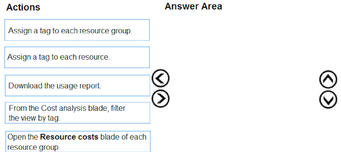

* Box 1: Assign a tag to each resource
* Box 2: From the Cost analysis blade, filter the view by tag
* Box 3: Download the usage report

**Box 1: Assign a tag to each resource.**

You apply tags to your Azure resources giving metadata to logically organize them into a taxonomy. 

After you apply tags, you can retrieve all the resources in your subscription with that tag name and value. Each resource or resource group can have a maximum of 15 tag name/value pairs.

Tags applied to the resource group are not inherited by the resources in that resource group.

**Box 2: From the Cost analysis blade, filter the view by tag**

After you get your services running, regularly check how much they're costing you. You can see the current spend and burn rate in Azure

1.Visit the Subscriptions blade in Azure portal and select a subscription.

You should see the cost breakdown and burn rate in the popup blade.

2.Click Cost analysis in the list to the left to see the cost breakdown by resource. Wait 24 hours after you add a service for the data to populate.


3.You can filter by different properties like tags, resource group, and timespan. Click Apply to confirm the filters and Download if you want to export the view to a Comma-Separated Values (.csv) file.

**Box 3: Download the usage report**

### Question #22

You have an Azure subscription named Subscription1 that contains an Azure Log Analytics workspace named Workspace1.
You need to view the error events from a table named Event.


Which query should you run in Workspace1?


* A. `Get-Event Event | where {$_.EventType == "error"}`
* **B. search in (Event) "error"**
* C. `select * from Event where EventType == "error"`
* D. `search in (Event) * | where EventType -eq "error`

**Correct Answer: B**

To search a term in a specific table, add the table-name just after the search operator

1. Event | search "error"
2. Event | where EventType == "error"
3. search in (Event) "error"


Option D uses a syntax that is similar to KQL, but the correct syntax would be:

D. **`search in (Event) * | where EventType == "error"`**


### Question #23

You have an Azure subscription that contains a virtual network named VNET1 in the East US 2 region. A network interface named VM1-NI is connected to

**VNET1.**

You successfully deploy the following Azure Resource Manager template.

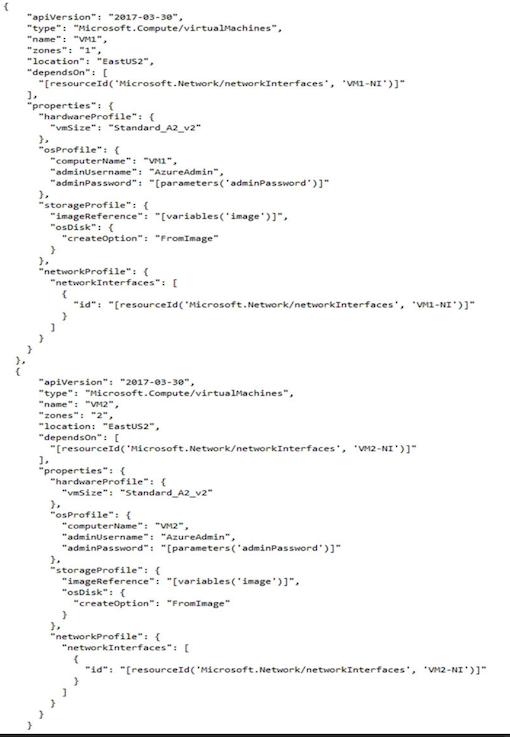

For each of the following statements, select Yes if the statement is true. Otherwise, select No

* **VM1 and VM2 can connect to VNET1 (yes)**
* **If an Azure datacenter becomes unavailable, VM1 or VM2 will be available.  (yes)**
* If the East US 2 region becomes unavailable, VM1 or VM2 will be available.  (no)


Box 1: Yes

**VNET1 is in the same region as VM1 and VM2, so it can connect with both.**

Box 2: Yes

**Because both VMs are in different Availability Zone, hence either one would be available if one Data Center fails**.

Box 3: No

**If the Region fails then both VMs, which are present in the Region will not be available**

### Question #24

You have an Azure subscription named Subscription1. Subscription1 contains the resource groups in the following table.

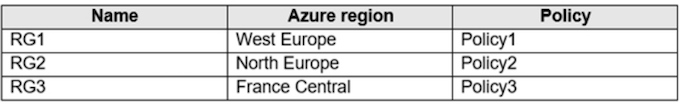


**RG1 has a web app named WebApp1. WebApp1 is located in West Europe.**

**You move WebApp1 to RG2.**

What is the effect of the move?

* **A. The App Service plan for WebApp1 remains in West Europe. Policy2 applies to WebApp1**.
* B. The App Service plan for WebApp1 moves to North Europe. Policy2 applies to WebApp1.
* C. The App Service plan for WebApp1 remains in West Europe. Policy1 applies to WebApp1.
* D. The App Service plan for WebApp1 moves to North Europe. Policy1 applies to WebApp1.


You can only move a resource to **a Resource Group or Subscription**, but the **location stays the same.** 


When you move WebApp1 to RG2, **the resource will be restricted based on the policy of the new Resource Group**

**"you cannot change an App Service plan's region. If you want to run your app in a different region"**

### Question #25

You have an Azure subscription named Subscription1 that has a subscription ID of c276fc76-9cd4-44c9-99a7-4fd71546436e.

You need to create a custom RBAC role named CR1 that meets the following requirements:

* ✑ Can be assigned only to the resource groups in Subscription1
* ✑ **Prevents the management of the access permissions for the resource groups**
* ✑ **Allows the viewing, creating, modifying, and deleting of resources within the resource group**s

What should you specify in the assignable scopes and the permission elements of the definition of CR1? To answer, select the appropriate options in the answer area.

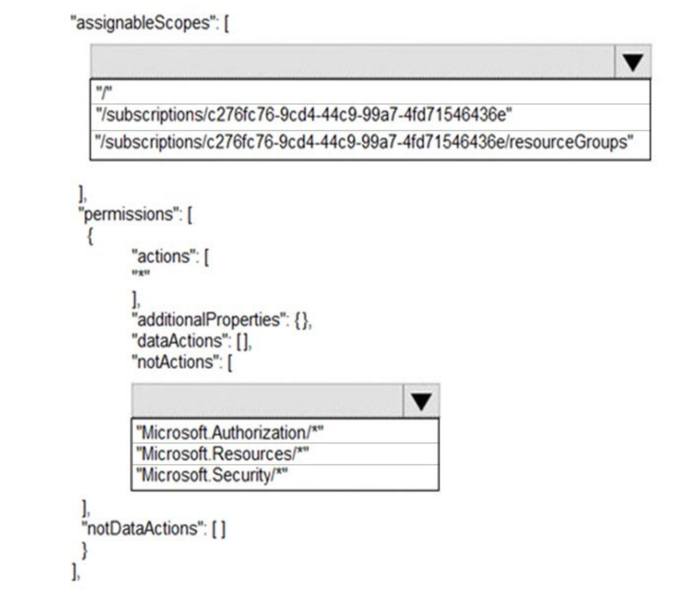

* “**/subscriptions/c276fc76-9cd4-44c9-99a7-4fd71546435e**”
* “**Microsoft.Authorization/**”


### Question #26

You have an Azure subscription.

Users access the resources in the subscription from either home or from customer sites. From home, **users must establish a point-to-site VPN to access the Azure resources**. The users on the customer sites access the Azure resources by using site-to-site VPNs.

You have a line-of-business-app named App1 that runs on several Azure virtual machine. The virtual machines run Windows Server 2016.

**You need to ensure that the connections to App1 are spread across all the virtual machines**.

What are two possible Azure services that you can use? Each correct answer presents a complete solution.

NOTE: Each correct selection is worth one point


* A. an internal load balancer
* B. a public load balancer
* C. an Azure Content Delivery Network (CDN)
* D. Traffic Manager
* E. an Azure Application Gateway

**Correct Answer: A and E**

**A: The customer sites are connected through VPNs, so an internal load balancer is enough.**

B: The customer sites are connected through VPNs, so there's no need for a public load balancer, an internal load balancer is enough

C: A CDN does not provide load balancing for applications, so it not relevant for this situation.

D: **Traffic manager is a DNS based solution** to direct users' requests to the nearest (typically) instance and does not provide load balancing for this situation.

**E: Azure Application Gateway is a valid option, as it provides load balancing in addition to routing and security functiions**


#### A. an internal load balancer: 

An internal load balancer can be used to **distribute traffic among the virtual machines running App1**. It can distribute traffic based on various algorithms such as **round-robin, least connections, and IP hash**. 

The internal load balancer is a layer 4 (Transport Layer) load balancer that can distribute traffic within a virtual network

#### E. an Azure Application Gateway: 

An Azure Application Gateway is a layer 7 (Application Layer) load balancer that can distribute traffic based on various criteria such as URL path, host headers, and cookie. 

**It can also perform SSL offloading, session affinity, and URL-based routing. It is typically used to route traffic to different backend services based on the incoming request's contents. It is a more advanced option than the internal load
balancer but requires a public IP address.**

### Question #27

You have an Azure subscription.

You have 100 Azure virtual machines.

You need to quickly identify underutilized virtual machines that can have their service tier changed to a **less expensive offering.**

Which blade should you use?

* A. Monitor
* **B. Advisor**
* C. Metrics
* D. Customer insights


**Advisor helps you optimize and reduce your overall Azure spend by identifying idle and underutilized resources**. You can get cost recommendations from the Cost tab on the Advisor dashboard.


**The Advisor dashboard displays personalized recommendations for all your subscriptions.** You can apply filters to display recommendations for specific subscriptions and resource types. The recommendations are divided into five categories:


**Reliability (formerly called High Availability)**: To **ensure and improve the continuity of your business-critical applications**. For more information, see Advisor Reliability recommendations.

**Security: To detect threats and vulnerabilities that might lead to security breaches.** For more information, see Advisor Security recommendations.

Performance: To improve the speed of your applications. For more information, see Advisor Performance recommendations.


**Cost: To optimize and reduce your overall Azure spending**. For more information, see Advisor Cost recommendations.


Operational Excellence: To help you achieve process and workflow efficiency, resource manageability and deployment best practices. 

For more information, see Advisor Operational Excellence recommendations.

### Question #28

You have an Azure Active Directory (Azure AD) tenant.

**You need to create a conditional access policy that requires all users to use multi-factor authentication when they access the Azure portal.**

Which three settings should you configure? To answer, select the appropriate settings in the answer area.

NOTE: Each correct selection is worth one point.

Hot Area:

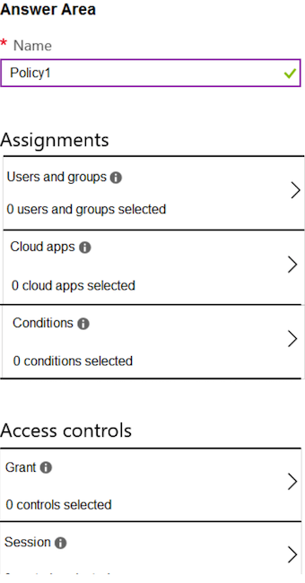


The Answer is correct .

- **Select Users & Groups** : Where you have to choose all users.
- **Select Cloud apps or actions**: to specify the Azure portal
- **Grant: to grant the MFA**.

Those are the **minimum requirements to create MFA policy**. 

No conditions are required in the question.

### Question #29

You have an Azure Active Directory (Azure AD) tenant named contoso.onmicrosoft.com.

The User administrator role is assigned to a user named Admin1.

An external partner has a Microsoft account that uses the user1@outlook.com sign in.

Admin1 attempts to invite the external partner to sign in to the Azure AD tenant and receives the following error message: `Unable to invite user user1@outlook.com `" Generic authorization exception.`


**You need to ensure that Admin1 can invite the external partner to sign in to the Azure AD tenant.**

What should you do?

* **A. From the Users settings blade, modify the External collaboration settings.**
* B. From the Custom domain names blade, add a custom domain.
* C. From the Organizational relationships blade, add an identity provider.
* D. From the Roles and administrators blade, assign the Security administrator role to Admin1

Go to Azure AD--users--user settings --scroll down.--External users

**Manage external collaboration settings**


### Question #30


You have an Azure subscription linked to an Azure Active Directory tenant. The tenant includes a user account named User1.

**You need to ensure that User1 can assign a policy to the tenant root management group.**

What should you do?


* A. Assign the Owner role for the Azure Subscription to User1, and then modify the default conditional access policies.
* B. Assign the Owner role for the Azure subscription to User1, and then instruct User1 to configure access management for Azure resources.
* **C. Assign the Global administrator role to User1, and then instruct User1 to configure access management for Azure resources.**
* D. Create a new management group and delegate User1 as the owner of the new management group.


No one is given default access to the root management group. 

Azure AD Global Administrators are the **only users that can elevate themselves to gain access**. 

Once they have access to the root management group, **the global administrators can assign any Azure role to other users to manage it**.

### Topic 2 Question #31


HOTSPOT -

You have an Azure Active Directory (Azure AD) tenant named adatum.com. Adatum.com contains the groups in the following table.


Of which groups are User1 and User2 members? To answer, select the appropriate options in the answer area.

NOTE: Each correct selection is worth one point.

Hot Area:

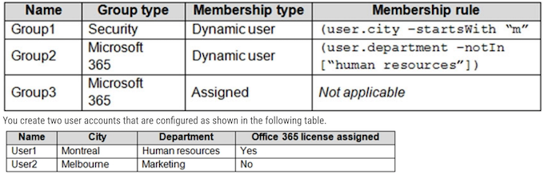

Of which groups are User1 and User2 members? To answer, select the appropriate options in the answer area.

NOTE: Each correct selection is worth one point.

Hot Area:

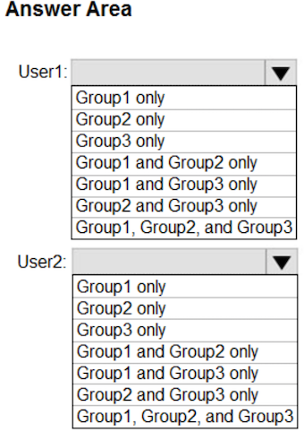

Correct answer.

* **User 1: Group 1 only**
* **User 2: Group 1 & 2**

### Question #32

You have a hybrid deployment of Azure Active Directory (Azure AD) that contains the users shown in the following table.

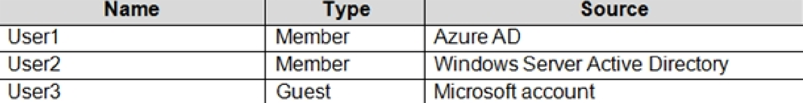

You need to modify the **JobTitle and UsageLocation attributes for the users**.

**For which users can you modify the attributes from Azure AD? To answer, select the appropriate options in the answer area.**

NOTE: Each correct selection is worth one point.
Hot Area:

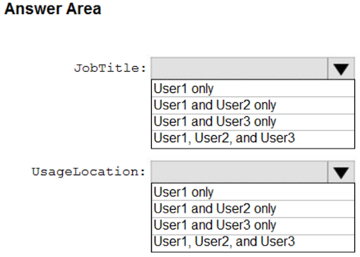

You must use Windows Server Active Directory to update the identity, contact info, or job info for users whose source of authority is Windows


**Box 1:User1 and User3 only**

You must use Windows Server Active Directory to update the identity, contact info, or job info for users whose source of authority is Windows

Server Active Directory.

**Box 2: User1, User2, and User3**

Usage location is an Azure property that can only be modified from Azure AD (for all users including Windows Server AD users synced via Azure AD Connect).

### Question #33

You need to ensure that an Azure Active Directory (Azure AD) user named Admin1 is assigned the required role to enable Traffic Analytics for an Azure subscription.

Solution: **You assign the Network Contributor role at the subscription level to Admin1.**

Does this meet the goal?


* **A. Yes**
* B. No


Your account must have any one of the following Azure roles at the subscription scope: **Owner, Contributor, Reader, or Network Contributor**.

**Network Contributor role - Lets you manage networks, but not access to them.**

Traffic Analytics is a cloud-based solution that provides visibility into user and application activity in cloud networks. 

Traffic analytics analyzes Network Watcher network security group (NSG) flow logs to provide insights into traffic flow in your Azure cloud.

### Question #34

You need to ensure that an Azure Active Directory (Azure AD) user named Admin1 is assigned the required role to enable Traffic Analytics for an Azure subscription


Solution: **You assign the Owner role at the subscription level to Admin1.**

Does this meet the goal?

* **A. Yes**
* B. No

**Correct Answer: A**

Your account must have any one of the following Azure roles at the subscription scope: Owner, Contributor, Reader, or Network Contributor.

Network Contributor role - Lets you manage networks, but not access to them.


Traffic Analytics is a cloud-based solution that provides visibility into user and application activity in cloud networks. 

**Traffic analytics analyzes
Network Watcher network security group (NSG) flow logs to provide insights into traffic flow in your Azure cloud.**


### Question #35

You need to ensure that an Azure Active Directory (Azure AD) user named Admin1 is assigned the required role to enable Traffic Analytics for an Azure subscription.

Solution: **You assign the Reader role at the subscription level to Admin1.**

Does this meet the goal?

* A. Yes
* **B. No**

### Question #36

You need to ensure that User1 can deploy virtual machines and **manage virtual networks**. The solution must use the principle of least privilege.

Which role-based access control (RBAC) role should you assign to User1?

* A. Owner
* B. Virtual Machine Contributor
* **C. Contributor**
* D. Virtual Machine Administrator Login

Correct Answer: C

* Contributor: **Grants full access to manage all resources, but does not allow you to assign roles in Azure RBAC**


* A: Owner: Grants full access to manage all resources, including the ability to assign roles in Azure RBAC.
* B: Virtual Machine Contributor: **Lets you manage virtual machines, but not access to them, and not the virtual network **or storage account they're connected to.
* D: Virtual Machine Administrator Login: **View Virtual Machines in the portal and login as administrator.**


### Question #37

You have an Azure Active Directory (Azure AD) tenant that contains three global administrators named **Admin1, Admin2, and Admin3.**

The tenant is associated to an Azure subscription. 

Access control for the subscription is configured as shown in the Access control exhibit. (Click the Access Control tab.)

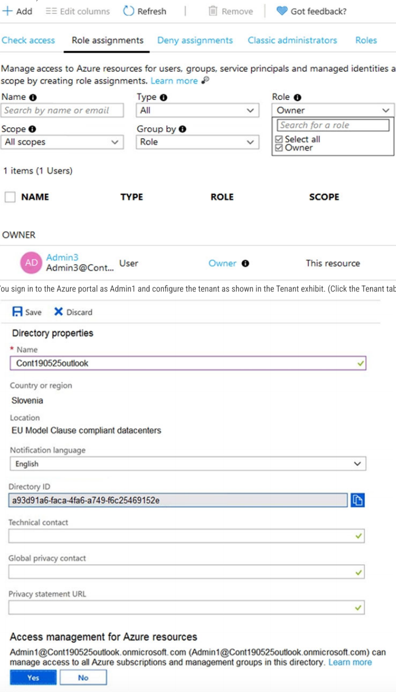


For each of the following statements, select Yes if the statement is true. Otherwise, select No


**Statements**

* Admin1 can add Admin 2 as an owner of the subscription. **(YES)**
* Admin3 can add Admin 2 as an owner of the subscription. **(YES)**
* Admin2 can create a resource group in the subscription. **(No)**


Azure (RBAC) and Azure AD roles are independent. **AD roles do not grant access to resources and Azure roles do not grant access to Azure AD**.

However, **a Global Administrator in AD can elevate access to all subscriptions and will be User Access Administrator in Azure root scope.**

All 3 users are GA (AD) and **Admin3 is owner of the subscription (RBAC).**

**Admin1 has elevated access, so he is also User Access Admin (RBAC)**.

To assign a user the owner role at the Subscription scope, you require permissions, such as User Access Admin or Owner

**Box 1: Yes**

Admin1 has elevated access, so he is User Access Admin. This is valid

**Box 2: Yes**

Admin3 is **Owner of the Subscription**. This is valid

1. Yes : Admin1 is a Global Administrator at Tenant which does not give it permission on subscription but as per exibit it has taken control to manage access to all Azure subscriptions therefore it now has access to manage subscription therefore can assign role to other users.

2. Yes : Admin 3 is Global Administrator + Owner of Subscription therefore can assign Owner role to other user.

3. NO : Admin2 is Global Administrator for Tenant and do not **have any rights on Subscription therefore cannot create resources in it.**


### Question 38

VM1 runs services that will be used to deploy resources to RG1.

You need to ensure that a service running on VM1 can manage the resources in RG1 by using the identity of VM1.

What should you do first?

* **A. From the Azure portal, modify the Managed Identity settings of VM1**
* B. From the Azure portal,
* C. From the Azure portal, modify the Access control (IAM) settings of VM1
* D. From the Azure portal, modify the Policies settings of RG1

**Correct Answer: A**

Managed identities for Azure resources provides Azure services with an automatically managed identity in Azure Active Directory. 

**You can use this identity to authenticate to any service that supports Azure AD authentication,** without having credentials in your code.


RBAC manages who has access to Azure resources, what areas they have access to and what they can do with those resources. Examples of Role

Based Access Control (RBAC) include: Allowing an app to access all resources in a resource group Policies on the other hand focus on resource properties during deployment and for already existing resources. As an example, a policy can be issued to ensure users can only deploy DS series
VMs within a specified resource

### Question 39

You have an Azure subscription that contains a resource group named TestRG.

You use TestRG to validate an Azure deployment.
TestRG contains the following resources:

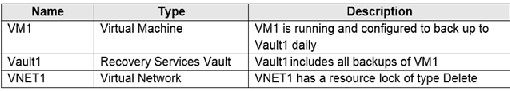

**You need to delete TestRG.**

What should you do first?

You need to delete TestRG.
What should you do first?

**Correct Answer: C**

* A. Modify the backup configurations of VM1 and modify the resource lock type of VNET1
* B. Remove the resource lock from VNET1 and delete all data in Vault1
* C. Turn off VM1 and remove the resource lock from VNET1
* D. Turn off VM1 and delete all data in Vault1

When you delete a resource group, all of its resources are also deleted. Deleting a resource group deletes all of its template deployments and currently stored operations.


### Question #40

You have an Azure DNS zone named adatum.com.

**You need to delegate a subdomain named research.adatum.com to a different DNS server in Azure.**

What should you do?

Correct Answer: A

* **A. Create an NS record named research in the adatum.com zone.**
* B. Create a PTR record named research in the adatum.com zone.
* C. Modify the SOA record of adatum.com.
* D. Create an A record named *.research in the adatum.com zone


**Correct Answer: A**

An NS record or (name server record) tells recursive name servers which name servers are authoritative for a zone. You can have as many NS records as you would like in your zone file. 

**The benefit of having multiple NS records is the redundancy of your DNS service.**

**You need to create a name server (NS) record for the zone**

To delegate a subdomain named research.adatum.com to a different DNS server in Azure, you should create an NS (Name Server) record named "research" in the adatum.com zone.


The NS record is used to delegate authority for a subdomain to a different set of name servers. 

By creating an NS record named "research" in the adatum.com zone and specifying the name server(s) for the subdomain, 

you can delegate the management of the research.adatum.com subdomain to the specified DNS server(s) in Azure.

### Question #41

You have an Azure Active Directory (Azure AD) tenant that has the `contoso.onmicrosoft.com` domain name.

**You have a domain name of contoso.com registered at a third-party registrar.**

You need to ensure that you can create Azure AD users that have names containing a suffix of @contoso.com.

Which three actions should you perform in sequence? To answer, **move the appropriate actions from the list of actions to the answer area and arrange them in the correct order**

Select and Place:

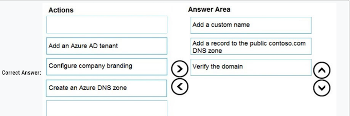


1. Add the custom domain name to your directory
2. Add a DNS entry for the domain name at the domain name registrar
3. **Verify the custom domain name in Azure AD**


### Question #43

You have a registered DNS domain named contoso.com.

You create a public Azure DNS zone named contoso.com.

**You need to ensure that records created in the contoso.com zone are resolvable from the internet.**

What should you do?

* A. Create NS records in contoso.com.
* B. Modify the SOA record in the DNS domain registrar.
* C. Create the SOA record in contoso.com.
* D. Modify the NS records in the DNS domain registrar.

**Correct Answer: D**


Registrar “owns” the tld(Top level domain) and will have their NS registered against the domain by default. 

By changing the registrar NS records to point to your Azure DNS NS records you take ownership into your Azure DNS.

**Delegate the domain**

Once the DNS zone gets created and you have the name servers, you'll need to update the parent domain with the Azure DNS name servers. 

**Each registrar has its own DNS management tools to change the name server records for a domain.**

In the registrar's DNS management page, edit the NS records and replace the NS records with the Azure DNS name servers.

When you delegate a domain to Azure DNS, you must use the name servers that Azure DNS provides. 

Use all four name servers, regardless of the name of your domain. **Domain delegation doesn't require a name server to use the same top-level domain as your domain**


### Question #44

You have an Azure subscription that contains a storage account named storage1. 

The subscription is linked to an Azure Active Directory (Azure AD) tenant named contoso.com **that syncs to an on-premises Active Directory domain**.

The domain contains the security principals shown in the following table

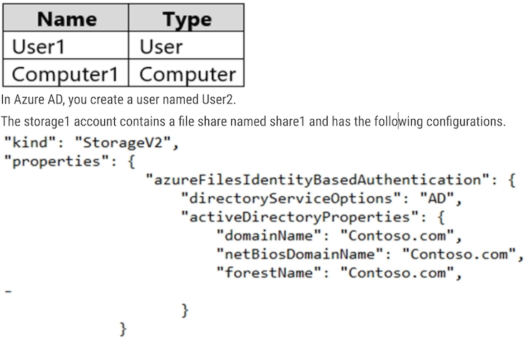

For each of the following statements, select Yes if the statement is true. Otherwise, select No.

NOTE: Each correct selection is worth one point.

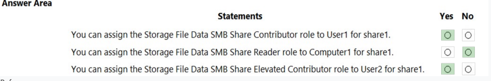

* Azure AD DS and on-premises AD DS authentication do not support authentication against computer accounts. You can consider using a service logon account instead.
* If you intend to use a specific Azure AD user or group to access Azure file share resources, **that identity must be a hybrid identity that exists in both on-premises AD DS and Azure AD.**
* Second, all users that exist in Azure AD can be authenticated and authorized. The user can be cloud only or hybrid. **The sync from Azure AD to Azure AD DS is managed by the platform without requiring any user configuration**. However, the client must be domain joined to Azure AD DS, it cannot be Azure AD joined or registered.

### Question #45

You have an Azure subscription named Subscription1 that contains a virtual network VNet1.

You add the users in the following table

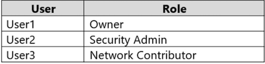

Which user can perform each configuration? To answer, select the appropriate options in the answer area.

NOTE: Each correct selection is worth one point.

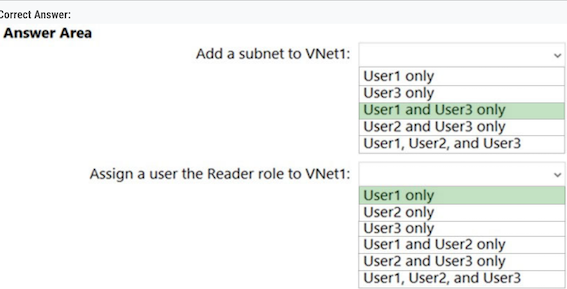

**Box 1: User1 and User3 only.**

* User1: The Owner Role lets you manage everything, including access to resources.
* User3: The Network Contributor role lets you manage networks, including creating subnets.

**Box 2: User1 only.**

The Security Admin role: 

**In Security Center only: Can view security policies, view security states, edit security policies, view alerts and recommendations, dismiss alerts and recommendations.**

* 1) Add a subnet to VNET1 = "User1 and User3 only"
* 2) Assign a user the Reader role to VNEt1 = "User1 only

* User1 - The Owner Role lets you manage everything, including access to resources.
* User3 - The Network Contributor role lets you manage networks, including creating subnets.
* User2 - The Security Admin role can view security policies, view security states, edit security policies, view alerts and recommendations, dismiss alerts and recommendations.

### Question #46

You have the Azure resources shown on the following exhibit.

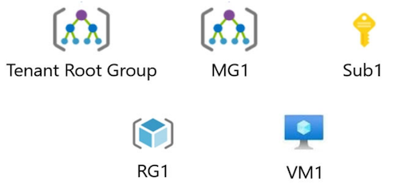

You plan to track resource usage and prevent the deletion of resources.

To which resources can you apply locks and tags? To answer, select the appropriate options in the answer area.

NOTE: Each correct selection is worth one point.

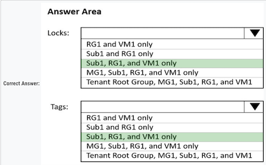

**Box 1: Sub1, RG1, and VM1 only**

You can **lock a subscription, resource group, or resource** to prevent other users in your organization from accidentally deleting or modifying critical resources.

**Box 2: Sub1, RG1, and VM1 only**

You apply tags to your Azure resources, resource groups, and subscriptions.

### Question #47

You have an Azure Active Directory (Azure AD) tenant.

You plan to delete multiple users by using Bulk delete in the Azure Active Directory admin center.

You need to create and upload a file for the bulk delete.

Which user attributes should you include in the file?


* A. The user principal name and usage location of each user only
* **B. The user principal name of each user only**
* C. The display name of each user only
* D. The display name and usage location of each user only
* E. The display name and user principal name of each user only

To perform a bulk delete of users in Azure Active Directory, you need to create and upload a CSV file that contains the list of users to be deleted.

**The file should include the user principal name (UPN) of each user only. Therefore, the answer is B.**


The UPN is a unique identifier for each user in Azure AD and is the primary way that Azure AD identifies and manages user accounts.

Including additional attributes like the display name or usage location is not required for the bulk delete operation, as the UPN is the only mandatory attribute for the user account

### Question #48

You have an Azure subscription named Sub1 that contains the Azure resources shown in the following table

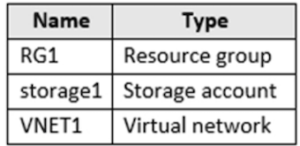

You assign an Azure policy that has the following settings:

* ✑ Scope: Sub1
* ✑ Exclusions: Sub1/RG1/VNET1
* ✑ Policy definition:  Append a tag and its value to resources
* ✑ Policy enforceme
* ✑ Tag name: Tag4
* ✑ Tag value: value4

You assign tags to the resources as shown in the following table.

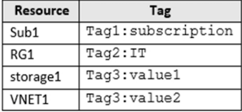

For each of the following statements, select Yes if the statement is true. Otherwise, select No.

NOTE: Each correct selection is worth one point.

Hot Area:

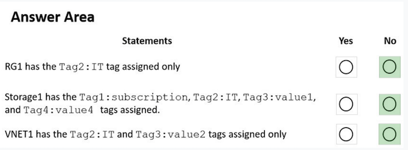


Box 1: No -

**The Azure Policy will add Tag4 to RG1.**

1st No:  Azure policy was created before the RG1 was assigned tag, which means when RG1 was manually assigned tag Tag2:IT, **the policy will take action to append Tag4:vaule4 to RG1**. 

Note that policy action is to "append", that means whatever else tag RG1 is given won't be taken away. **As such RG1 will have two tags, Tag2:IT and Tag4:value4**


Box 2: No -

Tags applied to the resource group or subscription aren't inherited by the resources although you can enable inheritance with Azure Policy.
Storage1 has Tag3:

2nd No: Remember tags are not inheritable, **whatever tag assigned to RG1 won't be applied to any resources under it.** 

As such the Storage1 should be **Tag3:value1 and Tag4:vaule4**.


Box 3: No -

Tags applied to the resource group or subscription aren't inherited by the resources so VNET1 does not have Tag2.

VNET1 has Tag3:value2. VNET1 is excluded from the Azure Policy so Tag4 will not be added to VNET1.

3rd No: vNet1 is excluded from the Azure policy, hence the policy won't do anything to it. As such vNet1 should only have the tag manually assigned: Tag3:value2. 

PS, I take that "Exclusions: Sub1/RG1/VNET1" does not mean both RG1 & vNet1 are excluded, only vNet1 is excluded, the Sub1/RG1/VNET1 is merely a path to the object that is excluded.


### Question #49

You need to ensure that an Azure Active Directory (Azure AD) user named Admin1 is assigned the required role to enable Traffic Analytics for an Azure subscription.

Solution: **You assign the Traffic Manager Contributor role at the subscription level to Admin1**.

Does this meet the goal?

* A. Yes
* B. No


* Assign **Network Contributor role** at subscription level to Admin1 **Yes**
* Assign **Monitor Contributor role** at subscription level to Admin1 **Yes**
* Assign **Owner** role at subscription level to Admin1 **Yes**
* Assign Reader role at subscription level to Admin1 **No**
* Assign Traffic Manager Contributor role at subscription level to Admin1 **No**


One of the following Azure built-in roles needs to be assigned to your account:

- Owner
- Contributor
- Reader
- Network Contributor

### Question #50

You have three offices and an Azure subscription that contains an Azure Active Directory (Azure AD) tenant.

**You need to grant user management permissions to a local administrator in each office**.

What should you use?

* A. Azure AD roles
* **B. administrative units**
* C. access packages in Azure AD entitlement management
* D. Azure roles


Correct Answer: B

Administrative units restrict permissions in a role to any portion of your organization that you define. You could, for example, use administrative units to delegate the Helpdesk Administrator role to regional support specialists, so they can manage users only in the region that they support.

### Question #51

After you answer a question in this section, you will NOT be able to return to it. As a result, these questions will not appear in the review screen.

You have an Azure Directory (Azure AD) tenant named Adatum and an Azure Subscription named Subscription1. Adatum contains a group named Developers.

**Subscription1 contains a resource group named Dev.**

You need to provide the Developers group with the ability to create Azure logic apps in the Dev resource group

**Solution: On Dev, you assign the Logic App Contributor role to the Developers group**

Does this meet the goal?

* **A. Yes**
* B. No


**Logic App Contributor role** will allow you to create Logic Apps

**Assigning the Logic App Contributor role to the Developers group on the Dev resource group** would grant them the ability to **create Azure Logic Apps within that specific resource group**.

### Question #52

You have an Azure Load Balancer named LB1.

You assign a user named User1 the roles shown in the following

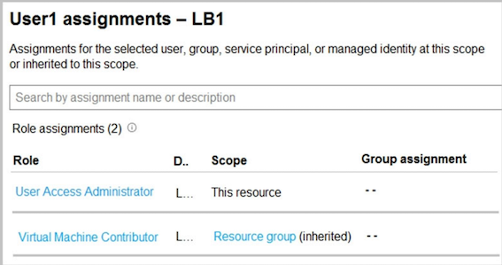

Use the drop-down menus to select the answer choice that completes each statement based on the information presented in the graphic.

NOTE: Each correct selection is worth one point.

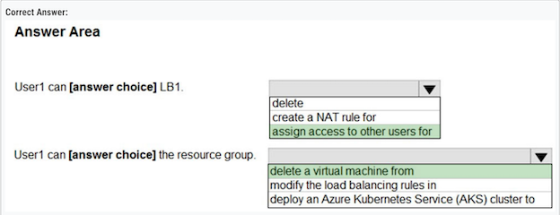

* 1) User1 can "assign access to other users for" LB1.
* 2) User1 can "delete a virtual machine from" the resource group.

### Question #53

You have an Azure subscription named Subscription1 that contains a virtual network named VNet1. **VNet1 is in a resource group named RG1**.

Subscription1 has a user named User1. User1 has the following roles:

* ✑ Reader
* ✑ Security Admin
* ✑ Security Reader

**You need to ensure that User1 can assign the Reader role for VNet1 to other users.**

What should you do?


* A. Remove User1 from the Security Reader role for Subscription1. Assign User1 the Contributor role for RG1.
* **B. Assign User1 the Owner role for VNet1**.
* C. Assign User1 the Contributor role for VNet1.
* D. Assign User1 the Network Contributor role for VNet1


**Correct Answer: B**

Has full access to all resources including the right to delegate access to others.

There are several versions of this question in the exam. The question has two possible correct answers

* ✑ Assign User1 the **User Access Administrator role** for VNet1.
* ✑ Assign **User1 the Owner role** for VNet1.


* Owner = Grants full access to manage all resources, including the ability to assign roles in Azure RBAC.
* Contributor = Grants full access to manage all resources, but does NOT allow you to assign roles in Azure RBAC. (you cannot add users or changes their rights)
* **User Access Administrator = Lets you manage user access to Azure resources.**
* Reader = View all resources, but does not allow you to make any changes.
* Security Admin = **View and update permissions for Security Center. Same permissions as the Security Reader role and can also update the security** policy and dismiss alerts and recommendations.
* Network Contributor = **Lets you manage networks, but not access to them.** (so you can add VNET, subnet, etc)


### Question #54

You configure the custom role shown in the following exhibit

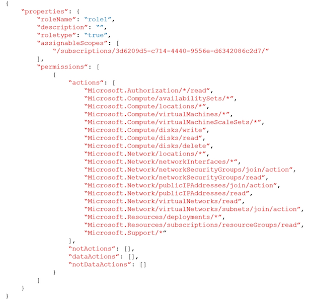

Use the drop-down menus to select the answer choice that completes each statement based on the information presented in the graphic.

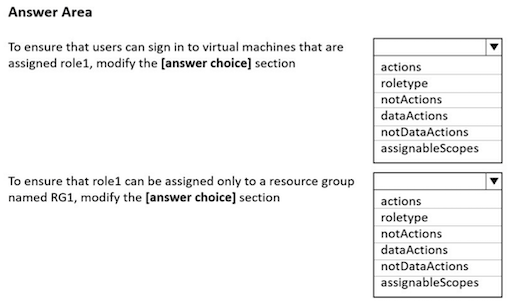


Correct answer: **dataActions and assignableScopes**

You need to provide either of the following in DataActions:

* Microsoft.Compute/virtualMachines/login/action
* Microsoft.Compute/virtualMachines/loginAsAdmin/action


**DataActions**

* Microsoft.Compute/virtualMachines/login/action
	* Log in to a virtual machine as a regular user
* Microsoft.Compute/virtualMachines/loginAsAdmin/action
	* Log in to a virtual machine with Windows administrator or Linux root user privileges
* Microsoft.HybridCompute/machines/login/action
	* Log in to an Azure Arc machine as a regular user
* Microsoft.HybridCompute/machines/loginAsAdmin/action
	* Log in to an Azure Arc machine with Windows administrator or Linux root user privilege


**Box 2: assignableScopes**

Azure role-based access control (Azure RBAC) is the authorization system you use to manage access to Azure resources. **To grant access, you assign roles to users, groups, service principals, or managed identities at a particular scope.**


When you assign roles, you must specify a scope. Scope is the set of resources the access applies to. **In Azure, you can specify a scope at four levels from broad to narrow: management group, subscription, resource group, and resource.**

### Question #55

You have an Azure subscription that contains a storage account named storage1. The storage1 account contains a file share named share1.

**The subscription is linked to a hybrid Azure Active Directory (Azure AD) tenant that contains a security group named Group1.**

**You need to grant Group1 the Storage File Data SMB Share Elevated Contributor role for share1**.

What should you do first?


* **A. Enable Active Directory Domain Service (AD DS) authentication for storage1**.
* B. Grant share-level permissions by using File Explorer.
* C. Mount share1 by using File Explorer.
* D. Create a private endpoint.


**Correct Answer: A**

Before you enable Azure AD over SMB for Azure file shares, make sure you have completed the following prerequisites:

* 1. Select or create an Azure AD tenant
* 2. To support authentication with Azure AD credentials, you must enable Azure AD Domain Services for your Azure AD tenant.
Etc.

By enabling AD DS authentication, you allow Azure AD security groups to be used for granting access control to file shares in the storage account.

This enables you to assign roles, such as the Storage File Data SMB Share Elevated Contributor role, to the security group Group1 for the specific file share share1

Once AD DS authentication is enabled and the security group is assigned the appropriate role, Group1 will have the necessary permissions to
access and manage the file share.

Therefore, enabling Active Directory Domain Service (AD DS) authentication for storage1 is the first step you should take to grant Group1 the Storage File Data SMB Share Elevated Contributor role for share1.


### Question #56

You have 15 Azure subscriptions.

You have an Azure Active Directory (Azure AD) tenant that contains a security group named Group1.

You plan to purchase additional Azure subscription.


**You need to ensure that Group1 can manage role assignments for the existing subscriptions and the planned subscriptions**. The solution must meet the following requirements:

* ✑ Use the principle of least privilege.
* ✑ Minimize administrative effort.

What should you do?


* A. Assign Group1 the Owner role for the root management group.
* **B. Assign Group1 the User Access Administrator role for the root management group**.
* C. Create a new management group and assign Group1 the User Access Administrator role for the group.
* D. Create a new management group and assign Group1 the Owner role for the group


**Correct Answer: B**

The User Access Administrator role enables the user to grant other users access to Azure resources. This switch can be helpful to regain access to a subscription.

To be able to assign licenses to all current and future subscriptions, while minimizing the administrative effort, **one should apply the role to the
Root Management Group.**


And because we should use the principle of least privilege we should **chose the User Access Administrator role instead of the Owner one.**


### Question #57

You have an Azure subscription that contains the hierarchy shown in the following exhibit.

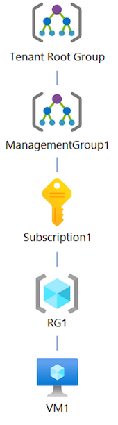

You create an Azure Policy definition named Policy1.

To which Azure resources can you assign Policy1 and which Azure resources can you specify as exclusions from Policy1? To answer, select the appropriate options in the answer area.

NOTE: Each correct selection is worth one point.

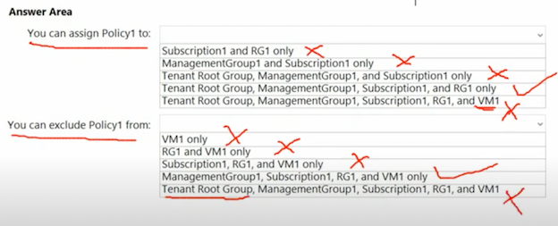

* Can't assign policy to RESOUCE (VM)
* Can't exclude policy to Tenant Root Group

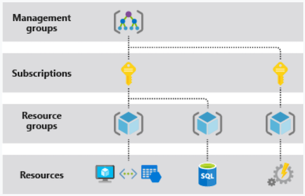

### Question #58

You have an Azure subscription that contains the following users in an Azure Active Directory tenant named contoso.onmicrosoft.com:

User1 creates a new Azure Active Directory tenant named external.contoso.onmicrosoft.com.

You need to create new user accounts in external.contoso.onmicrosoft.com.

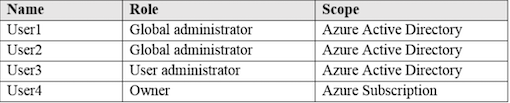

**Solution1 : You instruct User2 to create the user accounts.**

Does that meet the goal?

* A. Yes
* **B. No**

**Only User1 has access to the new Tenant,** because User1 created the Tenant and became automatically Global Admin.

**User1 needs to invite User2 first**

**Solution2: You instruct User4 to create the user accounts.**

* **B. No**

Only the tenant creators receive by default the Owner role inside the tenant and therefore are able to create user accounts.


**Valid Solution: Meets the Goal**

Solution: Solution: You instruct User1 to create the user accounts.

**Invalid Solutions: Does not Meet the Goal**

* -Solution: You instruct User2 to create the user accounts.
* -Solution: You instruct User3 to create the user accounts.
* -Solution: You instruct User4 to create the user accounts.


**because User2 OR User3 OR User4 - have nothing to do with NEW Azure Active Directory tenant named external.contoso.onmicrosoft.com**


### Question #61

You have two Azure subscriptions named Sub1 and Sub2

An administrator creates a custom role that has an assignable scope to a resource group named RG1 in Sub1.

**You need to ensure that you can apply the custom role to any resource group in Sub1 and Sub2.** The solution must minimize administrative effort.
What should you do?

* **A. Select the custom role and add Sub1 and Sub2 to the assignable scopes. Remove RG1 from the assignable scopes.**
* B. Create a new custom role for Sub1. Create a new custom role for Sub2. Remove the role from RG1.
* C. Create a new custom role for Sub1 and add Sub2 to the assignable scopes. Remove the role from RG1.
* D. Select the custom role and add Sub1 to the assignable scopes. Remove RG1 from the assignable scopes. Create a new custom role for Sub2.

 
**Correct Answer: A**

```
Can be used as:
"AssignableScopes": [
"/subscriptions/{Sub1}",
"/subscriptions/{Sub2}",
```

```
"AssignableScopes": [
"/subscriptions/{subscriptionId1}",
"/subscriptions/{subscriptionId2}",
"/providers/Microsoft.Management/managementGroups/{groupId1}"
]
```

To ensure that you can apply the custom role to any resource group in Sub1 and Sub2 while minimizing administrative effort, you should select the custom role and add both Sub1 and Sub2 to the assignable scopes


### Question #62

You have an Azure Subscription that **contains a storage account named storageacct1234 and two users named User1 and User2**.

You assign User1 the roles shown in the following exhibit

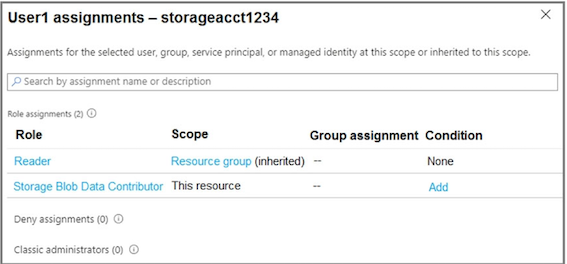


Which two actions can User1 perform? Each correct answer presents a complete solution.

NOTE: Each correct selection is worth one point.


* A. Assign roles to User2 for storageacct1234.
* **B. Upload blob data to storageacct1234**.
* C. Modify the firewall of storageacct1234.
* **D. View blob data in storageacct1234.**
* E. View file shares in storageacct1234.


correct answers: BD


* Storage Blob Data Contributor --> Read, write, and delete Azure Storage containers and blobs
* Reader --> View all resources, but does not allow you to make any changes

### Question #64

You have an Azure App Services web app named App1.

You plan to deploy App1 by using Web Deploy

You need to ensure that the developers of App1 can use their Azure AD credentials to deploy content to App1. **The solution must use the principle of least privilege**.

What should you do

* A. Assign the Owner role to the developers
* B. Configure app-level credentials for FTPS
* **C. Assign the Website Contributor role to the developers**
* D. Configure user-level credentials for FTPS

**Correct Answer: C. Assign the Website Contributor role to the developers.**


To allow the developers of App1 to use their Azure AD credentials to deploy content to App1 using Web Deploy, you should assign the Website
**Contributor role to the developers. This role provides the necessary permissions for developers to deploy content to the web app, but does not
grant them excessive permissions that could be used to make unwanted changes**.

Option A is not recommended as it would grant excessive permissions to the developers, which could be used to make unwanted changes.

Option B and D are not relevant to the scenario as the question is specifically asking for how to use Azure AD credentials for Web Deploy, not FTPS.

Option C is a potential solution, but the Website Contributor role provides a more targeted and appropriate level of permissions for the scenario.

B is wrong because: **"To secure app deployment from a local computer, Azure App Service supports two types of credentials for local Git deployment and FTP/S
deployment**. These credentials are not the same as your Azure subscription credentials."


### Question #65

Note: This question is part of a series of questions that present the same scenario. Each question in the series contains a unique solution that
might meet the stated goals. Some question sets might have more than one correct solution, while others might not have a correct solution

After you answer a question in this section, you will NOT be able to return to it. As a result, these questions will not appear in the review screen

You have an Azure Active Directory (Azure AD) tenant named contoso.com.

You have a CSV file that contains the names and email addresses of 500 external users.

You need to create a guest user account in contoso.com for each of the 500 external users

Solution: **From Azure AD in the Azure portal, you use the Bulk invite users operation**.


Does this meet the goal?  

* A. Yes
* **B. No**


* 1.)On the Bulk Invite Users page, select Download to get a valid .csv template with invitation properties.
* 2.) Open the .csv template and add a line for each guest user. REQUIRED VALUES ARE:


- **Email address to invite** - the user who will receive the invitation
- **Redirection URL - the URL to which the invited user is forwarded after accepting the invitation.**


**In this question the .CSV file you have DOES NOT contain a redirection URL. Therefore, the answer is B: NO.**

### Question #66

You have an Azure subscription that is linked to an Azure AD tenant. The tenant contains the custom role-based access control (RBAC) roles shown in the following table.


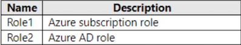

From the Azure portal, you need to create two custom roles named Role3 and Role4. 

**Role3 will be an Azure subscription role. Role4 will be an Azure AD role**.

Which roles can you clone to create the new roles? To answer, select the appropriate options in the answer area.


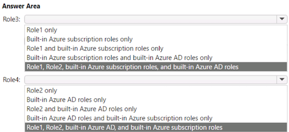


* Role3: Role1 and built-in Azure subscription roles only
* Role4: Role2 only

There's a difference between Built-in AD roles and Built-in Subscription roles.

Their "cloning" rules are not the same. While you can clone an in-built Azure role, **you CANNOT clone in-built Azure AD role.** When creating a custom role in Azure AD, you can either choose a custom role already created OR start
from scratch. So for 2nd, **Answer should be Role2 only**

* Role3: Role1 and built-in Azure subscription roles only
* Role4: Role2 only - For Azure AD role, you can only clone from custom role like Role 2 and connot clone from built-in role. 


### Question #67

You have an Azure subscription named Sub1 that contains two users named User1 and User2

You need to assign role-based access control (RBAC) roles to User1 and User2. The users must be able to perform the following tasks in Sub1:

* **User1 must view the data in any storage account.**
* **User2 must assign users the Contributor role for storage accounts**

The solution must use the principle of least privilege.

Which RBAC role should you assign to each user? To answer, drag the appropriate roles to the correct users. Each role may be used once, more than once, or not at all. You may need to drag the split bar between panes or scroll to view content


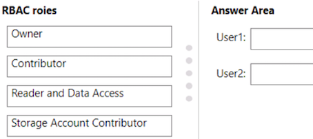


* **User Access Administrator:** 

> Lets you view everything but will not let you delete or create a storage account or contained resource. It will also allow read/write access to all
data contained in a storage account via access to storage account keys.

"Owner" is needed to manage permissions, as "User Access Administrator" is not offered as an option 


* **User Access Administrator:** can assign roles but can’t do anything with the actual resources, so manages access but not the resources.

* **Contributor**: can do everything with the actual resources but can’t assign roles, so manages the resources but not the access to them

* **Owner** : can do everything, most powerful role in Azure.


RBAC roles for Storage Accounts:

Role: Read and Data Access - Lets you view everything but will not let you delete or create a storage account or contained resource. It will also allow read/write access to all data contained in a storage account via access to storage account keys.

### Question #68

You have an Azure subscription that contains 10 virtual machines, a key vault named Vault1, and a network security group (NSG) named NSG1. All the resources are deployed to the East US Azure region

**The virtual machines are protected by using NSG1. NSG1 is configured to block all outbound traffic to the internet.**


**You need to ensure that the virtual machines can access Vault1**. The solution must use the **principle of least privilege and minimize administrative effort**


What should you configure as the destination of the outbound security rule for NSG1?

* A. an application security group
* B. **a service tag**
* C. an IP address tran


**B is the answer.**

A service tag represents a group of IP address prefixes from a given Azure service. Microsoft manages the address prefixes encompassed by the service tag and automatically updates the service tag as addresses change, minimizing the complexity of frequent updates to network security
rules.


You can use **service tags to achieve network isolation and protect your Azure resources from the general Internet while accessing Azure services** that have public endpoints. 

Create inbound/outbound network security group rules to deny traffic to/from Internet and allow traffic to/from AzureCloud or other available service tags of specific Azure services.

**AzureKeyVault" tag can be used in outbound NSGs.**

### Question #69

You have an Azure AD tenant named adatum.com that contains the groups shown in the following table.


You assign the Azure Active Directory Premium Plan 2 license to Group1 and User4.


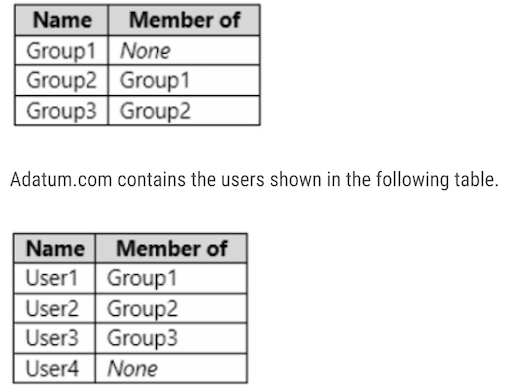


You assign the Azure Active Directory Premium Plan 2 license to Group1 and User4.

Which users are assigned the Azure Activem  Directory Premium 2 license?


* A. User4 only
* **B. User1 and User4 only**
* C. User1, User2, and User4 only
* D. User1, User2, User3, and User4


**"Group-based licensing currently does not support groups that contain other groups (nested groups).**

If you apply a license to a nested group, only the immediate first-level user members of the group have the licenses applied."

"You assign the Azure Active Directory Premium Plan 2 license to Group1 and User4."


* A. User4 only (INCORRECT = Also Group1 has directly assigned licenses)
* **B. User1 and User4 only (CORRECT = Both have directly assigned license)**
* C. User1, User2, and User4 only (INCORRECT = User2 is member of Group2 that is NESTED to Group1. NESTED Group are NOT Supported as per MS KB: **Group-based licensing currently does not support groups that contain other groups (nested groups). If you apply a license to a nested group, only the immediate first-level user members of the group have the licenses applied**.
* D. User1, User2, User3, and User4 (INCORRECT= Same reason answer C)

### Question #70


You have an Azure AD tenant named contoso.com.

You have two external partner organizations named fabrikam.com and litwareinc.com. Fabrikam.com is configured as a connected organization.

You create an access package as shown in the Access package exhibit.


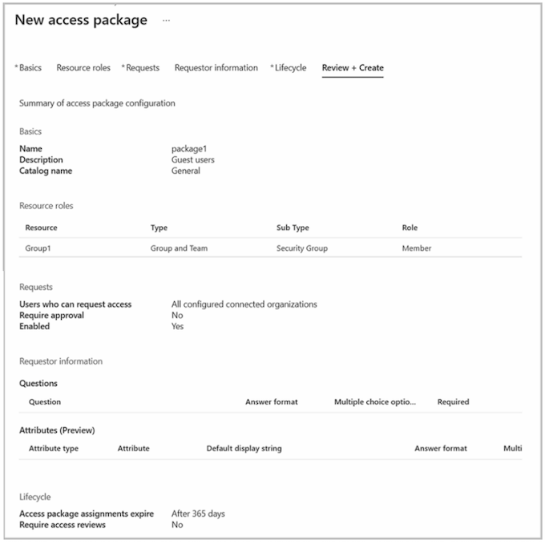


You configure the external user lifecycle settings as shown in the Lifecycle exhibit. (Click the Lifecycle tab.)

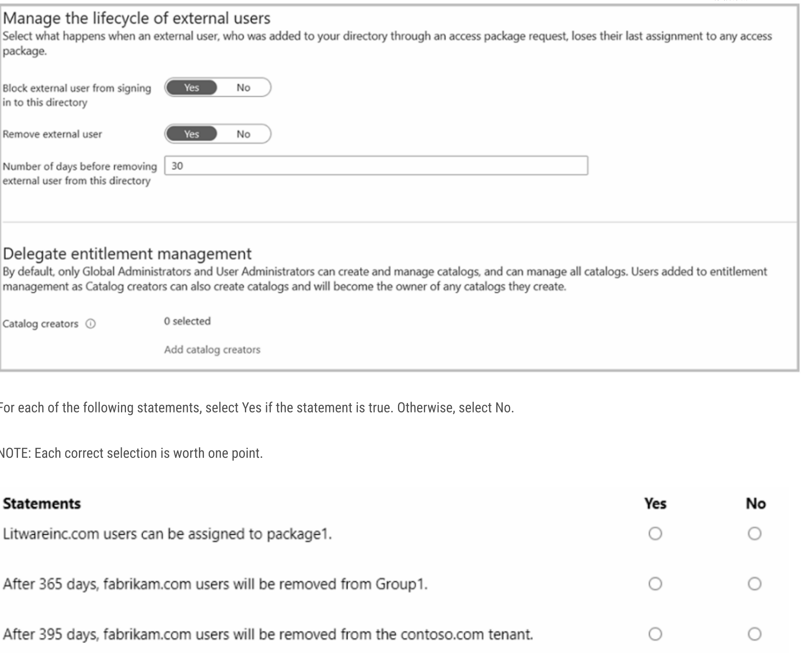


* **N not a connected organization （Because not has a permissons）**
* **N expired not removed**
	* No - The access package expires after 365 days, but the configuration to remove them from the group 30 days after the package has expired.
* **Y 365 + 30 = 395 removed**


### Question #71

You have an Azure subscription named **Subscription1 that contains a virtual network named VNet1**. VNet1 is in a resource group named RG1

Subscription1 has a user named User1. User1 has the following roles:

* • Reader
* • Security Admin
* • Security Reader

**You need to ensure that User1 can assign the Reader role for VNet1 to other users.**

What should you do?


* A. Assign User1 the Network Contributor role for VNet1.
* B. Remove User1 from the Security Reader role for Subscription1. Assign User1 the Contributor role for RG1.
* **C. Assign User1 the Owner role for VNet1.**
* D. Assign User1 the Network Contributor role for RG1.

There is only two choices for that puspose

- Assign User1 the Owner role for VNet1.
- Assign User1 the User Access Administrator role for VNet1


### Question #72

You have an Azure subscription that contains the users shown in the following table

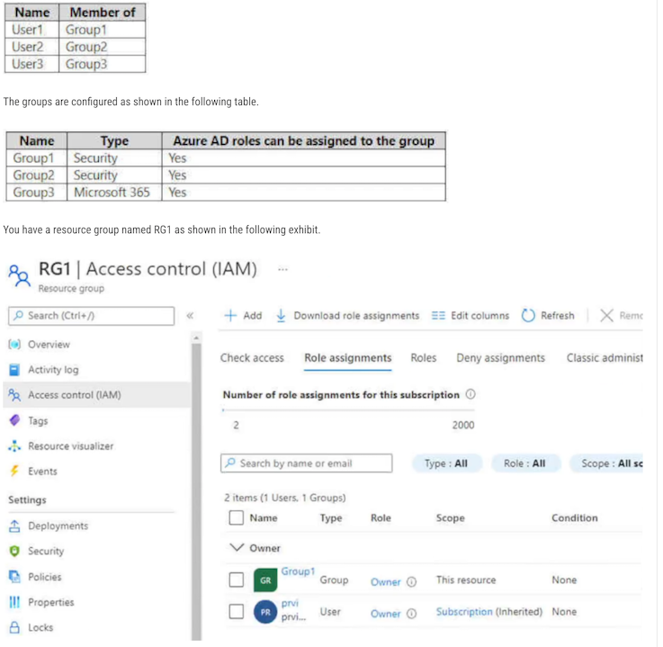


Statements

* You can assign User2 the Owner role for RG1 by adding Group2 as a member of Group1.  （NO）
	* **Nesting is currently not supported for groups that can be assigned to a role**
* You can assign User3 the Owner role for RG1 by adding Group3 as a member of Group1.   （NO）
	* **M365 groups can't be added in security groups**
* You can assign User3 the Owner role for RG1 by assigning the Owner role to Group3 for  （YES）
	* **Yes, you can assign owner role for user 3 in RG1**

	
### Question #74

Your on-premises network contains a VPN gateway

You have an Azure subscription that contains the resources shown in the following table.

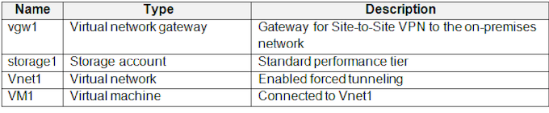

**You need to ensure that all the traffic from VM1 to storage1 travels across the Microsoft backbone network**.

What should you configure?

* A. Azure Application Gateway
* **B. private endpoints**
* C. a network security group (NSG)
* D. Azure Virtual WAN

To ensure that all the traffic from VM1 to storage1 travels across the Microsoft backbone network without going out to the public internet, you should use a private endpoint.

**A private endpoint uses a private IP address from your VNet**, effectively bringing the service into your VNet. Any traffic between your virtual machine and the storage account will traverse over the VNet and stay on the Microsoft backbone network, without ever leaving it.

### Question #75

You have an Azure subscription that contains a **user named User1 and the resources shown in the following table**.

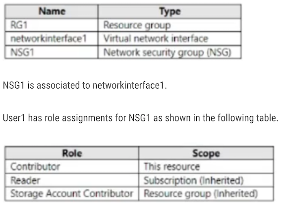

For each of the following statements, select Yes if the statement is true. Otherwise, select No.

NOTE: Each correct selection is worth one point.


**Statements**

* User1 can create a storage account in RG1.
* User1 can modify the DNS settings of networkinterface1.
* User1 can create an inbound security rule to filter inbound traffic to networkinterfacel.


"The given Azure subscription contains a user named User1 with certain role assignments for different resources. The user has the Contributor role assigned to NSG1, which is associated with networkinterface1, and this role assignment is scoped to **"This resource", which means the user has full access to NSG1**.


* (YES)User1 can create a storage account in RG1, since User1 has Storage Account Contributor Role inherited from Resource Group


* (NO)  **User1 cannot modify the DNS settings of networkinterface1 because there is no role assignment that grants the necessary permissions for modifying DNS settings**

* (YES) User1 can create an inbound security rule to filter inbound traffic to networkinterface1, since User1 has Contributor role for NSG1

### Question #76


You have three Azure subscriptions named Sub1, Sub2, and Sub3 that are linked to an Azure AD tenant.

**The tenant contains a user named User1, a security group named Group1, and a management group named MG1. User is a member of Group1.**

**Sub1 and Sub2 are members of MG1. Sub1 contains a resource group named RG1. RG1 contains five Azure functions.**

You create the following role assignments for MG1:

* • Group1: Reader
* • User1: User Access Administrator

You assign User the Virtual Machine Contributor role for Sub1 and Sub2.


**Statements**

* The Group1 members can view the configurations of the Azure functions.   **（Y)**
* User1 can assign the Owner role for RG1.   **（Y)**
* User1 can create a new resource group and deploy a virtual machine to the new group. **（n)**


* GROUP1 Reader access, provides access to view all items, except secrets
*  To Assign OWNER role, you need to either Owner role or User Administrator Access Role
*  **Neither User Access Admin Role nor the Reader Role allows to create new resources.**


### Question #78

You have an Azure subscription that contains the resources shown in the following table.

* Name   Description
* share1 :    File share in storage1
* storagel:  Storage account
* User1: Azure AD user


**You need to assign User1 the Storage File Data SMB Share Contributor role for share1.**

What should you do first?


* **A. Enable identity-based data access for the file shares in storage1.**
* B. Modify the security profile for the file shares in storage1.
* C. Select Default to Azure Active Directory authorization in the Azure portal for storage1.
* D. Configure Access control (IAM) for share1.

**A: To give individual accounts access to the file share (Kerberos), enable identity-based authentication for the storage account.**

Configure Access control (IAM) for share1 and add User1 as a role assignment with the Storage File Data SMB Share Contributor role.

So the correct answer is A

### Question #80

You have an Azure AD tenant named adatum.com that contains the groups shown in the following table.

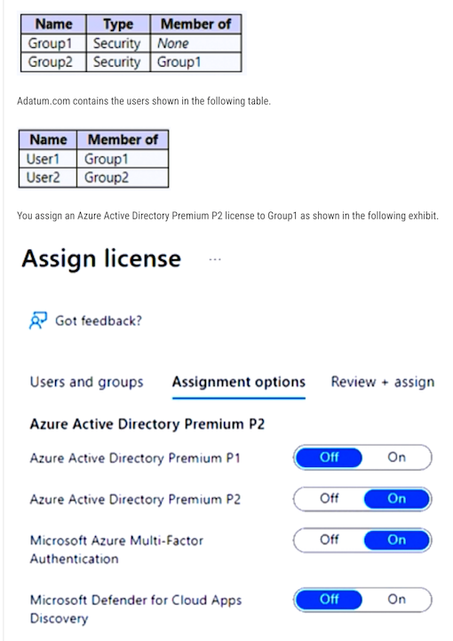

**Group2 is NOT directly assigned a license.**

For each of the following statements, select Yes if the statement is true. Otherwise, select No

**Group2  is member of Group 1**

* You can assign User1 the Microsoft Defender for Cloud Apps Discovery license.  **(N)**
* You can remove the Azure Active Directory Premium P2 license from User1. **(N)**
* User2 is assigned the Azure Active Directory Premium P2. **(N)**

1."No:  User1 is a member of Group1, which has been assigned the Azure Active Directory Premium P2 license, but not the Microsoft Defender for Cloud Apps Discovery license. **Since Group1 does not have the Microsoft Defender for Cloud Apps Discovery license assigned, User1 cannot be assigned that license either**.

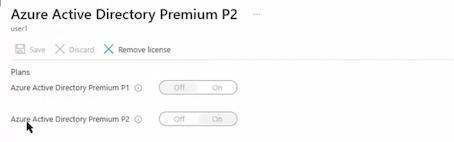

2.No: User1 is a member of Group1, which has been directly assigned the Azure Active Directory Premium P2 license. **Since User1 inherits the license
from Group1, the Azure Active Directory Premium P2 license cannot be removed from User1 individually**. It can only be removed by removing the license assignment from Group1.


3. **No:** User2 is a member of Group2, which is not directly assigned any licenses. Therefore, **User2 does not inherit the Azure Active Directory Premium
P2 license or any other license assigned to Group2. **To assign the Azure Active Directory Premium P2 license to User2, it would need to **be directly
assigned to User2 or to a group that User2 is a member of."**

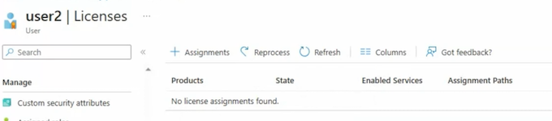

* 1- group license assignment not including this Defender for Cloud
* 2- **you can't remove license for users , you need to remove group1 from license**
* 3- Nested group license assignment not supported


### Question #81

You have a hybrid deployment of Azure Active Directory (Azure AD) that contains the users shown in the following table.

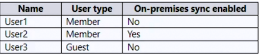

**You need to modify the JobTitle and UsageLocation attributes for the users.**

For which users can you modify the attributes from Azure AD? To answer, select the appropriate options in the answer area.

NOTE: Each correct selection is worth one point

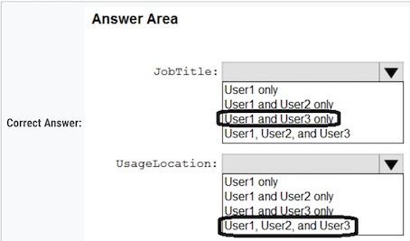

* JobTitle: User1 (Member and AzureAD Source) and User3 (Guest and Microsoft Account) only

* UsageLocation: all users (User1, User2 and User3)

* **Users syncing from an On Prem AD to AAD cannot have the job title altered in AAD**. **it would need to be done in local AD** , as AADC by default synchronizes the jobTitle property
* **Usage location is set only on the cloud side for all users, and Guest users can have their job titles set as well as cloud native (AAD) users**.


**JobTitle can't be changed in AD in hybrid setup**

### Question #82

You have an Azure Active Directory (Azure AD) tenant named contoso.com.

You have a CSV file that contains the names and email addresses of 500 external users.

You need to create a guest user account in contoso.com for each of the 500 external users.

Solution: You create a PowerShell script that runs the **New-MgUser cmdlet for each external user**.

Does this meet the goal?

* A. Yes
* **B. No**

**The `New-MgUser` cmdlet is part of the Microsoft Graph PowerShell module, and it's used for creating new users in Azure AD.**

Creating guest users (or B2B users), **you typically would invite them rather than create them like regular members.**


The cmdlet you'd want to use for **inviting external guest users is `New-AzureADMSInvitation`** if you're using the AzureAD module or a related command in the Microsoft Graph module.

**New-MgUser is for Microsoft Graph and not for GuestInvite**

### Question #83

Solution: You create a PowerShell script that runs the **`New-MgInvitation` cmdlet for each external user**

The **New-MgInvitation** cmdlet is part of the Microsoft Graph PowerShell module. **It's used to create an invitation to an external user. When the invited user redeems their invitation, a guest user is created in the directory.**

### Question #85

You have an Azure subscription named Subscription1 that contains virtual network named VNet1. VNet1 is in a resource group named RG1.

User named User1 has the following roles for Subscription1:

* • Reader
* • Security Admin
* • Security Reader

You need to ensure that User1 can assign the Reader role for VNet1 to other users.

What should you do?

* A. Remove User1 from the Security Reader and Reader roles for Subscription1. Assign User1 the Contributor role for Subscription1.
* B. Remove User1 from the Security Reader role for Subscription1. Assign User1 the Contributor role for RG1.
* C. Assign User1 the Network Contributor role for VNet1.
* **D. Assign User1 the User Access Administrator role for VNet1.**

### Question #86

You have an Azure Storage account named storage1 that uses Azure Blob storage and Azure File storage.

**You need to use AzCopy to copy data to the blob storage and file storage in storage1.**

Which authentication method should you use for each type of storage? To answer, select the appropriate options in the answer area

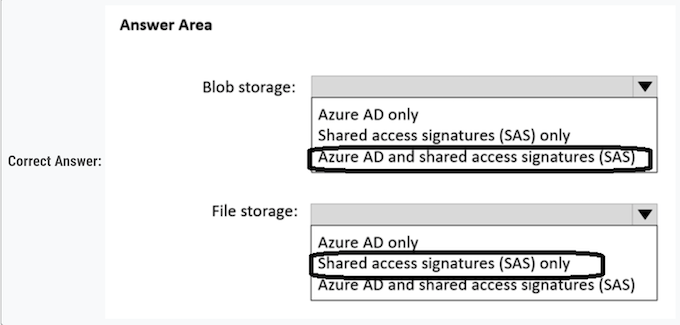

* First: Azure AD & SAS
* Second: SAS

* Blob storage: Microsoft Entra ID & SAS
* **Blob storage (hierarchical namespace): Microsoft Entra ID & SAS**
* File storage: SAS only

### Question #87

You have an Azure AD tenant that contains a user named External User

External User authenticates to the tenant by using external195@gmail.com.

**You need to ensure that External User authenticates to the tenant by using contractor@gmail.com.**

Which two settings should you configure from the Overview blade? To answer, select the appropriate settings in the answer area

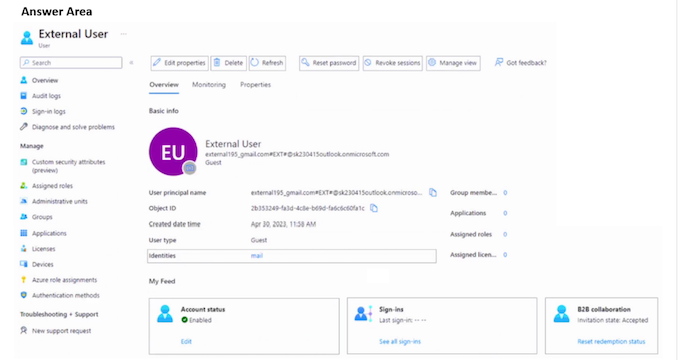

If the user wants to sign in using a different email:

- Select the Edit properties icon.
- Scroll to Email and type the new email.
- Next to Other emails, select Add email. Select Add, type the new email, and select Save.
- Select the Save button at the bottom of the page to save all changes

On the Overview tab, under **My Feed, select the "Reset redemption" status link in the B2B collaboration tile**

1. Edit Identities (new email address)
2. Resend invitation to the new email address

### Question #88

You have an Azure subscription that contains the resources shown in the following table.

**You need to assign Workspace1 a role to allow read, write, and delete operations for the data stored in the containers of storage1.**


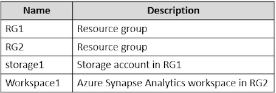


Which role should you assign?

* A. Storage Account Contributor
* B. Contributor
* **C. Storage Blob Data Contributor**
* D. Reader and Data Access

Storage Blob Data Contributor Read, write, and delete Azure Storage containers and blobs.

* option A: Storage Account Contributor can't perform delete operation.
* B : Too general
* D : Impossible to delete

Option A, **"Storage Account Contributor," grants permissions to manage the Azure Storage account itself, including its configuration and settings, but it doesn't provide the necessary permissions to perform read, write, and delete operations on the data stored within the containers of the storage account**.

### Question #89

You have an Azure subscription named Subscription1 that contains virtual network named VNet1. VNet1 is in a resource group named RG1.

A user named User1 has the following roles for Subscription1:

* Reader
* Security Admin
* Security Reader

You need to ensure that User1 can assign the Reader role for VNet1 to other users.

What should you do?

* A. Remove User1 from the Security Reader and Reader roles for Subscription1. Assign User1 the Contributor role for Subscription1.
* B. Assign User1 the Contributor role for VNet1.
* **C. Assign User1 the Owner role for VNet1.**
* D. Assign User1 the Network Contributor role for RG1

### Question #90

You have an Azure AD tenant that contains the groups shown in the following table.

**You purchase Azure Active Directory Premium P2 licenses.**

To which groups can you assign a license?

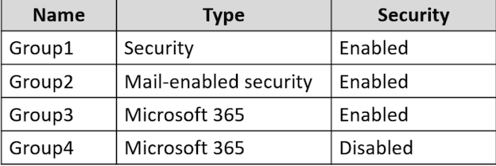


* A. Group1 only
* **B. Group1 and Group3 only**
* C. Group3 and Group4 only
* D. Group1, Group2, and Group3 only
* E. Group1, Group2, Group3, and Group4

Azure AD licenses can be assigned to user accounts. When you want to assign licenses to a group, the intention is to assign those licenses to the members of the group

You can **assign licenses to Microsoft 365 groups and security groups**, but **not to mail-enabled security groups**. 

Furthermore, the group should be security-enabled to get the licenses assigned.

* Group1: Security group (Security Enabled) - You can assign licenses.
* **Group2: Mail-enabled security group (Security Enabled) - You cannot assign licenses to mail-enabled security groups.**
* Group3: Microsoft 365 group (Security Enabled) - You can assign licenses.
* **Group4: Microsoft 365 group (Security Disabled) - You cannot assign licenses to security-disabled groups.**


### Question #91


You have an Azure AD tenant.

You need to create a Microsoft 365 group that contains only members of a marketing department in France.

How should you complete the dynamic membership rule? To answer, select the appropriate options in the answer area.

NOTE: Each correct answer is worth one point

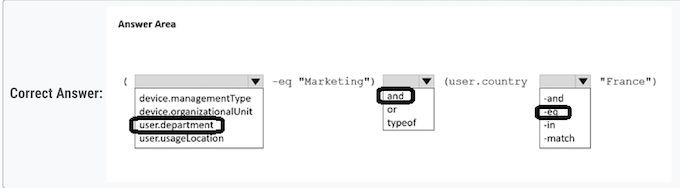

**`(user.department –eq "Marketing") –and (user.country –eq "France")`**

### Question #92


You have an Azure AD tenant.


You need to modify the Default user role permissions settings for the tenant. The solution must meet the following requirements:


* Standard users **must be prevented from creating new service principals.**
* Standard users must only be able to use PowerShell or Microsoft Graph to manage their own Azure resources.


Which two settings should you modify? To answer, select the appropriate settings in the answer area.


NOTE: Each correct answer is worth one point


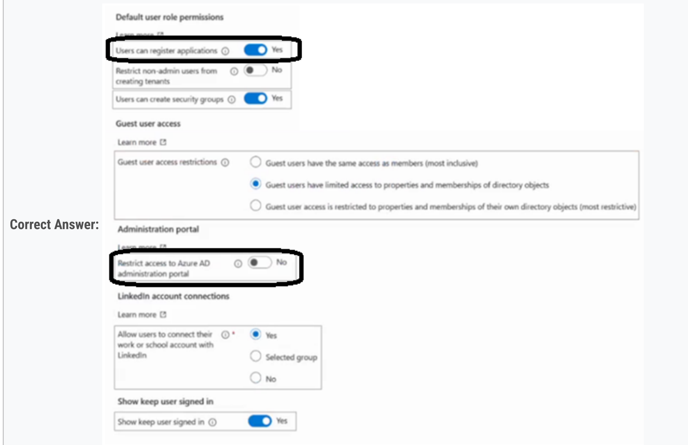

<mark>Register applications:  (YES)</mark>

**Setting this option to No prevents users from creating application registrations**

<mark>Restrict access to Azure AD administration portal:  (No)</mark>

* **No: lets non-administrators browse the Azure AD administration portal.**
* Yes: Restricts non-administrators from browsing the Azure AD administration portal. **Non-administrators who are owners of groups or applications are unable to use the Azure portal to manage their owned resources**


### Question #93

You have an Azure subscription named Sub1 that contains the blob containers shown in the following table.

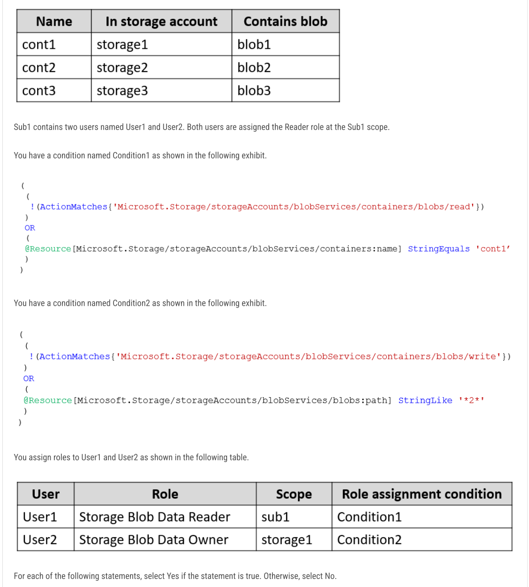


* User1 can read blob2.  (N)
* User1 can read blob3.  (N)
* User2 can read blob1.  (Y)

If a user tries to perform an action **in the role assignment that is not <action>,** !(ActionMatches) evaluates to true and the overall condition evaluates to true to allow the action to be performed.

**If a user tries to perform <action> in the role assignment, !(ActionMatches) evaluates to false, so the expression is evaluated.**

**If the expression evaluates to true**, the overall condition evaluates to true **to allow <action> to be performed.** Otherwise, <action> is not allowed to be performed.


* a. If the user performs a reading operation, then he may only read from “cont1”
* b. If the user performs a writing operation, then he may only write to blobs like “*2*”


* 1- User 1 can read Blob2 - No, because he is reading, then the condition a. applies, and he is not reading cont1
* 2- User 1 can read Blob3 - No, because he is reading, then the condition a. applies, and he is not reading cont1
* 3- Yes. He is not writing, so the condition b. does not apply. He has permissions granted by the role on the scope he is
reading - Storage Blob Data Owner on storage1, which contains blob1

3- condition2 says that it cannot write or if it contains string like "2" (wild card search with * asterisk). it all surpasses
all the condition into false.

reader role cannot read unless it's blob one, writer role cannot write unless it's blob 2

### Question #94

Solution: You create a PowerShell script that runs the New-MgUser cmdlet for each user.


Instead use the **New-AzureADMSInvitation** cmdlet which is used to invite a new external user to your directory.


### Question #95

You purchase a new Azure subscription.

You create an Azure Resource Manager (ARM) template named deploy.json as shown in the following exhibit.


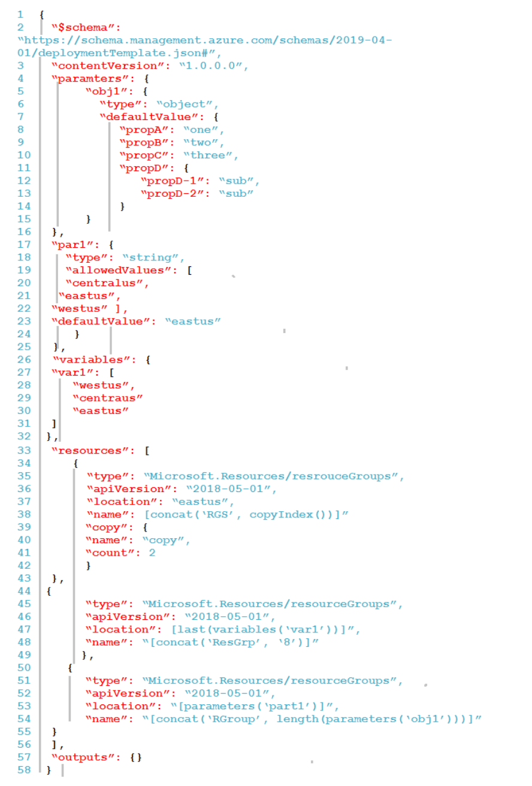

You connect to the subscription and run the following command.

```
New-AzDeployment –Location westus –TemplateFile “deploy.json”
```

For each of the following statements, select Yes if the statement is true. Otherwise, select No


* Three resource groups are created when you run the script.     (No)
* A resource group named RGroup5 is created.                           (No)  
* All the resource groups are created in the East US Azure region.   （YES)


1- It's N, because it creates 4 Resource Groups and not 3 Resource Groups (**RGS0, RGS1, RGroup4 and ResGrp8**);

* 1.1: The Resource Group named with "[concat('RGS', copyIndex())]", creates **RGS0 and RGS1**;
* 1.2: The Resource Group named with "[concat('ResGrp', '8')]", creates **ResGrp8**;
* 1.3: The Resource Group named with "[concat('RGroup', length(parameters('obj1')))]", **creates RGroup4 (As we can see, obj1 parameter has a length of 4 'propA', 'propB', 'propC' and 'propD');**

2 - It's N, because it doesn't create a resourcer group named **RGroup5**;

3 - It's Y, because all resource groups were created in the East US Azure Region.


### Question #96

You need to ensure that all the traffic from VM1 to storage1 travels across the Microsoft backbone network.

B. private endpoints

### Question #99

You have an Azure subscription named Sub1 that contains the resources shown in the following table.

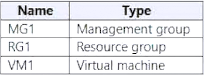

You create a user named Admin1.

To what can you add Admin1 as a co-administrator?

* A. RG1
* B. MG1
* **C. Sub1**
* D. VM1

You can add Admin1 as a co-administrator to the Sub1 subscription

**You cannot add Admin1 as a co-administrator to the RG1 resource group, MG1 management group, or VM1 virtual machine.**

Co-administrators have full access to all resources in a subscription, including the ability to create, read, update, and dele

Note: Co-administrators can only be assigned at the subscription scope. You cannot assign co-administrators to resource groups, management groups, or virtual machines.

### Question #100

You have a Microsoft Entra tenant that contains the groups shown in the following table.


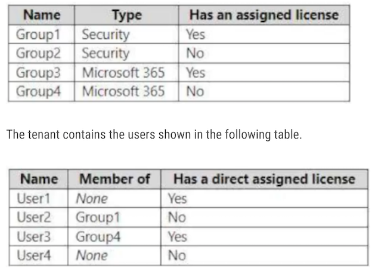

Which users and groups can you delete? To answer, select the appropriate options in the answer area.

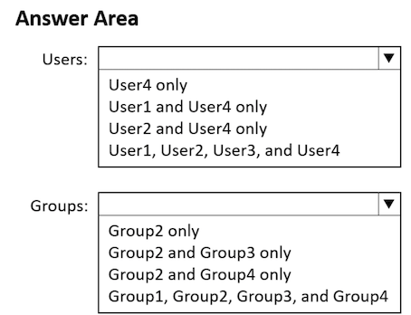

* Users = User1, User2, User3, User4 (**can delete all users whether a license is assigned directly or via inheritance from a group membership**)
* Groups = Group 2 and Group 4 (Groups with active license assignments cannot be deleted. You get an error)


### Question #101

You have an Azure subscription that contains the resources shown in the following table

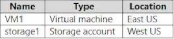

You need to ensure that data transfers between storage1 and VM1 do NOT traverse the internet

What should you configure for storage1?

* A. data protection
* **B. a private endpoint**
* C. Public network access in the Firewalls and virtual networks settings
* D. a shared access signature (SAS)

To ensure that all the traffic from VM1 to storage1 travels across the Microsoft backbone network without going out to the public internet, you should use a private endpoint.

A private endpoint uses a private IP address from your VNet, effectively bringing the service into your VNet. Any traffic between your virtual machine and the storage account will traverse over the VNet and stay on the Microsoft backbone network, without ever leaving it.

## Topic 3 - Question Set 3

### Question #1

You have an Azure subscription named Subscription1 that contains the storage accounts shown in the following table:

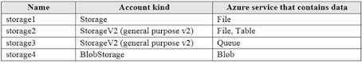

You plan to use the Azure Import/Export service to export data from Subscription1.

You need to identify which storage account can be used to export the data.

What should you identify?

* A. storage1
* B. storage2
* C. storage3
* **D. storage4**

Azure Import/Export service supports the following of storage accounts:

*  **Standard General Purpose v2 storage accounts (recommended for most scenarios)**
* ✑ Blob Storage accounts
* ✑ General Purpose v1 storage accounts (both Classic or Azure Resource Manager deployments),

Azure Import/Export service supports the following storage types:

* ✑ Import supports Azure Blob storage and Azure File storage
* ✑ **Export supports Azure Blob storage. Azure Files not supported**

Only storage4 can be exported.

### Question #2

You have Azure Storage accounts as shown in the following exhibit.

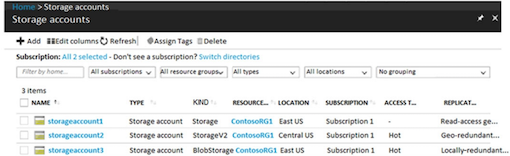

Use the drop-down menus to select the answer choice that completes each statement based on the information presented in the graphic.

NOTE: Each correct selection is worth one point.


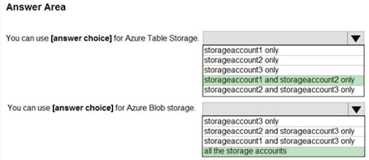

Box 1: **storageaccount1 and storageaccount2 only**

Box 2: All the storage accounts -

Note: The three different storage account options are: **General-purpose v2 (GPv2) accounts, General-purpose v1 (GPv1) accounts, and Blob storage accounts.**

* ✑ General-purpose v2 (GPv2) accounts are storage accounts that support all of the latest features for blobs, files, queues, and tables.
* ✑ Blob storage accounts support all the same block blob features as GPv2, but are limited to supporting only block blobs.
* ✑ General-purpose v1 (GPv1) accounts provide access to all Azure Storage services, but may not have the latest features or the lowest per gigabyte pricing.

### Question #3

You have Azure subscription that includes data in following locations:

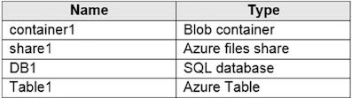

You plan to export data by using Azure import/export job named Export1.

**You need to identify the data that can be exported by using Export1.**

Which data should you identify?

* A. DB1
* **B. container1**
* C. share1
* D. Table1

1. Import and export support for blob storage.
2. **Only import support for File storage but export not support.**

DB1: While Azure Import/Export can be used for some database scenarios with specific tools and services, the information available in the image doesn't indicate compatibility with SQL databases like DB1.

share1: Azure Import/Export supports exporting data from Azure Files shares like share1. However, the image specifically mentions "container1" which is a more likely target for data export in this context.

**Table1: Azure Import/Export doesn't support exporting data from Azure Table Storage like Table1.**

container1: Blob containers like container1 are the primary data target for Azure Import/Export jobs. The image explicitly lists container1 alongside other resources, making it the most likely candidate for data export


### Question #4

You have an Azure Storage account named storage1.

You have an Azure App Service app named App1 and an app named App2 that runs in an Azure container instance. Each app uses a managed identity.

You need to ensure that App1 and App2 can read blobs from storage1. The solution must meet the following requirements:


* ✑ Minimize the number of secrets used.
* ✑ Ensure that App2 can only read from storage1 for the next 30 days.

What should you configure in storage1 for each app?

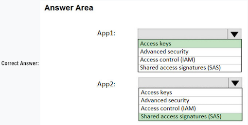

**Box 1: Access Control (IAM)**

Since the App1 uses Managed Identity, App1 can access the Storage Account via IAM. As per requirement, we need to minimize the number of secrets used, so Access keys is not ideal.

**Box 2: Shared access signatures (SAS)**

We need temp access for App2, so we need to use SAS.

### Question #5

You need to create an Azure Storage account that meets the following requirements:

* ✑ Minimizes costs
* ✑ Supports hot, cool, and archive blob tiers
* ✑ Provides fault tolerance if a disaster affects the Azure region where the account resides

How should you complete the command? To answer, select the appropriate options in the answer area

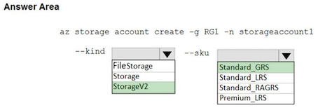

**Box 1: StorageV2**

You may only tier your object storage data to **hot, cool, or archive in Blob storage and General Purpose v2 (GPv2) accounts.** **General Purpose v1 (GPv1) accounts do not support tiering.**

General-purpose v2 accounts deliver the lowest per-gigabyte capacity prices for Azure Storage, as well as industry-competitive transaction
prices.

**Box 2: Standard_GRS**

Geo-redundant storage (GRS): Cross-regional replication to protect against region-wide unavailability

```
az storage account create -g RG1 --n storageaccount1 --kind StorageV2 --sku Standard_GRS
```

### Question #6

You have an Azure subscription that contains the resources in the following table

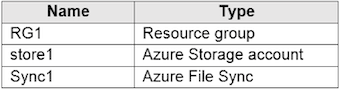

Store1 contains a file share named data. Data contains 5,000 files.

You need to synchronize the files in the file share named data to an on-premises server named Server1.

Which three actions should you perform? Each correct answer presents part of the solution.


* A. Create a container instance
* **B. Register Server1**
* **C. Install the Azure File Sync agent on Server1**
* D. Download an automation script
* **E. Create a sync group**


**Step 1: Install the Azure File Sync agent on Server1.** The Azure File Sync agent is a downloadable package that enables Windows Server to be synced with an Azure file share.

**Step 2: Register Server1. Register Windows Server with Storage Sync Service.** Registering your Windows Server with a Storage Sync Service establishes a trust relationship between your server and the Storage Sync Service.

**Step 3: Create a sync group and a cloud endpoint.** A sync group defines the sync topology for a set of files. Endpoints within a sync group are kept in sync with each other. A sync group must contain one cloud, which represents an Azure file share and one or more server endpoints. A server endpoint represents a path on registered server.

### Question #7

You have an Azure subscription that contains the resources shown in the following table.


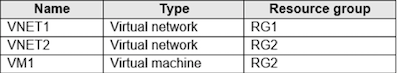

**The status of VM1 is Running.**

You assign an Azure policy as shown in the exhibit. (Click the Exhibit tab.)


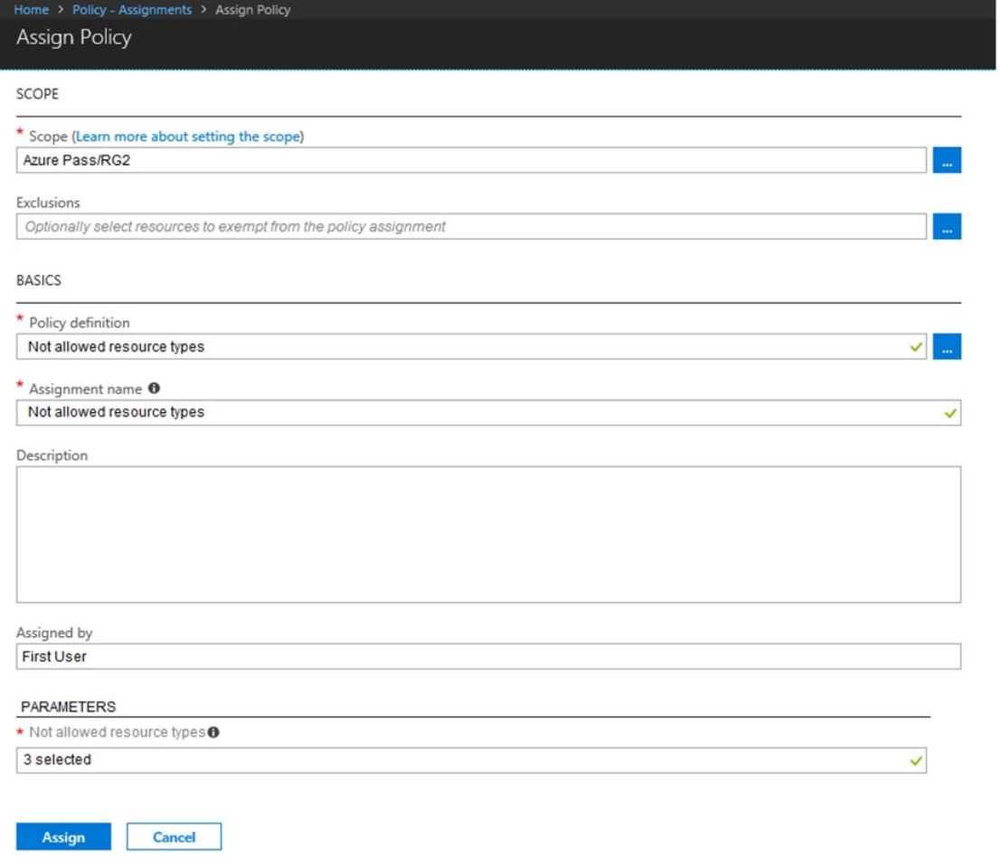

You assign the policy by using the following parameters:

* Microsoft.ClassicNetwork/virtualNetworks
* Microsoft.Network/virtualNetworks
* Microsoft.Compute/virtualMachines

For each of the following statements, select Yes if the statement is true. Otherwise, select No.

* **An administrator can move VNET1 to RG2     （N）**
* The state of VM1 changed to deallocated
* An administrator can modify the address space of VNET2


1.No - You cannot move a resource into a RG if the resource is restricted in the destination RG

Validation Failed : **Resource 'vnet1' was disallowed by policy. (Code: RequestDisallowedByPolicy)**

**2.No - The VM will not become deallocated, it will instead be marked as non-compliant**

VM is in Running state

**3. Admin can modify address space of VNET2 : No**

Failed to save address space changes to virtual network 'vnet2'. Error: Resource 'vnet2' was disallowed by policy.

### Question #8

You have an Azure subscription that contains a storage account.

You have an on-premises server named Server1 that runs Windows Server 2016. Server1 has 2 TB of data.

You need to transfer the data to the storage account by using the Azure Import/Export service.

In which order should you perform the actions? To answer, move all actions from the list of actions to the answer area and arrange them in the correct order

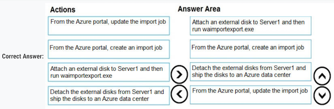

At a high level, an import job involves the following steps:

**Step 1: Attach an external disk to Server1 and then run waimportexport.exe**

* Determine data to be imported, number of drives you need, destination blob location for your data in Azure storage.
* Use the WAImportExport tool to copy data to disk drives. Encrypt the disk drives with BitLocker.

**Step 2: From the Azure portal, create an import job.**

Create an import job in your target storage account in Azure portal. Upload the drive journal files.

**Step 3: Detach the external disks from Server1 and ship the disks to an Azure data center**

* Provide the return address and carrier account number for shipping the drives back to you.
* Ship the disk drives to the shipping address provided during job creation.

**Step 4: From the Azure portal, update the import job**

* Update the delivery tracking number in the import job details and submit the import job.
* The drives are received and processed at the Azure data center.
* The drives are shipped using your carrier account to the return address provided in the import job.

1. Step 1: Prepare the drives (Attach an external disk to Server1 and then run waimportexport.exe)
2. Step 2: Create an import job (From the Azure portal, create an import job)
3. Step 3: Ship the drives to the Azure datacenter (Detach the external disks from Server1 and ship the disks to an Azure data center)
4. Step 4: Update the job with tracking information (From the Azure portal, update the import job)

### Question #9

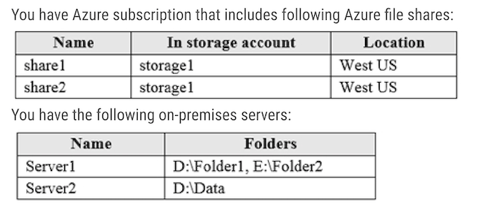

You create a Storage Sync Service named Sync1 and an Azure File Sync group named Group1. **Group1 uses share1 as a cloud endpoint**.

**You register Server1 and Server2 in Sync1. You add D:\Folder1 on Server1 as a server endpoint of Group1**

For each of the following statements, select Yes if the statement is true. Otherwise, select No.

* share2 can be added as a cloud endpoint for Group1    **（No)**
	* Box 1: **No**  **A sync group contains one cloud endpoint, or Azure file share, and at least one server endpoint.**
* E: Folder2 on Server1 can be added as a server endpoint for Group1   **（No)**
	* Box 2: Azure File Sync does not support more than one server endpoint from the same server in the same Sync Group
	* "A registered server can support multiple server endpoints, however, a sync group can only have one server endpoint per registered server
at any given time. Other server endpoints within the sync group must be on different registered serve
* D:\Data on Server2 can be added as a server endpoint for Group1   **（YES)**
	*  Box 3: Yes  **Multiple server endpoints can exist on the same volume if their namespaces are not overlapping** (for example, F:\sync1 and F:\sync2) and **each endpoint is syncing to a unique sync group**.

### Question #10

You have an Azure subscription named Subscription1.

You create an Azure Storage account named contosostorage, and then you create a file share named data.

Which UNC path should you include in a script that references files from the data file share? To answer, drag the appropriate values to the correct
targets. Each value may be used once, more than once or not at all. You may need to drag the split bar between panes or scroll to view content.

NOTE: Each correct selection is worth one point.

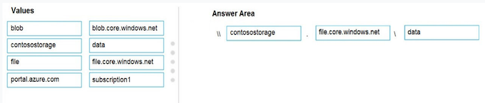

* Box 1: contosostorage - The name of account -
* Box 2: file.core.windows.net -
* Box 3: data - The name of the file share is data.

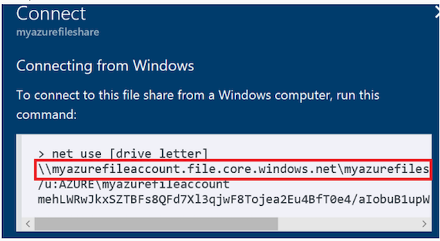

`[storageaccountname].file.core.windows.net/[FileShareName]`

- contosostorage
- file.core.windows.net
- data

### Question #11

You have an Azure subscription that contains an Azure Storage account.

You plan to copy an on-premises virtual machine image to a container named vmimages.

You need to create the container for the planned image.

Which command should you run? To answer, select the appropriate options in the answer area.

NOTE: Each correct selection is worth one point.

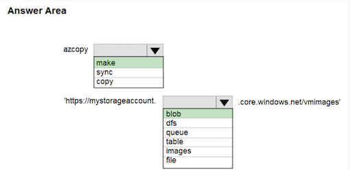

**`azcopy make 'https://mystorageaccount.blob.core.windows.net/vmimages'`**

Similar to OS Images, a VM Image is a collection of metadata and pointers to a set of VHDs (one VHD per disk) stored as page blobs in Azure
Storage.

```
azcopy make [resourceURL] [flags]

azcopy make "https://[account-name].[blob,file,dfs].core.windows.net/[top-level-resource-name]"
```

### Question #12

You have an Azure File sync group that has the endpoints shown in the following table.

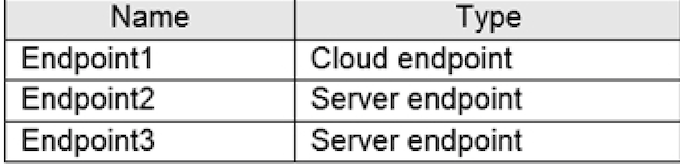

**Cloud tiering is enabled for Endpoint3.**

**You add a file named File1 to Endpoint1 and a file named File2 to Endpoint2**

**On which endpoints will File1 and File2 be available within 24 hours of adding the files?** To answer, select the appropriate options in the 

NOTE: Each correct selection is worth one point.


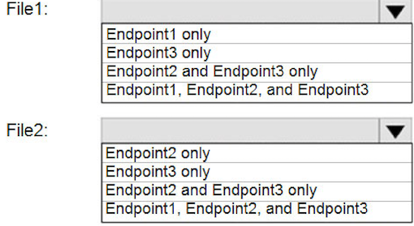

**File1: Endpoint1 only**

It is a cloud endpoint, and it is scanned by the detection job every 24 hours.

**File2: Endpoint1, Endpoint2 and Endpoint3**

With the on-premises servers the file is scanned and synced automatically after it's being added

<mark>Note: They changed the question in Exam from "within 24 hours" to "after 24 hours".</mark>

So, the answer is:

* **File1: Endpoint1**
* **File2: Endpoint1, Endpoint2 and Endpoint3**

**File1 is added to Endpoint1 which is a cloud endpoint.** Cloud tiering is enabled for Endpoint3 but it is not guaranteed that the file will be tiered within 24 hours.

**Therefore, File1 will only be available on Endpoint1 within 24 hours.**


File2:  Answer: d. Endpoint1, Endpoint2, and Endpoint3 

* File2 is added to Endpoint2 which is a server endpoint.
* Azure File Sync syncs files between all endpoints in the sync group.
* Therefore, File2 will be available on Endpoint1, Endpoint2, and Endpoint3 within 24 hours.

### Question #13

You have several Azure virtual machines on a virtual network named VNet1.

You configure an Azure Storage account as shown in the following exhibit

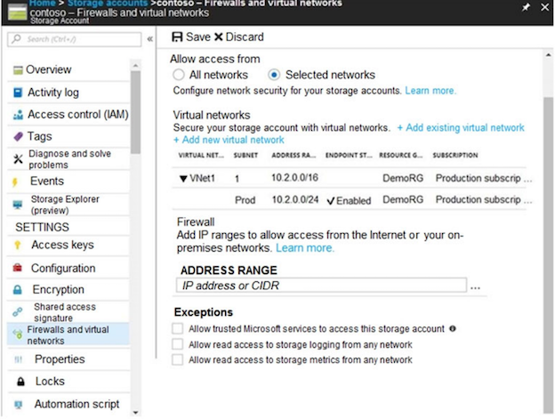

Use the drop-down menus to select the answer choice that completes each statement based on the information presented in the graphic

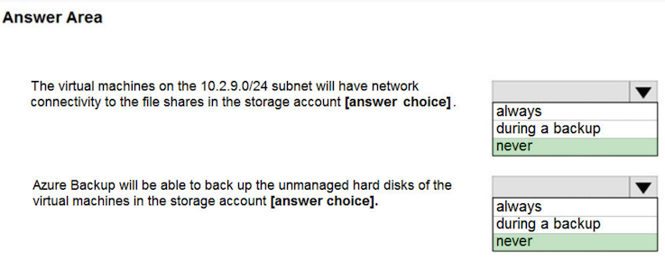

**Box 1: never**- The 10.2.9.0/24 subnet is not whitelisted.

**Box 2: never** - After you configure firewall and virtual network settings for your storage account, select Allow trusted Microsoft services to access this storage account as an exception to enable Azure Backup service to access the network restricted storage account.

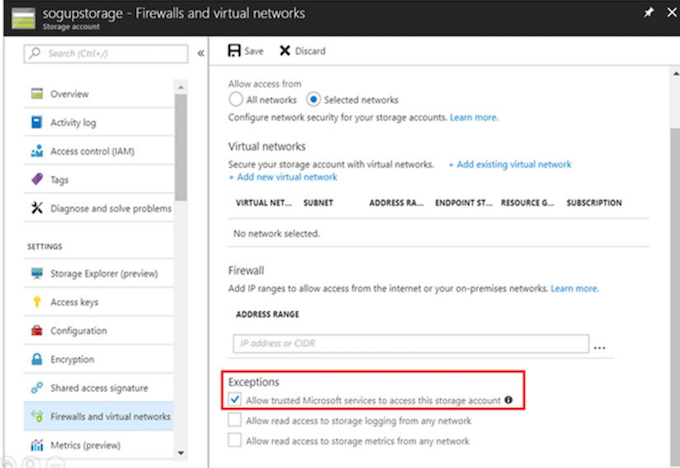


**VNet1’s address space is 10.2.0.0/16.**

The VNet1 has only 1 Subnet associated: 10.2.0.0/24. The address space of a VNet is irrelevant if there isn’t a corresponding Subnet from, which VMs can be assigned IP addresses.

**Box1: Never**

* VMs from 10.2.9.0/24 (10.2.9.0 - 10.2.9.255) are out of Subnet.
* Subnet IP range 10.2.0.0 - 10.2.0. 255.

**Box2: Never**

Since the checkbox to allow trusted Microsoft services is not checked. After you configure firewall and virtual network settings for your storage account, select Allow trusted Microsoft services to access this storage account as an exception to enable Azure Backup service to access the
network restricted storage account.


* Box 1 -----> Never (Check the CIDR range mentioned. Question contains wrong IP address)
* Box 2 ------> Checkbox to allow trusted Microsoft services is not checked


### Question #14

**You have a sync group named Sync1 that has a cloud endpoint. The cloud endpoint includes a file named File1.txt.**

Your on-premises network contains servers that run Windows Server 2016. **The servers are configured as shown in the following table**.

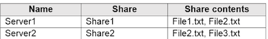

You add Share1 as an endpoint for Sync1. One hour later, you add Share2 as an endpoint for Sync1.

* On the cloud endpoint, File1.txt is overwritten by File1.txt from Share1.   **（No)** 
* On Server1, File1.txt is overwritten by File1.txt from the cloud endpoint.  **（No)** 
* File1.txt from Share1 replicates to Share2   **（Yes)** 


Azure File Sync uses a simple conflict-resolution strategy: we keep both changes to files that are changed in two endpoints at the same time.
**The most recently written change keeps the original file name. The older file (determined by LastWriteTime) has the endpoint name and the conflict number appended to the filename**. 

* For server endpoints, the endpoint name is the name of the server. 
* For cloud endpoints, the endpoint name is Cloud. The name follows this taxonomy

`(FileNameWithoutExtension)-(endpointName)[-#].`

File that is older will get name of the hosting server added. for example: srv01 creates a new version of "file1" so older version (hosted on srv02) gets renamed to "file1-srv02"

### Question #15

You have an Azure subscription that contains the storage accounts shown in the following table.

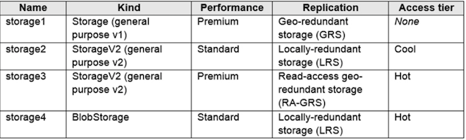


You need to identify which storage account can be converted to **zone-redundant storage (ZRS) replication by requesting a live migration from Azure support**. 

What should you identify?


* A. storage1
* **B. storage2**
* C. storage3
* D. storage4

**ZRS currently supports standard general-purpose v2, FileStorage and BlockBlobStorage storage account types.**

* storage1 -> NO, because the “(Standard) general purpose v1” does not support ZRS … I’ve put “Standard” in parenthesis because the
documentation I’ve found do not mention about `*premium*` general purpose v1, but since it is not specified I suppose the same limitations apply
to it.
* storage3 -> NO : the conversion from **“…from GRS/RA-GRS” requires “Switch to LRS first”.**
* storage4 -> **NO: the “BlobStorage” kind, is a “Legacy blob storage” that does not support ZRS**.


Since ZRS is only supported by StorageV2 only B and C would apply. Live migration is not possible for RA-GRS (option C)


- ZRS Supports the following Storage Account Types:
	* Standard GPv2 Accounts
	* Premium File Share Accounts
	* Premium Block Blob Accounts
- Conversion is just supported for GPv2 and Premium File Share storage accounts (Not for Blob Accounts).
- Convertion from GRS/RA-GRS to ZRS, Switch to LRS first (Directly from RA-GRS is not possible).


### Question #16

You have an Azure subscription that contains a storage account named account1.

You plan to upload the disk files of a virtual machine to account1 from your on-premises network. The on-premises network uses a public IP
address space of `131.107.1.0/24`

* You plan to use the disk files to provision an Azure virtual machine named VM1. 
* VM1 will be attached to a virtual network named VNet1. VNet1 uses an IP address space of `192.168.0.0/24`.

You need to configure account1 to meet the following requirements:

* ✑ Ensure that you can upload the disk files to account1.
* ✑ Ensure that you can attach the disks to VM1.
* ✑ Prevent all other access to account1

Which two actions should you perform? Each correct answer presents part of the solution.

* **A. From the Networking blade of account1, select Selected networks.**
* B. From the Networking blade of account1, select Allow trusted Microsoft services to access this storage account.
* **C. From the Networking blade of account1, add the 131.107.1.0/24 IP address range**.
* D. From the Networking blade of account1, add VNet1.
* E. From the Service endpoints blade of VNet1, add a service endpoint


A: - By default, Azure Storage accounts are accessible from everywhere. Selecting "Selected networks" restricts the access to the specified networks or IP addresses.

B: - **This allows you to upload the disk files from your on-premises network with the specified IP address range.**


- B, theres no need to involve Microsoft trusted services here.
- **D, that only works if there is a site-to-site VPN, and that is NOT stated in the problem.**
- E, theres nothing to do with the problem

### Question #17

You have an on-premises file server named Server1 that runs Windows Server 2016.

You have an Azure subscription that contains an Azure file share.

You deploy an Azure File Sync Storage Sync Service, and you create a sync group.

You need to synchronize files from Server1 to Azure.

Which three actions should you perform in sequence? To answer, move the appropriate actions from the list of actions to the answer area and
arrange them in the correct order

**Step 1: Install the Azure File Sync agent on Server1**

The Azure File Sync agent is a downloadable package that enables Windows Server to be synced with an Azure file share

**Step 2: Register Server1**

Register Windows Server with Storage Sync Service

Registering your Windows Server with a Storage Sync Service establishes a trust relationship between your server (or cluster) and the Storage Sync Service.

**Step 3: Add a server endpoint**

* Create a sync group and a cloud endpoint.
* A sync group defines the sync topology for a set of files. Endpoints within a sync group are kept in sync with each other. A sync group must contain one cloud endpoint, which represents an Azure file share and one or more server endpoints. A server endpoint represents a path on registered server.

### Question #18

You plan to create an Azure Storage account in the Azure region of East US 2.

You need to create a storage account that meets the following requirements:

*  ✑  Replicates synchronously.
* ✑ Remains available if a single data center in the region fails.

How should you configure the storage account? To answer, select the appropriate options in the answer area.


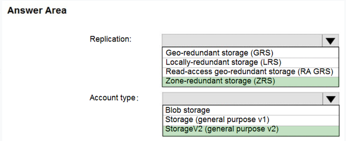

* Box 1: Zone-redundant storage (ZRS)
* Zone-redundant storage (ZRS) replicates your data synchronously across three storage clusters in a single Region.
* GRS protects against Zone failure, while ZRS protects against data center failure.
* LRS would not remain available if a data center in the region fails.
* GRS and RA GRS use asynchronous replication.


* Box 2: StorageV2 (general purpose V2)
* ZRS only support GPv2.


### Question #19

You plan to use the Azure Import/Export service to copy files to a storage account.

Which two files should you create before you prepare the drives for the import job? Each correct answer presents part of the solution.


NOTE: Each correct selection is worth one point.

* A. an XML manifest file
* **B. a dataset CSV file**
* C. a JSON configuration file
* D. a PowerShell PS1 file
* **E. a driveset CSV file**


* B: Modify the dataset.csv file in the root folder where the tool resides. Depending on whether you want to import a file or folder or both, add entries in the dataset.csv file
* E: Modify the driveset.csv file in the root folder where the tool resides.


### Question #20

You have a Recovery Service vault that you use to test backups. The test backups contain two protected virtual machines.

You need to delete the Recovery Services vault.

What should you do first?


* A. From the Recovery Service vault, delete the backup data.
* B. Modify the disaster recovery properties of each virtual machine.
* C. Modify the locks of each virtual machine.
* **D. From the Recovery Service vault, stop the backup of each backup item**


You can't delete a Recovery Services vault if it is registered to a server and holds backup data. If you try to delete a vault, but can't, the vault is still configured to receive backup data.

**Remove vault dependencies and delete vault**

In the vault dashboard menu, scroll down to the Protected Items section, and click Backup Items. In this menu, **you can stop and delete Azure File Servers, SQL**

Servers in Azure VM, and Azure virtual machines.

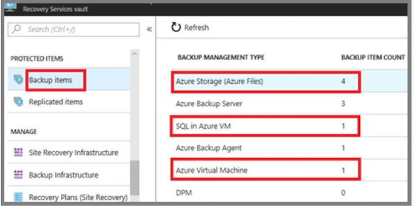

### Question #21

You have an Azure subscription named Subscription1 that contains the resources shown in the following table.

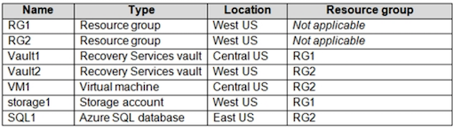


**In storage1, you create a blob container named blob1 and a file share named share1**.

Which resources can be backed up to Vault1 and Vault2? To answer, select the appropriate options in the answer area.

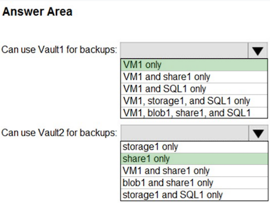

**Box 1: VM1 only -**

* VM1 is in the same region as Vault1.
* File1 is not in the same region as Vautl1.
* SQL is not in the same region as Vault1.
* Blobs cannot be backup up to service vaults

**Note: To create a vault to protect virtual machines, the vault must be in the same region as the virtual machines.**

**Box 2: Share1 only.**

Storage1 is in the same region (West USA) as Vault2. Share1 is in Storage1.

Note: After you select Backup, the Backup pane opens and prompts you to select a storage account from a list of discovered supported storage accounts. They're either associated with this vault or present in the same region as the vault, but not yet associated to any Recovery Services


**Box 1: VM1 only**

VM1 is in the same region as Vault1. File1 is not in the same region as Vautl1. SQL is not in the same region as Vault1. Blobs cannot be backup up to service vaults.

Note: To create a Vault to protect VMs, the Vault must be in the same Region as the VMs.

**Box 2: Share1 only**

Storage1 is in the same region as Vault2. Share1 is in Storage1.

**Note: Only VM and Fileshare is allowed to Backup.**


### Question #22

You have an Azure subscription named Subscription1.

You have 5 TB of data that you need to transfer to Subscription1.

You plan to use an Azure Import/Export job.

What can you use as the destination of the imported data?

* A. a virtual machine
* B. an Azure Cosmos DB database
* **C. Azure File Storage**
* D. the Azure File Sync Storage Sync Service

**Correct Answer: C**

Azure Import/Export service is used to securely import large amounts of data to Azure Blob storage and Azure Files by shipping disk drives to
an Azure datacenter.

The maximum size of an Azure Files Resource of a file share is 5 TB.

Note:
There are several versions of this question in the exam. The question has two correct answers:

1. Azure File Storage
2. Azure Blob Storage

The question can have other incorrect answer options, including the following:

* ✑ Azure Data Lake Store
* ✑ Azure SQL Database
* ✑ Azure Data Factory

### Question #23

You have an Azure subscription.

You create the Azure Storage account shown in the following exhibit

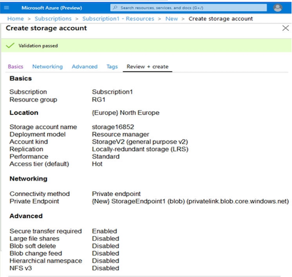

Use the drop-down menus to select the answer choice that completes each statement based on the information presented in the graphic.

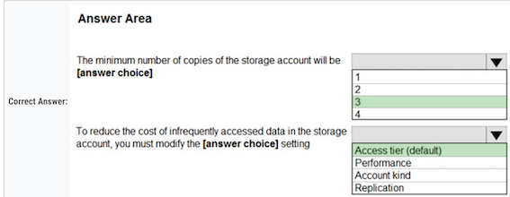


Box 1: 3 - Locally Redundant Storage (LRS) provides highly durable and available storage within a single location (sub region). We maintain an equivalent of 3 copies

(replicas) of your data within the primary location as described in our SOSP paper; this ensures that we can recover from common failures
(disk, node, rack) without impacting your storage account's availability and durability.

**Box 2: Access tier** -

Change the access tier from Hot to Cool.

Note: Azure storage offers different access tiers, which allow you to store blob object data in the most cost-effective manner. The available
access tiers include:

* Hot - Optimized for storing data that is accessed frequently.
* Cool - Optimized for storing data that is infrequently accessed and stored for at least 30 days.
* Archive - Optimized for storing data that is rarely accessed and stored for at least 180 days with flexible latency requirements (on the order of
* hours).

### Question #24


You have an Azure Storage account named storage1.

You plan to use AzCopy to copy data to storage1.

You need to identify the storage services in storage1 to which you can copy the data.

Which storage services should you identify?

* A. blob, file, table, and queue
* **B. blob and file only**
* C. file and table only
* D. file only
* E. blob, table, and queue only

**Correct Answer: B**

AzCopy is a command-line utility that you can use to copy blobs or files to or from a storage account.

**Incorrect Answers:**

* A, C, E: AzCopy does not support table and queue storage services.
* D: AzCopy supports file storage services, as well as blob storage services.

### Question #25

**You have an Azure Storage account named storage1 that uses Azure Blob storage and Azure File storage.**

**You need to use AzCopy to copy data to the blob storage and file storage in storage1.**

Which authentication method should you use for each type of storage? To answer, select the appropriate options in the answer area.

NOTE: Each correct selection is worth one point.

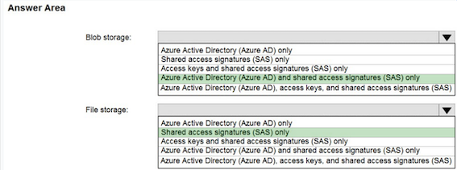

**You can provide authorization credentials by using Azure Active Directory (AD), or by using a Shared Access Signature (SAS) token.**

Box 1:

**Both Azure Active Directory (AD) and Shared Access Signature (SAS) token are supported for Blob storage**.

Box 2:

**Only Shared Access Signature (SAS) token is supported for File storage.**

### Question #26

You have an Azure subscription that contains an Azure Storage account.

You plan to create an Azure container instance named container1 that will use a Docker image named Image1. Image1 contains a Microsoft SQL


**Server instance that requires persistent storag**e.

You need to configure a storage service for Container1.

What should you use?

* **A. Azure Files**
* B. Azure Blob storage
* C. Azure Queue storage
* D. Azure Table storage

Rason is for the mounting of the File shares from within the linux container you need file shares


### Question #27

You have an app named App1 that runs on two Azure virtual machines named VM1 and VM2.

You plan to implement an Azure Availability Set for App1. The solution must ensure that App1 is available during **planned maintenance** of the
hardware hosting VM1 and VM2.

What should you include in the Availability Set?

* A. one update domain
* B. two fault domains
* C. one fault domain
* **D. two update domains**

**Correct Answer: D**

Microsoft updates, which Microsoft refers to as planned maintenance events, sometimes require that VMs be rebooted to complete the update.
To reduce the impact on VMs, the Azure fabric is divided into update domains to ensure that not all VMs are rebooted at the same time.

**Incorrect Answers:**

* A: An update domain is a group of VMs and underlying physical hardware that can be rebooted at the same time.
* B: C: A fault domain shares common storage as well as a common power source and network switch. It is used to protect against unplanned
* system failure.


### Question #28

You have an Azure subscription that contains an Azure file share.

You have an on-premises server named Server1 that runs Windows Server 2016.

**You plan to set up Azure File Sync between Server1 and the Azure file share.**

You need to prepare the subscription for the planned Azure File Sync.

Which two actions should you perform in the Azure subscription? To answer, drag the appropriate actions to the correct targets. Each action may
be used once, more than once, or not at all. You may need to drag the split bar between panes or scroll to view content.

NOTE: Each correct selection is worth one point.

Select and Place:

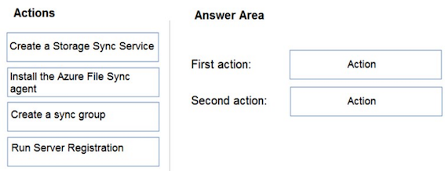

* **First action: Create a Storage Sync Service**
* **Second action:Create a sync group**

1. Prepare Windows Server to use with Azure File Sync
2. Deploy the Storage Sync Service
3. Install the Azure File Sync agent
4. Register Windows Server with Storage Sync Service
5. Create a sync group and a cloud endpoint
6. Create a server endpoint
7. Configure firewall and virtual network settings

### Question #30

You have an Azure subscription that contains the file shares shown in the following table.

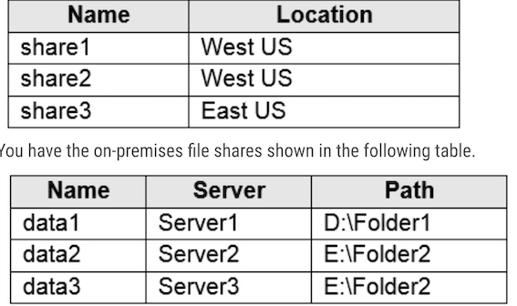

You create an Azure file sync group named Sync1 and perform the following actions:

* ✑ **Add share1 as the cloud endpoint for Sync1.**
* ✑ **Add data1 as a server endpoint for Sync1**.
* ✑ Register Server1 and Server2 to Sync1.

For each of the following statements, select Yes if the statement is true. Otherwise, select No.

NOTE: Each correct selection is worth one point.

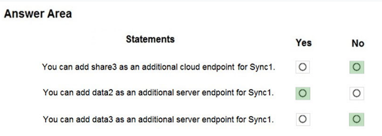

**Box 1: No -**

A sync group must contain one cloud endpoint, which represents an Azure file share and one or more server endpoints

>  only one cloud endpoint can be added to sync1

**Box 2: Yes -**

Data2 is located on Server2 which is registered to Sync1.

> Server2 has been registered to Sync1 but data2 is not added to server endpoint. So we can add data2 as additional server endpoint for Sync1

**Box 3: No -**

Data3 is located on Server3 which is not registered to Sync1.

> We have to register Server3 first

### Question #31

You have an Azure subscription named Subscription1 that contains the resources shown in the following table:

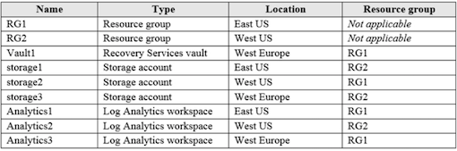

**You plan to configure Azure Backup reports for Vault1.**

You are configuring the Diagnostics settings for the AzureBackupReports log.

Which storage accounts and which Log Analytics workspaces can you use for the Azure Backup reports of Vault1? To answer, select the
appropriate options in the answer area.

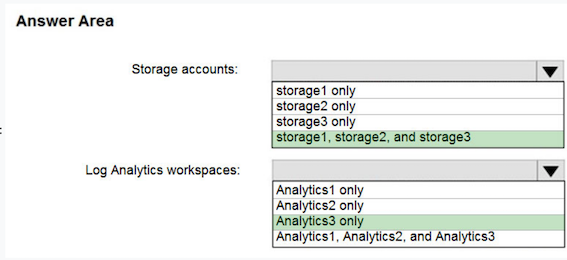

**Storage accounts: Storage 3 only**

**Storage Account must be in the same Region as the Recovery Services Vault.**

> because Vault1 is West Europe and Storage3 is also in West Europe.

**Log Analytics workspaces: Analytics1, Analytics2, and Analytics3**

Set up one or more Log Analytics workspaces to store your Backup reporting data. **The location and subscription where this Log Analytics
workspace can be created is independent of the location and subscription where your Vaults exist.**

> Analytics1, Analytics2 and Analytics3, becasue those analytics backup are not related to the location and subscription where your vaults exist
> 
> Set up one or more Log Analytics workspaces to store your Backup reporting data. The location and subscription where this Log Analytics
workspace can be created is independent of the location and subscription where your vaults exist

#### Question #32

You have an Azure subscription that contains the storage accounts shown in the following exhibit.

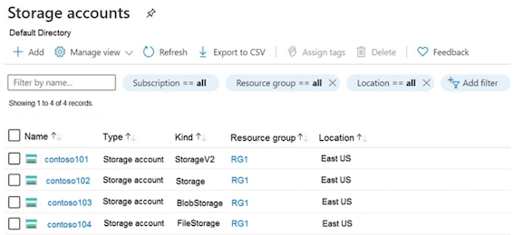


Use the drop-down menus to select the answer choice that completes each statement based on the information presented in the graphic.
NOTE: Each correct selection is worth one point.

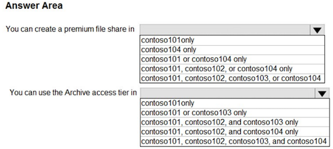

**Box 1: contoso104 only**

Premium file shares are hosted in a special purpose storage account kind, called a FileStorage account.

**Box 2: contoso101 and contos103 only**

Object storage data tiering between hot, cool, and archive is supported in **Blob Storage and General Purpose v2 (GPv2) accounts**. General Purpose v1 (GPv1) accounts don't support tiering

**The archive tier supports only LRS, GRS, and RA-GRS.**

The general-purpose v1 storage account, which is the older version of the standard storage account, **only supports two tiers: hot and cool. It
doesn't support the archive tier.**


Contoso101 or Contoso103 only is correct as tiring in a Storage account is supported by **only two types of storage accounts - BlobStorage and
StorageV2**

* You cannot configure any other type of storage accounts like Storage,FileStorage etc.
	* Note: The archive tier is not supported as the default access tier for a storage account.
* **Object storage data tiering between hot, cool, and archive is supported in Blob Storage and General Purpose v2 (GPv2) accounts.** 
* General Purpose v1 (GPv1) accounts don't support tiering

* The archive tier supports only LRS, GRS, and RA-GRS.
* The archive tier isn't supported for ZRS, GZRS, or RA-GZRS accounts

###  Question #33

You have an Azure subscription named Subscription1.

In Subscription1, you create an Azure file share named share1.

**You create a shared access signature (SAS) named SAS1 as shown in the following exhibit**

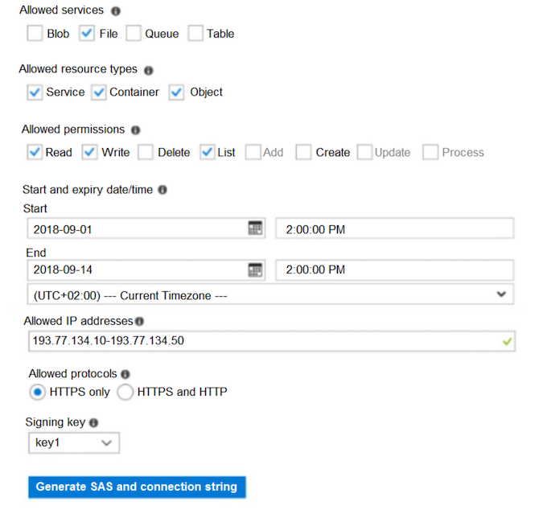

To answer, select the appropriate options in the answer area.

NOTE: Each correct selection is worth one point.

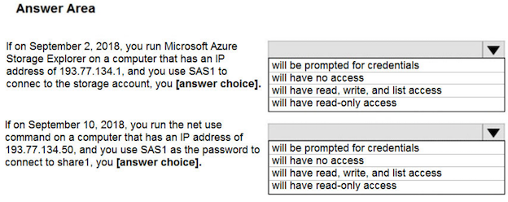

**Box 1: will have no access**

The IP 193.77.134.1 does not have access on the SAS, because it is not matching the SAS requirements. **IP is out of range.**

Box1: have no access , due to IP restriction.

**Box 2: will have no access**

**<mark>The SAS token is not supported in mounting Azure File share currently, it just supports the Azure storage account key.</mark>**

Since it is using "net use" where it uses SMB, the SMB (Server Message Broker) protocol does not support SAS. it still asks for username/password.
Accordingly, it will give error wrong username/pass and will not provide access

### Question #34

You have two Azure virtual machines named VM1 and VM2. You have two Recovery Services vaults named RSV1 and RSV2.

* VM2 is backed up to RSV1.
* You need to back up VM2 to RSV2.
* What should you do first?

* **A. From the RSV1 blade, click Backup items and stop the VM2 backup**
* B. From the RSV2 blade, click Backup. From the Backup blade, select the backup for the virtual machine, and then click Backup
* C. From the VM2 blade, click Disaster recovery, click Replication settings, and then select RSV2 as the Recovery Services vault
* D. From the RSV1 blade, click Backup Jobs and export the VM2 job

If you want to change the recovery service vault **you need to disassociate the previous RSV and delete the backup data**. To delete backup data, you need to stop the backup first.

1. Stop the backup in RSV1 (D)
2. Remove the backup data.
3. Disassociate the VM in RSV1.
4. Associate the VM in RSV2.

**The first step to back up VM2 to RSV2 is to stop the backup of VM2 in RSV1**

### Question #35

You have a general-purpose v1 Azure Storage account named storage1 that uses locally-redundant storage (LRS).

You need to ensure that the data in the storage account is protected if a zone fails. The solution must minimize costs and administrative effort.

What should you do first?


* A. Create a new storage account.
* B. Configure object replication rules.
* **C. Upgrade the account to general-purpose v2.**
* D. Modify the Replication setting of storage1.

v1 supports GRS/RA-GRS but question was about least cost. **Least cost is ZRS which is only supported for v2 and premium file/block storage.**

* Standard general-purpose v1 = LRS/GRS/RA-GRS  (No ZRS)
* Blob Storage = LRS/GRS/RA-GRS
* **Standard general-purpose v2 = LRS/ZRS/GRS/RA-GRS/GZRS/RA-GZRS**
* Premium block blobs = LRS/ZRS
* Premium page blobs = LRS/ZRS
* Premium file shares = LRS/ZRS

### Question #36

You have an Azure subscription that contains the storage accounts shown in the following

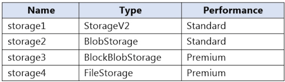

You plan to manage the data stored in the accounts by using lifecycle management rules.

To which storage accounts can you apply lifecycle management rules?

* A. storage1 only
* B. storage1 and storage2 only
* C. storage3 and storage4 only
* D. storage1, storage2, and storage3 only
* **E. storage1, storage2, storage3, and storage4**

The lifecycle management feature is **available in all Azure regions for general purpose v2 (GPv2) accounts, blob storage accounts, premium block blobs storage accounts, and Azure Data Lake Storage Gen2 accounts**.

### Question #37

You create an Azure Storage account named contosostorage.

You plan to create a file share named data.

Users need to map a drive to the data file share from home computers that run Windows 10.

Which outbound port should you open between the home computers and the data file share?

* A. 80
* B. 443
* C. 445
* D. 3389

**Correct Answer: C**

Server Message Block (SMB) is used to connect to an Azure file share over the internet. The SMB protocol requires TCP port 445 to be open


* A: Port 80 is required for HTTP to a web server
* B: Port 443 is required for HTTPS to a web server
* D: Port 3389443 is required for Remote desktop protocol (RDP) connections

### Question #39

You have an Azure subscription that contains an Azure Storage account named storageaccount1.

You export storageaccount1 as an **Azure Resource Manager template**. The template contains the following sections.

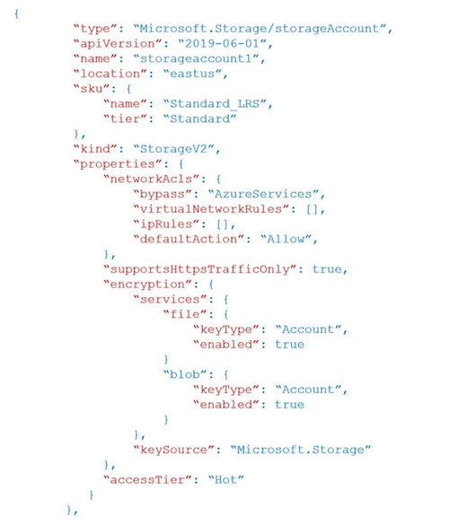

For each of the following statements, select Yes if the statement is true. Otherwise, select No.

NOTE: Each correct selection is worth one point

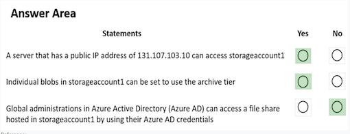

* Box 1- Yes. VirtualNetworkRules & IpRules are blank, with the default action Allow.
* Box 2- **Yes. Individual blobs can be set to the archive tier**
* Bob 3. No. To access blob data in the Azure portal with Azure AD credentials, a user must have the following role assignments:


* **A data access role, such as Storage Blob Data Contributor**
* The Azure Resource Manager Reader role

1. Yes. Defaultaction is allow. IP is allowed.   **(NetworkACLs are blank. Default Action Allow)**
2. Yes. Storagev2 allows tiering.
3. No. File share access requires SAS.  **N In the List no allowSharedKeyAccess type ,the allowSharedKeyAccess default is True**

### Question #40

You have an Azure subscription that contains a storage account named storage1.

You have the devices shown in the following table.

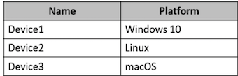

From which devices can you use AzCopy to copy data to storage1?

* A. Device 1 only
* **B. Device1, Device2 and Device3**
* C. Device1 and Device2 only
* D. Device1 and Device3 only

AzCopy is supported in all these three operating systems

### Question #41

You have an Azure Storage account named storage1 that contains a blob container named container1.

**You need to prevent new content added to container1 from being modified for one year.**

What should you configure?

* A. the access tier
* **B. an access policy**
* C. the Access control (IAM) settings
* D. the access level

**Time-based retention policies:** With a time-based retention policy, **users can set policies to store data for a specified interval**. When a time-based retention policy is set, **objects can be created and read, but not modified or deleted**. 

**After the retention period has expired, objects can be deleted but not overwritten.**

**Access policy can set retention policy.**

###  Question #42

You have an Azure Storage account named storage1 that contains a blob container. **The blob container has a default access tier of Hot. Storage1
contains a container named conainer1.**

**You create lifecycle management rules in storage1 as shown in the following table.**

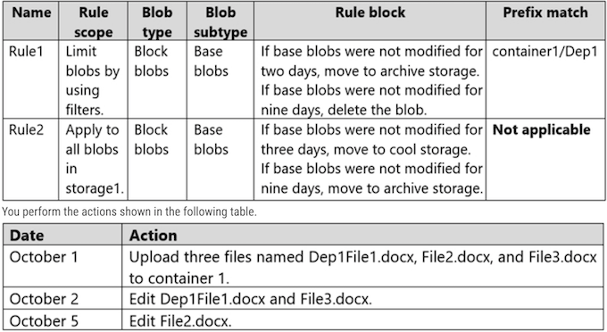

* Dep1File1 > No cannot be read
* File2 > Yes cannot be read
* File3 > Yes can be read

**Correct Answer N Y Y**

* Rule1 archives blobs(aka files) after 2 days of inactivity and deletes after 9
* Rule2 moves to cool tier after 3 days and archive tier after 9

**Of the three files, Rule1 only applies to Dep1File1.docx, while the other files have Rule2 applied.**

The question asks if you can read the files on the 10th, not if they still exist. Files in the archive tier CANNOT be read as documented by Microsoft:

**"While a blob is in archive storage, the blob data is offline and can't be read or modified. To read or download a blob in archive, you must first rehydrate it to an online tier."**

* Dep1File1.docx was last updated 8 days ago, and would be in archive tier
* File2.docx was last updated 5 days ago, and would be in cool tier
* File3.docx was last updated 8 days ago and would be in cool tier

* Dep1File1 > No cannot be read
* File2 > Yes cannot be read
* File3 > Yes can be read


### Question #43

You are configuring Azure Active Directory (Azure AD) authentication for an Azure Storage account named storage1.

You need to ensure that the members of a group named Group1 can **upload files by using the Azure portal. The solution must use the principle of
least privilege.**

Which two roles should you configure for storage1? Each correct answer presents part of the solution


* A. Storage Account Contributor
* **B. Storage Blob Data Contributor**
* **C. Reader**
* D. Contributor
* E. Storage Blob Data Reader

To access blob data in the Azure portal with Azure AD credentials, a user must have the following role assignments:

* A data access role, such as **Storage Blob Data Reader or Storage Blob Data Contributor**
* The Azure Resource Manager Reader role, at a minimum

The Reader role is an Azure Resource Manager role that permits users to view storage account resources, but not modify them. It does not
provide read permissions to data in Azure Storage, but only to account management resources. The Reader role is necessary so that users can
navigate to blob containers in the Azure portal.

**Order from least to greatest permissions:**

1. The Reader and Data Access role -
2. The Storage Account Contributor role
3. The Azure Resource Manager Contributor role
4. The Azure Resource Manager Owner role

B. `Storage Blob Data Contributor`: This role allows for reading, writing, and deleting Azure Storage blobs (object data). This role is necessary for
members to be able to upload files.

C. `Reader`: This role gives the user read access to see the storage account and its properties but doesn't allow for any modifications. This role
would be needed to navigate to the storage account in the Azure portal.

Assigning these roles should give Group1 members the ability to upload files to the storage account via the Azure portal without giving them more
permissions than they need.

### Question #44

You have an Azure Storage account named storage1 that stores images.

**You need to create a new storage account and replicate the images in storage1 to the new account by using object replication.**

How should you configure the new account? To answer, select the appropriate options in the answer area

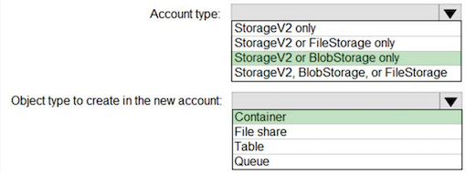


* Account type: **StorageV2 or BlobStorage only**
* Object type to create in the new account: **Container**

	* **Object Replication supports General Purpose V2 and Premium Blob accounts.**
	* **Blob versioning should be enabled on both the source and destination storage account.**
	* **Change feed is enabled on the source storage account**


### Question #45

You have an on-premises server that contains a folder named D:\Folder1.

**You need to copy the contents of D:\Folder1 to the public container in an Azure Storage account named contosodata.**

Which command should you run?

* A. https://contosodata.blob.core.windows.net/public
* B. azcopy sync D:\folder1 https://contosodata.blob.core.windows.net/public --snapshot
* **C. azcopy copy D:\folder1 https://contosodata.blob.core.windows.net/public --recursive**
* D. az storage blob copy start-batch D:\Folder1 https://contosodata.blob.core.windows.net/public

**Correct Answer: C**

The azcopy copy command copies a directory (and all of the files in that directory) to a blob container. The result is a directory in the container
by the same name.

**Incorrect Answers:**


* A: URL of the Storage Account.
* B: The azcopy sync command replicates the source location to the destination location. However, the file is skipped if the last modified time in the
destination is more recent.
* C: The azcopy copy command copies a directory (and all the files in that directory) to a blob container. The result is a directory in the container by
the same name.
* D: The az storage blob copy start-batch command copies multiple blobs to a blob container.


### Question #46

You have an Azure subscription.

In the Azure portal, you plan to create a storage account named storage1 that will have the following settings:

* ✑ Performance: Standard
* ✑ Replication: Zone-redundant storage (ZRS)
* ✑ Access tier (default): Cool
* ✑ Hierarchical namespace: Disabled

You need to ensure that you can set Account kind for **storage1 to BlockBlobStorage.**

Which setting should you modify first?


* **A. Performance**
* B. Replication
* C. Access tier (default)
* D. Hierarchical namespace

**Select Standard performance for general-purpose v2 storage accounts (default). **This type of account is recommended by Microsoft for most
scenarios. For more information, see Types of storage accounts.

Select Premium for scenarios requiring low latency. After selecting Premium, select the type of premium storage account to create. The following
types of premium storage accounts are available:

* Block blobs
* File shares
* Page blobs

* StorageV2 = Standard general-purpose v2
* BlockBlobStorage = Premium block blobs
* FileStorage = Premium file shares
* StorageV2 = Premium page blobs
* Storage = legacy Standard general-purpose v1
* BlobStorage = legacy blob storage

**Portal > Create a storage account > Basics > If you need to create a legacy storage account type, please click here > Performance = Premium > Account kind = BlockBlobStorage**

### Question #47

You have an Azure subscription that contains the storage accounts shown in the following table.

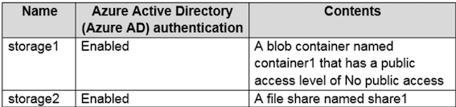

**You plan to use AzCopy to copy a blob from container1 directly to share1.**

**You need to identify which authentication method to use when you use AzCopy.**

What should you identify for each account? To answer, drag the appropriate authentication methods to the correct accounts. Each method may be

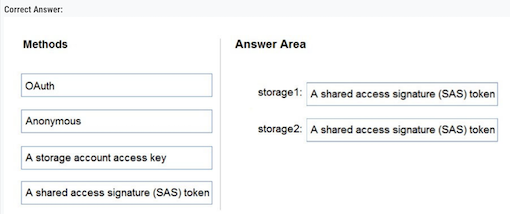

* 1) A shared access signature (SAS) token
* 2) A shared access signature (SAS) token

* Blob Storage: Support both Azure Active Directory (AD) and Shared Access Signature (SAS) token.
* File Storage: Only Shared Access Signature (SAS) token is supported.

**Box 1: A shared access signature (SAS) token.**

You can provide authorization credentials by using Azure Active Directory (AD), or by using a Shared Access Signature (SAS) token.

For Blob storage you can use Azure AD & SAS.

> Note: In the current release, if you plan to copy blobs between storage accounts, you'll have to append a SAS token to each source URL. You can
omit the SAS token only from the destination URL.

**Box 2: A shared access signature (SAS) token.**

For File storage you can only use SAS.

### Question #48

You create an Azure Storage account.

You plan to add 10 blob containers to the storage account.

**For one of the containers, you need to use a different key to encrypt data at rest.**

What should you do before you create the container?


* A. Generate a shared access signature (SAS).
* B. Modify the minimum TLS version.
* C. Rotate the access keys.
* **D. Create an encryption scope.**

**Encryption scopes enable you to manage encryption with a key that is scoped to a container or an individual blob. You can use encryption
scopes to create secure boundaries between data that resides in the same storage account but belongs to different customers**

In Azure Storage, encryption of data at rest is done using Azure Storage Service Encryption (SSE). Azure Storage SSE uses Microsoft-managed
encryption keys to encrypt the data in the storage account

In the scenario described, you need to use a different key to encrypt data at rest for one of the containers. To do this, you need to create an
encryption scope, which is a named configuration that defines the default encryption settings for a container. 

**By creating an encryption scope, you can use a customer-managed key, stored in Azure Key Vault, to encrypt the data in that specific container**

### Question #49

You have an Azure subscription. **The subscription contains a storage account named storage1 that has the lifecycle management rules shown in
the following table**.

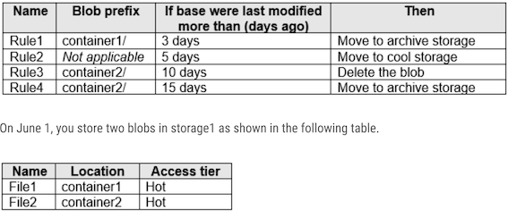

For each of the following statements, select Yes if the statement is true. Otherwise, select No.

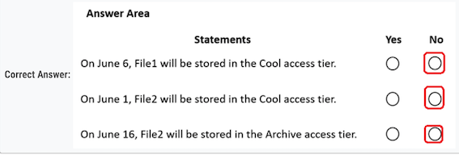

**N-N-N**

* On June 6, **File1 will be in archive because File1 is in container 1, and rule 1 applies 3 days after june 1.**
* On June 1, File2 will still be in Hot tier because File2 is in container2, Rule3 and Rule4 havent hit yet.
* On June 16, **File2 will be deleted because Rule3 applies 10 days after June 1.**

### Question #50

You have an Azure subscription.

You plan to deploy a storage account named storage1 by using the following Azure Resource Manager (ARM) template

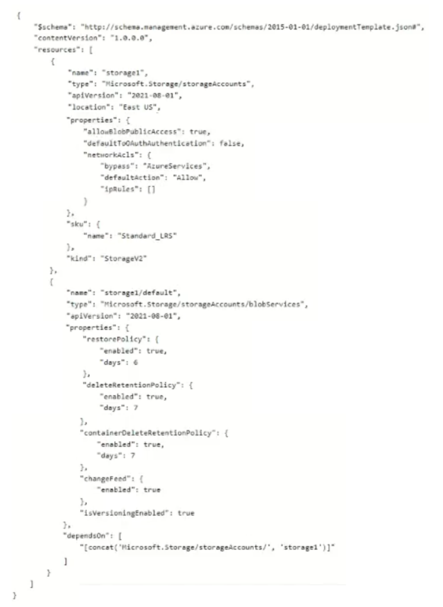

For each of the following statements, select Yes if the statement is hue. Otherwise, select No

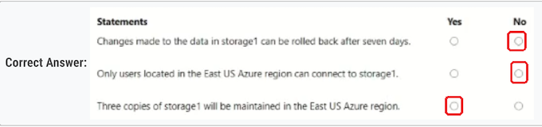

**N-N-Y**

* deleteRetentionPolicy is 7 days, so can not be restored after 7 days. Means, backup is deleted after 7 days.
* **allowBlobPublicAccess is true, so anyone can access the blob, not just on Azure.**
* kind is Standard_LRS, so 3 local copies are stored.

### Question #52

You have an Azure subscription that contains a storage account named storage1. The storage1 account contains a container named container1.

You need to create a lifecycle management rule for storage1 that will automatically move the blobs in container1 to the lowest-cost tier after 90
days.

How should you complete the rule? To answer, select the appropriate options in the answer area

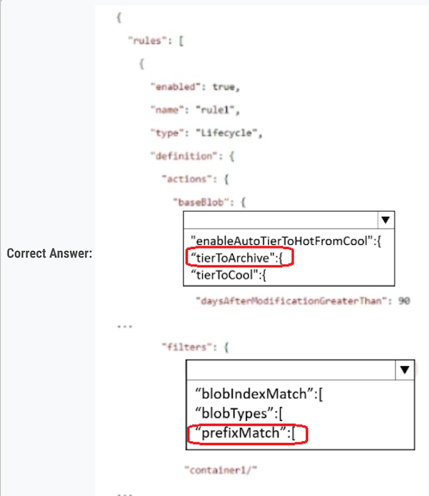

**tierToArchive** and **prefixMatch**

* **tierToArchive because it's the lowest cost tier**, and doesn't say anything about needing to read data after 90 days. However, rehydration costs will occur if they did need to read it.
*  **prefixMatch** because we only want the blob in the container1.

1st: tierToArchive --> Lowest cost tier

2nd: prefixMatch --> An array of strings for prefixes to be matched. Each rule can define up to 10 case-sensitive prefixes. A prefix string must start
with a container name.

### Question #53

You have an Azure subscription that contains a virtual machine named VM1.

You need to back up VM1. The solution must ensure that backups are stored across three availability zones in the primary region.

Which three actions should you perform in sequence? To answer, move the appropriate actions from the list of actions to the answer area and
arrange them in the correct order.

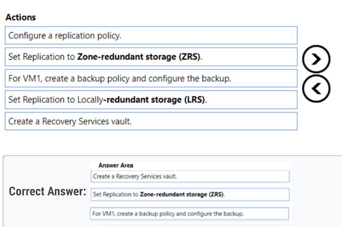

1. Create Recovery Services Vault,
2. Set Replication Policy to ZRS (because of the requirement for having in three separate zones)
3. For VM1, create a backup policy


### Question #54

You have an Azure subscription named Subscription1

You have 5 TB of data that you need to transfer to Subscription1.

You plan to use an Azure Import/Export job

What can you use as the destination of the imported data?

**B. Azure File Storage**

### Question #55

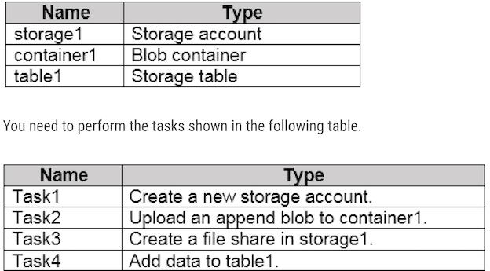

Which tasks can you perform by using Azure Storage Explorer?

* A. Task1 and Task3 only
* B. Task1, Task2, and Task3 only
* C. Task1, Task3, and Task4 only
* **D. Task2, Task3, and Task4 only**
* E. Task1, Task2, Task3, and Task4

Azure Storage Explorer does not have the ability to create a new storage account directly. Instead, you can use Azure Storage Explorer to connect
to and manage existing storage accounts in Azure.

### Question #56

You have an Azure AD user named User1 and a read-access geo-redundant storage (RA-GRS) account named contoso2023.

You need to meet the following requirements:

* • **User1 must be able to write blob data to contoso2023.**
* • The contoso2023 account must fail over to its secondary endpoint.

Which two settings should you configure? To answer, select the appropriate settings in the answer area.

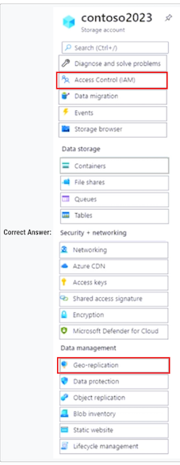

**Geo-replication" is now changed to "Redundancy" by name. They are the same settings, just a new name.**

### Question #57

You have an Azure subscription that contains a storage account named storage1.

**You plan to create a blob container named container1.**

You need to use customer-managed key encryption for container1.

Which key should you use?


* A. an EC key that uses the P-384 curve only
* B. an EC key that uses the P-521 curve only
* C. an EC key that uses the P-384 curve or P-521 curve only
* D. an RSA key with a key size of 4096 only
* **E. an RSA key type with a key size of 2048, 3072, or 4096 only**

**E is correct.**

Azure storage encryption supports RSA and RSA-HSM keys of sizes 2048, 3072 and 4096

### Question #58

You have an Azure subscription that contains a user named User1 and a storage account named storage1. The storage1 account contains the
resources shown in the following table.

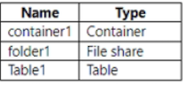

User1 is assigned the following roles for storage1:

* Storage Blob Data Reader
* Storage Table Data Contributor
* Storage File Data SMB Share Contributor

For storage1, you create a shared access signature (SAS) named SAS1 that has the settings shown in the following exhibit. (Click the Exhibit tab.)

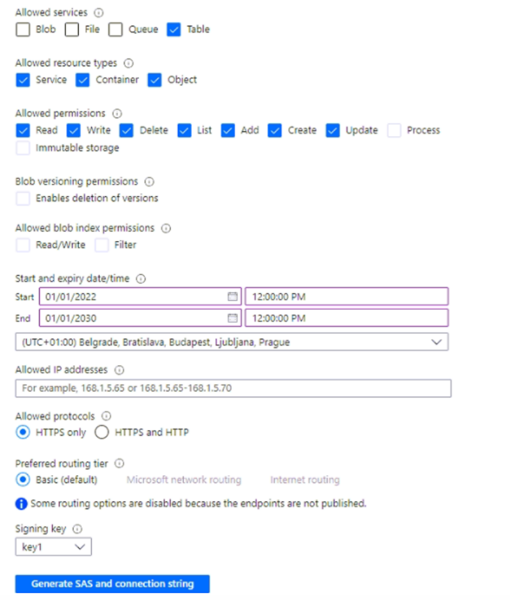

To which resources can **User1 write by using SAS1 and key1**? To answer, select the appropriate options in the answer area.


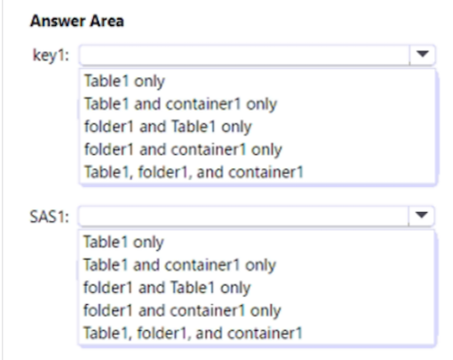

* **For Key1, User1 can see container1, folder1 and table1.**
* **For SAS1: Only Table1 can be accessed**.


### Question #59

You have an Azure subscription that contains the storage account shown in the following exhibit.

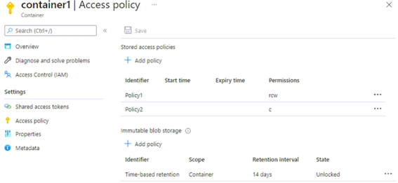

Use the drop-down menus to select the answer choice that completes each statement based on the information presented in the graphic

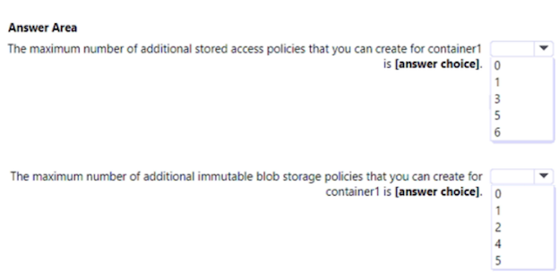

**Max stored access policies: 3, because max total of stored access policy is 5 and we already have 2, so additional 3 available.**

**Max immutable blob storage: 1, because max total of immutable blob storage policy is 2 - one Legal hold policy and one Time-based retention
policy. We already have one, so additional 1 available.**