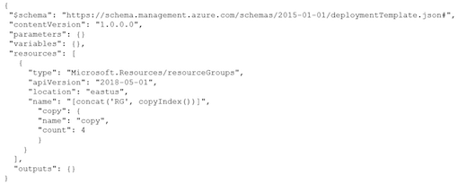

# AZ104 - 原题2

## Topic 3

### Question #60

You have an Azure subscription named Subscription1.

You have 5 TB of data that you need to transfer to Subscription1.

You plan to use an Azure Import/Export job.

What can you use as the destination of the imported data?

**A. Azure Blob Storage**

### Question #61

**You have an Azure subscription**. The subscription contains a storage account named storage1 that has the lifecycle management rules shown in the following table.


**On June 1, you store a blob named File1 in the Hot access tier of storage1**

What is the state of File1 on June 7?

* A. stored in the Cool access tier
* B. stored in the Archive access tier
* C. stored in the Hot access tier
* **D. deleted**

corect answer is D


If you define more than one action on the same blob, lifecycle management applies the least expensive action to the blob. 

**For example, action delete is cheaper than action tierToArchive. Action tierToArchive is cheaper than action tierToCool.**

### Question #62

You have an Azure subscription that contains the storage accounts shown in the following table


You need to identify which storage accounts support lifecycle management, and which storage accounts support moving data to the Archive access tier.

Which storage accounts should you use? To answer, select the appropriate options in the answer area


**1 - storage1, storage2, storage3**

Lifecycle management policies are supported for **block blobs and append blobs in general-purpose v2**, **premium block blob, and Blob Storage accounts**.

**2 - storage2**

* **Only storage accounts that are configured for LRS, GRS, or RA-GRS support moving blobs to the archive tier.** 
* **The archive tier isn't supported for ZRS, GZRS, or RA-GZRS accounts.**


### Question #63

You have an Azure subscription that contains a storage account named storage1. The storage1 account contains a container named container1.

**You create a blob lifecycle rule named rule1.**

You need to configure rule1 to automatically move blobs that were NOT updated for 45 days from contained to the Cool access tier

How should you complete the rule? To answer, select the appropriate options in the answer area.


1. daysAfterModificationGreaterThan
2. Blockblob

Tiering is not yet supported in a premium block blob storage account. For all other accounts, **tiering is allowed only on block blobs and not for append and page blobs.**

**tierToCool - Supported for blockBlob**

### Question #65

You plan to create an Azure Storage account named storage1 that will contain a file share named share1.

You need to ensure that share1 can support SMB Multichannel. The solution must minimize costs.

How should you configure storage?

* **A. Premium performance with locally-redundant storage (LRS)**
* B. Standard performance with zone-redundant storage (ZRS)
* C. Premium performance with geo-redundant storage (GRS)
* D. Standard performance with locally-redundant storage (LRS)

**Keyword is "minimize costs". So Premium FileShare + LRS is the most economical**

### Question #68

You have an Azure subscription that contains a storage account named storage1.

**You plan to use conditions when assigning role-based access control (RBAC) roles to storage1.**

Which storage1 services support conditions when assigning roles?

* A. containers only
* B. file shares only
* C. tables only
* D. queues only
* **E. containers and queues only**
* F. files shares and tables only

**Conditions can be added to Containers and Queues.**

### Question #69

You have an Azure subscription that contains the resource groups shown in the following table.


For each of the following statements, select Yes if the statement is true. Otherwise, select No.

NOTE: Each correct selection is worth one point.

Statements

* You can deploy AKS1 to VNet2.  (No)
* You can deploy AKS2 to VNet1,  (Yes)
* You can deploy AKS3 to VNet3   (No)

**Kubenet is a NAT style networking allowing access to pods through translation node interfaces/VIPs and ports**

**CNI provides dedicated Network interfaces for Pods integrating Azure VNETs**

* NO = is CNI but Region of the VNET2 is not the same than the one of AKS1
* **Yes**= **AKS2 is in RG2 and located in West US. VNet1 is in RG1 and located in West US.**
	* is CNI and VNET1 region is the same than AKS2
* NO = **uses kubenet is an internal network piece that doesn't require VNETs**


### Question #70

You plan to deploy several Azure virtual machines that will run Windows Server 2019 in a virtual machine scale set by using an Azure Resource Manager template.

You need to ensure that NGINX is available on all the virtual machines after they are deployed.

What should you use?

* A. the Publish-AzVMDscConfiguration cmdlet
* B. Azure Application Insights
* **C. a Desired State Configuration (DSC) extension**
* D. Azure AD Application Proxy

Answer is C) a Desired State Configuration (DSC) extension

**To ensure that NGINX is available on all the virtual machines in a virtual machine scale set, you can use the Desired State Configuration (DSC) extension.**


Option A (the Publish-AzVMDscConfiguration cmdlet) is used to generate a configuration file for DSC.

Option B (Azure Application Insights) is a monitoring service that provides application performance and availability telemetry.

Option D (Azure AD Application Proxy) is a service that enables remote access to on-premises applications.


### Question #71

**You have an Azure subscription that has offices in the East US and West US Azure regions.**

You plan to create the storage account shown in the following exhibit.


Use the drop-down menus to select the answer choice that completes each statement based on the information presented in the graphic.

NOTE: Each correct selection is worth one point.


* Minimize network cost - **Default routing tier to Internet Routing**
* After creation you can modify - **Encryption type**

1. Default Routing Tier can be changed to lower networking costs. Choose Internet Routing for low cost.
2.  After an storage account is created, Only Encryption Type can be changed. "**Enabled support for customer-managed keys" and "Infrastructure Encryption" both cannot be changed.**

### Question #72

You have an Azure subscription.

You plan to deploy a new storage account.

**You need to configure encryption for the account.** The solution must meet the following requirements:

* • Use a customer-managed key stored in a key vault.
* • Use the maximum supported bit length.

Which type of key and which bit length should you use? To answer, select the appropriate options in the answer area.


### Question #73

You have an Azure Storage account that contains 5,000 blobs accessed by multiple users.

You need to ensure that the users can view only specific blobs based on blob index tags

What should you include in the solution?

* **A. a role assignment condition**
* B. a stored access policy
* C. just-in-time (JIT) VM access
* D. a shared access signature (SAS)

**A. role assignment condition**: This would control access at the container level, not individual blobs. You need more granular control for specific blobs based on tags.


**B. stored access policy:**This can be used to define access levels for a container or blob, but it wouldn't allow you to filter based on tags dynamically

C. just-in-time (JIT) VM access: This is used for managing access to virtual machines, not blob storage

**D. shared access signature (SAS): This provides temporary access to blobs with granular control over permissions.** You can generate SAS tokens with conditions based on blob index tags, allowing users to access only the relevant blobs.


**An Azure role assignment condition is an optional check that you can add to your role assignment to provide more fine-grained access control.** Forexample, you can add a condition that requires an object to have a specific tag to read the object.

### Question #74

You have an Azure Storage account named storage1.

For storage1, you create an encryption scope named Scope1.

Which storage types can you encrypt by using Scope?

* A. file shares only
* **B. containers only**
* C. file shares and containers only
* D. containers and tables only
* E. file shares, containers, and tables only
* F. file shares, containers, tables, and queues】

**Answer is B:**

**Encryption scopes enable you to manage encryption with a key that is scoped to a container or an individual blob**


**The encryption scope in Azure Storage is available for Azure Blob / Data Lake Gen2 storage account1.**

**The key that protects an encryption scope may be either a Microsoft-managed key or a customer-managed key in Azure Key Vault1.**

Therefore, the correct answer is B. containers only as blobs are stored in containers in Azure Blob Storage

> "Encryption scopes enable you to manage encryption with a key that is scoped to a container or an individual blob."

### Question #75

You have an Azure subscription.

You plan to create a role definition to meet the following requirements:

* Users must be able to view the configuration data of a storage account.
* Users must be able to perform all actions on a virtual network.
* The solution must use the principle of least privilege


* **`Microsoft.Network/virtualNetworks/*`**

The asterisk (*) denotes all actions, so this permission grants users the ability to perform all operations on a virtual network, including creating, updating, deleting, and viewing.

* **`Microsoft.Storage/storageAccounts/read`**

This permission allows users to view the properties and configuration data of a storage account without granting them permissions to modify or delete the storage account


### Question #77

You have an Azure subscription that contains a virtual machine named VM1

To VM1, you plan to add a 1-TB data disk that meets the following requirements:

*  Provides data resiliency in the event of a datacenter outage.
* Provides the lowest latency and the highest performance.
* Ensures that no data loss occurs if a host fails.


**Storage type: Premium SDD that uses zone-redundant storage (ZRS)**

* **Storage type: Premium SDD that uses zone-redundant storage (ZRS)**
* Rationale ZRS replicates to different locations
* Host caching: **Write cache stores information in memory, no host, no memory, no data**


Redundancy options for Azure managed disks - Azure Virtual Machines | Microsoft Learn

Enable and configure Azure VM disk cache with the Azure portal - Training | Microsoft Learn


### Question #78

You have an Azure virtual machine named VM1 and an Azure key vault named Vault1.

On VM1, you plan to **configure Azure Disk Encryption to use a key encryption key (KEK).**

**You need to prepare Vault1 for Azure Disk Encryption.**

Which two actions should you perform on Vault1? Each correct answer presents part of the solution.

NOTE: Each correct selection is worth one point

* A. Select Azure Virtual machines for deployment.
* **B. Create a new key.**
* C. Create a new secret.
* D. Configure a key rotation policy.
* **E. Select Azure Disk Encryption for volume encryption.**

To prepare Vault1 for Azure Disk Encryption with a key encryption key (KEK):

1. **You need to have a key in the Key Vault.** This will be the KEK. Azure Disk Encryption uses BitLocker for Windows VMs, which requires a key for encrypting the data disk. If you're using a KEK, the BEK (BitLocker Encryption Key) will be wrapped by this KEK.

**B. Create a new key.**

2. **The key vault itself should be configured for Azure Disk Encryption.** This ensures the vault is set up to work with Azure VMs and their disks

**E. Select Azure Disk Encryption for volume encryption.**

1. Creating a resource group, if needed.
2. Creating a key vault. (B)
3. Setting key vault advanced access policies. (E)

### Question #79

You have an Azure subscription that contains a virtual machine named VM1 and an Azure key vault named KV1.

**You need to configure encryption for VM1. The solution must meet the following requirements:**

* Store and use the encryption key in KV1.
* Maintain encryption if VM1 is downloaded from Azure.
* Encrypt both the operating system disk and the data disks

Which encryption method should you use?

* A. customer-managed keys
* B. Confidential disk encryption
* **C. Azure Disk Encryption**
* D. encryption at host

"You can protect your managed disks by using **Azure Disk Encryption for Linux VMs**, which uses DM-Crypt, or Azure Disk Encryption for Windows VMs, which uses **Windows BitLocker**, **to protect both operating system disks and data disks with full volume encryption.**

Encryption keys and secrets are safeguarded in your Azure Key Vault subscription. By using the Azure Backup service, you can back up and restore encrypted virtual machines (VMs) that use Key Encryption Key (KEK) configuration."

### Question #80

You have an Azure subscription that contains a storage account named storage1.

You need to configure a shared access signature (SAS) to ensure that users can only download blobs securely by name

Which two settings should you configure? To answer, select the appropriate settings in the answer area


* Allowed services: Blob (since you want to access blobs)

* Allowed Services: Blob
* Allowed Resource Types: Service, Container, Object
* Allowed Permissions: Read, List

### Question #81

You have an Azure subscription that contains a storage account named storage1. The storage1 account contains a container named container1.

You need to configure access to container1. The solution must meet the following requirements:

* Only allow read access.
* Allow both HTTP and HTTPS protocols.
* Apply access permissions to all the content in the container

What should you use?

* A. an access policy
* **B. a shared access signature (SAS)**
* C. Azure Content Delivery Network (CDN)
* D. access keys

To configure read access to a container in an Azure Storage account while **allowing both HTTP and HTTPS protocols and applying access permissions to all the content in the container,** you should use a Shared Access Signature (SAS).

**Shared Access Signatures (SAS)** are used to grant limited access to specific resources in your storage account while maintaining fine-grained control over the allowed operations, including read access.

### Question #82

You need to create an Azure Storage account named storage1. The solution must meet the following requirement

* Support Azure **Data Lake Storage.**
* Minimize costs for infrequently accessed data.
* Automatically replicate data to a secondary Azure region.


Which three options should you configure for storage1? Each correct answer presents part of the solution

NOTE: Each correct answer is worth one point

* A. zone-redundant storage (ZRS)
* **B. the Cool access tire**
* **C. geo-redundant storage (GRS)**
* D. the Hot access tier
* **E. hierarchical namespace**


B. **The Cool access tier:** The Cool access tier is suitable for infrequently accessed data and offers lower storage costs compared to the Hot access tier.

C. **Geo-redundant storage (GRS): Geo-redundant storage replicates data to a secondary Azure region**, providing data redundancy and disaster recovery capabilities.

E. Hierarchical namespace: **The hierarchical namespace is required for Azure Data Lake Storage, as it enables the storage account to support the data lake's file system structure.**

### Question #83

You have an Azure Storage account named storage1 that contains two containers named container1 and container. **Blob versioning is enabled for both containers.**

**You periodically take blob snapshots of critical blobs.**

You create the following lifecycle management policy.


For each of the following statements, select Yes if the statement is true. Otherwise, select No.

* A blob snapshot automatically moves to the Cool access tier after 15 days.      **（YES)**
* A blob version in container2 automatically moves to the Archive access tier after 30 days.    **（No)**
* A rehydrated version automatically moves to the Archive access tier after 30 days.    **（No)**

* Y - See section tierToCool
* N - rule1 only applies to container1, not container2, see section prefixMatch
* N - This one is a bit complicated. **Rehydrated files (that were in the archive tier first and then returned to hot or cool) wouldn't necessarily be archived after 30 days** - **as there's a condition that the last tier change must be at least 7 days ago. (I'll leave it open how these files became archived in the first place, before 30 days after creation.**..)

### Question #84

You have an Azure subscription that contains the storage accounts shown in the following table.


Which storage account can be converted to **zone-redundant storage (ZRS) replication**?

* A. storage1
* **B. storage2**
* C. storage3
* D. storage4

### Question #85

You have an Azure subscription that contains the devices shown in the following table


On which devices can you install **Azure Storage Explorer?**

* A. Device1 only
* B. Device1 and Device2 only
* C. Device1 and Device3 only
* D. Device1, Device2, and Device3 only
* **E. Device1, Device3, and Device4 only**

### Question #86

You have an Azure subscription.

You plan to create the Azure Storage account as shown in the following exhibit.


Use the drop-down menus to select the answer choice that completes each statement based on the information presented in the graphic.


* Any data is stored in three different copies, either within a data center or across different availability zones or regions.
* Infrequently used data can be stored most cost-effiiently on the cold access tier

### Question #87

You have an Azure Storage account named storage1 that contains a container named container1. The container1 container stores thousands of image files.

**You plan to use an Azure Resource Manager (ARM) template to create a blob inventory rule named rule1**

You need to ensure that only blobs whose names start with the word finance are stored daily as a CSV file in container1.

How should you complete rule1? To answer, select the options in the answer area.

NOTE: Each correct answer is worth one point.


* BlockBlob makes most sense for CSV files:
* A prefix match string of `container1/sub1/` applies to all blobs in the container named container1 that begin with the string `sub1/`

### Question #88

You have an Azure subscription that contains a storage account named storage1. **The storage1 account contains blobs in a container named container1**.


You plan to share access to storage1.

You need to generate a shared access signature (SAS). The solution must meet the following requirements:

*  Ensure that the SAS can only be used to **enumerate** and download blobs stored in container1.
* Use the principle of least privilege.

Which three settings should you enable? To answer, select the appropriate settings in the answer area.


* Allowed resource types: **Container**
* Allowed permissions: List and **Read**.

Container: 

* **"Grants access to the content and metadata of any blob in the container, and to the list of blobs in the container."**
* Specifying "Object" additionally would be redundant because it is a subset of "Container".

**List: "List blobs non-recursively."**   Satisfies the **requirement of enumeration.**

**Read:** 

* "Read the content, blocklist, properties, and metadata of any blob in the container or directory. Use a blob as the source of a copy operation.
* Satisfies the requirement of download.

### Question #89

You have an Azure subscription. The subscription contains a storage account named storage1 that has the lifecycle management rules shown in the following table.


For each of the following statements, select Yes if the statement is true. Otherwise, select No

* On June 6. File1 will be stored in the Cool access tier.  **(No)**
	*  **Rule 1 applies and File 1 will be in archive storage**
* On June 7, File2 will be stored in the Cool access tier.    **(YES)**
	* **Rule 5 applies to all files due to the lack of a prefix, and File 2 will be in cool storage**
* On June 16, File2 will be stored in the Archive access tier.   **(No)**
	*   **Rule 3 applies and File 2 will be deleted.**

### Question #90

You have an Azure Storage account named contoso2024 that contains the resources shown in the following table.


The contoso2024 account is configured as shown in the following exhibit.


* 1-Yes: Public Access is enabled for blob
* 2- No: Azure Storage Account Contributor role can't access the file share
* 3- **No: Access Key is disabled on the storage account**

## Topic 4 - Question Set 4

### Question #1

You deploy an Azure Kubernetes Service (AKS) cluster named AKS1.

You need to deploy a YAML file to AKS1.

**Solution: From Azure CLI, you run az aks.**

Does this meet the goal?

* A. Yes
* **B. No**

**To deploy the YAML file you need to runs `kubectl apply -f file_name.yaml`**

### Question #2

You deploy an Azure Kubernetes Service (AKS) cluster named AKS1.

You need to deploy a YAML file to AKS1.

**Solution: From Azure CLI, you run the kubectl client.**

Does this meet the goal?

* **A. Yes**
* B. No

To manage a Kubernetes cluster, use the Kubernetes command-line client, kubectl

then run "kubectl apply -f azure-vote.yaml"


### Topic 4 Question #3

**Solution: From Azure CLI, you run azcopy**

### Question #4

You have an Azure virtual machine named VM1 that runs Windows Server 2016.

You need to create an alert in Azure when more than two error events are logged to the System event log on VM1 within an hour.

**Solution: You create an Azure storage account and configure shared access signatures (SASs). You install the Microsoft Monitoring Agent on VM1. You create an alert in Azure Monitor and specify the storage account as the source.**

Does that meet the goal?

* A. Yes
* **B. No**

You want to create an Alert which means you need Log analytics and Azure monitor.

1. You create an Azure Log Analytics workspace and configure the data settings.
2. You install the Microsoft Monitoring Agent on VM1.
3. You create an alert in Azure Monitor and specify the Log Analytics workspace as the source

1. **Creating an Azure storage account and configuring shared access signatures (SASs) is not necessary for monitoring events on a virtual machine**. Azure Monitor can directly collect events from the VM's System event log using the Microsoft Monitoring Agent.

2. The Microsoft Monitoring Agent can indeed collect logs and send them to Azure Monitor, but specifying a storage account as the source would not be the typical approach for monitoring System event logs. You would usually send the logs directly to a Log Analytics workspace.

3. **To monitor the System event log for specific events, you would set up a Log Analytics workspace, configure the Microsoft Monitoring Agent to send logs to that workspace**, and then set up an alert based on a query that examines those logs.


**You need to specify and Log Analytics Workspace not a Storage Account.**


### Question #5

You have an Azure subscription named Subscription1. Subscription1 contains the resources in the following table.


VNet1 is in RG1. VNet2 is in RG2. **There is no connectivity between VNet1 and VNet2.**

An administrator named Admin1 creates an Azure virtual machine named VM1 in RG1. VM1 uses a disk named Disk1 and connects to VNet1.

Admin1 then installs a custom application in VM1.

**You need to move the custom application to VNet2. The solution must minimize administrative effort.**

Which two actions should you perform? To answer, select the appropriate options in the answer area.


We cannot just move a virtual machine between networks. **What we need to do is identify the disk used by the VM, delete the VM itself while retaining the disk, and recreate the VM in the target virtual network and then attach the original disk to it.**

Note: You can change the Subnet a VM is connected to after it's created, but you cannot change the VNet.

### Question #6

You download an Azure Resource Manager template based on an existing virtual machine. The template will be used to deploy 100 virtual machines.

**You need to modify the template to reference an administrative password. You must prevent the password from being stored in plain text**.

What should you create to store the password?

* **A. an Azure Key Vault and an access policy**
* B. an Azure Storage account and an access policy
* C. a Recovery Services vault and a backup policy
* D. Azure Active Directory (AD) Identity Protection and an Azure policy

You can use a template that allows you to deploy a simple Windows VM by retrieving the password that is stored in a Key Vault. Therefore, the password is never put in plain text in the template parameter file.

**A. an Azure Key Vault and an access policy**

**Azure Key Vault is a cloud service that safeguards encryption keys and secrets like certificates, connection strings, and passwords**. 

When deploying resources through Azure Resource Manager templates, it's a best practice to store sensitive data like administrative passwords in Azure Key Vault rather than in the template itself. 

**By referencing the Azure Key Vault in the ARM template, the password can be fetched securely during deployment**

### Question #7

You have the App Service plans shown in the following table


You need to identify which App Service plans can be used for the web apps.

What should you identify? To answer, select the appropriate options in the answer area


**Box 1: ASP1 ASP3 -**


* ASP.NET Core apps can be hosted both on Windows or Linux.
* The region in which your app runs is the region of the App Service Plan is in.
* ASP2 is in Central US, not the same as WebApp1. Different locations.

**Box 2: ASP1**

**ASP.NET apps can be hosted on Windows only.**

### Question #8

You create a virtual machine scale set named Scale1. Scale1 is configured as shown in the following exhibit


Use the drop-down menus to select the answer choice that completes each statement based on the information presented in the graphic.


**Box 1: 6 virtual machines -**

The Autoscale scale out rule increases the number of VMs by 2 if the CPU threshold is 80% or higher. **The initial instance count is 4 and rises to
6 when the 2 extra instances of VMs are added.**

**Box 2: 2 virtual machnes -**

The Autoscale scale in rule decreases the number of VMs by 4 if the CPU threshold is 30% or lower. **The initial instance count is 4 and thus
cannot be reduced to 0 as the minimum instances is set to 2**. 

Instances are only added when the CPU threshold reaches 80%.

**Box 1: 6 virtual machines**

The Autoscale scale out rule increases the number of VMs by 2 if the CPU threshold is 80% or higher. The initial instance count is 4 and rises to 6 when the 2 extra instances of VMs are added.

**Box 2: 2 virtual machnes**

The Autoscale scale in rule decreases the number of VMs by 4 if the CPU threshold is 30% or lower. 

The initial instance count is 4 and thus cannot be reduced to 0 as the minimum instances is set to 2. Instances are only added when the CPU threshold reaches 80%

### Question #9

You plan to automate the deployment of a virtual machine scale set that uses the Windows Server 2016 Datacenter image.

You need to ensure that when the scale set virtual machines are provisioned, they have web server components installed.

Which two actions should you perform? Each correct answer presents part of the solution.

NOTE: Each correct selection is worth one point

* **A. Upload a configuration script**
* B. Create an automation account
* C. Create an Azure policy
* **D. Modify the extensionProfile section of the Azure Resource Manager template**
* E. Create a new virtual machine scale set in the Azure portal

**Correct Answer: A and D**

* The Custom Script Extension downloads and executes scripts on Azure VMs. This extension is useful for post deployment configuration, software installation, or any other configuration / management task. Scripts can be downloaded from Azure storage or GitHub, or provided to the Azure portal at extension run-time.
* The Custom Script extension integrates with Azure Resource Manager templates, and can also be used with the Azure CLI, Azure PowerShell, Azure
portal, or the REST API

* The following Custom Script Extension definition downloads a sample script from GitHub, installs the required packages, then writes the VM instance hostname to a basic HTML page.

**A.  Upload a configuration script:** This script should include the necessary commands to install the web server components on the virtual machines
in the scale set. You can upload this script to a storage account or any accessible location for the virtual machines to retrieve and execute during
provisioning.

**D. Modify the extensionProfile section of the Azure Resource Manager template**: In the Azure Resource Manager (ARM) template used for
deploying the virtual machine scale set, you can include an extensionProfile section to specify the extensions to be installed on the virtual
machines. **You can add an extension that runs the previously uploaded configuration script to install the web server components**

### Question #10

You have an Azure Kubernetes Service (AKS) cluster named AKS1 and a computer named Computer1 that runs Windows 10. Computer1 that has the Azure CLI installed.

**You need to install the kubectl client on Computer1.**

Which command should you run? To answer, select the appropriate options in the answer area


To install kubectl locally, use the az aks install-cli command.

Azure cli commands start with az. We use Install-Module to install a Powershell module.
 
### Question #11

You onboard 10 Azure virtual machines to **Azure Automation State Configuration**

**You need to use Azure Automation State Configuration to manage the ongoing consistency of the virtual machine configurations.**

Which three actions should you perform in sequence? To answer, move the appropriate actions from the list of actions to the answer area and arrange them in the correct order.


1. **Upload a configuration to Azure Automation State Configuration**
	* Before you can apply a desired state to a machine, you need a configuration. This configuration defines the desired state. 
2. **Compile a configuration into a node configuration**
	* **After uploading the configuration, you need to compile it. This process turns the human readable configuration into a format that can be read and applied by the target machines (nodes)**. 
3.  **Check the compliance status of the node.**
	*  After the node configuration is applied to machines, you can regularly check the compliance status to ensure that the machines adhere to the defined desired state. 
	*  If they drift from the desired state, Azure Automation State Configuration can correct them, depending on how you've set it up 

* Step 1: Create and upload a configuration to Azure Automation
* Step 2: Compile a configuration into a node configuration
* Step 3: Register a VM to be managed by State Configuration
* Step 4: Specify configuration mode settings
* Step 5: Assign a node configuration to a managed node
* Step 6: Check the compliance status of a managed node

### Question #12

You have an Azure Resource Manager template named Template1 that is used to deploy an Azure virtual machine.

Template1 contains the following text:


You need to deploy the virtual machine to the West US location by using Template1.

What should you do?

* **A. Modify the location in the resources section to westus**
* B. Select West US during the deployment
* C. Modify the location in the variables section to westus

**Correct Answer: A**


You can change the location in resources. 

Parameters used to define the value of some variables to be able to use in different places in the template resources. 

Resources are used only for complicated expressions. In any case, RM will only deploy from resources. In case the value is not mentioned directly, then it will check parameters if it is specified in the resources. Based on this question, the value of location is defined directly in resources. so you change the resources location value

A: You can change the location in resources. **Parameters used to define the value of some variables to be able to use in different places in the template resources**

Resources are used only for complicated expressions. In any case, RM will only deploy from resources. In case the value is not mentioned directly, then it will check parameters if it is specified in the resources.

### Question #13

You create an App Service plan named Plan1 and an Azure web app named webapp1.

**You discover that the option to create a staging slot is unavailable.**

You need to create a staging slot for Plan1.

What should you do first?

* **A. From Plan1, scale up the App Service plan**
* B. From webapp1, modify the Application settings
* C. From webapp1, add a custom domain
* D. From Plan1, scale out the App Service plan

**The app must be running in the Standard, Premium, or Isolated tier in order for you to enable multiple deployment slots. **

If the app isn't already in the Standard, Premium, or Isolated tier, you receive a message that indicates the supported tiers for enabling staged publishing. 

**At this point, you have the option to select Upgrade and go to the Scale tab of your app before continuing.**

Scale up: Get more CPU, memory, disk space, and extra features like dedicated virtual machines (VMs), custom domains and certificates, staging
slots, autoscaling, and more.

**Scale out: Increase the number of VM instances that run your app. You can scale out to as many as 30 instances**

### Question #14

You plan to move a distributed on-premises app named App1 to an Azure subscription.

After the planned move, App1 will be hosted on several Azure virtual machines.

You need to ensure that App1 always runs on at least eight virtual machines during planned Azure maintenance.

What should you create?

* **A. one virtual machine scale set that has 10 virtual machines instances**
* B. one Availability Set that has three fault domains and one update domain
* C. one Availability Set that has 10 update domains and one fault domain
* D. one virtual machine scale set that has 12 virtual machines instances

VM Scale Set consists of a set of identically configured VMs.

Availability Set consists of a set of discrete VMs.

**No more than 20% of the Scale Set upgrading at any time, then 2 machines out of 10 will have maintenance, the 8 remaining VMs will be up.**

**Virtual machine scale sets are created with five fault domains by default in Azure regions with no zones.** 

For the regions that support zonal deployment of virtual machine scale sets and this option is selected, the default value of the fault domain count is 1 for each of the zones. 

FD=1 in this case implies that the VM instances belonging to the scale set will be spread across many racks on a best effort basis.

First: in case you created on fault domain, you are limited with one update domain. You can test this.

**Second: By default, Azure uses 5 update domains and up to 3 fault domains**. So, In case you created 10 vm in scale set. then you will have 2 vm in each update domain. So once one update domain is not available, then you get 4 domains with 8 vms as required

### Question #15

You have an Azure virtual machine named VM1 that runs Windows Server 2016.

You need to create an alert in Azure when more than two error events are logged to the System event log on VM1 within an hour.

**Solution: You create an event subscription on VM1. You create an alert in Azure Monitor and specify VM1 as the source**

Does this meet the goal?

* A. Yes
* **B. No**

Correct Answer: B - No

You need to **specify Log Analytics as the source for this alert, and not the VM as source for the alert**

1. You create an Azure Log Analytics workspace and configure the data settings.
2. You install the Microsoft Monitoring Agent on VM1.
3. You create an alert in Azure Monitor and specify the Log Analytics workspace as the source

### Question #16

You have an Azure virtual machine named VM1. VM1 was deployed by using a custom Azure Resource Manager template named ARM1.json.

You receive a notification that VM1 will be affected by maintenance.

**You need to move VM1 to a different host immediately.**

**Solution: From the Overview blade, you move the virtual machine to a different subscription.**

Does this meet the goal?

* A. Yes
* **B. No**


Correct Answer: B

**You would need to redeploy the VM**

Changing Subscription won't affect the downtime, it will just you change the billing. **You would need to redeploy the VM. After you redeploy a VM, the temporary disk is lost, and dynamic IP addresses associated with virtual network interface are updated**

From Overview there is no option to move the VM to another hardware to skip the maintenance.

Ideally you need an Availability Set and defining the Update Domains.

### Question #17

You have an Azure virtual machine named VM1. VM1 was deployed by using a custom Azure Resource Manager template named ARM1.json.

You receive a notification that VM1 will be affected by maintenance.

You need to move VM1 to a different host immediately.

**Solution: From the Redeploy blade, you click Redeploy.**

Does this meet the goal?

* **A. Yes**
* B. No

When you redeploy a VM, it moves the VM to a new node within the Azure infrastructure and then powers it back on, retaining all your
configuration options and associated resources.

Use the Azure portal. Select the VM you wish to redeploy, then select the Redeploy button in the Settings blade. You may need to scroll down to
see the Support and Troubleshooting section that contains the 'Redeploy' button

**From Azure Portal > Virtual Machine > Help > Redeploy + Reapply**

### Question #18

**Solution: From the Update management blade, you click Enable**

Correct Answer: B

**You would need to redeploy the VM**

### Question #19

You have an Azure subscription that contains a web app named webapp1.

**You need to add a custom domain named www.contoso.com to webapp1.**

What should you do first?

* **A. Create a DNS record**
* B. Add a connection string
* C. Upload a certificate.
* D. Stop webapp1.

**Correct Answer: A**

You can use either a CNAME record or an A record to map a custom DNS name to App Service.

You should use CNAME records for all custom DNS names except root domains (for example, contoso.com). For root domains, use A records.


###  Question #20

You have an Azure subscription that contains the resources shown in the following table


**VM1 connects to VNET1. You need to connect VM1 to VNET2.**

**Solution: You move VM1 to RG2, and then you add a new network interface to VM1.**

Does this meet the goal?

* A. Yes
* **B. No**

 Instead, you should delete VM1. Then recreate VM1 and add the network interface for VM1
 
**To migrate a VM from a VNET to another VNET. The only option is to delete the VM and redeploy it using a new NIC and NIC connected to VNET2**

Note: When you create an Azure Virtual Machine (VM), you must create a Virtual Network (VNet) or use an existing VNet. You can change the
subnet a VM is connected to after it's created, but you cannot change the VNet. You can also change the size of a VM.

### Question #21


You have an Azure subscription that contains the resources shown in the following table


VM1 connects to VNET1.

**You need to connect VM1 to VNET2.**

Solution: **You delete VM1. You recreate VM1, and then you create a new network interface for VM1 and connect it to VNET2.**

Does this meet the goal?

* **A. Yes**
* B. No

**Correct Answer: A**

You should delete VM1. You recreate VM1, and then you add the network interface for VM1

Note: When you create an Azure virtual machine (VM), you must create a virtual network (VNet) or use an existing VNet. You can change the
subnet a VM is connected to after it's created, but you cannot change the VNet.

You can change the subnet a VM is connected to after it's created, but you cannot change the VNet. You can also change the size of a VM.


### Question #22

**Solution: You turn off VM1, and then you add a new network interface to VM1**

**Correct Answer: B - No**

**Instead, you should delete VM1. Then recreate VM1 and add the network interface for VM1.**

To migrate a VM from a VNET to another VNET. The only option is to delete the VM and redeploy it using a new NIC and NIC connected to VNET2.

### Question #23

You have an Azure subscription named Subscription1 that contains the quotas shown in the following tab


For each of the following statements, select Yes if the statement is true. Otherwise, select No.

* You can deploy VM3 to West US.    **Yes**
* You can deploy VM4 to West US.   **No**
* You can deploy VM5 to West US.    **No**


**Total regional vCPUs = 20**

2 vCPUs (VM1) + 16 vCPUs (VM20) = 18 vCPUs, **which means that only 2 vCPUs left to exceed usage limit.**

**Box 1: Yes**

We can add 1 vCPU. 2 vCPUs (VM1) + 16 vCPUs (VM20) + 1 vCPU (VM3) = 19 vCPUs

**Box 2: No**

We cannot add 4 vCPUs. 2 vCPUs (VM1) + 16 vCPUs (VM20) + 4 vCPU (VM4) = 22 vCPUs


**Box 3: No**

We cannot add 16 vCPU. 2 vCPUs (VM1) + 16 vCPUs (VM20) + 16 vCPU (VM5) = 34 vCPUs

### Question #24

You have an Azure subscription that contains an Azure Availability Set named WEBPROD-AS-USE2 as shown in the following exhibit.


**You add 14 virtual machines to WEBPROD-AS-USE2.**

Use the drop-down menus to select the answer choice that completes each statement based on the information presented in the graphic.
NOTE: Each correct selection is worth one point.


**Box 1: 2 -**

* **There are 10 update domains**. 
* The 14 VMs are shared across the 10 update domains so four **update domains will have two VMs** and **six update domains will have one VM. **
* Only one update domain is rebooted at a time. T**herefore, a maximum of two VMs will be offline.**

```
D1 D2 D3 D4 D5 D6 D7 D8 D9 D10
vm1 vm2 vm3 vm4 vm5 vm6 vm7 vm8 vm9 vm10
vm11 vm12 vm13 vm14

Maximum Down = 2
Minimum Down = 1
```

**Box 2: 7 -**

* There are 2 fault domains. 
* **The 14 VMs are shared across the 2 fault domains,** so 7 VMs in each fault domain. 
* A rack failure will affect one fault domain so 7 VMs will be offline.

**14 VM in 2 Fault Domain**

```
Rack 1 Rack 2
vm1 vm8
vm2 vm9
vm3 vm10
vm4 vm11
vm5 vm12
vm6 vm13
vm7 vm14
```

* Maximum Down = 7
* Minimum Down = 7

### Question #25

You deploy an Azure Kubernetes Service (AKS) cluster named Cluster1 that uses the IP addresses shown in the following table


You need to provide internet users with access to the applications that run in Cluster1.

Which IP address should you include in the DNS record for Cluster1?

* **A. 131.107.2.1**
* B. 10.0.10.11
* C. 172.17.7.1
* D. 192.168.10.2

**Correct Answer: A**

To be able to access applications on Kubernetes, you need an application Load Balancer created by Azure which have public IP

Note: 10.X.X.X range is private

### **Question #26**

You have a deployment template named Template1 that is used to deploy 10 Azure web apps.

You need to identify what to deploy before you deploy Template1. The solution must minimize Azure costs.

What should you identify?

* A. five Azure Application Gateways
* **B. one App Service plan**
* C. 10 App Service plans
* D. one Azure Traffic Manager
* E. one Azure Application Gateway

**Correct Answer: B**

Creating one App Service Plan, you can support up to 10 Web Apps. Adding any of the other resources are pointless and not noted as a
requirement.

* Free: up 10
* Shared: up 100
* The rest plans unlimited web apps

### Question #27

You plan to deploy an Azure container instance by using the following Azure Resource Manager template.


Use the drop-down menus to select the answer choice that completes each statement based on the information presented in the template.


* 1) **Internet users "can connect to the container from any device"**   (No Access restrictions are specified)
* 2) **If Internet Information Services (IIS) in the container fails, "the container will restart automatically".**   (The "restartPolicy" is set as "OnFailure".)

### Question #28

You have an Azure subscription that contains a virtual machine named VM1. VM1 hosts a line-of-business application that is available 24 hours a
day. VM1 has one network interface and one managed disk. 

**VM1 uses the D4s v3 size.**

You plan to make the following changes to VM1:

* ✑ Change the size to D8s v3.
* ✑ Add a 500-GB managed disk.
* ✑ Add the Puppet Agent extension.
* ✑ Enable Desired State Configuration Management.

Which change will cause downtime for VM1?

* A. Enable Desired State Configuration Management
* B. Add a 500-GB managed disk
* **C. Change the size to D8s v3**
* D. Add the Puppet Agent extension

**Correct Answer: C**

**While resizing, the VM must be in a stopped state, therefore there will be a downtime.**

### Question #29

You have an app named App1 that runs on an Azure web app named webapp1.

The developers at your company upload an update of App1 to a Git repository named Git1.

Webapp1 has the deployment slots shown in the following table.

```
Name   					Function
webapp1-prod			Production
webapp1-test			Staging
```


**You need to ensure that the App1 update is tested before the update is made available to users.**

Which two actions should you perform? Each correct answer presents part of the solution.


* **A. Swap the slots**
* B. Deploy the App1 update to webapp1-prod, and then test the update
* C. Stop webapp1-prod
* **D. Deploy the App1 update to webapp1-test, and then test the update**
* E. Stop webapp1-test

 Deploying an app to a slot first(Test is this case) and swapping it into production makes sure that all instances of the slot are warmed up before
being swapped into production.

 After a swap, the slot with previously staged app now has the previous production app. If the changes swapped into the production slot aren't as
you expect, you can perform the same swap immediately to get your "last known good site" back.


### Question #30

You have an Azure subscription named Subscription1 that has the following providers registered:

* ✑ Authorization
* ✑ Automation
* ✑ Resources
* ✑ Compute
* ✑ KeyVault
* ✑ Network
* ✑ Storage
* ✑ Billing
* ✑ Web

**You need to record all the successful and failed connection attempts to VM1.**

Which three actions should you perform? Each correct answer presents part of the solution.

NOTE: Each correct selection is worth one point.

* **A. Enable Azure Network Watcher in the East US Azure region.**
* B. Add an Azure Network Watcher connection monitor.
* C. Register the MicrosoftLogAnalytics provider.
* D. Create an Azure Storage account.
* **E. Register the Microsoft.Insights resource provider.**
* **F. Enable Azure Network Watcher flow logs.**

You can log network traffic that flows through an NSG with Network Watcher's NSG flow log capability.

* ✑ In the Azure portal, enable Network Watcher
* ✑ Register Insights provider. NSG flow logging requires the Microsoft.Insights provider.
* ✑ Enable NSG flow log. NSG flow log data is written to an Azure Storage account, Subscription1 has storage.

**Answer is A - E - F**

A network security group (NSG) enables you to filter inbound traffic to, and outbound traffic from, a virtual machine (VM). You can log network
traffic that flows through an NSG with Network Watcher's NSG flow log capability

1. Create a VM with a network security group
2. **Enable Network Watcher and register the Microsoft.Insights provider**
3. Enable a traffic flow log for an NSG, using Network Watcher's NSG flow log capability
4. Download logged data
5. View logged data

**Note: Storage account is already created since VMs have unmanaged disks.**

### Question #31

You need to deploy an Azure virtual machine scale set that contains five instances as quickly as possible. What should you do?


* A. Deploy five virtual machines. Modify the Availability Zones settings for each virtual machine.
* B. Deploy five virtual machines. Modify the Size setting for each virtual machine.
* C. Deploy one virtual machine scale set that is set to VM (virtual machines) orchestration mode.
* **D. Deploy one virtual machine scale set that is set to ScaleSetVM orchestration mode**

**ScaleSetVM orchestration mode**: Virtual machine instances added to the scale set are based on the scale set configuration model. 

**The virtual machine instance lifecycle - creation, update, deletion - is managed by the scale set. **

It the current default VMSS behavior. (Scale set VMs are created in a single shot).


**VM (virtual machines) orchestration mode: Virtual machines created outside of the scale set can be explicitly added to the scale set. **The
orchestration mode VM will only create an empty VMSS without any instances, and you will have to manually add new VMs into it by specifying the
VMSS ID during the creation of the VM. (Separately VMs are created and added to scale set later)

* Scale sets with **Uniform orchestration**  =>  VM ORCHASTRATION MODE
* Scale sets with **Flexible orchestration**   =>  SCALESETVM ORCHASTRATION MODE

- VM (virtual machines) orchestration mode allows you to manage each instance of a virtual machine as a separate entity. This is mainly used for
situations where you want to customize the instances individually.
- ScaleSetVM orchestration mode (the default mode) treats the instances in the scale set as a set, making it easier to manage them as a group,
which is ideal for deploying multiple instances quickly

### Question #32


You plan to create the Azure web apps shown in the following table.

```
Name        		Runtime stack
WebApp1		.NET Core 3.1(LTS)
WebApp2       ASP.NET V4.8
WebApp3		PHP 7.3
WebApp4		Ruby 2.6
```

What is the minimum number of App Service plans you should create for the web apps?

* A. 1
* B. 2
* C. 3
* D. 4

-  WebApp1: .NET Core 3.1 (LTS) runs on both Windows and Linux.
- WebApp2: ASP.NET v4.8 runs only on Windows.
- WebApp3: PHP 7.3 runs on both Windows and Linux.
- WebApp4: Ruby 2.6 typically runs on Linux.

You can choose to have:

1. One App Service plan for WebApp1, WebApp2, and WebApp3 all on Windows.
2. A separate App Service plan for WebApp4 on Linux

### Question #33

You have a pay-as-you-go Azure subscription that contains the virtual machines shown in the following table.


**The AG1 action group contains a user named admin@contoso.com only.**

Use the drop-down menus to select the answer choice that completes each statement based on the information presented in the graphic.
Hot Area:


**Correct Answer**

**Box 1: VM1 and VM2 continue to run**

The Budget’s scope is RG1, so only VM1 will be handled.

When the budget thresholds you've created are exceeded, only notifications are triggered.

To stop resources, you need to setup additional things, none of which are mentioned in the question


**Box 2: one email notification will be sent each month.**

Budget alerts have scope in Resource Group RG1, which includes VM1, but not VM2.

VM1 consumes 20 Euro/day, so 20 euros * 30 days = 600 euros

The 50%, 500 Euro limit, will be reached in 25 days (25*20 = 500), so an email will be sent.

The 70% and 100% alert conditions will not be reached within a month, and they don't trigger email actions anyway, because AG1 action group
contains a user.

Credit alerts: Credit alerts are generated automatically at 90% and at 100% of your Azure credit balance. Whenever an alert is generated, it's
reflected in cost alerts and in the email sent to the account owners. 90% and 100% will not be reached though

### Question #34

You have an Azure subscription named Subscription1. Subscription1 contains a resource group named RG1. RG1 contains resources that were
deployed by using templates

You need to view the date and time when the resources were created in RG1.

**Solution: From the Subscriptions blade, you select the subscription, and then click Programmatic deployment.**

Does this meet the goal?

* A. Yes
* **B. No**

**Correct Answer: B - No**

From the RG1 blade, click Deployments. You see a history of deployment for the resource group


### Question #36

You have an Azure Active Directory (Azure AD) tenant named adatum.com that contains the users shown in the following table.

```
Name				Role
User1				None
User2				Global administrator
User3				Cloud device administrator
User4				Intune administrator
```

Adatum.com has the following configurations:

* ✑ **Users may join devices to Azure AD is set to User1.**
* ✑ **Additional local administrators on Azure AD joined devices is set to None.**

You deploy Windows 10 to a computer named Computer1. User1 joins Computer1 to adatum.com.

**You need to identify the local Administrator group membership on Computer1.**

Which users are members of the local Administrators group?

* A. User1 only
* B. User2 only
* **C. User1 and User2 only**
* D. User1, User2, and User3 only
* E. User1, User2, User3, and User4

* User 1 = user performing the join
* User 2 = Global Admin

**First the only user who can join Azure AD devices is User 1** .  since User1 is admin on machine. So, the machine can be added.

Second, the ones that can be local admins on Windows 10 are managed under "Additional local administrators" , since this is not mentioned, so we
can assume default.

**By default, the ones are global administrator and device owners (device administrators). This lead us to User1 and User2 only**

Users may join devices to Azure AD - This setting enables you to select the users who can register their devices as Azure AD joined devices.
The default is All.

Additional local administrators on Azure AD joined devices - You can select the users that are granted local administrator rights on a device.
Users added here are added to the Device Administrators role in Azure AD. Global administrators, here User2, in Azure AD and device owners
are granted local administrator rights by default.

### Question #37

You have Azure subscriptions named Subscription1 and Subscription2.

Subscription1 has following resource groups:


For each of the following statements, select Yes if the statement is true. Otherwise, select No.

* **App1 can be moved to RG2   (N）** 
	* **Box 1 is No, you can not move when you have read only lock**
* App1 can be moved to RG3		(Y）
	*  **Nothing mentioned about "delete lock" move operations**
* App1 can be moved to RG4   (Y）
	* **Neither rg1 or rg4 have locks.**

The lock is only effecting the resources itself with edit/delete. Which means If the resource is in a resource group with no lock types then it is free
to move to any other group even if the other group has lock type read only or delete.


**A read-only lock on a resource group prevents you from moving existing resources in or out of the resource group.**

A read-only lock on a resource group that contains a virtual machine prevents users from moving the VM out of the resource group.

### **Question #38**

You have an Azure subscription named Subscription1 that contains the following resource group

* ✑ Name: RG1
* ✑ Region: West US
* ✑ Tag: `tag1`: `value1`

You assign an Azure policy named Policy1 to Subscription1 by using the following configurations:

* ✑ Exclusions: None
* ✑ Policy definition: Append a tag and its value to resources
* ✑ Assignment name: Policy1
* ✑ Parameters:
* ✑ Tag name: tag2

Tag value: value2 -

After Policy1 is assigned, you create a storage account that has the following configuration:

* ✑ Name: storage1
* ✑ Location: West US
* ✑ Resource group: RG1
* ✑ Tags: `tag3`: `value3`

You need to identify which tags are assigned to each resource.


* Tag assigned to RG1 - tag1: value1
* Tag assigned to storage1: tag2: value2 and tag3: value3

RG1 already exists so does not receive tag2

Add a tag to resources  **Adds the specified tag and value when any resource missing this tag is created or updated. Existing resources can be remediated by triggering a remediation task. If the tag exists with a different value it will not be changed. Does not modify tags on resource groups.**

* The Resource Group already existed before the Policy was created. And the policy is for resources only not resource group
* **The storage account was created with tag3 and then gets appended the tag2 because the policy.**

### Question #39

You have an Azure subscription named Subscription1.

**In Subscription1, you create an alert rule named Alert1.**

The Alert1 action group is configured as shown in the following exhibit.


Alert1 alert criteria triggered every minute.

Use the drop-down menus to select the answer choice that completes each statement based on the information presented in the graphic.


* **Box 1: 60**

**One alert per minute will trigger one email per minute**

* **Box 2: 12 or 0**
	* **If it’s a typo and it means Alert1, then Answer = 12 (60/5 = 12)**
	* If it is actually Alert2 then Answer = 0

No more than 1 SMS every 5 minutes can be send, which equals 12 per hour (60/5 = 12).

Note: Rate limiting is a suspension of notifications that occurs when too many are sent to a particular phone number, email address or device. Rate
limiting ensures that alerts are manageable and actionable.

The rate limit thresholds are:

* ✑ **SMS: No more than 1 SMS every 5 minutes.**
* ✑ Voice: No more than 1 Voice call every 5 minutes.
* ✑ Email: No more than 100 emails in an hour.
* ✑ Other actions are not rate limited.

### Question #40

You have an Azure subscription named Subscription1 that contains the resources shown in the following table.


**You plan to use Vault1 for the backup of as many virtual machines as possible.**

Which virtual machines can be backed up to Vault1?


* A. VM1 only
* B. VM3 and VMC only
* C. VM1, VM2, VM3, VMA, VMB, and VMC
* **D. VM1, VM3, VMA, and VMC only**
* E. VM1 and VM3 only

**Correct Answer: D**、

**To create a vault to protect virtual machines, the vault must be in the same region as the virtual machines. If you have virtual machines in
several regions, create a Recovery Services vault in each region**

To create a Recovery Services Vault to protect Virtual Machines, the vault must be in the same Region as the Virtual Machines. 

**If you have Virtual Machines in several Regions, create a Recovery Services Vault in each Region. It works with any resource group or any Operating System**

### Question #41

You have an Azure Kubernetes Service (AKS) cluster named AKS1.

**You need to configure cluster autoscaler for AKS1.**

Which two tools should you use? Each correct answer presents a complete solution

* A. the kubectl command
* B. the az aks command
* C. the Set-AzVm cmdlet
* D. the Azure portal
* E. the Set-AzAks cmdle

**Correct Answer: B and D**

We need to configure autoscaler for the AKS cluster. We do not want to scale Kubernetes pods, so kubectl command is not needed.


* A: kubectl command is used for configuring Kubernetes and not AKS cluster.
* **B: The az aks command is used for the AKS cluster configuration.**
* C: Set-AzVm cmdlet is used for VMs.
* **D: Azure portal, under node pools, press scale, then choose auto scale.**
* E: Set-AzAks, creates or updates an AKS cluster, the correct cmdlet is Set-AzAksCluster

AKS clusters can scale in one of two ways:

- The cluster autoscaler watches for pods that can't be scheduled on nodes because of resource constraints. The cluster then automatically
increases the number of nodes.
- The horizontal pod autoscaler uses the Metrics Server in a Kubernetes cluster to monitor the resource demand of pods. If an application needs
more resources, the number of pods is automatically increased to meet the demand

B. the az aks command: You can use the Azure Command-Line Interface (CLI) command az aks update to configure the cluster autoscaler for an
AKS cluster. This command allows you to enable or disable the cluster autoscaler and set parameters like minimum and maximum node counts.

D. the Azure portal: You can also configure the cluster autoscaler for AKS using the Azure portal. Navigate to your AKS cluster in the Azure portal,
go to the "Node pools" section, and then configure the autoscaler settings for the specific node pool.


### Question #42

You create the following resources in an Azure subscription:

* ✑ An Azure Container Registry instance named Registry1
* ✑ An Azure Kubernetes Service (AKS) cluster named Cluster1


You create a container image named App1 on your administrative workstation

**You need to deploy App1 to Cluster1.**

What should you do first?

* A. Run the docker push command.
* B. Create an App Service plan.
* **C. Run the az acr build command.**
* D. Run the az aks create command.

Answer is Correct . C.

You should sign in and push a container image to Container Registry.

Run the az acr build command to build and push the container image. 

```
az acr build \
--image contoso-website \
--registry $ACR_NAME \
--file Dockerfile .
```

- Make sure that ACR is integrated to AKS
- docker tag has been run with the right ACR.
-  docker push
-  create kubectl apply with the right deployment and right ACR.


### Question #43

You have an Azure subscription that contains the resources shown in the following table.


**You need to configure a proximity placement group for VMSS1.**

Which proximity placement groups should you use?

* **A. Proximity2 only**
* B. Proximity1, Proximity2, and Proximity3
* C. Proximity1 only
* D. Proximity1 and Proximity3 only

**Correct Answer: A**

Resource Group location of VMSS1 is the RG2 location, which is West US.

**Only Proximity2, which also in RG2, is location in West US**

Placement Groups is a capability to achieve co-location of your Azure Infrastructure as a Service (IaaS) resources and low network latency among
them, for improved application performance

Azure proximity placement groups represent a new logical grouping capability for your Azure Virtual Machines, which in turn is used as a deployment constraint when selecting where to place your virtual machines. 

In fact, when you assign your virtual machines to a proximity placement group, the virtual machines are placed in the same data center, resulting in lower and deterministic latency for your applications.

**The VMSS should share the same region, even it should be the same zone as proximity groups are located in the same data center. Accordingly, it should be proximity 2 only.**

### Question #44

You have an Azure subscription named Subscription1. Subscription1 contains a resource group named RG1. RG1 contains resources that were
deployed by using templates

**You need to view the date and time when the resources were created in RG1.**

Solution: **From the Subscriptions blade, you select the subscription, and then click Resource providers.**

Does this meet the goal?

* A. Yes
* **B. No**

**Correct Answer: B - No**

From the RG1 blade, click Deployments. You see a history of deployment for the resource group.

### Question #45

You have an Azure subscription named Subscription1. Subscription1 contains a resource group named RG1. RG1 contains resources that were
deployed by using templates.

You need to view the date and time when the resources were created in RG1.

**Solution: From the RG1 blade, you click Automation script.**

**Correct Answer: B - No**

From the RG1 blade, click Deployments. You see a history of deployment for the resource group.

### Question #46

You need to view the date and time when the resources were created in RG1.

**Solution: From the RG1 blade, you click Deployments**

**Correct Answer: A**

From the RG1 blade, click Deployments. You see a history of deployment for the resource group.


1. Sign in to the Azure portal.
2. From the left menu, select Resource Groups.
3. Check the box to the left of myResourceGroup and select myResourceGrou

### Question #47

You have an Azure subscription named Subscription1.

You deploy a Linux virtual machine named VM1 to Subscription1.

You need to monitor the metrics and the logs of VM1.

What should you use?

* A. Azure HDInsight
* **B. Linux Diagnostic Extension (LAD) 3.0**
* C. the AzurePerformanceDiagnostics extension
* D. Azure Analysis Services

**Correct Answer: B**

The Linux Diagnostic Extension should be used which downloads the Diagnostic Extension (LAD) agent on Linux server.

The Linux diagnostic extension helps a user monitor the health of a Linux VM running on Microsoft Azure. It has the following collection and
capabilities:

- Metrics
- Syslog
- Files

A: Azure HDInsight is a managed, full-spectrum, open-source analytics service in the cloud for enterprises. You can use open-source frameworks
such as Hadoop, Apache Spark, Apache Hive, LLAP, Apache Kafka, Apache Storm, R, and more

C: Azure Performance Diagnostics VM Extension is used for Windows VM only.

D: Azure Analysis Services is a fully managed platform as a service (PaaS) that provides enterprise-grade data models in the cloud.

### Question #48

You have an Azure subscription named Subscription1. Subscription1 contains a virtual machine named VM1.

**You install and configure a web server and a DNS server on VM1.**

VM1 has the effective network security rules shown in the following exhibit:


Use the drop-down menus to select the answer choice that completes each statement based on the information presented in the graphic.


* DNS = Port 53
* WEB = Port 80 (http) or 443 (https)

**Rule are processed by priority order**

A number between 100 and 4096. Rules are processed in priority order, with lower numbers processed before higher numbers, because lower
numbers have higher priority. 

Once traffic matches a rule, processing stops. As a result, any rules that exist with lower priorities (higher numbers) that have the same attributes as rules with higher priorities are not processed.

* **Rule 2 Blocked DNS (Range 50-60) First match > DNS Blocked**
* **Rule 1 Allow http (Range 50-500) First Match > http Allow**.

If we delete Rule 2, Rule 1 Allows http and DNS. First match > It works.

**Box 1:**

> Internet users can reach to the Web server

* Rule2 blocks ports 50-60, which includes port 53, the DNS port. 
* Internet users can reach to the Web server, since it uses port 80.

**Box 2:**

**If Rule2 is removed internet users can reach the DNS server as well.**

Note: Rules are processed in priority order, with lower numbers processed before higher numbers, because lower numbers have higher priority.

Once traffic matches a rule, processing stops. As a result, any rules that exist with lower priorities (higher numbers) that have the same attributes
as rules with higher priorities are not processed.

### Question #49

You plan to deploy three Azure virtual machines named VM1, VM2, and VM3. The virtual machines will host a web app named App1.

You need to ensure that at least two virtual machines are available if a single Azure datacenter becomes unavailable.

What should you deploy?

**C. each virtual machine in a separate Availability Zone**

Correct Answer: C

**Use availability zones to protect from datacenter level**

An Availability Zone in an Azure region is a combination of a **fault domain and an update domain. **

For example, if you create three or more VMs across three zones in an Azure region, your VMs are effectively distributed across three fault domains and three update domains. TheAzure platform recognizes this distribution across update domains to make sure that VMs in different zones are not updated at the same time.


### Question #50

You have an Azure virtual machine named VM1 that runs Windows Server 2019.

**You save VM1 as a template named Template1 to the Azure Resource Manager library.**

You plan to deploy a virtual machine named VM2 from Template1.

What can you configure during the deployment of VM2?

* A. operating system
* B. administrator username
* C. virtual machine size
* **D. resource group**

**Correct Answer: D**

Answer is Resource Group. I tried the only ones that need to be updated manually are resource group and password

**Confirming RG**

Manual steps: log in, deploy VM1. Accept all defaults. 

Go to resource > template > save to library. View library > deploy template, It prepopulates the subscription but you have to set an RG. VM Name can be customized, **admin user/pass are pulled from template**.

### Question #51

You have an Azure subscription that contains an Azure virtual machine named VM1. 

VM1 runs a financial reporting app named App1 that does not support multiple active instances.

**At the end of each month, CPU usage for VM1 peaks when App1 runs.**

You need to create a scheduled runbook to increase the processor performance of VM1 at the end of each month.

**What task should you include in the runbook?**

* A. Add the Azure Performance Diagnostics agent to VM1.
* **B. Modify the VM size property of VM1.**
* C. Add VM1 to a scale set.
* D. Increase the vCPU quota for the subscription.
* E. Add a Desired State Configuration (DSC) extension to VM1

**Correct Answer: B**

Here we need to modify the size of the VM to increase the number of vCPU's assigned to the VM. **This can be included as a task in the runbook. The VM size property can be modified by a runbook that is triggered by metrics, but you can schedule it monthly**.

C: Scheduled vertical scaling could be a solution, **but then you don't need a scheduled runbook and it states that it does not support multiple
active instances. Scale Set is not an option**

E: DSC is only useful to keep the resources on a VM (OS, File shares, etc.) **in a consistent state, not to change VM properties.**

### Question #52

You plan to deploy several Azure virtual machines that will run Windows Server 2019 in a virtual machine scale set by using an Azure Resource
Manager template

**You need to ensure that NGINX is available on all the virtual machines after they are deployed**

What should you use?

* A. Deployment Center in Azure App Service
* **B. A Desired State Configuration (DSC) extension**
* C. the New-AzConfigurationAssignment cmdlet
* D. a Microsoft Intune device configuration profile

**Correct Answer: B**

Note: There are several versions of this question in the exam. The question has two correct answers:

1. **a Desired State Configuration (DSC) extension**
2. Azure Custom Script Extension

```
 az vm extension set \
--resource-group myResourceGroup \
--vm-name myVM --name customScript \
--publisher Microsoft.Azure.Extensions \
--settings '{"commandToExecute": "apt-get install -y nginx"}
```

### Question #53

You deploy an Azure Kubernetes Service (AKS) cluster that has the network profile shown in the following exhibit


Use the drop-down menus to select the answer choice that completes each statement based on the information presented in the graphic.


**Box 1: 10.244.0.0/16**

The Pod CIDR, because containers live inside Pods.

Note: You can't change this address range once the cluster is deployed, if you need more addresses for additional nodes.

**Box 2: 10.0.0.0/16**

The Service CIDR is used to assign internal services in the AKS cluster an IP address.

The `--service-cidr` is used to assign internal services in the AKS cluster an IP address.


### Question #54

You have the App Service plan shown in the following exhibit.


**The scale out rule is configured with the same duration and cool down tile as the scale in rule.**

Use the drop-down menus to select the answer choice that completes each statement based on the information presented in the graphic.


Correct Answer:

**Box 1: 2**

70% for 1h, and then 90% for 5 minutes. So, from the default of 1 it will scale out out 1 more. So, 2 in total.

**Box 2: 4**

90% for 1h and then 25% for 9 minutes. 

So, from the default of 1 it will it scale in to the max 5 (60/5 = 12, which means 6 times scale out, because we have 5 minutes period of cool down). 

Then when it drops to 25% for 9 minutes and it will scale in once after 5 mins (since the average of the last 5 minutes is under 30% ), so it will decrease by 1, so 4 in total. Then it will have a cooldown of 5 minutes before scaling in again, but since only 4 minutes left from 9 minutes (9-5 = 4), it won't scale in again. So, 4 in total.


### Question #55

You have an Azure virtual machine named VM1 that runs Windows Server 2019. The VM was deployed using default drive settings.

You sign in to VM1 as a user named User1 and perform the following actions

* ✑ Create files on drive C.
* ✑ Create files on drive D.
* ✑ Modify the screen saver timeout.
* ✑ Change the desktop background.

**You plan to redeploy VM1.**

**Which changes will be lost after you redeploy VM1?**

* A. the modified screen saver timeout
* B. the new desktop background
* **C. the new files on drive D**
* D. the new files on drive C

**Correct Answer: C**

* For Windows Server, **the temporary disk is mounted as “D:\”.**
* For Linux based VM’s **the temporary disk is mounted as “/dev/sdb1”.**

### Question #56

You have an Azure subscription.

You have an on-premises virtual machine named VM1. The settings for VM1 are shown in the exhibit. (Click the Exhibit tab.)


**You need to ensure that you can use the disks attached to VM1 as a template for Azure virtual machines.**

**What should you modify on VM1?**

* A. the memory
* B. the network adapters
* **C. the hard drive**
* D. the processor
* E. Integration Services

**Correct Answer: C**

**From the exhibit we see that the disk is in the VHDX format.**

The Virtual hard disk is VHDx, it should be formated to VHD before migration from on-premises to Azure. 

Azure supports only generation 1 VMs that are in the VHD file format and have a fixed sized disk. The maximum size allowed for the VHD is 1,023 GB. You can convert a generation 1 VM from the VHDX file system to VHD and from a dynamically expanding disk to fixed-sized.

### **Question #57**

You have an Azure subscription that contains a virtual machine scale set. The scale set contains four instances that have the following configurations:

* ✑ Operating system: Windows Server 2016
* ✑ Size: Standard_D1_v2

You run the **get-azvmss** cmdlet as shown in the following exhibit:


Use the drop-down menus to select the answer choice that completes each statement based on the information presented in the graphic.


**Box 1: 4**

If you resize the Scale Set all the VMs get resized at once, thus 4 is the correct answer.

This refers to the second PS cmdlt 'UpgradePolicy' which "determines what happens next after you change the scale set model" (ex. VM size, OS
ver, extensionPolicy). Box1 asks what happens when size of VM changes. Since it's set to 'automatic', the change will be applied to all the VMs in
the scale set at once

**The first command has nothing to do with VM Resizing**

**Box 2: 1**

Automatic OS updates update 20% of the VMs at once, with a minimum of 1 VM instance at a time. Also 20% of 4 = 0.8.

What's set to 'false' is Patch updates. This is recommended to be set to 'False' when Automatic OS upgrades are set to 'True'. What this means is that the automatic rolling OS Upgrades will happen at 20%

### Question #58

**You have an Azure subscription named Subscription1 that is used by several departments at your company.**

Subscription1 contains the resources in the following table:

```
Name						Type
storage1					Storage account
RG1						Resource group
container1				Blob container
share1					File share
```

**Another administrator deploys a virtual machine named VM1 and an Azure Storage account named storage2 by using a single Azure Resource Manager template**.

You need to view the template used for the deployment.

From which blade can you view the template that was used for the deployment?

* A. VM1
* **B. RG1**
* C. storage2
* D. container1

**Correct Answer: B**

View template from deployment history

1.Go to the resource group for your new resource group. Notice that the portal shows the result of the last deployment. Select this link.


2.You see a history of deployments for the group. In your case, the portal probably lists only one deployment. Select this deployment.


3. The portal displays a summary of the deployment. The summary includes the status of the deployment and its operations and the values that
you provided for parameters. To see the template that you used for the deployment, select View template.


### Question #59

You have an Azure web app named App1. App1 has the deployment slots shown in the following table:

```
Name  					Function
webapp1-prod			Production
webapp1-test			Staging
```

In webapp1-test, you test several changes to App1.

You back up App1.

You swap webapp1-test for webapp1-prod and discover that App1 is experiencing performance issues.

You need to revert to the previous version of App1 as quickly as possible.

What should you do?

* A. Redeploy App1
* **B. Swap the slots**
* C. Clone App1
* D. Restore the backup of App1

**Correct Answer: B**

When you swap deployment slots, Azure swaps the Virtual IP addresses of the source and destination slots, thereby swapping the URLs of the slots. We can easily revert the deployment by swapping back.

Deployment slots are live apps with their own host names. App content and configurations elements can be swapped between two deployment
slots, including the production slot.

Deploying your application to a non-production slot has the following benefits:

1. You can validate app changes in a staging deployment slot before swapping it with the production slot.
2. Deploying an app to a slot first and swapping it into production makes sure that all instances of the slot are warmed up before being swapped
into production

### Question #60

You have an Azure subscription named Subscription1. Subscription1 contains two Azure virtual machines VM1 and VM2. VM1 and VM2 run
Windows Server 2016.

* VM1 is backed up daily by Azure Backup without using the Azure Backup agent.
* VM1 is affected by ransomware that encrypts data.
* You need to restore the latest backup of VM1.


- Box 1: Any Windows computer that has Internet connectivity
- Box 2: a new Azure virtual machine only

**Box 1: Any Windows computer that has Internet connectivity**

For files recovery, you download and run a windows executable to map a network drive. It can only run when the OS meets the requirements. Any
computer running Windows Server 2016 or Windows 10 is suitable. **File recovery can be done from any machine on the Internet.**

Note: There might be compatibility issues with any Windows computer, so consider VM1 and VM2 only as an answer.

**Box 2: VM1 or a new Azure virtual machine only**

For restoring a VM, you can choose 'Create new' or 'Replace existing'.


### Question #61

You plan to back up an Azure virtual machine named VM1.

**You discover that the Backup Pre-Check status displays a status of Warning**

What is a possible cause of the Warning status?

* A. VM1 is stopped.
* **B. VM1 does not have the latest version of the Azure VM Agent (WaAppAgent.exe) installed.**
* C. VM1 has an unmanaged disk.
* D. A Recovery Services vault is unavailable.


**Correct Answer: B**

The Warning state indicates one or more issues in VM's configuration that might lead to backup failures and provides recommended steps to
ensure successful backups. 

Not having the latest VM Agent installed, for example, can cause backups to fail intermittently and falls in this class of issues.

### Question #62

You receive a notification that VM1 will be affected by maintenance.

You need to move VM1 to a different host immediately.

**Solution: From the Overview blade, you move the virtual machine to a different resource group**

Does this meet the goal?

* A. Yes
* **B. No**

**Correct Answer: B**

You would need to redeploy the VM.

### Question #63

You have an Azure subscription.

**You plan to use Azure Resource Manager templates to deploy 50 Azure virtual machines that will be part of the same availability set.**

You need to ensure that **as many virtual machines as possible are available if the fabric fails or during servicing**.

How should you configure the template? To answer, select the appropriate options in the answer area.


**Box 1: 2 -**

2 or 3 is max, depending on which region you are in.

**first box: platformFaultDomainCount should be 3 (since its in East US)**

**Box 2: 20 -**

Use 20 for platformUpdateDomainCount

Increasing the update domain (platformUpdateDomainCount) helps with capacity and availability planning when the platform reboots nodes. A
higher number for the pool (20 is max) means that fewer of their nodes in any given availability set would be rebooted at once.


### Question #64

You have an Azure virtual machine named VM1 that runs Windows Server 2016.

You need to create an alert in Azure when more than two error events are logged to the System event log on VM1 within an hour.

**Solution: You create an Azure Log Analytics workspace and configure the Agent configuration settings. You install the Microsoft Monitoring Agent on VM1. You create an alert in Azure Monitor and specify the Log Analytics workspace as the source**.

Does this meet the goal?

* **A. Yes**
* B. No

Alerts in Azure Monitor can identify important information in your **Log Analytics repository**. 

They are created by alert rules that automatically run log searches at regular intervals, and if results of the log search match particular criteria, then an alert record is created and it can be configured to perform an automated response.

The Log Analytics agent collects monitoring data from the guest operating system and workloads of virtual machines in Azure, other cloud
providers, and on- premises. It collects data into a Log Analytics workspace.

1. Log analytics agent - Install in VM.
2. Log analytics workspace - collect the log files from Log Analytics Agent.
3. Azure Monitor - Create alert based on logs read from Log Analytics Workspace

### Question #65

You have an Azure subscription.

You deploy a virtual machine scale set that is configured as shown in the following exhibit


* **box-1 : 3**


Initial starts 2 VM's 15 minutes have passed. at 10 minutes 1 VM was added we now have 3 VM's. Cool down is 5 Minutes before another 10
minute wait cycle starts so the answer is 3

* **box-2: 1**

Initial 5 VM's 60 minutes Pass. 1 VM removed every 15 minute cycle. 10 minutes wait timer plus 5 minute cool down equals 15 minutes cycle. Four 15 minute cycles pass equaling 60 minutes removing 4 VM's. We have 1 VM left.

**Default Scale in and Out Default Durations are 10 minutes with 5 minute cool down.**

The default scale set settings in Azure are:

- Minimum number of instances 1
- Maximum number of instances 10
- Scale out CPU threshold (%) 75
- Duration in minutes10
- Number of instances to increase by 1
- Scale in CPU threshold (%) 25
- Number of instances to decrease by -1

### Question #66

You have web apps in the West US, Central US and East US Azure regions.

You have the App Service plans shown in the following table.


You plan to create an additional App Service plan named ASP5 that will use the Linux operating system.

You need to identify in which of the currently used locations you can deploy ASP5.

What should you recommend?

**A. West US, Central US, or East US**

### Question #68

You have an Azure subscription that contains the resources shown in the following table.

```
Name              				Type
ManagementGroup1          Management group
RG1								Resource group
9c8bc1cd-7655-4c66-b3ea-a8ee101d8f75    Subscription ID
Tag1		Tag
```

In Azure Cloud Shell, you need to create a virtual machine by using an Azure Resource Manager (ARM) template.

How should you complete the command? To answer, select the appropriate options in the answer area.


### Question #69

You deploy an Azure Kubernetes Service (AKS) cluster named AKS1.

ou need to deploy a YAML file to AKS1.

Solution: From Azure Cloud Shell, you run az aks.

Does this meet the goal?


* A. Yes
* **B. No**

**Correct Answer: B**

To deploy a YAML file, the command is:

```
kubectl apply -f <file_name>.yaml
```

### Question #70

You have an Azure virtual machine named VM1 that runs Windows Server 2016.

You need to create an alert in Azure when more than two error events are logged to the System event log on VM1 within an hour.

Solution: You create an Azure Log Analytics workspace and configure the data settings. Y**ou add the Microsoft Monitoring Agent VM extension to
VM1**. You create an alert in Azure Monitor and specify the Log Analytics workspace as the source.

Does this meet the goal?

* A. Yes
* **B. No**

Correct Answer:

* **You add the Microsoft Monitoring Agent VM extension to VM1 > This is WRONG**
* **You Install the Microsoft Monitoring Agent VM agent to VM1 > This is Correct**

1. Log analytics agent - Install in VM.
2. Log analytics workspace - collect the log files from Log Analytics Agent.
3. Azure Monitor - Create alert based on logs read from Log Analytics Workspace.

### Question #71

Solution: You create an Azure Log Analytics workspace and configure the data settings. You install the Microsoft Monitoring Agent on VM1. You
create an alert in

* **A. Yes**
* B. No

Alerts in Azure Monitor can identify important information in your Log Analytics repository. They are created by alert rules that automatically
run log searches at regular intervals, and if results of the log search match particular criteria, then an alert record is created and it can be
configured to perform an automated response

### Question #72

You have an Azure subscription that contains the resources shown in the following table


All virtual machines run Windows Server 2016.

On VM1, you back up a folder named Folder1 as shown in the following exhibit


You plan to restore the backup to a different virtual machine.

You need to restore the backup to VM2.

What should you do first?

* A. From VM1, install the Windows Server Backup feature.
* **B. From VM2, install the Microsoft Azure Recovery Services Agent**.
* C. From VM1, install the Microsoft Azure Recovery Services Agent.
* D. From VM2, install the Windows Server Backup feature

**B**

**Microsoft Azure Recovery Services Agent also known as MARS or Azure Backup Agent can be used to restore data for entire volume or just individual folders and files**

### Question #73

You have an Azure subscription.

**You need to use an Azure Resource Manager (ARM) template to create a virtual machine that will have multiple data disks.**

How should you complete the template? To answer, select the appropriate options in the answer area.

NOTE: Each correct selection is worth one point.


* Box1: Copy
* Box2: copyIndex

### Question #74

You have an Azure subscription named Subscription1 that contains the resources shown in the following table


Subscription1 also includes a virtual network named VNET2. VM1 connects to a virtual network named VNET2 by using a network interface
named NIC1.

'You need to create a new network interface named NIC2 for VM1

**Solution: You create NIC2 in RG1 and West US.**

**Does this meet the goal?**

* **A. Yes**
* B. No

**Correct Answer: A**

**The virtual machine you attach a network interface to and the virtual network you connect it to must exist in the same location, here West US, also referred to as a region**

* Multiple NICs allow a VM to connect to different subnets
* **VM must have at least one NIC. A virtual machine can have more than one NIC, depending on the size of the VM you create**
* Each NIC attached to a VM must exist in the same location and subscription as the VM
* **Each NIC must be connected to a VNet that exists in the same Azure location and subscription as the NIC**.

### Question #75

You need to create a new network interface named NIC2 for VM1.

**Solution: You create NIC2 in RG2 and Central US**


**Correct Answer: No**

The virtual machine you attach a network interface to and the virtual network you connect it to must exist in the same location, here West US,
also referred to as a region.

- A network interface can exist in the same, or different resource group, than the virtual machine you attach it to, or the virtual network you
connect it to.
- The virtual machine you add the network interface to must also exist in the same location and subscription as the network interface.

### Question #77

You need to create a new network interface named NIC2 for VM1.

**Solution: You create NIC2 in RG2 and West US**

**Correct Answer: Yes**

Resource Group doesn't matter in this question, as long as the NIC is in the same location as the VNET & VM

### Question #77

You develop the following Azure Resource Manager (ARM) template to create a resource group and deploy an Azure Storage account to the resource group


Which cmdlet should you run to deploy the template?


* A. New-AzResource
* B. New-AzResourceGroupDeployment
* C. New-AzTenantDeployment
* **D. New-AzDeployment**

**Selected Answer: D**

The New-AzDeployment cmdlet adds a deployment at the current subscription scope. This includes the resources that the deployment
requires.


* `New-AzResource` -

creates an Azure resource, such as a website, Azure SQL Database server, or Azure SQL Database, in a resource group

* `New-AzResourceGroupDeployment` -

adds a deployment to an existing resource group.

* **`New-AzDeployment` -**

**The New-AzDeployment cmdlet adds a deployment at the current subscription scope. This includes the resources that the deployment requires.**

* Use New-AzDeployment for **deploying resources at the subscription level**.
* Use New-AzResourceGroupDeployment for **deploying resources within a specific resource group.**

### Question #78

**You have an Azure App Service app named WebApp1 that contains two folders named Folder1 and Folder2.**

**You need to configure a daily backup of WebApp1. The solution must ensure that Folder2 is excluded from the backup.**

What should you create first, and what should you use to exclude Folder2? To answer, select the appropriate options in the answer area.


**Box 1: An Azure Storage account** -

App Service can back up the following information to an Azure storage account and container that you have configured your app to use.

- App configuration 
- File content
- Database connected to your app

Note: Choose your backup destination by selecting a Storage Account and Container. The storage account must belong to the same
subscription as the app you want to back up. If you wish, you can create a new storage account or a new container in the respective pages.

**Box 2: A _backup.filter file -**

Exclude files from your backup.

Suppose you have an app that contains log files and static images that have been backup once and are not going to change. In such cases, you can exclude those folders and files from being stored in your future backups. To exclude files and folders from your backups, create a

**`_backup.filter` file in the `D:\home\site\wwwroot` folder of your app.**


* You need a **Recovery service vault** if you want to **backup VMs, File Shares, SAP HANA in a VM or SQL Server in a VM**.
* You need a **Backup vault** if you want to backup Azure Disks, Azure Blobs or Azure Database for PostgreSQL Server.
* **App Service, this one backs up to a storage account**

1. Azure Storage Account
2. `_backup.filter` file

### Question #79

You plan to deploy several Azure virtual machines that will run Windows Server 2019 in a virtual machine scale set by using an Azure Resource
Manager template.

**You need to ensure that NGINX is available on all the virtual machines after they are deployed.**

What should you use?

There are several versions of this question in the exam. The question has two correct answers:

1. **A Desired State Configuration (DSC) extension**
2. **Azure Custom Script Extension**

### Question #80

You have an Azure subscription. The subscription contains a virtual machine that runs Windows 10.

**You need to join the virtual machine to an Active Directory domain**

How should you complete the Azure Resource Manager (ARM) template? To answer, select the appropriate options in the answer area


### Question #82

You are creating an Azure Kubernetes Services (AKS) cluster as shown in the following exhibit.


**(1) Modify the Network configuration setting**

Tested in lab, if the Network configuration is Kubenet, you will not be able to add a windows node pool, you have to change it from Kubenet to
Azure CNI first.

Next step, you need to add a new node pool

All AKS clusters are created with a default first node pool, which is Linux-based. This node pool contains system services that are needed for the cluster to function. ...The first Linux-based node pool can't be deleted unless the AKS cluster itself is deleted.

1. modify the Network configuration setting
2. AKS-managed Azure AD

### Question #83

You have an Azure subscription that contains an Azure Kubernetes Service (AKS) cluster named Cluster1. Cluster1 hosts a node pool named
Pool1 that has four nodes.

You need to perform a coordinated upgrade of Cluster1. The solution must meet the following requirements

* • Deploy two new nodes to perform the upgrade.
* • Minimize costs.

How should you complete the command? To answer, select the appropriate options in the answer area.


az aks nodepool **update** -n pool1 -g RG1 --cluster-name cluster1 **max-surge 2**

```
az aks nodepool update --max-surge 2 will add two new nodes
az aks nodepool scale --node-count 2 Running nodes will change from 4 to 2
```

### Question #84

You have an Azure subscription.

You create the following file named Deploy.json.


You connect to the subscription and run the following commands.

```
New-AzResourceGroup -Name RG1 -Location "centralus"
New-AzResourceGroupDeployment -ResourceGroupNameRG1 -Templatefile "deploy.json"
```

For each of the following statements, select Yes if the statement is true. Otherwise, select No.


**Answers: Yes / No / Yes**

* **Y**: The 4 resources created are the RG1 resource group + the 3 storage accounts

* **N:** the location of the storage accounts is defined by the parameter "location" in the "resources" item that has the value of the Resource Group (stated by the "resourceGroup().location" function that returns the location of the resource group RG1 which is in Central US)

* Y: the names of the storages account have the prefix given by the copyIndex() function in "name": "
[concat(copyIndex(),'storage',uniqueString(resourceGroup().id))]", which starts at the position 0

### Question #85

You plan to deploy several Azure virtual machines that will run Windows Server 2019 in a virtual machine scale set by using an Azure Resource
Manager template.

**You need to ensure that NGINX is available on all the virtual machines after they are deployed.**

**A. Azure Custom Script Extension**

The Custom Script Extension downloads and runs scripts on Azure virtual machines (VMs). This extension is useful for post-deployment
configuration, software installation, or any other configuration or management task. 

**You can download scripts from Azure Storage or GitHub, or provide them to the Azure portal at extension runtime.**

### Question #86

You have an Azure subscription that contains a resource group named RG1.

You plan to use an Azure Resource Manager (ARM) template named template1 to deploy resources. The solution must meet the following
requirements

* • Deploy new resources to RG1.
* • Remove all the existing resources from RG1 before deploying the new resources

How should you complete the command? To answer, select the appropriate options in the answer area.


- ResourceGroupName
- Complete Mode

### Question #87

You have an Azure App Service web app named app1.

**You configure autoscaling as shown in following exhibit**


You configure the autoscale rule criteria as shown in the following exhibit.


Use the drop-down menus to select the answer choice that answers each question based on the information presented in the graphic.


**2, 5**

* Initial instance is 1 as specified in first figure. 80% for 15 minutes reaches 10 minutes duration, but haven't reached second turn of scale out, so only one new instance is created.

- first scale out will happen after 10 minutes (duration value)
- next scale out will happen after 15 minutes (+5 minutes of cooldown)

Therefore answer for first question is 3 instances

So next scaling may happen after cooldown time which is 5 minutes.

### Question #88

You have an Azure subscription.

You plan to deploy the Azure container instances shown in the following table

```
Name			Operating system
Instance1   Nano Server installation of Windows Server 2019
Instance2   Server Core installation of Windows Server 2019
Instance3	Linux
Instance4	Linux
```

Which instances can you deploy to a container group?

* A. Instance1 only
* B. Instance2 only
* C. Instance1 and Instance2 only
* **D. Instance3 and Instance4 only**


**Answer is D.**

Multi-container groups currently support only Linux containers. 

For Windows containers, Azure Container Instances only supports deployment of a single container instance.


**You plan to deploy an Instance of Azure Firewall Premium named FW1.**

Which IP addresses can you use?

* A. IP2 only
* **B. IP1 and IP2 only**
* C. IP1, IP2, and IP5 only
* D. IP1, IP2, IP4, and IP5 only

**B should be the correct answer instead.**

Azure Firewall

- Dynamic IPv4: No
- Static IPv4: Yes
- Dynamic IPv6: No
- Static IPv6: No

Azure Firewall is a cloud-based network security service that protects your Azure Virtual Network resources. 

Azure Firewall requires at least one public static IP address to be configured. This IP or set of IPs are used as the external connection point to the firewall. 

* **Azure Firewall supports standard SKU public IP addresses**. 
* Basic SKU public IP address and public IP prefixes aren't supported.

**Azure Firewall supports standard SKU public static IPv4 addresses.**

Azure Firewall supports Standard SKU public IP addresses. Basic SKU public IP address and public IP prefixes aren't supported."

### Question #91

You have an Azure subscription.

**You need to deploy a virtual machine by using an Azure Resource Manager (ARM) template.**

How should you complete the template? To answer, select the appropriate options in the answer area.


- dependsON: resoureceID
- storageProfile: ImageReference

### Question #92

You need to configure a new Azure App Service app named WebApp1. The solution must meet the following requirements:

* WebApp1 must be able to verify a custom domain name of app.contoso.com.
* WebApp1 must be able to automatically scale up to eight instances.
* Costs and administrative effort must be minimized.

Which pricing plan should you choose, and which type of record should you use to verify the domain? To answer, select the appropriate options in the answer area.


WebApp1 must be able to verify a custom domain name of app.contoso.com. A**ll paid tiers (Basic, Standard, Premium, Isolated) allow for custom domains**.

WebApp1 must be able to automatically scale up to eight instances. **Auto-scaling is a feature that is available in the Standard, Premium, and
Isolated tiers. It is not available in the Basic tier, which allows you to manually scale up to 3 instances**. Costs and administrative effort must be minimized.

Pricing Plan: Given these requirements, the best option is the "Standard" tier. It offers both auto-scaling and custom domains, while being less
expensive than the Premium or Isolated tiers. The Basic tier does not support auto-scaling, and the Free and Shared tiers do not support custom
domains or auto-scaling

**For verifying a custom domain, Azure uses a CNAME or TXT record. The A record cannot be used for domain verification**

* Pricing Plan: Standard
* Record Type: TXT

### Question #93

You have an Azure subscription that contains the virtual machines shown in the following table


You create an Azure Compute Gallery named ComputeGallery1 as shown in the Azure Compute Gallery exhibit. (Click the Azure Compute Gallery
tab.)


For each of the following statements, select Yes if the statement is true. Otherwise, select No,

* The operating system disk of VM1 can be used as a source for a version of Image1   **（N）**
* The operating system disk of VM2 can be used as a source for a version of Image 1.   **（Y）**
* The operating system disk of VM3 can be used as a source for a version of Image1.  **（N）**

**VM generation and location is important to consider**

* Box 1- NO: V**M gen 2 is not directly supported for image definition with v1. Image & VM source regions doesn't match**
* Box 2 - YES: VM generations matches, along with image & VM source region
* Box 3 - NO: **VM generations matches, but image & VM source region doesn't**

### Question #94

You plan to create the Azure web apps shown in the following table.

```
Name			Runtime stack
WebApp1		.NET 6 (LTS)
WebApp2		ASP.NET V4.8
WebApp3		PHP 8.1
WebApp4		Python 3.11
```

What is the minimum number of App Service plans you should create for the web apps?

* A. 1
* **B. 2**
* C. 3
* D. 4

**Correct Answer: B**

* Since Python on Windows is no longer supported, we have to use Linux platform.
* ASP.NET is only supported on Windows platform. So we need at least 2 App Service plan

* Can run only on Windows: .NET, ASP.NET
* Can run only on Linux: Python
* Can run on either Windows/Linux: PHP

### Question #95

You have an Azure subscription that contains the resource groups shown in the following table

```
Name				Location
RG1				East US
RG2				West US
```

You create the following Azure Resource Manager (ARM) template named deploy.json.



You deploy the template by running the following cmdlet.

```
New-AzSubscriptionDeployment -Location westus -TemplateFile deploy.json
```

For each of the following statements, select Yes if the statement is true. Otherwise, select No.


* The template creates a resource group named RG0 in the East US Azure region.   **(Y）**
* The template creates four new resource groups.     **(N）**
* The template creates a resource group named RG3 in the West US Azure region.    **(N）**


1. Yes -->The location of the deployment is separate from the location of the resources you deploy
2. No --> For each deployment name, the location is immutable. **You can't create a deployment in one location when there's an existing
deployment with the same name in a different location.** In this example RG2 is in west us so you will not be able to deploy the resource group RG2
3.  No --> RG3 will be created in the east us region see reasoning in point 1.
	*  location is predefined in de ARM template which is EAST US

### Question #96

You have an Azure App Service app named App1 that contains two running instances.

You have an autoscale rule configured as shown in the following exhibit


For the Instance limits scale condition setting, you set Maximum to 5.

**During a 30-minute period, App1 uses 80 percent of the available memory.**

What is the maximum number of instances for App1 during the 30-minute period?

* A. 2
* B. 3
* C. 4
* **D. 5**

**Start at 2 instances, after 15 min**, > 70%, then +1 instance

* Cooling 5 mins, still >70%, then +1 instance
* Cooling 5 mins, still > 70%, then +1 instance
* Cooling 5 mins, still >70%, since max 5 instances, keep 5 instances only


### Question #97

```
Name     Operating system
Image1		Windows Server
Image2		linux
```

You plan to use the following services:

* • Azure Container Instances
* • Azure Container Apps
* • Azure App Service

In which services can you run the images? To answer, select the options in the answer area.


- **Azure Container Instances can schedule both Windows and Linux containers with the same API.** You can specify your OS type preference when you create your container groups.
-  **Azure Container Apps supports: Any Linux-based** x86-64 (linux/amd64) container image with no required base image Containers from any public or private container registry Sidecar and init containers
-  **Azure App Service is an HTTP-based service for hosting web applications**, REST APIs, and mobile back ends. You can develop in your favorite language, be it .NET, .NET Core, Java, Node.js, PHP, and Python. Applications run and scale with ease on **both Windows and Linux-based environments.**

### Question #98

You have an Azure AD tenant named contoso.com.

You have an Azure subscription that contains an Azure App Service web app named App1 and an Azure key vault named KV1. KV1 contains a
wildcard certificate for contoso.com.

**You have a user named user1@contoso.com that is assigned the Owner role for App1 and KV1.**

You need to configure App1 to use the wildcard certificate of KV1.

What should you do first?


* **A. Create an access policy for KV1 and assign the Microsoft Azure App Service principal to the policy**.
* B. Assign a managed user identity to App1.
* C. Configure KV1 to use the role-based access control (RBAC) authorization system.
* D. Create an access policy for KV1 and assign the policy to User1.

In this scenario, you have an Azure App Service web app (App1) and an Azure Key Vault (KV1) containing a wildcard certificate for contoso.com.
You want to configure App1 to use the wildcard certificate from KV1. To achieve this, you need to grant the necessary permissions to App1.

Access to Key Vault secrets and certificates is managed using Azure AD-based authentication and authorization. The Microsoft Azure App Service
principal represents the App Service web app in Azure AD.

**A. Create an access policy for KV1 and assign the Microsoft Azure App Service principal to the policy**

Once you've granted the necessary access to the App Service principal, the web app (App1) will be able to use the wildcard certificate from KV1 for
its secure connections.

**Option B is managed user identity. Its not necessary to have user managed identity, system identity can also work.**

### Question #99

You have an Azure subscription.

You plan to deploy the resources shown in the following table.

```
Name				Type
Ip1					Microsoft.Network/publiciPAddresses
NSG1				Microsoft.Network/networkSecuritvGroups
VET1				Microsoft.Network/virtual Networks
NICA				Microsoft. Network/networklnterfaces
VM1				Microsoft. Compute/virtualMachines
```

You need to create a single Azure Resource Manager (ARM) template that will be used to deploy the resources
.
Which resource should be added to the dependsOn section for VM1?

* A. VNET1
* **B. NIC1**
* C. IP1
* D. NSG1

**Correct Answer: B**

**Therefore, the most direct and crucial dependency for VM1 among the listed resources is NIC1 (Option B)**. 

The NIC acts as the bridge between the VM and the other network resources like the virtual network, public IP, and network security group. Hence, it's essential to ensure that NIC1 is deployed before VM1.

### Question #100

You have an Azure subscription.

You create the following Azure Resource Manager (ARM) template named Template.json.


You need to deploy Template.json.

Which PowerShell cmdlet should you run from Azure Cloud Shell?


* **A. New-AzSubscriptionDeployment**
* B. New-AzManagementGroupDeployment
* C. New-AzResourceGroupDeployment
* D. New-AzTenantDeployment

**A. New-AzSubscriptionDeployment**

**This cmdlet is used to deploy resources at the subscription level, which is required when creating new resource groups as they are a subscriptionlevel resource.**

To deploy to a subscription, use New-AzSubscriptionDeployment which is an alias of the New-AzDeployment cmdlet:

command: `New-AzSubscriptionDeployment -Location <location> -TemplateFile <path-to-template>`

### Question #101

You have an Azure subscription that contains a resource group named RG1.

You plan to create a storage account named storage1.

You have a Bicep file named File1.

**You need to modify File1 so that it can be used to automate the deployment of storage1 to RG1**.

Which property should you modify?

* A. kind
* **B. scope**
* C. sku
* D. location

The answer is scope. We would use scope to target the resource group for storage account.

**scope property** explicitly specifies the resource group where the storage account will be deployed. It's essential to align this with the desired target resource group, RG1, in this case.

kind property already indicates the type of resource being deployed (a storage account), so it doesn't need alteration.


**sku property defines the performance and pricing tier**, but it's not directly related to deployment targeting.

**location property specifies the Azure region for deployment,** but it can be set as a variable or input parameter, not necessarily within the scope property itself

**To ensure successful deployment of storage1 to RG1, modify the scope property in File1 to reference RG1**

* kind (required) - Value: 'BlobStorage', 'BlockBlobStorage', 'FileStorage', 'Storage', 'StorageV2'
* Bicep function scope: - When used to set the scope property, it returns a scope object. Scope is not required parameter.
* SKU (required) - Value: 'Premium_LRS', 'Premium_ZRS', 'Standard_GRS', 'Standard_GZRS', 'Standard_LRS', 'Standard_RAGRS', 'Standard_RAGZRS', 'Standard_ZRS'
	* Description: The SKU name. Required for account creation; optional for update. Note that in older versions, SKU name was called accountType.
* Location (required) - Value: string


### Question #102

Your company purchases a new Azure subscription.

You create a file named Deploy.json as shown in the following exhibit.


You connect to the subscription and run the following cmdlet.

**`New-AzDeployment -Location westus -TemplateFile “deploy.json”`**

For each of the following statements, select Yes if the statement is true. Otherwise, select No.


**YNY**

* The deployment creates 3 RGs called RG0, RG1, RG2 as the index is 0-based.
* **You can deploy to RG1 as the lock is delete.**
* **You can't deploy to RG2 as the lock is read-only, hence it can't be modified.**


### Question #103

You have an Azure subscription that contains the resources shown in the following


You need to configure a proximity placement group for VMSS1.

Which proximity placement groups should you use?


* A. Proximity2 only
* B. Proximity1, Proximity2, and Proximity3
* **C. Proximity1 only**
* D. Proximity1 and Proximity3 only

**Proximity 1 only because they have the same location in West US.**

To get VMs as close as possible, achieving the lowest possible latency, you should deploy them within a proximity placement group.

proximity placement group is a logical grouping used to make sure that Azure compute resources are physically located close to each other.

Proximity placement groups are useful for workloads where low latency is a requirement

### Question #104

You have an Azure subscription that contains the virtual networks shown in the following tables


For each of the following statements, select Yes if the statement is true. Otherwise, select No

* WebApp1 can communicate with VM2.      (Y)
* NSG1 controls inbound traffic to WebApp1.  (N)
* WebApp2 can communicate with VM1.    (Y)	

* webapp1 can communicate with vm2: Yes

Explanation: **webapp1 is integrated with vnet1 and vnet1 is peered with vnet2, which vm2 is connected to. So, webapp1 can communicate with vm2**.

* nsg1 controls inbound traffic to webapp1: No

Explanation: **nsg1 is associated with subnet1, not directly with webapp1. It controls the inbound traffic to the subnet1, not to the webapp1**

* **webapp2 can communicate with vm1: Yes**

Explanation:  **webapp2 is deployed to subnet2 and subnet2 is in vnet2**. 

vnet2 is peered with vnet1, which vm1 is connected to. So, webapp2 can communicate with vm1.

### Question #105

You have an Azure subscription named Subscription1 that contains the resources shown in the following table


You plan to use Vault1 for the backup of as many virtual machines as possible.

Which virtual machines can be backed up to Vault1?

* A. VM1 only
* B. VM3 and VMC only
* C. VM1, VM2, VM3, VMA, VMB, and VMC
* **D. VM1, VM3, VMA, and VMC only**
* E. VM1 and VM3 only

**D: VM1, VM3, VMA, and VMC only**

Explanation: only the West Europe VMs:

**You need a vault in every Azure region that contains VMs you want to back up. You can't back up to a different region.**

Azure Backup supports application-consistent backups for both Windows and Linux VMs

There is no restriction that prevents backups from being performed on a Recovery Services Vault located in another resource Group


### Topic 4 Question #106

You have an Azure subscription that contains an Azure container registry named ContReg1.

**You enable the Admin user for ContReg1.**

Which username can you use to sign in to ContReg1?

* A. root
* B. admin
* C. administrator
* **D. ContReg1**

**The Name of the Container Registry is ContReg1**

**therefore is the admin user ContReg1 and that means D**

## Topic 5 - Question Set 5

### Question #1

You have an Azure subscription named Sub1.

You plan to deploy a multi-tiered application that will contain the tiers shown in the following table.


You need to recommend a networking solution to meet the following requirements:

* ✑ Ensure that communication between the web servers and the business logic tier spreads equally across the virtual machines.
* ✑ Protect the web servers from SQL injection attacks.

Which Azure resource should you recommend for each requirement? To answer, select the appropriate options in the answer area.


Correct Answer:

**Box 1: an internal load balancer**

Azure Internal Load Balancer (ILB) provides network load balancing between virtual machines that reside inside a cloud service or a virtual network with a regional scope.

**Box 2: an application gateway that uses the WAF tier**

Azure Web Application Firewall (WAF) on Azure Application Gateway provides centralized protection of your web applications from common
exploits and vulnerabilities. Web applications are increasingly targeted by malicious attacks that exploit commonly known vulnerabilities.
Application gateway which uses WAF tier.


### Question #2

Your company has three offices. The offices are located in Miami, Los Angeles, and New York. Each office contains datacenter.

You have an Azure subscription that contains resources in the East US and West US Azure regions. Each region contains a virtual network. The
virtual networks are peered.

**You need to connect the datacenters to the subscription. The solution must minimize network latency between the datacenters.**

What should you create?

* A. three Azure Application Gateways and one On-premises data gateway
* B. three virtual hubs and one virtual WAN
* **C. three virtual WANs and one virtual hub**
* D. three On-premises data gateways and one Azure Application Gateway

**Correct Answer: C**

**There can only be one hub per Azure region.**

**It should be 2 Virtual Hubs and 1 WAN.**

Since we have just two region, **it may be impossible to have 3 hubs.**

### Question #3

You plan to deploy five virtual machines to a virtual network subnet

**Each virtual machine will have a public IP address and a private IP address.**

**Each virtual machine requires the same inbound and outbound security rules.**

What is the minimum number of network interfaces and network security groups that you require? To answer, select the appropriate options in the answer area.

NOTE: Each correct selection is worth one point


**Box 1: 5**

**A public and a private IP address can be assigned to a single network interface.**

By default a NIC is associated to one IP address. Anyway nothing prevents a NIC to have MORE THAN ONE IP address. So to the VM's NIC, you can associate the public and the private IP at the same time. You are not forced to have one NIC for the public IP and one NIC for the private IP.

**Box 2: 1**

You can associate zero, or one, network security group to each virtual network subnet and network interface in a virtual machine. **The same
network security group can be associated to as many subnets and network interfaces as you choose**


### Question #4

You have an Azure subscription that contains the resources shown in the following table


You plan to create new inbound NAT rules that meet the following requirements:

* ✑ Provide Remote Desktop access to VM1 from the internet by using port 3389.
* ✑ Provide Remote Desktop access to VM2 from the internet by using port 3389.

**What should you create on LB1 before you can create the new inbound NAT rules?**


* **A. a frontend IP address**
* B. a load balancing rule
* C. a health probe
* D. a backend pool

**Correct Answer: A**

Key is port 3389 from the internet for both VMs. If we want to connect to two different machines on the same port we need to have two different frontend IPs for the port forwarding

**Add "Inbound NAT rule" inside the LB, you just need the Frontend IP address and port.**

Inbound NAT rules are used to specify a backend resource to route traffic to. For example, configuring a specific load balancer port to send RDP
traffic to a specific VM. Load-balancing rules are used to specify a pool of backend resources to route traffic to, balancing the load across each
instance

### Question #5

You have Azure virtual machines that run Windows Server 2019 and are configured as shown in the following table.


**You create a private Azure DNS zone named adatum.com. You configure the adatum.com zone to allow auto registration from VNET1.**

Which A records will be added to the adatum.com zone for each virtual machine? To answer, select the appropriate options in the answer area


* The virtual machines are registered (added) to the private zone as A records pointing to their private IP addresses
* Since both VM1 & VM2 are in same Vnet1 and the Vnet1 is liked under adatum.com domain **(Private DNS Zone->Setting->virtual network links）**
* **Both prv ips will be listed on internal dns zone**
* Since both VM1 & VM2 are in same Vnet1 and the Vnet1 is liked under adatum.com domain (Private DNS Zone->Setting->virtual network links)

### Question #6

You have an Azure virtual network named VNet1 that connects to your on-premises network by using a site-to-site VPN. VNet1 contains one
subnet named Sunet1.

**Subnet1 is associated to a network security group (NSG) named NSG1. Subnet1 contains a basic internal load balancer named ILB1. ILB1 has three Azure virtual machines in the backend pool.**

**You need to collect data about the IP addresses that connects to ILB1. You must be able to run interactive queries from the Azure portal against the collected data.**

What should you do? To answer, select the appropriate options in the answer area.


* **Box 1: An Azure Log Analytics workspace**

In the Azure portal you can set up a Log Analytics workspace, **which is a unique Log Analytics environment with its own data repository, data sources, and solutions**

* **Box 2: NSG1**

**NSG flow logs allow viewing information about ingress and egress IP traffic through a Network security group.** 

**Through this, the IP addresses that connect to the ILB can be monitored when the diagnostics are enabled on a Network Security Group.**

We cannot enable diagnostics on an internal load balancer to check for the IP addresses.

As for Internal LB, it is basic one. Basic can only connect to storage account. Also, Basic LB has only activity logs, which doesn't include the
connectivity workflow. **So, we need to use NSG to meet the mentioned requirements**

### Question #7

You have the Azure virtual networks shown in the following table.


To which virtual networks can you establish a peering connection from VNet1?

* A. VNet2 andVNet3 only
* B. VNet2 only
* **C. VNet3 and VNet4 only**
* D. VNet2, VNet3, and VNet4

**Correct Answer: C**

* VNet1 10.11.0.0/16 = 10.11.0.1 - 10.11.255.255 (overlap VNet2)
* VNet2 10.11.0.0/17 = 10.11.0.1 - 10.11.127.254 (overlap VNet1)
* VNet3 10.10.0.0/22 = 10.10.0.1 - 10.10.3.254 (no overlap)
* VNet4 192.168.16.0/22 = 192.168.16.1 - 192.168.19.254 (no overlap)

Possible peerings are:

* VNet1 -> Vnet3
* VNet1 -> Vnet4

* Virtual Peering comes in two forms: 
	* **Virtual Peering for within a Region and Global Virtual Peering for across regions**.  
	* **The question does not limit the peering to one region. So peering permitted to VNET3 and VNET4**
*  Virtual Peering cannot have overlapping address spaces so no peering can be had with VNET2 until there is an address space change (requires
recreation of the VNET)

### Question #8

You have an Azure subscription that contains a virtual network named VNet1. **VNet1 contains four subnets named Gateway, Perimeter, NVA, and
Production**

**The NVA subnet contains two network virtual appliances (NVAs) that will perform network traffic inspection between the Perimeter subnet and the Production subnet.**

You need to implement an Azure load balancer for the NVAs. The solution must meet the following requirements:

* ✑ The NVAs must run in an active-active configuration that uses automatic failover.
* ✑ The load balancer must load balance traffic to two services on the Production subnet. The services have different IP addresses.

Which three actions should you perform? Each correct answer presents part of the solution

* A. Deploy a basic load balancer
* **B. Deploy a standard load balancer**
* **C. Add two load balancing rules that have HA Ports and Floating IP enabled**
* D. Add two load balancing rules that have HA Ports enabled and Floating IP disabled
* E. Add a frontend IP configuration, a backend pool, and a health probe
* **F. Add a frontend IP configuration, two backend pools, and a health probe**

**Selected Answer: BCF**

**Multiple HA-ports configurations on an internal standard load balancer**

**To configure more than one HA port frontend for the same backend pool,** use the following steps

* 1- Configure more than one front-end private IP address for a single internal standard load balancer resource.
	* **HA ports need are not supported by a basic loadbalancer**
* 2- Configure multiple load-balancing rules, where each rule has a single unique front-end IP address selected.
	* **You need a floating ip for the active-active configuration to switch over quickly**
* 3- Select the HA ports option, and then set Floating IP to Enabled for all the load-balancing rules.
	*  **You need 2 backend pools for the 2 different services**

### Question #9

You have an Azure subscription named Subscription1 that contains two Azure virtual networks named **VNet1 and VNetgateway namedVPNGW1 that uses static routing**. 

There is a site-to-site VPN connection between your on-premises network and VNet1

On a computer named Client1 that runs Windows 10, you configure a point-to-site VPN connection to VNet1.


**You configure virtual network peering between VNet1 and VNet2. You verify that you can connect to VNet2 from the on-premises network. Client1
is unable to connect to VNet2.**

**You need to ensure that you can connect Client1 to VNet2.**

What should you do?

* **A. Download and re-install the VPN client configuration package on Client1.**
* B. Select Allow gateway transit on VNet1.
* C. Select Allow gateway transit on VNet2.
* D. Enable BGP on VPNGW1

If you make a change to the topology of your network and have Windows VPN clients, the VPN client package for Windows clients must be
downloaded and installed again.

### Question #10

You have an Azure subscription. The subscription contains virtual machines that run Windows Server 2016 and are configured as shown in the
following table.


You create a public Azure DNS zone named adatum.com and a private Azure DNS zone named contoso.com.

You create a virtual network link for contoso.com as shown in the following exhibit


* When VM1 starts, a record for VM1 is added to the contoso.com DNS zone.   **（Yes)**
* When VM2 starts, a record for VM2 is added to the contoso.com DNS zone.   **（Yes)**
* When VM3 starts, a record for VM3 is added to the adatum.com DNS zone.   **（No)**

**All three VMs are in VNET2. Auto registration is enabled for private Azure DNS zone named contoso.com, which is linked to VNET2. So, VM1, VM2 and VM3 will auto-register their host records to contoso.com.**

None of the VM will auto-register to the public Azure DNS zone named adatum.com. **You cannot register private IPs on the internet (adatum.com)**

**Box 1: Yes**

Auto registration is enabled for private Azure DNS zone named contoso.com.

**Box 2: Yes**

Auto registration is enabled for private Azure DNS zone named contoso.com.

**Box 3: No**

None of the VM will auto-register to the public Azure DNS zone named adatum.com

### Question #11

You have an Azure subscription that contains the resources in the following table


To which subnets can you apply NSG1?

* A. the subnets on VNet1 only
* B. the subnets on VNet2 and VNet3 only
* C. the subnets on VNet2 only
* **D. the subnets on VNet3 only**
* E. the subnets on VNet1, VNet2, and VNet3

**Correct Answer: D**

All Azure resources are created in an Azure region and subscription. 

A resource can only be created in a virtual network that exists in the same region and subscription as the resource.

* You can assign NSG to the Subnet of the VNet in the same region where NSG is. 
* NSG1 is in East US and only VNet3 Subnets are in East US.

**Summary VM-VNIC-VNET-NSG MUST ALL be in same region**

### Question #12

You have an Azure subscription that contains two virtual networks named VNet1 and VNet2. Virtual machines connect to the virtual networks.

The virtual networks have the address spaces and the subnets configured as shown in the following table.


**You need to add the address space of 10.33.0.0/16 to VNet1.** The solution must ensure that the hosts on VNet1 and VNet2 can

Which three actions should you perform in sequence? To answer, move the appropriate actions from the list of actions to the answer area and
arrange them in the correct order.


**Step 1: Remove peering between Vnet1 and VNet2.**

You can't add address ranges to, or delete address ranges from a virtual network's address space once a virtual network is peered with another
virtual network

**To add or remove address ranges, delete the peering, add or remove the address ranges, then re-create the peering.**

**Step 2: Add the 10.44.0.0/16 address space to VNet1.**

**Step 3: Recreate peering between VNet1 and VNet2**

### Question #13

You have an Azure subscription that contains the resource groups shown in the following table


**VM1 is running and connects to NIC1 and Disk1. NIC1 connects to VNET1.**

**RG2 contains a public IP address named IP2 that is in the East US location. IP2 is not assigned to a virtual machine.**

For each of the following statements, select Yes if the statement is true. Otherwise, select No.

* You can move storage1 to RG2.     **(Y)**
* You can move NIC1 to RG2.	  **(Y)**
* If you move IP2 to RG1, the location of IP2 will change.  **(N)**

1.YES. I was able to move the storage from RG1 to RG2, however it stayed in the West US region.

**You can move the Storage Account to RG2, however it stayed in the West US region**. You cannot change the Region, you need to recreate the Storage Account.

2.Box 2: Yes

 I was able to move NIC1 from RG1 to RG2 which was associated with VM1 and VNET1 subnet1, however it stayed in the West US region
 
You can move move NIC1 to RG2 which was associated with VM1 and VNET1 subnet1, however it stayed in the West US region. 

You can move a NIC to a different RG or Subscription by selecting (change) next to the RG or Subscription name. If you move the NIC to a new Subscription, you must move all resources related to the NIC with it. **If the network interface is attached to a virtual machine, for example, you must also move the virtual machine, and other virtual machine-related resources.**

3.NO. 

**The location of IP2 did not change. However I was able to move LP2 from RG2 to RG1 as it isn't associated with any other resource,** however it stayed in the East US region

ou can move IP2 to RG1, as it isn't associated with any other resource, however it stayed in the East US region. The location will not change.

### Question #14

You have an Azure web app named webapp1.

You have a virtual network named VNET1 and an Azure virtual machine named VM1 that hosts a MySQL database. VM1 connects to VNET1.

You need to ensure that webapp1 can access the data hosted on VM1.


What should you do?


* A. Deploy an internal load balancer
* B. Peer VNET1 to another virtual network
* **C. Connect webapp1 to VNET1**
* D. Deploy an Azure Application Gateway

Connect the webapp to VNET using webapp VNET integration. where webapp can access the resources in the VNET

### Question #15

You create an Azure VM named VM1 that runs Windows Server 2019.

VM1 is configured as shown in the exhibit. (Click the Exhibit tab.)


**You need to enable Desired State Configuration for VM1.**

What should you do first?

* A. Connect to VM1.
* **B. Start VM1.**
* C. Capture a snapshot of VM1.
* D. Configure a DNS name for VM1

**Correct Answer: B**

**Status is Stopped (Deallocated).**

The DSC extension for Windows requires that the target virtual machine is able to communicate with Azure.

**The VM needs to be started.**

### Question #16

You have five Azure virtual machines that run Windows Server 2016. The virtual machines are configured as web servers.

You have an Azure load balancer named LB1 that provides load balancing services for the virtual machines.

**You need to ensure that visitors are serviced by the same web server for each request.**

What should you configure?

* A. Floating IP (direct server return) to Disabled
* B. Session persistence to None
* C. Floating IP (direct server return) to Enabled
* **D. Session persistence to Client IP**

**Correct Answer: D**

With Sticky Sessions when a client starts a session on one of your web servers, session stays on that specific server. To configure An Azure
Load-Balancer For Sticky Sessions set Session persistence to Client IP or to Client IP and protocol.

On the following image you can see sticky session configuration


* ✑ Client IP and protocol specifies that successive requests from the same client IP address and protocol combination will be handled by the
* same virtual machine.
* ✑ Client IP specifies that successive requests from the same client IP address will be handled by the same virtual machine.

### Question #17

You have an Azure subscription that contains the following resources:

* ✑ A virtual network that has a subnet named Subnet1
* ✑ Two network security groups (NSGs) named NSG-VM1 and NSG-Subnet1
* ✑ A virtual machine named VM1 that has the required Windows Server configurations to allow Remote Desktop connections

**NSG-Subnet1 has the default inbound security rules only.**

NSG-VM1 has the default inbound security rules and the following custom inbound security rule:

* ✑ Priority: 100
* ✑ Source: Any
* ✑ Source port range: *
* ✑ Destination: *
* ✑ Destination port range: 3389
* ✑ Protocol: UDP
* ✑ Action: Allow

**VM1 has a public IP address and is connected to Subnet1.** 

**NSG-VM1 is associated to the network interface of VM1. NSG-Subnet1 is associated to Subnet1.**

You need to be able to establish Remote Desktop connections from the internet to VM1.

Solution: You add an inbound security rule to NSG-Subnet1 that allows connections from the Any source to the *destination for port range 3389
and uses the TCP protocol. You remove NSG-VM1 from the network interface of VM1.

Does this meet the goal?

* **A. Yes**
* B. No

**Correct Answer: A - Yes**

By adding the rule to NSG-Subnet1 you are allowing RDP on Subnet level. Then you delete NSG-VM1, so you are able to RDP.

Note: A rule to permit RDP traffic may not be created automatically when you create your VM.

Remote Desktop Protocol (RDP) is a Microsoft proprietary protocol that enables remote connections to other computers, typically over TCP port
3389. It provides network access for a remote user over an encrypted channel

### **Question #18**

VM1 has a public IP address and is connected to Subnet1. 

* NSG-VM1 is associated to the network interface of VM1. 
* NSG-Subnet1 is associated to Subnet1.

Solution: You add an inbound security rule to NSG-Subnet1 that allows connections from the internet source to the VirtualNetwork destination for
port range 3389 and **uses the UDP protocol**

**Correct Answer: B**

**The default port for RDP is TCP port 3389. A rule to permit RDP traffic must be created automatically when you create your VM.**

Note on NSG-Subnet1: Azure routes network traffic between all subnets in a virtual network, by default

> **We need a rule for VM Nic to allow RDP on TCP at 3389.**

### Question #19

You need to be able to establish Remote Desktop connections from the internet to VM1

Solution: You add an inbound security rule to NSG-Subnet1 and NSG-VM1 that allows connections from the internet source to the VirtualNetwork
destination for port range 3389 and **uses the TCP protocol.**

**Correct Answer: A**

* RDP TCP is allowed at Subnet and on VM level NSGs.
* The default port for RDP is TCP port 3389.
* **To enable RDP, you need to add "Allow" rule for 3389 port on TCP protocol.**


### Question #20

You have a virtual network named VNet1 that has the configuration shown in the following exhibit


- Add an address space
- Add a subnet

Box 1: **Add an address space** - explanation: One can add additional address space (192.168.0.0/16) to the VNet1, without having to delete
existing (10.2.0.0/16).

Box 2: **Add subnet** - explanation: Defined 'default' subnet from image example (10.2.0.0/24) contains 254 IP addresses, with last IP being
10.2.0.254. In order to assign 10.2.1.0/24 IP address to VM we need to create add new subnet


### Question #21

You have an Azure subscription that contains a virtual network named VNET1. VNET1 contains the subnets shown in the following table.

```
Name				Connected virtual machines
Subnet1			VM1. VM2
Subnet2			VM3. VM4
Subnet3			VM5. VM6
```

Each virtual machine uses a static IP address.

You need to create network security groups (NSGs) to meet following requirements:


* ✑ Allow web requests from the internet to VM3, VM4, VM5, and VM6.
* ✑ Allow all connections between VM1 and VM2.
* ✑ Allow Remote Desktop connections to VM1.
* ✑ Prevent all other network traffic to VNET1.

What is the minimum number of NSGs you should create?

* A. 1
* B. 3
* C. 4
* D. 12

**Correct Answer: A**

NSGs can be associated to subnets, individual VMs (classic), or individual network interfaces (NIC) attached to VMs (Resource Manager). You can
associate zero, or one, NSG(s) to each VNet subnet and NIC in a virtual machine. The same NSG can be associated to as many subnets and NICs as you choose.

**So, you can create 1 NSG and associate it with all 3 Subnets**

- Allow web requests from internet to VM3, VM4, VM5 and VM 6: You need to add an inbound rule to allow Internet TCP 80 to VM3, VM4, VM5 and
VM6 static IP addresses.
- Allow all connections between VM1 & VM2: You do not need an NSG as communication in the same VNet is allowed by default, without even
configuring NSG.
- Allow remote desktop to VM1: You need to add an inbound rule to allow RDP 3389 in VM1’s static IP address .
- Prevent all other network traffic to VNET1: You do not need to configure any NSG as the there is explicit deny rule (DenyAllInbound) in every NSG.

### **Question #22**

You have an Azure subscription that contains the resources shown in the following table

```
Name				Type						  Resource group
VNET1			Virtual network         RG1
VM1				Virtual machine        RG1
```

The **Not allowed resource types Azure policy** that has policy enforcement enabled is assigned to RG1 and uses the following parameters:

* Microsoft.Network/virtualNetworks
* Microsoft.Compute/virtualMachines

**In RG1, you need to create a new virtual machine named VM2, and then connect VM2 to VNET1.**

What should you do first?

* **A. Remove Microsoft.Compute/virtualMachines from the policy.**
* B. Create an Azure Resource Manager template
* C. Add a subnet to VNET1.
* D. Remove Microsoft.Network/virtualNetworks from the policy.

Correct Answer: A

The Not allowed resource types Azure policy prohibits the deployment of specified resource types. You specify an array of the resource types to
block

Virtual Networks and Virtual Machines are prohibited.

### Question #23

Your company has an Azure subscription named Subscription1.

The company also has two on-premises servers named Server1 and Server2 that run Windows Server 2016. Server1 is configured as a DNS server
that has a primary DNS zone named adatum.com. Adatum.com contains 1,000 DNS records.

You manage Server1 and Subscription1 from Server2. Server2 has the following tools installed:

* ✑ The DNS Manager console
* ✑ Azure PowerShell
* ✑ Azure CLI 2.0

You need to move the adatum.com zone to an Azure DNS zone in Subscription1. The solution must minimize administrative effort.

What should you use?

* **A. Azure CLI**
* B. Azure PowerShell
* C. the Azure portal
* D. the DNS Manager console

Answer is incorrect, it should be A - Azure CLI. 

- **Azure DNS supports importing and exporting zone files by using the Azure command-line interface (CLI). Zone file import is not currently
supported via Azure PowerShell or the Azure portal.**

### **Question #24**

You have a public load balancer that balances ports 80 and 443 across three virtual machines named VM1, VM2, and VM3.

You need to direct all the Remote Desktop Protocol (RDP) connections to VM3 only.

What should you configure?

* **A. an inbound NAT rule**
* B. a new public load balancer for VM3
* C. a frontend IP configuration
* D. a load balancing rule

An inbound NAT rule forwards incoming traffic to a specific virtual machine

* Service: RDP
* Protocol: TCP
* Port: 3389
* Target VM =VM3

### Question #25

You have an Azure subscription named Subscription1 that contains the virtual networks in the following table


In Subscription1, you create a load balancer that has the following configurations:

* ✑ Name: LB1
* ✑ SKU: Basic
* ✑ Type: Internal
* ✑ Subnet: Subnet12
* ✑ Virtual network: VNET1

* LB1 can balance the traffic between VM1 and VM2.   (Yes)
* LB1 can balance the traffic between VM3 and VM4.   (No)
* LB1 can balance the traffic between VM5 and VM6.    (No)		

Basic Load Balancer: Backend pool endpoints for Virtual machines in a single availability set or virtual machine scale set.

Subnet12 association will be used to assign an IP for the internal load balancer, not to load balance the VMs in the Subnet.

**Box 1: Yes**

VM1 and VM are in the Availability Set

**Box 2: No**

Both VMs are not part of any Availability Set or Scale Set.

**Box 3: No**

Both VMs are not part of any Availability Set or Scale Set. 

### Question #26

You have an Azure virtual machine that runs Windows Server 2019 and has the following configurations


* ✑ Name: VM1
* ✑ Location: West US
* ✑ Connected to: VNET1
* ✑ Private IP address: 10.1.0.4
* ✑ Public IP addresses: 52.186.85.63
* ✑ DNS suffix in Windows Server: Adatum.com

You create the Azure DNS zones shown in the following table

.

You need to identify which DNS zones you can link to VNET1 and the DNS zones to which VM1 can automatically register.

Which zones should you identify? To answer, select the appropriate options in the answer area

.

* Box 1: Private
* Box 2: Private

**You can only link VNETs to private DNS zones only and accordingly auto register a VNET only to a private DNS zones. **

**Private DNS zones can be linked with VNETs (not public ones**). And VM can auto-register to any private DNS zone linked with the Vnet and with auto-registration option set.

To resolve the records of a private DNS zone from your virtual network, you must link the virtual network with the zone. 

**Linked virtual networks have full access and can resolve all DNS records published in the private zone.**

### Question #27

You have an on-premises network that you plan to connect to Azure by using a site-so-site VPN.

In Azure, you have an Azure virtual network named VNet1 that **uses an address space of 10.0.0.0/16 VNet1 contains a subnet named Subnet1 that
uses an address space of 10.0.0.0/24.**

You need to create a site-to-site VPN to Azure.

Which four actions should you perform in sequence? To answer, move the appropriate actions from the list of actions to the answer area and
arrange them in the correct order

.

1 - Start with a Gateway subnet. **You need the subnet in place first before you can associate a VPN gateway with it, which is what is created next**.

2 - Create a VPN gateway. **Associate the VPN gateway with the gateway subnet you created (there are other steps but for the sake of what is
available for answers, the prem side is now configured)**

Now for the premise side.

3 - Create a local gateway. You need the local gateway in order to complete the tunnel, then you can create a VPN connection

### Question #28

You have an Azure subscription that contains the resources in the following table

.

**VM1 and VM2 are deployed from the same template and host line-of-business applications.**

You configure the network security group (NSG) shown in the exhibit. (Click the Exhibit tab.)

.

You need to prevent users of VM1 and VM2 from accessing websites on the Internet over TCP port 80.

What should you do?

* A. Disassociate the NSG from a network interface
* B. Change the Port_80 inbound security rule.
* **C. Associate the NSG to Subnet1.**
* D. Change the DenyWebSites outbound security rule

**Outbound rule “DenyWebSites” is setup correctly to block outbound internet traffic over port 80. **

In the screenshot it states, "Associated with: 0 subnets, 0 NIC's", so you need to associate the NSG to Subnet1.You can associate or dissociate a network security group from a NIC or Subnet.


You can associate or dissociate a network security group from a network interface or subnet.

The NSG has the appropriate rule to block users from accessing the Internet. We just need to associate it with Subnet1

### Question #29

You have two subscriptions named Subscription1 and Subscription2. Each subscription is associated to a different Azure AD tenant.

Subscription1 contains a virtual network named VNet1. VNet1 contains an Azure virtual machine named VM1 and has an IP address space of
10.0.0.0/16.

Subscription2 contains a virtual network named VNet2. VNet2 contains an Azure virtual machine named VM2 and has an IP address space of
10.10.0.0/24.

**You need to connect VNet1 to VNet2.**

What should you do first?

* A. Move VM1 to Subscription2.
* B. Move VNet1 to Subscription2.
* C. Modify the IP address space of VNet2.
* **D. Provision virtual network gateways.**

**Correct Answer: D**

There is no overlap between the VNets:

VNet1: 10.0.0.0/16 - CIDR IP Range 10.0.0.0 - 10.0.255.255

VNet2: 10.10.0.0/24 - CIDR IP Range 10.10.0.0 - 10.10.0.255

Note: If a virtual network has address ranges that overlap with another virtual network or on-premises network, the two networks can't be
connected.

You can connect virtual networks (VNets) by using the VNet-to-VNet connection type. Virtual networks can be in different regions and from
different subscriptions. When you connect VNets from different subscriptions, the subscriptions don't need to be associated with the same Active
Directory tenant

### Question #30

You plan to create an Azure virtual machine named VM1 that will be configured as shown in the following exhibit.

.

The planned disk configurations for VM1 are shown in the following exhibit


You need to ensure that VM1 can be created in an Availability Zone.

Which two settings should you modify? Each correct answer presents part of the solution.

NOTE: Each correct selection is worth one point


* **A. Use managed disks**
* B. OS disk type
* **C. Availability options**
* D. Size
* E. Image


**Correct Answer: A and C**

A: Your VMs should use managed disks if you want to move them to an Availability Zone by using Site Recovery.

C: When you create a VM for an Availability Zone, Under Settings > High availability, select one of the numbered zones from the Availability zone
dropdown.

### Question #31

You have an Azure subscription that contains the resources shown in the following table.


**VMSS1 is set to VM (virtual machines) orchestration mode.**

**You need to deploy a new Azure virtual machine named VM1, and then add VM1 to VMSS1.**

Which resource group and location should you use to deploy VM1? To answer, select the appropriate options in the answer area


**Box 1: RG1, RG2, or RG3**

The resource group stores metadata about the resources. 

When you specify a location for the resource group, you're specifying where that metadata is stored. 

**The location of the RG doesn't influence the choice of the location of VM.** **best practice would be to create the VM1 in the RG1 because the scale set is in RG1**. And Microsoft recommends that resources contained in a Resource Group share the same resource lifecycle.


**Box 2: West US only -**

You can add the virtual machine to a scale set in the same region, zone, and resource group

### Question #32

You have an Azure subscription that contains three virtual networks named VNET1, VNET2, and VNET3.

Peering for VNET1 is configured as shown in the following exhibit.


**How can packets be routed between the virtual networks? **To answer, select the appropriate options in the answer area.

NOTE: Each correct selection is worth one point.


**Correct Answer:**

* VNet1: Peered with VNet2 and VNet3
* VNet2: Peered with VNet1
* VNet3: Peered with VNet1

**Box 1. VNET2 and VNET3**

VNet1 is peered with VNet2 and VNet3. Also Gateway transit is disabled.


**Box 2: VNET1 only**

**Gateway transit is disabled, so it can only communicate with the connected VNET1.**


### Question #33

You have a computer named Computer1 that has a point-to-site VPN connection to an Azure virtual network named VNet1. 

**The point-to-site connection uses a self-signed certificate**

From Azure, you download and install the VPN client configuration package on a computer named Computer2.

You need to ensure that you can establish a point-to-site VPN connection to VNet1 from Computer2.

**Solution: You modify the Azure Active Directory (Azure AD) authentication policies.**

Does this meet the goal?


* A. Yes
* **B. No**

**Correct Answer: B**

**Instead export the client certificate from Computer1 and install the certificate on Computer2.**

**A Point-to-Site (P2S) VPN gateway connection lets you create a secure connection to your virtual network from an individual client computer. A
P2S connection is established by starting it from the client computer.**

This solution is useful for telecommuters who want to connect to Azure VNets from a remote location, such as from home or a conference. P2S VPN is also a useful solution to use instead of S2S VPN when you have only a few clients that need to connect to a VNet. This article applies to the Resource Manager deployment model.

### Question #34

**Solution: You join Computer2 to Azure Active Directory (Azure AD).**

**Correct Answer: B**


A client computer that connects to a VNet using Point-to-Site must have a client certificate installed.


**Correct Answer: Meets the goal**

- Solution: You export the client certificate from Computer1 and install the certificate on Computer2.

**Incorrect Answers: Does not meet the goal.**

- Solution: You join Computer2 to Azure Active Directory (Azure AD).
- Solution: You modify the Azure Active Directory (Azure AD) authentication policies.


### Question #35

You have an Azure subscription that contains 10 virtual networks. The virtual networks are hosted in separate resource groups.

Another administrator plans to create several network security groups (NSGs) in the subscription.

**You need to ensure that when an NSG is created, it automatically blocks TCP port 8080 between the virtual networks.**

Solution: **You create a resource lock, and then you assign the lock to the subscription**.


Does this meet the goal?

* A. Yes
* **B. No**

**Correct Answer: B - No**

**You need to use a custom policy definition, because there is not a built-in policy and Resource Lock is an irrelevant solution.**


### Question #36


You have an Azure subscription named Subscription1. **Subscription1 contains a virtual machine named VM1.**

You have a computer named Computer1 that runs Windows 10. Computer1 is connected to the Internet.

You add a network interface named vm1173 to VM1 as shown in the exhibit. (Click the Exhibit tab.)


From Computer1, you attempt to connect to VM1 by using Remote Desktop, but the connection fails.

You need to establish a Remote Desktop connection to VM1.

What should you do first?

* A. Change the priority of the RDP rule
* B. Attach a network interface
* C. Delete the DenyAllInBound rule
* **D. Start VM1**

Correct Answer: D

**Αny resource with a dynamically assigned public IP address will display the 'name' you gave it when the resource it is assigned to is offline**. A static address will be shown regardless of the resource state. This means that we need to start the VM1.


* A: RDP rule has the highest priority. priority.
* B: The network interface has already been added to VM1.
* C: DenyAllInBound has really low priority


### Question #37

You have the Azure virtual machines shown in the following table


You need to ensure that all the virtual machines can resolve DNS names by using the DNS service on VM1.

What should you do?


* A. Configure a conditional forwarder on VM1
* B. Add service endpoints on VNET1
* C. Add service endpoints on VNET2 and VNET3
* **D. Configure peering between VNET1, VNET2, and VNET3**


**Correct Answer: D**

Use Virtual network peering to connect virtual networks to be able to connect to other VMs in different VNETs. Virtual network peering enables you
to seamlessly connect networks in Azure Virtual Network. The virtual networks appear as one for connectivity purposes. The traffic between virtual
machines uses the Microsoft backbone infrastructure

B, C: Virtual Network (VNet) service endpoint provides secure and direct connectivity to Azure services over an optimized route over the Azure
backbone network. 

Endpoints allow you to secure your critical Azure service resources to only your virtual networks. 

**Service Endpoints enables private IP addresses in the VNet to reach the endpoint of an Azure service without needing a public IP address on the VNet.**


### Question #38

You have an Azure subscription that contains the Azure virtual machines shown in the following table


You run Network Watcher again as shown in the following exhibit.


For each of the following statements, select Yes if the statement is true. Otherwise, select No.


* NSG1 limits VM1 traffic   （N）
* NSG1 applies to VM2      （Y）
* VM1 and VM2 connect to the same virtual network  （Y）

**Box 1: No**


NSG1 limits the traffic that is flowing into 172.16.2.0/24 (Subnet2), which host VM2.


**Box 2: Yes**

Since Network Watcher is showing that traffic from VM1 to VM2 is not reaching on the TCP port, that means that NSG1 is applied to VM2. **We can
understand for sure, that it is not applied to VM1**.


**Box 3: Yes**

In Network Watcher, you can see that the next hop is the destination VM2. This means that they are part of the same virtual network.

### Question #39


You have the Azure virtual network named VNet1 that contains a subnet named Subnet1. Subnet1 contains three Azure virtual machines. Each
virtual machine has a public IP address.

The virtual machines host several applications that are accessible over port 443 to users on the Internet.

**Your on-premises network has a site-to-site VPN connection to VNet1.**

You discover that the virtual machines can be accessed by using the Remote Desktop Protocol (RDP) from the Internet and from the on-premises
network.

**You need to prevent RDP access to the virtual machines from the Internet, unless the RDP connection is established from the on-premises network.** The solution must ensure that all the applications can still be accessed by the Internet users.

What should you do?


* A. Modify the address space of the local network gateway
* **B. Create a deny rule in a network security group (NSG) that is linked to Subnet1**
* C. Remove the public IP addresses from the virtual machines
* D. Modify the address space of Subnet1

**Correct Answer: B**

You can use a site-to-site VPN to connect your on-premises network to an Azure virtual network. 

Users on your on-premises network connect by using the RDP or SSH protocol over the site-to-site VPN connection. You have to deny direct RDP or SSH access over the internet through an NSG.

### Question #40


You have an Azure subscription that contains the resources in the following table.


Subnet1 is associated to VNet1. NIC1 attaches VM1 to Subnet1.

You need to apply ASG1 to VM1.

What should you do?


* **A. Associate NIC1 to ASG1**
* B. Modify the properties of ASG1
* C. Modify the properties of NSG1

**Correct Answer: A**

Application security groups enable you to configure network security as a natural extension of an application's structure, allowing you to group
virtual machines and define network security policies based on those groups. 

You can reuse your security policy at scale without manual maintenance of explicit IP addresses. 

The platform handles the complexity of explicit IP addresses and multiple rule sets, allowing you to focus on your business logic.

### Question #41

You have an Azure subscription named Subscription1 that contains an Azure virtual network named VNet1. 

**VNet1 connects to your on-premises network by using Azure ExpressRoute**

**You plan to prepare the environment for automatic failover in case of ExpressRoute failure**


**You need to connect VNet1 to the on-premises network by using a site-to-site VPN. The solution must minimize cost.**

Which three actions should you perform? Each correct answer presents part of the solution.

* **A. Create a connection**
* **B. Create a local site VPN gateway**
* **C. Create a VPN gateway that uses the VpnGw1 SKU**
* D. Create a gateway subnet
* E. Create a VPN gateway that uses the Basic SKU

**Correct Answer: A, B and C**

For a site to site VPN, you need:

- a local gateway
- a gateway subnet
- **a VPN gateway**
- a connection to connect the local gateway and the VPN gateway

**However, the question states that VNet1 connects to your on-premises network by using Azure ExpressRoute. **

**For an ExpressRoute connection, VNET1 must already be configured with a gateway subnet so we don't need another one.**

Note: BasicSKU cannot coexist with ExpressRoute. 

You must use a non-Basic SKU gateway for both the ExpressRoute gateway and the VPN gateway

### Question #42

You have peering configured as shown in the following exhibit


Use the drop-down menus to select the answer choice that completes each statement based on the information presented in the graphic


* **Box 1: vNET6 only**

**Peering status to both VNet1 and Vnet2 are disconnected. So, only communication inside vNET6**

* **Box 2: delete peering1**

Peering to vNET1 is enabled but disconnected. We need to delete the peering from both virtual networks, and then re-create them. 

You can't add address ranges to or delete address ranges from a virtual network's address space once a virtual network is peered with another virtual network. 

To add or remove address ranges, delete the peering, add or remove the address ranges, then re-create the peering.

### Question #43

You have an Azure subscription that contains the resources in the following table.

```
Name     Type
VM1		Virtual machine
VM2		Virtual machine
LB1		Load balancer (Basic SKU)
```

**You install the Web Server server role (IIS) on VM1 and VM2, and then add VM1 and VM2 to LB1.**

LB1 is configured as shown in the LB1 exhibit. (Click the LB1 tab)


For each of the following statements, select Yes if the statement is true. Otherwise, select No.


* VM1 is in the same availability set as VM2.    **(Yes)**
* If Probe1.htm is present on VM1 and VM2, LB1 will balance TCP port 80 between VM1 and VM2.  **(Yes)**
* If you delete Rule1, LB1 will balance all the requests between VM1 and VM2 for all the ports.


**Box 1: Yes**

A Basic Load Balancer supports virtual machines in a single availability set or virtual machine scale set.

**Box 2: Yes**

When using load-balancing rules with Azure Load Balancer, you need to specify health probes to allow Load Balancer to detect the backend
endpoint status. 

The configuration of the health probe and probe responses determine which backend pool instances will receive new flows. 

You can use health probes to detect the failure of an application on a backend endpoint. You can also generate a custom response to a health probe
and use the health probe for flow control to manage load or planned downtime. 

When a health probe fails, Load Balancer will stop sending new flows to the respective unhealthy instance. Outbound connectivity is not impacted, only inbound connectivity is impacted


**Box 3: No**

There will be no loadbalancing between the VMs

* Basic Load Balancer: Virtual machines in a single availability set or virtual machine scale set.
* Standard Load Balancer: **Any virtual machines or virtual machine scale sets in a single virtual network**

### Question #44

**You have an Azure virtual machine named VM1 that connects to a virtual network named VNet1**. VM1 has the following configurations:

* ✑ Subnet: 10.0.0.0/24
* ✑ Availability set: AVSet
* ✑ Network security group (NSG): None
* ✑ Private IP address: 10.0.0.4 (dynamic)
* ✑ Public IP address: 40.90.219.6 (dynamic)

**You deploy a standard, Internet-facing load balancer named slb1.**

**You need to configure slb1 to allow connectivity to VM1.**

Which changes should you apply to VM1 as you configure slb1? To answer, select the appropriate options in the answer area.


**Box 1: Remove the public IP address from VM1**

Note: A public load balancer can provide outbound connections for virtual machines (VMs) inside your virtual network. These connections are
accomplished by translating their private IP addresses to public IP addresses. 

Public Load Balancers are used to load balance internet traffic to your VMs. Load balancer and the public IP address SKU must match when you use them with public IP addresses. 

Only Basic SKU IPs work with the Basic SKU load balancer and only Standard SKU IPs work with Standard SKU load balancers.

**Box 2: Create and configure an NSG**

NSGs are used to explicitly permit allowed traffic. If you do not have an NSG on a subnet or NIC of your virtual machine resource, traffic is not
allowed to reach this resource.

Box 1: Remove the public IP address from VM1 - You can only attach virtual machines in the backend pool that have a standard SKU public IP
configuration or no public IP configuration. 

**Since the Public IP of VM is dynamic, the IP must be a Basic SKU IP.**

You cannot add such a VM (with Basic SKU IP) to a standard SKU load balancer. **The VM does not even show up in the backend pool portal for selection unless you remove the public IP or convert it to a Standard SKU IP.**

**Box 2: Create and configure an NSG -**

Standard load balancer is built on the zero trust network security model. Standard load balancers and standard public IP addresses are closed to inbound connections unless opened by Network Security Groups. 

**NSGs are used to explicitly permit allowed traffic.**

###  Question #45

You have an Azure subscription that contains the resources shown in the following table.


You need to create a network interface named NIC1.

In which location can you create NIC1?

* A. East US and North Europe only
* **B. East US only**
* C. East US, West Europe, and North Europe
* D. East US and West Europe only

**Correct Answer: B**

Before creating a network interface, you must have an existing virtual network in the same location and subscription you create a network interface
in.

If you try to create a NIC on a location that does not have any Vnets you will get the following error: "The currently selected subscription and
location lack any existing virtual networks. Create a virtual network first."

**VNET=>VNIC=>VM=>NSG=>AV set all MUST be in same location**


### Question #46

You have Azure virtual machines that run Windows Server 2019 and are configured as shown in the following table.


**You create a public Azure DNS zone named adatum.com and a private Azure DNS zone named contoso.com.**

For controso.com, you create a virtual network link named link1 as shown in the exhibit. (Click the Exhibit tab.)


**You discover that VM1 can resolve names in contoso.com but cannot resolve names in adatum.com. VM1 can resolve other hosts on the Internet.**

**You need to ensure that VM1 can resolve host names in adatum.com.**

What should you do?

* A. Update the DNS suffix on VM1 to be adatum.com
* **B. Configure the name servers for adatum.com at the domain registrar**
* C. Create an SRV record in the contoso.com zone
* D. Modify the Access control (IAM) settings for link1

**Correct Answer: B**

**Adatum.com is a public DNS zone**. The Internet top level domain DNS servers need to know which DNS servers to direct DNS queries for
adatum.com to. You configure this by configuring the name servers for adatum.com at the domain registrar.

### Question #47

You plan to use Azure Network Watcher to perform the following tasks:

* ✑ Task1: Identify a security rule that prevents a network packet from reaching an Azure virtual machine.
* ✑ Task2: Validate outbound connectivity from an Azure virtual machine to an external host.

Which feature should you use for each task? To answer, select the appropriate options in the answer area

NOTE: Each correct selection is worth one point.


**Box 1: IP flow verify**

At some point, a VM may become unable to communicate with other resources, because of a security rule. The IP flow verify capability enables you
to specify a source and destination IPv4 address, port, protocol (TCP or UDP), and traffic direction (inbound or outbound). IP flow verify then tests
the communication and informs you if the connection succeeds or fails. If the connection fails, IP flow verify tells you which.


**Box 2: Connection troubleshoot**

Diagnose outbound connections from a VM: The connection troubleshoot capability enables you to test a connection between a VM and another
VM, an FQDN, a URI, or an IPv4 address. The test returns similar information returned when using the connection monitor capability, but tests the connection at a point in time, rather than monitoring it over time, as connection monitor does. Learn more about how to troubleshoot connections using
connection-troubleshoot.

### Question #48

You have an Azure subscription that contains the Azure virtual machines shown in the following table


The virtual machines can successfully connect to the DNS server that has an IP address of 192.168.10.15 and the DNS server that has an IP
address of 193.77.134.10.

For each of the following statements, select Yes if the statement is true. Otherwise, select No


* VM1 connects to 193.77.134.10 for DNS queries.  （Y）
* VM2 connects to 193.77.134.10 for DNS queries.  （N）
* VM3 connects to 192.168.10.15 for DNS queries.   （Y）

NIC configured DNS servers takes precedence over VNET configured DNS servers

**Box 1: Yes**

* VM1 uses the VNET configured DNS 193.77.134.10.
* You can specify DNS server IP addresses in the VNet settings. The setting is applied as the default DNS server(s) for all VMs in the VNet.
* The DNS is set on the VNET level.

**Box 2: No**

* VM2 uses the NIC configured DNS 192.168.10.15.
* You can set DNS servers per VM or cloud service to override the default network settings.
* **This VM has 192.168.10.5 set as DNS server, so it overrides the default DNS set on VNET1.**


**Box 3: Yes**

* VM3 uses the NIC configured DNS 192.168.10.15
* You can set DNS servers per VM or cloud service to override the default network settings.
* This VM has 192.168.10.5 set as DNS server, so it overrides the default DNS set on VNET1.

1. Yes - as per link the DNS is set on the VNET level
2. No - this VM has 192.168.10.5 set as DNS server so it overrides the default DNS set on VNET1
3. . Yes - this VM has 192.168.10.5 set as DNS server so it overrides the default DNS set on VNET1

### Question #49

You have an Azure subscription that contains the resource groups shown in the following table.


**You need to identify which resources you can move from RG1 to RG2, and which resources you can move from RG2 to RG1.**

Which resources should you identify? To answer, select the appropriate options in the answer area

* Box 1: IP1, VNET2, and storage1
* Box 2: IP2, VNET2, and storage2

Locks are designed for any update or removal. In this case we want to move only, we are not deleting, and we are not changing anything in the
resource

### Question #50

You have an Azure subscription that contains the virtual machines shown in the following table.


You deploy a load balancer that has the following configurations:


* ✑ Name: LB1
* ✑ Type: Internal
* ✑ SKU: Standard
* ✑ Virtual network: VNET1

You need to ensure that you can add VM1 and VM2 to the backend pool of LB1.

Solution: **You create a Basic SKU public IP address, associate the address to the network interface of VM1, and then start VM1.**


Does this meet the goal?

* A. Yes
* **B. No**

Correct Answer: B - No

You can only attach virtual machines that are in the same location and on the same virtual network as the LB. Virtual machines must have a
standard SKU public IP or no public IP.

**The LB needs to be a standard SKU to accept individual VMs outside an availability set or vmss.** 

VMs do not need to have public IPs but if they do have them they have to be standard SKU. Vms can only be from a single network. When they don’t have a public IP they are assigned an ephemeral IP.


Also, when adding them to a backend pool, it doesn’t matter in which status are the VMs.

Note: Load balancer and the public IP address SKU must match when you use them with public IP addresses

* LB1: Standard SKU
* VM1: Basic SKU public IP
* VM2: Basic SKU public IP

### **Question #51**

Solution: **You create a Standard SKU public IP address, associate the address to the network interface of VM1, and then stop VM2.**

**Correct Answer: B**

A Backend Pool configured by IP address has the following limitations:

* Standard load balancer only

It's not valid, because:

* LB1: Standard SKU
* VM1: Standard SKU public IP
* VM2: Basic SKU public IP

**There are several versions of this question.**

**Correct Answer: Meets the goal.**

- Solution: You create two Standard SKU public IP addresses and associate a Standard SKU public IP address to the network interface of each virtual machine

**Incorrect Answers: Does not meet the goal**

- Solution: You disassociate the public IP address from the network interface of VM2.
- Solution: You create a Basic SKU public IP address, associate the address to the network interface of VM1, and then start VM1.
- Solution: You create a Standard SKU public IP address, associate the address to the network interface of VM1, and then stop VM2.

### Question #52

Solution: You create two Standard SKU public IP addresses and associate a Standard SKU public IP address to the network interface of each
virtual machine.

**Correct Answer: A**

It's valid, because:

* LB1: Standard SKU
* VM1: Standard SKU public IP
* VM2: Standard SKU public IP


### Question #53

You have a computer named Computer1 that has a point-to-site VPN connection to an Azure virtual network named VNet1. The point-to-site
connection uses a self-signed certificate.

From Azure, you download and install the VPN client configuration package on a computer named Computer2.

You need to ensure that you can establish a point-to-site VPN connection to VNet1 from Computer2.

**Solution: You export the client certificate from Computer1 and install the certificate on Computer2.**

Does this meet the goal?

* **A. Yes**
* B. No

**Correct Answer: A - Yes**

**Export the client certificate from Computer1 and install the certificate on Computer2.**

Each client computer that connects to a VNet using Point-to-Site must have a client certificate installed. You generate a client certificate from the
self-signed root certificate, and then export and install the client certificate. If the client certificate is not installed, authentication fails.


### Question #54

You have an Azure virtual machine named VM1.

The network interface for VM1 is configured as shown in the exhibit. (Click the Exhibit tab.)


You deploy a web server on VM1, and then create a secure website that is accessible by using the HTTPS protocol. VM1 is used as a web server
only

You need to ensure that users can connect to the website from the Internet.

What should you do?

* A. Modify the protocol of Rule4
* B. Delete Rule1
* **C. For Rule5, change the Action to Allow and change the priority to 401**
* D. Create a new inbound rule that allows TCP protocol 443 and configure the rule to have a priority of 501.

**Correct Answer: C**

HTTPS uses port 443.

Rule2, with priority 500, denies HTTPS traffic

Rule5, with priority changed from 2000 to 401, would allow HTTPS traffic.

**Note: Priority is a number between 100 and 4096**. 

**Rules are processed in priority order, with lower numbers processed before higher numbers,** because lower numbers have higher priority. 

Once traffic matches a rule, processing stops. As a result, any rules that exist with lower priorities (higher numbers) that have the same attributes as rules with higher priorities are not processed.

**Note:**

There are several versions of this question in the exam. The question has two possible correct answers:

1. Change the priority of Rule3 to 450.
2. For Rule5, change the Action to Allow and change the priority to 401

Other incorrect answer options you may see on the exam include the following:


* ✑ Modify the action of Rule1.
* ✑ Change the priority of Rule6 to 100.
* ✑ For Rule4, change the protocol from UDP to Any.

### Question #55

You have an Azure subscription that contains 10 virtual networks. The virtual networks are hosted in separate resource groups.

Another administrator plans to create several network security groups (NSGs) in the subscription.

You need to ensure that when an NSG is created, it automatically blocks TCP port 8080 between the virtual networks.

**Solution: From the Resource providers blade, you unregister the Microsoft.ClassicNetwork provider.**

Does this meet the goal?

* A. Yes
* **B. No**

**Correct Answer: B - No**

You need to use a custom policy definition, because there is not a built-in policy.

Resource policy definition used by Azure Policy enables you to establish conventions for resources in your organization by describing when the
policy is enforced and what effect to take. 

By defining conventions, you can control costs and more easily manage your resources.

### Question #56

You manage two Azure subscriptions named Subscription1 and Subscription2.

Subscription1 has following virtual networks:


Subscription2 contains the following virtual network:

* ✑ Name: VNETA
* ✑ Address space: 10.10.128.0/17
* ✑ Location: Canada Central

VNETA contains the following subnets:


* A Site-to-Site connection can be established between VNET1 and VNET2.   **(No)**
* VNET1 and VNET2 can be peered.     **(Yes)**
* VNET1 and VNETA can be peered.	      **(Yes)**	
* VNET1: 10.10.10.0 - 10.10.10.255
* VNET2: 172.16.0.0 - 172.16.255.255
* VNETA: 10.10.128.0 - 10.10.255.255

**Box 1: No**

To create a VNet to VNet VPN you need to have a special Gateway Subnet. Here, the VNet has no sufficient address space to create a Gateway
Subnet and thus to establish a VNet to VNet VPN connection.

**Box 2: Yes**

For VNet peering the only consideration is that the VNets do not overlap. VNET1 and VNET2 do not overlap.

**Box 3: Yes**

For VNet peering the only consideration is that the VNets do not overlap. VNET1 and VNETA do not overlap

Three ways can be used for VNET to VNET2 connection in different RGs as well as different Subscriptions:

* i. VNET-to-VNET - similar to Site-to-Site (IPSec) but differs in the way Local Network Gateway is configured. VPN-GW on both sides
* ii. Site-to-Site (IPSec) - similar to VNET-to-VNET but differs in the way Local Network Gateway is configured. VPN-GW on one side & Local GW
* on the other side
* iii. VNET Peering - doesn't use a VPN gateway


### Question #57

You have an app named App1 that is installed on two Azure virtual machines named VM1 and VM2. Connections to App1 are managed by using
an Azure Load Balancer.

The effective network security configurations for VM2 are shown in the following exhibit.


**You discover that connections to App1 from 131.107.100.50 over TCP port 443 fail.**

You verify that the Load Balancer rules are configured correctly

**You need to ensure that connections to App1 can be established successfully from 131.107.100.50 over TCP port 443.**

**Solution: You create an inbound security rule that denies all traffic from the 131.107.100.50 source and has a cost of 64999.**

Does this meet the goal?

* A. Yes
* **B. No**

**Correct Answer: B - No**

You want to establish a successful connection from 131.107.100.50 over TCP port 443, and the solution suggests to create a deny inbound rule with
low priority. It doesn’t make any sense.

**Virtual machines in load-balanced pools:** The source port and address range applied are from the originating computer, not the load balancer. 

The destination port and address range are for the destination computer, not the load balancer.

AllowAzureLoadBalancerInBound: The AzureLoadBalancer service tag translates to the virtual IP address of the host, 168.63.129.16 where the Azure
health probe originates. Actual traffic does not travel through here, and if you don’t use Azure Load Balancing, this rule can be overridden.

**The Load Balancer backend pool VMs may not be responding to the probes due to any of the following reasons:**

- Load Balancer backend pool VM is unhealthy.
- Load Balancer backend pool VM is not listening on the probe port.
- Firewall, or a network security group is blocking the port on the Load Balancer backend pool VMs.
- Other misconfigurations in Load Balancer.

Note: Check if a Deny All network security groups rule on the NIC of the VM or the subnet that has a higher priority than the default rule that
allows LB probes & traffic (network security groups must allow Load Balancer IP of 168.63.129.16).


### Question #58

You have an app named App1 that is installed on two Azure virtual machines named VM1 and VM2. Connections to App1 are managed by using
an Azure Load Balancer.

The effective network security configurations for VM2 are shown in the following exhibit.


You discover that connections to App1 from 131.107.100.50 over TCP port 443 fail.

You verify that the Load Balancer rules are configured correctly.

You need to ensure that connections to App1 can be established successfully from 131.107.100.50 over TCP port 443.

**Solution: You delete the BlockAllOther443 inbound security rule.**

Does this meet the goal?

* **A. Yes**
* B. No

The Load Balancer backend pool VMs may not be responding to the probes due to any of the following reasons:

Answer should be A (yes) I think. Because deleting rule BlockAllOther441, would cause default rule 65001 to allow the traffic from the loadbalancer
reach VM1/VM2

Note: Check if a Deny All network security groups rule on the NIC of the VM or the subnet that has a higher priority than the default rule that
allows LB probes & traffic (network security groups must allow Load Balancer IP of 168.63.129.16).

### Question #59

**Solution: You modify the priority of the Allow_131.107.100.50 inbound security rule.**

**Correct Answer: B**

Allow_131.107.100.50 rule has a higher priority (100). The issue is not related with the priority of the rule

### Question #60

You have an Azure subscription that contains 10 virtual networks. The virtual networks are hosted in separate resource groups.

Another administrator plans to create several network security groups (NSGs) in the subscription.

**You need to ensure that when an NSG is created, it automatically blocks TCP port 8080 between the virtual networks.**

**Solution: You assign a built-in policy definition to the subscription.**

Does this meet the goal?

* A. Yes
* **B. No**

**You need to use a custom policy definition, because there is not a built-in policy.**

Resource policy definition used by Azure Policy enables you to establish conventions for resources in your organization by describing when the
policy is enforced and what effect to take. 

By defining conventions, you can control costs and more easily manage your resources.

### Question #61

You have an Azure subscription.

You plan to deploy an Azure Kubernetes Service (AKS) cluster to support an app named App1. On-premises clients connect to App1 by using the
IP address of the pod.

For the AKS cluster, you need to choose a network type that will support App1.

What should you choose?

* A. kubenet
* **B. Azure Container Networking Interface (CNI)**
* C. Hybrid Connection endpoints
* D. Azure Private Link


**Correct Answer: B**

With Azure CNI, every pod gets an IP address from the subnet and can be accessed directly. **These IP addresses must be unique across your
network space.**

**Incorrect Answers:**

A: The kubenet networking option is the default configuration for AKS cluster creation. 

With kubenet, nodes get an IP address from the Azure virtual network subnet. Pods receive an IP address from a logically different address space to the Azure virtual network subnet of the nodes.

Network address translation (NAT) is then configured so that the pods can reach resources on the Azure virtual network.

C, D: AKS only supports Kubenet networking and Azure Container Networking Interface (CNI) networking

In AKS, you can deploy a cluster that uses one of the following two network models:

* Kubenet networking - The network resources are typically created and configured as the AKS cluster is deployed.
* Azure Container Networking Interface (CNI) networking - The AKS cluster is connected to existing virtual network resources and configurations.

### Question #62

You have an Azure subscription that contains the virtual machines shown in the following table.


You deploy a load balancer that has the following configurations:

* ✑ Name: LB1
* ✑ Type: Internal
* ✑ SKU: Standard
* ✑ Virtual network: VNET1

You need to ensure that you can add VM1 and VM2 to the backend pool of LB1.

**Solution: You disassociate the public IP address from the network interface of VM2.**

Does this meet the goal?

* **A. Yes**
* B. No

**Correct Answer: A - Yes**

You can only attach virtual machines that are in the same location and on the same virtual network as the LB. Virtual machines must have a
**standard SKU public IP or no public IP.**

The LB needs to be a standard SKU to accept individual VMs outside an availability set or vmss. 

VMs do not need to have public IPs but if they do have them they have to be standard SKU. 

Vms can only be from a single network. When they don’t have a public IP they are assigned an ephemeral IP.

Also, when adding them to a backend pool, it doesn’t matter in which status are the VMs.

Note: Load balancer and the public IP address SKU must match when you use them with public IP addresses.


It's valid, because:

* LB1: Standard SKU
* VM1: No public IP
* VM2: No public IP

**Correct Answer: Meets the goal**

- Solution: You create two Standard SKU public IP addresses and associate a Standard SKU public IP address to the network interface of each virtual machine.

**Incorrect Answers: Does not meet the goal.**

- Solution: You disassociate the public IP address from the network interface of VM2.
- Solution: You create a Basic SKU public IP address, associate the address to the network interface of VM1, and then start VM1.
- Solution: You create a Standard SKU public IP address, associate the address to the network interface of VM1, and then stop VM2

### **Question #63**

You have an Azure subscription that contains 10 virtual networks. The virtual networks are hosted in separate resource groups.

Another administrator plans to create several network security groups (NSGs) in the subscription.

You need to ensure that when an NSG is created, it automatically blocks TCP port 8080 between the virtual networks.

**Solution: You configure a custom policy definition, and then you assign the policy to the subscription.**

Does this meet the goal?

* **A. Yes**
* B. No

Resource policy definition used by Azure Policy enables you to establish conventions for resources in your organization by describing when the
policy is enforced and what effect to take. By defining conventions, you can control costs and more easily manage your resources

**Correct Answer: A - Yes**

You need to use a custom policy definition, because there is not a built-in policy.

Resource policy definition used by Azure Policy enables you to establish conventions for resources in your organization by describing when the
policy is enforced and what effect to take. By defining conventions, you can control costs and more easily manage your resources.

**Correct Answer: Meets the goal.**

- Solution: You configure a custom policy definition, and then you assign the policy to the subscription.

**Incorrect Answers: Does not meet the goal.**

- Solution: **You create a resource lock, and then you assign the lock to the subscription**.
- Solution: From the Resource providers blade, you unregister the Microsoft.ClassicNetwork provider
- Solution: **You assign a built-in policy definition to the subscription.**

