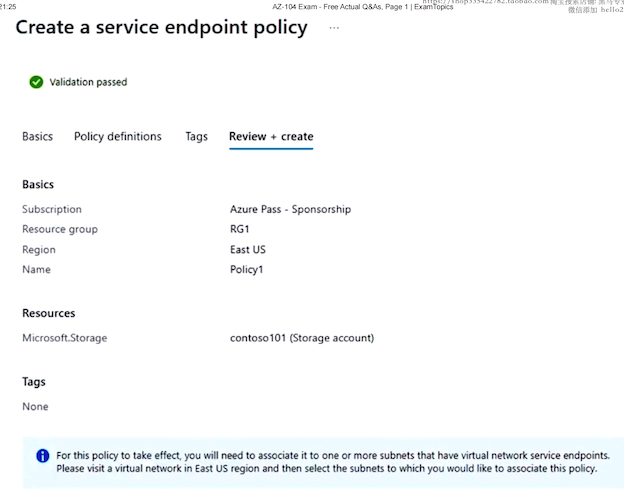

# AZ104 - 原题3

## Topic 5 

### Question #65

You have an Azure subscription that contains the public load balancers shown in the following table.

```
Name   SKU
LB1   Basic
LB2   Standard
```

You plan to create six virtual machines and to load balance requests to the virtual machines. Each load balancer will load balance three virtual
machines.

You need to create the virtual machines for the planned solution.
How should you create the virtual machines? To answer, select the appropriate options in the answer area.


NOTE: Each correct selection is worth one


Box 1: be created in the same availability set or virtual machine scale set

**The Basic tier is quite restrictive. A load balancer is restricted to a single availability set, virtual machine scale set, or a single machine.**

**Box 2: be connected to the same virtual network**


The Standard tier can span any virtual machine in a single virtual network, including blends of scale sets, availability sets, and machines


Standard SKU: any virtual machines or virtual machine scale sets in a single virtual network.


Basic SKU: Virtual machines in a single availability set or virtual machine scale set.

### Question #66

You have an on-premises data center and an Azure subscription. The data center contains two VPN devices. 

The subscription contains an Azure virtual network named VNet1. VNet1 contains a gateway subnet.

You need to create a site-to-site VPN. The solution must ensure that if a single instance of an Azure VPN gateway fails, or a single on-premises VPN device fails, the failure will not cause an interruption that is longer than two minutes.

What is the minimum number of public IP addresses, virtual network gateways, and local network gateways required in Azure? To answer, select the appropriate options in the answer area.


**Box 1: 2 -**

Two public IP addresses in the on-premises data center, and two public IP addresses in the VNET


**Box 2: 2 -**

Every Azure VPN gateway consists of two instances in an active-standby configuration. For any planned maintenance or unplanned disruption that happens to the active instance, the standby instance would take over (failover) automatically, and resume the S2S VPN or VNet-to-VNet
connections.

**Box 3: 2 -**

2 public IP addresses for the Azure virtual network gateways (active and standby). Each virtual network gateway requires a unique public IP address.


2 Azure virtual network gateways in the same virtual network (VNet1). **One gateway will be the active gateway, and the other will be the standby gateway.**

2 on-premises VPN devices (routers or VPN appliances). 

Configure two local network gateways in Azure, each representing one on-premises VPN device. **Associate the corresponding local network gateway with the active or standby virtual network gateway**


### Question #67

You have an Azure subscription that contains two virtual machines as shown in the following table


**You perform a reverse DNS lookup for 10.0.0.4 from VM2.**

Which FQDN will be returned?

* A. vm1.core.windows.net
* B. vm1.azure.com
* C. vm1.westeurope.cloudapp.azure.com
* **D. vm1.internal.cloudapp.net**

```
testadmin1@VMTEST1:~$ ping -c 5 VMTEST1
PING VMTEST1.qb3monnoaiyubgstehdkra0paa.ax.internal.cloudapp.net (10.0.0.4) 56(84) bytes of data.
64 bytes from vmtest1.internal.cloudapp.net (10.0.0.4): icmp_seq=1 ttl=64 time=0.013 ms
64 bytes from vmtest1.internal.cloudapp.net (10.0.0.4): icmp_seq=2 ttl=64 time=0.042 ms
64 bytes from vmtest1.internal.cloudapp.net (10.0.0.4): icmp_seq=3 ttl=64 time=0.040 ms
64 bytes from vmtest1.internal.cloudapp.net (10.0.0.4): icmp_seq=4 ttl=64 time=0.042 ms
64 bytes from vmtest1.internal.cloudapp.net (10.0.0.4): icmp_seq=5 ttl=64 time=0.044 ms
```

### Question #68

You have an app named App1 that is installed on two Azure virtual machines named VM1 and VM2. Connections to App1 are managed by using
an Azure Load Balancer.

The effective network security configurations for VM2 are shown in the following exhibit.


You discover that connections to App1 from 131.107.100.50 over TCP port 443 fail.

You verify that the Load Balancer rules are configured correctly.

You need to ensure that connections to App1 can be established successfully from 131.107.100.50 over TCP port 443.

**Solution: You create an inbound security rule that allows any traffic from the AzureLoadBalancer source and has a cost of 150**

Does this meet the goal?

**Answer A  Yes**

**The rule with priority 200 blocks all inbound traffic**

That involves the Azure Load Balancer health probe directed to the VM. 

That results in VM2 being considered unhealthy and the LB does not route traffic to it (hence the issue). By placing a rule with the priority 150 that allows them AzureLoadBalancer traffic tag, VM2 is discovered as functional/healthy, the LB directs traffic to it => problem solved.


What is happening here is the LB Health Probe of TCP 443 to VM1 & VM2 are getting blocked by Rule 200 so it thinks both VM1 and VM2 are down. 

Hence App1 is failing as the LB won't direct any 443 traffic anywhere as it considers all Hosts are down.


Make a new rule above 200 or move rule 65001 up to <200, so the Health Probe will start working again, it will find a health host and start to direct 443 traffic from 131.107.100.50 to it.

**App1 is alive!**

### Question #69

You have an Azure subscription that contains a policy-based virtual network gateway named GW1 and a virtual network named VNet1.

**You need to ensure that you can configure a point-to-site connection from an on-premises computer to VNet1.**

Which two actions should you perform? Each correct answer presents part of the solution.


* A. Add a service endpoint to VNet1
* B. Reset GW1
* **C. Create a route-based virtual network gateway**
* D. Add a connection to GW1
* **E. Delete GW1**
* F. Add a public IP address space to VNet1


C: A VPN gateway is used when creating a VPN connection to your on-premises network.

Route-based VPN devices use any-to-any (wildcard) traffic selectors, and let routing/forwarding tables direct traffic to different IPsec tunnels. It is typically built on router platforms where each IPsec tunnel is modeled as a network interface or VTI (virtual tunnel interface).

E: Policy-based VPN devices use the combinations of prefixes from both networks to define how traffic is encrypted/decrypted through IPsec tunnels. It is typically built on firewall devices that perform packet filtering. IPsec tunnel encryption and decryption are added to the packet
filtering and processing 

**Incorrect Answers:**

F: Point-to-Site connections do not require a VPN device or a public-facing IP address.


When you create the virtual network gateway for a VPN gateway configuration, you must specify a VPN type. The VPN type that you choose depends on the connection topology that you want to create. For example, a P2S connection requires a RouteBased VPN type

If you want to use a PolicyBased VPN type, you must use the Basic SKU. PolicyBased VPNs (previously called Static Routing) are not supported on any other SKU. PolicyBased Basic VPN Gateway does not support Point-to-Site connectivity

**The policy type VNG does not support Point to Site VPN .**

You cant have 2 VNG in the same VNET


**So the existing policy-based VNG must be deleted so you can create a route based VPN**

### Question #70

You have an Azure subscription that contains the resources in the following table:

```
Name      Type
VMRG    Resource group
VNetl     Virtual network
VNet2    Virtual network
VMS 	Virtual machine connected to VNetl
VM6	Virtual machine connected to ViNet2
```

In Azure, you create a private DNS zone named adatum.com. You set the registration virtual network to VNet2. 

The adatum.com zone is configured as shown in the following exhibit:


For each of the following statements, select Yes if the statement is true. Otherwise, select No.

* The A record for VM5 will be registered automatically in the adatum.com zone.      (No)
* VM5 can resolve VM9.adatum.com.    (No)
* VM6 can resolve VM9.adatum.com.    (Yes)


**Box 1: No -**

Azure DNS provides automatic registration of virtual machines from a single virtual network that's linked to a private zone as a registration
virtual network. VM5 does not belong to the registration virtual network though.

**Box 2: No -**

Forward DNS resolution is supported across virtual networks that are linked to the private zone as resolution virtual networks. VM5 does
belong to a resolution virtual network.

**Box 3: Yes -**

VM6 belongs to registration virtual network, and an A (Host) record exists for VM9 in the DNS zone.

By default, registration virtual networks also act as resolution virtual networks, in the sense that DNS resolution against the zone works from
any of the virtual machines within the registration virtual network.

* VNet1 (NOT A Registration Netvork) : VM5
* VNet2 (IS A Registration Netvork) : VM1, VM6 and VM9

1. VM5 is in VNet1 - answer is NO.
2. VM5 is in VNet1 - answer is NO.
3. VM6 is in VNet2 - answer is YES

### Question #71

You have an Azure subscription that contains the virtual networks shown in the following table.


For each of the following statements, select Yes if the statement is true. Otherwise, select No

* You can enable auto reqistration for Link2.
* You can add a virtual network link for VNET1 to Zone3.com.
* You can add a virtual network link for VNET2 to Zonel.com and enable auto registration.

A virtual network can be linked to private DNS zone as a registration or as a resolution virtual network

**Registration virtual network:**

A private DNS zone can have multiple registration virtual networks. However, every virtual network can only have one registration zone associated with it.

**Resolution virtual network:**

One private DNS zone can have multiple resolution virtual networks and a virtual network can have multiple resolution zones associated to it

**1.Yes**

No registration zone for VNET2.

**2.Yes**

A virtual network can have multiple resolution zones associated to it.

**3.Yes**

No registration zone for VNET2.

1. Y. You can click the checkbox to Enable Auto-Reg. Note: You can do this to any VNET as long as that VNET is not linked to another Zone with Auto-reg ON. So if VNET is in another zone but Auto-reg is OFF, then you can enable Auto-Reg in Only One Zone
2. Y. You can add Vnet1 to Zone3 but make sure Auto Reg is OFF. You cannot add Vnet1 to Zone3 with Auto Reg is ON.
3. Y. You can add Vnet2 to Zone1 and set to Auto Reg ON because VNET2 has no link yet to any zone with Auto Reg ON.

1. YES - you can enable auto registration for link2
2. YES - you can add virtual network link VNET1 to zone3
3. Yes - you can add virtual network link VNET2 to zone1.

### Question #72

**You plan to use an Azure Resource Manager template to deploy a virtual network named VNET1 that will use Azure Bastion.**

How should you complete the template? To answer, select the appropriate options in the answer area


* Subnet Name： **AzureBastionSubnet**
* AzureBastionSubnet addresses A subnet within your VNet address space with a /27 subnet mask. For example, 10.1.1.0/27


* Subnet Name | AzureBastionSubnet
* AzureBastionSubnet addresses | A subnet within your VNet address space with a subnet mask /26 or larger
	* For example, 10.1.1.0/26.

	
1. AzureBastionSubnet
2. 10.10.10.0/27

### Question #73

You manage a virtual network named VNet1 that is hosted **in the West US Azure region.**

VNet1 hosts two virtual machines named VM1 and VM2 that run Windows Server.

**You need to inspect all the network traffic from VM1 to VM2 for a period of three hours.**

**Solution: From Azure Network Watcher, you create a packet capture.**

Does this meet the goal?

* **A. Yes**
* B. No

**Correct Answer: A**

Network Watcher variable packet capture allows you to create packet capture sessions to track traffic to and from a virtual machine. Packet
capture helps to diagnose network anomalies both reactively and proactively. Other uses include gathering network statistics, gaining
information on network intrusions, to debug client-server communications and much more.

### Question #74

You need to inspect all the network traffic from VM1 to VM2 for a period of three hours.

**Solution: From Azure Network Watcher, you create a connection monitor.**

We need to inspect all the network traffic "from" VM1 "to" VM2 and not between the 2 VMs

Even if we were using Connection monitor, this one would inspect only network traffic over a specific port.

And for a period of 3 hours, packet capture session time limit default value is 18000 seconds or 5 hours.

**Correct solution: Meets the goal.**

- Solution: **From Azure Network Watcher, you create a packet capture**

**Incorrect solution: Does not meet the goal.**

- Solution: From Azure Monitor, **you create a metric on Network In and Network Out.**
- Solution: From Azure Network Watcher, **you create a connection monitor.**
- Solution: From Performance Monitor, **you create a Data Collector Set (DCS).**


### Question #76

You have an Azure subscription that contains the resources shown in the following table


**You need to load balance HTTPS connections to vm1 and vm2 by using lb1.**

Which three actions should you perform in sequence? To answer, move the appropriate actions from the list of actions to the answer area and
arrange them in the correct order


* 1) Remove the Public IP addresses. They are basic Public IPs and we're using a Standard Load Balancer which aren't compatible
* 2) Create a backend pool and health probes.
* 3) Create a load balancer rule.

### Question #77

**Solution: From Azure Monitor, you create a metric on Network In and Network Out.**

### Question #78

You have an app named App1 that is installed on two Azure virtual machines named VM1 and VM2. 

Connections to App1 are managed by using an Azure Load Balancer.

The effective network security configurations for VM2 are shown in the following exhibit


You discover that connections to App1 from 131.107.100.50 over TCP port 443 fail.

You verify that the Load Balancer rules are configured correctly.

You need to ensure that connections to App1 can be established successfully from 131.107.100.50 over TCP port 443.

**Solution: You create an inbound security rule that denies all traffic from the 131.107.100.50 source and has a priority of 64999.**

Does this meet the goal?

* A. Yes
* **B. No**

When an Azure Load Balancer get created, it will probe backend to detect if the backend service is healthy or not, the probe packet is sent from
source address "AzureLoadBalancer", the IP address of "AzureLoadBalancer" is always 168.63.129.16.

What is happening here is the LB Health Probe of TCP 443 to VM1 & VM2 are getting blocked by Rule 200 so it thinks both VM1 and VM2 are
down. Hence App1 is failing as the LB won't direct any 443 traffic anywhere as it considers all Hosts are down

Make a new rule above 200 or move rule 65001 up to <200, so the Health Probe will start working again, it will find a health host and start to direct 443 traffic from 131.107.100.50 to it. 

App1 is alive!

**as rule 200 will still block port 443.**

### Question #79

You have an Azure subscription that contains two on-premises locations named site1 and site2.

You need to connect site1 and site2 by using an Azure Virtual WAN.

Which four actions should you perform in sequence? To answer, move the appropriate actions from the list of actions to the answer area and
arrange them in the correct order.


**Create Virtual WAN > Create Hub > Create VPN Sites > Connect VPN sites to Hub**

* Create a virtual WAN
* Configure virtual hub Basic settings
* Configure site-to-site VPN gateway settings
* Create a site
* Connect a site to a virtual hub
* Connect a VPN site to a virtual hub

### Question #80


For each of the following statements, select Yes if the statement is true. Otherwise, select No

* Server2 resolves host2.contoso.com to 131.107.50.50.
* Server2 resolves host1.contoso.com to 131.107.10.15.
* Server3 resolves host2.contoso.com to 131.107.50.50.

No:    Server2 uses Server1 for DNS. Server1 has no host2.contoso.com record for 131.107.50.50. It would work if VNET1 has a virtual network link to the private zone contoso.com

Yes: Server2 uses Server1 for DNS. Server1 has a host1.contoso.com record for 131.107.10.15

No: Server3 uses 10.10.0.4 as DNS (inherited from VNET2). 10.10.0.4 (Server1) has no record for host2.contoso.com. The virtual network link for the
private zone contoso.com on VNET2 won't be used since the DNS from VNET1 is set on VNET2. VNET1 DNS is not aware of the private zone
contoso.com. It would work if VNET1 had a virtual network link to the private zone contoso.com.

### Question #81

You have a virtual network named VNet1 as shown in the exhibit. (Click the Exhibit tab.)


**No devices are connected to VNet1.**

**You plan to peer VNet1 to another virtual network named VNet2. VNet2 has an address space of 10.2.0.0/16.**

You need to create the peering.

What should you do first?

* **A. Modify the address space of VNet1.**
* B. Add a gateway subnet to VNet1.
* C. Create a subnet on VNet1 and VNet2.
* D. Configure a service endpoint on VNet2.

Correct. Modify the address space of VNET1, since it'd be overlapping with the one of VNET2 if you don't

### Question #82

You have the Azure virtual machines shown in the following table


**You need to ping VM2 from VM1.**

Which DNS names can you use to ping VM2?

* A. comp2.contoso.com and comp4.contoso.com only
* B. comp1.contoso.com, comp2.contoso.com, comp3.contoso.com, and comp4.contoso.com
* **C. comp2.contoso.com only**
* D. comp1.contoso.com and comp2.contoso.com only
* E. comp1.contoso.com, comp2.contoso.com, and comp4.contoso.com only

**Correct Answer C: comp2.contoso.com only**

A record: Is used to map a DNS/domain name to an IP

Comp3 is a CNAME for Comp1 - which refers to a TXT record. TXT records are not for name resolution. So neither, Comp1 and Comp3, do not
translate to the right IP address, 10.0.0.5. 

And that's what the the DNS name that we're looking for here is supposed to do.

### Question #83

You have a network security group (NSG) named NSG1 that has the rules defined in the exhibit. (Click the Exhibit tab.)


NSG1 is associated to a subnet named Subnet1. Subnet1 contains the virtual machines shown in the following table.

```
Name   IP address
VM1	  10.1.0.10
VM2    10.1.0.11
```

You need to add a rule to NSG1 to ensure that VM1 can ping VM2. The solution must use the principle of least privilege.

How should you configure the rule? To answer, select the appropriate options in the answer area


* Direction: Outbound
* Source 10.1.0.10 (VM1)
* Destination: 10.1.0.11 (VM2)
* Priority: 110

### Question #84

You have a computer named Computer1 that has a point-to-site VPN connection to an Azure virtual network named VNet1. The point-to-site connection uses a self-signed certificate.

From Azure, you download and install the VPN client configuration package on a computer named Computer2.

You need to ensure that you can establish a point-to-site VPN connection to VNet1 from Computer2.

**Solution: On Computer2, you set the Startup type for the IPSec Policy Agent service to Automatic.**

Does this meet the goal?

**Correct Answer: B**

Each client computer that connects to a VNet using Point-to-Site must have a client certificate installed. You generate a client certificate from the self-signed root certificate, and then export and install the client certificate. If the client certificate is not installed, authentication fails.

**the certificate needs to be installed on the machine you are counting from.**

Correct approach would be to export Cert from Computer1 and install it on Computer2

### Question #85

You have five Azure virtual machines that run Windows Server 2016. The virtual machines are configured as web servers.

You have an Azure load balancer named LB1 that provides load balancing services for the virtual machines.

You need to ensure that visitors are serviced by the same web server for each request.

What should you configure?

* **A. Session persistence to Client IP and protocol**
* B. Protocol to UDP
* C. Session persistence to None
* D. Floating IP (direct server return) to Enabled

### Question #86

You have an Azure subscription that uses the public IP addresses shown in the following table.


You need to create a public Azure Standard Load Balancer.

Which public IP addresses can you use?

* A. IP1, IP2, and IP3
* B. IP2 only
* **C. IP3 only**
* D. IP1 and IP3 only

A Basic Load Balancer can use the Basic SKU Public IP address's, but a Standard load balancer requires a Standard SKU Public IP address.

**Basic SKU IP can not be combined with standard LB.**

### Question #87

You have an Azure subscription.

You are deploying an Azure Kubernetes Service (AKS) cluster that will contain multiple pods. The pods will use kubernet networking.

You need to restrict network traffic between the pods.

What should you configure on the AKS cluster?

* A. the Azure network policy
* **B. the Calico network policy**
* C. pod security policies
* D. an application security group

The question describes “the pods will use kubernet networking.”

To provide network connectivity, AKS clusters can use kubenet (basic networking) or Azure CNI (advanced networking)

Azure Network Policies supports Azure CNI only. Calico Network Policies supports both Azure CNI (Windows Server 2019 and Linux) and kubernet (Linux).

### Question #88

You have an Azure subscription that contains a virtual network named VNet1. VNet1 uses an IP address space of 10.0.0.0/16 and contains the VPN Gateway and subnets in the following table:

```
Name        IP address range
Subnet0    10.0.0.0/24
Subnetl     10.0.1.0/24
Subnet2      10.0.2.0/24
GatewaySubnet   10.0.254.0/24
```

Subnet1 contains a virtual appliance named VM1 that operates as a router.

You create a routing table named RT1.

**You need to route all inbound traffic from the VPN gateway to VNet1 through VM1.**

How should you configure RT1? To answer, select the appropriate options in the answer area.

NOTE: Each correct selection is worth one point.


Correct Answer:

**Box 1: 10.0.0.0/16**

Address prefix destination-> Vnet 1 (Address space of Vnet1)

**Box 2: Virtual appliance**

Next hop type

VM1 ->Virtual Appliance. You can specify IP address of VM 1 when configuring next hop as Virtual appliance

**Box 3: Gateway Subnet**

Assigned to

This route is to be followed by Gateway Subnet for the incoming traffic. You can associate routing table to the Subnet from 

Route Table -> subnet ->Associate.

1. Address prefix- destination-> Vnet 1 (Address space of Vnet1)
2. Next Hop - VM1 ->Virtual Appliance (You can specify IP address of VM 1 when configuring next hop as virtual appliance)
3. Assignment - This route is to be followed by Gateway Subnet for the incoming traffic. You can associate routing table to the Subnet from RouteTable -> subnet ->Associate

### Question #89

You have five Azure virtual machines that run Windows Server 2016. The virtual machines are configured as web servers.

You have an Azure load balancer named LB1 that provides load balancing services for the virtual machines.

**You need to ensure that visitors are serviced by the same web server for each request.**

What should you configure?

* A. Floating IP (direct server return) to Enabled
* B. Floating IP (direct server return) to Disabled
* C. a health probe
* **D. Session persistence to Client IP and Protocol**

**Correct Answer: D**

With Sticky Sessions when a client starts a session on one of your web servers, session stays on that specific server. To configure An Azure LoadBalancer for Sticky Sessions set Session persistence to Client IP

### Question #90

You have an Azure subscription that contains the virtual machines shown in the following table:


VM1 and VM2 use public IP addresses. From Windows Server 2019 on VM1 and VM2, you allow inbound Remote Desktop connections.

Subnet1 and Subnet2 are in a virtual network named VNET1.

**The subscription contains two network security groups (NSGs) named NSG1 and NSG2. NSG1 uses only the default rules.**

NSG2 uses the default rules and the following custom incoming rule:

* ✑ Priority: 100
* ✑ Name: Rule1
* ✑ Port: 3389
* ✑ Protocol: TCP
* ✑ Source: Any
* ✑ Destination: Any
* ✑ Action: Allow

NSG1 is associated to Subnet1. NSG2 is associated to the network interface of VM2.

For each of the following statements, select Yes if the statement is true. Otherwise, select No.

* From the Internet, you can connect to VM1 by using Remote Desktop.   （No)
* From the Internet, you can connect to VM2 by using Remote Desktop.   （Yes)
* From VM1, you can connect to VM2 by using Remote Desktop   （Yes)

* No: VM1 has default rules which denies any port open for inbound rules
* Yes: VM2 has custom rule allowing RDP port
	* NSG2 has custom Rule1, allowing RDP port 3389 with TCP.
* Yes: VM1 and VM2 are in the same Vnet. by default, communication are allowed
	* VM1 and VM2 are in the same Vnet. By default, communication is allowed

### Question #91

You have an Azure subscription that contains two virtual machines named VM1 and VM2.

You create an Azure load balancer.

You plan to create a load balancing rule that will load balance HTTPS traffic between VM1 and VM2.

Which two additional load balancer resources should you create before you can create the load balancing rule? Each correct answer presents part of the solution


* A. a frontend IP address
* B. an inbound NAT rule
* C. a virtual network
* **D. a backend pool**
* **E. a health probe**

You can't create a LB without FrontEnd IP, so if we have a LB we also have a FrontEnd IP already. You can however create a LB without a backend pool and without any rules. 

**If you want to add a rule to your LB later you have to create a backend pool and health probe first.**

### Question #92

You have an on-premises network that contains a database server named dbserver1.

You have an Azure subscription.

You plan to deploy three Azure virtual machines. Each virtual machine will be deployed to a separate availability zone.

You need to configure an Azure VPN gateway for a site-to-site VPN. The solution must ensure that the virtual machines can connect to dbserver1.

Which type of public IP address SKU and assignment should you use for the gateway?

* A. a basic SKU and a static IP address assignment
* B. a standard SKU and a static IP address assignment
* **C. a basic SKU and a dynamic IP address assignment**

**VPN gateway supports only Dynamic**

- Basic Load Balancer: Virtual machines in a single availability set or virtual machine scale set.
- Standard Load Balancer: Any virtual machines or virtual machine scale sets in a single virtual network.
So in this case it's Standard

### Question #93

You have the Azure virtual machines shown in the following table.


For each of the following statements, select Yes if the statement is true. Otherwise, select No.


* From VM1, server1.contoso.com resolves to 131.107.3.3.   （Y）
* From VM2, server1.contoso.com resolves to 131.107.3.3.   （Y）
* From VM3, server2.contoso.com resolves to 131.107.2.4.    （Y）

**YES - For VM1,server1.contoso.com resolves to 131.107.3.3**

VM1 is connected to VNET1 which has Default(Azure-Provided) DNS Server and linked to Azure Private DNS Server contoso.com (131.107.3.3 and 131.107.3.4 DNS Servers). That means VM1 has these 2 DNS servers for resloving.

DNS Servers for VNET1

* server1.contoso.com = 131.107.3.3
* server2.contoso.com = 131.107.3.4


**YES - For VM2,server1.contoso.com resolves to 131.107.3.3**

VM2 is resolving a FQDN of server 1. The vnet DNS does not state it is contoso.com, so therefore resolving the FQDN would resolve correctly


**YES- For VM3,server2.contoso.com resolves to 131.107.2.4**

VM3 belongs to VNET3 has Custom DNS:192.168.0.5 IP of VM4 ( not takes from default Azure: the server1.contoso.com = 131.107.3.4 and server2.contoso.com = 131.107.3.4)

VM3 will resolve from VM4 (DNS Server1.contoso.com=131.107.2.3 and Server2.contoso.com=131.107.2.4)

### Question #94

You have two Azure virtual machines as shown in the following table.


You perform the following actions:

* fabrikam.com, you add a virtual network link to vnet1 and enable auto registration.
* For contoso.com, you assign vm1 and vm2 the Owner role.

For each of the following statements, select Yes if the statement is true. Otherwise, select No.

* The DNS A record for vm1 is added to contoso.com and has the IP address of 131.107.50.20.
* The DNS A record for vm1 is added to fabrikam.com and has the IP address of 10.0.1.4.
* The DNS A record for vm2 is added to fabrikam.com and has the IP address of 10.0.1.5.

* N = none of the actions in question added the VM1 record to contoso.com dns
* Y = vnet1 is linked and auto-rego is enabled, records get added automatically.
* Y = vnet1 is linked and auto-rego is enabled, records get added automatically.

### Question #95

You have an on-premises datacenter and an Azure subscription.

You plan to connect the datacenter to Azure by using ExpressRoute.

You need to deploy an ExpressRoute gateway. The solution must meet the following requirements:

* ✑ Support up to 10 Gbps of traffic.
* ✑ Support availability zones.
* ✑ Support FastPath.
* ✑ Minimize costs.

Which SKU should you deploy?

* A. ERGw1AZ
* B. ERGw2
* C. ErGw3
* **D. ErGw3AZ**

Correct Answer: D

**ErGw3Az supports FastPath.**

The following table shows the features supported across each gateway type.


### Question #96

You have a virtual network named VNET1 that contains the subnets shown in the following table:


* VM2 can connect to the TCP port 1433 services on VM1.   **(N)**
* VM1 can connect to the TCP port 1433 services on VM2.  **(Y)**
* VM2 can connect to the TCP port 1433 services on VM3.  **(Y)**


1. NO - VM1 has the NSG1 on Subnet1, which allows traffic over port 1433 between Subnet2 and Subnet1. BUT NSG2 also applied on NIC level for VM1 that blocks the traffic on port 1433. Hence No traffic allowed. Answer is NO.

2. YES - For VM2 there are no NSGs applied neither on subnet or NIC level hence all traffic is allowed

3. YES - For VM3 there are no NSGs applied neither on subnet or NIC level hence all traffic is allowed.

### Question #97

You have an Azure subscription named Subscription1.

Subscription1 contains the virtual machines in the following table:


**You apply RT1 to Subnet1 and Subnet2.**

For each of the following statements, select Yes if the statement is true. Otherwise, select No

* VM3 can establish a network connection to VM1.     **（Y）**
* If VM3 is turned off, VM2 can establish a network connection to VM1.    **（N）**
* VM1 can establish a network connection to VM2.   **（Y）**

IP forwarding enables the virtual machine a network interface is attached to:

Receive network traffic not destined for one of the IP addresses assigned to any of the IP configurations assigned to the network interface.

Send network traffic with a different source IP address than the one assigned to one of a network interface's IP configurations.

The setting must be enabled for every network interface that is attached to the virtual machine that receives traffic that the virtual machine needs to forward. 

A virtual machine can forward traffic whether it has multiple network interfaces or a single network interface attached to it.

**Box 1: Yes -**

The routing table allows connections from VM3 to VM1 and VM2. And as IP forwarding is enabled on VM3, VM3 can connect to VM1.


**Box 2: No -**

VM3, which has IP forwarding, must be turned on, in order for VM2 to connect to VM1.

**Box 3: Yes -**

The routing table allows connections from VM1 and VM2 to VM3. IP forwarding on VM3 allows VM1 to connect to VM2 via VM3.

* Y = RT is not applied to VM3. VM3 will have the default route between subnets in a vnet.
* N = VM2 > Subnet2 has RT applied to it. VM3 is the next hop which is turned off.
* Y = VM3 has has IP forwarding enabled which can fwd traffic from VM1 to VM2.


### Question #98

Your on-premises network contains an SMB share named Share1.

You have an Azure subscription that contains the following resources:

* ✑ A web app named webapp1
* ✑ A virtual network named VNET1

**You need to ensure that webapp1 can connect to Share1.**

What should you deploy?

* A. an Azure Application Gateway
* B. an Azure Active Directory (Azure AD) Application Proxy
* **C. an Azure Virtual Network Gateway**

**Correct Answer: C**

A Site-to-Site VPN gateway connection can be used to connect your on-premises network to an Azure virtual network over an IPsec/IKE (IKEv1 or IKEv2) VPN tunnel. 

This type of connection requires a VPN device, a VPN gateway, located on-premises that has an externally facing public IP address assigned to it.

* A: Application Gateway is for http, https and Websocket - Not SMB
* B: Application Proxy is also for accessing web applications on-prem - Not SMB. Application Proxy is a feature of Azure AD that enables users to access on-premises web applications from a remote client.


### Question #99

You plan to deploy several Azure virtual machines that will run Windows Server 2019 in a virtual machine scale set by using an Azure Resource Manager template.

You need to ensure that NGINX is available on all the virtual machines after they are deployed.

What should you use?


* A. the Publish-AzVMDscConfiguration cmdlet
* B. Azure Application Insights
* **C. Azure Custom Script Extension**
* D. the New-AzConfigurationAssignement cmdlet

**Correct Answer: C**

1. a Desired State Configuration (DSC) extension
2. Azure Custom Script Extension

The question can have other incorrect answer options, including the following:

* ✑ the Publish-AzVMDscConfiguration cmdlet
* ✑ Azure Application Insights

### Question #100

Your on-premises network contains a VPN gateway.

You have an Azure subscription that contains the resources shown in the following table.


You need to ensure that all the traffic from VM1 to storage1 travels across the Microsoft backbone network.

What should you configure？

* A. a network security group (NSG)
* **B. service endpoints**
* C. Azure Peering Service
* D. Azure Firewall

Service Endpoints allow you to extend the Azure virtual network's private address space to Azure services, such as Azure Storage. 

By enabling Service Endpoints, the traffic between VM1 and storage1 remains within the Azure network fabric, utilizing the Microsoft backbone network.


### Question #101

You plan to deploy route-based Site-to-Site VPN connections between several on-premises locations and an Azure virtual network.

Which tunneling protocol should you use?

* A. IKEv1
* B. PPTP
* **C. IKEv2**
* D. L2TP

**Correct Answer: C**


A Site-to-Site (S2S) VPN gateway connection is used to connect your on-premises network to an Azure virtual network over an IPsec/IKE (IKEv1 or IKEv2) VPN tunnel.

**IKEv2 supports 10 S2S connections, while IKEv1 only supports 1.**

### Question #102

You have an Azure subscription that contains the resources shown in the following table.


You configure Azure Site Recovery to replicate VM1 between the US East and West US regions.

**You perform a test failover of VM1 and specify VNET2 as the target virtual network.**

When the test version of VM1 is created, to which subnet will the virtual machine be connected?

* A. TestSubnet1
* **B. DemoSubnet1**
* C. RecoverySubnetA
* D. RecoverySubnetB

The subnet of the target VM is selected based on the name of the subnet of the source VM

- If a subnet with the same name as the source VM subnet is available in the target network, that subnet is set for the target VM.
- If a subnet with the same name doesn't exist in the target network, the first subnet in the alphabetical order is set as the target subnet

### Question #103

You have five Azure virtual machines that run Windows Server 2016. The virtual machines are configured as web servers.

**You have an Azure load balancer named LB1 that provides load balancing services for the virtual machines.**

You need to ensure that visitors are serviced by the same web server for each request.

What should you configure?


* A. Protocol to UDP
* B. Session persistence to None
* C. Floating IP (direct server return) to Disabled
* **D. Session persistence to Client IP**


Session persistence: Client IP - Traffic from the same client IP is routed to the same backend instance

### Question #106

You have an Azure subscription that contains 20 virtual machines, a network security group (NSG) named NSG1, and two virtual networks named

VNET1 and VNET2 that are peered.

**You plan to deploy an Azure Bastion Basic SKU host named Bastion1 to VNET1.**

You need to configure NSG1 to allow inbound access to the virtual machines via Bastion1.

Which port should you configure for the inbound security rule?

**Selected Answer: B**

Azure Bastion's Communication: Azure Bastion, regardless of SKU, uses HTTPS (port 443) to establish secure connections to virtual machines within a virtual network. It doesn't interact directly with ports like 22 (SSH), 389 (LDAP), or 8080 (HTTP).

NSG Configuration: **To enable inbound access to the virtual machines via Bastion1, you need to create an inbound security rule in NSG1 that allows traffic on port 443 from Bastion1's IP address or subnet.**

* Port 22 (SSH): This is typically used for direct SSH connections, but Bastion doesn't use it for its own communication.
* Port 389 (LDAP): This is used for LDAP directory services, not Bastion's functionality.
* Port 8080 (HTTP): This is sometimes used for web services, but Bastion uses HTTPS (port 443) for secure connections.

### Question #107

Your network contains an on-premises Active Directory Domain Services (AD DS) domain named contoso.com. The domain contains the servers shown in the following table


You plan to migrate contoso.com to Azure.

You create an Azure virtual network named VNET1 that has the following settings:

* Address space: 10.0.0.0/16
* Subnet:
* Name: Subnet1
* IPv4: 10.0.1.0/24

You need to move DC1 to VNET1. The solution must ensure that the member servers in contoso.com can resolve AD DS DNS names.


How should you configure DC1? To answer, select the appropriate options in the answer area.

- Obtain an IP address automatically
- Configure VNET1 to use a custom DNS server

**1) Obtain an IP address automatically**

The first 4 IP addresses within a subnet space are getting reserved for Azure automatically. Thus, 10.0.1.3 can't be the right answer. 10.0.2.1 is in the VNET space but falls out of the subnet space. 192.168.2.1 is just out of the VNET.

**2) Configure VNET1 to use a custom DNS server**

This VNET1 should use our pre-created DNS server as its DNS server so that the member servers in contoso.com can resolve AD DS DNS names

**IP address: 10.0.1.3 shouldn't able to be use**

Azure reserves the first four and last IP address for a total of 5 IP addresses within each subnet.

For example, the IP address range of 192.168.1.0/24 has the following reserved addresses:

* 192.168.1.0 : Network address
* 192.168.1.1 : Reserved by Azure for the default gateway
* 192.168.1.2, 192.168.1.3 : Reserved by Azure to map the Azure DNS IPs to the VNet space
* 192.168.1.255 : Network broadcast address.

### Question #109

You have an Azure subscription that contains the virtual networks shown in the following table


You need to deploy an Azure firewall named AF1 to RG1 in the West US Azure region
.
To which virtual networks can you deploy AF1?

* A. VNET1, VNET2, VNET3, and VNET4
* B. VNET1 and VNET2 only
* **C. VNET1 only**
* D. VNET1, VNET2, and VNET4 only
* E. VNET1 and VNET4 only

C. VNET1 only

### Question #110

**You have an on-premises network.**

You have an Azure subscription that contains three virtual networks named VNET1. VNET2. and VNET3. The virtual networks are peered and connected to the on-premises network. The subscription contains the virtual machines shown in the following table.


**You need to monitor connectivity between the virtual machines and the on-premises network by using Connection Monitor.**

What is the minimum number of connection monitors you should deploy?

* A. 1
* **B. 2**
* C. 3
* D. 4

**Connection monitor resource: A region-specific Azure resource**

Select a region for your connection monitor. You can select only the source VMs that are created in this region.

As we have two regions, we need to create to connection monitors.

### Question #111

You plan to deploy the following Azure Resource Manager (ARM) template.


For each of the following statements, select Yes if the statement is true. Otherwise, select No.

* LB1 will be connected to a subnet named VNET1/netname
* LB1 can be deployed only to the resource group that contains VNET1
* The value of the sku variable can be provided as a parameter when the template is deployed from a command prompt


* Box 1: instead of "netname" there should be the value of netname variable

**Box 1: NO - the value of 'netname' is 'App1', so it's created in the App1 subnet (not netname)**

* Box2: Yes. On creation you'll need to specify the vnet RG.

Y - the answer uses incorrectly "the resource group" when "a resource group" was meant. It is obvious that a VNET with name VNET1 is needed here since it is the value of the variable. So this VNET must be present in whatever RG this will be deployed to. It does not matter that there is no mention of resource groups.

There's only one resource group specified: East US. So from the template it will be automatically assumed that it needs to find the resource in
the one you're deploying to

* Box 3: No, can't have a variable as a parameter.

 'sku' is a variable, not a parameter - so you can't use it as a parameter.
 
###  Question #112

You have an Azure subscription that contains a storage account. The account stores website data.

You need to ensure that inbound user traffic uses the Microsoft point-of-presence (POP) closest to the user's location.

What should you configure?

* A. private endpoints
* B. Azure Firewall rules
* **C. Routing preference**
* D. load balancing

Routing preference in Azure Traffic Manager allows you to specify how to route traffic to your Azure service endpoints based on various criteria, such as the geographic location of the client or the endpoint, the performance of the endpoint, or the priority of the endpoint.

### Question #113

You have two Azure virtual machines named VM1 and VM2 that run Windows Server. The virtual machines are in a subnet named Subnet1. Subnet1 is in a virtual network named VNet1.

You need to prevent VM1 from accessing VM2 on port 3389.

What should you do?

* **A. Create a network security group (NSG) that has an outbound security rule to deny destination port 3389 and apply the NSG to the network interface of VM1.**
* B. Configure Azure Bastion in VNet1.
* C. Create a network security group (NSG) that has an outbound security rule to deny source port 3389 and apply the NSG to Subnet1.
* D. Create a network security group (NSG) that has an inbound security rule to deny source port 3389 and apply the NSG to Subnet1.


A: The rule works although it will prevent VM1 from connecting to anything on 3389 they way it is described in the question (no limit to the destination IP detailed)

Configuring a Bastion will do nothing to prevent VM1 from accessing VM2 in anyway.

C & D are wrong as they are SOURCE port Deny not destination port Deny.

A connection to remote port of 3389 is not going to be from a source port of 3389 (especially if RDP is already listening on these VMs as that port will be unavailable as a source port), it could be any port in 1024-65535.

### Question #114

You have an Azure subscription that contains the resources shown in the following table.


You need to manage outbound traffic from VNET1 by using Firewall1.

What should you do first?


* A. Configure the Hybrid Connection Manager.
* B. Upgrade ASP1 to the Premium SKU.
* **C. Create a route table.**
* D. Create an Azure Network Watcher.

Route all traffic to the firewall

When you create a virtual network, Azure automatically creates a default route table for each of its subnets and adds system default routes to the table. In this step, you create a user-defined route table that routes all traffic to the firewall, and then associate it with the App Service subnet in the integrated virtual network.

### Question #115

you have an Azure subscription that contains the resources shown in the following table.

```
Name    Type
VM1      Virtual machine
App1     Web app
contoso.com   Azure Active Directory Domain Services (Azure AD DS) domain
```

All the resources connect to a virtual network named VNet1.

You plan to deploy an Azure Bastion host named Bastion1 to VNet1.

Which resources can be protected by using Bastion1?

* **A. VM1 only**
* B. contoso.com only
* C. App1 and contoso.com only
* D. VM1 and contoso.com only
* E. VM1, App1, and contoso.com

Bastion provides secure RDP and SSH connectivity to all of the VMs in the virtual network in which it is provisioned.

Using Azure Bastion protects your virtual machines from exposing RDP/SSH ports to the out-side world, while still providing secure access using RDP/SSH

"Protection against port scanning : Your VMs are protected against port scanning by rogue and malicious users because you don't need to expose the VMs to the internet."

Bastion provides secure RDP and SSH connectivity to all of the VMs in the virtual network in which it is provisioned. Using Azure Bastion protects your virtual machines from exposing RDP/SSH ports to the outside world, while still providing secure access using RDP/SSH.


### Question #118

You have an Azure subscription that contains 10 virtual machines and the resources shown in the following table


You need to ensure that Bastion1 can support 100 concurrent SSH users. The solution must minimize administrative effort.

What should you do first?

* A. Resize the subnet of Bastion1
* B. Configure host scaling.
* C. Create a network security group (NSG)
* **D. Upgrade Bastion1 to the Standard SKU**

When you configure Azure Bastion using the Basic SKU, two instances are created. If you use the Standard SKU, you can specify the number of instances. This is called host scaling

Each instance can support 20 concurrent RDP connections and 40 concurrent SSH connections for medium workloads. Once the concurrent sessions are exceeded, an additional scale unit (instance) is required.

### Question #120

You have a Windows 11 device named Device and an Azure subscription that contains the resources shown in the following table.

* VNET1   Virtual network
* VM1    Virtual machine that runs Windows Server 2022 and does NOT have a public IP address  / Connected to VNET1
* Bastion1   Azure Bastion Basic SKU host connected to VNET1


Device1 has Azure PowerShell and Azure Command-Line Interface (CLI) installed.

From Device1, you need to establish a Remote Desktop connection to VM1.

Which three actions should you perform in sequence? To answer, move the appropriate actions from the list of actions to the answer area and arrange them in the correct order

Correct Answer:

* Upgrade Bastion1 to the Standard SkU.
* From Bastion1, select Native Client Support.
* From Azure CLI on Device1, run a network bastion rdp.

Azure Bastion is a service you deploy that lets you connect to a virtual machine using your browser and the Azure portal, or via the native SSH or RDP client already installed on your local computer.

The native client feature lets you connect to your target VMs via Bastion using Azure CLI, and expands your sign-in options to include local SSH key pair and Azure Active Directory (Azure AD).

Using the native client requires the Standard SKU tier for Azure Bastion. First, we need to upgrade the SKU of our Azure Bastion instance.

Second, we need to enable the native client support from the configuration settings of Bastion1 in the Azure Portal.

Third, we need to sign in to our Azure account and select the subscription containing the Bastion resource as shown bel

```
az login
az account list
az account set --subscription "<subscription ID>
```

Lastly, we run the following command to connect via RDP. You’ll then be prompted to input your credentials. You can use either a local
username and password, or your Azure AD credentials.

```
az network bastion rdp --name "<BastionName>" --resource-group "<ResourceGroupName>" --target-resource-id "<VMResourceId>"
```

### Question #122

You have an Azure subscription that has the public IP addresses shown in the following tables


You plan to deploy an Azure Bastion Basic SKU host named Bastion1.

Which IP addresses can you use?

* **A. IP1 only**
* B. IP1 and IP2 only
* C. IP3, IP4, and IP5 only
* D. IP1, IP2, IP4, and IP5 only
* E. IP1, IP2, IP3, IP4, and IP5


**IP1 - IPv4 - Static - Standard - *Regional* -OK**

**IP2  - IPv4 - Static - Standard - _Global_:**

Error during the selection in the interface - A Global Tier PublicIPAddress cannot be attached to Bastions.


**IP3  IPv4 - Static - Basic - Regional**

Error during the selection in the interface - Static public IP addresses cannot be associated.

**IP4 - IPv4 - Dynamic - Basic - Regional**
Error during the selection in the interface - The SKU type for the public IP address does not match the SKU type of the load balancer (?? I don't
know why this message).

**IP5 - IPv6 - Static - Standard - Regional:**

Error during deployment (The selected IPv6 public IP address is not supported for Azure Bastion. To fix this, please recreate your Azure Bastion with
an IPv4 public IP address. (Code: PublicIpAddressVersionNotSupported))


### Question #124

You have five Azure virtual machines that run Windows Server 2016. The virtual machines are configured as web servers.

You have an Azure load balancer named LB1 that provides load balancing services for the virtual machines.

You need to ensure that visitors are serviced by the same web server for each request.

What should you configure?


* A. Floating IP (direct server return) to Enabled
* B. Idle Time-out (minutes) to 20
* C. a health probe
* **D. Session persistence to Client IP**

### Question #125

You have two Azure subscriptions named Sub1 and Sub2.

Sub1 contains a virtual machine named VM1 and a storage account named storage1.

VM1 is associated to the resources shown in the following table.

```
Name    Type
Disk			Operating sustem disk
Netint1   Network interface
VNet1		Virtual network
```

You need to move VM1 to Sub2.

Which resources should you move to Sub2?


* A. VM1, Disk1, and NetInt1 only
* B. VM1, Disk1, and VNet1 only
* C. VM1, Disk1, and storage1 only
* **D. VM1, Disk1, NetInt1, and VNet1**


In the given scenario, **VM1 is associated with the resources Disk1 (OS Disk), NetInt1 (Network Interface), and VNet1 (Virtual Network), and the
storage account named storage1 is not associated with VM1.**

Therefore, to move VM1 to Sub2, you need to move the following resources

* VM1: This is the virtual machine that you want to move to Sub2.
* Disk1: This is the OS disk for VM1, and it contains the operating system and boot files.
* NetInt1: This is the network interface that is attached to VM1 and provides connectivity to the virtual network.
* VNet1: This is the virtual network that is associated with VM1, and it provides the network connectivity to the virtual machine.


### Question #129

You plan to deploy several Azure virtual machines that will run Windows Server 2019 in a virtual machine scale set by using an Azure Resource
Manager template.

You need to ensure that NGINX is available on all the virtual machines after they are deployed.

What should you use?


* A. the Publish-AzVMDscConfiguration cmdlet
* B. a Microsoft Endpoint Manager device configuration profile
* C. Azure Application Insights
* **D. a Desired State Configuration (DSC) extension**
	* **A. Azure Custom Script Extension**

### Question #131

You have an Azure subscription that contains a Recovery Services vault named Vault1.

You need to enable multi-user authorization (MAU) for Vault1.

Which resource should you create first?


* A. an administrative unit
* B. a managed identity
* **C. a resource guard**
* D. a custom Azure role


Before you start

* Testing scenarios
* Create a Resource Guard
* Enable MUA on a Recovery Services vault
* Protected operations on a vault using MUA
* Authorize critical operations on a vault
* Disable MUA on a Recovery Services vault

### Question #132


You have an app named App1 that is installed on two Azure virtual machines named VM1 and VM2. **Connections to App1 are managed by using
an Azure Load Balancer**.

The effective network security configurations for VM2 are shown in the following exhibit


**You discover that connections to App1 from 131.107.100.50 over TCP port 443 fail.**

You verify that the Load Balancer rules are configured correctly

**You need to ensure that connections to App1 can be established successfully from 131.107.100.50 over TCP port 443.**

**Solution: You create an inbound security rule that allows any traffic from the AzureLoadBalancer source and has a priority of 150**

Does this meet the goal?

* A. Yes
* **B. No**

**Correct Answer: B - No**


**Answer is 'NO' B, there is rule in place to allow 131.107.100.50 over TCP port 443 with higher priority of 100. Adding a new rule of priority of 150 will not made any difference**

### Question #133

Your on-premises network contains a VPN gateway.

You have an Azure subscription that contains the resources shown in the following table

**You need to ensure that all the traffic from VM1 to storage1 travels across the Microsoft backbone network.**

What should you configure?

* A. Azure Application Gateway
* **B. service endpoints**
* C. Azure AD Application Proxy
* D. Azure Virtual WAN

Virtual Network (VNet) service endpoint provides secure and direct connectivity to Azure services over an optimized route over the Azure
backbone network. Endpoints allow you to secure your critical Azure service resources to only your virtual networks. Service Endpoints enables
private IP addresses in the VNet to reach the endpoint of an Azure service without needing a public IP address on the VNet."

"Virtual Network (VNet) service endpoint provides secure and direct connectivity to Azure services over an optimized route over the Azure
backbone network.

### Question #134

You create an Azure VM named VM1 that runs Windows Server 2019.

VM1 is configured as shown in the exhibit. (Click the Exhibit tab.)、


**You need to enable Desired State Configuration for VM1.**

What should you do first?

* A. Connect to VM1.
* **B. Start VM1.**
* C. Capture a snapshot of VM1.
* D. Configure a DNS name for VM1

**Selected Answer: B**

If we need to connect to the VM, it should be running. The provided screenshot shows that it is stopped.

### Question #135

You have an Azure subscription that contains the virtual networks shown in the following table


**You plan to create a container app named contapp1 in the East US Azure region.**

You need to create a container app environment named con-env1 that meets the following requirements:

*  Uses its own virtual network.
* Uses its own subnet.
* Is connected to the smallest possible subnet

**To which virtual networks can you connect con-env1, and which subnet mask should you use?**


**Its VNET 3 only and /23**

So we need a /23 mask, this means 512 IPs

**VNET 1**

- VNET 1   10.1.128.0/23 = 10.1.128.0 - 10.1.129.255 (512 IPs)
- Sub 1  10.1.128.0/24 = 10.1.128.0 - 10.1.128.255 (256)
- Not enough IPs available

**VNET 2**

- VNET 2： 192.168.0.0/16 = 192.168.0.0-192.168.255.255
- Sub21： 192.168.0.0 /17 = 192.168.0.0 - 192.168.127.255
- Sub22 192.168.128.0/17 = 192.168.128.0 - 192.168.255.255
- The subnets take out the whole range of VNET 2

**VNET 3**

- VNET 3 172.16.0.0/16 = 172.16.0.0 - 172.16.255.255
- Sub3 172.16.1.0/24 = 172.16.1.0 - 172.16.1.255
- VNET 3 still has most of the range for a /23 available. 

For example we could make the following /23 subnet: 172.16.2.0/23 = 172.16.2.0 -
172.16.3.255

container apps need at least 512 IP addresses:

* 1- Vnet 1 does not have enough the remaining from subnet 1 will be 256.
* 2-Vnet2 the is full equipied and we do not have any IPs available
* 3- Vnet3 is having 65536 IPs and only equipied with 512 IPs so we still have so much space to host our ( /23) app container

### Question #136

You have an Azure subscription that contains the virtual networks shown in the following table.

* Name    Location
* Vnet1   US East
* Vnet2    US East
* Vnet3   US East
* Vnet4   UK South
* Vnet5   UK South
* Vnet6   UK South
* Vnet7    Asia East
* Vnet8   Asia East
* Vnet9   Asia East
* Vnet10  Asia East

All the virtual networks are peered. Each virtual network contains nine virtual machines.

**You need to configure secure RDP connections to the virtual machines by using Azure Bastion.**

What is the minimum number of Bastion hosts required?

* **A. 1**
* B. 3
* C. 9
* D. 10

Azure Bastion and VNet peering can be used together. When VNet peering is configured, you don't have to deploy Azure Bastion in each peered VNet. This means if you have an Azure Bastion host configured in one virtual network (VNet), it can be used to connect to VMs deployed in a peered VNet without deploying an additional bastion host. For more information about VNet peering, see About virtual network peering.

**Azure Bastion works with the following types of peering**

**Global virtual network peering: Connecting virtual networks across Azure regions**


### Question #137

You have an Azure subscription that contains the virtual networks shown in the following table


**Each virtual machine contains only a private IP address.**

You create an Azure bastion for VNet1 as shown in the following exhibit.


* The Remote Desktop Connection client (mstscexe) can be used to connect to VM1 through Bastion1.
* The Azure portal can use SSH to connect to VM2 through Bastion1
* The Azure portal can be used to connect to VM3 through Bastion1


**the 1st is "No"**

mstsc is a native client and is supported only by Standard Bastion

> Basic SKU cannot connect to VM using a native client

**the 2nd is "Yes"?**

if the poor wording means connecting through Azure Portal by SSH, that's what Basic Bastion supports.

**the 3rd is "No"**

No peering from the Bastion enabled Vnet1

### Question #138

You have an Azure subscription that contains the virtual networks shown in the following table


**You create a service endpoint policy named Policy1 in the South Central US Azure region to allow connectivity to all the storage accounts in the subscription.**


For each of the following statements, select Yes if the statement is true. Otherwise, select No


* Policy1 can be applied to Subnet3.    (Y)
* Only storage1 and storage2 can be accessed from VNet2.  (N)
* Only storage2 can be accessed from VNet3.  (N)

**1) YES**

Virtual networks must be in the same region as the service endpoint policy.


**NO -**

By default, if no policies are attached to a subnet with endpoints, you can access all storage accounts in the service as VNET2 is in diff region this policy is definetly not applied to subnet 2


**3) NO -**

Policy allows all storage accounts + IMHO its not full vnet3 to be considered.


### Question #140

You have an Azure subscription that contains a resource group named RG1 and a virtual network named VNet1.

You plan to create an Azure container instance named container1.

You need to be able to configure DNS name label scope reuse for container1.

What should you configure for container1?

* A. the private networking type
* **B. the public networking type**
* C. a new subnet on VNet1
* D. a confidential SKU


Public networking type allows you to assign a DNS name label to the container instance that is globally unique within Azure, and it's accessible from the internet. This is typically used when you want to expose a service hosted in a container to the public.

Private networking type would not allow you to configure DNS name label scope reuse because it doesn't expose the container instance to the public internet, and it typically operates within a virtual network (VNet) for private communication.

Creating a new subnet on VNet1 (Option C) is related to configuring the network settings of the virtual network and isn't directly related to configuring DNS name label scope reuse for the container instance.

A confidential SKU (Option D) is not related to DNS name label scope reuse or networking configurations. It is used for specific security and confidentiality requirements.

### Question #141

You have the Azure virtual machines shown in the following table


VNET1, VNET2, and VNET3 are peered.

VM4 has a DNS server that is authoritative for a zone named contoso.com and contains the records shown

* Name. Type. Value
* * Server1. A. 131.107.2.3
* * Server2. A. 131.107.2.4


For each of the following statements, select Yes if the statement is true. Otherwise, select No.

* Policy1 can be applied to Subnet3.
* Only storage1 and storage2 can be accessed from VNet2.
* Only storage2 can be accessed from VNet3.

YES -For VM1,server1.contoso.com resolves to 131.107.3.3

VM1 is connected to VNET1 which has Default(Azure-Provided) DNS Server and linked to Azure Private DNS Server contoso.com (131.107.3.3 and 131.107.3.4 DNS Servers). 

That means VM1 has these 2 DNS servers for resloving. DNS Servers for VNET1


* server1.contoso.com = 131.107.3.3
* server2.contoso.com = 131.107.3.4


**VM2 belongs to VNET2 has Custom DNS:192.168.0.5 IP of VM4 ( not takes from dedault Azure: the server1.contoso.com = 131.107.3.4 and server2.contoso.com = 131.107.3.4) -NO**


* VM2 will resolve from VM4 (DNS Server1.contoso.com=131.107.2.3 and Server2.contoso.com=131.107.2.4)
* YES- For VM3,server2.contoso.com resolves to 131.107.2.4


### Question #142

You have an Azure subscription that contains a resource group named RG1.

You plan to create an Azure Resource Manager (ARM) template to deploy a new virtual machine named VM1. VM1 must support the capture of performance data.

You need to specify resource dependencies for the ARM template.

In which order should you deploy the resources? T

* virtual network
* network interface
* virtual machine
* Azure Monitor extension


* First, create a network
* 2nd, create an interface
* 3rd, create VM
* 4th, install an extension.

### Question #144

You have an Azure subscription that contains the virtual networks shown in the following table.


All the virtual machines have only private IP addresses.

**You deploy an Azure Bastion host named Bastion1 to VNet1.**

To which virtual machines can you connect through Bastion1?

* A. VM1 only
* **B. VM1 and VM2 only**
* C. VM1 and VM3 only
* D. VM1, VM2, and VM3

VM1 and VM2, because they are peered.

### Question #146

You have an Azure subscription.

You plan to migrate 50 virtual machines from VMware vSphere to the subscription.

You create a Recovery Services vault.

What should you do next?

* A. Configure an extended network.
* B. Create a recovery plan.
* C. Deploy an Open Virtualization Application (OVA) template to vSphere.
* **D. Configure a virtual network.**


Correct Answer (D) - In order to migrate 50 VMs to Azure using Azure Site Recovery, one needs:

- Recovery Service Vault (which is created)
- Configure virtual network
- configure extended network (next step after)

### Question #147

You have an Azure subscription that contains the virtual networks shown in the following table.

```
Name    Location    Peered with
VNet1   East US      VNet2
VNet2   East US     VNet1
```

Each virtual network has 50 connected virtual machines.

You need to implement Azure Bastion. The solution must meet the fallowing requirements


* Support host scaling.
* Support uploading and downloading files.
* Support the virtual machines on both VNet1 and VNet2.
* Minimize the number of addresses on the Azure Bastion subnet


How should you configure Azure Bastion? To answer, select the options in the answer area.


**Subnet size: /26**

The recommended subnet size for Azure Bastion is /26

* "Subnet size must be /26 or larger (/25, /24 etc.)."
* "For host scaling, a /26 or larger subnet is recommended. Using a smaller subnet space limits the number of scale units"
* "For Azure Bastion resources deployed on or after November 2, 2021, the minimum AzureBastionSubnet size is /26 or larger (/25, /24, etc.)"


**Public IP: Standard SKU with a static allocation**

Only Azure Bastion Standard SKU supports 'Host scaling' and 'Upload or download files'. Besides that, Public IP address recomended by Microsoft
must be Standard and Static

### Question #148

You have an Azure subscription that contains the virtual networks shown in the following table.

```
Name     Location
VNet1	   West US
VNet2   Central Europe
```

You need to ensure that all the traffic between VNet1 and VNet2 traverses the Microsoft backbone network

What should you configure?

* A. a private endpoint
* **B. peering**
* C. Express Route
* D. a route table

**Selected Answer: B**

The traffic between virtual machines in peered virtual networks uses the Microsoft backbone infrastructure

ExpressRoute private peering supports connectivity between multiple virtual networks. Although this behavior happens by default when linking
virtual networks to the same ExpressRoute circuit, Microsoft doesn't recommend this solution. To establish connectivity between virtual networks,
VNet peering should be implemented instead for the best performance possible.

* ExpressRoute is for on-prem to Azure, not in-between Azure.
* Therefore -> peering


### Question #149

You have the Azure virtual networks shown in the following table.


Which virtual networks can you peer with VNet1?

* A. VNet2, VNet3, and VNet4
* B. VNet2 only
* **C. VNet3 and VNet4 only**
* D. VNet2 and VNet3 only


**C - VNET 3 and VNET4**

* **VNet3 and VNet4 only**.
* **VNet2 range overlaps VNet1**

### Question #150


You have an Azure subscription.

You are creating a new Azure container instance that will have the following settings:

* • Container name: cont1
* • SKU: Standard
* • OS type: Windows
* • Networking type: Public
* • Memory (GiB): 2.5
* • Number of CPU cores: 2

You discover that the Private setting for Networking type is unavailable

**You need to ensure that cont1 can be configured to use private networking.**

Which setting should you change?

* A. Memory (GiB)
* B. Networking type
* C. Number of CPU cores
* **D. OS type**
* E. SKU

**Private networking is not supported for Windows containers.**

## Topic 6 - Question Set 6

### Question #1

You have an Azure subscription that has a Recovery Services vault named Vault1. The subscription contains the virtual machines shown in the
following table


You plan to schedule backups to occur every night at 23:00.

Which virtual machines can you back up by using Azure Backup


* A. VM1 and VM3 only
* **B. VM1, VM2, VM3 and VM4**
* C. VM1 and VM2 only
* D. VM1 only

* Azure Backup supports backup of 64-bit Windows server operating system from Windows Server 2008.
* Azure Backup supports backup of 64-bit Windows 10 operating system.
* Azure Backup supports backup of 64-bit Ubuntu Server operating system from Ubuntu 12.04.
* Azure Backup supports backup of VM that are shutdown or offline.

**The Backup service installs the backup extension whether or not the VM is running**

### Question #2

You have an Azure subscription that contains a virtual machine named VM1.

You plan to deploy an Azure Monitor alert rule that will trigger an alert when CPU usage on VM1 exceeds 80 percent.

You need to ensure that the alert rule sends an email message to two users named User1 and User2.

What should you create for Azure Monitor?

* **A. an action group**
* B. a mail-enabled security group
* C. a distribution group
* D. a Microsoft 365 group

**Selected Answer: A**

"Alerts consist of:

- Action groups
- Alert conditions
- User response
- Alert processing rules"

### **Question #3**

You have the Azure virtual machines shown in the following table

```
VMI     West Europe
VM2		West Europe
VM3   North Europe
VM4   North Europe
```


**You have a Recovery Services vault that protects VM1 and VM2.**

**You need to protect VM3 and VM4 by using Recovery Services.**

What should you do first?

* **A. Create a new Recovery Services vault**
* B. Create a storage account
* C. Configure the extensions for VM3 and VM4
* D. Create a new backup policy

**Correct Answer: A**

VM3 and VM4 are in a different region from VM1 and VM2. So, we need to create a new Recovery Services Vault in the same region with VM3 and VM4.'

**For storage account, it is created automatically by Azure.**

A Recovery Services vault is a storage entity in Azure that houses data. The data is typically copies of data, or configuration information for virtual
machines (VMs), workloads, servers, or workstations. 

**You can use Recovery Services vaults to hold backup data for various Azure services**

### Question #4

You have an Azure subscription that contains an Azure Storage account named storage1 and the users shown in the following table.


**You need to identify the minimum number of alert rules and action groups required for the planned monitoring.**

How many alert rules and action groups should you identify? To answer, select the appropriate options in the answer area.


You can define only one activity log signal per alert rule. To alert on more signals, create another alert rule.

**Box 1: 4**

You need 1 alert rule per 1 signal (1xIngress, 1xEgress, 1xDelete storage account, 1xRestore blob ranges).

**Box 2: 3**

You need 3 Action Groups (1xUser1 and User3, 1xUser1 only, 1xUser1 User2 and User3). Check ‘Users to notify’ column.

### Question #5


You have an Azure subscription that contains the identities shown in the following table.


**User1, Principal1, and Group1 are assigned the Monitoring Reader role**

An action group named AG1 has the Email Azure Resource Manager Role notification type and is configured to email the Monitoring Reader role.
You create an alert rule named Alert1 that uses AG1.

You need to identity who will receive an email notification when Alert1 is triggered.

Who should you identify?

* A. User1 and Principal1 only
* B. User1, User2, Principal1, and Principal2
* **C. User1 only**
* D. User1 and User2 only


**Correct Answer: C**

Email will only be sent to Azure AD user members of the Monitoring Reader role. Email will not be sent to Azure AD groups or service principals.

### Question #6

You have an Azure virtual machine named VM1 and a Recovery Services vault named Vault1.

You create a backup policy named Policy1 as shown in the exhibit. (Click the Exhibit tab.)


You configure the backup of VM1 to use Policy1 on Thursday, January 1 at 1:00 AM.

**You need to identify the number of available recovery points for VM1.**

How many recovery points are available on January 8 and January 15? To answer, select the appropriate options in the answer area.

NOTE: Each correct selection is worth one point.


-  @8 JAN: 5 daily backups ( 1 weekly backup included) + 1 monthly = 6
- @ 15 JAN: 5 daily backups ( 1 weekly backup included) + 1 weekly + 1 monthly +1 yearly = 8 backups

**Box 1: 6**

5 latest daily recovery points, which includes the weekly backup from the previous Sunday, plus the monthly recovery point.

8th January = 5 daily backups (1 weekly backup included) + 1 Monthly = 6 backups

**Box 2: 8**

5 latest daily recovery points, plus two weekly backups, plus the monthly recovery point.

15th January is a Friday = 5 daily backups (Monday - Friday) + 2 Weekly (2 Sundays) + 1 Monthly = 8 backups

* Jan 1 - 4 = 1 weekly backup
* Jan 5 - 8 = 4 daily backup
* Jan 2. = 1 monthly backup

**Answer is 6**

* Jan 1 - 4 = 1 weekly backup
* Jan 5- 11 = 1 weekly back up
* Jan 12-15= 4 daily backups
* Jan 2. = 1 monthly backup
* Jan 9. = 1 yearly backup

Answer is 8

### Question #7

You have the web apps shown in the following table.


You need to monitor the performance and usage of the apps by using Azure Application Insights. The solution must minimize modifications to the
application code.

What should you do on each app? To answer, select the appropriate options in the answer area.


**There are two ways to enable application monitoring for OnPrem, VM or App Services Web APP:**

- Auto-instrumentation by using Application Insight Agent
- Manual instrumentation by installing the Application Insight SDK through code

**So as it's mentioned the solution must minimize the modification then it's Application Insight Agent**

### Question #8

You have an Azure virtual machine named VM1.

You use Azure Backup to create a backup of VM1 named Backup1.

After creating Backup1, you perform the following changes to VM1:

* ✑ Modify the size of VM1.
* ✑ Copy a file named Budget.xls to a folder named Data.
* ✑ Reset the password for the built-in administrator account.
* ✑ Add a data disk to VM1.

An administrator uses the Replace existing option to restore VM1 from Backup1.

You need to ensure that all the changes to VM1 are restored.

Which change should you perform again?

* A. Modify the size of VM1.
* B. Reset the password for the built-in administrator account.
* C. Add a data disk.
* **D. Copy Budget.xls to Data.**

Selected Answer: D

The correct answer is D, i.e., copy the file again

* a. You don't need to resize the VM after backup. The latest size will be applicable.
* b. The latest credentials will work.
* c. This one is a bit ambiguous. The additional data disk will not be deleted after the restoration. However, you will have to attach it again to the VM.
* **D. The file will be lost and needs to be created again.**


### Question #9

You have an Azure Active Directory (Azure AD) tenant named contoso.onmicrosoft.com that contains the users shown in the following table.


You enable password reset for contoso.onmicrosoft.com as shown in the Password Reset exhibit. (Click the Password Reset tab.)


* After User2 answers three security questions correctly, he can reset his password immediately.   （N)
* If User1 forgets her password, she can reset the password by using the mobile phone app.  （N)
* User3 can add security questions to the password reset process  （N)

**Box 1: No**

Two methods are required (Mobile phone and Security questions)

**Box 2: No**

Self-service password reset is only enabled for Group2, and User1 is not a member of Group2.

**Box 3: No**

To be able to add Security questions to the process, you need to be a Global Administrator. User3 is User Administrator, so User3 cannot add
security questions to the reset process. User Administrator doesn’t have MFA permissions.

### **Question #10**

Your company has a main office in London that contains 100 client computers.

Three years ago, you migrated to Azure Active Directory (Azure AD).

The company's security policy states that all personal devices and corporate-owned devices must be registered or joined to Azure AD.

A remote user named User1 is unable to join a personal device to Azure AD from a home network.

You verify that User1 was able to join devices to Azure AD in the past.

You need to ensure that User1 can join the device to Azure AD.

What should you do?

* A. Assign the User administrator role to User1.
* **B. From the Device settings blade, modify the Maximum number of devices per user setting.**
* C. Create a point-to-site VPN from the home network of User1 to Azure.
* D. From the Device settings blade, modify the Users may join devices to Azure AD setting.


**Correct Answer: B**

**Keyword: "user was able to connect the device in the past"**

The Maximum number of devices setting enables you to select the maximum number of devices that a user can have in Azure AD. If a user reaches
this quota, they will not be able to add additional devices until one or more of the existing devices are removed. By default, the maximum number
of devices per user is 50.


* Azure portal -> Azure Active Directory -> Devices
* Azure portal -> Azure Active Directory -> Users > Select a user > Devices

The Maximum number of devices setting enables you to select the maximum number of devices that a user can have in Azure AD. If a user
reaches this quota, they will not be able to add additional devices until one or more of the existing devices are removed.

### Question #11

You have two Azure App Service app named App1 and App2. Each app has a production deployment slot and a test deployment slot.
The Backup Configuration settings for the production slots are shown in the following table


N - On January 15th you will have 9 backups as 0 day retention is defined as indefinite.

[How many days to keep a backup before automatically deleting it. Set to 0 for indefinite retention.]

Y - The DevOps / Web apps backup in the questions only includes the production slot. One cannot restore a test slot from a production slot backup.

[If a slot is not specified, the API will create a backup for the production slot.]

January 6th backup will still be within the 30 days retention as of January 15th.


**NNY**

1. How many days to keep a backup before automatically deleting it. Set to 0 for indefinite retention.
2. didn't mention test slot backup at all
3. we can restore a specific backup to another app (or deployment slot, if specified)


### Question #12

You have an Azure subscription that contains an Azure Active Directory (Azure AD) tenant named contoso.com. The tenant is synced to the onpremises Active Directory domain. The domain contains the users shown in the following table

```
Name      Role
SecAdmin1		Security administrator
BillAdmin1		Billing administrator
User1				Reports reader
```

You enable **self-service password reset (SSPR) for all users** and configure SSPR to have the following authentication methods:


* ✑ Number of methods required to reset: 2
* ✑ Methods available to users: Mobile phone, Security questions
* ✑ Number of questions required to register: 3
* ✑ Number of questions required to reset: 3


You select the following security questions:


* ✑ What is your favorite food?
* ✑ In what city was your first job?
* ✑ What was the name of your first pet?

For each of the following statements, select Yes if the statement is true. Otherwise, select N


* SecAdmin1 must answer the following question during the self-service password reset: **In what city was your first job?**  (N)
* BillAdmin1 must answer the following question during the self-service password reset: **What is your favorite food?**  (N)
* User1 must answer the following question during the self-service password reset: **What was the name of your first pet?**  (Y)

With a two-gate policy, administrators don't have the ability to use security questions

All the following Azure administrator roles are affected:

* Application administrator
* Application proxy service administrator
* Authentication administrator
* **Billing administrator**
* ......
* **Security administrator**

### Question #13

You have an Azure subscription that contains the following users in an Azure Active Directory tenant named contoso.onmicrosoft.com:


User1 creates a new Azure Active Directory tenant named external.contoso.onmicrosoft.com

You need to create new user accounts in external.contoso.onmicrosoft.com.

**Solution: You instruct User1 to create the user accounts.**

Does that meet the goal?

* **A. Yes**
* B. No

**Correct Answer: A**

Only a global administrator can add users to this tenant.

### Question #14

You have an existing Azure subscription that contains 10 virtual machines.

You need to monitor the latency between your on-premises network and the virtual machines.


What should you use?

* A. Service Map
* B. Connection troubleshoot
* **C. Network Performance Monitor**
* D. Effective routes

Network Watcher - a Suite of tools offering but not limited to the following

* **Connection Monitor - latency and network issues with IaaS devices over a PERIOD OF TIME**
* Connection troubleshoot - latency and network issues with IaaS devices ONE-TIME
* IP Flow - latency and network issues at the VM LEVEL
* **Network Performance Monitor - latency and network issues in hybrid, ON-PREM, across environments**

### Question #15

You have an Azure App Service plan named ASP1.

CPU usage for ASP1 is shown in the following exhibit


Use the drop-down menus to select the answer choice that completes each statement based on the information presented in the graphic.


**Box 1: four times** -

* From the exhibit we see that the time granularity is 6 hours: Last 30 days (Automatic - 6 hours).
* CPU Percentage Last days Automatic - hours

**Box 2: scaled up**

Scale up when:

* You see that your workloads are hitting some performance limit such as CPU or I/O limits.
* You need to quickly react to fix performance issues that can't be solved with classic database optimization.
* You need a solution that allows you to change service tiers to adapt to changing latency requirements.

### Question #16

You have an Azure Linux virtual machine that is protected by Azure Backup.

One week ago, two files were deleted from the virtual machine.

You need to restore the deleted files to an on-premises Windows Server 2016 computer as quickly as possible.

Which four actions should you perform in sequence? To answer, move the appropriate actions from the list of actions to the answer area and
arrange them in the correct order


Step 1: From the Azure portal, click File Recovery from the vault

Step 2. Select a restore point that contains the deleted files

Step 3: Download and run the script to mount a drive on the local computer

Generate and download script to browse and recover files:

Step 4: Copy the files using File Explorer!

After the disks are attached, use Windows File Explorer to browse the new volumes and files. The restore files functionality provides access to all files in a recovery point. Manage the files via File Explorer as you would for normal file

* Step 1: From the Azure portal, click File Recovery from the vault
* Step 2. Select a restore point that contains the deleted files
* Step 3: Download and run the script to mount a drive on the local computer (LINUX!!!)
* Step 4. Copy the files by using AZCopy (yes, to blob storage and next to Windows 2016)

### Question #17

You purchase a new Azure subscription named Subscription1.

**You create a virtual machine named VM1 in Subscription1. VM1 is not protected by Azure Backup.**

You need to protect VM1 by using Azure Backup. Backups must be created at 01:00 and stored for 30 days.

What should you do? To answer, select the appropriate options in the answer area.


**Box 1: A Recovery Services vault**

You can set up a Recovery Services vault and configure backup for multiple Azure VMs.

**Box 2: A backup policy - In Choose backup policy, do one of the following:**

* ✑ Leave the default policy. This backs up the VM once a day at the time specified, and retains backups in the vault for 30 days.
* ✑ Select an existing backup policy if you have one.
* ✑ Create a new policy, and define the policy settings.

### Question #18

You have an Azure virtual machine named VM1.

Azure collects events from VM1.

You are creating an alert rule in Azure Monitor to notify an administrator when an error is logged in the System event log of VM1.

Which target resource should you monitor in the alert rule?

* A. virtual machine extension
* B. virtual machine
* C. metric alert
* **D. Azure Log Analytics workspace**

**Correct Anser: D**

For the first step to create the new alert tule, under the Create Alert section, you are going to select your Log Analytics workspace as the resource,
since this is a log based alert signal.

The log data goes to the analytics workspace and it is from there that the alert is triggered

First you enable the Azure Monitor Agent (Not the Log Analytics agent since it will be deprecated by August 2024) for the VM you want
(VM->Monitoring->Logs).

Then Create Data collection rule:

- Data sources : Select the Windows Event Logs you want. Destination, the log analytics workspace you want
- Resources: Select resource types, Virtual Machines

### Question #19

You have an Azure subscription that contains 100 virtual machines.

You regularly create and delete virtual machines.

**You need to identify unattached disks that can be deleted.**

What should you do?

* A. From Azure Cost Management, view Cost Analysis
* B. From Azure Advisor, modify the Advisor configuration
* C. From Microsoft Azure Storage Explorer, view the Account Management properties
* **D. From Azure Cost Management, view Advisor Recommendations**

**From Home -> Cost Management + Billing -> Cost Management, scroll down on the options and select View Recommendations**


### **Question #20**

You have an Azure web app named webapp1.

Users report that they often experience HTTP 500 errors when they connect to webapp1.

You need to provide the developers of webapp1 with real-time access to the connection errors. The solution must provide all the connection error
details.

What should you do first?

* **A. From webapp1, enable Web server logging**
* B. From Azure Monitor, create a workbook
* C. From Azure Monitor, create a Service Health alert
* D. From webapp1, turn on Application Logging

**Correct Answer: A**

Raw HTTP request data is provided by Web server logging and the question mentions 500 error codes

You need to catch connection error. When the connection fails it happens on web server, not within application. You can do it opening the web
application -> Application Service logs -> Web server logging (there are multiple switches there).

You can also see the errors live going to "Log stream" panel.

Web server logging Windows App Service file system or Azure Storage blobs Raw HTTP request data in the W3C extended log file format. Each log
message includes data such as the HTTP method, resource URI, client IP, client port, user agent, response code, and so on.


### Question #21

You have an Azure web app named App1.

You need to monitor the availability of App1 by using a multi-step web test.

What should you use in Azure Monitor?

* A. Azure Service Health
* **B. Azure Application Insights**
* C. the Diagnostic settings
* D. metrics

Upload the web test

1. In the Application Insights portal on the Availability pane select Add Classic test, then select Multi-step as the SKU.
2. Upload your multi-step web test.
3. Set the test locations, frequency, and alert parameters.
4. Select Create.

### Question #22

You have an Azure subscription that has diagnostic logging enabled and is configured to send logs to a Log Analytics workspace.
You are investigating a service outage.

You need to view the event time, the event name, and the affected resources.

How should you complete the query? To answer, select the appropriate options in the answer area


**Box 1: AzureActivity**

The AzureActivity table has entries from the Azure activity log, which provides insight into subscription-level or management group-level events
occuring in Azure. Let's see only Critical entries during a specific week

```
AzureActivity -
| where TimeGenerated > datetime(10-01-2020) and TimeGenerated < datetime(10-07-2020)
| where Level == 'Critical'
```


**Box 2: | project**

Use project to include only the columns you want. Building on the preceding example, let's limit the output to certain columns

* Select a subset of columns: project.
* Use project to include only the columns you want

### Question #23

You have a Recovery Services vault named RSV1. RSV1 has a backup policy that retains instant snapshots for five days and daily backup for 14
days.

RSV1 performs daily backups of VM1. VM1 hosts a static website that was updated eight days ago.

You need to recover VM1 to a point eight days ago. The solution must minimize downtime.

What should you do first?

* A. Deallocate VM1.
* B. Restore VM1 by using the Replace existing restore configuration option.
* C. Delete VM1.
* **D. Restore VM1 by using the Create new restore configuration option**

B. Restore VM1 by using the Replace existing restore configuration option - This option would restore the VM backup over the existing VM. This
means it would replace the current VM with the backup version from eight days ago. However, if there's any problem during the restore process,
the VM could remain in an inconsistent state.

D. Restore VM1 by using the Create new restore configuration option - This option allows you to restore the VM to a new instance without
affecting the current running VM. Once the restoration is successful, you can redirect traffic or swap the VMs to ensure minimal downtime. This
approach provides a safer way to verify the restored VM before making it live

The best approach in terms of minimizing downtime and ensuring a safe restoration process would be to:

**D. Restore VM1 by using the Create new restore configuration option**


### Question #24

You have an Azure subscription that contains the resources shown in the following table.

```
Name         Type
VM1				Virtual machine
storage1			Storage account
Workspace1		Log Analytics workspace
DB1			Azure SQL database
```

You plan to create a data collection rule named DCR1 in Azure Monitor.

Which resources can you set as data sources in DCR1, and which resources can you set as destinations in DCR1? To answer, select the
appropriate options in the answer area.


**Box 1: VM1 only -**

A virtual machine may have an association to multiple DCRs, and a DCR may have multiple virtual machines associated to it.
In the Resources tab, add the resources (virtual machines, virtual machine scale sets, Arc for servers) that should have the Data Collection Rule
applied.

**Box 2: Workspace1 only -**

On the Destination tab, add one or more destinations for the data source. You can select multiple destinations of same of different types, for
instance multiple Log Analytics workspaces (i.e. "multi-homing").

### Question #25

You have the role assignment file shown in the following exhibit


* User1 - Owner of the subscription. (He can manage any resources in the subscription.)
* User 2 - Owner of RG2(He can manage any resources in the RG2.)
* User 3 - Owner of a single VM that is VM1.(he can manage VM1 only)
* User 4 - Contributor of RG1.(He can manage everything in RG1, even he can delete VMs in RG1. But cannot change RABC)

* Box1: Owner of VM1 - User1, User3
* Box2 : Create VM in RG1 - User1,User4


### Question #26

You have the following custom role-based access control (RBAC) role


* Users that are assigned Role1 can assign Role1 to users. **N**
* Users that are assigned Role1 can deploy new virtual machines.   **N**
* Users that are assigned Role1 can set a static IP address on a virtual machine.   **Y**


* N - `ms.auth/*/write` is NOT allowed.
* Y - `ms.comp/vm/* `is allowed.
* Y - `ms.net/netint/*`  is allowed.

**Box 1: N**

Because doesn't have:

`Microsoft.Authorization/*/Write`  - Create roles, role assignments, policy assignments, policy definitions and policy set definitions

**Box 2; Yes**

* Has been assigned;
* `Microsoft.Compute/virtualMachines/*` - Perform all virtual machine actions including create, update, delete, start, restart, and power off virtual machines. Execute scripts on virtual machines.

**Box 3: Y**

* Has been assigned;
* `Microsoft.Network/networkInterfaces/*` - Create and manage network interfaces


### Question #27

You have an Azure subscription that contains the resources shown in the following table


* VM1 can access storage1
* VM2 can access VM1 by using the HTTPS protocol.
* The security rules for NSG1 apply to any virtual machine on VNET1.


* Y. Outbound rules have 145 priority for allow storage1 access
* Y. Inbound rules has default Vnet to Vnet allow so VM2 can access VM1. The deny rule 110 is for Internet traffic coming in.
* N. We can see the NSG is associated to 1 subnet from the image.

Yes - VM1 can access the Storage account because there is nothing blocking it the on the virtual network. There is a rule that actually allows outbound access to storage.

Yes- VM2 is on the Same VNET there is nothing blocking access to it from VM1 on the Virtual network. The Deny rule for `HTTPS_VM1_Deny `is for inbound connections from the internet. 

No- You have a Inbound deny rule for VM1 from the the internet with a destination of the 10.3.0.15 which is in Subnet1. This proves the NSG is associated to Subnet1 and only subnet one because the image shows it is connected to only 1 subnet. VM2 is on Subnet2 which you can determined by its IP address. This means that NSG1 does not apply to VM2.

### Question #28

You have an Azure subscription named Subscription1 that contains two Azure virtual networks named VNet1 and VNet2. VNet1 contains a VPN gateway named VPNGW1 that uses static routing. 

There is a site-to-site VPN connection between your on-premises network and VNet1

On a computer named Client1 that runs Windows 10, you configure a point-to-site VPN connection to VNet1.

You configure virtual network peering between VNet1 and VNet2. You verify that you can connect to VNet2 from the on-premises network. Client1 is unable to connect to VNet2.

You need to ensure that you can connect Client1 to VNet2.

What should you do?

* A. Select Use the remote virtual network's gateway or Route Server on VNet1 to VNet2 peering.
* B. Select Use the remote virtual network s gateway or Route Server on VNet2 to VNet1 peering.
* **C. Download and re-install the VPN client configuration package on Client1.**
* D. Enable BGP on VPNGW1.

### Question #29

You have two Azure subscriptions named Sub1 and Sub2. Sub1 is in a management group named MG1. Sub2 is in a management group named MG2.

**You have the resource groups shown in the following table.**


* User1 can sign in to VM1.
* User can manage disks and disk snapshots of VM1.
* User2 can manage disks and disk snapshots of VM3.

**1. User1 can sign in to VM1 No**

User1 is assigned as Virtual Machine Contributor in MG1. And Virtual Machine Contributor can't log in to VM as a regular user.


**2. User2 can manage disks and disk snapshots of VM1 No**

Since User2 only has Virtual Machine User in Sub1, so he can log in to VM1 but can't manage disks or snapshots

**3. User2 can manage disks and disk snapshots of VM3 No**

Virtual Machine Contributor only has permission to manage disks, but not disk snapshots (Disk Snapshot Contributor permission)


* N - effective rights are virtual machine contributor. This doesn't grant login.
* N - effective rights are virtual machine login. This doesn't grant disk management.
* N - effective rights are virtual machine contributor. This does not grant snapshot access.

### Question #30

You have an Azure Active Directory (Azure AD) tenant that is linked to 10 Azure subscriptions.

You need to centrally monitor user activity across all the subscriptions.

What should you use?

* A. Azure Application Insights Profiler
* B. access reviews
* C. Activity log filters
* **D. a Log Analytics workspace**

Consolidate log entries from multiple Azure subscriptions and tenants into one location for analysis tog


### Question #31

You have an Azure subscription that contains a virtual machine name VM1.

VM1 has an operating system disk named Disk1 and a data disk named Disk2.

**You need to back up Disk2 by using Azure Backup.**

Which three actions should you perform in sequence? To answer, move the appropriate actions from the list of actions to the answer area and

arrange them in the correct order.


Correct Answer:

* 1- Create an Azure backup vault.
* 2- Create a backup policy and configure the backup
* 3- Configure a managed identity

**Backup vault uses managed identity to access other Azure resources.**

### Question #32

You have a subnet named Subnet1 that contains Azure virtual machines. A network security group (NSG) named NSG1 is associated to Subnet1.

NSG1 only contains the default rules.

You need to create a rule in NSG1 to prevent the hosts on Subnet1 form connecting to the Azure portal. The hosts must be able to connect to other internet hosts.

To what should you set Destination in the rule?

* A. Application security group
* B. IP Addresses
* **C. Service Tag**
* D. Any

You can use service tags to achieve network isolation and protect your Azure resources from the general Internet while accessing Azure services that have public endpoints. 

Create inbound/outbound network security group rules to deny traffic to/from Internet and allow traffic to/from AzureCloud or other available service tags of specific Azure services.

A service tag represents a group of IP address prefixes from a given Azure service. Microsoft manages the address prefixes encompassed by the service tag and automatically updates the service tag as addresses change, minimizing the complexity of frequent updates to network security rules.


You can use service tags to define network access controls on network security groups, Azure Firewall, and user-defined routes. 

Use service tags in place of specific IP addresses when you create security rules and routes


### Question #33

You have an Azure subscription named Subscription1 that contains an Azure Log Analytics workspace named Workspace1.

You need to view the error events from a table named Event.

Which query should you run in Workspace1?

* **A. search in (Event) "error"**
* B. Event | where EventType is "error"
* C. select * from Event where EventType == "error"
* D. Get-Event Event | where {$_.EventType == "error"}


other options are:

1. Event | search "error"
2. Event | where EventType == "error"
3. search in (Event) "error"

### Question #34

You have an Azure App Service web app named App1.

You need to collect performance traces for App1.

What should you use?


* **A. Azure Application Insights Profiler**
* B. the Activity log
* C. the Deployment center
* D. the Diagnose and solve problems settings

**Selected Answer: A**

"With Application Insights Profiler, you can capture and view performance traces for your application in all these dynamic situations, automatically at-scale, without negatively affecting your end users."

### Question #35

You have an Azure subscription that contains the storage accounts shown in the following table.


You deploy a web app named App1 to the **West US Azure region.**

You need to back up App1. The solution must minimize costs.

Which storage account should you use as the target for the backup?

* A. storage1
* **B. storage2**
* C. storage3
* D. storage4


* Blobstorage is cheaper than the filestorage and StorageV2
* Blobstorage location is West US, this is same location than the App1

### Question #36

You have an Azure subscription that is linked to an Azure AD tenant. The tenant contains two users named User1 and User2.

The subscription contains the resources shown in the following table.

```
RG1    Resouce Group   None
VM1    Virtual Machine   Created in GR1
```

The subscription contains the alert rules shown in the following table

```
Alert1    RG1    All admin operations
Alert2    VM1 	All admin operations
```

The users perform the following action:

* • User1 creates a new virtual disk and attaches the disk to VM1
* • User2 creates a new resource tag and assigns the tag to RG1 and VM1

**Which alert rules are triggered by each user**? To answer, select the appropriate options in the answer area.


**User 1 - Alert 1 and Alert 2 fired**

Alert 1 operations:

* Microsoft.Compute/virtualMachines/write
* Microsoft.Compute/disks/write

Alert 2 operations:

* Microsoft.Compute/virtualMachines/write

**User 2 - Alert 1 fired**

Alert 1 operations:

Microsoft.Resources/tags/write

### Question #38

You have an Azure subscription that contains eight virtual machines and the resources shown in the following table

```
storage1     Storage account
storage2	     Storage account
KeyVault1   Key vault
VNET1		Virtual network with a single subnet that has five virtual machines connected
VNET2      Virtual network with a single subnet that has three virtual machines connected
```

You need to configure access for VNET1. The solution must meet the following requirements:

* The virtual machines connected to VNET1 must be able to communicate with the virtual machines connected to VNET2 by using the Microsoft backbone.
* The virtual machines connected to VNET1 must be able to access storage1, storage2, and Azure AD by using the Microsoft backbone.

**What is the minimum number of service endpoints you should add to VNET1?**

* A. 1
* **B. 2**
* C. 3
* D. 5

**First service endpoint: One service endpoint for Microsoft.Storage added to VNET1.**

The question asks how many to add to VNET1. When adding service endpoints on the VNET1 side you only get to choose the service (
Microsoft.Storage ) not the actual storage accounts. 

Once you add this service endpoint it can be then linked to on the storage side for both accounts.

**Second Service Endpoint: Microsoft.AzureActiveDirectory.**

second service endpoint : Key Vault


* 1 service endpoint for Vnet1 to Microsoft.Storage service
* 1 service endpoint for Vnet1 to Microsoft.KeyVault service

### Question #39

You need to configure an Azure web app named contoso.azurewebsites.net to host www.contoso.com.

What should you do first?

* A. Create A records named www.contoso.com and asuid.contoso.com.
* **B. Create a TXT record named asuid that contains the domain verification ID**.
* C. Create a CNAME record named asuid that contains the domain verification ID.
* D. Create a TXT record named www.contoso.com that has a value of contoso.azurewebsites.net

A CNAME cannot contain a verification string it is just an alias for another record. B TXT record is correct.

### Question #40

You have an Azure subscription that contains 10 network security groups (NSGs), 10 virtual machines, and a Log Analytics workspace named
Workspace1. Each NSG is connected to a virtual machine

**You need to configure an Azure Monitor Network Insights alert that will be triggered when suspicious network traffic is detected.**

What should you do first?

* A. Deploy Connection Monitor.
* B. Configure data collection endpoints.
* C. Configure a private link.
* **D. Configure NSG flow logs.**

**Selected Answer: D**

To configure an Azure Monitor Network Insights alert that will be triggered when suspicious network traffic is detected, you should first configure NSG flow logs

NSG flow logs provide information about traffic that is allowed or denied by an NSG. By configuring NSG flow logs, you will be able to monitor the traffic passing through your NSGs and detect any suspicious activity


### Question #41

You have an Azure subscription named Sub1 that contains the resources shown in the following table.

```
RG1      				Action1
Description         Action group that sends an email message to admin1@contoso.com
```

Sub1 contains the following alert rule:

* Name: Alert1
* Scope: All resource groups in Sub1
* Include all future resources
* Condition: All administrative operations
* Actions: Action1

**Sub1 contains the following alert processing rule:**

* Name: Rule1
* Scope: Sub1
* Rule type: Suppress notifications
* Apply the rule: On a specific time
* Start: August 10, 2022
* End: August 13, 2022

For each of the following statements, select Yes if the statement is true. Otherwise, select No.

* If you create a resource group in Sub1 on August 11, 2022, Alert is listed in the Azure portal.
* If you create a resource group in Sub1 on August 12, 2022, an email message is sent to admin1@contoso.com.
* If you add a tag to RG1 on August 15, 2022, an email message is sent to admin1@contoso.com.

* Y - "alert is listed" does not mean a notification in my understanding therefore yes
* N - The date is within suppression rule boundaries therefore email will be suppressed
* Y - The date is outside suppression rule boundaries


* Y - A new alert will be listed on Monitor - Alerts
* N - Action group will not be triggered.
* Y - Out of time range of the alert processing rule, so email will be sent


### Question #42

You have an Azure subscription that contains a storage account named storage1 in the North Europe Azure region

**You need to ensure that when blob data is added to storage1, a secondary copy is created in the East US region**. The solution must minimize administrative effort.

What should you configure?

* A. operational backup
* **B. object replication**
* C. geo-redundant storage (GRS)
* D. a lifecycle management rule

**Object replication is a feature that allows you to replicate data, such as blobs, across different storage accounts or containers within the same storage account**. 

This can be configured to automatically copy data from one storage location to another, either within the same region or across different regions. 

**Object replication can be used to create disaster recovery solutions or to distribute data globally for better performance and availability.**

**Geo-redundant storage (GRS) does replicate your data to another region, but it's not a selectable region, it's predetermined by Azure, so you can't choose East US specifically. The other options, operational backup and lifecycle management rule, do not replicate data across regions.**

### Question #43

You have an Azure subscription that contains two Log Analytics workspaces named Workspace1 and Workspace2 and 100 virtual machines that
run Windows Server.


You need to collect performance data and events from the virtual machines. The solution must meet the following requirements:

* • Logs must be sent to Workspace1 and Workspace 2.
* • All Windows events must be captured.
* • All security events must be captured.

What should you install and configure on each virtual machine?

* **A. the Azure Monitor agent**
* B. the Windows Azure diagnostics extension (WAD)
* C. the Windows VM agent

Azure Monitor agent (Option A): The Azure Monitor agent is the successor to the Microsoft Monitoring Agent (MMA) and is designed for collecting and sending telemetry data to Azure Monitor. It supports collecting performance data, Windows events, and custom logs. You can configure it to send data to multiple Log Analytics workspaces

### Question #44

You have an Azure subscription that contains a virtual machine named VM1 and an Azure function named App1.

You need to create an alert rule that will run App1 if VM1 stops.

What should you create for the alert rule?

* A. an application security group
* B. a security group that has dynamic device membership
* **C. an action group**
* D. an application group

In Home > Monitor | Alerts > Action groups > Create action group > Actions tab, select action type "Azure Function" and choose the Function app and Function.


### Question #45

You have an Azure subscription that contains a virtual network named VNet1.

VNet1 uses two ExpressRoute circuits that connect to two separate on-premises datacenters.

You need to create a dashboard to display detailed metrics and a visual representation of the network topology.

What should you use?

* **A. Azure Monitor Network Insights**
* B. a Data Collection Rule (DCR)
* C. Azure Virtual Network Watcher
* D. Log Analytics

Azure Monitor Network Insights provides a comprehensive and visual representation through topologies, of health and metrics for all deployed
network resources, without requiring any configuration. 

It also provides access to network monitoring capabilities like Connection Monitor, flow logging for network security groups (NSGs), and Traffic Analytics. And it provides other network diagnostic features

**Network Insights can help you view your ExpressRoute metrics and configurations all in one place. Through Network Insights, you can view topological maps and health dashboards containing important ExpressRoute information without needing to complete any extra setup.**

ExpressRoute uses Network insights to provide a detailed topology mapping of all ExpressRoute components (peerings, connections, gateways) in relation with one another. Network insights for ExpressRoute also have preloaded metrics dashboard for availability, throughput, packet drops, and gateway metrics

### Question #46

You deploy Azure virtual machines to three Azure regions

Each region contains a virtual network. Each virtual network contains multiple subnets peered in a full mesh topology

Each subnet contains a network security group (NSG) that has defined rules

A user reports that he cannot use port 33000 to connect from a virtual machine in one region to a virtual machine in another region.

Which two options can you use to diagnose the issue? Each correct answer presents a complete solution


* A. Azure Virtual Network Manager
* **B. IP flow verify**
* C. Azure Monitor Network Insights
* **D. Connection troubleshoot**
* E. elective security rules

* B: Check connectivity to/from a VM;
* D: Check connection between VMs;

IP flow verify checks if a packet is allowed or denied to or from a virtual machine. The information consists of direction, protocol, local IP, remote IP, local port, and a remote port. If the packet is denied by a security group, the name of the rule that denied the packet is returned.

The connection troubleshoot feature of Network Watcher provides the capability to check a direct TCP connection from a virtual machine to a
virtual machine (VM), fully qualified domain name (FQDN), URI, or IPv4 address.

### Question #47

You have an Azure subscription.

You need to receive an email alert when a resource lock is removed from any resource in the subscription.

What should you use to create an activity log alert in Azure Monitor?

* **A. a resource, a condition, and an action group**
* B. a resource, a condition, and a Microsoft 365 group
* C. a Log Analytics workspace, a resource, and an action group
* D. a data collection endpoint, an application security group, and a resource group


You create an alert rule by combining:

- The resources to be monitored.
- The signal or telemetry from the resource.
- Conditions.

Then you define these elements for the resulting alert actions by using:

- Alert processing rules
- Action groups

### Question #48

You have an Azure subscription that contains the alerts shown in the following exhibit


**Box1: can be changed to New or Acknowledged**

Explanation: "Changing the user response doesnt affect the alert condition" is what the portal says while changing the response of an alert whose user response is closed

**Box2: can be changed to Acknowledged or Closed**

### Question #49

You create a Recovery Services vault backup policy named Policy1 as shown in the following exhibit:


**Box 1: 10 years**

The yearly backup point occurs to 1 March and its retention period is 10 years

**Box 2: 36 months**

The monthly backup point occurs on the 1 of every month and its retention period is 36 months.

Note: Azure retention policy takes the longest period of retention for each backup. In case of conflict between 2 different policies

### Question #50

You have an Azure subscription that contains the vaults shown in the following table.


For each of the following statements, select Yes if the statement is true. Otherwise, select No.

* VM1 can be backed up by using Policy1.     （Y）
* VM2 can be backed up by using Policy3.      （N）
* VM2 can be backed up by using Policy2.     （Y）


* A: Yes - Disk Encryption is supported for standard policy back for ARV
* B: NO - VMs can't be backuped in Azure Backup Vaults;
* C: (Suppose that is Recovery1 in Policy 2) Enhanced Policy supports VMs with Thrusted Launch.

### Question #51

You have an Azure subscription. The subscription contains virtual machines that connect to a virtual network named VNet1.

**You plan to configure Azure Monitor for VM Insights**

You need to ensure that all the virtual machines only communicate with Azure Monitor through VNet1.

What should you create first?

* A. a data collection rule (DCR)
* B. a Log Analytics workspace
* **C. an Azure Monitor Private Link Scope (AMPLS)**
* D. a private endpoint

With Private Link you can:

With Azure Private Link, you can securely link Azure platform as a service (PaaS) resources to your virtual network by using private endpoints. Azure Monitor is a constellation of different interconnected services that work together to monitor your workloads. 

An Azure Monitor private link connects a private endpoint to a set of Azure Monitor resources to define the boundaries of your monitoring network. That set is called an Azure Monitor Private Link Scope (AMPLS)

Finally, you can create a data collection rule (DCR) to enable VM Insights on the virtual machines in VNet1. The DCR will tell Azure Monitor to
collect data from the virtual machines and send it to the Log Analytics workspace.

### Question #52

You have an Azure subscription that contains the vaults shown in the following table

```
Name        Type
Backup1    Backup vault
Recovery1   Recovery Services vault
```

You create a storage account that contains the resources shown in the following table.

```
Name     Type
cont1       Blob container
share1   File share
```

To which vault can you back up cont1 and share1? To answer, select the appropriate options in the answer area.


* a) Backup1 -- **blob containers are backed up to Azure Backup vaults**
* b) Recovery1 -- **Azure Files are backed up to Azure Recovery Services vaults**

### Question #53

You have an Azure subscription that contains an Azure Stream Analytics job named Job1.

**You need to monitor input events for Job1 to identify the number of events that were NOT processed.**

Which metric should you use?

* A. Out-of-Order Events
* B. Output Events
* C. Late Input Events
* **D. Backlogged Input Events**

**Out-of-Order Events**

Number of events received out of order that were either dropped or given an adjusted time stamp, based on the event ordering policy. This metric can be affected by the configuration of the Out-of-Order Tolerance Window setting

**Output Events**

Amount of data that the Stream Analytics job sends to the output target, in number of events.

**Late Input Events**

Events that arrived later than the configured tolerance window for late arrivals. Learn more about Azure Stream Analytics event order
considerations.

**Backlogged Input Events**

**Number of input events that are backlogged. A nonzero value for this metric implies that your job can't keep up with the number of incoming events. If this value is slowly increasing or is consistently nonzero, you should scale out your job. To learn more, see Understand and adjust streaming units.**

### Question #54

You have an Azure subscription that contains an Azure SQL database named DB1.

You plan to use Azure Monitor to monitor the performance of DB1. You must be able to run queries to analyze log data.

Which destination should you configure in the Diagnostic settings of DB1?

* **A. Send to a Log Analytics workspace.**
* B. Archive to a storage account.
* C. Stream to an Azure event hub.

To be able to run queries and analyze log data for Azure SQL database DB1, you should configure the Diagnostic settings to send the logs to a Log Analytics workspace.


A. Send to a Log Analytics workspace: This option allows you to send the diagnostic logs to a Log Analytics workspace, which serves as a central
repository for log data. You can then run queries and perform analysis on the log data using Azure Monitor Logs

### Question #55

You have an Azure subscription. The subscription contains virtual machines that run Windows Server.

**You have a data collection rule (DCR) named Rule1.**

**You plan to use the Azure Monitor Agent to collect events from Windows System event logs.**

You only need to collect system events that have an ID of 1001.

Which type of query should you use for the data source in Rule1?

* A. SQL
* **B. XPath**
* C. KQL

**The correct answer is B.**

Whilst you can use KQL to filter for events with ID 101, this implies that the Data Collection Rule ingests all events into the Log Analytics
Workspace, thus driving up costs.

This question specifically asks for the data source configuration as part of creating Rule1. 

**If you are only interested in Event ID 1001 you should filter it from the start, when configuring the Data Collection Rule. To do that, you must use an XPath query**

.To consume events, you can consume all events or you can specify an XPath expression that identifies the events that you want to consume.

### Question #56

You have an Azure subscription that contains a virtual machine named VM1.

You have an on-premises datacenter that contains a domain controller named DC1. ExpressRoute is used to connect the on-premises datacenter to Azure.

**You need to use Connection Monitor to identify network latency between VM1 and DC1.**

What should you install on DC1?

* A. the Azure Connected Machine agent for Azure Arc-enabled servers
* B. the Azure Network Watcher Agent virtual machine extension
* C. the Log Analytics agent
* **D. an Azure Monitor agent extension**

Connection monitor supports the Azure Monitor agent extension, which eliminates any dependency on the legacy Log Analytics agent

### Question #57

You have an Azure subscription that has Traffic Analytics configured.

You deploy a new virtual machine named VM1 that has the following settings:

*  Region: East US
* Virtual network: VNet1
* NIC network security group: NSG1

You need to monitor VM1 traffic by using Traffic Analytics.

Which settings should you configure?

* A. Diagnostic settings for VM1
* **B. NSG flow logs for NSG1**
* C. Diagnostic settings for NSG1
* D. Insights for VM1

**NSG flow logs are a feature of Azure Network Watcher that allows logging of information about IP traffic flowing through a network security group.**

This data can be used by Traffic Analytics to analyze network traffic in your environment. By enabling NSG flow logs for NSG1, the Network Security Group associated with VM1, you would be able to monitor the traffic of VM1 using Traffic Analytics

### Question #58

You have an Azure subscription. The subscription contains 10 virtual machines that run Windows Server. Each virtual machine hosts a website in IIS and has the Azure Monitor Agent installed.

You need to collect the IIS logs from each virtual machine and store them in a Log Analytics workspace.

What should you configure first?

* **A. a data collection endpoint**
* B. an Azure Monitor Private Link Scope (AMPLS)
* C. Diagnostic settings
* D. VM insights
* E. a private endpoint

### Question #59

You have an Azure subscription that contains two storage accounts named contoso101 and contoso102.

The subscription contains the virtual machines shown in the following table.


The Microsoft.Storage service endpoint has the service endpoint policy shown in the Microsoft.Storage exhibit. (Click the Microsoft.Storage tab.)



* VM1 can access contoso102.   （N）
* VM2 can access contoso101.  （N）
* VM2 uses a private IP address to access Azure AD.  （Y）

-  N: The service endpoint policy only covers storage account contoso101, not contoso102 (in subnet2).
In my interpretation that means that contoso102 is not accessible from VM1 (subnet1).
- N: The service endpoint is only available for clients from subnet1, VM2 is in subnet2 and therefore doesn't have access.
- Y: There's a service endpoint for Azure AD for subnet2, which VM2 can use, therefore a private IP address is sufficient to reach the service

### Question #60

You have an Azure subscription that contains multiple virtual machines in the West US Azure region.

You need to use Traffic Analytics in Azure Network Watcher to monitor virtual machine traffic.

Which two resources should you create? Each correct answer presents part of the solution.

NOTE: Each correct selection is worth one point.

* **A. a Log Analytics workspace**
* B. an Azure Monitor workbook
* C. a storage account
* D. a Microsoft Sentinel workspace
* **E. a Data Collection Rule (DCR) in Azure Monitor**

To use Traffic Analytics in Azure Network Watcher to monitor virtual machine traffic, you need to create the following resources:


* A. A Log Analytics workspace - Traffic Analytics requires a Log Analytics workspace to store and analyze network traffic data.
* E. A Data Collection Rule (DCR) in Azure Monitor - You need to create a Data Collection Rule within Azure Monitor to specify what data should be collected and sent to the Log Analytics workspace, including the network traffic data for Traffic Analytics.

## Topic 7

### Question #1

Overview -

Contoso, Ltd. is a manufacturing company that has offices worldwide. Contoso works with partner organizations to bring products to market.
Contoso products are manufactured by using blueprint files that the company authors and maintains.

Existing Environment -

Currently, Contoso uses multiple types of servers for business operations, including the following:

* File servers
* Domain controllers
* Microsoft SQL Server servers
* Your network contains an Active Directory forest named contoso.com. All servers and client computers are joined to Active Directory.
* You have a public-facing application named App1. App1 is comprised of the following three tiers:
* A SQL database
* A web front end

A processing middle tier -

Each tier is comprised of five virtual machines. Users access the web front end by using HTTPS only.

Requirements -

Planned Changes -

* Contoso plans to implement the following changes to the infrastructure:
* Move all the tiers of App1 to Azure.
* Move the existing product blueprint files to Azure Blob storage.
* Create a hybrid directory to support an upcoming Microsoft 365 migration project.


Technical Requirements -

* Contoso must meet the following technical requirements:
* Move all the virtual machines for App1 to Azure.
* Minimize the number of open ports between the App1 tiers.
* Ensure that all the virtual machines for App1 are protected by backups.
* Copy the blueprint files to Azure over the Internet.
* Ensure that the blueprint files are stored in the archive storage tier.
* Ensure that partner access to the blueprint files is secured and temporary.
* Prevent user passwords or hashes of passwords from being stored in Azure.
* Use unmanaged standard storage for the hard disks of the virtual machines.
* Ensure that when users join devices to Azure Active Directory (Azure AD), the users use a mobile phone to verify their identity.
* Minimize administrative effort whenever possible

User Requirements -

* Contoso identifies the following requirements for users:
* Ensure that only users who are part of a group named Pilot can join devices to Azure AD.
* Designate a new user named Admin1 as the service admin for the Azure subscription.
* Admin1 must receive email alerts regarding service outages.
* Ensure that a new user named User3 can create network objects for the Azure subscription.


Question

HOTSPOT -

You need to configure the Device settings to meet the technical requirements and the user requirements.
Which two settings should you modify? To answer, select the appropriate setting


**Box 1: Selected**

As per User requirements “Ensure that only users who are part of a group named Pilot can join devices to Azure AD.”
So, “Selected” must be selected for “User may join devices to Azure AD”

**Box 2: Yes**

As per User Requirements “Ensure that when users join devices to Azure Active Directory (Azure AD), the users use a mobile phone to verify their identity”.

So, “Yes” must be selected for “Require Multi-Factor Auth to join devices”.’


case study proceed in the following order

* 1)Read the question
* 2) Read Technical Requirements
* 3) Read User Requirements
* 3) Match 1 with 2 and 3

### Question #2

User Requirements -

* Contoso identifies the following requirements for users:
* Ensure that only users who are part of a group named Pilot can join devices to Azure AD.
* Designate a new user named Admin1 as the service admin for the Azure subscription.
* Admin1 must receive email alerts regarding service outages.
* Ensure that a new user named User3 can create network objects for the Azure subscription.

Question

**You need to meet the user requirement for Admin1.**

What should you do?

* A. From the Azure Active Directory blade, modify the Groups
* B. From the Azure Active Directory blade, modify the Properties
* C. From the Subscriptions blade, select the subscription, and then modify the Access control (IAM) settings
* **D. From the Subscriptions blade, select the subscription, and then modify the Properties**

**Correct Answer: D**

Scenario:

* ✑ Designate a new user named Admin1 as the service admin for the Azure subscription.
* ✑ Admin1 must receive email alerts regarding service outages

Follow these steps to change the Service Administrator in the Azure portal.

1. Make sure your scenario is supported by checking the limitations for changing the Service Administrator.
2. Sign in to the Azure portal as the Account Administrator.
3. Open Cost Management + Billing and select a subscription.
4. In the left navigation, click Properties.
5. Click Service Admin.

**As per User Requirements “Designate a new user named Admin1 as the service admin for the Azure subscription.”**

So, In the Azure portal, you can view or change the Service Administrator or view the Account Administrator on the properties blade of your
subscription.


## Topic 8 - Testlet 10

Overview -

General Overview -

Contoso, Ltd. is a consulting company that has a main office in Montreal and branch offices in Seattle and New York


Environment -

Existing Environment -

Contoso has an Azure subscription named Sub1 that is linked to an Azure Active Directory (Azure AD) tenant. The network contains an on-on-premises Active Directory domain that syncs to the Azure AD tenant.

The Azure AD tenant contains the users shown in the following table.


Requirements -

Planned Changes -

* Contoso plans to implement the following changes:
* Create a blob container named container1 and a file share named share1 that will use the Cool storage tier.
* Create a storage account named storage5 and configure storage replication for the Blob service.
* Create an NSG named NSG1 that will have the custom inbound security rules shown in the following table.


Technical Requirements

Contoso must meet the following technical requirements:

* Create container1 and share1.
* Use the principle of least privilege.
* Create an Azure AD security group named Group4.
* Back up the Azure file shares and virtual machines by using Azure Backup.
* Trigger an alert if VM1 or VM2 has less than 20 GB of free space on volume C.
* Enable User1 to create Azure policy definitions and User2 to assign Azure policies to RG1.
* Create an internal Basic Azure Load Balancer named LB1 and connect the load balancer to VNET1/Subnet1
* Enable flow logging for IP traffic from VM5 and retain the flow logs for a period of eight months.
* Whenever possible, grant Group4 Azure role-based access control (Azure RBAC) read-only permissions to the Azure file shares.

Question

HOTSPOT -

**You need to configure Azure Backup to back up the file shares and virtual machines.**

**What is the minimum number of Recovery Services vaults and backup policies you should create?** To answer, select the appropriate options in the answer area


**Box 1: 3 -**

* If you have data sources in multiple regions, create a Recovery Services vault for each region.
* The File Shares and VMs are located in three Regions: West US, East US, Central US.


**Box 2: 6 -**

A backup policy is scoped to a vault. For each vault we need one backup policy for File Shares and one backup policy for VM.

Note:

Back up the Azure file shares and virtual machines by using Azure Backup


To back up the file shares and virtual machines.

* one vault per region. 3 vaults for 3 regions
* File shares: 3 region.
* VMs: 3 region.

* vault = 3
* backup policies = 3FS + 3VM = 6

### Question #2


1. Create a log Analytics workspace.
2. Collect windows performance counters from the Log Analytics agents.
3. Create an alert rule.

### Question #3

You need to ensure that User1 can create initiative definitions, and User4 can assign initiatives to RG2. The solution must meet the technical
requirements.

Which role should you assign to each user? To answer, select the appropriate options in the answer area


### Question #4

You need to ensure that you can grant Group4 Azure RBAC read only permissions to all the **Azure file shares.**

What should you do?

* **A. On storage2, enable identity-based access for the file shares.**
* B. Recreate storage2 and set Hierarchical namespace to Enabled.
* C. On storage1 and storage4, change the Account kind type to StorageV2 (general purpose v2).
* D. Create a shared access signature (SAS) for storage1, storage2, and storage4.

**Correct Answer: A**

Azure Files supports identity-based authentication over **Server Message Block (SMB) through on-premises Active Directory Domain Services (AD DS) and Azure Active Directory Domain Services (Azure AD DS).**

### Question #5

**You need to create container1 and share1. Which storage accounts should you use for each resource?**

To answer, select the appropriate options in the answer area


* Storage (general-purpose v1) doesn’t support tier.
* Standard (general-purpose v2) supports tier for Blob service and for Azure file.
* Premium BlockBlobStorage doesn’t support tier.
* Legacy Standard BlobStorage supports tier
* Premium FileStorage doesn’t support tier

**Container1 with tier: Can be created in storage2 (storagev2) and storage3**. 

The question refers to BlobStorage (standard legacy one that supports
tier) and not to BlockBlobStorage (Premium one that doesn’t support tier).

**Share1 with tier: Can be created in storage2 (storagev2) only**

* General Purpose v2: Blob, File, Queue, Table Standard Hot, Cool, Archive Disk/Page Premium Hot
* Blob Block Storage : Blob Premium Hot
* Blob Storage Blob Standard Hot, Cool, Archive
* General Purpose v1 Blob, File, Queue, Table Standard Hot
	* Disk/Page Premium Hot
* File Storage File Premium Hot
* Follow this table and you'll never mistake

1. **storage2 and storage3 can support cool tier**
2. storage2 only -**General Purpose v2 can create container1 blobs and share1 at the same time where we can set cool tier**


### Question #6

**You need to create storage5**. 

The solution must support the planned changes.

Which type of storage account should you use, and **which account should you configure as the destination storage account?**


Answer is correct: **Storage V2 and Storage 2. We want to use replication for blobs and only that storage type is available**. 

**The other one is in Premium, which should never apply to the exams**

### Question #7

**You need to identify which storage account to use for the flow logging of IP traffic from VM5.** 

**The solution must meet the retention requirements.**

Which storage account should you identify?

* A. storage1
* **B. storage2**
* C. storage3
* D. storage4

**Selected Answer: B**

For at least two reasons, storage2 is the only candidate

- Location: **The storage account used must be in the same region as the NSG**.
- **Retention is available only if you use General Purpose v2 Storage accounts (GPv2).**

### Question #8

**You implement the planned changes for NSG1 and NSG2.**

For each of the following statements, select Yes if the statement is true. Otherwise, select No.

* From VM1, you can establish a Remote Desktop session to VM2.   (Y)
* From VM2, you can ping VM3   (Y).
* From VM2, you can establish a Remote Desktop session to VM3.  (N)

**YYN**

* VM1 has inbound rules, so no restriction on outbound.
* VM2 has outbound rules, so no restrictions on inbound.

Hence VM1 can establish RDP to VM2

* VM2 —ping—> VM3: Yes(no restriction other than outbound RDP)
* VM2 —RDP—> VM3: No(outbound RDP is not allowed on VM2)

1-The rule is configured inbound from VM1 and VM2 will allow the traffic because of stateful firewall inspection, the traffic is allowed to come in. If the traffic is initiated from VM2 them it wouldn't work.

2-ping will be allow because the vnets are already peered

3-No, traffic is initiated from VM2 and the outbound rule will block it.

**From VM1, you can Esablish a Remote Desktop sesion to VM2: Yes**

They are in the same VNET and VM1 doesn't have restriction on outbound and VM2 doesn't have restriction on inbound

**From VM2, you can ping VM3: Yes**

Rule 400 only permit ping from 10.0.2.0/24 to 10.0.1.0/24. VM3 has 172.16.1.4 IP address, but there are implicit rules: any(port) any(protocol) virtualnetwork(source) to virtualnetwork (destination). The VNETs are peered and ping works.

**From VM2, you can establish a Remote Desktop sesion to VM3: No**

Rule 200 blocks RDP traffic

### Question #9

**You need to add VM1 and VM2 to the backend pool of LB1.**

What should you do first?

* A. Connect VM2 to VNET1/Subnet1.
* B. Redeploy VM1 and VM2 to the same availability zone.
* **C. Redeploy VM1 and VM2 to the same availability set.**
* D. Create a new NSG and associate the NSG to VNET1/Subnet1

Selected Answer: C

**You can not use basic load balancer to balance between single VMs . the have to be in a scale set or availability set**


### Question #4

You need to ensure that VM1 can communicate with VM4. The solution must minimize administrative effort.

What should you do?

## Topic 10 - Testlet 3

Overview -

Contoso, Ltd. is a manufacturing company that has offices worldwide. Contoso works with partner organizations to bring products to market.
Contoso products are manufactured by using blueprint files that the company authors and maintains.

Existing Environment -

Currently, Contoso uses multiple types of servers for business operations, including the following:


* File servers
* Domain controllers
* Microsoft SQL Server servers
* Your network contains an Active Directory forest named contoso.com. All servers and client computers are joined to Active Directory.
* You have a public-facing application named App1. App1 is comprised of the following three tiers:
* A SQL database
* A web front end

A processing middle tier -

Each tier is comprised of five virtual machines. Users access the web front end by using HTTPS only.

Planned Changes -

* Contoso plans to implement the following changes to the infrastructure:
* Move all the tiers of App1 to Azure.
* Move the existing product blueprint files to Azure Blob storage.
* Create a hybrid directory to support an upcoming Microsoft 365 migration project.

Technical Requirements -

* Contoso must meet the following technical requirements:
* Move all the virtual machines for App1 to Azure.
* Minimize the number of open ports between the App1 tiers.
* Ensure that all the virtual machines for App1 are protected by backups.
* Copy the blueprint files to Azure over the Internet.
* Ensure that the blueprint files are stored in the archive storage tier.
* Ensure that partner access to the blueprint files is secured and temporary.
* Prevent user passwords or hashes of passwords from being stored in Azure.
* Use unmanaged standard storage for the hard disks of the virtual machines.
* Ensure that when users join devices to Azure Active Directory (Azure AD), the users use a mobile phone to verify their identity.
* Minimize administrative effort whenever possible

User Requirements -

* Contoso identifies the following requirements for users:
* Ensure that only users who are part of a group named Pilot can join devices to Azure AD.
* Designate a new user named Admin1 as the service admin for the Azure subscription.
* Admin1 must receive email alerts regarding service outages.
* Ensure that a new user named User3 can create network objects for the Azure subscription.

Question

**You need to implement a backup solution for App1 after the application is moved.**

What should you create first?

* A. a recovery plan
* B. an Azure Backup Server
* C. a backup policy
* D. a Recovery Services vault

**Correct Answer: D**

As per requirements:

- Move all the tiers of App1 to Azure.
- There are three application tiers, each with five virtual machines.
- Ensure that all the virtual machines for App1 are protected by backups.

Before starting the backup process, you must create a Recovery Services Vault as an initial step, as a place for the backups, or restore points, to be stored. Later steps include downloading recovery services agent, installing and registering the agent.


A Recovery Services vault is a logical container that stores the backup data for each protected resource, such as Azure VMs. When the backup job
for a protected resource runs, it creates a recovery point inside the Recovery Services vault.

### Question #2

You need to move the blueprint files to Azure.

What should you do?

* A. Generate an access key. Map a drive, and then copy the files by using File Explorer.
* **B. Use Azure Storage Explorer to copy the files.**
* C. Use the Azure Import/Export service.
* D. Generate a shared access signature (SAS). Map a drive, and then copy the files by using File Explorer

**Correct Answer: B**

As per requirements:

- Move the existing product blueprint files to Azure Blob storage.
- Copy the blueprint files to Azure over the Internet.
- **Ensure that the blueprint files are stored in the archive storage tier.**
- Ensure that partner access to the blueprint files is secured and temporary.
- Minimize administrative effort whenever possible.

Azure Storage Explorer is a free tool from Microsoft that allows you to work with Azure Storage data on Windows, macOS, and Linux. 

**You can use it to upload and download data from Azure blob storage. It’s the best solution, because copies data through Internet and minimizes administrative
effort.**

**C: Azure Import/Export service is not using Internet, but ships data drives using a shipping carrier such as FedEx, UPS, or DHL.**

**D: You can't use SAS with a mapped drive.**

### Question #3

**You need to identify the storage requirements for Contoso.**

For each of the following statements, select Yes if the statement is true. Otherwise, select No.

As per requirements:

- Move the existing product blueprint files to Azure Blob storage.
- Copy the blueprint files to Azure over the Internet.
- Ensure that the blueprint files are stored in the archive storage tier.
- Use unmanaged standard storage for the hard disks of the virtual machines.
- App1 is comprised of SQL database

**Hot Area:**

* Contoso requires a storage account that supports Blob storage.
* Contoso requires a storage account that supports Azure Table storage.
* Contoso requires a storage account that supports Azure File Storage.

**Box 1: Yes**

Contoso is moving the existing product blueprint files to Azure Blob storage and requires using unmanaged standard storage for the hard disks of the virtual machines. We use Page Blobs for these. As mentioned, move the files to blob storage , in addition the unmanaged storage is used for VM's disks.

**Box 2: No**

Azure Tables are not needed as they act as structured NoSQL, which is not required with SQL on VM.

**Box 3: No**

Azure Files is not required here. As it is basically used for managed file shares accessed by NFS or SMB protocols. In addition, you can't archive them.

### Question #3

**You need to recommend a solution for App1. The solution must meet the technical requirements.**

What should you include in the recommendation? To answer, select the appropriate options in the answer area


This reference architecture shows how to deploy VMs and a virtual network configured for an N-tier application, using SQL Server on Windows for the data tier.


Scenario: You have a public-facing application named App1. App1 is comprised of the following three tiers:

* ✑ A SQL database
* ✑ A web front end
* ✑ A processing middle tier

Each tier is comprised of five virtual machines. Users access the web front end by using HTTPS only.

Technical requirements include:

* ✑ Move all the virtual machines for App1 to Azure.
* ✑ Minimize the number of open ports between the App1 tiers.

**Box 1: 1**

1 VNET and then follow the N-tier application architecture.

**Box 2: 3**

3 Subnets (1 Subnet for each tier of the App1). The tiers can communicate each other, because they are inside the same VNET. Of course you would need additional NSGs to restrict traffic.

### Question #4

Question

You are planning the move of App1 to Azure.

You create a network security group (NSG).

**You need to recommend a solution to provide users with access to App1.**

What should you recommend?

* **A. Create an incoming security rule for port 443 from the Internet. Associate the NSG to the subnet that contains the web servers.**
* B. Create an outgoing security rule for port 443 from the Internet. Associate the NSG to the subnet that contains the web servers.
* C. Create an incoming security rule for port 443 from the Internet. Associate the NSG to all the subnets.
* D. Create an outgoing security rule for port 443 from the Internet. Associate the NSG to all the subnets.

**Correct Answer: A**

Incoming and the web server subnet only, as users access the web front end by using HTTPS only.

Note Scenario: **You have a public-facing application named App1. App1 is comprised of the following three tiers:**

* ✑ A SQL database
* ✑ A web front end
* ✑ A processing middle tier

Each tier is comprised of five virtual machines. Users access the web front end by using HTTPS only


## Topic 12 - Testlet 5

### Question #1

Overview -

Litware, Inc. is a consulting company that has a main office in Montreal and two branch offices in Seattle and New York.

The Montreal office has 2,000 employees. The Seattle office has 1,000 employees. The New York office has 200 employees.

All the resources used by Litware are hosted on-premises.

Litware creates a new Azure subscription. The Azure Active Directory (Azure AD) tenant uses a domain named litware.onmicrosoft.com. The tenant uses the Premium P1 pricing tier.

Existing Environment -

* The network contains an Active Directory forest named litware.com. All domain controllers are configured as DNS servers and host the litware.com DNS zone.
* Litware has finance, human resources, sales, research, and information technology departments. Each department has an organizational unit (OU)
* that contains all the accounts of that respective department. All the user accounts have the department attribute set to their respective department. New users are added frequently.
* Litware.com contains a user named User1.
* All the offices connect by using private connections.
* Litware has data centers in the Montreal and Seattle offices. Each office has a firewall that can be configured as a VPN device.
* All infrastructure servers are virtualized. The virtualization environment contains the servers in the following table.


The network security team implements several network security groups (NSGs)

Requirements -

Planned Changes -

* Litware plans to implement the following changes:
* Deploy Azure ExpressRoute to the Montreal office.
* Migrate the virtual machines hosted on Server1 and Server2 to Azure.
* Synchronize on-premises Active Directory to Azure Active Directory (Azure AD).
* Migrate App1 and App2 to two Azure web apps named WebApp1 and WebApp2.

Technical Requirements -

**Litware must meet the following technical requirements:**

* Ensure that WebApp1 can adjust the number of instances automatically based on the load and can scale up to five instances.
* Ensure that VM3 can establish outbound connections over TCP port 8080 to the applications servers in the Montreal office.
* Ensure that routing information is exchanged automatically between Azure and the routers in the Montreal office.
* Enable Azure Multi-Factor Authentication (MFA) for the users in the finance department only.
* Ensure that webapp2.azurewebsites.net can be accessed by using the name app2.litware.com.
* Connect the New York office to VNet1 over the Internet by using an encrypted connection.
* Create a workflow to send an email message when the settings of VM4 are modified.
* Create a custom Azure role named Role1 that is based on the Reader role.
* Minimize costs whenever possible.

**Question**

* You discover that VM3 does NOT meet the technical requirements.

* You need to verify whether the issue relates to the NSGs.

What should you use?


* A. Diagram in VNet1
* B. Diagnostic settings in Azure Monitor
* C. Diagnose and solve problems in Traffic Manager profiles
* D. The security recommendations in Azure Advisor
* **E. IP flow verify in Azure Network Watcher**

Correct Answer: E

* `Test-AzNetworkWatcherIPFlow` to get NSG security rule which blocked traffic
* `Get-AzEffectiveNetworkSecurityGroup` to get details of NSG rules

Ensure that VM3 can establish outbound connections over TCP port 8080 to the applications servers in the Montreal office.

IP flow verify checks if a packet is allowed or denied to or from a virtual machine. The information consists of direction, protocol, local IP, remote IP, local port, and remote port. 

If the packet is denied by a security group, the name of the rule that denied the packet is returned. While any source or destination IP can be chosen,

### Question #2

**You need to ensure that VM1 can communicate with VM4. The solution must minimize the administrative effort.**

What should you do?

* A. Create an NSG and associate the NSG to VM1 and VM4.
* **B. Establish peering between VNET1 and VNET3.**
* C. Assign VM4 an IP address of 10.0.1.5/24.
* D. Create a user-defined route from VNET1 to VNET3

Establishing VNet peering between VNET1 and VNET3 will allow VM1 to communicate with VM4 without the need for any additional configuration
on the virtual machines themselves. 

VNet peering enables traffic to flow securely between virtual networks across Azure regions with low latency and high bandwidth. 

This approach minimizes administrative effort as there is no need to create or manage any additional network security groups or user-defined routes.

### Question #3

**You need to meet the connection requirements for the New York office.**

What should you do? To answer, select the appropriate options in the answer area.


**Box 1: Create a virtual network gateway and a local network gateway.**

**Azure VPN gateway. The VPN gateway service enables you to connect the VNet to the on-premises network through a VPN appliance.**

For more information, see 

Connect an on-premises network to a Microsoft Azure virtual network. The VPN gateway includes the following elements:

* ✑ Virtual network gateway. A resource that provides a virtual VPN appliance for the VNet. It is responsible for routing traffic from the onpremises network to the VNet
* ✑ Local network gateway. An abstraction of the on-premises VPN appliance. Network traffic from the cloud application to the on-premises network is routed through this gateway
* ✑ Connection. The connection has properties that specify the connection type (IPSec) and the key shared with the on-premises VPN appliance  to encrypt traffic.
* ✑ Gateway subnet. The virtual network gateway is held in its own subnet, which is subject to various requirements, described in the Recommendations section below.


**Box 2: Configure a site-to-site VPN connection**

On premises create a site-to-site connection for the virtual network gateway and the local network gateway


Scenario: Connect the New York office to VNet1 over the Internet by using an encrypted connection.

* Box 1: Create a virtual network gateway and a local network gateway.
* Box 2: Configure a site-to-site VPN connection.

**As per requirements:**

- Connect the New York office to VNet1 over the Internet by using an encrypted connection.
- A Site-to-Site VPN gateway connection is used to connect your on-premises network to an Azure virtual network over an IPsec/IKE (IKEv1 or IKEv2) VPN tunnel. This type of connection requires a VPN device located on-premises that has an externally facing public IP address assigned to it. 
- Siteto-Site VPN connection requires Virtual network gateway, Local network gateway and Gateway Subnet.

Note: ExpressRoute connections don't go over the public Internet, the connection is private

### Question #4

You need to ensure that VM1 can communicate with VM4. The solution must minimize administrative effort

* A. Create a user-defined route from VNET1 to VNET3.
* B. Create an NSG and associate the NSG to VM1 and VM4.
* C. Assign VM4 an IP address of 10.0.1.5/24.
* **D. Establish peering between VNET1 and VNET3**

### Question #5

**You need to implement Role1.**

Which command should you run before you create Role1?


```
Get-AzRoleDefinition -name "Reader" |ConvertTo-Json
```

### Question #6

You need to recommend a solution to automate the configuration for the finance department users. The solution must meet the technical requirements.

What should you include in the recommendation?

* A. Azure AD B2C
* **B. dynamic groups and conditional access policies**
* C. Azure AD Identity Protection
* D. an Azure logic app and the Microsoft Identity Management (MIM) client

Scenario: Ensure Azure Multi-Factor Authentication (MFA) for the users in the finance department only.

The recommendation is to use conditional access policies that can then be targeted to groups of users, specific applications, or other conditions.