# 1 Azure Administration

## 1 Understanding Azure Resource Manager

### 1-1 What Are Clouds Made Of?

Resources

* An entity managed by Azure
* **Virtual machines, storage accounts, and virtual networks**
* Logically grouped into a resource group
	* **lifecycle**
	* **security**
	* **environments**(dev/test/production)

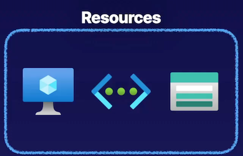

<mark>Resource groups are ultimately a logical container for grouping all of our resources that we have running inside of Azure</mark>.

we can group these resources based on various things, such as **lifecycle**, maybe some of these resources are part of a workload that will share a common lifecycle when it is created, managed, and destroyed.

Maybe we want to group resources based on **security**, so we can **control access** based on resource groups. 

Maybe we want to break it down into something different like **dev environments, test environments, and maybe even production**.

**Azure Subscription**

* Logical construct that groups together **resource groups and associated resources**
* **Billing unit for the Azure cloud**
	* we pay our bills on a per-subscription basis depending on our billing model. For example, pay as you go.
	* For marketing or production, or maybe dev/test.
* **Controlled by Azure Resource Manager (ARM)**

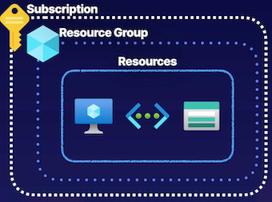

**Describing Azure Resource Manager**

Azure Resource Manager is the top-level resource in the Azure cloud. **It is simply the orchestration layer that allows us to manage resources in the Azure cloud**.


Interact with these resources

* Azure Portal
* Azure CLI
* Azure PowerShell


**Azure Resource Manager** is not interacting with the resources themselves, but rather, **it's interacting with and connecting to these resource providers that are associated with specific resources**

So we know that **we use some REST API endpoints to interact with the Azure Resource Manager**, and we make **requests for specific operations, and then the Resource Manager forwards these requests to the appropriate resource providers** depending on the resource that we're trying to perform in operation on. 

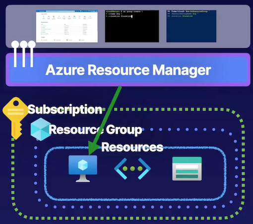

* Azure Resource Manager (ARM) is the orchestration layer for managing the Azure cloud
* Uses REST API endpoints

> ARM connects to the resource provider
> 
> Resource provider completes the request


**What prevents someone from managing resources that don't belong to their organization?**

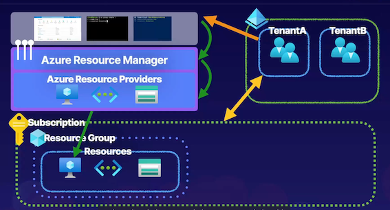

Now, Azure approaches everything from a **identity-centric security method**, and we're using Azure AD, Azure AD is our identity and access management resource inside of Azure. 

>  Our subscription here has a trust relationship between TenantA
> 
> If there is another tenant B out there, it won't be able to do anything because **it doesn't have the trust relationship that the tenant that we've established a trust relationship** between our subscription does.


**Exam Tips**

* **Resources are Azure - managed entities**, like virtual machines, storage accounts, and virtual networks.
* Resources are contained in **resource groups**.
* **Resource groups** are contained in **subscriptions**.
* You can use **REST API** endpoints to manage Azure through **Azure Resource Manager**.
* Azure Resource Manager is a management service.
* Each **resource** has a **resource provider**.

### Chatgpt summary


1. **Azure Resources**: Resources are the smallest units in the Azure cloud, managed entities like virtual machines, storage accounts, and virtual networks that provide functionality for tasks such as compute, data storage, and networking.

2. **Resource Groups**: Logical containers for grouping resources in Azure based on factors like lifecycle, security, or environment (e.g., dev, test, production) to manage and organize resources efficiently.

3. **Subscriptions**: Boundaries for actual resources in Azure, grouping resource groups and associated resources, used as billing units to determine Azure Cloud costs based on accumulated costs within the subscription.

4. **Azure Resource Manager**: Top-level resource in Azure, an orchestration layer that allows management of Azure resources using tools like Azure portal, CLI, and PowerShell through REST API endpoints, interacting with resource providers for specific operations.

5. **Identity and Access Management**: Azure adopts an identity-centric security approach using Azure AD, a standalone identity and access management resource separate from subscriptions, where tenants (e.g., TenantA) with trust relationships manage resources securely across subscriptions.

Key Takeaways:

- Understanding Azure resources, resource groups, and subscriptions as essential components in managing Azure services and costs.
- Utilizing REST API endpoints to interact with Azure resources through Azure Resource Manager, the top-level management service in Azure.
- Identity and access management through Azure AD ensures secure resource management across subscriptions.


## 2 Using Azure Portal and Cloud Shell

What is the Azure Portal?

* **Login portal for the Azure cloud**
* **Create and manage Azure resources**
* **Uses Cloud Shell**
	* Using Azure CLI and PowerShell


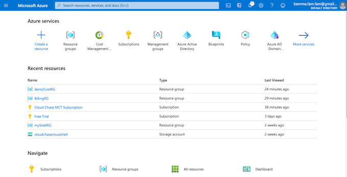

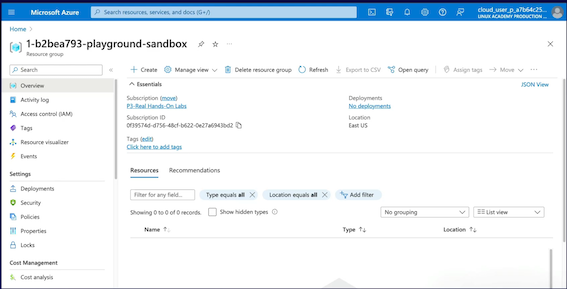

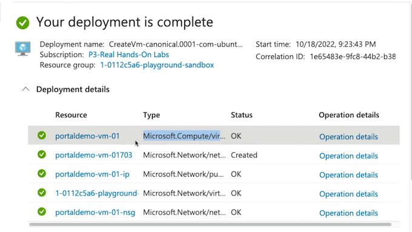

**Power shell**

Azure PowerShell cmdlets: **Get-AzResourceGroup**.

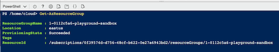

**Azure Portal and Cloud Shell Basics**

* Log in via Azure AD identity
* Create Azure resources
* Manage Azure resources
* Manage Azure via Cloud Shell
* Manage billing
* Log support tickets

### Summary

Summary of key points for the AZ-104 exam from the article:

1. The Azure portal is a graphical user interface accessed via a web browser to create and manage resources in Azure.
2. It interacts with Azure Resource Manager and resource providers to manage Azure resources.
3. Components of the Azure portal include the toolbar, search bar, Cloud Shell for programmatically managing resources, and user profile settings.
4. Key features of the toolbar include creating resources, accessing dashboards, managing directories, notifications, and portal settings.
5. The search bar allows searching for resources, services, and documentation related to specific terms.
6. Cloud Shell allows using Azure CLI and Azure PowerShell to interact with Azure resources through a web-based cloud terminal.
7. Demonstrated creating a virtual machine in the Azure portal and configuring Cloud Shell with advanced settings.
8. Additional features in the Azure portal include managing appearance and startup views, support options, leaving feedback, and user profile settings.
9. Use Azure portal for managing resources, performing management operations, and logging support tickets.
10. Azure portal can also be used for managing billing and understanding costs in Azure.


## 3 Using Azure CLI and PowerShell

**Describing Azure Command-Line Interface (CLI) and PowerShell**

Using Azure CLI and PowerShel？

* **A command-line utility for managing Azure resources**
* **Create and manage resources without logging into the Azure Portal**
* **Create scripts to automate tasks**

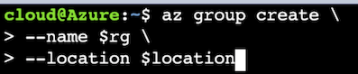

**What is the Azure PowerShell?**

* A set of cmdlets for managing Azure resources
* Create and manage resources without logging into the Azure Portal
* Create scripts to automate tasks

```
New-AzResourceGroup `
-ResourceGroupName $rg `
-Location $location
```

```
az group create \
-name $rg \
-location $location
```

**list out our resource groups**

```
az group list 
```

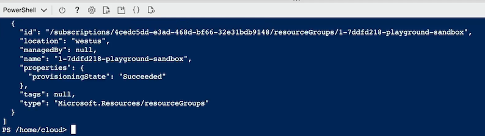

```
Get-AzResourceGroup
```

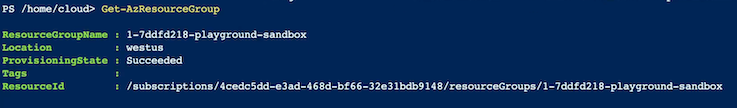

```
$rg = Get-AzResourceGroup
$rg
```

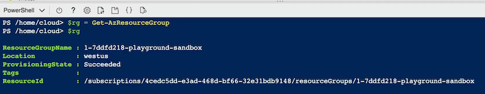

```
$rg.Resourceld
/subscriptions/4cedc5dd-e3ad-468d-bf66-32e31bdb9148/resourceGroups/1-7ddfd218-playground-sandbox
```

**Creare VM**

```
az vm create  `
>> --resource-group $rg.ResourceGroupName `
>> --location $rg.Location `
>> --name vm-demo-001 `
>> --image UbuntuLTS `
>> --admin-username cloudchase `
>> --generate-ssh-keys `
>> --no-wait
```

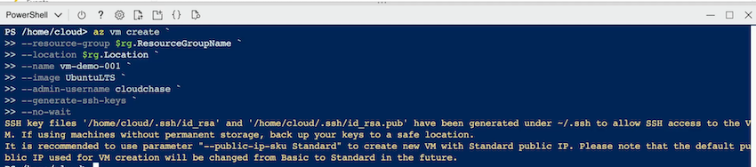

```
Get-Clouddrive
```

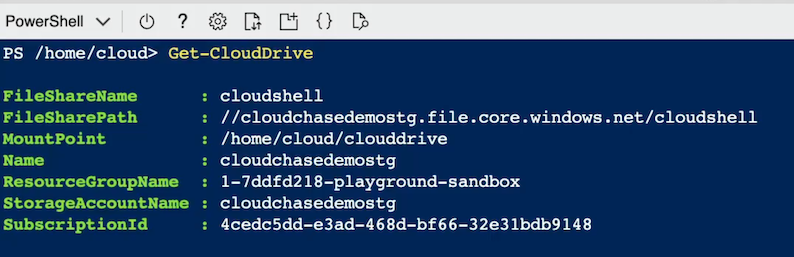

```
Get-AzResource | Format-Table
```

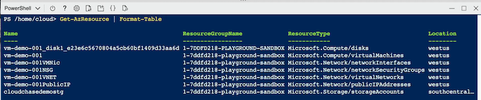

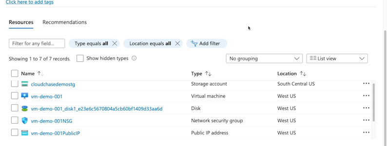

**Clean resource**

```
ls
cleanerScript.psl clouddrive

code cleanerScript.ps1
```

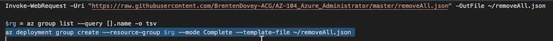

```
New-AzResourceGroup `
-ResourceGroupName $rg `
-Location $location
```


### Chatgpt summary


1. **Azure CLI**:
   - Command-line utility for managing Azure resources.
   - Contains various Azure CLI commands for managing services in Azure.
   - Can be used in Cloud Shell or installed locally on machines.
   - Requires authentication both in Cloud Shell and on local machines.
   - Bash-esque scripting allows for automation of tasks on Azure resources.

2. **Azure PowerShell**:
   - Set of cmdlets within PowerShell for managing Azure resources.
   - Can create and manage Azure resources without logging into the Azure portal.
   - Object-oriented nature allows for scripting, automation, and robust functionality.
   
3. **Basic Operations**:
   - Creation of resource groups, virtual machines, and other Azure resources.
   - Interaction with Azure services through appropriate commands and cmdlets.
   
4. **Demonstration**:
   - Logging into Azure portal using Azure Cloud Sandbox credentials.
   - Setting up Cloud Shell instance by mapping it to a storage account file share.
   - Using Azure CLI and Azure PowerShell to create Azure resources and run commands/cmdlets.
   
5. **Azure CLI Commands**:
   - Examples: `az group list` to list resource groups.
   - Provides information in JSON format about resources.
   
6. **Azure PowerShell Cmdlets**:
   - Examples: `Get-AzResourceGroup` to get information about resource groups.
   - Object-oriented approach allows for saving objects to variables and accessing properties.
   
7. **Creating a Virtual Machine with Azure CLI**:
   - Example: `az vm create` command to create and configure a VM.
   - Specifies resource group, location, name, image, admin username, and SSH keys.
   
8. **Managing Cloud Shell**:
   - Using cmdlets like `Get-CloudDrive` to get information about the mapped storage account.
   - Scripting operations to manage resources efficiently.
   
9. **Resource Management**:
   - Using cmdlets like `Get-AzResource` to view and manage Azure resources.
   - Using piped cmdlets to format and display resource information.
   
10. **Clean-up Script**:
    - Demonstrating a script to clean up resources using Azure CLI commands.
    - Cautioning against running destructive scripts in production environments.
   
11. **Key Takeaways**:
    - Understanding the use of Azure CLI and Azure PowerShell for managing Azure resources.
    - Ability to install and use these tools locally or within the Azure portal's Cloud Shell.
    - Leveraging scripting and automation for managing Azure resources efficiently.
    - Being aware of the 20-minute timeout in Cloud Shell for interactive sessions.

## 4 Using ARM Templates

Explaining Azure Resource Manager (ARM) Templates

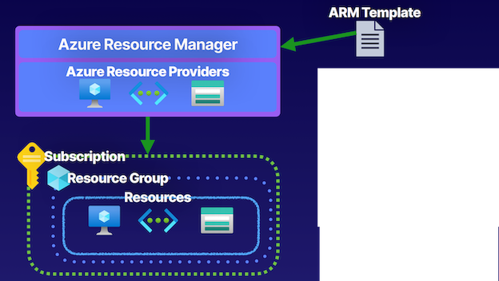

* **Infrastructure as Code (IaC)**
	* Azure Resource Manager templates, so we create these JSON files that are known as ARM templates, and this provides us Infrastructure as Code.
* **Deploy environments quickly**
	*  So we codify our infrastructure, and **using this ARM template, we can pass it into the Azure Resource Manager for deployment,** it will find the necessary providers, and it will quickly deploy our environments at **various scopes, such as a subscription or a resource group**.
* **Repeatable deployments**


### **Components of ARM Templates**

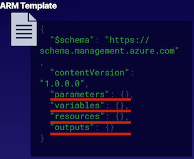

* The **<mark>parameters and variables</mark>** components are used to pass information to the template
	* Such as a username or maybe a VM SKU that we want to use for the virtual machine deployment that we're running in an ARM template.
	* Variables are a little bit different in that they're not dynamic, **these are things that we just hardcode into the template**.
* The **resources component** is used to define resources in the template
	* Resource blocks that we can use to outline the specific resources we want to deploy and their properties, and **we can use those parameters and variables in this section to define some of those properties, either dynamically with parameters or hardcoded with variables**
* The outputs component is used to return output from the execution of the template

### **Get Template > Deploy > Verify**

**Custom deployment**

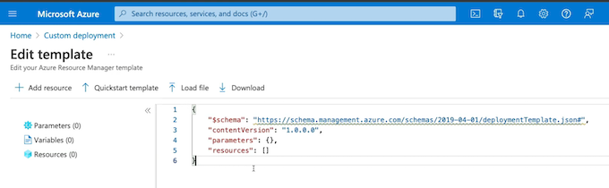

```
{
    "$schema": "https://schema.management.azure.com/schemas/2019-04-01/deploymentTemplate.json#",
    "contentVersion": "1.0.0.0",
    "parameters": {
        "vmName": {
            "type": "string",
            "defaultValue": "vm-demo-04",
            "metadata": {
                "description": "The name of you Virtual Machine."
            }
        },
        "adminUsername": {
            "type": "string",
            "metadata": {
                "description": "Username for the Virtual Machine."
            }
        },
        "authenticationType": {
            "type": "string",
            "defaultValue": "password",
            "allowedValues": [
                "sshPublicKey",
                "password"
            ],
            "metadata": {
                "description": "Type of authentication to use on the Virtual Machine. SSH key is recommended."
            }
        },
        "adminPasswordOrKey": {
            "type": "securestring",
            "metadata": {
                "description": "SSH Key or password for the Virtual Machine. SSH key is recommended."
            }
        },
        "dnsLabelPrefix": {
            "type": "string",
            "defaultValue": "[toLower(concat('vm-demo-04-', uniqueString(resourceGroup().id)))]",
            "metadata": {
                "description": "Unique DNS Name for the Public IP used to access the Virtual Machine."
            }
        },
        "ubuntuOSVersion": {
            "type": "string",
            "defaultValue": "18.04-LTS",
            "allowedValues": [
                "12.04.5-LTS",
                "14.04.5-LTS",
                "16.04.0-LTS",
                "18.04-LTS"
            ],
            "metadata": {
                "description": "The Ubuntu version for the VM. This will pick a fully patched image of this given Ubuntu version."
            }
        },
        "location": {
            "type": "string",
            "defaultValue": "[resourceGroup().location]",
            "metadata": {
                "description": "Location for all resources."
            }
        },
        "VmSize": {
            "type": "string",
            "defaultValue": "Standard_B2s",
            "metadata": {
                "description": "The size of the VM"
            }
        },
        "virtualNetworkName": {
            "type": "string",
            "defaultValue": "vm-demo-04-vnet",
            "metadata": {
                "description": "Name of the VNET"
            }
        },
        "subnetName": {
            "type": "string",
            "defaultValue": "default",
            "metadata": {
                "description": "Name of the subnet in the virtual network"
            }
        },
        "networkSecurityGroupName": {
            "type": "string",
            "defaultValue": "vm-demo-04-nsg",
            "metadata": {
                "description": "Name of the Network Security Group"
            }
        }
    },
    "variables": {
        "publicIpAddressName": "[concat(parameters('vmName'), 'PublicIP' )]",
        "networkInterfaceName": "[concat(parameters('vmName'),'NetInt')]",
        "subnetRef": "[resourceId('Microsoft.Network/virtualNetworks/subnets', parameters('virtualNetworkName'), parameters('subnetName'))]",
        "osDiskType": "Standard_LRS",
        "subnetAddressPrefix": "10.1.0.0/24",
        "addressPrefix": "10.1.0.0/16",
        "linuxConfiguration": {
            "disablePasswordAuthentication": true,
            "ssh": {
                "publicKeys": [
                    {
                        "path": "[concat('/home/', parameters('adminUsername'), '/.ssh/authorized_keys')]",
                        "keyData": "[parameters('adminPasswordOrKey')]"
                    }
                ]
            }
        }
    },
    "resources": [
        {
            "type": "Microsoft.Network/networkInterfaces",
            "apiVersion": "2020-06-01",
            "name": "[variables('networkInterfaceName')]",
            "location": "[parameters('location')]",
            "dependsOn": [
                "[resourceId('Microsoft.Network/networkSecurityGroups/', parameters('networkSecurityGroupName'))]",
                "[resourceId('Microsoft.Network/virtualNetworks/', parameters('virtualNetworkName'))]",
                "[resourceId('Microsoft.Network/publicIpAddresses/', variables('publicIpAddressName'))]"
            ],
            "properties": {
                "ipConfigurations": [
                    {
                        "name": "ipconfig1",
                        "properties": {
                            "subnet": {
                                "id": "[variables('subnetRef')]"
                            },
                            "privateIPAllocationMethod": "Dynamic",
                            "publicIpAddress": {
                                "id": "[resourceId('Microsoft.Network/publicIPAddresses',variables('publicIPAddressName'))]"
                            }
                        }
                    }
                ],
                "networkSecurityGroup": {
                    "id": "[resourceId('Microsoft.Network/networkSecurityGroups',parameters('networkSecurityGroupName'))]"
                }
            }
        },
        {
            "type": "Microsoft.Network/networkSecurityGroups",
            "apiVersion": "2020-06-01",
            "name": "[parameters('networkSecurityGroupName')]",
            "location": "[parameters('location')]",
            "properties": {
                "securityRules": [
                    {
                        "name": "SSH",
                        "properties": {
                            "priority": 1000,
                            "protocol": "TCP",
                            "access": "Allow",
                            "direction": "Inbound",
                            "sourceAddressPrefix": "*",
                            "sourcePortRange": "*",
                            "destinationAddressPrefix": "*",
                            "destinationPortRange": "22"
                        }
                    }
                ]
            }
        },
        {
            "type": "Microsoft.Network/virtualNetworks",
            "apiVersion": "2020-06-01",
            "name": "[parameters('virtualNetworkName')]",
            "location": "[parameters('location')]",
            "properties": {
                "addressSpace": {
                    "addressPrefixes": [
                        "[variables('addressPrefix')]"
                    ]
                },
                "subnets": [
                    {
                        "name": "[parameters('subnetName')]",
                        "properties": {
                            "addressPrefix": "[variables('subnetAddressPrefix')]",
                            "privateEndpointNetworkPolicies": "Enabled",
                            "privateLinkServiceNetworkPolicies": "Enabled"
                        }
                    }
                ]
            }
        },
        {
            "type": "Microsoft.Network/publicIpAddresses",
            "apiVersion": "2020-06-01",
            "name": "[variables('publicIpAddressName')]",
            "location": "[parameters('location')]",
            "sku": {
                "name": "Basic",
                "tier": "Regional"
            },
            "properties": {
                "publicIpAllocationMethod": "Dynamic",
                "publicIPAddressVersion": "IPv4",
                "dnsSettings": {
                    "domainNameLabel": "[parameters('dnsLabelPrefix')]"
                },
                "idleTimeoutInMinutes": 4
            }
        },
        {
            "type": "Microsoft.Compute/virtualMachines",
            "apiVersion": "2020-06-01",
            "name": "[parameters('vmName')]",
            "location": "[parameters('location')]",
            "dependsOn": [
                "[resourceId('Microsoft.Network/networkInterfaces/', variables('networkInterfaceName'))]"
            ],
            "properties": {
                "hardwareProfile": {
                    "vmSize": "[parameters('VmSize')]"
                },
                "storageProfile": {
                    "osDisk": {
                        "createOption": "fromImage",
                        "managedDisk": {
                            "storageAccountType": "[variables('osDiskType')]"
                        }
                    },
                    "imageReference": {
                        "publisher": "Canonical",
                        "offer": "UbuntuServer",
                        "sku": "[parameters('ubuntuOSVersion')]",
                        "version": "latest"
                    }
                },
                "networkProfile": {
                    "networkInterfaces": [
                        {
                            "id": "[resourceId('Microsoft.Network/networkInterfaces', variables('networkInterfaceName'))]"
                        }
                    ]
                },
                "osProfile": {
                    "computerName": "[parameters('vmName')]",
                    "adminUsername": "[parameters('adminUsername')]",
                    "adminPassword": "[parameters('adminPasswordOrKey')]",
                    "linuxConfiguration": "[if(equals(parameters('authenticationType'), 'password'), json('null'), variables('linuxConfiguration'))]"
                }
            }
        }
    ],
    "outputs": {
        "adminUsername": {
            "type": "string",
            "value": "[parameters('adminUsername')]"
        },
        "hostname": {
            "type": "string",
            "value": "[reference(variables('publicIPAddressName')).dnsSettings.fqdn]"
        },
        "sshCommand": {
            "type": "string",
            "value": "[concat('ssh ', parameters('adminUsername'), '@', reference(variables('publicIPAddressName')).dnsSettings.fqdn)]"
        }
    }
}
```

**Resource visualizer**

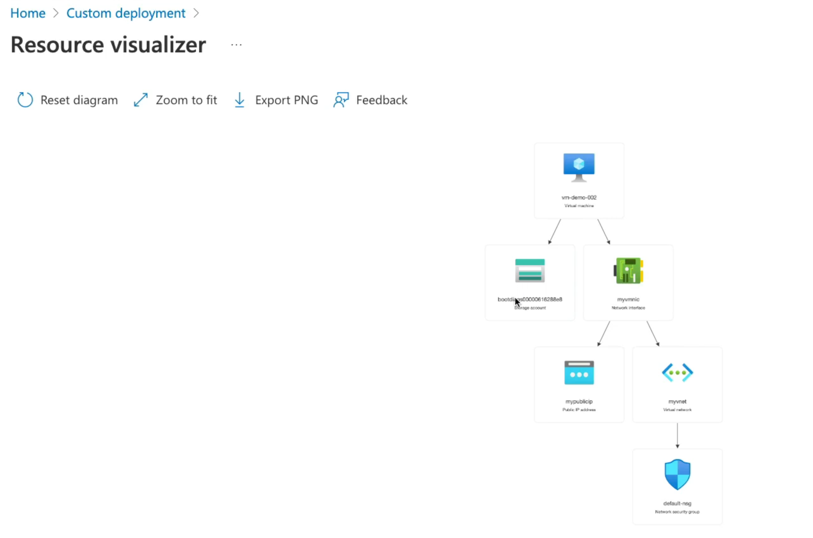

Add parameters

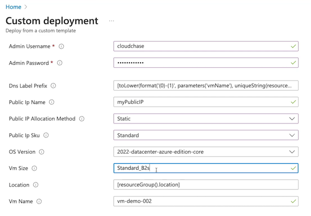

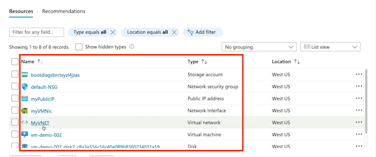

```
{
 "$schema": "https://schema.management.azure.com",
 "contentVersion":  "1.0.0.0",
 "parameters": { },
 "variables": { },
 "resources": { },
 "outputs": { }
}
```

### Gpt summary

Summary of the key points from the article regarding ARM templates:

1. ARM templates are JSON files used in Azure Resource Manager to provide Infrastructure as Code.
2. They allow for codifying infrastructure, enabling repeatable deployments at various scopes like subscription or resource group.
3. Parameters and variables are components used to pass information into the template, with parameters being dynamic and variables being hardcoded.
4. The resources section defines the resources to deploy, including their properties that can be defined using parameters or variables.
5. The outputs component returns information from the template execution, such as returning IP addresses.
6. ARM templates enable quick deployment of modular environments in Azure and support nested templates for deploying resources efficiently.
7. Demonstrations involve obtaining a template from a repository, deploying it in the Azure portal, configuring parameters, validating the deployment, and reviewing the created resources.

List of exam points from the article:

- Definition of ARM templates and their role in Infrastructure as Code.
- Explanation of parameters and variables in ARM templates.
- Importance of the resources section for defining resources to deploy.
- Use of the outputs component to return information from the template execution.
- Deployment process in Azure portal, including configuration and validation steps.
- Scope of ARM template deployment at various levels such as subscription or resource group.
- Ability to create repeatable and modular environments using ARM templates.
- Support for nested ARM templates for efficient deployment of resources.

This summary covers the key concepts and exam points related to ARM templates as discussed in the article.