# 2 Governance and Compliance

## 1 Managing Subscriptions

### **Describing Subscriptions**

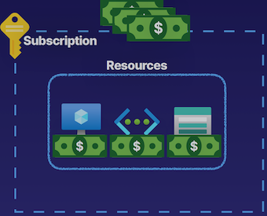

**<mark>What are subscriptions? </mark>**

* **Billing unit that aggregates all costs of underlying resources**
* Contain **resource groups** and **their associated resources**
	* Such as virtual machines, virtual networks, and storage accounts.
	* Resource groups don't cost us anything, but some resources do, like virtual machines, storage accounts, virtual networks, public IP addresses
* **Scoping level for governance and security**

### **Describing Subscriptions**

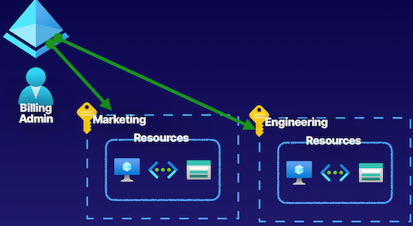

**Types of Subscriptions**

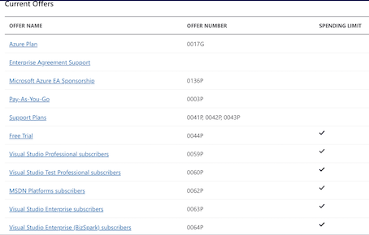

**Subscription Naming Conventions**

* **Prod/Dev/Staging**

Subscriptions named based on whether or not they are production, development, or staging environments.

* **Department/Teams**

Subscriptions named based on the department or team the subscription is intended for, so that billing can then be easily associated with a given business unit.

* **Region**

Subscriptions named based on the region of the business that uses the subscription.

**Takeway**

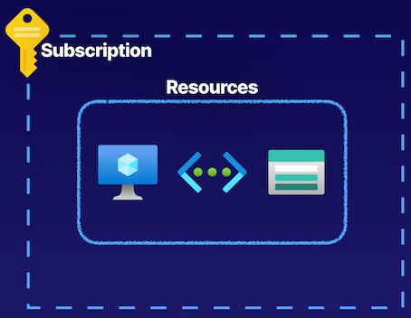

* Billing unit that aggregates all costs of underlying resources
* Scoping level for **governance and security**
* Contain resource groups and their associated resources
* **<mark>Can only be associated with a single organization (Azure AD tenant) at a time</mark>**

### Summary from GPT

Summary of key points for the AZ-104 exam from the article:

1. Subscriptions in Azure are the billing unit for cloud costs generated by underlying resources.
2. Resources in subscriptions include resource groups containing resources like virtual machines, storage accounts, and networks.
3. Subscriptions provide a level for scoping governance, security, and deployments using ARM templates.
4. Organizational subscriptions help in segmenting billing units and managing costs for different teams or workloads.
5. Azure identities can be assigned roles like billing admin for managing subscriptions.
6. Types of subscriptions include Azure Plan, Enterprise Agreement Support, Pay-As-You-Go, and free trial plans.
7. Naming conventions for subscriptions can help in governance, compliance, and logical segmentation of resources.
8. Subscriptions are associated with Azure AD tenants, enabling trust relationships and authentication processes.
9. Subscriptions are used for aggregating cloud costs, scoping governance, security, authorization, and resource deployments in Azure.

List of exam key points for the AZ-104 test:

- Understanding the role of subscriptions as billing units in Azure for cloud costs.
- Knowledge of resources within subscriptions, including resource groups and associated resources.
- Importance of subscriptions for governance, security, and scoping deployments using ARM templates.
- Segmentation of organizational workloads and teams using subscriptions.
- Assignment of roles to Azure identities for managing subscriptions.
- Different types of Azure subscriptions such as Azure Plan, Enterprise Agreement Support, Pay-As-You-Go, and free trial plans.
- Use of naming conventions for subscriptions to aid in governance, compliance, and logical resource segmentation.
- Relationship between subscriptions and Azure AD tenants for authentication and authorization.
- Applications of subscriptions for managing cloud costs, governance, security, and resource deployments in Azure.

## 2 Using Management Groups

### 2-1 **Defining Management Groups**

* **Managing Subscriptions**

Organize and manage subscriptions by logically grouping them into management subscriptions.

* **Organizational hierarchy**
* **Provides another scope for enforcing governance and compliance**

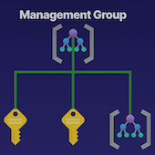

### 2-2 Defining Management Groups

> Management groups as this kind of **logical container** that we can use to **manage subscriptions**
> 
> Place subscriptions inside of **management groups** to organize and manage them

**Parent-Child Relationships**

* <mark>Root management group is the top level</mark>
* <mark>Management groups and subscriptions can have a single parent</mark>
* **Supports 6 levels of hierarchy**

*  For management groups, there is always this **parent-child relationship between the root-level management group**, which is the top-level management group 
*  This management group is the root parent
*  All management groups underneath that and subscriptions underneath that, have a **parent-child relationship with one another**

**Compliance support**

* Azure Policies
* Azure role-based access control（RBAC)

> The compliance support for management groups is **Azure Policies** and **Azure role-based access control**.
> 
> Deploy something known as Azure Policies into our management groups, and **that will trickle down to all the other management groups and subscriptions underneath it**.

**Understanding Hierarchy**

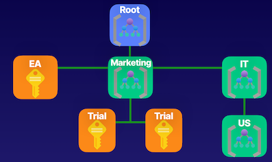

Under this root management group we have a marketing management group. 

**Scoping**

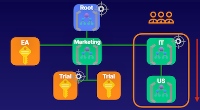

use management groups as scope levels

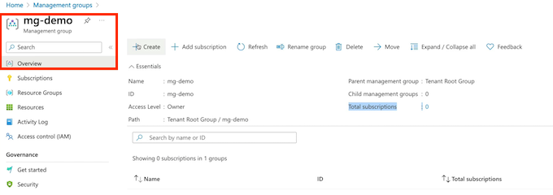

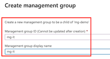

For example, we have users that we want to provide access for a specific management group using a **contributor role for example, so that they can act as contributors for the IT management group.** 

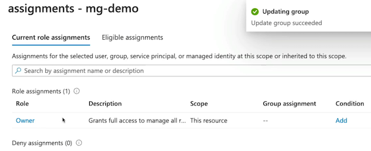

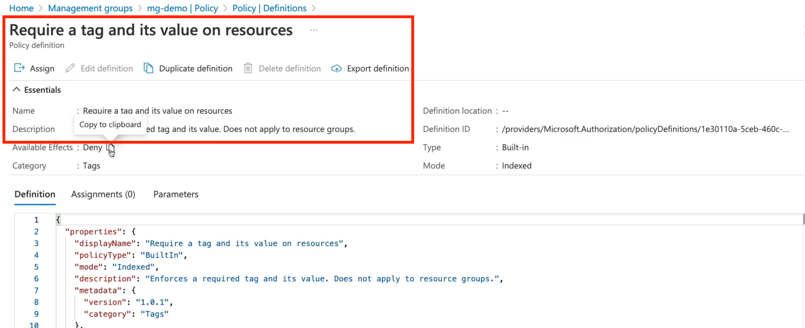

* **<mark>Root management group access is not given by default</mark>**
	* Microsoft is very careful about providing access to this as it would provide access to do things throughout your entire environment. 

* **<mark>Root management cannot be moved or deleted</mark>**
* **<mark>Azure RBAC supported for management groups</mark>**
* **<mark>Global Administrators must be elevated to User Access Administrator of root group</mark>**

### Gpt summary

1. **Management Groups Overview**:
   - Management groups are logical containers used to manage subscriptions.
   - They provide a hierarchy for organizing and managing subscriptions and resources.
   - Management groups have a parent-child relationship, allowing for organizational hierarchy in Azure environments.
  
2. **Hierarchy and Scope**:
   - There is a parent-child relationship between management groups, with a root-level management group at the top.
   - Management groups can support up to 6 levels of hierarchy.
   - Role-based access control (RBAC) roles and Azure Policies can be deployed at various scopes within management groups to enforce governance and compliance.

3. **Azure Portal Demonstration**:
   - In the Azure portal, management groups are set up to create hierarchical structures for organizations.
   - Management groups can be created, renamed, deleted, and have child objects added to them.
   - RBAC roles can be assigned to management groups to control access and permissions.
   - Policies can be used at the management group level to enforce rules and standards across subscriptions and resources.

4. **Root Management Group**:
   - The root management group is the top-level resource that cannot be moved or deleted.
   - Access to the root management group requires Global Administrator access in Azure AD tenant.
   - Elevating to User Access Administrator of the root management group may be necessary in certain situations, but should be revoked after the task is completed.

## **3 Understanding Azure Policy**

### 3-1 Enforce Compliance and Enable Auditing

Organizations need to implement enterprise-level governance and compliance capabilities.

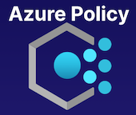

Defining Azure Policy

* **Prohibit Resources**
> prohibit specific VM sizes inside of our environments.

	* Control costs
	* Restrict service access

* **Allowed Locations**
	* Geographical compliance

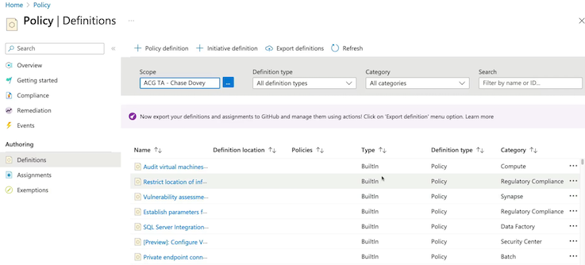

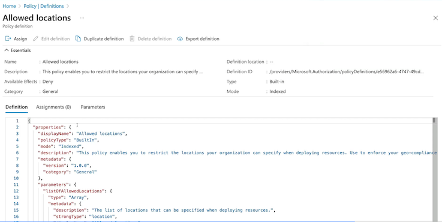

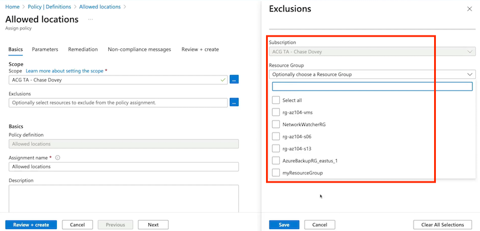

> organization that operates inside of the EU, operate inside of the EU, we have to be compliant to data sovereignty rules of GDPR. And so we need to make sure that workloads that we're deploying for those related purposes inside of the EU follow specific geographical compliance requirements. 

**Compliance dashboard on the Azure Policy**

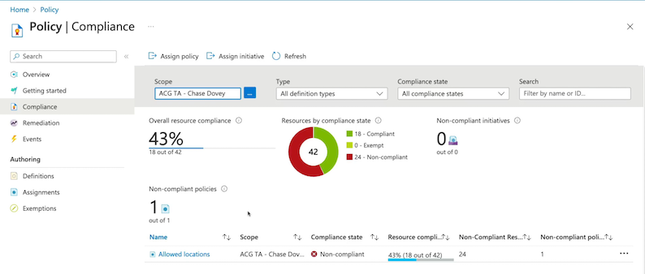

### Components of a Policy

* **Policy Definition**

	* **Defines the evaluation criteria for compliance, and defines the actions that take place**. 
	* Either audit or deny should something be outside of compliance

* **Policy Assignment**

	* The scope at which we will assign our policy. 
	* <mark>The scope **could be a management group, subscription, resource group, or resource**</mark>.

* **Initiative Defintion**

**A collection of policies that are tailored to achieving a singular high-level goal together.**

**For example, ensuring that VMs meet standards.**

### **3-2 Policy Example** --- Require Tags

**Policy Definition**

Evaluate if a VM is being created with our tag `Project: az104`. If the VM is missing the tag then deny creation of the resource.

> For example, if we try to create a virtual machine inside of this resource group, and we create it without the appropriate tags, it's going to fail that deployment, it will not pass validation, and we won't be able to deploy that virtual machine.

**Policy Assignment**

Assign the policy at the scope of the resource group where the VMs will be created.

### 3-3 Key Takeaways

* Policy Definition
* Policy Assignment
* Initiative Definition

--

* Create, Manage, and Assign policies
* Enforce compliance with resources
* Audit compliance
* Deny creation of resources outside of compliance

For example, requiring the tag, Allowed Locations, specific allowed VM SKUs.

### GPT Summary 

1. **Azure Policies Overview:**
   - Azure Policies are similar to a set of rules that enforce compliance and enable auditing in Azure environments.
   - They help organizations implement enterprise-level governance and compliance in Azure.

2. **Components of Azure Policy:**
   - **Policy Definitions:** Define specific rules or criteria for compliance, such as allowed locations or prohibited resources.
   - **Policy Assignments:** Put policy definitions into action at a specific scope, like a management group or subscription.
   - **Initiative Definitions:** Collections of policies tailored to achieve a high-level goal, ensuring compliance through various policies.

3. **Real-Life Use Case Example:**
   - For instance, requiring specific tags on resources to enforce compliance.
   - Create a policy definition that checks for tags like "project: az104" on virtual machines and denies creation without them.
   - Assign this policy at the scope of a resource group to enforce compliance on resources deployed there.

4. **Azure Policy Management in Azure Portal:**
   - Use the Azure Portal to author, review, and assign policy definitions.
   - Assign policies at different scopes like subscriptions or resource groups.
   - Monitor compliance through the Compliance dashboard in Azure Policy.

5. **Key Takeaways for Understanding Azure Policy:**
   - Azure Policy enforces compliance and governance in organizations' Azure environments.
   - Components include policy definitions, policy assignments, and initiative definitions.
   - Policies can audit compliance, deny non-compliant resource creation, or enforce specific standards across resources.

## **4 Tagging Resources**

### 4-1 What Are Tags?

**Describing Resource Tagging**

> Tags inside of Azure are simply just a name-value pair.

* `Name:Value`
* `Dept:Marketing`
* `Env:Prod`

* Name can be 512 characters and value can be 256 characters
* Storage accounts can only have a name with 128 characters

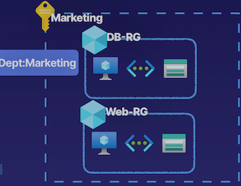

> could create a name for a tag that says department. 
> 
> Cost analysis where we're trying to derive how much money is the marketing team spending.
> 
> Determine our costs geographically.

We can use it for things like performing automated operations by doing things like getting all of the resources, **such as virtual machines, running inside of Azure that are part of the development workload, using that development tag**.

**Resource Tag Assignment Hierarchy**

* **Tags are not inherited**

The department marketing tag in the marketing subscription is **not going to be inherited by all of the underlying resource groups and resources that they contain.** 

* **A resource can have 50 tags**

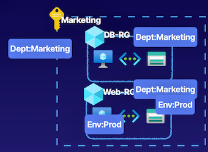

Example: add tags to the resource group

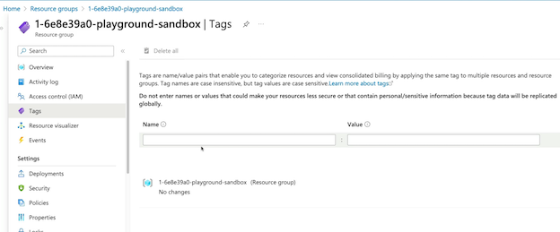

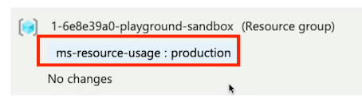

**<mark>Tags are not inherited from the higher scope</mark>**

### 4-2 Key Takeaways

* Manage resources via tags. For example, shutting down all VMs with a specific tag.
* **Tags are not inherited from the higher scope like a resource group. Each resource must be tagged.**

### Chatgpt summary

Here is a summary and list of key points for the AZ-104 exam based on the provided article:

1. **Tags in Azure**: Tags in Azure are name-value pairs used for various purposes such as organizing resources, cost analysis, and resource management.
   
2. **Tagging Conventions**: Tags can be used to categorize resources based on departments, environments (e.g., production, dev, test), or geographical locations.

3. **Tag Limits**: Tags have limits where the name can be up to 512 characters and the value up to 256 characters, except for storage accounts where the name can only be 128 characters long. Resources can have up to 50 tags at a time.

4. **Tag Assignment Hierarchy**: Tags are not inherited from higher scopes like resource groups or subscriptions. Each resource must be tagged independently.

5. **Azure Policies**: Azure Policies can be used to enforce tagging inheritance within resource groups or subscriptions.

6. **Resource Tagging Demonstration**: The article provides a demonstration on how to assign tags to a resource group in the Azure portal and emphasizes that tags are not inherited by the resources within the group.

7. **Automation with Tags**: Automation scripts using PowerShell or Azure CLI can be used to apply tags at scale to multiple resources within a resource group or subscription.

8. **Key Takeaways**: Tags are flexible and versatile tools in Azure that can be used for resource management, cost analysis, and automation. Tags are not inherited by resources and must be applied individually.

## 5 Locking and Moving Resources

### 5-1 Describing Resource Locks

* Locks allow you to **override permissions to resources**
* Can **lock subscriptions, resource groups, or resources**
	* They can perform read operations and specific write operations, as long as one of those write operations is not deleting that resource
* Lock restrictions apply to **all users and roles**

> **.So regardless of a role assignment of a user and what permissions we may have, they have to abide by these resource locks, which will override their permissions.**

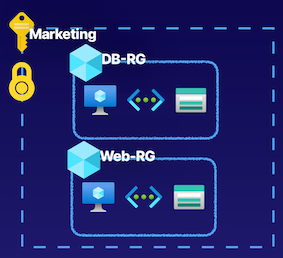

### 5-2 Types of Resource Locks

Lock Types

* **ReadOnly** allows authorized users to read a resource, **but they cannot delete or update the resource**
* **CanNotDelete** allows authorized users to read and modify a resource, but they cannot delete the resource
* **<mark>Locks are inherited from the parent scope</mark>**

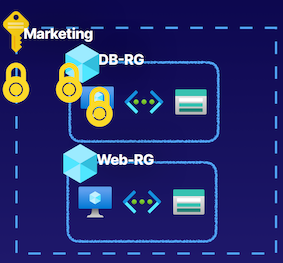

So if we have one assigned here at the subscription as we see with marketing subscription, it's going to be inherited by all of the resource groups and resources that are inside of that subscription. 

### 5-3 Moving Resources

Moving resources that are contained in a specific place in Azure, for example, inside of a subscription,  these resources nested inside of a logical container like a resource group. 

* **we could move resources inside of Azure between resource groups**.
* **we can also move resources inside of Azure from subscription to subscription**

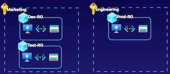

### Demo

Add a ReadOnly lock on a virtual machine

**Add CanNotDelete Lock**

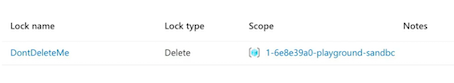

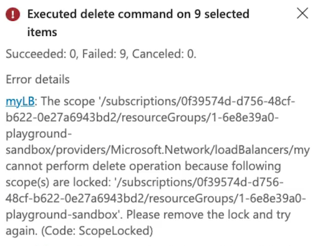

**Add Readonly Lock**

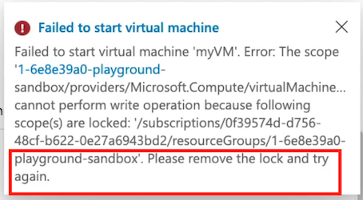

Move a virtual machine from one resource group to another

### Moving Resources

moving resources, we can also **move them between subscriptions in Azure for cross-subscription movement and also move them between regions.**

**<mark>Supported Resources</mark>**
	
* Virtual Machines
* Storage Accounts
* Virtual Networks

**<mark>Unsupported Resources</mark>**

* **Azure Active Directory Domain Services**
* **Azure Backup Vaults**
* **Azure App Service Gateways**

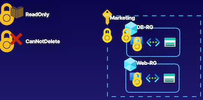

### Gpt summary

1. **Azure Locks**: 
   - Feature to put a lock on a resource to override permissions for authorized users.
   - Locks can be applied at different scopes - subscriptions, resource groups, or individual resources.
   - Types of locks include ReadOnly lock (allows read but blocks delete/write operations) and CannotDelete lock (allows read and specific write operations but blocks delete).
   - Locks are inherited from the parent scope to child scopes and resources.

2. **Moving Resources in Azure**:
   - Moving resources involves transferring resources between resource groups or subscriptions.
   - Cross-subscription resource movement requires specific role assignments and permissions.
   - Moving resources is considered a write operation.
   - Locks on resources can affect the ability to move resources - ReadOnly locks can restrict movement.

3. **Demonstration and Practical Application**:
   - Demonstrated adding and testing locks on Azure resources (e.g., adding a Delete lock).
   - Showed how locks restrict certain operations (e.g., delete, update) on resources.
   - Moving resources within Azure involves selecting resources and choosing the destination (resource group, subscription, region).
   - Some resource types may not support moving operations, requiring careful planning.

4. **Key Takeaways**:
   - Understand different types of resource locks (e.g., ReadOnly, CannotDelete) and their effects on operations.
   - Resource locks can be inherited and impact the movement of resources.
   - Considerations for moving resources include permissions, supported operations, and planning for resource movement.

## 6 Managing Azure Costs

**On-premise resources**

And we're only paying for how much we use this resource. And that's things such as the CPU, the memory, the disk size. We're also paying for things like traffic for our network. 

We are not paying for the underlying infrastructure, nor are we paying to have people manage the underlying infrastructure of the Azure cloud. 

**So we're minimizing our costs and minimizing our responsibility in the shared responsibility model.** 

### What Affects Cost?

* **Subscription Type**： **Free, pay-as-you-go**, **Enterprise Agreement**, and **Cloud Solution Provider (CSP)**

> There are free subscriptions, where you're going to get only specific services for free, or you'll get free up to a limited point.
> 
> There's Enterprise Agreements. And then there's even **subscription types such as a Cloud Solutions Provider**, and **this is where you're using a cloud solutions provider**, a third party, to help manage your Azure environment. because they are managing **multiple environments for multiple organizations**, they are then afforded savings on costs inside of Azure from Microsoft that they can then choose to pass on to you as a customer. 

* **Resource Type**： For example, storage account Blob storage vs. table storage
* **Usage Meters**： Utilities like overall CPU time, ingress/egress network traffic, and disk size
* **Resource Usage**： The costs of actually using a resource
* **Location**： The costs for various services vary across geographical regions

### Cost Best Practices and Tools

**Best Practices**

* Select the appropriate resource for use case
* Understand resource needs (sizing)
* **Deallocate resources when not needed**
* **Use cloud capabilities where possible (Scalability, Elasticity)**
* **Plan costs prior to purchase**

**Cost Tools**

* **Pricing Calculator**：
	* Can be used to **create quotes of workloads that we define so that we understand** how much they will cost us before we actually provision any of these resources inside of Azure. 
* **Total Cost of Ownership (TCO)  Calculator**
	* **This tool will help us understand how much workloads we have running on-prem would cost us if we were to run the equivalent workloads on Azure services**.
	* This is a tool that we can utilize to perform some **cost analysis once we actually have our Azure resources running, and this is the Microsoft Cost Management tool**.
* **Cost Management**
	*  Allows us to analyze our costs by performing specific cost analysis functions

**Using Cost Management**

* Create Budget
* Analyze Costs

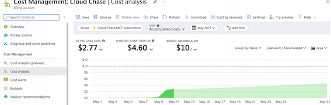

### Demo

**Cost Management**

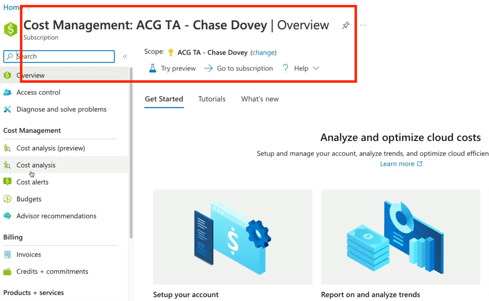

**Cost analysis**

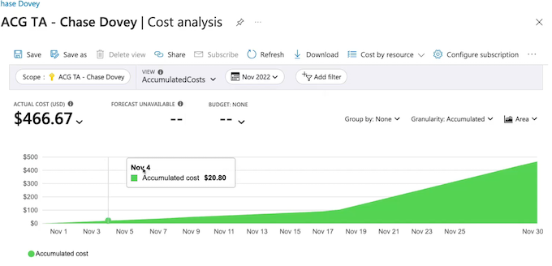

Maybe we want to look at our **costs on a DailyCosts basis to see how much we're spending on a daily basis** inside of Azure so that we can identify a specific point in which our costs have gone up or down to understand what was taking place at that time. 

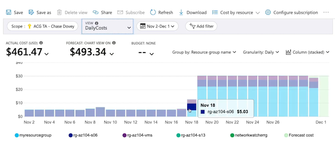

We also see we have other views that **allow us to break out our costs into services, for example, Azure Bastion, Application Gateway, Storage, Virtual Machines**. We can break out our cost into <mark>location, resource group name</mark>. 

* For example, Compute, Networking, Storage. And we can build out a quote by selecting specific workloads. 
* Then maybe we're going to need a networking resource, such as a virtual network, to have this VM running inside of that. VPN gateway to connect that virtual network into our on-premise environment. 

### Key Takeaways

* <mark>Pricing Calculator： Estimate workload costs for prospective workloads</mark>
* <mark>TCO Calculator： Compare costs to determine cost savings between on-premises and TCO cloud solutions</mark>
* <mark>**Cost Management： Analyze costs, apply filtering, and create budgets**</mark>

### Chatgpt summary

1. **Understanding Azure Costs**:
   - Azure costs are impacted by various components such as subscription types, resource types, usage meters, resource usage, location, etc.
   - Azure costs are different from traditional on-premise costs as Azure handles the underlying infrastructure, and users only pay for the resources they use.

2. **Cost Best Practices**:
   - Select appropriate resources for the use case to avoid wasting money.
   - Understand resource needs and choose the right sizing for resources.
   - Deallocate resources when not needed to save costs.
   - Utilize cloud capabilities like scalability and elasticity to match resource usage with demand.
   - Plan costs in advance before purchasing Azure services.

3. **Cost Management Tools**:
   - **Microsoft Cost Management**: Allows for cost analysis and budget creation to monitor Azure spending.
   - **Pricing Calculator**: Estimates workload costs by defining workload details before provisioning resources.
   - **Total Cost of Ownership (TCO) Calculator**: Compares on-premise workload costs with Azure costs to determine potential savings by migrating to Azure.

4. **Key Takeaways**:
   - Understanding cost best practices is crucial for optimizing Azure spending.
   - Tools like the Pricing Calculator and TCO Calculator help in estimating and comparing costs for workloads in Azure.
   - Microsoft Cost Management tool provides insights into Azure spending and enables budget creation.

## 7 Building a Cloud Governance Strategy

Defining Governance

* **Rules / Policies /Compliance standards**
* Control over resources 
* Enforce rules, policies, and standards

> Policies and standards: Data sovereignty, such as GDPR
> 
> Regulatory compliance, such as PCI or HIPAA

### Planning Cloud Strategy

* **Define**
	* Define the cloud governance needs of the organization.
* **Plan**
	* Plan which tools will be used to implement governance.
* **Ready**
	* Understand how those tools will be used to implement governance.
* **Adopt**
	* Implement governance for the organization using cloud strategy

### Governance Services

**Management Groups And Subscriptions**

Organize subscriptions into hierarchical structures.

> So that we have varying scopes in our organization to do things like provide **Azure RBAC role assignments so that we can use these RBAC roles and provide identities with these role assignments at varying scopes**, like management groups and subscriptions
> 
> Subscriptions are also our **billing entity inside of Azure** where we have an accumulative cost for those Azure resources that we've used

**Azure RBAC**

Provide access to resources at varying scopes.

**Policies And Blueprints**

Implement policies to enforce standards and provide blueprints for cloud environments.

> providing governance compliance strategies for our cloud environments.

**Locks And Tagging**

Lock resources to prevent deletion and tag resources to categorize

* Locks: Such as read-only locks or delete locks to prevent deletions of resources or to prevent update operations of resources. 

* **Resource tagging conventions** to categorize and organize our resources for various reasons 
	* all the way from automation, 
	* Cost analysis, 
	* Getting a high-level overview of all of our resources inside of Azure so that we can organize them

### **Bringing It All Together**

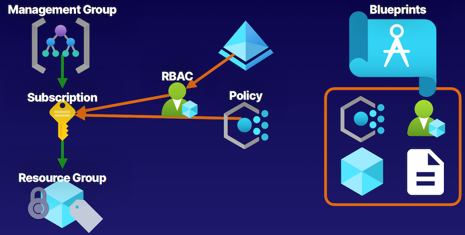

* Management groups as container like subscriptions to help us create some hierarchal structure for organizations. 
	* These subscriptions are that **billing entity** that **contains our resource groups** and the resources that they contain. 
	* Can perform some sort of **cost analysis** on these resources from our subscriptions. 
* The **governance tooling** of also using **Azure Policies to enforce compliance standards**, 
	* such as a tagging name convention for resources inside of Azure.  
	* Role assignment with these Azure RBAC roles

* **Role assignment with locks**
	* when users have role assignments to access specific resources, there are specific things like locks, like a **read-only lock or a delete lock that are going to override those permissions that they may have to prevent specific operations**. 

* read-only locks that prevent any other operation other than reads. 
* delete locks that prevent delete operations but still allow authorized users to perform those read and update operations on resources. 

### GPT summary

1. **Defining Governance and Planning a Cloud Strategy**:
   - Establishing rules, policies, and compliance standards for the organization.
   - Defining governance needs, policies, and standards based on organizational requirements.
   - Planning tools and services for implementing governance in Azure environments.

2. **Governance Services in Azure**:
   - Management groups and subscriptions for organizational hierarchy and structure.
   - Azure RBAC role assignments for managing identities at varying scopes.
   - Azure Policies for enforcing standards and compliance initiatives.
   - Resource locks and tagging for resource management and organization.

3. **Key Takeaways**:
   - Management groups and subscriptions help create hierarchical structures.
   - Azure Policies enforce compliance standards like tagging naming conventions.
   - Role assignments and resource locks ensure proper access control and operations.
   - Azure Blueprints (optional) offer advanced features for packaging organizational structures and policies.
