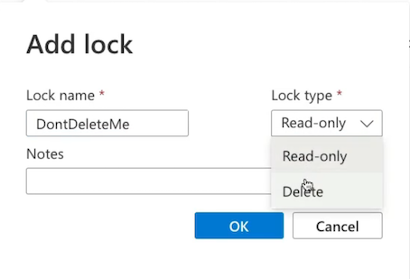

# 2 Governance and Compliance

## 1 Managing Subscriptions

**Describing Subscriptions**

What are subscriptions? 

* **Billing unit that aggregates all costs of underlying resources**
* Contain resource groups and their associated resources
	* Such as virtual machines, virtual networks, and storage accounts.
	* Resource groups don't cost us anything, but some resources do, like virtual machines, storage accounts, virtual networks, public IP addresses
* **Scoping level for governance and security**

**Describing Subscriptions**

**Types of Subscriptions**

**Subscription Naming Conventions**

**Prod/Dev/Staging**

Subscriptions named based on whether or not they are production, development, or staging environments.

**Department/Teams**

Subscriptions named based on the department or team the subscription is intended for, so that billing can then be easily associated with a given business unit.

**Region**

Subscriptions named based on the region of the business that uses the subscription.

**Takeway**

* Billing unit that aggregates all costs of underlying resources
* Scoping level for governance and security
* Contain resource groups and their associated resources
* **Can only be associated with a single organization (Azure AD tenant) at a time**

## 2 Using Management Groups

### 2-1 **Defining Management Groups**

Managing Subscriptions

Organize and manage subscriptions by logically grouping them into management subscriptions.

* Organizational hierarchy
* **Provides another scope for enforcing governance and compliance**

### 2-2 Defining Management Groups

> Management groups as this kind of **logical container** that we can use to **manage subscriptions**
> 
> Place subscriptions inside of **management groups** to organize and manage them

**Parent-Child Relationships**

* Root management group is the top level
* Management groups and subscriptions can have a single parent
* **Supports 6 levels of hierarchy**

*  For management groups, there is always this **parent-child relationship between the root-level management group**, which is the top-level management group 
*  This management group is the root parent
*  All management groups underneath that and subscriptions underneath that, have a **parent-child relationship with one another**

**Compliance support**

* Azure Policies
* Azure role-based access control（RBAC)

> The compliance support for management groups is **Azure Policies** and **Azure role-based access control**.
> 
> Deploy something known as Azure Policies into our management groups, and **that will trickle down to all the other management groups and subscriptions underneath it**.

**Understanding Hierarchy**

Under this root management group we have a marketing management group. 

**Scoping**

use management groups as scope levels

For example, we have users that we want to provide access for a specific management group using a **contributor role for example, so that they can act as contributors for the IT management group.** 

* **<mark>Root management group access is not given by default</mark>**
	* Microsoft is very careful about providing access to this as it would provide access to do things throughout your entire environment. 

* **<mark>Root management cannot be moved or deleted</mark>**
* **<mark>Azure RBAC supported for management groups</mark>**
* **<mark>Global Administrators must be elevated to User Access Administrator of root group</mark>**

## **3 Understanding Azure Policy**

### 3-1 Enforce Compliance and Enable Auditing

Organizations need to implement enterprise-level governance and compliance capabilities.

Defining Azure Policy

* **Prohibit Resources**
> prohibit specific VM sizes inside of our environments.

	* Control costs
	* Restrict service access

* **Allowed Locations**
	* Geographical compliance

> organization that operates inside of the EU, operate inside of the EU, we have to be compliant to data sovereignty rules of GDPR. And so we need to make sure that workloads that we're deploying for those related purposes inside of the EU follow specific geographical compliance requirements. 

**Compliance dashboard on the Azure Policy**

### Components of a Policy

* **Policy Definition**

	* **Defines the evaluation criteria for compliance, and defines the actions that take place**. 
	* Either audit or deny should something be outside of compliance

* **Policy Assignment**

	* The scope at which we will assign our policy. 
	* The scope **could be a management group, subscription, resource group, or resource**.

* **Initiative Defintion**

A collection of policies that are tailored to achieving a singular high-level goal together. 

**For example, ensuring that VMs meet standards.**

### **3-2 Policy Example** --- Require Tags

**Policy Definition**

Evaluate if a VM is being created with our tag `Project: az104`. If the VM is missing the tag then deny creation of the resource.

> For example, if we try to create a virtual machine inside of this resource group, and we create it without the appropriate tags, it's going to fail that deployment, it will not pass validation, and we won't be able to deploy that virtual machine.

**Policy Assignment**

Assign the policy at the scope of the resource group where the VMs will be created.

### 3-3 Key Takeaways

* Policy Definition
* Policy Assignment
* Initiative Definition

--

* Create, Manage, and Assign policies
* Enforce compliance with resources
* Audit compliance
* Deny creation of resources outside of compliance

For example, requiring the tag, Allowed Locations, specific allowed VM SKUs.

## **4 Tagging Resources**

### 4-1 What Are Tags?

**Describing Resource Tagging**

> Tags inside of Azure are simply just a name-value pair.

* `Name:Value`
* `Dept:Marketing`
* `Env:Prod`

* Name can be 512 characters and value can be 256 characters
* Storage accounts can only have a name with 128 characters

> could create a name for a tag that says department. 
> 
> Cost analysis where we're trying to derive how much money is the marketing team spending.
> 
> Determine our costs geographically.

We can use it for things like performing automated operations by doing things like getting all of the resources, **such as virtual machines, running inside of Azure that are part of the development workload, using that development tag**.

**Resource Tag Assignment Hierarchy**

* **Tags are not inherited**

The department marketing tag in the marketing subscription is **not going to be inherited by all of the underlying resource groups and resources that they contain.** 

* **A resource can have 50 tags**

Example: add tags to the resource group

**<mark>Tags are not inherited from the higher scope</mark>**

### 4-2 Key Takeaways

* Manage resources via tags. For example, shutting down all VMs with a specific tag.
* **Tags are not inherited from the higher scope like a resource group. Each resource must be tagged.**

## 5 Locking and Moving Resources

### 5-1 Describing Resource Locks

* Locks allow you to **override permissions to resources**
* Can **lock subscriptions, resource groups, or resources**
	* They can perform read operations and specific write operations, as long as one of those write operations is not deleting that resource
* Lock restrictions apply to **all users and roles**

> **.So regardless of a role assignment of a user and what permissions we may have, they have to abide by these resource locks, which will override their permissions.**

### 5-2 Types of Resource Locks

Lock Types

* **ReadOnly** allows authorized users to read a resource, **but they cannot delete or update the resource**
* **CanNotDelete** allows authorized users to read and modify a resource, but they cannot delete the resource
* **<mark>Locks are inherited from the parent scope</mark>**

So if we have one assigned here at the subscription as we see with marketing subscription, it's going to be inherited by all of the resource groups and resources that are inside of that subscription. 

### 5-3 Moving Resources

Moving resources that are contained in a specific place in Azure, for example, inside of a subscription,  these resources nested inside of a logical container like a resource group. 

* **we could move resources inside of Azure between resource groups**.
* **we can also move resources inside of Azure from subscription to subscription**

### Demo

Add a ReadOnly lock on a virtual machine

**Add CanNotDelete Lock**

**Add Readonly Lock**

Move a virtual machine from one resource group to another

### Moving Resources

moving resources, we can also **move them between subscriptions in Azure for cross-subscription movement and also move them between regions.**

**Supported Resources**
	
* Virtual Machines
* Storage Accounts
* Virtual Networks

**Unsupported Resources**

* **Azure Active Directory Domain Services**
* **Azure Backup Vaults**
* **Azure App Service Gateways**

## 6 Managing Azure Costs

**On-premise resources**

And we're only paying for how much we use this resource. And that's things such as the CPU, the memory, the disk size. We're also paying for things like traffic for our network. We are not paying for the underlying infrastructure, nor are we paying to have people manage the underlying infrastructure of the Azure cloud. 

**So we're minimizing our costs and minimizing our responsibility in the shared responsibility model.** 

### What Affects Cost?

* **Subscription Type**： **Free, pay-as-you-go**, Enterprise Agreement, and Cloud Solution Provider (CSP)

> There are free subscriptions, where you're going to get only specific services for free, or you'll get free up to a limited point.
> 
> There's Enterprise Agreements. And then there's even **subscription types such as a Cloud Solutions Provider**, and **this is where you're using a cloud solutions provider**, a third party, to help manage your Azure environment. because they are managing **multiple environments for multiple organizations**, they are then afforded savings on costs inside of Azure from Microsoft that they can then choose to pass on to you as a customer. 

* **Resource Type**： For example, storage account Blob storage vs. table storage
* **Usage Meters**： Utilities like overall CPU time, ingress/egress network traffic, and disk size
* **Resource Usage**： The costs of actually using a resource
* **Location**： The costs for various services vary across geographical regions

### Cost Best Practices and Tools

**Best Practices**

* Select the appropriate resource for use case
* Understand resource needs (sizing)
* Deallocate resources when not needed
* Use cloud capabilities where possible (Scalability, Elasticity)
* **Plan costs prior to purchase**

**Cost Tools**

* **Pricing Calculator**：
	* Can be used to **create quotes of workloads that we define so that we understand** how much they will cost us before we actually provision any of these resources inside of Azure. 
* **Total Cost of Ownership (TCO)  Calculator**
	* This tool will help us understand how much workloads we have running on-prem would cost us if we were to run the equivalent workloads on Azure services.
	* This is a tool that we can utilize to perform some cost analysis once we actually have our Azure resources running, and this is the Microsoft Cost Management tool.
* **Cost Management**
	*  Allows us to analyze our costs by performing specific cost analysis functions

**Using Cost Management**

* Create Budget
* Analyze Costs

### Demo

**Cost Management**

**Cost analysis**

Maybe we want to look at our costs on a DailyCosts basis to see how much we're spending on a daily basis inside of Azure so that we can identify a specific point in which our costs have gone up or down to understand what was taking place at that time. 

We also see we have other views that allow us to break out our costs into services, for example, Azure Bastion, Application Gateway, Storage, Virtual Machines. We can break out our cost into location, resource group name. 

* For example, Compute, Networking, Storage. And we can build out a quote by selecting specific workloads. 
* Then maybe we're going to need a networking resource, such as a virtual network, to have this VM running inside of that.
* VPN gateway to connect that virtual network into our on-premise environment. 

### Key Takeaways

* Pricing Calculator： Estimate workload costs for prospective workloads
* TCO Calculator： Compare costs to determine cost savings between on-premises and TCO cloud solutions
* **Cost Management： Analyze costs, apply filtering, and create budgets**

## 7 Building a Cloud Governance Strategy

Defining Governance

* **Rules / Policies /Compliance standards**
* Control over resources 
* Enforce rules, policies, and standards

> Policies and standards: Data sovereignty, such as GDPR
> 
> Regulatory compliance, such as PCI or HIPAA
> 
> 

### Planning Cloud Strategy

* **Define**
	* Define the cloud governance needs of the organization.
* **Plan**
	* Plan which tools will be used to implement governance.
* **Ready**
	* Understand how those tools will be used to implement governance.
* **Adopt**
	* Implement governance for the organization using cloud strategy

### Governance Services

**Management Groups And Subscriptions**

Organize subscriptions into hierarchical structures.

> So that we have varying scopes in our organization to do things like provide **Azure RBAC role assignments so that we can use these RBAC roles and provide identities with these role assignments at varying scopes**, like management groups and subscriptions
> 
> Subscriptions are also our **billing entity inside of Azure** where we have an accumulative cost for those Azure resources that we've used

**Azure RBAC**

Provide access to resources at varying scopes.

**Policies And Blueprints**

Implement policies to enforce standards and provide blueprints for cloud environments.

> providing governance compliance strategies for our cloud environments.

**Locks And Tagging**

Lock resources to prevent deletion and tag resources to categorize

* Locks: Such as read-only locks or delete locks to prevent deletions of resources or to prevent update operations of resources. 

* **Resource tagging conventions** to categorize and organize our resources for various reasons 
	* all the way from automation, 
	* Cost analysis, 
	* Getting a high-level overview of all of our resources inside of Azure so that we can organize them

### **Bringing It All Together**

* Management groups as container like subscriptions to help us create some hierarchal structure for organizations. 
	* These subscriptions are that **billing entity** that contains our resource groups and the resources that they contain. 
	* Can perform some sort of **cost analysis** on these resources from our subscriptions. 
* The **governance tooling** of also using **Azure Policies to enforce compliance standards**, 
	* such as a tagging name convention for resources inside of Azure.  
	* Role assignment with these Azure RBAC roles

* **Role assignment with locks**
	* when users have role assignments to access specific resources, there are specific things like locks, like a **read-only lock or a delete lock that are going to override those permissions that they may have to prevent specific operations**. 

* read-only locks that prevent any other operation other than reads. 
* delete locks that prevent delete operations but still allow authorized users to perform those read and update operations on resources. 

