# 3 AZ Identity

## Introduction

**Azure AD**

* Identity and Access Management (IAM) basics; 
* define Azure AD, Azure AD tenants, and Azure AD architecture; 
* compare Azure AD and Active Directory; 
* Create and switch between tenants.

**Azure AD Users**

* Define users, types of users, methods of creating users, and architecture; 
* Create and delete users; 
* perform bulk user updates; 
* invite guest accounts.

**Azure AD Groups**

* Define groups, group and membership types, and role-based access control (RBAC); 
* Create dynamic groups; 
* and assign access to resources.

**Administrative Units**

* Define Multi-Factor Authentication (MFA) and self-service password reset (SSPR); 
* enable MFA; 
* and enable SSPR. 


**Azure AD Join**

* Define Azure AD Join, device settings, and conditional access; 
* join Windows 10 to Azure AD.


## 2 Conceptualizing Azure Active Directory

### IAM Basics

**Principal**

An unauthenticated entity that will seek to authenticate as an identity

**Identity**

A identity profile that is authenticated against using credentials.

**Authorizations**

Actions that are permitted/prohibited for an identity to perform.

### What is Azure AD?

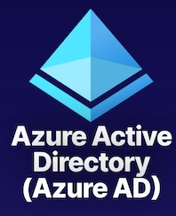

**Identity and Access Management (IAM)**

Global cloud-based identity service for Azure that provides an identity repository.

**Create Identity Resources**

Create users and groups.

**Manage Identity Security**

Enable MFA, control resource access, and provide policy-based controls.

### Azure AD Tenant Architecture

Azure AD is **identity and access management solution for the cloud.** It provides our cloud-based identities that it contains, and it allows them to access resources.

And while it is a global service that spans the Azure cloud, our specific instance of this service that we get to use is going to be scoped to geography. 


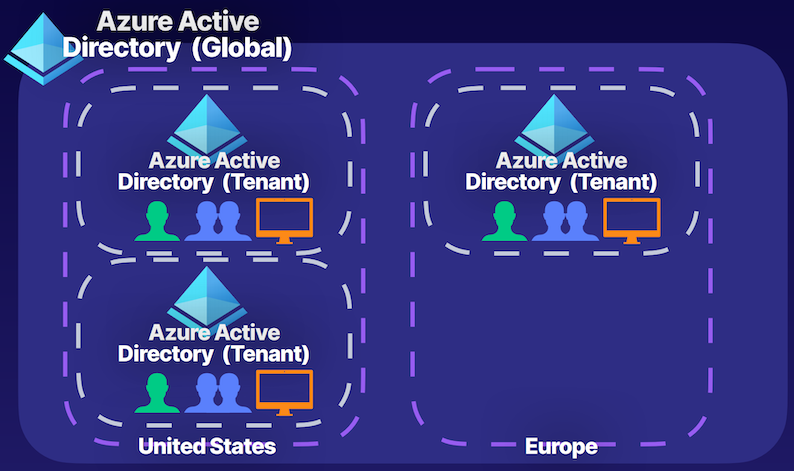

**Organization = Tenant = Directory**

If we create our tenant in the United States, it's because we were in the United States when we created it at that time. And it could be the same for Europe; **if you're creating an account from Europe, you're going to end up with an instance inside of the Europe geography of the Azure cloud**.

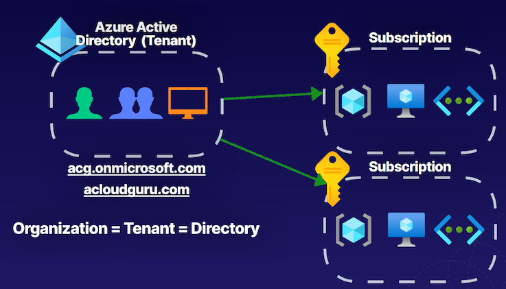

Azure Active Directory tenant

Default domain name for tenant. typically follows a form of, for example, **atld.onmicrosoft.com**. and it's always going to follow this format of our **prefix.onmicrosoft.com**

Those identity resources have role assignments to perform actions on subscriptions that our Azure Active Directory is associated with, and this can happen for multiple subscriptions. 


Trust relationship that we establish **between our tenant and our Azure subscriptions is a one-to-many relationship**

**One tenant can be associated with multiple subscriptions at a time**, providing those identities that exist within it, access to Azure resources in those subscriptions, **but a subscription can only be associated with a single Azure Active Directory tenant at a time.**

### Azure AD Features

* **IAM Platform**： Identity and Access Management (IAM) for Azure cloud-based resources.
* **Enterprise Access**： Additional security for applications and devices both on-premises and in the cloud
* **Identity Integration**： Hybrid identity and single sign-on (SSO) using Azure AD Connect and Azure AD Domain Services.
* **Identity Security**： Additional security with Multi-Factor Authentication (MFA) and  Privileged Identity Management (PIM）
* **Collaboration and Development**  Azure AD B2B for collaboration  and Azure AD B2C to support development.
* **Monitoring**： Audit logs, security monitoring, identity protection, and risk management.
	*  Audit logging where can **perform audit logs of sign-ins or security events based on identities**. 
	*  We also have some identity protection and risk management functionalities, such as user sign-in risks, and can determine things like risky behaviors of users that are signing in, for example, **from untrusted IPs or for example, things even like impossible travel**.


We can integrate these services using something known as **<mark>Azure AD Connect</mark>,** and we can also provide those users that are being **synced from our on-premises environments into the cloud with the ability to use single sign-on** so that we don't have to sign in to various things multiple times, **we can just sign in once and access all of our resources.** 

### Azure AD Features

**Azure Licensing Features**

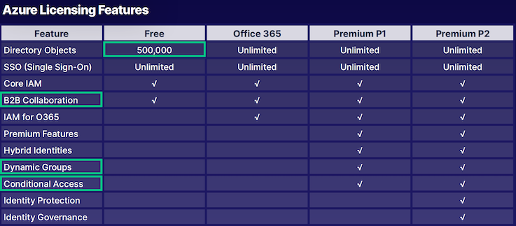

### Azure AD vs. Active Directory

**Active Directory**

* Organizational units (OUs)
* Group Policy Objects (GPOs)
* Kerberos, LDAP, NTLM
* Hierarchical
	* **Active Directory is traditionally a hierarchical structure in terms of providing identity and access management, on-premises, locally.**
* On-Premise

**Azure AD**

* Administrative units:  **logical grouping for users inside of our organizations**. 
* SAML, WS-Federation, OAuth
* Flat directory structure: **There is no hierarchy here**. 
* Cloud-based solution
* Global

> Note: Microsoft cloud-based offerings that use Azure AD for IAM include Azure, Microsoft 365, Microsoft Intune, and Microsoft Dynamics 365

**we can extend the functionality between Azure Active Directory and Active Directory on-prem using Azure AD Connect**

### Key Takeaways

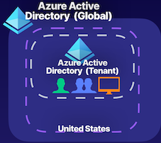

**Identity and Access Management (IAM)**

Global cloud-based identity service for Azure that provides an identity repository.

**Create Identity Resources**

Create users and groups.

**Manage Identity Security**

Enable MFA, control resource access, and provide policy-based controls

## 3 Managing Tenants

hybrid identity where we're connecting our Azure AD tenant to our **on-premises domain solutions, like Active Directory Domain Services so that we can sync those identities up into our Azure cloud environments using Azure AD Connect.**
 
### Planning Our Organization

**Designing Tenants**： Planning out the design of our tenant 

* **Monitor and Automate**： Monitor administrators, perform access reviews, and automate user lifecycles.
	*  Resetting the password after a period of time automatically so that **users are always prompted to create a new password**
* **Manage Apps**： Identify apps to be used from App Gallery and register apps from on-prem.
* **Populate Identity Resources**： Add users, create groups, add devices, and set up hybrid identity.
* **Build Secure Foundations**： Set up best practices like SSPR, MFA, backup global admin, and privileged users for specific tasks.

### Key Takeaways


* Azure Active Directory is a global service that spans the Azure cloud.
* Create instance of that service known as a tenant inside of geographical regions like the United States.
* Tenant of Azure Active Directory will be running on servers allocated for Azure Active Directory global service inside of that geographical region.
*  identity objects, like users and groups, devices, and applications are all going to exist.

## 3 Creating and Managing Users

### Describing Users

Azure AD tenant,  **like users, and these users are just identity objects with a set of permissions**, and that's what defines the type of user it is, and also where the user originates from whether it originated inside of our Azure AD tenant, or it originated from someone outside of our Azure AD tenant.

**Azure AD**

* **Administrators**:  Global admins / billing administrators / User administrators
* **Members**
	*  members of our tenant can be **support enginee**r that needs to manage virtual machine workloads
	*  Could be our organization's **data engineering team**, and they may have access to a specific set of services inside of Azure, at various scopes. 
* **Guests**

### Describing Users

* Members have default permissions
* These identities are JSON objects
* **Each user can have role assignments**
	* which is the thing that provides them the access to perform specific operations at various scopes inside of our Azure environments.
* **Each user can have object ownership**
	* A user could be the owner of a group object that is used to manage other users
	* Manager will have their identity object, and then they're an owner of a group object, which is their team members, and they will manage their access

```
{
 "accountEnabled": true,
 "department": "Student",
 "displayName": "Eruza Duolc”,
 "studentId": 0123456,
 "givenName": "Eruza",
 "jobTitle": "Student",
 "objectType": "User",
 "surname": "Duolc",
 "usageLocation": "US",
 "userPrincipalName": 
 "eruza@example.onmicrosoft.com",
 "userType": "Member"
}
```

### **Types Of Users**

* **Administrators**: Users with an administrator role assigned.
* **Members**: Regular users that are native to Azure AD.
* **Guests** External users that are invited to the Azure AD Tenant.

### **Methods of Creating Users**

* **Azure Portal**

Navigate to Azure AD service > Select Users  > New User

* **Azure CLI**

```
#create user
az ad user create
```

* **PowerShell**

```
#create user
New-AzureADUser
```

### Demonstration

* **Create/Add A User**： Create a member account inside of Azure AD
* **Bulk Add Users**： Using a CSV file, bulk add users to Azure AD.
* **Update User Properties**： Update the properties to show this user is part of the HR department.
* **Invite a Guest Account** Invite an external guest into Azure AD.

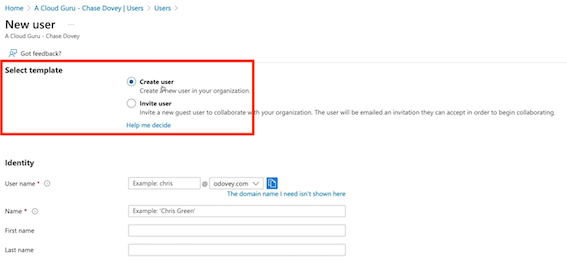

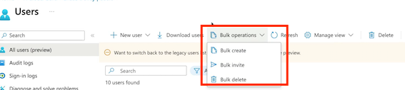


### Key Takeaways

**Type Of User**

Administrator, member, and guest accounts

**Role Assignment**

Determines permissions and access

**Obiect Ownership**

Apps, devices, groups, and resources that are owned

### Gpt comment
 
The key takeaways from this article are:

* Users in Azure AD are identity objects with a set of permissions, and they can originate from within or outside the Azure AD tenant.
* Administrative users have specific roles assigned to them, while tenant members can be employees or specific teams with access to Azure services.
* Guest users are external users invited to collaborate within the Azure AD tenant.
* Users have default permissions and properties that can be modified, such as job title, display name, and usage location.
* Role assignments provide users with access to perform specific operations within Azure environments.
* Users can have **object ownership, allowing them to manage apps, devices, groups, and resources they own within Azure**.

## 4 Creating and Managing Groups

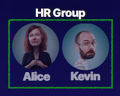


### Describing Groups

* **Owner and Members**: An owner of the group or a member of the group
* **Type of Group** A security group or a Microsoft 365 group
* **Membership Type** Assigned, dynamic user, or dynamic device


### **Demonstration**

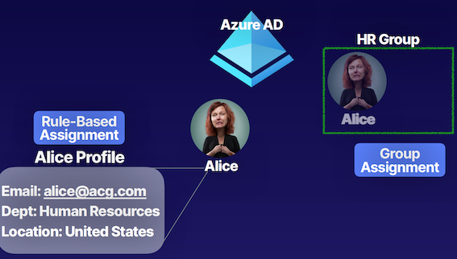

**Create/Add a Group**

Create a dynamic security group for guests accounts.

**Add a Dynamic Query**

Add a query that will dynamically manage group membership by adding guest accounts.

### Group Types

* **Security** Security groups are used to manage access to shared resources for a group of users
* **Microsoft 365**  Microsoft 365 groups are used to give members access to a shared mailbox, calendar, files, etc.

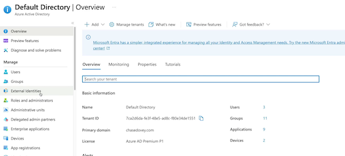

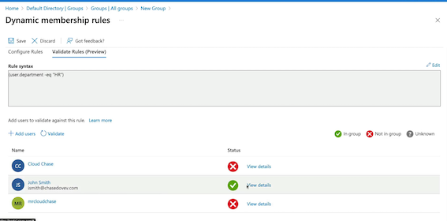

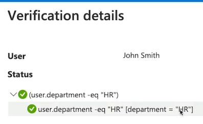


### **Membership Types**

* **Assigned** Users are specifically selected to be members of a group.
* **Dynamic User** Membership rules are created that automate group membership via **user attributes.**
* **Dynamic Device**  Membership rules are created that automate group membership via **device attributes**.

First and foremost, we can directly assign members to a group, so add those users or devices directly to the groups by manually assigning it. 

Then we also have that dynamic user type where we can create those types of queries to manage membership for those groups using a property of, for example, our users, such as the department, or the user type as we saw in our demonstration. **So we're using these identity object attributes to manage the membership for groups without having to manage things manually.** 

It's going to use those device attributes for devices that we're managing through our Azure AD tenant. 


## 5 Creating Administrative Units

### Describing Administrative Units

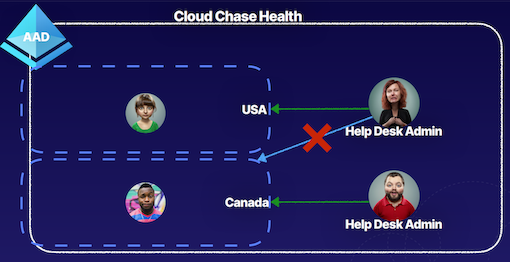

### Demonstration

**Plan the Organization**

Plan the organization and evaluate its needs to determine the value that administrative units can provide for managing identities like groups and users.

**Create an Administrative Unit**

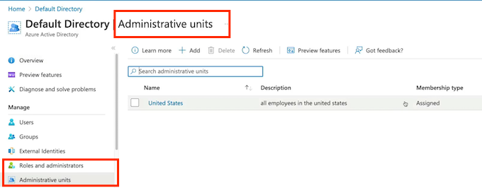

* Create an administrative unit to logically
* Divide the organization and allow for scoping.

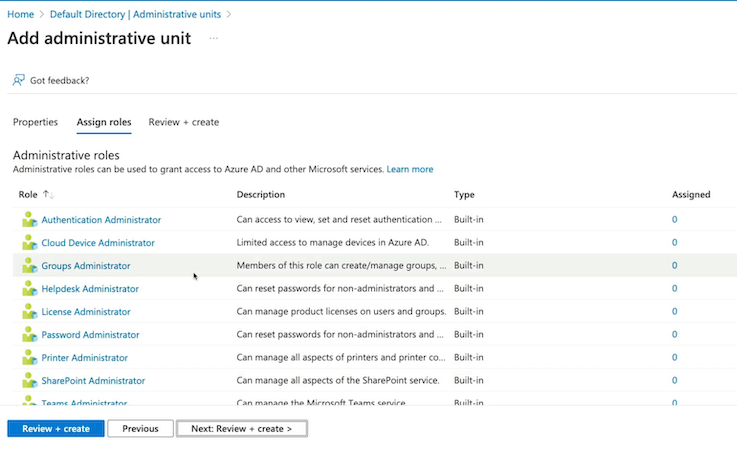


**Key Takeaways**

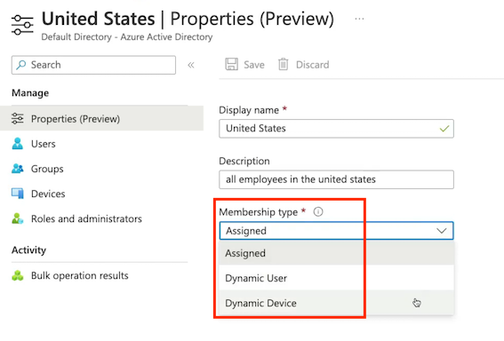


**Summary from ChatGPT**

* Administrative units act as a logical container within a flat data structure of Azure Active Directory, allowing for organization and scoping of Azure AD identity objects.
* They enable control of the scope of administrative users, **preventing them from having default tenant-level access and allowing for specific scoping to manage specific identity objects**.
* Common use-case examples include **geographical locations, business departments, and subsidiary organizations** of a parent organization using the **same Azure Active Directory to manage all entities.**
* **Administrative units** can be used to **manage users, groups, and devices**, and can be assigned specific administrative roles tailored to the needs of the organization.
* Azure AD P1 and P2 licensing allows for the management of membership types to administrative units, **including Assigned, Dynamic User, and Dynamic Device, which can be used to manage identity objects within the administrative units**.

## 6 Configuring SSPR

Self-Service Password Reset (SSPR)

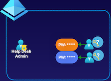

* Enable users to change or reset
* Increased productivity
* Decreased admin overhead

**SSPR Process**


### Authentication Methods

* **Mobile App**: Authentication via app notification. An example is the Microsoft Authenticator application.
* **Mobile Phone**: Authentication via a mobile number using a phone call or SMS that provides a code. (Less recommended method.)
* **Mobile App Code**： Authentication via time-based codes. An example is the Microsoft Authenticator application.
* **Office Phone**： Authentication via a non-mobile phone using a phone call that prompts the user to press #.
* **Email**： Authentication via an email external to Microsoft using codes sent to that email address.
* **Security Questions**： Authentication via answering a set of security questions. (Least recommended method.）

### **Enable and manage SSPR via Azure AD groups.**

**Required Methods**

One or more of the available authentication methods is required for SSPR.

**SSPR for Admins**

<mark>Security questions not available for admins. By default, admins must register for MFA methods.</mark>

**Required Licenses**

Azure AD P1 or P2, Microsoft Apps for Business, or Microsoft 365 licensing is required for SSPR.

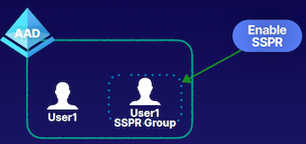

* Create a SSPR group
* Add user to group
* Enable SSPR
* Test SSPR


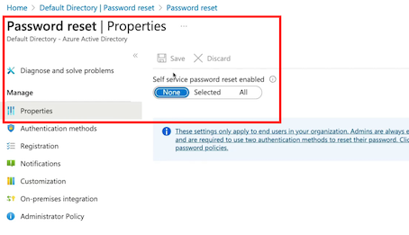

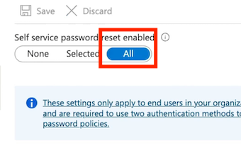

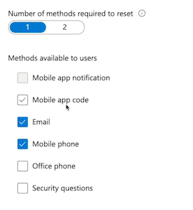

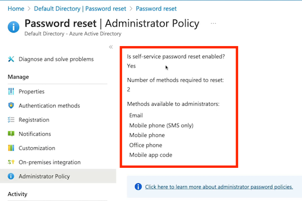


### Self-Service Password Reset (SSPR)

**Unauthenticated users use SSPR**

* Decreased administration overhead
* Secure password reset for users and admins

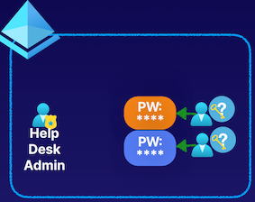

### **Summary from ChatGPT**

* Traditional password reset method required users to request help desk admin to reset their passwords, **leading to decrease in productivity**.
* Self-service password reset(SSPR) enables users to reset their passwords **without help desk admin, increasing productivity and decreasing admin overhead.**
* SSPR process involves localization, verification, authentication, and setting options for notifications.
* Authentication methods include mobile app, mobile app code, email, mobile phone, office phone, and security questions.
* SSPR considerations include enabling and managing via Azure AD Group, **different authentication methods for regular users and administrators, and required licensing for SSPR.**
* The key takeaway is that SSPR provides a secure and productive way of resetting passwords for users and administrators.

## 7 Azure AD Device Management

### Basics of Device Identity

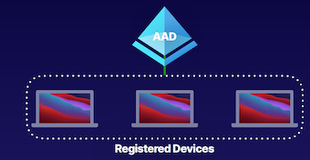

### Basics of Device Identity

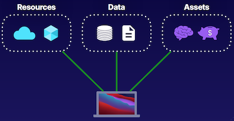

### **Registration Options**

**How to Register Devices**

* **Azure AD  Registered**

Least restrictive option, allowing for Bring Your Own Device (BYOD) with a personal Microsoft or local account. Supports Windows 10, iOS, iPadOS, Android, and macOS

* **Azure AD Joined**

Device is owned by the organization and accesses AAD through a work account. These identities only exist in the cloud. Supports Windows 10 and Server 2019.

* **Hybrid Azure AD Joined**

Similar to AAD joined, however these device identities exist both onpremises and in the cloud.  Supports Windows 7, 8.1, 10, and Server 2008 or late

### Conditional Access Policies

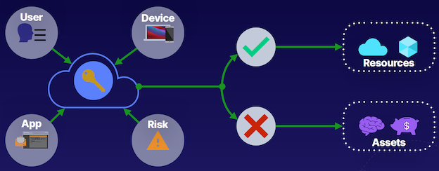

> **NOTE: Requires Azure AD P1 license or Microsoft 365 Business license**

### **Common Signal Types**

1. **User or Group**: Provides fine-grained access to resources based on user identity or group membership.
2. **IP Location** Uses an allow list of trusted IP addresses and a deny list of blocked IP addresses to control access to resources.
3. **Device**: Allows for device type and device state to be evaluated in conditional access policy
4. **Application**: Allows control of access to an application on a specific device. Microsoft Cloud App Security can be used to control access to cloud.
5. **Real-Time Risk**: Uses Identity Protection to detect risk at sign-in and during a user’s session to calculate overall real-time risk.

### Common Decisions

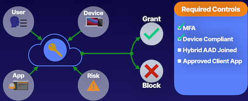

### Key Takeaways

**Device Identity + Conditional Access**

* Simplified procedure for adding and managing devices
* Improved user experience on devices
* Support for Microsoft Intune
* Single Sign-On (SSO) for any registered or joined devices


### **Summary from ChatGPT**

* Azure Active Directory is the identity solution inside of the Azure Cloud.
* Identity objects are used to authenticate into Azure environments.
* **Devices need to be managed and registered in Azure Active Directory to control access to resources, assets, and data.**
* Three registration options for devices in Azure Active Directory: **Azure AD Registered, Azure AD Joined, and Hybrid Azure AD Joined**.
* **<mark>Azure AD Registered is for devices owned by employees, while Azure AD Joined is for organization-owned devices.M/mark>**
* **Device settings** in Azure AD can be managed at the tenant level to control device join and registration.
* **Hybrid Azure AD Joined is a device that exists both on-premises and in the cloud**.
* Registering and joining devices in Azure Active Directory provides improved user experience with features like single sign-on.

## 8 Configuring Azure AD Join

***What Is Azure AD Join?***

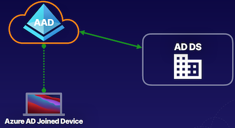

### **Device Management**

**Management Options**

Choosing between Mobile Device Management (MDM)-only or co-management options for device management

**MDM-Only**

MDM system support using Microsoft Intune

**Co-Management**

Locally installed Configuration Manager and MDM provide

### Provisioning Azure AD Join

> Manage via Device Settings

**Self-Service**

Manually configure via Out of Box Experience (OOBE)or from Windows Settings. Technical 
users only

**Windows Autopilot**

Pre-configure OOBE to provide automated device joining and automated MDM enrollment.

**Bulk Enrollment**

Use a bulk provisioning tool or package to join a large number of devices.

### Enterprise State Roaming

* Provides user settings and app data across devices
* Separates corporate data and user data
* Syncs with Azure Cloud

## Azure Active Directory Conclusion

**Azure AD**

**Azure AD as the identity and access management service for the Azure cloud**. 

IAM basics; define Azure AD, Azure AD tenants, and Azure AD architecture; compare Azure AD and Active Directory;  and create and switch between tenants.

**Azure AD Users**

Define users, types of users, methods of creating users, and architecture; create and delete users; perform bulk user updates; and invite guest accounts.

**Azure AD Groups**

Define groups, group and membership types, and RBAC; create dynamic groups; and assign access to resources

**Azure AD Join**

Define Azure AD Join, device settings, and conditional access; join Windows 10 to Azure AD.


### **Summary from ChatGPT**

1. Azure AD tenants are the instance of the Azure AD service.
2. Azure AD architecture was discussed to understand its structure.
3. Comparison between Azure Active Directory and Active Directory was made to highlight the differences.
4. The creation and management of user accounts were demonstrated, including member, administrative, and guest users.
5. **Use of groups to manage users and administrative units to limit administrative control was discussed**.
6. Self-service password reset (SSPR) was highlighted as a feature to reduce password reset workload for administrators.
7. Device settings and management in Azure AD, including joining devices to the network using Azure AD join, were covered.
8. The importance of Azure AD in identity and access management, including user roles, permissions, groups, and device identities, in the Azure cloud.
