# 4 Role-Based Access Control

## 1 Understanding Roles in Azure

### Describing Role-Based Access Control (RBAC)

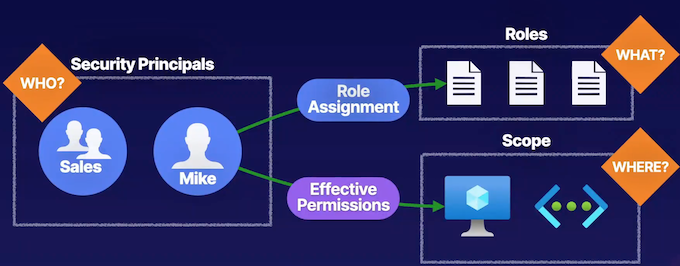

**Describing Azure Roles (Azure RBAC)**

**Users**: be based on a role definition and a role assignment to provide that role to one of these security principles. 

**Scope** where they can perform these actions that they've been assigned based on the role. 

**Can make a role assignment to a specific role,** and then determine where they can utilize that role assignment and at what scope inside of our environments

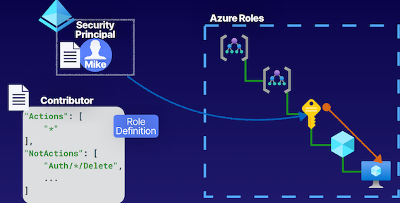


> With Azure roles, the ability to provide identity objects inside of our Azure Active Directory tenants, such as **Mike here with a role assignment using what is known as a role definition**. 
> 
> So here we have a **contributor role** definition that  assigned to Mike, and then we can determine the scope at which we want to assign this role for Mike, and let's say we assign it at the **subscription level** here in the hierarchy. 
> 
> And because **role assignments have a waterfall effect**, this **role assignment will be inherited from the level at which we set the scope all the way down to the lowest level**. 
> 
> So Mike will be able to perform contributor actions at the subscription, all resource groups it contains, and all of the resources inside of those resource groups, inside of our Azure resources, in our Azure environments. 

<mark>Really the difference between Azure roles and Azure AD roles is **Azure roles are for resources that are inside of our Azure subscriptions**</mark>

* **Owner**： Full access to resources and delegates access
* **Reader** Can only view resources
* **Contributor**： Can create and manage resources
* **User Access Administrator** Can delegate access to resources

### **Describing Azure Active Directory (AD) Roles**

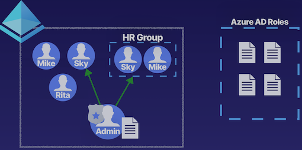

* **Global Administrator** Can manage Azure AD resources
* **Billing Administrator** Can perform billing tasks
* **User Administrator**  Can manage users and groups
* **Helpdesk Administrator**  Can reset passwords for users

### Azure Roles vs. Azure AD Roles

> Azure AD roles, these are a special set of roles that we have specifically for providing access to **manage identity objects inside of our Azure AD tenants themselves.**

**Azure AD Roles**

* **Manage access to Azure AD resources**
* **Scope is at tenant level**
* **Supports custom roles**
* Main roles:
	* Global Administrator
		* which provides us the ability to manage Azure AD resources entirely. This is essentially our root-level role here. 
	* User Administrator
		* User that can manage users and groups inside of our Azure AD tenant. 
	* Billing Administrator
		* Can perform billing tasks
	* Helpdesk Administrator
		* Has the ability to perform helpdesk functions, such as password resets for users.

**Azure Roles**

* **Manage access to Azure resources** 
* **Supports custom roles**
* **Scope can be at multiple levels**
	* such as **management groups, subscriptions, resource groups, and individual resources. And with Azure roles**
* Main roles:
	* Manage access to Azure AD resources
	* Supports custom roles
	* Scope is at tenant level
	* User Access Administrator

	
### Architecture

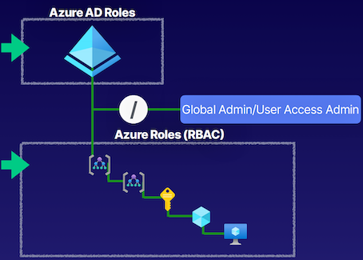

* Azure AD roles here in **our Azure AD tenant**, we're talking about roles that have an impact on those resources that exist inside of our Azure AD tenant itself. 

* **Azure roles or those Azure RBAC roles,** we're talking about those roles that have an impact on providing users that are still from our Azure AD tenant but providing them access to perform actions on the resources that exist within our Azure resources, **such as subscriptions, resource groups, virtual machines, and virtual networks**. 

* Special root space that exists inside of Azure where we can use the **global admin and provide it User Access Administrator roles so that it can be the root of the tenant and all of the resources.**

> if you locked yourself out of your global admin and you want to recover access to this global admin, you could use another user that is your back-up global admin to provide them User Access Administrator of the root level so that they can regain access of the organization. 

### Key Takeaways

**Azure Roles**

* Controls access to Azure resources
* Referred to as Azure RBAC
* Built-in roles
* Custom roles
* Scope at management groups, subscriptions, resource groups, and resources

**Azure AD Roles**

* Controls access to Azure AD resources
* Built-in roles
* Custom roles
* Scope at Azure AD tenant


### **Summary from ChatGPT**

* Role-Based Access Control (RBAC) is based on the equation of who, what, and where.
* **RBAC involves defining security principles (who), role assignments (what), and the scope at which the roles can be utilized (where)**.
* In Azure, there are two types of roles: **Azure roles and Azure AD roles**.
* Azure roles manage access to resources **within Azure subscriptions, while Azure AD roles manage access to Azure AD resources within the Azure AD tenant.**
* Built-in roles for Azure roles include **Owner, Contributor, Reader, and User Access Administrator**.
* Built-in roles for Azure AD roles include **Global Admin, User Administrator, Billing Administrator, and Helpdesk Administrator.**
* Both Azure roles and Azure AD roles **support custom roles for more specific access control**.
* **Azure roles can be assigned at various scopes such as management groups, subscriptions, resource groups, and individual resources**.
* Azure AD roles have a scope set at the Azure AD tenant level, but can use administrative units as a logical container for scoping.
* It's important to understand the differences between Azure roles and Azure AD roles and how they impact access control within the Azure environment.

## 2 Assigning Access to Resources

### Explaining Azure Role-Based Access Control (RBAC)

**Authorization System**

* Security Principal (Who?)   **like an Azure AD user or a group**.
* Role Definition (What?) **Capabilities to perform actions defined in this role.**
* Scope (Where?)
	*  Azure subscriptions. 
	*  resources like virtual networks, or storage accounts, or virtual machines. 


**Implicit Deny  -> Explicit Allow -> Explicit Deny**

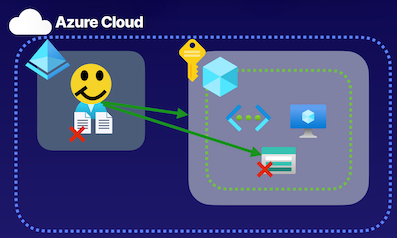

Identity objects inside of Azure AD tenants is that by default, an **implicit deny**, meaning that they **can't perform any actions anywhere by default**, because even though we have this trust relationship between our Azure AD tenants and our subscriptions that allows us to use these identities to perform actions on our Azure resources, we have to understand that we have to provide this access explicitly.
 
> For example, setting a role assignment on this user and providing them access at the **subscription level, which means they can access all of the resources inside of those subscription as well, such as a storage account here**. 


If we want to deny access specifically to just this storage account.  that's where we provide an **explicit deny, which overrules our explicit allow using a deny assignment**, and this **deny assignment will outline some denied actions for this user on the storage account.**

### Understanding Role Definitions

**Contributor**

```
"Actions": [
 	"*"
],
"NotActions": [
	"Auth/*/Delete",
 	...
],
"DataAction": [ ],
"NotDataActions": [ ],
"AssignableScopes": [
	"/"
]
```

1. Actions: where we define what actions are allowed to be performed on the **management plane**, about managing resources inside of Azure, like stopping and starting virtual machines. 
2. NotActions are the actions we're going to **deny on managing resources inside of Azure**
3. **DataActions, and NotDataActions.** this will take an **impact on data-related actions, such as working with data inside of Azure storage accounts**. 
4. **AssignableScope,** going to assign the scope for this resource. And it can be all the way down to a **specific resource, where we assign the scope to a resource group, to a subscription, or even a management group.**

* Actions
* NotActions
* Collective Permissions

### Additive Property

**Overlapping Roles**

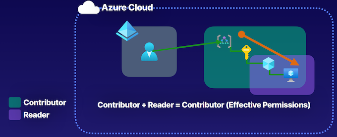

Sometimes we're going to have **more than one role assigned to a user.** 

For example, if we have this user here in our Azure Active Directory tenant that is assigned the **Contributor role at the management group scope here**, but also assigned a **Reader role at a resource group scope inside of the same hierarchal structure**, what we have to understand when we have overlapping roles like this, and **multiple role assignments for a single identity, is that roles follow an additive property.** 

This Case:

**<mark>Contributor + Reader = Contributor, because Contributor provides Reader functionality. So effectively, this user will have Contributor at the management group scope, and that will be inherited all the way down</mark>.**


### Demonstration

* **Select User**：  Pick who needs access to Azure resources
* **Select Role**： Select what role gives them the necessary permissions
* **Select Scope**： Select scope where they need permissions

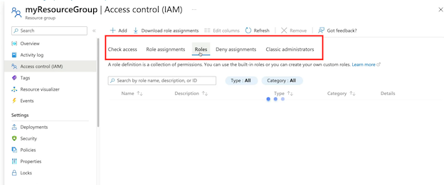

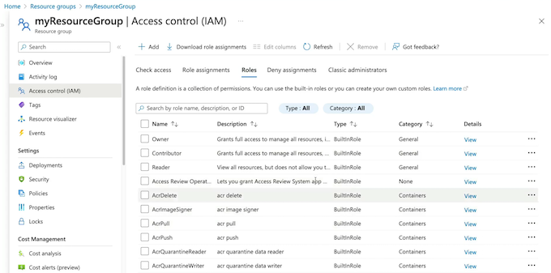

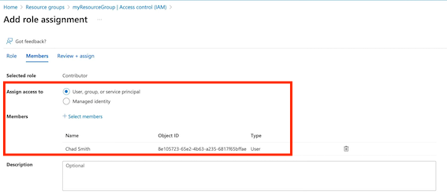

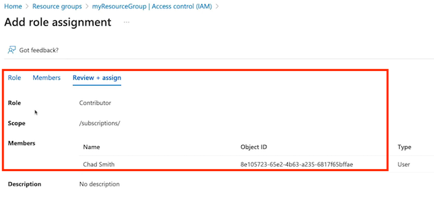

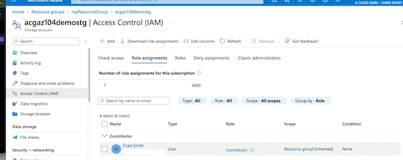


### Key Takeyway

**Authorization System**

* **Provide identities with access to Azure resources**

Providing access to the resources for our Azure AD tenant, those identity resources like users, groups, and applications, or those Azure resources inside of our subscriptions, inside of things like resource groups where we have virtual machines and virtual networks, that will determine whether or not we use Azure AD roles, or Azure RBAC roles, but in the grand scheme of things, 


* Roles are a collection of permissions


**Roles are a collective of permissions,** meaning that whenever you have multiple role assignments, **there's going to be an additive property, and it's going to be inherited down the scope, because there is a scoping hierarchy for these role assignments,** as we saw in our demonstration at the storage account level, it was inherited because we had a role assignment at the resource group level. 


* Scoping hierarchy for role assignments

**Implicit Deny  -> Explicit Allow -> Explicit Deny**

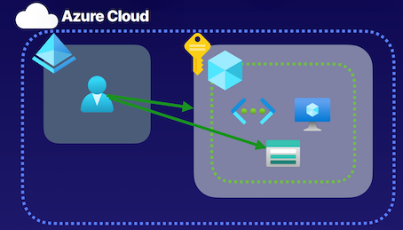

Inside of Azure for role assignments, by default, we have that implicit deny, and then we have to create role assignments to explicitly allow actions. And then if we wanted to, we could create deny assignments where we're then taking away some actions from a user at a specific scope.


### Chatgpt summary

**Summary and Exam Points for Azure AZ104 test:**

* The article discusses the components of an authorization system for Azure RBAC, including defining the "who" to authorize (security principal), defining the actions to authorize, and setting the scope of authorization.
* It explains that Azure **AD tenants have an implicit deny by default, meaning that they cannot perform any actions unless access is explicitly provided via role assignments.**
* Role definitions in Azure RBAC consist of **actions, not actions, data actions, not data actions, and assignable scope**.
* The article highlights the additive properties of **role assignments, where multiple roles assigned to a user are added together to determine the effective permissions**.
* The demonstration in the article shows how to assign access to resources in the Azure portal**, including selecting a user, determining the role and scope of the assignment, and making the role assignment.**
* The key takeaways for the exam include understanding the collective permissions of role assignments, the scoping hierarchy for role assignments, the implicit deny by default for Azure AD tenants, and the concept of explicit allow and deny assignments.

Key Exam Points:

* Understand the components of an authorization system for Azure RBAC, including defining the "who" to authorize, defining the actions, and setting the scope of authorization.
* Understand the default implicit deny for Azure AD tenants and the need for explicit role assignments to provide access.
* Know the components of role definitions in Azure RBAC, including actions, not actions, data actions, not data actions, and assignable scope.
* Understand the additive properties of role assignments and how multiple roles are added together to determine effective permissions.
* Be able to demonstrate the process of assigning access to resources in the Azure portal, including selecting a user, determining the role and scope, and making the role assignment.

 
## 3 Creating Custom Roles
 
### Describing Custom Roles

**Virtual Machine Contributor**

* Custom role definition
* No built-in role meets requirements
* **User Access Administrator or Owner role for the account**

```
"Actions": [
 	"Compute/virtualMachines/*"
],
"NotActions": [ ],
"DataAction": [ ],
"NotDataActions": [ ],
"AssignableScopes": [
 	"/"
]
```

### Creating Role Definitions

**Custom Role**

```
"Actions": [
	"Compute/*/read",
	"Compute/virtualMachines/restart/action“
	],
"NotActions": [ ],
"DataAction": [ ],
"NotDataActions": [ ],
"AssignableScopes": [
 	"/"
]
```

**Demonstration**

* Create a Custom Role (Define a custom role in JSON)

```
{
    "Name": "Helpdesk Administrators",
    "Description": "Can Read, Restart VMs, and log support tickets with Microsoft",
    "Actions": [
        "*/read",
        "Microsoft.Compute/virtualMachines/start/action",
        "Microsoft.Support/*"
    ],
    "NotActions": [],
    "DataActions": [],
    "NotDataActions": [],
    "AssignableScopes": [
        "/subscriptions/subscriptionId"
    ]
}
```

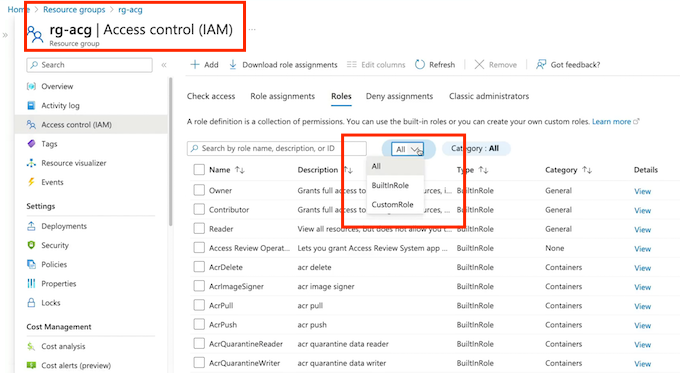

```
code helpDeskAdminRole.json

az role definition create --role-definition helpDeskAdminRole.json
```

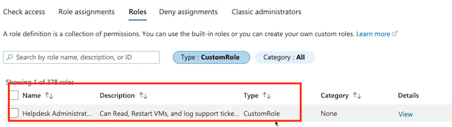


* Assign Role  (Assign the custom role to a user)

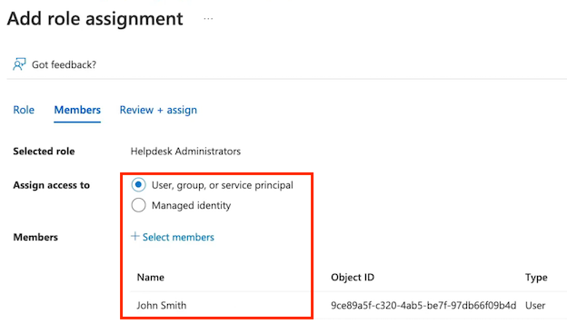

* Check Role Assignment (Check the user’s role assignment)

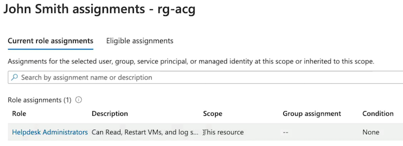


### Creating Custom Roles

* Provide identities with access to Azure resources
* Roles are a collection of permissions
* Scoping hierarchy for role assignments
* Custom role definition
* No built-in role meets requirements
* User Access Administrator or Owner role for the account

### Summary from ChatGPT

* Custom roles are not much different than built-in roles, but they are created by making a custom role definition
* It's important to have User Access Administrator or Owner role to create custom roles
* Custom roles can be created for both Azure AD and Azure RBAC roles
* Role definitions include Actions, NotActions, DataActions, NotDataActions, and AssignableScope
* A demonstration is given on how to create and assign a custom role using JSON in the Azure portal
* Custom roles are used when built-in roles do not meet the specific requirements
* JSON is used to define the custom role in the Azure portal
* Access can be checked for the assigned user to ensure the custom role has been successfully assigned
* Custom roles are created when no built-in roles meet the requirements and User Access Administrator or Owner role is required to create them. Custom roles are used to provide access to Azure resources for identities.

**Exam points:**

* Understanding custom roles in Azure and their similarity to built-in roles
* Knowledge of the components that go into creating a custom role definition
* Ability to create a custom role using JSON in the Azure portal
* Understanding the scoping hierarchy for role assignment and how it determines the assignable scope for roles
* **Knowing the permissions and actions allowed in custom roles**
* Awareness of the roles required to create custom roles in Azure (**User Access Administrator or Owner role**). 


