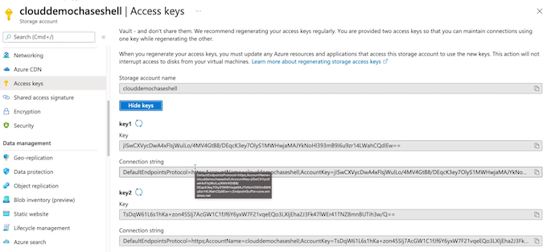

# **5 Azure Storage**

## 1 Understanding Storage Accounts


### 1-1 Understanding Storage Accounts

**Storage Account**

**<mark>Each sub-service exists as its own instance within an instance of an Azure storage account.</mark>**

Sub-services:

* Azure Queue： **Message-based storage for microservices**
* Azure Files： **Cloud-based file sharing service**
* Azure Table： **Non-relational, semi-structured data storage service**
* Azure Blob: **Object-oriented storage solution**

### 1-2 Components of Storage Accounts

**Account Type**: Determines **features and costs**

**Performance Tier**: Determines **performance levels**

**Replication** Determines **infrastructure redundancy**

**Access Tier** Determines access levels and data costs


### 1-3 Redundancy for Azure Storage


**LRS: <mark>Store all 3 copies of data</mark> inside of the same availability zone**

If this availability zone were to go down, we would lose this data, and this option is known as **locally redundant storage**


<mark>Put a copy of our data in each availability zone within a region</mark>, and this is known as **zone-redundant storage** 

Even if 1 of these availability zones goes down, we still have 2 more copies of our data. We could stand up to 2 availability zone failures


Secondary region, and it has its own availability zones and inside of those availability zones, their own datacenters, and we have independent cooling, power, and network here as well. 

This option we would use here would <mark>provide us 3 copies of our data in a single availability zone in 2 different regions</mark>. And this option would be known as **<mark>geo-redundant storage.</mark>** 


**Store a single copy of our data in each availability zone in the home region and then store 3 copies of our data inside of an availability zone in a secondary region**, and this is known as **<mark>geo-zonal redundant storage</mark>**.


Same thing as the geo-zonal redundant storage, except for that **the data stored in the secondary region is read-access, and this is read-access <mark>geo-zonal redundant storage</mark>**.

### Demo

* Create Storage Account
	* Define the deployment.

* Review StorageAccount
	* Review account details.


   


### Key Takeaways

#### **Account Type**

* **General Purpose v1**
	* Legacy for blobs, files, queues, and tables
* **General Purpose v2**
	* **Recommended for blobs, files, queues, and tables**


#### **Performance Tier**

* **Blob Storage**
	* Legacy blob-specific accounts
* **Standard**
	* Default storage performance tier
* **Premium**
	* High-performance storage tier


### Replication

* **Locally Redundant Storage (LRS)**
	* 3 copies in a physical location within a region
* **Zone-Redundant Storage (ZRS)**
	* 3 copies across zones within a region 
* **Geo-Redundant Storage (GRS)**
	* LRS in a primary and secondary region
* **Geo-Zone Redundant Storage (GZRS)**
	* ZRS in a primary region and LRS in a secondary region

### Access Tier

* Hot
	* Frequently accessed data
* Cold
	* Infrequently accessed data
* Archive
	* Backup data rarely accessed


### summary from chatgpt

**Summary**

* Storage accounts in Azure are top-level resources for storage purposes.
* Each storage account can have multiple subservices with their own storage purposes, such as **Azure Queue, Azure Tables, Azure Files, and Azure Blob.**
* Components of a storage account include **account type, performance tier, replication, and access tier**.
	* Account type determines the **features and costs available for the storage account**.
	* Performance tier determines the performance level of the storage account.
	* Replication determines the infrastructure redundancy and data redundancy options.
	* Access tier **determines the access levels and costs for retrieving stored data**.
* Azure storage redundancy involves storing multiple copies of data.
* Redundancy options include **locally-redundant storage, zone-redundant storage, geo-redundant storage, geo-zonal redundant storage, and read-access geo-zonal redundant storage**.
* Creating a storage account involves configuring its details, such as account name, region, performance tier, replication, and access tier, through the Azure portal.
* Storage accounts have different sub-services accessible through their endpoints, each with its own resource ID and public endpoint.


**Exam Points:**

* Storage accounts are top-level resources for storage purposes in Azure.
* Subservices within a storage account have their own storage purpose.
* Subservices include **Azure Queue, Azure Tables, Azure Files, and Azure Blob**.
* Components of a storage account include account type, performance tier, replication, and access tier.
* Azure storage redundancy involves storing multiple copies of data.
* Redundancy options **include locally-redundant storage, zone-redundant storage, geo-redundant storage, geo-zonal redundant storage, and read-access geo-zonal redundant storage**.
* A demonstration of creating a storage account is provided.

## 3 Conceptualizing Azure Blob Storage

### Describing Azure Blob Storage

**Blob Storage**

Azure Blob is a sub-service/sub-resource of Azure Storage (storage  accounts)


**Blob storage is our object-based storage. Easily accessible from HTTP/REST.**


**Store items such as:**


* Image/Video files
* Text files
* Log files
* VHD (Virtual Hard Disks) files


All of these things store inside of our Azure Blob Storage inside of a container, which acts like a bucket. And inside of this we have a **virtualization prefix** that **allows it to appear as though it is a file system, but <mark>it's actually a flat file structure**</mark>. 

### Components of Blob Architecture

* **Blob Service**: Blob service is a sub-service for storage accounts. 
* **Blob Container**: The container where we store our blobs.
* **Blobs**  The data we are storing in our 
containers.


> Blob container acts as a logical container for where we can store our blobs.


### **Types of Blobs**


* **Block Blob**: Storing images or videos. Best suited for streaming
* **Append Blob**: **Logs files**.
* **Page Blobs**: Virtual Machine disks


### Access Control

By default **<mark>public access to blobs are granted at the storage account level</mark>**

**Containers Access Levels:**

* **Private (no anonymous access)**
* **Blob (anonymous access to blob)**
* **Container (anonymous access to container and blobs it contains)**


### Demo: Configuring Blob Storage
 
 
* **Log In to Azure Portal**: Use an Azure sandbox inCloud Playground.
* **Create BlobContainer**: Upload files as blobs.
* **Review Access Level**: Review the container access levels.


**Containers**


`$logs` default folder in container

**Containers Access Levels**


**Private container URL can't access from URL**


 
### Gpt summary

* Azure Blob Storage is a sub-service of a storage account in Azure.
* Blob Storage is an object-based storage service that stores items such as **image and video files, text files, log files, and VHD files**.
* **Blobs are stored inside containers, which act as logical containers for blobs**.
* Blobs can be of different types, **including block blobs, append blobs, and page blobs**.
* **Access to blobs is controlled through container access levels, which can be private, blob-level, or container-level**.
* Public access to blobs is granted at the storage account level by default.
* Blob containers have URLs that can be used to access them and the blobs they contain.
* Access levels can be modified after the containers and blobs are created.
* Azure portal can be used to create and configure blob containers and upload blobs.

**Exam Point**

* Azure Blob Storage is a sub-service of a storage account in Azure.
* Blob Storage is an object-based storage service for storing files such as i**mages, videos, text files, log files, and VHD files**.
* **<MARK>Blobs are stored inside containers, which act as logical containers for blobs</mark>**.
* Blobs can be of different types, including **block blobs, append blobs, and page blobs**.
* Access to blobs is controlled through container access levels, which can be **private, blob-level, or container-level**.
* **<mark>Public access to blobs is granted at the storage account level by default.</mark>**
* Blob containers have URLs that can be used to access them and the blobs they contain.
* **<mark>PAccess levels can be modified after the containers and blobs are created.</mark>**
* Azure portal can be used to create and configure blob containers and upload blobs.
* Blob containers can have different access levels, including private, blob-level, and container-level access.
* **Blobs can be accessed using their container's URL**.
* **Access levels can be modified after the creation of the blobs and containers**.
* Azure Blob service provides different types of blobs, including block blobs, append blobs, and page blobs.
* **Block blobs are suitable for streaming services, such as video streaming platforms**.
* **Append blobs are used for logging operations and offloading logs from virtual machines.**
* **Page blobs are used for creating golden images for virtual machines.**
* Blob access can be controlled through container access levels, which can be private, blob-level, or container-level access.
* Public access to blobs is granted at the storage account level by default.

## 4 Configuring Blob Object Replication

### 4-1 Object Replication

Object replication **asynchronously (not immediately)** copies block blobs and their versions, **between a source storage account, and a destination account**

### Benefits of Object Replication

* **Minimizing Latency**： Reducing latency for read requests
* **Increased Efficiency**： Processing block blobs in different regions
* **Data Distribution** Processing and analyzing data in one location that replicates to other regions.
* **Cost Optimization**： data to the archive tier can reduce costs.

Conceptualizing Object Replication


### Demo: Configuring Object Replication

* **Log In to Azure Portal**
* **Create Storage Accounts**： Create one for the source and one for the destination.
* **Configure Replication**： Set up and test blob object replication.

**Create a src storage account**:   acqaz104demostgsrc

* **<mark>Enable versioning for blobs</mark>**
* **<mark>Enable blob change feed</mark>**


**Create a dest storage account**:   acgaz104demostgdest


**Souce blob: Data protection**

* Enable versioning for blobs
* Enable blob change feed


**Dest Blob: Data protection**  -  acgaz104demostgdest

* Enable blob change feed


**Create container for both blob**


**Object replication**: Create replication rules

ONLY Copy: file from **prefix/** 


Upload to source blob "prefix folder"

**asynchronous copy to dest prefix**


**versioning control**


### Key Takeaways

* **Versioning**

Versioning must be enabled on both the **source and destination accounts to perform replication**.

* **Change Feed**

**Change feed must be enabled on the source account.** Azure storage monitors the `$blobchangefeed` to advise 
replication

* **Cross Subscription & Azure AD**

Object replication is supported **across subscriptions and Azure AD tenants**

* **Replication Policy**

A storage account can be a source for up to <mark>two destination accounts</mark>. **Each policy supports only a single pairing using a Policy**

* **Account Kind, Access Tier, & Blob Types**

**Only GPv2 standard supports object replication of block blobs and their versions,** regardless of **default access tiering, on source and destination accounts.**

### Chatgpt summary

Summary and Exam Points:

* Object replication is a feature of Azure storage accounts that allows for asynchronous copying of block blobs between storage accounts.
* **Both the source and destination storage accounts must have versioning enabled**.
* **The source storage account must have the blob change feed enabled to inform the asynchronous copy operations**.
	* Object replication can be done between storage accounts in the **<mark>same region, across regions, across subscriptions, and across different Azure AD tenants</mark>**.
	* Object replication **minimizes latency** by replicating blobs to a storage account closer to the consumers.
	* It **increases processing efficiency** by replicating blobs to storage accounts where they are needed.
	* It allows for data distribution and analysis in one location and replication to other storage accounts.
	* Object replication can **optimize storage costs by moving replicated data to the archived tier for reduced costs**.
* Replication can be configured through the Azure portal by setting up replication policies and rules.
* Both the source and destination storage accounts must be created with the necessary configurations for **versioning and change feed**.
* Replication status can be monitored and managed through the Azure portal.
* Important concepts:
	* **Versioning and change feed**
	* **Replication policies and rules**
	* Replication between different regions, subscriptions, and Azure AD tenants
* Object replication can act as a source for up to two destination storage accounts.

**Exam points:**

* Understand the concept of object replication for Azure storage accounts.
* Know how to enable versioning and change feed on storage accounts.
* Understand the benefits of object replication, such as minimizing latency, increasing processing efficiency, and optimizing storage costs.
* Understand how to configure object replication through replication policies and rules.
* Understand how object replication can be done between storage accounts in different regions, subscriptions, and Azure AD tenants.
* Understand how to monitor and manage replication status.


## 5 Configuring Blob Lifecycle Management

### Defining Lifecycle Management

A feature of the blob service that enables automation to manage the lifecycle of blobs, **by moving blobs between access tiers, to optimize storage costs**

* **Automates Blob Lifecycle**

Easily manage blob lifecycles from frequent use to **archive/deletion**.

> **Moving blobs from a hot tier to a cool tier, to archive, and then, ultimately, deletion when we no longer need them**. 

* **Move Access Tiers**

Switch blobs between tiers to meet access/usage needs.

* **Optimize Costs**

Save money by decreasing admin overhead and tiering blobs based on usage requirements.

### Conceptualizing Lifecycle Management


Lifecycle management helps us set up the ability to move blobs between access tiers to meet our access and usage needs. 

For example, if the blobs reach a certain age, we can **move them to the cool tier**, so that **they're still accessible** but they're less frequently accessed. So we can **save on money here for our storage account** by **moving them from the hot to the cool tier**; and we can still keep our tier that is the default tier for our blobs at hot.

Just after time of not being used, we set the criteria and they'll move to cool. 

Once they've not been used for an even longer amount of time, **we can move these blobs from cool to archive** so that we don't have to access them as frequently, but we are saving on cost. 

Once we've gone through the archival phase and we're no longer needing the data for our organization, we can then **move these blobs to delete**.


### Demo: Configuring Lifecycle Management

**Create Storage Account**： Create Storage Account.

Create **testcontainer** container in **acgaz104demostglmp**


**Configure Lifecycle Management**  Set up lifecycle operations to move blobs.


**if-then rule**


**Filter set**

Blob prefix: `testcontainer/folder/`


### Key Takeaways

* **Storage Accounts**

Supports GPv2 storage accounts, Blob storage accounts, and BlockBlob storage accounts.

* **Scoping**

Scoping at the storage accoun level or limit blobs with filters.

* **Types & Subtypes**

**Supports block and append blobs**, and **supports subtypes such as base blobs, snapshots, and versions**.

* **If/Then Logic**

Uses logic in lifecycle rules to move blobs through access tiers based on **modification and access times**

* **Filtering**

Filtering blobs in the rule using prefix or blob index matches. (Blob index feature in public-preview)

### Summary and Exam Points:

* Lifecycle Management is a feature of Azure Blob Storage that allows for automated movement of blobs between different access tiers as they age.
* By moving blobs to different tiers, organizations can optimize storage costs and ensure accessibility based on their evolving needs.
* **Lifecycle Management can be configured for blob containers in a storage account.**
* **Blobs can be moved from a hot tier to a cool tier, then to archive, and eventually deleted.**
* Automation of lifecycle management reduces administrative overhead and ensures cost optimization.
* To configure Lifecycle Management, a storage account must be created with the appropriate settings.
* **Lifecycle Management rules can be created to specify the conditions under which blobs should be moved.**
* **<mark>Rules can be applied to all blobs or limited to specific filters such as blob type or prefix.</mark>**
* **Filters can be based on properties like last modified or creation date.**
* **Actions such as moving blobs to a different tier or deleting them can be performed based on the defined rules**.
* **Blob Index Match, a key-value tagging system, can be used for additional filtering and organization of blobs**.
* Lifecycle Management provides scoping options to limit the application of rules to specific storage accounts or blob containers.
* Important concepts:
	* Blob access tiers (hot, cool, archive)
	* Automation of blob movement
	* Configuring Lifecycle Management rules and filters
	* Blob Index Match for tagging and filtering
	* Scoping options for Lifecycle Management policies
* Lifecycle Management can help optimize storage costs and ensure accessibility of blobs based on evolving needs.


**Exam points:**

* Understand the concept and benefits of Lifecycle Management for Azure Blob Storage.
* Know how to create a storage account with the necessary settings for Lifecycle Management.
* Understand the different access tiers (hot, cool, archive) and when to use each one.
* Understand how to configure Lifecycle Management rules and filters.
* Understand how to use Blob Index Match for additional filtering and organization.
* Understand how to apply scoping options to Policies for specific storage accounts or blob containers.


## 6 Configuring Azure Files

### Describing Azure Files

**Azure Files**： Azure Files is a sub-service/subresource of Azure Storage(storage accounts)

Azure Files is a managed file share service.

Features：

* **SMB connectivity**
* Supports Windows, Linux, and macOS
*** Extended by Azure File Sync**
* Traditional file structure


### Components of Azure Files

**File Service**

Azure Files service is a sub-service of Azure Storage storage accounts

**File Share**

The file structure we are connecting to locally.

**Files and Folders**

The files and folders that exist in the file share.


### Connectivity Options

**Internal Connectivity**： REST, SMB 2.1, and SMB 3.0

**External Connectivity**： REST and SMB 3.0

**Security**: Data encrypted at rest by default and in transit over HTTPS


### Demo: Working with Azure Files

* **Create Storage Account**： Create Storage Account.
* **Create Azure File Share**： Create and connect to the Azure file share.


**Transaction Tier**

* **Premium**
* **Transaction optimized**
* **Hot**
* **Cool**


**Authentication method**

* Active Directory
* Storage account key


```
Remove-PSDrive -Name Z
```


### Key Takeaways

**Managed File Share**

Utilizes storage account redundancy and security

**Operating Systems**

Windows, Linux, and macOS support

**File Share Quota**

5TB default size

### Chatgpt Summary:

* Azure Files is a managed file share service within an Azure Storage account.
* It provides **SMB or NFS connectivity for traditional file sharing services.**
* It supports Windows, Linux, and macOS clients.
* Azure File Sync can **extend Azure Files into on-premise environments**.
* Azure Files has a traditional file structure with folders and files.
* Connectivity options include **insecure (REST, SMB 2.1, SMB 3.0) and secure (REST, SMB 3.0) protocols**.
* Secure connectivity requires secure transfer to be enabled on the storage account.
* The tiers for file shares are Transaction Optimized, Hot, and Cool.
* File shares can have quotas, with the default size being 5 TB.

**Exam points:**

* Understand Azure Files as a managed file share service within Azure Storage accounts.
* Learn the connectivity options for Azure File shares and when to use secure transfer.
* Understand the supported client platforms for Azure Files.
* Know the different tiers available for Azure File shares and their use cases.
* Understand how to create and configure file shares, including quotas and resizing.

## 7 Configuring Azure File Sync

### Describing Azure File Sync

**Azure File Sync**

Azure File Sync is an extension of Azure Files that allows you to **<mark>extend the capabilities of on-premises file servers</mark>.**

Features:

*  Locally cache frequently accessed files
* **Requires Windows 2012 R2 or later**
* **SMB, NFS, and FTPS**
* **Requires File Sync agent**


### Components of Azure File Sync

* **Storage Sync Service**： High-level Azure resource
* **Cloud Endpoint**： Azure file share utilized in File Sync
* **Registered Server**： Trusted on-premises file servers


### File Sync Cloud Tiering


* **Extends On-Premises File Share**: Increases storage capacity through cloud tiering
* **Windows Only**: <mark>Windows 2012 R2 or later file servers only</mark>
* **Requires File Sync Agent**: Download Azure File Sync agent onto local file server 


### Demo

**Create Fileshare and filesync folder**


**Create new VM and Enable: 443 / 80 / 3389(RDP)**


### **Create file sync service**

> **Azure File Sync extends on-premises files servers into Azure providing cloud benefits while maintaining performance and compatibility.**

Azure File Sync provides:

* Multi-site access - provide write access to the same data across Windows servers and Azure Files
* Cloud tiering - store only recently accessed data on local servers
* **Integrates with Azure backup - no need to back up your data on premises**
* **Fast disaster recovery - restore file metadata immediately and recall data as needed**


**VM Internet Explorer Enhanced Securitv Configuratior**

Turn all off


**Add sync between VM Drive and file sync**


**Enable file sync on server**

`PS C: \Users\cloudchase> Install-Module -Name Az`


**folder synced from AZ file**


**Install file sync agent on server**


**Start file sync agent on a server with file sync service configuration**


**Registration successful!**


### Summary from Chatgpt

**for synchronization**. The key components of Azure File Sync are the **<mark>Storage Sync Service, cloud endpoint, registered server, server endpoint, and sync group</mark>**. 

**We can prepare a virtual machine by configuring IE security and creating a new volume, then install and register the Azure File Sync agent and create a sync group.**

Cloud tiering allows on-premise file **shares to locally cache frequently accessed files and maintain mappings to less frequently accessed files on the Azure file share**.

* Azure File Sync is a service that extends the capabilities of Azure Files into on-premise file servers.
* It allows for **increased storage capacity** by locally caching frequently accessed files on-prem and mapping less frequently accessed files to the Azure file share.
* **It is only supported with Windows 2012 R2 or later and supports SMB, NFS, and FTPS protocols**.
* **<mark>The key components of Azure File Sync are the Storage Sync Service, cloud endpoint, registered server, server endpoint, and sync group</mark>**.
* Cloud tiering enables **on-prem file shares to locally cache frequently accessed files** and **maintain mappings for less frequently accessed files on the Azure file share**.
* **<mark>To set up Azure File Sync, a file sync agent must be installed on the Windows machine and registered with the Storage Sync Service</mark>**.
* **To prepare a virtual machine for Azure File Sync, configure IE security and create a new volume**
* Install and register the Azure File Sync agent on the virtual machine.
* The process includes creating a virtual machine, creating a Storage Sync Service, preparing the virtual machine by configuring IE security and creating a new volume, **installing the Azure file sync agent, and registering the server with the Storage Sync Service**.
* <mark>Finally, a **sync group is created to allow for syncing between the cloud endpoint and server endpoint</mark>**.

## 8 Storage Network Access

### Storage Access Options

* **Public Endpoint**： All services are public **by default** using the service’s 
* **Restricted Access**： Storage account access can be restricted to virtual networks, **IP address ranges via the storage account’s firewall, and via specific resource instances.**
* **Private Endpoints**： Allow private IP access for resources in an associated virtual network.

### Public Endpoints


```
https://<accountName>.<subService».core.windows.net/<resourceNames>
```

### Demo

Blob URL:

`https://clouddemochaseshell.biob.core.windows.net/images`


**Change access public level for containers**

* **Private (no anonymous access)**
* **Blob (anonymous read access for blobs only)**
* **Container (anonymous read access for containers and blobs)**


**firewall settings** 


**Resource instances can be accessed & Exception** 


**Add Custom domain for file access url point**


**Provide Network Access**

Each sub-service has an endpoint.

* Public endpoint
* Restricted access
* Private endpoint


### Summary by Chatgpt

* Storage access options for services and resources inside storage accounts in Azure include **public endpoints, restricted access, and access through specific virtual networks**.
	* Public endpoints are accessible by default and can be used to access services and resources using the service's public endpoint URL.
	* Access to services and resources can be restricted by creating a firewall and **specifying allowed IP address ranges or virtual networks**.
	* **<mark>Private endpoints allow for private IP access to resources in an associated virtual network.</mark>**
	* Each service in a storage account has its own specific public endpoint URL.
* **Storage account firewall settings can be modified to restrict access to selected networks and specify allowed IP address ranges.**
* Private endpoint connections allow for private connectivity to storage accounts.
* **Custom domains can be used to provide custom domain names for public endpoints.**
* Storage account firewall settings can be configured in the Azure portal.
* The key takeaways are that public endpoints are accessible by default, access can be restricted through the storage account firewall, and private endpoints can provide private connectivity within a virtual network.
* **Private endpoints provide private connectivity to services within virtual networks**.

## Securing Storage Accounts

### Azure Storage Encryption

**Secure Storage**

By default, all data stored (data at rest) in any Azure Storage service is secured using Storage Service Encryption (SSE).

**All data in transit can be secured using transport-level security (HTTPS).**


### Azure Storage Authentication

* **Access Keys**

Azure-generated keys that provide unlimited access to both the management and data layer of an Azure Storage solution

* **Shared Access Signature (SAS)**

An access signature, generated from access keys, that provides limited access at either the account level or the service level

* **Azure AD Authentication**

Uses Azure role-based access control (RBAC) and Azure Active Directory (AD) identities to provide authentication (instead of access keys).


### Demo

**Blob configuration**

* Secure transfer required
* Allow Blob public access
* Allow storage account key access
* Minimum TLS version:   Version 1.2
* Blob access tier (default)  (cool / hot)


**Blob storage access keys**



**Shared access signature**

> A shared access signature (SAS) Is a URI that grants restricted access rights to Azure Storage resources.
> 
> **An account-level SAS can delegate access to multiple storage services (I.e. blob, file, queue, table)**. Note that stored access policies are currently not supported for an account-level SAS.


**Generate SAS**


**Acess Control (IAM)**

Access Control (lAM): build-in role


**Access policy**


**Access policy from one file**


**Add restrict time for SAS**


**Activity log**


**Security**


### **Key Takeaways**

* Access Keys
* Azure AD Authentication
* Shared Access Signature (SAS)

### **Chatgpt summary**

- **<mark>Storage Service Encryption is used to protect data at rest in Azure storage accounts.</mark>**
- Secure transfer should be enabled to **ensure that data in transit is protected over HTTPS connections.**
- **Infrastructure encryption** provides an additional layer of encryption for the underlying infrastructure in Azure data centers.
- Access to storage account services and data can be managed using access keys, which provide **unlimited access to both the management and data layers**.
- **Shared Access Signature tokens can be generated from access keys to provide limited and restricted access to storage account services and data.**
- Azure AD Authentication allows for authentication using Azure RBAC roles and Azure AD identities, providing a more secure alternative to access keys.
- **Role-based access control (RBAC) roles can be assigned to grant specific permissions at the container or blob level**.
- **Access policies can be used to define permissions and expiration dates for shared access signatures.**
- Azure Defender for Storage can be enabled to continuously **monitor storage account configurations and detect potential security vulnerabilities**.
- The activity log can be used to audit operations and activities within a storage account.
- Encryption, access control, and monitoring are key security features for protecting storage accounts.

## Using Azure Jobs

### Azure Jobs

Move large amounts of data between **on-premises and Azure Storage**.

* **Move to/from Blob service**
* Move to Files service 
* **Transport self-supplied drive**

Supported drive types:

* SATA
* HDD
* SSD


### Importing Jobs

**Azure Import Job**

1. Prepare disks (**WAImportExport**)
2. Create job
3. Ship drives
4. Check job status
5. Receive disks
6. Check data in Azure Storage


### Exporting Jobs

1. Create job
2. Ship drives (WAImportExport)
3. Check job status
4. Receive and unlock disks

### Importing vs. Exporting

**Import Jobs**

1. Prepare disks
2. Create job
3. Ship drives
4. Check job status
5. Receive disks
6. Check data in Azure Storage

**Export Jobs**

1. Create job
2. Ship drives
3. Check job status
4. Receive and unlock disks

### Demo: Create import/export job


### Key Takeaways

**Import Jobs**： <mark>Send large amounts of data to the Azure cloud when network bandwidth won’t support data migration</mark>.

**Export Jobs**： <mark>Receive large amounts of data on-premises from the Azure cloud when network bandwidth won’t support data migration</mark>.

* **WAImportExport CLI Tool**

Use to prepare disks for data and to estimate number of disks needed.

* **Windows Support Only**

* **Azure Blob and Files**

### Summary from Chatgpt

- Azure jobs are used to move large amounts of data between **on-premises environments and Azure storage accounts**.
- **The import job is used to move data from on-premises to Azure, supporting both blobs and files**.
- **The export job is used to move data from Azure to on-premises, supporting only blobs**.
- Supported drive types for Azure jobs include **SATA, HDD, and SSD drives**.
- The **WAImportExport** tool is used to **prepare the drives for import or export jobs and is only supported on Windows devices**.
- The WAImportExport tool also estimates the number of disks needed for the data being moved.
- Import jobs require preparing the disks, 
	- **putting the data on the disks** 
	- creating the job, 
	- **providing carrier and journal file information.**
- Export jobs require creating the job, providing carrier information, preparing the disks, and checking the job status for downloading the data.
- **<mark>Import jobs move data to the Azure cloud, while export jobs receive data from the Azure cloud</mark>**.
- **Azure jobs use physical ground shipping methods to transfer data when the network bandwidth is insufficient**.
- Azure jobs are a solution for moving large amounts of data when network limitations exist.

## Storage Utilities

**Storage Explorer**  A Graphical User Interface (GUI) tool for working with storage accounts. Supported for Windows, Linux, and MacOS.

**AzCopy** A command-line utility for working with storage accounts. Supported for Windows, Linux, and MacOS

### Demo Storage Explorer


**Generate Access keys**


**Connect to Azure Storage**


**file synced between storage and explorer**


**Manage file access policy on Explorer**


### Demo azcoyy

`./bin/azcopy login`


**Make copy container**


**Test folder and file**


**Connection Method**

### Key Takeaways: Storage Explorer vs. AzCopy

**Storage Explorer**

* **Manage storage accounts**
* **Use Azure Active Directory (AD) or Shared Access Signature (SAS)**
* GUI-provided
* Uses AzCopy under the hood

**AzCopy**

* Manage storage accounts
* Use Azure Active Directory (AD) or Shared Access Signature (SAS) 
* Scripting capabilities

### Summary from Chatgpt

- Storage Explorer is a graphical user interface tool for working with Azure storage accounts.
- Storage Explorer can be used within the Azure portal or downloaded as a client for Windows, Linux, and macOS.
- Azure Storage Explorer can be authenticated using **Azure account credentials, connection strings, or shared access signatures**.
- It provides capabilities to **upload/download files**, **generate SAS tokens, create snapshots, and manage access policies**.
- AzCopy is a command-line utility for working with Azure storage accounts.
- **AzCopy supports Windows, Linux, and macOS**.
- AzCopy can be authenticated using Azure AD credentials or shared access tokens.
- It allows users to create containers, **copy files to/from storage accounts, and perform various storage account operations**.
- **AzCopy offers scripting capabilities for automation and building complex scripts.**
- The key takeaways are the differences between Storage Explorer and AzCopy, their authentication methods, and their capabilities for managing Azure storage accounts.