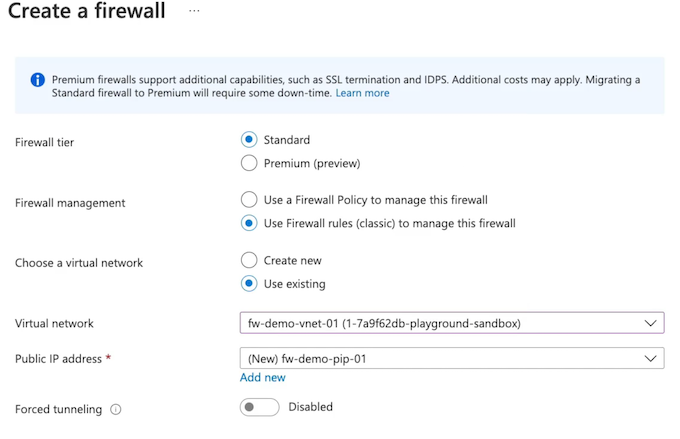

# 6 Virtual Networking

## 1 Conceptualizing Virtual Networks

### Describing Networks

**Purpose of a Network**

A network allows you to have an isolated network where resources can communicate with one another and with outside networks

* Users accessing file servers
* Printer sharing
* Web servers
* App server accessing database servers and internet

### Traditional vs. Virtual Networks


virtual network is an isolated network space on the Azure cloud that we can utilize to provide private and public addressing for our resources. Now, inside of the Azure cloud, we have this isolated network, and it is isolated specifically from other users of virtual networks inside of the Azure cloud

### Describing Virtual Networks (VNets)

**Main goal in networks**

* Provide both an isolated network space where resources can communicate privately, but also to provide public connectivity to the outside internet and outside networks in cases in which we want to peer networks between different data centers, **so that we can have multiple private networks that our organization is using**. 

**virtual network**

* Network address space and break subnet it down into different subnets, breaking it into subnet address spaces that allow us to then put resources like **virtual machines inside of this address space**.
* Virtual machines will have private IP addresses, and potentially public IP addresses, depending on the **IP configurations of the network interface card that is associated with the virtual machine**.
* Control traffic by allowing or denying specific traffic using network security groups that we can place on the subnet or on the network interface of a resource.
* **Network security groups can be used to control both the private networking and the public networking traffic that is occurring on this network**.
* Public IP address for resources. can put a public IP address for these resources and associate it with the configurations on the **network interface card** so that we have a publicly routable address so that provides **both the private networking and the public networking for our virtual network**.
* By default, with virtual networks is **routes that allow access both for public connectivity and routes that allow access for private connectivity within our networks**
* 


**Isolated Network**

VNets are isolated networks on the Azure cloud

**Private Network Access**

Provides private connectivity between resources like VMs or App Service

**Network Integration**

Allows connectivity between VNets, on-prem networks, and remote user devices

### Components of Virtual Networks


**Address Space**

The private address space for the isolated network. Required to provide resources with private IPs


**VNet**

The isolated network on Azure cloud where Azure resources like VMs are deployed.


**Subnet**

The segmentation of the isolated network into smaller sub-networks where resources will exist.

### Purpose of a Network

A network allows you to have an isolated network where resources can communicate with one another and with outside networks. Allows connectivity between VNets,

**Isolated Network**

VNets are isolated networks on the Azure cloud

**Private Network Access**

Provides private connectivity between resources like VMs or App Service

**Network Integration**

Allows connectivity between VNets, on-prem networks, and remote user devices


### Summary from Chatgpt

- The purpose of a network in Azure is to provide an isolated space for communication between resources.
- Networks can provide private connectivity between resources within the network, as well as public connectivity to the internet or outside networks.
- Azure virtual networks are similar to traditional on-premises networks and provide the same capabilities but in the Azure cloud.
- **Virtual networks in Azure allow for subnetting, traffic control with network security groups, and the provision of public IP addresses**.
- Virtual networks are isolated from other users and utilize the Microsoft backbone infrastructure.
- They enable private networking between resources and can integrate with on-premises networks and remote user devices through VPN gateways and peerings.
- The components of a virtual network include an address space, the virtual network itself, and subnets for isolating resources.
- With virtual networks, resources can communicate privately within the network and with other Azure services.


## Creating Virtual Networks

   
### Designing a Network

**Determine IP CIDR**

Select a **Classless Inter-Domain Routing (CIDR)** notation that allows for growth and integration

**Subnetting Requirements**
 
Determine how to segment the solution to meet your needs, such as segmenting for n-tiers

**Connectivity Needs**

Determine what type of connectivity is needed: Internet, resource to resource, resource to service, etc.


> Determine how we want to handle both the public outbound and inbound traffic and the internal inbound and outbound traffic inside of our networks.

* We first determined that **IP address space we want to use**. 
* We **subnet the virtual network, and we determine the connectivity needs**, based off the resources that we plan to deploy inside of that network. 

### **Virtual Network (VNet) Features**

**Subnetting**

Azure VNet uses subnets to segment address spaces. Reserved IP addresses are  **x.x.x.0-3 and x.x.x.255**.

> 5 total IP addresses being the first four in the network with the last being zero, one, two, or three. And then the last IP address with the last octet being 255. These 5 total IPS addresses are going to be reserved within our network

**Private Networking**

Azure VNet supports DHCP for private IP addressing for resources.

> virtual machine inside of virtual network, is going to get its own private IP address. And this is going to be **served out from the DHCP Server that is a built into our virtual network**

**Public Networking**

Azure VNet supports public IP addressing (IPv4 and IPv6) so that resources can have public connectivity.

**Peering**

Azure VNet supports peering between Azure VNets.

> Can peer or cross things like our regions, and also we can peer within the same region

**Network Gateway**

Azure VNet uses gateway subnets to make VPN connections.


**Monitoring**

Azure VNet makes monitoring easy. View logs, monitor connectivity, and view a topology of the virtual network.

### Demonstration


**Create virtual network**


**Add subnet**


**Create VM inside new VN**


### Key Takeaways

**Default Connectivity**

By default, intra-network traffic and outbound internet traffic is allowed.

**Address Restrictions**

Use of private addresses using RFC 1918 provide best results. The smallest VNet/subnet size allowed is `/29` and the largest is `/8`.

**Reserved IPs**

Azure reserved IPs are `X.X.X.0-3` and `X.X.X.255`

> Have some reserved IPS for virtual networks which are 5 in total, the first 4 and the last


**DNS and DHCP**

Azure-provided DNS or custom DNS. For VNets, DHCP is built-in.

**Network Integration**

VNets are built for integration with one another, hybrid connectivity using VPNs, and ExpressRoute.

**Supported Protocols**

VNets support TCP, UDP, and ICMP protocols.


###  Summary from Chatgpt

The article discusses several key points and knowledge related to virtual networks in Azure for the AZ-104 exam:

1. Determining IP address space: When designing a network, **the first step is to determine the IP address space (IP CIDR) needed based on the number of available IP addresses required for the network**.

2. Segmenting IP address space: After determining the IP CIDR, the next step is to **decide how to segment the IP address space**. This can involve separating different tiers of applications or creating subnets for different purposes.

3. **Connectivity needs**: It is important to determine the connectivity needs of the virtual network, such as allowing specific traffic over public IP addresses or controlling private IP addressing between front-end and back-end applications.

4. **Virtual network features**: Azure virtual networks offer features such as subnetting, private networking through private IP assignment, public networking through separate public IP resources, network integration with peers and VPN gateway, and monitoring capabilities.

5. **Creating a virtual network**: The article provides a demonstration of creating a virtual network with a specific IP address space and subnet, and then provisioning a virtual machine within the network.

6. **Default connectivity and address restrictions**: Virtual networks have default connectivity for intra-network and outbound internet traffic. There are address restrictions, including reserved IP addresses for Microsoft's functionality and restrictions on subnet sizes.

7. **DNS and DHCP**: **Azure provides DNS and DHCP services for virtual networks.** Custom DNS servers can be used, and the assignment of private IP addresses can be changed from dynamic to static.

8. **Network integration features**: Virtual networks can be integrated with other virtual networks, on-prem networks, and remote user devices through features like network peering and Azure VPN gateway.

9. **Monitoring features**: Virtual networks provide monitoring capabilities, such as viewing logs, monitoring connectivity between resources, and visualizing the network topology.

## Deploying Network Resources

### IP Addressing

**Private Connectivity**

VNets can be used to provide private communications between resources.

> providing a private IP address for our resources inside of our virtual network so that they can communicate with one another over the private network without having to go over the public network to communicate

**Public Connectivity**

VNets can be used to provide publicly resolvable address for resources.

> Allow us to route traffic from the internet to our resources like our virtual machine, by **putting a public IP address in the IP configurations of things like a Network Interface Card on the virtual machine itself**.

**IP CIDR Planning**

Plan networks to prevent overlap in network address space to allow for network integration.


### Types of IPs

* **Private IPs**：  Statically or dynamically assigned addresses that allow private connectivity between resources.
* **Public IPs**： Statically or dynamically assigned addresses that allow public connectivity from the internet to a resource.

> Modify the IP configurations of things like a **Network Interface Card for our virtual machine**, so that it has a public IP address in those IP configurations

### Public IP SKUs

**Basic SKU**

Statically or dynamically assignable PIP(public IP) that is accessible by default and requires an NSG to restrict traffic. **Does not support availability zone deployments**.

**Standard SKU**

Statically assignable PIP that is not accessible by default and requires an NSG to allow traffic. **Supports availability zone deployments**.


> Not going to be accessible from the internet by default.

### NIC IP Configurations

**Network Interface Card (NIC)**


### Demo

**Create network interface**

* Private IP address assignment


* Create public IP address


* Check Network interface


* IP configurations


* Add public IP


```
az create `
--resource-group  (az group list --query [].name -o tsv)`
--name net-demo-vm-01 `
--image UbuntuLTS `
--admin-username cc `
--generate-ssh-keys `
--nics nic-01
```


### Key Takeaways

**Private IPs**

Statically or dynamically assigned addresses that allow private connectivity between resources

**Public IPs**

Statically or dynamically assigned addresses that allow public connectivity from the internet to a resource.

Two types of public IP SKUs:

* Basic
* Standard

### Summary from Chatgpt


 
- Private IP addresses are used for internal communication within a virtual network.
- Public IP addresses provide connectivity from the internet to resources in the virtual network.
- IP CIDR planning is important to ensure that IP address spaces do not overlap in peer networks.
- Private IP addresses can be statically or dynamically assigned to resources.
- Public IP addresses have different SKUs, including Basic and Standard.
- **Basic SKUs are accessible by default and require manual security configuration**.
- **Standard SKUs are not publicly accessible by default and support availability zone deployments**.
- Network interfaces and public IP addresses can be created in Azure to configure network resources.
- **Network interface configurations include private and public IP addresses**.
- **Public IP addresses can be associated with network interfaces**.
- Network resources need to be properly planned and configured to ensure secure and efficient network communication.

## Routing Virtual Networks

### Describing Routing

**Routes = Paths for Connectivity**

Routes are paths through which traffic can flow

> The connectivity between resource-to-resource within the same network and the connectivity outbound to either peered networks and integrated network scenarios and the public internet. 

For example, a route allowing virtual machines to communicate with the internet outbound.


### Routing Types

* **System Routes**

**Default routes** built-in to virtual networks that **cannot** be modified.

* **Custom Routes**

**User-defined routes** or **border gateway protocol (BGP) routes** that **override** system routes.


> Outbound internet access via a route, so that connectivity exists, What we can do is create a **custom route that will then block that traffic by dropping it**.

### Routing Scenarios

* **User-Defined Route**

**Routes created by users that take precedence over all routes.**

For example, overriding routes to the internet to either go to nothing or **go to a network virtual appliance (NVA) like Azure Firewall**.

>  All that traffic has to pass through that firewall.


* **BGP Route**

Routes that are exchanged between integrated networks.

**For example, hybrid networks or VNet peering scenarios**

In a scenario in which we have **2 peered virtual networks or a hybrid network scenario between on-prem and a virtual network**, we have routes that go between those networks and **these will be exchanged by those networks and override our system routes that we have in our virtual network.** 

 


### Scenario


Effective routes for the system routes available inside of the network interface card of that virtual machine showing that we have that public connectivity via a route to the internet, **outbound from that virtual machine. And we're going to create a route table and then create a custom route on that route table that is going to block that traffic by giving it a next hop of none**. So that way we can block that route and override the system routes

**Net interface -> effective routes**


**Default routes**


**Create Custom Route table**


**Custom Route table Route table**


**Add routes**


* **virtual network gateway** is going to be in a situation in which we have a hybrid environment with on-prem, 
* **virtual network to virtual network** is obviously in peered virtual networks, 
* **virtual appliance for our firewall scenarios**.


**Associate subnet with new route table**


**Effective routes**


### Key Takeaways

**System Routes**

Default routes built-in to virtual networks that cannot be modified.

**Custom Routes**

**User-defined routes** or BGP routes that 
**override system routes**

**Custom > BGP> System**


1. Our system routes are going to exist by default,
2. we can override those with our custom routes
3. BGP routes will obviously override our system routes, but **user-defined routes that we create are going to overriding those BGP routes**


### Summary from Chatgpt

- Routes are used for connectivity between resources **within a network and outbound to other networks and the internet**.
- There are different routing types in Azure, including **system routes and custom routes**.
- System routes are default routes built into virtual networks and cannot be modified.
- Custom routes can be **created to override system routes and can be user-defined or propagated from integrated network scenarios**.
- User-defined routes can block specific traffic or route traffic through network virtual appliances like Azure Firewall.
- **BGP routes are exchanged between integrated networks and can also override system routes**.
- Effective routes can be viewed on network interfaces to see the active routes in place.
- **Route tables can be created and associated with subnets to manage custom routes**.
- Custom routes take precedence over system routes, and user-defined routes take precedence over BGP routes.


## Network Security Groups(NSGs)

**network security groups(nsg) are the resource that we use to secure what traffic is allowed or denied to flow through those pathways.** 

### Defining NSGs

**NSGs Control the Flow of Traffic**

A network security group (NSG) controls the traffic 
flowing through a virtual network. This is done so by:

* Creating rules that define what is allowed/denied
* Controlling security at the subnet or NIC network 
layers
* Specifying rule priority


**Implementing network security groups at the subnet, or the network interface card level, for resources like a virtual machine.**

Specify which rule is going to take priority, inside of the security rules, that we have for inbound and outbound traffic on our **network security group**. 


### Defining NSGs

* **Filter Traffic**

Determining what traffic will be allowed or denied inbound and outbound

Rules in place in our network security group, are inclusive of **both the default rules that exist in all networks security groups** and **the user-defined rules that we create**. 

* **Rules**

**Evaluating default rules that cannot be deleted and user-defined rules that can be created**

* **Priority**

Specifying priority to order the precedence of rules. **<mark>The lower the number, the higher the priority</mark>**

**Assign a priority, for our user-defined rules, and the lower the number, the higher the priority. So it's going to read them in order of 1, 2, 3, 4, 5, 6 and so on.**

The first rule that is a match, is going to be accepted, and no other rule will be evaluated at that time.


* **Association**

An NSG has no effect unless associated to either a subnet or network interface card (NIC)

* **Precedence**

“Let the traffic guide you” into evaluating which rules are processed. Once a rule is matched, no other rule is read.


> Note: User-defined rules can use priority numbers of 100-4096.

### Architecting NSGs


* Web virtual machine that is the front end of our application. 
* Back end of our application
* Have NSG1 here on the subnet level, and we have NSG2 on the NIC level of the database VM.
* Send some traffic like HTTP, into our subnet, have to traverse NSG1 first, cause it's at the subnet level. 
* **DenyAllInbound** rule on our NSG2. And that traffic, while it made it through NSG1, still has to make it through NSG2 at the NIC level.
* Can have multiple layers, of being able to control **what traffic is allowed or denied inside of our networks**.
* **Haven't allowed SSH inbound on NSG1**, and that is the only network security group we have to traverse. We accept that rule, and our connection is made, **by trying to connect SSH to our database VM**. Is not going to work out, since we have to go through NSG2, and we don't have a rule allowing that traffic into our network interface on NSG2.


**Implementing NSGs**


**outbound security rules**

* Would deny all outbound traffic
* Network security groups(NSG), is that we're allowed to access with outbound internet traffic, **because there is a lower number, a lower priority number**, for the allow internet outbound, and because the priority of the rule is lower, **it is going to be evaluated first, so we will by default, allow outbound internet traffic.**
* Lower priority of 100. 100 to 4096 for our user-defined security rules.


Traffic is going to be allowed, because both the NSG2 and NSG1 allow that internet outbound. 

**NSG1 had a deny internet outbound, even though it would make it through NSG2, it's not going to make it through NSG1, and so the traffic would not be allowed.**

### Demo

**NSG pip**


**Create network security group**


**Default Inbound / Outbound Rules**


**Add inbound security rule**


**allow inbound ssh**


**Original Public Network interface**


Associate network interface with netgroup


```
ssh cloudchase@23.102.168.196
```


### Network Security Groups Control Traffic

* **Traffic Filtering**

Allow or deny traffic using rules that are defined by properties such as priority, port, protocol, source, destination, and action.


* **Association**

NSGs can be associated with subnets or NICs of virtual machines. **When unassociated, they have no affect on traffic**.

* **Rules**

Default rules that cannot be deleted and user-defined rules that can be created.

* **Follow the Traffic**

Evaluate rules by following the traffic. 

* Inbound traffic checks the subnet, then the NIC for NSGs. 

* Outbound traffic checks the NIC, then the subnet for NSGs. Intra-net traffic is affected


### Summary by Chatgpt

- Network security groups (NSGs) are used to control inbound and outbound traffic flow in Azure.
- NSGs can be implemented at the subnet or network interface card (NIC) level.
- **Security rules inside NSGs can be prioritized, with lower numbers indicating higher priority.**
- **Rules in NSGs are used to filter and allow or deny traffic**.
- **NSGs have both default rules and user-defined rules, with user-defined rules taking precedence**.
- **An association with a subnet or NIC is required for NSG rules to take effect**.
- **NSGs are stateful, so allowing inbound traffic automatically allows outbound traffic for return traffic**.
- **NSGs can be used to secure traffic within a virtual network and between virtual networks**.
- **NSGs can be associated with subnets or NICs to control traffic for specific resources.**
- Understanding the direction and flow of traffic is important for configuring NSG rules effectively.


## Using Azure DNS

Describing Azure DNS

**Azure DNS**

A Domain Name System (DNS) hosting service that provides name resolution.

**Implemented using**

* Records/record sets
* Supports A, AAAA, CNAME, TXT, MX, 
* PTR, SRV, and SOA
* Private/public zones


### Describing Record Sets


**Record sets**. is the ability to create a set of records so that we can have acg.com actually equal 2 different public IP addresses in the event that we have it hosted in 2 different places, 2 different public IP addresses. 

Records that allow us to actually assign the same kind of record, but with the value of rather a resource name. resource rather than a reference to its public IP address.

### Describing Alias Records


Dynamic IP address, and we know it's going to change over its lifetime. just reference that resource logically so that we don't have to worry about constantly **updating the actual public IP address value in regular record versus an alias record.** 

### Demo

**Create DNS zone**  thecloudchase.com


**Add record set**


`40.84.145.36`


### Create Private DNS zone


**Add vent to Private DNS**

Add virtual network link


### Considerations

* Role-Based Access Control (RBAC)
* Activity logs
* Resource locking
* Private DNS zone
* Alias records


### Chatgpt summary

- DNS allows mapping between domain names and IP addresses.
- **Azure DNS is the DNS service in Azure for name resolution**.
- Azure DNS supports public and private DNS zones.
- DNS zones can be filled with records such as A, CNAME, TXT, MX, PTR, SRV, and SOA records.
- Public DNS zones are publicly accessible and can be used to route traffic to resources.
- Private DNS zones are only accessible within a network.
- **Record sets allow multiple records to be grouped together**.
- **Alias records can be used to logically reference resources instead of IP addresses**.
- **Azure DNS has RBAC features for access control and activity logs for monitoring**.
- Public and private DNS zones can be linked to virtual networks for name resolution within the network.
- **Alias records can be used to avoid issues with dynamically-assigned public IP addresses**.


## Using Azure Firewall

### Using Azure Firewall

**Azure Firewall**

* Filter traffic with a Platform as a Service (PaaS) firewall
* Fully qualified domain name (FQDN) support


Using Azure Firewall, the one thing we do have to **manage is a subnet inside of our virtual network.**


**Create an Azure Firewall subnet with a /26 or lower on the prefix number for our virtual network**, in order for us to provision our firewall inside of this virtual network using Azure Firewall.

Firewall itself is going to be taking up some of the IP addresses within our network, and we need a `/26` to be able to allow the scaling of using those IP addresses. 


### Azure Firewall Features

On that firewall, we can control our traffic using NAT rules, application rules, and network rules that we have in rule collections on this firewall or through managing those rule collections inside of what is known as an **Azure Policy**. 


* **DNAT and SNAT**

Configure outbound/inbound NAT rules for your networks.

* **Network Rules**

Configure network (Layer 4) rules for what traffic is allowed.

* **App Rules**

Configure rules for filter websites visited from your network.

> like websites that a virtual machine could visit and access. 


* **Threat Intel**

Identify malicious IPs and domains.

> Provides that threat intelligence to our Azure Firewalls.

* **Monitoring**

Integrate with Azure Monitor to capture firewall traffic.

### Implementation Steps


1. virtual network
2. Azure Firewall subnet (prefix of a /26 or lower)
3. Use this Azure Firewall subnet, detect it, and deploy it into the subnet

**Create FW subnet**


**Create FW in FW subnet**



**Create Route table**

FW IP: `10.0.1.45`


Associate subnet with Route table


**Add NAT Rule to FW**


**Add NAT rule collection**


### Key Takeaways

* NAT rules
* Network rules
* Application rules


### Chatgpt Summary

- Azure Firewall is a Platform as a Service firewall available in Azure cloud.
- **It eliminates the need for manual setup and management of infrastructure for firewalls**.
- Azure Firewall supports FQDN (fully qualified domain name) support.
- A subnet dedicated to Azure Firewall must be created within the virtual network, with a prefix of /26 or lower.
- **NAT rules, application rules, and network rules can be used to control traffic in Azure Firewall**.
- Threat intel provides threat intelligence to Azure Firewalls.
- Azure Firewall can be integrated with Azure Monitor for monitoring firewall traffic.
- Steps to implement Azure Firewall include creating a virtual network, creating an Azure Firewall subnet, creating Azure Firewall, and configuring routes to route traffic through the firewall.
- **Azure Firewall can be used to route all traffic, including SSH traffic, through the firewall using NAT rules**.
- NAT collections can be used to define priorities and multiple rules for NAT.
- Testing and verification can be done by SSHing into the public IP of the firewall to ensure traffic is routed to the desired destination.


## Using Service Endpoints

### What is public endpoints

By default, what we have is a **public endpoint** for all of the sub-resources like Azure Files, Azure Blob, Tables, and Queue inside of Azure Storage. 

**Public endpoint**, is allowing things like our virtual machine inside of our virtual network to transit the public internet to access the public endpoint of that service.


### Accessing PaaS Services

**Platform as a Service (PaaS) Connectivity**


For example, a VM will access an Azure file share from a storage account using a public endpoint.


### Describing Service Endpoints


**Service Endpoint**

Using service endpoints, you can provide private connectivity to a service from inside your virtual network.

> This will allow us to do is connect from our virtual machines into the Microsoft backbone, and then connect from the backbone of Microsoft into the service over a private connection. 


For example, **a VM will access an Azure file share from a storage account using a service endpoint**.


### Service Endpoint Considerations

**Service Endpoint**

* Enabled **per subnet**
* **Not** all services are supported
* Supported services **differ per region**
* **<mark>Does not give services a private IP</mark>**
* Provides source IP as private IP
* Firewalls can enhance security (optional)


**Private connection over the Microsoft backbone**, and what we really have here is a route from our virtual network subnet to the PaaS service over the Microsoft backbone and we do not have a private IP for this service. 


### Demo

* **1 Add Subnet**


* **2 Create SERVICE ENDPOINTS(Microsoft.Storage)**


* **Powershell** list support service-endpoint service 

```
PS /home/cloud> az network service-endpoint list --location southcentralus
```


* **Check connected device for the vnet**


* **Check Effective routes**


**endpoint policies**

* **Create a service endpoint policy**


### Key Takeaways

**Service Endpoint**

**Using service endpoints, you can enable private connectivity to your services.**

* Decreased attack surface
* Enables use of NSG rules
* Enhanced routing


* Service endpoint is something that we use to enable that private connectivity to our services from our virtual networks on a per-subnet basis. 
* Allows us to do is decrease our attack surface because we're not going to be going over the public internet, using public endpoints to access those services, we're going to be using the Microsoft backbone to access those services privately. 
* Also use things like service endpoint policies and network security group rules to restrict what specific storage accounts we'll be accessing. 
* network security group rules to allow specific access for traffic, with rules that allow things like a service tag to, say, Microsoft Storage service. 

<mark>It's important to keep in mind that these service endpoints do not give our services, like Microsoft Storage, a private IP, but rather a route for private connectivity.<mark> 


### Chatgpt summary


- Service endpoints provide private connectivity to PaaS services from virtual networks on a per-subnet basis.
- By using service endpoints, the traffic to PaaS services **does not go over the public internet, decreasing the attack surface**.
- Service endpoints **are enabled and configured on a per-subnet basis.**
- Service endpoint availability varies per region.
- Service endpoints do not provide private IP addresses to PaaS services, but rather a route for private connectivity.
- **Service endpoint policies can be used to restrict access to specific Azure resources over service endpoints.**
- Network security group rules can be used to allow or deny traffic to specific service endpoints.
- **Service endpoints enhance routing using the Microsoft backbone**.
- Service endpoints can be used with Azure Storage accounts and other PaaS services.


## Using Private Endpoints

### Describing Private Endpoints

**Private Endpoint**

Using Azure Private Link, you can connect your services as ***connected resources*** in your network with a private IP known as a private endpoint.


Private endpoint connectivity for:


* Azure services
* **Customer/partner services**

Provides direct service (sub-resource) mapping.


> Direct mapping to the service, such as in storage accounts, we get a direct mapping to something like Azure Files or Azure Blob
> 
> **NIC**
> 
> Private IP that is going to provide that connection for private connectivity over an IP to that service, **so that we can then access that service via that private IP inside of our virtual networks**.


### Hybrid Network Environments


hybrid network environments

**Virtual networks peered into our other virtual networks that have a private endpoint**, they're going to be able to communicate with our services over that private endpoint, the same as if it were a connected resource, like a virtual machine in the middle of a peering connection between these two virtual networks. 

### **For example**

**Create Private endpoint**


**Create private link**


**Add resource type**


**Chose file as storage account sub-resource**


**Create a private endpoint**


* Private resource
* Network interface
* Target sub-resource


10.0.1.5

### Key Takeaways

* A private IP for your connected services
* Connectivity to Azure services
* Connectivity to customer/partner services
* Direct service (sub-resource) mapping

>  Like with our Storage account, how we created a mapping specifically to Files, so that only our files inside of that storage account are accessible via that private IP associated with the private endpoint.


Build and allow private connections between resources with Private Link


### Summary from Chantgpt


- Azure Private Link allows for the creation of private endpoints to connect to services within virtual networks.
- **Private endpoints provide private connectivity via a private IP address.**
- Private endpoints can be used with **Azure services, customer services, and partner services**.
- Private endpoints provide a **direct mapping to specific sub-resources of a service.**
- Private endpoints can be used to connect to services over a private IP address in hybrid network environments.
- **Private endpoints can be created using the Private Link feature in the Azure portal**.
- Private endpoints **require a virtual network and subnet to be specified during configuration**.
- Private endpoints can be used with network security groups to control access to specific services.
- Private endpoints **enhance security by providing private connectivity over a private IP address**.
- Private endpoints **can be used with various Azure services and sub-resources, such as Azure Files**.

