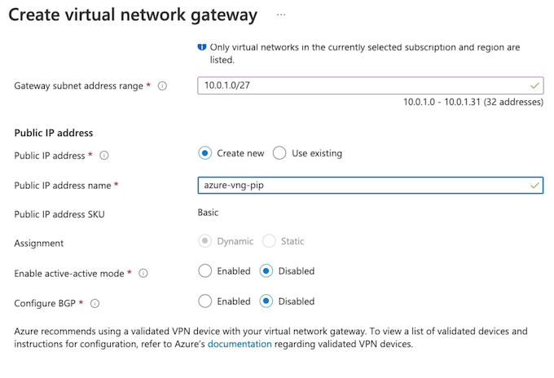

# 7 Intersite Connectivity

## 1 Configuring Azure VNet Peering

### **Network Connectivity**

**Default Connectivity**

While intra-network traffic and outbound internet traffic is allowed, **virtual networks are by default isolated**

**VNet Peering**

Bridge together virtual networks to allow connectivity between these networks.

### Describing VNet Peering

**Non-Reciprocal**

Connection must be established in both directions

> Peering connection for VNet-1 to talk to VNet-2, and a peering connection going in the other direction, allowing VNet-2 to talk to VNet-1. 

**Global Connectivity**

<mark>Peerings can be same region or cross-region (global)</mark>

**Describing VNet Peering**

**VNet peerings is that they are non-transitive.** peering connection between VNet-1 and VNet-2, and the one going in the opposite direction to VNet-2 to VNet-1, these virtual networks are peered. 

VNet-2 is also in a peering relationship with VNet-3 here. And this peering connection allows VNet-2 and VNet-3 to communicate. VNet-2 is able to communicate with VNet-1 and VNet-3, does not mean that VNet-1 and VNet-3 can communicate, **virtual network peerings are non-transitive.**

### Benefits of VNet Peering

**Benefits**

* **Low-latency, high-bandwidth connections**
* Cross-network communications
* Data transfer between/across:
	* **Subscriptions**
	* AAD tenants via Azure roles
	* Azure regions

### Demos

**Three VNETs** 

**ping from V1 in VNET1 to V2 VNET2 failed**

**Add peering**

**v1tov2 / v2tov1**

**vnet2tovnet1 peering**

**ping from V1 in VNET1 to V2 VNET2 successed**

**vnet2tovnet3 peering**

**ping from V1 in VNET1 to V3 VNET3 failed**

### Key Takeaways

**Types of Peering**

* **Virtual network peering** 
* **Global virtual network peering**

**Transitivity**

Peering connections are non-transitive

**Benefits**

* Low-latency, high-bandwidth connections
* Cross-network communications
* Data transfer between/across subscriptions, AAD tenants via Azure roles, and Azure regions

**Reciprocity**

<mark>Peering connections are not reciprocal</mark>

### Chatgpt summary

- VNet peering allows for connectivity between virtual networks in Azure.
- **Peering connections must be established on both sides in order to enable communication between virtual networks**.
- VNet peering can be set up within the **same region or across regions**.
- VNet peering provides low-latency, high-bandwidth connections for cross-network communication.
- VNet peering is non-transitive, meaning that peering connections between two virtual networks do not enable communication between other virtual networks.
- Reciprocity is required for VNet peering, with peering connections needed on both virtual networks.
- **Overlapping IP CIDRs cannot be used between virtual networks for VNet peering.**
- VNet peering can be managed through the Azure portal.
- Global virtual network peering allows for peering connections between virtual networks in different regions.

## 2 Implementing VPNs

### VPN Gateway vs. VNet Peering

### VPN Gateway

Establishes connectivity between **VNets, similar to VNet peering**

**Hybrid networks by allowing networks to communicate in the same way that we do with virtual network peering inside of our VNets with our VPN gateways with our on-premise environments**

VPN gateway connects to different networks--**both our Azure network, our virtual network, and our on-prem network, or another virtual network**--over the public internet using various components **like a virtual network gateway to establish this VPN gateway**. 

Components

* VNet gateway for VPN gateway
* Gateway subnet
* **<mark>Public IP per VNet gateway</mark>**
* IPsec tunnel for encryption

### Capabilities of Azure VPN Gateway

**Point-to-site VPN gateways**, and **site-to-site VPN gateways** with our on-premise networks

**<mark>VPN gateways in Azure different** than **VNet peerings is that with our VPN gateways, what we have is transitive traffic</mark>**

VNet peering connection with 2 different VNets

Gateway transit in the settings of the peering connection, to do is communicate with the on-premise network from that virtual network as well because of that transitive property of allowing that transitive traffic. 

**Encrypted traffic, or transitive routing inside of our networks can use VPN gateway**

### Routing Types

#### **Policy-Based**

* **Static routing via policy declarations**
* Legacy on-premises VPN devices
* Only supports IKEv1
* Only Basic SKU

#### **Route-Based**

* **Static and dynamic routing**
* Resilient to topology changes
* **Can coexist with ExpressRoute**
* Supports IKEv2, a newer version of encryption

### **VPN Gateway SKUs**

Note: Basic VPN gateway should only be used in dev/test workloads and it does not support migrating between SKUs, instead requiring a redeployment of the gateway

### Active-Active vs. Active-Passive

### Demonstration

HQ-VNet is representing our on-prem virtual network. And in the case of the on-prem virtual network, we would of course, set up the local network gateway.

### Key Takeaways

* VNet-to-VNet
* Site-to-Site
* Point-to-Site
* IPsec tunnel for encryption

### Chatgpt summary

- VPN gateways in Azure are used to establish hybrid networks and allow communication between Azure networks and on-premises networks.
- **VPN gateways use IPsec tunnels for encrypted communication over the public internet**.
- VPN gateways provide features such as **point-to-site and site-to-site VPN connections, which are not available with VNet peering**.
- **VPN gateways allow for transitive traffic, enabling communication between multiple virtual networks and on-premises networks**.
- There are two types of routing for VPN gateways: **policy-based and route-based**.
	- Policy-based routing requires static routing and supports legacy VPN devices and IKEv1 encryption.
	- Route-based routing supports static or dynamic routing, allows for coexistence with ExpressRoute, and supports IKEv2 encryption.
- **VPN gateways have different SKUs with varying capabilities and maximum site-to-site tunnels and throughput**.
- Active-active and active-passive configurations can be used for VPN gateways, **providing redundancy and failover options**.
- VPN gateways can be set up and configured in the Azure portal, including the creation of gateway subnets and local network gateways.

## 3 Implementing VPNs (Demonstration)

**vpn-demo-azure-vm-01 ping HQ Vnet vm failed**

`ping -c3 172.16.0.4`

### **Create virtual network gateway**

### Create local network gateway from HQ VN

13.83.86.44(VNET IP)

### aDD Virtual network gateway Connection

**vpn-demo-azure-vm-01 ping HQ Vnet vm succeed**

- Setting up a VPN connection in Azure requires creating a virtual network and subnets.
- A gateway subnet must be created within the virtual network to configure the VPN gateway.
- The VPN gateway is created in the Azure cloud and allows communication between Azure networks and on-premises networks.
- A local network gateway is created in Azure to configure the on-premises network settings for the VPN

## 4 Configuring ExpressRoute

### Describing ExpressRoute

**ExpressRoute is the service that we utilize in the Azure cloud to make a direct physical connection into our Azure resources and Microsoft resources.**

Different from a **VPN gateway is it's not a IPsec tunnel connection**. Is a physical dedicated connection, and this **connection is not encrypted by default**, but it allows us to make that **private connection physically over the wire to the Azure cloud and our Microsoft resources from our on-prem networks**. 

* Azure cloud resources like our infrastructure-as-a-service resources, like virtual networks and virtual machines. 
* Microsoft resources like Office 365, and this includes things like SharePoint Online or Exchange Online,

**Edge locations**

On the Microsoft side, the Microsoft Edge location and on our side of things, we have a **Partner Edge location**. We can utilize a partner, like an ISP, **to allow us to connect from our on-premise networks to that ISP that then has a physical connection from the Partner Edge to the Microsoft Edge.** 

We create **ExpressRoute circuits**. We have both a **primary and a secondary circuit that exists between the Microsoft Edge and the Partner Edge** allowing for a **highly available connection on 2 physically dedicated connections into the Azure resources and Microsoft resources that we have**. 

Connect through our partner to our on-premise network, **allowing us to connect from our on-prem network to the Partner Edge, from the Partner Edge over the ExpressRoute circuits (primary and secondary), to the Microsoft Edge**, and thus into our Azure resources and Microsoft resources. 

Connecting into these resources, have our **peering configurations and after we've created our ExpressRoute circuits, the peer configurations that we have once we have successfully provisioned the Partner-Edge-side connection to our on-prem network, is the Microsoft peering**. 

Peering that allows a connection to our resources like Office 365, and our past services. And then for our Azure resources, like our virtual networks or virtual machines and our private endpoints, **we use a peering configuration of Azure private peering to connect to these things through our ExpressRoute.**

**virtual network gateway for our private peering connection into Azure to connect to our virtual networks.**

Then we have to create a connection on our **ExpressRoute to connect to this virtual network gateway inside of our virtual network**.

**Virtual network gateway needs a gateway subnet**

ExpressRoute on-prem have to have is an **ASN number, the autonomous system number there we're going to use in the ExpressRoute configuration**. 

VLAN ID is going to represent the VLAN that we're using to peer our network. 

Then inside of our network, have to create 2/30 subnets. Each of these subnets is going to **have 4 addresses**, and 

* 2 are going to be in use and 
* the other 2 are going to be what we're using to maintain our connection via ExpressRoute and have a BGP session to exchange those routes via ExpressRoute. 

### Creating an ExpressRoute

* Creating an ExpressRoute
* Give Service Key to Provider
* **Create Peering Configuration**
	* Note: This step will be part of step 2 if the provider only offers Layer 3 connectivity instead of Layer 2.
* **Create Virtual Network Gateway**
	* The gateway type must be ExpressRoute and it must be deployed into a gateway subnet.

**Create route**

**Create virtual network gateway**

### Key Takeaways

**Azure ExpressRoute**

* Dedicated physical connection
* Built-in redundancy
* Connectivity to Microsoft
* Connectivity via private peering
* Dynamic routing via BGP
* **50 Mbps - 10 Gbps**
* Not encrypted by default

**Point-to-Point connection** using that **Microsoft Edge and that Partner Edge,** or additionally, a **direct connection into Microsoft's global network from our on-prem network, depending on what ExpressRoute we use, whether we use circuits or direct-connect**. 

ExpressRoute circuit, via a provider, provider is going to have specific locations available to us depending on the provider and then what we're going to have inside of that connection is built-in redundancy because we have a primary and a secondary connection with our ExpressRoute that gives us that connectivity to Microsoft via that Partner Edge to that Microsoft Edge. 

Connectivity via private peering like when we try to private peer into our Azure resources, like our infrastructure-as-a-service resources and our past services that have private endpoints inside of our virtual networks. Now we can additionally access through Microsoft peerings, our resources like Office 365 or past services that don't have those private endpoints

Dynamic routing via BGP so that those different networks can exchange routes via BGP. And we have the options of using bandwidth from 50 Mbps to 10 Gbps. And what we have here in comparison from ExpressRoute to a VPN gateway using virtual network gateways, is strictly just higher bandwidth and a dedicated physical connection rather than IPsec tunnel. 

### Exam Points and Knowledge for Azure AZ-104 from chatgpt

1. ExpressRoute is a dedicated physical connection service for making direct connections to Azure resources and Microsoft resources.
2. **It is different from VPN gateway as it makes a physical dedicated connection, and it is not an IPsec tunnel connection**.
3. ExpressRoute allows connectivity to Azure infrastructure-as-a-service resources, Microsoft resources like Office 365, and past services without private endpoints.
4. **It connects on-premise networks to Azure resources or Microsoft resources through edge locations like Microsoft Edge and Partner Edge.**
5. ExpressRoute circuits comprise both primary and secondary circuits between Microsoft and Partner Edges, ensuring highly available connections.
6. Peering configurations include Microsoft peering for connecting to resources like Office 365 and Azure private peering to connect to virtual networks, virtual machines, and private endpoints.
7. **To set up ExpressRoute, the process involves creating the ExpressRoute circuit, configuring peering connections, and setting up a virtual network gateway for private peering with Azure.**
8. **ExpressRoute configuration requires an ASN number, VLAN ID, subnets, shared key, public IP addresses for Microsoft peering, and integration with BGP for dynamic routing.**
9. When setting up express route, it's essential to select port type (Direct or Provider), select bandwidth (50 Mbps to 10 Gbps), defining SKU (Local, Standard, or Premium) and billing model (metered or unlimited).
10. **The service provider key is necessary for configuring the ExpressRoute circuit with the selected provider.**
11. In Azure Cloud Sandbox, the ExpressRoute configuration involves creating the ExpressRoute circuit, virtual network gateway, and setting up peering connections.

## 5 Implementing Virtual WAN

### Describing Virtual WAN

With Azure WAN, also **referred to as virtual WAN**, what we have is a **networking service that allows us a single**, **operational interface to be able to manage a hub-and-spoke style network and fully mesh networks inside of the Azure cloud.** 

**virtual WAN**： 

We can use virtual WAN hubs to create **hub-and-spoke style networks**, where we do things like have our VPN connections for our **Site-to-Site and Point-to-Site for both our on-prem and remote users. **

We can also connect our **ExpressRoute on-prem connections**, as well as **make connections to our virtual networks inside of these hubs**. 

We have a **single operational interface** to manage all of these connections, to **create this hub-and-spoke network,** and **then we also have the ability to manage things like our firewalls and our routes**, 

**so that we can manage our entire networks topology and the capabilities those connections, the routing, and the security through the firewall, all through that single operational interface.** 

**A single virtual hub, that is a managed virtual network in each region.** 

### Hub-to-Hub Connectivity

Create connectivity between regions that are also managing their own connections via VPNs for **Point-to-Site, Site-to-Site, ExpressRoute, and virtual network connections and create a full meshed network for everything that we have going on inside of our organization's network.** 

**hub-to-hub connectivity**

Create full, mesh networks using **Azure WAN** actually comes by default with a **specific virtual WAN SKU**. 

### Virtual WAN SKUs

#### **Basic**

* **Transitive peering not supported**
	* Our virtual network can't transit through the virtual WAN to communicate with our on-premise network because of the non-transitive peering support. 
* S2S VPN connections only
	* **Site-to-Site VPN connections only**
* Upgrade to Standard suppoted

#### **Standard**

* Transitive peering supported
* S2S VPN, P2S VPN, ExpressRoute, and VNetto-VNet connections

> Site-to-Site VPN, Point-to-Site VPN for our remote users, ExpressRoute connections, and VNet-to-VNet connections for our Azure WAN.

### Demo

**Create WAN**

The virtual WAN resource represents a virtual overlay of your Azure network and is a collection of multiple resources.

**WAN HUBS**
 

 
**Add Hub private address space**

**Create virtual hub**

enable Site to site (VPN gateway) before connecting to VPN sites.

### Key Takeaways

**Azure Virtual WAN**
 
* Connect networks using hub-spoke architecture
* **Basic and Standard SKUs**
* Connect S2S and P2S VPN gateways, global reach ExpressRoute, and VNets
* Secure with Azure Firewall and Firewall Manager
* Any-to-any connectivity
* **Connections propagated to managed routes**
* Managed Virtual Network

### Summary from chatgpt

Exam Points and Knowledge for Azure AZ-104 from the Article:

1. Azure WAN, also called Virtual WAN, provides a **single operational interface for managing hub-and-spoke style network and fully meshed networks in the Azure cloud**.
2. Virtual WAN hubs can be used to **create hub-and-spoke style networks, enabling VPN connections for Site-to-Site and Point-to-Site, and connections to virtual networks and ExpressRoute on-prem connections**.
3. Virtual WAN allows management of connections, hub-and-spoke network creation, and **control over firewalls and routes through a single operational interface**.
4. **Virtual WAN enables the creation of virtual hubs, managed virtual networks in each region, to establish hub-to-hub connectivity to create fully meshed networks across the Azure cloud**.
5. Azure WAN offers different SKUs: **Basic and Standard**, with the Standard SKU supporting **transitive peering, Site-to-Site VPN, Point-to-Site VPN, ExpressRoute, and VNet connections.**
6. The Standard SKU is recommended for production use over the Basic SKU due to its additional supported features.
7. Setting up Azure WAN involves creating a virtual WAN resource, configuring virtual hubs, and managing VPN and ExpressRoute connections through a single operational interface.
8. **Virtual hub creation involves specifying the region, enabling gateways for Site-to-Site, Point-to-Site, and ExpressRoute connections, and connecting virtual networks into the fully meshed network**.
9. Security features like Azure **Firewall and Firewall Manager can be used to secure the WAN, and any-to-any connectivity allows connections between remote users and virtual networks**.
10. Connections are propagated to manage routes for virtual hubs, and the virtual hubs manage gateway subnets, gateways, and service endpoints. 