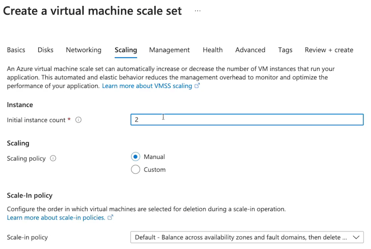

# 8 Azure Virtual Machines

## 1 Creating and Managing Virtual Machines

### What is an Azure Virtual Machine?

* Scalable cloud computing resource offered as Infrastructure as a Service (IaaS).
* Includes CPU, memory, storage, and networking resources.
* Can be created from the Azure Portal, Azure CLI, or PowerShell

### Core Parts

**CPU and Memory**

Determined by virtual machine (VM) sizing. Selected based on VM use case.

**Networking**

Virtual Networks (VNets), Subnets, Network Interface Card (NIC), Public IP (PIP), and Network Security Group (NSG).

**Storage**

Azure Disks, consisting of OS disk, temporary 
disk, and data disk.

### Keeping VM Workloads in the Family

**VM Family Type** | **Description**
------------- | -------------
General Purpose  | Balanced CPU-to-memory. Best for testing, development, or for small to medium workloads.
Compute Optimized  | High CPU-to-memory. Good for medium traffic web servers, network appliances, batch processing, and app servers.
Memory Optimized | High memory-to-CPU. Works well for relational databases, caching, and inmemory analytics.
Storage Optimized | High disk throughput and I/O. Good for Big Data, SQL, NoSQL, and data warehousing. Works well for Online Transactional Processing (OLTP) databases
GPU | Specialized for heavy graphic rendering and video editing. Works well for artificial intelligence (AI) training and deep learning
HPC | Fastest and most powerful. Great for intensive workloads like large scale geophysics and advanced mathematics/sciences


### Virtual Machine Properties


* Name: CloudChaseVM
* Region: East US 2
* Size: Standard_B1s
* Image: Linux/Windows

### Summary from chatgpt

Exam Points and Knowledge for Azure AZ-104 from the Article:

1. Azure Virtual Machine is an Infrastructure as a Service (IaaS) solution provided by Microsoft Azure for deploying virtual machine instances in the Azure Cloud.
2. Virtual Machine instances can be managed and deployed using the Azure Portal, Azure CLI, PowerShell, client SDKs, and API.
3. **Components of Virtual Machines include CPU, memory, storage, and networking resources, which can be provisioned based on the use case and requirements**.
4. Virtual Networks, subnets, private IP addresses, and public IP addresses are used to deploy virtual machine resources and manage network connectivity.
5. **Azure disks provide OS disk and temporary disk for non-persistent data storage by default, and can have additional data disks for persistent storage**.
6. Different family types of Virtual Machines cater to specific use cases, **such as general purpose, compute optimized, memory optimized, storage optimized, GPU, and high-performance compute**.
7. Virtual Machines properties include name, region of deployment, sizing SKU for compute, memory, and storage performance, and choice of Linux or Windows image.
8. Virtual Machine instances **consist of Azure disks and network interfaces, with IP configurations for private and public IP addresses**.
9. Resources associated with Virtual Machines are deployed into a common resource group to **share a common lifecycle.**


**Virtual Machine Architecture**


### Demonstration

**Create a Linux VM**

Use Azure Portal, Azure CLI, and PowerShell via the Cloud Shell in the Cloud Playground.

**Configure Disks**

Add a data disk to the VM.

**Configure Networking**

Select/Create a VNet, subnet, NIC, PIP, and NSG.


**Install a Webserver**


Install Nginx using custom Configure Disks data.

**Open NSG for HTTP**

Manage security rules for the VM.


### Intended Purposes

**Linux/Windows Compute**

Deploy Linux/Windows virtual machines using Azure VM’s IaaS model.

**Migrate Workloads**

Migrate compute workloads to Azure. For example, move web servers to Azure VMs

**Cloud Computing Solutions**

Azure VM workloads with specific configurations and additional resources can provide solutions with high availability, fault tolerance, scalability, and elasticity.

**Inbound port rules**

This will allow all IP addresses to access your virtual machine.

### Exam Tips

**Key Components**

* **CPU/Memory**: Sizing determines CPU and memory
* **Networking**: VMs use VNets, NICs, and NSGs to determine connectivity
* **Storage**: VMs use Azure Disks to store OS, non-persistent, and persistent data


**BONUS TIP**

Security for VMs can be managed by opening ports on a NSG (Network Security Group).


**new disk（Source type）**: Snapshot / Storage blob / empty


* Subnet 
* NIC network security group
* Public IP


[https://learn.microsoft.com/en-us/azure/virtual-machines/linux/tutorial-automate-vm-deployment](https://learn.microsoft.com/en-us/azure/virtual-machines/linux/tutorial-automate-vm-deployment)

```
#cloud-config
package_upgrade: true
packages:
  - nginx
  - nodejs
  - npm
write_files:
  - owner: www-data:www-data
    path: /etc/nginx/sites-available/default
    content: |
 ...
```


### Summary from Chatgpt


Exam Points and Knowledge for Azure AZ-104 from the Article:

1. Virtual Machine architecture includes a **resource group, virtual network, subnet, network interface card, Azure disks, and security rules using Network Security Groups**.
2. The process of creating a Linux virtual machine involves **configuring networking, creating a virtual network, subnet, NIC, public IP address, and a network security group, and adding network security group rules**.
3. Aspects of virtual machine deployment such as selecting regions, sizing, images (Windows or Linux), and authentication methods using SSH public key or password are essential knowledge areas.
4. Disk options, including **Premium SSD, Standard SSD, and Standard HDD**, and the ability to **create additional data disks for persistent storage, are components of virtual machine deployment**.
5. Networking configuration for virtual machines involves creating virtual networks, subnets, public IP addresses, and associating a NIC with a network security group for securing public connectivity.
6. Advanced features for virtual machines **include boot diagnostics, OS guest diagnostics**, and using extensions for post-deployment configuration and automation through scripts or custom data.
7. The ability to secure VMs by managing security through **opening ports on a network security group for public connectivity is important knowledge for virtual machine deployment and management**.


## Managing VirtualMachine Disks

### What Are Virtual Hard Disks?

**Virtual Hard Disks (VHDs)**

<mark>A file representation of what is found on a hard disk</mark>

Virtual machines (VMs) use **VHDs to store OS, apps, and data**. 

VHDs utilize the underlying Microsoft storage infrastructure. **They are stored as page blobs in the blob service**.


> **Virtual hard disks** that virtualize that hardware component. 
> 
> **Virtual machines** use these virtual hard disks to store data, and our virtual hard disks ( i.e. Azure disks) use **the underlying Microsoft storage infrastructure and store these disks as page blobs inside of the Blob service**. 


### Purposes of VHDs

**OS Disk**

* Default with virtual machines
* Stores the operating system
* Registered as a SATA drive
* Labeled as the C: drive for Windows and mounted at `“/“` for Unix-like systems
* Max capacity of 4,095 GiB


**Temporary Disk**

* Default with virtual machines 
* **Stores non-persistent data like page and swap files**
* Local disk for the underlying Microsoft infrastructure

**Data Disk**

* Additional disks attached to a VM （they don't come by default）
* Used for storing persistent data like files or databases
* Registered as a SCSI drive
* Max capacity of 32,767 GiB


> OS disk, our temporary disk, and our data disks. 

### Unmanaged s. Managed Disks

**Unmanaged**

* Not an Azure Resource Manager (ARM)-managed resource
* Manually managed storage accounts
* Availability not guaranteed

**Managed**

* An Azure Resource Manager (ARM)-managed resource
* Azure-managed storage accounts
* Availability supported
* Role-Based Access Control (RBAC)
* Snapshot support
* Backup Support

### Major Disk Types

**Disk Type**

* **Ultra Disk (SSD)**： I/O-intensive workloads like top tier Online Transactional Processing (OLTP), any transaction-heavy workloads. (Only used as a data disk.)
* **Premium (SSD)**： **Production and performance workloads.**
* **Standard (SSD)**： Web servers, light enterprise applications, and dev/test workloads.
* **Standard (HDD)**： Backup, non-critical workloads.

### Disk Encryption at Rest for Defense in Depth

The disk encryption can happen at rest and also it can happen on the virtual machine

**Storage Service Encryption (SSE)**

* Encryption of physical disks in the data center
	* Encrypting the disks of the underlying hardware. 
* Built into Azure platform

**Azure Disk Encryption (ADE)**

* Optional encryption of the VHDs
* Ensures a disk is only accessible by the VM that owns the disk
* OS tools like BitLocker and DM-Crypt

### Demonstration

**Add a Data Disk to a VM**

Use Azure Portal in Cloud Playground to add a data disk

**Enable Azure Disk Encryption**

Create a key vault, create a key, and select encryption settings.

**Validate Encryption**

Use PowerShell to validate encryption.


Azure Disk Encryption (ADE) provides volume encryption for the OS and data disks. 


```
Get-AzVMDiskEncryptionStatus -ResourceGroupName -sandbox -VMName vmdemo01

OsVolumeEncrypted         NotEncrypted
DataVolumesEncrypted     NotMounted
OsVolumeEncryptionSettings
ProgressMessage          Encryption succeeded for data volumes
```


### Exam Tips


* Azure Disks are really just virtual hard disks: a virtualized hard disk, much like a physical hard disk on a physical machine. 
* Azure Disks to provide the OS disk and the temporary disk by default to our virtual machines, to provide the operating system, which is our root disk; 
* Temporary disk that is localized to the underlying hardware, and this is great for non-persistent storage like swap files. 
* Data disks that we can create and attach to these virtual machines. And these are managed as a separate resource and these provide persistent data storage for virtual machines. 
* Azure Disks are utilizing the underlying Microsoft storage infrastructure and storing our disks as page blobs. And we don't have to necessarily keep track of all of this if we're using managed disks, because Microsoft is going to do it for us. 
* encryption on our physical hardware on the physical disks inside of the data center. 

### Summary from chatgpt

Key knowledge points for the Azure AZ-104 exam extracted from the "Managing Virtual Machine Disks" article:

1. Understanding virtual machine disks (Azure disks) as virtual hard disks used to store data for Azure virtual machines.
2. Familiarity with the purpose of Azure disks, including OS disks, temporary disks, and data disks, and their storage as page blobs within Microsoft's storage infrastructure.
3. Differentiation between unmanaged and managed disks, identifying managed disks as Azure Resource Manager-managed resources, providing availability, role-based access control, and snapshot and backup support.
4. Knowledge of disk types including Ultra Disk, Premium disks, Standard SSD, and Standard HDD, with awareness of their use cases for I/O intensive, production, web servers, and backup workloads.
5. Understanding of disk encryption in Azure, including Storage Service Encryption for physical disk encryption in data centers and Azure Disk Encryption for optional encryption of virtual hard disks using OS tools like BitLocker or DM-Crypt for Linux.
6. Practical application of adding a data disk to a virtual machine, enabling Azure Disk Encryption by creating a key vault, generating a key, and selecting encryption settings, followed by validation using PowerShell in the Cloud Shell.

## Configuring Virtual Machine Availability and Scale Sets

### Global Infrastructure and High Availability

For example, inside of the Azure cloud, we have regions across the globe where we deploy our virtual machines. 

Within these regions(Exp East US), we have a cluster of **Availability Zones**, and these Availability Zones are isolated from one another. 


If one of these Availability Zones experiences any sort of outage for whatever reason - like a natural disaster or some sort of apocalypse, we are good to go, because the other Availability Zones are still available. 


**Global Infrastructure and High Availability**


Even with Availability Zones, if we distribute our solutions improperly, such as putting our database tier in one Availability Zone and our web tier in another Availability Zone, if Availability Zone 2 experiences an outage, our solution is ultimately still down and not highly available, because it is not redundant. 


What we could do to fix this and make it highly available is to spread our web tier across Availability Zone 1 and 2, and do the same with our database tier. And that way, if we experience that outage in Availability Zone 2, the good thing is, Availability Zone 1 is still up and running, and our solution is still available.

### Virtual Machine Availability Sets

**What about protecting ourselves on the underlying hardware inside of these Availability Zones?**

**Purpose of Availability Sets**

* Protect redundant VMs
* Protect against underlying host failures,such as a server rack going down. 
* Prevent outages due to maintenance

### Virtual Machine Availability Sets

**Fault Domain (FD)**

Underlying host failure, such as power or network outages. (Max FD: 3)

The fault domain is going to protect is from underlying host failures, because these 2 server racks don't share the same underlying resources, like power and network.

And availability sets automatically takes care of spreading out our virtual machines inside of the availability set across the fault domains, and we can spread them across a max of 3 fault domains. 


**Update Domain (UD)**

> About the maintenance activities?

Logical grouping of infrastructure for maintenance/updates.  (Max UD: 20)

What update domains are logical groupings of the underlying infrastructure to protect us from any sort of maintenance activity or any updates occurring on the underlying hardware. 


For example, if there is an update taking place on anything in update domain 2, everything inside of update domain 1 is good, and we don't have to worry about any outage related to this maintenance activity. 


**Availability Sets**

Availability sets are **automatically going to distribute our virtual machines in the availability set** across the update domains, and **we can distribute across a max of 20 update domains**.


Fault domain host failure. Inside of our Availability Zone, we have 2 server racks, and we have our app running in both as part of an availability set. If server rack 1 goes down, we are still good to go, and we still have a highly available solution, because we have our app running in another instance on the underlying server rack in fault domain 2 that is still good to go. 


**This protects us using availability sets and makes our multi-AZ deployment also highly available within that Availability Zone itself by using availability sets.** 

### Demo for availability sets


**Availability sets**


Machine scale set

* Network interface
* Load balancing


### Autoscaling Operations

* If traffic demands go up to our virtual machines, we'll scale up


Scale set is providing the compute solution that meets our traffic demand, and **this is achieved through horizontal scaling, or scaling out, of our virtual machines**. 

**Why Use Scale Sets?**

Purpose of Virtual Machine Scale Sets

* Simplify scaling configurations
* Save costs by aligning usage with demand
* Scale to meet demand of traffic


For example, the virtual **machine's size, the image we want to use, the network interface card, the storage, and all of the underlying resources that you would typically get with a virtual machine**. 

**Virtual machine definition** 

Scaling definition is going to define the scaling actions, i.e. scaling in or out, **based on whatever conditions are met**. An example here is our **scaling definition can be that, if we have CPU utilization that is greater than 80%, well then, add one VM**. 


**Scale-in policy**

Scale-in policy allows us to scale back in and delete VMs by priority as scaling operations occur.

Provide a scalable and elastic solution using these virtual machine scale sets. 


### Exam Tips

**Scale Sets**

Autoscale solutions to meet demands of traffic and scale in to decrease costs when demand goes down.

**High Availability**

Design highly available solutions using zonal redundant deployments.

**Availability Sets**

Provide protection for redundant VMs by preventing outages related to faults and updates by logically grouping them into domains


### Scaling Sets Demo 


**Scaling out policy**




**Scaling in policy**


### Summary from Chatgpt

Key knowledge points for the Azure AZ-104 exam extracted from the provided article:

1. **Highly available solutions in Azure**:
   - Understanding Azure's global infrastructure with regions and Availability Zones that provide isolation and redundancy to ensure high availability of resources.
   - Exploring the concept of deploying virtual machines across Availability Zones for protection against outages.

2. **Virtual machine availability sets**:
   - Understanding the purpose of availability sets to protect redundant virtual machines against host failures and maintenance activities.
   - Exploring the use of fault domains to protect against underlying host failures and update domains to handle maintenance activities within an availability set.
   - Configuring fault domains and update domains when creating an availability set.
   - Using availability sets to maintain a highly available solution within an Availability Zone.

3. **Practical demonstration**:
   - Creation of an availability set in the Azure portal.
   - Deployment of virtual machines into the availability set to demonstrate fault domain and update domain distribution for protecting against underlying hardware failures and maintenance activities.


Key knowledge points for the Azure AZ-104 exam extracted from the provided article:

1. Scale sets for scalability:
   - Understanding the purpose of virtual machine scale sets in providing scalability for virtual machine deployments in response to fluctuating traffic demands.
   - Exploring the concept of horizontal scaling or scaling out within virtual machine scale sets to add or remove instances based on traffic requirements.
   - Leveraging virtual machine scale sets to align the usage of virtual machines with traffic demands and optimize costs.

2. Components of virtual machine scale sets:
   - Understanding the components of virtual machine scale sets, such as VM definitions, scaling definitions, and scaling policies.
   - Exploring the use of scaling policies to define actions based on conditions like CPU utilization thresholds to automatically adjust the number of instances in the scale set.

3. Practical demonstration:
   - Creating a virtual machine scale set using the Azure portal and configuring various settings including region, availability zones, virtual machine image, authentication type, disks, networking, scaling policies, and upgrade policies.
   - Reviewing the created virtual machine scale set and its instances, as well as custom autoscaling configurations.

4. Exam tips:
   - Emphasizing the creation of highly available and scalable virtual machine solutions using multi-AZ deployments, availability sets, and scale sets.
   - Recognizing the role of availability sets in protecting redundant virtual machines within an Availability Zone to prevent outages related to faults and updates.
   - Understanding the use of virtual machine scale sets to provide scalable and elastic virtual machine solutions and align the virtual machine deployment with traffic demands.

## Automating Virtual Machine Deployments


### Why Automate VM Deployments?


* Patch/update Operating System (OS) **using extensions and scripts** 
* Pre-install software (e.g. Apache2 web server)
* Preconfigure settings
	* For our virtual machines when we deploy them. 

### Azure Resource Manager (ARM) Templates

**Infrastructure as Code (IaC)**

Text-based (declarative JSON) definition of Azure resources and resource configurations.

**Deployment Consistency**


Manage resource deployments using software deployment methodologies

**Automation**


Automate resource deployments and provide modular approach to resource deployments


### Azure Resource Manager (ARM) Templates

  

For example, inside of Azure, we have a resource group that we can deploy our resources to using a ARM template or Azure Resource Manager template. We'll **<mark>define the resources such as our virtual network, the virtual network's configurations, a subnet, a virtual machine, the disk associated with that virtual machine, the network interface associated with that virtual machine, a public IP address for our virtual machine, and even the network security group, and the rules that are part of this deployment</mark>**. This can all be in one ARM template where we define all of this Infrastructure as Code. 


### Virtual Hard Disk (VHD) Templates

Automate the deployment of our virtual machines is we could use a source virtual machine to create what is known as a **golden image**


**Prep Virtual Machine**

Configure VM with required software, updates, and configurations

**Generalize Virtual Machine**

Prepare VM for imaging using sysprep (Windows) or VM Agent deprovision (Linux)


### Demonstration

**Deploy VM Using ARM Template**

Using an ARM template, deploy a Linux VM and modify the NSG rule properties.

Add ARM template

[https://acloudguru-content-attachment-production.s3-accelerate.amazonaws.com/1619127192805-vm_arm_template.json](https://acloudguru-content-attachment-production.s3-accelerate.amazonaws.com/1619127192805-vm_arm_template.json)

```
...
"properties": {
        "securityRules": [
          {
            "name": "http",
            "properties": {
              "priority": 1010,
              "protocol": "TCP",
              "access": "Allow",
              "direction": "Inbound",
              "sourceAddressPrefix": "*",
              "sourcePortRange": "*",
              "destinationAddressPrefix": "*",
              "destinationPortRange": "80"
            }
          }
        ]
      }
...
```


**Custom deployment**


Using the generalized image, deploy a Linux VM.


**Generalize VM**

Generalize the Linux VM to prep for imaging as a VHD template

```
sudo waagent -deprovisiontuser
```


Let it deprovision our virtual machine.

```
$rg = (Get-AzResourceGroup).ResourceGroupName
$myvm = az vm list --query [].name -s tsv
  --resouce-group $rg `
  --name $myvm
```


```
az vm generalize `
	--resouce-group $rg `
	--name $myvm
	 
az vm create `
	--resouce-group $rg `
	--name myImage --source $myvm
```


**Deploy VM from Custom Image**


### Demonstration

**Deploy Linux Web Server**: Using cloud-init, deploy a Linux web server running Apache2.

**Generalize VM**: Generalize the Linux VM to prep for imaging as a VHD template

**Deploy VM Using ARM Template**: Using an ARM template, deploy a Linux VM and modify the NSG rule properties.

**Deploy VM from Custom Image**: Using the generalized image, deploy a Linux VM

### Exam Tips

**ARM Templates**

Deploy VMs quickly and manage infrastructure using change control using Infrastructure as Code (IaC).


**VHD Template**

Create a golden image of VMs to easily deploy VMs with consistent software and configurations

**Automate Management**

Manage VM deployments using custom data and manage VMs using extension scripts


### Summary from chatgpt

Key knowledge points for the Azure AZ-104 exam extracted from the provided article:

1. Importance of automating VM deployments:
   - Understanding the benefits of automating VM deployments, such as automating patching and updating processes, pre-installing software on virtual machines, and preconfiguring virtual machine settings.
   - Exploring the role of automation in ensuring consistent and repeatable deployments and managing infrastructure as code.

2. Azure Resource Manager (ARM) templates for automation:
   - Understanding ARM templates as JSON documents that define Azure resources and configurations, and the use of Infrastructure as Code to ensure consistent deployments.
   - Modifying ARM templates to customize deployment configurations, such as adding security rules to network security groups.

3. Creating a golden image for VM deployment:
   - Exploring the concept of creating a golden image from a source virtual machine by preparing it with required software updates and configurations, and generalizing the virtual machine to create a custom image for deployment.

4. Deployment automation and custom scripting:
   - Demonstrating the use of custom data and extension scripts for post-deployment configurations and automation of tasks on virtual machines.

5. Practical demonstration:
   - Step-by-step demonstration of deploying a virtual machine using an ARM template, modifying the template to add security rules, generalizing the virtual machine to create a custom image, and deploying a new virtual machine from the custom image.

6. Exam tips:
   - Emphasizing the use of ARM templates and Infrastructure as Code to automate and manage virtual machine deployments.
   - Recognizing the importance of creating custom images and automating post-deployment configurations using custom data and extension scripts.
   - Understanding the benefits of automation in ensuring consistent and repeatable deployment processes for virtual machines.

These knowledge points cover important aspects of automating virtual machine deployments in Azure and are relevant to the objectives of the AZ-104 exam.

## Managing Virtual Machine Updates

### Describing Update Management

Update Management is our solution for managing guest operating system. 

**Update Management**

**Manages system updates and patches for workloads both in the Azure cloud and on-premises**

* Supports Linux and Windows VMs
	* **Running in Azure and running as non-Azure compute(on-prem**). 
* Provides capabilities for:
	* Scheduling for update
	* Compliance scanning
	* Reporting


**Components of Update Management**


1. **Automation account**, a service inside of Azure that carries out the **automation of running our Update Management Solution**. 
2. **Log Analytics agent**, as an agent on our operating system to tell us what is going on on the operating system and whether or not our machines are up to date, and the post status of update jobs. 
3. **update jobs** are going to be configured by us as users and run by the Hybrid Runbook Worker, which is part of our automation account.
4. **Log Analytics agent** is going to perform a pre-update report. 
5. To see what pre-updates we need by seeing things such as the compliance scanning, and the reports on what updates are available. 
6. check maintenance windows with our Hybrid Runbook Worker.
7. Perform the updates and start them on our operating system inside of these maintenance windows. And then after the updates are done, we're going to have update report to tell us how the update went.


### Demo 

Allow HTTP and HTTPS so that we can allow Update Management to communicate with this virtual machine, so that we can determine what updates are necessary for the virtual machine. 


**Update Management**


### **Key Takeaways**


**Automation Account**： Service for managing update configurations for VMs

**Hybrid Runbook Worker**： Runbook for updates and configurations that will be run

**Log Analytics Workspace**： Storage for logging details about update management processes

**Log Analytics Agent**： Agent installed on OS for sending back data to workspace log

Managing Virtual Machine Updates, both in the cloud and on-prem to manage things like _guest OS updates, such as our system updates,_ so that we can make sure that our systems are always up to date with the most up-to-date security updates that are rolling in. 
 
 
Automation account. **is the service that is going to manage update configurations for our virtual machines**. 

Hybrid Runbook Worker, which is going to consist of the Runbook for updates and configurations that are going to be run. 

Log Analytics workspace, which is going to be our storage service for logging details about the Update Management process, **such as the compliance, and as well as things such as failed deployments that we've tried to run**. 


Log Analytics agent, which is going to be the agent that we saw installed on our virtual machine that is going to be sending the information to our workspace that we have so that we can log that data inside that Log Analytics workspace, to determine things such as the compliance of the updates of our virtual machines.


### Summary from chatgpt

Here is a breakdown of the components and concepts related to Update Management discussed in the article:

1. Purpose of Update Management Solution:
   - Update Management is a solution for managing guest operating system updates and patches for virtual machines, both inside Azure and on-premise.
   - It provides support for Linux and Windows VMs in Azure and non-Azure compute resources running on-premises.

2. Functionality of Update Management:
   - Capabilities include scheduling updates, compliance scanning for correct updates, reporting on update jobs, and failure analysis for update issues.
   - The solution also enables pre-update reporting, update configuration, maintenance window checking, update execution, and post-update reports.

3. Components of Update Management Solution:
   - Operating System: The OS running on virtual machine workloads, whether inside Azure or on-premises.
   - Automation Account: A service in Azure for automating the execution of the Update Management Solution.
   - Log Analytics Agent: This agent functions on the OS to monitor the update status, update jobs, and report to the Log Analytics workspace.
   - Hybrid Runbook Worker: Part of the automation account that runs the configured update jobs against the virtual machines.

4. Demonstration in the Azure Portal:
   - The process of enabling Update Management on a virtual machine was demonstrated in the Azure portal, which involved creating a virtual machine and enabling Update Management for it.
   - The creation of a Log Analytics workspace and an automation account was part of the enablement process.

5. Key takeaways from the lesson:
   - Update Management Solution is used for automating and managing guest OS updates for virtual machines, ensuring they are up to date with security updates.
   - The use of the automation account, Hybrid Runbook Worker, Log Analytics workspace, and Log Analytics agent was emphasized in the management of update configurations and logging update details.

## Automating Virtual Machine Configuration

Automation Account in PowerShell Desired State Configuration for Linux and Windows virtual machines. 

### Describing Configuration Automation

**Config Automation**

Automates configuration management of virtual machines using an **Automation account** and **PowerShell Desired State Configuration (DSC)**

* Supports Linux and Windows VMs
* Built-in pull server
* PowerShell DSC uses declarative syntax


* Using **PowerShell Desired State Configuration**, what we have is a **built-in pull server**, and this is going to allow us to be able to keep our environments configured in the same fashion across all of our virtual machines using the PowerShell Desired State Configuration.
* PowerShell Desired State Configuration uses a **declarative syntax,** allowing us to **have our configuration of our environments be item potent so that it is the same across all virtual machines** 


1. Automation Account that we create that allows us to use **PowerShell Desired State Configuration** and then we have **our virtual machine and our virtual machine has a local configuration manager** on it that's going to be able to reach out to the Automation Account and then when it reaches out to the Automation Account
2. **The Automation Account, as the pull server**, is going to send back the PowerShell Desired State Configuration that is necessary so that we can make sure that if this virtual machine has drifted, that we pull it back into line. 
3. Use the PowerShell Desired State Configuration to be able to determine what our alignment across the environment is going to look like
4. Declarative PowerShell syntax where we can do things such as ensure that there's always going to be a web server feature present on our virtual machines


### **Describing Configuration Automation**


1. These machines with their **local configuration managers（LCM) are going to reach out to our Automation Account pull server to see what the PowerShell Desired State Configuration** 

2. Pull server is going to send it back and make sure that these web servers are in line with the PowerShell Desired State Configuration all across our entire environment, ensuring that we are automating the configuration of the virtual machines to stay in alignment with what we've determined in that PowerShell Desired State Configuration. 

### Describing PowerShell DSC

```
Configuration MyDscConfiguration {
 	Node "localhost" {
 		WindowsFeature MyFeatureInstance {
 			Ensure = 'Present'
 			Name = 'Web-Server'
	}
 } 
}
```

### Demo


- Creation of a virtual machine in Azure Cloud Sandbox.
   - Setting up an Automation Account for configuration automation.
   - Importing and compiling a PowerShell Desired State Configuration file into the Automation Account.
   - Connecting the virtual machine to the Automation Account and applying the configuration to set up a web server.


**Create Automation Accounts**


**config-demo-auto | State configuration (DSC)**


`$HOME/mydscconfig.ps1`

```
Configuration MyDscConfiguration {
 	Node "localhost" {
 		WindowsFeature MyFeatureInstance {
 			Ensure = 'Present'
 			Name = 'Web-Server'
	}
 } 
}
```


```
Import-AzAutomationDscConfiguration `
	-AutomationAccountName config-demo-auto `
	-ResourceGroupName 1-57dala2d-playground-sandbox `
	-SourcePath /home/cloud/mydscconfig.ps1  `
	-Force  `
	-Published
```
	


**Registration to Automation Account**


### Key Takeaways

**Automation Account**

Service for managing update configurations for VMs

**PowerShell DSC**

PowerShell scripts that declare desired state of VMs

**Local Configuration Manager**

Sends current config state to pull server for evaluation


### Summary from Chaytgpt


Key Points for Azure AZ-104 Exam from the Article:

1. **Automation Account and PowerShell Desired State Configuration (DSC)**:
   - Azure Automation Account enables automation of configuration for virtual machines using PowerShell Desired State Configuration for Linux and Windows VMs.
   - DSC uses a declarative syntax to ensure consistent configuration across VMs and prevent configuration drift.
   - Local Configuration Manager on VMs communicates with the Automation Account's pull server to maintain alignment with the DSC.

2. Demonstration in Azure Cloud Sandbox:
   - Creation of a virtual machine in Azure Cloud Sandbox.
   - Setting up an Automation Account for configuration automation.
   - Importing and compiling a PowerShell Desired State Configuration file into the Automation Account.
   - Connecting the virtual machine to the Automation Account and applying the configuration to set up a web server.

3. Use Cases and Benefits:
   - Automation of configuration management for multiple virtual machines to maintain consistency across the environment.
   - Detection and correction of configuration drift using PowerShell Desired State Configuration.
   
4. Key Takeaways for AZ-104 Exam:
   - Understanding the automation capabilities provided by Azure Automation Account and PowerShell Desired State Configuration.
   - Knowledge of how DSC ensures consistent configuration and prevents configuration drift.
   - Familiarity with the process of importing, compiling, and applying DSC configurations to virtual machines in Azure.

These points encapsulate the essential knowledge and concepts related to Automation and Configuration Management in Azure, which candidates should be familiar with for the AZ-104 exam.

## Using Azure Bastion

Azure Bastion is a Platform as a Service inside of the Azure Cloud.

### What Is Azure Bastion?

**What is Azure Bastion?**

* Fully-managed PaaS
* RDP/SSH connectivity
	* Not having to actually manage the underlying infrastructure that Azure Bastion is using. 
* No public IPs exposed


**Facts**

Azure Bastion

* RDP/SSH connectivity over SSL/TLS
* Deployed per virtual network
* Connectivity to all VMs in VNet
* **<mark>HTML5 browser supported</mark>**
* No public IPs
* Only supports IPv4
* Security is managed


The Azure Bastion will have a public IP address that we'll use to connect to the Azure Bastion, but the actual virtual machines we're connecting to do not need to have public IPs at all.


Only have support for IPv4 public IP addresses for our Azure Bastion, and the security of our Azure Bastion is going to be managed for us because it is a platform as a service, and we don't have to worry about any of the underlying infrastructure on which our Bastion is running. 

### Azure Bastion Architecture


Typically, what we would do is to connect to our virtual machines inside of our virtual network We'd have to connect to them over the **public internet using a public IP address**, and we'd have to have their correct network security group rules and the firewall rules on any firewalls that we have to secure this network and its traffic.


Azure Bastion, what we can do is create an **Azure Bastion subnet for our bastion resource**, and then we can connect to our Azure Bastion, and by connecting to our Azure Bastion, **it acts as a jump box**. It allows us to be able to connect to all of the virtual machines that we have inside of this virtual network over RDP and SSH connections, so that we can manage these. 
 
**It's going to send the return traffic through the Azure Bastion itself and back over the internet to us so that we can access it inside of the browser**, and **manage these virtual machines without having to expose them with public IP addresses**.

### Demo

Public IP： None


not allowing any inbound traffic here.

**VM Subnet**


**Create a Bastion within subnet**


Connect vm with bastion


### Key Takeaways

**Private Traffic**

Traffic from Bastion to target VM stays within VNets. (Peered VNets included.)

**Hardened Bastion**

NSGs are not needed because Bastion is hardened internally.

**Audit Logs**

Enable diagnostics for auditing Bastion connections.

**Service Integration**

Bastion natively integrates with Azure Firewall.

**Concurrent Connections**

Total maximum connections is 25 with RDP and 50 with SSH traffic.

**Required Role**

Reader role permissions are required on the Bastion, VM, and NIC in order to use Bastion]


### Summary from chatgpt

Key Points for Azure AZ-104 Exam from the Article:

1. Azure Bastion Overview:
   - Azure Bastion is a fully managed Platform as a Service in Azure Cloud, acting as a jump box to enable secure RDP and SSH connections to virtual machines without managing underlying infrastructure.
   - It eliminates the need to expose public IPs for virtual machines and provides secure connectivity within the virtual networks.

2. Secure Connectivity with Azure Bastion:
   - **RDP and SSH connections over SSL/TLS are supported by Azure Bastion, ensuring secure communication by defaul**t.
   - **Azure Bastion is deployed on a per-virtual network basis, with a dedicated Azure Bastion subnet within the virtual network**.

3. Bastion Deployment and Use:
   - Creation of a virtual machine and deployment of Azure Bastion in the Azure Cloud Sandbox to enable connection to the virtual machine without public IP exposure.
   - Configuration of the Azure Bastion subnet within the virtual network and provisioning of Azure Bastion.

4. Key Takeaways for AZ-104 Exam:
   - Understanding the role of Azure Bastion as a secure connectivity solution for virtual machines within virtual networks.
   - Knowledge of the deployment process for Azure Bastion, including the creation of the Azure Bastion subnet and required configurations.
   - Awareness of the security features, maximum concurrent connections, auditing, permission requirements, and native integration with Azure firewall for Azure Bastion.

Here are some additional exam-relevant details from the article:

5. Azure Bastion Security Features:
   - Azure Bastion employs an encrypted SSL/TLS tunnel for RDP and SSH connections, ensuring secure communication between the client and the virtual machine.
   - **It eliminates the need to manage public IPs, decreasing the surface area for potential attacks**.

6. Maximum Concurrent Connections:
   - Azure Bastion is designed to handle multiple concurrent RDP and SSH sessions, **with a maximum of 10 concurrent connections per Azure Bastion instance.**

7. Auditing and Logging:
   - Azure Bastion provides detailed session logs and auditing capabilities, allowing administrators to monitor and track RDP and SSH connections for security and compliance purposes.

8. Permission Requirements:
   - To access a virtual machine through Azure Bastion, users need the necessary permissions, **such as "Virtual Machine Contributor" or "Virtual Machine Operator" role assignments**.

9. Integration with Azure Firewall:
   - **Azure Bastion seamlessly integrates with Azure Firewall to leverage network security groups and control traffic flows for an added layer of security within the virtual network**.
