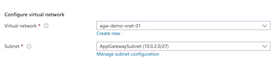

# 9 Network Traffic Management

## 1 Introducing Azure Load Balancer

### **Azure Load Balancer (LB)**

Azure Load Balancer is a networking solution for distributing traffic between backend compute.

**virtual machines and virtual machines scale sets.**

Backend compute set of virtual machines that **offers up the same web server and website.** load balancer solution to balance the traffic for that single web solution.

* **Layer 4 load balancing (TCP/UDP)** 
	* port 80 for TCP
	* port 443 for HTTPS
* High availability
* **Backend resources must be redundant**
* **Virtual machines and VMSS(virtual machines scale sets)**

### Traditional vs. Azure Load Balancer

**Internal traffic**, doesn't have to just be external from the public internet, it can be internal within our own networks. A database solution as an internal load-balancing solution for a application

### Components of an Azure Load Balancer

* **Frontend IP**

Private or public endpoint for accessing the load balancing solution.

Have an accessible either public or private endpoint for the frontend IP of this Azure load balancing solution.

* **Backend Pool**

Compute solution underlying the load balancer

* **Health Probe**

Probe that periodically checks the health of the 
backend pool to determine available nodes.

* **Rules**

**Load balancing or NAT rules configured for allowing inbound/outbound access.**

Load balancing rules that tell how we're going to balance traffic between our backend compute, or **our NAT rules for both inbound and outbound rules to allow access over things like SSH, from our public IP address of our load balancer, and then NATing** that to one of the backend computes inside that load balancer. 

### Demo

No public IP for each subnet

SKU Standard or Basic.  **Standard is production workload per Microsoft's recommendations**. 

**Add backend pool**

**Health probe**

**LB rules**

### Key Takeaways

* **Load Balancing**

Balance traffic between external or internal solutions.

* **Health Probing**

Health check ports for nodes in the backend pool.

* **DNAT**

Port forward **inbound traffic to nodes in the backend pool**.

* **SNAT**

Port forward **outbound traffic from nodes in the backend pool**.

* **Availability Zones**

Determine availability zone selection for deployment

###  Summary from Chatgpt

1. Azure Load Balancer Overview:
   - Azure Load Balancer is used to balance traffic between backend compute resources such as virtual machines and virtual machine scale sets in Azure.
   - **It provides layer 4 (TCP/UDP) traffic balancing and can distribute traffic for common purposes such as web servers**.

2. Load Balancer Configuration:
   - Azure Load Balancer can be configured **for both private and public load balancing situations, allowing it to balance internal and external traffic within a virtual network**.
   - Components of Azure load balancing solution include the **virtual network, load balancer, frontend IP configuration, backend pool, health probe, and load balancing rules**.

3. Key Features and Differences:
   - Azure Load Balancer offers both **Standard and Basic SKUs, providing distinct capabilities and support levels for production workloads**.
   - The Standard SKU offers support for a larger number of instances, mixed backend pools, health probing for HTTPS, zonal redundancy, and a higher SLA, making it suitable for production workloads.

4. Load Balancer Demonstration:
   - Demonstrates the step-by-step creation and configuration of an Azure Load Balancer, including the creation of a public IP address, selection of the SKU, configuration of the backend pool, health probe, and load balancing rules.

5. Use Cases and Functions:
   - Use of load balancers to **balance traffic for web servers, health probing to ensure backend compute health, and the use of DNAT and SNAT for inbound and outbound traffic management**.

6. Key Takeaways for AZ-104 Exam:
   - Understanding the purpose and configuration of Azure Load Balancer for traffic balancing between backend compute resources.
   - Knowledge of the differences and capabilities of the Standard and Basic SKUs, and their suitability for various production and non-production workloads.
   - Familiarity with the components and configuration steps involved in creating an Azure Load Balancer, including backend pool, health probe, and load balancing rules.

7. Load Balancer Probes:
   - **Load balancer probes are used to monitor the health of backend resources**. The Azure Load Balancer provides health probes to monitor the health of virtual machines and other compute resources behind it. Understanding the configuration of health probes, **including the protocol, port, and intervals**, is essential for the exam.

8. Load Balancer Rules:
   - Load balancing rules define **how incoming traffic is distributed to the backend pool**. They specify the frontend IP configuration, protocol, port, backend port, and backend pool to which the traffic will be distributed. 

9. Inbound and Outbound NAT:
   - Azure Load Balancer supports inbound network address translation (NAT) for directing traffic from the frontend to a specific backend instance. Understanding how to configure inbound NAT rules is important for the exam. Additionally, **knowledge of source network address translation (SNAT) for outbound traffic management is also relevant.**

10. Traffic Distribution Algorithms:
   - Load balancers distribute traffic using various algorithms such as **round-robin, least connections, or least response time**.
   
11. ARM Templates and PowerShell Commands:
   - **Ability to deploy and configure Azure Load Balancer using Azure Resource Manager (ARM) templates and PowerShell commands is crucial**.

12. Monitoring and Diagnostics:
   - Understanding how to monitor and diagnose Azure Load Balancer performance and health is essential. This includes leveraging Azure Monitor and other tools to gain insights into load balancer metrics, logs, and alerts.

## 2 Using Application Gateway

### Describing Azure Application Gateway

Azure Application Gateway is a **load balancing solution inside of Azure that allows us to provide some application awareness for our load balancing**, here is <mark>layer 7 load balancing</mark>, and known as **URL path-based routing**. 

Azure Application Gateway is a **networking service for load balancing between backend compute.**

* **Layer 7 load balancing (HTTP/HTTPS)**
* **URL path-based routing**
* **Backend resources must be redundant**
* **Virtual machines, VMSS, App Service**

### Azure Load Balancer vs. Application Gateway

Application Gateway，ability to have things like **App Services in our backend compute**, and we have things known as **URL path-based routing** for our backend compute so that **we can listen in for the connection to determine where we're going to route this based off of the URLs that we want to use for this path-based routing**. 

### Components of an Application Gateway

**Specific Application Gateway subnet that we can use,** and **that's something that we don't have to do with Azure Load Balancer**.

* **Frontend IP**

**Private or public** endpoint for accessing the load balancing

* **Backend Pool**

**Compute solution underlying the load balancer.**

* **Listener**

Port, protocol, and certificate configurations.

* **Rules**

Load balancing rules, HTTP settings, and health probe.

* **Security**

Certificate configurations within our listener so that we can do things like SSL termination at the Application Gateway. 

### Demo

**Create application gateway**

**Have to create Subnet for gateway**

Frontends

* Public IP address

* Add a backend pool.

A backend pool is a collection of resources to which your application gateway can send traffic.

* Add rules

* Add path

* Add routing rules

### Key Takeaways

**Azure Application Gateway**

* **Load Balancing**

Balance traffic between backend pools using HTTP/HTTPS.

* **SSL Termination**

Terminate TLS/SSL at the application gateway.

* **URL Routing**

URL path-based routing between multiple backend pools.

* **Security**

Web Application Firewall security for the load balancing solution.

* **Autoscaling**

Scale up/down the backend pools for the application gateway

Scale up or down the backend pools in that Application Gateway

### Chatgpt summary

Key Points for Azure AZ-104 Exam from the Article:

1. Azure Application Gateway Overview:
   - Azure Application Gateway is a layer 7 load balancing solution offering application-aware load balancing and URL path-based routing for backend pools, providing traffic distribution based on URL paths.
   - **Unlike Azure Load Balancer, it allows for the use of backend pools consisting of virtual machines, virtual machine scale sets, and App Services, enhancing the application-aware functionality**.

2. Application Gateway Components and Configuration:
   - Application Gateway components include the virtual network, frontend IP, backend pools, listeners, and load balancing rules. **It also supports SSL termination at the gateway itself**.
   - Configuration tasks involve defining routing rules, listener settings, backend pool assignment, HTTP settings, and custom probes for health checks.

3. App Gateway Demonstration:
   - The demonstration showcases the step-by-step creation and configuration of an Application Gateway for load balancing traffic between two backend pools using URL path-based routing within the Azure Cloud Sandbox.

4. Differences between Application Gateway and Azure Load Balancer:
   - **Application Gateway and Azure Load Balancer offer** similar load balancing capabilities, but **Application Gateway provides application awareness, URL path-based routing, and support for App Services in backend pools,** thus catering to specific application routing needs.

5. Security and Scalability Features:
   - Application Gateway offers SSL termination, multi-site support for hosting multiple websites behind the same public IP, and **the option to enable a web application firewall for added security**.
   - Autoscaling capability is built into Application Gateway, allowing automated scaling of backend pools based on traffic demand and load.

6. Key Takeaways for AZ-104 Exam:
   - Comprehensive understanding of Application Gateway's application-aware load balancing capabilities and URL path-based routing for backend pools.
   - Familiarity with the configuration and components of Application Gateway, including routing rules, listeners, and backend pool settings.
   - Knowledge of the differences between Azure Application Gateway and Azure Load Balancer, including the specific use cases where Application Gateway's features are advantageous.
   - Awareness of security features such as SSL termination and web application firewall, as well as the autoscaling capabilities offered by Application Gateway.

7. Backend Pool Types:
   - Azure Application Gateway allows for backend pools comprising virtual machines, virtual machine scale sets, and Azure App Services. This enables traffic distribution to various types of resources based on specific application requirements, supporting a wide range of deployment scenarios.

8. SSL Termination and HTTPS Configuration:
   - **Application Gateway supports SSL termination, enabling it to handle SSL decryption, reducing the load on backend servers and enhancing security**.
   - HTTPS settings are configurable in the Application Gateway, including SSL policies, cipher suites, and client certificate authentication, ensuring secure communication between clients and backend resources.

9. **Web Application Firewall (WAF)**:
   - Application Gateway offers integration with **Azure Web Application Firewall (WAF)**, providing protection against common web vulnerabilities and application layer attacks. This helps in ensuring the security of web applications and services hosted behind the gateway.

10. URL Path-Based Routing:
   - With URL path-based routing, A**pplication Gateway can direct traffic to different backend pools based on the URL paths requested by clients**. 
   - <mark>This feature is indispensable for multi-tier applications or microservices architectures with distinct endpoints</mark>.

11. Autoscaling:
   - **Azure Application Gateway supports autoscaling, allowing it to automatically scale its backend pool based on metrics such as CPU utilization or request count**. Autoscaling enhances the gateway's ability to handle fluctuating workloads and ensures optimal resource utilization.

12. Multi-Site Hosting:
   - Application Gateway's multi-site hosting feature **enables hosting multiple websites or applications behind the same public IP address and Application Gateway instance, streamlining infrastructure management and optimizing resource utilization**.

13. Integration with Azure Monitor:
   - Application Gateway integrates with **Azure Monitor, providing insights into its performance, health, and usage**. 
   - It enables administrators to monitor and gain visibility into the gateway's behavior and make informed decisions based on the collected metrics and logs.
