# Az305 - Summary 6

## 1 Azure Front Door

**Azure Front Door is a Traffic Manager, Traffic Accelerator, Global Load Balancer and Content Distribution Network (CDN).**

> Azure Front Door is a **modern application delivery network platform providing a secure**, scalable
CDN, dynamic site acceleration, and global HTTP(s) load balancing for your global web applications.

Azure Front Door features:

* **Caching**, like CDNs with rules and expiring policies.
* **Resiliency**, by distributing incoming traffic across multiple or different Azure Regions.
* **Cookie-based session affinity**, for restful applications when traffic needs to be redirected back to the same back-end.
* **Health probe**, to determine the healthiest and closest back-end to the client request.
* **Web Application Firewall (WAF)**, protecting your back-ends from malicious attacks and vulnerabilities.
* **URL redirect**, redirecting traffic based on:

	* Protocol. HTTP or HTTPS.
	* Hostname.
	* Path.
	* QuervString.

* **URL rewrite**, with a powerful engine for rewriting income requests to a different back-end request.

### 1-1 Azure Front Door

* An Azure Front Door is made up of **Frontends/Domains**.
* These Frontends/Domains are connected to  **Backend Pools** where those connections are filtered by routing rules

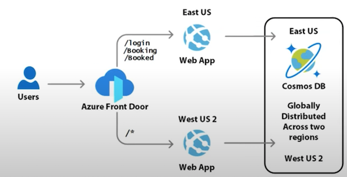

### 1-2 Azure Front Door - Core Components

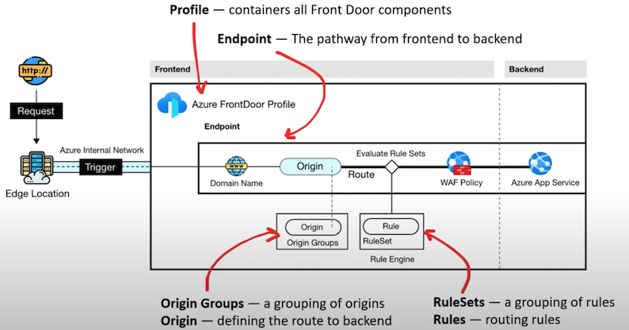

### 1-3 Azure Front Door - Tiers

Azure offers two tiers for Azure Front Door

#### **Standard (Delivery Optimized)**

* Content delivery optimized
* Offering both static and dynamic content acceleration
* Global load balancing
* SSL offload
* Domain and certificate management
* Enhanced traffic analvtics
* Basic security capabilities

#### **Premium (Security Optimized)**

* Everything in Standard
* Extensive security capabilities across WAF
* BOT protection
* Private Link support
* Integration with Microsoft Threat Intelligence and security analytics.

### 1-4 Azure Front Door Routing

Routing it the path an HTTP request from the user will take to reach a Backend service configured in Azure Front Door

There are four **traffic routing methods available:**


1.**Latency**
 
requests are sent to the lowest latency backends acceptable within a sensitivity range

**2. Priority**

requests are sent based on a user-defined number

**3. Weighted**
requests are distributed to backends according to the weight coefficients

**4. Session Affinity**

requests from the same end user get sent to the same backend (for stateful backends)


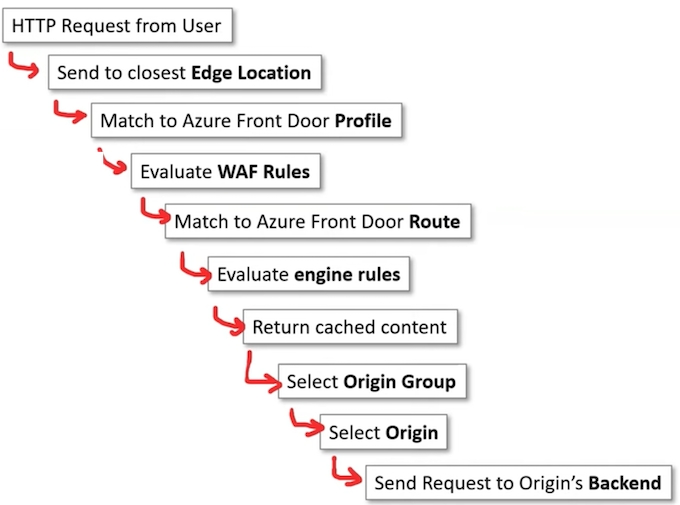

### 1-5 Azure Front Door - Origin

The origin is what Azure Front Door **will point at** (serve up) to the end user 

Origin **is the endpoint that points to your backend**

Supported Origins for Azure Front Door


* Azure Blob Storage
* Azure Storage (static website hosting)
* Cloud service
* App services
* Static Web App
* **API Management (APIM)**
* Application Gateway
* Public IP Address
* Azure Traffic Manager
* Azure Spring Cloud
* Azure Container Instances (ACI)
* Custom (provide a host name)

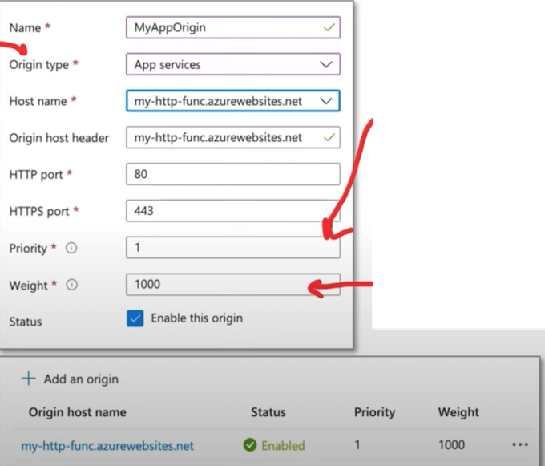


**Priority** determines who to send traffic to first.

* A number between 1-5,
* **lower number is higher priority.**
* **Backends can have the same priority number**


**Weights** allow you to determine the split of traffic distribution between origins of the same priority.

* A number between 1-1000
* The default value is 50


**Origin groups** are collection of origins.


* Origins must belong to an Origin group.
* Azure FrontDoor Profile have by default an origin group called default-origin-group

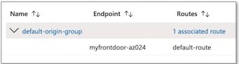


Origins Groups allow you to apply:

* Health Probes - the health of vour origins
* Load Balancing Settings - the balancing of your origins

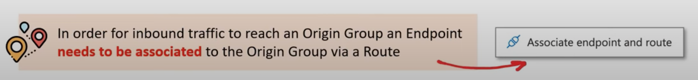

### 1-6 Azure Front Door - Health Checks

Origin Group **Health Probes** allow you to **ping a backend to determine if a healthy response is returned**.

**A healthy response is determined by Status 200 (OK).**

If a backend fails to produce a healthy response, Azure Front Door will redirect the traffic to other available and healthy backends (assuming other origins are configured).

**What is a HTTP Response Code?**

When a user sends an HTTP request, a HTTP response is return.

An HTTP responses will have a response code to communicate how a backend/server interpreted the request.

A Response Code is number that coordinates to what happened:

* 200 - OK
* 403 - Forbidden
* 404 - Not Found
* 500 - Internal Server Error


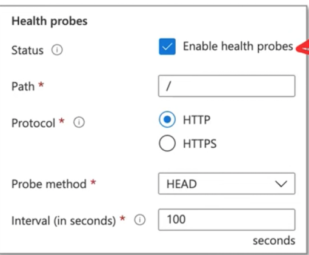

### 1-7 Azure Front Door. - Load Balancing Settings

Origin Group **Load Balancing Settings**


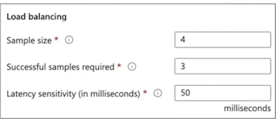

Allows you to define what sample set is needed to be used to call the backend as healthy or unhealthy.

> When the latency sensitivity is set to zero (0), Azure Front Door prioritizes and routes traffic to the quickest available backend. If it's set to any other value, the system adopts a round-robin approach, distributing traffic between the fastest backend and subsequent ones, all within the bounds of the pre-configured latency sensitivity.

### 1-8 Azure Front Door Routes

Routes in Azure Front Door serve as mapping tools, **linking your domains and
corresponding URL path patterns** to **specific origin groups**.

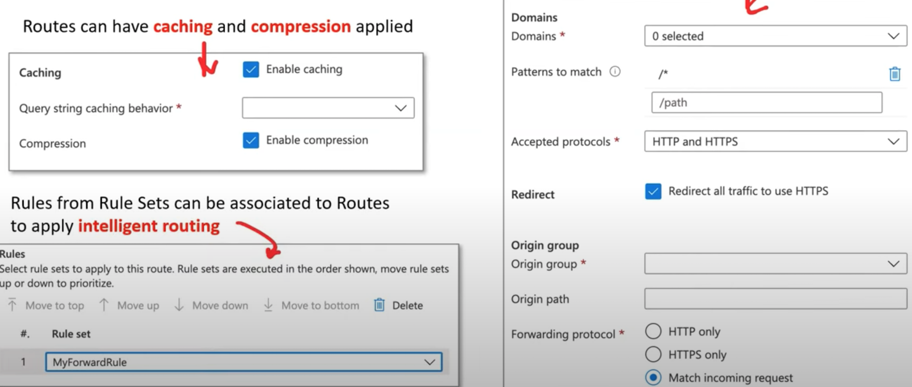

### 1-9 Azure Front Door - Traffic acceleration

Azure Front Door is capable of **traffic acceleration**.

Without requiring to make any modifications to your application code,

**Azure Front Door can speed up global delivery of your application**


Azure achieves this traffic acceleration by directing traffic to the nearest edge location to **onramp** into the Azure Network.

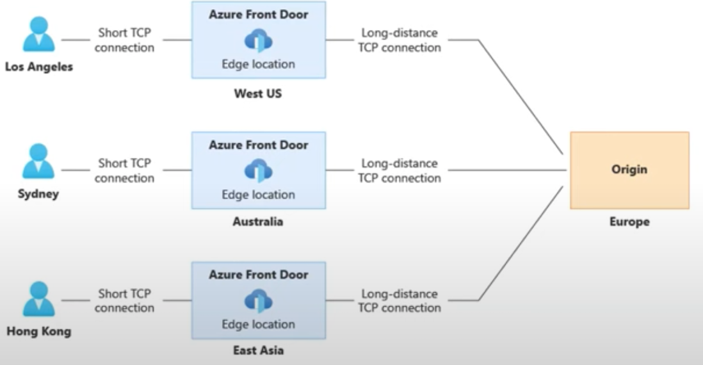


Traffic that is following within the internal Azure Network travels
at accelerated speed while also taking the most direct path.

> Think of it as an expressway

### 1-10 Azure Front Door - Rule Sets

**Azure Front Door Rules Engine allows you to customize how HTTP requests gets handled** at the edge and provides a more controlled behavior to your web application

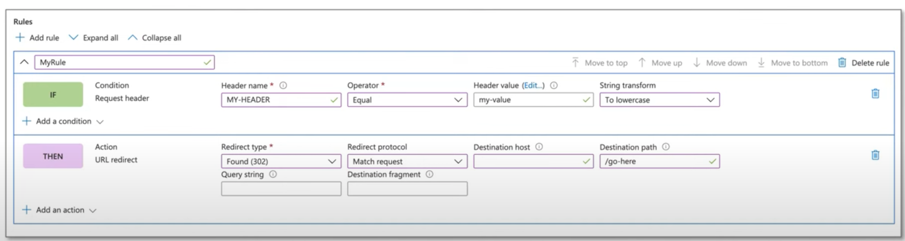

#### **Azure Front Door - Rule Sets**

**Conditions:**


* Device Type
* HTTP Version
* Request Cookies
* Post args
* Query string
* Remote address
* Request body
* Request file name
* Request file extension
* Request header
* Request method
* Request path
* Request protocol
* Request URL

**Operators:**

* Equal
* Contains
* Less Than
* Greater Than
* Less Than or Equal
* Greater Than or Equal
* Begins With
* Ends With
* RegEx
* (all previous operators have a NOT variant)

**Action:**

* **Cache expiration**
	* **Cache Behaviour**: Bypass, Override, Set if Missing

* **Cache key query string**
	* Behaviour: Include, Cache every unique URL, Exclude, Ignore query string

* **Modify request header / Modify response header**
	* Operator: Append, Overwrite, Delete

* **URL redirect**
	* Redirect type: Found (302), Moved (301), Temporary redirect (307), Permanent redirect (308)
	* Redirect protocol: Match request, HTTP, HTTPS

* **URL rewrite**
	* Source pattern
	* Destination
	
**Origin group override**

## 2 Azure CDN

**Azure Content Delivery Network** is an Azure service that provides your applications with **a distributed network of servers.**

> With Azure CDN, you can improve your application's **load time, save bandwidth
with caching strategies**, and speed up responsiveness with compressed files.

Azure CDNs centralizes requests from your origin into a single location, making it easier to manage your inbound and outbound traffic with features such as:

* **Caching Strategies**, <mark>which define which requests should be **cached** and when they should expire.</mark>
* **Compressed files**, reducing the size of static files in order to save **bandwidth** when requested.
* **Geo-Filtering**, blocking or allowing **requests** from specific countries.
* **Global distribution**, Azure Regions are distributed **globally**
* **Integration**, Azure CDNs have complete integration with your Azure services.
* **High-level security** at no additional **cost**.
* **Scalability with load-balancing** makes **scaling** your applications much easier.

**Azure CDN** can help you reduce load times, save bandwidth, and improve responsiveness.

Azure CDN is ideal when you're **developing or managing:**

* websites or mobile apps
* encoding and distributing streaming media
* gaming software
* firmware updates
* IoT endpoints.


**Azure CDN is used to cache static content** such as images, CSS, or HTML

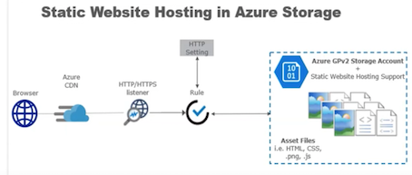


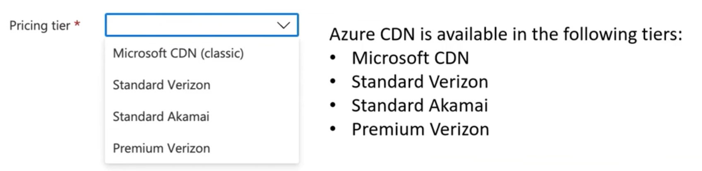


**Akamai is one of the world's largest CDN provider with a large distributed network of servers around the world**.

**Verizon Media operates a global CDN platform with a focus on media streaming, delivery and security.**

> The CDN features greatly vary based on the chosen option, and it requires exploring a large feature table comparison

### 2-1 Azure CDN  - Purge

The purge feature enables the **removal of cached content** from all edge **Points of Presence (POPs)**, ensuring that the latest assets are fetched directly from the origin when requested.

You can use wildcards represented by an asterisk to select all files to be purged within a directory:

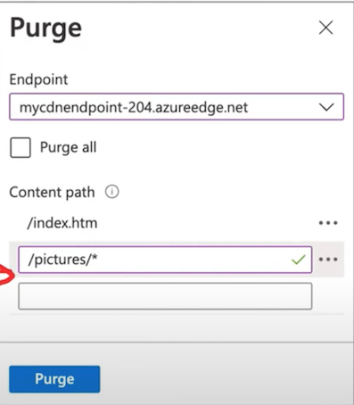


> Purge all and Wildcard purge are not supported by Azure CDN from Akamai

## 3 Azure Service Bus

**Service Bus** is a fully managed enterprise message broker that allows you to
**publish/subscribe to topics and queue messages**.

It can scale your applications with asynchronous messages and built-in integration with Azure Services

Azure Service Bus allows for **single or batch messaging**, **message load balancing**, **topic subscriptions**, **message sessions**, and transactions, ensuring compliance with industry standards. 

This includes protocols such as **AMQP 1.0, with JMS 2.0 available for Premium SKU and JMS 1.1 for Standard SKU.**

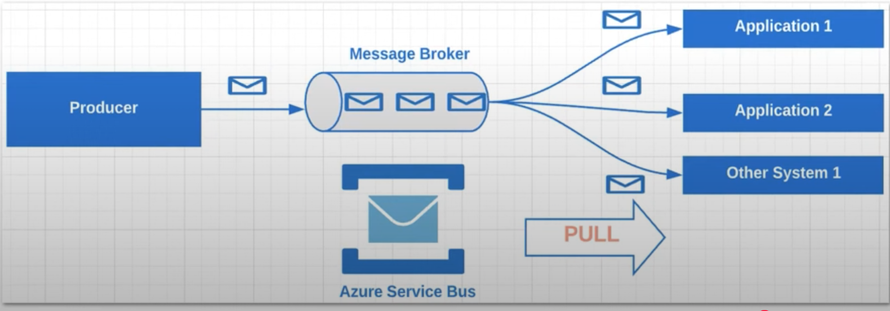


### 3-1 Azure Service Bus - Key Concepts

Service Bus Key Concepts

* The **namespace** works like a server, with N queues and topics.
* **Oueue** contains the messages.
* **Sender** is who sends the message.
* **Receiver** is who receives the message
* **Topic** is a queue with multiple receivers that works like a queue.
* **Subscription** is a receiver in a topic
* A Batch is a group of messages
* **Safe-batch** validates if each message can be included the batch.
* **Session** allows you to use FIFO and group your messages in a queue.
* **Peek** returns a message to the queue without removing it.
* **Dead-letter queue**: a queue for messages that were unable to be delivered through the normal queue.
* **Peek & Lock** retrieves a message from the queue without removing it and locks it so other receivers cannot receive it.
* **Receive & Delete** retrieves and delete a message from the queue.
* **Auto delete on idle** sets a time span to delete the queue if it is not used
* **Duplicate detection history checks** if the message was not sent earlier before sending a message it

### 3-2 Azure Service Bus - Namespace

<mark>**An Azure Service Bus namespace serves as a container**</mark> for all messaging components, including both **queues and topics**.

* **Container for Messaging Components**: One namespace can house **multiple** queues and topics, making them versatile structures within the Azure Service Bus. They're commonly used as **application containers**.
* **Capacity Slice**: Think of a Service Bus namespace as a segment of a large-scale cluster.
	* This cluster comprises numerous all-active virtual machines that fall under your control.
* **Azure Availability Zones:** A namespace can potentially span up to three Azure availability zones, offering enhanced availability and resilience.
* **Benefits at Scale**: Using Azure Service Bus means you're using a messaging system built for large-scale operations, offering high reliability and strength.
* **Serverless Messaging**: With Azure Service Bus, it is **serverless** messaging. This means you get to use the messaging service without getting bogged down by the intricacies of the underlying infrastructure.

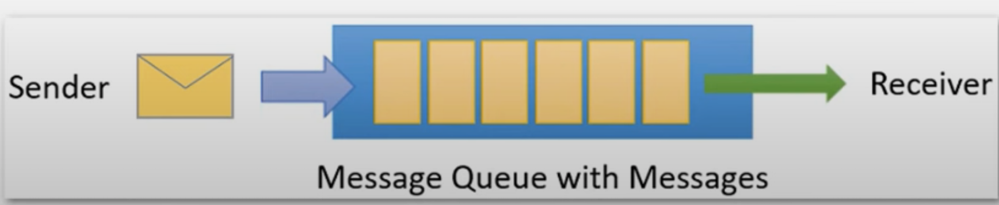

### 3-3 Azure Service Bus - Queues

**Queues** are used to send and receive messages.

Messages are stored in queues until the receiving application is ready to accept and process them.

**Messages** in queues are ordered and timestamped on arrival.

Once accepted by the broker, the message is always held durably in **triple-redundant** storage, spread across availability zones if the namespace is zone-enabled.

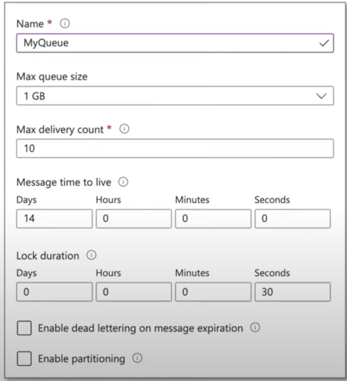


**Time to Live (TTL)**

How long a message stays in the queue before it is removed from the queue or moved to the dead letter queue

**Lock Duration**

**How long a message remains locked. Locking avoids more than one user from reading and processing the same message.**

You can define rules on a subscription.

A subscription rule has a **filter** that specifies a **condition** for a message to be copied into the subscription, as well as an optional action that modifies message **metadata**.

### 3-4 Azure Service Bus - Subscription

A subscription in Azure Service Bus is a named entity associated with a topic that allows subscribers to receive copies of messages sent to that topic.

In a publish/subscribe model of Azure Service Bus, **topics can be thought of as the channels to send messages, subscriptions are like the virtual queues to receive those messages**


* Max delivery count can be between 1-2000
* **Message Sessions**
	* With sessions enabled a subscription can guarantee first-in-first-out (FIFO)
delivery of messages

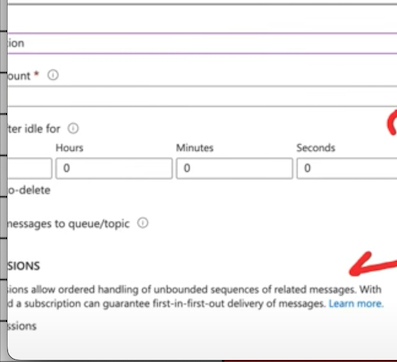

### 3-5 Azure Service Bus - Pricing

Azure Service Bus has three different pricing tiers Basic, Standard and Premium.

**More expensive tiers provide more functionality.**

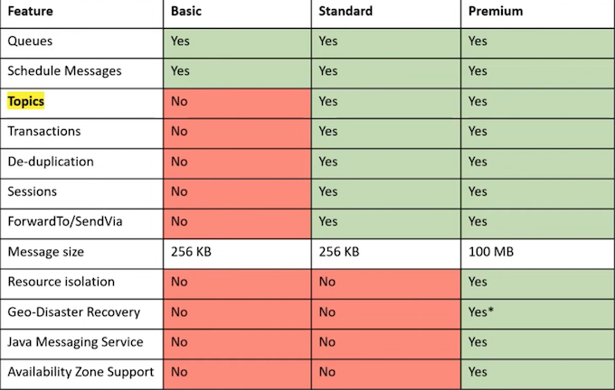

### 3-6 Dead Letter Queue

**The Dead Letter Queue (DLQ)** in Azure Service Bus is a specialized queue that **stores messages that couldn't be delivered or processed** successfully.

These messages might fail due to various reasons:

* Message that is sent to a queue that **does not exist.**
* The queue has reached its length limit.
* The message exceeds the allowable size limit.
* The message is declined by another queue or exchange.
* The message isn't consumed after reaching a certain read threshold, often referred to as the "**back out queue**."
* The message's **Time to Live (TTL) expires.**
* Message is not processed successfully

Dead Letter Queues provide several **benefits**, including:.

* **Monitoring** failed message deliveries to understand and address the underlying issues.
* **Requeuing messages** for another attempt at processing, especially after resolving the reason for the initial failure.
* Initiating **follow-up actions, such as alerting, remediation**, or alternative processing paths when specific failure patterns are detected.

### 3-7 Azure Service Bus - Command CLI

Azure CLI has the following

subcommands for Azure Service Bus

* a servicebus georecovery-alias
* a servicebus migration
* az servicebus namespace
* a servicebus queue
* az servicebus topic

Azure Service Bus does not have CLI commands to send messages to the queue or topics (unlike Azure Storage Queue)

```
pm install @azure/service-bus
```


```text
# create resource group
az group create --name ContosoRG --location eastus

# create servicebus namespace
az servicebus namespace create \
--resource-group ContosoRG \
--name ContosoSBusNS \
--location eastus

# create servicebus queue
az servicebus queue create \
--resource-group ContosoRG \
--namespace-name ContosoSBusNS \
--name ContosoOrdersQueue

# create servicebus authorization rule
az servicebus namespace authorization-rule keys list \
--resource-group ContosoRG \
--namespace-name ContosoSBusNS \
--name RootManageSharedAccessKey \
--query primaryConnectionString \
--output tsv

```

## 4 Azure Event Grid

<mark>**Azure Event Grid** is a service that allows you to **manage event routing** from any source to any destination.</mark>

Event Grid provides a simple and strong customizable event delivery process that allows you to manage at a **minimum level which types** of events will be received as well as which subscribers will receive those events.

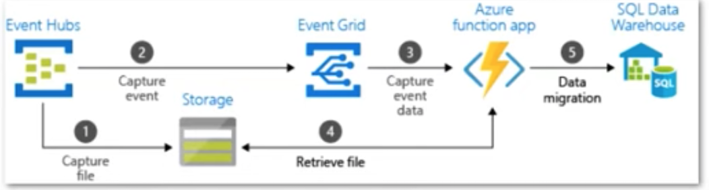

* **It supports event fan-out with 24-hour retry reliability to ensure that events are delivered.**
* It is a **low-cost** serverless product that supports dynamic scalability.

Event Grid is ideal for event-driven architectures, where you can subscribe to Azure resource events and publish them to an event handler or webhook.
 
**You can also use Custom Topics to create custom events that will be published in vour Event Grid.**

### 4-1 Azure Event Grid - Event Sources and Handlers

**Azure Event Grid** is divided into two categories: **Event Sources and Event Handlers.**

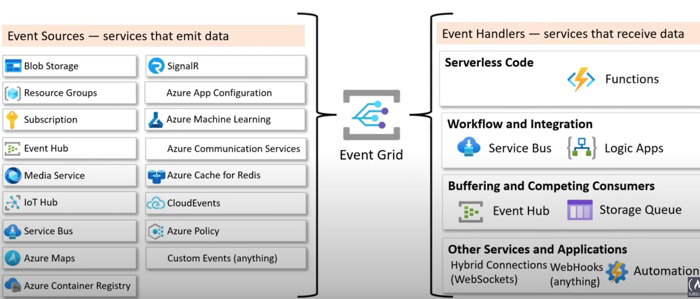

### 4-2 Azure Event Grid - Key Concepts

* **Events** are the event that occurred in the service.
* **Publishers** is the service that published the event.
* **Event Sources** are where the event took place.
* **Event Subscriptions** are the mechanism the routes the events.
* **Event Subscriptions Expiration** is where you set an expiration for event subscriptions
* **Event Handlers** is the **app or service that receives the events**
* **Event Delivery** is the delivery of events in batches or as single events
* **Batching** is the sending of a group of events in a single request.

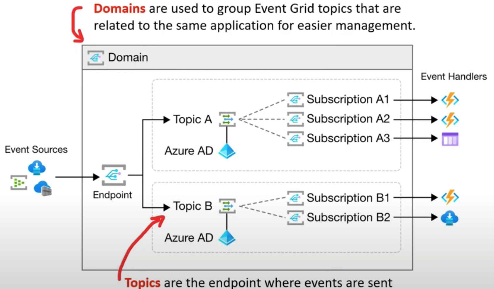


* **System Topics** are built-in topics provided by Azure Services.
* **Custom Topics** are applications and third-party topics.
* **Partner Events** provide a way for third parties SaaS to publish events.

## 5 Azure Event Hub

**Azure Event Hub** is an event **ingestor** that can consume millions of events from anywhere and process them in **real-time or micro-batching**. 

Its potent **auto-inflate** feature automatically **scales** throughput units (TUs) to accommodate varying demands, ensuring seamless processing even during traffic spikes.

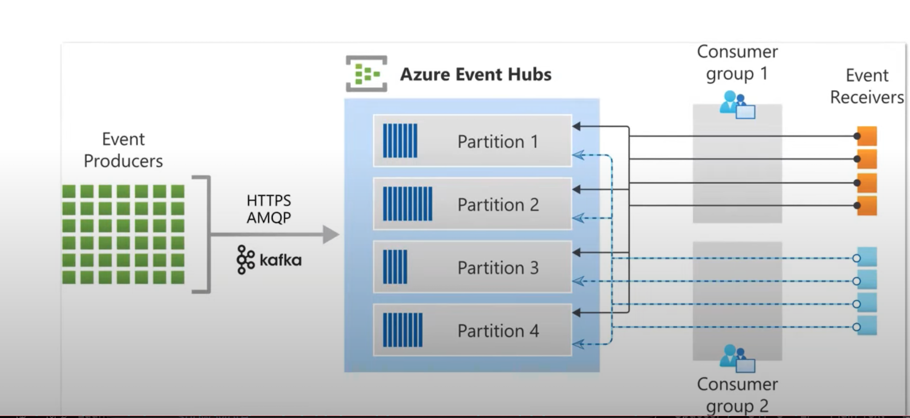

### 5-1 Azure Event Hub  - Key Concepts

**Azure Event Hub** helps you build your **big data pipeline** to analyze logging, anomalies, user, and device telemetry where you only pay for what you use.

**Azure Event Hub Key Concepts**

* **Namespace** is an endpoint for receiving and distributing events to event hubs.
* **Event Hub** is where your events will be delivered
* **Event Hub Cluster** is a dedicated Event Hub with a 99 99% SLA
* **Event Hub Capture** allows you to automatically **capture and save streaming events.**
* **Events Hubs for Apache Kafka**, Event Hub endpoints are **compatible with Apache Kafka.**
* **Event Publishers** are applications or services that publish events to an Event Hub
* **Publisher Policy** is a unique ID used to **identify** publishers.
* **Partitions** are used to organize the **sequence** of events in an Event Hub.
* **Event Consumers** are applications or services that read events from an Event Hub.
* **Consumer Group** enable consuming applications to each have a separate view of the event stream
* **Stream Offset** holds the position of an event inside a partition.
* **Checkpointing** is the process of distinguishing between **read and unread events**.

### 5-2 Azure Event Hub  - scaling

**Auto-Inflate:**

* Automatically scale up to the maximum
* TUs based on traffic demand
* Not available for basic pricing tier

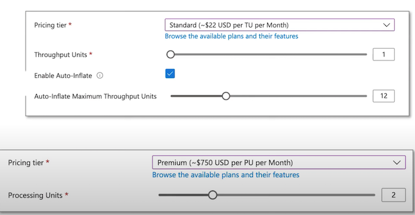

### 5-3 Azure Event Hub - Producer

A producer (aka publisher) emits data to the stream.

Publishers can publish events using the follow protocols:

* **HTTPS**: Most Azure SDKs prefer HTTPs.
* **AMQP1.0**: Advanced Message Queuing Protocol.
* **Kafka Protocol**: Compatible with the Apache Kafka ecosystem

Generally, you'll be using the **Azure SDK** to publish events.

You can publish event either:

* **One-at-a-time**
* **Batches**

> There is a limit of 1 MB, regardless of whether it's a single event or a batch, beyond 1MB events will be rejected

For authorization, publishers use either:

* Azure AD with OAuth2-issued JWT tokens
* Shared Access Signature (SAS)

```
const { EventHubProducerClient } = require("@azure/event-hubs");  

const connectionString = "EVENT HUBS NAMESPACE CONNECTION STRING";  
const eventHubName = "EVENT HUB NAME";  

async function main() {  
// Create a producer client to send messages to the event hub.  
	const producer = new EventHubProducerClient(  
	connectionString,  
	eventHubName  
);  

// Prepare a batch of three events.  
const batch = await producer.createBatch();  
batch.tryAdd({ body: "First event" });  
batch.tryAdd({ body: "Second event" });  
batch.tryAdd({ body: "Third event" });  

	// Send the batch to the event hub.  
	await producer.sendBatch(batch);  
	
	// Close the producer client.  
	await producer.close(); 
}  
	
	main().catch((err) => {  
		console.log("Error occurred: ", err);  
});
```


The Azure Event Hub Consumer, also commonly referred to as a **reader, is responsible for receiving and processing data from the stream.**


**Connection Protocol**: All Event Hubs consumers connect using the AMQP 1.0 protocol. As events become available, they are delivered through this session.

This eliminates the need for the client to continuously check or "poll" for the availability of new data.

```
const { EventHubConsumerClient, earliestEventPosition } = require("@azure/event-hubs");  
const { ContainerClient } = require("@azure/storage-blob");  
const { BlobCheckpointStore } = require("@azure/eventhubs-checkpointstore-blob");  
async function main() {  
// Create a blob container client and a blob checkpoint store using the client.  
const containerClient = new ContainerClient(storageConnectionString, containerName);  
const checkpointStore = new BlobCheckpointStore(containerClient);  

// Create a consumer client for the event hub by specifying the checkpoint store.  
const consumerClient = new EventHubConsumerClient(  
consumerGroup,  
connectionString,  
eventHubName,  
checkpointStore);  

// Subscribe to the events, and specify handlers for processing the events and errors.  
const subscription = consumerClient.subscribe({  
processEvents: async (events, context) => {  
if (events.length === 0) {  
console.log('No events received within wait time. Waiting for next interval');  
return;  
}  
for (const event of events) {  
console.log('Received event: `${event.body}`');  
}  

// Update the checkpoint.  
await context.updateCheckpoint(events[events.length - 1]);  
},  
processError: async (err, context) => {  
console.log(`Error: ${err}`);  
},  
},  
{ startPosition: earliestEventPosition }  
);
```

### 5-2 Azure Event Hub - consumer group

A **consumer group** is a view (state, position, or offset) of an entire event hub

Consumer groups enable **multiple consuming applications** to each have a separate view of the event stream, and to read the stream independently at their own pace and with their own offsets.

> In a stream processing architecture, each downstream application equates to a consumer group.

There's always a default consumer group in an event hub, and you can create up to the maximum number of consumer groups for the corresponding pricing tier.

There can be at most 5 concurrent readers on a partition per consumer group; however, **it's recommended that there's only one active receiver on a partition per consumer group**.

Some clients offered by the Azure SDKs are intelligent consumer agents that automatically manage the details of ensuring that each partition has a single reader and that all partitions for an event hub are being read from. This allows your code to focus on processing the events being read from the event hub so it can ignore many of the details of the partitions.

### 5-3 Azure Event Hub - Offsets

<mark>An **offset** is the position of an event within a partition.</mark>

<mark>Offsets enables a Consumer (reader) to specify a **point** in the event stream from which they want to **begin reading events**.</mark>

* You can specify the offset as a **timestamp or as an offset value**.
* Consumers are responsible for storing their own offset values outside of the Event Hubs service
* **Every event** situated within a partition comes equipped with an offset.

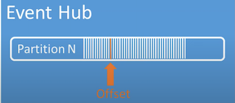


### 5-4 Azure Event Hub - Checkpointing

**Checkpointing** is a process by which readers **mark or commit their position within a partition event sequence**

Checkpointing is the responsibility of the **consumer** and occurs on a **per-partition** basis within a consumer group

**The consumer is fully responsible for checkpointing.**


This means that for each consumer group, every individual partition reader must:

* **Monitor** its ongoing position within the event stream.
* **Notify the Event Hubs service** once it recognizes the data stream to be complete or processed.

### 5-5 Azure Event Hub - Event Retention

Published events are removed from an event hub based on a configurable, timed-based retention policy

* The **default** value and **shortest** possible retention period is **1 hour**.
* For Event Hubs **Standard**, the maximum retention period is **7 days**.
* For Event Hubs **Premium and Dedicated**, the maximum retention period is **90 days**.
* If you change the retention period, it applies to all messages including messages that are already in the event hub.
* You cannot explicitly delete events

> The reason for Event Hubs' limit on data retention based on time is to prevent large volumes of historic customer
data getting trapped in a deep store that is only indexed by a timestamp and only allows for sequential access.

If you need to archive events beyond the allowed retention period, you can have them automatically stored in **Azure Storage or Azure Data Lake by turning on the Event Hubs Capture feature.**

If you need to search or analyze such deep archives, you can easily import them into **Azure Synapse** or other similar stores and analytics platforms.

## 6 Event Grid vs Event Hubs vs Service Bus

Event Grid, Event Hub and Service Bus all are event driven services for **application integration and use an event bus** as means to work with event data

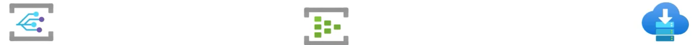


### 6-1 Azure Event Grid

**Serverless Event Bus**

**Azure service-to-service communication**

* Dynamically scalable
* Cost-efficient
* Guarantees at least once delivery of an event.

### 6-2 **Azure Event Hub**

* **<mark>Streaming data</mark>** 
* **Low latency**
* Can receive and process millions of events per second
* At least once delivery of an event

### 6-3 **Azure Service Bus**

* **Queue or Pub/Sub for web applications**
* Reliable asynchronous message delivery that requires polling
* Advanced messaging features like:

	* First-in and first-out (FIFO)
	* Batching/sessions
	* Transactions
	* Dead-lettering
	* Temporal control
	* Routing and filtering
	* Duplicate detection