# Az305 - Summary 7

## Migration solutions

### Azure Cloud Adoption Framework

Cloud Adoption Framework is a whitepaper that is **a step-by-step process** to help organizations plan and migrate their workloads to Azure

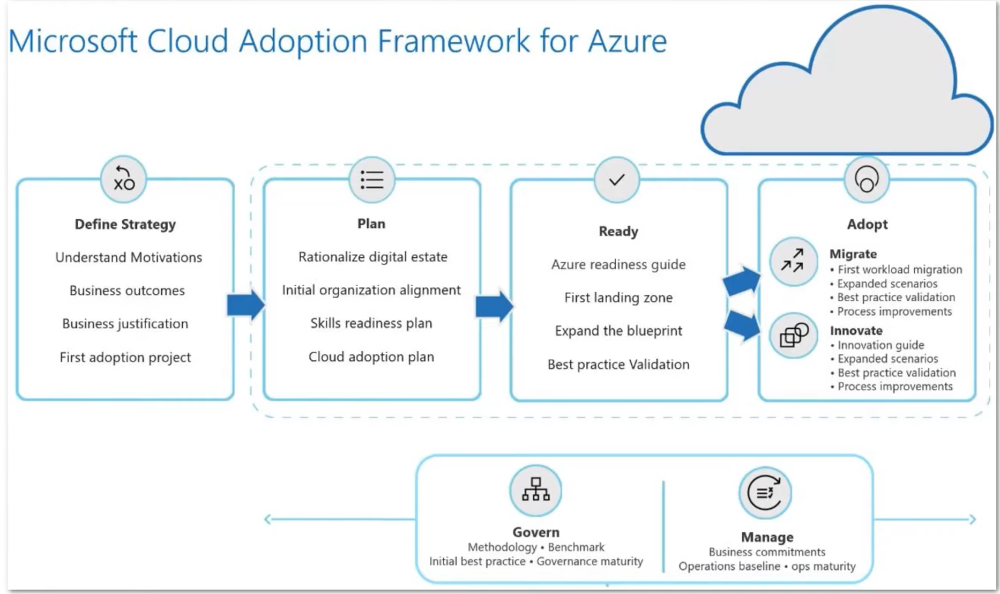

**Security Roles and Responsiblities**

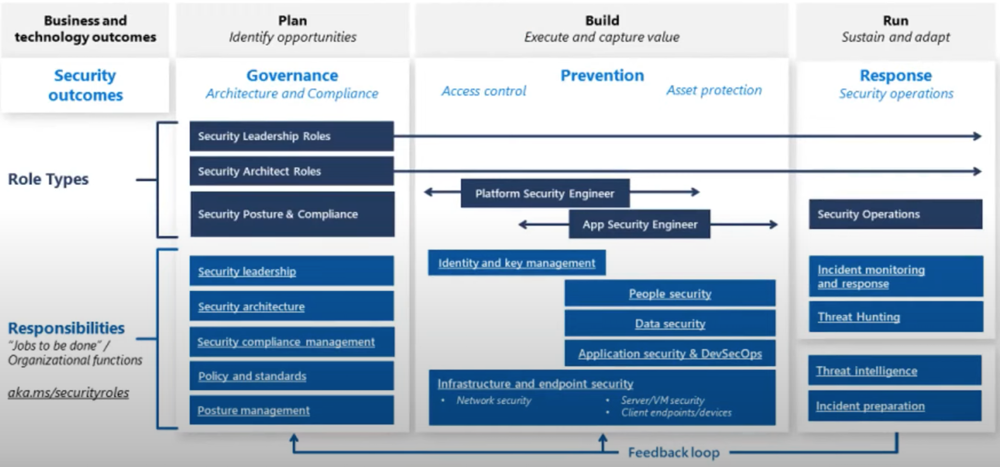

Azure Well-Architected Framework describe **best practices for building workloads on Azure categorized into 5 pillars**

* Cost Optimization
* Operational Excellence
* Performance
* Efficiency
* Reliability
* Security

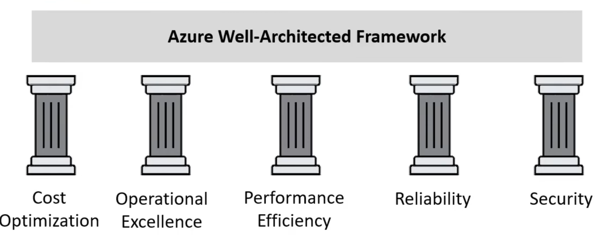

* **Cost Optimization** - Managing costs to maximize the value delivered.
* **Operational Excellence** - Operations processes that keep a system running in production.
* **Performance Efficiency** - The ability of a system to adapt to changes in load.
* **Reliability** - The ability of a system to recover from failures and continue to function.
* **Security** - Protecting applications and data from threats.

### Azure Migrate

**Azure Migrate** offers a streamlined service for **migration, modernization, and optimization on Azure**

It simplifies the pre-migration processes like discovering, assessing, and appropriately sizing on-
premises resources for infrastructure, data, and applications.

With an extensible framework, Azure Migrate easily integrates with **third-party tools**, broadening its
range of supported scenarios. Here's what it offers:

* **Unified Migration Platform**: A centralized portal to initiate, execute, and monitor your Azure migration journey.
* **Diverse Toolset**: Azure Migrate provides a suite of tools for both assessment and migration. It features tools such as **"Azure Migrate: Discovery and Assessment" and "Migration and Modernization."** It seamlessly integrates with other Azure services, tools, and third-party offerings from **independent software vendors (ISVs).**

**Comprehensive Migration and Modernization Capabilities**: In the Azure Migrate hub, you can **assess, migrate, and modernize:**

**Servers, Databases, and Web Apps**: Assess and migrate on-premises servers, web apps, and SQL Server instances to Azure.

* **Databases**: Analyze on-premises SQL Server instances and databases, and migrate them to **Azure SQL on a VM, Azure SQL Managed Instance, or Azure SQL Database.**
* **Web Applications**: Evaluate on-premises web applications and transition them to the Azure
* App Service or Azure Kubernetes Service.
* **Virtual Desktops**: Review your on-site **virtual desktop infrastructure (VDI)** and move it to Azure Virtual Desktop.
* **Data Transfer**: Efficiently and affordably transfer vast data volumes to Azure using **Azure Data Box products.**

### Azure Migrate - Integrated tools

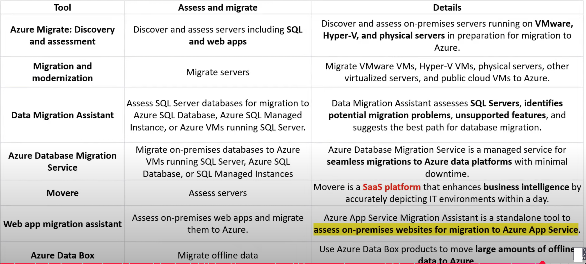

###  Azure Database Migration Service (DMS)

Azure Database Migration Service (DMS) is a fully managed service that **enables seamless migrations from various database sources to Azure data platforms** with minimal downtime.

It simplifies the process of moving databases to the cloud and reduces the risks associated with migration.

The service supports various source database engines, such as **SQL Server, MySQL, Oracle, and PostgreSQL**, and targets Azure database platforms, such as **Azure SQL Database, Azure SQL Managed Instance, and Azure Database for PostgreSQL and MySQL.**

Azure Database Migration Service currently offers two versions:

1. **Database Migration Service** - via Azure SQL migration extension for Azure Data
Studio, Azure portal, PowerShell and Azure CLI.
2. **Database Migration Service (classic)** - via Azure portal, PowerShell and Azure CLI.

**Use cases:**

* Migrations of on-premises databases to Azure SQL services.
* Database consolidation and migration to a single platform in Azure.
* Cloud bursting and disaster recovery solutions.

**Features:**

* Support for a wide range of source and target database platforms.
* Automated schema and data migration with minimal downtime.
* Migration assessment to identify potential issues and guidance for a successful migration.
* Real-time migration monitoring and error notifications.
* Pre- and post-migration validation and cleanup tools.
* Integration with Azure services such as Azure Security Center and Azure Monitor for enhanced
* security and monitoring capabilities.

### Azure Database Migration Service (DMS)

How it works:

1. **Set up the migration project**: Create a new migration project in Azure DMS, define the **source and target environments**, and specify the **database objects** to migrate.
2. **Configure the source and target**: Configure the **network connectivity and security settings** for the source and target environments, and install the **Azure DMS extension** on the source database server.
3. **Start the migration**: Start the migration and monitor the progress in the **Azure DMS portal**. The service automatically replicates the source database to the target environment, and tracks the changes that occur during the migration.
4. **Perform cutover and post-migration tasks**: After replication, initiate the cutover to transition the application to the target environment. Azure MS offers validation and cleanup tools post-migration.

### Storage Migration Service

The Storage Migration Service simplifies the process of **migrating storage to Windows Server or Azure.**

It comes with a user-friendly graphical tool that takes stock of data on **Windows, Linux, and NetApp CIFS servers** and facilitates its transfer to newer servers or **Azure virtual machines**.

The service also enables the migration of a **server's identity** to the destination server, ensuring that applications and users can access their data **without any changes to links or paths.**

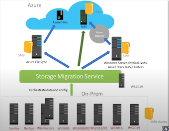

### Storage Migration Service

Why use Storage Migration Service

Use Storage Migration Service because you've got a **server or multiple servers** that you want to migrate to **newer hardware or virtual machines**

Storage Migration Service is designed to help by doing the following tasks:

* Inventory multiple servers and their data
* Rapidly transfer files, file shares, and security configuration from the source servers
* Optionally take over the identity of the source servers (also known as **cutting over**) so that users and apps don't have to change anything to access existing data

**Migration is a three-step process:**

1. **Inventory servers** to gather info about their files and configuration, shown in the following figure.
2. **Transfer (copy) data** from the source servers to the destination servers.
3. **Cut over to the new servers (optional)**. The destination servers assume the source servers' former identities so that apps and users don't have to change anything.

Although the source servers retain their files, they enter a maintenance mode and become inaccessible. At a suitable time, these servers can be decommissioned.

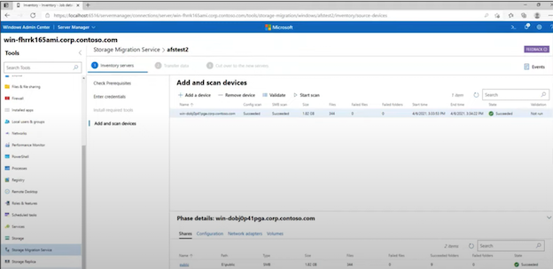

## Azure Databox

The Microsoft Azure Data Box cloud solution lets you send **terabytes of data into and out of Azure** in a quick, inexpensive, and reliable way.

It is designed to help customers with slow or limited internet connectivity to move large volumes of data to the cloud.

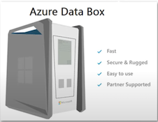

**Use cases**

Data Box is used to **import** data to Azure for:

* **One-time migrations**: Moving large on-premises data, transitioning offline tapes, relocating VMs, SQL servers, applications, and transferring historical data for Azure-based analysis.
* **Initial bulk transfers**: Large-scale transfers using Data Box, followed by incremental network transfers. For example, moving vast backups with partners like Commvault.
* **Periodic uploads**: Transferring large volumes of data generated periodically, like video content from oil rigs or windmill farms.

For **exporting** from Azure, Data Box is used for:

* **Disaster recovery**: Restoring Azure data on-premises quickly.
* **Security requirements**: Meeting mandates that require data extraction from Azure storage
* tiers like US Secret.
* **Migration**: Moving data back to on-premises or to a different cloud provider.

**Here's how Azure Data Box works:**

1. Customers order a **Data Box from the Azure portal.**
2. When the Data Box arrives, customers connect it to their network and configure it using the Azure portal.
4. Customers copy data to the Data Box using standard file transfer protocols, such as **SMB or NFS**.
5. Once the data transfer is complete, customers ship **the Data Box back to Azure.**
6. Azure copies the data from the **Data Box to the customer's Azure storage account**.

## Azure Virtual Network (VNet)

**Virtual Network (Net)** is a logically isolated section of the Azure Network where you launch your Azure resources.

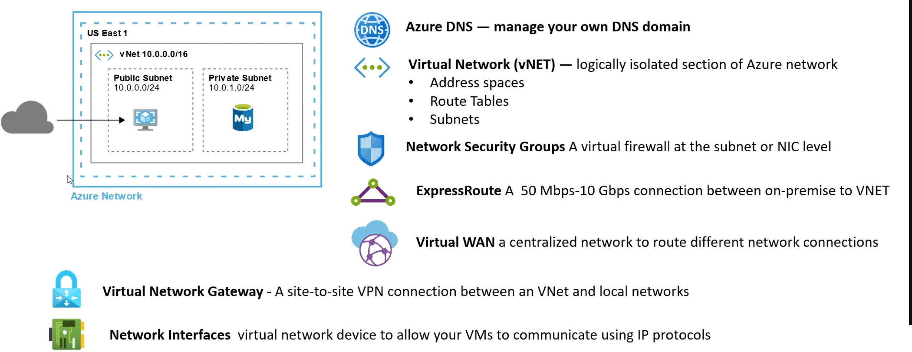

### Private Links

**Azure Private Links allows you to establish secure connections** between Azure resources so traffic **remains within the Azure Network**

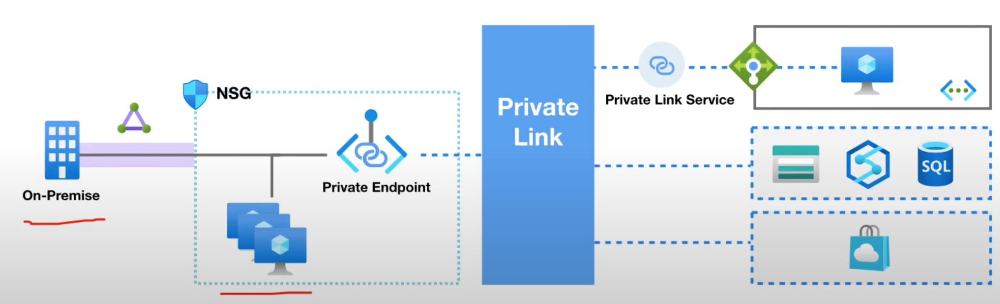

**Private Link Endpoint** is an **Network Interface** that connects you privately and securely to a service powered by Azure Private Link. Private Endpoint uses a private IP address from your VNet

**Many Azure services by default work with Private Link eg. Azure Storage, CosmoDB, SQL**

Third-Party provides can be powered by Private Link

### VNET - Subnets

A subnet is **a logical division of an address space**. Subnets help you **define different kinds of workloads** and
allows you to apply virtual isolation within your network. When you launch an Azure resource you choose the
subnet you want to launch within and an IP from that subnet is assigned to your resource

**Associating a Route Table**

A subnet needs a Route Table so it can access

**Public vs Private Subnet**

Public and Private subnet describes whether a subnet is reachable from the internet or not.

**Azure has no concept of private and public subnets** and its up to you to configure our subnets to have ensure they do no reach the internet by ensuring they have no route via the their route table to the Internet Gateway

**Associating Network Security Gateways (NSG)**

You can associate an NSG to protect traffic entering and leaving your subnet by applying security rules that can
Allow or deny access based on IP address, port and protocol.

**Gateway Subnet**

Azure has a special type of Gateway Subnet that is used by **Azure Virtual Network Gateway** and that service
Launches specialized VMs into that subnet.

### Virtual Network Gateway?

**What is a (Virtual Private Network) VPN?**

A VPN **extends a private network across a public network** and enables users **to send and receive data across
shared or public networks** as if their computing devices were directly connected to the private network.

**What is a Virtual Network Gateway?**

* A **virtual network gateway** is the software VPN device for your Azure virtual network.
* When you deploy a virtual network gateway it will deploy two or specialized VMs in specific subnet you need to create called a "gateway subnet"
* These deployed VMs contain routing tables and run specific gateway services.
* You will choose a Gateway Type and that will determine if it's a **VPN Gateway** or an ExpressRoute Gateway

### VPN Gateway Designs

When you create a VPN Gateway you are generally designing for one of the following topologies:

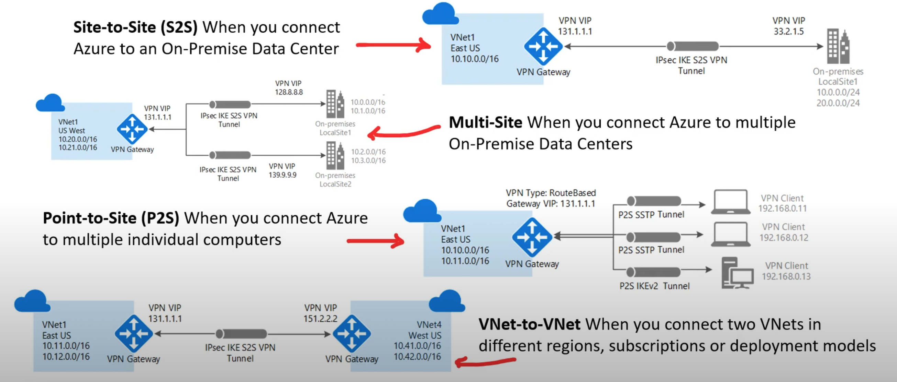

* **Site-to-Site (S2S)** When you connect Azure to an On-Premise Data Center
* **Multi-Site** When you connect Azure to multiple On-Premise Data Centers
* **Point-to-Site (P2S)** When you connect Azure to multiple individual computers
* **VNet-to-VNet** When you connect two Vets in different regions, subscriptions or deployment models

### Azure ExpressRoute

**Azure ExpressRoutes** creates private connections between Azure datacenters and infrastructure on our premises or in a colocation environment

Connectivitv can be from an:

* any-to-any (IP VPN) network
* a point-to-point Ethernet network
* virtual cross-connection

ExpressRoute connections don't go over the public Internet
and as a result can offer: **more reliability, faster speeds,
consistent latencies, higher security**

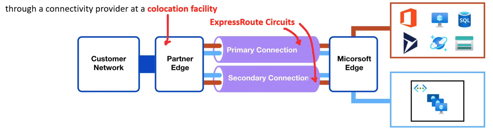

* Microsoft Peering for Office 365, Dynamics 365, Azure Public Services (Public IP)
* Azure Private Peering for VNets

**ExpressRoute Direct allows for greater bandwidth connections** from 50 Mbps to 10Gbps.

Ideal where for hybrid solutions with massive amounts of data or where latency matter

### Azure Firewall

**Azure Firewall** is a managed, **cloud-based network security service that protects your Azure Vets resources**

It is a fully stateful Firewall as a Service (FWaaS) with:

* built-in high availability
* unrestricted cloud scalability

You can centrally **create, enforce, and log** application and network built-in high availability connectivity policies across subscriptions and virtual networks

Azure Firewall uses a static public IP address for your Vet resources allowing outside firewalls to identify traffic
originating from your virtual network. The service is fully integrated with Azure Monitor for logging and analytics

* You launch an Azure Firewall in its on VNetOther Nets pass through this Central Vnet
* You get **Microsoft Threat Intelligence** 
	* Blocks know malicious IPs and FQDNs

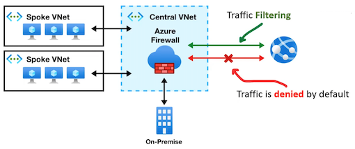

### Network Security Groups (NSG)

**Network security group (NSG) filter network traffic** to and from Azure resources in a VNet

An NSG is composed of **many Security Rules**

Each Security Rule has the following properties:

* **Name** - A unique name within the network security group.
* **Source or destination** - An IP Address or CID block, Service Tag or Application Security Group
* **Port Range** - Specify a single or range of ports. eg. 80 or 10000-10005
* **Protocol** - TCP, UDP, ICMP or ANY
* **Action** - Allor or Deny
* **Priority** - A number between 100 and 4096 (lower number higher priority)

	* **Inbound Rules** apply to traffic **entering** the NSG
	* **Outbound Rules** apply to traffic **leaving** the NSG

	
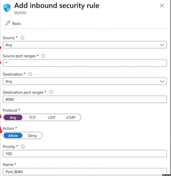

Security Rules has **a lot of logic** to determine how to apply its rules

* You may not create two security rules with the same priority and direction.
* You can have 5000 NSG per subscription, 1000 NSG rules per NSG

**Priority**

* Rules are processed in priority order, with lower numbers processed before higher number
* Network security group security rules are evaluated by priority using the 5-tuple information to allow or deny
* traffic: 1] source 2] source port 3] Destination 4] destination port 5] protocol

**Flow Records**

* The flow record allows a network security group to be stateful.
* A flow record is created for existing connections
* Communication is allowed or denied based on the connection state of the flow record.

**Statefulness**

* If you specific an outbound security port you don't need to set the inbound port since it will be set for you.
* You only need to specify an inbound security rule if communication is initiated externally.
* The opposite is also true. If inbound traffic is allowed over a port, it's not necessary to specify an outbound
* security rule to respond to traffic over the port.

**Interruption**

* Existing connections may not be interrupted when you remove a security rule that enabled the flow.
* Traffic flows are interrupted when connections are stopped and no traffic is flowing in either direction, for at least a few minutes.

## Azure DoS Protection

**What is a DDoS (Distributed Denial of Service) Attack?**

A malicious attempt to **disrupt normal traffic by flooding a website with large amounts of fake traffic.**

DoS attacks are big worries for people moving their apps to the cloud. These attacks try to use up all of an app's resources so real users can't access it. Any online point can be a target for these attacks.

**Azure DoS Protection** offers advanced features to **counteract DoS attacks** when integrated with recommended application design practices.

This service is specifically designed for Azure resources within a virtual network.

Enabling this protection on both new and established virtual networks is simple and doesn't require any changes to apps or resources.

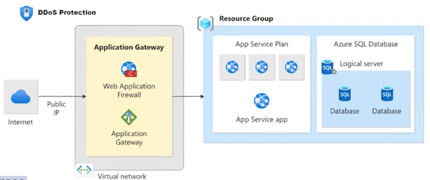

Most frequent types of DoS attacks:

**Volumetric attacks**

* Volume-based attacks that flood the network with legitimate looking traffic
* Exhausts available bandwidth
* Legitimate uses cannot access website
* Measured in Bits per second (bps)

**Protocol attacks**

* exhausting server resources with false protocol requests that exploit weaknesses
	* UDP and TCP flooding on Layer 3 and 4
* Measured in packages per second (psp)

**Application layer attacks**

* Attacks that occurs at the application layer (Layer 7)
* HTTP floods, SQL injections, cross-site scripting (XSS) , parameter tampering, Slowloris attacks
* Web Application Firewalls (WAFs) are used as means of protection

### Azure DoS Protection - Tiers

Azure offers **two tiers of DoS Protection**

* **DoS Network Protection**

Azure DoS Network Protection, combined with application design best practices, provides enhanced DoS mitigation features to defend against DoS attacks. 

It's **automatically tuned to help protect your specific Azure resources in a virtual network.**

* **DDoS IP Protection**

DoS IP Protection is a **pay-per-protected IP model**. DoS IP Protection contains the same core engineering features as DoS Network Protection, but will differ in the following value-
added services: **DoS rapid response support, cost protection, and discounts on WAF.**

## Introduction to Application Gateway

**Azure Application Gateway** is **application-level routing and load balancing service.**

> Application Gateway operates on **OSI Layer 7** also known as the Application Layer.

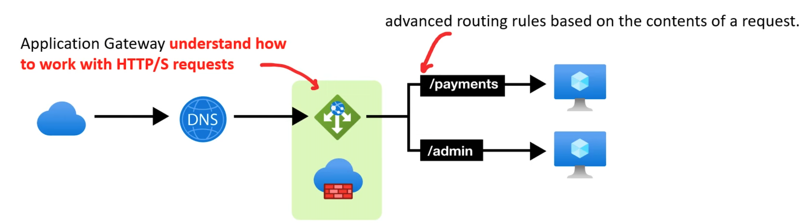

**Azure Web Application Firewall (WAF)** polices can be attached to an Application Gateway to provide additional security

* Application Gateway **understand how to work with HTTP/S requests**
* advanced routing rules based on the contents of a request.

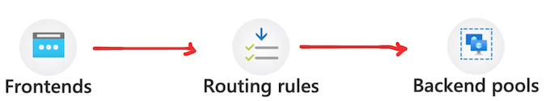

You need to configure a **Frontends**

* **Private IP** will create an Internal Load Balancer
* **Public IP** will create an Public/External Load Balancer

You need to configure a **Backends**

* You'll need to create Backend pools
	* A backend pool is a collection of resources to which
	* your application gateway can send traffic.
	* A backend pool can contain
		* virtual machines
		* virtual machines scale sets
		* IP addresses
		* domain names
		* App Service

You need to **configure Routing Rules**

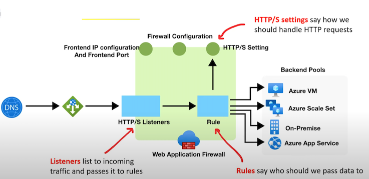

### Application Gateway - Routing Rules

**Listeners**

A listener "listens" on a specified port and IP address for traffic that uses a specified protocol.

If the listener criteria are met, the application gateway will apply this routing rule.

There are 2 types of listeners:

Basic

1. **Basic** - forward all requests for any domain to backend pools
2. **Multi-site** - forward requests to different backend pools based on **host header and host name**

requests are matched according to the **order of the rules** and the type of listener

Add your basic listeners last otherwise it will capture all requests

**Backend targets**

Chooses where a route should go either **Backend Pool or Redirection**

**HTTP Settings**

* To create a rule for Backend Pool you need to create HTTP Setting.
* This allows to define how we want to handle cookies, connection draining, port request time out and more..

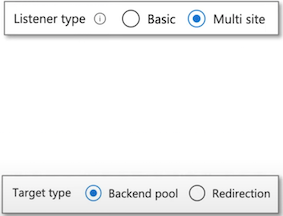

### Application Gateway - Routing Rules

* **Backend Port**
	* the port where the back-end servers listen to incoming traffic
* **Cookie-based affinity**
	* Use cookies to keep a user session on the same server
* **Connection draining**
	* gracefully remove backend pool members during planned service updates
* **Request Timeouts**
	* the number of seconds that the application gateway will wait to receive a response from the backend pool before it returns a "connection timed out" error message.
* **Override backend path**
	* allows you to override the path in the URL so that the requests for a specific path can be routed to another path
* **Override Hostname**
	* Multi-tenant services like App service or API management rely on a specific host header or SNI extension to resolve to the correct endpoint. Change these settings to overwrite the incoming HTTP host header

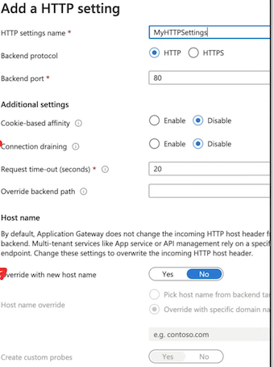

## Azure Scale Sets

Azure Scale Sets allows you to **automatically increase or decrease your VM capacity**.

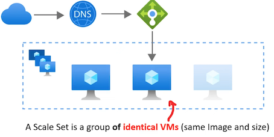

* Create Scaling Policies to automatically add or remove based on Host Metrics
* Create Health checks and set a Repair Policy to replace unhealthy instances
* Associate A Load Balancer to distribute VMs across AZs
* You can scale to 100s or even 1000s of VMs using scale sets

### Azure Scale Sets - Load Balancer

A Load Balancer can be associated with a Scale Set.

This will allow you to:

* evenly distribute your VMs across multiple Availability Zones to make your application Highly Available.
* Use Load Balancer probe checks for more robust Health checks

You have the choice between 2 different load balancers:

1. **Application Gateway is an HTTP/HTTPS** web traffic load balancer with URL-based routing, SSL termination, session persistence, and web application firewall.
2. **Azure Load Balancer supports all TCP/UDP network traffic**, port-forwarding, and outbound flows.

### Azure Scale Sets - Scaling Policy

**A Scaling Policy** determine when a VMs should be added or
removed to meet current capacity requirements

**Scale Out**

When a instance should be **added to the Scale Set to increase** capacity

eg. When CPU Threshold (%) greater than X for Y minutes add X servers

**Scale In**

When a instance should be **removed to the Scale Set** to decrease capacity

eg. When CPU Threshold (%) less than X for Y minutes add X servers

When you are creating a Scale Set you have very limited options for your Scaling Policy

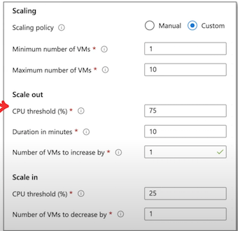

### Azure Scale Sets - Scaling Policy

After you create your ScaleSet you have a-lot more options available to configure the rules of your Scaling Policy

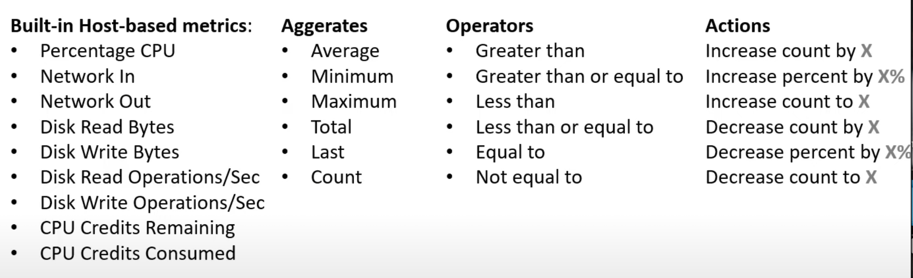

If you want more metrics there are 2 ways to collect more information:

1. **App Insights** installs a small instrumentation package in your application that monitors the app and sends telemetry to Azure.
	* When you want application metrics: Page load performance, Session counts

2. **Azure Diagnostic extension** is an agent that runs inside a VM instance. It monitors and saves performance metrics to Azure storage so you can collect more detailed information
	* When you want more detailed Host-hashed metrics

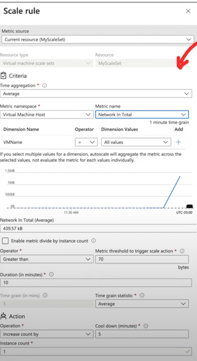

## Health Montoring

**Azure Scale Sets - Scaling Policy**

**Scale-In Policy** is how determines what VM is removed (deleted) to decrease the capacity of the Scale Set

* **Default**
	* Delete the VM with the highest Instance ID
	* Balanced across Availability Zones (AZs) and Fault Domains (ADs)
* **Newest VM**
	* Delete the newest created VM
	* Balanced across Availability Zones (AZs)
* **Oldest VM**
	* Delete the oldest VM
	* Balanced across Availability Zones (AZs)

**Update Policy** determine how VM instances are brought up-to-date with the latest scale set model

* **Automatic**
	* Increasing with start upgrading immediately in random order
* **Manual**
	* Existing instances must be manually upgraded
* **Rolling**
	* Upgrades roll out in batches with optional pause

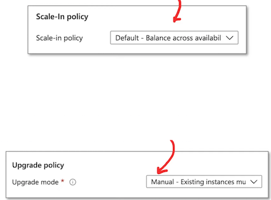

	
**Automatic OS upgrades** can be enabled helps to ease update management by safely and automatically upgrading the OS disk for all instances

### Azure Scale Sets - Health Monitoring

**Health monitoring** can be enabled to determine if you server is **healthy or unhealthy,**

There are 2 modes of health monitoring:

1. Application health extension
	* Ping an HTTP request to a specific path and except
a status 200
2. Load Balancer Probe
	* Allow you to check based on TCP, UDP or HTTP requests
3. Automatic repair policy
	* If an instance is found to be unhealthy the delete it and launch a new instance

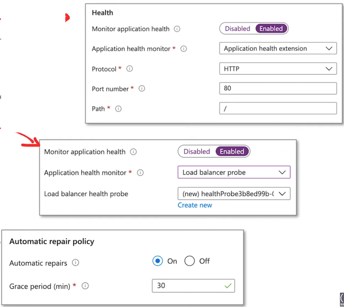
