# AZ305 - 1 

### Topic 1 - Question Set 1

#### Question 1

You have an Azure subscription that contains a custom application named Application1. Application1 was developed by an external company
named Fabrikam Ltd. Developers at Fabrikam were assigned role-based access control (RBAC) permissions to the Application1 components. All users are licensed for the Microsoft 365 E5 plan.

You need to recommend a solution to verify whether the Fabrikam developers still require permissions to Application1. The solution must meet the following requirements:

* To the manager of the developers, send a monthly email message that lists the access permissions to Application1.
* **If the manager does not verify an access permission, automatically revoke that permission**.
* Minimize development effort.

What should you recommend?

* **<mark>A. In Azure Active Directory (Azure AD) create an access review of Application</mark>**.   ✅ 
* B. Create an Azure Automation runbook that runs the **Get-AzRoleAssignment cmdlet.**
* C. In Azure Active Directory (Azure AD) Privileged Identity Management, create a custom role assignment for the Application1 resources.
* D. Create an Azure Automation runbook that runs the **Get-AzureADUserAppRoleAssignment** cmdlet

**An access review in an Azure AD feature that allows an admin to evaluate and verify user access to certain roles and resources.**

Based on the question's requirements, 
1. with an Access Review, we can configure periodic notifications about permissions 
2. Enable auto-revocation of access
3. All through a configuration-based approach.

#### Question 2

You have an Azure subscription. The subscription has a blob container that contains multiple blobs. 

Ten users in the nance department of your company plan to access the blobs during the month of April. 

You need to recommend a solution to enable access to the **blobs during the month of April only.**

Which security solution should you include in the recommendation

* **<mark>A. shared access signatures (SAS)</mark>**  ✅
* B. Conditional Access policies 
* C. certificates
* D. access keys  

**Shared Access Signatures (SAS) allows for limited-time fine grained access control to resources**. So you can generate URL, specify duration (for month of April) and disseminate URL to 10 team members. On May 1, the SAS token is automatically invalidated, denying team members continued access.

To enable access to blobs in a container during the month of April only, use shared access signatures (SAS). **SAS tokens can be generated with an expiration time and can be scoped to provide granular access control**. 

SAS tokens can easily be generated and distributed to the ten finance department users who need access to the blobs during the month of April. 

SAS tokens will no longer be valid once they expire, fulfilling the requirement to restrict access to the blobs during the month of April only. Conditional Access policies and certificates/access keys are not suitable for this task.

#### Question 3

You have an Azure Active Directory (Azure AD) tenant that syncs with an on-premises Active Directory domain.

You have an internal web app named WebApp1 that is hosted on-premises. WebApp1 uses Integrated Windows authentication.

**Some users work remotely and do NOT have VPN access to the on-premises network.**

**You need to provide the remote users with single sign-on (SSO) access to WebApp1.**

Which two features should you include in the solution? Each correct answer presents part of the solution.

NOTE: Each correct selection is worth one point

* **A. Azure AD Application Proxy** ✅
* B. Azure AD Privileged Identity Management (PIM)
* C. Conditional Access policies
* D. Azure Arc
* **E. Azure AD enterprise applications** ✅
* F. Azure Application Gateway

A: **Application Proxy is a feature of Azure AD that enables users to access on-premises web applications from a remote client**. 

Application Proxy includes both the Application Proxy service which runs in the cloud, and the Application Proxy connector which runs on an on-premises server

You can configure single sign-on to an Application Proxy application

**E: Add an on-premises app to Azure AD**

Now that you've prepared your environment and installed a connector, you're ready to add on-premises applications to Azure AD.

1. Sign in as an administrator in the Azure portal.
2. In the left navigation panel, select Azure Active Directory.
3. Select Enterprise applications, and then select New application.
4. **Select Add an on-premises application button which appears about halfway down the page in the On-premises applications section** Alternatively, you can select Create your own application at the top of the page and then select Configure Application Proxy for secure remote
access to an on-premise application.
5. In the Add your own on-premises application section, provide the following information about your application.

#### Question 4

You have an Azure Active Directory (Azure AD) tenant named contoso.com that has a security group named Group1. **Group1 is configured for
assigned membership**. Group1 has 50 members, including 20 guest users.
You need to recommend a solution for evaluating the membership of Group1. The solution must meet the following requirements:

* ✑ The evaluation must be repeated automatically every three months.
* ✑ Every member must be able to report whether they need to be in Group1.
* ✑ Users who report that they do not need to be in Group1 must be removed from Group1 automatically.
* ✑ Users who do not report whether they need to be in Group1 must be removed from Group1 automatically.

What should you include in the recommendation

* A. Implement Azure AD Identity Protection.
* B. Change the Membership type of Group1 to Dynamic User.
* **C. Create an access review**.   ✅
* D. Implement Azure AD Privileged Identity Management (PIM).

**Azure Active Directory (Azure AD) access reviews enable organizations to efficiently manage group memberships, access to enterprise applications, and role assignments**. User's access can be reviewed on a regular basis to make sure only the right people have continued access.

#### Question 5 

You plan to deploy Azure Databricks to support a machine learning application. **Data engineers will mount an Azure Data Lake Storage account to the Databricks file system.**

Permissions to folders are granted directly to the data engineers.

You need to recommend a design for the planned Databrick deployment. The solution must meet the following requirements:

* ✑ Ensure that the data engineers can only access folders to which they have permissions.
* ✑ Minimize development effort.
* ✑ Minimize costs.

What should you include in the recommendation? To answer, select the appropriate options in the answer area.

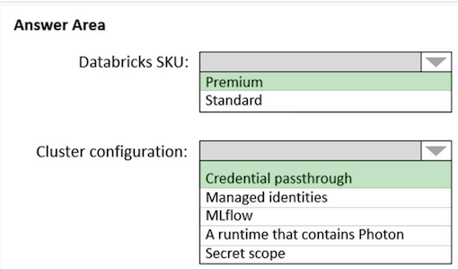

* **Premium**:  Premium Databricks SKU is required for credential passhtrough.
* **Credential passthrough**

Athenticate automatically to Azure Data Lake Storage Gen1 (ADLS Gen1) and Azure Data Lake Storage Gen2 (ADLS Gen2) from Azure Databricks clusters using the same Azure Active Directory (Azure AD) identity that you use to log into Azure Databricks. 

**When you enable Azure Data Lake Storage credential passthrough** for your cluster, commands that you run on that **cluster can read and write data in Azure Data Lake Storage without requiring you to configure service principal credentials for access to storage.**

**Databricks SKU should be a Premium plan. As the doc states both cloud storage access and credential passthrough features will need a Premium plan**.

**Premium SKU** for Azure Databricks provides enhanced security features, including integration with Azure Active Directory (Azure AD). By using
Azure AD, you can enforce role-based access control (RBAC) and allow for directory-based authentication.

**Cluster Configuration: Credential Passthrough**

**Credential passthrough allows users to authenticate to Azure Data Lake Storage using their personal Azure Active Directory (Azure AD) credentials**

As a result, they will only be able to access the folders and data to which they have been granted permission.

> NOTE: Credential passthrough is a legacy data governance model. Databricks recommends that you upgrade to Unity Catalog.

#### Question 6

You plan to deploy an Azure web app named App1 that will use Azure Active Directory (Azure AD) authentication.

App1 will be accessed from the internet by the users at your company. All the users have computers that run Windows 10 and are joined to Azure AD.

You need to recommend a solution to ensure that the users **can connect to App1 without being prompted for authentication and can access App1
only from company-owned computers**.

What should you recommend for each requirement? To answer, select the appropriate options in the answer area.

NOTE: Each correct selection is worth one point

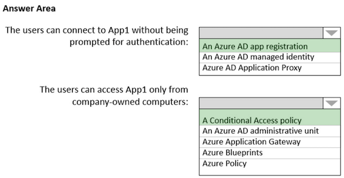

**Box 1: An Azure AD app registration**

Azure active directory (AD) provides cloud based directory and identity management services.**You can use azure AD to manage users of your
application and authenticate access to your applications using azure active directory**.

**You register your application with Azure active directory tenant.**

**Box 2: A conditional access policy**

Conditional Access policies at their simplest are if-then statements, if a user wants to access a resource, then they must complete an action.
By using Conditional Access policies, you can apply the right access controls when needed to keep your organization secure and stay out of
your user's way when not needed.

**Correct Answer - 1: Azure AD app registration - Azure AD app registration is essential to integrate the web application (App1) with Azure AD**.

By doing this, you can leverage Azure AD's authentication mechanisms, including SSO. Once App1 is registered in Azure AD and configured for
SSO, users who are already signed in to their Azure AD account can access the application without being prompted for authentication again.

**Correct Answer - 2: Conditional Access policy**

Azure AD Conditional Access policies allow you to define and enforce specific conditions under which users can access applications.

**In this scenario, you can create a Conditional Access policy that specifies that App1 can only be accessed from devices that are Azure.**

#### Question 7

Your company deploys several virtual machines on-premises and to Azure. ExpressRoute is deployed and configured for on-premises to Azure connectivity.

Several virtual machines exhibit network connectivity issues.

You need to analyze the network traffic to identify whether packets are being allowed or denied to the virtual machines.

Solution: **Use Azure Traffic Analytics in Azure Network Watcher to analyze the network traffic**

Does this meet the goal?

* A. Yes
* **B. No**   ✅

Instead use **Azure Network Watcher IP Flow Verify, which allows you to detect trafficc filtering issues at a VM level**.

Note: **IP flow verify checks if a packet is allowed or denied to or from a virtual machine**.

The information consists of direction, protocol, local IP , remote IP , local port, and remote port. If the packet is denied by a security group, the name of the rule that denied the packet is returned. While any source or destination IP can be chosen, **IP flow verify helps administrators quickly diagnose connectivity issues from or to the internet and from or to the on-premises environment**.

**(Traffic Analytics) under (Network Watcher) gives you statistical data and traffic visualization like total inbound and outbound flows and the number of deployed NSGs. However, it doesn't give you information if packets are allows of denied.**

(IP Flow Verify) under (Network Watcher) gives you option to verify if traffic is allowed or denied.

**B: No, Azure Traffic Analytics (CORRECT ANSWER IS IP FLOW VERIFY)**

Azure Traffic Analytics provides insights into the network traffic through Azure resources. It can help you understand traffic flow patterns, identify security and networking issues, and optimize your network deployments

To analyze the network traffic in the described scenario, tools like Azure Network Watcher, specifically its IP flow verify feature, would be more appropriate

Azure Traffic Analytics is designed to help diagnose performance and connectivity issues in Azure virtual networks. 

It uses network flow data collected by Azure Network Watcher's flow logs, and provides insights into network activity and patterns. However, it does not provide the ability to identify whether packets are being allowed or denied to specific virtual machines.

#### Question 8

Your company deploys several virtual machines on-premises and to Azure. ExpressRoute is deployed and configured for on-premises to Azure connectivity.

Several virtual machines exhibit network connectivity issues.

You need to analyze the network traffic to identify whether packets are being allowed or denied to the virtual machines.

**Solution: Use Azure Advisor to analyze the network traffic.**

Does this meet the goal

* A. Yes
* **B. No** ✅

Instead use **Azure Network Watcher IP Flow Verify**, which allows you to detect traffic filtering issues at a VM level.

Note: IP flow verify checks if a packet is allowed or denied to or from a virtual machine. The information consists of direction, protocol, local IP, remote IP , local port, and remote port. If the packet is denied by a security group, the name of the rule that denied the packet is returned. 

While any source or destination IP can be chosen, **IP flow verify helps administrators quickly diagnose connectivity issues from or to the internet and from or to the on-premises environment**

#### Question 9 

Your company deploys several virtual machines on-premises and to Azure. ExpressRoute is deployed and configured for on-premises to Azure connectivity.

Several virtual machines exhibit network connectivity issues.

You need to analyze the network traffic to identify whether packets are being allowed or denied to the virtual machines.

Solution: **Use Azure Network Watcher to run IP flow verify to analyze the network traffic**.

Does this meet the goal

* **A. Yes** ✅
* B. No

Azure Network Watcher IP Flow Verify allows you to detect traffic filtering issues at a VM level.

IP flow verify checks if a packet is allowed or denied to or from a virtual machine. The information consists of direction, protocol, local IP , remote IP , local port, and remote port. If the packet is denied by a security group, the name of the rule that denied the packet is returned. While any source or destination IP can be chosen,

IP flow verify helps administrators quickly diagnose connectivity issues from or to the internet and from or to the on-premises environment.

#### Question 10 

You have an Azure subscription. The subscription contains Azure virtual machines that run Windows Server 2016 and Linux.

**You need to use Azure Monitor to design an alerting strategy for security-related events.**

Which Azure Monitor Logs tables should you query? To answer, drag the appropriate tables to the correct log types. Each table may be used once,
more than once, or not at all. You may need to drag the split bar between panes or scroll to view content.

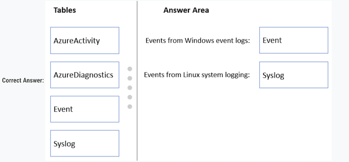

**Windows: Events**

For Windows logs, we'll need to query the Event table in Azure Monitor Logs. Windows event logs data are collected into the Event table when you

**Correct Answer - Linux: Syslogs**

For Linux logs, we'll need to query the Syslog table. The Linux system logs (syslog data) are collected into the Syslog table when you use the Log Analytics agent on Linux VMs.

#### Question 11

You are designing a large Azure environment that will contain many subscriptions.

You plan to use **Azure Policy as part of a governance solution**.

To which three scopes can you assign Azure Policy definitions? Each correct answer presents a complete solution.

NOTE: Each correct selection is worth one point.

* A. Azure Active Directory (Azure AD) administrative units
* B. Azure Active Directory (Azure AD) tenants
* **C. subscriptions**   ✅
* D. compute resources 
* **E. resource groups**  ✅
* **F. management groups**  ✅

#### Question 12

Your on-premises network contains a server named Server1 that runs an ASP .NET application named App1.

**You have a hybrid deployment of Azure Active Directory (Azure AD)**.

You need to recommend a solution to ensure that users sign in by **using their Azure AD account and Azure Multi-Factor Authentication (MFA) when they connect to App1 from the internet**.

**Which three features should you recommend be deployed and configured in sequence**? To answer, move the appropriate features from the list of features to the answer area and arrange them in the correct order.

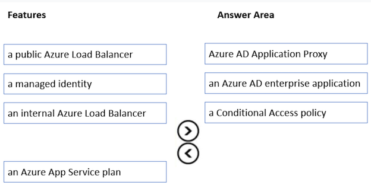

**Step 1: Azure AD Application Proxy**

Start by enabling communication to Azure data centers to prepare your environment for Azure AD Application Proxy.

**Step 2: an Azure AD enterprise application**

Add an on-premises app to Azure AD.

Now that you've prepared your environment and installed a connector, you're ready to add on-premises applications to Azure AD.
1. Sign in as an administrator in the Azure portal.
2. In the left navigation panel, select Azure Active Directory.
3. Select Enterprise applications, and then select New application.

**Application Proxy is a feature of Enterprise Applications, so yeah, you would need to register an Enterprise Application before enabling an Application Proxy for it.**

1. Enterprise Application
2. Application Proxy
3. Conditional Access

#### Question 13

You need to recommend a solution to **generate a monthly report of all the new Azure Resource Manager (ARM) resource deployments** in your Azure subscription.

What should you include in the recommendation?

* **A. Azure Activity Log**
* B. Azure Advisor
* C. Azure Analysis Services
* D. Azure Monitor action groups

**Correct Answer: A**

Activity logs are kept for 90 days. You can query for any range of dates, as long as the starting date isn't more than 90 days in the past.

Through activity logs, you can determine:

* ✑ what operations were taken on the resources in your subscription
* ✑ who started the operation
* ✑ when the operation occurred
* ✑ the status of the operation
* ✑ the values of other properties that might help you research the operation

#### Question 14

Your company deploys several virtual machines on-premises and to Azure. **ExpressRoute is deployed and configured for on-premises to Azure connectivity.**

Several virtual machines exhibit network connectivity issues.

**You need to analyze the network traffic to identify whether packets are being allowed or denied to the virtual machines.**

Solution: **Install and configure the Azure Monitoring agent and the Dependency Agent on all the virtual machines.** Use VM insights in Azure Monitor to analyze the network traffic.

Does this meet the goal?

* A. Yes
* **B. No**  ✅

Use the Azure Monitor agent if you need to:

Collect guest logs and metrics from any machine in Azure, in other clouds, or on-premises.

Use the Dependency agent if you need to:

**Use the Map feature VM insights or the Service Map solution.**

Note: **<mark>Instead use Azure Network Watcher IP Flow Verify allows you to detect traffic filtering issues at a VM level.</mark>**

IP flow verify checks if a packet is allowed or denied to or from a virtual machine. The information consists of direction, protocol, local IP , remote IP , local port, and remote port. If the packet is denied by a security group, the name of the rule that denied the packet is returned. 

While any source or destination IP can be chosen,
IP flow verify helps administrators quickly diagnose connectivity issues from or to the internet and from or to the on-premises environment.

**Azure Network Watcher IP Flow Verify, which allows you to detect traffic filtering issues at a VM level.**

#### Question 15

You need to design an architecture to capture the creation of users and the assignment of roles. **The captured data must be stored in Azure Cosmos DB**.

Which services should you include in the design? To answer, drag the appropriate services to the correct targets. 

Each service may be used once, more than once, or not at all. You may need to drag the split bar between panes or scroll to view content

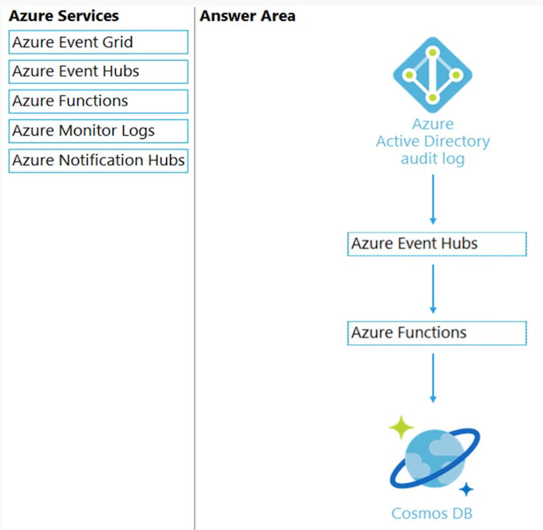

**Box 1: Azure Event Hubs -**

**You can route Azure Active Directory (Azure AD) activity logs to several endpoints for long term retention and data insights.**

**The Event Hub is used for streaming.**

**Box 2: Azure Function -**

Use an Azure Function along with a cosmos DB change feed, and store the data in Cosmos DB.

1. **Event Hub: You can export AD logs to an Azure Event Hub (even you can cherry picking which ones)**
2. Azure Function: You easily create a serverless function to **read events from the Event Hub and store them in a CosmosDB.**

**Azure Event Hub is responsible for the ingestion of data without sending data back to the publishers.**

Azure event grid is -> Responsible for notifying the events that occurred on the publisher’s end with the help of HTTP requests.

#### Question 16

Your company, named Contoso, Ltd., implements several Azure logic apps that have HTTP triggers. The logic apps provide access to an on-premises web service.

Contoso establishes a partnership with another company named Fabrikam, Inc.

Fabrikam does not have an existing Azure Active Directory (Azure AD) tenant and uses third-party OAuth 2.0 identity management to authenticate its users.

**Developers at Fabrikam plan to use a subset of the logic apps to build applications that will integrate with the on-premises web service of Contoso.**

You need to design a solution to provide the Fabrikam developers with access to the logic apps. The solution must meet the following

requirements

* ✑ Requests to the logic apps from the developers must be limited to lower rates than the requests from the users at Contoso.
* ✑ The developers must be able to rely on their existing OAuth 2.0 provider to gain access to the logic apps.
* ✑ **The solution must NOT require changes to the logic apps**.
* ✑ **The solution must NOT use Azure AD guest accounts**.

What should you include in the solution?

* A. Azure Front Door
* B. Azure AD Application Proxy
* C. Azure AD business-to-business (B2B)
* **D. Azure API Management**  ✅

**Many APIs support OAuth 2.0 to secure the API and ensure that only valid users have access, and they can only access resources to which they're entitled.** 

**To use Azure API Management's interactive developer console with such APIs, the service allows you to configure your service instance to work with your OAuth 2.0 enabled API**

Incorrect:

* Azure AD business-to-business (B2B) uses guest accounts.
* Azure AD Application Proxy is for on-premises scenarios

The given answer is correct. **API management can use Oauth2 for authorization:**

**D. Azure API Management**

To provide access to the logic apps for Fabrikam developers while limiting their requests to lower rates than the users at Contoso and allowing them to rely on their existing OAuth 2.0 provider, you should use Azure API Management.

#### Question 17

You have an Azure subscription that contains 300 virtual machines that run Windows Server 2019.

**You need to centrally monitor all warning events in the System logs of the virtual machines.**

What should you include in the solution? To answer, select the appropriate options in the answer area.

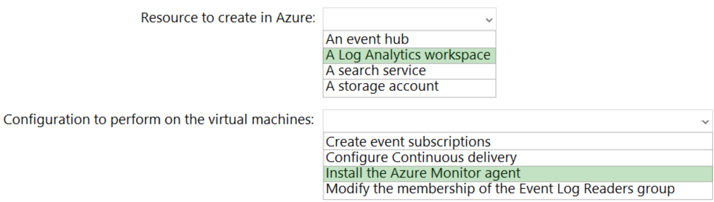

**Box 1: A Log Analytics workspace**

Send resource logs to a Log Analytics workspace to enable the features of Azure Monitor Logs.

You must create a diagnostic setting for each Azure resource to send its resource logs to a Log Analytics workspace to use with Azure Monitor Logs.

**Box 2: Install the Azure Monitor agent**

Use the Azure Monitor agent if you need to:

**Collect guest logs and metrics from any machine in Azure, in other clouds, or on-premises.**

Manage data collection configuration centrally

#### Question 18

You have several Azure App Service web apps that use Azure Key Vault to store data encryption keys.

Several departments have the following requests to support the web app:

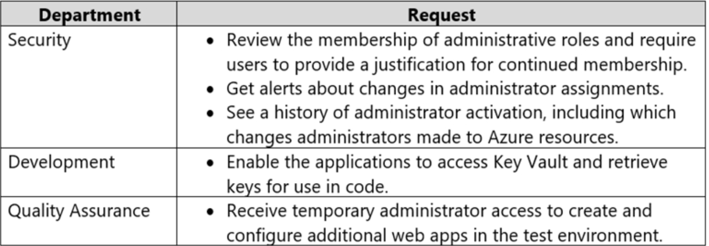

Which service should you recommend for each department's request? To answer, configure the appropriate options in the answer area.

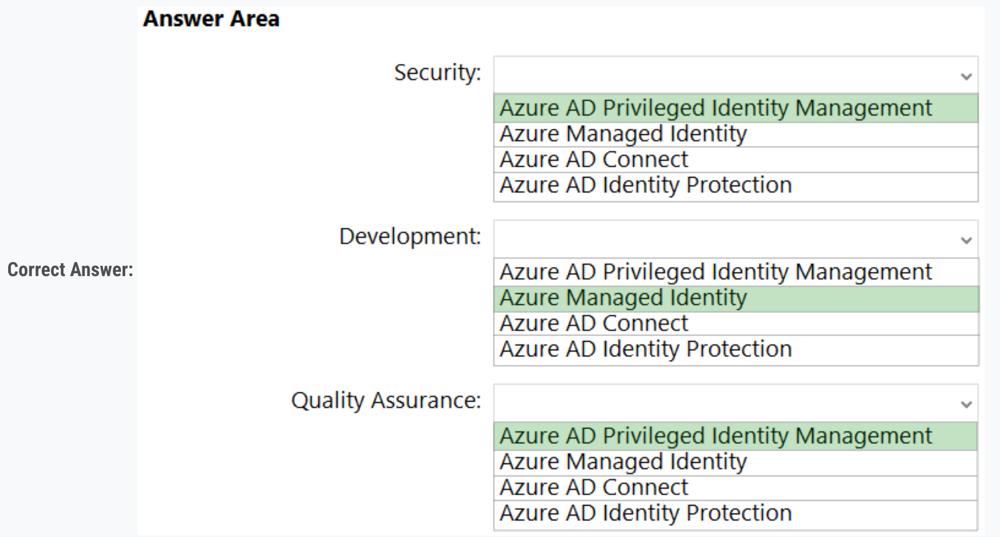

**Box 1: Azure AD Privileged Identity Management**

**Privileged Identity Management provides time-based and approval-based role activation to mitigate the risks of excessive, unnecessary, or misused access permissions on resources that you care about. Here are some of the key features of Privileged **

Identity Management:

* Provide just-in-time privileged access to Azure AD and Azure resources 
* **Assign time-bound access to resources using start and end dates Require approval to activate privileged roles**
* Enforce multi-factor authentication to activate any role
* **Use justification to understand why users activate**
* **Get notifications when privileged roles are activated**
* Conduct access reviews to ensure users still need roles
* **Download audit history for internal or external audit**
* Prevents removal of the last active Global Administrator role assignment

**Box 2: Azure Managed Identity -**

Managed identities provide an identity for applications to use when connecting to resources that support Azure Active Directory (Azure AD) authentication.

**Applications may use the managed identity to obtain Azure AD tokens. With Azure Key Vault, developers can use managed identities to access resources.** 

Key Vault stores credentials in a secure manner and gives access to storage accounts.

**Box 3: Azure AD Privileged Identity Management**

Privileged Identity Management provides time-based and approval-based role activation to mitigate the risks of excessive, unnecessary, or misused access permissions on resources that you care about. 

Here are some of the key features of Privileged Identity Management: Provide just-in-time privileged access to Azure AD and Azure resources Assign time-bound access to resources using start and end dates

**PIM / MI / PIM**

#### Question 19

Your company has the divisions shown in the following table.

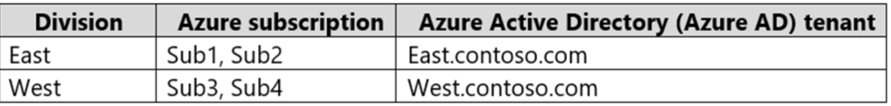

You plan to deploy a custom application to each subscription. The application will contain the following:

* ✑ A resource group
* ✑ An Azure web app
* ✑ Custom role assignments
* ✑ An Azure Cosmos DB account

You need to use Azure Blueprints to deploy the application to each subscription.

What is the minimum number of objects required to deploy the application? To answer, select the appropriate options in the answer area.

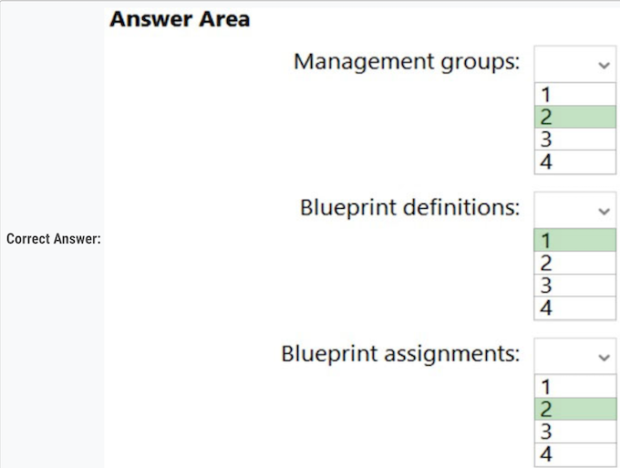

**Box 1: 2 - ✅**

**One management group for each Azure AD tenant**

Azure management groups provide a level of scope above subscriptions.

All subscriptions within a management group automatically inherit the conditions applied to the management group.

All subscriptions within a single management group must trust the same Azure Active Directory tenant.

**Box 2: 1 -  ✅**

**One single blueprint definition can be assigned to different existing management groups or subscriptions.**

When creating a blueprint definition, you'll define where the blueprint is saved. Blueprints can be saved to a management group or subscription that you have Contributor access to. 

If the location is a management group, the blueprint is available to assign to any child subscription of that management group.

**Box 3: 2 -  ✅**

**Each Published Version of a blueprint can be assigned (with a max name length of 90 characters) to an existing management group or
subscription.**

Assigning a blueprint definition to a management group means the assignment object exists at the management group. The deployment of
artifacts still targets a subscription.

#### Question 20

You need to design an Azure policy that will implement the following functionality:

* For new resources, **assign tags and values that match the tags and values** of the resource group to which the resources are deployed.
* For existing resources, **identify whether the tags and values match the tags and values of the resource group that contains the resources**.
* For any non-compliant resources, trigger auto-generated remediation tasks to create missing tags and values.

**The solution must use the principle of least privilege.**·

What should you include in the design? To answer, select the appropriate options in the answer area.

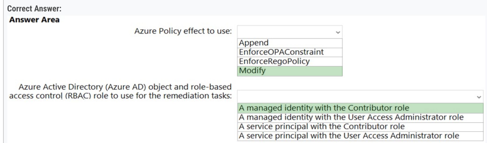

* **Azure Policy effect to use:  Modify**
* **Azure Active Directory (Azure AD) object and role-based access control (RBAC) role to use for the remediation tasks: A managed identity with the Contributor role**

Box 1: Modify -

**Modify is used to add, update, or remove properties or tags on a subscription or resource during creation or update**. A common example is updating tags on resources such as costCenter. Existing non-compliant resources can be remediated with a remediation task. 

**A single Modify rule can have any number of operations. Policy assignments with effect set as Modify require a managed identity to do remediation**

Incorrect:

* The following effects are deprecated: EnforceOPAConstraint EnforceRegoPolicy
* **Append is used to add additional fields to the requested resource during creation or update.** A common example is specifying allowed IPs for a storage resource.

Append is intended for use with non-tag properties. While Append can add tags to a resource during a create or update request, it's
recommended to use the Modify effect for tags instead.

**Box 2: A managed identity with the Contributor role**

The managed identity needs to be granted the appropriate roles required for remediating resources to grant the managed identity.

**Contributor - Can create and manage all types of Azure resources but can't grant access to others**

* 1- Modify
* 2- RBAC of the remediation task
  * Microsoft says: "As a prerequisite, the policy definition must define the roles that deployIfNotExists and modify need to successfully deploy the content of the included template.
  
#### Question 21

You have an Azure subscription that contains the resources shown in the following table.

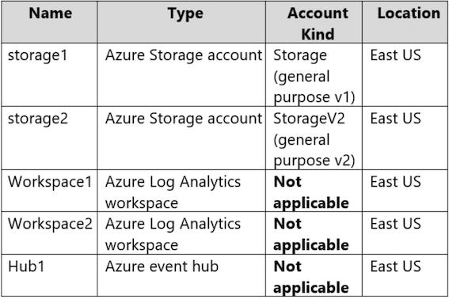

You create an Azure SQL database named DB1 that is hosted in the East US Azure region.

**To DB1, you add a diagnostic setting named Settings1. Settings1 archive SQLInsights to storage1 and sends SQLInsights to Workspace1**.

For each of the following statements, select Yes if the statement is true. Otherwise, select No

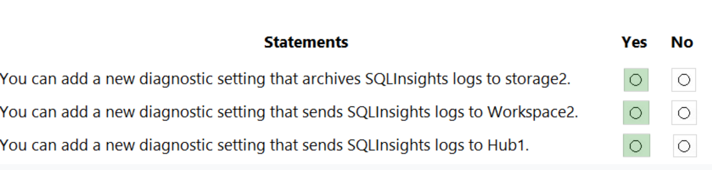

**Box 1: Yes -**  ✅

**A single diagnostic setting can define no more than one of each of the destinations**. 

**If you want to send data to more than one of a particular destination type (for example, two different Log Analytics workspaces) , then create multiple settings.**

Each resource can have up to 5 diagnostic settings.
Note: This diagnostic telemetry can be streamed to one of the following Azure resources for analysis.

* **Log Analytics workspace**
* **Azure Event Hubs**
* **Azure Storage**

* Box 2: Yes -  ✅
* Box 3: Yes -  ✅

#### Question 22

You plan to deploy an Azure SQL database that will store **Personally Identifiable Information (PII)**.

**You need to ensure that only privileged users can view the PII**.

What should you include in the solution?

* **A. dynamic data masking**  ✅
* B. role-based access control (RBAC)
* C. Data Discovery & Classification
* D. Transparent Data Encryption (TDE)

**Dynamic data masking limits sensitive data exposure by masking it to non-privileged users**.

Dynamic data masking helps **prevent unauthorized access to sensitive data by enabling customers to designate how much of the sensitive data to reveal with minimal impact on the application layer**.

It's a policy-based security feature that hides the sensitive data in the result set of a query over designated database fields, while the data in the database is not changed

#### Question 23

You plan to deploy an app that will use an Azure Storage account.

You need to deploy the storage account. The storage account must meet the following requirements:

* **Store the data for multiple users**.
* Encrypt each user's data by using a separate key.
* **Encrypt all the data in the storage account by using customer-managed keys**.

What should you deploy?

* A. files in a premium file share storage account
* **B. blobs in a general purpose v2 storage account** ✅
* C. blobs in an Azure Data Lake Storage Gen2 account
* D. files in a general purpose v2 storage account

You can specify a customer-provided key on Blob storage operations. 

**A client making a read or write request against Blob storage can include an encryption key on the request for granular control over how blob data is encrypted and decrypted**.

#### Question 24

You have an Azure App Service web app that uses a system-assigned managed identity.

**You need to recommend a solution to store the settings of the web app as secrets in an Azure key vault.** The solution must meet the following requirements:

* ✑ Minimize changes to the app code.
* ✑ Use the principle of least privilege.

What should you include in the recommendation? To answer, select the appropriate options in the answer area.

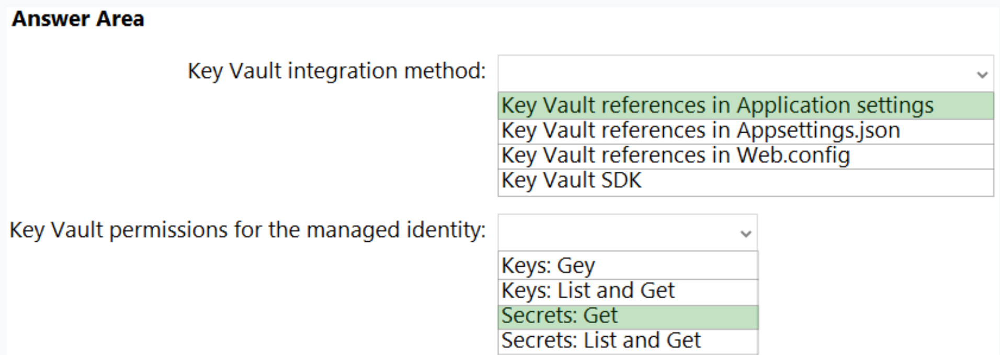

* Key Vault integration method: **Key Vault references in Application settings**
* Key Vault permissions for the managed identity: **Secrets: Get**

**Box 1: Key Vault references in Application settings**

**Source Application Settings from Key Vault**.

Key Vault references can be used as values for Application Settings, allowing you to keep secrets in Key Vault instead of the site config.

**Application Settings are securely encrypted at rest, but if you need secret management capabilities, they should go into Key Vault.**

**To use a Key Vault reference for an app setting, set the reference as the value of the setting.** Your app can reference the secret through its key as normal. No code changes are required.

**Box 2: Secrets: Get -**

In order to read secrets from Key Vault, you need to have a vault created and give your app permission to access it.

1. Create a key vault by following the Key Vault quickstart.
2. Create a managed identity for your application.
3. Key Vault references will use the app's system assigned identity by default, but you can specify a user-assigned identity.
4. **Create an access policy in Key Vault for the application identity you created earlier. Enable the "Get" secret permission on this policy**.

#### Question 25

You plan to deploy an application named **App1 that will run on five Azure virtual machines**. Additional virtual machines will be deployed later to run App1.

You need to recommend a solution to meet the following requirements for the virtual machines that will run App1:

* ✑ Ensure that the virtual machines **can authenticate to Azure Active Directory (Azure AD) to gain access to an Azure key vault, Azure Logic Apps instances, and an Azure SQL database**.
* ✑ **Avoid assigning new roles and permissions for Azure services when you deploy additional virtual machines**.
* ✑ Avoid storing secrets and certificates on the virtual machines.
* ✑ Minimize administrative effort for managing identities.

Which type of identity should you include in the recommendation?

* A. a system-assigned managed identity
* B. a service principal that is configured to use a certificate
* C. a service principal that is configured to use a client secret
* **D. a user-assigned managed identity**  ✅

**Managed identities provide an identity for applications to use when connecting to resources that support Azure Active Directory (Azure AD)  authentication.**

A user-assigned managed identity:

* Can be shared.
* **The same user-assigned managed identity can be associated with more than one Azure resource**.

Common usage:

- Workloads that run on multiple resources and can share a single identity.
- For example, a workload where multiple virtual machines need to access the same resource.

Incorrect:

Not A: **A system-assigned managed identity can't be shared. It can only be associated with a single Azure resource.**

Typical usage:

- *Workloads that are contained within a single Azure resource*.
- *Workloads for which you need independent identities*.

For example, an application that runs on a single virtual machine.

#### Question 26

You have the resources shown in the following table:

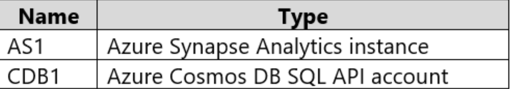

CDB1 hosts a container that stores continuously updated operational data.

You are designing a solution that will use AS1 to analyze the operational data daily.

You need to recommend a solution to analyze the data without affecting the performance of the operational data store.  What should you include in the recommendation?

* A. Azure Cosmos DB change feed
* B. Azure Data Factory with Azure Cosmos DB and Azure Synapse Analytics connectors
* **C. Azure Synapse Link for Azure Cosmos DB**   ✅
* D. Azure Synapse Analytics with PolyBase data loading

**Azure Synapse Link for Azure Cosmos DB creates a tight integration between Azure Cosmos DB and Azure Synapse Analytics.**

**It enables customers to run near real-time analytics over their operational data with full performance isolation from their transactional workloads and without an ETL pipeline.**

#### Question 27

You deploy several Azure SQL Database instances.

You plan to configure the Diagnostics settings on the databases as shown in the following exhibit.

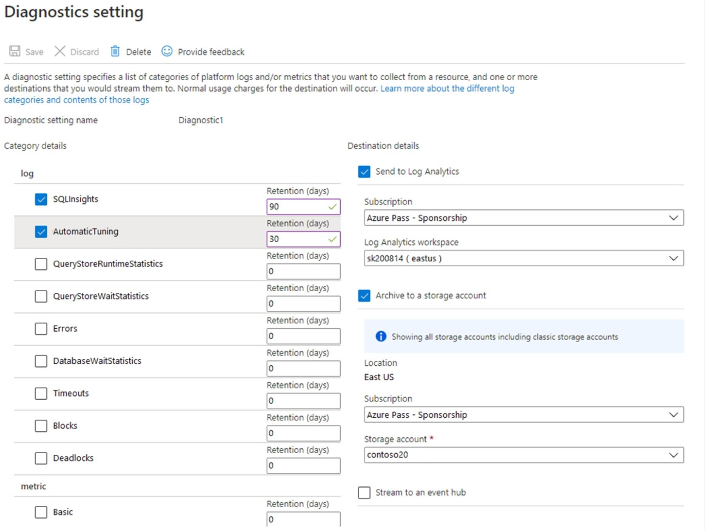

Use the drop-down menus to select the answer choice that completes each statement based on the information presented in the graphic.

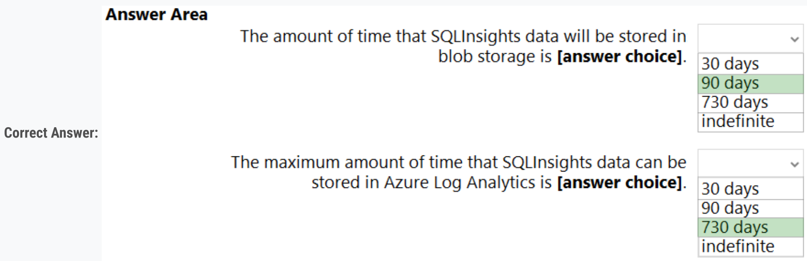

**Box 1: 90 days -  As per exhibit.**  ✅

**Box 2: 730 days -**  ✅

How long is the data kept?

**Raw data points (that is, items that you can query in Analytics and inspect in Search) are kept for up to 730 days.**

#### Question 28

You have an application that is used by 6,000 users to validate their vacation requests. **The application manages its own credential store.
Users must enter a username and password to access the application. The application does NOT support identity providers**.

**You plan to upgrade the application to use single sign-on (SSO) authentication by using an Azure Active Directory (Azure AD) application registration.**

Which SSO method should you use?

- [ ] A. header-based
- [ ] B. SAML
- [x] C. password-based  ✅
- [ ] D. OpenID Connect

**Password** - On-premises applications can use a password-based method for SSO. This choice works when applications are configured for
Application Proxy.

**With password-based SSO, users sign in to the application with a username and password the first time they access it.**

After the first sign-on, Azure AD provides the username and password to the application. Password-based SSO enables secure application password storage and replay using a web browser extension or mobile app. This option uses the existing sign-in process provided by the application, enables an
administrator to manage the passwords, and doesn't require the user to know the password.

**Incorrect:**

Choosing an SSO method depends on how the application is configured for authentication. Cloud applications can use federation-based
options, such as OpenID Connect, OAuth, and SAML.

**<mark>Federation - When you set up SSO to work between multiple identity providers, it's called federation.</mark>**

#### Question 29

You have an Azure subscription that contains a virtual network named VNET1 and 10 virtual machines. The virtual machines are connected to VNET1.

You need to design a solution to manage the virtual machines from the internet. The solution must meet the following requirements:

- ✑ Incoming connections to the virtual machines must be authenticated by using Azure Multi-Factor Authentication (MFA) before network connectivity is allowed.
- ✑ Incoming connections must use TLS and connect to TCP port 443.
- ✑ The solution must support RDP and SSH.

What should you include in the solution? To answer, select the appropriate options in the answer area.

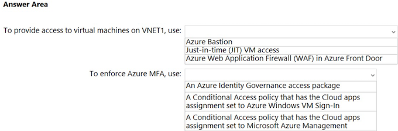

**1. Answer is Azure Bastion**.   ✅

It provides secure and seamless RDP/SSH connectivity to your virtual machines directly from the Azure portal over TLS.

**While JIT access allows access via RDP or SSH, incoming connections is not TLS tcp 443 (but RDP or SSH when the inbound port is temporarily**

**2. Second is correct**   

**A conditional Access policy that has Cloud Apps assignment set to Azure Windows VM Sign-In** ✅

Enforce Conditional Access policies

**You can enforce Conditional Access policies, such as multifactor authentication or user sign-in risk check**, before you authorize access to Windows
VMs in Azure that are enabled with Azure AD login. To apply a Conditional Access policy, you must select the Azure Windows VM Sign-In app from
the cloud apps or actions assignment option. Then use sign-in risk as a condition and/or require MFA as a control for granting access.

The JIT VM access page opens listing the ports that Defender for Cloud recommends protecting:

- 22 - SSH
- 3389 - RDP
- 5985 - WinRM
- 5986 - WinRM

#### Question 30

You are designing an Azure governance solution.

All Azure resources must be easily **identifiable based on the following operational information: environment, owner, department and cost center**.

**You need to ensure that you can use the operational information when you generate reports for the Azure resources**.

What should you include in the solution?

- [ ] A. an Azure data catalog that uses the Azure REST API as a data source
- [ ] B. an Azure management group that uses parent groups to create a hierarchy
- [x] C. **an Azure policy that enforces tagging rules**  ✅
- [ ] D. Azure Active Directory (Azure AD) administrative units 

**You apply tags to your Azure resources, resource groups, and subscriptions to logically organize them into a taxonomy. Each tag consists of a name and a value pair.**

**You use Azure Policy to enforce tagging rules and conventions.**

By creating a policy, you avoid the scenario of resources being deployed to your subscription that don't have the expected tags for your organization. Instead of manually applying tags or searching for resources that aren't
compliant, you create a policy that automatically applies the needed tags during deployment.

#### Question 31

A company named Contoso, Ltd. has an Azure Active Directory (Azure AD) tenant that is integrated with Microsoft 365 and an Azure subscription.
Contoso has an on-premises identity infrastructure. The infrastructure includes servers that run Active Directory Domain Services (AD DS) and
Azure AD Connect.

Contoso has a partnership with a company named Fabrikam. Inc. Fabrikam has an Active Directory forest and a Microsoft 365 tenant. Fabrikam
has the same on-premises identity infrastructure components as Contoso.

A team of 10 developers from Fabrikam will work on an Azure solution that will be hosted in the Azure subscription of Contoso. **The developers
must be added to the Contributor role for a resource group in the Contoso subscription**.

You need to recommend a solution to ensure that Contoso can assign the role to the 10 Fabrikam developers. **The solution must ensure that the
Fabrikam developers use their existing credentials to access resources**

What should you recommend

- [ ] A. In the Azure AD tenant of Contoso. create cloud-only user accounts for the Fabrikam developers.
- [ ] B. Configure a forest trust between the on-premises Active Directory forests of Contoso and Fabrikam.
- [ ] C. Configure an organization relationship between the Microsoft 365 tenants of Fabrikam and Contoso.
- [X] D. **In the Azure AD tenant of Contoso, create guest accounts for the Fabnkam developers**.   ✅

**You can use the capabilities in Azure Active Directory B2B to collaborate with external guest users and you can use Azure RBAC to grant just
the permissions that guest users need in your environment.**

**Incorrect:**

Not B: Forest trust is used for internal security, not external access.

Collaborate with any partner using their identities

With Azure AD B2B, the partner uses their own identity management solution, so there is no external administrative overhead for your organization. Guest users sign in to your apps and services with their own work, school, or social identities.

The partner uses their own identities and credentials, whether or not they have an Azure AD account.

#### Question 32

Your company has the divisions shown in the following table.

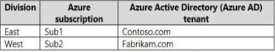

Sub1 contains an Azure App Service web app named App1. App1 uses Azure AD for single-tenant user authentication. Users from contoso.com
can authenticate to App1.

**You need to recommend a solution to enable users in the fabrikam.com tenant to authenticate to App1.**

What should you recommend?

- [ ] A. Configure the Azure AD provisioning service. 
- [ ] B. Enable Azure AD pass-through authentication and update the sign-in endpoint.
- [X] C. **Use Azure AD entitlement management to govern external users.**  ✅
- [ ] D. Configure Azure AD join.

The app is single tenant authentication so users must be present in contoso directory.

**With Azure AD B2B, external users authenticate to their home directory, but have a representation in your directory.**

* A is wrong because its to automate provisioning to third party SaaS app.
* B. is wrong because the application would need to switch to multi tenant..

There are three ways that entitlement management lets you specify the users that form a connected organization. It could be

- users in another Azure AD directory (from any Microsoft cloud),
- users in another non-Azure AD directory that has been configured for direct federation, or
- users in another non-Azure AD directory, whose email addresses all have the same domain name in common.

#### Question 33

Your company has 20 web APIs that were developed in-house.

The company is developing 10 web apps that will use the web APIs. **The web apps and the APIs are registered in the companys Azure Active
Directory (Azure AD) tenant. The web APIs are published by using Azure API Management.**

You need to recommend a solution to block unauthorized requests originating from the web apps from reaching the web APIs. The solution must
meet the following requirements:

✑ Use Azure AD-generated claims.

Minimize configuration and management effort.

What should you include in the recommendation? To answer, select the appropriate options in the answer area.

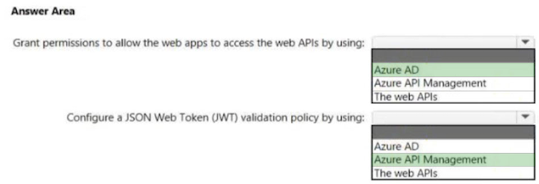

**Box 1: Azure AD** -

**Grant permissions in Azure AD.**

**Box 2: Azure API Management**-

- Configure a JWT validation policy to pre-authorize requests.
- Pre-authorize requests in API Management with the Validate JWT policy, by validating the access tokens of each incoming request. **If a request does not have a valid token, API Management blocks it**

#### Question 34

You need to recommend a solution to generate a **monthly report** of all the **new Azure Resource Manager (ARM) resource deployments in your
Azure subscription**.

What should you include in the recommendation?

- [X] A. **Azure Log Analytics**    ✅
- [ ] B. Azure Arc
- [ ] C. Azure Analysis Services
- [ ] D. Application Insights

Correct Answer: A

**The Activity log is a platform log in Azure that provides insight into subscription-level events. Activity log includes such information as when a
resource is modified or when a virtual machine is started.**

**Activity log events are retained in Azure for 90 days and then deleted.**

For more functionality, you should create a diagnostic setting to send the Activity log to one or more of these locations for the following
reasons: **to Azure Monitor Logs for more complex querying and alerting, and longer retention (up to two years) to Azure Event Hubs to forward
outside of Azure to Azure Storage for cheaper, long-term archiving**

Note: Azure Monitor builds on top of Log Analytics, the platform service that gathers log and metrics data from all your resources. The easiest
way to think about it is that Azure Monitor is the marketing name, whereas Log Analytics is the technology that powers it.

#### Question 35

You are developing an app that will read activity logs for an Azure subscription by using Azure Functions.

**You need to recommend an authentication solution for Azure Functions**. **The solution must minimize administrative effort.**

What should you include in the recommendation?

- [ ] A. an enterprise application in Azure AD
- [x] B. **system-assigned managed identities  ✅**
- [ ] C. shared access signatures (SAS)
- [ ] D. application registration in Azure AD

**System-assigned managed identities provide a way for Azure Functions to authenticate to other Azure services, such as Activity Logs, without the
need for storing or managing secrets.** 

This approach minimizes administrative effort because the identity is tied directly to the Azure Functions
service and is automatically managed by Azure. When the Azure Functions instance is deleted, the associated managed identity will also be
removed. This simplifies the authentication process and helps improve the security posture of your app.

A common challenge for developers is the management of secrets, credentials, certificates, and keys used to secure communication between
services. Managed identities eliminate the need for developers to manage these credential

**System-assigned. Some Azure resources, such as virtual machines allow you to enable a managed identity directly on the resource.** When you
enable a system-assigned managed identity:

- A service principal of a special type is created in Azure AD for the identity. The service principal is tied to the lifecycle of that Azure resource. When the Azure resource is deleted, Azure automatically deletes the service principal for you.
- By design, only that Azure resource can use this identity to request tokens from Azure AD.
- You authorize the managed identity to have access to one or more services.
- The name of the system-assigned service principal is always the same as the name of the Azure resource it is created for.

#### Question 36

You have an Azure subscription that contains an Azure key vault named KV1 and a virtual machine named VM1. VM1 runs Windows Server 2022:
Azure Edition.

You plan to deploy an ASP.Net Core-based application named App1 to VM1.

You need to configure App1 to use a system-assigned managed identity to retrieve secrets from KV1. The solution must minimize development
effort.

What should you do? To answer, select the appropriate options in the answer area.

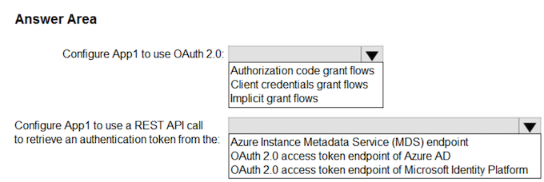

1. **Configure App1 to use OAuth 2.0:**

**Configure App1 to use Auth 2.0: Client credentials grant flows**  ✅

2. **Configure App1 to use a REST API call to retrieve an authentication token from the**

**Configure App1 to use a REST API call to retrieve an authentication token from the: Azure Instance Metadata (IMDS) endpoint**  ✅

The key difference in this scenario is that we are using a Managed Identity, which is a feature of Azure AD, and in that case, access tokens are
obtained through the Azure Instance Metadata Service (IMDS) API. 

**The managed identity is responsible for managing the lifecycle of these credentials.**

**Therefore, for the case of an application in an Azure VM that uses a managed identity to authenticate with Key Vault, the IMDS would be used, not an OAuth 2.0 endpoint directly.**

#### Question 36 - 2 

You are developing an app that will read activity logs for an Azure subscription by using Azure Functions. 

You need to recommend an authentication solution for Azure Functions. 

The solution must minimize administrative effort. 

What should you include in the recommendation?

* A. an enterprise application in Azure AD 
* **B. system-assigned managed identities** ✅
* C. shared access signatures (SAS) 
* D. application registration in Azure AD

**System-assigned managed identities provide a way for Azure Functions to authenticate to other Azure services, such as Activity Logs, without the need for storing or managing secrets.**

Azure Functions provide a Managed Identity and since the question is about Azure Functions not about the App being developed, the correct answer is B.

This approach minimizes administrative effort because the identity is tied directly to the Azure Functions service and is automatically managed by Azure. When the Azure Functions instance is deleted, the associated managed identity will also be removed. This simplifies the authentication process and helps improve the security posture of your app.

#### Question 37

Your company has the divisions shown in the following table.

**Sub1 contains an Azure App Service web app named App1. App1 uses Azure AD for single-tenant user authentication. Users from contoso.com
can authenticate to App1**.

You need to recommend a solution to enable users in the fabrikam.com tenant to authenticate to App1.

What should you recommend?

- [ ] A. Configure Azure AD join.
- [ ] B. Configure Azure AD Identity Protection.
- [ ] C. Configure a Conditional Access policy.
- [x] D. Configure Supported account types in the application registration and update the sign-in endpoint.  ✅

It can be **Use Azure AD entitlement management to govern external users** ✅ OR **Configure Supported account types in the application registration and update the sign-in endpoint** ✅

#### Question 38

You have an Azure subscription named Sub1 that is linked to an Azure AD tenant named contoso.com.

You plan to implement two ASP .NET Core apps named App1 and App2 that will be deployed to 100 virtual machines in Sub1. Users will sign in to
App1 and App2 by using their contoso.com credentials.

- App1 requires read permissions to access the calendar of the signed-in user. 

- App2 requires write permissions to access the calendar of the signed-in user.

You need to recommend an authentication and authorization solution for the apps. The solution must meet the following requirements:

- Use the principle of least privilege.
- Minimize administrative effort.

What should you include in the recommendation? To answer, select the appropriate options in the answer area.

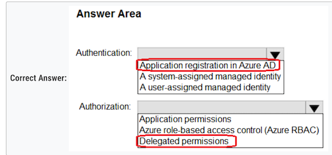

**Important point here is that both apps are deployed to the same machines. So Managed identitied will violate the principle of least privelege. As a
user/system managed identity will have to be assigned both read and write permission to user's calendar.**

- App registeration will provide ability to use the service principal per app to set the correct permission required for the app.
- **Use delegated permissions to access user's data as admin allowed/forces users to delegate the permission to the app**.

- **Authentication: Application registration in Azure AD**
- Authorization: Azure role-based access control (Azure RBAC) for least privilege and minimal administrative effort.

#### Question 39

You have an Azure AD tenant that contains a management group named MG1.

You have the Azure subscriptions shown in the following table.

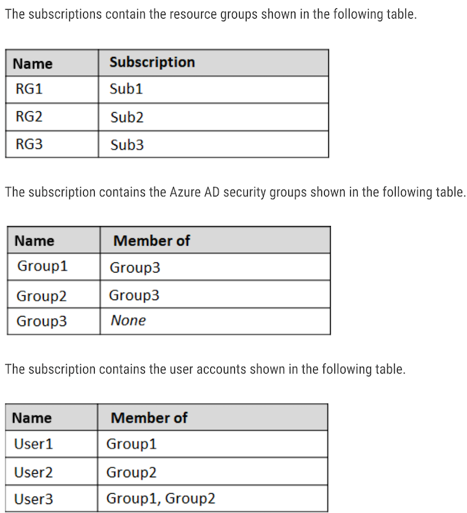

- Assign User3 the Contributor role for Sub1.
- **Assign Group1 the Virtual Machine Contributor role for MG1**.
- Assign Group3 the Contributor role for the Tenant Root Group.

For each of the following statements, select Yes if the statement is true. Otherwise, select No.

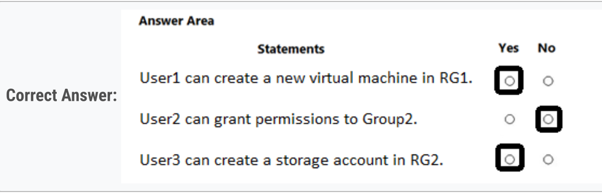

- **Since Group 1 is assigned VM contributor to MG1, it will be able to create a new VM in RG1**.
- User 2 is not able to grant permission to Group 2 because it is just a member with contributor role.
- **Since Group 3 has Contributor role for the Tenant Root Group, User3 can create storage account in RG2**

#### Question 40

You have an Azure subscription that contains 1,000 resources.

You need to generate compliance reports for the subscription. **The solution must ensure that the resources can be grouped by department.**

What should you use to organize the resources?

- [ ] A. application groups and quotas
- [X] B. **Azure Policy and tags**  ✅
- [ ] C. administrative units and Azure Lighthouse
- [ ] D. resource groups and role assignments

To organize the resources in your Azure subscription and generate compliance reports, you should use Azure Policy and tags.

#### Question 41

You have an Azure AD tenant that contains an administrative unit named MarketingAU. MarketingAU contains 100 users.

You create two users named User1 and User2.

You need to ensure that the users can perform the following actions in MarketingAU:

- User1 must be able to create user accounts.
- User2 must be able to reset user passwords.

Which role should you assign to each user? To answer, drag the appropriate roles to the correct users. Each role may be used once, more than
once, or not at all. You may need to drag the split bar between panes or scroll to view content.

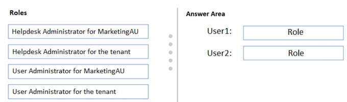

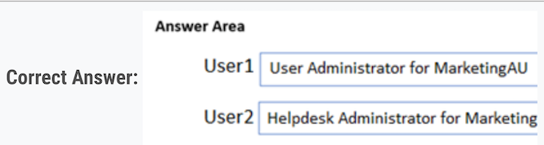

The roles that you need to assign are:

- User1: User Administrator for the MarketingAU administrative unit.   ✅
- User2: Password Administrator or Helpdesk Administrator for the MarketingAU administrative unit.   ✅

**The User Administrator role provides permissions to manage user accounts, including creating new users.** 

**The Password Administrator and Helpdesk Administrator roles provide permissions to reset user passwords.**

- Therefore **User1 needs the User Administrator role for the MarketingAU administrative unit to be able to create new user accounts**. 
- **User2 needs either the Password Administrator or Helpdesk Administrator role for the MarketingAU administrative unit to be able to reset user passwords**.

**Note that assigning Helpdesk Administrator for the tenant role to User2 would provide permissions to reset passwords for all users in the Azure AD tenant,** not just in the MarketingAU administrative unit.

#### Question 42

You are designing an app that will be hosted on Azure virtual machines that run Ubuntu. **The app will use a third-party email service to send email messages to users. The third-party email service requires that the app authenticate by using an API key.**

You need to recommend an Azure Key Vault solution for storing and accessing the API key. The solution must minimize administrative effort.

What should you recommend using to store and access the key? To answer, select the appropriate options in the answer area.

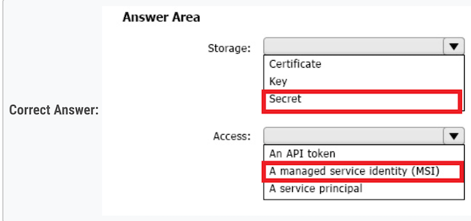

**1. Storage: c. Secret.**

API keys are typically stored as secrets in Azure Key Vault. 

The key vault can store and manage secrets like API keys, passwords, or database connection strings.

**2. Access: b. A managed service identity (MSI)**.

**A managed service identity (MSI) is used to give your VM access to the key vault.** 

**The advantage of using MSI is that you do not have to manage credentials yourself.**

Azure takes care of rolling the credentials and ensuring their lifecycle. 

The application running on your VM can use its managed service identity to get a token to Azure AD, and then use that token to authenticate to Azure Key Vault.

#### Question 43

You have two app registrations named App1 and App2 in Azure AD. App1 supports role-based access control (RBAC) and includes a role named Writer.

**You need to ensure that when App2 authenticates to access App1, the tokens issued by Azure AD include the Writer role claim.**

Which blade should you use to modify each app registration? 

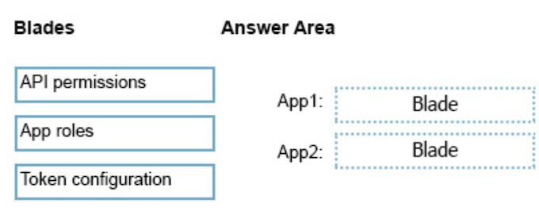

1. App1: B. **App roles**: This app is already configured with a custom role, which is defined under the "App Roles" section.
2. App2: C. **API Permissions**

To allow App 2 to authenticate to App1, it is necessary to assign the appropriate permissions. These can be configured under "API Permissions"

#### Question 44

You have an Azure subscription.

You plan to deploy a monitoring solution that will include the following:

- Azure Monitor Network Insights
- Application Insights
- Microsoft Sentinel
- VM insights

The monitoring solution will be managed by a single team.

What is the **minimum number of Azure Monitor workspaces** required?

- [X] A. **1**  ✅
- [ ] B. 2
- [ ] C. 3
- [ ] D. 4

**You can use a single workspace for all your data collection.** 

You can also create multiple workspaces based on requirements such as:

- The geographic location of the data.
- Access rights that define which users can access data.
- Configuration settings like pricing tiers and data retention.

#### Question 45

**Case Study**

**Overview**

Fabrikam, Inc. is an engineering company that has offices throughout Europe. The company has a main office in London and three branch offices in Amsterdam, Berlin, and Rome.

Existing Environment: Active Directory Environment

The network contains two Active Directory forests named corp.fabrikam.com and rd.fabrikam.com. There are no trust relationships between the forests.

Corp.fabrikam.com is a production forest that contains identities used for internal user and computer authentication.

Rd.fabrikam.com is used by the research and development (R&D) department only. The R&D department is restricted to using on-premises
resources only.

**Existing Environment: Network Infrastructure**

Each office contains at least one domain controller from the corp.fabrikam.com domain. The main office contains all the domain controllers for the rd.fabrikam.com forest.

All the offices have a high-speed connection to the internet.

An existing application named WebApp1 is hosted in the data center of the London office. 

WebApp1 is used by customers to place and track orders. WebApp1 has a web tier that uses Microsoft Internet Information Services (IIS) and a database tier that runs Microsoft SQL Server 2016. The web tier and the database tier are deployed to virtual machines that run on Hyper-V.

The IT department currently uses a separate Hyper-V environment to test updates to WebApp1

Fabrikam purchases all Microsoft licenses through a Microsoft Enterprise Agreement that includes Software Assurance.

**Existing Environment: Problem Statements**

The use of WebApp1 is unpredictable. At peak times, users often report delays. At other times, many resources for WebApp1 are underutilized.

**Requirements: Planned Changes**

Fabrikam plans to move most of its production workloads to Azure during the next few years, including virtual machines that rely on Active
Directory for authentication.

As one of its first projects, the company plans to establish a hybrid identity model, facilitating an upcoming Microsoft 365 deployment.
All R&D operations will remain on-premises.

Fabrikam plans to migrate the production and test instances of WebApp1 to Azure.

**Requirements: Technical Requirements**

Fabrikam identifies the following technical requirements:

- Website content must be easily updated from a single point.
- User input must be minimized when provisioning new web app instances.
- Whenever possible, existing on-premises licenses must be used to reduce cost.
- Users must always authenticate by using their corp.fabrikam.com UPN identity.
- Any new deployments to Azure must be redundant in case an Azure region fails.
- Whenever possible, solutions must be deployed to Azure by using the Standard pricing tier of Azure App Service.
- An email distribution group named IT Support must be notified of any issues relating to the directory synchronization services.
- In the event that a link fails between Azure and the on-premises network, ensure that the virtual machines hosted in Azure can authenticate to Active Directory.
- Directory synchronization between Azure Active Directory (Azure AD) and corp.fabrikam.com must not be affected by a link failure between Azure and the on-premises network.

**Requirements: Database Requirements**

Fabrikam identifies the following database requirements:

- Database metrics for the production instance of WebApp1 must be available for analysis so that database administrators can optimize the performance settings.
- To avoid disrupting customer access, database downtime must be minimized when databases are migrated.
- Database backups must be retained for a minimum of seven years to meet compliance requirements.

**Requirements: Security Requirements**

Fabrikam identifies the following security requirements:

- Company information including policies, templates, and data must be inaccessible to anyone outside the company.
- **Users on the on-premises network must be able to authenticate to corp.fabrikam.com if an internet link fails**.
- **Administrators must be able authenticate to the Azure portal by using their corp.fabrikam.com credentials.**
- All administrative access to the Azure portal must be secured by using multi-factor authentication (MFA).
- **The testing of WebApp1 updates must not be visible to anyone outside the company.**

To meet the authentication requirements of Fabrikam, what should you include in the solution? To answer, select the appropriate options in the answer area.

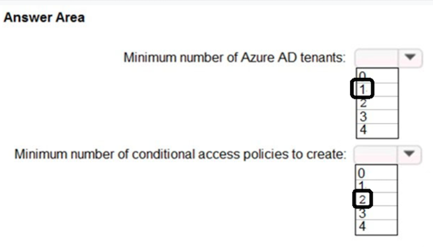

1. AAD now Microsoft Entra ID
2. Conditional access policies :

- Conditional Access Policy for Admin Access to the Azure Portal
- Conditional Access Policy for Testing WebApp1 Updates

**All administrative access to the Azure portal must be secured by using multi-factor authentication (MFA)**.

**The testing of WebApp1 updates must not be visible to anyone outside the company.**

#### Question 46

You have an Azure subscription that contains 10 web apps. The apps are integrated with Azure AD and are accessed by users on different project teams.

The users frequently move between projects.

You need to recommend an access management solution for the web apps. The solution must meet the following requirements:

- The users must only have access to the app of the project to which they are assigned currently.
- Project managers must verify which users have access to their project’s app and remove users that are no longer assigned to their project.
- Once every 30 days, the project managers must be prompted automatically to verify which users are assigned to their projects.

What should you include in the recommendation?

- [ ] A. Azure AD Identity Protection
- [ ] B. Microsoft Defender for Identity
- [ ] C. Microsoft Entra Permissions Management
- [X] D. **Azure AD Identity Governance**   ✅

**Azure AD Identity Governance.** ✅

<mark>This is an updated version, in the old questions the right answers was "Access Review” , but this options is not available here</mark>

Azure AD Identity Governance provides a comprehensive solution for managing identity and access lifecycle, ensuring that access is granted in line
with the principle of least privilege and is revoked when no longer needed1. It allows project managers to verify which users have access to their
project’s app and remove users that are no longer assigned to their project.

#### Question 47

You have an Azure subscription that contains 50 Azure SQL databases.

**You create an Azure Resource Manager (ARM) template named Template1 that enables Transparent Data Encryption (TDE).**

You need to create an Azure Policy definition named Policy1 that will use Template1 to enable TDE for any noncompliant Azure SQL databases.

**How should you configure Policy1?** To answer, select the appropriate options in the answer area.

NOTE: Each correct selection is worth one point.

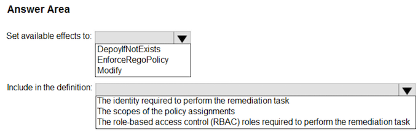

**Set available effects to:**

**Box 1: DeployIfNotExists**

- **DeployIfNotExists policy definition executes a template deployment when the condition is met. Policy assignments with effect set as**
- DeployIfNotExists require a managed identity to do remediation.

**Include in the definition:**

**Box 2: The role-based access control (RABC) roles required to perform the remediation task**

- The question is what you have to "Include in the definition:" of the policy.
- Refer to list of DeployIfNotExists properties, among them is roleDefinitionIds (required) - This property must include an array of strings that match role-based access control role ID accessible by the subscription.

#### Question 48

You have an Azure subscription. 

The subscription contains a tiered app named App1 that is distributed across multiple containers hosted in Azure Container Instances.

**You need to deploy an Azure Monitor monitoring solution for App**. The solution must meet the following requirements:

- Support using synthetic transaction monitoring to monitor traffic between the App1 components.
- Minimize development effort.

What should you include in the solution?

- [ ] A. Network insights
- [X] B. Application Insights
- [ ] C. Container insights
- [ ] D. Log Analytics Workspace insights

#### Question 49

You have an Azure subscription that contains the resources shown in the following table:

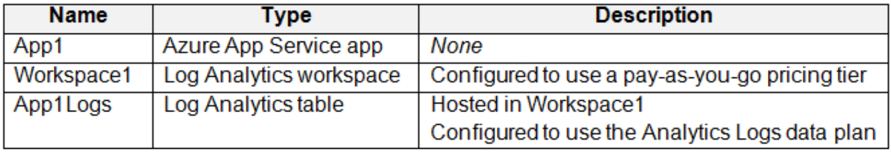

Log files from App1 are registered to App1Logs. An average of 120 GB of log data is ingested per day.

You configure an Azure Monitor alert that will be triggered if the App1 logs contain error messages.

You need to minimize the Log Analytics costs associated with App1. The solution must meet the following requirements:

- **Ensure that all the log files from App1 are ingested to App1Logs.**
- **Minimize the impact on the Azure Monitor alert**.

Which resource should you modify, and which modification should you perform? To answer, select the appropriate options in the answer area.

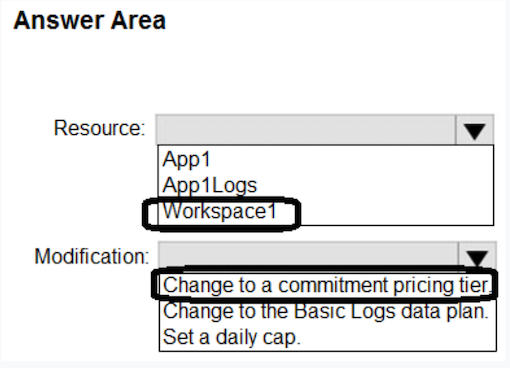

"In addition to the pay-as-you-go model, **Log Analytics has commitment tiers, which can save you as much as 30 percent compared to the pay-as-you-go price**. 

With commitment tier pricing, you can commit to buy data ingestion for a workspace, starting at 100 GB per day, at a lower price than pay-as-you-go pricing."

**Since you have an average of 120GB of log data per day, to minimize costs and impact you should to change the "Workspace1" plan from "pay-as-you-go" to "commitment pricing tier**";

the "commitment pricing tier" is good starting at 100GB per day of logs.

#### Question 50

You have **12 Azure subscriptions and three projects**. Each project uses resources across multiple subscriptions.

You need to use Microsoft Cost Management to monitor costs on a per project basis. The solution must minimize administrative effort.

Which two components should you include in the solution? Each correct answer presents part of the solution.

NOTE: Each correct selection is worth one point.

- [x] A. **budgets**  ✅
- [X] B. **resource tags**  ✅
- [ ] C. custom role-based access control (RBAC) roles
- [ ] D. management groups
- [ ] E. Azure boards

**We first create tags on the resources per project, afterwards we create a budget for monitoring the costs.**

#### Question 51

You have an Azure subscription that contains multiple storage accounts.

You assign Azure Policy definitions to the storage accounts.

You need to recommend a solution to meet the following requirements:

- Trigger on-demand Azure Policy compliance scans.
- **Raise Azure Monitor non-compliance alerts by querying logs collected by Log Analytics.**

What should you recommend for each requirement? To answer, select the appropriate options in the answer area.

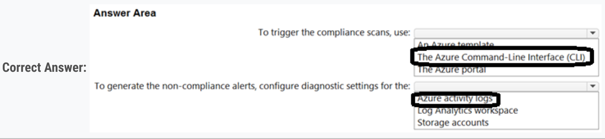

**box1: CLI is correct.** 

**box2: I first set the diagnostic setting on activity log so that all policy related messages are sent to log analytic workspace.**

And then on log analytic workspace setup alert rules that send alert whenever non-informative messages are found. Simply speaking, diagnostic setting is on activity log, alert rule setup is on log analytic workspace

#### Question 52

You have an Azure subscription.

You plan to deploy five storage accounts that will store block blobs and five storage accounts that will host file shares. The file shares will be
accessed by using the SMB protocol

You need to recommend an access authorization solution for the storage accounts. The solution must meet the following requirements:

- Maximize security.
- Prevent the use of shared keys.
- Whenever possible, support time-limited access.

What should you include in the solution? To answer, select the appropriate options in the answer area.

**1. For the blobs - a user delegation SAS only**

To maximize security it's better to use a user delegation SAS:

From docs: As a security best practice, **we recommend that you use Azure AD credentials when possible**, rather than the account key, which can be more easily compromised. When your application design requires shared access signatures, use Azure AD credentials to create a user delegation SAS to help ensure better security.

This also prevents using shared keys & supports time-limited access. Note: user delegation SAS do not support stored access policies.

**2. For the file shares - Azure AD credentials**

It fulfills the requirement to maximize security (the most secure way recommended by Microsoft), but doesn't support time-limited access, which is
optional and has lower priority than security.

#### Question 53

You have an Azure subscription. The subscription contains 100 virtual machines that run Windows Server 2022 and have the Azure Monitor Agent installed.

You need to recommend a solution that meets the following requirements:

- Forwards JSON-formatted logs from the virtual machines to a Log Analytics workspace
- Transforms the logs and stores the data in a table in the Log Analytics workspace

What should you include in the recommendation? To answer, select the appropriate options in the answer area.

NOTE: Each correct selection is worth one point

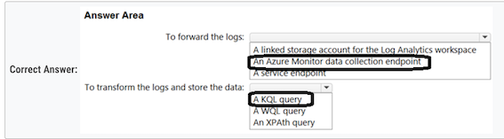

- **Box1 - Azure Monitor Data collection**  ✅
- **Box2 - KQL**    ✅

For those arguing XPATH over KQL, as far as I can tell, XPATH can only filter (not transform) event log data that is sent to a Log Analytics
workspace. 

KQL, on the other hand, can be used for ingestion-time transformations that allow for filtering or modification of incoming data
before it's stored in a Log Analytics workspace.
**So Box 2 should indeed be KQL**.

#### Question 54

You have have Azure subscriptions. Each subscription is linked to a separate Azure AD tenant and contains virtual machines that run Windows Server 2022. 

You plan to collect Windows security events from the virtual machines and send them to a single Log Analytics workspace. 

You need to recommend a solution that meets the following requirements: 

- Collects event logs from multiple subscriptions 
- Supports the use of data collection rules (DCRs) to define  which events to collect 

What should you recommend for each requirement? To answer, select the appropriate options in the answer area.

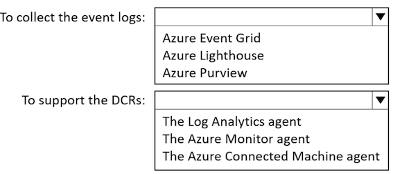

**To collect the event logs:**

1. **Azure Lighthouse**:  To send data across tenants, you must first enable Azure Lighthouse 
2. **Azure Monitor Agent**

### Topic 2 - Question Set 2

#### Question 1

You have 100 servers that run Windows Server 2012 R2 and host Microsoft SQL Server 2014 instances. The instances host databases that have
the following characteristics:

- ✑ Stored procedures are implemented by using CLR.
- ✑ The largest database is currently 3 TB. None of the databases will ever exceed 4 TB.

You plan to move all the data from SQL Server to Azure.

You need to recommend a service to host the databases. The solution must meet the following requirements:

- ✑ Whenever possible, minimize management overhead for the migrated databases.
- ✑ Ensure that users can authenticate by using Azure Active Directory (Azure AD) credentials.
- ✑ Minimize the number of database changes required to facilitate the migration.

What should you include in the recommendation?

- [ ] A. Azure SQL Database elastic pools
- [X] B. **Azure SQL Managed Instance**  ✅
- [ ] C. Azure SQL Database single databases
- [ ] D. SQL Server 2016 on Azure virtual machines

**SQL Managed Instance allows existing SQL Server customers to lift and shift their on-premises applications to the cloud with minimal application and database changes.**

At the same time, SQL Managed Instance preserves all PaaS capabilities (automatic patching and version updates, automated backups, high availability) that drastically reduce management overhead and TCO

CLR is supported on SQL Managed instance and not on Azure SQL Database.

- Azure SQL Managed Instance
- Common language runtime - CLR

#### Question 2

You have an Azure subscription that contains an Azure Blob Storage account named store1.

You have an on-premises file server named Server1 that runs Windows Server 2016. Server1 stores 500 GB of company files.

**You need to store a copy of the company files from Server1 in store1.**

Which two possible Azure services achieve this goal? Each correct answer presents a complete solution.

NOTE: Each correct selection is worth one point.

- [ ] A. an Azure Logic Apps integration account
- [X] B. **an Azure Import/Export job**   ✅
- [X] C. **Azure Data Factory**        ✅
- [ ] D. an Azure Analysis services On-premises data gateway
- [ ] E. an Azure Batch account

B: **You can use the Azure Import/Export service to securely export large amounts of data from Azure Blob storage**. 

The service requires you to ship empty drives to the Azure datacenter. The service exports data from your storage account to the drives and then ships the drives back.

C: Big data requires a service that can orchestrate and operationalize processes to refine these enormous stores of raw data into actionable business insights.

**Azure Data Factory is a managed cloud service that's built for these complex hybrid extract-transform-load (ETL), extract-load-transform (ELT) ,and data integration projects.**

#### Question 3

You have an Azure subscription that contains two applications named App1 and App2. App1 is a sales processing application. When a transaction
in App1 requires shipping, a message is added to an Azure Storage account queue, and then App2 listens to the queue for relevant transactions.

In the future, **additional applications will be added that will process some of the shipping requests based on the specific details of the transaction**s.

**You need to recommend a replacement for the storage account queue to ensure that each additional application will be able to read the relevant transactions.**

What should you recommend?

- [ ] A. one Azure Data Factory pipeline
- [ ] B. multiple storage account queues
- [ ] C. one Azure Service Bus queue
- [X] D. **one Azure Service Bus topic**  ✅

---

- **A queue allows processing of a message by a single consumer**. 
- **In contrast to queues, topics and subscriptions provide a one-to-many form of communication in a publish and subscribe pattern**. 
	- It's useful for scaling to large numbers of recipients. 

Each published message is made available to each subscription registered with the topic. 

**Publisher sends a message to a topic and one or more subscribers receive a copy of the message, depending on fillter rules set on these subscriptions.**

#### Question 4

You need to design a storage solution for an app that will store large amounts of frequently used data. The solution must meet the following
requirements:

- ✑ Maximize data throughput.
- ✑ Prevent the modification of data for one year.
- ✑ Minimize latency for read and write operations.

Which Azure Storage account type and storage service should you recommend? To answer, select the appropriate options in the answer area.
NOTE: Each correct selection is worth one point.

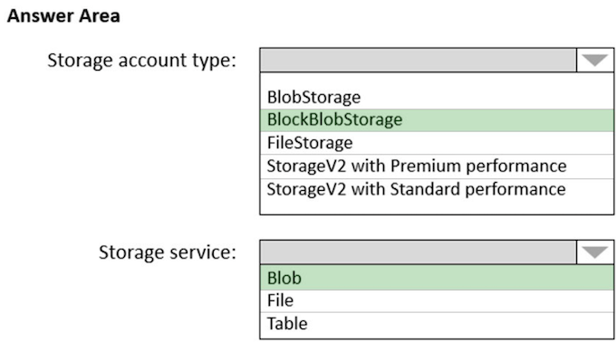

Box 1: **BlockBlobStorage** -   ✅

Block Blob is a premium storage account type for block blobs and append blobs. **Recommended for scenarios with high transactions rates, or scenarios that use smaller objects or require consistently low storage latency**.

Box 2: Blob -  ✅

The Archive tier is an online tier for storing blob data that is rarely accessed. **The Archive tier offers the lowest storage costs, but higher data retrieval costs and latency compared to the online tiers (Hot and Cool)**. Data must remain in the Archive tier for at least 180 days or be subject to an early deletion charge.

* **BlockBlobStorage provide a very low latency(x40) (Read and Write) and Throughput (x5)**
*  **One big file is splitted in "blobs" that are processed in parallel (for read and write)**

#### Question 5

You have an Azure subscription that contains the storage accounts shown in the following table.

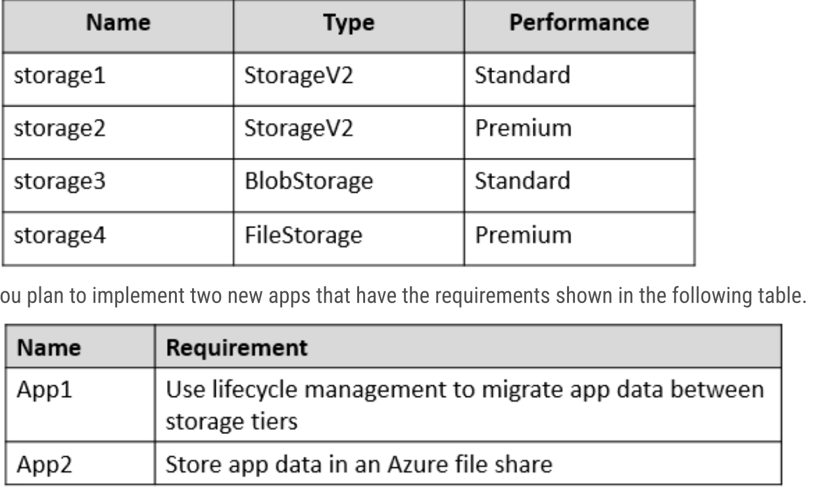

Which storage accounts should you recommend using for each app? To answer, select the appropriate options in the answer area.

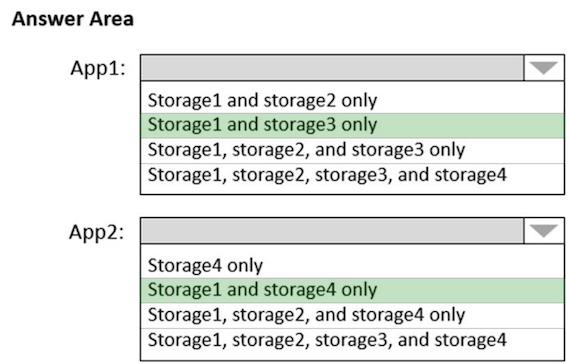

**Box 1: Storage1 and storage3 only**

Need to use Standard accounts.

**Data stored in a premium block blob storage account cannot be tiered to hot, cool, or archive using Set Blob Tier or using Azure Blob Storage lifecycle management**

**Box 2: Storage1 and storage4 only**

Azure File shares requires Premium accounts. Only Storage1 and storage4 are premium.

- GENERATION V1 ==> CANNOT HAVE LIFECYCLE
- GENERATION V2 => CAN HAVE LIFECYCLE
- **PREMIUM FILE STORAGE ==> CANNOT HAVE LIFECYCLE**
- PREMIUM BLOG ==> CANNOT HAVE LIFECYCLE (FYI - I TESTED THESE) . MORE OF FYI

**<mark>STANDARD ==> LIFE CYCLE YES (STORAGE 1 AND STORAGE 3)</mark>**

APPS DATA - STORAGE 1 AND 4

App1-

- storage 1-StorageV2-Standard
- storage 3-BlobStorage-Standard

App2

- storage 1-StorageV2-Standard
- storage 4-FileStorage-Premium

#### Question 6

You are designing an application that will be hosted in Azure.

The application will host video files that range from 50 MB to 12 GB. The application will use certificate-based authentication and will be available to users on the internet.

You need to recommend a storage option for the video files. The solution must provide the fastest read performance and must minimize storage
costs.

What should you recommend?

- [ ] A. Azure Files
- [ ] B. Azure Data Lake Storage Gen2
- [X] C. **Azure Blob Storage**
- [ ] D. Azure SQL Database   

Blob Storage: Stores large amounts of unstructured data, such as text or binary data, that can be accessed from anywhere in the world via HTTP or HTTPS. You can use Blob storage to expose data publicly to the world, or to store application data privately.

**Max file in Blob Storage. 4.77 TB.**

Azure Blob storage is Microsoft's object storage solution for the cloud. Blob storage is optimized for storing massive amounts of unstructured data, such as text or binary data

Blob storage is ideal for:

- Serving images or documents directly to a browser.
- Storing files for distributed access.
- Streaming video and audio.
- Storing data for backup and restore, disaster recovery, and archiving.
- Storing data for analysis by an on-premises or Azure-hosted service.
- Objects in Blob storage can be accessed from anywhere in the world via HTTP or HTTPS. Users or client applications can access blobs via URLs, the
- Azure Storage REST API, Azure PowerShell, Azure CLI, or an Azure Storage client library

#### Question 7

You are designing a SQL database solution. **The solution will include 20 databases that will be 20 GB each and have varying usage patterns**.
You need to recommend a database platform to host the databases. The solution must meet the following requirements:

- ✑ The solution must meet a Service Level Agreement (SLA) of 99.99% uptime.
- ✑ The compute resources allocated to the databases must scale dynamically.
- ✑ The solution must have reserved capacity.

Compute charges must be minimized.

What should you include in the recommendation?

- [X] A. **an elastic pool that contains 20 Azure SQL databases**  ✅
- [ ] B. 20 databases on a Microsoft SQL server that runs on an Azure virtual machine in an availability set
- [ ] C. 20 databases on a Microsoft SQL server that runs on an Azure virtual machine
- [ ] D. 20 instances of Azure SQL Database serverless

The compute and storage redundancy is built in for business critical databases and elastic pools, with a SLA of 99.99%.

Reserved capacity provides you with the flexibility to temporarily move your hot databases in and out of elastic pools (within the same region
and performance tier) as part of your normal operations without losing the reserved capacity benefit.

**Databases vary in usage so an elastic pool would fit best.**

**A. an elastic pool that contains 20 Azure SQL databases**

**Elastic pools in Azure SQL Database are designed to handle multiple databases with varying usage patterns within a shared resource pool.** This option meets the following requirements:

- SLA of 99.99% uptime: Azure SQL Database provides an SLA of 99.99% uptime, ensuring high availability for your databases.
- **Dynamic scaling of compute resources: Elastic pools allow you to allocate resources dynamically, adjusting to the varying usage patterns of your databases**.
- Reserved capacity: Elastic pools enable you to reserve capacity for multiple databases within the pool, ensuring resources are available when needed.
- Minimize compute charges: By sharing resources among the databases within the elastic pool, you can minimize compute charges while still meeting the performance requirements.

#### Question 8

You have an on-premises database that you plan to migrate to Azure.

You need to design the database architecture to meet the following requirements:

- ✑ Support scaling up and down.
- ✑ Support geo-redundant backups.
- ✑ Support a database of up to 75 TB.
- ✑ **Be optimized for online transaction processing (OLTP)**.

What should you include in the design? To answer, select the appropriate options in the answer area.

NOTE: Each correct selection is worth one point.

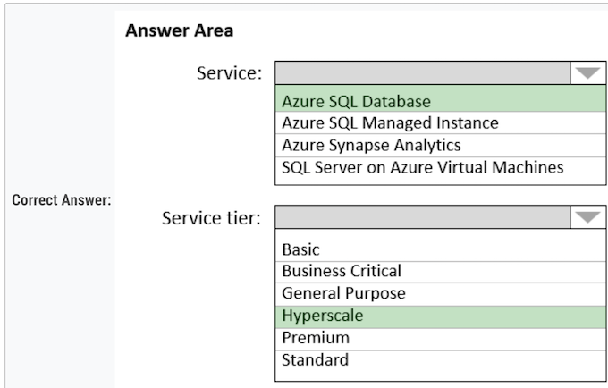

**Box 1: Azure SQL Database -**

Azure SQL Database:

- **Database size always depends on the underlying service tiers (e.g. Basic, Business Critical, Hyperscale)**.
- **It supports databases of up to 100 TB with Hyperscale service tier model**.
- Active geo-replication is a feature that lets you to create a continuously synchronized readable secondary database for a primary database. The readable secondary database may be in the same Azure region as the primary, or, more commonly, in a different region. This kind of readable
- secondary databases are also known as geo-secondaries, or geo-replicas.
- Azure SQL Database and SQL Managed Instance enable you to dynamically add more resources to your database with minimal downtime.

**Box 2: Hyperscale** -

**The key is that only Hyperscale can deal with 75 Tb, All other have limit of 4 Tb**

#### Question 9

You are planning an Azure IoT Hub solution that will include 50,000 IoT devices.

Each device will stream data, including temperature, device ID, and time data. Approximately 50,000 records will be written every second. The data will be visualized in near real time.

**You need to recommend a service to store and query the data.**

Which two services can you recommend? Each correct answer presents a complete solution.

NOTE: Each correct selection is worth one point.

- [ ] A. Azure Table Storage
- [ ] B. Azure Event Grid
- [X] C. **Azure Cosmos DB SQL API**  ✅
- [X] D. **Azure Time Series Insights**  ✅

D: **Time Series Insights is a fully managed service for time series data**. In this architecture, Time Series Insights performs the roles of stream processing, data store, and analytics and reporting. It accepts streaming data from either IoT Hub or Event Hubs and stores, processes, analyzes, and displays the data in near real time.

C: **The processed data is stored in an analytical data store, such as Azure Data Explorer, HBase, Azure Cosmos DB, Azure Data Lake, or Blob Storage.**

C and D are correect:

Need to find a service to store and query the data.

- A. **Azure Table Storage: You can't query data**.
- B. **Azure Event Grid: You can't store or query data**.
- C. Azure Cosmos DB SQL API: You can store and query data.   ✅
- D. Azure Time Series Insights: You can store and query data. ✅

#### Question 10

**You are designing an application that will aggregate content for users**.

You need to recommend a database solution for the application. The solution must meet the following requirements:

- ✑ Support SQL commands.
- ✑ Support multi-master writes.
- ✑ Guarantee low latency read operations.

What should you include in the recommendation?

- [X] **A. Azure Cosmos DB SQL API** ✅
- [ ] B. Azure SQL Database that uses active geo-replication
- [ ] C. Azure SQL Database Hyperscale
- [ ] D. Azure Database for PostgreSQL

**With Cosmos DB's novel multi-region (multi-master) writes replication protocol, every region supports both writes and reads.** The multi-region writes capability also enables:

- Unlimited elastic write and read scalability.
- 99.999% read and write availability all around the world.
- Guaranteed reads and writes served in less than 10 milliseconds at the 99th percentile.

**A. Azure Cosmos DB SQL API**

**Azure Cosmos DB is a globally distributed, multi-model database service. It offers turnkey global distribution, automatically replicating your data to any number of Azure regions so you can achieve low latency access from anywhere in the world.**

Cosmos DB supports various APIs for data access including SQL (Core) API, which uses SQL commands. It provides multi-master support, which allows you to perform writes on any of your replicas and replicate data across all of them for high availability. So it will cover your requirement of supporting multi-master writes.

In terms of guaranteeing low latency read operations, Azure Cosmos DB offers <10 ms latencies at the 99th percentile for reads and writes, which would serve your need of low latency reads

#### Question 11

You have an **Azure subscription that contains the SQL servers** on Azure shown in the following table.

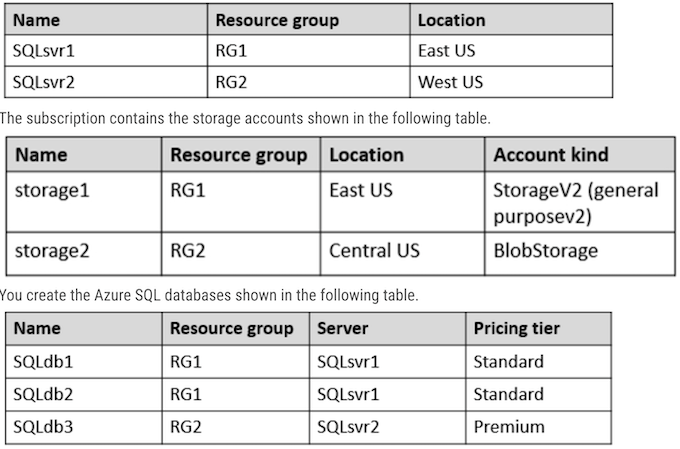

For each of the following statements, select Yes if the statement is true. Otherwise, select No.

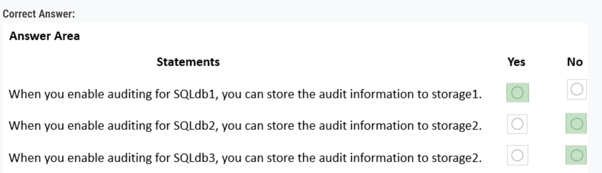

- Box 1: Yes - Auditing works fine for a Standard account.
- Box 2: No - **Auditing limitations: Premium storage is currently not supported**.
- Box 3: No - **Auditing limitations: Premium storage is currently not supported**.

Auditing limitations Premium storage is currently not supported

#### Question 12

You plan to import data from your on-premises environment to Azure. The data is shown in the following table.

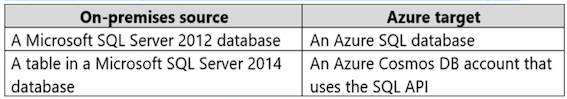

**What should you recommend using to migrate the data? To answer, drag the appropriate tools to the correct data sources.** 

Each tool may be used once, more than once, or not at all. You may need to drag the split bar between panes or scroll to view content.

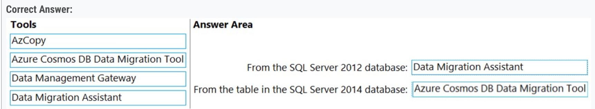

**Box 1: Data Migration Assistant -**  ✅

**The Data Migration Assistant (DMA) helps you upgrade to a modern data platform by detecting compatibility issues that can impact database functionality in your new version of SQL Server or Azure SQL Database.**

DMA recommends performance and reliability improvements for your
target environment and allows you to move your schema, data, and uncontained objects from your source server to your target server.

> Incorrect: AzCopy is a command-line utility that you can use to copy blobs or files to or from a storage account.

**Box 2: Azure Cosmos DB Data Migration Tool**

**Azure Cosmos DB Data Migration Tool can used to migrate a SQL Server Database table to Azure Cosmos.**

- Azure Cosmos DB for NoSQL
- Azure Cosmos DB for MongoDB
- Azure Cosmos DB for PostgreSQL
- Azure Cosmos DB for Cassandra
- Azure Cosmos DB for Gremlin
- Azure Cosmos DB for Table

#### Question 13

You store web access logs data in Azure Blob Storage.

You plan to generate monthly reports from the access logs.

**You need to recommend an automated process to upload the data to Azure SQL Database every month.**

What should you include in the recommendation?

- [ ] A. Microsoft SQL Server Migration Assistant (SSMA)
- [ ] B. Data Migration Assistant (DMA)
- [ ] C. AzCopy
- [X]  D. **Azure Data Factory**  ✅

**You can create Data Factory pipelines that copies data from Azure Blob Storage to Azure SQL Database.** 

The configuration pattern applies to copying from a file- based data store to a relational data store.

Required steps:

- Create a data factory.
- **Create Azure Storage and Azure SQL Database linked services**.
- Create Azure Blob and Azure SQL Database datasets.
- Create a pipeline contains a Copy activity.
- Start a pipeline run.
- Monitor the pipeline and activity runs.

#### Question 14

You have an Azure subscription.

Your on-premises network contains a file server named Server1. Server1 stores 5 of company files that are accessed rarely.

**You plan to copy the files to Azure Storage.**

You need to implement a storage solution for the files that meets the following requirements:

- ✑ The files must be available within 24 hours of being requested.
- ✑ **Storage costs must be minimized.**

Which two possible storage solutions achieve this goal? Each correct answer presents a complete solution.

NOTE: Each correct selection is worth one point.

- [X] A. **Create an Azure Blob Storage account that is configured for the Cool default access tier. Create a blob container, copy the files to the blob container, and set each file to the Archive access tier**.   ✅ 
- [ ] B. Create a general-purpose v1 storage account. Create a blob container and copy the files to the blob container.
- [ ] C. Create a general-purpose v2 storage account that is configured for the Cool default access tier. Create a file share in the storage account and copy the files to the file share.
- [X] D. **Create a general-purpose v2 storage account that is configured for the Hot default access tier. Create a blob container, copy the files to the blob container, and set each file to the Archive access tier**.   ✅
- [ ] E. Create a general-purpose v1 storage account. Create a file share in the storage account and copy the files to the file share.

To minimize costs: **The Archive tier is optimized for storing data that is rarely accessed and stored for at least 180 days with flexible latency requirements (on the order of hours).**

The available access tiers include:

- Hot: Optimized for storing data that is accessed frequently.
- Cool: Optimized for storing data that is infrequently accessed and stored for at least 30 days.
- Archive: Optimized for storing data that is rarely accessed and stored for at least 180 days with flexible latency requirements (on the order of
hours).

Since the files are accessed rarely and you need to minimize storage costs, **the Archive tier is appropriate. Both A and D suggest setting the files to the Archive access tier.**

Please note that Archive tier data is offline and it takes time to rehydrate data to an online tier if/when access is needed, but it satisfies your
requirement of the files being available within 24 hours of being requested. In addition, creating an Azure Blob Storage or general-purpose v2
storage account allows you to utilize these access tiers, as they are not available in the general-purpose v1 accounts.

#### Question 15

You have an app named App1 that uses two on-premises Microsoft SQL Server databases named DB1 and DB2.
You plan to migrate DB1 and DB2 to Azure

You need to recommend an Azure solution to host DB1 and DB2. The solution must meet the following requirements:

- ✑ Support server-side transactions across DB1 and DB2.
- ✑ Minimize administrative effort to update the solution.

What should you recommend?

- [ ] A. two Azure SQL databases in an elastic pool
- [X] B. **two databases on the same Azure SQL managed instance**    ✅
- [ ] C. two databases on the same SQL Server instance on an Azure virtual machine
- [ ] D. two Azure SQL databases on different Azure SQL Database servers

Elastic database transactions for Azure SQL Database and Azure SQL Managed Instance allow you to run transactions that span several databases.

SQL Managed Instance enables system administrators to spend less time on administrative tasks because the service either performs them for you or greatly simplifies those tasks

A server-side distributed transactions using Transact-SQL are available only for Azure SQL Managed Instance. Distributed transaction can be
executed only between Managed Instances that belong to the same Server trust group. In this scenario, Managed Instances need to use linked
server to reference each other

#### Question 16

You need to design a highly available Azure SQL database that meets the following requirements:

- ✑ Failover between replicas of the database must occur without any data loss.
- ✑ **The database must remain available in the event of a zone outage**.
- ✑ Costs must be minimized.

Which deployment option should you use?

- [ ] A. Azure SQL Database Hyperscale
- [X] B. **Azure SQL Database Premium** ✅
- [ ] C. Azure SQL Database Basic
- [ ] D. Azure SQL Managed Instance General Purpose

**Premium > Serverless > Business Critical**

**Azure SQL Database Premium tier supports multiple redundant replicas for each database that are automatically provisioned in the same datacenter within a region.** 

This design leverages the SQL Server AlwaysON technology and provides resilience to server failures with 99.99% availability SLA and RPO=0.

With the introduction of Azure Availability Zones, we are happy to announce that SQL Database now offers built-in support of Availability Zones
in its Premium service tier.

**Incorrect:**

- **Not A: Hyperscale is more expensive than Premium.**
- Not C: Need Premium for Availability Zones.
- **Not D: Zone redundant configuration that is free on Azure SQL Premium is not available on Azure SQL Managed Instance.**

**B. Azure SQL Database Premium**

To meet the requirements of a highly available Azure SQL database with no data loss during failover and availability during a zone outage, you
should use Azure SQL Database Premium. The Premium tier provides built-in support for active geo-replication, which allows you to create
readable secondary replicas in different regions, ensuring the database remains available in the event of a zone outage. Additionally, the Premium
tier offers better performance and more resources compared to the Basic and General Purpose tiers, while Hyperscale, although highly scalable,
can be more costly than the Premium tier.

#### Question 17

You are planning an Azure Storage solution for sensitive data. The data will be accessed daily. The dataset is less than 10 GB.

You need to recommend a storage solution that meets the following requirements:

- ✑ All the data written to storage must be retained for five years.
- ✑ Once the data is written, the data can only be read. Modifications and deletion must be prevented.
- ✑ After five years, the data can be deleted, but never modified.
- ✑ **Data access charges must be minimized**.

What should you recommend? To answer, select the appropriate options in the answer area.

NOTE: Each correct selection is worth one point.

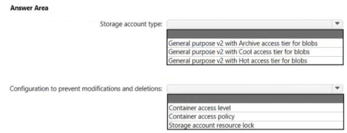

**Box 1: General purpose v2 with Hot access tier for blobs**

Note:

* All the data written to storage must be retained for five years.
* **Data access charges must be minimized**

**Hot tier has higher storage costs, but lower access and transaction costs.**

Incorrect:

- Not Archive: Lowest storage costs, but highest access, and transaction costs.
- Not Cool: Lower storage costs, but higher access and transaction costs.

**Box 1:**

Answer is container access (immutable) policy **at least at the container scope.**

**1. Storage Account type: c. GP v2 Hot.**

Considering the data will be accessed daily, the Hot access tier is the most cost-effective for storing frequently accessed data.

**Box 1:**

**2. Configuration to prevent the modification and deletions: Container access policy.**

**set the resources lock as read-only and delete prevention but can to for data, that is only for resources change not for in the data.**

The Container access policy is indeed the place to configure Azure's Immutable Blob Storage to ensure data is retained without modifications or
deletions for a specified amount of time, which suits your needs. The Azure Blob Storage's Immutable Blob Storage feature provides a WORM
(Write Once, Read Many) capability which aligns with your requirements perfectly.

#### Question 18

You are designing a data storage solution to support reporting.

The solution will ingest high volumes of data in the JSON format by using Azure Event Hubs. As the data arrives, Event Hubs will write the data to
storage. The solution must meet the following requirements:

- ✑ Organize data in directories by date and time.
- ✑ Allow stored data to be queried directly, transformed into summarized tables, and then stored in a data warehouse.
- ✑ Ensure that the data warehouse can store 50 TB of relational data and support between 200 and 300 concurrent read operations.

Which service should you recommend for each type of data store? To answer, select the appropriate options in the answer area.

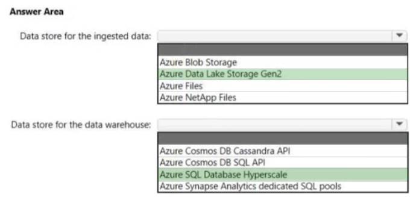

**Box 1: Azure Data Lake Storage Gen2**

Azure Data Explorer integrates with Azure Blob Storage and Azure Data Lake Storage (Gen1 and Gen2), providing fast, cached, and indexed
access to data stored in external storage. You can analyze and query data without prior ingestion into Azure Data Explorer. You can also query
across ingested and uningested external data simultaneously.

**Azure Data Lake Storage is optimized storage for big data analytics workloads.**

**Use cases: Batch, interactive, streaming analytics and machine learning data such as log files, IoT data, click streams, large datasets**

**Box 2: Azure SQL Database Hyperscale**

**Azure SQL Database Hyperscale is optimized for OLTP and high throughput analytics workloads with storage up to 100TB.**

A Hyperscale database supports up to 100 TB of data and provides high throughput and performance, as well as rapid scaling to adapt to the workload requirements. Connectivity, query processing, database engine features, etc. work like any other database in Azure SQL Database.

Hyperscale is a multi-tiered architecture with caching at multiple levels. Effective IOPS will depend on the workload.

1. Data store for the ingestion data: **b. Azure Data Lake Storage Gen2**.  ✅

**Azure Data Lake Storage Gen2 is designed for big data analytics, it combines the power of a high-performance file system with massive scale and
economy to help you speed up your big data analytics**. It allows the data to be organized in directories by date and time.

2. Data store for the data warehouse: **c. Azure SQL Database Hyperscale.**

**Azure SQL Database Hyperscale is a highly scalable service tier that is designed to provide high performance, and supports up to 100 TB of data.**
The Hyperscale service tier in Azure SQL Database is the newest service tier in the vCore-based purchasing model. This service tier is a highly
scalable storage and compute performance tier that leverages the Azure architecture to scale out the storage and compute resources for an Azure
SQL Database substantially beyond the limits available for the General Purpose and Business Critical service tiers.

#### Question 19

You have an app named App1 that uses an on-premises Microsoft SQL Server database named DB1.

You plan to migrate DB1 to an Azure SQL managed instance.

You need to enable customer managed Transparent Data Encryption (TDE) for the instance. **The solution must maximize encryption strength**.

Which type of encryption algorithm and key length should you use for the TDE protector?

- [X] A. **RSA 3072**   ✅
- [ ] B. AES 256
- [ ] C. RSA 4096
- [ ] D. RSA 2048

RSA 3072 provides a higher level of encryption strength compared to RSA 2048. **While RSA 4096 offers even stronger encryption, it is not
supported by Azure SQL Database and Azure SQL Managed Instance for TDE protectors.**

By choosing RSA 3072 for the TDE protector, you ensure strong encryption for your Azure SQL Managed Instance while complying with the
platform's requirements. This will help protect sensitive data and maintain compliance with relevant security standards and regulations

#### Question 20

You are planning an Azure IoT Hub solution that will include 50,000 IoT devices.

Each device will stream data, including temperature, device ID, and time data. Approximately 50,000 records will be written every second. The data
will be visualized in near real time.

You need to recommend a service to store and query the data.

Which two services can you recommend? Each correct answer presents a complete solution.

NOTE: Each correct selection is worth one point.

- [ ] A. Azure Table Storage
- [ ] B. Azure Event Grid
- [X] C. **Azure Cosmos DB for NoSQL**     ✅
- [X] D. **Azure Time Series Insights**     ✅

	- A. Azure Table Storage -> Throughput: scalability limit of 20,000 operations/s.

	- **B. Azure Event Grid -> It is only a broker, not a storage solution**

Therefore, C and D are right -> Not enough for this question

The Time Series Insights (TSI) service will no longer be supported after March 2025. Consider migrating existing TSI environments to alternative solutions (such as Azure Data Explorer) as soon as possible

Azure Data Explorer is a fast, fully managed data analytics service for real-time and time-series analysis on large volumes of data streams from business activities, human operations, applications, websites, Internet of Things (IoT) devices, and other source

- C. Azure Cosmos DB for NoSQL
- D. Azure Time Series Insights

#### Question 21

You are designing a data analytics solution that will use Azure Synapse and Azure Data Lake Storage Gen2.

You need to recommend Azure Synapse pools to meet the following requirements:

- Ingest data from Data Lake Storage into hash-distributed tables.
- Implement query, and update data in Delta Lake.

What should you recommend for each requirement? To answer, select the appropriate options in the answer area.

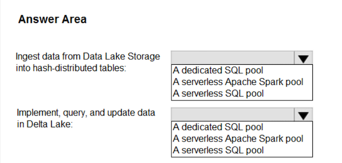

- **Dedicated SQL pool: It's best for big and complex tasks.**   ✅
- **SERVERLESS APACHE SPARK POOL**  ✅

1. **A dedicated SQL pool**

**A dedicated SQL pool in Azure Synapse provides the ability to create hash-distributed tables, which help distribute data evenly across multiple nodes and improve query performance.** This option is well-suited for ingesting data from Data Lake Storage into hash-distributed tables.

2. Implement query, and update data in Delta Lake:  =>  **A serverless Apache Spark pool**   ✅

A serverless Apache Spark pool in Azure Synapse allows you to run Apache Spark jobs on-demand without having to manage the underlying
infrastructure. This option is ideal for working with Delta Lake, as it provides native support for querying and updating data stored in Delta Lake
format.

**<mark>"Serverless SQL pools don't support updating Delta Lake files. You can use serverless SQL pool to query the latest version of Delta Lake. Use Apache Spark pools in Synapse Analytics to update Delta Lake.”</mark>**

#### Question 22

You have an on-premises storage solution.

You need to migrate the solution to Azure. The solution must support Hadoop Distributed File System (HDFS).

What should you use?

- [X] A. **Azure Data Lake Storage Gen2**  ✅
- [ ] B. Azure NetApp Files
- [ ] C. Azure Data Share
- [ ] D. Azure Table storage

**Azure Data Lake Storage Gen2: This is a fully managed, cloud-native data lake that supports the HDFS protocol.** It allows you to store and analyze
large amounts of data in its native format, without the need to move or transform the data.

**Azure Data Lake Storage Gen2 is the best choice for migrating your on-premises storage solution to Azure with support for Hadoop Distributed
File System (HDFS).**

It is a highly scalable and cost-effective storage service designed for big data analytics, providing integration with Azure
HDInsight, Azure Databricks, and other Azure services. It is built on Azure Blob Storage and combines the advantages of HDFS with Blob Storage,
offering a hierarchical file system, fine-grained security, and high-performance analytics.

#### Question 23

You have an on-premises app named App1.

Customers use App1 to manage digital images.

You plan to migrate App1 to Azure.

You need to recommend a data storage solution for App1. The solution must meet the following image storage requirements:

- Encrypt images at rest.
- Allow files up to 50 MB.
- Manage access to the images by using Azure Web Application Firewall (WAF) on Azure Front Door.

The solution must meet the following customer account requirements:

- Support automatic scale out of the storage.
- **Maintain the availability of App1 if a datacenter fails**.
- **Support reading and writing data from multiple Azure regions.**

Which service should you include in the recommendation for each type of data? To answer, drag the appropriate services to the correct type of
data. Each service may be used once, more than once, or not at all. You may need to drag the split bar between panes or scroll to view content.
NOTE: Each correct answer is worth one point.

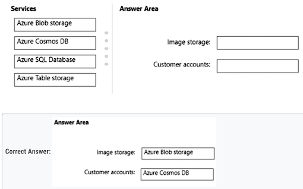

- Box 1 - **Azure blob storage** : The requirement to be accessible through a WAF limit the options to the Blob storage. ✅
- Box 2 - **Cosmos DB**:  Concurrent writes from multiple regions make this the only option.  ✅

Azure Blob Storage is a suitable choice for storing digital images, as it supports encryption at rest, handles large file sizes (up to 50 MB or even
larger), and can be used in conjunction with Azure Web Application Firewall (WAF) on Azure Front Door.

Azure Cosmos DB is a highly scalable, globally distributed, multi-model database service that supports automatic scale-out, ensures high
availability even in the event of a datacenter failure, and allows for reading and writing data from multiple Azure regions. This makes it an ideal choice for storing customer account data in your scenario.

#### Question 24

You are designing an application that will aggregate content for users.

You need to recommend a database solution for the application. The solution must meet the following requirements:

- Support SQL commands.
- **Support multi-master writes**.
- Guarantee low latency read operations.

What should you include in the recommendation?

- [X] A. **Azure Cosmos DB for NoSQL**  ✅
- [ ] B. Azure SQL Database that uses active geo-replication
- [ ] C. Azure SQL Database Hyperscale
- [ ] D. Azure Cosmos DB for PostgreSQL

- **cosmos for the multi writer**
- postgre is not good at reading

#### Question 25

You plan to migrate on-premises MySQL databases to Azure Database for MySQL Flexible Server.

**You need to recommend a solution for the Azure Database for MySQL Flexible Server configuration**. The solution must meet the following
requirements:

- The databases must be accessible if a datacenter fails.
- Costs must be minimized

Which compute tier should you recommend?

- [ ] A. Burstable
- [X] B. **General Purpose** ✅
- [ ] C. Memory Optimized

**High availability isn't supported in the burstable compute tier**.

**A. Burstable. It provides the lowest cost. Both Burstable and General Purpose provide Zone Redundancy**

The General Purpose compute tier provides a balance between performance and cost. It is suitable for most common workloads and offers a good
combination of CPU and memory resources. It provides high availability and fault tolerance by utilizing Azure's infrastructure across multiple
datacenters. This ensures that the databases remain accessible even if a datacenter fails.

The Burstable compute tier (option A) is designed for workloads with variable or unpredictable usage patterns. It provides burstable CPU
performance but may not be the optimal choice for ensuring availability during a datacenter failure.

The Memory Optimized compute tier (option C) is designed for memory-intensive workloads that require high memory capacity. While it provides
excellent performance for memory-bound workloads, it may not be necessary for minimizing costs or meeting the specified requirements.

#### Question 26

You are designing an app that will use Azure Cosmos DB to collate sales from multiple countries.

You need to recommend an API for the app. The solution must meet the following requirements:

- Support SQL queries.
- Support geo-replication.
- Store and access data relationally.

Which API should you recommend?

- [ ] A. Apache Cassandra
- [X] B. **PostgreSQL** ✅
- [ ] C. MongoDB
- [ ] D. NoSQL

https://learn.microsoft.com/en-us/azure/cosmos-db/choose-api

Store data relationally:

- NoSQL stores data in document format
- MongoDB stores data in a document structure (BSON format)

Support SQL Queries:

- **Apache Cassandra uses Cassandra Query Language (CQL)**

The correct answer is B. PostgreSQL.

**Azure Cosmos DB's API for PostgreSQL provides full support for SQL queries, geo-replication, and allows you to store and access data relationally.**

It offers automatic and instant scalability, global distribution, and effortless replication of data across Azure regions, fulfilling all of your mentioned requirements

A. Apache Cassandra is a NoSQL database that does not natively support SQL queries. While it does offer some SQL-like capabilities, it is not a fully
relational database.

C. MongoDB is a NoSQL database and does not support the relational data model, although it does provide SQL-like query language.

D. NoSQL is a type of database design that can store and retrieve data, but it isn't a specific API. Also, not all NoSQL databases support SQL queries and relational data storage

B. **PostgreSQL**:  Azure Cosmos DB provides support for multiple APIs, each tailored to different data models and query languages. The PostgreSQL API is well-suited for applications that require relational data storage and the ability to execute SQL queries. It offers compatibility with the PostgreSQL wire protocol and supports standard SQL syntax, allowing you to leverage your existing SQL skills and tools

#### Question 27

You have an app that generates 50,000 events daily

**You plan to stream the events to an Azure event hub and use Event Hubs Capture to implement cold path processing of the events. The output of Event Hubs Capture will be consumed by a reporting system.**

You need to identify which type of Azure storage must be provisioned to support Event Hubs Capture, and which inbound data format the reporting
system must support.

What should you identify? To answer, select the appropriate options in the answer area.

NOTE: Each correct selection is worth one point.

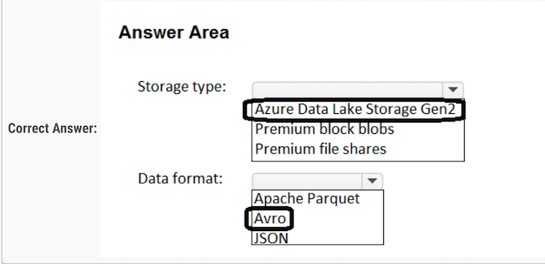

**1. Storage Type: Azure Data Lake Storage Gen2**    ✅

**Azure Event Hubs Capture allows captured data to be written either to Azure Blob Storage or Azure Data Lake Storage Gen2**. Given the nature of the data and its use in reporting and analysis, Azure Data Lake Storage Gen2 is the more appropriate choice because it is designed for big data analytics

**2. Data format: Avro**  ✅

Event Hubs Capture uses Avro format for the data it captures. Avro is a row-oriented format that is suitable for various data types, it's compact, fast, binary, and enables efficient and fast serialization of data. This makes it a good choice for Event Hubs Capture.

#### Question 28

You have the resources shown in the following table.

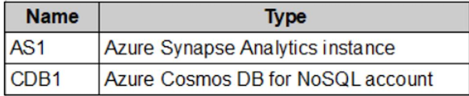

**CDB1 hosts a container that stores continuously updated operational data.**

**You are designing a solution that will use AS1 to analyze the operational data daily.**

You need to recommend a solution to analyze the data without affecting the performance of the operational data store.

What should you include in the recommendation

- [ ] A. Azure Data Factory with Azure Cosmos DB and Azure Synapse Analytics connectors
- [ ] B. Azure Synapse Analytics with PolyBase data loading
- [X] C. **Azure Synapse Link for Azure Cosmos DB**  ✅
- [ ] D. Azure Cosmos DB change feed

**The correct answer is C. Azure Synapse Link for Azure Cosmos DB.**

**Azure Synapse Link for Azure Cosmos DB creates a tight integration between Azure Cosmos DB and Azure Synapse Analytics, allowing you to run near real-time analytics over operational data in Azure Cosmos DB**. It creates a "no-ETL" (Extract, Transform, Load) environment that allows you to
analyze data directly without affecting the performance of the transactional workload, which is exactly what is required in this scenario.

A. Azure Data Factory with Azure Cosmos DB and Azure Synapse Analytics connectors would require ETL operations which might impact the
performance of the operational data store.

B. Azure Synapse Analytics with PolyBase data loading is more appropriate for loading data from external data sources such as Azure Blob Storage
or Azure Data Lake Storage.

D. Azure Cosmos DB change feed doesn't directly address the need for analytics without affecting the performance of the operational data store.

#### Question 29

You have an Azure subscription. The subscription contains an Azure SQL managed instance that stores employee details, including social security
numbers and phone numbers.

You need to configure the managed instance to meet the following requirements:

- The helpdesk team must see only the last four digits of an employee’s phone number.
- Cloud administrators must be prevented from seeing the employee’s social security numbers.

What should you enable for each column in the managed instance? To answer, select the appropriate options in the answer area.

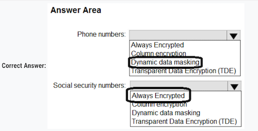

Dynamic data masking helps prevent unauthorized access to sensitive data by enabling customers to designate how much of the sensitive data to
reveal with minimal effect on the application layer.

Always Encrypted is **a feature designed to protect sensitive data, such as credit card numbers or national/regional identification numbers (for
example, U.S. social security numbers), stored in Azure SQL Database, Azure SQL Managed Instance, and SQL Server databases.**

#### Question 30

You plan to use an Azure Storage account to store data assets.

You need to recommend a solution that meets the following requirements:

- Supports immutable storage
- Disables anonymous access to the storage account
- Supports access control list (ACL)-based Azure AD permissions

What should you include in the recommendation?

- [ ] A. Azure Files
- [X] B. **Azure Data Lake Storage**    ✅
- [ ] C. Azure NetApp Files
- [ ] D. Azure Blob Storage

**In terms of supporting immutable storage, both Azure Data Lake storage and Azure Blob storage are correct.** 

**But ACL is supported by Azure Data Lake storage, not supported by Azure Blob storage.**

"Azure Data Lake Storage Gen2 implements an access control model that supports both Azure role-based access control (Azure RBAC) and POSIX-like access control lists (ACLs)

> Azure Blob storage only support Azure role-based access control (Azure RBAC).

#### Question 31

You are designing a storage solution that will ingest, store, and analyze petabytes (PBs) of structured, semi-structured, and unstructured text data. The analyzed data will be offloaded to Azure Data Lake Storage Gen2 for long-term retention.

You need to recommend a storage and analytics solution that meets the following requirements: 

* Stores the processed data 
* Provides interactive analytics 
* Supports manual scaling, built-in autoscaling, and custom autoscaling

What should you include in the recommendation? To answer, select the appropriate options in the answer area.

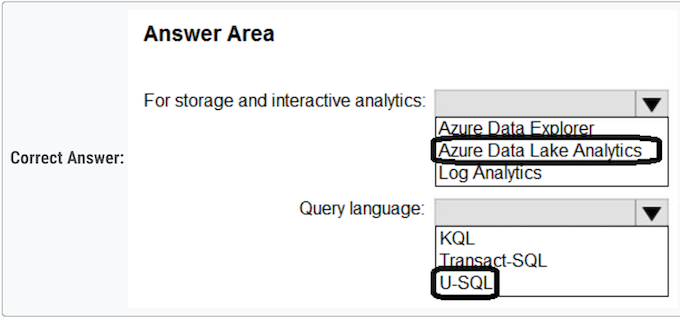

**Data Explorer + KQL**

Azure Data Explorer provides interactive analytics. It allows you to examine structured, semi-structured, and unstructured data with improvised, interactive, fast queries4. 

You can use Azure Data Explorer Web UI, web client for Azure Data Explorer, or Kusto.Explorer, a rich windows client for Azure Data Explorer. 

To connect to your Azure Data Explorer cluster, you can use Jupyter notebooks, Spark connector, any TDS-compliant SQL client, and JDBC and ODBC connections

#### Question 32

You plan to use Azure SQL as a database platform.

You need to recommend an Azure SQL product and service tier that meets the following requirements:

* Automatically scales compute resources based on the workload demand 
* Provides per second billing

What should you recommend? To answer, select the appropriate options in the answer area

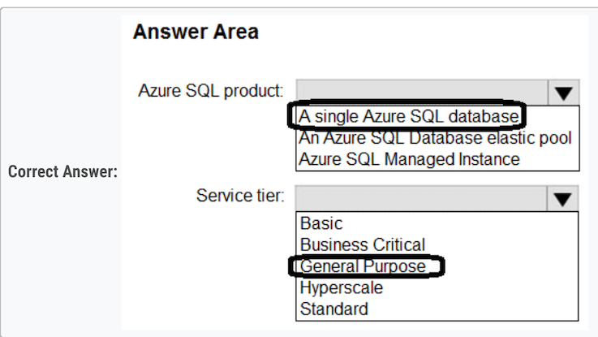

**Serverless is a compute tier for single databases in Azure SQL Database that automatically scales compute based on workload demand and bills for the amount of compute used per second.** 

The serverless compute tier is available in the General Purpose service tier and currently in preview in the Hyperscale service tier."

#### Question 33

You have an Azure subscription. 

**You need to deploy a solution that will provide point-in-time restore for blobs in storage accounts that have blob versioning and blob soft delete enabled.** 

**Which type of blob should you create, and what should you enable for the accounts?**

To answer, select the appropriate options in the answer area. NOTE: Each correct selection is worth one point.

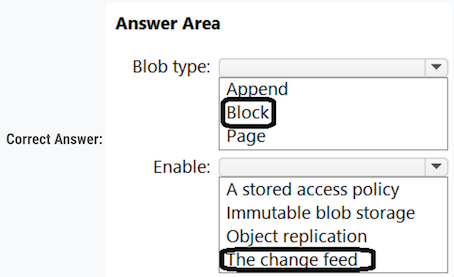

Only **block blobs** in a standard general-purpose **v2 storage account can be restored as part of a point-in-time restore operation**. 

Append blobs, page blobs, and premium block blobs aren't restored.

**Change feed is a prerequisite feature for Object Replication and Point-in-time restore for block blobs**

#### Question 34

Your company, named Contoso, Ltd., has an Azure subscription that contains the following resources:

* An Azure Synapse Analytics workspace named contosoworkspace1 
* An Azure Data Lake Storage account named contosolake1 
* An Azure SQL database named contososql1

**The product data of Contoso is copied from contososql1 to contosolake1**

Contoso plans to upload the research data on FabrikamVM1 to contosolake1. During the upload, the research data must be transformed to the data formats used by Contoso.

The data in contosolake1 will be analyzed by using contosoworkspace1. 

You need to recommend a solution that meets the following requirements:

* Upload and transform the FabrikamVM1 research data. 
* Provide Fabrikam with restricted access to snapshots of the data in contosoworkspace1.

What should you recommend for each requirement? To answer, select the appropriate options in the answer area. 

NOTE: Each correct selection is worth one point

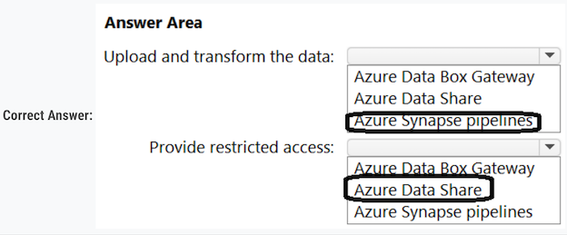

**For ETL operations use Azure Data Factory and Azure Synapse Pipelines are based on Azure Data Factory.**   ✅

**For restricted access use Azure Data Share:**  ✅

Azure Data Share  enables organizations to securely share data with multiple customers and partners. 

Data providers are always in control of the data that they've shared and Azure Data Share makes it simple to manage and monitor what data was shared, when and by whom. In this case snapshot-based sharing should be used.

**Azure synapse pipelines** - Azure Synapse Pipelines is a cloud-based data integration service that allows you to create data-driven workflows for orchestrating and automating data movement and data transformation

**Azure Data Share** - Azure Data Share is a simple and safe service for sharing big data with external organizations2. It allows you to easily share data with other organizations, and it provides capabilities to ensure that only authorized users have access to the shared data.

#### Question 35

You are designing a data pipeline that will integrate large amounts of data from multiple on-premises Microsoft SQL Server databases into an analytics platform in Azure. The pipeline will include the following

* Database updates will be exported periodically into a staging area in Azure Blob storage. 
* Data from the blob storage will be cleansed and transformed by using a highly parallelized load process. 
* The transformed data will be loaded to a data warehouse. 
* Each batch of updates will be used to refresh an online analytical processing (OLAP) model in a managed serving layer. 
* The managed serving layer will be used by thousands of end users.

You need to implement the data warehouse and serving layers. What should you use? 

To answer, select the appropriate options in the answer area

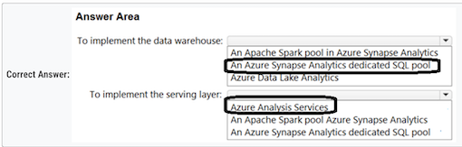

* Periodically export database updates to Azure Blob storage. 
* Use Azure Data Factory to cleanse and transform the data from Blob storage. 
* Load the transformed data into your Azure Synapse Analytics data warehouse. 
* Use Azure Analysis Services to create and manage OLAP models based on the data in your data warehouse. 
* End users can connect to Azure Analysis Services to query and analyze the data.

* **Data Warehouse:**

Azure Synapse Analytics (formerly SQL Data Warehouse) Azure Synapse Analytics is a massively parallel processing (MPP) data warehouse that can handle large amounts of data and provides a scalable solution for analytics.

* **Managed Serving Layer: Azure Analysis Services**

**Azure Analysis Services provides a fully managed platform-as-a-service (PaaS) solution for online analytical processing (OLAP) and data modeling**. It is suitable for serving analytical models to thousands of end users.

* Synapse Analytics - massive parallel 
* processing Analysis Services - OLAP

### Topic 3 - Question Set 3

#### Question 1

You have SQL Server on an Azure virtual machine. The databases are written to nightly as part of a batch process. 

You need to recommend a disaster recovery solution for the data. 

The solution must meet the following requirements: 

* ✑ Provide the ability to recover in the event of a **regional outage**. 
* ✑ Support a recovery time objective (RTO) of 15 minutes. 
* ✑ Support a recovery point objective (RPO) of 24 hours. 
* ✑ **Support automated recovery**. 
* ✑ Minimize costs. 

What should you include in the recommendation?

* A. Azure virtual machine availability sets 
* B. Azure Disk Backup 
* C. an Always On availability group 
* **D. Azure Site Recovery**   ✅

Replication with Azure Site Recover:

* ✑ RTO is typically less than 15 minutes. 
* ✑ RPO: One hour for application consistency and five minutes for crash consistency.

Incorrect Answers:

* B: Too slow. 
* C: Always On availability group RPO: Because replication to the secondary replica is asynchronous, there's some data loss.

**Replication with Azure Site Recovery.**

* RTO: is typically less than 15 minutes. 
* RPO: One hour for application consistency and five minutes for crash consistency.

#### Question 2

You plan to deploy the backup policy shown in the following exhibit.

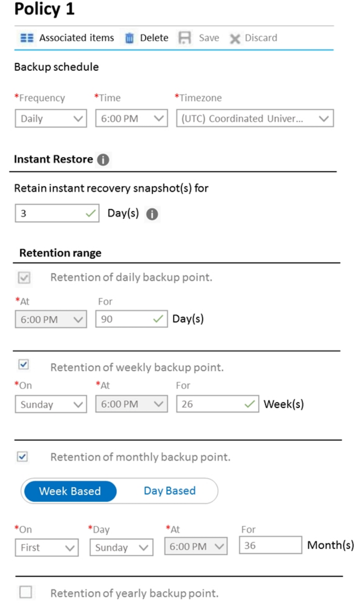

Use the drop-down menus to select the answer choice that completes each statement based on the information presented in the graphic.

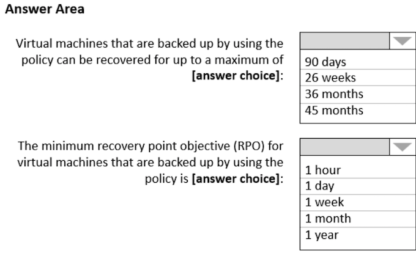

Use the drop-down menus to select the answer choice that completes each statement based on the information presented in the graphic.

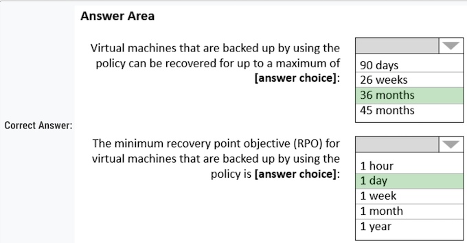

**Answer is correct - 36 weeks and 1 day**

* **Maximu of backup -> 36 months**
* **Minumum RPO for VM backup-> 1 DAY**

#### Question 3

You need to deploy resources to host a stateless web app in an Azure subscription. The solution must meet the following requirements: 

* ✑ Provide access to the full .NET framework. 
* ✑ Grant administrators access to the operating system to install custom application dependencies.

Solution: **You deploy two Azure virtual machines to two Azure regions, and you create an Azure Traffic Manager profile**. 

Does this meet the goal?

* **A. Yes**   ✅
* B. No  

Provide redundancy if an Azure region fails.

**Azure Traffic Manager is a DNS-based traffic load balancer that enables you to distribute traffic optimally to services across global Azure regions, while providing high availability and responsiveness**

#### Question 4

You need to deploy resources to host a stateless web app in an Azure subscription. The solution must meet the following requirements:

- ✑ Provide access to the full .NET framework. 
- ✑ Provide redundancy if an Azure region fails. 
- ✑ Grant administrators access to the operating system to install custom application dependencies

Solution: You deploy two Azure virtual machines to **two Azure regions**, and you **deploy an Azure Application Gateway**. Does this meet the goal?

* A. Yes 
* **B. No**  ✅

**App Gateway will balance the traffic between VMs deployed in the same region.** 

**Create an Azure Traffic Manager profile instead.**

While Azure Application Gateway is a powerful tool for handling application traffic at the application layer and can assist with routing, load balancing, and other functions, **it operates within a single region**. It doesn't automatically provide geo-redundancy across multiple Azure regions.

**For redundancy across regions, Azure Traffic Manager or Azure Front Door would be more suitable**. They operate at the DNS level and are designed to route traffic across different regions for high availability and failover purposes. 

So, in this case, **deploying two Azure virtual machines to two Azure regions and deploying an Azure Application Gateway would not fully meet the stated goals due to the lack of a regional failover strategy**

**Azure Application Gateway can load balance traffic to multiple backend servers or virtual machines, including those in different regions.** 

#### Question 5

You plan to create an Azure Storage account that will host file shares. **The shares will be accessed from on-premises applications that are transaction intensive**. 

You need to recommend a solution to minimize latency when accessing the file shares. 

The solution must provide the highest-level of resiliency for the selected storage tie

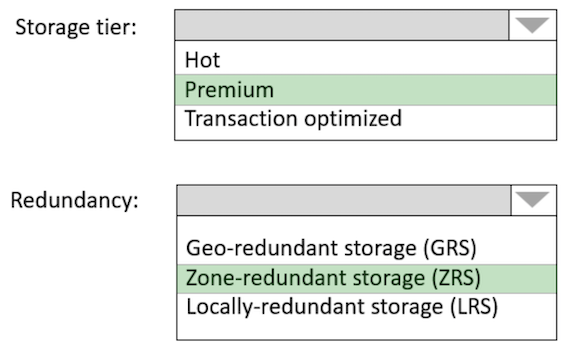

**Box 1: Premium** - Premium: **Premium file shares are backed by solid-state drives (SSDs) and provide consistent high performance and low latency**, within single-digit milliseconds for most IO operations, for IO-intensive workloads

**Incorrect Answers:**

* ✑ Hot: Hot file shares offer storage optimized for general purpose file sharing scenarios such as team shares. **Hot file shares are offered on the standard storage hardware backed by HDDs**. 

* ✑ **Transaction optimized: Transaction optimized file shares enable transaction heavy workloads that don't need the latency offered by premium file shares**.

Transaction optimized file shares are offered on the standard storage hardware backed by hard disk drives (HDDs). Transaction optimized has historically been called "standard", however this refers to the storage media type rather than the tier itself (the hot and cool are also "standard" tiers, because they are on standard storage hardware).

**Box 2: Zone-redundant storage (ZRS):**

**Premium Azure file shares only support LRS and ZRS. Zone-redundant storage (ZRS): With ZRS, three copies of each file stored, however these copies are physically isolated in three distinct storage clusters in different Azure availability zones.**

1. **Storage Tier**: For transaction-intensive applications, **it is recommended to use the "Premium" tier, which provides the highest performance and lowest latency**.
2. **Redundancy**: **Zone Redundant Storage (ZRS) replicates data across multiple zones within a single region, providing high availability and resiliency in case of a zone failure**. It also offers low latency access to the file shares, which is essential for transaction-intensive applications. Premium Azure file shares only support LRS and ZRS.

#### Question 6

You need to deploy resources to host a stateless web app in an Azure subscription. The solution must meet the following requirements:

* ✑ Provide access to the full .NET framework. 
* ✑ Provide redundancy if an Azure region fails. 
* ✑ Grant administrators access to the operating system to install custom application dependencie

Solution: You deploy an Azure virtual machine scale set that uses autoscaling. Does this meet the goal?

* A. Yes 
* **B. No**  ✅

Instead, you should **deploy two Azure virtual machines to two Azure regions, and you create a Traffic Manager profile or or Azure Front Door**

Note: Azure Traffic Manager is a DNS-based traffic load balancer that enables you to distribute traffic optimally to services across global Azure regions while providing high availability and responsiveness.

#### Question 7

You need to recommend an Azure Storage account configuration for two applications named Application1 and Application2. The configuration must meet the following requirements:

* ✑ **Storage for Application1 must provide the highest possible transaction rates and the lowest possible latency**. 
* ✑ **Storage for Application2 must provide the lowest possible storage costs per GB**. 
* ✑ Storage for both applications must be available in an event of datacenter failure. 
* ✑ Storage for both applications must be optimized for uploads and downloads.

What should you recommend? To answer, select the appropriate options in the answer area

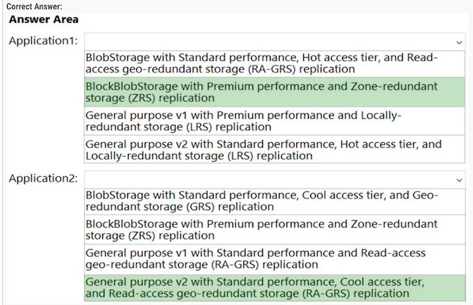

**Box 1: BlobStorage with Premium Performance,** ✅

Application1 requires high transaction rates and the lowest possible latency. We need to use Premium, not Standard.

**Box 2: General purpose v2 with Standard Performance** ✅

**General Purpose v2 provides access to the latest Azure storage features**, **including Cool and Archive storage, with pricing optimized for the lowestGB storage prices.** 

These accounts provide access to Block Blobs, Page Blobs, Files, and Queues. Recommended for most scenarios using Azure Storage.

Application 2: Blobstorage with standard performance VS General purpose V2 with standard performance - General purpose V2 is always recommended since Blobstorage with a legacy

#### Question 8

You plan to develop a new app that will store business critical data. The app must meet the following requirements:

* ✑ Prevent new data from being modified for one year. 
* ✑ Maximize data resiliency.
*  ✑ Minimize read latency

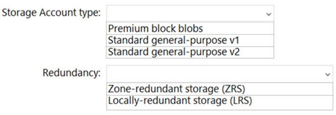

* **Box 1: Premium Block Blobs**   ✅

* **Box 2: Zone-redundant storage (ZRS)** ✅ 

	* ✑ **Prevent new data from being modified for one year. (Both Standard + Premium)** 
	* ✑ **Maximize data resiliency. (ZRS)** 
	* ✑ **Minimize read latency. (Premium)**

#### Question 9

You plan to deploy 10 applications to Azure. The applications will be deployed to two Azure Kubernetes Service (AKS) clusters. **Each cluster will be deployed to a separate Azure region**

The application deployment must meet the following requirements:

* ✑ Ensure that the applications remain available if a single AKS cluster fails. 
* ✑ Ensure that the connection traffic **over the internet is encrypted by using SSL without having to configure SSL on each container**. 

Which service should you include in the recommendation?

* **A. Azure Front Door**    ✅
* B. Azure Traffic Manager 
* C. AKS ingress controller 
* D. Azure Load Balancer

Correct Answer: A  ✅

**Azure Front Door supports SSL.**

Azure Front Door, which focuses on global load-balancing and site acceleration, and Azure CDN Standard, which offers static content caching and acceleration.

The new Azure Front Door brings together security with CDN technology for a cloud-based CDN with threat protection and additional capabilities

Front Door is an application delivery network that provides global load balancing and site acceleration service for web applications. **It offers Layer 7 capabilities for your application like SSL offload, path-based routing, fast failover, caching, etc**. to improve performance and high-availability of your applications.

#### Question 10

You have an on-premises file server that stores 2 TB of data files. 

You plan to move the data files to Azure Blob Storage in the West Europe Azure region. 

You need to recommend a storage account type to store the data files and a replication solution for the storage account. The solution must meet the following requirements:

* ✑ Be available if a single Azure datacenter fails. 
* ✑ Support storage tiers.
* ✑ Minimize cost.

What should you recommend? To answer, select the appropriate options in the answer area.

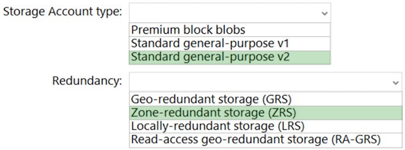

**Box 1: Standard general-purpose v2 Standard general-purpose v2 meets the requirements and minimizes the costs.**  ✅

**Box 2: Zone-redundant storage (ZRS) ZRS protects against a Datacenter failure, while minimizing the costs**.   ✅

#### Question 11

You have an Azure web app named App1 and an Azure key vault named KV1. App1 stores database connection strings in KV1. 

App1 performs the following types of requests to KV1:

✑ Get ✑ List ✑ Wrap ✑ Delete

Unwrap

✑ Backup ✑ Decrypt ✑ Encrypt

You are evaluating the continuity of service for App1. You need to identify the following if the Azure region that hosts KV1 becomes unavailable:

* ✑ To where will KV1 fail over? 
* ✑ During the failover, which request type will be unavailable?

What should you identify? To answer, select the appropriate options in the answer area

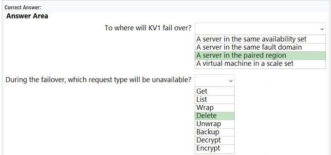

1. **kv - failover to server in paired region**  ✅
2. **during failover, delete is unaviailable**  ✅

**Box 1: A server in the paired region**

The contents of your key vault are replicated within the region and to a secondary region at least 150 miles away, but within the same geography to maintain high durability of your keys and secrets. Regions are paired for cross-region replication based on proximity and other factors.

**Box 2: Delete -**

During failover, your key vault is in read-only mode. Requests that are supported in this mode are:

List / certificates /Get / certificates /List / secrets / Get / secrets / List keys / Get (properties of) keys / Encrypt / Decrypt / Wrap / Unwrap / Verify / Sign / Backup

#### Question 12

Your company identifies the following business continuity and disaster recovery objectives for virtual machines that host sales, finance, and reporting applications in the company's on-premises data center:

* ✑ The sales application **must be able to fail over to a second on-premises data center.** 
* ✑ T**he reporting application must be able to recover point-in-time data at a daily granularity. The RTO is eight hours.** 
* ✑ **The finance application requires that data be retained for seven years**. In the event of a disaster, the application must be able to run from Azure. The recovery time objective (RTO) is 10 minutes

You need to recommend which services meet the business continuity and disaster recovery objectives. **The solution must minimize costs**. What should you recommend for each application? To answer, drag the appropriate services to the correct applications. Each service may be used once, more than once, or not at all. You may need to drag the split bar between panes or scroll to view content

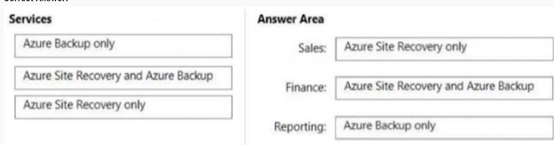

**Box 1: Azure Site Recovery -**  ✅

* Coordinates virtual-machine and physical-server replication, failover, and fullback. 
* DR solutions have low Recovery point objectives; 
* DR copy can be behind by a few seconds/minutes. DR needs only operational recovery data, which can take hours to a day. 
* Using DR data for long-term retention is not recommended because of the fine-grained data capture. 
* Disaster recovery solutions have smaller Recovery time objectives because they are more in sync with the source. 
* Remote monitor the health of machines and create customizable recovery plans.

**Box 2: Azure Site Recovery and Azure Backup**  ✅

Backup ensures that your data is safe and recoverable while Site Recovery keeps your workloads available when/if an outage occurs.

**Box 3: Azure Backup only**

Azure Backup - 

* Backs up data on-premises and in the cloud
* Have wide variability in their acceptable Recovery point objective. VM backups usually one day while database backups as low as 15 minutes. Backup data is typically retained for 30 days or less. From a compliance view, data may need to be saved for years. Backup data is ideal for archiving in such instances. 
* Because of a larger Recovery point objective, the amount of data a backup solution needs to process is usually much higher, which leads to a longer Recovery time objective.

* **Sales: ASR only**
* **Finance: ASR and Azure Backup**
* **Reporting: Azure Backup only**

#### Question 13

You need to design a highly available Azure SQL database that meets the following requirements:

* ✑ Failover between replicas of the database must occur without any data loss. 
* ✑ The database must remain available in the event of a **zone outage**. 
* ✑ Costs must be minimized.

Which deployment option should you use?

* A. Azure SQL Managed Instance Business Critical 
* **B. Azure SQL Database Premium**  ✅
* C. Azure SQL Database Basic 
* D. Azure SQL Managed Instance General Purpose

**Zone-redundant configuration is not available in SQL Managed Instance**. In SQL Database this feature is only available when the Gen5 hardware is selected.

**To prevent Data Loss, Premium/Business Critical** is required:

The primary node constantly pushes changes to the secondary nodes in order and ensures that the data is persisted to at least one secondary replica before committing each transaction. This process guarantees that if the primary node crashes for any reason, there is always a fully synchronized node to fail over to.

**B is the correct answer.**

Zone-redundant is currently in preview for SQL Managed Instance, and is only available for the Business Critical service tier.

D - SQL Managed Instance General Purpose does not support Zone-redundant as of now. So it is out of the question.

#### Question 14

Note: This question is part of a series of questions that present the same scenario. Each question in the series contains a unique solution that might meet the stated goals. Some question sets might have more than one correct solution, while others might not have a correct solution. 

After you answer a question in this section, you will NOT be able to return to it. 

As a result, these questions will not appear in the review screen. You need to deploy resources to host a stateless web app in an Azure subscription. The solution must meet the following requirements:

* ✑ Provide access to the full .NET framework. 
* ✑ **Provide redundancy if an Azure region fails**. 
* ✑ Grant administrators access to the operating system to install custom application dependencies.

Solution: You deploy a web app in an Isolated App Service plan. 

Does this meet the goal?

* A. Yes 
* **B. No** ✅

Correct Answer: B

Instead: **You deploy two Azure virtual machines to two Azure regions, and you create an Azure Traffic Manager profile + frontdoor.** 

Note: Azure Traffic Manager is a DNS-based traffic load balancer that enables you to distribute traffic optimally to services across global Azure regions, while providing high availability and responsiveness.

**You deploy two Azure virtual machines to two Azure regions, and you create an Azure Traffic Manager profile + frontdoor.**

#### Question 15

You need to design a highly available Azure SQL database that meets the following requirements: 

* ✑ Failover between replicas of the database must occur without any data loss. 
* ✑ The database must remain available in the event of a zone outage. 
* ✑ Costs must be minimized. 

Which deployment option should you use?

* **A. Azure SQL Database Serverless**   ✅
* B. Azure SQL Database Business Critical 
* C. Azure SQL Database Basic 
* D. Azure SQL Database Standard

**Zone-redundant configuration for the General Purpose service tier is offered for both serverless and provisioned compute for databases in vCore purchasing model.**

**Azure Database Serverless.**

This question appears a lot of time, with differents options as answer. Always the answers are (in this order):

1. **Azure SQL Database Serverless** 
2. **Azure SQL Database Premium** 
3. **Azure SQL Database Business Critical**

#### Question 16

You have an on-premises Microsoft SQL Server database named SQL1.

You plan to migrate SQL1 to Azure

You need to recommend a hosting solution for SQL1. The solution must meet the following requirements:

* Support the deployment of multiple secondary, read-only replicas. 
* Support automatic replication between primary and secondary replicas. 
* Support failover between primary and secondary replicas within a 15-minute recovery time objective (RTO)

What should you include in the solution? 

To answer, select the appropriate options in the answer area. NOTE: Each correct selection is worth one point.

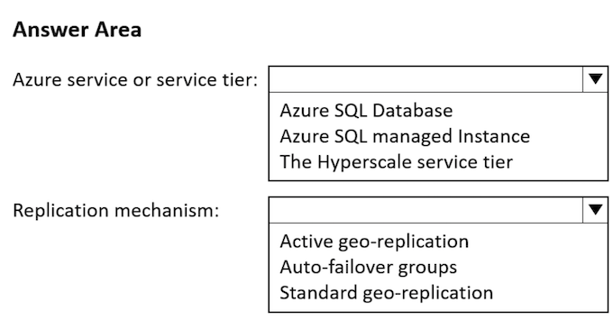

1. Azure SQL DB     ✅
2. Active geo-replication   ✅

- **Failover groups = Only 1 replica in different region (SQL + SQL MI)**
- **Geo-replication = Up to 4 replicas (same region or not) (SQL MI is not supported)**

#### Question 17

You have two on-premises Microsoft SQL Server 2017 instances that host an Always On availability group named AG1. AG1 contains a single database named DB1.

You have an Azure subscription that contains a virtual machine named VM1. VM1 runs Linux and contains a SQL Server 2019 instance. 

**You need to migrate DB1 to VM1. The solution must minimize downtime on DB1.**

What should you do? To answer, select the appropriate options in the answer area

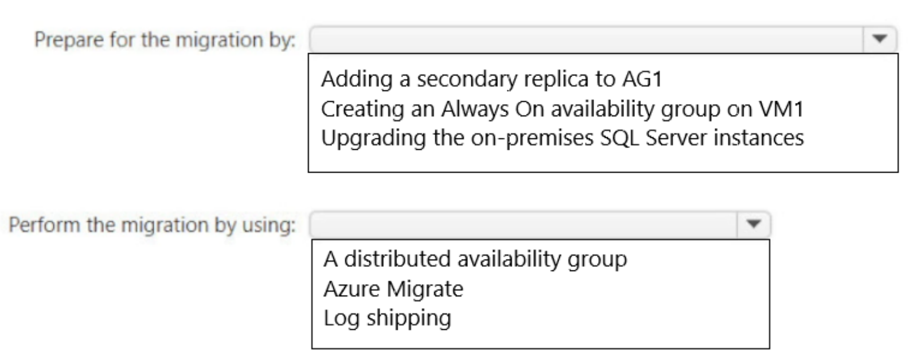

First one should be A: Prepare For the migration by: 

**A. Adding a secondary replica to AG1**  ✅

Reason: Creating an Always On availability group on VM1 would not be necessary, as you already have an availability group (AG1) in place on your on-premises SQL Server instances

**By adding a secondary replica to AG1, you can provide a copy of DB1 that can be used for the migration.** This will allow you to minimize downtime on DB1 by performing the migration on the secondary replica, while the primary replica remains available for use.

Perform the migration by using:

**B. Azure migrate** ✅

#### Question 18

You are building an Azure web app that will store the Personally Identifiable Information (PII) of employees. 

You need to recommend an Azure SQL. Database solution for the web app. The solution must meet the following requirements:

* Maintain availability in the event of a single datacenter outage. 
* Support the encryption of specific columns that contain PII. 
* Automatically scale up during payroll operations. 
* Minimize costs.

What should you include in the recommendations? To answer, select the appropriate options in the answer area

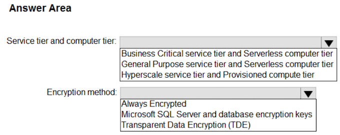

**1. Service tier and compute tier?**  : **b. General Purpose service tier and serverless compute tier**  ✅

**The General Purpose service tier with serverless compute tier provides a cost-effective solution that meets the requirements.**

General Purpose tier supports zone-redundant configurations, which can maintain availability in the event of a single datacenter outage. The serverless compute tier automatically scales up or down based on workload, which is ideal for handling the increased load during payroll operations. 

**2. Encryption method?**  : **a. Always Encrypted**  ✅

**Always Encrypted is the recommended encryption method for this scenario because it allows you to encrypt specific columns that contain PII.** 

This ensures that sensitive data is encrypted both at rest and in transit, providing a higher level of security for PII. 

Transparent Data Encryption (TDE) encrypts the entire database at rest but does not provide column-level encryption, and Microsoft SQL Server and database encryption keys would involve additional manual configuration and management of keys.

####  Question 19

You plan to deploy an Azure Database for MySQL flexible server named Server1 to the East US Azure region. 

You need to implement a business continuity solution for Server1. 

The solution must minimize downtime in the event of a **failover to a paired region**. What should you do?

* A. Create a read replica. 
* B. Store the database files in Azure premium file shares. 
* **C. Implement Geo-redundant backup**.   ✅
* D. Configure native MySQL replication.

**C. Implement Geo-redundant backup.**

**The Geo-redundant backup (GRB) feature in Azure Database for MySQL allows automatic backups to be stored in a different geographic region (geography).** 

In the event of a region-wide service disruption, you can restore the database from the geo-redundant backup, which helps minimize downtime. Other options do not provide business continuity in case of regional failures.

**Option A, creating a read replica, primarily helps with read-heavy workloads and not for disaster recovery.** 

Option B, storing the database files in Azure premium file shares, might **improve performance but does not specifically provide a disaster recovery solution**.

Option D, configuring native MySQL replication, isn't supported directly within Azure Database for MySQL. Instead, you would use Azure's built-in business continuity features, such as Geo-redundant backup.

####  Question 20

You have an Azure subscription that contains the resources shown in the following table

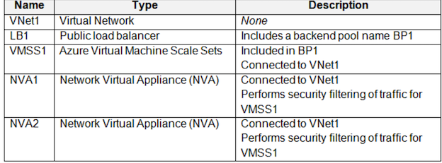

**You need to recommend a load balancing solution that will distribute incoming traffic for VMSS1 across NVA1 and NVA2.**

The solution must minimize administrative effort. What should you include in the recommendation?

* **A. Gateway Load Balancer** ✅
* B. Azure Front Door 
* C. Azure Application Gateway 
* D. Azure Traffic Manager

Gateway Load Balancer is a SKU of the Azure Load Balancer portfolio catered for high performance and high availability scenarios with third-party Network Virtual Appliances (NVAs). 

**With the capabilities of Gateway Load Balancer, you can easily deploy, scale, and manage NVAs**. 

Chaining a Gateway Load Balancer to your public endpoint only requires one selection.

####  Question 21

You have the Azure subscriptions shown in the following table.

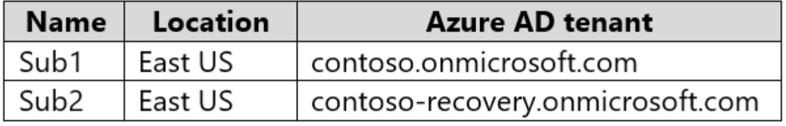

Contoso.onmicrosft.com contains a user named User1.

You need to deploy a solution to protect against ransomware attacks. The solution must meet the following requirements:

- Ensure that all the resources in Sub1 are backed up by using Azure Backup.
- Require that User1 first be assigned a role for Sub2 before the user can make major changes to the backup configuration

NOTE: Each correct selection is worth one point.

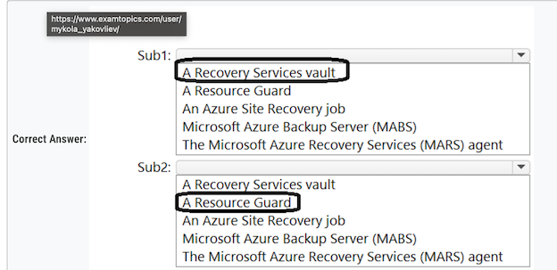

####  Question 22

You have 10 on-premises servers that run Windows Server.

You need to perform daily backups of the servers to a Recovery Services vault. The solution must meet the following requirements:

- Back up all the files and folders on the servers.
- Maintain three copies of the backups in Azure.
- **Minimize costs**.

What should you configure? To answer, select the appropriate options in the answer area.

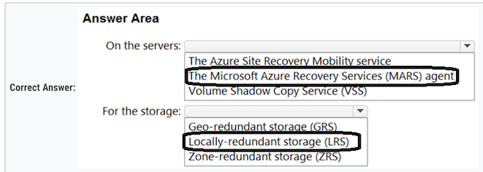

**Box 1: The Microsoft Azure Recovery Services (MARS) agent**

The MARS agent is a free and easy-to-use agent that can be installed on Windows servers to back up files and folders to Azure.
Volume Shadow Copy Service (VSS) is a Windows service that provides a snapshot of the server's file system, which is used to create consistent backups. 

The VSS service is already installed and enabled on Windows Server by default, so it is not necessary to select it as a configuration option

**Box 2: Locally-redundant storage (LRS)**

LRS is the most cost-effective storage option for Azure Backup. It replicates data three times within a single data center in the primary region, which provides sufficient durability for most workloads.

####  Question 23

You plan to deploy a containerized web-app that will be hosted in five Azure Kubernetes Service (AKS) clusters. Each cluster will be hosted in a
different Azure region.

You need to provide access to the app from the internet. The solution must meet the following requirements:

- Incoming HTTPS requests must be routed to the cluster that has the lowest network latency.
- HTTPS traffc to individual pods must be routed via an ingress controller.
- In the event of an AKS cluster outage, failover time must be minimized.

What should you include in the solution? To answer, select the appropriate options in the answer area.

NOTE: Each correct selection is worth one point.

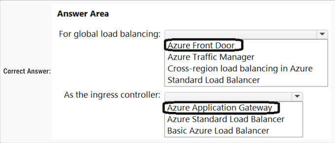

**Box 1: Azure Front Door** ✅

**Both Azure Front Door and Traffic Manager are global load balancer. However, recommended traffic for Azure Front Door is HTTP(S), and
recommended traffic for Traffic Manager is Non-HTTP(S).**

**Box 2: Azure Application Gateway**  ✅

**The Application Gateway Ingress Controller (AGIC) is a Kubernetes application, which makes it possible for Azure Kubernetes Service (AKS)**

customers to leverage Azure's native Application Gateway L7 load-balancer to expose cloud software to the Internet.

AGIC helps eliminate the need to have another load balancer/public IP address in front of the AKS cluster and avoids multiple hops in your datapath before requests reach the AKS cluster.

####  Question 24

You have an Azure subscription.

You create a storage account that will store documents.

You need to configure the storage account to meet the following requirements:

- **Ensure that retention policies are standardized across the subscription**.
- Ensure that data can be purged if the data is copied to an unauthorized location.

Which two settings should you enable? To answer, select the appropriate settings in the answer area.

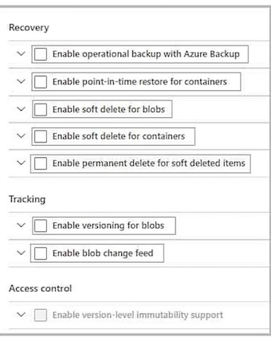

the answer should be:

1. enable soft delete for blobs   ✅
2. enable versioning for blobs   ✅

### Topic 4

####  Question 1

You have an **Azure subscription that contains a Basic Azure virtual WAN named VirtualWAN1** and the virtual hubs shown in the following table.

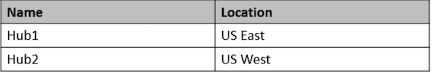

You have an **ExpressRoute circuit in the US East Azure region**.

You need to create an ExpressRoute association to VirtualWAN1.

What should you do first?

- [X] **A. Upgrade VirtualWAN1 to Standard**.  ✅
- [ ] B. Create a gateway on Hub1.
- [ ] C. Enable the ExpressRoute premium add-on.
- [] D. Create a hub virtual network in US East. 

**A basic Azure virtual WAN does not support express route. You have to upgrade to standard.**

There are two types of Virtual WANs. **one is the BASIC and the second one is STANDARD**. 

**BASIC supports only SITE to SITE VPN.**

**STANDARD supports below configs,**

- **ExpressRoute**
- User VPN (P2S)
- **VPN (site-to-site)**
- Inter-hub and VNet-to-VNet transiting through the virtual hub
- Azure Firewall
- NVA in a virtual WAN

NOTE: You can upgrade from Basic to Standard, but you cannot revert from Standard back to Basic.

1. **Upgrade VirtualWAN1 to Standard.**
2. **Create a virtual hub in the US East region and associate it with the ExpressRoute circuit.**
3. Associate the virtual hub with VirtualWAN1

####  Question 2

You have an Azure subscription that contains a storage account. 

An application sometimes writes duplicate files to the storage account. 

You have a PowerShell script that identifies and deletes duplicate files in the storage account. Currently, the script is run manually after approval from the operations manager

You need to recommend **a serverless solution** that performs the following actions:

* ✑ Runs the script once an hour to identify whether duplicate files exist 
* ✑ Sends an email notification to the operations manager requesting approval to delete the duplicate files 
* ✑ Processes an email response from the operations manager specifying whether the deletion was approved 
* ✑ Runs the script if the deletion was approved

What should you include in the recommendation?

* A. Azure Logic Apps and Azure Event Grid 
* **B. Azure Logic Apps and Azure Functions**   ✅
* C. Azure Pipelines and Azure Service Fabric 
* D. Azure Functions and Azure Batch

**You can schedule a powershell script with Azure Logic Apps**

**When you want to run code that performs a specific job in your logic apps, you can create your own function by using Azure Functions.** 

This service helps you create Node.js, C#, and F# functions so you don't have to build a complete app or infrastructure to run code. You can also call logic apps from inside Azure functions.

#### Question 3

Your company has the infrastructure shown in the following table.

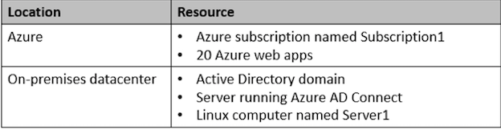

The on-premises Active Directory domain syncs with Azure Active Directory (Azure AD)

Server1 runs an application named App1 that uses LDAP queries to verify user identities in the on-premises Active Directory domain. **You plan to migrate Server1 to a virtual machine in Subscription1.**

A company security policy states that the virtual machines and services deployed to Subscription1 must be prevented from accessing the on- premises network.

You need to recommend a solution to ensure that **App1 continues to function after the migration. The solution must meet the security policy**. What should you include in the recommendation?

* A. Azure AD Application Proxy 
* B. the Active Directory Domain Services role on a virtual machine 
* C. an Azure VPN gateway 
* **D. Azure AD Domain Services (Azure AD DS)** ✅

Azure Active Directory Domain Services (Azure AD DS) provides managed domain services such as domain join, group policy, lightweight directory access protocol (LDAP), and Kerberos/NTLM authentication.

**You can use Azure AD DS and sync identities needed from Azure AD to Azure AD DS** to use legacy protocols like LDAP. Kerberos and NTLM

**AD DS in azure on a VM would be easiest option however policy restricts access.**

#### Question 4

You need to design a solution that will execute custom C# code in response to an event routed to **Azure Event Grid**. The solution must meet the following requirements:

* ✑ The executed code must be able to access the private IP address of a Microsoft SQL Server instance that runs on an Azure virtual machine. 
* ✑ **Costs must be minimized.**

What should you include in the solution?

* A. Azure Logic Apps in the Consumption plan 
* **B. Azure Functions in the Premium plan**  ✅
* C. Azure Functions in the Consumption plan 
* D. Azure Logic Apps in the integrated service environment

**Virtual connectivity is included in the Premium plan.**

Consumption plan cannot access Virtual Network Integration features. 

**Virtual network integration allows your function app to access resources inside a virtual network.**

**B. Azure Functions in the Premium plan**  ✅

Azure Functions in the Premium plan is the best solution to meet the requirements. With the Premium plan, you can execute custom C# code in response to an event routed to Azure Event Grid. Additionally, the Premium plan allows you to access resources in a virtual network, such as the private IP address of a SQL Server instance running on an Azure virtual machine

**Azure Functions in the Consumption plan does not support virtual network integration, which is necessary for accessing the private IP address of the SQL Server instance**. Azure Logic Apps in both the Consumption plan and the integrated service environment are not ideal for executing custom C# code and may not be as cost-effective as Azure Functions in the Premium plan.

#### Question 5

You have an on-premises network and an Azure subscription. The on-premises network has several branch offices. 

A branch office in Toronto contains a virtual machine named VM1 that is configured as a file server. **Users access the shared files on VM1 from all the offices**.

You need to recommend a solution to ensure that the users can access the shared files as quickly as possible if the Toronto branch office is inaccessible

What should you include in the recommendation?

* A. a Recovery Services vault and Windows Server Backup 
* B. Azure blob containers and Azure File Sync 
* C. a Recovery Services vault and Azure Backup 
* **D. an Azure file share and Azure File Sync** ✅

Correct Answer: D

**Use Azure File Sync to centralize your organization's file shares in Azure Files,** while keeping the flexibility, performance, and compatibility of an on-premises file server. Azure File Sync transforms Windows Server into a quick cache of your Azure file share.

They say "quickly as possible" so an Azure Fileshare with Azure FileSync running looks to be the quickest option to get things accessible again.

Azure file share and sync offers “offline” access if primary server is unavailable as copy is help in cloud endpoint.

#### Question 6

You have an Azure subscription named Subscription1 that is linked to a hybrid Azure Active Directory (Azure AD) tenant. 

You have an on-premises datacenter that does NOT have a VPN connection to Subscription1. The datacenter contains a computer named Server1 that has Microsoft SQL Server 2016 installed. Server is prevented from accessing the internet.

* An Azure logic app resource named LogicApp1 requires write access to a database on Server1. 
* **You need to recommend a solution to provide LogicApp1 with the ability to access Server1**

What should you recommend deploying on-premises and in Azure? To answer, select the appropriate options in the answer area

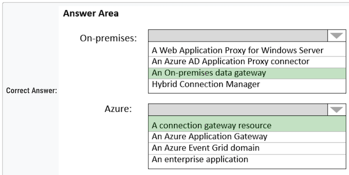

**Box 1: An on-premises data gateway**  ✅

For logic apps in global, multi-tenant Azure that connect to on-premises SQL Server,** you need to have the on-premises data gateway installed on a local computer and a data gateway resource that's already created in Azure**

**Box 2: A connection gateway resource**   ✅

**1. On-premises => c. an on-premises data gateway**

**An on-premises data gateway allows you to securely access on-premises data and resources from Azure Logic Apps**. In this scenario, deploying an on-premises data gateway on Server1 or another server in the datacenter will enable LogicApp1 to access the SQL Server 2016 database on Server1.

**2. Azure => a. A connection gateway resource**

In Azure, you should deploy a connection gateway resource. This gateway resource will communicate with the on-premises data gateway to provide LogicApp1 with the ability to access the SQL Server 2016 database on Server1 securely.

#### Question 7

Your company develops a web service that is deployed to an Azure virtual machine named VM1. 

The web service allows an API to access real- time data from VM1.

The current virtual machine deployment is shown in the Deployment exhibit

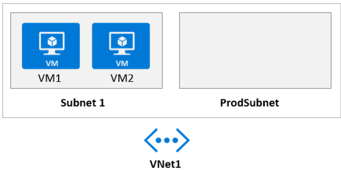

The chief technology officer (CTO) sends you the following email message: "Our developers have deployed the web service to a virtual machine named VM1.

Testing has shown that the API is accessible from VM1 and VM2. Our partners must be able to connect to the API over the Internet. Partners will use this data in applications that they develop."

You deploy an Azure API Management (APIM) service. The relevant API Management configuration is shown in the API exhibit.

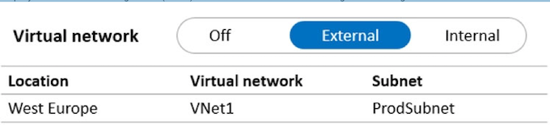

For each of the following statements, select Yes if the statement is true.

Otherwise, select No. NOTE: Each correct selection is worth one point.
 
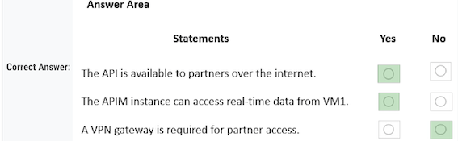

* Yes - **Because we are using an APIM, deployed to a VNET but configured to be "External"** 
* Yes - **Because the APIM is deployed in the same vNET as VM1 just in a different subnet.** Communication between subnets are enabled by default and there is no mention of otherwise. 
* No - **VPN required because the APIM is accessible from the internet by virtue of it being configured as "External"**

#### Question 8

Your company has an existing web app that runs on Azure virtual machines. 

You need to ensure that the app is protected from SQL injection attempts and **uses a layer-7 load balancer. The solution must minimize disruptions to the code of the app.** 

What should you recommend? To answer, drag the appropriate services to the correct targets. 

Each service may be used once, more than once, or not at all. 

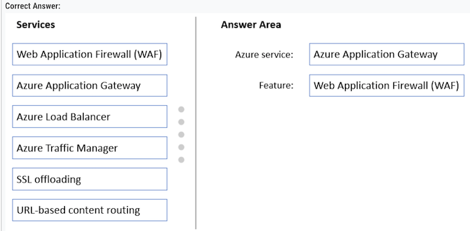

**Box 1: Azure Application Gateway**  ✅

**The Azure Application Gateway Web Application Firewall (WAF) provides protection for web applications.** These protections are provided by the Open Web Application Security Project (OWASP) Core Rule Set (CRS). 

**Box 2: Web Application Firewall (WAF)**   ✅

#### Question 9

You are designing a microservices architecture that will be hosted in an Azure Kubernetes Service (AKS) cluster. Apps that will consume the microservices will be hosted on Azure virtual machines. The virtual machines and the AKS cluster will reside on the same virtual network. 

You need to design a solution to expose the microservices to the consumer apps. The solution must meet the following requirements:

* ✑ Ingress access to the microservices must be restricted to a single private IP address and protected by using mutual TLS authentication. 
* ✑ **The number of incoming microservice calls must be rate-limited**. 
* ✑ Costs must be minimized.

What should you include in the solution?

* A. Azure App Gateway with Azure Web Application Firewall (WAF) 
* B. Azure API Management Standard tier with a service endpoint 
* C. Azure Front Door with Azure Web Application Firewall (WAF) 
* **D. Azure API Management Premium tier with virtual network connection** ✅

**Correct Answer: D** 

One option is to deploy APIM (API Management) inside the cluster VNet. 

The AKS cluster and the applications that consume the microservices might reside within the same VNet, hence there is no reason to expose the cluster publicly as all API traffic will remain within the VNet. For these scenarios, you can deploy API Management into the cluster VNet. API Management Premium tier supports

The best option to meet the requirements you mentioned would be to use Azure API Management with a virtual network connection. This can be achieved with the Premium tier of Azure API Management. This will allow you to restrict ingress access to a single private IP address and protect it using mutual TLS authentication. **Additionally, Azure API Management provides rate limiting capabilities and can be deployed within a virtual network to minimize costs.** So, the correct answer is

**D. Azure API Management Premium tier with virtual network connection.**  ✅

#### Question 10

You have a .NET web service named Service1 that performs the following tasks:

* ✑ Reads and writes temporary files to the local file system. 
* ✑ Writes to the Application event log. 

You need to recommend a solution to host Service1 in Azure. The solution must meet the following requirements:

*  Minimize maintenance overhead. 

What should you include in the recommendation?
 
* **A. an Azure App Service web app**  ✅
* B. an Azure virtual machine scale set 
* C. an App Service Environment (ASE) 
* D. an Azure Functions app

**Azure Web App meets the requirements and is less expansive compared to VM scale sets.**

#### Question 11

You have a .NET web service named Service1 that performs the following tasks:

* ✑ **Reads and writes temporary files to the local file system.** 
* ✑ Writes to the Application event log. 

You need to recommend a solution to host Service1 in Azure. The solution must meet the following requirements: 

* ✑ Minimize maintenance overhead. 
* ✑ Minimize costs

What should you include in the recommendation?

* **A. an Azure App Service web app**  ✅
* B. an Azure virtual machine scale set 
* C. an App Service Environment (ASE) 
* D. an Azure Functions app

Azure App Service is a fully managed platform for building, deploying, and scaling web apps. 

By hosting Service1 as an Azure App Service web app, you can minimize maintenance overhead, as the platform takes care of the underlying infrastructure, patching, and scaling. 

**Azure App Service also offers a cost-effective solution that can be scaled up or out as needed to meet the demands of your application**.

While Azure Functions, virtual machine scale sets, and App Service Environments can also host web services, they may not provide the same balance of minimal maintenance overhead and cost-effectiveness as Azure App Service web apps do in this scenario.

#### Question 11

You have the Azure resources shown in the following table

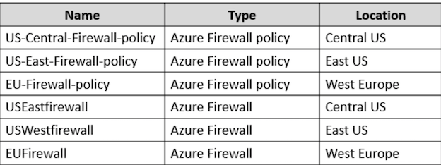

You need to deploy a new Azure Firewall policy that will contain mandatory rules for all Azure Firewall deployments. 

**The new policy will be configured as a parent policy for the existing policies**. 

What is the **minimum number of additional Azure Firewall policies** you should create?

* A. 0 
* B. 1 
* C. 2 
* **D. 3**  ✅

	* **Firewall policies work across regions and subscriptions**. 
	* Place all your global configurations in the parent policy. 
	* **The parent policy is required to be in the same region as the child policy.** 
	* **Each of the three regions must have a new parent policy**

**Parent policy must be in the same region as child policy!**

You get this information when creating a Firewall Policy. **Parent Policy drop down list only shows policies in the same region.**

Existing Firewall Policies are located in different regions. To link them to a new parent policy, each region must have a new parent policy => 3 new policies.

Azure Firewall Policies can be used across regions. For example, you can create a policy in West US, and use it in East US.

**Conclusion: You can't set a Parent Policy from different region to a child in a given region**

**Therefore we need 3 different region policies to be set as parents if we do not change the child's regions**.

#### Question 12

Your company has an app named App1 that uses data from the on-premises Microsoft SQL Server databases shown in the following table.

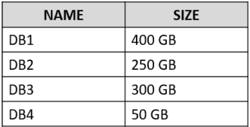

App1 and the data are used on the first day of the month only. 

**The data is not expected to grow more than 3 percent each year.**

The company is rewriting App1 as an Azure web app and plans to migrate all the data to Azure

You need to migrate the data to Azure SQL Database and ensure that the database is only available on the first day of each month. Which service tier should you use?

* **A. vCore-based General Purpose**   ✅
* B. DTU-based Standard 
* C. vCore-based Business Critical 
* D. DTU-based Basic

**Correct Answer: A**

Note: App1 and the data are used on the first day of the month only. 

**See Serverless compute tier below. The vCore based purchasing model.**

The term vCore refers to the Virtual Core. 

In this purchasing model of Azure SQL Database, you can choose from the provisioned compute tier and serverless compute tier.

* Provisioned compute tier: You choose the exact compute resources for the workload. 
* Serverless compute tier: Azure automatically pauses and resumes the database based on workload activity in the serverless tier. During the pause period, Azure does not charge you for the compute resources.

**Use the serverless model in vcore**

While the provisioned compute tier provides a specific amount of compute resources that are continuously provisioned independent of workload activity, the serverless compute tier auto-scales compute resources based on workload activity.

While the provisioned compute tier bills for the amount of compute provisioned at a fixed price per hour, the serverless compute tier bills for the amount of compute used, per second.

#### Question 13

You are developing a sales application that will contain several Azure cloud services and handle different components of a transaction. 

Different cloud services will process customer orders, billing, payment, inventory, and shipping.

You need to recommend a solution to **enable the cloud services to asynchronously communicate transaction information by using XML messages.** 

What should you include in the recommendation?

* A. Azure Service Fabric 
* B. Azure Data Lake 
* **C. Azure Service Bus**   ✅
* D. Azure Traffic Manager

**Asynchronous messaging options in Azure include Azure Service Bus, Event Grid, and Event Hubs.**

#### Question 14

Your company has 300 virtual machines hosted in a VMware environment. The virtual machines vary in size and have various utilization levels. You plan to move all the virtual machines to Azure.

You need to recommend how many and what size Azure virtual machines will be required to move the current workloads to Azure. The solution must minimize administrative effort.

What should you use to make the recommendation?

* A. Azure Pricing calculator 
* B. Azure Advisor 
* **C. Azure Migrate**   ✅
* D. Azure Cost Management

Correct Answer: C

**Azure Migrate provides a centralized hub to assess and migrate on-premises servers, infrastructure, applications, and data to Azure.**  ✅

It provides the following:

Unified migration platform: A single portal to start, run, and track your migration to Azure. 

Range of tools: A range of tools for assessment and migration.

The best solution to make the recommendation would be to use Azure Migrate. 

Azure Migrate provides centralized assessment and migration to Azure. It helps you to determine the best Azure resource configuration for your workloads, and provides detailed migration guidance, including sizing and performance recommendations, as well as step-by-step instructions for migrating the virtual machines to Azure. Azure Migrate automates many of the migration steps and provides a single place to manage the entire migration, helping to minimize administrative effort.

**Azure Migrate: Discovery and assessment tool**

The Azure Migrate: Discovery and assessment tool discovers and assesses on-premises VMware VMs, Hyper-V VMs, and physical servers for migration to Azure.

#### Question 15

You plan to provision a **High Performance Computing (HPC) cluster** in Azure that will use a third-party scheduler. 

You need to recommend a solution to provision and manage the HPC cluster node. 

What should you include in the recommendation?

* A. Azure Automation 
* **B. Azure CycleCloud**   ✅
* C. Azure Purview 
* D. Azure Lighthouse

Correct Answer: B

**You can dynamically provision Azure HPC clusters with Azure CycleCloud.**

Azure CycleCloud is the simplest way to manage HPC workloads. 

Note: **Azure CycleCloud is an enterprise-friendly tool for orchestrating and managing High Performance Computing (HPC) environments on Azure**. 

With CycleCloud, users can provision infrastructure for HPC systems, deploy familiar HPC schedulers, and automatically scale the infrastructure to run jobs efficiently at any scale. 

Through CycleCloud, users can create different types of file systems and mount them to the compute cluster nodes to support HPC workloads.

#### Question 16

You are designing an Azure App Service web app. 

You plan to deploy the web app to the North Europe Azure region and the West Europe Azure region.

 You need to recommend a solution for the web app. 
 
 The solution must meet the following requirements:
 
* ✑ Users must always access the web app from the North Europe region, unless the region fails. 
* ✑ The web app must be available to users if an Azure region is unavailable. 
* ✑ Deployment costs must be minimized.

What should you include in the recommendation? To answer, select the appropriate options in the answer area.

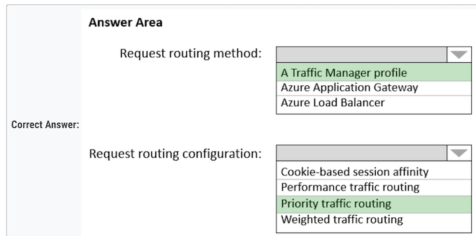

**Box 1: A Traffic Manager profile**

**To support load balancing across the regions we need a Traffic Manager.**

**Box 2: Priority traffic routing**

Priority traffic-routing method.

Often an organization wants to provide reliability for their services. To do so, they deploy one or more backup services in case their primary goes down. 

The 'Priority' traffic-routing method allows Azure customers to easily implement this failover pattern.

- **Traffic manager as global solution with priority routing**

#### Question 17

You plan to deploy multiple instances of an Azure web app across several Azure regions

You need to design an access solution for the app. The solution must meet the following replication requirements:

* ✑ **Support rate limiting.** 
* ✑ Balance requests between all instances. 
* ✑ **Ensure that users can access the app in the event of a regional outage**.

**Solution: You use Azure Traffic Manager to provide access to the app.**

Does this meet the goal?

* A. Yes 
* **B. No**   ✅

**Azure Traffic Manager is a DNS-based traffic load balancer.** This service allows you to distribute traffic to your public facing applications across the global Azure regions. 

**Traffic Manager also provides your public endpoints with high availability and quick responsiveness. It does not provide rate limiting**

**Note: Azure Front Door would meet the requirements**

**The Azure Web Application Firewall (WAF) rate limit rule for Azure Front Door controls the number of requests allowed from clients during a one-minute duration.**

**Azure Traffic Manager does not have rate limit**

**Use Azure Front Door with WAF**

**To achieve rate limiting along with load balancing and high availability, you should use Azure Front Door with the Web Application Firewall (WAF)**.

Azure Front Door is a global, scalable entry-point that uses the Microsoft global edge network to create fast, secure, and widely scalable web applications. It provides load balancing and failover across multiple regions.

By enabling the WAF on Azure Front Door, you can configure custom rate limiting rules to protect your web app from excessive traffic and potential attacks.

#### Question 18

**Solution: You use Azure Load Balancer to provide access to the app.**

Does this meet the goal?

* A. Yes 
* **B. No** ✅

**Correct Answer: B Azure Application Gateway and Azure Load Balancer do not support rate or connection limits.**

**Note: Azure Front Door would meet the requirements.**
 
 The Azure Web Application Firewall (WAF) rate limit rule for Azure Front Door controls the number of requests allowed from clients during a one-minute duration
 
#### Question 19
 
Solution: You use **Azure Application Gateway** to provide access to the app.

* A. Yes 
* **B. No** ✅

Azure Application Gateway and Azure Load Balancer do not support rate or connection limits. Note: Azure Front Door would meet the requirements. 

**The Azure Web Application Firewall (WAF) rate limit rule for Azure Front Door controls the number of requests allowed from clients during a one-minute duration**

**Azure Application Gateway is a Layer 7 load balancer that provides features like SSL termination, cookie-based session affinity, and URL-based routing. However, it operates within a single region and cannot distribute traffic across multiple regions**

**To meet the requirements of supporting rate limiting, balancing requests between instances across multiple regions, and ensuring app accessibility during regional outages, you should use Azure Front Door with Web Application Firewall (WAF).**

Azure Front Door is a global load balancer that can distribute traffic optimally to services across multiple regions, ensuring high availability in the event of a regional outage. By enabling WAF, you can configure custom rate limiting rules to control incoming traffic to your web app.

#### Question 20

Your company has two on-premises sites in New York and Los Angeles and Azure virtual networks in the East US Azure region and the West US Azure region. 

**Each on-premises site has ExpressRoute Global Reach circuits to both regions.**

You need to recommend a solution that meets the following requirements:

* ✑ Outbound traffic to the internet from workloads hosted on the virtual networks must be routed through the closest available on-premises site. 
* ✑ **If an on-premises site fails, traffic from the workloads on the virtual networks to the internet must reroute automatically to the other site**.

What should you include in the recommendation? To answer, select the appropriate options in the answer area.

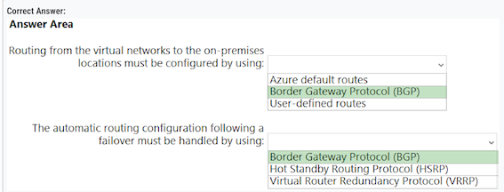

**Box 1: Border Gateway Protocol (BGP)** ✅

An on-premises network gateway can exchange routes with an Azure virtual network gateway using the border gateway protocol (BGP). 

Using BGP with an Azure virtual network gateway is dependent on the type you selected when you created the gateway. 

If the type you selected were: **ExpressRoute: You must use BGP to advertise on-premises routes to the Microsoft Edge router. You cannot create user-defined routes to force traffic to the ExpressRoute virtual network gateway if you deploy a virtual network gateway deployed as type: ExpressRoute**. 

You can use user-defined routes for forcing traffic from the Express Route to, for example, a Network Virtual Appliance.

**Box 2: Border Gateway Protocol (BGP)** ✅

Layer 3 connectivity Microsoft uses BGP, **an industry standard dynamic routing protocol, to exchange routes between your on-premises network, your instances in Azure, and Microsoft public addresses**. 

We establish multiple BGP sessions with your network for different traffic profiles. More details can be found in the ExpressRoute circuit and routing domains article.

1. Routing from the virtual networks to the on-premises location must be configured by using: **b. Border Gateway Protocol (BGP) To configure routing between the Azure virtual networks and the on-premises locations, you should use Border Gateway Protocol (BGP)**. BGP is a dynamic routing protocol that enables automatic route updates between ExpressRoute circuits and the on-premises sites. 

2. The automatic routing configuration following a failover must be handled by using: a. Border Gateway Protocol (BGP)

**BGP can also handle automatic routing configuration in the event of a failover.** 

**It can dynamically detect when a site fails and automatically reroute traffic to the other available site.** This ensures that traffic from the workloads on the virtual networks to the internet is rerouted to the other on- premises site if one site fails.

#### Question 21

You are designing an application that will use Azure Linux virtual machines to analyze video files. The files will be uploaded from corporate offices that connect to Azure by using ExpressRoute.

You plan to provision an Azure Storage account to host the files. 

You need to ensure that the storage account meets the following requirements:

* ✑ Supports video files of up to 7 TB 
* ✑ Provides the highest availability possible 
* ✑ Ensures that storage is optimized for the large video files 
* ✑ Ensures that files from the on-premises network are uploaded by using ExpressRoute 

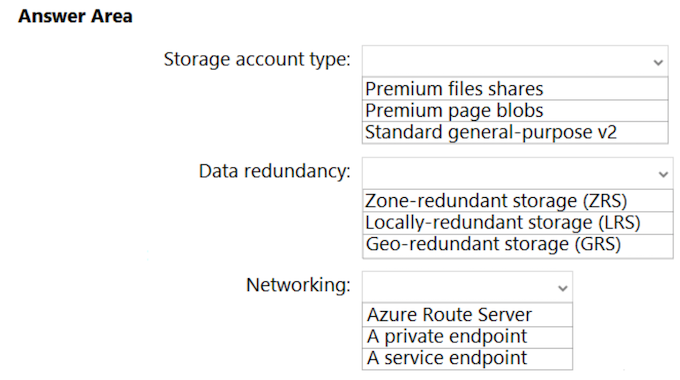

How should you configure the storage account? To answer, select the appropriate options in the answer area.

**Storage: Premium file share** ✅

* **Premium file shares support files up to 100 TiB in size,** 
* **Premium file shares provide faster performance and lower latency than standard file shares, which would be beneficial for analyzing large video files**. 
* Premium file shares can be accessed from anywhere in the world, which makes it suitable for your scenario where video files are uploaded from corporate offices that connect to Azure by using ExpressRoute

**Data Redundancy: GRS (Geo-Redundant Storage)** ✅

**GRS provides additional redundancy for data storage compared to LRS or ZRS**, with data being replicated to a secondary region, GRS provides the highest availability possible, as it maintains multiple copies of data in different regions.

**Networking: Private Endpoint** ✅

* **By configuring a private endpoint for the Azure Storage account, you can ensure that files from the on-premises network are uploaded using ExpressRoute, which provides a more reliable and secure connection compared to the public internet**. 
* A private endpoint also enhances security and reduces exposure to public endpoint

#### Question 22

A company plans to implement an HTTP-based API to support a web app. The web app allows customers to check the status of their orders. The API must meet the following requirements:

* ✑ Implement Azure Functions. 
* ✑ Provide public read-only operations. 
* ✑ Prevent write operations.

You need to recommend which HTTP methods and authorization level to configure.

What should you recommend? To answer, configure the appropriate options in the dialog box in the answer area.

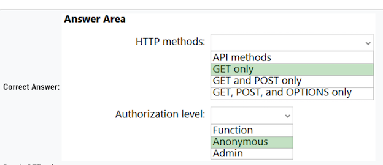

 
**Box 1: GET only** - Get for read-only- ✅

**Box 2: Anonymous** - Anonymous for public operations.  ✅

**1. HTTP methods: b. GET only** 

**As the API needs to provide public read-only operations and prevent write operations, you should use only the GET method.** The GET method is used to retrieve data and is considered read-only, which meets the requirements

**2. Authorization level: b. Anonymous**

**To allow public read-only access without requiring any authentication or authorization, you should set the authorization level to Anonymous.**

This will enable any user to access the API without providing a key, allowing them to check the status of their orders as required.

#### Question 23

You have an Azure subscription. 

You need to recommend a solution to provide developers with the ability to provision Azure virtual machines. The solution must meet the following requirements:

* ✑ Only allow the **creation of the virtual machines in specific regions**. 
* ✑ Only allow the **creation of specific sizes of virtual machines**

What should you include in the recommendation?

* A. Azure Resource Manager (ARM) templates 
* **B. Azure Policy**    ✅
* C. Conditional Access policies 
* D. role-based access control (RBAC)

**Azure Policies allows you to specify allowed locations, and allowed VM SKUs**

Allowed virtual machine size SKUs This policy enables you to specify a set of virtual machine size SKUs that your organization can deploy. 

Allowed locations This policy enables you to restrict the locations your organization can specify when deploying resources. Use to enforce your geo-compliance requirements. 

Excludes resource groups, Microsoft.AzureActiveDirectory/b2cDirectories, and resources that use the 'global' region.

#### Question 24

You have an on-premises network **that uses an IP address space of 172.16.0.0/16.** 

You plan to deploy 30 virtual machines to a new Azure subscription. 

You identify the following technical requirements:

* ✑ All Azure virtual machines must be placed on the same subnet named Subnet1. 
* ✑ All the Azure virtual machines must be able to communicate with all on-premises servers.
* ✑ The servers must be able to communicate between the on-premises network and Azure by using a site-to-site VPN.

You need to recommend a subnet design that meets the technical requirements. What should you include in the recommendation? 

To answer, drag the appropriate network addresses to the correct subnets. Each network address may be used once, more than once, or not at all. You may need to drag the split bar between panes or scroll to view content.

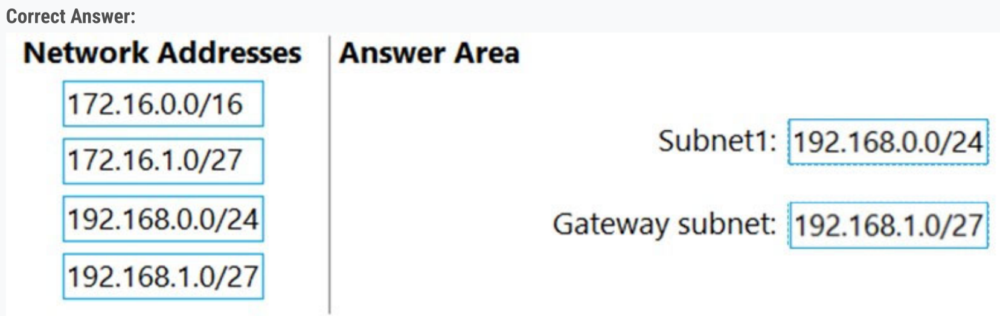

1. **Cannot overlap -> 172.16.0.0/16 is out** 

2. **30 machines -> 192.168.1.0/27 is 32 IPs, but Azure always uses 5 for itself, so would be too small for the machine subnet => process of elimination leads to Subnet1 = 192.168.0.0/24, Gateway Subnet = 192.168.1.0/27**

* Create a virtual network 
* Create a VPN gateway Create a local network gateway Create a VPN connection
* Verify the connection
* Connect to a virtual machine 

None of the subnets of your on-premises network can over lap with the virtual network subnets that you want to connect to

#### Question 25

You have data files in Azure Blob Storage. 

**You plan to transform the files and move them to Azure Data Lake Storage.** 

**You need to transform the data by using mapping data flow.** 

Which service should you use?

* A. Azure Databricks 
* B. Azure Storage Sync 
* **C. Azure Data Factory**   ✅
* D. Azure Data Box Gateway

What are mapping data flows? 

Mapping data flows are visually designed data transformations in Azure Data Factory. 

Data flows allow data engineers to develop data transformation logic without writing code. 

**The resulting data flows are executed as activities within Azure Data Factory pipelines that use scaled out Apache Spark clusters**. 

Data flow activities can be operationalized using existing Azure Data Factory scheduling, control, flow, and monitoring capabilities.

**Azure Data Factory** is a cloud-based data **integration service** that allows you to create, schedule, and **manage data pipelines that can move and transform data across different sources and destinations, including Azure Blob Storage and Azure Data Lake Storage**. 

**Azure Databricks** is a **cloud-based analytics platform** that allows you to process large amounts of data using **Apache Spark**. It can also be used for data transformation and ETL, but it requires more technical expertise and development effort than using Azure Data Factory mapping data flows. 

**Azure Storage Sync** is a service that allows you to **sync on-premises file servers with Azure file shares, but it does not support data transformation**. 

**Azure Data Box Gateway** is a hardware device that allows you to transfer large amounts of data to Azure, but it does not support data transformation using mapping data flow.

#### Question 26

You have an Azure subscription. You need to deploy an Azure Kubernetes Service (AKS) solution that will use Windows Server 2019 nodes. 

The solution must meet the following requirements:

* ✑ Minimize the time it takes to provision compute resources during scale-out operations. 
* ✑ Support autoscaling of Windows Server containers.

Which scaling option should you recommend?

* A. Kubernetes version 1.20.2 or newer 
* B. Virtual nodes with Virtual Kubelet ACI 
* **C. cluster autoscaler**   ✅
* D. horizontal pod autoscaler

Correct Answer: C

* **Cluster autoscaler help provision new nodes (compute ressources)**

* **Cluster autoscaler works on top of horizontal pod autoscaler.**

Deployments can scale across AKS with no delay as cluster autoscaler deploys new nodes in your AKS cluster.

Note: AKS clusters can scale in one of two ways:

* The cluster autoscaler watches for pods that can't be scheduled on nodes because of resource constraints. The cluster then automatically increases the number of nodes. 
* The horizontal pod autoscaler uses the Metrics Server in a Kubernetes cluster to monitor the resource demand of pods. If an application needs more resources, the number of pods is automatically increased to meet the demand.

**Incorrect:**

Not D: If your application needs to rapidly scale, the horizontal pod autoscaler may schedule more pods than can be provided by the existing compute resources in the node pool. 

If configured, this scenario would then trigger the cluster autoscaler to deploy additional nodes in the node pool, **but it may take a few minutes for those nodes to successfully provision and allow the Kubernetes scheduler to run pods on them**.

#### Question 27

Your on-premises network contains a file server named Server1 that stores 500 GB of data.

**You need to use Azure Data Factory to copy the data from Server1 to Azure Storage.**

You add a new data factory.

What should you do next? To answer, select the appropriate options in the answer area

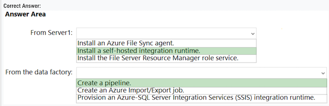

**Box 1: Install a self-hosted integration runtime.**

**If your data store is located inside an on-premises network, an Azure virtual network, or Amazon Virtual Private Cloud, you need to configure a self-hosted integration runtime to connect to it.**

**The Integration Runtime to be used to connect to the data store.** You can use Azure Integration Runtime or Self-hosted Integration Runtime (if your data store is located in private network). If not specified, it uses the default Azure Integration Runtime.

**Box 2: Create a pipeline.**

You perform the Copy activity with a pipeline.

You must install the Data Factory self-hosted integration runtime on a Windows VM in your Azure virtual network.

**A Data Factory or Synapse Workspace can have one or more pipelines. A pipeline is a logical grouping of activities that together perform a task.** 

For example, a pipeline could contain a set of activities that ingest and clean log data, and then kick off a mapping data flow to analyze the log data.

**1. From Server1: b. Install a self-hosted integration runtime**   ✅

A self-hosted integration runtime needs to be installed on Server1 to enable secure communication between the on-premises network and Azure Data Factory. This runtime allows Data Factory to access and copy data from the on-premises file server to Azure Storage.

**2. From the data factory: a. Create a pipeline**   ✅

**In the Azure Data Factory, create a pipeline that specifies the source (on-premises file server) and destination (Azure Storage)**. 

The pipeline will use the self-hosted integration runtime to establish a connection to the on-premises file server and transfer the data to Azure Storage

#### Question 28

You have an Azure subscription. You need to recommend an Azure Kubernetes Service (AKS) solution that will use Linux nodes. The solution must meet the following requirements: 

* ✑ Minimize the time it takes to provision compute resources during scale-out operations. 
* ✑ **Support autoscaling of Linux containers**. 
* ✑ Minimize administrative effort.

Which scaling option should you recommend?

* A. horizontal pod autoscaler 
* B. cluster autoscaler 
* **C. virtual nodes**  ✅
* D. Virtual Kubelet

To rapidly scale application workloads in an AKS cluster, you can use virtual nodes. With virtual nodes, you have quick provisioning of pods, and only pay per second for their execution time. 

You don't need to wait for Kubernetes cluster autoscaler to deploy VM compute nodes to run the additional pods. **Virtual nodes are only supported with Linux pods and nodes**.

* **cluster autoscaler for windows**  ✅
* **Virtual Nodes for Linux** ✅

C. virtual nodes To meet the requirements of minimizing the time it takes to provision compute resources during scale-out operations, supporting autoscaling of Linux containers, and minimizing administrative effort, you should recommend virtual nodes for the Azure Kubernetes Service (AKS) solution with Linux nodes.

**Virtual nodes allow you to scale your AKS cluster quickly by offloading the additional compute resources to Azure Container Instances (ACI).** 

This reduces the time it takes to provision resources during scale-out operations, as the resources can be provisioned instantly without having to wait for a new node to be created. Additionally, virtual nodes support autoscaling of Linux containers and require minimal administrative effort compared to other scaling options

#### Question 29

You are designing an order processing system in Azure that will contain the Azure resources shown in the following table.

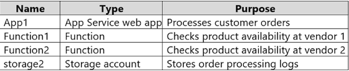

The order processing system will have the following transaction flow

* ✑ A customer will place an order by using App1. 
* ✑ When the order is received, App1 will generate a message to check for product availability at vendor 1 and vendor 2. 
* ✑ **An integration component will process the message, and then trigger either Function1 or Function2 depending on the type of order.** 
* ✑ Once a vendor confirms the product availability, a status message for App1 will be generated by Function1 or Function2. 
* ✑ All the steps of the transaction will be logged to storage1

Which type of resource should you recommend for the integration component?

* A. an Azure Service Bus queue 
* **B. an Azure Data Factory pipeline**   ✅
* C. an Azure Event Grid domain 
* D. an Azure Event Hubs capture

**Azure Data Factory is the platform is the cloud-based ETL and data integration service that allows you to create data-driven workflows for orchestrating data movement and transforming data at scale.** 

Using Azure Data Factory, you can create and schedule data-driven workflows (called pipelines) that can ingest data from disparate data stores.

**Data Factory contains a series of interconnected systems that provide a complete end-to-end platform for data engineers.**

**ADF pipeline can process the message and trigger the appropriate condition. On ADF, you can add a diagnostic setting to send logs to a storage account.**

Other possible options would be Event grid subscription & Service bus topic
 
#### Question 30

You have 100 Microsoft SQL Server Integration Services (SSIS) packages that are configured to use 10 on-premises SQL Server databases as their destinations. 

**You plan to migrate the 10 on-premises databases to Azure SQL Database.** 

**You need to recommend a solution to create Azure-SQL Server Integration Services (SSIS) packages.** 

The solution must ensure that the packages can target the SQL Database instances as their destinations. 

What should you include in the recommendation?

* A. Data Migration Assistant (DMA) 
* **B. Azure Data Factory**   ✅
* C. Azure Data Catalog 
* D. SQL Server Migration Assistant (SSMA)

Migrate on-premises SSIS workloads to SSIS using ADF (Azure Data Factory).

You should include Azure Data Factory in the recommendation to create Azure-SQL Server Integration Services (SSIS) packages. 

Azure Data Factory supports running SSIS packages in the cloud using Azure-SSIS Integration Runtime, which allows you to target Azure SQL Database instances as the destinations for your SSIS packages. This enables you to continue using your existing SSIS packages while migrating your on-premises databases to Azure SQL Database

#### Question 31

You have an Azure virtual machine named VM1 that runs Windows Server 2019 and contains 500 GB of data files. 

You are designing a solution that will use Azure Data Factory to transform the data files, and then load the files to Azure Data Lake Storage. 

What should you deploy on VM1 to support the design?

* A. the On-premises data gateway 
* B. the Azure Pipelines agent 
* **C. the self-hosted integration runtime**   ✅
* D. the Azure File Sync agent

**The integration runtime (IR) is the compute infrastructure that Azure Data Factory and Synapse pipelines use to provide data-integration capabilities across different network environments.**

A self-hosted integration runtime can run copy activities between a cloud data store and a data store in a private network. It also can dispatch transform activities against compute resources in an on-premises network or an Azure virtual network. The installation of a self-hosted integration runtime needs an on-premises machine or a virtual machine inside a private network

The Integration Runtime (IR) is the compute infrastructure used by Azure Data Factory and Azure Synapse pipelines to provide the following data integration capabilities across different network environments

* **Data Flow**: Execute a Data Flow in a managed Azure compute environment. 

**Data movement:** Copy data across data stores in a public or private networks (for both on-premises or virtual private networks). The service provides support for built-in connectors, format conversion, column mapping, and performant and scalable data transfer. 

* **Activity dispatch**: Dispatch and monitor transformation activities running on a variety of compute services such as Azure Databricks, Azure HDInsight, ML Studio (classic), Azure SQL Database, SQL Server, and more. SSIS package execution: Natively execute SQL Server Integration Services (SSIS) packages in a managed Azure compute environment.

#### Question 32

You have an Azure Active Directory (Azure AD) tenant that syncs with an on-premises Active Directory domain. 

Your company has a line-of-business (LOB) application that was developed internally. 

**You need to implement SAML single sign-on (SSO) and enforce multi-factor authentication (MFA) when users attempt to access the application from an unknown location**. 

**Which two features** should you include in the solution? Each correct answer presents part of the solution.

* A. Azure AD Privileged Identity Management (PIM) 
* B. Azure Application Gateway 
* **C. Azure AD enterprise applications**  ✅
* D. Azure AD Identity Protection 
* **E. Conditional Access policies** ✅

**C. Azure AD enterprise applications**: You need to configure the LOB application as an enterprise application in Azure AD. 

This will allow you to configure SAML-based SSO for the application, enabling users to sign in using their Azure AD credentials.

**E. Conditional Access policies**: You can create a Conditional Access policy in Azure AD to enforce MFA when users attempt to access the application from an unknown location. 

**Conditional Access policies allow you to set specific conditions, such as location or device state, and apply security requirements, like MFA, when those conditions are met.**

#### Question 33

You plan to automata the deployment of resources to Azure subscriptions. 

**What is a difference between using Azure Blueprints and Azure Resource Manager (ARM) templates?**

* A. ARM templates remain connected to the deployed resources. 
* B. Only blueprints can contain policy definitions. 
* C. Only ARM templates can contain policy definitions. 
* **D. Blueprints remain connected to the deployed resources**  ✅

With Azure Blueprints, the relationship between the blueprint definition (what should be deployed) and the blueprint assignment (what was deployed) is preserved. This connection supports improved tracking and auditing of deployments

#### Question 34

You have the resources shown in the following table

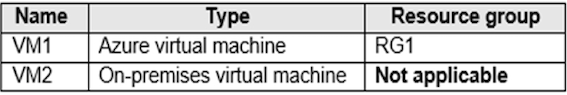

You create a new resource group in Azure named RG2. 

You need to move the virtual machines to RG2. 

What should you use to move each virtual machine? 

To answer, select the appropriate options in the answer area. NOTE: Each correct selection is worth one point

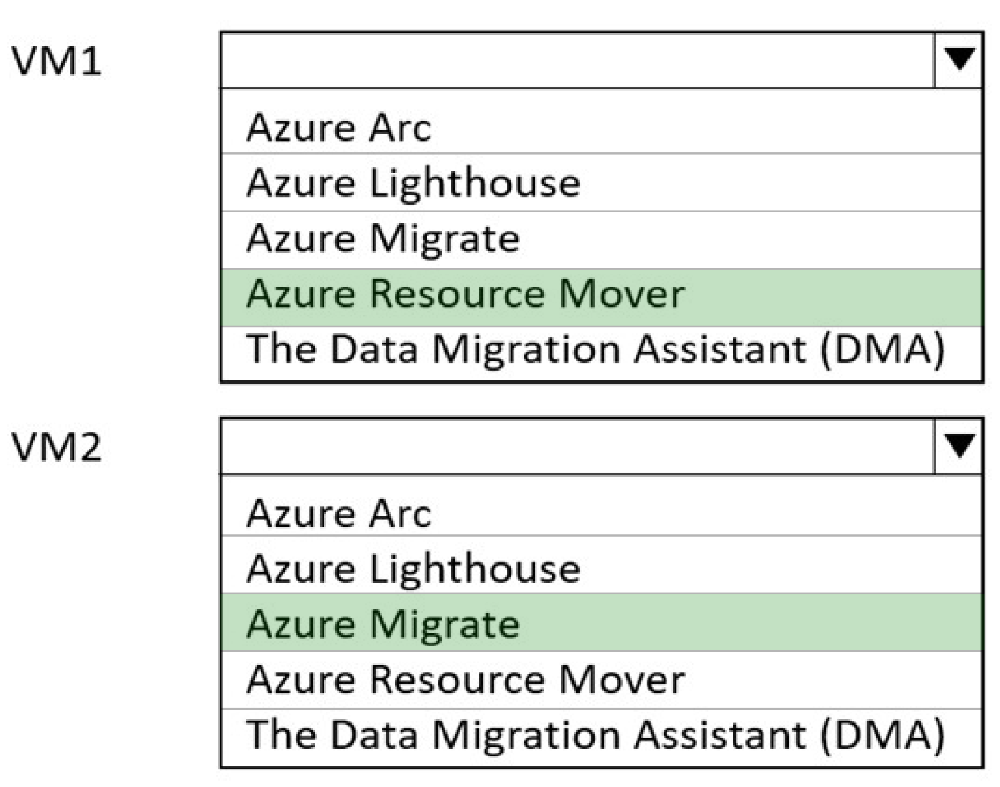

**Box 1: Azure Resource Mover -**

**To move Azure VMs to another region, Microsoft now recommends using Azure Resource Mover.**

**Box 2: Azure Migrate-**

**BOX one Correct. Azure Resource Mover, for moving resources between subscriptions, regions, resource group**

**BOX Two: Correct Azure migrate for moving the resource on-premises to a resource group**

#### Question 35

You plan to deploy an Azure App Service web app that will have multiple instances across multiple Azure regions. 

You need to recommend a load balancing service for the planned deployment The solution must meet the following requirements:

* ✑ Maintain access to the app in the event of a regional outage. 
* ✑ Support Azure Web Application Firewall (WAF). 
* ✑ Support cookie-based affinity. 
* ✑ Support URL routing.

What should you include in the recommendation?

* **A. Azure Front Door** ✅
* B. Azure Traffic Manager 
* C. Azure Application Gateway 
* D. Azure Load Balancer

**Azure Front Door = Supports URL routing.**

A. Azure Front Door

Azure Front Door is the recommended load balancing service for the planned deployment as it meets all the specified requirements:

* ✓ Maintains access to the app in the **event of a regional outage, as it is a global load** balancer with instant failover capabilities. 
* ✓ Supports Azure Web Application Firewall (WAF) integration for security. 
* ✓ Supports cookie-based affinity for session stickiness.
* ✓ Supports URL routing for directing traffic to different backend pools based on URL patterns

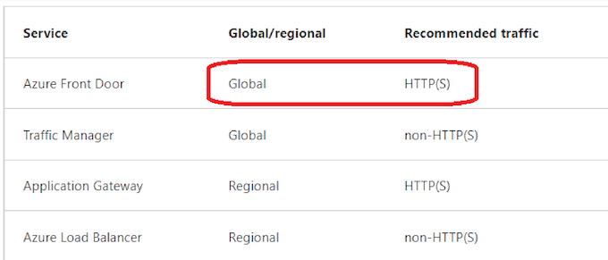

**Azure Front Door works across regions and support URL routing (HTTP(S)).**

Note: **HTTP(S) load-balancing services are Layer 7 load balancers that only accept HTTP(S) traffic.** 

They are intended for web applications or other HTTP(S) endpoints. They include features such as SSL offload, web application firewall, path-based load balancing, and session affinity

**Incorrect: Application Gateway and Azure Load Balancer only work within one single region**

#### Question 36

You have the Azure resources shown in the following table

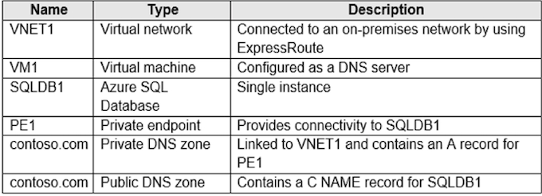

**You need to design a solution that provides on-premises network connectivity to SQLDB1 through PE1.**

How should you configure name resolution? 

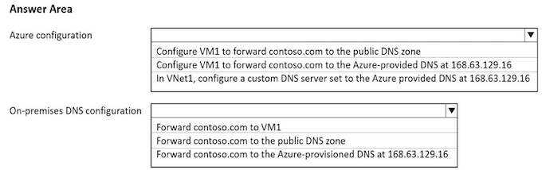

**VNET default configuration is to use azure DNS.**

Box 1 **should be "configure vm1 to forward contoso.com to the azure provided dns at 168.63.129.16" to convert VM1 to a DNS forwarder.** ✅

**Box 2** Forward contoso.com to VM1

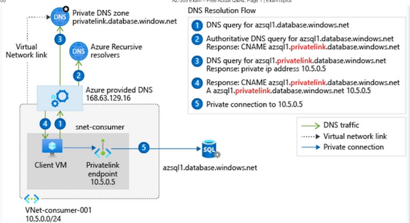

**Box 2: Forward contoso.com to VM1 Forward to the DNS server VM1**

Note: You can use the following options to configure your DNS settings for private endpoints:

* Use the host file (only recommended for testing). You can use the host file on a virtual machine to override the DNS. 
* Use a private DNS zone. You can use private DNS zones to override the DNS resolution for a private endpoint. A private DNS zone can be linked to your virtual network to resolve specific domains.
* Use your DNS forwarder (optional). You can use your DNS forwarder to override the DNS resolution for a private link resource. Create a DNS forwarding rule to use a private DNS zone on your DNS server hosted in a virtual network.

* **In VNet1, configure a custom DNS server set to Azure provided DNS at 168.63.129.16** 

* **On-premises DNS configuration: Forward contoso.com to VM1**

#### Question 37

You are designing a microservices architecture that will support a web application. 

The solution must meet the following requirements: 

* ✑ Deploy the solution on-premises and to Azure. Support low-latency and hyper-scale operations. 
* ✑ Allow independent upgrades to each microservice. 
* ✑ Set policies for performing automatic repairs to the microservices. 

You need to recommend a technology. What should you recommend?

* A. Azure Container Instance 
* B. Azure Logic App 
* **C. Azure Service Fabric** ✅
* D. Azure virtual machine scale set

* **Azure Service Fabric enables you to create Service Fabric clusters on premises or in other clouds.** 
* Azure Service Fabric is low-latency and scales up to thousands of machines.

**Azure Service Fabric is the recommended technology for the microservices architecture you are designing**, as it meets all the specified requirements:

* ✓ Supports deployment both on-premises and to Azure, providing a consistent platform for managing and deploying microservices. 
* ✓ Enables low-latency and hyper-scale operations, as it is designed for building scalable and reliable applications. 
* ✓ Allows independent upgrades to each microservice, as it supports versioning and rolling upgrades. 
* ✓ Provides built-in health monitoring and automatic repairs for the microservices with configurable policies

You can create clusters for Service Fabric in many environments, including Azure or on premises, on Windows Server or Linux. You can even create clusters on other public clouds. The development environment in the Service Fabric SDK is identical to the production environment, with no emulators involved. In other words, what runs on your local development cluster is what deploys to your clusters in other environments

#### Question 38

You plan to deploy multiple instances of an Azure web app across several Azure regions. You need to design an access solution for the app. The solution must meet the following replication requirements

* ✑ Support rate limiting. 
* ✑ Balance requests between all instances. 
* ✑ Ensure that users can access the app in the event of a regional outage

Solution: **You use Azure Front Door to provide access to the app**

Does this meet the goal? 

* **A. Yes** ✅
* B. No

Azure Front Door meets the requirements. **The Azure Web Application Firewall (WAF) rate limit rule for Azure Front Door controls the number of requests allowed from clients during a one-minute duration**

**Azure front door + WAF**

#### Question 39

You need to recommend a solution to generate a monthly report of all the new Azure Resource Manager (ARM) resource deployments in your Azure subscription. 

What should you include in the recommendation?

* **A. Azure Activity Log**   ✅
* B. Azure Arc 
* C. Azure Analysis Services 
* D. Azure Monitor action groups

**Correct Answer: A**

Activity logs are kept for 90 days. You can query for any range of dates, as long as the starting date isn't more than 90 days in the past. Through activity logs, you can determine:

* ✑ what operations were taken on the resources in your subscription 
* ✑ who started the operation

when the operation occurred

* ✑ the status of the operation 
* ✑ the values of other properties that might help you research the operation

The Azure Monitor activity log is a platform log in Azure that provides insight into subscription-level events. The activity log includes information like when a resource is modified or a virtual machine is started.

#### Question 40

You have an Azure subscription. You need to recommend a solution to provide developers with the ability to provision Azure virtual machines. 

The solution must meet the following requirements: 

* ✑ Only allow the creation of the virtual machines in specific regions. 
* ✑ Only allow the creation of specific sizes of virtual machines.

What should you include in the recommendation?

* A. Attribute-based access control (ABAC) 
* **B. Azure Policy**   ✅
* C. Conditional Access policies 
* D. role-based access control (RBAC)

Correct Answer: **B Azure Policies allows you to specify allowed locations, and allowed VM SKUs**

#### Question 41

You are developing a sales application that will contain several Azure cloud services and handle different components of a transaction. 

Different cloud services will process customer orders, billing, payment, inventory, and shipping. 

**You need to recommend a solution to enable the cloud services to asynchronously communicate transaction information by using XML messages.** What should you include in the recommendation?

* A. Azure Notification Hubs 
* B. Azure Data Lake 
* **C. Azure Service Bus** ✅
* D. Azure Blob Storage

**Azure Service Bus is a fully managed enterprise integration message broker. It can be used to enable communication between different services using messages, including XML messages**. 

It supports asynchronous operations and decouples services, which makes it ideal for communication
between the different components mentioned in the scenario. 

The other options aren't suitable for this kind of service-to-service messaging

#### Question 42

You have 100 devices that write performance data to Azure Blob Storage. 

You plan to store and analyze the performance data in an Azure SQL database. 

**You need to recommend a solution to continually copy the performance data to the Azure SQL database.** 

What should you include in the recommendation?

* **A. Azure Data Factory**  ✅
* B. Data Migration Assistant (DMA) 
* C. Azure Data Box 
* D. Azure Database Migration Service

Azure Data Factory is a cloud-based data integration service that allows you to create, schedule, and manage data pipelines. It can be used to continually copy data from various sources, including Azure Blob Storage, to multiple destinations such as an Azure SQL Database. 

The other options aren't suitable for continual data copying in the scenario described

#### Question 43

You need to recommend a storage solution for the records of **a mission critical application. The solution must provide a Service Level Agreement (SLA) for the latency of write operations and the throughput**. 

What should you include in the recommendation?

* A. Azure Data Lake Storage Gen2 
* B. Azure Blob Storage 
* C. Azure SQL 
* **D. Azure Cosmos DB** ✅

Azure Cosmos DB is Microsoft's fast NoSQL database with open APIs for any scale. It offers turnkey global distribution across any number of Azure regions by transparently scaling and replicating your data wherever your users are. The service offers comprehensive 99.99% SLAs which covers the guarantees for throughput, consistency, availability and latency for the Azure Cosmos DB Database Accounts scoped to a single Azure region configured with any of the five Consistency Levels or Database Accounts spanning multiple Azure regions, configured with any of the four relaxed Consistency Levels. 

Azure Cosmos DB allows configuring multiple Azure regions as writable endpoints for a Database Account. In this configuration, Azure Cosmos DB offers 99.999% SLA for both read and write availability

#### Question 44

You are planning a storage solution. 

The solution must meet the following requirements: 

* ✑ Support at least 500 requests per second. 
* ✑ Support a large image, video, and audio streams. 

Which type of Azure Storage account should you provision?

* A. standard general-purpose v2 
* **B. premium block blobs**   ✅
* C. premium page blobs 
* D. premium file shares

- **supports hundreds of thousands of requests per second** 
- video "streaming" requires lots of small data packets to be sent in a short time interval (and thus requires high transaction rates & consistent low- latency)

**Nothing said about minimizing the solution's cost. Premium block blob it's optimized for that**

#### Question 45

You need to recommend a data storage solution that meets the following requirements:

* ✑ Ensures that applications can access the data by using a REST connection 
* ✑ Hosts 20 independent tables of varying sizes and usage patterns 
* ✑ **Automatically replicates the data to a second Azure region**
* ✑ Minimizes costs

What should you recommend?

* A. an Azure SQL Database elastic pool that uses active geo-replication 
* **B. tables in an Azure Storage account that use geo-redundant storage (GRS)** ✅
* C. tables in an Azure Storage account that use read-access geo-redundant storage (RA-GRS) 
* D. an Azure SQL database that uses active geo-replication

The Table service offers structured storage in the form of tables. The Table service API is a REST API for working with tables and the data that they contain. 

Geo-redundant storage (GRS) has a lower cost than read-access geo-redundant storage (RA-GRS).

#### Question 46

You are designing a software as a service (SaaS) application that will enable Azure Active Directory (Azure AD) users to create and publish online surveys. The SaaS application will have a front-end web app and a back-end web API. The web app will rely on the web API to handle updates to customer surveys

You need to design an authorization ow for the SaaS application. The solution must meet the following requirements:

- ✑ **To access the back-end web API, the web app must authenticate by using OAuth 2 bearer tokens.**
- ✑ The web app must authenticate by using the identities of individual users

What should you include in the solution? To answer, select the appropriate options in the answer area.

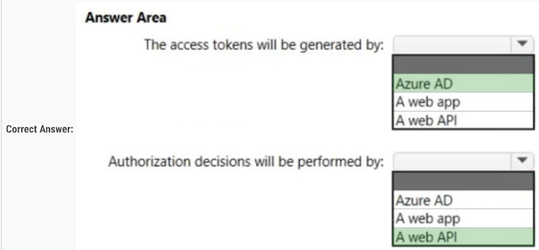

**Box 1: Azure AD -**

The Azure AD server issues tokens (access & refresh token). See step 5 below in graphic.

- OAuth 2.0 authentication with Azure Active Directory.
- The OAuth 2.0 is the industry protocol for authorization. It allows a user to grant limited access to its protected resources. Designed to work
- specically with Hypertext Transfer Protocol (HTTP), OAuth separates the role of the client from the resource owner.
- The client requests access to the resources controlled by the resource owner and hosted by the resource server (here the Azure AD server).
- The resource server issues access tokens with the approval of the resource owner. 
- The client uses the access tokens to access the protected resources hosted by the resource server

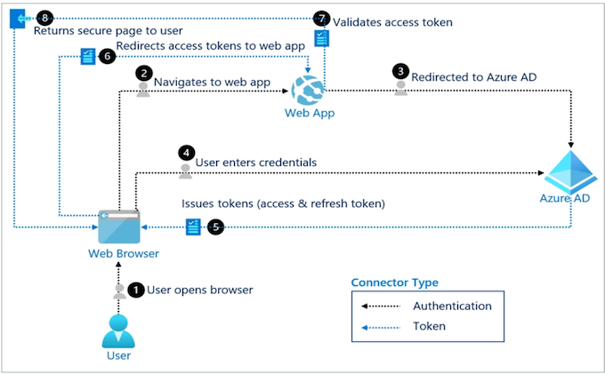

**Box 2: A web API -**

- Delegated access is used.
- The bearer token sent to the web API contains the user identity.
- **The web API makes authorization decisions based on the user identity**

**1. The access tokens will be generated by: a. Azure AD**

Azure AD is the identity provider and is responsible for generating access tokens in an OAuth 2.0 flow. The web app will authenticate with Azure
AD and receive an access token.

**2. Authorization decisions will be performed by: c. a web API**

The web API, as the resource server in the OAuth 2.0 flow, is responsible for making authorization decisions. It validates the access token it receives from the web app and determines what resources the authenticated user can access.

#### Question 47

You plan to create an Azure environment that will contain a root management group and 10 child management groups. Each child management
group will contain five Azure subscriptions. You plan to have between 10 and 30 resource groups in each subscription.

You need to design an Azure governance solution. The solution must meet the following requirements:

- ✑ Use Azure Blueprints to control governance across all the subscriptions and resource groups.
- ✑ **Ensure that Blueprints-based configurations are consistent across all the subscriptions and resource groups.**
- ✑ Minimize the number of blueprint definitions and assignments.

What should you include in the solution? To answer, select the appropriate options in the answer area.

NOTE: Each correct selection is worth one point.

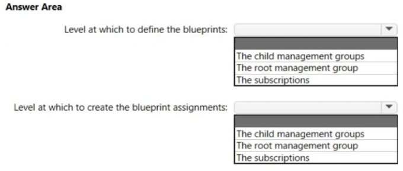

- Define: **Root Management Groups**  ✅

- Assignments: **Subscriptons.**  ✅

Assigning a blueprint definition to a management group means the assignment object exists at the management group.
The deployment of artifacts still targets a subscription

#### Question 48

You are designing a virtual machine that will **run Microsoft SQL Server and contain two data disks. The first data disk will store log miles, and the second data disk will store data. Both disks are P40 managed disks**.

**You need to recommend a host caching method for each disk**. The method must provide the best overall performance for the virtual machine
while preserving the integrity of the SQL data and logs.

Which host caching method should you recommend for each disk? To answer, drag the appropriate methods to the correct disks. Each method
may be used once, more than once, or not at all. You may need to drag the split bar between panes or scroll to view content.

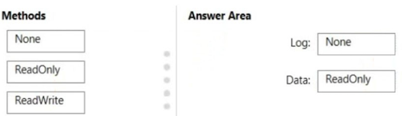

**Box 1: None -**

**No data disk caching for the Log files.**

Your storage caching policy varies depending on the type of SQL Server data files that are hosted on the drive.

**Box 2: ReadOnly -**

Guidelines to optimize performance for your SQL Server on Azure Virtual Machines (VMs) include:

- **Set host caching to read-only for data file disks.**
- **Set host caching to none for log file disks**.

- Enable Read-only caching for the disks hosting SQL Server data files.
- Reads from cache will be faster than the uncached reads from the data disk.
- Uncached IOPS and throughput plus Cached IOPS and throughput will yield the total possible performance available from the virtual machine within the VMs limits, but actual performance will vary based on the workload's ability to use the cache (cache hit ratio).

#### Question 49

You are designing a solution that calculates 3D geometry from height-map data.

You need to recommend a solution that meets the following requirements:

- ✑ Performs calculations in Azure.
- ✑ Ensures that each node can communicate data to every other node.
- ✑ Maximizes the number of nodes to calculate multiple scenes as fast as possible.

Minimizes the amount of effort to implement the solution.

Which two actions should you include in the recommendation? Each correct answer presents part of the solution.

NOTE: Each correct selection is worth one point.

- [ ] A. Enable parallel file systems on Azure.
- [ ] B. Create a render farm that uses virtual machines.
- [ ] C. Create a render farm that uses virtual machine scale sets.
- [x] **D. Create a render farm that uses Azure Batch.**.    ✅
- [x] **E. Enable parallel task execution on compute nodes.**.   ✅

Multi-instance tasks allow you to run an Azure Batch task on multiple compute nodes simultaneously. **These tasks enable high performance computing scenarios like Message Passing Interface (MPI) applications in Batch.**

- You configure compute nodes for parallel task execution at the pool level.
- Azure Batch allows you to set task slots per node up to (4x) the number of node cores.

Azure Batch is designed for high-performance parallel computing. It's a cloud-based job scheduling service that parallelizes the processing of large
volumes of data across many virtual machines. It allows for each node to communicate data to every other node, which is a requirement in the
question

Parallel task execution enables concurrent processing of multiple tasks on a single compute node, thereby maximizing the number of nodes to
calculate multiple scenes as fast as possible. This can help to speed up processing times.

#### Question 50

You have an on-premises application that consumes data from multiple databases. The application code references database tables by using a
combination of the server, database, and table name.

**You need to migrate the application data to Azure.**

To which two services can you migrate the application data to achieve the goal? Each correct answer presents a complete solution.

NOTE: Each correct selection is worth one point.

- [ ] A. SQL Server Stretch Database
- [X] B. **SQL Server on an Azure virtual machine.**   ✅
- [ ] C. Azure SQL Database
- [X] D. **Azure SQL Managed Instance**.  ✅

B. SQL Server on an Azure virtual machine allows you to migrate your on-premises SQL Server databases to Azure with very minimal changes to your application. The application code can continue to reference the database tables in the same manner as it did on-premises.

D. **Azure SQL Managed Instance is a fully-managed SQL Server Database Engine hosted in Azure cloud.** It provides near 100% compatibility with
the on-premises SQL Server and supports the same server, database, and table naming conventions, which suits the requirement of the application.

#### Question 51

You plan to migrate on-premises Microsoft SQL Server databases to Azure.

You need to recommend a deployment and resiliency solution that meets the following requirements:

- ✑ Supports user-initiated backups
- ✑ Supports multiple automatically **replicated instances across Azure regions**
- ✑ **Minimizes administrative effort to implement and maintain business continuity**

What should you recommend? 

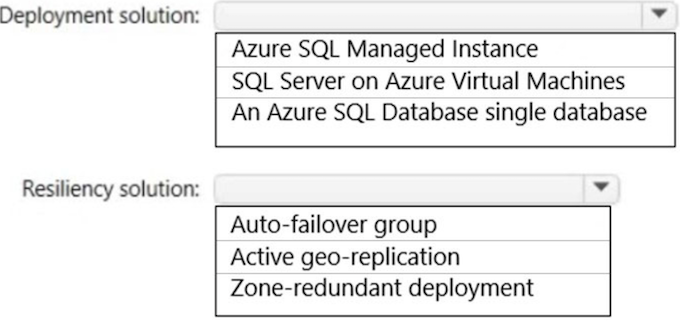

**Azure SQL Managed instances &  Auto Failover Group** ✅

- supports User Initiated Backups and minimizes administrative effort for business continuity.
- **Auto failover groups**

#### Question 52

You need to design a highly available Azure SQL database that meets the following requirements:

- ✑ **Failover between replicas of the database must occur without any data loss**.
- ✑ The database must remain available in the event of a zone outage.
- ✑ Costs must be minimized.

Which deployment option should you use?

- [ ] A. Azure SQL Managed Instance Business Critical
- [ ] B. Azure SQL Managed Instance General Purpose
- [ ] C. Azure SQL Database Business Critical
- [x] **D. Azure SQL Database Serverless**  ✅

Azure SQL Database Serverless meets the requirements and **is less expensive than Azure SQL Database Business Critical**.

Note: General Purpose service tier zone redundant availability

Zone-redundant configuration for the general purpose service tier is offered for both serverless and provisioned compute to replicate databases across multiple physical locations within an Azure region

This configuration utilizes Azure Availability Zones By selecting zone-redundancy, you can make your new and existing serverless and provisioned generalג purpose single databases and elastic pools resilient to a much larger set of failures, including catastrophic datacenter outages, without any changes of the application logic.

**Incorrect:**

**Not A, not B: Zone-redundant configuration is not available in SQL Managed Instance.**

**Not C: Azure SQL Database Business Critical is more expensive than Azure SQL Database Serverless.**

Note: Premium and Business Critical service tiers use the Premium availability model, which integrates compute resources (sqlservr.exe
process) and storage(locally attached SSD) on a single node. High availability is achieved by replicating both compute and storage to additional nodes creating a three to four-node cluster.

The answer priority is as follows. If it exists then choose it. If it doesn't, proceeded to the next priority. Sometimes both appear in the same
question, so make sure to select the higher priority.

1. **Azure SQL Database Premium**
2. **Azure SQL Database Serverless**
3. **Azure SQL Database Business Critical**

#### Question 53

You have an Azure web app that uses an Azure key vault named KeyVault1 in the West US Azure region.

You are designing a disaster recovery plan for KeyVault1.

**You plan to back up the keys in KeyVault1.**

You need to identify to where you can restore the backup.

What should you identify?

- [ ] A. any region worldwide
- [ ] B. the same region only
- [ ] C. KeyVault1 only
- [x] **D. the same geography only**   ✅

Using the backup and restore commands has two limitations:

* **You can't back up a key vault in one geography and restore it into another geography**.
* **The backup command backs up all versions of each secret**.

Incorrect:

**Not A: Azure Key Vault does not allow you to move a key vault from one region to another**. 

You can, however, **create a key vault in the new region, manually copy each individual key, secret, or certificate from your existing key vault to the new key vault, and then remove the original key vault.**

When you back up a key vault object, such as a secret, key, or certificate, the backup operation will download the object as an encrypted blob. 

This blob can't be decrypted outside of Azure. To get usable data from this blob, you must restore the blob into a key vault within the same Azure subscription and Azure geography

#### Question 54

You have an on-premises line-of-business (LOB) application that uses a Microsoft SQL Server instance as the backend.

You plan to migrate the on-premises SQL Server instance to Azure virtual machines.

You need to recommend a highly available SQL Server deployment that meets the following requirements:

**Minimizes costs**

Minimizes failover time if a single server fails

What should you include in the recommendation?

- [ ] A. an Always On availability group that has premium storage disks and a virtual network name (VNN)
- [ ] B. an Always On Failover Cluster Instance that has a virtual network name (VNN) and a standard file share
- [X] C. **an Always On availability group that has premium storage disks and a distributed network name (DNN)**  ✅
- [ ] D. an Always On Failover Cluster Instance that has a virtual network name (VNN) and a premium file share

Always On availability groups on Azure Virtual Machines are similar to Always On availability groups on-premises, and rely on the underlying
Windows Server Failover Cluster.

If you deploy your SQL Server VMs to a single subnet, you can configure a virtual network name (VNN) and an Azure Load Balancer, or a
distributed network name (DNN) to route traffic to your availability group listener.

There are some behavior differences between the functionality of the VNN listener and DNN listener that are important to note:

* Failover time: Failover time is faster when using a DNN listener since there is no need to wait for the network load balancer to detect the
failure event and change its routing

**Incorrect:**

C. an Always On availability group that has premium storage disks and a distributed network name (DNN).

**The Always On Availability Group with a Distributed Network Name (DNN) would be the better choice due to the faster failover time, which aligns with the requirement of minimizing failover time if a single server fails.**

The DNN listener in this case doesn't require an Azure Load Balancer to reroute traffic, resulting in quicker failovers compared to the VNN listener.
This is a great choice when high availability and minimal failover time are prioritized

#### Question 55

Your company plans to deploy various Azure App Service instances that will use Azure SQL databases. The App Service instances will be deployed at the same time as the Azure SQL databases.

The company has a regulatory requirement to deploy the App Service instances only to specific Azure regions. The resources for the App Service instances must reside in the same region.

You need to recommend a solution to meet the regulatory requirement.

**Solution: You recommend creating resource groups based on locations and implementing resource locks on the resource groups.**

Does this meet the goal?

- [ ] A. Yes
- [X] B. **No**  ✅

**You should recommend using an Azure Policy initiative to enforce the location**

Note: Azure Resource Policy Definitions can be used which can be applied to a specific Resource Group with the App Service instances.
In Azure Policy, we offer several built-in policies that are available by default. For example

* Allowed Locations (Deny): Restricts the available locations for new resources. Its effect is used to enforce your geo-compliance

**B. No**

While creating resource groups based on locations can help organize resources, it does not inherently limit the regions where resources can be
deployed. 

**Resource locks protect resources from accidental deletion or modification, but they do not restrict where resources can be created**. For
enforcing location restrictions, Azure Policy with location-based policies would be a better option. These policies can be used to ensure resources
are only created in specified locations.

As an administrator, you can lock an Azure subscription, resource group, or resource to protect them from accidental user deletions and
modifications. The lock overrides any user permissions.

You can set locks that prevent either deletions or modifications. In the portal, these locks are called Delete and Read-only. In the command line,
these locks are called CanNotDelete and ReadOnly.

- CanNotDelete means authorized users can read and modify a resource, but they can't delete it.
- ReadOnly means authorized users can read a resource, but they can't delete or update it. Applying this lock is similar to restricting all authorized users to the permissions that the Reader role provides

#### Question 56

Your company plans to deploy various Azure App Service instances that will use Azure SQL databases. The App Service instances will be deployed at the same time as the Azure SQL databases.

The company has a regulatory requirement to deploy the App Service instances only to specific Azure regions. The resources for the App Service instances must reside in the same region.

You need to recommend a solution to meet the regulatory requirement.

**Solution: You recommend using the Regulatory compliance dashboard in Microsoft Defender for Cloud.**

Does this meet the goal?

- [ ] A. Yes
- [X] **B. No**

Instead; **you should recommend using an Azure Policy initiative to enforce the location**

Note: Azure Resource Policy Definitions can be used which can be applied to a specific Resource Group with the App Service instances.
In Azure Policy, we offer several built-in policies that are available by default. For example:

* Allowed Locations (Deny): Restricts the available locations for new resources.
* Its effect is used to enforce your geo-compliance

**B. No**.  ✅

The Regulatory Compliance dashboard in Microsoft Defender for Cloud helps monitor the compliance of your Azure resources with different
regulatory requirements, but it doesn't inherently restrict or control where resources can be deployed. To ensure that resources are deployed only
in specific regions, you would use Azure Policy with location-based policies.

The regulatory compliance dashboard shows the status of all the assessments within your environment for your chosen standards and regulations.
As you act on the recommendations and reduce risk factors in your environment, your compliance posture improve

#### Question 57

Your company plans to deploy various Azure App Service instances that will use Azure SQL databases. The App Service instances will be deployed at the same time as the Azure SQL databases.

The company has a regulatory requirement to deploy the App Service instances only to specific Azure regions. **The resources for the App Service instances must reside in the same region.**

You need to recommend a solution to meet the regulatory requirement.

**Solution: You recommend using an Azure Policy initiative to enforce the location.**

Does this meet the goal?

- **A. Yes**    ✅
- B. No

**Azure Resource Policy Definitions can be used which can be applied to a specific Resource Group with the App Service instances**.

In Azure Policy, we offer several built-in policies that are available by default. For example:

* Allowed Locations (Deny): **Restricts the available locations for new resources. Its effect is used to enforce your geo-compliance**
  
Azure Policy can enforce specific locations for resource deployment, ensuring that App Service instances and Azure SQL databases are deployed
only in specified regions, which aligns with the regulatory requirements of the company. This helps maintain control over where resources are created and ensures compliance.

#### Question 58

You plan to move a web app named App1 from an on-premises datacenter to Azure.

App1 depends on a custom COM component that is installed on the host server.

You need to recommend a solution to host App1 in Azure. The solution must meet the following requirements:

- ✑ **App1 must be available to users if an Azure datacenter becomes unavailable**.
- ✑ Costs must be minimized.

What should you include in the recommendation?

- [ ] A. In two Azure regions, deploy a load balancer and a web app.
- [ ] B. In two Azure regions, deploy a load balancer and a virtual machine scale set.
- [X] C. **Deploy a load balancer and a virtual machine scale set across two availability zones**. ✅
- [ ] D. In two Azure regions, deploy an Azure Traffic Manager profile and a web app. 

Correct Answer: C

- Need to use a virtual machine as Azure App service does not allow COM components.
- Need two availability zones to protect against an Azure datacenter failure

**Not A, Not D: Cannot use a web app.**

Azure App Service does not allow the registration of COM components on the platform. If your app makes use of any COM components, these
need to be rewritten in managed code and deployed with the site or application.

- **A -> webapp -> No COM**
- **B -> LB cannot be in two regions**
- C -> OK
- **D -> webapp -> No COM**

#### Question #59

You plan to deploy an application named App1 that will run in containers on Azure Kubernetes Service (AKS) clusters. The AKS clusters will be
distributed across four Azure regions.

You need to recommend a storage solution to ensure that updated container images are replicated automatically to all the Azure regions hosting the AKS clusters.

Which storage solution should you recommend?

- [ ] A. geo-redundant storage (GRS) accounts
- [X] **B. Premium SKU Azure Container Registry** 
- [ ] C. Azure Content Delivery Network (CDN)
- [ ] D. Azure Cache for Redis

**Enable geo-replication for container images.**

Best practice: **Store your container images in Azure Container Registry and geo-replicate the registry to each AKS region.**

To deploy and run your applications in AKS, you need a way to store and pull the container images. Container Registry integrates with AKS, so it can securely store your container images or Helm charts. Container Registry supports multimaster geo-replication to automatically replicate your images to Azure regions around the world.

Geo-replication is a feature of Premium SKU container registries.

**Note**:

When you use Container Registry geo-replication to pull images from the same region, the results are:

- Faster: You pull images from high-speed, low-latency network connections within the same Azure region.
- More reliable: If a region is unavailable, your AKS cluster pulls the images from an available container registry.
- Cheaper: There's no network egress charge between datacenters

**B. Geo-Replication is a premium SKU container registry feature.**

Azure Container Registry is a managed Docker registry service used for storing private Docker container images. It's tightly integrated with Azure
Kubernetes Service (AKS) and provides streamlined Docker image builds, storage, and retrieval.

The premium SKU of Azure Container Registry supports several advanced features, including the geo-replication of registries. Geo-replication
enables an Azure container registry to function as a single registry, serving multiple regions with multi-master regional registries. This means that
when you push an image to your registry, it is available across all geo-replicated regions, 

#### Question 60

You have an Azure Active Directory (Azure AD) tenant.

You plan to deploy Azure Cosmos DB databases that will use the SQL API.

You need to recommend a solution to provide **specific Azure AD user accounts with read access to the Cosmos DB databases.**

What should you include in the recommendation?

- [ ] A. shared access signatures (SAS) and Conditional Access policies
- [ ] B. certificates and Azure Key Vault
- [ ] C. master keys and Azure Information Protection policies
- [x] **D. a resource token and an Access control (IAM) role assignment**  ✅

**Correct Answer: D**

**The Access control (IAM) pane in the Azure portal is used to configure role-based access control on Azure Cosmos resources.**

The roles are applied to users, groups, service principals, and managed identities in Active Directory. You can use built-in roles or custom roles for individuals and groups. The following screenshot shows Active Directory integration (RBAC) using access control (IAM) in the Azure portal:

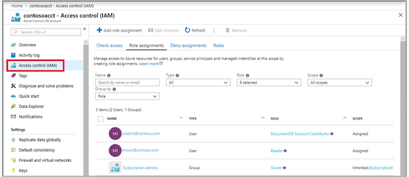

Note: To use the Azure Cosmos DB RBAC in your application, you have to update the way you initialize the Azure Cosmos DB SDK. Instead of
passing your account's primary key, you have to pass an instance of a TokenCredential class. This instance provides the Azure Cosmos DB SDK
with the context required to fetch an Azure AD (AAD) token on behalf of the identity you wish to use.

**Azure Cosmos DB's SQL API provides two types of authorization: master key token and resource token.** 

* Master key tokens provide access to the all
data and all permissions. 
* Resource tokens provide access to specific containers and permissions, and you can create these tokens with an Azure AD user's identity.

To provide Azure AD users with access to the Azure Cosmos DB, you would assign them a specific IAM role. Azure Cosmos DB uses Azure role-based access control (Azure RBAC) for providing specific access. Azure RBAC is an authorization system built on Azure Resource Manager that provides fine-grained access management of resources in Azure.

The combination of a resource token and an IAM role assignment would provide the necessary access control for the Azure AD user accounts to have read access to the Cosmos DB databases.

#### Question 61

You need to recommend an Azure Storage solution that meets the following requirements:

- ✑ The storage must support 1 PB of data.
- ✑ The data must be stored in blob storage.
- ✑ The storage must support three levels of subfolders.
- ✑ The storage must support access control lists (ACLs).

What should you include in the recommendation?

- [ ] A. a premium storage account that is configured for block blobs
- [x] B. **a general purpose v2 storage account that has hierarchical namespace enabled**   ✅
- [ ] C. a premium storage account that is configured for page blobs
- [ ] D. a premium storage account that is configured for file shares and supports large file shares

**Correct Answer: B**

Default limits for Azure general-purpose v2 (GPv2)general-purpose v1 (GPv1), and Blob storage accounts include:

* Default maximum storage account capacity: 5 PiB

Blob storage supports Azure Data Lake Storage Gen2, Microsoft's enterprise big data analytics solution for the cloud. Azure Data Lake Storage Gen2 offers a hierarchical file system as well as the advantages of Blob storage.

Incorrect:

**Not D: In a Premium FileStorage account, storage size is limited to 100 TB.**

B. a general purpose v2 storage account that has hierarchical namespace enabled.

GPv2 with hierarchical structure gives you the following provisions:

- The storage must support three levels of subfolders.
- The storage must support access control lists (ACLs).
- The storage must support 1 PB of data.
- The data must be stored in blob storage.

#### Question 62

You manage a database environment for a Microsoft Volume Licensing customer named Contoso, Ltd. Contoso uses License Mobility through Software
Assurance.

You need to deploy 50 databases. The solution must meet the following requirements:

- ✑ Support automatic scaling.
- ✑ Minimize Microsoft SQL Server licensing costs.

What should you include in the solution? To answer, select the appropriate options in the answer area.

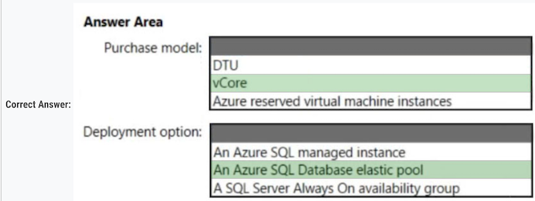

**Box 1: vCore -**  ✅

You can only apply the Azure Hybrid licensing model when you choose a vCore-based purchasing model and the provisioned compute tier for
your Azure SQL Database. Azure Hybrid Benefit isn't available for service tiers under the DTU-based purchasing model or for the serverless compute tier.

**Box 2: An Azure SQL Database elastic pool**  ✅

Azure SQL Database elastic pools are a simple, cost-effective solution for managing and scaling multiple databases that have varying and
unpredictable usage demands. The databases in an elastic pool are on a single server and share a set number of resources at a set price.
Elastic pools in SQL Database enable software as a service (SaaS) developers to optimize the price performance for a group of databases
within a prescribed budget while delivering performance elasticity for each database.

VCore - With the provisioned compute, you can choose the amount of compute resources that are always provisioned for your workload. With the
serverless compute you can specify the autoscaling of the compute resources over a configurable compute range.

#### Question 63

You have an on-premises application named App1 that uses an Oracle database.

You plan to use Azure Databricks to transform and load data from App1 to an Azure Synapse Analytics instance.

**You need to ensure that the App1 data is available to Databricks**.

Which two Azure services should you include in the solution? Each correct answer presents part of the solution.

- [ ] A. Azure Data Box Gateway
- [ ] B. Azure Import/Export service
- [x] C. **Azure Data Lake Storage**.  ✅
- [ ] D. Azure Data Box Edge
- [X] E. **Azure Data Factory**.   ✅

**The correct answer should be C and E**

**ADF moves data from on-prem Oracle to Data Lake storage, which makes data ready for DataBrick**

**DataBricks "ETL" data to Synapse:**

- **ADF - to extract and load data to Data Lake**
- **Data Lake - as it's the only storage generally supported by Databricks**

Azure Data Lake Storage is a secure, scalable and reliable data lake that allows you to perform analytics on large amounts of data. It's a great
choice for storing large volumes of data, like what App1 might produce

Azure Data Factory is a cloud-based data integration service that allows you to create data-driven workflows for moving and transforming data at
scale. In this case, it can be used to create a pipeline to move the data from your on-premises Oracle database to Azure Data Lake Storage, making
it available for further processing with Azure Databricks. Azure Data Factory has built-in support for a wide range of data sources, including Oracle

#### Question 64

You are designing a cost-optimized solution that uses Azure Batch to run two types of jobs on Linux nodes. 

The first job type will consist of short-running tasks for a development environment. 

**The second job type will consist of long-running Message Passing Interface (MPI) applications for a production environment that requires timely job completion.** 

You need to recommend the pool type and node type for each job type. 

The solution must minimize compute charges and leverage Azure Hybrid Benefit whenever possible. What should you recommend? To answer, select the appropriate options in the answer area

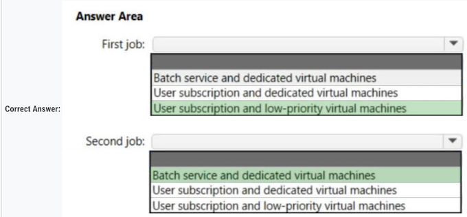

**Box 1: User subscription and low-priority virtual machines**

The first job type will consist of short-running tasks for a development environment.** Among the many ways to purchase and consume Azure resources are Azure low priority VMs and Spot VMs.** 

These virtual machines are compute instances allocated from spare capacity, offered at a highly discounted rate compared to on demandג VMs. This means they can be a great option for cost savings for the right workloads

**Box 2: Batch service and dedicate virtual machines**

**The second job type will consist of long-running Message Passing Interface (MPI) applications for a production environment that requires timely job completion**. 

Azure Batch Service is a cloud based job scheduling and compute management platform that enables running large-scale parallel and high performance computing applications efficiently in the cloud. Azure Batch Service provides job scheduling and in automatically scaling and managing virtual machines running those jobs.

- Low Priority VMs 
- batch service and dedicated VMs

#### Question 65

You are developing a sales application that will contain several Azure cloud services and handle different components of a transaction. Different cloud services will process customer orders, billing, payment, inventory, and shipping. 

**You need to recommend a solution to enable the cloud services to asynchronously communicate transaction information by using XML messages**. What should you include in the recommendation?

* A. Azure Notification Hubs 
* B. Azure Service Fabric 
* **C. Azure Queue Storage**  ✅
* D. Azure Data Lake

**Queue Storage delivers asynchronous messaging between application components, whether they are running in the cloud**, on the desktop, on an on-premises server, or on a mobile device. The maximum message size supported by Azure Storage Queues is 64KB while Azure Service Bus Queues support messages up to 256KB. 

This becomes an important factor especially when the message format is padded (such as XML).

**Either its Azure Queue Storage or its Azure Service Bus.**

#### Question 66

You are developing a sales application that will contain several Azure cloud services and handle different components of a transaction. Different cloud services will process customer orders, billing, payment, inventory, and shipping. 

You need to recommend a solution to enable the cloud services to asynchronously communicate transaction information by using XML messages. What should you include in the recommendation?

* A. Azure Notification Hubs 
* B. Azure Service Fabric 
* **C. Azure Queue Storage**  ✅
* D. Azure Application Gateway

Queue storage is often used to create a backlog of work to process asynchronously. A queue message must be in a format compatible with an XML request using UTF-8 encoding. 

#### Question 67

You need to design a highly available Azure SQL database that meets the following requirements:

* Failover between replicas of the database must occur without any data loss. 
* The database must remain available in the event of a zone outage. 
* Costs must be minimized.

Which deployment option should you use?

* A. Azure SQL Database Hyperscale 
* **B. Azure SQL Database Premium**   ✅
* C. Azure SQL Database Basic 
* D. Azure SQL Database Standard

**Whenever zone-redundancy (availability within the same region) is required you can only choose: -General Purpose**

- **General Purpose** 
- **Premium** 
- **Business Critical**

**Basic and Standard do not support zone-redundancy:**

#### Question 68

You are developing a sales application that will contain several Azure cloud services and handle different components of a transaction. Different cloud services will process customer orders, billing, payment, inventory, and shipping

You need to recommend a solution to enable the cloud services to asynchronously communicate transaction information by using XML messages.

What should you include in the recommendation?

* **A. Azure Service Bus**  ✅
* B. Azure Data Lake 
* C. Azure Traffic Manager 
* D. Azure Blob Storage

(**Azure Service Bus + Azure Queue Storage)**

Azure Service Bus because it is a messaging service that supports asynchronous communication between different components of an application.

* It enables the exchange of messages using different protocols and message patterns, including XML messages. 
* It also supports features such as pub/sub messaging, message batching, and message ordering.

Azure Service Bus is a fully managed enterprise message broker with message queues and publish-subscribe topics (in a namespace). Service Bus is used to decouple applications and services from each other, providing the following benefits:

- Load-balancing work across competing workers 
- Safely routing and transferring data and control across service and application boundaries 
- Coordinating transactional work that requires a high-degree of reliability

#### Question 69

You need to design a highly available Azure SQL database that meets the following requirements:

* Failover between replicas of the database must occur without any data loss. 
* The database must remain available in the event of a zone outage. 
* Costs must be minimized.

Which deployment option should you use?

* A. Azure SQL Database Basic 
* B. Azure SQL Managed Instance General Purpose 
* **C. Azure SQL Database Business Critical**   ✅
* D. Azure SQL Managed Instance Business Critical

The Business Critical service tier is designed for OLTP applications with high transaction rates and low latency I/O requirements. It offers the highest resilience to failures by using several isolated replicas.

B is wrong because Azure SQL Managed Instance General Purpose does not support Zone redundancy.

**C. Azure SQL Database Business Critical**

**The Business Critical service tier is designed for applications that require low-latency responses and high transaction rates, and need the highest degree of resilience to failures.**

**Whenever zone-redundancy (availability within the same region) is required you can only choose: -General Purpose**

- **General Purpose** 
- **Premium** 
- **Business Critical**

**Basic and Standard do not support zone-redundancy:**

It supports multiple read-only replicas, and failover between replicas of the database occurs without any data loss. It is also designed to maintain availability in the event of a zone outage. 

**While Azure SQL Managed Instance Business Critical also provides high availability and zero data loss, it generally costs more than Azure SQL Database Business Critical.**

Therefore, to minimize costs as per your requirement, Azure SQL Database Business Critical would be a better choice. 

Azure SQL Database Basic and Azure SQL Managed Instance General Purpose do not offer the same level of high availability and data resilience as the Business Critical options.

#### Question 70

You have an Azure subscription. 

You need to deploy an Azure Kubernetes Service (AKS) solution that will use Windows Server 2019 nodes. The solution must meet the following requirements: 

* Minimize the time it takes to provision compute resources during scale-out operations.
* Support autoscaling of Windows Server containers. 

Which scaling option should you recommend?

* A. horizontal pod autoscaler 
* B. Virtual nodes 
* C. Kubernetes version 1.20.2 or newer 
* **D. cluster autoscaler** ✅

**cluster autoscaler - For Windows** 

**virtual nodes - For Linux**

#### Question 71

Your company has offices in North America and Europe. 

You plan to migrate to Azure. You need to recommend a networking solution for the new Azure infrastructure. 

The solution must meet the following requirements:

* The Point-to-Site (P2S) VPN connections of mobile users must **connect automatically to the closest Azure region**. 
* The offices in each region must connect to their local Azure region by using an ExpressRoute circuit. 
* Transitive routing between virtual networks and on-premises networks must be supported. 
* The network traffic between virtual networks must be filtered by using FQDNs

What should you include in the recommendation?

* **A. Azure Virtual WAN with a secured virtual hub**    ✅
* B. virtual network peering and application security groups 
* C. virtual network gateways and network security groups (NSGs) 
* D. Azure Route Server and Azure Network Function Manager

**The Virtual WAN meets the first 3 requirements, and the secured virtual hub has the Azure Firewall Manager, which can do the FQDN filtering.**

**Option A, Azure Virtual WAN with a secured virtual hub**, 

is the best recommendation for this scenario as it allows for automatic connection of mobile users to the closest Azure region, connection of offices to their local Azure region via ExpressRoute circuits, support for transitive routing, and filtering of network traffic between virtual networks by using FQDNs.

Option B, virtual network peering and application security groups, **does not provide automatic connection of mobile users to the closest Azure region or support for transitive routing**

Option C, virtual network gateways and network security groups (NSGs), **does not provide automatic connection of mobile users to the closest Azure region or support for transitive routing, and filtering network traffic between virtual networks by using FQDNs is more challenging.**

**Option D, Azure Route Server and Azure Network Function Manager， does not provide automatic connection of mobile users to the closest Azure region or support for filtering network traffic between virtual networks by using FQDNs**

#### Question 72

You need to design a highly available Azure SQL database that meets the following requirements:

* Failover between replicas of the database must occur without any data loss. 
* The database must remain available in the event of a zone outage. 
* Costs must be minimized.

Which deployment option should you use?

* **A. Azure SQL Database Business Critical**  ✅
* B. Azure SQL Managed Instance Business Critical 
* C. Azure SQL Database Standard 
* D. Azure SQL Managed Instance General Purpose

**C is wrong option because Azure SQL Database Standard do not have Zone-redundant availability.**

**Zone-redundant availability is available to databases in the General Purpose, Premium, Business Critical and Hyperscale service** tiers of the vCore purchasing model, and not the Basic and Standard service tiers of the DTU-based purchasing model. Zone-redundant availability ensures Recovery Point Objective (RPO) which indicates the amount of data loss is zero.

Always the answers are (in this order):

1. **Azure SQL Database Premium**
2. **Azure SQL Database Serverless**
3. **Azure SQL Database Business Critical**

**If there is only one of them, select it. If there are 2 of them, remember the order, and select the option in the order showed here.**

#### Question 73

You are designing a point of sale (POS) solution that will be deployed across multiple locations and will use an Azure Databricks workspace in the Standard tier. The solution will include multiple apps deployed to the on-premises network of each location.

You need to configure the authentication method that will be used by the app to access the workspace. The solution must minimize the administrative effort associated with staff turnover and credential management.

What should you configure?

* A. a managed identity 
* **B. a service principal**  ✅
* C. a personal access token

**A managed identity is a type of service principal.**

**MID can be used only between Azure resources, here we have on-prem application communicating to Azure resources, then you need a service principal**

#### Question 74

You have two Azure AD tenants named contoso.com and fabrikam.com. Each tenant is linked to 50 Azure subscriptions. Contoso.com contains two users named User1 and User2.

You need to meet the following requirements:

* **Ensure that User1 can change the Azure AD tenant linked to specific Azure subscriptions.** 
* **If an Azure subscription is linked to a new Azure AD tenant, and no available Azure AD accounts have full subscription-level permissions to the subscription, elevate the access of User2 to the subscription**.

**The solution must use the principle of least privilege.**

Which role should you assign to each user? To answer, select the appropriate options in the answer area.

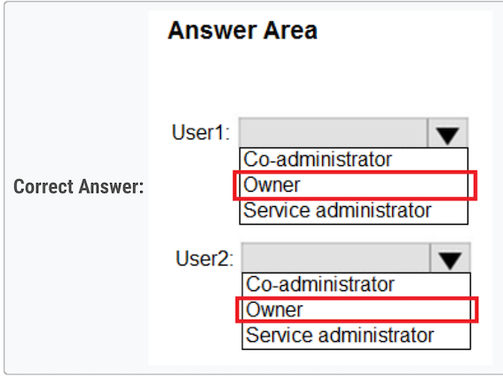

1. Owner  ✅
2. Owner  ✅

- Sign in using an account that: Has an Owner role assignment for the subscription.

An Azure AD Service Administrator role is designed to manage user, groups and other resources within an Azure AD tenant. While they can manage the users and groups, they don't have the permission to move a subscription from one tenant to another.

**To move a subscription from one tenant to another, you need to have the "Subscription Owner" or "Global Administrator" role** within the Azure AD tenant to which you want to move the subscription.

#### Question 75

Your company has the divisions shown in the following table.

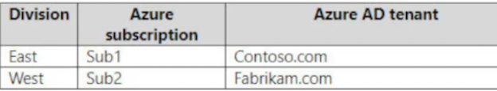

Sub1 contains an Azure App Service web app named App1. App1 uses Azure AD for single-tenant user authentication. Users from contoso.com can authenticate to App1.

You need to recommend a solution to enable users in the fabrikam.com tenant to authenticate to App1. 

What should you recommend?

* A. Configure a Conditional Access policy. 
* **B. Use Azure AD entitlement management to govern external users**.   ✅
* C. Configure the Azure AD provisioning service
* D. Configure Azure AD Identity Protection.

two possible answers

* **Use Azure AD entitlement management to govern external users**
* **Configure Supported account types in the application registration and update the sign-in endpoint**

#### Question 76

You have a multi-tier app named App1 and an Azure SQL database named SQL1. 

The backend service of App1 writes data to SQL1. 

Users use the App1 client to read the data from SQL1. 

**During periods of high utilization, the users experience delays retrieving the data. You need to minimize how long it takes for data requests**. What should you include in the solution?

* **A. Azure Cache for Redis**   ✅
* B. Azure Content Delivery Network (CDN) 
* C. Azure Data Factory 
* D. Azure Synapse Analytics

* A. Azure Cache for Redis - Cache the data so users can achieve them quicker
* B. Azure Content Delivery Network (CDN) - There isn't any issue with the networking 
* C. **Azure Data Factory - This tool is for orchestration, not for enhancing anything existing** 
* D. Azure Synapse Analytics - Also an orchestration tool with additional data warehouse capabilities, not relevant in this case

#### Question 77

You have an Azure subscription that contains the resources shown in the following table

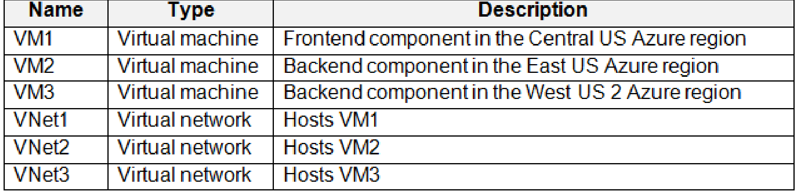

**You create peering between VNet1 and VNet2 and between VNet1 and VNet3.**

The virtual machines host an HTTPS-based client/server application and are accessible only via the private IP address of each virtual machine.

**You need to implement a load balancing solution for VM2 and VM3.**

The solution must ensure that if VM2 fails, requests will be routed automatically to VM3, and if VM3 fails, requests will be routed automatically to VM2.

What should you include in the solution?

* A. Azure Firewall Premium 
* B. Azure Application Gateway v2 
* C. a cross-region load balancer 
* **D. Azure Front Door Premium**  ✅

**While both Front Door and Application Gateway are layer 7 (HTTP/HTTPS) load balancers**, **the primary difference is that Front Door is a non-regional service whereas Application Gateway is a regional service**. 

**While Front Door can load balance between your different scale units/clusters/stamp units across regions**, 

**Application Gateway allows you to load balance between your VMs/containers etc. that is within the scale unit.**

**D. Azure Front Door Premium** 

Azure Front Door Premium now supports Private Link, which enables private connectivity from a virtual network to a service running in Azure. This feature can be used to connect to services across regions privately, so this should work for your use case where VM2 is in East US and VM3 is in West US. Here is how it could work:

Azure Front Door Premium could be set up with Private Link to create a private endpoint in a regional network. This network can route traffic to VM2 and VM3 through the private link over the Microsoft backbone network, without exposure to the public internet. 

When one VM fails, Azure Front Door can automatically route the traffic to the other VM, maintaining the availability of your application.

#### Question 78

You are designing an app that will include two components. The components will communicate by sending messages via a queue.

**You need to recommend a solution to process the messages by using a First in, First out (FIFO) pattern**.

What should you include in the recommendation?

* A. storage queues with a custom metadata setting 
* B. Azure Service Bus queues with partitioning enabled 
* **C. Azure Service Bus queues with sessions enabled** ✅
* D. storage queues with a stored access policy

**Azure Service Bus sessions enable joint and ordered handling of unbounded sequences of related messages.** 

**Sessions can be used in first in, first out (FIFO) and request-response patterns.** This article shows how to use sessions to implement these patterns when using Service Bus.

Azure Service Bus supports a FIFO pattern through the use of sessions. A session is a sequence of ordered messages. All messages in a session are handled in the order they arrive. This ensures that messages are processed in the order they were added to the queue. 

Options A and D are incorrect because Azure Storage queues do not natively support the First In, First Out (FIFO) pattern. **There are no such features as custom metadata setting or stored access policy that can establish FIFO in Azure Storage queues**. 

Option B is incorrect because while **partitioning in Azure Service Bus can improve performance by spreading the load across multiple message brokers and stores, it doesn't enforce FIFO ordering across partitions**. 

FIFO ordering is maintained within a partition, but not across partitions. Hence, for strict FIFO, you would not want to enable partitioning, you would want to use sessions

#### Question 79

You need to deploy an instance of SQL Server on Azure Virtual Machines. The solution must meet the following requirements

* Support 15,000 disk IOPS. 
* Support SR-IOV. 
* Minimize costs.

What should you include in the solution? To answer, select the appropriate options in the answer area

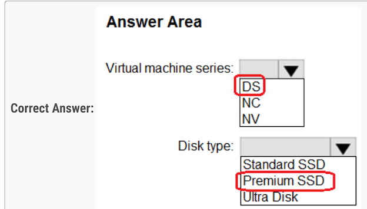

* **DS= Dedicated series**
* NC=GPU-optimized 
* NV=Virtualized GPU

**1. DS**

Ideal for testing and development, small to medium databases, and low to medium traffic web servers. **D-series, feature a more powerful CPU and optimal CPU-to-memory configuration, making them suitable for most production workloads.**

**2. Premium SSD**

Azure Premium SSDs deliver high-performance and low-latency disk support for virtual machines (VMs) with input/output (IO)-intensive workloads. (max IOPS 20,000)

#### Question 80

**You are developing an app that will use Azure Functions to process Azure Event Hubs events.** Request processing is estimated to take between five and 20 minutes.

You need to recommend a hosting solution that meets the following requirements:

* Supports estimates of request processing runtimes 
* Supports event-driven autoscaling for the app 

Which hosting plan should you recommend?

* A. Dedicated 
* B. Consumption 
* C. App Service 
* **D. Premium**  ✅

**The Premium plan is the best fit for this scenario. It supports both longer execution times and event-driven scaling, which are the requirements specified in the question.** 

**Azure Functions on a Premium plan can run for a longer period,** up to 60 minutes (or indefinitely if the host.json "functionTimeout" setting is null), making it suitable for the estimated request processing times of five to 20 minutes. The Premium plan also supports event-driven autoscaling. 

**The Consumption plan supports event-driven autoscaling but only allows functions to run for up to 10 minutes, so it wouldn't support the estimated request processing times of five to 20 minutes.**

The Dedicated and App Service plans can run for a longer period, but they do not support event-driven autoscaling. The Dedicated plan is also the most costly option and should be used when you need the most control over the function app environment.

#### Question 81

You need to design a highly available Azure SQL database that meets the following requirements:

- Failover between replicas of the database must occur without any data loss.
- The database must remain available in the event of a zone outage.
- Costs must be minimized.
  
Which deployment option should you use?

- [ ] A. Azure SQL Database Basic
- [x] **B. Azure SQL Database Business Critical**  ✅
- [ ] C. Azure SQL Database Standard
- [ ] D. Azure SQL Managed Instance General Purpose

Azure SQL DB Standard tier only supports LRS.

The answer is either **Azure SQL Database Premium or Azure SQL Database Business Critical+ B. Azure SQL Database Business Serverless** ✅ 

#### Question 82

You company has offices in New York City, Sydney, Paris, and Johannesburg.

**The company has an Azure subscription.**

You plan to deploy a new Azure networking solution that meets the following requirements:

- Connects to ExpressRoute circuits in the Azure regions of East US, Southeast Asia, North Europe, and South Africa
- Minimizes latency by supporting connection in three regions
- Supports Site-to-site VPN connections
- Minimizes costs

You need to identify the minimum number of Azure Virtual WAN hubs that you must deploy, and which virtual WAN SKU to use.

What should you identify? To answer, select the appropriate options in the answer area.

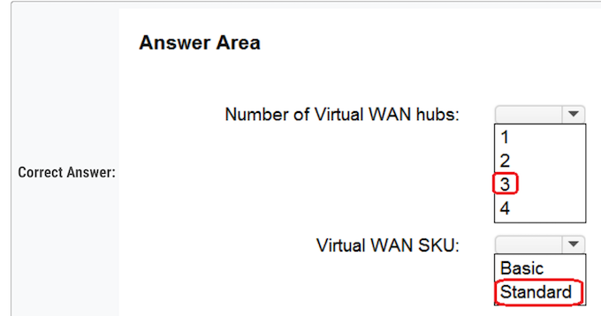

**Deploy at least three Azure Virtual WAN hubs in order to minimize latency by supporting connections in three regions.**

**As for the SKU, the Basic SKU does not support ExpressRoute or site-to-site VPN connections, so you would need to use the Standard SKU to meet all the requirements.**

#### Question 83

You have an Azure Functions microservice app named App1 that is hosted in the Consumption plan. App1 uses an Azure Queue Storage trigger.

You plan to migrate App1 to an Azure Kubernetes Service (AKS) cluster

You need to prepare the AKS cluster to support App1. The solution must meet the following requirements:

- Use the same scaling mechanism as the current deployment.
- Support kubenet and Azure Container Networking Interface (CNI) networking.

Which two actions should you perform? Each correct answer presents part of the solution.

NOTE: Each correct answer is worth one point.

- [X] **A. Configure the horizontal pod autoscaler.** ✅
- [ ] B. Install Virtual Kubelet.
- [ ] C. Configure the AKS cluster autoscaler.
- [ ] D. Configure the virtual node add-on.
- [x] **E. Install Kubernetes-based Event Driven Autoscaling (KEDA).** ✅

**Kubernetes uses the horizontal pod autoscaler (HPA) to monitor the resource demand and automatically scale the number of replicas**. By default, the horizontal pod autoscaler checks the Metrics API every 15 seconds for any required changes in replica count, but the Metrics API retrieves data
from the Kubelet every 60 seconds. Effectively, the HPA is updated every 60 seconds. When changes are required, the number of replicas is
increased or decreased accordingly. Horizontal pod autoscaler works with AKS clusters that have deployed the Metrics Server for Kubernetes 1.8

Kubernetes Event-driven Autoscaling (KEDA) is a single-purpose and lightweight component that strives to make application autoscaling simple
and is a CNCF Incubation project.

It applies event-driven autoscaling to scale your application to meet demand in a sustainable and cost-efficient manner with scale-to-zero.

#### Question 84

**You need to recommend a solution to enable the cloud services to asynchronously communicate transaction information by using XML messages.**

**Azure Queue Storage**   ✅

A. Azure Service Fabric: **It's a distributed systems platform for deploying and managing microservices and containers**. While it can be used to build resilient applications, it's not a messaging system per se.

B. **Azure Traffic Manager: It's a DNS-based traffic load balancer. It doesn't deal with asynchronous messaging.**

C. **Azure Queue Storage: This service allows you to decouple cloud components and ensure asynchronous message delivery.** Messages can be
placed into a queue, where another service can pick them up and process them, which is exactly what's described in the scenario. The messages
can be in XML format or any other format that suits your needs.

D. **Azure Notification Hubs: This is for sending push notifications to mobile devices. It's not designed for inter-service communication.**

Therefore, the correct Answer is:

**C. Azure Queue Storage.**

#### Question 85

You have an on-premises Microsoft SQL Server 2008 instance that hosts a 50-GB database.

**You need to migrate the database to an Azure SQL managed instance. The solution must minimize downtime.**

What should you use?

- [ ] A. Azure Migrate
- [X] **B. Azure Data Studio**    ✅
- [ ] C. WANdisco LiveData Platform for Azure
- [ ] D. SQL Server Management Studio (SSMS)

Migration guide: **SQL Server to Azure SQL Managed Instance**

Prerequisites

To migrate your SQL Server to Azure SQL Managed Instance, make sure you have:

1. Chosen a migration method and the corresponding tools for your method.
2. **Install the Azure SQL migration extension for Azure Data Studio**.
3. **Created a target Azure SQL Managed Instance**
4. Configured connectivity and proper permissions to access both source and target.
5. Reviewed the SQL Server database engine features available in Azure SQL Managed Instance.

#### Question 86

You are developing a multi-tier app named App1 that will be hosted on Azure virtual machines. The peak utilization periods for App1 will be from 8
AM to 9 AM and 4 PM to 5 PM on weekdays

You need to deploy the infrastructure for App1. The solution must meet the following requirements:

- Support virtual machines deployed to **four availability zones across two Azure regions**.
- **Minimize costs by accumulating CPU credits during periods of low utilization.**

What is the minimum number of virtual networks you should deploy, and which virtual machine size should you use? To answer, select the
appropriate options in the answer area

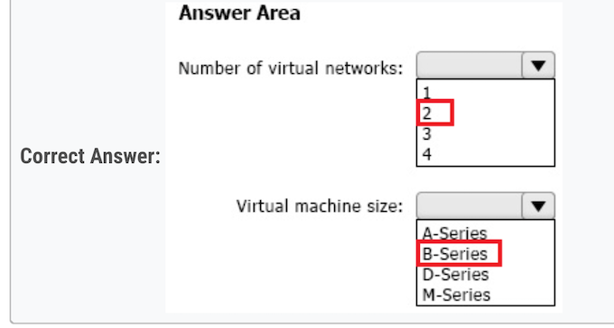

* **Number of Virtual networks:  ✔ 2**   ✅

* **Virtual machine size  ✔ B-Series**  ✅

Explanation:

Number of Virtual networks:

**You need at least one virtual network per Azure region for the local resources, hence since you have two Azure regions, you'll need at least 2 virtual networks.**

Virtual machine size:

**The B-Series VM size is the best choice here because of the ability to bank CPU credits during periods of low utilization.** 

The B-series are burstable VMs that accumulate CPU credits during idle times and then consume these credits during periods of high CPU usage. This matches well with your requirement to minimize costs by accumulating CPU credits during periods of low utilization. Other series like A-Series, D-Series, and M-Series do
not have this functionality.

#### Question 87

You have an on-premises Microsoft SQL server named SQL1 that hosts 50 databases.

**You plan to migrate SQL1 to Azure SQL Managed Instance.**

You need to perform an online migration of SQL1. The solution must minimize administrative effort.

What should you include in the solution?

- [ ] A. Azure Migrate
- [x] **B. Azure Database Migration Service**   ✅
- [ ] C. SQL Server Migration Assistant (SSMA)
- [ ] D. Data Migration Assistant (DMA)

**B. Azure Database Migration Service**

**+ Azure Data Studio**

Azure Database Migration Service is a tool that helps you simplify, guide, and automate your database migration to Azure. **Specifically for SQL Server to Azure SQL Managed Instance migrations, it provides an option for offline (one-time) migrations which is suitable for your scenario.**

The Data Migration Assistant (DMA) tool can be used beforehand to assess your SQL Server databases for any feature parity and compatibility issues that could impact the database functionality in Azure SQL Managed Instance

**Azure Migrate is a service that helps you assess and migrate applications, infrastructure, and data, but it doesn't specifically cater to SQL Server
migrations.** SQL Server Migration Assistant (SSMA) is more suited for migrations to Azure SQL Database and does not support Azure SQL Managed
Instance.

#### Question 88

You plan to deploy an infrastructure solution that will contain the following configurations:

* **External users will access the infrastructure by using Azure Front Door.**
* External user access to the backend APIs hosted in Azure Kubernetes Service (AKS) will be controlled by using Azure API Management.
* External users will be authenticated by an Azure AD B2C tenant that uses OpenID Connect-based federation with a third-party identity provider.

Which function does each service provide? To answer, drag the appropriate functions to the correct services. Each function may be used once, more than once, or not at all. You may need to drag the split bar between panes or scroll to view content.

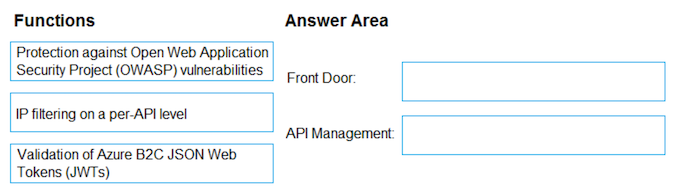

- **Front Door --> OWASP**   ✅
- **APIM --> Validation JWT**  ✅

- Box1 - FrontDoor => Protect against OWASP Vulnerabilities   ✅
- Box2 - API Management => Validation token JWT   ✅

#### Question 89

Your company plans to deploy various Azure App Service instances that will use Azure SQL databases. The App Service instances will be deployed
at the same time as the Azure SQL databases.

The company has a regulatory requirement to deploy the App Service instances only to specific Azure regions. The resources for the App Service
instances must reside in the same region.

You need to recommend a solution to meet the regulatory requirement.

Solution: **You recommend using an Azure Policy initiative to enforce the location of resource groups.**

Does this meet the goal?

- [ ] A. Yes
- [X] B. No

"You recommend using an Azure Policy initiative to enforce the location of resource groups"

**You need to enforce the location of the App Service instances, and not of resource groups.**

The right answer was in the question #57: "**You recommend using an Azure Policy initiative to enforce the location"**

**Resources can be created in a region different than the RG's one**

#### Question 90

Your on-premises datacenter contains a server that runs Linux and hosts a Java app named App1. App1 has the following characteris

- App1 is an interactive app that users access by using HTTPS connections.
- The number of connections to App1 changes significantly throughout the day.
- App1 runs multiple concurrent instances.
- App1 requires major changes to run in a container.

You plan to migrate App1 to Azure.

You need to recommend a compute solution for App1. The solution must meet the following requirements:

- The solution must run multiple instances of App1.
- The number of instances must be managed automatically depending on the load.
- Administrative effort must be minimized.

What should you include in the recommendation?

- [ ] A. Azure Batch
- [X] **B. Azure App Service**  ✅
- [ ] C. Azure Kubernetes Service (AKS)
- [ ] D. Azure Virtual Machine Scale Sets

In order to minimize administrative effort, I believe Azure App Service is the right answer

#### Question 91

You have an Azure App Service web app named Webapp1 that connects to an Azure SQL database named DB1. Webapp1 and DB1 are deployed to
the East US Azure region.

You need to ensure that all the traffic between Webapp1 and DB1 is sent via a private connection.

What should you do? To answer, select the appropriate options in the answer area.

NOTE: Each correct selection is worth one point.

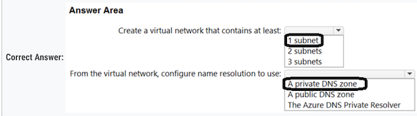

**Box 1: 2 subnets**  ✅

**Create a virtual network that contains at least 2 subnets. One for the Azure App Service VNet Integration and another for the Azure Private Link**

**Box 2: a private DNS zone**  ✅

Configure name resolution to use a private DNS zone. This is necessary for the web app to work with Azure DNS private zones.

#### Question 92

Your on-premises network contains an Active Directory Domain Services (AD DS) domain. The domain contains a server named Server1. Server1
contains an app named App1 that uses AD DS authentication. Remote users access App1 by using a VPN connection to the on-premises network.

You have an Azure AD tenant that syncs with the AD DS domain by using Azure AD Connect.

You need to ensure that the remote users can access App1 without using a VPN. The solution must meet the following requirements:

- • Ensure that the users authenticate by using Azure Multi-Factor Authentication (MFA).
- • Minimize administrative effort.

What should you include in the solution? To answer, select the appropriate options in the answer area.

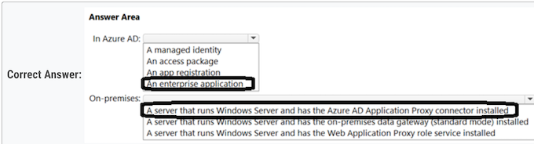

- box1: ent app (required for MFA in conditional access)
- box2: azure ad app proxy

#### Question 93

You have an Azure subscription that contains an Azure Kubernetes Service (AKS) instance named AKS1. AKS1 hosts microservice-based APIs that
are configured to listen on non-default HTTP ports.

**You plan to deploy a Standard tier Azure API Management instance named APIM1 that will make the APIs available to external users**.

You need to ensure that the AKS1 APIs are accessible to APIM1. The solution must meet the following requirements:

- Implement MTLS authentication between APIM1 and AKS1.
- Minimize development effort.
- Minimize costs.

What should you do?

- [ ] A. Implement an external load balancer on AKS1.
- [ ] B. Redeploy APIM1 to the virtual network that contains AKS1.
- [ ] C. Implement an ExternalName service on AKS1.
- [X] **D. Deploy an ingress controller to AKS1.**  ✅

Ingress controller is correct answer.

There is picture describing the architecture (**API Management > Ingress Controller > AKS cluster**):

**Mutual TLS (mTLS) authentication is natively supported by Azure API Management and can be enabled in Kubernetes by installing an Ingress
Controller.** This approach simplifies the microservices as the authentication will be performed in the Ingress Controller. This solution also meets the requirements of implementing mTLS authentication between APIM1 and AKS1, minimizing development effort, and minimizing costs.

#### Question 94

You need to recommend a solution to integrate Azure Cosmos DB and Azure Synapse. The solution must meet the following requirements:

- Traffic from an Azure Synapse workspace to the Azure Cosmos DB account must be **sent via the Microsoft backbone network.**
- Traffic from the Azure Synapse workspace to the Azure Cosmos DB account **must NOT be routed over the internet.**
- Implementation effort must be minimized.

What should you include in the recommendation? To answer, select the appropriate options in the answer area.

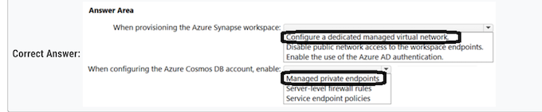

**Box 1: Configure a dedicated managed virtual network**

provision the Azure Synapse workspace with the option to Configure a dedicated managed virtual network. This will ensure that the traffic between Azure Synapse and Azure Cosmos DB is routed through the Microsoft backbone network and not over the internet

**Box 2: Managed private endpoints**

Configure the Azure Cosmos DB account to use Managed private endpoints. This will allow Azure Synapse to securely connect to Azure Cosmos DB using a private link

#### Question 95

You have an Azure subscription that contains an Azure Cosmos DB for NoSQL account named account1 and an Azure Synapse Analytics workspace named Workspace1. The account1 account contains a container named Contained that has the analytical store enabled.

You need to recommend a solution that will process the data stored in Contained in near-real-time (NRT) and output the results to a data warehouse in Workspace1 by using a runtime engine in the workspace. The solution must minimize data movemen

Which pool in Workspace1 should you use?

- **A. Apache Spark**   ✅
- B. serverless SQL 
- C. dedicated SQL 
- D. Data Explorer

Apache Spark is a distributed processing framework that can handle near-real-time processing and is well-integrated with Azure Synapse Analytic It can directly access data stored in Azure Cosmos DB analytical store without needing to move the data around. This minimizes data movement and provides efficient processing capabilities

#### Question 96

You have an on-premises datacenter named Site1. Site1 contains a VMware vSphere cluster named Cluster1 that hosts 100 virtual machines. Cluster1 is managed by using VMware vCenter.

You have an Azure subscription named Sub1. 

**You plan to migrate the virtual machines from Cluster1 to Sub1.**

You need to identify which resources are required to run the virtual machines in Azure. The solution must minimize administrative effort.

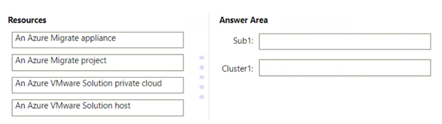

**Sub1: An Azure VMware Solution private cloud**

**Cluster1: An Azure Migrate project**

Assuming that the agentless migration is the optimal way to reduce admin effort. 

You need a Migrate Project in Azure, and a Migrate Appliance (VM) in the on-prem host to discover and assess the rest of the VMs.

#### Question 97

Your on-premises datacenter contains a server named Server1 that runs Microsoft SQL Server 2022. Server1 contains a 30-TB database named DB1 that stores customer data. Server1 runs a custom application named App1 that verifies the compliance of records in DB1. App1 must run on the same server as DB1.

You have an Azure subscription.

**You need to migrate DB1 to Azure. The solution must minimize administrative effort.**

To which service should you migrate DB1, and what should you use to perform the migration? To answer, select the appropriate options in the answer area.

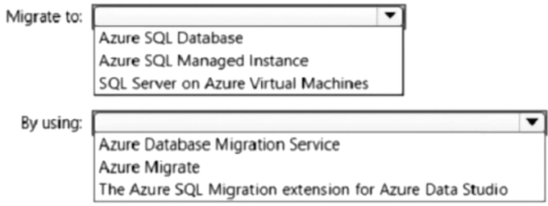

**Migrate to: SQL Server on Azure Virtual Machines**  ✅

**Azure Migrate** ✅

**Its SQL on Azure VM and Azure Migrate.**

Lift and shift SQL Server to SQL Server on Azure VM -> azure migrate : YES

#### Question 98

## Topic 1

### Question 1

**Overview - Litware, Inc**. is a medium-sized finance company that has a main office in Boston.

Existing Environment -

Identity Environment -

The network contains an Active Directory forest named litware.com that is linked to an Azure Active Directory (Azure AD) tenant named litware.com. All users have Azure Active Directory Premium P2 licenses.

Litware has a second Azure AD tenant named dev.litware.com that is used as a development environment. 

The litware.com tenant has a Conditional Access policy named Capolicy1. 

Capolicy1 requires that when users manage the Azure subscription for a production environment by using the Azure portal, they must connect from a hybrid Azure AD-joined device

**Azure Environment -**

Litware has 10 Azure subscriptions that are linked to the Litware.com tenant and five Azure subscriptions that are linked to the dev.litware.com tenant. All the subscriptions are in an Enterprise Agreement (EA). 

The litware.com tenant contains a custom Azure role-based access control (Azure RBAC) role named Role1 that grants the DataActions read permission to the blobs and files in Azure Storage.

**On-Premises Environment -**

The on-premises network of Litware contains the resources shown in the following table

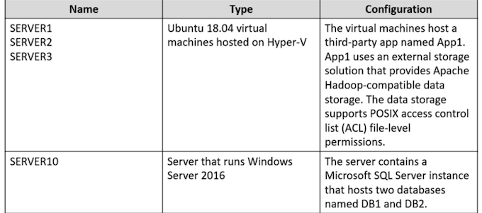

**Network Environment -**

Litware has ExpressRoute connectivity to Azure. 

Planned Changes and Requirements

**Planned Changes -**

Litware plans to implement the following changes:

* Migrate DB1 and DB2 to Azure. 
* Migrate App1 to Azure virtual machines. 
* Migrate the external storage used by App1 to Azure Storage. 
* Deploy the Azure virtual machines that will host App1 to Azure dedicated hosts.

**Authentication and Authorization Requirements**

Litware identifies the following authentication and authorization requirements: 

Only users that manage the production environment by using the Azure portal must connect from a hybrid Azure AD-joined device and authenticate by using Azure Multi-Factor Authentication (MFA). The Network Contributor built-in RBAC role must be used to grant permissions to the network administrators for all the virtual networks in all the Azure subscriptions

To access the resources in Azure, App1 must use the managed identity of the virtual machines that will host the app. RBAC roles must be applied to management groups

**Resiliency Requirements -**

Litware identifies the following resiliency requirements: 

Once migrated to Azure, DB1 and DB2 must meet the following

Once migrated to Azure, DB1 and DB2 must meet the following requirements:

- Maintain availability if two availability zones in the local Azure region fail. 
- Fail over automatically. 
- Minimize I/O latency.

App1 must meet the following requirements:

- Be hosted in an Azure region that supports availability zones. 
- Be hosted on Azure virtual machines that support automatic scaling. 
- Maintain availability if two availability zones in the local Azure region fail

Security and Compliance Requirements

Once App1 is migrated to Azure, you must ensure that new data can be written to the app, and the modification of new and existing data is prevented for a period of three years. 

On-premises users and services must be able to access the Azure Storage account that will host the data in App1. Access to the public endpoint of the Azure Storage account that will host the App1 data must be prevented. 

All Azure SQL databases in the production environment must have Transparent Data Encryption (TDE) enabled. App1 must NOT share physical hardware with other workloads.

Business Requirements 

Litware identifies the following business requirements: 

- Minimize administrative effort. 
- Minimize costs.

You need to ensure that users managing the production environment are registered for Azure MFA and must authenticate by using Azure MFA when they sign in to the Azure portal. The solution must meet the authentication and authorization requirements.

What should you do? To answer, select the appropriate options in the answer area

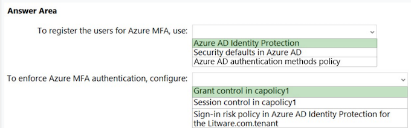

**Box 1: Azure AD Identity Protection** 

Only users that manage the production environment by using the Azure portal must connect from a hybrid Azure AD-joined device and authenticate by using Azure Multi-Factor Authentication (MFA).

Note: Policy configuration -

1. Navigate to the Azure portal. 
2. Browse to Azure Active Directory > Security > Identity Protection > MFA registration policy. 
3. Under Assignments 
4. Users - Choose All users or Select individuals and groups if limiting your rollout. 
5. Optionally you can choose to exclude users from the policy. 
6. Enforce Policy - On 
7. Save

**Box 2: Grant control in capolicy1**

The litware.com tenant has a Conditional Access policy named Capolicy1. Capolicy1 requires that when users manage the Azure subscription for a production environment by using the Azure portal, they must connect from a hybrid Azure AD-joined device. 

Note: We need to configure the policy conditions for capolicy1 that prompt for MFA

* topic 5: Litware 
* topic 6: Contoso 
* topic 7: Fabrikam 
* topic 8: Litware = topic 5 
* topic 9: Fabrikam = topic 7 
* topic 10: Contoso ltd = topic 6 
* topic 11: Fabrikam = topic 7 
* topic 12: Litware = topic 5 
* topic 13: Contoso ltd = topic 6

1. To register the users for Azure MFA, use: a. Azure AD identity Protection. Azure AD Identity Protection is a tool that allows organizations to discover, investigate, and remediate identity-based risks in their environment. It can help you manage the roll-out of Multi-Factor Authentication
(MFA) registration by prompting users for registration during risk sign-in attempts. 

2. To enforce Azure MFA authentication, configure: a. Grant control in capolicy1. Grant controls are used to enforce additional requirements that a user must meet before they are granted access. You can enforce Azure MFA by setting it as a requirement in the Grant control settings of Capolicy1.

### Question 2

After you migrate App1 to Azure, you need to enforce the data modification requirements to meet the security and compliance requirements. What should you do?

* **A. Create an access policy for the blob service.**  ✅
* B. Implement Azure resource locks. 
* C. Create Azure RBAC assignments. 
* D. Modify the access level of the blob service.

Scenario: Once App1 is migrated to Azure, you must ensure that new data can be written to the app, and the modification of new and existing data is prevented for a period of three years.

As an administrator, you can lock a subscription, resource group, or resource to prevent other users in your organization from accidentally deleting or modifying critical resources. The lock overrides any permissions the user might have.

### Question 3

You plan to migrate App1 to Azure. 

You need to recommend a high-availability solution for App1. 

The solution must meet the resiliency requirements. What should you include in the recommendation? To answer, select the appropriate options in the answer area.

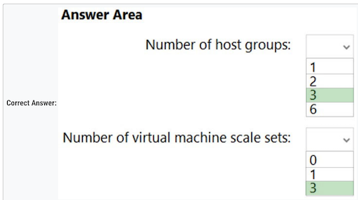

**Box 1: 3 -**  ✅

Need three host groups to meet the third scenario requirement below

Scenario: App1 must meet the following requirements: 

* Be hosted in an Azure region that supports availability zones. 
* Be hosted on Azure virtual machines that support automatic scaling. 
* Maintain availability if two availability zones in the local Azure region fail.

**Box 2: 3 -**  ✅

The availability setting of your host group should match your scale set

* The host group and the scale set must be using the same availability zone. 
* The fault domain count for the host group level should match the fault domain count for your scale set.

VMSS supports zone-redundant, while Dedicated Host does not. No-zone option of host group in Dedicated Host is not zone-redundant, it represents regional resource

- You must create a host group in each zone. 
- You must create a VMSS in each zone where the host group is deployed.

### Question 4

You plan to migrate App1 to Azure. 

**You need to recommend a storage solution for App1 that meets the security and compliance requirements.** 

Which type of storage should you recommend, and how should you recommend configuring the storage? To answer, select the appropriate options in the answer area.

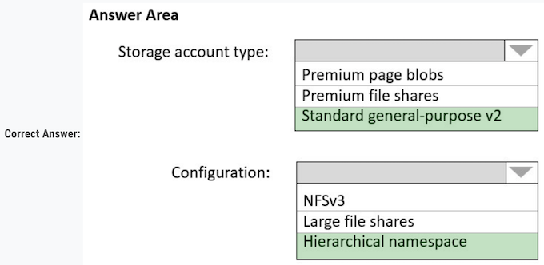

**Box 1: Standard general-purpose v2**  ✅

* Standard general-purpose v2 supports Blob Storage. 
* Azure Storage provides data protection for Blob Storage and Azure Data Lake Storage Gen2.

Litware identifies the following security and compliance requirements:

* ✑ Once App1 is migrated to Azure, you must ensure that new data can be written to the app, and the modification of new and existing data is prevented for a period of three years. 
* ✑ On-premises users and services must be able to access the Azure Storage account that will host the data in App1. 
* ✑ Access to the public endpoint of the Azure Storage account that will host the App1 data must be prevented. All Azure SQL databases in the production environment must have Transparent Data Encryption (TDE) enabled.
* ✑ App1 must NOT share physical hardware with other workloads.

**Box 2: Hierarchical namespace -**

Scenario: Plan: Migrate App1 to Azure virtual machines

* Azure Data Lake Storage Gen2 implements an access control model that supports both Azure role-based access control (Azure RBAC) and POSIX-like access control lists (ACLs). 
* Data Lake Storage Gen2 and the Network File System (NFS) 3.0 protocol both require a storage account with a hierarchical namespace enabled

> Storage account type: " Standard general-purpose v2 " 
> 
> Configuration: " Hierarchical namespace "

### Question 5

You plan to migrate App1 to Azure. 

**You need to recommend a network connectivity solution for the Azure Storage account that will host the App1 data.**

The solution must meet the security and compliance requirements. What should you include in the recommendation?

* A. Microsoft peering for an ExpressRoute circuit 
* B. Azure public peering for an ExpressRoute circuit 
* C. a service endpoint that has a service endpoint policy 
* **D. a private endpoint**  ✅

**Correct Answer: D**

Private Endpoint securely connect to storage accounts from on-premises networks that connect to the VNet using VPN or ExpressRoutes with private-peering.

Private Endpoint also secure your storage account by configuring the storage firewall to block all connections on the public endpoint for the storage service. 

**Incorrect Answers**

* A: Microsoft peering provides access to Azure public services via public endpoints with public IP addresses, which should not be allowed. 
* B: Azure public peering has been deprecated. 
* C: By default, Service Endpoints are enabled on subnets configured in Azure virtual networks. Endpoints can't be used for traffic from your premises to Azure services.

### Question 6

**You need to implement the Azure RBAC role assignments for the Network Contributor role**. The solution must meet the authentication and authorization requirements. What is the minimum number of assignments that you must use?

* A. 1 
* **B. 2** 
* C. 5 
* D. 10 
* E. 15

Scenario: The Network Contributor built-in RBAC role must be used to grant permissions to the network administrators for all the virtual networks in all the Azure subscriptions. RBAC roles must be applied at the highest level possible

**Litware has two Azure tenants.**

One tenant with 10 subscriptions and one tenant with five subscriptions. 

We can organize the subscriptions of the two tenants in a management group each and assign users to the Network Contributor role or to Role1 at the management group level.

### Question 7

**You need to configure an Azure policy to ensure that the Azure SQL databases have Transparent Data Encryption (TDE) enabled.** The solution must meet the security and compliance requirements

Which three actions should you perform in sequence? To answer, move the appropriate actions from the list of actions to the answer area and arrange them in the correct order.

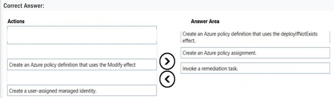

**Step 1: Create an Azure policy definition that uses the deployIfNotExists**

The first step is to define the roles that deployIfNotExists and modify needs in the policy definition to successfully deploy the content of your included template.

**Step 2: Create an Azure policy assignment** ✅

When creating an assignment using the portal, Azure Policy both generates the managed identity and grants it the roles defined in roleDefinitionIds.

**Step 3: Invoke a remediation task.** ✅

Resources that are non-compliant to a deployIfNotExists or modify policy can be put into a compliant state through Remediation. Remediation is accomplished by instructing Azure Policy to run the deployIfNotExists effect or the modify operations of the assigned policy on your existing resources and subscriptions, whether that assignment is to a management group, a subscription, a resource group, or an individual resource. During evaluation, the policy assignment with deployIfNotExists or modify effects determines if there are non-compliant resources or subscriptions. When non- compliant resources or subscriptions are found, the details are provided on the Remediation page.

* Create an Azure policy definition that uses the deployIfNotExists effect and specifies TDE as a required setting. 
* Create an Azure policy assignment and assign the policy definition to the desired scope (e.g. subscription or resource group). 
* Invoke a remediation task to automatically enforce the policy and enable TDE on existing databases that do not have it enabled.

### Question 8

**You plan to migrate DB1 and DB2 to Azure.** ✅

You need to ensure that the Azure database and the service tier meet the resiliency and business requirements

**What should you configure?** To answer, select the appropriate options in the answer area

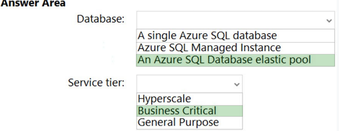

**Box 1: An Azure SQL Database elastic pool** ✅

Scenario:

Resiliency Requirements. Once migrated to Azure, DB1 and DB2 must meet the following requirements: 

* Maintain availability if two availability zones in the local Azure region fail. 
* Fail over automatically. 
* Minimize I/O latency

Litware identifies the following business requirements:

* Minimize administrative effort. 
* Minimize costs.

**Box 2: Business Critical** ✅

> Database: "An Azure SQL Database elastic pool" 
>
> Service Tier: "Business Critical"

### Question 9

**How should the migrated databases DB1 and DB2 be implemented in Azure?**

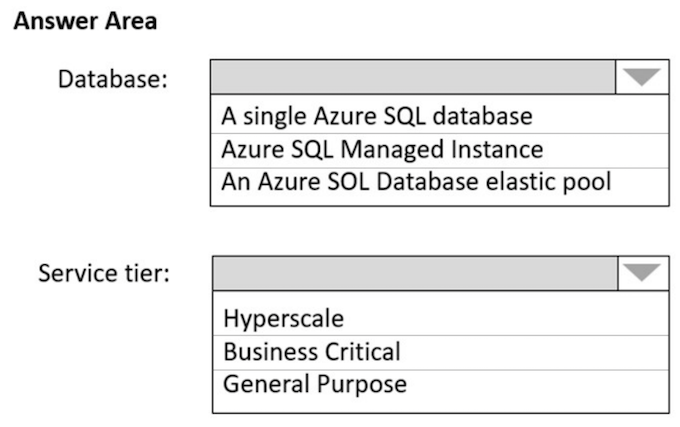

**Box 1: SQL Managed Instance -**

Scenario: Once migrated to Azure, DB1 and DB2 must meet the following requirements:

* ✑ Maintain availability if two availability zones in the local Azure region fail. 
* ✑ Fail over automatically. 
* ✑ Minimize I/O latency.

**Box 2: Business critical -**

SQL Managed Instance is available in two service tiers:

* General purpose: Designed for applications with typical performance and I/O latency requirements. 
* Business critical: Designed for applications with low I/O latency requirements and minimal impact of underlying maintenance operations on the workload.

## Topic 2

**Overview - Contoso, Ltd. is a research company that has a main office in Montreal**

Existing Environment -

Technical Environment - 

The on-premises network contains a single Active Directory domain named contoso.com. Contoso has a single Azure subscription

Business Partnerships -

Contoso has a business partnership with Fabrikam, Inc. Fabrikam users access some Contoso applications over the internet by using Azure Active Directory (Azure AD) guest accounts.

Requirements - 

Planned Changes - Contoso plans to deploy two applications named App1 and App2 to Azure

App1 -

* App1 will be a Python web app hosted in Azure App Service that requires a Linux runtime. Users from Contoso and Fabrikam will access App1. 
* App1 will access several services that require third-party credentials and access strings. The credentials and access strings are stored in Azure Key Vault

App1 will have six instances: three in the East US Azure region and three in the West Europe Azure region. 

App1 has the following data requirements:

* Each instance will write data to a data store in the same availability zone as the instance. 
* Data written by any App1 instance must be visible to all App1 instances. App1 will only be accessible from the internet. 

App1 has the following connection requirements:

* Connections to App1 must pass through a web application firewall (WAF). 
* Connections to App1 must be active-active load balanced between instances

All connections to App1 from North America must be directed to the East US region. All other connections must be directed to the West Europe region.

Every hour, you will run a maintenance task by invoking a PowerShell script that copies files from all the App1 instances. 

The PowerShell script will run from a central location.

**App2 -**

App2 will be a .NET app hosted in App Service that requires a Windows runtime. App2 has the following file storage requirements: 

* Save files to an Azure Storage account. 
* Replicate files to an on-premises location. 
* Ensure that on-premises clients can read the files over the LAN by using the SMB protocol. 
* You need to monitor App2 to analyze how long it takes to perform different transactions within the application.

The solution must not require changes to the application code

Application Development Requirements

* Application developers will constantly develop new versions of App1 and App2. 
* The development process must meet the following requirements: A staging instance of a new application version must be deployed to the application host before the new version is used in production. 
* After testing the new version, the staging version of the application will replace the production version

The switch to the new application version from staging to production must occur without any downtime of the application.

Identity Requirements -

Contoso identifies the following requirements for managing Fabrikam access to resources:

Every month, an account manager at Fabrikam must review which Fabrikam users have access permissions to App1. 

Accounts that no longer need permissions must be removed as guests. The solution must minimize development effort.

Security Requirement - 

* All secrets used by Azure services must be stored in Azure Key Vault. 
* Services that require credentials must have the credentials tied to the service instance. The credentials must NOT be shared between services

### Question 1

You need to recommend a solution for the App1 maintenance task. 

The solution must minimize costs. What should you include in the recommendation?

* **A. an Azure logic app**  ✅
* B. an Azure function 
* C. an Azure virtual machine 
* D. an App Service WebJob

Every hour, you will run a maintenance task by invoking a PowerShell script that copies files from all the App1 instances. The PowerShell script will run from a central location.

App1 will have six instances: three in the East US Azure region and three in the West Europe Azure region. 

* You can create and manage workflows with Azure PowerShell in Azure Logic Apps. 
* You can create a Consumption logic app in multi-tenant Azure Logic Apps by using the JSON file for a logic app workflow definition. 
* You can then manage your logic app by running the cmdlets in the Az.LogicApp PowerShell module

Azure Logic App. The key here is the term "every hour" "Every hour, you will run a maintenance task by invoking a PowerShell script that copies files from all the App1 instances. 

The PowerShell script will run from a central location." In Azure Logic App, you can schedule every hour

### Question 2

You need to recommend a solution that meets the application development requirements. What should you include in the recommendation?

* A. the Azure App Configuration service 
* B. an Azure Container Registry instance 
* **C. deployment slots**     ✅
* D. Continuous Integration/Continuous Deployment (CI/CD) sources

When you deploy your web app, web app on Linux, mobile back end, or API app to Azure App Service, you can use a separate deployment slot instead of the default production slot when you're running in the Standard, Premium, or Isolated App Service plan tier. Deployment slots are live apps with their own host names.

App content and configurations elements can be swapped between two deployment slots, including the production slot. 

Deploying your application to a non-production slot has the following benefits:

* You can validate app changes in a staging deployment slot before swapping it with the production slot. 
* Deploying an app to a slot first and swapping it into production makes sure that all instances of the slot are warmed up before being swapped into production

This eliminates downtime when you deploy your app.

* After a swap, the slot with previously staged app now has the previous production app. If the changes swapped into the production slot aren't as you expect, you can perform the same swap immediately to get your "last known good site" back.

Note: Application Development Requirements

Application developers will constantly develop new versions of App1 and App2. The development process must meet the following requirements:

* A staging instance of a new application version must be deployed to the application host before the new version is used in production. 
* After testing the new version, the staging version of the application will replace the production version. 
* The switch to the new application version from staging to production must occur without any downtime of the application.

### Question 3

You need to recommend an App Service architecture that meets the requirements for App1. The solution must minimize costs. What should you recommend?

* A. one App Service Environment (ASE) per availability zone 
* B. one App Service Environment (ASE) per region
* **C. one App Service plan per region**   ✅
* D. one App Service plan per availability zone

No need for dedicated environment. So Azure Service Plan per region is enough

**C. One App Service Plan per region.** 

To be exact, the Basic App Service Plan offers up to 3 dedicated instances for your app to run.

- With Premium App Service App is enough in terms of zone redundant. It is offered in P2 and P3. 
- Comparing prices with ASE that is Isolated. ASE in zone redundant is charged with nine instances as minimum regardless of using 3 instances. So it is much expensive.

### Question 4

You need to recommend a solution to ensure that App1 can access the third-party credentials and access strings. The solution must meet the security requirements. 

What should you include in the recommendation? To answer, select the appropriate options in the answer area

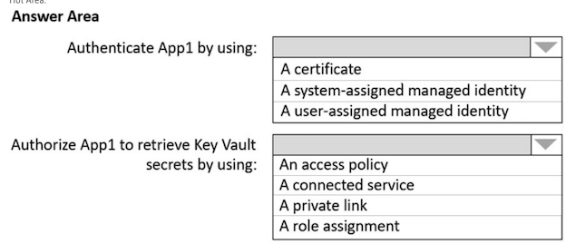

**Box 1: A system-assigned managed identity** ✅

No one knows the credentials of managed identities.

Managed Identities exist in two formats:

* System assigned: in this scenario, the identity is linked to a single Azure Resource, eg a Virtual Machine, a Logic App, a Storage Account, Web App, Function, so almost anything. Next, they also live with the Azure Resource, which means they get deleted when the Azure Resource gets deleted. 
* User Assigned Managed Identity (incorrect for this question), which means that you first have to create it as a stand-alone Azure resource by itself, after which it can be linked to multiple Azure Resources.

A system-assigned managed identity: This is an identity created by Azure for the App Service instance, which is tied to the lifecycle of this service and does not require the management of credentials.

**Box 2: role assignment** ✅

A role assignment: Utilizing Azure role-based access control (RBAC), you can assign a specific role to the managed identity, like “Key Vault Secrets User”, to retrieve secrets from the Key Vault.

Role assignment. More granular than access policy

### Question 5

HOTSPOT - **What should you implement to meet the identity requirements?** To answer, select the appropriate options in the answer area.

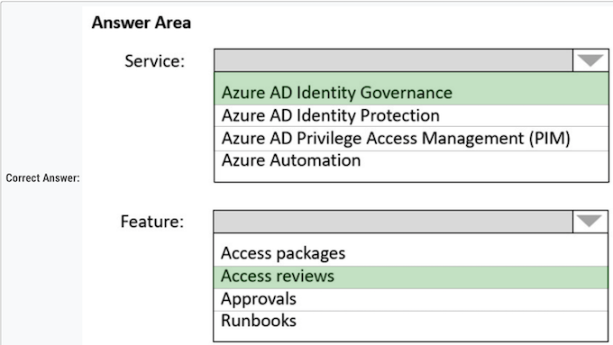

Requirements: Identity Requirements 

**Contoso identifies the following requirements for managing Fabrikam access to resources:**

* Every month, an account manager at Fabrikam must review which Fabrikam users have access permissions to App1. Accounts that no longer need permissions must be removed as guests. 
* The solution must minimize development effort

**Box 1: Azure AD Identity Governance**  ✅

> Incorrect: Not PIM: Life Cycle Requirements must be met.

**Box 2: Access reviews**  ✅

Azure Active Directory (Azure AD) access reviews enable organizations to efficiently manage group memberships, access to enterprise applications, and role assignments. User's access can be reviewed on a regular basis to make sure only the right people have continued access

1. Azure AD Identity Governance  ✅
2. Access reviews  ✅

### Question 6

What should you implement to meet the identity requirements? To answer, select the appropriate options in the answer area. NOTE: Each correct selection is worth one point.

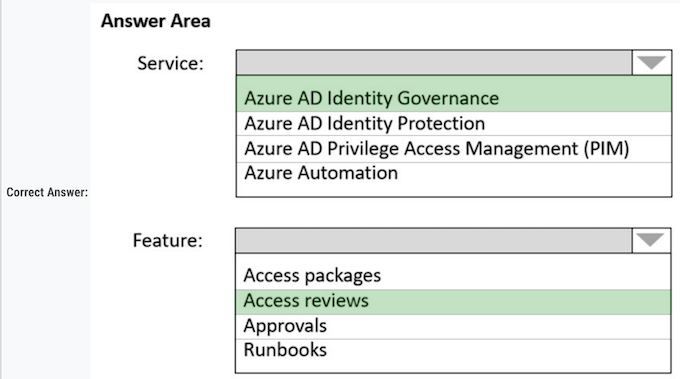

**Requirements: Identity Requirements**

Contoso identifies the following requirements for managing Fabrikam access to resources:

* Every month, an account manager at Fabrikam must review which Fabrikam users have access permissions to App1. Accounts that no longer need permissions must be removed as guests. 
* The solution must minimize development effort.

**Box 1: Azure AD Identity Governance** ✅

Incorrect: Not PIM: Life Cycle Requirements must be met.

**Box 2: Access reviews**  ✅

Azure Active Directory (Azure AD) access reviews enable organizations to efficiently manage group memberships, access to enterprise applications, and role assignments. User's access can be reviewed on a regular basis to make sure only the right people have continued access

### Question 7

What should you recommend to meet the monitoring requirements for App2?

* A. VM insights 
* **B. Azure Application Insights** ✅
* C. Microsoft Sentinel 
* D. Container insights

Scenario: You need to monitor App2 to analyze how long it takes to perform different transactions within the application. The solution must not require changes to the application code. 

* Can't be A -> VM Insight as it is not running on a VM. 
* Can't be C -> Microsoft sentinel which is a SIEM 
* Can't be D -> Not running in a container.

### Question 8

**You need to recommend a solution that meets the file storage requirements for App2.**

What should you deploy to the Azure subscription and the on-premises network? To answer, drag the appropriate services to the correct locations. Each service may be used once, more than once, or not at all. You may need to drag the split bar between panes or scroll to view content.

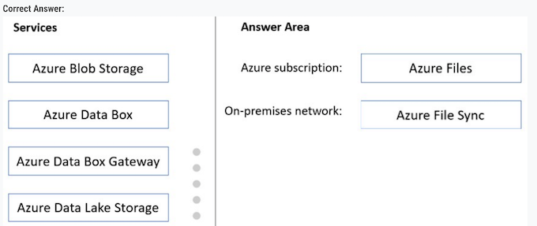

**Box 1: Azure Files -**

Scenario: App2 has the following file storage requirements:

* ✑ Save files to an Azure Storage account. 
* ✑ Replicate files to an on-premises location. 
* ✑ Ensure that on-premises clients can read the files over the LAN by using the SMB protocol.

**Box 2: Azure File Sync**

Use Azure File Sync to centralize your organization's file shares in Azure Files, while keeping the flexibility, performance, and compatibility of an on-premises file server. Azure File Sync transforms Windows Server into a quick cache of your Azure file share. You can use any protocol that's available on Windows Server to access your data locally, including SMB, NFS, and FTPS. You can have as many caches as you need across the world.

> Azure Subscription: "Azure Files  ✅
> 
> On-premises network: "Azure File Sync"  ✅

### Question 9

You need to recommend a solution that meets the data requirements for App1. 

What should you recommend deploying to each availability zone that contains an instance of App1?

* **A. an Azure Cosmos DB that uses multi-region writes** ✅
* B. an Azure Data Lake store that uses geo-zone-redundant storage (GZRS) 
* C. an Azure Storage account that uses geo-zone-redundant storage (GZRS)

Scenario: App1 has the following data requirements: 

* ✑ Each instance will write data to a data store in the same availability zone as the instance. 
* ✑ Data written by any App1 instance must be visible to all App1 instances.

Azure Cosmos DB: Each partition across all the regions is replicated. Each region contains all the data partitions of an Azure Cosmos container and can serve reads as well as serve writes when multi-region writes is enabled

**Incorrect Answers:**

B, D: GZRS protects against failures. Geo-redundant storage (with GRS or GZRS) replicates your data to another physical location in the secondary region to protect against regional outages. However, that data is available to be read only if the customer or Microsoft initiates a failover from the primary to secondary region. 

C: Active geo-replication is designed as a business continuity solution that lets you perform quick disaster recovery of individual databases in case of a regional disaster or a large scale outage. Once geo-replication is set up, you can initiate a geo-failover to a geo-secondary in a different Azure region. The geo-failover is initiated programmatically by the application or manually by the user

### Question 10

**You are evaluating whether to use Azure Traffic Manager and Azure Application Gateway to meet the connection requirements for App1. What is the minimum numbers of instances required for each service?**

To answer, select the appropriate options in the answer area.

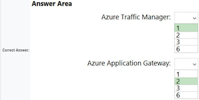

**Box 1: 1 -** ✅

App1 will only be accessible from the internet. App1 has the following connection requirements:

* Connections to App1 must be active-active load balanced between instances. 
* All connections to App1 from North America must be directed to the East US region. 
* All other connections must be directed to the West Europe region.

App1 will have six instances: three in the East US Azure region and three in the West Europe Azure region. 

Note: Azure Traffic Manager is a DNS-based traffic load balancer. This service allows you to distribute traffic to your public facing applications across the global Azure regions.

**Box 2: 2 -** ✅

* For production workloads, run at least two gateway instances. 
* A single Application Gateway deployment can run multiple instances of the gateway. 
* Use one Application Gateway in East US Region, and one in the West Europe region

> Azure Traffic Manager: " 1 " 
>
> Azure Application Gateway: " 2 "

## Topic 3

**Overview - Fabrikam, Inc.**

is an engineering company that has offices throughout Europe. The company has a main office in London and three branch offices in Amsterdam, Berlin, and Rome.

**Existing Environment: Active Directory Environment**

The network contains two Active Directory forests named corp.fabrikam.com and rd.fabrikam.com. 

There are no trust relationships between the forests. Corp.fabrikam.com is a production forest that contains identities used for internal user and computer authentication. Rd.fabrikam.com is used by the research and development (R&D) department only. 

The R&D department is restricted to using on-premises resources only.

Existing Environment: Network Infrastructure Each office contains at least one domain controller from the corp.fabrikam.com domain. 

The main office contains all the domain controllers for the rd.fabrikam.com forest.

All the offices have a high-speed connection to the internet.

An existing application named WebApp1 is hosted in the data center of the London office. WebApp1 is used by customers to place and track orders. WebApp1 has a web tier that uses Microsoft Internet Information Services (IIS) and a database tier that runs Microsoft SQL Server 2016. The web tier and the database tier are deployed to virtual machines that run on Hyper-V.

The IT department currently uses a separate Hyper-V environment to test updates to WebApp1.

Fabrikam purchases all Microsoft licenses through a Microsoft Enterprise Agreement that includes Software Assurance. Existing Environment: **Problem Statements The use of WebApp1 is unpredictable. At peak times, users often report delays. At other times, many resources for WebApp1 are underutilized**.

**Requirements: Planned Changes -**

Fabrikam plans to move most of its production workloads to Azure during the next few years, including virtual machines that rely on Active Directory for authentication. 

As one of its first projects, the company plans to establish a hybrid identity model, facilitating an upcoming Microsoft 365 deployment. All R&D operations will remain on-premises.

Fabrikam plans to migrate the production and test instances of WebApp1 to Azure

**Requirements: Technical Requirements**

Fabrikam identifies the following technical requirements:

* Website content must be easily updated from a single point. 
* User input must be minimized when provisioning new web app instances. 
* Whenever possible, existing on-premises licenses must be used to reduce cost. 
* Users must always authenticate by using their corp.fabrikam.com UPN identity. 
* Any new deployments to Azure must be redundant in case an Azure region fails.

* Whenever possible, solutions must be deployed to Azure by using the Standard pricing tier of Azure App Service. 
* An email distribution group named IT Support must be notified of any issues relating to the directory synchronization services. 
* In the event that a link fails between Azure and the on-premises network, ensure that the virtual machines hosted in Azure can authenticate to Active Directory. 
* Directory synchronization between Azure Active Directory (Azure AD) and corp.fabrikam.com must not be affected by a link failure between Azure and the on- premises network.

**Requirements: Database Requirements**

Fabrikam identifies the following database requirements:

* Database metrics for the production instance of WebApp1 must be available for analysis so that database administrators can optimize the performance settings.
* To avoid disrupting customer access, database downtime must be minimized when databases are migrated. 
* Database backups must be retained for a minimum of seven years to meet compliance requirements.

**Requirements: Security Requirements**

Fabrikam identifies the following security requirements:

* Company information including policies, templates, and data must be inaccessible to anyone outside the company.
* Users on the on-premises network must be able to authenticate to corp.fabrikam.com if an internet link fails.
* Administrators must be able authenticate to the Azure portal by using their corp.fabrikam.com credentials. 
* All administrative access to the Azure portal must be secured by using multi-factor authentication (MFA). 
* The testing of WebApp1 updates must not be visible to anyone outside the company

Question HOTSPOT -

### Question 1

**You are evaluating the components of the migration to Azure that require you to provision an Azure Storage account.**

For each of the following statements, select

Yes if the statement is true. Otherwise, select No.

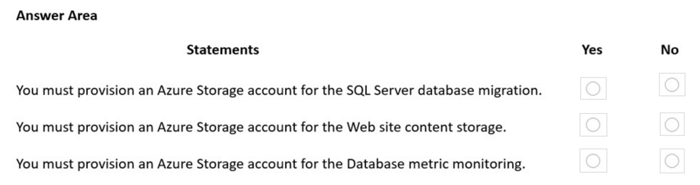

**1. SQL Migration:**

Because onprem licenses must be used, whenever possible=> BYOL. Preferred SQL Migration in this case is uploading VHD from onprem Hyper-V- VM and create a new Azure VM

2. Website content storage is more like html, css, media. I think you would need a storage account for that

3. Database metrics: For SQL Server on Azure VMs it is possible to send metrics to 3 services

* a) Log Analytics workspace in Azure Monitor
* b) Azure Event Hub 
* c) Azure Storage

1. **You must provision an Azure storage account for the SQL server database migration**: Yes. Azure Storage is often used as a staging area for migrations, including SQL Server databases.
2.  **You must provision an Azure storage account for the web site content storage**: Yes. Azure Storage can be used to store static website content such as HTML, CSS, JavaScript, and image files.
3. **You must provision an Azure storage account for the Database metric monitoring**: No. Database metrics are typically monitored using Azure Monitor and Log Analytics, not Azure Storage. 
	* However, logs and metrics could potentially be exported to Azure Storage for long-term retention or further analysis.

	
1. **SQL Migration: Y** because Database migration assistant requires a Storage Account to store the database backup files 
2. **Web app content: Y** Content needs to be updated from an easy to use single point. That's a storage account. I don't consider the available storage that's built into an App Service as easily accessible or a 'single point' 
3. **Database metrics: N** Log Analytics workspace has its own storage, it doesn't require you to link your own storage account (although it's possible)

### Question 2

What should you include in the identity management strategy to support the planned changes?

* **A. Deploy domain controllers for corp.fabrikam.com to virtual networks in Azure.**  ✅
* B. Move all the domain controllers from corp.fabrikam.com to virtual networks in Azure. 
* C. Deploy a new Azure AD tenant for the authentication of new R&D projects. 
* D. Deploy domain controllers for the rd.fabrikam.com forest to virtual networks in Azure

**Correct Answer: A**

Directory synchronization between Azure Active Directory (Azure AD) and corp.fabrikam.com must not be affected by a link failure between Azure and the on- premises network. (This requires domain controllers in Azure). 

Users on the on-premises network must be able to authenticate to corp.fabrikam.com if an Internet link fails. (This requires domain controllers on-premises).

### Question 3

**To meet the authentication requirements of Fabrikam, what should you include in the solution?**

To answer, select the appropriate options in the answer area. NOTE: Each correct selection is worth one point.

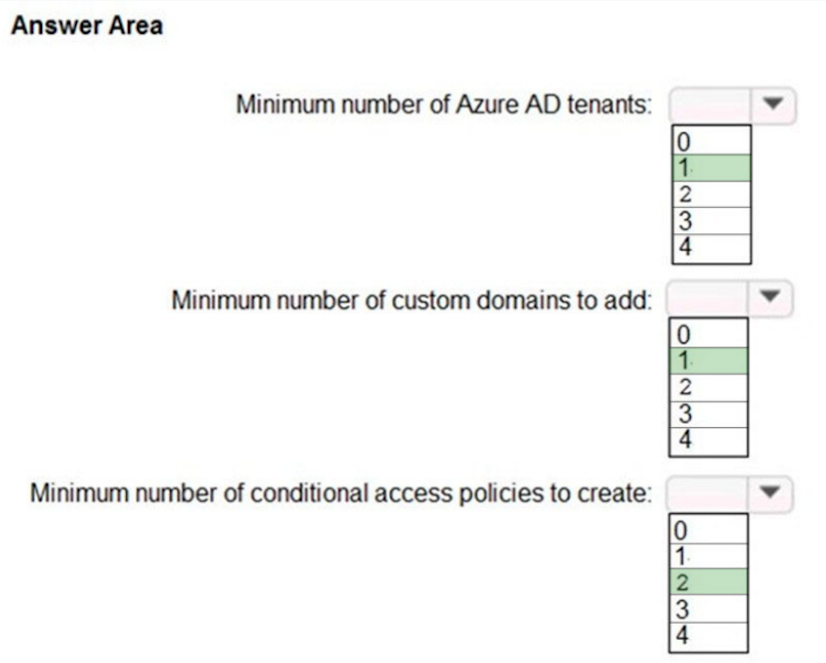

* 1=1:Single tenant creation required only due to RD restrictions implemented. 
* 2=1:Need to add custom domain due to default .onmicrosoft.com domain on tenant creation
* 3=2 Two policies requires, can't have multiple actions to block + allow on single conditional access policies. 

One required for admin MFA, second to block external access as per requirements.

### Question 4

You need to recommend a notification solution for the IT Support distribution group. 

What should you include in the recommendation?

* A. a SendGrid account with advanced reporting 
* B. an action group 
* C. Azure Network Watcher 
* **D. Azure AD Connect Health** ✅

An email distribution group named IT Support must be notified of any issues relating to the directory synchronization services.

Note: You can configure the Azure AD Connect Health service to send email notifications when alerts indicate that your identity infrastructure is not healthy. his occurs when an alert is generated, and when it is resolved.

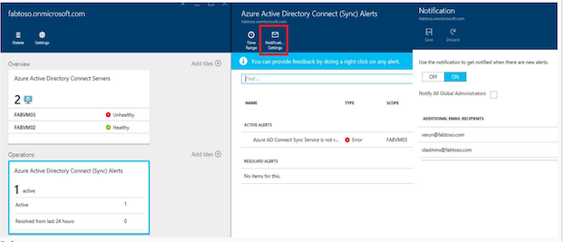

### Question 5

You need to recommend a solution to meet the database retention requirements. What should you recommend?

* **A. Configure a long-term retention policy for the database.**  ✅
* B. Configure Azure Site Recovery. 
* C. Use automatic Azure SQL Database backups. 
* D. Configure geo-replication of the database.

**Correct Answer: A**

Scenario: Database backups must be retained for a minimum of seven years to meet compliance requirements. 

Many applications have regulatory, compliance, or other business purposes that require you to retain database backups beyond the 7-35 days provided by Azure SQL Database and Azure SQL Managed Instance automatic backups. 

By using the long-term retention (LTR) feature, you can store specified SQL Database and SQL Managed Instance full backups in Azure Blob storage with configured redundancy for up to 10 years. LTR backups can then be restored as a new database

### Question 6

You need to recommend a data storage strategy for WebApp1. 

What should you include in the recommendation?

* A. an Azure virtual machine that runs SQL Server 
* B. a fixed-size DTU Azure SQL database 
* C. an Azure SQL Database elastic pool 
* **D. a vCore-based Azure SQL database**  ✅

**Correct Answer: D**

The use of WebApp1 is unpredictable. At peak times, users often report delays. At other times, many resources for WebApp1 are underutilized. Database metrics for the production instance of WebApp1 must be available for analysis so that database administrators can optimize the performance settings.

Note: A virtual core (vCore) represents a logical CPU and offers you the option to choose between generations of hardware and the physical characteristics of the hardware (for example, the number of cores, the memory, and the storage size). The vCore-based purchasing model gives you flexibility, control, transparency of individual resource consumption, and a straightforward way to translate on-premises workload requirements to the cloud. This model optimizes price, and allows you to choose compute, memory, and storage resources based on your workload needs.

Incorrect: 

**Not C: Azure SQL Database elastic pools are a simple, cost-effective solution for managing and scaling multiple databases, not for a single database.**

**D. vCore-based SQL**

**Requirement: Use existing on-premises licenses whenever possible**

You can only apply the Azure Hybrid licensing model when you choose a vCore-based purchasing model and the provisioned compute tier for your Azure SQL Database. Azure Hybrid Benefit isn't available for service tiers under the DTU-based purchasing model or for the serverless compute tier.

### Question 7

You design a solution for the web tier of WebApp1 as shown in the exhibit.

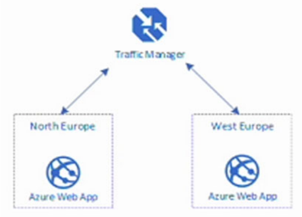

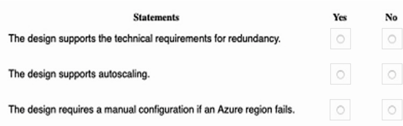

**Box 1: Yes** - Any new deployments to Azure must be redundant in case an Azure region fails. Traffic Manager is resilient to failure, including the failure of an entire Azure region.

* (Yes) Traffic manager distributes load to two sites (redundancy). 
* (Yes) The graphic clearly shows an "Azure Web App", which is production. By default, production web apps support auto scale. 
* (No) Azure Traffic manager does automatic failover, so no manual configuration is necessary