# 1 Azure Solution Architect & Identity and Access Management

## 1 Azure Solution Architect

**ARCHITECTURE**

Designing resilient, performant, and secure

**PRODUCTS**

Knowing how to pick the right product or feature for the job

**PRICING**

Understanding important licensing and pricing tiers


### Role and Responsibilities

* **Initial requirements gathering**
* **Solution scoping and pricing**
* **Detailed solution design**
* **Solution implementation**
* **Handover to operations**

### Azure Well-Architected Framework

> A set of architectural pillars, which help when designing a modern cloud solution.

* Security
* Reliability
* Cost
* Operations
* Performance


### Adopting the Cloud - Migration

**ASSESS**: Evaluate workloads (apps, infrastructure, data) to be migrated to Azure.

**DEPLOY**: Prepare the environment, and migrate workloads to Azure.

**RELEASE**: Optimize, monitor, and hand over the solution to operations.

### TOOLs

* **Service Map**: Map communication between app components on Windows or Linux.
* **TCO Calculator**: Estimate monthly Azure running costs compared to on-premises.
* **Azure Migrate**: Tools for assessment and migration of machines, data, web apps, and more to Azure.
* **Cost Management**: Native Azure cost monitoring and reporting
* **Azure Advisor**: Personalized recommendations ranging from performance to cost for our Azure resources
* **Azure Monitor**: Centralized, multifaceted monitoring platform for both Azure and on-premises resources.

## 2 Design Identity and Access Management

### 2-1 Introduction

#### **1 Traditional On-Premises Architecture**

Traditional security was focused on the network perimeter, **where on-premises networks were considered trusted and external networks were untrusted.**


#### **2 Modern Architecture**

> Cloud changed the resource hosting and access model.

* Increased reliance on hybrid environments and cloud resources (i.e., Software as a Service).
* **Remote Staff** may work outside of the on-premises networks using their own devices.


#### **Modern Identity-Centric Architecture**

**3 Identity as Central Element:**

* Modern solutions are architected with identity at the center.
* Identity is crucial for accessing resources, regardless of whether they are o**n-premises, in Azure, or in the cloud**.


**4 Azure Active Directory Role**

* Azure AD is used to store identities and is central to managing access.
* I**t facilitates authentication (AuthN) and authorization (AuthZ)**.


####  **Authentication and Authorization**

> Identity platforms facilitate authentication and authorization.

```
* Applications => Azure Active Directory (Application Identity / User Account)  => Resource 
* Staff
```

**5 Authentication (AuthN):**

* The process of proving identity within the Azure AD tenant.
* Necessary for users and applications to demonstrate who they are.


**6 Authorization (AuthZ):**

Follows authentication and **determines access control to resources based on verified identities**.


### 2-2 Recapping Azure AD

**Summary of Azure AD Components**

#### **1 Azure AD Tenants**

* Represents a **dedicated instance of Azure AD for an organization**.
* **<mark>Each Azure AD tenant has its own domain and can have multiple subscriptions associated with it</mark>**.
* **An Azure subscription is linked to one Azure AD tenant but a tenant can support multiple subscriptions**.

> Azure subscriptions must be associated with Azure AD.


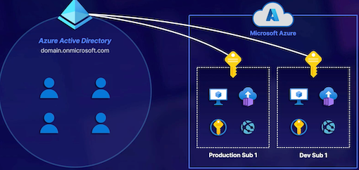


#### **2 Azure Identities**


> **Azure AD Tenant**

* **User Accounts**: Represent staff members; can be created in the cloud, synchronized from on-premises, or include guest accounts.
* **Applications (Service Principals)**: Represent applications that require access to Azure resources; authenticated using secret tokens or certificates.
* **Managed Identities**: Provide identities for Azure services, allowing resource authentication directly through Azure.

> **Azure AD supports identities for different scenarios.**

Remote Staff / SaaS / On-Premises Staff and Resources / Azure

#### Identity Types 

> High-level overview of some of the key differences in identity types.

**USER**

* Represents a staff member within the organization.
* Uses credentials such as username & password.
* Can be cloud users, synchronized, and guest users.

**APP**

* Represents an application in use within the tenant.
* **Uses a secret token or certificate for authentication**.
* Can include apps running in Azure, or elsewhere.

**MANAGED**

* Represents a service within the Azure subscription.
* Leverages the Azure platform for authentication.
* Only supports services running in Azure.

#### **3 Groups in Azure AD**

* Purpose of Groups: Organize identities **within the tenant and manage access permissions effectively**.
* **Types of Groups**:
	* **Assigned Groups**: Manually managed membership; requires administrative effort.
	* **Dynamic Membership Groups**: Automatically managed based on attributes; requires Azure AD Premium P1 license.

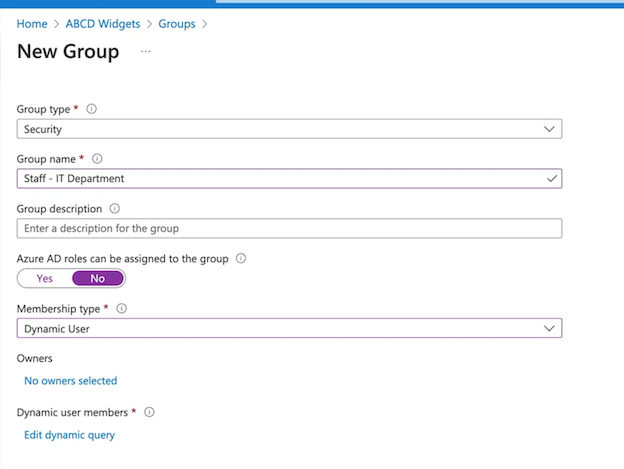


#### 4 Key Exam Points for AZ-305

**Understanding Azure AD Structure**

* Distinguish between the Azure AD tenant, identities, and subscriptions.
* Recognize the one-to-many relationship between Azure AD tenants and subscriptions.

**Identities in Azure AD**

* Identify the three main types of identities (**User Accounts, Service Principals, Managed Identities**) and their functions.
* Comprehend authentication methods (**user credentials vs. application secrets**).

* **Group Management**

* Understand the importance of using groups for access control instead of assigning permissions directly to users or identities.
* Differentiate between Assigned and Dynamic groups and their configurations.
* Know the limitations and requirements for dynamic groups (e.g., Azure AD Premium P1 licensing).


**Azure Portal Navigation**

* Familiarize yourself with the Azure Portal, specifically navigating to Azure Active Directory, managing users, applications, and groups.
* View how to create and manage both assigned and dynamic groups.

**Security Best Practices**

* Emphasize best practices in organizing identities and access controls using groups for better management and security.
* Understand the role of security groups in providing a more secure and manageable access permission structure.


### 2-3 Understanding Azure AD Hybrid Identities

#### What Is Hybrid Identity?

**Exploring Azure AD External Identities**

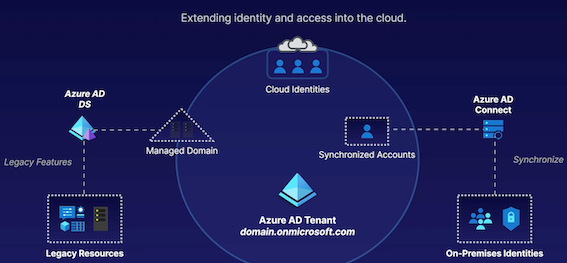

> **Hybrid Identity Solutions**:
> 
> Understanding the need for hybrid identity solutions in scenarios where organizations have a mix of on-premises and cloud resources.

#### **Azure AD Connect**

* **Identity Synchronization**

Synchronizing identities facilitates single sign-on for accessing resources.

* **Authentication Management**

Azure AD Connect can alter where authentication occurs.

* **Azure AD Connect Methods**

**Azure AD Connect sync and Azure AD Connect cloud sync (newer option).**


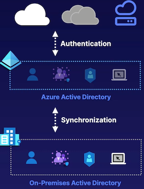

> **Azure AD Connect:**
> 
> Purpose and functionality of Azure AD Connect in synchronizing on-premises identities with Azure AD.
> 
> Impact on authentication management and the different authentication methods available.


#### Azure AD Domain Services (DS)

* **Azure AD**

Azure AD is built for modern authentication and authorization.

* **Azure AD DS Managed Domain**

Supports **domain join, group policy, LDAP, and Kerberos/NTLM authentication**.

* **Legacy Resources**

Some legacy resources may depend on traditional AD Domain Services features.

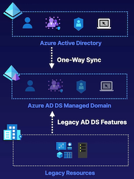

**Azure AD Domain Services:**
> 
> Role and benefits of Azure AD Domain Services in providing traditional AD DS functionality in the cloud.
> 
> **Features such as domain join, group policy, and LDAP support in Azure AD Domain Services**.


**Integration of Azure AD Connect and Azure AD Domain Services:**
> 
> Common use cases where both Azure AD Connect and Azure AD Domain Services are used together.
> 
> 
> Synchronization of on-premises identities to the managed domain with Azure AD DS.


#### Benefits of Hybrid Identities

* Simplify the user login experience by providing (seamless) single sign-on.
* **Simplify the management overhead**.
* Maintain identity as the perimeter of security.
* **Support legacy identity and service authentication and control.**


**Considerations for Solution Architects:**

> Importance of understanding and utilizing Azure AD Connect and Azure AD Domain Services for identity and access management in hybrid environments.
> 
> Recognizing the significance of integrating on-premises and cloud identities seamlessly for improved user experience and security.

**Azure AD Connect Sync vs. Azure AD Connect Cloud**

Azure AD Connect is going to help us synchronize and control authentication using on-premises resources to help out with single sign-on.


Whereas when we use **Azure AD Domain Services, that’s more targeted toward getting the traditional on-premises**

#### Summary:

* **Hybrid Environments**: Azure AD supports hybrid environments where organizations have a mix of on-premises and cloud resources.
* **Azure AD Connect**: Important tool for synchronizing on-premises identities with Azure AD.
* **Azure AD Domain Services**: Provides traditional Active Directory Domain Services functionality in the cloud.
* **Benefits of Hybrid Identities**: Simplifying user login experience, enhancing security by centralizing identities, and supporting legacy AD DS features in the cloud.


### 2-4 Azure AD and External Identities


* Azure AD Business-to-Business (B2B)
* Azure AD Business-to-Consumer (B2C)

#### Supporting External Identities with Azure AD

External identities help to provide customers and partners with access to resources.

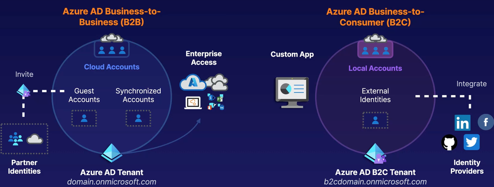

#### Azure AD External Identities

> External identities are a progression and combination of both Azure AD B2C and Azure AD B2B.

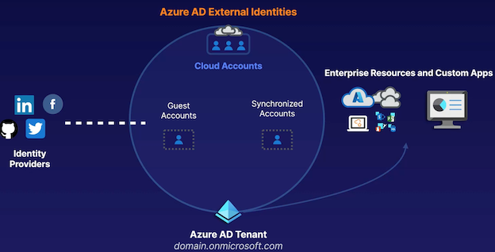

#### **Azure AD Business-to-Business (B2B)**

* **Supported External Partner Identities**: Work/school accounts, Gmail, Facebook, SAML, and WS-Fed identities.

* **Partner Users Invited as Guests**: Provides seamless, licensed access to your organization's resources.

* **Similar to Normal User Accounts** : Partner users are discoverable, and can be managed by access reviews.

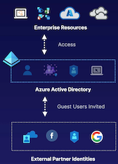

1. Allows inviting partners from their own identities to be guest accounts in your Azure AD tenant.
2. Partners continue to **use their own identity, appearing in your tenant for management**.
3. Grants access to resources, **provides roles for access to subscriptions, and more**.
4. Grants access to resources, provides roles for access to subscriptions, and more.
5. Invite users from partner platforms as guests to your tenant.
6. Manage partner identities similarly to normal user accounts in your Azure AD tenant.


#### **Azure AD Business-to-Customer (B2C)**

* **B2C Tenant**

Identity information is stored within a dedicated B2C tenant.

* **Supported Identities**

Social Identities, local, SAML and WS-Fed-based identity provider federation.

* **Considerations**

Users are self-managed and private, and branding can be customized.

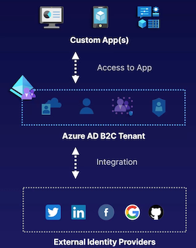

1. For custom applications needing external identity support.
2. Creates a dedicated Azure AD tenant for the application.
3. Supports more external identity providers than B2B.
4. Users manage their own identities (Gmail, Facebook, etc.).
5. Offers customization of branding through user flows for sign-in, profile management, etc.


#### **Azure AD External Identities:**

* Microsoft is merging Azure AD B2B and B2C into Azure AD External Identities.
* Aimed at **managing both partner identities and custom application identities within an Azure AD tenant**.
* Understand the distinct products: **Azure AD B2B for partner identities and B2C for custom applications.**

#### Demonstrations:

* Demonstrated inviting a partner identity using Azure AD B2B.
* Showed creating a new Azure AD B2C tenant for a custom application.
* Highlighted the differences in managing partner identities (B2B) and custom application identities (B2C).

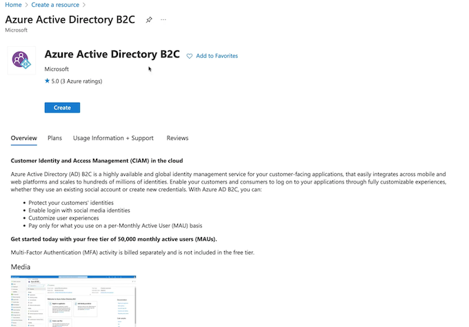

### 2-5 Recapping Azure Access Control

#### Securing Access to Azure Resources: Azure RBAC

**Elements of RBAC**

* **Security Principle**: Managed identity, security group, user account.
* **Role Definition**: Specifies permissions for the assignment.
* **Scope**: 
	* Management group, 
	* subscription, 
	* resource group, 
	* individual resource.

**Built-in Roles**: Owner, Contributor, Reader, VM Contributor, Storage Account Contributor.

**Inheritance**: Permissions **flow from top to bottom** (e.g., management group to resources).

**Scenario:**

* Example with 'Jenny' needing access to virtual machines and a specific storage account.
* Avoid assigning owner privileges at subscription level unless necessary.
* Use separate assignments for different access needs at subscription and resource group levels.


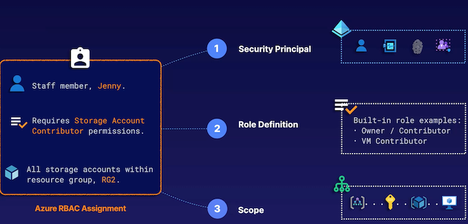

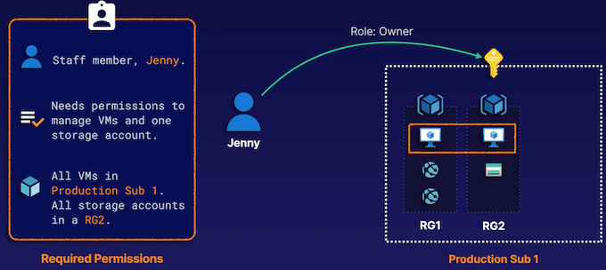

Jenny only requires access to all VMs and all storage accounts in an individual resource group.

Configuring 2 assignments. 

* The first one is going to be at the **subscription-layer**
* The second at the resource **group-layer.**
* For the subscription, **we want full VM access**
* For the **resource group, full storage account access**.
	* All storage accounts in an individual resource group.

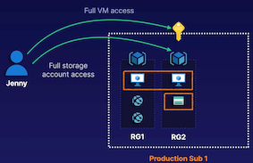

**Things like VM contributor, and things like storage account contributor.**

>  Whereas **contributor means full access to something** without the **ability to change permissions.**

So if someone requires full access to a given thing like virtual machines, but you don't want them to change permissions,

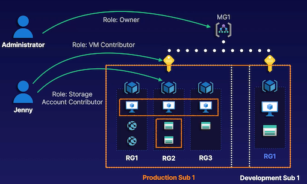


#### Securing Access to Azure AD Resources: Azure AD Roles

**Azure AD Access Control:**

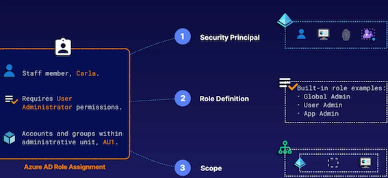

* Similarities with RBAC in terms of principles, role definitions, and scopes.
* **Azure AD Permissions**:
	* User administration, application administration, etc
	* C**an be applied at Azure AD tenant, administrative unit, or individual application levels**.

**Scenario**：  Example with 'Carla' managing users, groups, and applications in specific scopes.


**Add role assignment**

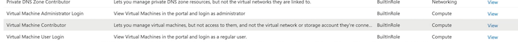

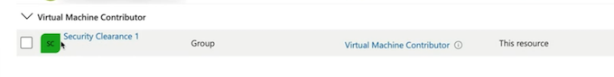

#### Securing Access to Azure AD Resources: Azure AD Roles

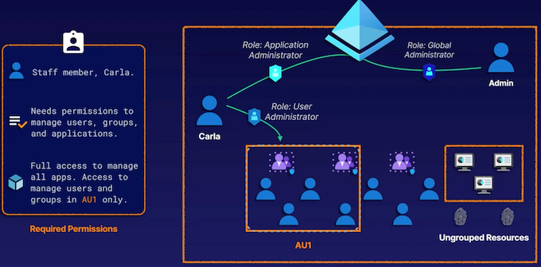

#### Custom Roles: Azure RBAC Custom Roles

**RBAC Custom Roles:**

* Used when built-in roles do not meet specific requirements.
* Defined through actions and data actions.
* Additive nature of permissions when multiple roles are assigned to a user.


**Azure AD Custom Roles**

* Available for customizing Azure AD permissions.
* No DENY functionality, only ALLOW functionalities.


**USAGE**： Use custom roles to follow the principle of least privilege if a built-in role provides too much access.

**FUNCTIONALITY**： Leverages **actions/dataActions** and **notActions/notDataActionstons** to define permissions (ALLOW model).

**SHARING**: Custom roles are available to all subscriptions that share the same Azure AD tenant relationship.

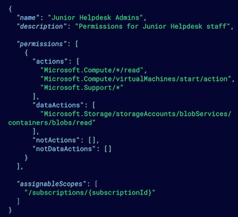

#### Custom Roles: Azure AD Custom Roles
 
**USAGE** Use custom roles to follow the principle of least privilege if a built-in role provides too much access.

**FUNCTIONALITY** Can only specify the permissions that will be allowed by the custom role (currently no **DENY** functionality).

**SHARING**： Accessible only within the Azure AD tenant that the custom role is created within.

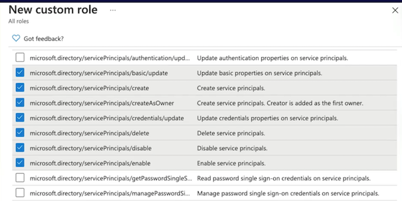


#### General Points:

* **Continuous Evaluation**: Permissions are applied and calculated continuously.
* **Management Groups**: Can be used for broader access control across subscriptions.
* **Portal Role Assignments**: Demonstrates how to assign roles in the Azure portal.

### 2-6 Scenario: Design for Identity Security

#### ABC WIDGETS

ABCD has a flagship mobile application, ABCDMobile, which is
served to customers globally. Application infrastructure is currentlY hosted on-premises, and identity is stored and managed locally within the application itself.

Some workloads are also hosted within a **single Azure subscription**, and **Azure AD Connect has been configured between on-premises Active Directory Domain Services (AD DS) and the Azure AD tenant**.


ABCD Widgets (ABCD) would like to modernize the ABCDMobile
application through the use of Azure services.

This modernization project must support the following:

* Identity for ABCDMobile must be migrated to a scalable cloud identity platform that supports social identities
* The new identity platform must support local accounts to minimize disruption to existing locally managed users
* Application infrastructure will be migrated to VMs, a storage account, and a private VNet.
* The ABCD Security department has finalized a tailored list of permissions that third-party developers should be granted, using identities from their own Azure AD tenant.

#### Solution Discussion

Possible solution design:

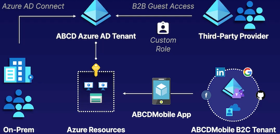


* Azure AD B2C tenant for ABCDMobile identity
* Azure AD B2B for the third-party solution provider
* Custom RBAC role for specified permissions

**1 Scenario Overview**

* Company: ABCD Widgets, a global widget manufacturer.
* Goal: Modernize on-premises applications for the cloud with the help of a third-party Azure consultant.


**2 Existing Environment:**

* ABCD uses a flagship mobile app called ABCDMobile, currently hosted on-premises.
* Identity Platform: **Custom-developed and managed locally within the application**.
* Azure Setup: Some workloads hosted in a single Azure subscription, **Azure AD Connect configured between on-premises and Azure AD tenant**.

**3 Requirements for Modernization:**

* Migrate identity platform to a scalable cloud platform supporting social identities and local accounts.
* Migrate application infrastructure **using virtual machines, storage account, and private virtual network**.
* Provide tailored permissions for developers using their own Azure AD tenant identities.

**4 Proposed Solution:**

* Use Azure AD B2C tenant for the custom application to support local accounts and social identities.
* **Invite third-party developers as guest accounts using Azure AD B2B for seamless sign-on with their own identities**.
* Configure custom roles with specific permissions for developers using role-based access control assignments.

**5 Additional Considerations:**

* Explore solutions like **Azure AD Domain Services for traditional on-premises AD functionality or requirements**.
* Consider access requirements for internal developers or specific departments using security groups or dynamic security groups.

