# Chap - 2  Identity Security  

## 3 Design for Identity Security

### 3-1 Introduction

**Importance of Identity Security**

> Identity security is more than just assigning permissions to users.

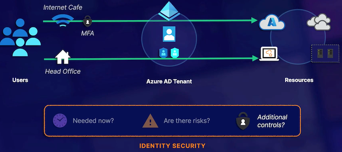

#### 1 Identity Security Overview:

* Users, Azure AD tenant, and resources are interconnected through identities.
* **Users authenticate their identities within the Azure AD tenant** and are **granted access permissions to resources**.

#### 2 Challenges in Identity Security:

* Need to review and assess if assigned **permissions are still necessary**.
* Monitoring for suspicious activities that may indicate compromised user accounts.
* Consideration of **additional security risks** related to identities.

#### 3 Advanced Identity Security Features:

* Implementing additional controls beyond basic access permissions.
* Addressing different scenarios where unique security controls are needed.
* Example scenario: **Allowing or blocking access based on the location or type of connection** (e.g., internet cafe).

#### 4 Protection of Identities:

* Emphasis on protecting privileges and identities.
* Implementing controls to safeguard identities in diverse scenarios.
* Discussion on the importance of having additional security measures to secure identities effectively.

### 3-2 Securing Identities with Azure AD Identity Protection

Purpose of Azure AD Identity Protection:

* Protecting identities from compromise.
* Detecting risks using Microsoft security team and AI.

#### Securing Identities with Azure AD Identity Protection

**Feature Overview**

* **Detection**： Automate the detection and remediation of identity-based risks.
* **Risk Analysis**： Easy access to risk-related data and reports within the Azure Portal
* **Integration**: Export data and integrate with security monitoring tools.

#### Configuration Overview

**Configuration and Usage:**

* Requires Azure AD Premium P2 licensing.
* Focuses on detecting risks like leaked credentials and suspicious sign-ins.
* **Utilizes risk policies for managing risks**.
* Two main policies: **Sign-in risk policies (real-time detection) and User risk policies (offline detection)**.

#### **Sign-in Risk Policies:**

* Monitor **sign-ins for suspicious activity**.
* Configure policies based on risk levels and actions like blocking access or requiring multi-factor authentication.

#### **User Risk Policies:**

* **Detect offline threats and suspicious user activity.**
* Configure policies to block access, enforce password changes, or allow access under certain conditions.

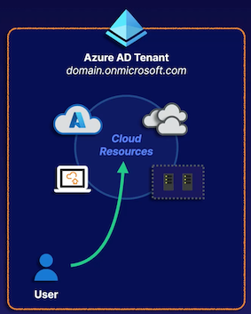

* **Azure AD Tenant**: Requires Azure AD Premium P2 licensing.
* **Risk Events**
	* Risks that Identity Protection is monitoring for both proactively and reactively.
	* This includes:
		* Users with leaked credentials
		* Sign-ins from anonymous IP addresses
		* Impossible travel to atypical locations
		* Sign-ins from infected devices
		* Sign-ins from IP addresses with suspicious activity
		* Sign-ins from unfamiliar locations

* **Risk Policies**	
	* Risk policies define what action to take if risk has been found to be associated with an identity.

#### Sign-In Risk Policy

* **Real-Time Detection**

Takes effect in real time. These policies can be used to block a sign-in as it occurs.

* **Assignment**

Describes when the policy will trigger. This includes defining the applicable users/groups and the risk level condition.

* **Control**

Describes what to do when the policy triggers. The action can be to block or allow a sign-in, or allow access but require MFA.

**Identity Protection | Sign-in risk policy**

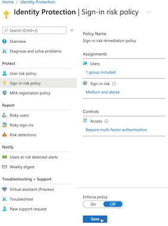

#### User Risk Policy

**Offline Detection**

Takes effect offline. These policies can identify
user accounts that are found to be at risk.

**Assignment**

* Describes when the policy will trigger.
* This includes defining the applicable users/groups and the risk level condition.

**Control**

* Describes what to do when the policy triggers. 
* The action can be to block or allow access, or force a password change.

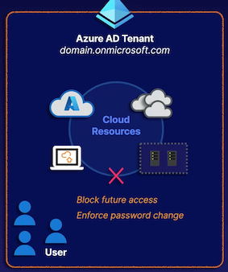

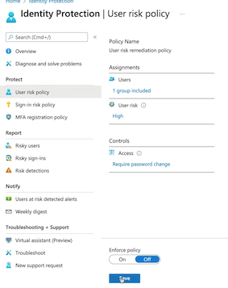

#### Additional Features:

* MFA registration policy for enforcing multi-factor authentication.
* Reporting capabilities for monitoring identified risks.
* Alerts and weekly digest for risk monitoring.

**Licensing Requirement:**

Requires Azure AD Premium P2 license for utilizing Azure AD Identity Protection features.

**Practical Considerations:**

* Ability to try/buy the functionality through Microsoft's trial option.
* Leveraging risk data in other services like Conditional Access.

### 3-3 Protecting Resources with Azure AD Conditional Access 

#### Purpose of Azure AD Conditional Access:

* Focus on security controls for different scenarios.
* Enables enforcing different types of controls (**allow, block, require additional factors**) based on various conditions.

#### Features and Scenarios:

* Provides flexibility in controlling access based on user location, device type, risk levels, etc.
* Includes features like **country IP addresses, allowed locations, trusted locations, different device types, and risk levels** from Azure AD Identity Protection.

Security controls and restrictions that are tailored to
different scenarios.

**Flexible Security Controls**

Security isn't one size fits all. 

Conditional Access allows us to configure different rules for different scenarios.

**Leverages Various Signals**

There are a variety of signals that can be checked, including a user's location, risk level, and much more.

**Can Enforce Different Controls**

With Conditional Access, we can require users to meet special conditions before granting access.

#### Conditional Access Policies

**Configuration Overview:**

* Requires Azure AD Premium P1 licensing.
* Configured through Conditional Access policies that define **assignment, conditions, and controls**.
* Policies can be applied to specific users, groups, cloud applications, or scenarios based on various signals.

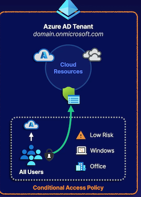

**Azure AD Tenant**： Requires Azure AD Premium P1 licensing.

**Access Policy: Assignment**

* The users/groups that the policy applies to, as well as the cloud app or action being accessed.

* It is also possible to include the conditions under which access is being requested.

**Access Policy: Access Controls**

* What will happen if the conditions are met?
* This can include blocking/allowing access, or even report-only mode for auditing purposes.

**Policy Configuration:**

* **Assignments**: Define who the policy applies to (users, groups, cloud apps).
* **Conditions**: Specify conditions such as user risk, sign-in risk, device type, and location.
* **Controls**: Grant access based on specified conditions (e.g., require multifactor authentication, Azure AD domain-joined device).

**Use Report-Only mode, or the What If tool to evaluate policies.**

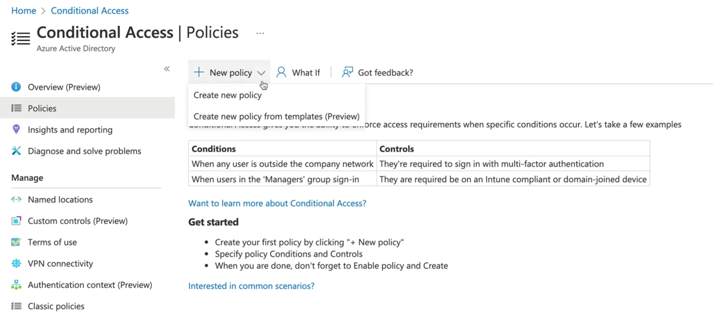

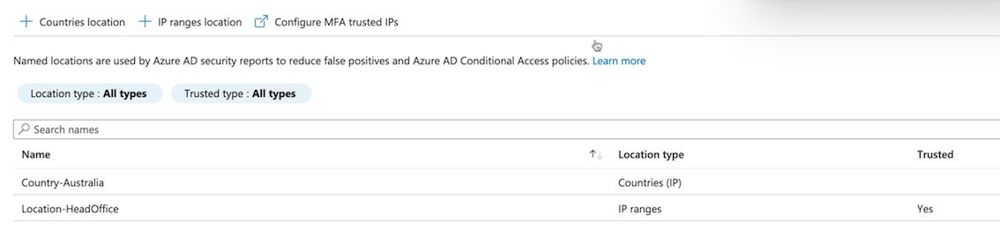

**Assignments**

* Users or workload identities
* Cloud apps or actions 
* Conditions
* Access controls

#### Best Practices:

* Be cautious to avoid unintentionally locking out users.
* Use report-only mode for monitoring policies without enforcing them.
* Utilize the 'what if' tool to simulate scenarios and understand the impact of policies.

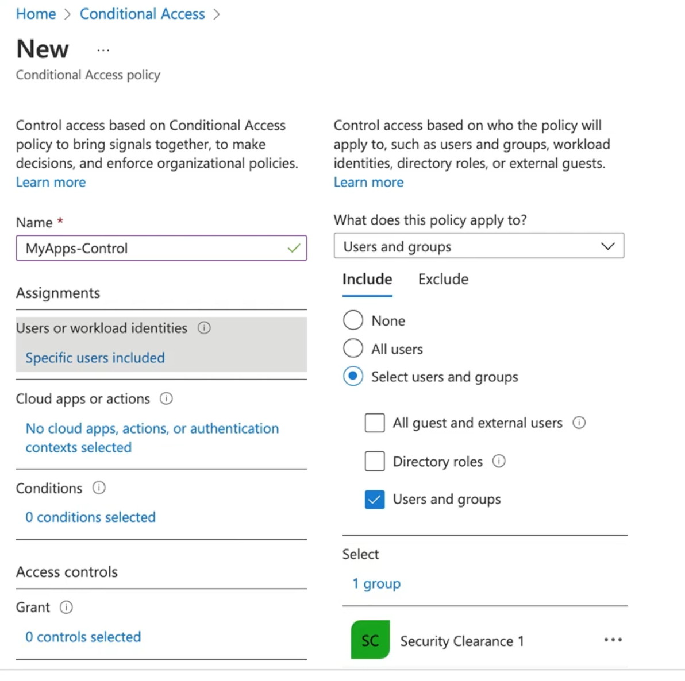

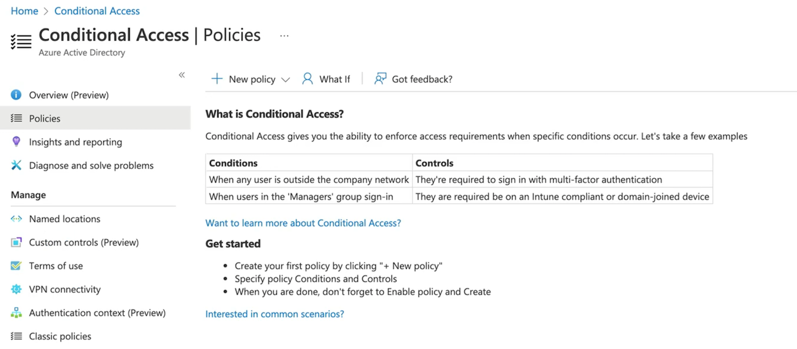

#### Recommendations:

* Azure AD Conditional Access is a flexible tool for securing environments.
* Consider using the what if tool to simulate scenarios and understand policy impacts.
* Ensure proper exclusions for critical users to prevent unintended access restrictions.

### 3-4 Protecting Privileges with Azure AD Privileged Identity Management (PIM)

**Purpose of Azure AD Privileged Identity Management (PIM)**

> Protecting privileges for
Azure AD and Azure roles.

* **Protect**

Enforce additional workflow-like tasks for users to be provided with their privileges.

* **Audit**

Provide an audit trail with information on privileged usage and justification.

* **Review**

Simplify and automate the ability to review whether privileges are still required by users.

#### The Problem with Privileges

**Scenario and Problems Addressed**:
  
- Addresses issues such as unnecessary continuous access to high-level privileges.
- Protects against scenarios where users may retain privileges they no longer need or use, leading to potential security risks.
 - Helps in managing access based on specific project requirements or timeframes.

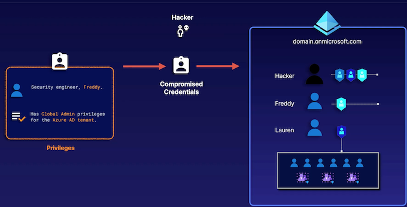

**Just-in-time access**: privileges are only assigned but not **activated until they are required**.

**Time-bound access**: privileges are deactivated after a set period of time using start/end dates.

**Approval**: users who are assigned privileges must request approval before they will be activated.

**Multi-factor authentication (MFA):** enforce the use of MFA to activate any role.

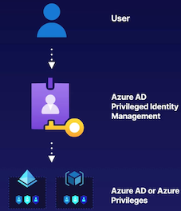

#### Getting Started with PIM

* **STEP 1**

Privileged Identity Management requires **Azure AD Premium P2 or EMS E5 licensing**.

* **STEP 2**

PIM is automatically enabled for an organization **when a user with a privileged role first accesses it**.

* **STEP 3**

Configure role settings for Azure and Azure AD roles (note: Azure requires role discovery).

**Privileged Identity Management**

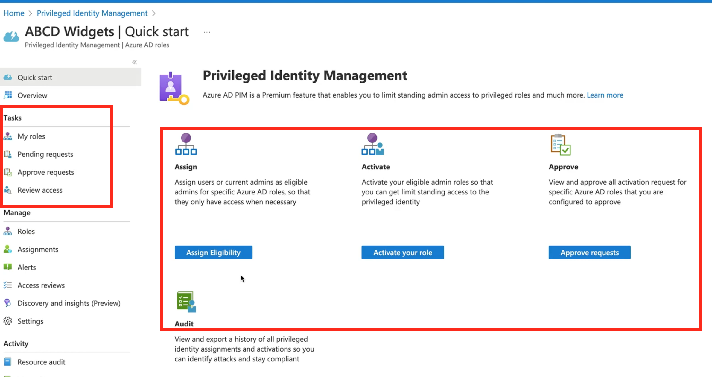

**Add Assignment**

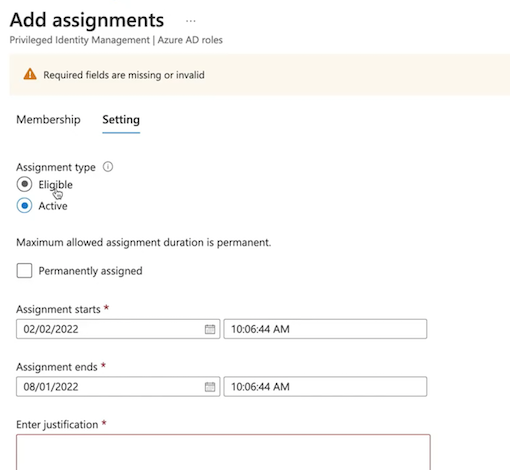

### Summary

1. **Privileged Identity Management (PIM)**:
   - PIM is about **protecting privileges by implementing workflow types of management for permissions**.
   - Helps in managing and controlling access to privileged roles in Azure Active Directory (AD) and Azure role-based access control (RBAC).

2. **Features and Functionalities**:
   - PIM provides controls like **just-in-time access, time-bound privileges, approval requirements, and multi-factor authentication** for activating privileges.
   - **Enables audit trails, access reviews, and notifications for better privilege management and security**.

3. **Implementation and Configuration**:
   - Requires Azure AD Premium P2 licensing or equivalent like EMS E5.
   - Changes the access control experience in Azure AD by **introducing Eligible Assignments, Active Assignments, and Expired Assignments**.
   - Admins can assign and manage privileges, set eligibility criteria, and configure advanced features like time-bound access and approval requirements.

4. **Demonstration Environment**:
   - Demonstrates how to assign privileges to users, set eligibility criteria, and configure role settings in the Azure portal.
   - Shows the user experience for activating assigned privileges, including providing justifications and seeking approvals.

### 3-5 Designing Identity Governance

> Removing privileges where they are no longer required.

* **Review**

Manage and conduct access reviews for groups, apps, and roles for staff and guests.

* Access reviews help in removing privileges that are no longer needed **by reviewing and managing access to groups, applications, roles, and Azure AD roles**.
* Access reviews are **scheduled and automated to ensure timely reviews** and potential automatic revocation of access.

* **Schedule**

Schedule reviews to be **performed on a regular basis as part of good identity governance**.

* **Automate**

Automate changes (deny/approve) to access based on the outcome of a review.

**Creating an Access Review:**

* Access reviews can be created for groups, applications, Azure AD roles, and Azure resources.
* Configuration includes selecting the scope, **reviewers, review duration, frequency, and settings for automatic application of results**.
* Justifications, notifications, reminders, and advanced features are available for configuring access reviews.

#### Important Components

**Deployment and Usage:**

* Azure AD P2 licensing is required for reviewers participating in access reviews.
* Access reviews can be configured in the Azure portal under Identity Governance for groups or applications, and through Privileged Identity Management (PIM) for role access like Azure AD or Azure RBAC roles.
* Reviewers perform the reviews through the MyApps portal, specifically the access panel.

**Requirements for Use**

* Requires Azure AD P2 licensing for reviewers.
* Azure resources must be discovered.

**Azure Portal Capabilities**

* Configure access reviews.
* Review/apply access review results.

**Access Panel Capabilities**

* Separate interface for reviewers
* Allows for responses (like Justification).

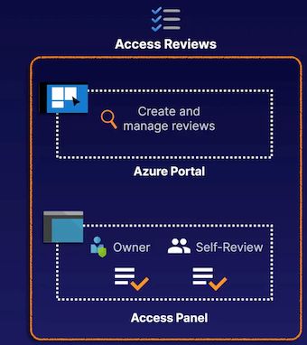

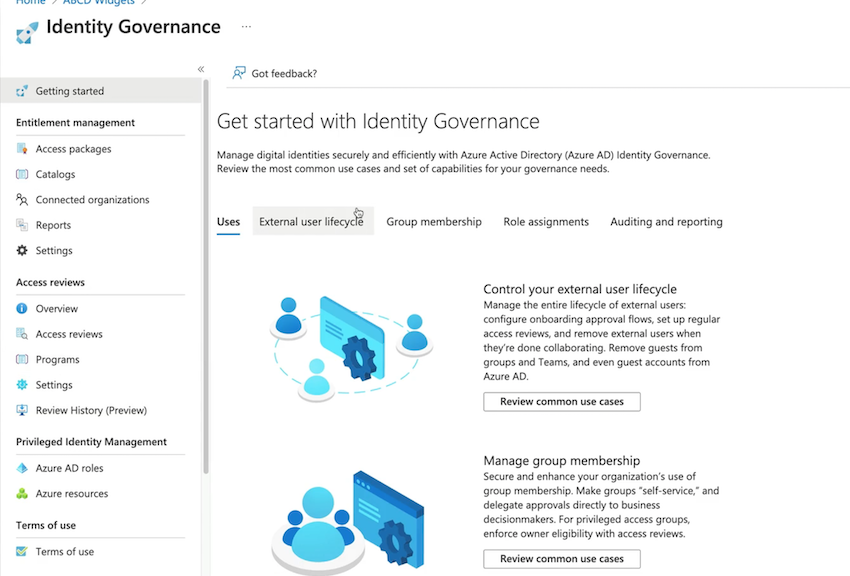

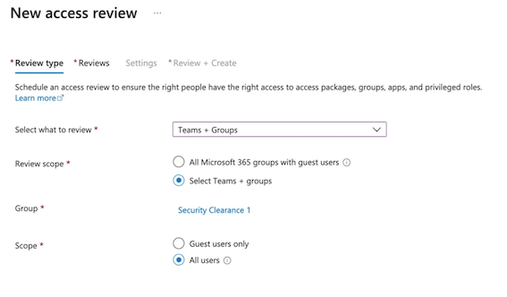

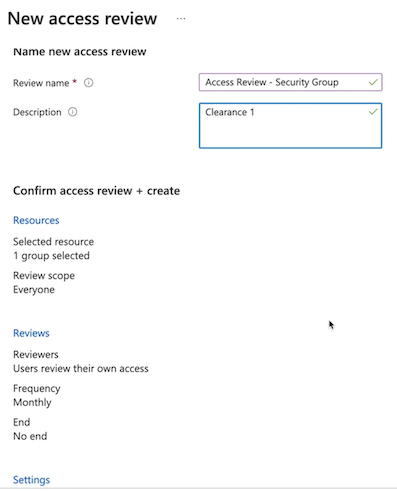

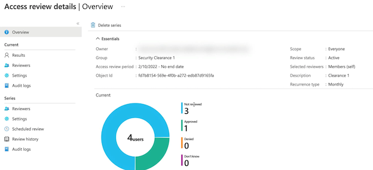

#### Overview of Review Types

**GROUP MEMBERSHIP**

* REVIEWER TYPE： Specified reviewers, group owners, self-review
* REVIEW CREATION： Azure AD access reviews, Azure AD groups
* **REVIEWER EXPERIENCE**： Access panel

**APP ASSIGNMENT**

* Specified reviewers, self-review
* Azure AD access reviews, Azure AD enterprise apps
* Access panel

**AZURE AD ROLE**

* Specified reviewers, self-review
* Azure AD PIM
* Access panel

**AZURE RESOURCE ROLE**

* Specified reviewers, self-review
* Azure AD PIM
* Access panel

#### User Experience:
 
* Users participate in access reviews through the access panel in the MyApps portal.
* **Reviewers can approve or revoke access based on the review requirements.**
* **Review administrators can monitor and manage access reviews, apply recommendations, and track review history.**

### 3-6 Scenario: Design for Identity Security

#### Existing Environment:

* Workloads on premises and within Azure.
* Using Azure AD Premium P1 licensing.
* Internal IT support team with different team members having full administrative access to the Azure subscription

#### Requirements

The following improvements have been recommended:

IT support access and security must be improved:

* The principle of least privilege should be followed
* **IT staff privileges should only be active as needed**.
* Requests for privileged access must require approval.

The ABCDFinance web application requires the following:

* Multi-factor authentication must be required whenever the application is accessed outside of the head office.
* Sign-ins to the app must be blocked **if they appear risky**.

#### Recommendations:

**IT Support Access and Security:**

* Follow the principle of least privilege.
* Activate IT staff privileges only as needed.
* Requests for privileged access must require approval.

**ABCDFinance Web App:**

* Require Multifactor Authentication (MFA) outside the head office.
* Block sign-ins if they appear risky.

#### Solution Discussion

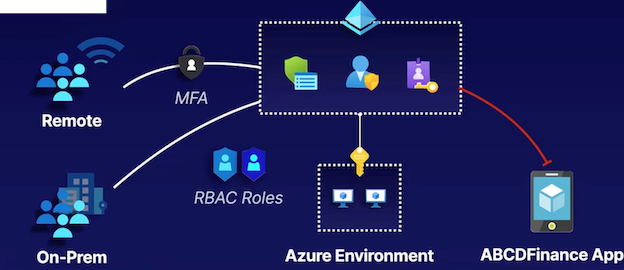

Azure AD Conditional Access for the ABCDFinance app:

* Allow access when using MFA (excluding the head office known location)
* Deny access when Identity Protection identifies any level of risk.

> Block access based on risk using Identity Protection.

**Configure Azure RBAC following the principle of least privilege.**

Implement Privileged Identity Management (PIM):

* Just-in-time privileged access management.
* Require role elevation approval.

Implement Privileged Identity Management (PIM):

* Just-in-time privileged access management.
* Require role elevation approval.

Upgrade to Azure AD Premium P2 licensing to support PIM + Identity Protection.

## 4 Design a Compute Strategy

### 4-1 Introduction

#### **Hosting and Shared Responsibility**

**Shared Responsibility Model:**

* In the cloud, the infrastructure is managed by the cloud provider, but customers are still responsible **for the operating system, runtime, applications, and code**.

* Different cloud service models like **Infrastructure as a Service (IaaS), Platform as a Service (PaaS), and Functions as a Service (FaaS)** offer varying levels of control and management responsibilities.

#### Cloud Service Models:

* **Infrastructure as a Service (IaaS)**: Customers are responsible for the operating system, runtime, applications, and code on virtual machines.

Infra => **OS => Runtime  => Apps  => Functions**

* **Platform as a Service (PaaS)**: Customers only manage the applications and features of their code, not the underlying infrastructure.

Infra => OS => Runtime  => **Apps  => Functions**

* Functions as a Service (FaaS): Customers are responsible for developing, configuring, and deploying their code, with minimal management of infrastructure.

Infra => OS => Runtime  => Apps  => **Functions**

**The Path to the Cloud Is Individual**

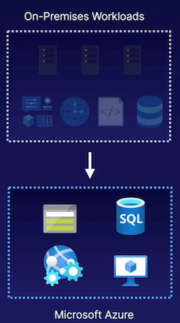

**Considerations for Migration:**

* Organizations should evaluate factors like workload priorities, existing infrastructure, budget constraints, and access to underlying code when deciding on migration strategies.
* Cloud migration may involve a mix of service models based on workload characteristics and optimization opportunities.

**Continuous Optimization:**

* Organizations should continuously assess and optimize workloads in the cloud to improve performance, cost-effectiveness, and resource utilization.
* Transitioning from traditional solutions to cloud-native services like PaaS can enhance efficiency and performance.

### 4-3 Architecting Virtual Machine-Based Solutions

#### **An overview of key functionality.**

**Very Versatile**： Supports many scenarios, from new solutions to lift-and-shift migrations.

**Full Control**： Control everything from the operating system up. Remotely manageable.

**Higher Maintenance** You're responsible for maintenance,
patching, updates, security, and more.

#### Virtual Machine Architecture Overview

**Virtual Machines:**

- **Versatile**: Can perform tasks like deploying web apps, containers, and custom solutions.
- **Full control**: Allows access to operating system files, Windows registry, Linux configuration, etc.
- **Maintenance responsibility:** Requires patching, updates, security management.
- Key elements: Name, region, network interface card, operating system image.

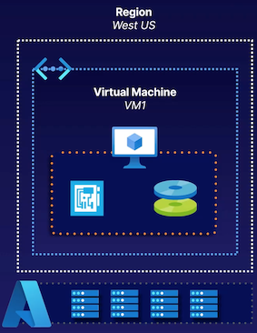

**Virtual Machine**

* Name: **not easily changed**
* Region/zone: impacts available hardware

**Virtual Network**

* Region/zone: must match VM config
* NIC resource: provides connectivity

**Operating System and Storage**

* Image: supports marketplace or custom
* Disks: requires at least an OS disk

#### Virtual Machine Families

* **General Purpose**： Balanced CPU-to-memor也ratio. Suits test/dev and smaller workloads
* **Compute Optimized**： High CPU-to-memory ratio. Suits medium workloads.
* **Memory Optimized**： High memory-to-CPU ratio. Suits relational database servers.
* **Storage Optimized**： Designed for workloads with high disk throughput and I0 requirements.
* **GPU**： Specialized VMs for graphics rendering, or deep learning workloads.
* **HPC** **High performance compute with powerful CPU and network.**

**VM Families:**

- General Purpose: For general workloads.
- Compute Optimized: More CPU than memory.
- Memory Optimized: Suitable for relational database servers.
- Storage Optimized: High throughput for transactional data.
- Specialized: GPU and HPC for machine learning, high-performance processing.

#### VM Scale Sets

**VM-Based**: Based on virtual machines, with similar benefits and maintenance overheads.

**High Availability**  Provides additional features to support high availability.

**Autoscaling** Provides capabilities for scaling out to meet demand.

**VM Scale Sets:**

- Based on virtual machines with benefits of full control and access.
	- High availability: **Built for redundancy with auto-scaling capabilities**.
	- Configuration: Image, size, disks, networking, and autoscaling rules.
	- Availability: Can be deployed to a region or across availability zones.
	- Autoscaling: Adjusts the number of instances based on workload demand.

#### Virtual Machine Scale Set (VMSS) Architecture

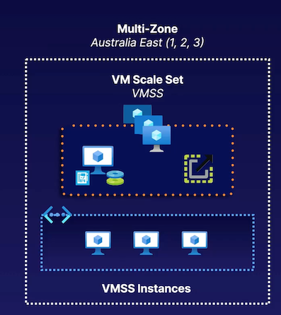

**Image and Configuration**

VMSS configuration is similar to configuring a virtual machine. Custom images are also supported.

**VMSS Instances**

Instances are deployed to an availability set/zone based on VMSS configuration.

**Autoscaling**

Supports availability and demand by scaling the instance count in and out.

Summary and key points for the AZ-305 exam based on the provided article:

#### **Azure Portal Configuration:**

- Resource group, name, location influence deployment options.
- Disk types: Premium, Standard, or Hard Disk Drive affecting IOPS.
- Networking: Virtual network, load balancer, application gateway.
- Customization: Custom data, user data for post-configuration tasks.
- Autoscaling: Rules for increasing or decreasing instances based on workload.

#### **Key Considerations:**

- Full control and access to operating system: Use virtual machines.
- Dynamic scaling and high availability requirements: Choose VM scale sets.
- **Region vs. availability zones deployment options.**
- Understanding disk types, networking, and autoscaling rules is essential.

### 4-4 Architecting Large-Scale Compute

### Azure App Service:

- **Overview**: Azure App Service is a platform for **building and hosting web, mobile, API, and special use case apps like WebJobs on Azure.**
- **Features**: Built-in high availability, autoscaling, streamlined development tools, continuous integration, and continuous development.
- **App Service Plan**: Determines underlying resources, compute, features, and pricing for apps.
- **Plans**:
  - Shared: Fewer features, shared compute.
  - Dedicated: More functionality, scaling, CI/CD, dedicated compute.
  - Isolated: More scale, compute, deployed to a virtual network.
- **Integration**: Easy Auth for authentication, VNet integration.
- **Pricing**: Different plans offer varying levels of features and dedicated resources.

**Infrastructure Management** No need to patch, maintain, or manage underlying infrastructure.

**Integrated tools to streamline development.** Integrated tools to streamline
development.

**CI/CD** Includes CI/CD features such as staging slots.

**Azure Integration** Integrates with Azure AD for auth, Nets for connectivity, and more.

**High Availability** Built-in support for high availabilitv.

**Autoscaling** Supports automated scaling in and scaling out.

**App**

* Web: Java, Ruby, Node.js, PHP, Python, NET
* Mobile: iOS and Android app backends
* API: REST-based HTTP/HTTPs web APIs
* WebJobs: scheduled/triggered tasks

**App Service Plan**

The hosting environment that executes your app. Plan determines features/resources.

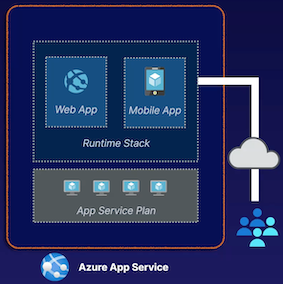

#### App Service Pricing

**Shared**

* Cheaper plans with fewer features.
* Apps can run on the same compute as other customers.

**Dedicated**

* Only apps belonging to the App Service plan run on these dedicated compute nodes. 
* Also includes additional features.

**Isolated**

Entirely dedicated and isolated to a customer's network. Includes greater scale-out capacity.

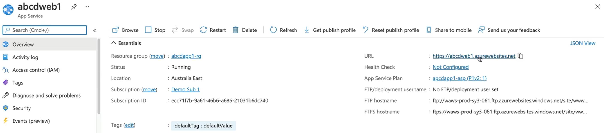

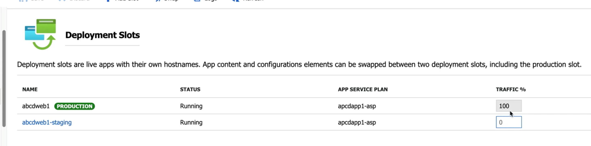

### Azure Functions:

- **Purpose**: Serverless computing for individual functions or features of an application.
- **Trigger-based**: Functions respond to triggers like HTTP requests, queues, or events in Azure services.
- **Models**:
  - Consumption: Pay for execution used, cost-effective.
  - Premium: Additional capabilities like VNet connectivity, unlimited execution.
  - Dedicated: Deploy functions to an existing App Service plan.
- **Architecture**: Function apps containing individual functions written in various supported languages.
- **Integration**: Bind functions to Azure services for trigger-based actions.

#### Why Use Azure Functions?

**The Solution Stack**

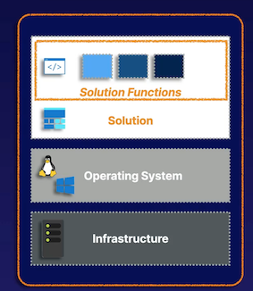

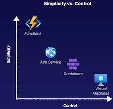

#### Function Apps: Architecture

**Azure Functions**

* Function app: hosting environment and plan
* Function: code to perform some function

**Trigger**

What causes the function to execute (e.g. a timer or HTTP request).

**Bindings**

Inbound and outbound integration (e.g., an inbound HTTP trigger and outbound blob).

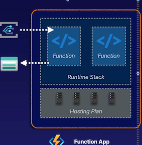

#### Function Hosting

Key features to consider when selecting an App

**Consumption**

Pay for execution only (time, memory). Scaling is managed for you.

**Premium**

Warm instances, Net connectivity, unlimited execution, and premium sizes.

**Dedicated**

An App Service plan. Useful for custom images or existing underutilized plans.

#### Create function

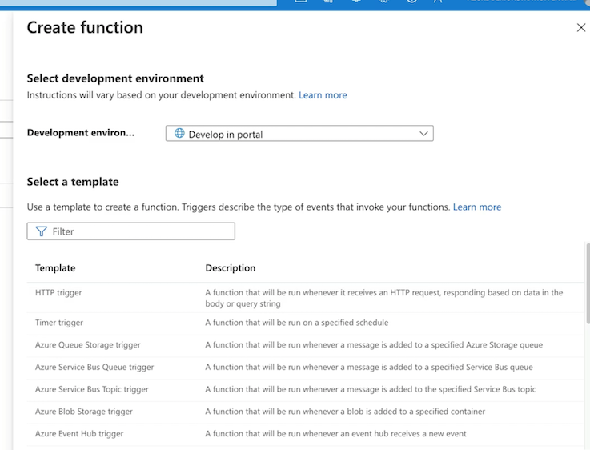

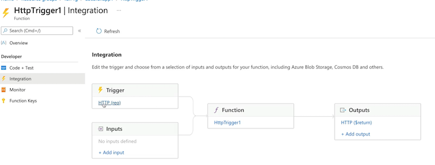

To summarize the key points for the AZ-305 exam based on the provided article:

### 4-5 Architecting Large-Scale Compute

#### Azure Batch:

* Fully managed, high-performance solution in Azure.
* Designed for developers, providing SDKs and APIs for building solutions leveraging high-performance compute.
* **Utilizes a batch account as the endpoint for all resources needed for high-performance compute**.
* **Involves a scheduler to split up jobs into tasks for compute nodes to work on**.
* Supported storage includes a storage account.
* **Emphasizes parallel execution for compute tasks**.
* Offers simplicity in job scheduling and task management.

High-Performance Compute Architecture

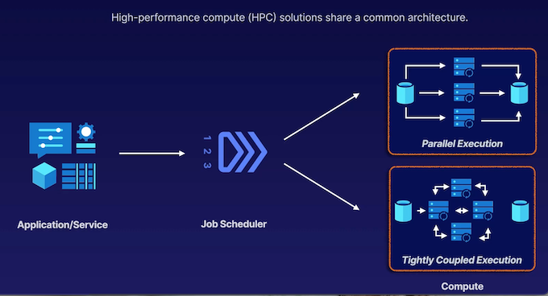

#### **Azure Batch**

**Fully Managed**

Fully managed cloud HPC cluster and scheduling infrastructure.

**Built-In Scheduler**

No cluster or job scheduler software to install/manage.

**For Developers**

Targeted toward developers, who can leverage tools and an API for HPC jobs.

#### Azure Batch: Architecture

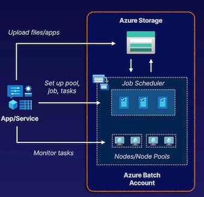

**Batch Account**

Includes all necessary HPC infrastructure, such as node pools and job scheduling

**Application/Service**

Customer application/service, responsible for managing jobs through the batch API.

**Storage Account**

A storage account can be used for storing job-related resources and files (in/out).

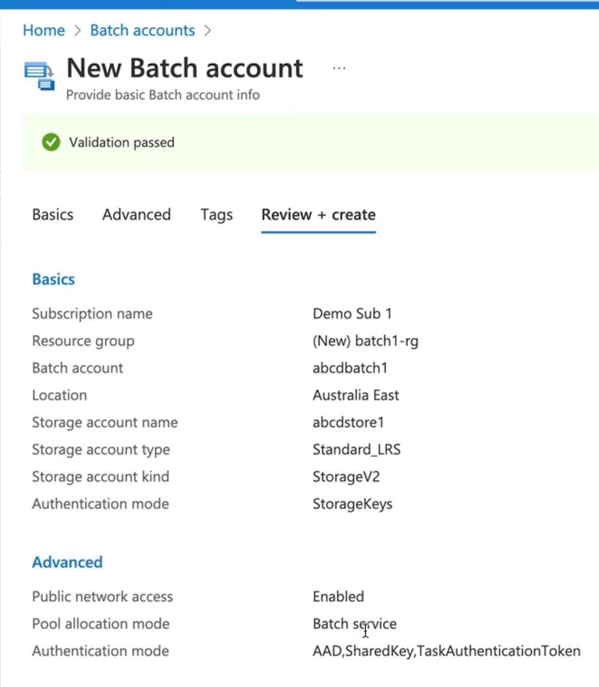

#### Azure CycleCloud

* **Aimed at easy deployment of high-performance computing resources in Azure**, particularly for HPC admins.
* **Supports bringing your own scheduler and third-party schedulers and file systems.**
* Focuses on deploying familiar HPC systems from on-premises to the cloud.
* **Involves deploying a virtual machine with the CycleCloud application for managing HPC resources**.
* **Supports third-party HPC clusters and traditional HPC file systems**.
* Provides cluster management for different schedulers and file systems.
* Requires access to your Azure subscription for coordination and management.

**Easy Deployment**

Simplified provisioning and management of cloud/hybrid HPC.

**Bring Your Own Scheduler**

Supports third-party schedulers and file systems.

**For HPC Admins**

Helps admins to deploy familiar autoscaling HPC solutions.

#### Azure CycleCloud: Architecture

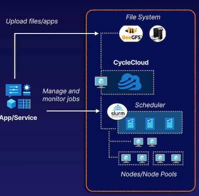

**CycleCloud Application**

Solution runs on a VM and contains various HPC management features.

**Cluster Management**

Deploy and manage schedulers (Slurm, LSF, etc.) or file systems (BeeGFS, NFS).

**Subscription Access**

Be aware that the CycleCloud app requires subscription access to manage resources.

**App/Service**

The customer application/service is responsible for managing jobs through the
scheduler.

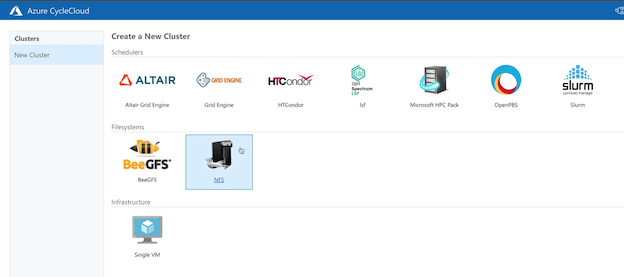

#### General Key Points:

* **High-performance compute involves parallel and tightly coupled execution methods**.
* Parallel execution involves splitting jobs into tasks processed by multiple compute nodes simultaneously.
* **Tightly coupled execution involves coordinated compute nodes working closely together on tasks.**
* **Azure Batch and Azure CycleCloud offer distinct approaches to deploying and managing high-performance compute resources in Azure.**
* Azure Batch is suitable for developers needing a managed solution for job scheduling and task management.
* **Azure CycleCloud targets HPC admins looking to deploy existing HPC setups to the cloud with flexibility in scheduler and file system choices**.

###  4-6 Isolating Compute-Based Solutions

#### Multi-Tenant Services

Most cloud services are shared with other customers.

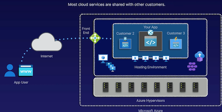

#### **Dedicated Hosts**

**Dedicated Infrastructure**

Physical host infrastructure is dedicated to a single customer (not shared).

**Greater Control**

Greater manual control over maintenance (e.g., patching, reboots).

**Hybrid Licensing**

More economic approach to leveraging existing software license agreements.

#### Isolating Virtual Machines with Dedicated Hosts

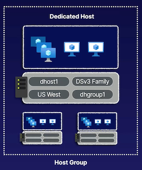

**Dedicated Host**

Physical server in an Azure datacenter, supporting a specific family of VMs.

**Supports for VMs and VM Scale Sets**

Deploy virtual machines, or virtual machine scale sets (Windows/Linux).

**Host Group**

* Group of one or more dedicated hosts 
* Helps to control high availability.

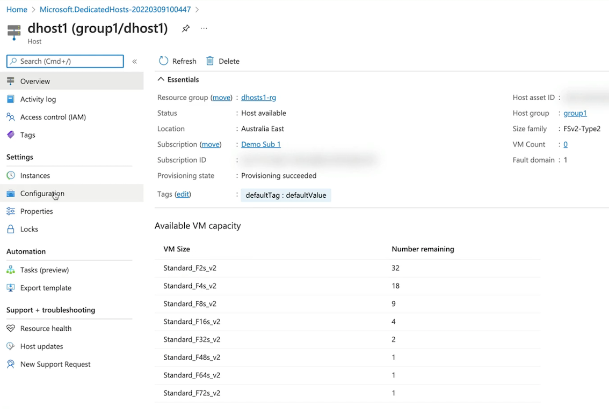

#### App Service Environments

**Dedicated Environment**

Deployed to a virtual network (and dedicated hosts) in your environment.

**High Scale**

Leverage greater scale-out limits for hyperscale.

**Secure Access**

Access can be configured for either internal or external use.

#### Isolating Apps with App Service Environment (ASE)

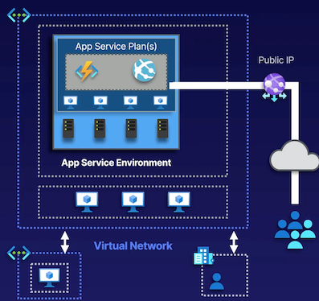

**Hosting**

Underlying hosts are multi-tenant,unless using dedicated hosts.

**App Service Plan (ASP)**

An app is deployed to an ASP, which is deployed to an ASE.

**Network**

Deployed to a customer's virtual network for private connectivity.

**Accessibility**

Can be accessed publiclv (external ASE) or publicly (public ASE).

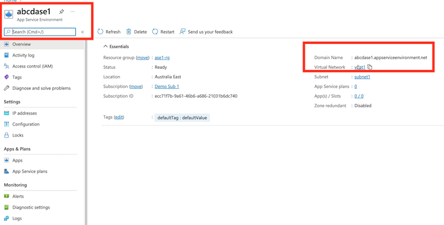

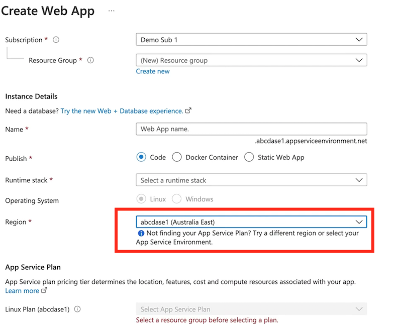

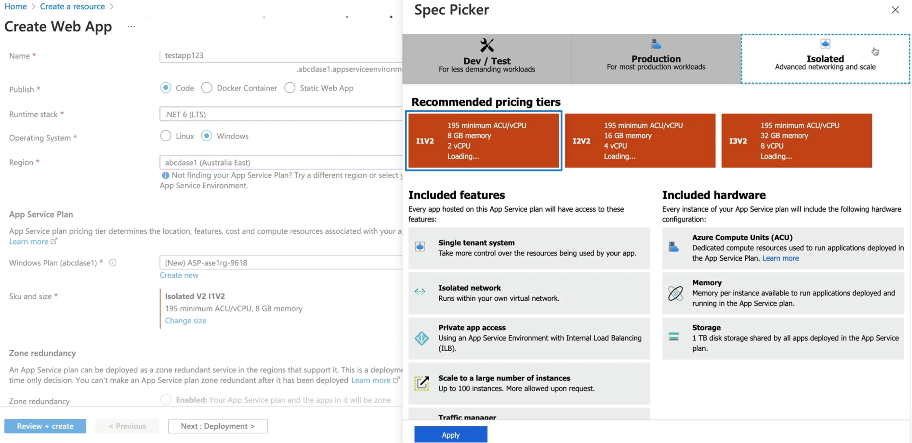

#### Isolating Containers

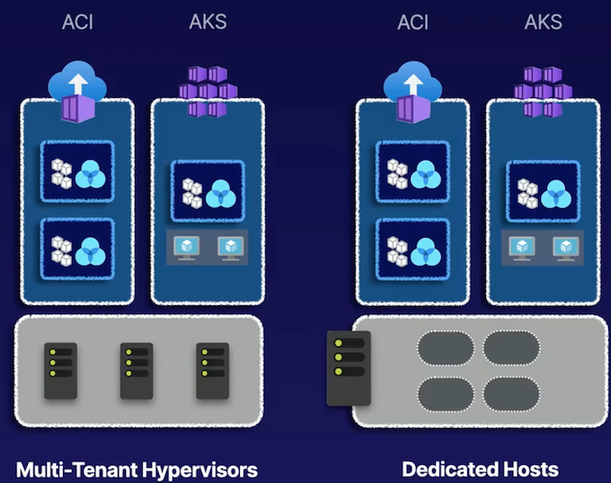

**Azure Container Instances (ACI)**. are isolated, but share hypervisors.

**Azure Kubernetes Service (AKS)**. shares hypervisors, but uses your VMs.

**Dedicated Host** provides support for AKS and ACI.

1. **Isolated Solutions Overview**:
   - Understanding the importance of isolated solutions.
   - Considerations for multi-tenant compute services and shared infrastructure.

2. **Dedicated Hosts**:
   - Dedicated physical infrastructure for exclusive use.
   - Provides isolation and security.
   - Greater control over maintenance schedules.
   - Supports hybrid licensing for cost savings.

3. **Azure App Service Environment**:
   - Offers a dedicated environment for running applications.
   - Provides isolation for networking and compute.
   - Enables greater scalability and control over access.

4. **Container Isolation**:
   - Azure Container Instances (ACI) and Azure Kubernetes Service (AKS) are multi-tenant services.
   - Can leverage dedicated hosts for isolation.
   - Newer technology supports deploying containers to dedicated hosts.

5. **Key Takeaways**:
   - Many Azure services share multi-tenant hypervisors.
   - Dedicated hosts can provide isolation at the hypervisor level.
   - Important for security and compliance requirements, especially in regulated industries.

### Scenario: Design a Compute Strategy

#### Requirements

The following requirements have been specified by the project team:

**ABCDProcessing:**

* Move to a service within Azure that minimizes disruption, change, and any retraining required for existing staff.
* Continue to support the existing scheduler, Slurm.
* Ensure costs are minimized when processing is in the off-season.

**ABCDOperations:**

* Migrate to an Azure service that can tolerate datacenter failure.
* Minimize ongoing IT management and other operational overhead and costs wherever possible.
* No changes to the code/app are permitted at this stage.

#### Solution  Discussion

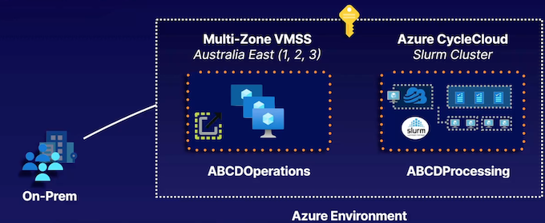

**ABCDProcessing migrated to Azure CycleCloud**

• Configure a cluster using the Slurm scheduler.

ABCDOperations migrated to VM Scale Sets

* Span the VM scale set across availability zones.
* Configure autoscale to help reduce costs.

Summary of key points for AZ-305 exam:

1. **Company Background**:

   - Fictitious company: ABCD Widgets.
   - Manufacturing and selling widgets globally.
   - Migrating workloads from on-premises infrastructure to Azure.

2. **Existing Environment**:

   - Two key solutions: ABCDProcessing and ABCDOperations.
   - ABCDProcessing: Big-compute server farm using Slurm HPC service.
   - ABCDOperations: Mission-critical web app on Windows 2019 Servers with .NET framework.

3. **Key Requirements**:

   - ABCDProcessing: Minimize disruption, continue supporting Slurm scheduler, minimize costs.
   - ABCDOperations: Stay online during datacenter failure, minimize operational overheads and costs, no changes to application code.

4. **Proposed Solutions**:

   - ABCDProcessing: Use Azure CycleCloud for high-performance compute, control costs by paying only when in use.
   - ABCDOperations: Migrate to VM scale sets spanning multiple availability zones for high availability, configure autoscale for cost efficiency.

5. **Considerations**:

   - Azure CycleCloud chosen for familiarity and Slurm support.
   - VM scale sets with availability zones for high availability.
   - PaaS solutions like Azure App Service may not provide full OS customization needed for ABCDOperations application.

6. **Possible Exam Focus**:

   - Understanding workload migration to Azure.
   - Selecting appropriate Azure services based on requirements.
   - Ensuring high availability and cost efficiency in solutions.
   - Balancing familiarity with existing systems and cost considerations.

