### 1 Entra ID Overview

Entry ID is a crucial identity management product within the Microsoft ecosystem, providing clarity in identity services. It offers features that simplify management and enhance security for users.

**Key Features**

* Identity as a Service
* Single Sign-On
* Identity Security
* Enterprise Capabilities
* Hybrid and Cloud
* Flexible OS Support


Entry ID is role as an identity-as-a-service solution. 

Entry ID encompasses many additional features beyond identity management,**including single sign-on capabilities. This allows users to access various services with one secure identity**.

The product also includes security features that help identify risks associated with different identities. This ensures that identities and credentials remain secure and protected.


#### **Identity Platform**

The identity platform enables organizations to manage access for different entities like **employees and applications, streamlining resource access across cloud and on-premises environments**.

Entities =>**AuthN** => Objects => **AuthZ**=> Resources

**Azure Subscription Relationship**

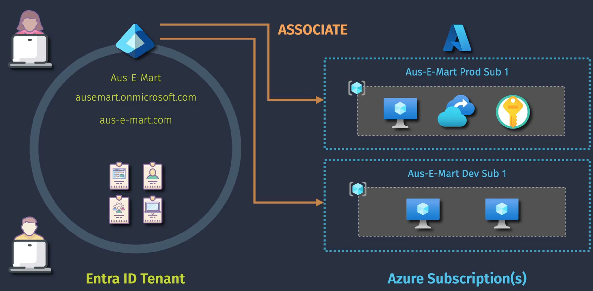

**Authentication** and **authorization** are two key concepts in identity management, where users prove their identity and are granted access to resources based on their permissions.


#### **Extended Features Entra ID Overview**

Once the internal ID tenant is set up, adding identity objects is necessary. This includes registered applications, users, security groups, and devices for comprehensive management.
To enable resource access, **the Azure subscription must be linked to the internal ID tenant. Proper configuration ensures secure and efficient access to Azure resources**.

**Entra ID**

* Identity Management

* Device Management

**Conditional Access Policies**

* Federation and SSO
* Resource Access

Having multiple assignments within one identity tenant is a common practice. 


Azure subscriptions must be associated with a tenant. 

Privileged identity management adds extra security and compliance capabilities. 

It allows for better control over identity permissions and access based on specific scenarios.


* **Privileged Identity Management**
	* Just-in-Time Access
	* Access Reviews
* **Conditional Access**
	* Conditional Access Policies
* **Identity Protection**
	* Sign-in Risk
	* User Risk
* Quality-of-life, self-service, etc. 

Identity protection capabilities allow users to manage their resources easily and reset passwords, enhancing overall security. These features are essential for safeguarding accounts against unauthorized access.

#### Extended Features

**Free Included with Azure.**

* Cloud/hybrid identity & access management
* Single Sign-On
* Business-to-Business collaboration

**Premium P1 （Extended Features）**

* Conditional Access Policies
* Additional support for hybrid IAM
* Additional self-service capabilities
* Dynamic group membership

**Premium P2 （Extended Features）**

* Identity Protection (user/sign-in risk)
* Privileged Identity Management

**Various Other （Licensing Options）**

* Microsoft Entra ID Governance
* Microsoft 365 E3/E5 Licensing
* Workload Identities Premium

### 2 Exploring your Entra ID Tenant

Learn how to set up your introductory ID tenant using Azure or Microsoft 365 subscriptions. 


- Different methods to set up an introductory ID tenant include using Azure or Microsoft 365 subscriptions. Each option has unique features and requirements for management.


- The Microsoft 365 Developer Program provides access to an introductory ID tenant and additional free licenses. It is a valuable resource for gaining practical experience with Microsoft tools.

Setting up and managing a Microsoft 365 Developer Program tenant is essential for effective use of Azure services.        

- The Azure portal serves as the primary interface for **managing your introductory ID tenant**, offering various Azure services and user management features for ease of use.

- The **admin.microsoft.com** portal provides extensive settings for user management and configuration, particularly useful for Microsoft 365 services like SharePoint and Teams.

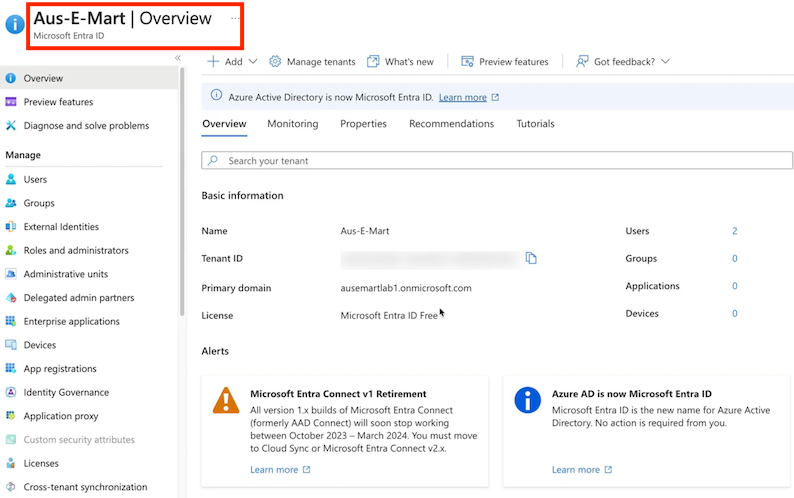

### About the Free Azure Subscription


Using a free Azure subscription offers **practical experience and cost savings**, but it comes with significant limitations that users must understand. **Upgrading to a paid subscription may be necessary for full access and functionality**.


- The free Azure subscription provides 30 days of free credits and 12 months of access to additional free services, but some features may be unavailable. Users need to be aware of these limitations.
- If users exhaust their free credits, **they can upgrade their subscription to continue using Azure services without losing their existing account settings**. This ensures a smoother transition.
 - Transitioning to on-demand paid subscriptions allows users to utilize resources effectively, but they must remember that costs will incur after free credits are depleted. This is a significant change in budgeting.
      
      
### 3 Create and Entra ID Tenants


**How to manage and switch between multiple tenants effectively.**
   
 - When setting up your ID tenant, **you can add additional domains but cannot delete the initial one**. This restriction underscores the importance of making the right choice initially.
- Data residency is a significant consideration for organizations like government or healthcare. **Ensuring data is stored in compliant locations, such as Australia, is critical for regulatory adherence.**

#### Switching between tenants

Switching between tenants in Azure or Microsoft 365 does not alter existing relationships or configurations. **You simply log into another tenant you have access to without making changes.**

- **Understanding that switching directories** allows access to different tenants without affecting the current setup is crucial for management.      
- Creating a new tenant involves adding your identity from previous tenants as a global administrator. **This process ensures you maintain administrative control in the new environment**.
- **It's possible to create new user accounts and assign roles within the new tenant**. 
 - **This includes adding yourself to the global administrator role to manage the new setup effectively**.


#### Switching directories

- **Switching directories** between tenants is straightforward, enabling quick access to each account. **This feature ensures users can seamlessly navigate between their different setups**.
- **It's important to note that one account can access multiple tenants, providing flexibility**. This functionality supports efficient management and reduces the need for multiple logins.

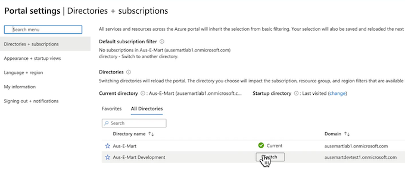


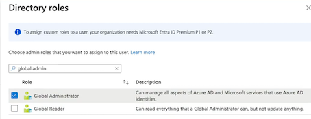


Azure订阅与入口id之间的关系。首先，展示了如何创建和管理Azure订阅，包括创建新的订阅和重命名订阅。

**Azure subscription Billing properties**

* Billing account ID
* Billing profile ID
* Invoice section ID
* Cost center

然后，解释了 Azure订阅和入口ID之间的关系，**指出一个订阅只与多个租户相关联，而一个租户可以与多个订阅相关联**。最
后，**强调了更改目录的严重性，因为这会打破访问控制，需要谨慎处理**

**了解Azure订阅与租户关系，创建订阅，管理多个订阅**

* 了解不同范围的访问控制，Azure政策的治理设置，无需立即创建订阅
* 创建订阅时，默认将当前登录账户设置为订阅所有者，讨论基于访问的控制
* 更改订阅与租户的关系需谨慎，使用“更改目录”选项，了解订阅与租户的关系

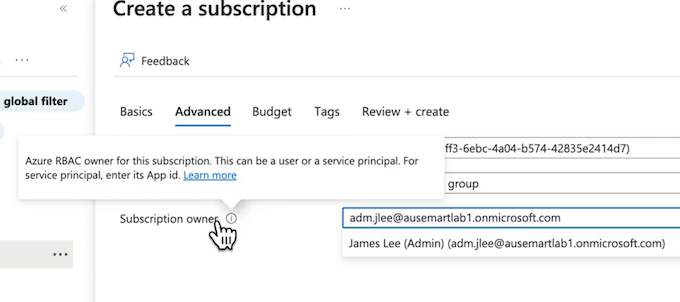

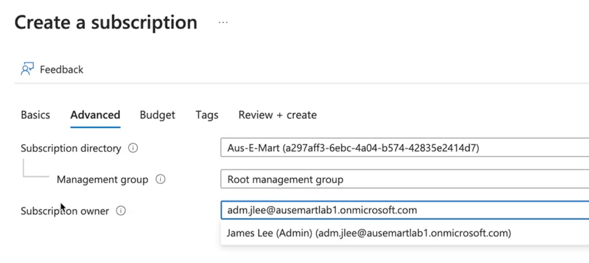

### Configure Domains for Entra ID 

首先，进入Microsoft1D租户，创建一个新用户并选择自定义域名。

然后，添加自定义域名，**并配置文本记录或MX记录以证明你拥有该域名**。最后，将自定义域名设置为主要记录，完成配置。

虽然配置自定义域名需要一定的费用和域名，但并非所有操作都需要自定义域名。


### **2 Entra ID User Identities**

> Entra ID Tenant

**Cloud Identity** / **Synchronized Identity** / **Guest Identity**

**Key Features**

* Enables people to access enterprise managed resources easily.
* Stores properties like:
	* `Name = Mike Smith, Office = Seattle`
* Can be created in the cloud with no on-premises infrastructure required.
* Can be **synchronised** from on-premises or **invited** (as a guest) from partner identities.
* Supports username/password and multi-factor authentication.

Azure AD中配置用户身份的过程，包括创建内部ID租户、添加用户身份、配置用户属性等。

不同的用户身份类型，如基于云的身份、同步自本地Active Directory的身份以及来自第三方提供商的身份。

* 用户身份的类型和厲性，包括用户名、密码、多因素身份验证等，
* 用户身份的配置和特性，如名称、办公室、城市、电子邮件地址等

混合组织或从本地到云迁移的组织，可使用Azure Active Directory管理用户身份，支持同步本地AD身份，第三方身份，实现多因素身份验证

* 混合组织或从本地到云迁移的组织，不想从头开始管理所有用户身，可以使用同步或本地Active Directory身份平台
* Azure资源或用户可以使用多种身份类型，包括在entry id中创建云身份，同步本地活动目录身份或第三方提供商身份。
* 对于这些身份类型，无论是用户身份还是应用身份，身份验证很重要，取决于具体需求

### Create and Manage User Identities

首先，需要设置自己的Azure Active Directory （AAD）租户，然后登录并创建新用户

如何重置密码，更改用户属性，以及如何在回收站中管理已删除的用户。

最后，展示了如何管理多种类型的身份，包括云身份和来自外部来源的身份。

### Bulk Create User Identities

批量操作的功能，包括批量创建、邀请和删除用户。

详细演示了如何通过CSV模板批量创建用户，包括下载模板、填写信息、上传文件等步骤。

**介绍批量管理工具及其在身份创建中的应用**


### **Authentication| Entra ID Application Identities**

**On-Prem**  => App Identity  （App (Client) ID => Secret + Cert）

* Helps control both access to an app, and the access an app has to other resources.
* **The app itself can reside anywhere; inside or outside of Azure.**
* Applications must registered within an Entra ID tenant (Application Registration).
* **Authentication relies on the use of a client secret or certificate (more secure).**

应用身份的两种验证方式：**秘密和证书，以及如何在Azure中注册应用程序身份**

应用程序身份验证与授权过程

* 在Azure中注册应用程序，可以在本地或AWS/GCP中运行，确保企业租户中的应用程序身份安全。
* 用户名和密码或多因素身份验证，确保应用程序可以验证并获取权限。
* 应用程序身份像标准用户身份，将被赋予对其他资源的权限，确保应用程序需要身份验证。

### Entra ID Application Identities

**Entra ID**

* App Identity
* Managed Identity
* **（Platform Managed）**

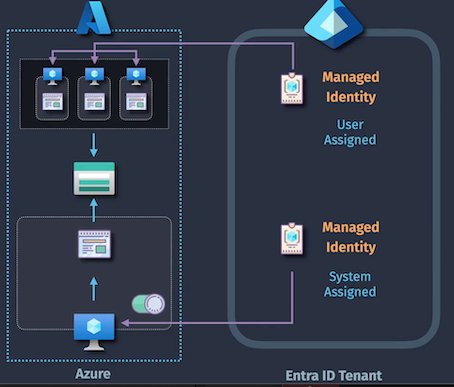

**Key Features**

* Provides an identity to a resource that exists within an Azure subscription.
* Authentication is managed by the Azure platform (no credentials need to be stored)
* **System-Assigned: **enabled for a single resource for as long as it exists.
* User-Assigned: you may create a managed identity to be used by one or more resources


身份管理的重要性，特别是在Azure解决方案中。**它区分了内部ID应用程序身份与Azure管理的身份**，井解释了 在Azure中托管的应用程序如何使用应用身份来访问资源。

两种不同类型的管理身份：**系统分配的管理身份和用户分配的管理身份**。


**系统分配的管理身份严格与单个资源相关联，而用户分配的管理身份则可以共享给多个资源。**

通过这些身份管理，用户无需管理底层凭据，微软将处理这些身份验证

身份管理：**系统分配与用户分配的区别**。

* 单一Azure资源的身份，如虚拟机或web应用程序
* 系统分配的管理身份与单一资源相关联，**删除资源后身份消失**
* 用户分配的管理身份适合多个资源共享，便于管


### Entra ID Groups

**Reduced Administration**: Simplified access to permissions, apps, and licensing.

**Improved Security**: Reduce the incorrect assignment of permissions.

**Automation & Self-Service** Leverage automation and provide users with self-service.

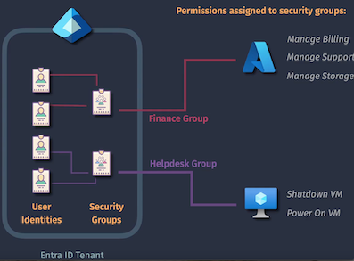

#### Entra ID Tenant - (**User Identities - Security Groups**）

Key Features

* Simplifies assignment of **Entra ID Roles, Azure RBAC Roles, and Entra ID Licensing**.
* Allows an **Owner** to be specified, providing some self-service capabilities.
* Members can be assigned manually (**assigned user group**).
* Members can be managed by the platform (**dynamic user group)**.

#### Microsoft 365 Groups Entra ID Groups

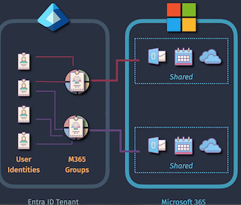
`
**Key Features**

* Simplifies administration of collaborative spaces for users/projects/teams
* Allows an **Owner** to be specified, providing some self-service capabilities.
* Provides additional advanced features such as expiry, sensitivity labels, etc.
* Members can be assigned manually (assigned M365 group).
* Members can be managed by the platform (dynamic M365 group).

**安全组简化权限管理，提高安全性**。

* 使用组可以大大减少T管理负担，提供用户对不同应用的访问权限，
提高安全性。

* 安全组可以解决決手动分配权限的问题，避免安全问题，简化权限分

* 通过将用户分配到适当的组，可以简化权限管理，提高安全性，便
千管理闭队，

**安全组简化权限管理，提供自服务能力**

* 通过安全组管理权限，减少错误，提高安全性。
* 安全组简化管理，提供自服务能力，适合帮助台团队。
* 微软365组与安全组相似，简化资源共享访问权限管理。

### Entra ID Dynamic Groups

* Dynamic User Groups
* Dynamic Device Groups
* Dynamic M365 Groups

**Automatically Manage Group Membership**

> Configure rules to have group membership managed by the platform.

**User Properties**

* Name: Mike Smith
* City: Seattle
* Department: Marketing
* Role: Creative Director

**Entra ID Dynamic Groups**

```
(user.department -eq "Medicine")
(user.department -eq "Marketing")
```

```
(user.jobTitle -contains "director")
```

```
(device.deviceOSTvoe -eq "ipad")   -or  (device.deviceOSType  -eq "iphone")
```

* Dynamic User and M365 Groups require **at least Entra ID Premium P1 licensing.**
* You cannot **manually change the membership of dynamic groups.**
* Dynamic groups can be for **devices or users (but not both at the same time).**

通过创建不同类型的动态组，**如用户组、设备组和微软365组**，可以配置成员规则，让平台根据预设条件自动管理会员资格。

**动态组自动管理成员资格，基于用户属性配置规则。**

* 动态用户组的示例：根据身份属性自动分配成员。
* 动态组实际应用：根据用户属性自动管理成员资格。

**动杰会员规则控制用户对安全组和微软365组的访问。**

* 动态会员规则可以控制用户对安全组的会员资格，也能控制对微软365组的访问。
* 动态设备组可以自动管理设备，例如，所有iOS设备的安全组。
* 配置动态组时，不能手动为这些组分配成员，必须由平台配置

### Entra ID Administrative Units

**Administrative Units**

IT Administrators  （Manage obiects inside of EntraID）

* Groups assigned permissions
* Access resources outside of Entra ID

**Key Features**

* Simplifies the assignment of **EntraID permissions** to Entra ID objects.
* Can include a mix of **Entra ID Users. Devices, and Security Groups**
* Membership can be **assigned, or dynamic**(controlled using membership rules).
* Allows objects to exist in multiple Administrative Units at the same time.

**Administrative Units require at least Entra ID Premium P1 licensing.**

**Permissions do not apply to the members of security groups.**

**You cannot nest an Administrative Unit within another Administrative Unit.**


Administrative Units 帮助管理内部D租户的权限，提供更细粒度的访问控制

* 管理对不同资源的访问权限。
* 详细解释内部ID租户中的管理问题，强调需要更好的权限管理。
* 全球管理员角色可能导致权限过度分配，需要更细粒度的权管理

Administrative Units  提供细粒度权限管理，支持对象多重归属，但不支持层级嵌套。

* 地理区域特定行政单位，允许更精细的安全管理
* 管理单位可以组合，对象可存在于多个单位中
* 受限管理行政单位限制全球管理员权限，保护VIP用户、

### Case Studay - Design Identity Management

#### **Current State - Identity**

* Active Directory is already synchronized with EntraID
* Identity is managed on-premises with a single Active Directory forest
* All staff attributes have been configured, including department name, phone, title, office, and other details
* **All applications use Active Directory identities for authentication**

####  **Requirements**

How would you design the solution to:

* Minimize costs associated with licensing
* Provide secure authentication for the web server to the Azure SQL database
* Minimize the administrative effort required for assigning developers in the  'development' department with permissions to Azure resources

#### **SOLUTION**

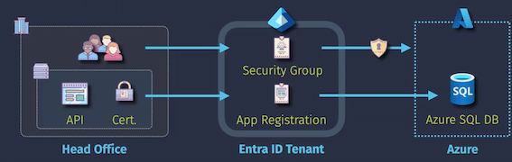

* Security group (with dynamic membership)
* Application registration (with certificate for auth.)
* Entra ID P1 licensing

### Azure Role-Based Access Control (RBAC)

**Implementation**

**USAGE OVERVIEW**

* **Security Principal** Who/what is being assigned access?
* **Role Definition**  What are the permissions？
* **Scope** Where will the permissions apply?

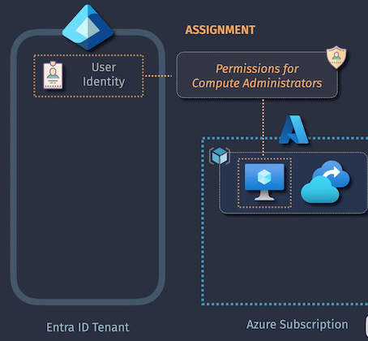

**Security Principal** Supports the following: user, security group, app, managed.

**Role Definition** The permissions being granted, as defined by **built-in** or **custom** roles.

* OWNER
* CONTRIBUTOR
* READER
* DATA

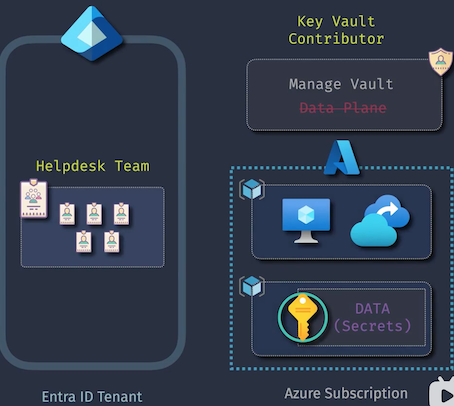

**Scope**

* Management Group, 
* Subscription,
* Resource Group, 
* Resource.

Azure基于角色的访问控制 (Azure RBAC)的概念和实施过程。

首先，介绍了RBAC的目的，即通过将权限分配给特定角色来管理用户对资源的访问。

然后，讲解了RBAC的三个关键组件：**身份、资源和角色定义**。

接着，详细解释了内置角色和自定义角色的区别，强调了在分配权限时应注意权限的范国。最后，通过一个场景展示了如何将所有这些组件结合起来，创建一个完整的RBAC分配。

**Azure基于角色的访问控制，通过角色定义权限，管理用户对资源的访问。**

* 基于角色的访问控制理念，适用于多个安全产品
* **内置角色定义与自定义角色**，避免使用全权访问角

**Azure内置角色与自定义角色，管理权限**。

* 所有者、贡献者和读者角色适用于不同的服务，需谨慎使用
* 贡献者角色可以管理资源，但无法更改权限或访问数据平面。

