# 3 Networking Strateg / Connectivity & Security
 
## 1 Design a Networking Strategy

**Isolated Networks**

Secure, private, and isolated from other virtual networks.

**Default Routing**

Intra-VNet traffic, and outbound Internet is routed.

**Multi-Zone Deployments**

Supports zone-based resources within a region.

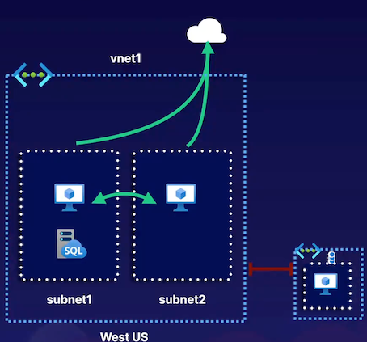

#### Hub-and-Spoke Network Architecture

> Common network design for sharing centralized network resources and access.

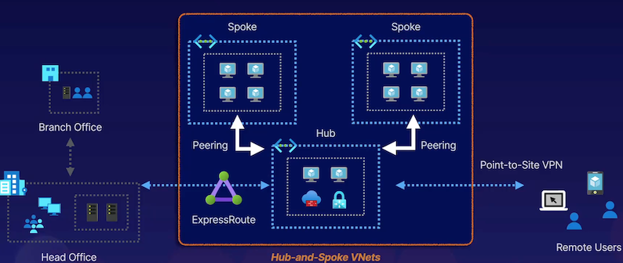

#### Public Accessibility for Azure Services

Many Azure services are built for public accessibility.

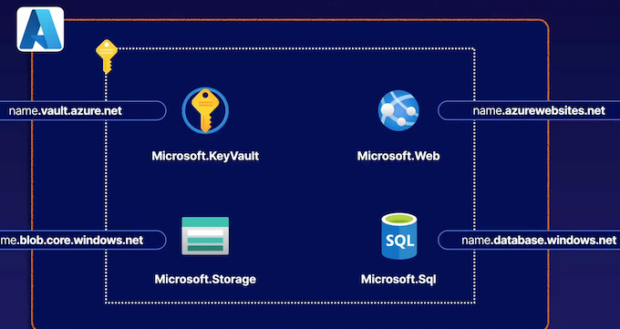

1. **Virtual Networking**: 

   - Virtual networks in Azure are fully isolated and secure by default.
   - **Default routing is configured when creating a virtual network, providing connectivity to the public internet and between subnets within the virtual network**.
   - **Virtual networks deployed in a multi-zone deployment can be accessed by resources pinned to availability zones within the same region**.
   
2. **Hub-and-Spoke Network Architecture**:

   - Common network architecture for connecting and sharing centralized resources within a virtual network.
   - **Hub VNet contains shared resources like firewalls, ExpressRoute connectivity, VPN connections, etc**.
   - **Spoke VNets can connect to the hub VNet to access shared resources without the need to configure connectivity individually for each VNet**.
   
3. **Azure Services Accessibility**:

   - Many Azure services are built for public accessibility by default, with public endpoints.
   - Technologies exist to restrict and control access to public endpoints and provide more private connectivity for Azure services.

Additional Exam Key Points:

- Integrated networking services like service endpoints and private link.
- **Hybrid networks including Azure Virtual WAN and ExpressRoute.**
- Service networking considerations for deploying different services and providing them with connectivity to virtual networks.
- **Securing services with resource firewalls**.
- Various technologies for securely connecting to, integrating, **and establishing hybrid connectivity for different types of services and networks**.

### 1-2 Recapping Virtual Networks

Custom Routes

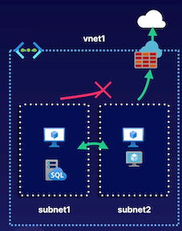

Examples of Custom Routes:

**Blocking Internet Access**

Using the **None next hop type**, we can block internet access.

**Forcing Traffic via Another Address**

Using various next hop types, we can force traffic elsewhere.

**Configuration**

Routes within a route table apply to associated subnets.

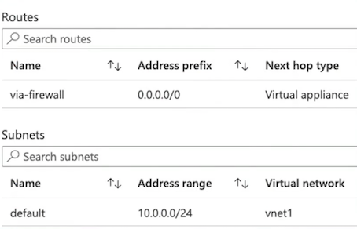

#### Routing Considerations

Special Scenarios and Configuration:

**Automatic System Routes**

System routes can be automatically generated (e.g., VNet peering).

**Border Gateway Protocol (BGP)**

BGP can help manage dynamic routing (e.g., ExpressRoute or VPN).

**Matching Address Prefix Routes**

The below precedence is used:

**Custom > BGP > System**

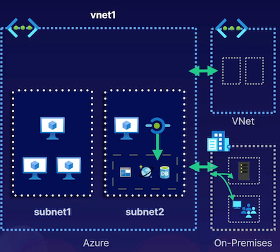

#### Network Security Groups (NSGs)

**Traffic Filtering**

**Priority-based allow or deny rules** are processed only until a single match is found.

**Default Rules**

**All NSGs include a default DENY rule**. There is one rule each for **inbound and outbound traffic.**

**Assignment**

Assigned to a subnet or NIC. Subnet assignments are similar to all NICs.

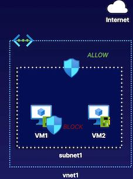

**Shared Outbound Internet**

Replaces the need for individual public IP addressing for outbound connectivity.

**Public IP Addressing**

Can address like a standard public IP. Also supports public IP prefixes.

**Configuration**

One NAT can be associated with one or more subnets within a VNet.

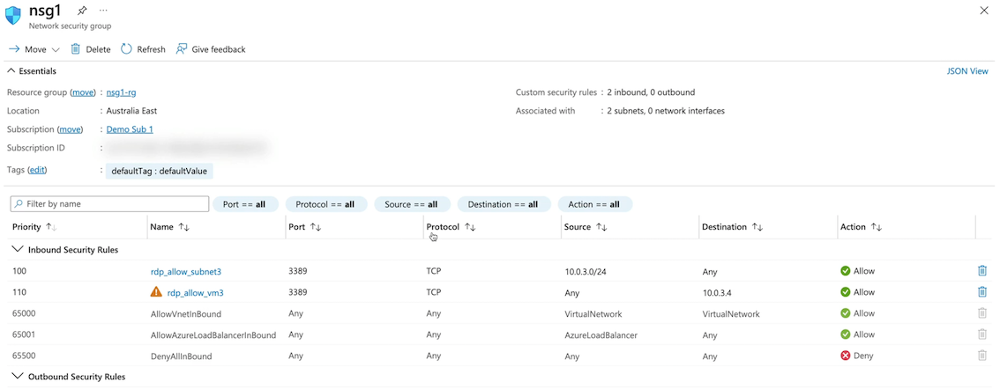

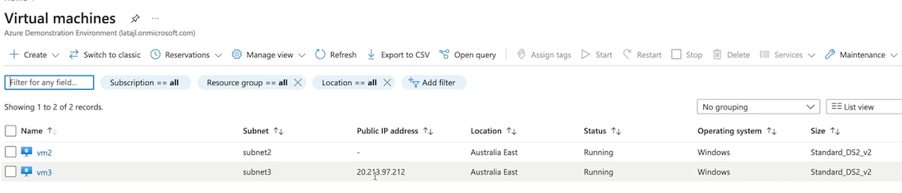

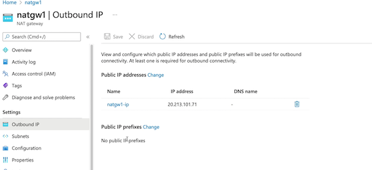

1. **Routing**:

   - **Virtual networks have built-in connectivity between subnets and the internet, but custom routing can be used to change these pathways**.
   - **Route tables can be created to alter pathways**, such as blocking access to the internet or forcing traffic through a specific IP address.
   - Network security groups and routing serve different purposes: **routing controls pathways while network security groups filter traffic**.
   - Routes can be configured for various purposes like **sending traffic via a virtual appliance, the internet, virtual network, or virtual network gateway.**
   - **Custom routes take precedence over BGP routes**, which take precedence over system routes when conflicts arise.

2. **Network Security Groups**:

   - Network security groups **filter traffic with priority-based rules, where lower number rules are processed first**.
   - **Default deny rules exist** on both inbound and outbound sides of network security groups.
   - **Rules need to be assigned to network security groups to take effect**.
   - **Network security groups** at the **subnet level** apply to all network devices within that subnet.

3. **Public IP Addresses and Network Security**:

   - With standard public IP addresses, all traffic is blocked by default **unless allowed through network security groups**.
   - Network security group rules are stateful, allowing outbound traffic and its corresponding inbound replies.
   - Even without a public IP address assigned, **a virtual machine can still have internet access through other means like VPN or ExpressRoute.**

4. **Virtual Network NAT**:
   - **Virtual Network NAT controls outbound connectivity for multiple devices within a subnet**.
   - **It eliminates the need to configure outbound connectivity on a per-VM basis.**
   - Public IP addressing for outbound connectivity can be controlled **using virtual network NAT, providing shared outbound internet control**.
   - **Virtual network NAT can use single IP addresses or public IP prefixes to manage outbound IP addressing for resources.**

### 1-3 	Recapping Integrated Networks

1. **VNet Peering:**

   - Allows connecting multiple VNets securely.
   - Provides low-latency, private IP address connectivity between **virtual machines in different VNets**.
   - **Supports peering across different subscriptions and regions**.
   - **Limitations include non-overlapping address spaces and lack of transitive routing by default.**

**VNet Peering**

Virtual networks have default connectivity, but are otherwise totally isolated.

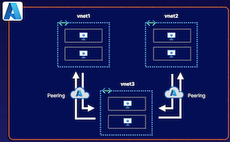

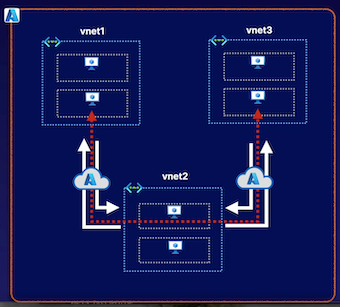

* [V] Fast, low-latency private IP connectivity.
* [V] Supports cross-subscription connectivity.
* [V] Supports cross-region connectivity.

* [X] Address spaces cannot overlap.
* [X] Does not support transitive routing.

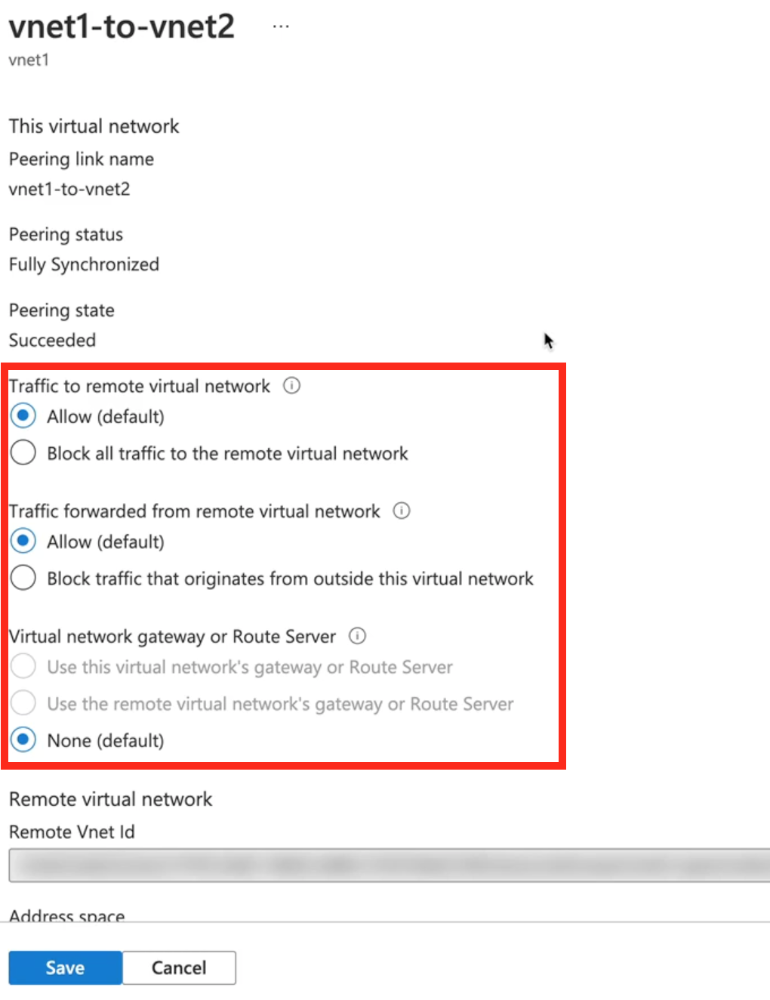

#### Service Endpoints

**Service Endpoints:**

- Provides secure connectivity to Azure resources.
- **Configured at the subnet level for specific resource providers**.
- Utilizes the **Microsoft backbone for private connectivity**.
- **Does not offer private IP addressing but ensures secure pathway**.

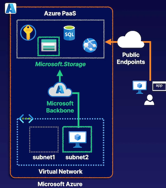

**Configuring Service Endpoints**

Configured per resource provider, per subnet, to provide secure connectivity,

**System Routes**

Optimal routes are added so that **all resources within a subnet use the backbone**.

**Network Security**

Resource firewall rules can be **configured to allow/deny traffic**.

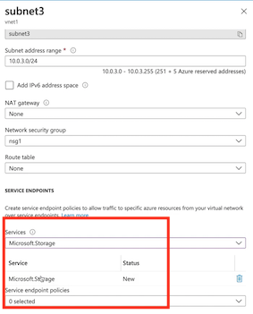

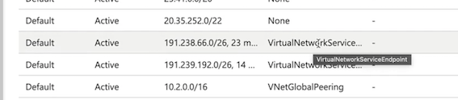

#### Private Link

**Private Link:**

- **Offers secure connectivity to supported Azure services**.
- **Enables creation of private endpoints with private IP addresses within a subnet.**
- Allows for granular security by providing connectivity to specific resources.
- **Supports connectivity to Azure services and custom solutions in different subscriptions.**
- Provides enhanced security features compared to service endpoints, including DNS integration and private IP addressing.

**Secure Network Connectivity:**

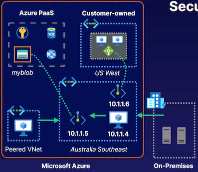

**Private Link Support**

* Supported Azure services
* Customer/partner-managed services

**Granular Security**

Configure connectivity to specific resources (not a whole resource type)

**Broad Accessibility**

* Accessibility from on premises
* Access from peered virtual networks
* Accessing services in other region

**Implementation in Azure Portal:**

- Demonstrated VNet peering, service endpoints, and Private Link configurations in the Azure portal.
- Showed how to set up VNet peering for secure connectivity between virtual machines in different VNets.
- Illustrated the configuration of service endpoints to establish private backbone connectivity.
- Walked through the process of creating private endpoints using Private Link for secure connectivity to Azure services like storage accounts.

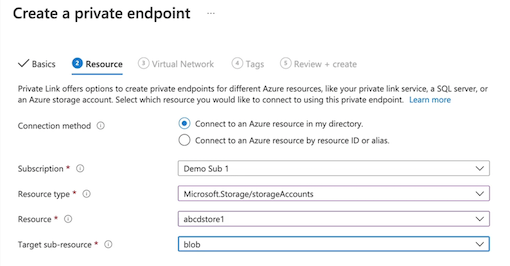

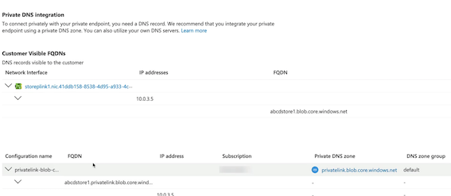

### 1-4 Recapping Hybrid Networks

#### Virtual Private Networking

Providing private, encrypted connectivity to Azure virtual networks.

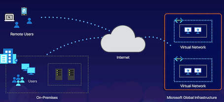

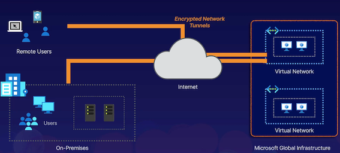

1. **Virtual Private Networking (VPN)**:

   - **VPNs provide private connectivity across the internet to resources in a virtual network**.
   - **Site-to-site VPN connects entire networks to an Azure Virtual Network, while point-to-site VPN allows users to connect to an Azure Virtual Network**.
   - VPN encryption ensures secure and isolated connections over the public internet.
   - **VPNs support hybrid connectivity, site-to-site, point-to-site, and VNet-to-VNet connections**.

#### Virtual Private Networking

**VNet Peering**

* Designed for VNet-to-VNet connectivity.
* **Supports cross-subscription, cross-region, cross-Azure AD tenant.**
* Leverages Microsoft backbone for private IP address connectivity.
* Used for private, low-latency, limitless bandwidth connectivity.

**VPN**

* Designed for hybrid connectivity (site-to-site, point-to-site).
* **Supports similar Vet connectivity (cross-subscription, cross-region)**
* **Requires a public IP address for the VPN termination point**.
* **Used where encryption and/or transitive routing is needed.**

**VNet Peering vs. VPN**:

- VNet peering is designed for **VNet-to-VNet interconnectivity**, **leveraging the Microsoft backbone for private IP address connectivity**.
- VPN connections go over the public internet, **requiring public IP addresses for termination points.**
- VNet peering offers low latency and limitless bandwidth, while VPNs provide encryption and support transitive routing.

#### ExpressRoute

ExpressRoute can provide a more direct and secure connection to Microsoft cloud services.

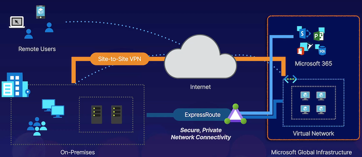

**ExpressRoute**

* **Provides secure connectivity to virtual networks and Microsoft 365**.
* Does not traverse the public internet.
* **Does not leverage encryption by default (IPsec and MACsec)**.
* Supports up to 10 Gbps (100Gbps with ExpressRoute Direct).

**VPN**

* **Provides secure connectivity to virtual networks only**.
* Traverses the public internet (between the point/site and Azure).
* **Traffic is encrypted by default as part of an end-to-end tunnel (IPsec)**.
* Supports up to 10 Gbps.

**ExpressRoute**:

- ExpressRoute provides secure connectivity **between on-premises networks and Azure Virtual Networks without using the public internet**.
- It can also be used to connect to Microsoft 365 services securely.
- ExpressRoute does not require encryption by default, **supports up to 100 gigabits per second connectivity, and offers direct network connections with ExpressRoute Direct**.

#### Virtual WAN

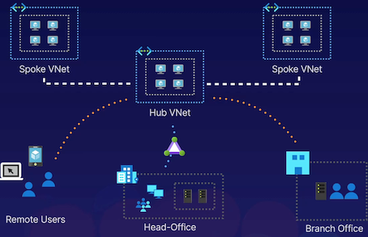

Azure Virtual WAN helps to automate and optimize connectivity using the hub-and-spoke network architecture.

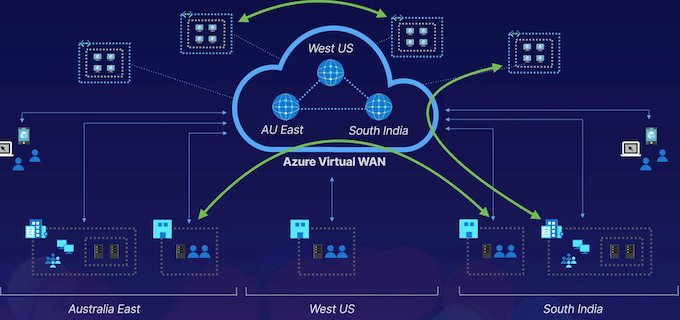

**Azure Virtual WAN**:

- **Azure Virtual WAN automates and optimizes hub-and-spoke network topology, simplifying network management through software-defined networking**.
- It streamlines connectivity between spoke virtual networks, remote users, branch offices, and head offices.
- Microsoft manages the Hub virtual network in Azure Virtual WAN on a per-region basis, simplifying global interconnectivity.
- Azure Virtual WAN allows for a simplified deployment and management experience for various types of connectivity scenarios, including branch-to-branch, branch-to-Azure, and VNet-to-VNet connections.

### 1-5 Designing Networks for Azure Services

#### VNet-Native Services

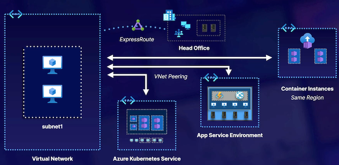

**VNet-Native Services:**

- Some services are ready to go and work with virtual networks by default.
- Examples include virtual machines, Azure Kubernetes service, and Azure App Service environments.
- Services like container instances can be deployed to a virtual network for private connectivity.
- VNet Peering can be used for access across virtual networks.

#### Net Integration

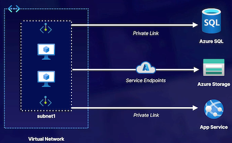

**VNet Integration for Outbound Access:**
  
- **For services like Azure App Service that require outbound access to a virtual network, VNet integration is needed.**
- VNet integration provides access from the app to the virtual network.
- **Supported by standard and premium tiers, not free or basic tiers**.

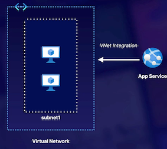

* Provides outbound access to a VNet.
* Supported by Standard or Premium tiers.
* Supports function apps.

* **Doesn't support NetBIOS or SMB.**
* **Does not provide inbound app access.**

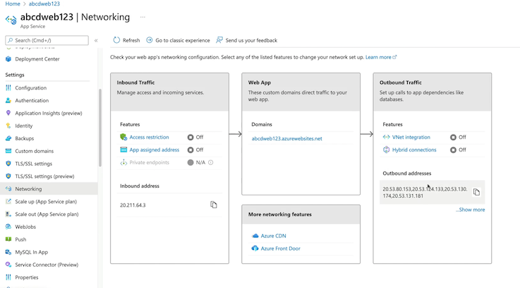

**Hybrid Connections for On-Premises Connectivity:**

- For connectivity to on-premises resources, hybrid connections using Azure Relay service are utilized.

#### Resource Firewalls

Many networked Azure services provide access control through a resource firewall.

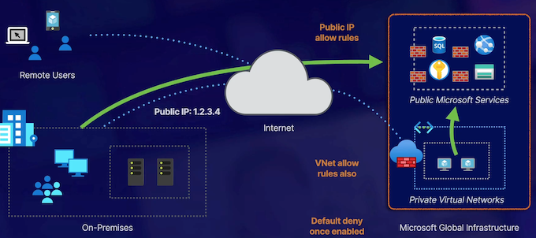

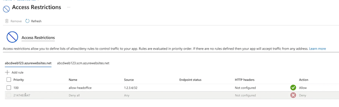

**Resource Firewalls:**
 
 - **Services like Azure SQL, storage accounts, Azure App Service, and key vaults have resource firewalls to control inbound access.**
- **Enabling a resource firewall creates a default deny rule, allowing only specified access**.
- Options include allowing access from public IP addresses and setting up virtual network rules.
- **Resource firewalls can be configured in the Azure portal for services like Azure App Service and storage accounts**.

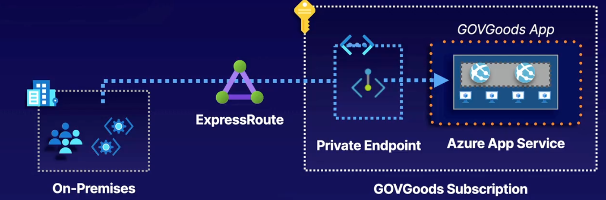

### Design a Networking Strategy

**Client Requirements**:

- GOVGoods wants the solution migrated to a cloud-based scalable service, preferably platform as a service.
- They require staging functionality to test updates before production deployment.
- Connectivity must be maintained for on-premises manufacturing hardware without using the public internet.

**Proposed Solution**:
  
- Host the application on Azure App Service to minimize administrative overhead and utilize deployment slots for staging.
- Use ExpressRoute with private peering to connect on-premises environment to Azure.
- Implement PrivateLink to provide secure connectivity for on-premises manufacturing devices to the Azure App Service.

**Azure App Service for Hosting**

Leverage staging slots for C/CD requirements.

**ExpressRoute for Private Connectivity**

Leverage private peering to a Vet within the GOVGoods subscription.

**Azure Private Link for Inbound Access to the App**

Associate the private endpoint with the GOVGoods VNet.

**Technologies Used**:

- Azure App Service for hosting the application.
- ExpressRoute with private peering for secure connectivity.
- PrivateLink for connecting on-premises manufacturing hardware to the Azure App Service.

## 2 Design Connectivity and Security

#### Modern scaling Solutions

A more modern approach is to scale in and out based on demand.

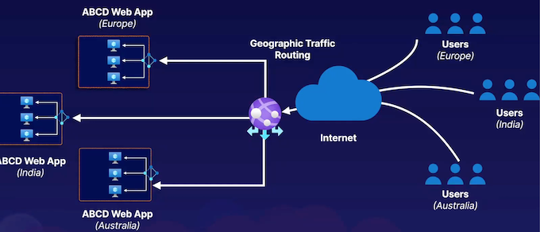

1. **Traditional vs. Cloud Model**:
  
  - Traditional solutions involved hosting everything on a single server, with the risk of the entire solution going offline if the server fails.
  - Cloud solutions involve scaling out by adding duplicate copies of servers or services for high availability.

2. **Scaling In and Scaling Out**:
  
 - Scaling in involves adding more resources to a single server.
 - Scaling out involves adding duplicate copies of servers or services to distribute traffic and ensure high availability.

3. **Load Balancers**:
   
- **Load balancers provide a single entry point for applications and distribute traffic among healthy instances of servers**.
- They help in maintaining high availability and managing connectivity to multiple server instances.

4. **Splitting Solutions into Tiers**:
  
- Cloud solutions allow splitting the solution into different tiers, such as web frontend and data backend, and scaling them independently based on demand.

5. **Global Scalability**:
 
- To achieve global scalability, multiple copies of the solution are deployed across different regions.
- **Global traffic routing and load balancing are essential to manage connectivity and distribute traffic effectively**.

6. **Microsoft Products for Connectivity and Security**:
 
- Microsoft offers products to help with load balancing, controlling connectivity to regional and global services, and enhancing security for cloud solutions.

### 2-1 Recapping Azure Global Infrastructure

#### Azure regions

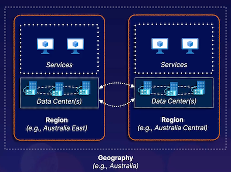

**Region**

* Low-latency connected data
* centers hosting services

**Cross-Region Replication**

Region pairs with replication

**Geography**

Geographic, data, and compliance boundary

#### Availability Zones

**Availability Zone**

Physically separate location within a region.

**Zonal Services**

Some services can be pinned to a specific availability zone.

**Zone-Redundant Services**

Some services are replicated across availability zones.

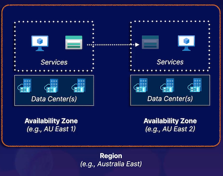

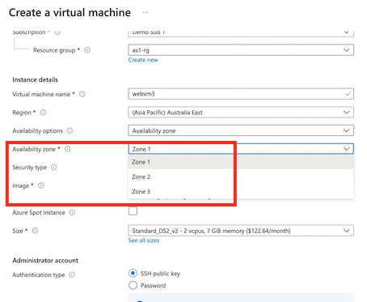

### Availability Sets

**Availability Set**

Group duplicate VMs together to avoid common outages.

**Fault Domain**
Hardware that shares common sources of failure.

**Update Domain**

Platform services updated/restarted by Microsoft.

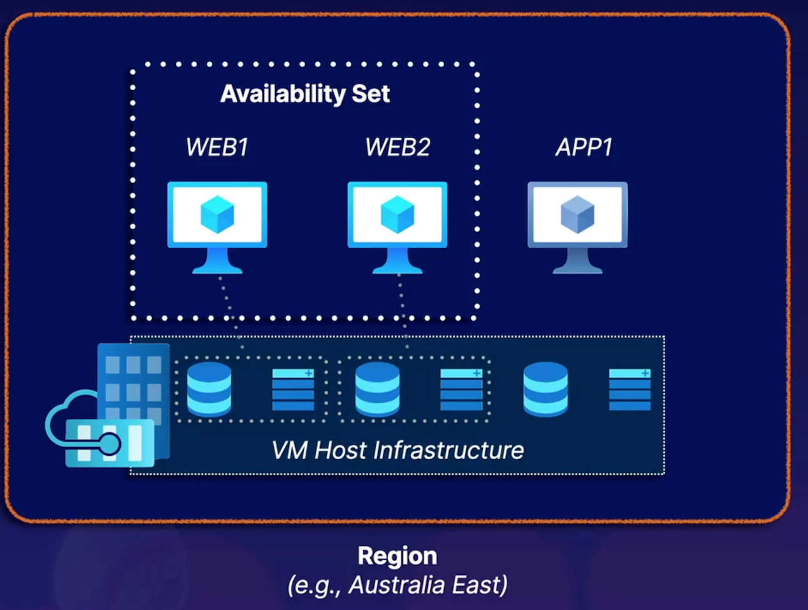

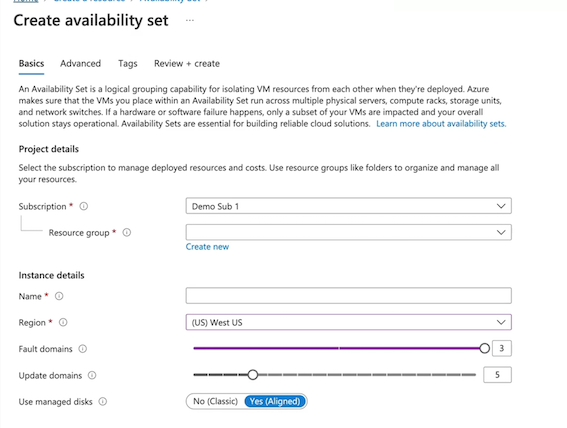

Here is a summary of the key points for the AZ-305 exam based on the provided article:

1. **Azure Load Balancer:**
    - Used for providing public connectivity to web applications deployed to backend resources.
    - Distributes traffic to healthy backend resources based on configured health probes.
    - Enables outbound public internet connectivity using public IP or IP prefix.
  
2. **Azure Application Gateway:**
    - Similar to Azure Load Balancer but specifically designed for web application solutions.
    - Layer 7 aware, can route based on host name and path-based routing.
    - Can load balance across multiple components in different backend pools.

3. **Traffic Manager:**
    - Designed for globally distributed solutions.
    - Ensures users are routed to the closest backend resources based on routing methods.
    - Uses DNS for routing, confirms resource health, and responds with a DNS response to guide users directly to backend resources.

4. **General Load Balancing Concepts:**
    - Load balancers like Azure Load Balancer and Application Gateway are region-specific.
    - Load balancers distribute traffic to backend resources based on health and routing rules.
  
5. **Exam Topics:**
    - Understand the differences between Azure Load Balancer, Application Gateway, and Traffic Manager.
    - Know how each service functions and their use cases in load balancing applications.
    - Be familiar with configuring and managing these load balancing services in Azure Portal.

These key points should help you prepare for the AZ-305 exam focusing on load balancing technologies in Azure.

### Designing Highly Available Connectivity 

> Azure Load Balancer

Distributing Layer 4 connectivity to resources within a region.

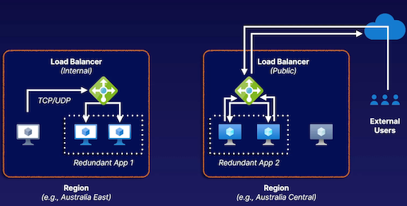

> Layer 7 application-aware load balancing

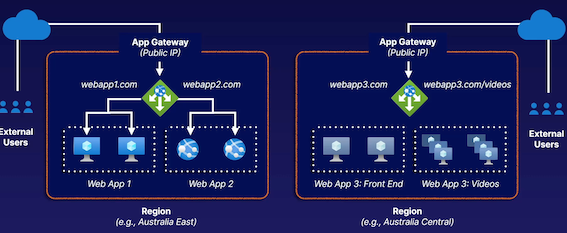

1.**Azure Load Balancer:**

- Distributes Layer 4 connectivity to resources within a single region.
- Uses TCP and UDP protocols.
- Can be internal (private within a virtual network) or public for outbound internet connectivity.
- Balances connectivity across redundant backend resources within a region.

2.**Azure Application Gateway (App Gateway):**

- Layer 7 aware load balancer for web application solutions.
- Capable of routing based on hostnames and paths.
- Can load balance across multiple backend pools for different components of a solution.
- Used for distributing load across web applications hosted in different regions.

3.**Traffic Manager:**

- For globally distributed solutions, unlike region-specific load balancing.
- Requires backend resources to be publicly accessible.
- Routes users based on routing methods such as proximity, priority, or network location.
- Uses DNS for routing and responds with a DNS response to guide users to backend resources directly.

#### **Traffic Manager**

**Azure Front Door Service Overview:**

- **Azure Front Door is a global load balancer designed specifically for web applications**, 
  - offering web functionality, caching, and acceleration capabilities.
- It leverages Microsoft's global network to provide faster access to web applications across the globe.
- Functions as a **global application gateway, enabling web application acceleration and delivery worldwide**.

#### Key Features and Configuration:

- **Uses origin groups similar to backend pools in Application Gateway for defining backend endpoints.**
- Supports various backend endpoints, built-in health probes, and load balancing.
- **Allows path-based routing for directing traffic to specific backend endpoints based on URL paths**.
- **Offers Layer 7 functionality for advanced routing capabilities**.
- Provides options for configuring caching, security features like web application firewall, and custom routing rules.
- **Supports load balancing and Layer 7 capabilities for routing traffic efficiently.**

#### Azure Front Door vs. Azure Traffic Manager:

- Azure Traffic Manager is more similar to a global load balancer supporting various protocols, **while Azure Front Door is tailored for web applications, HTTP, and HTTPS**.
- Traffic Manager uses DNS for routing user requests directly to endpoints, **while Front Door accelerates web traffic through Microsoft's endpoint network**.
- Traffic Manager routes traffic directly to endpoints, whereas Front Door proxies traffic at the Microsoft edge, enhancing performance and load balancing.
- Both services offer routing methodologies based on proximity, priority, or weighted lists, but Front Door additionally supports session affinity routing.
- **Front Door provides advanced Layer 7 features like rate-limiting, IP-based ACLs, and integration with web application firewall for enhanced security and performance**.
- Front Door can be more expensive due to its additional Layer 7 capabilities compared to Traffic Manager.

> Distributing traffic to resources across Azure regions using DNS.

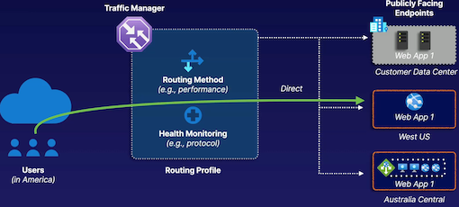

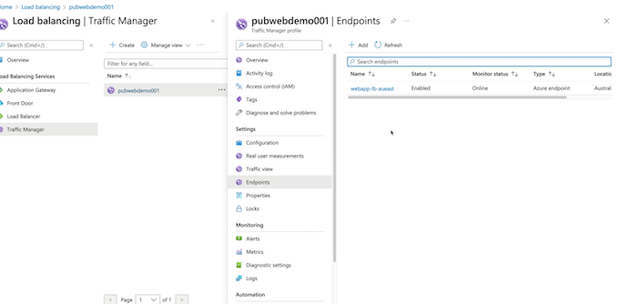

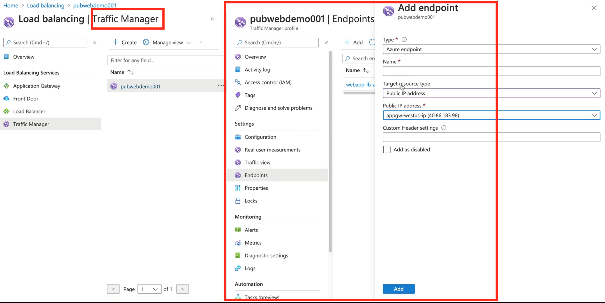

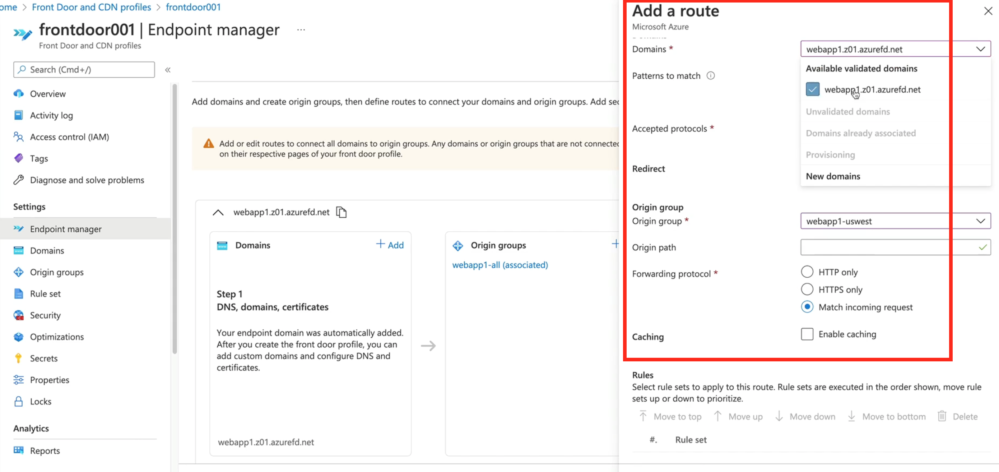

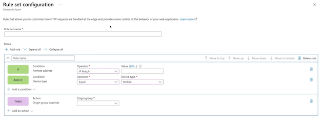

### Traffic Manager vs. Front Door

**Traffic Manager**

* **Supports several protocols.**
* Routes traffic by responding to DNS queries based on routing method.
* **Traffic is routed directly**.
* Routing: **performance, priority, weighted, geo, and multi-value**
* Simply routes to healthy endpoints (pricing is accordingly simple).

**Front Door**

* **Supports HTTP/S.**
* Accelerates web traffic through Microsoft's edge network.
* **Traffic is proxied at the edge.**
* Routing: **latency, priority, weighted, and session affinity**
* Adds Layer 7 features, rate-limiting, and IP-based ACLs.