# AZ305 Summary - 1


* 25-30% Design identity, governance, and monitoring solutions
* 20-25% Design data storage solutions
* 15-20% Design business continuity solutions
* 30-35% Design infrastructure solutions

There are 40-60 Questions

**You can afford to get 12-18 questions wrong**

**Format of Questions**

* Multiple Choice / Multiple Answer / Drag and Drop / Build List Reorder
* Active Screen /  Hot Area Case Study / Exhibits (tabs on a question)


## Microsoft Entra ID Name Change

### Azure Active Directory (AD)

cloud-based **identity and access management** service 

**Manage users, Sign-Ins and access to AD-related resources**

### Introduction to Azure AD

**Azure Active Directory (Azure AD)** is Microsoft's cloud-based **<mark>identity and access management service</mark>**, which helps your employees sign in and access resources

**External Resources**

* Microsoft Office 365
* Azure Portal
* SaaS applications

**Internal Resources**

* Applications within your internal networking
* Access to workstations on-premise

Use Azure AD to implement **<mark>iSingle-Sign On (SSO)</mark>**

Azure Active Directory comes in four editions

1. **Free MFA**, SSO, Basic Security and Usage Reports, User Management
2. **Office 365 Apps** Company Branding, SLA, Two-Sync between On-Premise and Cloud
3. **Premium 1** Hybrid Architecture, Advanced Group Access, Conditional Access
4. **Premium 2** Identity Protection, Identity Governance

### Azure AD - Use Case

**Azure AD** can **authorize** and **authenticate** to multiple sources.

* To your on-premise AD
* To your web-application
* Allow users to login with their IpD eg. Facebook or Google
* To Office 365 or **Azure Microsoft**


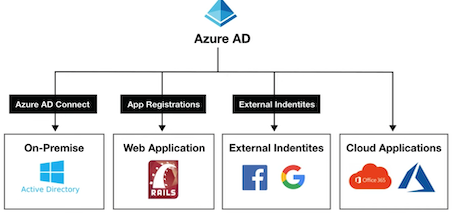

### Active Directory vs Azure Active Directory


Microsoft introduced **Active Directory **Domain Services in Windows 2000 to give organizations the ability to manage multiple on-premises infrastructure components and systems using a single identity per user.

Azure AD takes this approach to the next level by providing organizations with an **Identity as a Service (IDaaS)** solution for all their apps **across cloud and on-premises**.

**Both versions are still used today**

* **Active Directory** The on-premise version
* **Azure AD** The cloud version

### **Azure Active Directory Domain Services (AD DS)**

In some cases you'll need to setup your own domain controller(s).

When doing a **lift-and-shift from on-premise** to Microsoft Azure and migrating Active Directory, Azure AD does not support some **domain services**.


**Azure Active Directory Domain Services (AD DS)** provides managed domain service such as:

* Domain joins
* Group policies
* Lightweight directory access protocol (LDAP)
* and Kerberos / NTLM authentication.

You use can these domain services **without the need to**:

deploy, manage, and patch domain controllers (DCs) in the cloud

### Azure AD - Tenant

**<mark>A tenant represents an organization</mark>** in Azure Active Directory.

A tenant is a dedicated Azure AD Service instance.

**A tenant is automatically created when you sign up for either**

* Microsoft Azure
* Microsoft Intune
* Microsoft 365

Each Azure AD tenant is distinct and separate from other Azure
AD tenants.

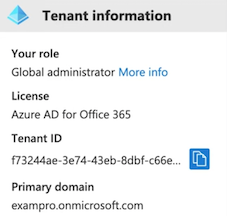

### Active Directory - Users

**Users** represent an i**dentity for an person or employee** in your domain.

A user has login credentials and can use them to log into the Azure Portal

* You can assign roles and **administrative roles** to users
* You can add users to groups
* You can enforce authentication methods such as (MFA) Multi-Factor Authentication
* You can track users sign ins
* Track devices user's login from and allow or deny devices.
* Assign Microsoft licenses

Azure AD has two kinds of users:

* **Users** - A user belongs to your organization
* **Guest Users** - A guest user belongs to another organization

### Azure AD - Groups

**Groups** lets the resource owner (or Azure AD directory owner), assign a set of access permissions to all the members of the group, instead of having to provide the rights one-by-one.

Groups contain:

* Owners - Has permissions to add an remove members
* Members - Have permissions to do things


**Assignment**

* You can assign roles directly to a group
* You can assign applications directly to a group

**Request to Join Groups**

The group owner can let users find their own groups to join, instead of assigning them. 

The owner can also set up the group to automatically accept all users that join or to require approval.

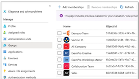

### Azure AD - Assign Access Rights

There are **four ways to assign resource access rights** to your users:

**Direct assignment.** The resource owner directly assigns the user to the resource.

**Group assignment**. The resource owner assigns an Azure AD group to the resource, which automatically gives all of the group members access to the resource

**Rule-based assignment.** The resource owner creates a group and uses a rule to define which users are assigned to a specific resource.

**External authority assignment.** Access comes from an external source, such as an on-premises directory or a SaaS app.

### Managed Identities

**Managed Identities** is a concept in **Microsoft Entra ID (Azure AD)** that associates **identities with internal resources**, where these identities have their own **roles and tokens**.

Managed Identities increases security by allowing you to **link** directly resources to other resources **without** having to share any security information over the network.


Those resources will be **authenticated** against **Entra ID (Azure AD)** to see if they have the necessary **permissions** to manipulate other resources.

For example, we can allow our applications to access **Azure Key Vault** in order to retrieve a **secret** without **exposing any passwords.**


### System-assigned vs User-assigned

**Managed Identities is available in two types:**

#### **System-assigned Identities**

* are created and managed by **Entra ID** when **you** create a managed identity in a service instance.
* Only that Azure resource can use this identity to request tokens from **Entra ID**.

#### User-assigned Identities (custom managed identities)

* are created and managed **manually**.
* The identity is managed separately from the resources that use it.

#### **System-assigned**


* Creation：    **Created as part of an Azure resource.**
* Lifecycle： Shared lifecycle with the Azure resource.
* Deletion： When resource deletes so does the identity.
* Sharing across Azure resources： **Cannot be shared. Associated with a single Azure resource.**

#### **User-assigned**

* Creation：    Created as a standalone Azure resource.
* Lifecycle： Independent life cycle.
* Deletion： Must be explicitly deleted.
* Sharing across Azure resources： 
	* Can be shared.
	* Can be associated with more than one Azure resource.

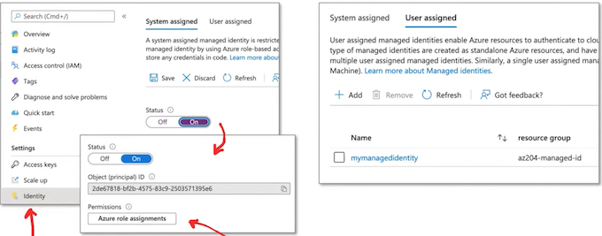

* Managed Identity is under the **Identity blade** for an Azure resource
* You assign roles to **provide permissions** to a Managed Identity


### Azure AD - External Identities

**External Identities** in Azure AD, allow people outside your organization to access your apps and resources, while letting them sign in using whatever identity they prefer.

Your partners, distributors, suppliers, vendors, and other guest users can **"bring their own identities"**

Supports Logins from **Google** and **Facebook**

* **Share apps with external users (B2B collaboration).**
* **Develop apps intended for other Azure AD tenants (single-tenant or multi-tenant)**
* **Develop white-labeled apps for consumers and customers (Azure AD B2C)**

### Microsoft Entra ID - Access reviews


Access reviews in **Microsoft Entra ID (Azure AD)** allow you to regularly review and manage access to resources in your organization.


* With access reviews, you can review who has access to resources and determine whether
their access is still necessary.
* Access reviews are useful in maintaining security and compliance by ensuring that only
**authorized individuals have access to sensitive resources**


Access reviews can be conducted for various types of resources, such as **applications, groups, and SharePoint Online sites**.

You can configure access reviews to occur on a regular schedule and select reviewers to conduct the reviews.

Reviewers can be **internal** or **external** to your organization.

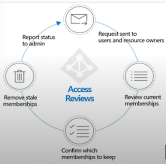

**Microsoft Entra ID - Access reviews**

During an access review, the reviewer will be presented with a list of people who have access to the resource being reviewed. They can choose to **approve** or **revoke access** for each individual.

### Microsoft Entra ID - Access reviews

During an access review, the reviewer will be presented with a list of people who have access to the resource being reviewed. They can choose to **approve** or **revoke** access for each individual.

* Access can be **revoked immediately or scheduled** for a later date.
* Reviewers can also provide a **reason** for their decision, which can be useful for auditing purposes

Access reviews are crucial in large organizations to regularly identify sand resolve access issues.

They ensure resources are accessed only by necessary users and that access is revoked when no longer needed.

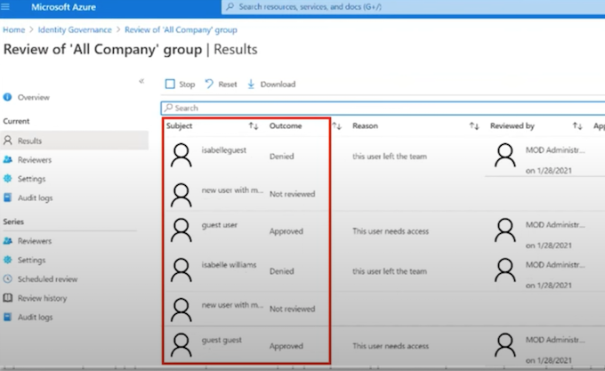

### Single Sign-On (SSO) in EntraID

**Single Sign-On (SSO) in Entra ID (Azure AD)** is a feature that allows users to **authenticate once** with Azure AD and then access **multiple applications and services without having to authenticate again.**

When a user signs into Entra ID with their credentials, Entra ID creates a **security token** that can be used to access other **resources** within the same organization.

This token can be used to authenticate the user to other cloud-based or on-premises
applications that have been integrated with EntraID.

SO supports a wide range of applications, including cloud-based applications **such as Microsoft 365, Salesforce, and Dropbox**, as well as on-premises applications such as SharePoint and SAP.

SO can also be used with custom-built applications using industry-standard protocols **such as SAML, OpenID Connect, and OAuth.**

### Single Sign-On (SSO) in Entra ID

There are several ways you can configure an application for SSO

Choosing an SO method depends on how the application is configured for authentication.

Cloud applications can use **OpenID Connect, OAth, SAML, password-based, or linked** for SSO. Single sign-on can also be disabled.

On-premises applications can use **password-based, Integrated Windows Authentication, header-based**, or linked for SO. The on-premises choices work when applications are configured for **Application Proxy**.

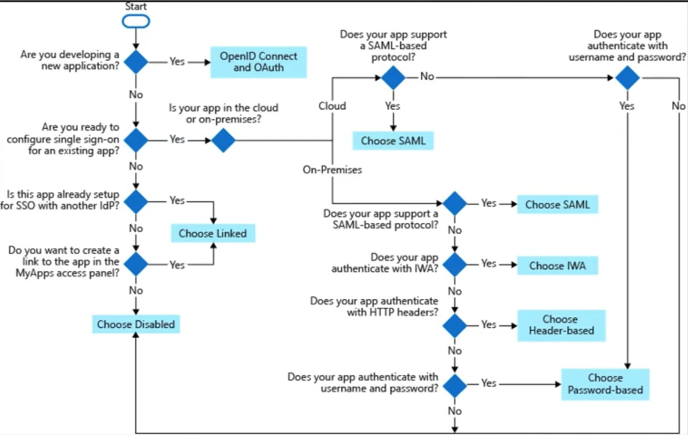

### Single Sign-On (SSO) protocols

**The main SO protocols supported in Azure include:**

1. **OpenID Connect and OAth:** OpenID Connect is an identity laver built on top of OAuth 2.0.  It allows for authentication and authorization of users in a secure and standardized manner. sIt is widely used for **web and mobile applications.**

2. **SAML (Security Assertion Markup Language):** SAML is an XML-based protocol used for exchanging authentication and authorization data between an identity provider and a service provider. It is commonly used for **federated** authentication scenarios.

3. **Password-based authentication**: This refers to the traditional username/password authentication method where users provide their credentials directly to authenticate.

4. **Linked authentication:** Azure provides the ability to link multiple accounts from different identity providers to a single user identity. This allows users to authenticate using any of their linked accounts.

5. **Integrated Windows Authentication (IWA)**: IWA lets users access applications using their Windows domain credentials, utilizing their **current Windows session** for authentication.

6. **Header-based authentication**: In this method, the application accepts an authentication token in the form of a header in each request. The token is validated by the application to authenticate the user.

### Multi-Factor Authentication

**What is Multi-Factor Authentication (MFA)?**

A security control where after you fill in your username/email and password, **you have to use a second device** such as a phone to confirm that its you logging in.

**MFA protects against people who have stolen your password.**

MFA is an option in most cloud providers and even social media websites such as Facebook.

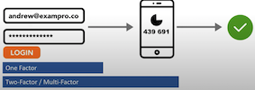

### Conditional Access

**Conditional Access **provides an extra layer of security before allowing authenticated
users to access data or other assets.

Conditional Access is implemented via **Conditional Access policies**, which are **a set of
rules** that specify the **conditions** under which sign-ins are **evaluated and allowed.**

For example, you can create a **Conditional Access policy** that states:

""If the user account name is a member of a group for users that are assigned the
Exchange, user, password, security, SharePoint, or global administrator roles,
**require MFA before allowing access.'**


**This policy enables MFA enforcement based on group membership,** simplifying the process compared to configuring MFA for individual users when roles change.

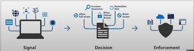


### Conditional Access

**Conditional Access policy** analyzes:

* **Signals**

User and location, Device, Application, and Real-time risk

* and **Verifies every access attempt via Access Controls**

Require MFA, Block access, and Allow access

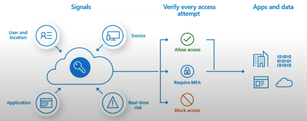

### Conditional Access - Signals

**Signals** are metadata associated with an identity attempting to gain access

**User or group membership**

Policies target specific users and groups (including admin roles), giving admins fine-grained control over access

**User or group membership**

Policies target specific users and groups (including admin roles), giving admins fine-grained control over access

**Device**

Policies can be applied based on the platform or status of a user's device.

**Application**

Users attempting to access specific applications can trigger different Conditional Access policies.

**Real-time sign-in risk detection**

Signals in Azure AD Identity Protection detect risky sign-ins. If risks emerge, policies can prompt actions such as password resets, multi-factor authentication, or block access pending admin intervention.

**Cloud apps or actions**

Cloud apps or actions can include or exclude cloud applications or user actions that will be subject to the policy.

**User risk**

* For customers with Identity Protection, user risk can be evaluated as part of a Conditional Access policy.
* User risk represents the probability that a given identity or account is compromised.

### Conditional Access  - Common Decisions

**Common decisions** define the access controls that decide **what level of access based on Signal information**

**Block access**： Most restrictive decision

**Grant access**： Least restrictive decision, still require one or more of the following options:

* Require multi-factor authentication
* Require device to be marked as compliant
* Require Hybrid Azure AD joined device
* Require approved client app
* Require app protection policy (preview)

You can use Conditional Access policies with:

* Microsoft 365 Business Premium
* Microsoft 365 E3 and E5
* Azure AD Premium P1 and Azure AD Premium P2 licenses

### Types of Azure roles

Roles can be confusing because Azure has three types of roles that can serve the same purpose.


**Azure roles (RBAC)**

This authorization system is also known as **Role-Based Access Controls (RBAC)** sand is built on top of Azure Resource Manager (ARM)

**Azure Active Directory (Azure AD) roles**

Azure AD roles are used to manage Azure AD resources in a directory

Azure Active Directory (AD) roles are used to manage **Azure AD resources** in a directory such as creating or editing users, assigning administrative roles to others, resetting user passwords, managing user licenses, and managing domains, among other tasks.

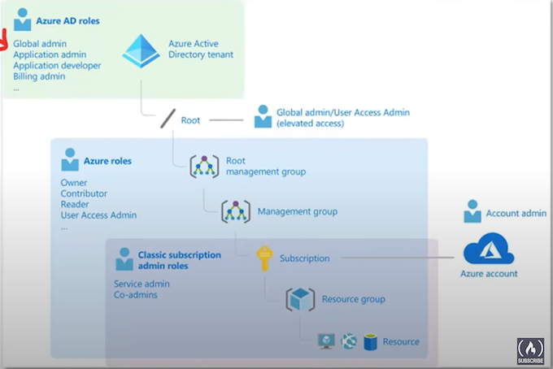

**Azure roles (RBAC)** is a system that provides fine-grained **access management** for Azure resources, allowing administrators to grant users specific rights to resources.


Classic subscription administrator roles refer to the older model of Azure access control and include three types: **Account Administrator, Service Administrator, and Co-Administrator**.

### Access Controls (IAM)

**Identity Access Management (IAM)** allows you to **<mark>screate and assign roles</mark>** to users

**Azure Roles (RBAC system)**

Roles **restrict access** to resource actions (also known as operations). There are **two** types of roles:

1. **BuiltinRole** - Refer to the set of predefined roles offered by Microsoft in Azure. Read-only and cannot be altered
2. **CustomRole** - Represent user-defined roles in Azure with your own custom logic based on specific requirements.

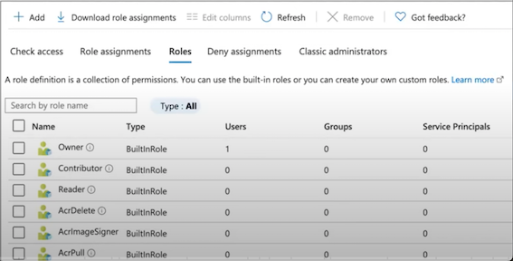

**Role Assignment**

Is when you apply a role to a **service principal**

* User
* Group
* Service principal
* Managed identity

**Deny Assignments**

Block users from performing specific actions even if a role assignment grants them access. The only way to apply Deny assignments is through **Azure Blueprints**

### Classic Aldministrators

**Classic Administrators** refer to the **<mark>original role system in Azure</mark>**. Despite the legacy status of Classic Administrators, understanding these roles can still be beneficial, like when working with older Azure setups.

However, it's recommended to use the new **RBAC** system for managing access to resources, given its enhanced granularity and flexibility.

**Classic Administrators have three types of roles:**

1. **Account Administrator** The billing owner of the subscription. Has no access to the Azure portal.
2. **Service Administrator** same access of a user assigned the **Owner** role at subscription scope. Full access to the Azure portal.
3. **Co-Administrator** same access of a user who is assigned the **Owner** role at the subscription scope

> Classic resources and classic administrators will be retired on August 31, 2024

### Azure Role- Based Access Control (RBAC)

**Azure role-based access control (Azure RBAC)** helps you manage who has access to Azure resources,

what actions they can perform on resources, and in what scope (areas they have access to).

**Role Assignments are the way you control access to resources**

A Role Assignment consists of these three elements

1. Scop
2. Role Definition
3. Security Principal

There are **four fundamental** Azure roles

Azure RBAC includes over **70 built-in roles**

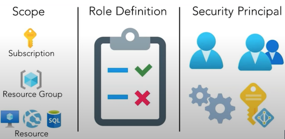

#### Scope

**Scope** is the **set of resources** that access for the Role Assignment applies to.

Scope Access Controls at the Management, Subscription, Resource Group, and resource level.

* **Management Group** Inherits across **all associated subscriptions and resources.**

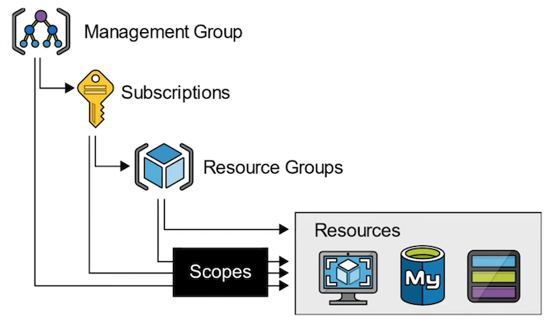

* **Subscriptions**：Applies to **all resource groups and resources within the specific subscription.**

* **Resource Groups**：Applies to **all resources within the specified resource group**.

* **Resource**： Applies only to that **specific resource**

### Azure Role-Based Access Control (RBAC)

A **Role Definition** is a set of permissions that determines what actions can be performed such as **read, write, or delete on various resources**.

Roles range from broad (e.g., '**Owner**") with extensive management permissions, to specific (e.g.,**'Virtual Machine Reader'**) with more targeted permissions.

Azure has built-in roles, and you can define **custom roles**

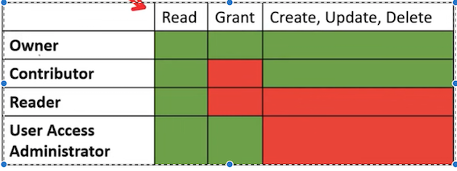

#### **These are the four fundamental built-in roles**

**A Security Principal** represents the identities requesting  access to an Azure resource such as:

* **User** An individual who has a profile in Azure Active Directory

* **Group** A set of users created in Azure Active Directory.

* **Service Principal** A security identity used by applications or services to access specific Azure resources.

* **Managed Identity** An identity in Azure Active Directory that is automatically managed by Azure.

### Azure AD Roles

**Azure AD roles** are used to **manage Azure AD resources** in a directory such as:


* Create or edit users
* Assign administrative roles to others
* Reset user passwords
* Manage user licenses
* Manage domains

A few important Built-In Azure AD roles you should know:

* **Global Administrator** Full access to everything Users
* **User Administrator** Full access to create and manage users
* **Billing Administrator** Make purchases, manage subscriptions and support tickets

You can create **custom roles**, which are very flexible and can define the exact set of permissions that you need.

**But you need to purchase either:**

* **Azure AD Premium P1 or P2**

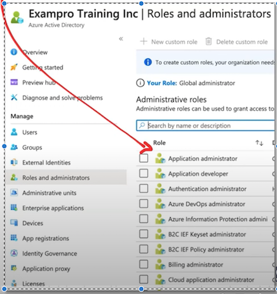

### Anatomu of an Azure Role

The **property** names in an **Azure Role Definition** will change whether you're using **Azure PowerShell** or **Azure CLI.**

The two different interfaces use different **syntax** and terminology.

```
"Name: "Virtual Machine Operator"
"Id": "88888888-8888-8888-8888-888888888888"
"IsCustom": true,
"Description": "Can monitor and restart virtual machines"
"Actions": {
	"Microsoft.Storage/*/read"，
	"Microsoft.Network/*/read"，
	"Microsoft.Compute/*/read",
	"Microsoft. Compute/virtualMachines/start/action"，
	"Microsoft.Compute/virtualMachines/restart/action"，
	"Microsoft.Authorization/*/read"，
	"Microsoft.ResourceHealth/availabilityStatuses/read"，
	"Microsoft.Resources/subscriptions/resourceGroups/read"，
	"Microsoft. Insights/alertRules/*"，
	"Microsoft. Insights/diagnosticSettings/*'，
	"Microsoft. Support/*",
],
'"NotActions": [],
"DataActions": [],
"NotDataActions": [],
"AssignableScopes": [
	"/subscriptions/(subscriptionIdl}"
	"/subscriptions/(subscriptionId2}'
	"/providers/Microsoft.Management/managementGroups/{groupId1}"	]
}
```

* **Name (roleName) **The display name of the custom role
* **Id (name)** The unique ID of the custom role. This is autogenerated for you •
* **IsCustom (roleType) **Indicates whether this is a custom role. (true or false) '
* **Description (description) **The description of the custom role
* **Actions (actions)** An array of strings that specify the management 
	* operations that the role is allowed to perform
* **NotAtions (notAtions**) An array of strings that specify the management operations that are excluded from the allowed Actions
* **DataActions (dataActions)** An array of strings that specify data operations the role is allowed perform to your data within that object.
* **NotDataActions (notDataActions)** An array of strings that specify the data operations that are excluded from the allowed DataActions
* **AssignableScopes (assignableScopes)** An array of strings that specify the scopes that the custom role is available for assignment. You can only define one management group in AssignableScopes of a custom role.

#### **Wildcard permissions**

Actions, NotAtions, DataActions, and NotDataActions support wildcards (*)

A wildcard allows you to apply to match **everything**

```
Microsoft.CostManagement/exports/action
Microsoft. CostManagement/exports/read
Microsoft.CostManagement/exports/write
Microsoft.CostManagement/exports/delete
Microsoft.CostManagement/exports/run/action
```

**`"Actions": ["Microsoft.Storage/*/read"]`**

This means that the role is granted the permission to perform **read operations on all resource types under the Microsoft.Storage resource provider**.

### Azure AD Roles vs  Azure Roles (RBAC)

* **Azure AD Roles**

They are used for managing **Azure AD resources**

AD resources being:

* Users
* Groups
* Billing
* Licensing
* Application Registration
* Etc.

* **Azure Roles (RBAC)**

They are used for fine-grained **access control to Azure resources**.

Azure resources being:

* Virtual Machines
* Databases
* Cloud Storage
* Cloud Networking
* Etc.

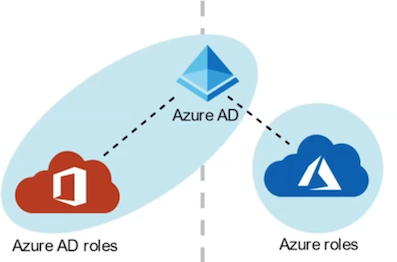

* By default, Azure roles and Azure AD roles are separate, and **do not span Azure and Azure AD**
* By default, the **Global Administrator** **doesn't have permissions** to manage Azure resources.
* Global Administrator can gain access to Azure resource if granted the **User Access Administrator** role (an Azure role)

### Introduction to Azure Policies

**Azure Policies** enforce organizational standards and to assess **compliance** at-scale 

<mark>Policies **do not restrict access**; they only observe for compliance.</mark>


#### Policy Definitions

A policy definition is a **JSON** file used to describe business rules to control access to resources.

#### Policy Assignment

The scope of a policy can effect. Assigned to a user, a resource group or management group

#### Policy Parameters

Values you can pass into your Policy definition, so your Policies are more flexible for re-use.

#### Initiative Definitions

An initiative definition is a collection of policy definitions, that you can assign. e.g., A group of policies

to enforce **PCI-DSS compliance**

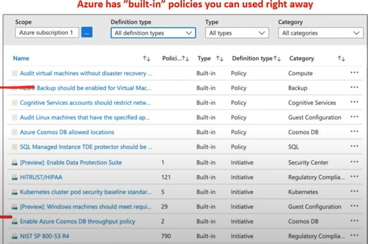

### Viewing Non-Compliant Resources

Once a policy is assigned, it will evaluate for the compliance state periodically

We can see how compliant we are on the **Compliance tab**

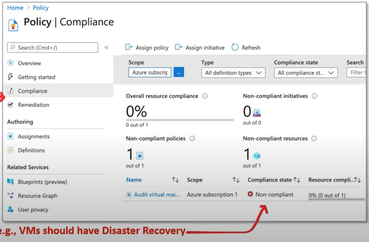

### Azure Policy Scope

#### Management groups

The scope of an **Azure Policy** is the set of resources that the policy is applied to.

When you assign a policy, you define the **scope** at which the policy is enforced.

This could be as broad as a management group or as specific as a single resource.


#### Subscriptions

The hierarchy of scopes in Azure are like other scopes, like **Azure Resource Manager or RBAC**. It moves from broad to specific in the following order:

**Management Group > Subscription > Resource Group > Resource.**

#### Resource groups

At each level, you can apply different policies as per your requirements.

Policies applied at higher levels of the hierarchy (like a management group or a subscription) are **inherited by all the lower levels.**

#### Resources

This structure provides a powerful mechanism for applying broad organizational policies while still allowing for flexibility and customization at lower levels.

### Anatomy of an Azure Policy Definition File

**Display Name** Identifies the policy (128-character limit)

**Type (ReadOnly)**

* Builtin - Maintained by Microsoft
* Custom - Created by you
* Static - Microsoft Owned, A Regulatory Compliance

**Description** Provides the context of the policy

#### **Metadata**

Optional field used to store key-value information on the policy

#### **Mode**

Determines which resource types are evaluated. Changes whether Resource Provider or Azure Resource Manager is used.

**Resource Manager**

* All - Resource groups, subscriptions, and all resource types
* Indexed - Only resource types that support tags and location

**Resource Provider**

* Microsoft.ContainerService.Data (deprecated)
* Microsoft.Kubernetes.Data
* Microsoft.KeyVault.Data

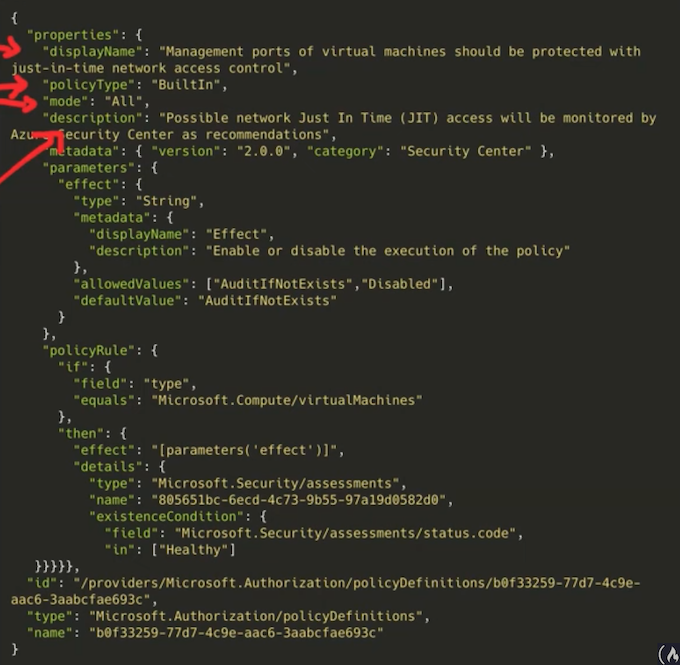


### Anatomy of an Azure Policy Definition File

**Parameters**

These are values passed into the policy to improve its flexibility. A parameter has the following properties

* name the name of the parameter
* type string, array, object, boolean, integer, float, or datetime.
* metadata used by Azure to display friendly information

	* description
	* displayName
	* strongType (optional, multi-select list)
	* assignPermissions

* defaultValue (optional)
* allowedValues (optional)

You reference parameters by using **field and in**

```
{
	"field": "location"
  "in": "[ parameters('allowedLocations')]"
 }
```

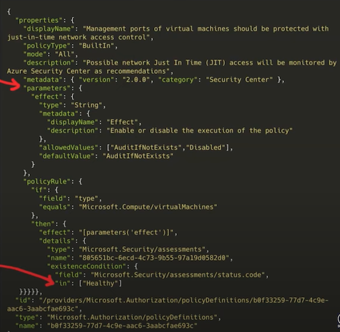

 
**Policy Rule**

Consists of **If** and **Then** blocks.

In the **If** block, you define one or more conditions that

specify when the policy is enforced.

You can apply **logical operators** to these conditions to precisely define the scenario for a policy.

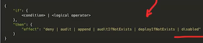

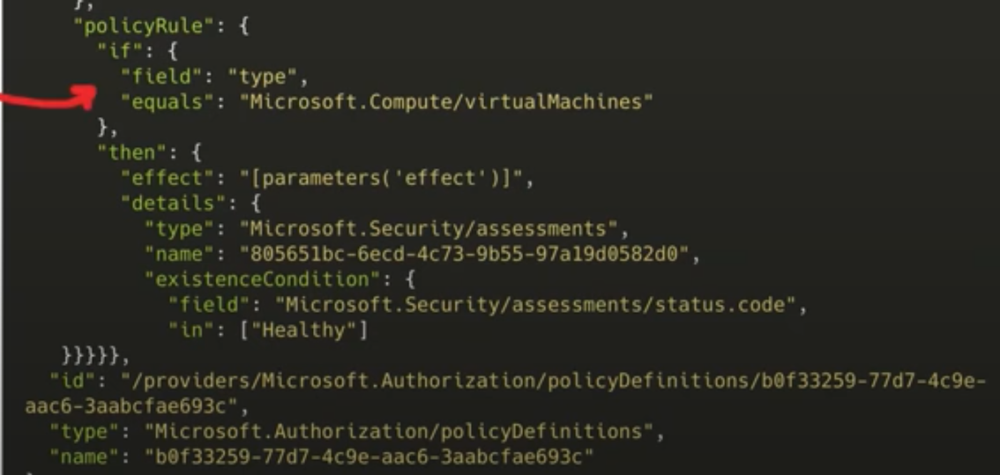

### Policy Rule - Policy Effect

```
{
		"if":{
			<condition> | <logical operator>
		},
		
		"then": {
			"effect": "deny | audit | append | auditIfNotExists | deployIfNotExists | disabled"
		}
}
```


* **Deny** - If a resource's creation or update doesn't adhere to the policy, it fails.
* **Audit** - Creates a warning event in the activity log when evaluating a **non-compliant resource**, but it doesn't stop the request.
* **Append** - Adds extra parameters/fields to the resource during its creation or update. For example, it could append tags on resources like 'Cost Center' or specify allowed IP addresses for a storage resource.
* **Audit If Not Exists** - Creates a warning event in the activity log when evaluating a non-compliant resource, but it doesn't stop the request. "**Audit"** is used to audit the **properties** of a resource, while "**AuditIfNotExists**" is used to audit the **existence
* of a related resource**.
* **Deploy If Not Exists** - Executes a template deployment when a specific condition is met. For example, if SQL encryption is enabled on a database, then it can run a template after the DB is created to set it up a specific way.
* **Disabled** - The policy rule is ignored (disabled). Often used for testing.

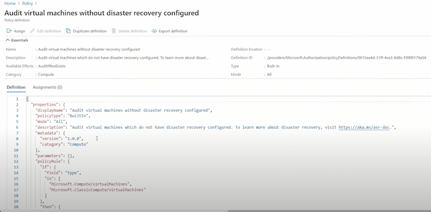


### Introduction to Azure Resource Manager

**Azure Resource Manager (ARM)** is a service that allows you to manage Azure resources.

Azure Resource Manager is a collection of services in the Azure Portal, **so you can't simply type in "Azure Resource Manager"**

It is a management layer that allows you to:

* Create, Update, Delete Resources
* Apply Management features e.g., Access Controls, Locks, Tags
* Write Infrastructure as Code (laC) via JSON templates.

We will be examining the following key components that form the **Azure Resource Manager (ARM) layer:**

* Subscriptions
* Management Groups
* Resource Groups
* Resource Providers
* Resource Tags
* Resource Locks
* Azure Blueprints
* Access Control (IAM)
* Role-Based Access Controls (RBAC)
* Azure Policies
* ARM Templates

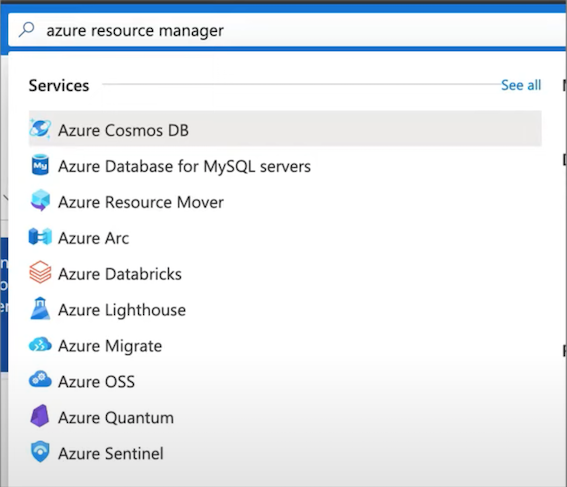

### Azure Resource Manager - Use Case

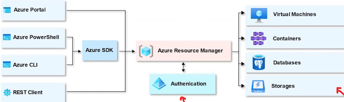

Think of Azure Resource Manager (ARM) as a "**gatekeeper**"

All **requests** flow through ARM, and it decides whether that request can be performed on a **resource**

E.g., creation, updating, and deletion of a virtual machine

ARM uses Azure's RBAC to determine whether a user has the necessary permissions to carry out a request.


When a request is made, ARM checks the user's assigned roles and the permissions associated with those roles.
If the user has the necessary permissions, the request is **allowed**; otherwise, it is **denied**.

### Azure Resource Manager - Scope

**What is scope?**

Scope is a **boundary of control** for azure resources. It is a way to **govern** your resource by placing resources

* within a logical grouping
* and applying logical restrictions in the form of rules.

**Management Groups**

A logical grouping of multiple subscriptions

**Subscriptions**

Grants you access to Azure services **based on a billing and support agreement**

**Resource Groups**

A logical grouping of multiple resources

**Resources**

An azure service e.g., Azure VMs

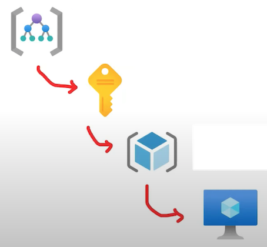

### **Azure Management Groups**

Managing multiple subscriptions (accounts) into a hierarchal structure.

Each directory is given a single top-level management group called the "Root" management group.

All subscriptions within a management group automatically **inherit the conditions** applied to
the management group.

**Important facts about management groups**

* A single directory can support up to **10,000** management groups.
* The hierarchy of a management group tree can be up to **six levels** deep, not including the Root level or the subscription level.
* Each management group and subscription can have only **one parent.**
* Each management group can have **multiple** children.
* All subscriptions and management groups exist within a single hierarchy in each directory.

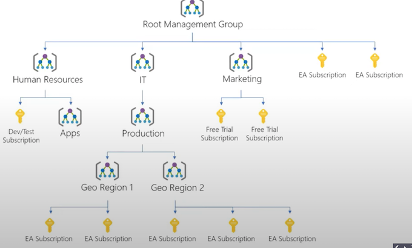

### Subscriptions

Before you can do anything in your Azure account. You'll need to have a subscription

An Azure Account **can have multiple subscriptions** and the most common three are:

* Free Trial
* Pay-As-You-Go
* Azure for Students

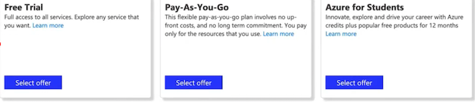


e.g., If you wanted Developer support, You would add a Developer Support Subscription


At the subscription level you'll have the ability to set:

* Resource Tags
* **Access Controls**
* Resources Groups
* Cost Management and Billing

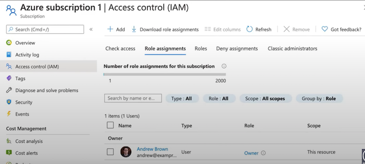

### Resources Groups

**Resource Group**

A container that holds related resources for an Azure solution

> E.g., A resource group containing multiple VMs


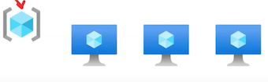


**Resource**

A manageable item that is available through Azure 

> E.g., An individual Virtual Machine (VM)

**Resource Provider**

A service that supplies Azure resources.

> E.g., Microsoft.Compute

### Resources Providers

In order to **use** Azure resources, you have to **register Resource Providers**

Many Resource Providers are registered by default for you with your Subscription.

However, for certain resources, you may need to manually register the Resource Provider.

**You can register Resource Providers under your subscription in the Azure portal, through Azure PowerShell, or Azure CLI**

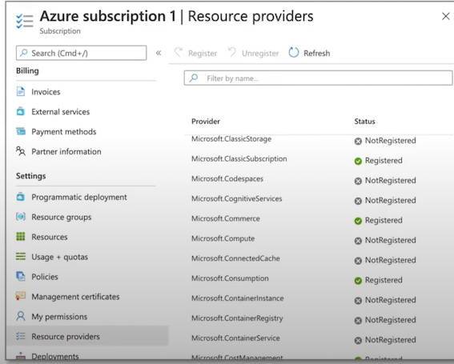

### Resource Tags

**A tag** is a **key and value pair** that you can assign to azure resources.

Tags allow you to organize your resources in the following ways:

**Resource management**

Specific workloads, environments e.g., Developer Environments

**Cost management and optimization**

Cost tracking, Budgets, Alerts

**Operations management**

Business commitments and SLA operations e.g., Mission-sCritical Services

**Security**

Classification of data and security impact

* Governance and regulatory compliance
* Automation
* Workload optimization


**Tag Examples**

* Dept = Finance
* Status = Approved
* Team = Compliance
* Environment = Production
* Project = Enterprise
* Location = West US

### **Resource Locks**

As an admin, you may need to **lock a subscription, resource group, or resource** to **prevent other users from accidentally deleting or modifying critical resources.**

In the Azure Portal you can set the following lock levels.

**CanNotDelete (Delete)**

authorized users can still read and modify a resource, but they **can't delete** the resource.

**ReadOnly (Read-only)**

authorized users can read a resource, but they **can't delete or update** the resource


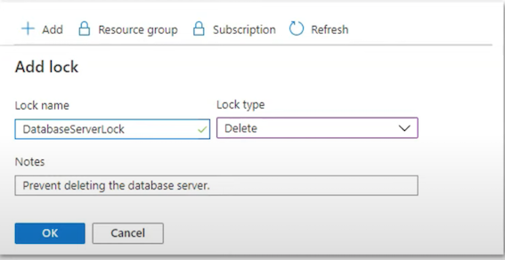


### Resource Locks

**Managing Locks:**

* Azure Portal: You can easily create, view, and delete locks through the Azure Portal.
* Azure PowerShell: Use cmdlets like New-AzResourceLock to manage locks.
* Azure CLI: Commands like az lock create help manage locks.
* **Azure Resource Manager templates**: You can also define locks in your ARM templates.

### Azure Blueprints

**Azure Blueprints** enable **quick creation** of **governed subscriptions**.

Compose artifacts based on common or organization-based patterns into re-usable blueprints.

The service is designed to help with **environment setup**


Blueprints are a declarative way to orchestrate the deployment of various resource templates
and other artifacts such as:

* Role Assignments
* Policy Assignments
* Azure Resource Manager templates (ARM templates)
* Resource Groups

Azure Blueprint service is powered by the globally distributed Azure Cosmos DB,

ensuring blueprint objects are replicated across multiple regions, providing **redundancy and resilience. **

### ARM Templates

#### What is Infrastructure As Code? (IaC)

The process of managing and provisioning computer data centers (e.g., Azure) through machine-readable **definition files** (e.g., JSON files) rather than physical hardware configuration or interactive configuration tools.

You write a script that will setup cloud services for you.

IaCs can either be:

**Declarative**

- You describe your desired outcome, and the system figures out how to achieve it.

**Imperative**

- You provide specific instructions, detailing exactly how to reach the desired state.

**ARM templates** are **JSON files that define azure resources** you want to provision and azure
services you want to configure.

With ARM templates you can:

* **ARM templates** are declarative. (You just outline your desired setup, and the system takes care of the rest)
* Build, remove, or share entire architectures in minutes
* Reduce configuration mistakes
* Know exactly what you have defined for a stack to establish an architecture baseline for compliance

### ARM Templates

With ARM templates you can:

* Establish an architecture baseline for compliance
* **Modularity** Break up your architecture in multiple files and reuse them
* **Extensibility** Add PowerShell and Bash scripts to your templates
* **Testing** You can use the ARM template tool kit (arm-ttk)
* **Preview Changes** Before you create infrastructure via template, see what it will create
* **Built-In** Validation Will only deploy your template if it passes
* Tracked Deployments Keep track of changes to architecture over time
* Policy as Code Apply Azure policies to ensure you remain compliant
* Microsoft Blueprints (establishes relationship between resource and the template)
* **CI/CD integration**
* **Exportable Code** (exporting the current state of a resource groups and resources)


```json
{
"$schema":
"https://schema.management.azure.com/schemas/2019-04-01/deploymentTemplate.json#",
"contentVersion": "1.0.0",
"apiProfile": "",
"parameters": { },
"variables": { },
"functions": [ ],
"resources": [],
"outputs": { }
}
```

#### ARM Template - Resoyrce

**Resource**

An Azure Resource you want to provision

**type**

* Type of the resource
* Follows the format of (ResourceProvider}/ResourceType

**apiVersion**

* Version of the REST API to use for the resource
* Each resource provider published has its own API versions

**name**

Name of the resource

**location**

* Most resources have a location property
* The region where the resource will be deployed

**Other Properties**

* Other properties we can use to configure the resource
* Will vary per resource type

```
{  
	"$schema": "https://schema.management.azure.com/schemas/2019-04-01/deploymentTemplate.json#",  
	"contentVersion": "1.0.0.0",  
	"parameters": {  
	
	# Setting a parameter
		"storageName": {  
		"type": "string",  
		"minLength": 5,  
		"maxLength": 20  
	}  
},  
"resources": [  
{  
	"type": "Microsoft.Storage/storageAccounts",  
	"apiVersion": "2019-04-01",  
	"name": "[parameters('storageName')]",  
	"location": "eastus",  
	"sku": {  
		"name": "Standard_LRS"  
	},  
	"kind": "StorageV2",  
	"properties": {  
		"supportsHttpsTrafficOnly": true  
			}  
		}  
	]  
}
```

**Parameters**

Allows you to pass variables to your ARM template

**type** the expected data type of the inputed value

**string, securestring, int, bool, object, secureObject, and array.**

* **defaultValue** if not value is provided it will be set to this value
* **allowedValues** an array of allowed values
* **minValue** the minimal possible value
* **maxValue** the maximum possible value
* **minLength** the maximum length of characters or array
* **maxLength** the maximum length of characters or array
* description the description that will be displayed to the in the Azure Portal

### ARM Template - Functions

**Functions**

Allows you to apply transformations to your ARM variables

* Template Functions - built-in functions
* Used-Defined Functions - custom functions you create

Functions are called using **parentheses e.g. ()**:

```
"condition": "[equals(parameters ( 'new0rExisting' ), 'new')]" }
```

**Template Functions**


* **Array**: array, concat, contains, createArray, empty, first, intersection, last, length, min, max, range, skip, take, union
* **Comparison**: coalesce, equals, less, lessOrEquals, greater, greaterOrEquals
* **Date**: dateTimeAdd, utcNow
* **Deployment**: deployment, environment, **parameters, variables**
* **Logical**: and, or, if, not, or
* **Numeric**: add, copylndex, div, float, int, min, max, mod, mul, sub
* **Object**: contains, empty, intersection, json, length, union
* **Resource**: extensionResourceld, listAccountSas, listKeys, listSecrets, list*, pickZones, providers, reference, resourceld, subscriptionResourceld, tenantResourceld
* **String**: base64, base64ToJson, base64ToString, concat, contains, dataUri, dataUriToString, empty, endsWith, first, format, guid, indexOf, join, last, lastlndexOf, length, newGuid, padLeft, replace, skip, split, startsWith, string, substring, take, toLower, topper, trim, uniqueString, uri, uriComponent, uriComponentToString

### ARM Template - Variables

**Variables**

Template variables are used to simplify your ARM templates.

You transform parameters and resource properties using functions, and then assign them into a reusable variable.

```
"variables":
{
	"storageName" : "[concat(toLower(parameters('storageNamePrefix')), uniqueString(resourceGroup().id) )] "
},
```

To call a variable you use the **variable()** function

```
"resources": [  
{  
"type": "Microsoft.Storage/storageAccounts",  
"name": "[variables('storageName')]",  
...  
	}  
]
```

**Nested Variables**

**Scoping/Nesting** variables based on environment

```
"variables": {  
	"environmentSettings": {  
		"test": {  
			"instanceSize": "Small",  
			"instanceCount": 1  
		},  
		"prod": {  
			"instanceSize": "Large",  
			"instanceCount": 4  
		}  
	}  
},
```


Using params to **choose the environment**

```
"parameters": {  
	"environmentName": {  
		"type": "string",  
		"allowedValues": [  
			"test",  
			"prod"  
		]  
	}  
},
```

**Referencing nested variables** e.g., `Variables()[].property`

```
"[variables('environmentSettinas' ) [parameters( 'environmentName")].instanceSize]"
```

### ARM Template - Outputs


**Outputs**

Returns values from deployed resources, so you can use them programmatically

You specific **the type and value** under outputs

```
"outputs": {  
	"resourceID": {  
		"type": "string",  
		"value": "[resourceId('Microsoft.Network/publicIPAddresses', parameters('publicIPAddresses_name'))]"  
	}  
}
```

You can use the Azure API via CLI. PowerShell or SDK to fetch outputs

```
az deployment group show \
	-g <resource-group-name> \
	-n <deployment-name> \
	--query properties.outputs.resourceID.value
```