## Azure Monitor

### Introduction to Azure Monitor

Azure Monitor comprehensive solution **for collecting, analyzing, and acting on telemetry** from your cloud and on-premises environments

**Key Features:**

* **Visual Dashboards**: A visual representation of your data.
* **Smart Alerts**: Intelligent notifications based on specific conditions.
* **Automated Actions**: Set automation based on certain triggers.
* **Log Monitoring**: Track and analyze event logs.

Many Azure services by default are already sending telemetry data to Azure Monitor

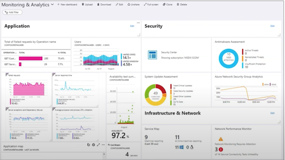

### The Pillars of Observability

**What is Observability?**

The ability to measure and understand how internal systems work in order to answer questions regarding performance, tolerance, security and faults with a system / application.

To obtain observability you need to use **Metrics, Logs and Traces.**

You have to use them together, using them in isolate does not gain you observability

**Metrics**

A number that is measured over period of time e.g., If we measured the CPU usage and aggerated it over a period of time we could have an **Average CPU metric**

**Logs**

A text file where each line contains event data about what happened at a certain time

**Traces**

**A historv of request that is travels through multiple Apps/services** so we can pinpoint performance or failure.

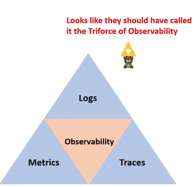

### Anatomy of Azure Monitor

The **sources of common monitoring data** to populate datastores Order by (Highest to Lowest)

> The functions that Azure monitor can performed

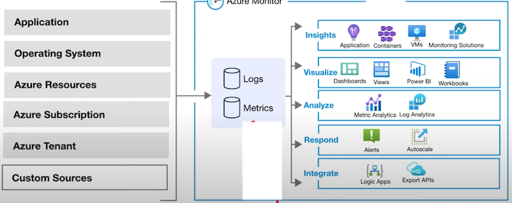

The two fundamental data stores are **Metrics** and **Logs**

### Azure Monitor - Sources

**Application Code**: Performance and functionality of application and code.
Performance traces, application logs, and user telemetry.

You need to install **Instrumentation Package** to collect data for Application Insights

* **Metrics** Descriptive data regarding your application's performance, operation, and custom metrics.

* **Availability Tests** responsiveness of your application from different locations on the public Internet

* **Logs** store operational data about our application, including page views, application requests, exceptions, and traces.


	* Send application data to **Azure Storage** for archiving.
	* Details of **availability test** stored

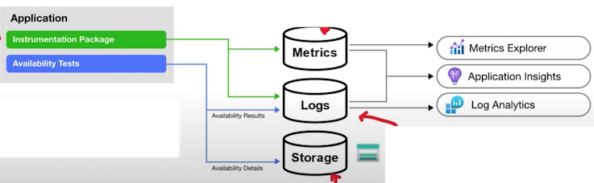

### Azure Monitor - Sources

* **Log Analytics** Agent is installed for comprehensive monitoring.
* **Dependency Agent** collects discovered data about processes running on the virtual machine and external process dependencies.
* Agents can be installed on the OS for VMs running in Azure, On-premises or other cloud providers.


**Diagnostics Extension** collect performance counters and store them in **Metrics**

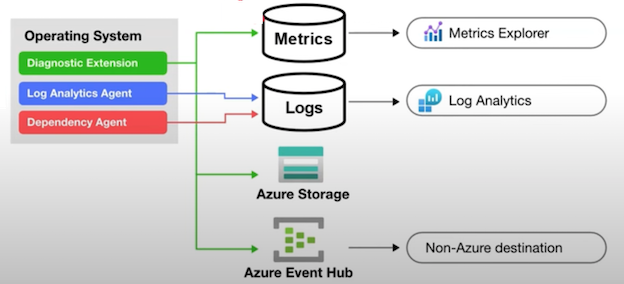

**Application Insights Logs**

collect logs and performance counters from the compute resource supporting your application to be analyzed with other application data

* **Azure diagnostics extension** always writes to an **Azure Storage** account.
* Azure Monitor for VMs uses the Log Analytics agent to store heath state information in a custom location.

**Diagnostics Extension** can also stream data to other locations using Event Hubs

* **Resource Logs**

**Resource Logs** provide insights into the internal operation of an Azure resource and are automatically created. However, you must create a **diagnostic setting** to specify a destination for each resource

* **Metrics** : **Platform metrics** will write to the **Azure Monitor metrics database** with no configuration.

	* **Metrics Explorer**: Access platform metrics from **Metrics Explorer**.

* **Logs**: Copy platform metrics to **Logs**
	*  **Log Analytics**: Trending and other analysis
using Log Analytics

* **Azure Storage**： Send resource logs to **Azure Storage** for archiving.

* **Azure Event Hub**： Stream metrics to other locations using **Event Hubs**

**Resource Logs** provide insights into the internal operation of an Azure resource and are automatically created. However, you must create a **diagnostic setting** to specify a destination for each resource.

### Azure Monitor - Sources

For resources that cannot be monitored using the other data sources, write this data to either
Metrics or Logs using an **Azure Monitor API**


This will allow you to collect log data from any **REST** client and store it in Log 

Analytics and the Azure Monitor metrics database.

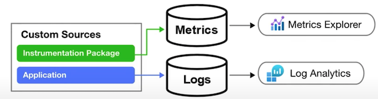

### Azure Monitor - Data Stores

Azure Monitor collects **two fundamental types** of data from sources : **Logs and Metrics**

Azure Monitor collects two fundamental types of data from sources: **Logs and Metrics**

#### **Azure Monitor Logs**

* collects and organizes log and performance data from monitored resources
* **Data Consolidation:** Logs can be pulled from diverse sources such as platform logs from Azure services, log and performance，data from agents on virtual machines, and usage and performance data from applications.
* **Workspaces:** All these logs are organized into workspaces, providing a centralized repository for in-depth analysis.
* **Query Language**: Azure Monitor Logs offers a sophisticated query language, which can quickly analyze millions of records.
* **Log Analytics**: You can interactively work with log queries and their results using **Log Analytics**

#### **Azure Monitor Metrics**

* collects numeric data from monitored resources **into a time series database**.
* **Numeric Data:** Metrics are numerical values captured at regular intervals. They are a snapshot that describes a particular aspect of a system at a specific moment in time.
* **Lightweight**: Metrics are designed to be lightweight, allowing for near real-time data analysis. This makes them particularly useful for alerting and the rapid detection of issues.
* **Metrics Explorer:** The **Metrics Explorer** tool allows for interactive analysis of metric data.

### Azure Monitor Logs

**Data retention and archive policies**

In Azure Monitor Logs, you can control how long your log data stays stored.

By default, in the Azure portal, you can set this retention time anywhere from **30 to 730 days**
for the whole workspace.

You can also specify different storage durations for certain **tables** within your workspace,
letting you manage different types of data as needed.

This gives you the flexibility to meet **an business or regulatory rules** about data storage.

To tweak these retention settings, you have to be on the **paid tier** of Azure Monitor Logs.

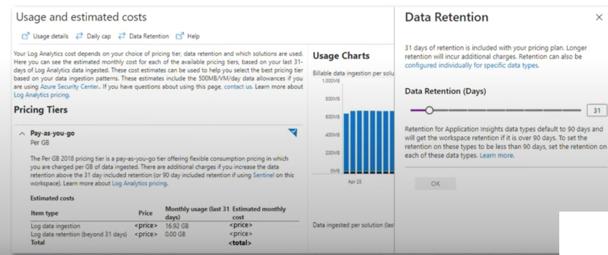

**To set retention and archive policy by table:**

1. Navigate to the Azure portal and go to the Log Analytics workspace where the data is stored
2. Under the "Settings" section, select "Usage and estimated costs"
3. Then, select **"Data Retention"**

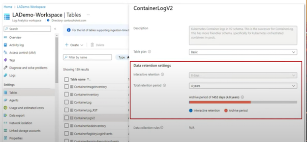

4.In the data retention blade, you can modify the retention period for each for the list of table. By default, it is set to **31 days, but you can extend it up to 730 days.**

5.For archiving data, you can use **Azure Data Explorer**, which lets you retain data beyond the 2-year limit, and gives you a highly-scalable analytics service.

#### **Log Analytics**

**Log Analytics** is a tool in the Azure portal used **to edit and run log queries** with data in **Azure Monitor Logs.**

* Log Analytics processes data from various sources and transforms it into actionable insights.
* It ingests data from **Azure Monitor, Windows, and Linux agents, Azure services, and other sources.**
* Once the data is collected, you can use Log Analytics query language to retrieve, consolidate, and analyze the data.

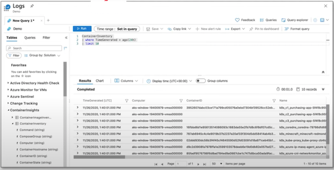

**Log Analytics** uses a query language called **KQL**

#### **Benefits**

1. **Centralized Log Management**: Collect and analyze data from multiple sources, both on-
premises and in the cloud, in a centralized location.
2. **Powerful Analytics:** Utilize the Kusto Query Language (KQL) to run advanced analytics on
large amounts of fast-streaming data in real time.
3. **Custom Dashboards**: Create custom dashboards and visualizations to display real-time
data and trends.
4. **Integration**: Seamless integration with other Azure services and Microsoft solutions, such
as Power Bl and Azure Automation.
5. **Alerting**: Set up alerts based on specific criteria to proactively identify and respond to
potential issues before they affect your users.

### Log Analytics Workspaces

**Log Analytics workspace** is a unique environment for Azure Monitor log data

Each **workspace** has its own data repository and configuration, and data sources and solutions are configured to store their data in a particular **workspace**

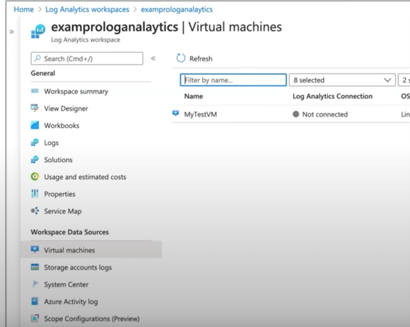

### Log Analytics agent

The Log Analytics agent is a lightweight agent that can be installed on **Windows** and **Linux**
machines to collect and send log data to **Azure Monitor.**

The Log Analytics agent is a lightweight agent that can be installed on **Windows and Linux
machines to collect and send log data to Azure Monitor**.

The agent can collect logs from various sources, including **Windows event logs, custom logs, performance counters, and Syslog.**

It supports both agent-based and agentless data collection and can be configured to collect data from on-premises and cloud-based environments.

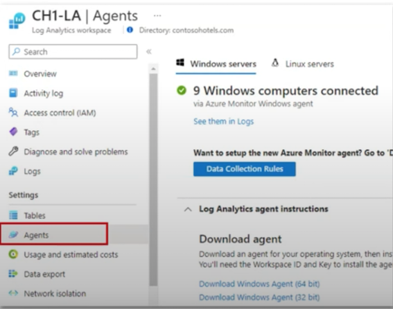


### Log Analytics agent

The Log Analytics agent is set up to monitor certain **Windows event logs** like Security, System, or Application logs

The data from these logs is then gathered and sent to **Log Analytics** for analysis using queries and visualizations.

The Log Analytics agent is set up to monitor **Syslog** servers or network devices.

It collects data from these sources and sends it to Log Analytics, allowing for detailed analysis and troubleshooting.

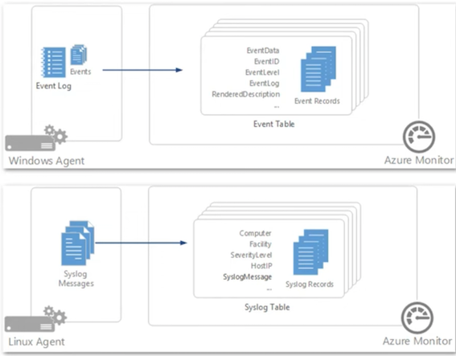

Both methods for collecting log data allow for centralized management and analysis of log data from multiple sources, **which can help to improve visibility and streamline troubleshooting and issue resolution.**

## Application Insights

**Application Insights is an Application Performance Management (APM)** service
It is a sub-service of Azure Monitor.

### What is an APM?

Monitoring and management of **performance and availability of software apps**. APM strives to detect and diagnose complex application performance problems to maintain an expected level of service.

* **Automatic Detection of Performance Anomalies:** Application Insights automatically identifies performance anomalies in your system.
*  **Powerful Analytics Tools**: It comes with robust analytics tools to help you diagnose issues and understand what users do with your app.
* **Continuous Improvement**: It is designed to help you continuously improve performance and
* usability of your applications.
* **Platform Agnostic**: It works for apps on .NET, Node.js, Java, and Python, hosted on-premises, hybrid, or any public cloud.
* **DevOps Integration**: It can be integrated into your DevOps process.
* **Mobile App Monitoring:** It can monitor and analyze telemetry from mobile apps by integrating with Visual Studio App Center.

### Application Insights

To use Application Insights, **you need to instrument your application.**

This involves installing the **instrument package (SDK),** or enabling Application Insights using the **Application Insights Agents**, where supported.

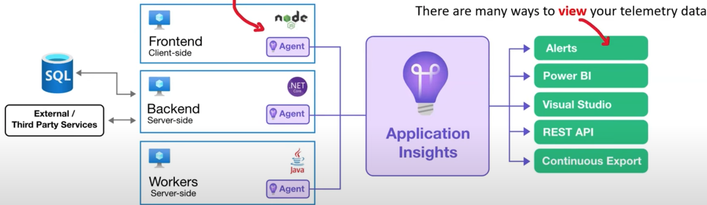

**Apps can be instrumented from anywhere**

When you set up Application Insights monitoring for your web app, you create an Application Insights resource in Microsoft Azure 

You open this resource in the Azure portal to see and analyze the telemetry collected from your app. 

The resource is identified by an instrumentation key (ikey)

#### **What does Application Insights Monitor?**

* Request rates, response times, and failure rates
* Dependency rates, response times, and failure rates
* Exceptions
* Page views and load performance
* AJAX calls
* User and session counts
* Performance counters
* Host diagnostics
* Diagnostic trace logs
* Custom events and metrics

#### **Where do I see my telemetry?**

* Smart detection and manual alerts
* Application map
* Profiler
* Usage Analysis
* Diagnostic search for instance data
* Metrics Explorer for aggerated data
* Dashboards
* Live Metrics Stream
* Analytics
* Visual Studio
* Snapshot debugger
* Power BI
* REST API
* Continuous Export

### Application Insights - Instrumentation

You Instrument your application by adding the Azure Application Insights SDK and implementing traces.

In the case of a **Node.js** application, you can install the Azure Application Insights SDK using **npm (Node Package Manager) with the following command:**

```
npm install applicationinsights --save
```

```
let appInsights = require("applicationinsights");

// configure what you watn to collect
appInsights.setup("<instrumentation_key>")
	.setAutoDependencyCorrelation(true)
	.setAutoCollectRequests(true)
	.setAutoCollectPerformance(true, true)
	.setAutoCollectExceptions(true)
	.setAutoCollectDependencies(true)
	.setAutoCollectConsole(true)
	.setUseDiskRetryCaching(true)
	.setSendLiveMetrics(false)
	.setDistributedTracingMode(
	appInsights.DistributedTracingModes.AI
).start();
```


**Azure supports the following languages:**

.NET, Java, Python, Node.js, JavaScript

```
client.trackEvent({
	name: "my custom event",
	properties: {customProperty: "custom property value"}
});
client.trackException({
	exception: new Error(
	"handled exceptions can be logged with this method")
});
client.trackMetric({name: "custom metric", value: 3});
client.trackTrace({message: "trace message"});
client.trackDependency({
	target:"http://dbname",
	name: "select customers proc",
	data: "SELECT * FROM Customers",
	duration:231,
	resultCode:0,
	success: true,
	dependencyTypeName: "ZSQL"
});
client.trackRequest({
	name: "GET /customers",
	url:"http://myserver/customers",
	duration:309,
	resultCode:200,
	success:true
});
```


#### Application Insights - Auto Instrumentation

**Auto-instrumentation** allows you to enable application monitoring with 

Application Insights without changing your code.

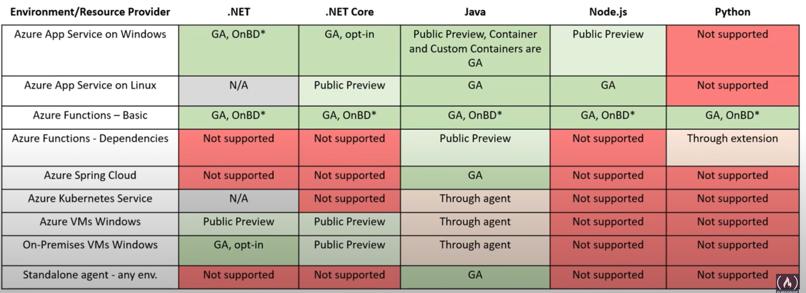

### Microsoft Sentinel 

Microsoft Sentinel is a scalable, cloud-native:

* **Security information event management (SIEM)**

collecting and analyzing security-related data

* **Security orchestration automated response (SOAR)**

collection of tools that enable an organization to define, standardize, measure, and automate to define, standardize, measure, and automate

Microsoft Sentinel delivers intelligent security analytics and threat intelligence across the enterprise, providing a single solution for:

* Alert Detection
* Threat visibility
* Proactive hunting
* Threat response

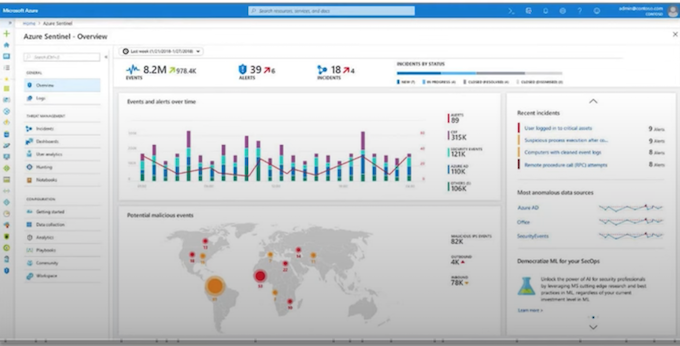

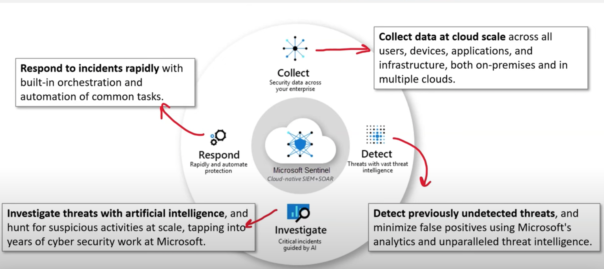

### Microsoft Sentinel - Data Sources

Microsoft Sentinel comes with several connectors for Microsoft solutions:

* Microsoft 365 Defender
* Office 365
* Azure AD (Microsoft Entra ID)
* Microsoft Defender for Identity
* Microsoft Defender for Cloud Apps

**Use common event formats:**

* Syslog
* REST-API
* Windows Event Logs
* Common Event Format (CEF)
* Trusted Automated eXchange of Indicator Information (TAXII)

### Microsoft Sentinel - Azure Monitor Workbooks

From Microsoft Sentinel you can create **Azure Monitor Workbooks**

**Workbooks provide a flexible canvas for data analysis** and the creation of rich visual reports within the Azure portal.

They allow you to tap into multiple data sources from across Azure and combine them into unified interactive experiences.

It tells a story about the performance and availability about your applications and services

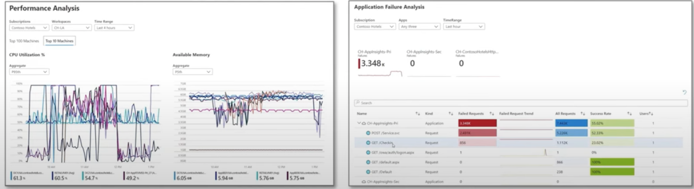

Workbooks are temporary workspaces to define a document-like format with visualization intertwined
to help investigate and discuss performance.

### Microsoft Sentinel - Analytics

Microsoft Sentinel uses analytics to correlate alerts into **incidents**

**Incidents** are groups of related alerts that together create an actionable possible-threat that you can investigate and resolve

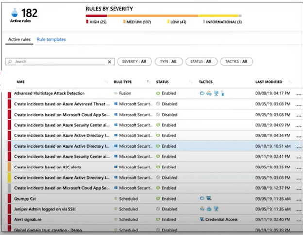

### Microsoft Sentinel - Automation and Orchestration

Microsoft Sentinel's automation and orchestration solution provides a highly-extensible architecture that enables scalable automation as new technologies and threats emerge

Built on the foundation of **Azure Logic Apps**

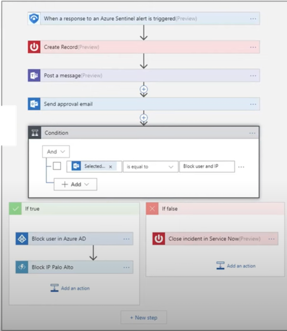

### Microsoft Sentinel - Investigation

Microsoft Sentinel has deep investigation tools that help you to understand the scope and find
the root cause of a potential security threat.

You can choose an entity on the interactive graph to ask interesting questions for a specific entity,
and drill down into that entity and its connections to get to the root cause of the threat.

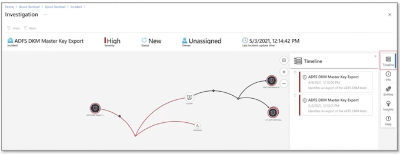

### Microsoft Sentinel - Hunting

Microsoft Sentinel's powerful hunting **search-and-query tools, based on the MITRE framework**, enable you to proactively hunt for security threats across your organization's  data sources, before an alert is triggered

After you discover which hunting query provides high-value insights into possible attacks, you can also create **custom detection rules** based on your query, and surface those insights as alerts to your security incident responders.

While hunting, you can create bookmarks for interesting events, enabling you to return to them later, share them with others, and group them with other correlating events to create a compelling incident for investigation.

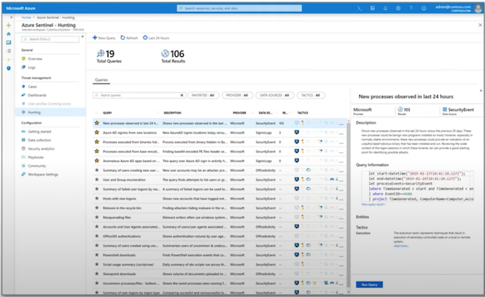

### Microsoft Sentinel - Pricing

Microsoft Sentinel has two different pricing models

**Capacity Reservations:**

Billed a fixed fee based on the selected tier, enabling a predictable total cost for Microsoft Sentinel.

**Pay-As-You-Go:**

Billed per gigabyte (GB) for the volume of data ingested for analysis in Microsoft Sentinel and stored in the Azure Monitor Log Analytics workspace.