# Az305 - Summary 2

##  Azure Monitor 

### Introduction to Azure Monitor

Azure Monitor comprehensive solution **for collecting, analyzing, and acting on telemetry** from your cloud and on-premises environments

**Key Features:**

* **Visual Dashboards**: A visual representation of your data.
* **Smart Alerts**: Intelligent notifications based on specific conditions.
* **Automated Actions**: Set automation based on certain triggers.
* **Log Monitoring**: Track and analyze event logs.

Many Azure services by default are already sending telemetry data to Azure Monitor


### The Pillars of Observability

**What is Observability?**

The ability to measure and understand how internal systems work in order to answer questions regarding performance, tolerance, security and faults with a system / application.

To obtain observability you need to use **Metrics, Logs and Traces.**

You have to use them together, using them in isolate does not gain you observability

**Metrics**

A number that is measured over period of time e.g., If we measured the CPU usage and aggerated it over a period of time we could have an **Average CPU metric**

**Logs**

A text file where each line contains event data about what happened at a certain time

**Traces**

**A historv of request that is travels through multiple Apps/services** so we can pinpoint performance or failure.


### Anatomy of Azure Monitor

The **sources of common monitoring data** to populate datastores Order by (Highest to Lowest)

> The functions that Azure monitor can performed


The two fundamental data stores are **Metrics** and **Logs**

### Azure Monitor - Sources

**Application Code**: Performance and functionality of application and code.
Performance traces, application logs, and user telemetry.

You need to install **Instrumentation Package** to collect data for Application Insights

* **Metrics** Descriptive data regarding your application's performance, operation, and custom metrics.

* **Availability Tests** responsiveness of your application from different locations on the public Internet

* **Logs** store operational data about our application, including page views, application requests, exceptions, and traces.


	* Send application data to **Azure Storage** for archiving.
	* Details of **availability test** stored


### Azure Monitor - Sources

* **Log Analytics** Agent is installed for comprehensive monitoring.
* **Dependency Agent** collects discovered data about processes running on the virtual machine and external process dependencies.
* Agents can be installed on the OS for VMs running in Azure, On-premises or other cloud providers.


**Diagnostics Extension** collect performance counters and store them in **Metrics**


**Application Insights Logs**

collect logs and performance counters from the compute resource supporting your application to be analyzed with other application data

* **Azure diagnostics extension** always writes to an **Azure Storage** account.
* Azure Monitor for VMs uses the Log Analytics agent to store heath state information in a custom location.

**Diagnostics Extension** can also stream data to other locations using Event Hubs

* **Resource Logs**

**Resource Logs** provide insights into the internal operation of an Azure resource and are automatically created. However, you must create a **diagnostic setting** to specify a destination for each resource

* **Metrics** : **Platform metrics** will write to the **Azure Monitor metrics database** with no configuration.

	* **Metrics Explorer**: Access platform metrics from **Metrics Explorer**.

* **Logs**: Copy platform metrics to **Logs**
	*  **Log Analytics**: Trending and other analysis
using Log Analytics

* **Azure Storage**： Send resource logs to **Azure Storage** for archiving.

* **Azure Event Hub**： Stream metrics to other locations using **Event Hubs**

**Resource Logs** provide insights into the internal operation of an Azure resource and are automatically created. However, you must create a **diagnostic setting** to specify a destination for each resource.

### Azure Monitor - Sources

For resources that cannot be monitored using the other data sources, write this data to either
Metrics or Logs using an **Azure Monitor API**


This will allow you to collect log data from any **REST** client and store it in Log 

Analytics and the Azure Monitor metrics database.


### Azure Monitor - Data Stores

Azure Monitor collects **two fundamental types** of data from sources : **Logs and Metrics**

Azure Monitor collects two fundamental types of data from sources: **Logs and Metrics**

#### **Azure Monitor Logs**

* collects and organizes log and performance data from monitored resources
* **Data Consolidation:** Logs can be pulled from diverse sources such as platform logs from Azure services, log and performance，data from agents on virtual machines, and usage and performance data from applications.
* **Workspaces:** All these logs are organized into workspaces, providing a centralized repository for in-depth analysis.
* **Query Language**: Azure Monitor Logs offers a sophisticated query language, which can quickly analyze millions of records.
* **Log Analytics**: You can interactively work with log queries and their results using **Log Analytics**

#### **Azure Monitor Metrics**

* collects numeric data from monitored resources **into a time series database**.
* **Numeric Data:** Metrics are numerical values captured at regular intervals. They are a snapshot that describes a particular aspect of a system at a specific moment in time.
* **Lightweight**: Metrics are designed to be lightweight, allowing for near real-time data analysis. This makes them particularly useful for alerting and the rapid detection of issues.
* **Metrics Explorer:** The **Metrics Explorer** tool allows for interactive analysis of metric data.

### Azure Monitor Logs

**Data retention and archive policies**

In Azure Monitor Logs, you can control how long your log data stays stored.

By default, in the Azure portal, you can set this retention time anywhere from **30 to 730 days**
for the whole workspace.

You can also specify different storage durations for certain **tables** within your workspace,
letting you manage different types of data as needed.

This gives you the flexibility to meet **an business or regulatory rules** about data storage.

To tweak these retention settings, you have to be on the **paid tier** of Azure Monitor Logs.


**To set retention and archive policy by table:**

1. Navigate to the Azure portal and go to the Log Analytics workspace where the data is stored
2. Under the "Settings" section, select "Usage and estimated costs"
3. Then, select **"Data Retention"**


4.In the data retention blade, you can modify the retention period for each for the list of table. By default, it is set to **31 days, but you can extend it up to 730 days.**

5.For archiving data, you can use **Azure Data Explorer**, which lets you retain data beyond the 2-year limit, and gives you a highly-scalable analytics service.

#### **Log Analytics**

**Log Analytics** is a tool in the Azure portal used **to edit and run log queries** with data in **Azure Monitor Logs.**

* Log Analytics processes data from various sources and transforms it into actionable insights.
* It ingests data from **Azure Monitor, Windows, and Linux agents, Azure services, and other sources.**
* Once the data is collected, you can use Log Analytics query language to retrieve, consolidate, and analyze the data.


**Log Analytics** uses a query language called **KQL**

#### **Benefits**

1. **Centralized Log Management**: Collect and analyze data from multiple sources, both on-
premises and in the cloud, in a centralized location.
2. **Powerful Analytics:** Utilize the Kusto Query Language (KQL) to run advanced analytics on
large amounts of fast-streaming data in real time.
3. **Custom Dashboards**: Create custom dashboards and visualizations to display real-time
data and trends.
4. **Integration**: Seamless integration with other Azure services and Microsoft solutions, such
as Power Bl and Azure Automation.
5. **Alerting**: Set up alerts based on specific criteria to proactively identify and respond to
potential issues before they affect your users.

### Log Analytics Workspaces

**Log Analytics workspace** is a unique environment for Azure Monitor log data

Each **workspace** has its own data repository and configuration, and data sources and solutions are configured to store their data in a particular **workspace**


### Log Analytics agent

The Log Analytics agent is a lightweight agent that can be installed on **Windows** and **Linux**
machines to collect and send log data to **Azure Monitor.**

The Log Analytics agent is a lightweight agent that can be installed on **Windows and Linux
machines to collect and send log data to Azure Monitor**.

The agent can collect logs from various sources, including **Windows event logs, custom logs, performance counters, and Syslog.**

It supports both agent-based and agentless data collection and can be configured to collect data from on-premises and cloud-based environments.


### Log Analytics agent

The Log Analytics agent is set up to monitor certain **Windows event logs** like Security, System, or Application logs

The data from these logs is then gathered and sent to **Log Analytics** for analysis using queries and visualizations.

The Log Analytics agent is set up to monitor **Syslog** servers or network devices.

It collects data from these sources and sends it to Log Analytics, allowing for detailed analysis and troubleshooting.


Both methods for collecting log data allow for centralized management and analysis of log data from multiple sources, **which can help to improve visibility and streamline troubleshooting and issue resolution.**

## Application Insights

**Application Insights is an Application Performance Management (APM)** service
It is a sub-service of Azure Monitor.

### What is an APM?

Monitoring and management of **performance and availability of software apps**. APM strives to detect and diagnose complex application performance problems to maintain an expected level of service.

* **Automatic Detection of Performance Anomalies:** Application Insights automatically identifies performance anomalies in your system.
*  **Powerful Analytics Tools**: It comes with robust analytics tools to help you diagnose issues and understand what users do with your app.
* **Continuous Improvement**: It is designed to help you continuously improve performance and
* usability of your applications.
* **Platform Agnostic**: It works for apps on .NET, Node.js, Java, and Python, hosted on-premises, hybrid, or any public cloud.
* **DevOps Integration**: It can be integrated into your DevOps process.
* **Mobile App Monitoring:** It can monitor and analyze telemetry from mobile apps by integrating with Visual Studio App Center.

### Application Insights

To use Application Insights, **you need to instrument your application.**

This involves installing the **instrument package (SDK),** or enabling Application Insights using the **Application Insights Agents**, where supported.


**Apps can be instrumented from anywhere**

When you set up Application Insights monitoring for your web app, you create an Application Insights resource in Microsoft Azure 

You open this resource in the Azure portal to see and analyze the telemetry collected from your app. 

The resource is identified by an instrumentation key (ikey)

#### **What does Application Insights Monitor?**

* Request rates, response times, and failure rates
* Dependency rates, response times, and failure rates
* Exceptions
* Page views and load performance
* AJAX calls
* User and session counts
* Performance counters
* Host diagnostics
* Diagnostic trace logs
* Custom events and metrics

#### **Where do I see my telemetry?**

* Smart detection and manual alerts
* Application map
* Profiler
* Usage Analysis
* Diagnostic search for instance data
* Metrics Explorer for aggerated data
* Dashboards
* Live Metrics Stream
* Analytics
* Visual Studio
* Snapshot debugger
* Power BI
* REST API
* Continuous Export

### Application Insights - Instrumentation

You Instrument your application by adding the Azure Application Insights SDK and implementing traces.

In the case of a **Node.js** application, you can install the Azure Application Insights SDK using **npm (Node Package Manager) with the following command:**

```
npm install applicationinsights --save
```

```
let appInsights = require("applicationinsights");

// configure what you watn to collect
appInsights.setup("<instrumentation_key>")
	.setAutoDependencyCorrelation(true)
	.setAutoCollectRequests(true)
	.setAutoCollectPerformance(true, true)
	.setAutoCollectExceptions(true)
	.setAutoCollectDependencies(true)
	.setAutoCollectConsole(true)
	.setUseDiskRetryCaching(true)
	.setSendLiveMetrics(false)
	.setDistributedTracingMode(
	appInsights.DistributedTracingModes.AI
).start();
```


**Azure supports the following languages:**

.NET, Java, Python, Node.js, JavaScript

```
client.trackEvent({
	name: "my custom event",
	properties: {customProperty: "custom property value"}
});
client.trackException({
	exception: new Error(
	"handled exceptions can be logged with this method")
});
client.trackMetric({name: "custom metric", value: 3});
client.trackTrace({message: "trace message"});
client.trackDependency({
	target:"http://dbname",
	name: "select customers proc",
	data: "SELECT * FROM Customers",
	duration:231,
	resultCode:0,
	success: true,
	dependencyTypeName: "ZSQL"
});
client.trackRequest({
	name: "GET /customers",
	url:"http://myserver/customers",
	duration:309,
	resultCode:200,
	success:true
});
```


#### Application Insights - Auto Instrumentation

**Auto-instrumentation** allows you to enable application monitoring with 

Application Insights without changing your code.


### Microsoft Sentinel 

Microsoft Sentinel is a scalable, cloud-native:

* **Security information event management (SIEM)**

collecting and analyzing security-related data

* **Security orchestration automated response (SOAR)**

collection of tools that enable an organization to define, standardize, measure, and automate to define, standardize, measure, and automate

Microsoft Sentinel delivers intelligent security analytics and threat intelligence across the enterprise, providing a single solution for:

* Alert Detection
* Threat visibility
* Proactive hunting
* Threat response


### Microsoft Sentinel - Data Sources

Microsoft Sentinel comes with several connectors for Microsoft solutions:

* Microsoft 365 Defender
* Office 365
* Azure AD (Microsoft Entra ID)
* Microsoft Defender for Identity
* Microsoft Defender for Cloud Apps

**Use common event formats:**

* Syslog
* REST-API
* Windows Event Logs
* Common Event Format (CEF)
* Trusted Automated eXchange of Indicator Information (TAXII)

### Microsoft Sentinel - Azure Monitor Workbooks

From Microsoft Sentinel you can create **Azure Monitor Workbooks**

**Workbooks provide a flexible canvas for data analysis** and the creation of rich visual reports within the Azure portal.

They allow you to tap into multiple data sources from across Azure and combine them into unified interactive experiences.

It tells a story about the performance and availability about your applications and services


Workbooks are temporary workspaces to define a document-like format with visualization intertwined
to help investigate and discuss performance.

### Microsoft Sentinel - Analytics

Microsoft Sentinel uses analytics to correlate alerts into **incidents**

**Incidents** are groups of related alerts that together create an actionable possible-threat that you can investigate and resolve


### Microsoft Sentinel - Automation and Orchestration

Microsoft Sentinel's automation and orchestration solution provides a highly-extensible architecture that enables scalable automation as new technologies and threats emerge

Built on the foundation of **Azure Logic Apps**


### Microsoft Sentinel - Investigation

Microsoft Sentinel has deep investigation tools that help you to understand the scope and find
the root cause of a potential security threat.

You can choose an entity on the interactive graph to ask interesting questions for a specific entity,
and drill down into that entity and its connections to get to the root cause of the threat.


### Microsoft Sentinel - Hunting

Microsoft Sentinel's powerful hunting **search-and-query tools, based on the MITRE framework**, enable you to proactively hunt for security threats across your organization's  data sources, before an alert is triggered

After you discover which hunting query provides high-value insights into possible attacks, you can also create **custom detection rules** based on your query, and surface those insights as alerts to your security incident responders.

While hunting, you can create bookmarks for interesting events, enabling you to return to them later, share them with others, and group them with other correlating events to create a compelling incident for investigation.


### Microsoft Sentinel - Pricing

Microsoft Sentinel has two different pricing models

**Capacity Reservations:**

Billed a fixed fee based on the selected tier, enabling a predictable total cost for Microsoft Sentinel.

**Pay-As-You-Go:**

Billed per gigabyte (GB) for the volume of data ingested for analysis in Microsoft Sentinel and stored in the Azure Monitor Log Analytics workspace.

## The principle of least privilege

The principle of least privilege is a security principle that states that **users, applications, and services** should be granted only the **<mark>minimum access necessary</mark>** to perform their assigned tasks, and no more. 

In Microsoft Azure, the principle of least privilege is a critical aspect of security that helps prevent unauthorized access, data breaches, and other security incidents.

The principle of least privilege in Azure involves limiting access to Azure resources such as **virtual machines, storage accounts, and databases, as well as Azure services such as Azure Active Directory and Azure Key Vault**.

Azure role-based access control (RBAC) permits administrators to grant roles to users, groups, and apps based on their access levels.

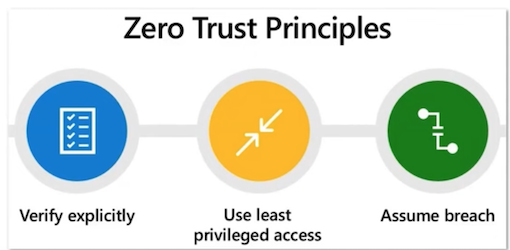

Following the principle of least privilege helps minimize unauthorized access risks and potential harm from compromised credentials, thus reducing the Azure environment's attack surface.

### The principle of least privilege

Following the principle of least privilege can help organizations comply with regulatory requirements and best practices for security.

To implement the principle of least privilege in Azure, administrators should follow these best practices:

1. Assign roles based on the least amount of privilege needed to perform the task.
2. Monitor role assignments and permissions regularly to ensure they align with business requirements.
3. Limit the use of shared accounts and use individual user accounts where possible.
4. Implement **multi-factor authentication (MFA)** to prevent unauthorized access to user accounts.
5. Use **Azure Policy** to enforce compliance with organizational policies and industry regulations.
6. Implement **network security groups (NSGs) and firewalls** to control traffic to and from Azure
resources.
7. Regularly **review access control policies** and adjust as necessary to ensure that they remain effective.

### Azure AD Identity Protection

**Identity Protection** is a feature of Azure AD that let's you to **detect, investigate, remediate**, and **export identity-based risks** for future analysis.

Microsoft analyses 6.5 trillion signals per day to identify and protect customers from threats.

Identity Protection notices:

* Risky Users
* Risky Sign-ins
* Risk Detections

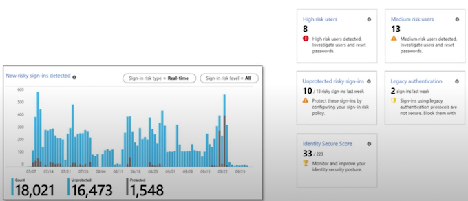

### Identity Protection - Detection and Remediation

Identity Protection identifies for the following risks:

* **Anonymous IP address** - Sign in from an anonymous IP address (e.g., Tor browser, anonymizer VPNs)
* **Atypical travel** - Sign in from an atypical location based on the user's recent sign-ins
* **Malware linked IP address** - Sign in from a malware linked IP address
* **Unfamiliar sign-in properties** - Sign in with properties that haven't been seen recently for the given user
* **Leaked Credentials** - Indicates that the user's valid credentials have been leaked
* **Password spray** - Multiple usernames being attacked using common passwords in a unified, brute-force manner
* **Azure AD threat intelligence** - Microsoft's internal and external threat intelligence sources have identified a known attack pattern
* **New country** - This detection is discovered by Microsoft Defender for Cloud Apps
* **Activity from anonymous IP address** - This detection is discovered by Microsoft Defender for Cloud Apps
* **Suspicious inbox forwarding** - This detection is discovered by Microsoft Defender for Cloud Apps

The **risk signals can trigger remediation efforts** such as requiring users:

Azure AD Multi-Factor Authentication, reset their password using self-service
password reset, or blocking until an administrator takes action

### Identity Protection - Investigation

Identity Protection categorizes risk into three tiers: **low, medium, and high.**

Admins can use key reports for investigations in Identity Protection, **Risky users, Risky sign-ins, Risk detections**

**Risky users**

* Details about detections
* History of all risky sign-ins
* Risk history


**Risky sign-ins**

* Which sign-ins are classified as at risk, confirmed compromised,
* confirmed safe, dismissed, or remediated.
* Real-time and aggregate risk levels with sign-in attempts.
* Detection types triggered
* Conditional Access policies applied
* MFA details
* Device, Application, Location information


**Risk detections**

* Contains filterable data for up to the past 90 days
* Information about each risk detection including type.
* Other risks triggered at the same time
* Sign-in attempt location

**Admin follow up actions:**

* Reset the user password
* Confirm user compromise
* Dismiss user risk
* Block user from signing in
* Investigate further using Azure ATP

## Introduction to Azure Key Vault

**Azure Key Vault** helps you **safeguard cryptographic keys** and **other secrets** used by cloud apps and services.

Azure Key Vault focuses on three things:

**Certificate Management**

Easily provision, manage, and deploy public and private **SSL certificates** for use with Azure and internal connected resources

**Key Management**

Create and control the encryption keys used to encrypt your data

**Secrets Management**

Store and tightly control access to **tokens, passwords, certificates, API keys, and other secrets**

> Certificates contain key pair (key and secret). This is not to be
confused with Key Management and Secrets Management

### HSM and FIPS

An HSM is a Hardware Security Module.

Its a piece of hardware designed to store encryption keys.

#### Federal Information Processing Standard (FIPS)

US and Canadian government standard that specifies the security requirements for
cryptographic modules that protect sensitive information.

HSM's that are **multi-tenant are FIPS 140-2 Level 2 Compliant**(multiple customers virtually isolated on an HSM)

HSM's that are **single-tenant are FIPS 140-2 Level 3 Compliant** (single customer on a dedicated HSM)


### Azure Key Vault - Vault

**A Vault** stores secrets and keys, that can be safeguarded by software or **FIPS 140-2 Level 2 validated HSMs**

Azure Key Vaults provides two types of containers:

* **Vaults** - supports, software and HSM backed keys
* **HSM pools** - only supports HM backed keys

To activate your HSM, you will need to:

* provide a minimum of three RSA key-pairs (up to a maximum of 10)
* specify the minimum number of keys required to decrypt the security domain (called a quorum)

> You do not choose the container on creation; you just choose between **Standard and Premium.**
> 
> 
> When you choose Premium and create enough RSA key pairs you will begin to use HSM pools.

### Azure Key Vault - Recovery Options


* **Soft Delete** allows you to recover or permanently delete a key vault and secrets for the duration of the retention period. (It's enabled by default on creation)
* **Mandatory retention period** and prevents the permanent deletion of key vaults or secrets prior to the retention period elapsing
* **Purge protection** when enabled, prevents secrets to be purged by users or by Microsoft.

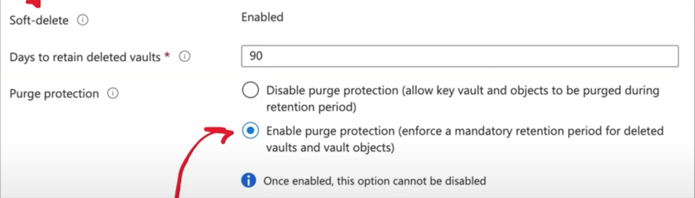

### Azure Key Vault - Pricing

**Azure has two pricing tiers:**

* **Standard**
* **Premium** (Allows for both software and HSM-protected keys)

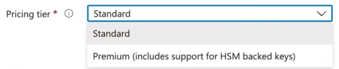

### Azure Key Vault - Double Encryption

Microsoft has a two layered approach each for **Data At-Rest and Data In-Transit**

**Data-at-Rest**

1. Disk encryption using customer-managed keys
2. Infrastructure encryption using platform-managed keys

**Data-in-Transit**

1. Transit encryption using Transport Layer Security (TLS) 1.2
2. Additional layer of encryption provided at the infrastructure layer

### Azure Key Vault - Keys

When creating a key, there are three options:

* **Generate** - Azure will generate the key
* **Import** - Import an existing RSA key
* **Restore Backup** - Restore a key from 

For keys generated by Azure, you can use either RSA or EC.

**RSA (Rivest-Shamir-Adleman): 2048.3072,4096**

**EC (Elliptic-curve cryptography): P-256. P-384.P-521.p-256K**

For keys generated by Azure, you can set an **Activation and Expiration date**

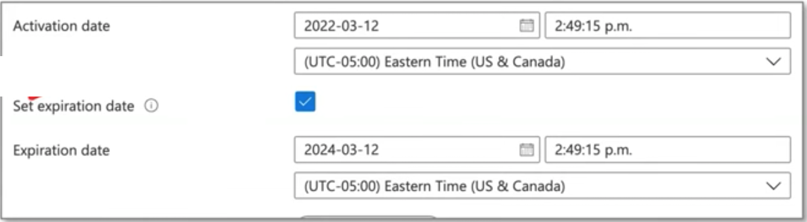

* You can create **new versions** of keys
* You can download backups of keys. Backups can onlv be restored within the same Azure subscription and within Azure Kev Vault

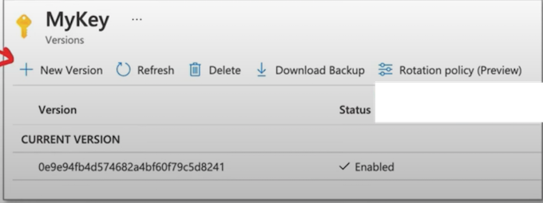

### Azure Key Vault - Keys

When you have a **Premium Vault**, you'll key options for HSM:

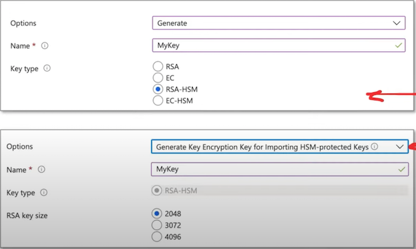

* **Generate** an RSA or EC for HSM
* **Import** an RSA key for HSM

### Azure Key Vault - Keys

**Microsoft Managed Key (MMK)** are keys managed by Microsoft. They do not appear in your vault and in most cases are used by default for many azure services.

**Customer Managed Key (CMK)** are keys you create in Azure Key Vault.
You need to **select a key from a vault** for various services.


Sometimes "customer managed" means that the customer has imported cryptographic material.

Generated or imported keys are considered CMK in Azure.

In order to use a key, an Azure service needs an identity (within Azure AD) **for permission to access the key from the vault**

**Infrastructure encryption** is sometimes an option.

* By default, Azure encrypts storage account data at rest.
* Infrastructure encryption adds a second layer of encryption to your storage account's data.

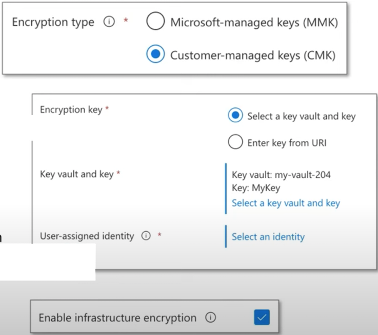

### Azure Key Vault - Secrets

**Azure Key Vault Secrets** provides **secure storage of generic secrets**,

such as **passwords and database connection strings**.

* Key Vault APls accept and return secret values as strings
* Internally, Key Vault stores and manages secrets:

	* As sequences of octets (8-bit bytes),
	* Each secret with a maximum size of 25k bytes

* Key Vault service doesn't provide semantics for secrets
	* **accepts the data, encrypts it, stores it, and returns a secret identifier ("id").**

	
> For highly sensitive data, **clients should consider additional layers of protection for data**. For example, encrypting your data using a separate protection key before storing it in the Key Vault.

Key Vault also supports a **contentType** field for secrets

* Clients may specify the content type of a secret to assist in interpreting the secret data when it's retrieved
* maximum length of this field is 255 characters

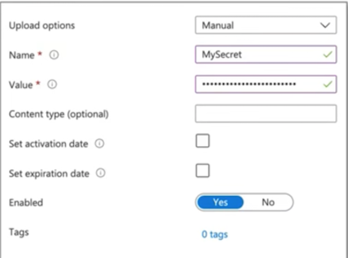

### Azure Key Vault - Secrets

Every secret stored in your Key Vault is encrypted.

Key Vault encrypts secrets at rest with a hierarchy of encryption keys

* All keys in that hierarchy are protected by modules that are FIPS 140-2 compliant
* The encryption leaf key is unique to each Key Vault, while the root key is unique to the entire security world.
* Protection level may vary between regions
	* E.g., China uses FIPS 140-2 Level 1, and all other regions use Level 2 or higher

**Secret Attributes**

* **exp** - expiration time, after which the secret data should not be retrieved
* **Nbf** - not before (default value is **now**） the time before which the secret data should not be retrieved
* **enabled** - whether the secret data can be retrieved, (default true)

There are also read-only attributes for **created and update**

In order to access secrets within your application code, you can would use the Azure SDK e.g., .NET example

```
using Azure.Identity;
using Azure.Security.KeyVault.Secrets;
using Azure.Core;

SecretClientOptions options = new SecretClientOptions(){
	Retry = {
	Delay= TimeSpan.FromSeconds(2),
	MaxDelay = TimeSpan.FromSeconds(16),
	MaxRetries = 5,
	Mode = RetryMode.Exponential
	},
};

var uri = new Uri("https://<your-unique-key-vault-name>.vault.azure.net/");
var creds = new DefaultAzureCredential();
var client = new SecretClient(uri, options);

KeyVaultSecret secret = client.GetSecret("<mySecret>");

string secretValue = secret.Value;
```

Or you can use the Azure CLI

```
az keyvault secret show [--id]
							[--name]
							[--subscription]
							[--vault-name]
							[--version]
```

### X.509 Certificates

**What is Public key infrastructure (PKI)?**

PKI is a set of roles, policies, hardware, software and procedures needed to create, manage,
distribute, use, store and revoke digital certificates and manage public-key encryption.

**What is an X.509 certificate?**

A standard defined by the **International Telecommunication Union (ITU)** for **public key certifications**.
X.509 certificates are used in many Internet protocols including:

* SSL/TLS and HTTPS
* Signed and encrypted email
* Code Signing and Document Signing

**A certificate contains**

* An identity - hostname, organization or individual
* A public key - RSA, DSA, ECDA, etc.

**What is a Certificate Authority (CA)?**

An entity that issues digital certificates

A CA acts as a trusted third party-trusted both by the subject (owner) of the certificate and by the party relying upon the certificate

**Intermediate Certificate Authority (ICA)**

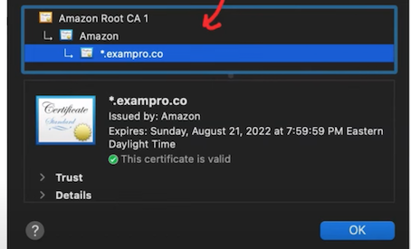

* Intermediate Certificates are signed by the root private key and act as entities that can issue certificates
* They protect the root certificate because the root certificate does not have to sign every issued certificate

**End Entity Certificate**

* A certificate issued by the ICA used by the end entity
* The entity in the case is an SSL certificate for a website

### X.509 Certificates - Certificate Format

A certificate contains a metadata about:

* **Version Number**: The version of the X.509 standard.
* **Serial Number**: A unique serial number assigned to the certificate by the Certificate Authority (CA).
* **Signature Algorithm ID**: The algorithm used to sign the certificate, e.g., RSA or DSA.
* **Issuer**: The name of the Certificate Authority that issued this certificate.
* **Validity Period**: The start and end dates during which the certificate is valid.
* **Subject**: The identifier for the individual or organization to whom the certificate was
* issued.
* **Subject Public Key**: The public key that is authenticated by this certificate. 
* sThis field also names the algorithm used for public-key generation.
* **Issuer Unique Identifier**: Allows multiple CAs to operate as a single logical CA.
* **Subject Unique Identifier**: Allows multiple certificate holders to act as a single logical entity.
* **Extensions**: Allows a CA to associate additional private information with a certificate.

> All the metadata publicly readable (anyone can view it)


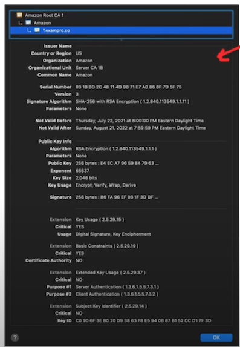


