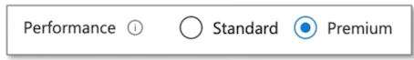

# Az305 - Summary 3

## 1 Azure AD Connect

**Azure AD Connect** is a tool provided by Microsoft that enables organizations to **synchronize on-premises Active Directory with Azure Active Directory (Azure AD).**

**This synchronization enables organizations to extend their on-premises identities and security policies to the cloud and enable seamless access to cloud-based applications.**


 

### 1-1 Azure AD Connect

Azure AD Connect has the following features:

**Password Hash Synchronization** - This feature syncs user password hashes from on-premises AD to Azure AD, enabling the same sign-in method for both.

**Pass-through Authentication** - This allows users to maintain the **same password across on-premises and cloud platforms without needing a separate federated environment setup**.

**Federation Integration** - An optional feature, it facilitates a hybrid setup using on-premises AD FS
infrastructure and provides management tools like certificate renewal and server deployment.

**Synchronization** - This is responsible for creating and aligning users, groups, and other objects between on-premises and cloud, ensuring identity information matches across both.

**Health Monitoring** - Azure AD Connect Health
offers robust activity monitoring, with a dedicated
Azure portal section to review this data.


### 1-2 Azure AD Connect - Install

Here are the steps for installing, configuring, and synchronizing on-premises Active
Directory with Azure AD using Azure AD Connect:

1.**Install Azure AD Connect: Install Azure AD Connect** on a server connected to

**both on-premises AD and Azure AD.**

2.**Configure Azure AD Connect**: Use the wizard
to set up synchronization settings, source/target
directories, and sync frequency.

3.Synchronize Directories: Azure AD Connect
syncs on-premises AD with Azure AD, replicating
changes from source to target.

4.**Monitor and Manage:** Continuously monitor and manage the synchronization process to ensure accuracy and meet business needs.


### 1-3 Azure AD Application Proxy(Entra Application Proxy)

**Azure AD Application Proxy**

Azure AD Application Proxy is a service provided by Microsoft Azure that allows organizations to provide **remote access to their on-premises web applications.**

Organizations can publish their on-premises applications to the cloud, providing secure remote access for their users.

The service allows organizations to use their existing
on-premises infrastructure and application architecture
while leveraging the benefits of the cloud.


It provides advanced security features such as **multifactor authentication** and **conditional access policies**, ensuring that only authorized users can access the applications.

The Azure AD Application Proxy service consists of two main components:

**1.Azure AD Application Proxy Connector**: A lightweight agent that is installed on a server
within the organization's **on-premises environment**.

The Connector establishes a secure outbound connection to the Azure AD Application Proxy service, which enables communication between the on-premises application and
the Azure AD service.

**2.Azure AD Application Proxy Service:** A cloud-based service that manages the **authentication and authorization** of users who access the on-premises web applications through the **Application Proxy Connector**.

It also routes traffic to the appropriate backend servers and enforces policies set by the organization.

### 1-4 Azure AD Application Proxy Architecture


1. **User Access**: The user accesses the application and gets redirected to Azure AD for sign-in. Any set Conditional Access
policies are checked.
2. **Token Issuance: After successful sign-in, Azure AD sends a token to the user's device**.
3. **Token Interpretation:** The client sends this token to Application Proxy which extracts the **user principal name(UP) and security principalname (SPN)**.

4. **Request Forwarding**: The application Proxy forwards the request to the connector installed **on-premises**.
5. **Additional Authentication**: Optionally, the connector may perform additional **authentication** and then sends the request to the on-premises application.
6. **Server Response**: The application's response is sent back through the connector to the **Application Proxy service**.
7. **Response Delivery**: Finally, the Application Proxy service delivers the response to the **user's device.**

### 1-5 Azure AD Application Proxy - Use cases


* **Remote Access**: Azure AD Application Proxy is commonly used to provide secure remote access to on-premise applications. Employees working from home or other remote locations can securely access their internal applications just as if they were in the office.
* **Single Sign-On (SSO)**: Application Proxy can integrate with Azure AD to provide Single Sign-On capabilities. This allows users to authenticate once and then access multiple applications without needing to sign in again.
* **Conditional Access**: With Application Proxy, you can leverage **Azure AD's Conditional Access** policies for your on-premise applications. This provides granular control over access based on user, location, device status, and other factors.
* **Legacy Application Modernization**: Application Proxy can help organizations expose legacy on-premise applications to the internet in a secure manner, without changing the application code.This can be a key part of a strategy to modernize legacy applications.
* **Scalability and Performance**: Azure AD Application Proxy scales automatically to meet your organization's usage patterns and provides a **global reach** without needing to open additional firewall ports. This can help improve the performance and availability of your applications.

## 2 Storage Accounts

### 2-1 Introduction to Storage Accounts

**Azure Storage offers several types of storage accounts.**


Azure Storage offers **several types of storage accounts**.

Each with **different features and their own pricing models**

* **Standard general-purpose v1 (legacy)**
* **Standard general-purpose v2**
* **BlobStorage (legacy)**
* **BlockBlobStorage**
* **FileStorage**

Storage accounts vary with the following features:

* **Supported Services** (What can I put in this storage account?)

Blob, File, Queue, Table, **Disk**, and Data Lake Gen2

* **Performance Tiers** (How fast will my **read and writes** be?)

Standard and Premium

* Access Tiers (How often do I need quick access to files?)

**Hot, Cool, Archive**

* Replication (How many redundant copies should be made and where?)

**LRS, GRS, RA-GRS, ZRS, GZRS, RA-GZRS**

* **Deployment model**(Who should deploy the supported services?)

**Resource Manager, Classic**


### 2-2 Core Storage Service

**Azure has 5 core storage services**


**Azure Blob**

* A massively scalable object store for text and binary data.
* Also includes support for big data analytics through Data Lake Storage Gen2

**Azure Files**

Managed file shares for cloud or on-premises deployments

**Azure Queues**

A **messaging store** for reliable messaging between application components

**Azure Tables**

A **NoSQL store** for schema-less storage of structured data.

**Azure Disks**

**Block-level storage** volumes for Azure VMs


### 2-3 Azure Blob storage （LRS, GRS, RA-GRS) 

Blob storage is an **object-store** that is optimized for **storing massive amounts of unstructured data**.


Unstructured data is data that doesn't adhere to a particular data model or definition, such as text or binary data.


**Storage Account**

A unique namespace in Azure for your data

**http://mystorageaccount.blob.core.windows.net**

**Containers**

<mark>Similar to a folder in a file system</mark>

**Blobs**

The actual data being stored

### 2-4 Azure Blob storage

Azure Storage supports 3 types of blobs:

#### **1. Block blobs**

* store text and binary data
* made up of blocks of data that can be managed individually
* store up to about 4.75 TiB of data

#### **2. Append blobs**

* Optimized for append operations
* ideal for scenarios such as logging data from virtual machine

#### **3. Page blobs**

* store random access files up to 8 TB in size.
* **store virtual hard drive (VHD) files and serve as disks for Azure virtual machine**

### 2-5 Azure Blob storage

There are **multiple ways** to move data into Azure Blob Storage

* **AzCopy** Easy-to-use command-line tool for Windows and Linux

* **Azure Storage Data Movement library** .NET library (uses AzCopy underneath)

* **Azure Data Factory** An ETL service by Azure

* **Blobfuse**: **<mark>Virtual file system driver. Access data through Linux file system**</mark>

* **Azure Data Box** A robust, physical device designed to transport data to Azure securely.

* **Azure Import/Export service** A service where you ship your physical disks for data transfer onto Azure

### 2-6 Performance Tiers (Blob Storage)

There are **2 types** of performance tiers for storage accounts: **Standard and Premium**



**IOPS** stands for Input/Output Operations Per Second

The higher the IOPS, the faster a drive can read and write

#### **Premium Performance**

* <mark>Stored on Solid State Drives (**SSDs**)</mark>
* Optimize for low-latency
* Higher throughput
* Use cases:

<mark>An SSD has **no moving parts** and data is distributed randomly. This is why it can read and write so fast.</mark>

#### Standard Performance

* **Stored on Hard Disk Drives (HDDs)**
* Varied performance based on access tier (Hot, Cool, Archive)
* Use cases:
	* Backup and disaster recovery
	* Media content
	* Bulk data processing

<mark>An HDD **has moving parts**, an arm that needs to read and write data sequential to a disk. It is very good a writing or reading large amounts of data that is close together</mark>

#### Access Tiers (Blob Storage)

There are **3 types** of access tiers for **Standard storage: Cool, Hot and Archive**


**Hot**

* Data that's **accessed frequently**.
* Highest storage cost, lowest access cost

* **Use Case**

	* Data that's in active use or expected to be accessed frequently.
	* Data that's staged for processing and eventual migration to the cool access tier

**Cool**

* Data that's **infrequently accessed** and stored for at least **30 days.**
* Lower storage cost, higher access cost

* **Use Case**

	* Short-term backup and disaster recovery datasets
	* Older media content not viewed frequently anymore but is expected to be available immediately when accessed
	* Large data sets that need to be stored cost effectively while more data is being gathered for future processing.

**Archive**

* Data that's **rarely accessed** and stored for at least **180 days**
* Lowest storage cost, highest access cost

* **Use Case**

	* Long-term backup, secondary backup, and archival datasets
	* Original (raw) data that must be preserved, even after it has been processed into final usable form.
* Compliance and archival data that needs to be stored for a long time and is 	hardly ever accessed.

### 2-7 Access Tiers (Blob Storage)

**Account Level Tiering**

Any blob that doesn't have an explicitly assigned tier infers the tier from the Storage Account access tier setting.

**Blob-Level Tiering**

* You can upload a blob to the tier of your choice.
* Changing tiers happens instantly with the exception from moving out of archive


<mark>**Rehydrating a Blob**</mark>

When moving a blob out of archive into another tier it can take several hours. This is known as "**rehydrating**"

**Blob Lifecycle Management**

* You can create rule-based policies to transition data to different tiers
* E.g., After 30 days move to cool storage


When a blob is uploaded or **moved to another tier**
It's charged at the new tier's rate **immediately** upon tier change.


When moving **from a** **cooler tier**:

* <mark>The operation is billed as a **write operation** to the destination tier.</mark>
* Where the write operation (per 10,000) and data write (per GB) charges of the destination tier apply.


When moving **from a** **hotter tier**

* The operation is billed as a read from the source tier
* Where the **read operation** (per 10,000) and data retrieval (per GB) charges of the source tier apply 
* Early deletion charges for any blob moved out of the cool or archive tier may apply as well


**Cool and archive early deletion**

Any blob that is moved into the cool tier (GPv2 accounts only) is subject to a cool early deletion period of 30 days.

Any blob that is moved into the archive tier is subject to an archive early deletion period of 180 days. This charge is prorated.

### 2-8 Replication and Data Redundancy

When you create a Storage Account, You need to choose a **Replication Type**


The greater level of **redundancy**, the more expensive the cost of replication

Replication stores multiple copies of your data so that it is **protected from:**

* Planned events
* Transient hardware failures
* Network or power outages
* Massive natural disasters

**$** : **Primary Region Redundancy**

* Locally-redundant Storage (LRS)
* Zone-redundant storage (ZRS)

> Disaster Recovery and Failovers


**`$$`** : **Secondary Region Redundancy**

* Geo-redundant Storage (GRS)
* Geo-zone-redundant storage (GZRS)

> Disaster Recover and Failovers

**`$$$`**  **Secondary Region Redundancy with Read Access**

* Read-access geo-redundant Storage (RA-GRS)
* Read-access geo-zone-redundant storage (RA-GZRS)

> Read Replicas

### 2-9 Replication and Data Redundancy

#### **Redundancy in the Primary Region**

* Data is replicated **3 times** in the primary region
* There are **two options** for storing in the primary region

**Locally-redundant Storage (LRS)**

* Copies data synchronously in primary region
* 99 999999999% (11 nines) durability
* Cheapest option

**Zone-redundant storage (ZRS)**

* Copies data synchronously **across 3 As** in primary region
* 99.9999999999% (12 9's) durability


#### **Redundancy in the Secondary Region**

* Replicate to a secondary region in case of primary regional disaster
* The secondary region is determined based on your primary's pair region
* Secondary region isn't available for read or write access (except in event of failover)

**Geo-redundant Storage (GRS)**

* Copies data **synchronously** in _primary region_
* Copies data **aynchronously** to **another region**
* 99.99999999999999% (16 9's) of durability

**Geo-zone-redundant storage (GZRS)**

* Copies data **synchronously across 3 AZs** in a physical region
* Copies data **aynchronously** to another region
* 99.99999999999999% (16 9's) of durability


**Redundancy in the Secondary Region with Read Access**

* Data is replicated synchronously to primary region
* Your data will be "in-sync" with your primary and you'll have **read access**.

**Read-Access Geo-redundant Storage (RA-GRS)**

* Copies data **synchronously** in primary region
* Copies data **synchronously** to another region
* 99.99999999999999% (16 9's) of durability

**Read-Access Geo-zone-redundant storage (RA-GZRS)**

* Copies data **synchronously across 3 AZs** in a physical region
* Copies data **synchronously** to another region
* 99.99999999999999% (16 9's) of durability


### 2-10 AZCopy

**AZCopy is a command-line utility** that you can use to copy blobs or files to or from a storage account.

**1.Its an executable file you download**

```
Download AzCopy

First, download the AzCopy V10 executable executable file, so there s nothing to install
• Windows 64-bit (zio)
• Windows 32-bit (zip)
• Linux x86-64 (tar)
• macOS (in)
```

**2.You will need to have the level of authorization via attached roles:**

To download

* Storage Blob Data Reader

To upload:

* Storage Blob Data Contributor
* Storage Blob Data Owner


3.You gain access either via:

* Azure Active Directory (AD)
* Shared Access Signature (SAS)

```
azcopy login
```

4.Use the Copy command to **upload and download**

```
azcopy copy
'C: \StarTrek\jodri.txt' \
'https://enterprise.blob.core.windows.net/mycontainer/jodri.txt'
```


```
azcopy copy
	'https://enterprise.blob.core.windows.net/mycontainer/jodri.txt' \
'C: \StarTrek\jodri.txt'
```

### 2-11 Lifecycle Management

**Azure Storage lifecycle management offers a rule-based policy** that you can use to transition blob data to the appropriate access tiers or to expire data at the end of the data lifecycle.

With the **lifecycle management policy**, you can:

* Transition blobs from cool to hot immediately when they are accessed to optimize for performance.
* Transition blobs, blob versions, and blob snapshots to a **cooler storage tier** if the objects have not been accessed or modified for **a period of time** to optimize for cost.
* Delete blobs, blob versions, and blob snapshots at the **end** of their lifecycles.
* Define **rules** to be run **once** per day at the storage account level.
* Apply rules to containers or to a subset of blobs, using name **prefixes or blob index** tags as filters.


### 2-12 Lifecycle Management

To manage the lifecycle of our Blobs inside containers, a **lifecycle management rule** must be created.

From Azure Storage Account go to **Lifecycle Management**, under Blob Service, and Add a **rule**.


You may apply this rule to **all** blobs inside the **storage account or filter** the blobs to have this rule applied in this storage account.


**Lifecucle Management**

You can **specify** how many days those blobs will be **moved** to other access tiers if they are **not modified**.


