# Az305 - Summary 4

## 1 Azure SQL

### 1-1 Azure SQL Offerings

**SQL Server on Azure VMs**

* Provides SQL Server and OS-level access.
* Supports various SQL Server and OS versions.
* Best for migrations and applications requiring OS interaction.

#### **Managed Instances**

* **Single instance**


	* Gives SQL Server and OS access for robust needs.
	* Supports various SQL and OS versions.
	* Best for isolated SQL workloads needing dedicated resources.

* **Instance pool**

	* Enables pre-provisioning of resources for efficient migration.
	* Hosts smaller, cost-effective instances.
	* Suitable for batch migration of smaller databases.


#### **Databases**

* **Single database**

	* Offers hyperscale storage up to 100TB.
	* Features demand-based serverless compute.
	* Best for cloud applications needing a fully managed service.

* **Elastic pool**

	* Enables resource sharing among databases.
	* Simplifies performance management with multiple databases.
	* Best for managing and scaling databases with variable usage patterns.

### 1-2 Azure SQL Database

Azure SQL Database is a fully managed **relational database** service provided by Microsoft Azure.


It is a cloud-based database service that offers a high level of **scalability, availability, and security**.

Azure SQL Database is based on the latest version of Microsoft SQL Server, and it is designed to handle various workloads ranging from small web applications to large enterprise workloads.


Azure SQL Database supports popular relational database engines, such as **SQL Server, MySQL, and
PostgreSQL**, and offers a variety of deployment options, including single database and elastic pool.

<mark>Azure SQL Database offers several benefits that make it a popular choice for businesses looking to migrate their **on-premises databases** to the cloud.</mark>


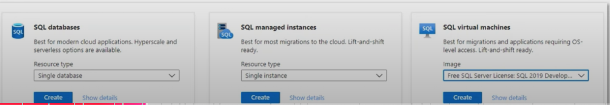

Some of the key **benefits** include:

**Fully Managed Service**: Azure handles administrative tasks like patching and backups, freeing businesses to focus on core tasks.

**High Availability**: Built-in automatic failover and disaster
recovery capabilities ensure data access, even during outages.

**Scalability**: Azure SQL Database easily scales resources according to workload, optimizing costs.

**Security**: Advanced features like threat protection and data encryption ensure secure data storage.

**Integration**: Azure SQL Database integrates seamlessly with other Azure services, supporting the development of modern data-driven applications.

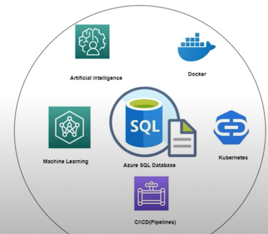

### 1-3 Azure SQL Database service tiers

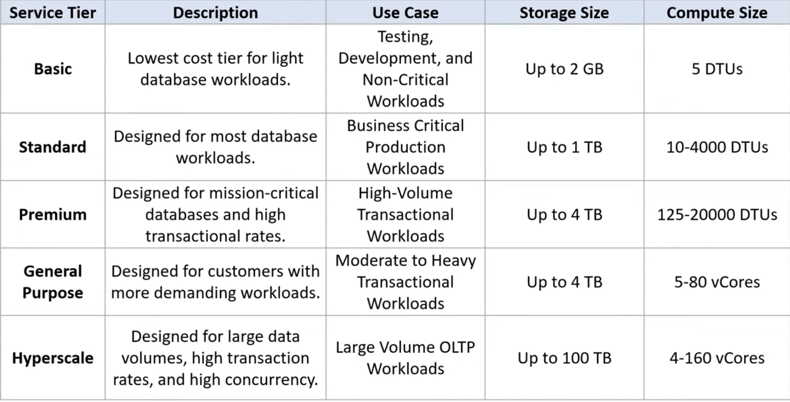

### 1-4 Azure SQL Database elastic pools

Azure SQL Database elastic pools are a simple, cost-effective solution for managing and scaling **multiple databases** that have varying and **unpredictable usage demands.**

The databases in an elastic pool are on a **single** server and share a set number of resources at a set price.

<mark>The concept of "**elastic pools**" refers to a **shared pool of resources - such as CPU, memory, and storage** - allocated to a group of databases. This shared set of resources can be automatically adjusted and distributed among the databases based on their varying demand</mark>.

Azure SQL Database Elastic Pools is ideal for businesses with many databases experiencing varying workloads.

Instead of allocating dedicated resources per database, an elastic pool shares resources across databases for efficient use and cost reduction.

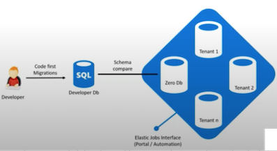

### 1-5 Azure SQL Database elastic pools

**Benefits of Azure SQL Database Elastic Pools:**

1. **Cost-Effective**: Share resources across databases, pay only for what you use.
2. **Performance Management**: Resources are auto-managed across a pool, no manual adjustment required.
3. **Flexibility and Scalability**: Auto-scales to meet demand, handling traffic spikes smoothly.
4. **Simplified Administration**: Easier management with shared resources across databases.

**Use Cases for Azure SQL Database Elastic Pools:**

1. **SaaS Providers**: Manage varying customer database activity cost-effectively.
2. **Development and Test Environments**: Efficient, less expensive process for regular database setup and teardown.
3. **Businesses with Multiple Apps**: Optimize resource usage and cost by sharing resources among databases with varying activity.


### 1-6 Azure SQL Managed Instance

Azure SQL Managed Instance is a fully managed database service offered by Microsoft Azure, designed to provide an easy **migration path for SQL Server workloads to Azure.**


* It provides a managed instance of SQL Server in the cloud, allowing you to run your existing applications with minimal changes.

Azure SQL Managed Instance is built on top of the latest SQL Server engine and supports all its features including complex **queries and user-defined functions.**

* It offers various deployment options, including standalone, **automatic failover configurations, and cross-region replication for disaster recovery.**


Azure SQL Managed Instance is ideal for **modernizing** SQL Server workloads, consolidating multiple SQL Server instances, and building **new cloud-native applications.**

Some of the main **benefits** of Azure SQL Managed Instance include:

* **Easy Migration**: Provides a swift, simple migration path for SQL Server workloads to Azure with minimal application changes.
* **Fully Managed**: Microsoft handles maintenance, backups, and updates, allowing focus on applications.
* **High Availability**: Built-in capabilities for automatic failover and disaster recovery ensure constant application availability.
* **Security**: Offers features like data encryption and threat detection for data protection.
* **Performance**: Supports large databases, high transaction rates, and low-latency queries.
* **Integration**: Seamlessly integrates with other Azure services for easy cloud-native application deployment.

### 1-7 Azure SQL Managed Instance service tiers

Azure SQL Managed Instance has **two** service tiers:

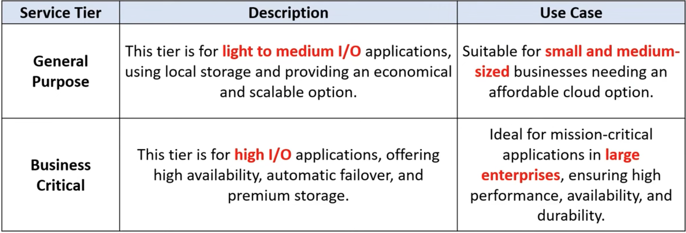

### 1-8 Database Scalability

**Both Azure SQL Database and Azure SQL Managed Instance enable you to scale database resources with minimal downtime, adjusting quickly to workload or traffic changes.**

To dynamically scale database resources, you can use the following options:

**Horizontal scaling**: **This involves adding or removing replicas** to adjust the capacity of your database. Both Azure SQL Database and Azure SQL Managed Instance support horizontal scaling.

**Vertical scaling**: **This involves adjusting the resources allocated to your database, such as CPU or memory**. Both Azure SQL Database and Azure SQL Managed Instance support vertical scaling.

### 1-9 Database Scalability

The exact process for scaling your database resources may vary depending on which service you are using, but in general, the steps are as follows:

1. **Determine** the resource needs of your database, such as the required CPU and memory, and the expected workload or traffic.
2. **Decide** on the scaling option that best meets your needs, whether that be horizontal or vertical scaling.
3. Use the **Azure portal, PowerShell, or the Azure CLI** to configure the scaling settings for your database.
4. **Monitor** the performance of your database to ensure that the scaling changes are providing the expected improvements.

The **difference between Azure SQL Database and Azure SQL Managed Instance** when it comes to dynamically scaling database resources:

* Azure SQL Database offers a wide range of service tiers, each with varying levels of performance and capabilities. 
* These service tiers allow you to choose the level of resources that best meets your needs, and to easily scale up or down as needed.


<mark>Azure SQL Managed Instance offers two service tiers: **General Purpose and Business Critical**.</mark>

These service tiers are designed to meet different needs, with General Purpose offering a balance of price and performance, and 

**Business Critical offering higher performance and availability for mission-critical workloads.**

## 2 Dynamic data masking

**Dynamic Data Masking (DDM)** in Azure is a feature that helps **prevent unauthorized access to sensitive data**. 

It is a security feature of **Azure SQL Database, Azure Synapse Analytics (SQL DW), and SQL Server** that automatically conceals sensitive data in the result set of a query

> For example, if you have a credit card number stored as **'1234-5678-9101-1121'**, **a dynamic data masking rule** might display this as '**XXXX-XXXX-XXXX-1121**' in the query results, thereby hiding the majority of the credit card number.

Dynamic data masking is useful for scenarios where you want to provide a level of data security without needing to modify database operations. It's often used in scenarios like:

1. **Reducing the exposure of sensitive data** in your database when users are running reports or analytics.
2. **Preventing accidental exposure of sensitive data**, especially when data is being used for development or testing purposes.

```
XXX XXX X348
XXX XXX X692
XXX XXX X925
XXX XXX X099
```

### 2-1 Dynamic data masking

**Key features:**

1. **Real-Time Masking**: Data is masked in real-time and does not affect the underlying data stored in the database. The actual data remains intact and is not physically changed.
2. **Customizable Masking Patterns**: You can define different types of masks depending on the nature of the data. 
	* From partially hiding email addresses to fully masking credit card numbers, except the last four digits, the choices are vast and flexible.
3. **Role-Based Access Control**: Unmasking permissions can be granted to users who need to access the actual data.
4. **Ease of Use**: Dynamic Data Masking is simple to set up and doesn't require changes to the database or applications.

> Common use cases for Dynamic Data Masking include protecting **Personally
Identifiable Information (PI), financial data, and other sensitive data types** in non-production environments or in applications with user roles that require access to a database but not all of its sensitive data.

### 2-2 Azure Storage security and encryption

Azure Storage provides several security and encryption features to ensure the confidentiality, integrity, and availability of your data.

Here are some of the **key features:**

1. **Encryption at rest**: Azure Storage automatically encrypts all data at rest using Azure Storage Service Encryption (SSE) or customer-managed keys using **Azure Key Vault**.
2. **Encryption in transit**: All data transferred to and from Azure Storage is encrypted using **SSL/TLS**.
3. **Role-based access control (RBAC)**: Azure Storage provides RBAC, which enables you to grant
permissions to users, groups, and applications at a fine-grained level.
4. **Access keys and shared access signatures (SAS)**: Azure Storage provides two types of authentication mechanisms for accessing storage accounts - **access keys** and **shared access signatures (SAS)**. 
	* <mark>Access keys are account keys that allow full access to a storage account, **while SAS provides granular access control to specific resources within a storage account**.</mark>

### 2-3 Azure Storage security and encryption

**Azure Private Link:** Azure Private Link enables you to access Azure Storage resources over a **private endpoint** in your Virtual Network. 


This ensures that traffic between our Virtual Network and Azure Storage remains on the Microsoft Azure backbone network.

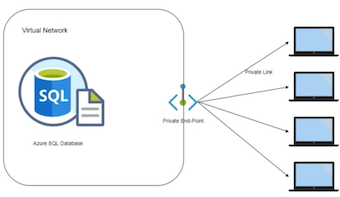

**Azure Virtual Network Service Endpoints:**

<mark>Azure Virtual Network Service Endpoints enable you to extend your Virtual Network to Azure Storage.</mark>

This ensures that traffic between your Virtual Network and Azure Storage remains on the Microsoft Azure backbone network.

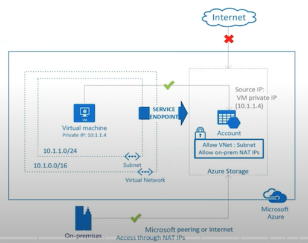

### 2-4 Azure Storage security and encryption

**Azure Firewall**: Azure Firewall is a managed, cloud-based network security service that protects your Azure Virtual Network resources. You can use Azure Firewall to secure traffic between your Virtual Network and Azure Storage.

**Azure Monitor and Azure Security Center:**

Azure Monitor and Azure Security Center provide monitoring and security features for Azure Storage.

Azure Monitor allows you to monitor storage account metrics and logs. 

Azure Security Center provides security recommendations and threat detection for Azure Storage.

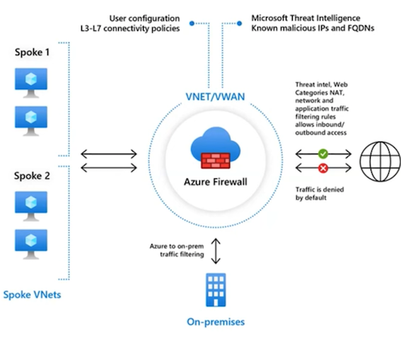

## 3 Azure Synapse Analytics

**Azure Synapse Analytics** is a **data warehouse** and **unified analytics platform**

Build ETL/ELT processes:

* in a code-free visual environment
* easily ingest data from more than 95 native connector


Deeply integrated Apache Spark 

Use T-SQL queries on both your data warehouse and Spark engines

Supports multiple languages: T-SQL, Python, Scala, Spark SQL, and .NET

Integrated with Artificial Intelligence (AI) and
Business Intelligence tools (BI)

* Azure Machine Learning
* Azure Cognitive Services
* Microsoft Power BI


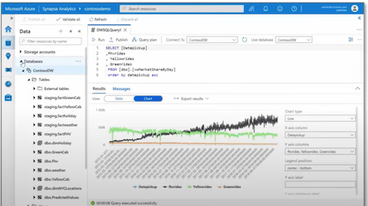


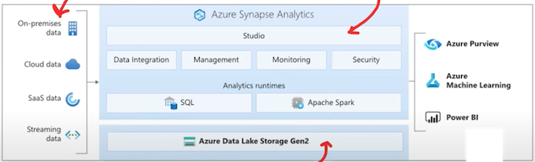

* **On-premises data**: You can ingest data from many data sources
* **Studio**:  You can manage Azure Synapse Analytics via the Synapse Studio interface
* Azure Data Lake Storage Genz: The data is stored in Object Storage Via Data Lake Storage Gen 2
* Power BI: You can output the data to various Azure Services

### 3-1 Synapse SQL

**Synapse SQL** is a distributed version of **T-SQL designed for data warehouse workloads**

* Extends T-SQL to address streaming and machine learning scenario
* Use built-in **streaming** capabilities to land data from cloud data sources into SQL tables
* Integrate AI with SQL by using ML models to score data using the T-SQL PREDICT function
* Offers both **serverless and dedicated resource models**

* For **unpredictable** workloads (unplanned or burst)

use the **always-available, serverless SQL endpoint**.

* For **predictable** workloads

create **dedicated SQL pools** to reserve processing power for data stored in SQL tables

### 3-2 Dedicated SQL Pool

Dedicated SQL pool is a query service over the data in your **data warehouse**

The unit of scale is an abstraction of compute power that is known **as a data warehouse unit (DWU)**.

Once your dedicated SQL pool is created, you can import big data with simple **PolyBase T-SQL queries**, and then use the power of the distributed query engine to run high-performance analytics

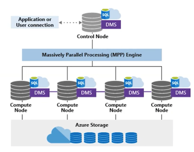

### 3-3 Serverless SQL Pool

Serverless SQL pool is a query service over the data in your **data lake**

Scaling done automatically to accommodate query resource requirements.

Whether you're adding nodes, removing them, or managing failovers, the **Serverless SQL Pool** is resilient.

It constantly adapts to ensure every query receives the resources it needs, guaranteeing successful execution.

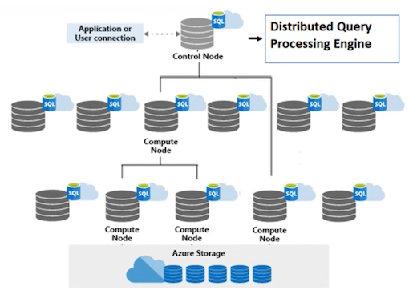

### 3-4 Apache Spark for Synapse

**Azure Synapse can deeply and seamlessly integrate** with Apache Spark, which is the most popular open-source big data engine used for 

* data preparation, 
* data engineering, 
* ETL
* **and machine learning**.

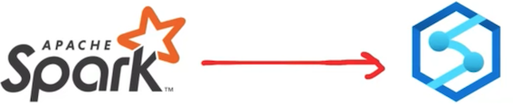

* ML models with SparkML algorithms and AzureML integration for Apache Spark 3.1 with built-in support for Linux Foundation Delta Lake.
* Simplified resource model that frees you from having to worry about managing clusters.
* Fast Spark start-up and aggressive autoscaling.
* Built-in support for .NET for Spark allowing you to reuse your C# expertise and existing .NET code within a Spark application.

### 3-5 Apache Spark with Data Lake

**Azure Synapse** removes the traditional technology barriers between using SQL and Spark together. You can seamlessly mix, and match based on your needs and expertise.

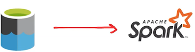


* Tables defined on files in the data lake are seamlessly consumed by either Spark or Hive.
* SQL and Spark can directly explore and analyze Parquet, CSV, TSV, and JSON files stored in the data lake.
* Fast, scalable data loading between SQL and Spark databases

### 3-6 Azure Synapse Link for Azure Cosmos DB

Azure Synapse Link is a feature in Azure Synapse Analytics that provides **seamless integration and real-time analytics** capabilities between **Azure Synapse Analytics** and operational data stored in **Azure Cosmos DB**.

It creates a tight integration between Azure Cosmos DB and Azure Synapse Analytics, allowing users to explore and analyze their data with no extraction, transformation, and loading (ETL) process required, no data duplication, and no impact on the performance of transactional workloads.

Azure Synapse Link forms a connection between Azure Cosmos DB's transactional database and Azure Svnapse Analvtics' analytical capabilities. 

It accomplishes this by creating a real-time updated. **columnar-based analytical store within Cosmos DB**.

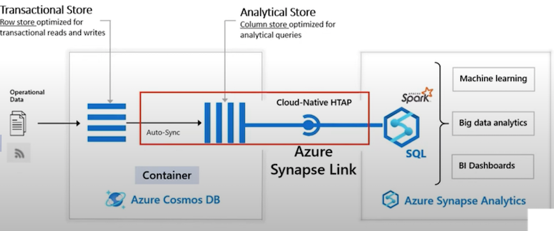

**Benefits of Azure Synapse Link for Azure Cosmos DB**

1. **Real-time Analytics**: Azure Synapse Link enables real-time analytics by allowing direct querying of live operational data in Azure Cosmos DB, without impacting its performance.
2. **Operational and Analytical Data Cohesion**: It eliminates the need for complex ETL (Extract, Transform, Load) processes. This simplifies the data architecture as it provides immediate and seamless access to analyze operational data.
3. **Cost Efficiency**: Azure Synapse Link reduces costs by avoiding the need for additional storage and compute resources that are typically required for ETL processes.
4. **Increased Productivity**: By removing the need for manual data extraction or synchronization processes, Azure Synapse Link saves time and increases productivity for data scientists and developers.
5. **Improved Data Freshness**: With Azure Synapse Link, the most up-to-date data from Azure Cosmos DB can be accessed for analytics and reporting in real-time. This ensures data freshness and accuracy.

**When to use Azure Synapse Link for Azure Cosmos DB?**

You should consider using Azure Synapse Link for Azure Cosmos DB when:

1. You are an Azure Cosmos DB user wanting to conduct analytics, Business Intelligence (BI), and machine learning on your operational data.
2. You are currently running analytics or Bl on your Azure Cosmos DB operational data using separate connectors, or
3. You are executing EL processes to transfer operational data into a distinct analytics system.

In such cases, Azure Synapse Link offers a seamless analytics experience without impacting the performance of your transactional store.


However, it's not ideal if you require traditional data warehouse capabilities like high concurrency, workload management, and persisting aggregates across multiple data sources.

## 4 Introduction to Azure Data Factory

**Azure Data Factory** is a managed service for **ETL (Extract, Transform, Load), ELT (Extract, Load, Transform) and data integration**.

Create **data-driven workflows** for orchestrating **data movement and transforming data at scale**

* Create Pipelines to schedule data-driven workflows
* Build complex ET processes that transform data visually with data flows
* Use compute services such as **Azure HDInsight Hadoop, Azure Databricks, and Azure SQL Database**
* Publish your transformed data to data stores such as Azure Synapse Analytics
* Raw data can be organized into meaningful data stores and data lakes


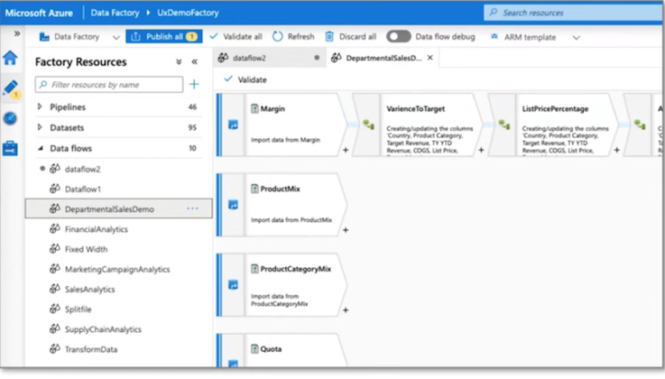


### 4-1 Azure Data Factory - Core Components

**Pipelines**:

A logical grouping of activities that performs a unit of work

**Activities**:

A processing step in a pipeline

**Datasets**:

Data structures within the data store

**Linked services**:

Define the connection information for data sources to connect to Data 
Factorv

**Data Flows**:

Logic to determine how data moves through a pipeline or is transformed

**Integration Runtimes (RI)**:

Compute infrastructure used by Azure Data Factory

**Control flow**:

Orchestration of pipeline activities that includes chaining activities in a sequence, branching

### 4-2 Azure Data Factory - Data Orchestration Process

1. **Data Ingestion**: ADF ingests data from varied sources, like on-premises **SQL Server databases or external data**. Data is pulled in using connectors in either batch or real-time modes.

2. **Data Storage and Transformation**: Post ingestion, data is stored for processing in **Azure Blob Storage or Azure Synapse Analytics** for more structured data. ADF pipelines transform this data by cleaning and enriching it.

3. **Analysis**: The processed data is loaded into **Azure Analysis Services** for analysis, providing a unified view of your business data.

4. **Visualization**: The analyzed data is leveraged by tools like **Power BI** to generate insightful visualizations and reports.

5. **Security and Authentication: Azure AD** is used throughout this process for user authentication and authorization, securing your resources and data.

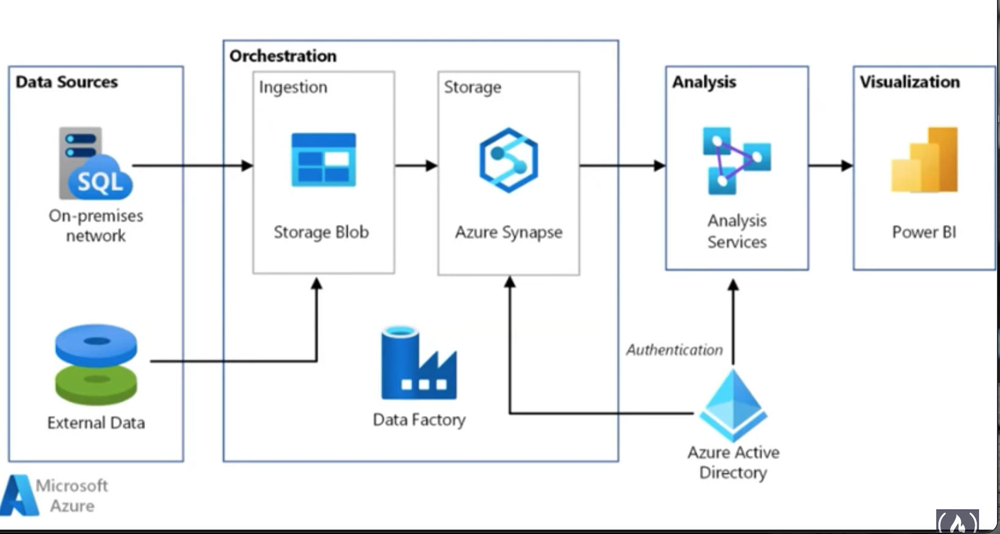


### 4-3 Microsoft SQL Server Integration Services

**Microsoft SQL Server Integration Services (SSIS)** is a platform for building enterprise-level data integration and data transformation solutions

You can perform the following tasks with SSIS

* Copy files or download files
* Load data into data warehouses
* Cleanse data for better accuracy
* Dive into mining data
* Manage SQL Server objects and data

> 

* SSIS can be used to automate SQL Server databases
* SSIS can be used as an integration runtime in Azure Data Factory

**SSIS has...**

* Built-in tasks and transformations
* Graphical tools for building packages
* Integration Services Catalog database
	* where you store, run, and manage packages


Perform ET with variety of sources:

* XML
* Flat files
* Relational data sources	


Use **Graphical Integration Services** tools to integrate and
transform data without having to write code

**SIS Designer** is a graphical tool that you can use to create and
maintain Integration Services packages.

### 4-4 Microsoft SQL Server Integration Services

SSIS allows vou to drag out data transformations

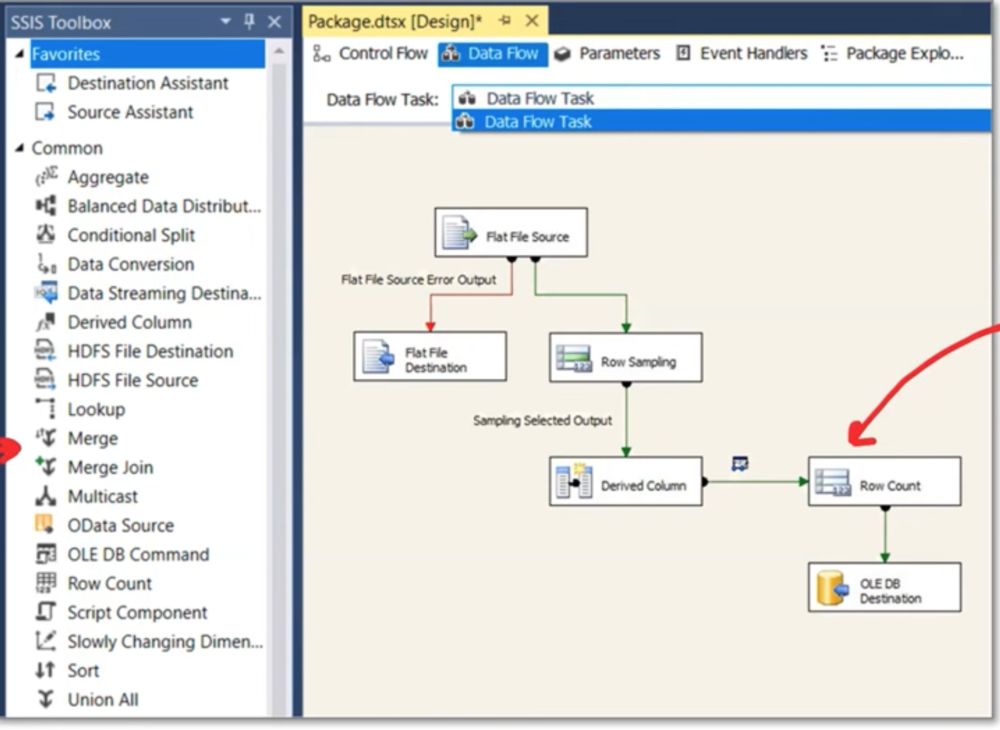

Design different kinds of control or data flows


## 5 Azure Databricks

Azure Databricks is an <mark>**Apache Spark-based analytics platform**</mark>
optimized for the Microsoft Azure cloud services platform

It is designed to simplify the process of building **big data** and **artificial intelligence** solutions by providing a unified analytics platform that accelerates the preparation of data for analytics and machine learning.

### 5-1 Azure Databricks - Pricing tiers

Azure Databricks offers two pricing tiers: **Premium** and **Standard**.

**1. Premium SKU:** The Premium tier offers a full set of advanced Databricks features such as role-based access control, integration with Azure Active Directory for identity management, and Databricks Delta Engine which is a high-performance engine for large-scale data lakes. 

It is the most appropriate for **big data analytics workloads and organizations requiring advanced security and team-based workflows**.


**2. Standard SKU**: The Standard tier offers a subset of the Databricks platform features and is more cost-effective for **smaller workloads or development/test environments.** 

It includes the basic Databricks runtime and the collaborative workspace but does not include role-based access control or Azure AD integration.

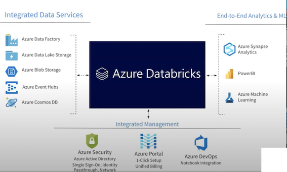

### Azure Databricks

Key Features:

1. **Collaborative Environment**: It provides a shared workspace for collaboration among data
professionals. It facilitates dashboard creation and project sharing across various languages.
2. **Azure Integration**: As a native service, it integrates smoothly with Azure services like **Data Factory, Synapse Analytics, Machine Learning, and Power BI**, simplifying analytics pipeline creation.
3. **Apache Spark Integration**: It incorporates an optimized runtime for superior performance, offering a serverless Apache Spark experience with auto-configurability and integrated Azure security.
4. **Auto-Scaling and Performance**: It offers **auto-scaling** and speed optimization for faster processing of big data workloads, scaling to thousands of nodes and handling diverse workloads.
5. **Robust Security**: It delivers enterprise-grade security with data encryption, **Active Directory integration**, role-based access control, private network connectivity, and industry-standard compliance.

### Use Cases:

1. **Big Data Analytics**: Azure Databricks can process large volumes of data in parallel,
making it suitable for big data processing and analytics.
2. **Machine Learning:** It provides a platform for preparing data and developing, training, and deploying machine learning models.
3. **Real-time Analytics**: Azure Databricks supports streaming analytics, allowing for real-time insights from data.
4. **ET Processes**: Azure Databricks can be used for building robust ETL pipelines.
5. **Data Exploration and Visualization**: The collaborative workspace in Azure Databricks allows for data exploration and visualization, enabling data scientists and analysts to derive insights from data.


**<mark>Azure Databricks focuses on analytics, big data, and machine learning, while Azure Data Factory primarily handles data integration and pipeline orchestration in the cloud**</mark>.

## 6 Introduction to Data Lakes

A data lake is a **centralized, scalable data repository that stores raw, unstructured and semi-structured data**

<mark>A Data Lake is intended to store vast amounts of data</mark>

Data lakes generally use object (blobs) or files as its storage medium.

### 6-1  Introduction to Azure Data Lake

Azure Data Lake is a scalable and secure data lake that allows you to store and analyze large amounts of data. It is composed of **two** main components: **Azure Data Lake Storage and Azure Data Lake Analytics.**

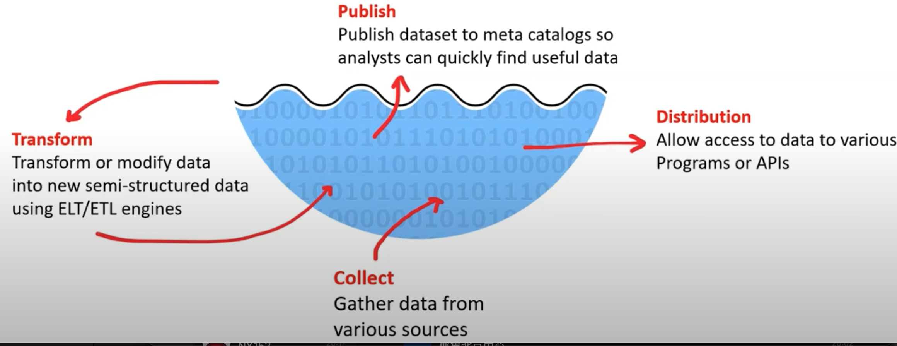

**1. Azure Data Lake Storage**: This is a massively scalable and secure data lake that allows you to store all types of data. There are **two** generations of Azure Data Lake Storage:


* **Azure Data Lake Storage Gen1**: It provides a single repository where you can capture data of any size, type, and speed without forcing changes to your application as the data scales.
* **Azure Data Lake Storage Gen2**: This is a set of capabilities dedicated to big data analytics, built on Azure Blob storage. It combines the scalability and cost benefits of object storage with the reliability
and performance of the big data file system capabilities.

**2. Azure Data Lake Analytics:** This is an on-demand analytics job service that simplifies big data.

Instead of deploying, configuring, and tuning hardware, you write queries to transform your data and extract valuable insights.

It includes **U-SQL**, a language that unifies the benefits of SQL with the expressive power of your own code.

It also allows you to dynamically scale the resources you need for your jobs, making it cost-effective.

> Azure Data Lake Storage Gen1 (deprecated)
> 
> The first version of Data Lake Storage and will be retired in 2024. New users should use Gen2

**Azure Data Lake Storage Gen2**

Data Lake Storage is Azure Blog storage which is has been extended to support big data analytics workloads


* Designed to handle **petabytes of data and hundreds of gigabits of throughput**
* In order to efficiently access data, Data Lake Storage adds a **hierarchical namespace** to Azure Blob Storage

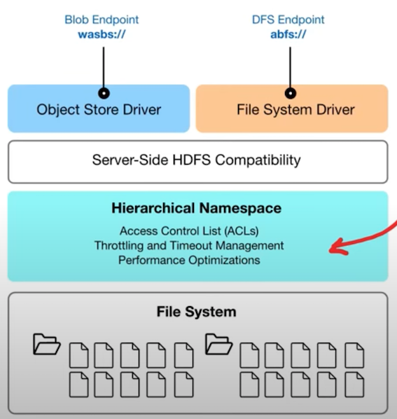


### 6-2 Azure Data Lake Storage Gen2

**Azure Data Lake Storage Gen2 plays a vital role in Azure Data Lake by providing a secure, scalable platform to store large data volume**s. It is tailored to support high-performance analytics and machine learning operations.

Here are some of its core features:

1. **Hierarchical Namespace**: Enables organizing and managing data in a hierarchical file and folder structure similar to traditional file systems, simplifying data organization and transformations.
2. **Scalability**: Designed to handle enormous amounts of data, from petabytes to exabytes, with high throughput and low latency. It can also manage high volumes of small writes, common in big data scenarios.
3. **Security**: Incorporates Azure Active Directory for identity and access management, role-based access control, firewall rules, and virtual network service endpoints, along with encryption at rest and in transit. It also supports **<mark>Azure Private Link<mark>**, ensuring data travels over a private network.
4. **Cost-Effectiveness**: Offers low-cost storage, with lifecycle management policies that automatically move data to cheaper storage tiers or delete it after a specified period, lowering costs.
5. **Performance**: Provides the high-performance computing needed for big data analytics and allows choosing the best performance characteristics for specific workloads through its performance tiers.


### 6-3 Azure Data Lake Analytics

**Azure Data Lake Analytics is an on-demand analytics job service** that simplifies big data

Instead of deploying, configuring, and tuning hardware...

You **write queries (via U-SQL) to transform your data and extract valuable insights**.

**Exporting** approximately 2.8 billion rows of TPC-DS store **sales data (~500 GB)** into a CV file took less than **7 minutes**

**Importing the full 1 TB** set of source data into Azure Analysis Services by using the Azure Data Lake connector took less than 6 hour

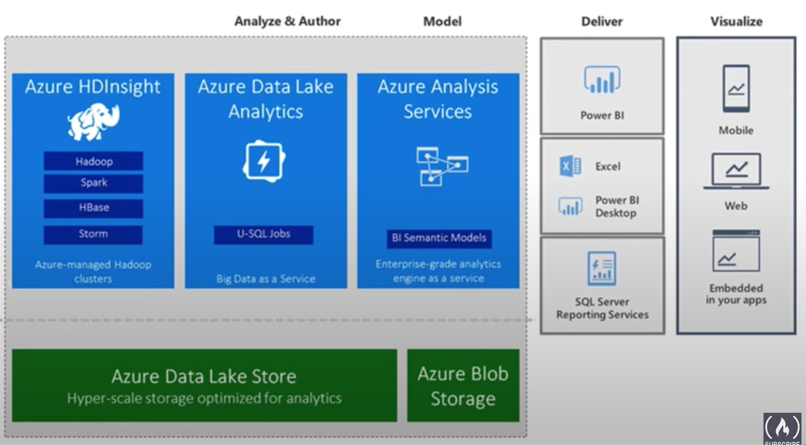

### 6-4 Azure Data Lake Analytics  - U-SQL

U-SQL is a structured query language included within Data Lake Analytics to **perform queries** on your data lake.

U-SQL can query and combine data from a variety of data sources, including:

* Azure Data Lake Storage
* Azure Blob Storage
* Azure SQL DB
* Azure SQL Data Warehouse.
* SQL Server instances running in Azure VMs

You can install Azure Data Lake Tools for Visual Studio to perform U-SQL jobs on your Azure Data Lake

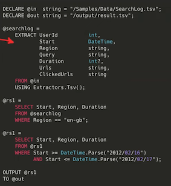


### 6-4 What is a Key / Valve store?

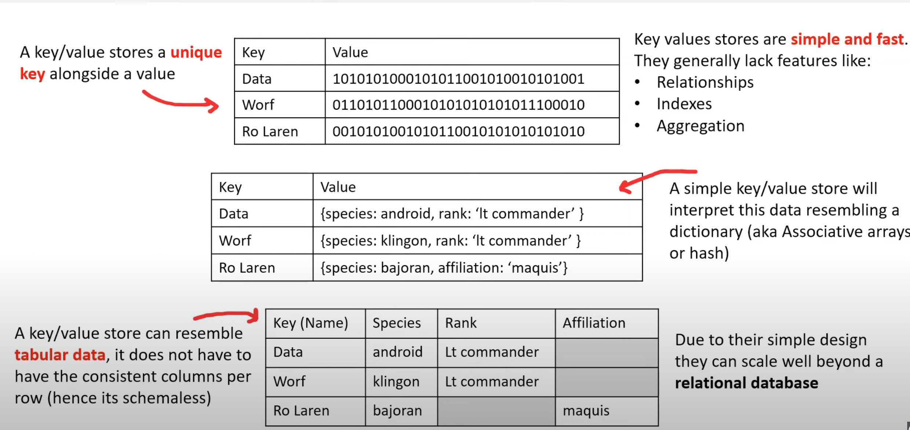

### 6-5 What is a Document store?

**A document store** is a NOSQL database that **stores documents** as its primary data structure.

A document could be an XML but more commonly is JSON or JSON-Like Document stores are sub-class of Key/Value stores

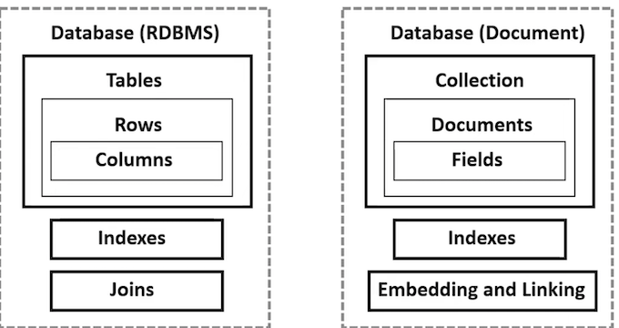

### 6-6 What is a Graph database?

A graph database is a database composed of a data
structure that uses **vertices (nodes, dots)** which form **relationship** to other vertices via **edges (arcs, lines)**

Use Cases for Graph Database:

* Fraud detection
* Real-time recommendation engines.
* Master data management (MDM)
* Network and IT operations.
* Identity and access management (IAM)
* Traceability in Manufacturing
* Contact Tracing
* Data Lineage for GDPR
* Customer 360-degree analysis (marketing)
* Product recommendations
* Social Media graphing
* Feature Engineering (ML)

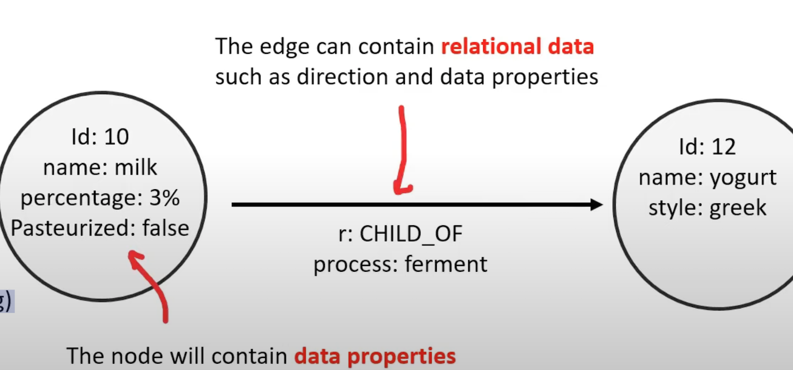

## 7 Introduction to Cosmos DB

Azure Cosmos DB is a service for fully-managed NoSQL databases
that are designed to scale and have high performance

Cosmos DB supports **different kinds** of NoSQL database engine which you interact via an API:

* **Core SQL (document datastore)**
* Azure Cosmos DB API for **MongoDB (document datastore)**
* **Azure Table (key/value datastore)**
* **Gremlin (graph datastore)**
	* Based on **Apache TinkerPop**

These NoSQL engines offer two specific **capacities**:

* Provisioned throughput (pay for guarantee of capacity )
* Serverless (pay for what you use)

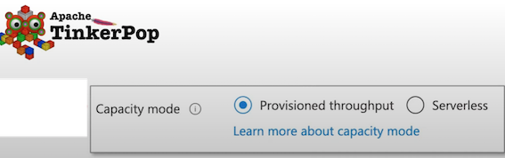

### 7-1 What is Cosmos DB?

**Cosmos DB is a NoSQL Database** with an incredibly **fast** response time and string support for **scalability**.

Cosmos DB is a fully managed service, which means Azure handles all of Cosmos DB's automatic management, updates, and patches.

**Main Advantages of Azure Cosmos DB**


* <mark>Integrates with many **Azure Services** e.g., Azure Functions, Azure Kubernetes Services, Azure App Services</mark>
* Integrates with many databases APIs like the native **Core SQL, MongoDB, Cassandra, Gremlin**
* Support for multiple development SDKs, spanning .Net, Java, Python, and Node.Js.
* Offers a schema-less service with automatic indexing of data, ensuring rapid queries
* Guaranteed uptime **SLA** of 99,999% availability
* **Data replication** between Azure Regions is automatic.
* Data protected with **encryption-at-rest** and role-based access.
* **Autoscale** is provided to handle a variety of workload sizes.


### 7-2 Cosmos DB APIs

Different types of APls are available in Azure Cosmos DB to support a wider range of applications.

These APIs allow data to be delivered **via documents, key-value pairs, wide-columns, or graph-data**.

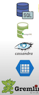

* **Core SQL API** - **default API** for using Azure Cosmos DB enables querying your data with a language similar to **SQL**.
* **MongoDB API** - used for communicating with **MongoDB** databases and document storage.
* **Cassandra API** - used to communicate with Cassandra using Cassandra Query Language and storing data as a partitioned row store.
* Azure Table API - used to communicate with **Azure Table Storages** and allows indexes in the partition and row keys.
* **Gremlin API - used to create a graph-based** data view that can be queried using graph traversal language

### 7-3 Cosmos DB Explorer

Cosmos DB Explorer is **a web interface** to explore and interact with your Cosmos DB accounts

[cosmos.azure.com](cosmos.azure.com)

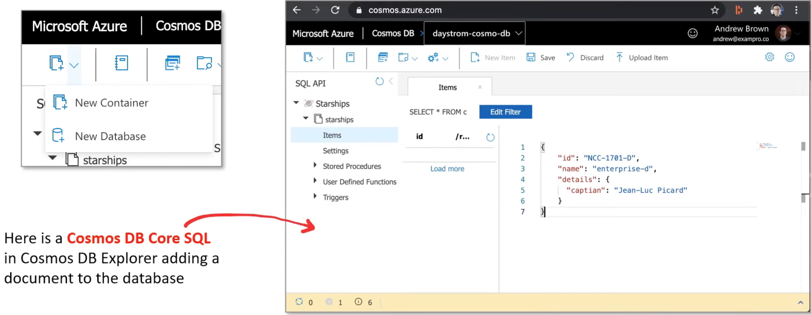

### 7-4 Cosmos DB Explorer

When navigating within Azure to a  Cosmos DB Account under **Data Explorer**, it's the same as Cosmos DB Explorer

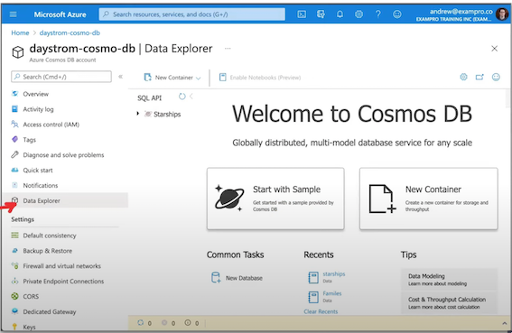

Using Cosmos DB Explorer with a Graph Database (Gremlin)

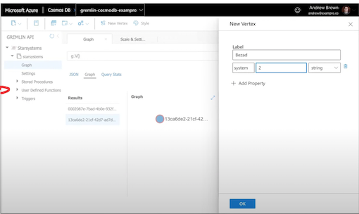

### 7-5 Partitioning Schemas in Cosmos DB

Partitioning in Azure Cosmos DB plays an important role in **optimizing performance.**


Data in Cosmos DB indexes is grouped by partition keys, ensuring quick and efficient data access.

> Main concepts of **Partitioning Schemas** in Azure Cosmos DB

* **Partition Keys** are the keys used to group items. Works like **primary keys**.
* A **Logical partition** is a group of items that all have the **same partition key value**.
* **Physical Partitions** consists of a set of **logical partitions**. Azure Cosmos DB manages logical partitions, which can have **one to many**.
* **Replica-Sets** are made up of a group of **physical partitions** that are materialized as a self-managed, dynamically load-balanced group of replicas that **span across multiple fault domains.**


### 7-6 Partitioning Schemas in Cosmos DB

<mark>Each physical **partition consists** of a set of **replicas**, aka a **replica set**.</mark>


<mark>**Logical partitions** are mapped to **physical partitions** that are distributed globally</mark>.

**Partition set** in the image refers to a group of **physical partitions** that manage the **same logical partition keys** across multiple **regions**


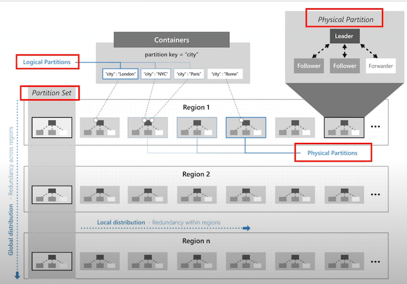

### 7-7 Choosing a partition key

A partition key has two components: **partition key path** and the **partition key value.**

E.g., consider an item **{ "userld" : "Andrew", "worksFor": "Microsoft" }**

If you choose "**userID**" as the partition key, the following are the **two partition key components:**


1.The **partition key path e.g., "/userId"**

The partition key path accepts **alphanumeric** and **underscore(_)** characters.

You can also use nested objects by using the standard **path notation(/).**

2.The **partition key value** e.g, "Andrew"

The partition key value can be of **string or numeric** types.


Your partition key for all containers should be:

* A **property** that has a value which does **not** change.
	* You can't change the value of a property if it's your partition key.
* A property that should have a **wide** range of possible values.
* **Spread request unit (RU)** consumption and data storage **evenly** across all logical partitions.
	* This ensures even RU consumption and storage distribution across your physical partitions.

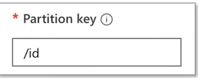

### 7-8 Choosing a unique keys

**Unique keys provide developers with the ability to add a layer of data integrity to their database.**

By creating a unique key policy when a container is created, you ensure the uniqueness of **one or more values per partition key.**

* A unique key is scoped to a **logical partition**.
* If you partition the container based on the ZIP code, you end up with duplicated items in each logical partition.

> You can't update an existing container to use a different unique key

A unique key policy can have a maximum of **16 path values**

Each unique key policy can have a maximum of **10 unique key constraints or combination**

When a container has a unique key policy, Request Unit (RU) charges to create, update, and delete an item are slightly higher 

Unique key names are case-sensitive

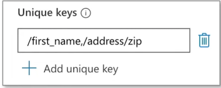

### 7-9 Properties of Cosmos DB Containers

An **Azure Cosmos container has a set of system-defined properties.**

Depending on which **API you use**, some properties might not be directly exposed.

The following table describes the list of **system-defined properties:**

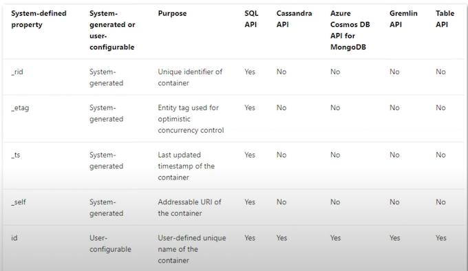

### 7-10 Cosmos DB Containers - Capacity

**What is capacity?**

Capacity defines the amount of underlying resources are available to support consumption of resources such as compute and storage

Cosmos DB has **two capacity modes:**

* Provisioned throughput
* Serverless

**Provisioned Throughput**


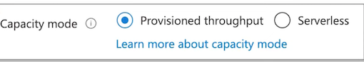

#### Provisioned Throughput

For each of your containers, you provision some amount of throughput expressed in Request Units (RUs) per second

* For workloads where you can reliably predict traffic
* More flexible options

#### Serverless

You run your database operations against your containers without having to provision any capacity

* For low (small) workloads
* For unpredictable spike and traffics
* Easy to configure, with limitations


### 7-11 Cosmos B Containers - Capacity

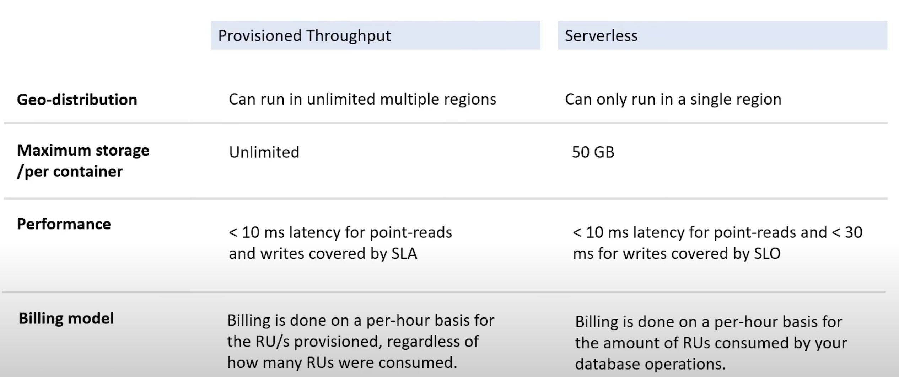


### 7-12 Consistency levels in Cosmos DB

Azure Cosmos DB provides **five different consistency levels** to maintain data availability and querying performance depending on your requirements

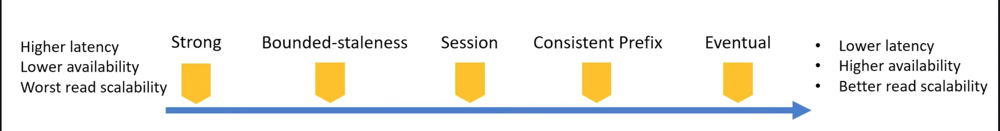

1. **Strong** - Linearizability. Reads are guaranteed to return the most recent version of an item
2. **Bounded Staleness** - Consistent Prefix. Reads lag behind writes by at most k prefixes or t interval
3. <mark>**Session** - Consistent Prefix. Monotonic reads, monotonic writes, read-your-writes, write-follows-reads</mark>
4. **Consistent Prefix** - Updates returned are some prefix of all the updates, with no gaps
5. **Eventual** - Out of order reads


You set the default consistently at the Cosmos DB account-level under Default Consistency blade

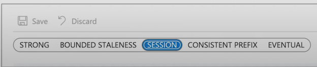


#### **1. Strong Consistency**

* Read operations ensure that the most recent data is **returned**.
* <mark>Read operations costs the same as **Bounded Staleness but more than session and eventual consistencies**</mark>
* Write operations can only be **read** after the data has been replicated by most replicas

#### **2. Bounded Staleness**


* Read operations are **lagged** behind writes operation due to **time or version** differences
* Read operation costs the **same as Strong Consistency** and more than session and eventual
* consistency.
* Has the **highest** level of consistency compared to session consistency, consistent-prefix consistency,
* and eventual consistency.
* Recommended for **globally** distributed applications, with high availability and low latency.


#### 3. Session

* Read operations ensure that written data is consistent within the **same session**.
* Consistency is user-session specific, and other users might see "**dirty**" data from recent writes.
* Default consistency level used to newly created databases.
* Reading cost are lower than **Bounded Staleness and Strong Consistency**, but higher than **Eventual Consistency**.


#### 4. Consistent Prefix

* Read operations ensures that the most recent **data replicated** among the replicas is returned, but it does not guarantee that the data is the **most recent**.
* "Dirty" data occurs when one replica changes the data state, but this data has not vet been replicated.
* Has a stronger consistency level than the **Eventual Consistency** but less than any others.

#### 5. Eventual

* Read operations does **not** guarantee any consistency level
* **Lowest** consistency level
* **Lowest latency** and best performance among the consistency levels
* **Least expensive** read operations cost compared to an other consistency levels

## 8 Azure Cache for Redis

### 8-1 Reds Introduction

**What is Redis?**

Redis is an **open-source in-memory database store.** Redis acts as caching layer, or a very fast database. 

Since all data is stored in memory, its highly volatile, meaning data loss is possible under certain conditions.

Redis is very fast that it can deliver content from its store with single to double digit milliseconds, e.g., 10 ms


**Despite its in-memory nature, Redis provides options for data persistence, allowing you to balance performance with durability.**

It can periodically save data snapshots to disk or append each command to a log.

Redis is a **Key / Value store**, supports the following data structures


* **Sets & Sorted Sets:** Collections of strings in which every item is unique.
* **Lists**: A collection of strings sorted according to the order they were inserted.
* **Hashes**: Perfect for storing objects, these are maps between string fields and string values.
* **Bitmaps & Bitfields**: Allow for operations at the bit level, providing extremely efficient storage.
* **HyperLogLog**: A sophisticated algorithm to count unique values.
* **Geospatial Indexes**: Grant the ability to manage spatial items and query by position.
* **Streams**: New in Redis, it offers a way to log and real-time stream data.


```
$ redis-cli
redis127.0.0.1:6379> ping
PONG
redis 127.0.0.1:6379> set mykey somevalue
OK
redis 127.0.0.1:6379> get mykey
"somevalue"
```

### 8-2 Azure Cache for Redis

**Azure Redis Cache** is based on the popular open-source Redis cache.

It gives you access to a secure, dedicated Redis cache that Microsoft manages and that you can access from any Azure application.

Azure Redis Cache is an in-memory database that caches data in key-value pairs.

It helps your application become more **responsive** even as the customer load increases.

It takes advantage of the Redis engine's **low-latency, high-throughput** capabilities.

This distributed cache layer allows your data tier to **scale** independently, allowing for more **efficient** use of your application layer's compute resources.


**Azure Redis Cache** perfectly complements Azure database services like Cosmos DB, Azure SQL, etc.

It provides a **cost-effective** solution to **scale** read and write throughput of your data tier.

Using the **cache-aside pattern**, you can store and share database query results, session states, static content, and more.

**Azure Cache for Redis** stores **session state** and other data that needs l**ow latency access.**

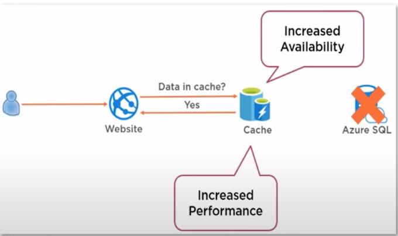

### 8-3 Azure Redis Cache - Diagram

Diagram of **Cache-Aside Pattern** on **Azure Storage**

First, check the **Redis Cache** to see if your item is available.

If the item is found, we'll retrieve it

If not, pull the item from the **Table storage**, re-cache it in Redis, and then return the results.

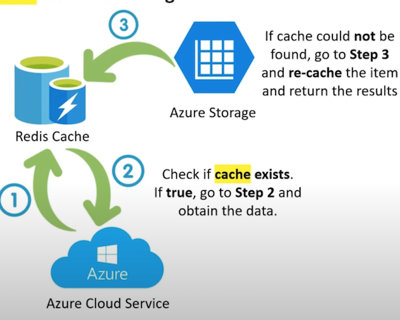

### 8-4 Caching Expiring Policies

Azure Redis Caches expiration policies are configured per each request, so we could have an expiration policy different for each cache key.

For Redis Distributed cache, those expiration policies are as follows:

* **AbsoluteExpirationRelativeToNow** - Sets the cache duration from when it's added.
	* E.g., if set for 10 minutes, the item expires 10 minutes after being added.
* **AbsoluteExpiration** - Specifies an exact expiration date and time for the cache item.
	* It expires once that moment arrives.
* **SlidingExpiration** - The item's expiration resets each time it's accessed, but if
	* unaccessed for a set duration (e.g., 10 minutes), it expires.


## 9 Azure Table Storage

**Azure Table storage** is a **NoSQL key/value datastore** within Azure Storage Accounts

Azure Table stores vast amount of **unstructured or semi-structured data** with a schemaless design

There are two ways to interact with Azure Tables:

* **Azure Table Storage API**. A robust tool for developers to seamlessly integrate, query, and manage their data.

* **Microsoft Azure Storage Explorer.** It offers a user-friendly interface to browse, manipulate, and manage your data without code.


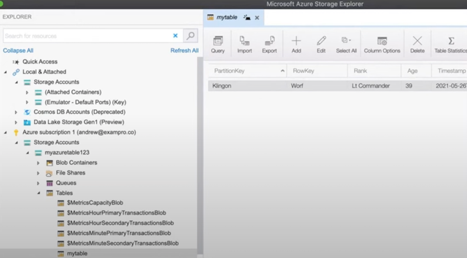

### 9-1 Azure Storage Explorer

A **standalone app** that makes it easy to work with Azure Storage data on Windows, macOS, and Linux.

You can create Blob containers, upload files, create snapshots of Disk, and more!

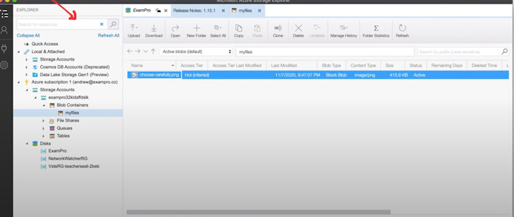

### 9-2 Azure Table Storage

1. **Large Amounts of Semi-Structured Data**: If you have massive volumes of semi-
structured or unstructured data, but don't need the complexities of a relational database
2. **Cost-Effective Storage Need**s: Azure Table Storage is a budget-friendly solution, especially when compared to full-fledged databases.
3. **Schema Flexibility**: If your application has evolving data structures where the schema can change over time, the schema-less design of Azure Table Storage offers flexibility.
4. **Scalability Requirements**: For applications that need to scale out by adding more data entities but don't require complex joins, stored procedures, or secondary indexes
5. **Fast Access and High Throughput**: If you need a storage solution with low-latency and high-availability characteristics for quick access to data.

### 9-3 Azure Table Storage - Adding Entries

When you enter data, you must provide a

* **Partition Key** - Unique identifier for the partition within a given table
* **Row Key** - Unique identifier for an entity within a given partition


**Azure Tables supports:**

* String
* Boolean
* Binary
* DateTime
* Double
* Guid
* Int32 and Int64

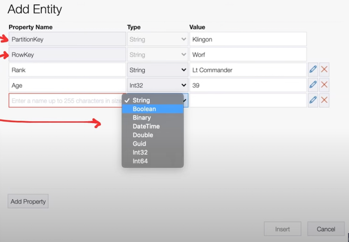

### 9-4 Azure Table Storage - Querying

When you need to retrieve data, you can perform **queries** using **both Partition and Row Keys**.

**This dual-key system allows for robust and flexible data retrieval operations.**

Azure Table Storage allows you to apply additional **filters** to your queries.

If you need to find all entries from a specific location or all entries falling under
a particular category, you can easily set up filters to refine your search.


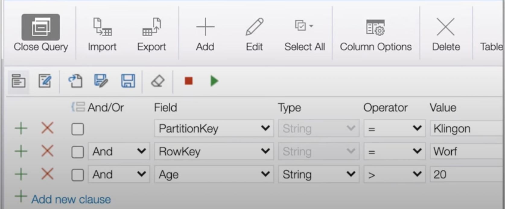

## 10 Azure Queue Storage

Azure Queue Storage is a robust **messaging broker** that facilitates smooth and secure message exchange between various applications and services within Azure.

Key Features

* **Simple Message Broker**: Azure Queue Storage allows services running on cloud infrastructure to communicate with each other synchronously. It can handle large numbers of messages simultaneously, ensuring your services remain highly responsive.

* **Security**: Azure Queue Storage uses authenticated **HTTP/S protocols**, ensuring that data transmission is secure and reliable.


* **Message Size**: It can hold messages up to **64KB in size**, accommodating a wide range of data types and sizes.


### 10-1 Storage and Access

**Storage Account**: Queue Storage is stored within an Azure Storage Account, ensuring a secure and unified setting for all storage needs.

**Access Keys and Connection Strings**: Utilize the same access keys and connection strings for Queue Storage as with other resources in the Storage Account, ensuring streamlined and consistent access management.

**Azure Queue Storage** offers **3 ways** of handling messages on the queue:

* **1. Peek**: This option allows you to **preview a message in the queue without deleting or locking it**. It's useful for determining the next message to process.
* **2. Delete**: After successfully processing a message, an application will typically delete the message to ensure it isn't processed again.
* **3. Receive and Lock**: By "locking" a message, **it ensures that other parts of the system can't process the message simultaneously**. After processing, the lock is either renewed or the message is deleted.


**Azure Portal**: Easily create a queue and **send messages** through the **user-friendly interface of the Azure Portal.**

**Azure SDK or CLI**: For more programmatic control, most interactions with the queue, including sending, peeking, and deleting messages, can be performed using the
Azure SDK or Command-Line Interface (CLI).

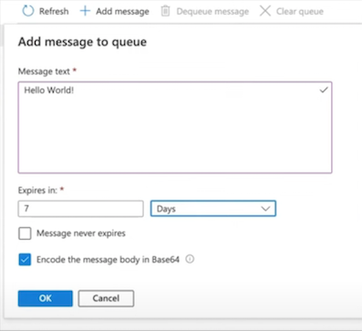

```
from azure.storage.queue import QueueClient

queue = QueueClient.from connection string(self.connection string, "myqueue")
queue.send message(u"message1")
```

### 10-2 Azure Queve Storage - Key Concepts


Queues can be accessed by using the following URL format:

```
https://<storage account>.queue.core.windows.net/<queue>
```

The following URL addresses a queue in the diagram:

```
https://myaccount.queue.core.windows.net/images-to-download
```

* **Storage account**: A storage account is required for all Azure Storage access.
* **Queue**: A queue contains a set of messages. The queue name must be all **lowercase**.
* **Message**: A message of up to **64 KB** in any format.


* Before **version 2017-07-29**, the maximum Time-to-Live (TTL) allowed is **seven days**.
* For **version 2017-07-29** or later, the maximum Time-to-Live can be **any positive** **number, or -1**, indicating that the message doesn't **expire**.
* The default time-to-live is **seven days** if this parameter is not specified.


### 10-3 Azure Queve Storage - CLI Commands

You can interact with the queue via the Azure CLI subcommand: az storage message **<action>**

* **clear** - Deletes all messages from the specified queue.
* **delete** - Deletes the specified message.
* **get** - Retrieves one or more messages from the front of the queue.
* **peek** - Retrieves one or more messages from the front of the queue, but does not alter the visibility of the message
* **put** - Adds a new message to the back of the message queue.
* **update** - Updates the visibility timeout of a message.

## 11 Azure Files

**Azure Files** is a fully **managed file** share in the cloud.

A file share is a **centralized server for storage** that allows **multiple connections.**

> It's like having one big shared drive that everyone (Virtual Machines) can work on at the same time.

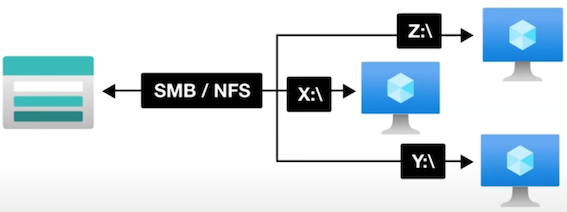

To connect to the file share, a **network protocol** is used:


* Server Message Block (SMB)
* Network File System (NFS)

When a connection is established, the file share's filesystem will be accessible in the specific directory within your own directory tree. This is process is known as **mounting**

### 11-1 Azure Files - Features

#### **Backups**

You can back up your file share with **shared snapshots**


* They are read-only
* Incremental (they only contain as much data as has changed since the previous snapshot)
* You can have up to **200 snapshots** per file share
* You can retain backups for **up to 10 years**
* Backups are stored within your file share (if you delete your file share, you will delete your backups)

#### **Soft Delete**

You can prevent accidental deletion by turning on Soft Delete (Storage will be marked for deletion and retained for a period of time before final delete occurs

#### **Advanced Threat Protection (ATP)**

An additional layer of security intelligence that provides alerts when it detects suspicious activity on your storage account

#### **Store Tiers**:

* **Premium** - Store on to SSD with single-digit milliseconds for most I0 operations.
* **Transaction optimized** - Store on HDD with transaction heavy workloads that don't need the latency offered by premium file shares (historically this tier has been called standard)
* **Hot** - optimized for general purpose file sharing scenarios such as team shares and Azure File Sync.
* **Cool** - Stored on HDD for cost-efficient storage optimized for online archive storage scenarios.


### 11-2 Azure Files - Features

#### **Types of Storage**

* **General purpose version 2 (GPv2)** - deployed on to HDD
* **FileStorage** - deployed onto SSD

#### **Identity**

* **On-Premises:** - Azure Storage can integrate with an on-premises Active Directory Domain Service.
* **Managed** - Azure Storage can be joined to Microsoft managed Active Directory Domain Service
* **Store Account Key** - A username (storage account name) and password (account key) can be used to mount

#### **Networking**

* Azure Files can be accessed from anywhere, both inside and outside your Azure account, through the
	* storage account's **public endpoint.**
* SMB uses **port 445**. If you face connection issues, check if this port is open in your organization to mount your file share.

#### **Encryption**

* Azure Files is **encrypted-at-rest** using Azure Storage Service Encryption (SSE)
* Azure Files is **encrypted-in-transit** with SMB 3.0+ with encryption or HTTPS

### 11-2  Azure Files - Use Cases

* Completely **replace or supplement** on-premises file servers Network Attached Storage (NAS) devices
* **Lift-and-Shift** your on-premises storage to the cloud via Classic Lift or Hybrid Lift

	* "Lift-and-Shift" means when you move workloads without rearchitecting, e.g., importing local VMs to the cloud
	* Classic Lift - where both the application and its data are moved to Azure
	* Hybrid Lift - where the application data is moved to Azure Files, and the application continues to run on-premises

#### **Simplify cloud development**


* Shared application settings - Multiple VMs and developer workstations need to access the same config files.
* Diagnostic share - All VMs log to the file share, developers can mount and debug all logs in a centralized place
* Dev/Test/Debug - Developers can quickly share essential tools needed for local environments.


#### **Containerization**

You can use Azure Files to persist volumes for stateful containers

**Why use Azure files instead of setting up your own File Share server?**


* **Shared Access** - Azure Files is pre-configured to function with standard networking protocols like SMB and NFS.
* **Fully managed** - Azure manages maintenance and security patches to ensure your file storage is secure and updated.
* **Scripting and Tooling** - You can automate the management and creation of file shared with **Azure API and PowerShell**
* **Resiliency** - Azure Files is built for durability, ensuring that your data is always safe and accessible.

### 11-3 Azure File Sync

**Azure File Sync** is a service that allows you to **cache** Azure file shares on an **on-premises Windows Server or cloud VM.**

**How does it work?**


* **Caching**: Azure File Sync transforms your Windows Server into a quick cache of your Azure file share, ensuring quicker data access without total cloud reliance.
* **Multiple Protocols**: Whether you use SMB, NFS, or FTPS, Azure File Sync lets you access your data locally, granting greater flexibility.
* **Global Caches**: For businesses operating globally, Azure File Sync allows setting up caches in multiple locations for faster data access.

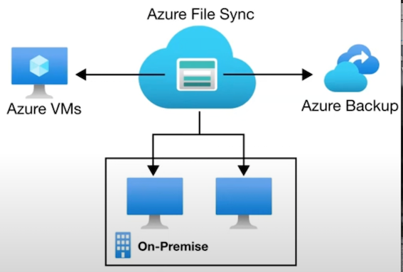

## 12 Azure Site Recovery

### 12-1 Azure Site Recovery

**Azure Site Recovery (ASR)** is a **hybrid** (on-premises to cloud) backup solution for **site-to-site recovery.**

ASR is a critical component for your **business continuity and disaster recovery (BCDR) strategy**


Site Recovery ***replicates*** workloads from a **primary site to a secondary site.**

In case primary site suffers a failure, Site Recovery will **fail-over** to the secondary site to ensure continuity of service:

Azure Site Recovery can replicate:

* Azure VMs between regions (cross region replication)
* Windows, Any OS and Linux
* On-premises to Azure
* Between other Cloud Service Providers e.g., AWS to Azure
* VMWare, Hyper-V or Physical Machines

	* <mark>**Recovery Time Objectives (RTO)** This is the **amount of time** your business can afford to have its **systems unavailable or offline** before it significantly impacts your business.</mark>
	*  <mark>**Recovery Point Objectives (RPO)** This is the **maximum amount of data loss** your business can tolerate, measured in time before a disaster occurs.</mark>

### 12-2 Recovery Solution

When recommending a recovery solution for Azure, hybrid, and on-premises workloads, the following factors should be considered:


1. **Business requirements**: The recovery solution should align with the business requirements,
including the RTO, RLO, and PO objectives. These objectives should be identified during the planning phase.
2. **Workload types**: Different types of workloads may have different **RTO, RLO, and RPO**
requirements. The recovery solution should be able to accommodate the requirements of each workload type.
3. **Hybrid or on-premises**: The recovery solution should be able to handle hybrid or on-premisesworkloads, depending on the specific requirements of the organization.
4. **Data protection**: The recovery solution should provide data protection, **including backups and
replication**, to ensure that the data can be recovered in case of an outage.
5. **Testing**: The recovery solution should be tested regularly to ensure that it meets the RTO, RLO,
and PO objectives. Testing should be conducted in a controlled environment to avoid any negative impact on production systems.

### 12-3 Azure Site Recovery Example Architecture

This disaster recovery solution utilizes Azure Site Recovery and other managed services like Traffic Manager and Virtual Network, providing an inexpensive and high-availability environment for small and medium businesses.

It can be used in portable healthcare clinics, restaurant chains, and local logistics and supply chains.

**Traffic Manager**: Routes DNS traffic for easy site redirection based on organization-defined policies.

**Azure Site Recovery**: Handles machine replication orchestration and manages failback procedures setup.

**Virtual Network**: Establishes the failover site location during a disaster.

**Blob Storage**: Stores replica images of all machines protected by Site Recovery.

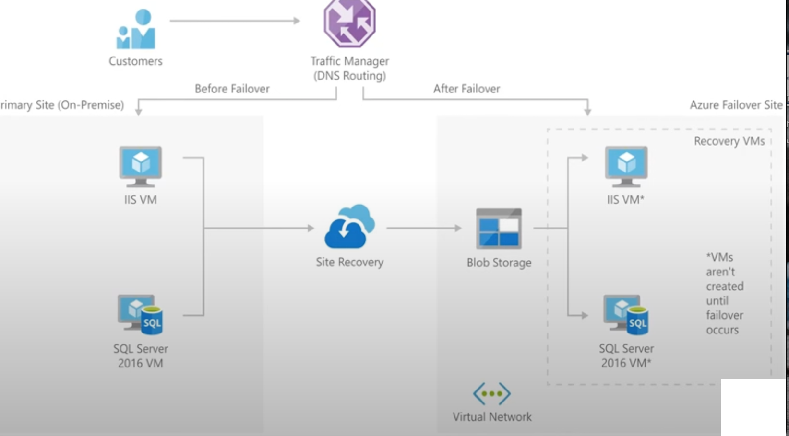

### 12-4 Azure Backup Service

**Azure Backup Service** is a cloud solution from Microsoft that offers secure, scalable, and simple **data backup and recovery across** various Azure services.


The five core components of Azure Backup:

1. **MARS Agent (Microsoft Azure Recovery Services Agent)**
2. **Recovery Services Vault**
3. **Azure Backup Server/MABS (Microsoft Azure Backup Server)**
4. VM Extension (Azure VM Backup)
5. Backup Policy

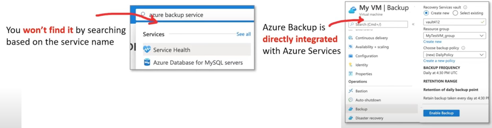

#### **What can be backed up?**

* On-premises data
* Azure VMs
* Azure Managed Disks
* Azure File shares
* SQL Server (within Azure VMs)
* SAP HANA databases (within Azure VM)
* Azure Database for PostgreSQL servers
* Azure Blobs

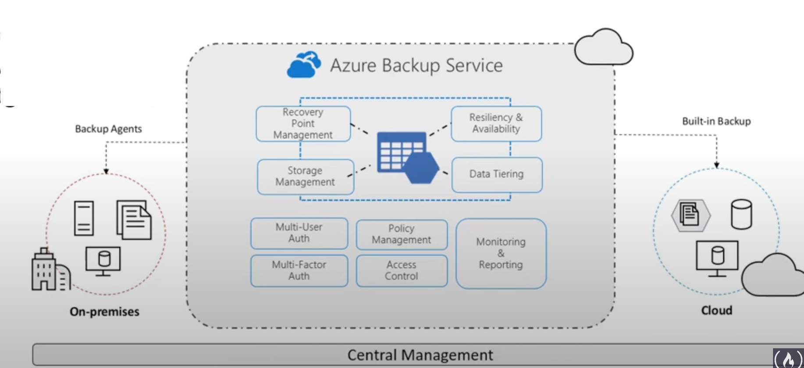

#### Why use Azure Backup?

* Offload on-premises backups
* Back up Azure laaS VMs
* Scale easily
* **Get unlimited data transfer (no limit and no charge)**
* Keep data secure (built-in security at-rest and in-transit)
* Centralized monitoring and management
* App Consistent Backups (restore apps back to an exact state)
* Automatic Storage Management
* Multiple Storage Options

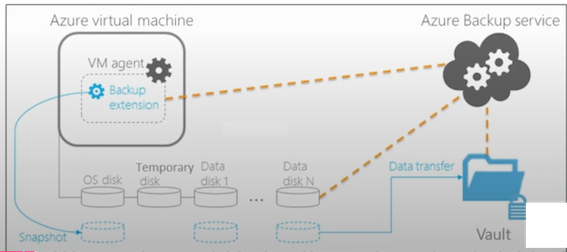

### 12-5 Azure Recovery Services Vault

Azure Recovery Services (ARS) Vault is a **storage entity** in Azure that stores **backup copies of data and configuration** information over time. This data can be related to various Azure resources like virtual machines (VMs), workloads, servers, or workstations.


**Backup for Azure Services**: ARS Vault protects data from various Azure services, including laS VMs (Linux and Windows), Azure SQL databases, Azure Blob Storage, Azure File shares, and Azure Functions.

Recovery Services vault supports various platforms:

* **System Center Data Protection Manager (DPM)**
* **Windows Server**
* **Integrates with Azure Backup Server** for application protection

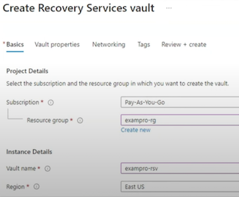

### 12-6 Azure Recovery Services Vault features

Recovery Services vaults has the following **features**:

**Enhanced Security**: Azure Recovery Services Vault encrypts data in transit and at rest for secure backup and restore processes.

**Central Monitoring**: The Azure portal allows centralized monitoring of all backup and restore tasks across hybrid environments.

**Azure Role-Based Access Control (RBAC)**: Azure RBAC enables granular access control and management of Recovery Services vaults.

**Soft Delete:** This feature retains backup data for an additional 14 days after deletion, protecting against accidental or malicious data loss.

**Cross Region Restore (CRR)**: CRR enables data restoration in a secondary region during a disaster in the primary region, ensuring business continuity.


### 12-7 MARS agent

Microsoft Azure Recovery Services (MARS) agent can back up **files, folders, and system state** from Windows **on-premises machines and Azure VMs**

Backups are stored in a **Recovery Services vault in Azure**

**MARS agent is also known as the Azure Backup Agent**

The MARS agent does not support Linux operating systems

To install the agent and perform backups you'll need to:

* Create an Azure Recovery Services vault
* Create a backup policy within the vault
* Configure secure route for backup e.g., **ExpressRoutes or Private Endpoints (optional)**
* Download the MARS agent
* Install and register the Agent to your Windows machine.

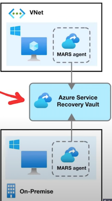


### 12-8 Azure Backup Policy

Azure Backup Policy allows users to define and configure how data backups are managed on the Azure platform

It lets you set the **frequency, retention duration, and type of backups** to ensure data protection and meet organizational requirements.

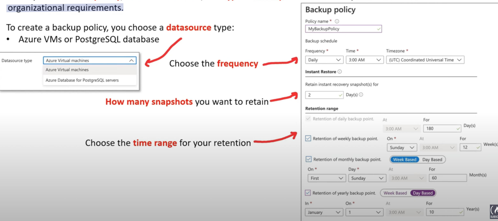

### 12-9 Azure VM Backup

Azure VM Backup is a solution for backing up and restoring virtual machines (VMs) running on Azure. 

It allows organizations to protect their virtual machines and their data against various issues such as accidental deletion, hardware failure, ransomware, and other forms of data loss.

**How It Works:**


* Azure VM Backup utilizes Azure Backup to offer a centralized backup solution manageable through the **Azure portal, PowerShell, or REST APIs.**
* It supports both **Windows and Linux virtual machines**, allowing for backup and restore operations at both the disk and VM levels.
* Multiple backup options are available, including full backups, incremental backups, and differential backups.
* Backup retention policies enable organizations to retain backups for specified durations, enhancing data management and compliance.

#### Key Features:

* The solution employs the robust infrastructure of **Azure Backup**, ensuring encryption at rest and support for backing up VMs across different regions and availability zones.
* The integration with recovery services vaults further strengthens the protection and management of backup data.

**Disaster Recovery:**

* Beyond backup, Azure VM Backup bolsters disaster recovery strategies by enabling **the replication of virtual machines to a secondary region**. This redundancy is vital in mitigating the impact of outages or disasters.
* Organizations can seamlessly **failover and failback virtual machines**, ensuring minimal downtime and enhanced business continuity.