# Az305 - Summary 5

## 1 Introduction to AKS

**Azure Kubernetes Service (AKS)** makes it simple **to deploy a managed Kubernetes cluster in Azure**

Azure will manage for you the:

* Kubernetes masters
* Health monitoring
* Maintenance

You only have to maintain the **agent nodes**

* AKS service is **free**
* **You only pay for the agent nodes within the cluster, not the masters**

When you deploy an AKS cluster, the Kubernetes master and all nodes are deployed and configured for you

During the deployment process, you can also configure additional features such as:

* **Advanced networking**
* Azure Active Directory integration to use Kubernetes role-based access control (Kubernetes RBAC)
* **Monitoring**
* **Windows Server containers are supported in AKS**

You should use AKS for scenarios where you need **full container orchestration:**

* service discovery across multiple containers
* automatic scaling
* **coordinated application upgrades**

### 1-1 Bridge to Kubernetes

**Bridge to Kubernetes** is an **extension** in **Visual Studio and Visual Studio Code** that allows developers to write, test, and debug microservice code on their development workstations.

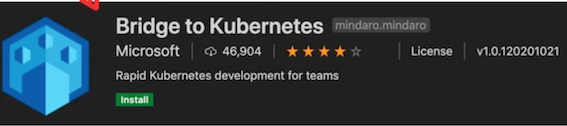

With Bridge to Kubernetes, you can integrate a service running **locally** with your AKS cluster. This bypasses the need to create Docker and Kubernetes configurations.

For the lifetime of this connection, a **proxy** is added to your cluster in place of your Kubernetes deployment that redirects requests to the service to your development computer.

When you disconnect, the application deployment will revert to using the **original version** of the deployment running on the cluster.

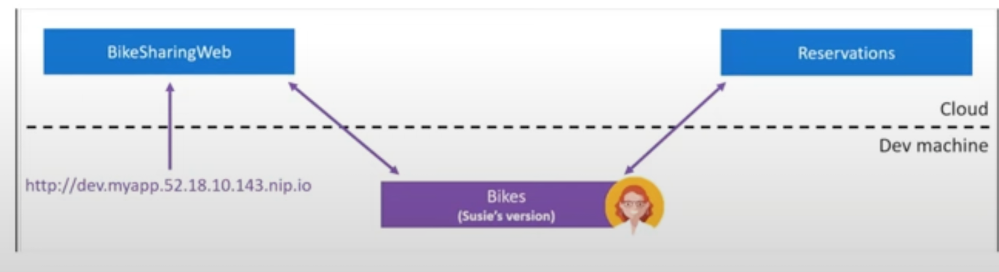

### 1-2 Recovery solutions for AKS

**Best practices for business continuity and disaster recovery in Azure Kubernetes Service (AKS):**

#### **1. Use multiple availability zones**: 

Azure AKS supports multiple availability zones, which distribute your application across different datacenters. 

This ensures high availability and resiliency in the event of a datacenter failure. 

When you create a new AKS cluster, you can choose to create it across multiple availability zones.


#### **2. Implement backup and restore:**

Backing up your AKS cluster ensures that you have a copy of your application and data in case of data loss or corruption. 

Azure AKS supports backing up your application data and Kubernetes resources, such as deployments and services, using the **Velero** backup and **restore tool**.

#### **3. Use Azure Site Recovery:**

Azure Site Recovery is a disaster recovery solution that **replicates** your AKS cluster to a secondary location. 

This can be useful in the event of a disaster or outage, as you can **failover** to the secondary location and resume operations.


#### **4. Monitor your AKS cluster:** 

It is important to monitor your AKS cluster for any potential issues or failures. Azure provides a range of monitoring and alerting solutions, such as **Azure Monitor
and Azure Service Health,** which can help you proactively detect and respond to issues.

#### **5. Test your disaster recovery plan:**

To ensure that your disaster recovery plan is effective, it is important to test it regularly. You can use tools like Azure Site Recovery to perform failover tests and ensure that your AKS cluster can be recovered in the event of a disaster.


#### **6. Use Azure Kubernetes Service with Azure Arc:**


Azure Arc enables you to manage your AKS cluster and other Kubernetes clusters **across multiple clouds** and on-premises environments from a single control plane. This provides greater flexibility and resilience in the event of a disaster or outage.

## 2 Azure Regions and Availability Zones

### 2-1 Azure Regions

Azure regions are **physical locations** around the world where Microsoft has data centers to provide cloud services. 

Each region is composed of **multiple data centers** that are geographically
dispersed to provide redundancy, resilience, and high availability to customers.

**Key facts about Azure Regions:**

Multiple Data Centers: **Each region is made up of at least one data center**, but many regions have **multiple** data centers for added redundancy and availability.

**Global Presence**: Azure regions are distributed around the world, covering almost every major continent and country.


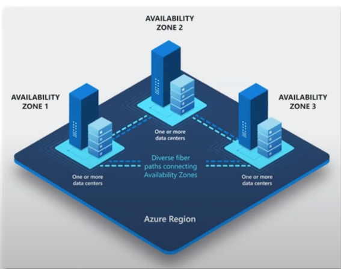


1. **Unique Identifiers**: Each Azure region is designated by a distinct name, such as **'East US' or 'West Europe',** which indicates its geographical location.


2. **Resource Deployment**: When creating resources in Azure, you can choose which region to deploy them to, based on factors such as proximity to users, data sovereignty requirements, and service availability.


3. **Data Residency:** Data in a region stays within that region, unless explicitly copied or replicated to another region for redundancy or disaster recovery purposes.

4. **Continuous Expansion**: Microsoft continually expands its Azure footprint, adding new regions to cater to emerging markets and customer needs.

### 2-2 Azure availability zones

**Azure Availability Zones** are **physical datacenter locations within an Azure region** that are typically located in separate buildings or regions, but still close enough to provide low-latency network connectivity.

These zones help protect applications and data from **datacenter-level failures** by providing redundant power, cooling, and networking.

An Azure region is a geographic location that contains **one or more datacenters**.

An Availability Zone is a **unique physical location within an Azure region.**

**Key Points of Azure availability zones**

- Each Availability Zone is composed of one or more datacenters, with independent power, cooling, and networking.
- Each datacenter within an Availability Zone is connected through a **high-speed, low-latency network.**

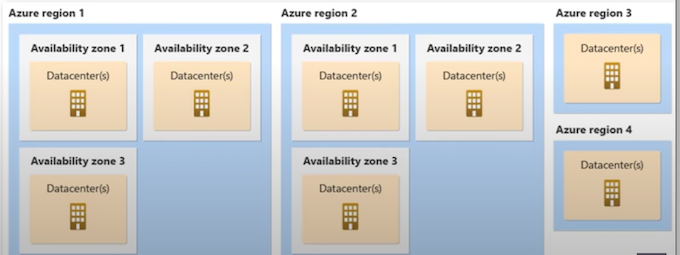


* Availability Zones are designed to provide **high availability** for critical applications by distributing them across different zones.
* By deploying applications across multiple zones, **it is possible to achieve a higher level of redundancy and fault tolerance.**
* **Virtual machines, storage accounts, and other Azure resources can be deployed** to specific Availability Zones within a region to ensure high availability.
* **Azure Traffic Manager can be used to route traffic between different zones based on various criteria** such as geographic location, latency, and performance.


## 3 Availability options for Azure Virtual Machines

### 3-1 Availability options for Azure Virtual Machines

Azure Virtual Machines provide several options for achieving high availability and ensuring business continuity. Here are the primary strategies:

#### **Availability Sets:**

* An availability set is a logical grouping that informs Azure about application redundancy and availability requirements.
* Ideally, to ensure high availability and meet Azure's **99.95% SLA**. place **at least two VMs within an availability set**.
* There are no charges for the Availability Set itself: **costs arise only for the individual VM instances created within**.

#### **Virtual Machine Scale Sets:**

* These sets enable the automatic deployment and scalability of identical VMs.
* VMs can auto-adjust their capacity as per demand, facilitating autoscaling for applications.
* VM Scale Sets are built to integrate with **Azure Load Balancer and Application Gateway**, ensuring traffic is evenly distributed across VM instances.

#### **Azure Site Recovery:**

* **This service delivers disaster recovery capabilities for VMs**.
* It facilitates VM replication to a secondary location, which could be another Azure region, a different data center, or an on-premises site.
* Both physical servers and virtual ones, including those on **Hyper-V and VMware**, **can be replicated using Site Recovery**.

#### **Azure Backup:**

* Azure Backup offers backup solutions for VMs, their applications, and data.
* You can **back up to the cloud, ensuring backups are application-consistent, meaning they're usable and can be restored as needed.**
* These backups can either be retained in the originating region or transferred to another for disaster recovery.
* Additionally, Azure Backup provides extensive retention periods and backup archiving, aligning with regulator compliance needs.

### 3-3 Introduction to Azure VMs

**Azure Virtual Machines (VMs)** is a highly configurable server.

Virtualization let you run a server **without having to buy and maintain the physical hardware that runs it**

Virtual Machines still require maintenance such as:

* Applying OS system patches
* Installing and configuring packages

#### **Key Points about Azure VMs**

* **Configuration and Size:** The **size** of the virtual machine is determined by the Image.
	* The image defines the combination of CPUs, Memory and Storage Capacity

* **Subscription Limits**: The current limit on a per subscription basis is **20 VMs per region.**
* **Billing**: Azure VMs are billed at an hourly rate
* **Availability**: A single instance VMs has an availability of 99.9% (when all storage disks are premium)
	* Two instances deployed in **Availability Set** will give you 99.95% availability

	
When you **launch** an Azure Virtual Machine, other **networking components** will be either created or associated to your Virtual Machine.

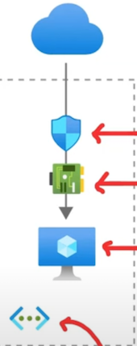

*  **Network Security Group (NSG)** - Attached to the NIC, virtual firewall with rules around ports and protocols
*  **Network Interface (NIC)** - A device that **handle IP protocols and network communication**
*  **Virtual Machine instance** - The actual running server
*  **Public IP Address** - The address that you will use publicly access your VM
*  **Virtual Network (Vet)** - The network where your VM will reside

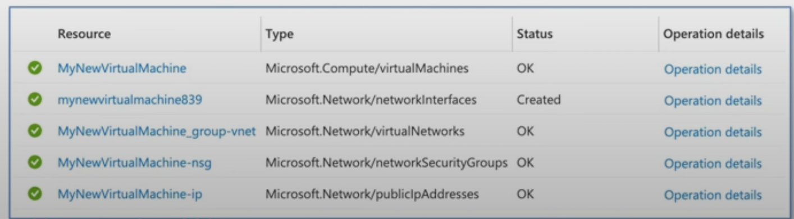

### 3-4 Azure VMs - Operation Systems

**What is an Operation System (OS)?**

The OS is the program that manages all other programs in a computer.

The most commonly known operations systems are Windows, macOS, and Linux.

When you launch a Virtual Machine, you need to choose an Image which has a **specific Operation System.**

Microsoft works closely with partners to ensure the images available are updated and optimized for an Azure runtime. Most of these images can be found in the **Azure Marketplace**


* SUSE Linux Enterprise Server
* Red Hat Enterprise Linux
* Ubuntu Server
* Debian
* FreeBSD
* Azure Marketplace - Flatcar Container Linux
* RancherOS
* Bitnami Library for Azure
* Mesosphere DC/OS on Azure
* Docker images
* suse
* CloudBees Jenkins Platform

You can **Bring Your Own** Linux by creating a Linux Virtual Hard Disk (VHD)

> (Hyper-V virtual hard disk (VHDX) format isn't supported in Azure, only fixed VHD)


### 3-5 Azure VMs - Sizes

Azure VMs come in a variety of sizes that are also optimized for specific use cases.

Azure VMs are grouped into:

* **Types** e.g., General Purposes, Compute Optimized
* **Sizes** e.g., B, Dsv3 (also called Series or SKU Family)

**General Purpose**: Balanced CPU-to-Memory ratio. Testing and development, small to medium databases, and low to medium traffic web servers.

> SKUs: B, Dsv3, Dv3, Dasv4, Dav4, DSv2, Dv2, Av2, DC, DCv2, DV4, Dsv4, Ddv4, Ddsv4

**Compute Optimized**: High CPU-to-memory ratio. Good for medium traffic web servers, network appliances, batch processes, and app servers. 

> SKUs: F, Fs, Fsv2

**Memory Optimized**: High memory-to-CPU ratio, best for relational database servers, medium to large caches, and in-memory analytics.

> SKUs: Esv3, Ev3, Easv4, Eav4, Ev4, Esv4, Edv4, Edsv4, Mv2, M, DSV2, DV2

**Storage** Optimized High disk throughput and I/0, ideal for Big Data, SQL, NoSQL databases, data warehousing, and large transactional databases.

> SKUs: Lsv2

GPU Specialized VMs for heavy graphic rendering and video editing, model training and inferencing (ND) with deep learning.

Available with single or multiple GPUs.

> SKUs: NC, NCv2, NCv3, NCasT4 v3 (Preview), ND, NDv2 (Preview), NV, NVV3, NVV4

**High performance** compute The fastest and most powerful CPU virtual machines with optional high-throughput network interfaces (RDMA).

>  SKUs: HB, HBV2, HC, H

### 3-6 Azure VMS

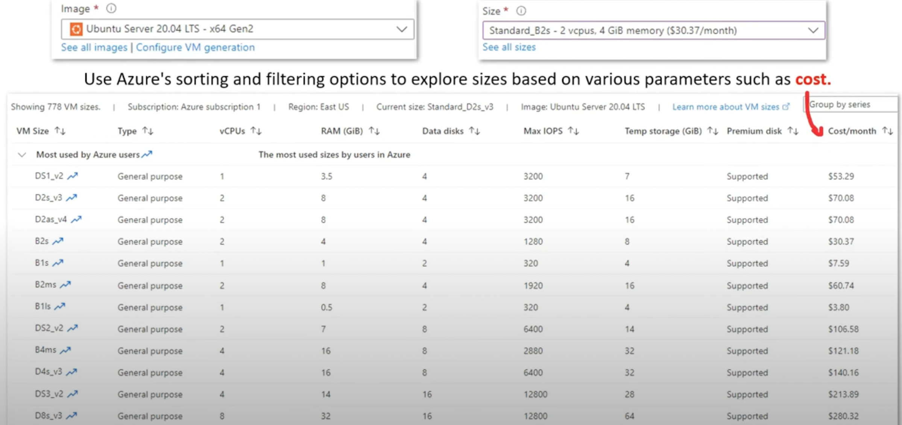


### 3-7 Azure Compute Units

**Azure Compute Unit (ACU) provides a way of comparing compute (CPU) performance across Azure SKUs.**

ACU is currently standardized on a **Small (Standard A1)** VM with the value of 100

All other SKUs then represent approximately how much faster that SKU can run a standard benchmark


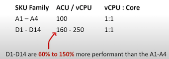

### 3-8 Hyper-V and Generation 1 vs 2

**Hyper-V** is Microsoft's **hardware virtualization product.**

It lets you **create and run a software version of a computer,** called a virtual machine 

Each virtual machine acts like a complete computer, running an operating system and programs.

There are two generations of Hyper-V VMs:

* **Generation 1** - Supports a wide range of guest operating systems.
* **Generation 2** - Supports most 64-bit versions of Windows and more current versions of Linux and FreeBSD operating systems


Azure has Generation 1 and Generation 2 VMs which are similar **but not exactly the same as Hyper-V Generations**

Key Differences Between Azure Gen 1 and Gen 2:

* **Gen 1** 
	* BIOS-based architecture
* **Gen 2**
	* **UEFI-based boot** architecture (improved boot and installation times)
	* Secure Boot verifies the boot loader is signed by a trusted authority
	* Larger boot volume up to 64 TB

	
* **Hyper-V VMs** are packaged into Virtual 
* Hard Disk formats: VHD or VHDX files


## 4 SSH, RDP, and Bastions

### 4-1 Secure Shell (SSH)

It is very common to use **SSH key pairs** as a means to authenticate to your VMs.

**SSH Key Pairs is when you generate out two keys**:

```
~> ssh-keygen -t rsa
```

* **A Private Key.**

<mark>The private key should remain on your local system and not be shared with others.</mark>

* **A Public Key**

The public key is stored on VM.

**When you try to connect**, your system sends a secure signal using the private key. The server checks this signal with its public key. If they match, you get **access**.

```
ssh-i~/.ssh/id_rsa.pub azureuser@10.111.12.123
```

#### **Advantages of Using SSH Key Pairs:**

* **Security**: SSH keys provide a more secure method of authentication than traditional passwords. Without the correct private key, unauthorized access attempts are effectively thwarted.
* **Convenience**: Once set up, users can connect without needing to remember and input a password each time.
* **Automation**: Automated scripts and services can use key pairs to establish connections without human intervention.

### 4-2 SSH, RDP, and Bastion

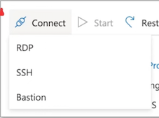

There are **multiple ways to connect to your Virtual Machines**

#### **Secure Shell (SSH)** 

is a protocol to establish a secure connection between a client and server.

* This is how you can remotely connect to your Azure VM via terminal
* SSH happens on Port 22 via TCP
* RSA Key Pairs are commonly used to authorize access

#### **Remote Desktop Protocol (RDP)** 

is a proprietary protocol developed by Microsoft that provides a user with a graphical interface to connect to another computer over a network connection.

* This is how you can remotely connect to Windows Server via Virtual Desktop
* RDP happens on Port 3389 via TCP and UDP

#### **Bastion**

Azure Bastion is a service you deploy that lets you connect to a virtual machine **using your browser and the Azure portal**.

* It provides **secure and seamless RDP/SSH** connectivity to your virtual machines directly from the Azure portal over TLS
* A bastion is a hardened instance that is monitored. Users connect to this VM which then establishes a connection to the target instance. Sometimes known as jump box since you have one extra security step.


### 4-3 Remote Desktop Protocol (RDP)

RDP is a protocol developed by Microsoft that allows users to remotely connect to Windows systems.

When you want to use RDP to access your Windows Server, you'll first need to **download the RDP file**.


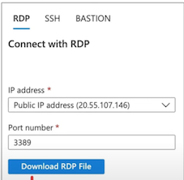

However, if you're using mac OS, you can easily get the Microsoft Remote Desktop app from the Apple Store.

Once you **open the RDP file**, you will use the **Username and Password** during the creation of your VM in the Azure Portal

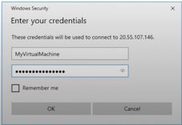

### 4-4 Azure Bastion

Azure Bastion serves as a **secure bridge**, enabling you to connect to your server via SSH or RDP without exposing it to the public. It will provision a web-based interface for both RDP and SSH eliminating the need for external clients.

This can be especially useful for devices like Google Chromebooks, which might **not support traditional RDP clients**.

**How does it work?**

When you create an Azure Bastion,

You need to add a Subnet to your Virtual Network (Vnet) called **AzureBastionSubnet** with at least a size of **/27, (32 addresses)**.

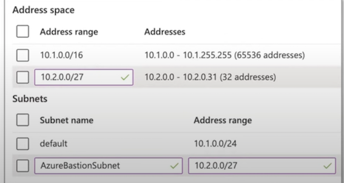


**Azure Bastion**

If you have a **Windows Server** which requires RDP and have a Bastion in the same VNet.

You simply enter in your Username and Password as you normally would


### 4-5 Windows vs Linux Servers

Azure VMs offer the flexibility to run both **Windows and Linux-based servers.**

#### **Windows**


* **Licensing**: To run Windows, you'll need a valid license. If you don't activate it, certain features may be restricted. Azure does offer a way to leverage existing licenses through its **Hybrid Benefit program**

* **Authentication**: Typically, you set up a username and password during the VM creation.

* **Instance Size**: To smoothly operate Windows, you'd typically need a larger VM size, starting at least with a B2 due to its comprehensive desktop environment.

* **Environment**: Windows provides a full desktop environment, complete with a graphical user interface, making it more intuitive for those familiar with the Windows ecosystem.


#### Linux

* **Licensing**: Most Linux distributions are open-source and don't require any licensing fees.

* **Authentication**: You can set up a username and password or use **SSH key pairs** for a more secure connection.

* **Instance Size**: Linux servers have **minimal system requirements**. This means you can run them on smaller VM sizes, conserving resources and costs.

* **Environment**: Traditionally, Linux systems operate with a terminal-based environment, although there are distributions with graphical interfaces.

### 4-6 Update Management

**Update Management** allows you to **manage and install operating system updates and patches** for both Windows and Linux virtual machines that are deployed in Azure, on-premises, or with other cloud providers

When you launch an Azure VM, you can go to Operations and turn on **'Guest + Host Updates'**. This will install the Microsoft Monitoring Agent (MMA) that will be used to monitor your instances

> Azure Automations is the underlying service that is installed the agent.

* **Update Management will perform a scan for update compliance**
* By default, a compliance scan is performed every **12 hours on Windows and every 3 hours** on Linux.
* It can take between **30 minutes and 6 hours** for the dashboard to display updated data from managed computers.

In Azure Automation, you can enable the Update Management, Change Tracking and Inventory, and Start/Stop VMs during off-hours features for your servers and virtual machines. 

These features have a dependency on a **Log Analytics workspace**, and therefore require linking the workspace with an Automation account.

### 4-7 Azure Virtual Desktop

Azure Virtual Desktop on Microsoft Azure is a desktop and app virtualization service that runs on the cloud.

Azure Virtual Desktop works across devices, **like Windows, Mac, iOS, Android, and Linux,**
with apps that you can use to access remote desktops and apps.

You can use most modern browsers to access Azure Virtual Desktop-hosted experiences.


Use Azure Virtual Desktop for specific needs like when security is a concern because all data is saved on the server and cannot be left on the device of a user.


### 4-8 Azure Virtual Desktop - Advantages

**Enable secure and productive remote work on any device**

* Azure Virtual Desktop provides full Windows 10 and Windows Server desktop and application virtualization on any personal device.
* Seamless integration with **Microsoft 365 Apps for enterprise and Microsoft Teams**

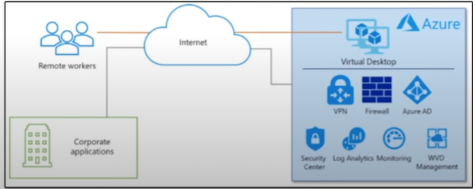


**Reduce costs of licensing and infrastructure**

Use eligible Windows or Microsoft 365 licenses to access Windows Virtual Desktop and pay only for what you use.

**Protect against outages to stay productive**

Help keep your team running during outages by leveraging built-in Azure Site Recovery and
Azure Backup technologies.

**Simplify IT management**

Windows Virtual Desktop manages the virtual desktop infrastructure for you, so you can focus on users, apps, and OS images instead of hardware and maintenance.

**Keep application and user data secure**

Easily apply the right access controls to users and devices with Azure Active Directory Conditional Access.


## 5 Introduction to Azure App Service

**Azure App Service is an HTTP-based platform** for web apps, RESTful APIs, and mobile backend services.

You can choose your programming language in Python, Java, or any other language, and run it in either a Windows or Linux environment.

It is a Platform as Service, so it's the **Heroku equivalent for Azure**.

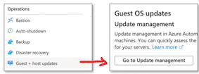

**Azure App Service takes** care of the following underlying infrastructure:


* OS and language security patches
* Load balancing
* Auto-scaling
* Infrastructure management

Azure App Service makes it easy to implement common Integrations and features such as:

* Azure DevOps (For deployments)
* GitHub and Docker Hub
* Package Management
* Easy to setup staging environments
* Custom Domains
* Attaching TLS/SSL Certificates

You pay based on an Azure App Service Plan:

* **Shared Tier** - Free, Shared (Linux not supported)
* **Dedicated Tier** - Basic, Standard, Premium, PremiumV2, PremiumV3 
* **Isolated Tier**

You can also deploy single or multi-container Docker applications.

### 5-1 Introduction to Azure App Service

**Azure App Service** is an **HTTP-based platform** for <mark>web apps, RESTful APIs, and mobile backend services.</mark>

You can choose your programming language in Python, Java, or any other language, and run it in either a Windows or Linux environment.

It is a Platform as Service, **so it's the Heroku equivalent for Azure.**

**Azure App Service takes** care of the following underlying infrastructure:

* OS and language security patches
* Load balancing
* Auto-scaling
* Infrastructure management

Azure App Service makes it easy to implement common Integrations and features such as:

* Azure DevOps (For deployments)
* GitHub and Docker Hub
* Package Management
* Easy to setup staging environments
* Custom Domains
* Attaching TLS/SSL Certificates

You pay based on an Azure App Service Plan:

* **Shared Tier** - Free, Shared (Linux not supported)
* **Dedicated Tier** - Basic, Standard, Premium, PremiumV2, PremiumV3
* **Isolated Tier**


You can also deploy single or multi-container Docker applications.


When you create your app, you have to choose a unique name, since it becomes a fully qualified domain


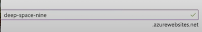

### 5-2 Azure App Service - Runtimes

**What is a Runtime Environment?**

**A "Runtime Environment" refers to the software and settings needed for a program to run in a defined way at runtime.**

<mark>A runtime generally means what programming language and libraries and framework you are using.</mark>

A runtime for Azure App Services will be a pre-defined container that has your programming language and commonly used library for that language installed.

With Azure App Services you choose a runtime.

* .NET
* .NET Core
* Java
* Ruby
* Node.is
* PHP
* Python

Azure App Services will have generally multiple latest versions of a programming language e.g., Ruby 2.6, 2.7

Its common for a cloud provider to stop supporting older versions, so you keep current and forces customer to keep good security practices by having latest patches.


### 5-3 Azure App Service - Custom Container

Azure App Service gives you the flexibility to use **custom containers for both Windows and Linux.**

The reason you may opt for a custom container is to use a **distinct runtime** that isn't natively
supported or to incorporate specific packages and software.

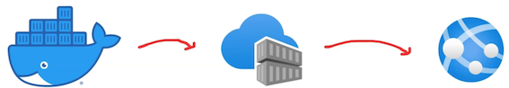

* **Design Your Container:**

Begin by creating a Docker container tailored to your needs on your local machine.

* **Push to Azure:**

Once your container is ready, push it to the Azure Container Registry.

This centralized repository ensures that your container is easily accessible within Azure.

* **Deploy and Go Live:**

Deploy your container image directly to the **Azure App Service**.

Once deployed, Azure takes care of scaling, maintenance, and updates.

### 5-4 Azure App Service - Deployment Slots

**Deployments Slots allow you to create different environments** of your web-application associated to a different hostname. 

This is useful when you require a testing, staging, or QA environment alongside your production setup.

Deployment Slots let you swiftly **replicate** your production setting for various purposes, ensuring consistent testing environments.

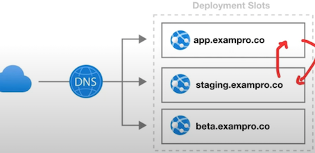

You can also **Swap environments**. This is useful for executing **Blue/Green deployments**

By using Swap, you can promote your staging environment to production with ease.

You can promote our staging to production by swapping, if something goes wrong you could swap them back. This capability ensures **minimal downtime** and enhances the user experience since you can introduce changes in a controlled manner, rolling them back if necessary.


### 5-5 Azure App Service - App Service Environment

**App Service Environment (ASE)** is an Azure App Service feature that provides **a fully isolated and dedicated environment** for securely running App Service apps at high scale

This allow you to host:

* Windows and Linux web apps
* Docker containers
* Mobile apps
* **Functions**

App Service environments (ASEs) are appropriate for application workloads that require:

* **Very high scale**
* **Isolation and secure network access**.
* High memory utilization

Customers can create multiple ASEs within a single Azure region or across multiple Azure regions making ASEs
ideal for **horizontally scaling stateless application tiers in support of high requests per second (PS) workloads**

* ASE comes with its own pricing tier (Isolated Tier)
* ASEs can be used to configure security architecture
* Apps running on ASEs can have their access gated by upstream devices, such as web application firewalls (WAFs)
* App Service Environments can be deployed into Availability Zones (AZ) using zone pinning.

There **are 2 deployment types** for an App Service environment (ASE):

1. **External ASE**
2. **ILB ASE**

External ASE exposes the ASE-hosted apps on an **internet-accessible IP address.**

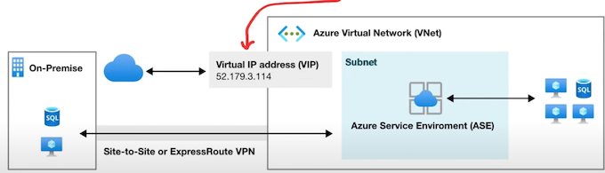

If the VNet is connected to your on-premises network, apps in your ASE also have access to resources there without additional configuration.

**Because the ASE is within the Net, it can also access resources within the Vet without any additional configuration**.

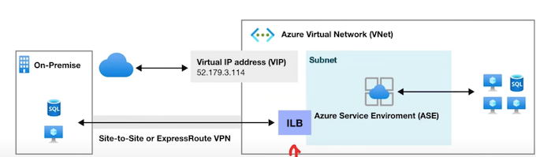

**ILB ASE** exposes the ASE-hosted apps on an IP address inside your VNet.

The internal endpoint is an **internal load balancer (ILB)**

### 5-6 Azure App Service - Deployment

**What is Deployment?**

The action of pushing changes or updates from a local environment or repository into a remote environment.

Azure App Services provides many ways to deploy your applications:

* Run from Package
* Deploy ZIP or WAR (Uses Kudu)
* Deploy via FTP
* Deploy via cloud svnc (Dropbox or One Drive)
* Deploy continuously (GitHub, BitBucket, and Azure Repos) using Kudu and Azure Pipelines
* Deploy using a custom container C/CD pipeline (Deploy for Docker Hub or Azure Container Registry)
* Deploy from local Git (Kudu build server)
* Deploy using GitHub Actions
* Deploy using GitHub Actions containers
* Deploy with template (ARM templates)

Run from a package is when the files in the package **are not copied to the wwwroot directory**.

Instead, the ZIP package itself gets **mounted directly as the read-only wwwroot directory**.

All other deployment methods in App Service have
deployed to the following directory:

* (Windows) `D:\home|site | wwwroot`
* (Linux) `/home/site/wwwroot`

Since the same directory is used by your app at runtime, it's **possible for deployment to fail because of file lock conflicts**, and for the app to behave unpredictably because some of the files are not yet updated.

Kudu supports the following functionality for ZIP file deployment:

* Deletion of files left over from a previous deployment
* Option to turn on the default build process, which includes package restore
* Deployment customization, including running deployment scripts
* Deployment logs
* A file size limit of 2048 MB

You can deploy using

* Azure CLI
* Azure API via REST (cURL)
* Azure Portal

```
# Azure CLI
az webapp deployment source config-zip --resource-group <group-name> --name <app-name> --src clouddrive/<filename>.zip

# CURL
curl -X POST -u <deployment_user> --data-binary @"<zip_file_path>" https://<app_name>.scm.azurewebsites.net/api/zipdeploy

# Azure PowerShell
Publish-AzWebapp -ResourceGroupName <group-name> -Name <app-name> -ArchivePath <zip-file-path>
```

### 5-7 Azure App Service - Deployment

**You can use (File Transfer Protocol) FTP protocol to upload files.**

You will need your own FTP client. You just drag and upload your files.

Go to the Deployment Center

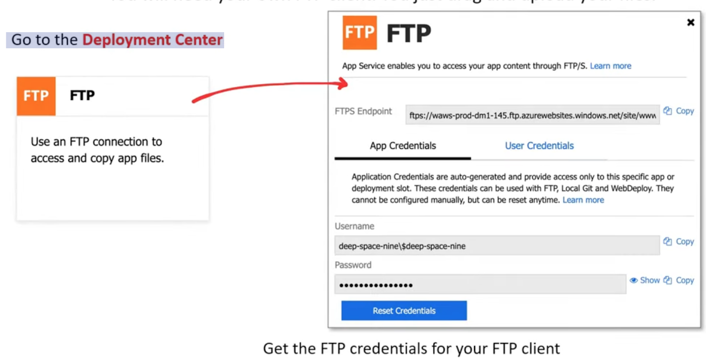

### 5-8 Azure App Service - Deployment

**ZIP and WAR file deployment** uses the same **Kudu service** that powers continuous integration-based deployments.

Kudu is the engine behind **git deployments in Azure App Service**.

It's an open-source project that can also run outside of Azure

### 5-9 Azure App Service - Deployment

You can use **Dropbox or OneDrive** to deploy using a cloud sync.

You go to Deployment Center, configure for Dropbox or OneDrive.

When you turn on Sync it will create a folder in your drop cloud drive:

* OneDrive: **Apps\Azure Web Apps**
* Dropbox: **Apps \Azure**

This will sync with your **/home/site/wwwroot**, so you just update files in that folder.

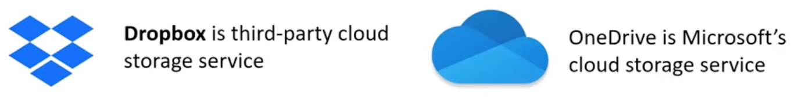

### 5-10 Azure App Service - AutoScale

**Autoscaling** is the process of adjusting a server infrastructure capability to fulfill incoming requests from your web application. 

It usually takes seconds for the changes to take effect and can be done automatically according to **pre-configured metrics**. It does not need any new deployment or coding changes.

**Scaling Options in Azure App Service:**

**Horizontal**: This involves adding or removing web servers to/from your infrastructure. E.g., During peak hours, you might scale up from one virtual machine to three.


**Vertical**: Adding/removing resources from your web servers, such as CPU, memory, or storage. E.g., Increase your storage capacity to store more logs.

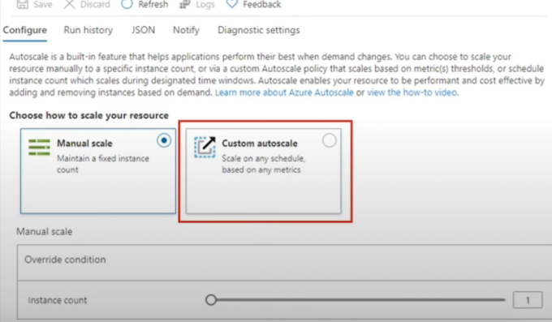


### 5-11 Azure App Service Plan

**Azure App Service Plan** determines the region (Datacenter) of the physical server where your web application will be hosted and defines the **amount of storage, RAM, and CPU your application will use**. It offers several pricing tiers:

Shared Tiers

There are 2 shared: Free, Shared

**Free Tier provides:**

* 1 GB of disk space
* Up to 10 apps on a single shared instance
* No SLA for availability
* Each app has a compute quota of 60 minutes per day

**Shared Tier provides**

* Up to 100 apps on a single shared instance
* No SLA for availability
* Each app has a compute quota of 240 minutes per day

> Shared Tier does not support Linux-based instances

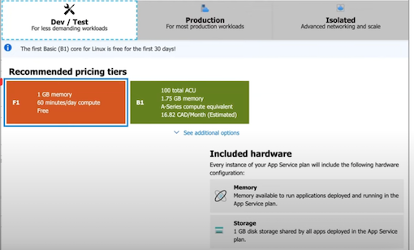

**Dedicated Tiers**

Basic, Standard, Premium, PremiumV2, PremiumV3

**Basic**

* More disk space
* Unlimited apps
* 3 levels in this tier that offer varying amounts of compute power, memory, and disk storage

**Standard**

* Scale out to three dedicated instances
* SLA of 99.95% availability
* 3 levels in this tier that offer varying amounts of compute power, memory, and disk storage

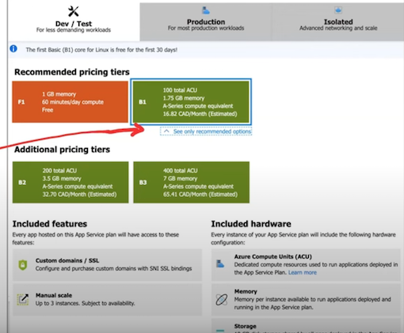


**Premium**

* Scale to 10 dedicated instances
* Availability SLA of 99.95%
* multiple levels of hardware

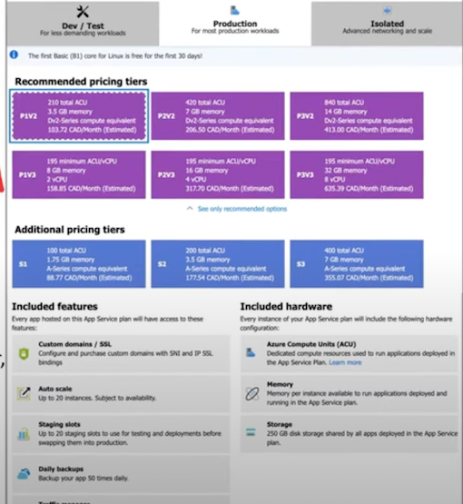

**Isolated Tier**

* Dedicated Azure virtual network
* Full network and compute isolation
* Scale out to 100 instances
* Availability SLA of 99.95%


## 6 Enable diagnostics logging

**Azure provides built-in diagnostics** to assist with debugging an **App Service app**

**Diagnostics logging** is an important part of any Web application's operation.
It allows you to troubleshoot **exceptions, non-exception errors, alerts**, and
**warnings, as well as track and improve the user experience**.

**With Azure Diagnostics Logging**, you may log

* **Application events** generated by your application
* **Web Server logging**, with a raw version of requests made to your app. Only available for the Windows platform.
* **Detailed Error Pages**, saving copies of the error pages presented to your user. Only available for the Windows platform.
* **Failed request tracing,** with detailed information regarding failed requests. Only available for the Windows platform.
* **Deployment logging**, logging detailed information about the deployment process in order to troubleshoot when a deployment fails.

### 6-1 Enable application logging (Windows)

To enable **application logging** for Windows apps in the Azure portal, navigate to your app and select **App Service logs**.


Select **On for either Application Logging (Filesystem)** or **Application Logging (Blob)**, or both.


* The **Filesystem option** is for temporary debugging purposes and turns itself off in **12 hours**.

* The **Blob option** is for **long-term** logging and needs a blob storage container to write logs to.

You can also set the **Level** of details included in the log as shown in the table below.

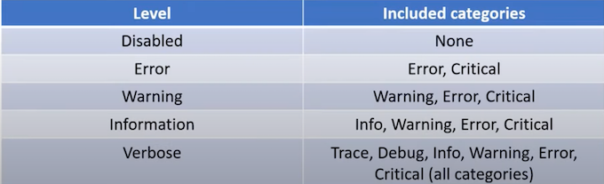

### 6-2 Enable application logging (Linux/Container)

**Enable application logging for Linux/Container**

In **App Service logs** set the **Application logging** option to **File System**

* In **Quota (MB)**, specify the **disk quota** for the application logs.
* In **Retention Period (Days), set the number of days** the logs should be retained.

When finished, select Save.

## 7 Configuring Azure Web App Settings

### 7-1 Configuring Azure Web App Settings

**Azure Web Apps settings** can be configured via **Azure CLI or Azure Portal**, which can also be edited in **bulk** via the Azure Portal.

The main settings that may be configured for your Azure Web App are the following:

* **TSL/SSL Settings**, to have a secure and encrypted communication channel
* **API Settings**, such as technology stack or platform settings
* **APP Settings**, you can override your configurations stored on the Web.Config
* **Connection Strings**, in order to do not have it written on the Web.Config
* **Default Documents**, displays default web pages when accessing the root of your Website URL
* **Path Mappings**, configure settings according to the user OS

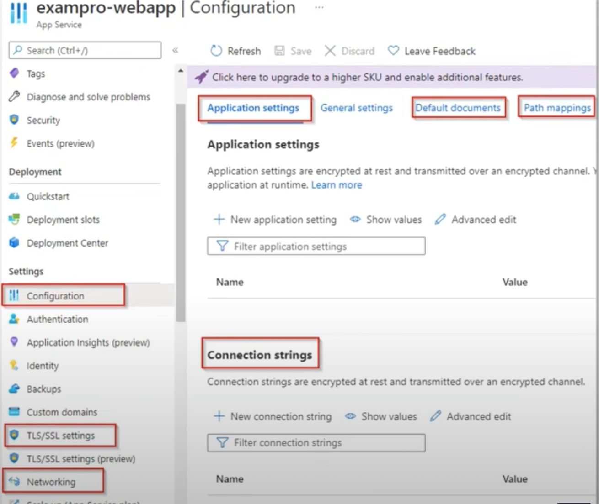


## 8 Azure Container Instances (ACIs)

### 8-1 Introduction to ACI

**Azure Container Instances (ACIs)** allow you to **launch containers** without the need to worry about configuring or managing the underlying virtual machine

Azure Container Instances is designed for isolated containers:

* Simple applications
* Task automation
* Build jobs

* Containers can be provisioned **within seconds** where VMs can take several minutes
* Containers are **billed per second** where VMs are billed per hour (greater savings)
* Containers have **granular and custom sizing of CPUs, Memory and GPUs** where VMs sizes are predetermined
* ACI can deploy both **Windows and Linux** containers
* You can **persist storage with Azure Files** for your ACI containers
* ACIs are accessed via a fully qualified domain name (FQDN) e.g. customlabel.azureregion.azurecontainer.io.

Azure provides Quickstart images to start launching example applications, but you can also **source** containers from:

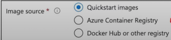


* Azure Container Registry
* Docker Hub
* Privately Hosted Container Registry

**Container Groups** are collection of containers that get scheduled on the same host machine.

The containers in a container group share:

* **lifecycle**
* **Resources**
* **local network**
* **storage volumes**

> Container Groups are similar to a Kubernetes pod

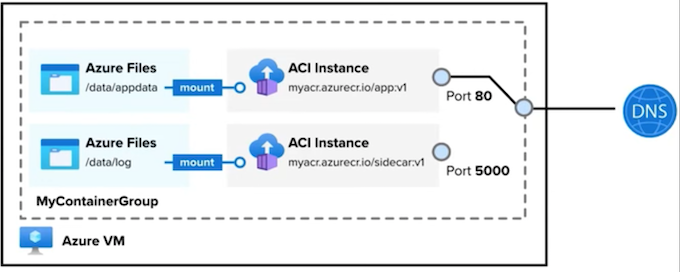

Multi-container groups currently support only Linux containers.

There are two ways to deploy a multi-container group:

* **Resource Manager Template (ARM template)** - when you need to deploy additional Azure service resources
* **YAM File** - when your deployment includes only container instances.

### 8-2 Container Restart Policies

**A container restart policy** specifies what a container should do when their process has completed.

Azure Container Instances has 3 restart-policy options:

* **Always (default)** Containers are **always restarted**. Suited for long running tasks e.g., web-servers
* **Never** Containers **do no restart once they've completed their execution**. Suited for one off tasks. e.g.,**batch jobs, scheduled tasks.**
* **OnFailure** Containers will only **restart if they stop due to an error** or unexpected termination

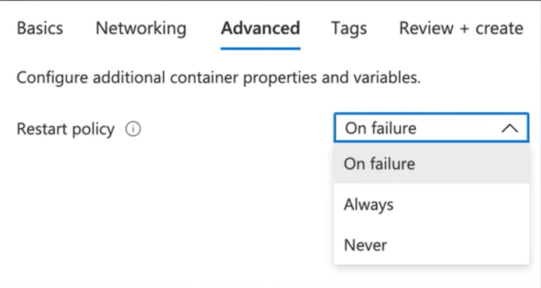

### 8-3 Container Environment Variables

Environment variables are **key-value pairs** that can be used to configure and manage the behavior of applications running inside containers.

<mark>Environment variables (En Vars) allow you to pass **configuration details** to your containers.</mark>

Environment variables can be set via the Azure Portal, CLI or PowerShell

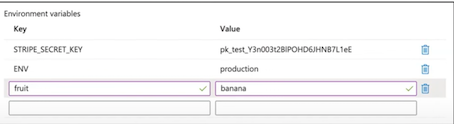

**Secured Environment Variables**

By default, Environment Variables are stored in plaintext. 

If you need to secure your environment variables, you can use the **--secure-environment-variables** flag

```
az container create \
--resource-groupaci-resource-group\
-- name aci-demo-secure \
--image exampro/rails:backend \
--ip-address Public \
--location eastus \
--secure-environment-variables \
STRIPE_SECRET_KEY=$STRIPE_SECRET_KEY
```

### 8-4 Container Troubleshooting

* **az container logs**: This command lets you fetch logs from your container. These logs can provide insights into application behavior and possible errors.

```
az container logs \
--resource-group exampro \
--name prod-web-app
```


* **az container attach:** If you need diagnostic data during container startup, use this command. 

It helps in understanding issues that might arise during the **initialization phase** of a container.

```
az container attach \
--resource-group exampro \
--name prod-web-app
```

* **az container exec**: This command starts an **interactive session**. 

This is useful for live debugging and to inspect the container's current state.

```
az container exec
--resource-group exampro\
--name my-web-app\
--exec-command/bin/sh
```

* **a monitor metrics list**: This command gives you **metrics** related to your container, such as **CPU usage**, which can be essential for performance tuning or **identifying bottlenecks**.

```
a monitor metrics list \
--resource $CONTAINER_ID \
--metric CPUUsage \
--output table
```

## 9 Azure Container Registry


**Azure Container Registry** is a managed, private **Docker registry service** based on the **open-source Docker Registry 2.0** used to **build** and **store** the containerized applications/images.


* Use **Azure Container Registries** with your existing container development and deployment pipelines.
* Use **Azure Container Registry** Tasks to **automate image** builds directly in Azure when you commit code.

Pull images from an Azure container registry to various deployment targets:

* Kubernetes
* DC/OS
* Docker Swarm

Many Azure services have direct support to use ACR:

* Azure Kubernetes Service (AKS)
* Azure App Service
* Azure Batch
* Azure Service Fabric
* and more!

Developers can also push to a container registry as part of a container development workflow with delivery tools such as:

* Azure Pipelines
* Jenkins

Many ways to work with ACR via:

* Azure CLI
* Azure PowerShell
* Azure Portal
* Azure SDK
* Docker Extension for Visual Studio Code

### 9-1 zure Container Registry Tasks

**AC Tasks** allow you to **automate OS and framework patching** for your Docker containers.

For **Quick tasks**, ACR Tasks let you instantly push a specific container image to Azure's container registry, **without needing a local Docker Engine installation**

You can trigger automated builds by:

* Source code updates
* Updates to a container's base image
* Timers on a schedule


You can create multi-step tasks e.g.

1. Build a web application image
2. Run the web application container
3. Build a web application test image
4. Run the web application test container


**Tasks can take advantage of run variables**

The location of a set of source files used to build a container image or other artifact

**Tasks can take advantage of run variables**

Reuse task definitions and standardize tags for images and artifact

## 10 Introduction to Docker

Docker is a powerful platform designed for automating the deployment, scaling, and management of applications using **containerization**.

Docker abstracts **infrastructure and environment variables**, allowing you to create a controlled environment within your **Docker Container**.

We can install **Docker Images** into those Docker Containers, with each Docker Image representing **one or a group of common software.**

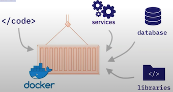

### 10-1 Docker - Overview

The machine on which **Docker** is installed and running is usually referred to as a **Docker Host or Host**.

When you deploy an application on the host, it will create a **logical entity** to host where the application called **a Container or Docker Container**.

A **Docker Container** does not have any OS installed and running on it. It has a virtual **copy of the process table, network interface(s)**, and the file system mount point(s) which have been inherited from the OS of the host on which the container is hosted and running.

The **kernel** of the host's OS is shared across all the containers that are running on it.

This allows each container to be **isolated** This allows each container to be isolated

> It supports **multiple containers** with **different** application requirements and dependencies to run on the **same host** if the OS requirements are the same.

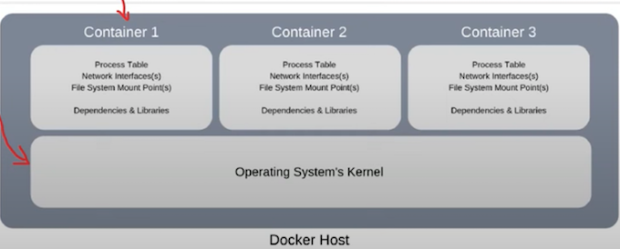

### 10-2 Docker - Key Benefits

Docker supports **multiple applications** with different requirements and dependencies to be hosted on the same host if the OS requirements are the same.


* **Storage Optimized**. Containers are typically a **few megabytes** in size and consume very little disk space, allowing a large number of applications to be hosted on the same host.

* **Robustness**. Containers don't contain a full OS, making them more lightweight than virtual machines. As a result, they use significantly less memory and can boot up in **mere seconds**, whereas a VM might take several minutes.


* **Reduces costs**. Docker is **less demanding** when it comes to the hardware required to run it.


* **Better disaster recovery**. You can **back up** a Docker image (aka "snapshot") of the state of the container at a specific point in time and **restore** it later if serious issues arise.

* **Faster configuration with consistency**. You can just put your **configurations** into code and deploy it. Saves a lot of **time** from preparing the setup and deployment documentation

### 10-3 Docker - Dockerfile

A Dockerfile is a text document that contains all the commands a user could call on the command line to assemble an image.

Using **docker build** users can create an automated build that executes several command-line instructions in succession.

Key points of an example Dockerfile

1. The **Dockerfile is a text file** that (mostly) contains the instructions that you would execute on the command line to create an image.
2. A **Dockerfile** is a step by step set of instructions.
3. Docker offers standard commands for use within the 
	* Dockerfile, such as: **FROM, COPY, RUN, ENV, EXPOSE, CMD**

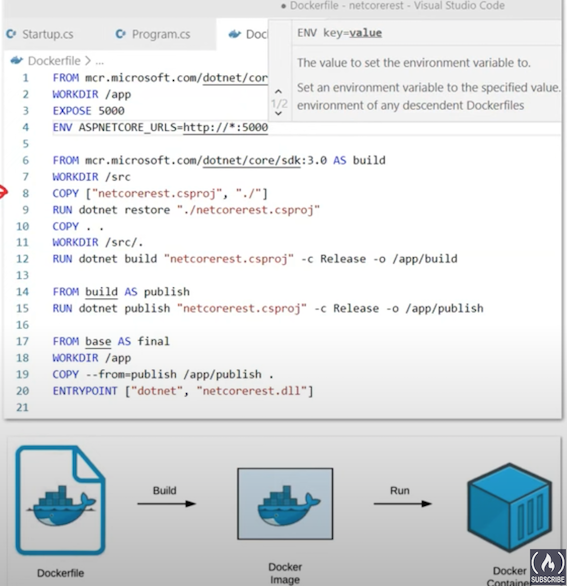


## 11 What is Serverless?

### 11-1 What is Serverless?

Serverless architecture generally describes fully managed cloud services.

The classification of a cloud service as being serverless is not a Boolean answer (yes or no), but an answer on a scale where a cloud service has a degree of serverless.

A serverless service could have all or most of the following characteristics:

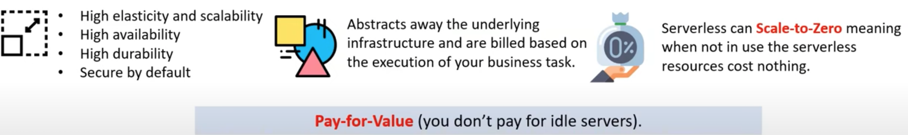

An analogy of serverless could be similar to an energy rating labels which allows consumers to compare the energy efficiency of a product.

Some services are more serverless than others.

### 11-2 Function as a Service

**What is Function as a Service (FaaS)?**

FaaS empowers developers to concentrate on crafting specific pieces of code, known as functions.

These functions can be event-driven, meaning they **either trigger based on events or produce event data. **

Typically, several functions are interwoven to form a serverless application, and these functions are activated only when called upon.

* Function as a Service (FaaS) is not serverless on its own.
* Faas is only serverless if its fully-managed and scales to zero.

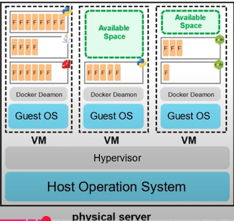

### 11-3 Azure Functions

**Azure Functions** is a Function as Service (FaaS) offering that allows developers to focus on writing code and not worry about maintaining the underlying computing infrastructure.

A **trigger** is the chosen event data that will cause function to execute

**You can only have one trigger**

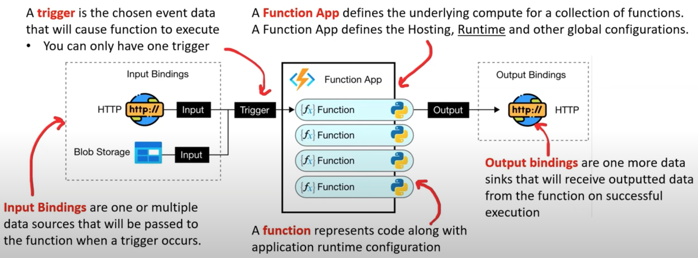


There are four versions of Azure Functions 1.x, 2.x, 3.x and 4.x. We are currently using 4.x

### 11-4 Azure Functions - Storage Considerations

Every function app requires a storage account to operate.

If that account is deleted, your functions won't work.


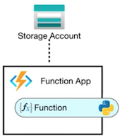


Azure Functions uses the following storage types in the Storage Account


**Blob Storage** Maintain bindings state and function keys

**Azure Files** 

* File share used to store and run your function app code in a Consumption Plan and Premium Plan.
* Azure Files is set up by default, but you can create an app without Azure Files under certain conditions.


**Queue Storage** Used by task hubs in Durable Functions.

**Table Storage** Used by task hubs in Durable Functions.

### 11-5 Azure Functions - Anatomy of a Function


* **function.json** - configuration of a single function defining bindings
* **Code** - The code for your function
* **uncignore** - files to ignore
* **host.json** - global configuration of all functions at the function app level
* **Local Project** - a place to locally store code

### 11-6 Azure Functions HTTP Authorization Levels

**Authorization level** determines what keys, if any, need to be present on the request in order to invoke the function.

The authorization level can be one of the following values:

* **Anonymous** -No API key is required.
* **Function** -A specific API key for that function is needed (default setting).
* **Admin** - The master key for all functions within that function app is required.

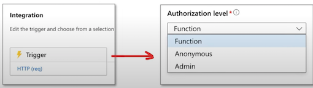

Authorization level can usually be **changed** after creation in the portal, and is set on the trigger

### 11-7 Azure Functions Debugging

You can **enable streaming** logs for Azure Functions to see near real
time logging when an error occurs

There are two ways to view a stream of log files being generated by
your function executions

* **Built-in log streaming**

the App Service platform lets you view a stream of your
application log files.


* **Live Metrics Stream**

when your function app is connected to Application Insights, you can view log data and other metrics in near real-time in the Azure portal using Live Metrics Stream
 
> Log streams can be viewed both in the portal and in most local development environments.

### 11-8 Azure Functions Key Concepts

**Lightweight & Serverless**: Azure Functions are compact and potentially serverless, removing the need for heavy infrastructure.

**Efficiency & Speed:**


* Easy to **write, deploy, and upgrade** without affecting other website components.
* Azure Functions are **fast** to execute because there is no large application, startup time, initialization, and other events fired before the code is executed.
* Event-driven execution ensures they run only when an event **triggers** them.


**Zero Maintenance**: No need for active infrastructure management or associated costs. They scale automatically to meet traffic demands, even scaling to **zero cost when idle.**

**Development Ease:**

* Azure Functions can be built, tested, and deployed directly from the Azure portal.
* Built-in C/CD through **Azure DevOps and monitoring with Azure Monitor **streamline the development process.

**Cost-Effective: Pay** only for the actual runtime, eliminating costs when functions are idle.

**Interoperability:** Using industry-standard protocols, Azure Functions can seamlessly communicate with various **APIs, databases, and libraries**.

### 11-9 Azure Functions - Use Cases

**Business Use-Cases**

* **Scheduled Tasks**
* Reminders and Notifications
* **Lightweight Web API**
* Sending background emails
* Running background backup tasks
* Doing backend calculations


**Technical Use-Cases**

* Sending emails
* Starting backup
* Order processing
* Task scheduling
	* Database cleanup
	* Sending notifications
	* Messages
	* IT data processing

> Azure functions are best suited for smaller apps have events that can work independently of other websites.

### 11-10 Azure Functions - Templates

Azure provides function **templates** to get you started with common function scenarios:

* **HTTP** - triggered by an HTTP request and returns HTTP
* **Timer** - triggered based on a schedule
* **Blob Storage** - triggered when files are uploaded/updated in a Blob storage container.
* **Cosmos DB** - triggered when processing a new/modified Cosmos B documents.
* **Queue Storage** triggered by Azure Storage queue messages.
* **Event Grid** triggered by event from Event Grid
	* Many Azure services can trigger a function through Event Grid
	* Event Grid is a serverless event bus integrated with Azure services
* **Event Hub** - triggered by Event Hub event. (streaming)
* **Service Bus Queue** - triggered by a message in a Bus Queue (messaging)
* **Service Bus Topics** - triggered by an event from Bus Topic (pub/sub)
* **SendGrid** - triggered by an email event in third-party service SendGrid

### 11-11 Azure Functions - Functions Configuration

Every function contains a function configuration file **called function.json**

The function.json file defines the function's trigger, bindings, and other configuration settings

* **type** Specifies the binding type.
* **direction** Indicates whether the binding is for receiving data into the function or sending data from the function
* **name** Represents the data binding in the function

	* • For C#, this is an argument name;
	* • for JavaScript, it's the key in a key/value list.


```json
{
	"disabled": false,
	"bindings":[
	// ... bindings here
{
	"type": "bindingType",
	"direction": "in",
	"name": "myParamName",
	// ... more depending on binding
		}
	]
}
```

### 11-12 Azure Functions - Host Configuration

Every **function app has a host configuration file named host.json**

This configuration file contains global configurations options and parameters for all the functions within the function app

The host has lot of configuration options:

* aggregator
* applicationInsights
* blobs
* console
* cosmosDb
* customHandler
* durableTask
* eventHub
* extensions
* extensionBundle
* functions
* functionTimeout
* healthMonitor
* http
* logging
* managedDependency
* queues
* retrv
* sendGrid
* serviceBus
* singleton
* version
* watchDirectories
* watchFiles


```
{  
	"extensions": {  
		"http": {  
			"routePrefix": "api",  
			"maxOutstandingRequests": 200,  
			"maxConcurrentRequests": 100,  
			"dynamicThrottlesEnabled": true,  
			"hsts": {  
				"isEnabled": true,  
				"maxAge": "10"  
			},  
			"customHeaders": {  
				"X-Content-Type-Options": "nosniff"  
			}  
		}  
	}  
}
```

### 11-13 Azure Functions - Plan Services

**Azure Functions has 3 available of plans**

**1 Consumption Plan (Serverless) Cold-Starts**

* You only pay for the time your code or application is running.
* Billing is based on the number of executions, the duration of each execution, and the amount of memory used.
* Just pay while you have functions running and scale-out automatically, even through long loading times.

**2 Premium Plan (Functions Premium) Pre-Warmed**

* The user has designated a set of pre-warmed cases, which are already online and ready to react instantly.
* Azure provides any additional computing services that are required when your function is running.
* You pay for the constantly pre-warmed instances including any additional instances needed to scale the Azure app in/out.
* Azure Functions host instances are added and removed based on the number of incoming events.

**3 Dedicated Plan (App service plan) VM sharing**

* When you use App Service for other apps, your functions will run on the same plan (VMs) at no extra cost.
* You may scale it out manually by adding more VM instances for an App Service plan.
* You may also have autoscale enabled.
* Optimal when you have existing, **underutilized VMs**, which also operate other instances of the App Service.


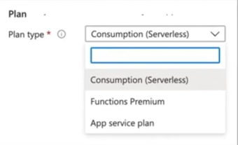

### 11-14 Azure Functions - Triggers and Bindings

**Triggers and bindings** lets you avoid hardcoding access to other services and
abstracting away boilerplate code keeping your functions lean.

**What is a trigger?**

* A trigger is a specific type of event which causes the function to **run**.
* It defines how a function is **invoked** and a function must only have one trigger.
* Triggers can have associated **data** which is often provided as the payload of the function.

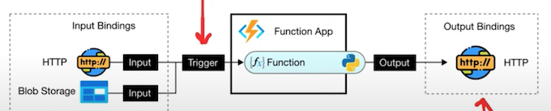

**What is a binding?**

* Bindings define if your function is **connected** to another service
* The data from bindings is provided to the function as parameters.
* Bindings are optional, and **a function can have multiple input and output bindings**

### 11-15 Azure Functions - Supported Bindings


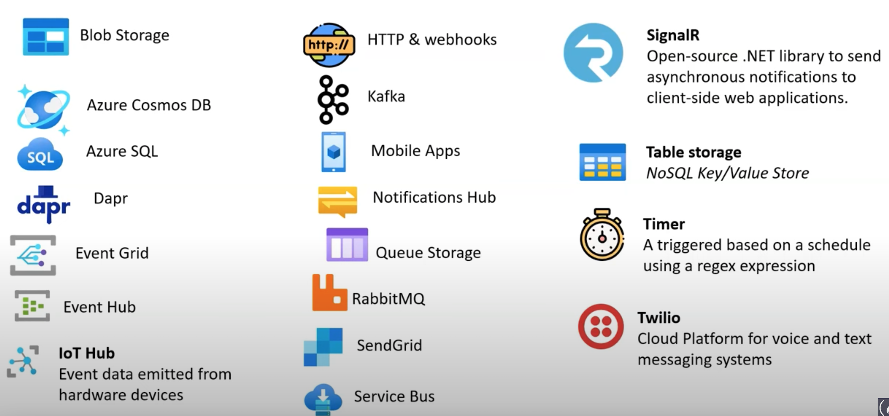

**Azure Functions - Supported Bindings**

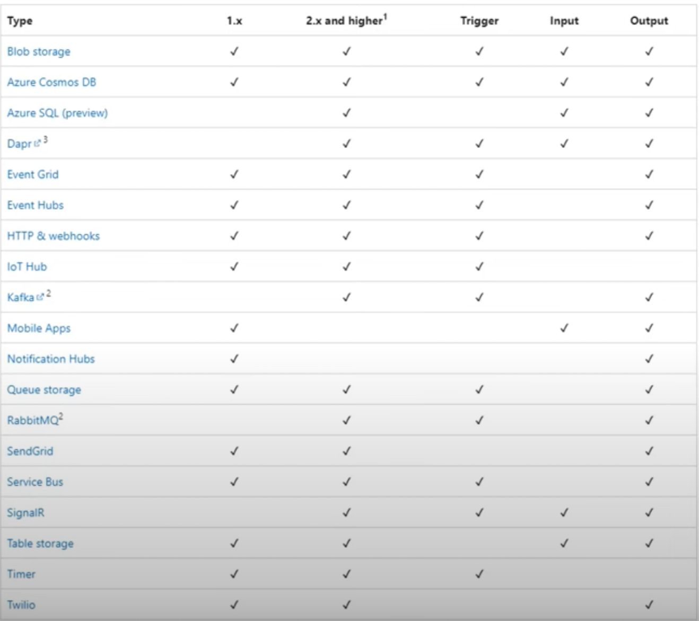

All triggers and bindings have a direction property in the **function.ison** file:

* The direction of triggers is always **In**
* Input and output bindings use **In, Out, or both**
* Some bindings support a special direction **Inout**


The Trigger is defined alongside the Input and Output bindings.

* trigger will have the same as the input type but with "Trigger" appended
* E.g., blob (input binding) blobTrigger (trigger)


```
{  
	"scriptFile": "__init__.py",  
	"disabled": false,  
	"bindings": [  
	{  
		"authLevel": "function",  
		"type": "httpTrigger",  
		"direction": "in",  
		"name": "req"  
		},  
	{  
		"type": "http",  
		"direction": "out",  
		"name": "$return"  
		}  
	]  
}
```

### 11-16 Azure Functions - Triggers and Bindings Scenario

**Scenario**

Every hour, you want to read new log files delivered by your application, and you need to transform the data to be ingested in your No SQL database that resides in Cosmos DB

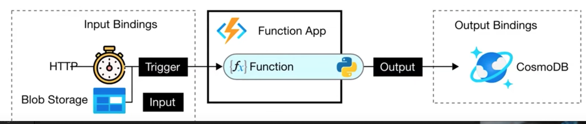

You'll use the **trigger** type **Timer** because it's a scheduled job that will run at a specific time.

* The **blob storage** would be an **In binding**, as the function reads the data from it.
* The **Cosmos DB** would be an **Out binding,** enabling the function to write the processed data into the database.
