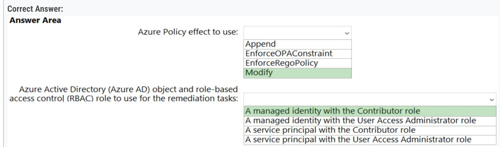
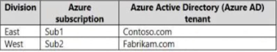
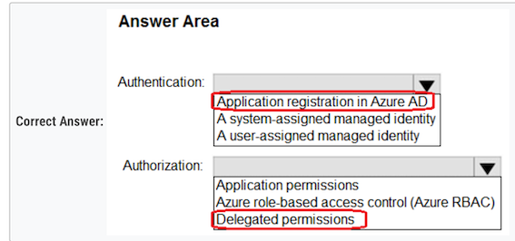
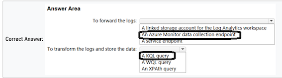
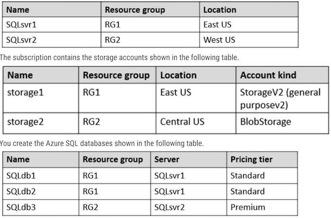
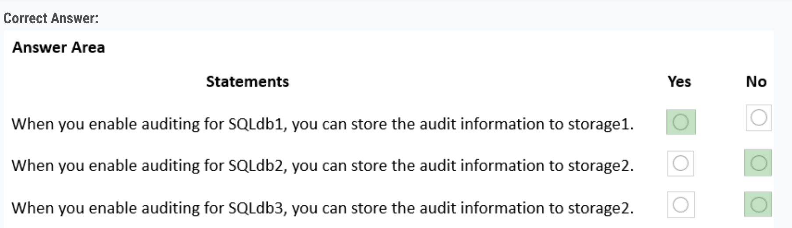
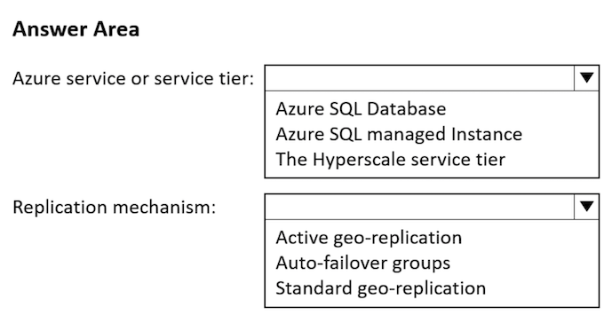
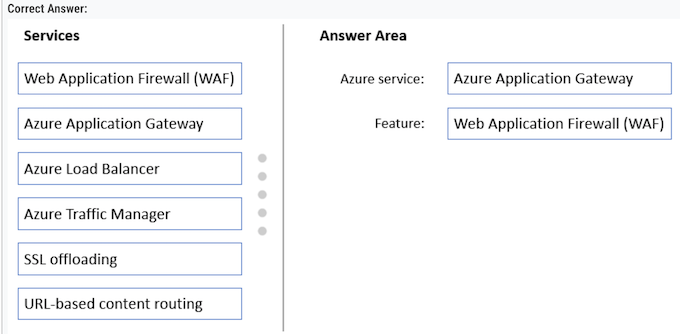
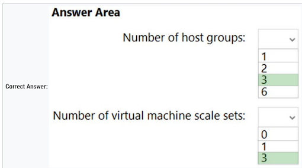
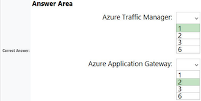

# AZ305 - 2

## Topic 1

#### Question 5  💩

You plan to deploy Azure Databricks to support a machine learning application. **Data engineers will mount an Azure Data Lake Storage account to the Databricks file system.**

Permissions to folders are granted directly to the data engineers.

You need to recommend a design for the planned Databrick deployment. The solution must meet the following requirements:

* ✑ Ensure that the data engineers can only access folders to which they have permissions.
* ✑ Minimize development effort.
* ✑ Minimize costs.

What should you include in the recommendation? To answer, select the appropriate options in the answer area.

* **Premium**:  Premium Databricks SKU is required for credential passhtrough. 💩
* **Credential passthrough**

#### Question 12

Your on-premises network contains a server named Server1 that runs an ASP .NET application named App1.

**You have a hybrid deployment of Azure Active Directory (Azure AD)**.

You need to recommend a solution to ensure that users sign in by **using their Azure AD account and Azure Multi-Factor Authentication (MFA) when they connect to App1 from the internet**.

**Which three features should you recommend be deployed and configured in sequence**? To answer, move the appropriate features from the list of features to the answer area and arrange them in the correct order.

**Step 1: Azure AD Application Proxy**

Start by enabling communication to Azure data centers to prepare your environment for Azure AD Application Proxy.

**Step 2: an Azure AD enterprise application**

Add an on-premises app to Azure AD.

Now that you've prepared your environment and installed a connector, you're ready to add on-premises applications to Azure AD.
1. Sign in as an administrator in the Azure portal.
2. In the left navigation panel, select Azure Active Directory.
3. Select Enterprise applications, and then select New application.

**Application Proxy is a feature of Enterprise Applications, so yeah, you would need to register an Enterprise Application before enabling an Application Proxy for it.**

1. Application Proxy
2. Enterprise Application
3. Conditional Access

####  Question 14  💩

**Azure Network Watcher IP Flow Verify,**  💩 which allows you to detect traffic filtering issues at a VM level.

#### Question 19

Your company has the divisions shown in the following table.

You plan to deploy a custom application to each subscription. The application will contain the following:

* ✑ A resource group
* ✑ An Azure web app
* ✑ Custom role assignments
* ✑ An Azure Cosmos DB account

You need to use Azure Blueprints to deploy the application to each subscription.

What is the minimum number of objects required to deploy the application? To answer, select the appropriate options in the answer area.

* **2 Mgmt Group**  💩
* **2 BluePrint Def**  💩
* **4 - Assignment for subcription** 

Management groups can't span AAD tenant, so you need 2 management groups.  💩

**Blueprints definition can be saved within management group which, in turn, means you need 2 blueprint definitions.** 

**Blueprint assignments are at subscription level, therefore you need 4.**

#### Question 20

You need to design an Azure policy that will implement the following functionality:

* For new resources, **assign tags and values that match the tags and values** of the resource group to which the resources are deployed.
* For existing resources, **identify whether the tags and values match the tags and values of the resource group that contains the resources**.
* For any non-compliant resources, trigger auto-generated remediation tasks to create missing tags and values.

**The solution must use the principle of least privilege.**·

What should you include in the design? To answer, select the appropriate options in the answer area.

* **Azure Policy effect to use:  Modify**
* **Azure Active Directory (Azure AD) object and role-based access control (RBAC) role to use for the remediation tasks: A managed identity with the Contributor role**

#### Question 21

You have an Azure subscription that contains the resources shown in the following table.

You create an Azure SQL database named DB1 that is hosted in the East US Azure region.

**To DB1, you add a diagnostic setting named Settings1. Settings1 archive SQLInsights to storage1 and sends SQLInsights to Workspace1**.

For each of the following statements, select Yes if the statement is true. Otherwise, select No

Note: This diagnostic telemetry can be streamed to one of the following Azure resources for analysis.

* **Log Analytics workspace**
* **Azure Event Hubs**
* **Azure Storage**

#### Question 23 💩

You plan to deploy an app that will use an Azure Storage account.

You need to deploy the storage account. The storage account must meet the following requirements:

* **Store the data for multiple users**.
* Encrypt each user's data by using a separate key.
* **Encrypt all the data in the storage account by using customer-managed keys**.

What should you deploy?

* A. files in a premium file share storage account
* **B. <mark>blobs</mark> in a general purpose v2 storage account** ✅ 💩
* C. blobs in an Azure Data Lake Storage Gen2 account
* D. files in a general purpose v2 storage account

#### Question 24

You have an Azure App Service web app that uses a system-assigned managed identity.

**You need to recommend a solution to store the settings of the web app as secrets in an Azure key vault.** The solution must meet the following requirements:

* ✑ Minimize changes to the app code.
* ✑ Use the principle of least privilege.

What should you include in the recommendation? To answer, select the appropriate options in the answer area.

* Key Vault integration method: **Key Vault references in Application settings** 💩
* Key Vault permissions for the managed identity: **Secrets: Get** 💩

#### Question 25

You plan to deploy an application named **App1 that will run on five Azure virtual machines**. Additional virtual machines will be deployed later to run App1.

You need to recommend a solution to meet the following requirements for the virtual machines that will run App1:

* ✑ Ensure that the virtual machines **can authenticate to Azure Active Directory (Azure AD) to gain access to an Azure key vault, Azure Logic Apps instances, and an Azure SQL database**.
* ✑ **Avoid assigning new roles and permissions for Azure services when you deploy additional virtual machines**.
* ✑ Avoid storing secrets and certificates on the virtual machines.
* ✑ Minimize administrative effort for managing identities.

Which type of identity should you include in the recommendation?

* A. a system-assigned managed identity
* B. a service principal that is configured to use a certificate
* C. a service principal that is configured to use a client secret
* **D. a user-assigned managed identity**  ✅

A user-assigned managed identity:

* Can be shared.
* **The same user-assigned managed identity can be associated with more than one Azure resource**.

#### Question 27

The amount of time that SQLInsights data will be stored in blob storage is **90 days**  ✅

The maximum amount of time that SQLInsights data can be stored in Azure Log Analytics is **730 days**  ✅

#### Question 28

You have an application that is used by 6,000 users to validate their vacation requests. **The application manages its own credential store.
Users must enter a username and password to access the application. The application does NOT support identity providers**.

**You plan to upgrade the application to use single sign-on (SSO) authentication by using an Azure Active Directory (Azure AD) application registration.**

Which SSO method should you use?

- [ ] A. header-based
- [ ] B. SAML
- [x] C. password-based  ✅
- [ ] D. OpenID Connect

**Password** - On-premises applications can use a password-based method for SSO. This choice works when applications are configured for
Application Proxy.

**With password-based SSO, users sign in to the application with a username and password the first time they access it.**

#### Question 29

You have an Azure subscription that contains a virtual network named VNET1 and 10 virtual machines. The virtual machines are connected to VNET1.

You need to design a solution to manage the virtual machines from the internet. The solution must meet the following requirements:

- ✑ Incoming connections to the virtual machines must be authenticated by using Azure Multi-Factor Authentication (MFA) before network connectivity is allowed.
- ✑ Incoming connections must use TLS and connect to TCP port 443.
- ✑ The solution must support RDP and SSH.

What should you include in the solution? To answer, select the appropriate options in the answer area.

**1. Answer is Azure Bastion**.   ✅

**2. Second is correct**   

**A conditional Access policy that has Cloud Apps assignment set to Azure Windows VM Sign-In** ✅

#### Question 31

D. **In the Azure AD tenant of Contoso, create guest accounts for the Fabnkam developers**.   ✅

#### Question 33

Your company has 20 web APIs that were developed in-house.

The company is developing 10 web apps that will use the web APIs. **The web apps and the APIs are registered in the companys Azure Active
Directory (Azure AD) tenant. The web APIs are published by using Azure API Management.**

You need to recommend a solution to block unauthorized requests originating from the web apps from reaching the web APIs. The solution must
meet the following requirements:

✑ Use Azure AD-generated claims.

Minimize configuration and management effort.

What should you include in the recommendation? To answer, select the appropriate options in the answer area.

**Box 1: Azure AD** -

**Grant permissions in Azure AD.**

**Box 2: Azure API Management**-

Configure a JWT validation policy to pre-authorize requests. Pre-authorize requests in API Management with the Validate JWT policy, by validating the access tokens of each incoming request. If a request does not have a valid token, API Management blocks it

#### Question 36 - 2 

You are developing an app that will read activity logs for an Azure subscription by using Azure Functions. 

**You need to recommend an authentication solution for Azure Functions**. 

The solution must minimize administrative effort. 

What should you include in the recommendation?

* A. an enterprise application in Azure AD 
* **B. system-assigned managed identities** ✅
* C. shared access signatures (SAS) 
* D. application registration in Azure AD

**System-assigned managed identities provide a way for Azure Functions to authenticate to other Azure services, such as Activity Logs, without the need for storing or managing secrets.**

Azure Functions provide a Managed Identity and since the question is about Azure Functions not about the App being developed, the correct answer is B.

#### Question 36 💩

You have an Azure subscription that contains an Azure key vault named KV1 and a virtual machine named VM1. VM1 runs Windows Server 2022:
Azure Edition.

You plan to deploy an ASP.Net Core-based application named App1 to VM1.

You need to configure App1 to use a system-assigned managed identity to retrieve secrets from KV1. The solution must minimize development
effort.

What should you do? To answer, select the appropriate options in the answer area.

**<mark>1 Configure App1 to use Auth 2.0: Client credentials grant flows</mark>**  ✅  💩

2. **Configure App1 to use a REST API call to retrieve an authentication token from the**

**Configure App1 to use a REST API call to retrieve an authentication token from the: <mark>Azure Instance Metadata (IMDS) endpoint</mark>**  ✅  💩

#### Question 37 💩

Your company has the divisions shown in the following table.

**Sub1 contains an Azure App Service web app named App1. App1 uses Azure AD for single-tenant user authentication. Users from contoso.com
can authenticate to App1**.

You need to recommend a solution to enable users in the fabrikam.com tenant to authenticate to App1.

What should you recommend?

- [ ] A. Configure Azure AD join.
- [ ] B. Configure Azure AD Identity Protection.
- [ ] C. Configure a Conditional Access policy.
- [x] D. **Configure Supported account types in the application registration** and **update the sign-in endpoint.**  ✅

It can be **Use Azure AD entitlement management to govern external users** ✅ OR **Configure Supported account types in the application registration and update the sign-in endpoint** ✅

#### Question 38   💩

You have an Azure subscription named Sub1 that is linked to an Azure AD tenant named contoso.com.

You plan to implement two ASP .NET Core apps named App1 and App2 that will be deployed to 100 virtual machines in Sub1. Users will sign in to
App1 and App2 by using their contoso.com credentials.

- App1 requires read permissions to access the calendar of the signed-in user. 

- App2 requires write permissions to access the calendar of the signed-in user.

You need to recommend an authentication and authorization solution for the apps. The solution must meet the following requirements:

- Use the principle of least privilege.
- Minimize administrative effort.

What should you include in the recommendation? To answer, select the appropriate options in the answer area.

* **Authentication: Application registration in Azure AD**  💩

* **Authorization: Delegated permissions**  💩

**Important point here is that both apps are deployed to the same machines. So Managed identitied will violate the principle of least privelege. As a user/system managed identity will have to be assigned both read and write permission to user's calendar**

#### Question 39  💩

Y N Y

- Since Group 1 is assigned VM contributor to MG1, it will be able to create a new VM in RG1.    💩
- User 2 is not able to grant permission to Group 2 because it is just a member with contributor role.   💩
- **Since Group 3 has Contributor role for the Tenant Root Group, User3 can create storage account in RG2**  💩

#### Question 42  💩

You are designing an app that will be hosted on Azure virtual machines that run Ubuntu. **The app will use a third-party email service to send email messages to users. The third-party email service requires that the app authenticate by using an API key.**

You need to recommend an Azure Key Vault solution for storing and accessing the API key. The solution must minimize administrative effort.

What should you recommend using to store and access the key? To answer, select the appropriate options in the answer area.

* 1. **Storage: c. Secret**.  💩
	* API keys are typically stored as secrets in Azure Key Vault. The key vault can store and manage secrets like API keys, passwords, or database connection strings.
* 2. **Access: b. A managed service identity (MSI).**  💩

**A managed service identity (MSI) is used to give your VM access to the key vault.**  

**The advantage of using MSI is that you do not have to manage credentials yourself.**  

#### Question 43

You have two app registrations named App1 and App2 in Azure AD. 

**App1 supports role-based access control (RBAC) and includes a role named Writer.**

**You need to ensure that when App2 authenticates to access App1, the tokens issued by Azure AD include the Writer role claim.**

Which blade should you use to modify each app registration? 

1. App1: B. **App roles**: This app is already configured with a custom role, which is defined under the "App Roles" section.
2. App2: C. **API Permissions**

To allow App 2 to authenticate to App1, it is necessary to assign the appropriate permissions. These can be configured under "API Permissions"

#### Question 44  💩

You have an Azure subscription.

You plan to deploy a monitoring solution that will include the following:

- Azure Monitor Network Insights
- Application Insights
- Microsoft Sentinel
- VM insights

The monitoring solution will be managed by a single team.

What is the **minimum number of Azure Monitor workspaces** required?

- [X] A. **1**  ✅

#### Question 45 💩

**Case Study**

**Minimum number of Azure AD tenants:**

1. **1 AAD now Microsoft Entra ID** 💩

**Minimum number of conditional access policies to create:**

2. **2 Conditional access policies** :   💩

	- Conditional Access Policy for Admin Access to the Azure Portal 
	- Conditional Access Policy for Testing WebApp1 Updates

#### Question 46

**Azure AD Identity Governance.** ✅ <=>  **Access Review** ✅ 

<mark>This is an updated version, in the old questions the right answers was "Access Review” , but this options is not available here</mark>

#### Question 47 💩

You have an Azure subscription that contains 50 Azure SQL databases.

**You create an Azure Resource Manager (ARM) template named Template1 that enables Transparent Data Encryption (TDE).**

You need to create an Azure Policy definition named Policy1 that will use Template1 to enable TDE for any noncompliant Azure SQL databases.

**How should you configure Policy1?** To answer, select the appropriate options in the answer area.

NOTE: Each correct selection is worth one point.

* **Set available effects to:**

	* **Box 1: DeployIfNotExists**  💩

* **Include in the definition:**

	* **Box 2: The role-based access control (RABC) roles required to perform the remediation task** 💩

#### Question 49  💩

You have an Azure subscription that contains the resources shown in the following table:

Log files from App1 are registered to App1Logs. An average of 120 GB of log data is ingested per day.

You configure an Azure Monitor alert that will be triggered if the App1 logs contain error messages.

You need to minimize the Log Analytics costs associated with App1. The solution must meet the following requirements:

- **Ensure that all the log files from App1 are ingested to App1Logs.**
- **Minimize the impact on the Azure Monitor alert**.

Which resource should you modify, and which modification should you perform? To answer, select the appropriate options in the answer area.

* Resouce: **workspace1**  💩
* Modification: **Change to a commitment pricing tier.**  💩

#### Question 50

You have **12 Azure subscriptions and three projects**. Each project uses resources across multiple subscriptions.

You need to use Microsoft Cost Management to monitor costs on a per project basis. The solution must minimize administrative effort.

Which two components should you include in the solution? Each correct answer presents part of the solution.

NOTE: Each correct selection is worth one point.

- [x] A. **budgets**  ✅
- [X] B. **resource tags**  ✅

#### Question 51 💩

You have an Azure subscription that contains multiple storage accounts.

You assign Azure Policy definitions to the storage accounts.

You need to recommend a solution to meet the following requirements:

- Trigger on-demand Azure Policy compliance scans. 
- **Raise Azure Monitor non-compliance alerts by querying logs collected by Log Analytics.**

What should you recommend for each requirement? To answer, select the appropriate options in the answer area.

**box1: CLI is correct.**   💩

**box2: Log analytic workspace.** 💩

#### Question 52 💩

You have an Azure subscription.

You plan to deploy five storage accounts that will store block blobs and five storage accounts that will host file shares. The file shares will be accessed by using the SMB protocol

You need to recommend an access authorization solution for the storage accounts. The solution must meet the following requirements:

- Maximize security.
- Prevent the use of shared keys.
- Whenever possible, support time-limited access.

**1. For the blobs - <mark>a user delegation</mark>a SAS only**  💩

**2. For the file shares - Azure AD credentials** 💩

#### Question 53  💩

You have an Azure subscription. The subscription contains 100 virtual machines that run Windows Server 2022 and have the Azure Monitor Agent installed.

You need to recommend a solution that meets the following requirements:

- Forwards JSON-formatted logs from the virtual machines to a Log Analytics workspace
- Transforms the logs and stores the data in a table in the Log Analytics workspace

What should you include in the recommendation? To answer, select the appropriate options in the answer area.

NOTE: Each correct selection is worth one point

- **Box1 -  To forward the logs: - Azure Monitor Data collection**  ✅  💩
- **Box2 - To transform the logs and store the data:- KQL**    ✅  💩

#### Question 55  💩

- Collects event logs from multiple subscriptions 
- Supports the use of data collection rules (DCRs) to define  which events to collect

**To collect the event logs:**
 
1. **Azure Lighthouse**:    💩
	* To send data across tenants, you must first enable Azure Lighthouse 
2. **Azure Monitor Agent**  💩

## Topic 2

#### Question 3

You have an Azure subscription that contains two applications named App1 and App2. App1 is a sales processing application. When a transaction
in App1 requires shipping, a message is added to an Azure Storage account queue, and then App2 listens to the queue for relevant transactions.

In the future, **additional applications will be added that will process some of the shipping requests based on the specific details of the transaction**s.

**You need to recommend a replacement for the storage account queue to ensure that each additional application will be able to read the relevant transactions.**

What should you recommend?

- [ ] A. one Azure Data Factory pipeline
- [ ] B. multiple storage account queues
- [ ] C. one Azure Service Bus queue
- [X] D. **one Azure Service Bus topic**  ✅

#### Question 4

You need to design a storage solution for an app that will store large amounts of frequently used data. The solution must meet the following
requirements:

- ✑ Maximize data throughput.
- ✑ Prevent the modification of data for one year.
- ✑ Minimize latency for read and write operations.

Which Azure Storage account type and storage service should you recommend? To answer, select the appropriate options in the answer area.
NOTE: Each correct selection is worth one point.

* **Storage account type**: BlockBlobStorage provide a very low latency(x40) (Read and Write) and Throughput (x5)
* **Storage service:** : Blob

#### Question 4

**Use lifecycle management to migrate app data between storage tiers**

**Box 1: Storage1 and storage3 only**

* storage 1-StorageV2-Standard
* storage 3-BlobStorage-Standard

**STANDARD ==> LIFE CYCLE YES (STORAGE 1 AND STORAGE 3)**

**Store app data in an Azure file share**

* storage 1-StorageV2-Standard
* storage 4-FileStorage-Premium

#### Question 6 💩

You are designing an application that will be hosted in Azure.

The application will host video files that range from 50 MB to 12 GB. The application will use certificate-based authentication and will be available to users on the internet.

You need to recommend a storage option for the video files. The solution must provide the fastest read performance and must minimize storage
costs.

What should you recommend?

- [ ] A. Azure Files
- [ ] B. Azure Data Lake Storage Gen2
- [X] C. **Azure Blob Storage**   💩
- [ ] D. Azure SQL Database   

Blob Storage: Stores large amounts of unstructured data, such as text or binary data, that can be accessed from anywhere in the world via HTTP or HTTPS. You can use Blob storage to expose data publicly to the world, or to store application data privately.

#### Question 7

You are designing a SQL database solution. **The solution will include 20 databases that will be 20 GB each and have varying usage patterns**.
You need to recommend a database platform to host the databases. The solution must meet the following requirements:

- ✑ The solution must meet a Service Level Agreement (SLA) of 99.99% uptime.
- ✑ The compute resources allocated to the databases must scale dynamically.
- ✑ The solution must have reserved capacity.

Compute charges must be minimized.

What should you include in the recommendation?

**A. an elastic pool that contains 20 Azure SQL databases**  ✅   💩

SLA of 99.99% uptime: Azure SQL Database offers a high availability SLA of 99.99%. 

**Dynamic Scaling: Elastic pools dynamically allocate compute resources across the databbases**

#### Question 8   💩

You have an on-premises database that you plan to migrate to Azure.

You need to design the database architecture to meet the following requirements:

- ✑ Support scaling up and down.
- ✑ Support geo-redundant backups.
- ✑ Support a database of up to **75 TB**.
- ✑ **Be optimized for online transaction processing (OLTP)**.

What should you include in the design? To answer, select the appropriate options in the answer area.

NOTE: Each correct selection is worth one point.

* **Box 1: Azure SQL Database -**   💩

* **Box 2: Hyperscale** -   💩

**The key is that only Hyperscale can deal with 75 Tb, All other have limit of 4 Tb**

#### Question 9

Need to find a service to **store and query the data**. 

* A. Azure Table Storage: You can't query data. 
* B. Azure Event Grid: You can't store or query data. 
* C. **Azure Cosmos DB SQL API: You can store and query data**.    ✅
* D. **Azure Time Series Insights: You can store and query data**   ✅

#### Question 10

**You are designing an application that will aggregate content for users**.

You need to recommend a database solution for the application. The solution must meet the following requirements:

- ✑ Support SQL commands.
- ✑ Support multi-master writes.
- ✑ Guarantee low latency read operations.

What should you include in the recommendation?

- [X] **A. Azure Cosmos DB SQL API** ✅    💩

- [X] **Azure Cosmos DB for NoSQL**    ✅    💩

- Azure Cosmos DB for PostgreSQL 

#### Question 11

You have an **Azure subscription that contains the SQL servers** on Azure shown in the following table.

For each of the following statements, select Yes if the statement is true. Otherwise, select No.

- Box 1: Yes - Auditing works fine for a Standard account.
- Box 2: No - **Auditing limitations: Premium storage is currently not supported**.
- Box 3: No - **Auditing limitations: Premium storage is currently not supported**.

**blobstorage is not recommended**

#### Question 12   💩 💩

You plan to import data from your on-premises environment to Azure. The data is shown in the following table.

**What should you recommend using to migrate the data? To answer, drag the appropriate tools to the correct data sources.** 

Each tool may be used once, more than once, or not at all. You may need to drag the split bar between panes or scroll to view content.

**Box 1: Data Migration Assistant -**  ✅    💩

**Box 2: Azure Cosmos DB Data Migration Tool** ✅    💩
 
#### Question 13

You need to recommend an automated process to upload the data to Azure SQL Database every month.

**D. Azure Data Factory**  ✅

#### Question 14

B. **Azure SQL Database Premium** ✅

- **Not A: Hyperscale is more expensive than Premium.**
- Not C: Need Premium for Availability Zones.
- **Not D: Zone redundant configuration that is free on Azure SQL Premium is not available on Azure SQL Managed Instance.**

#### Question 15

**You have an app named App1 that uses two on-premises Microsoft SQL Server databases named DB1 and DB2.**

You plan to migrate DB1 and DB2 to Azure

**You need to recommend an Azure solution to host DB1 and DB2.** The solution must meet the following requirements:

- ✑ Support server-side transactions across DB1 and DB2.
- ✑ Minimize administrative effort to update the solution.

What should you recommend?

- [X] B. **two databases on the same Azure SQL managed instance**    ✅

#### Question 17

You are planning an Azure Storage solution for sensitive data. The data will be accessed daily. The dataset is less than 10 GB.

You need to recommend a storage solution that meets the following requirements:

- ✑ All the data written to storage must be retained for five years.
- ✑ Once the data is written, the data can only be read. Modifications and deletion must be prevented.
- ✑ After five years, the data can be deleted, but never modified.
- ✑ **Data access charges must be minimized**.

What should you recommend? To answer, select the appropriate options in the answer area.

NOTE: Each correct selection is worth one point.

**Box 1: General purpose v2 with Hot access tier for blobs**

**Hot tier has higher storage costs, but lower access and transaction costs.**

**2. Configuration to prevent the modification and deletions: Container access policy.**  

The Container access policy is indeed the place to configure Azure's Immutable Blob Storage to ensure data is retained without modifications or deletions for a specified amount of time, which suits your needs.

#### Question 18

You are designing a data storage solution to support reporting.

The solution will ingest high volumes of data in the **JSON format by using Azure Event Hubs.** As the data arrives, Event Hubs will write the data to storage. The solution must meet the following requirements:

- ✑ Organize data in directories by date and time.
- ✑ Allow stored data to be queried directly, transformed into summarized tables, and then stored in a data warehouse.
- ✑ Ensure that the data warehouse can store 50 TB of relational data and support between 200 and 300 concurrent read operations.

Which service should you recommend for each type of data store? To answer, select the appropriate options in the answer area.

   💩

1. **Data store for the ingestion data: b. Azure Data Lake Storage Gen2.**    💩
2.  **Data store for the data warehouse: c. Azure SQL Database Hyperscale**.    💩

#### Question 19

You need to recommend a service to **store and query the data**.

* **C. Azure Cosmos DB for NoSQL**
* **D. Azure Time Series Insights**

* A. Azure Table Storage -> Throughput: scalability limit of 20,000 operations/s. -> Not enough for this question 
* **B. Azure Event Grid -> It is only a broker, not a storage solution**

#### Question 21  💩

You are designing a data analytics solution that will use Azure Synapse and Azure Data Lake Storage Gen2.

You need to recommend Azure Synapse pools to meet the following requirements:

- Ingest data from Data Lake Storage into hash-distributed tables.
- Implement query, and update data in Delta Lake.

What should you recommend for each requirement? To answer, select the appropriate options in the answer area.

- **Dedicated SQL pool: It's best for big and complex tasks.**   ✅ 
- **SERVERLESS APACHE SPARK POOL**  ✅  💩

- Ingest data from **Data Lake Storage into hash-distributed tables**.

**A dedicated SQL pool** ✅

- **Implement query, and update data in Delta Lake.**

**A serverless Apache Spark pool**   ✅

#### Question 23

The solution must support Hadoop Distributed File System (HDFS)

=> **A. Azure Data Lake Storage Gen2**

#### Question 23

* Support SQL commands. 
* Support multi-master writes. 
* Guarantee low latency read operations.

**A. Azure Cosmos DB for NoSQL**  ✅ or  **A. Azure Cosmos DB SQL API** ✅

- **cosmos for the multi writer**
- postgre is not good at reading

#### Question 24   💩

You need to recommend a solution for the Azure Database for MySQL Flexible Server configuration.

* The databases must be accessible if a datacenter fails. 
* Costs must be minimized.

- [ ] A. Burstable
- [X] B. **General Purpose** ✅ 💩
- [ ] C. Memory Optimized

#### Question 25

* Support SQL queries. 
* Support geo-replication. 
* **Store and access data relationally.**

**B. PostgreSQL**   ✅

#### Question 28  💩

You have an app that generates 50,000 events daily

**You plan to stream the events to an Azure event hub and use Event Hubs Capture to implement cold path processing of the events. The output of Event Hubs Capture will be consumed by a reporting system.**

You need to identify which type of Azure storage must be provisioned to support Event Hubs Capture, **and which inbound data format the reporting system must support.**

1. **Storage Type: Azure Data Lake Storage Gen2**

2. **Data format: Avro**

#### Question 30 💩💩💩

You need to recommend a solution that meets the following requirements: 

* Supports immutable storage 
* Disables anonymous access to the storage account 
* Supports access control list (ACL)-based Azure AD permissions

**B. Azure Data Lake Storage** ✅  💩

A. Azure Files /  B. Azure Data Lake Storage / C. Azure NetApp Files  / D. Azure Blob Storage

**In terms of supporting immutable storage, both Azure Data Lake storage and Azure Blob storage are correct.** 

**But ACL is supported by Azure Data Lake storage, not supported by Azure Blob storage.**
 
#### Question 30   💩💩

You are designing a storage solution that will ingest, store, and analyze petabytes (PBs) of structured, semi-structured, and unstructured text data. The analyzed data will be offloaded to Azure Data Lake Storage Gen2 for long-term retention.

You need to recommend a storage and analytics solution that meets the following requirements: 

* Stores the processed data 
* Provides interactive analytics 
* Supports manual scaling, built-in autoscaling, and custom autoscaling

What should you include in the recommendation? To answer, select the appropriate options in the answer area.

The analyzed data will be off loaded to Azure Data Lake Storage Gen2 for long-term retention.

**For storage and interactive analytics:**

> Data Explorer   💩

**Query language:**

> KQL   💩

#### Question 31  💩💩💩

You need to recommend an Azure SQL product and service tier that meets the following requirements: 

* Automatically scales compute resources based on the workload demand 
* Provides per second billing

**Azure SQL product: A single Azure SQL database**   ✅  💩

**Service tier:  General Purpose**    ✅  💩

A single Azure SQL database: Provides the flexibility to scale compute resources independently. 

**<mark>General Purpose: This service tier supports serverless configuration, which automatically scales compute resources based on demand and provide per-second billing</mark>**.

#### Question 33  💩

You have an Azure subscription. 

**You need to deploy a solution that will provide point-in-time restore for blobs in storage accounts that have blob versioning and blob soft delete enabled.** 

**Which type of blob should you create, and what should you enable for the accounts?**

To answer, select the appropriate options in the answer area. NOTE: Each correct selection is worth one point.

Only **block blobs** in a standard general-purpose **v2 storage account can be restored as part of a point-in-time restore operation**.    💩

Append blobs, page blobs, and premium block blobs aren't restored.

**Change feed   💩 is a prerequisite feature for Object Replication and Point-in-time restore for block blobs**

#### Question 34   💩💩

Your company, named Contoso, Ltd., has an Azure subscription that contains the following resources:

* An Azure Synapse Analytics workspace named contosoworkspace1 
* An Azure Data Lake Storage account named contosolake1 
* An Azure SQL database named contososql1

**The product data of Contoso is copied from contososql1 to contosolake1**

Contoso plans to upload the research data on FabrikamVM1 to contosolake1. During the upload, the research data must be transformed to the data formats used by Contoso.

The data in contosolake1 will be analyzed by using contosoworkspace1. 

You need to recommend a solution that meets the following requirements:

* Upload and transform the FabrikamVM1 research data. 
* Provide Fabrikam with restricted access to snapshots of the data in contosoworkspace1.

What should you recommend for each requirement? To answer, select the appropriate options in the answer area. 

NOTE: Each correct selection is worth one point

**For ETL operations use Azure Data Factory and Azure Synapse Pipelines are based on Azure Data Factory.**   ✅  💩

**For restricted access use Azure Data Share:**  ✅  💩

#### Question 35   💩💩💩

To implement the data warehouse: **An Azure Synapse Analytics dedicated SQL pool-** ✅   💩

To implement the serving layer:  **AAzure Analysis Services** ✅   💩

- Synapse Analytics - massive parallel 
- processing Analysis Services - OLAP

#### Question 36  💩💩💩

You have an Azure subscription.

You need to deploy a relational database. The solution must meet the following requirements:

- Support multiple read-only replicas.
- Automatically load balance read-only requests **across all the read-only replicas.**
- Minimize administrative effort

What should you use? To answer, select the appropriate options in the answer area.

**Service - A single Azure SOL database**   💩

**Service tier - Hyperscale**   💩

**In Premium and Business Critical service tiers,** 

**<mark>only one of the read-only replicas is accessible at any given time. Hyperscale supports multiple read-only replicas.</mark>**

## Topic 3

#### Question 3

**You deploy two Azure virtual machines to two Azure regions, and you create an Azure Traffic Manager profile**.    ✅

**Azure Traffic Manager is a DNS-based traffic load balancer that enables you to distribute traffic optimally to services across global Azure regions, while providing high availability and responsiveness**

**App Gateway will balance the traffic between VMs deployed in the same region.** 

#### Question 5    💩

You plan to create an Azure Storage account that will host file shares. **The shares will be accessed from on-premises applications that are transaction intensive**. 

You need to recommend a solution to **minimize latency**  💩 when accessing the file shares. 

The solution must provide the highest-level of resiliency for the selected storage tie

**Box 1: Premium** - Premium: **Premium file shares are backed by solid-state drives (SSDs) and provide consistent high performance and low latency**, within single-digit milliseconds for most IO operations, for IO-intensive workloads

**<mark>Premium Azure file shares only support LRS and ZRS</mark>**.   💩

 Zone-redundant storage (ZRS): With ZRS, three copies of each file stored, however these copies are physically isolated in three distinct storage clusters in different Azure availability zones.

#### Question 7

You need to recommend an Azure Storage account configuration for two applications named Application1 and Application2. The configuration must meet the following requirements:

* ✑ **Storage for Application1 must provide the highest possible transaction rates and the lowest possible latency**. => **Premium**
* ✑ **Storage for Application2 must provide the lowest possible storage costs per GB**.  => **cool/archive**
* ✑ Storage for both applications must be available in an event of datacenter failure. 
* ✑ Storage for both applications must be optimized for uploads and downloads.

What should you recommend? To answer, select the appropriate options in the answer area

**Application 1: BlockBlobStorage with Premium performance and Zone-redundant storage (ZRS) replication**

**Application 2: BlobStorage with Standard performance, Cool access tier, and Geo-redundant storage (GRS) replication**

**General purpose V2 is always recommended since Blobstorage with a legacy**

#### Question 6

**Front Door， It offers Layer 7 capabilities for your application like SSL offload, path-based routing, fast failover, caching, etc. to improve performance and high-availability ofyour applications.**

**Traffic Manager does not provide SSL Offloading.**

#### Question 10 💩 **comparing to Qestion 5** 

You have an on-premises file server that stores 2 TB of data files. 

You plan to move the data files to Azure Blob Storage in the West Europe Azure region. 

You need to recommend a storage account type to store the data files and a replication solution for the storage account. The solution must meet the following requirements:

* ✑ Be available if a single Azure datacenter fails. =>  **Zone-redundant storage (ZRS) ZRS**
* ✑ Support storage tiers.
* ✑ **Minimize cost**.  =>    **v2 Standard**   💩

What should you recommend? To answer, select the appropriate options in the answer area.

**Box 1: Standard general-purpose v2 Standard general-purpose v2 meets the requirements and minimizes the costs.**  ✅

**Box 2: Zone-redundant storage (ZRS) ZRS protects against a Datacenter failure, while minimizing the costs**.   ✅

#### Question 13

* ✑ Failover between replicas of the database must occur without any data loss. 
* ✑ The database must remain available in the event of a **zone outage**. 
* ✑ Costs must be minimized.

* **B. Azure SQL Database Premium**  ✅

**Zone-redundant configuration is not available in SQL Managed Instance**.

**To prevent Data Loss, Premium/Business Critical** is required:

Costs must be minimized => B. Azure SQL Database Premium

**A. Azure SQL Database Serverless**   ✅

1. Azure SQL Database Premium
2. Azure SQL Database Serverless
3. Azure SQL Database Business Critical

**<mark>Premium > Serverless > Business Critical</mark>**

**D. Azure SQL Managed Instance Business Critical**  ✅

#### Question 16   💩

You have an on-premises Microsoft SQL Server database named SQL1.

You plan to migrate SQL1 to Azure

You need to recommend a hosting solution for SQL1. The solution must meet the following requirements:

* Support the deployment of multiple secondary, read-only replicas. 
* Support automatic replication  between primary and secondary replicas.
* **Support failover between primary and secondary replicas within a 15-minute recovery time objective (RTO)**

What should you include in the solution? 

- **Azure service or service tier:  Azure SQL DB**     ✅

- **Auto failover groups**  ✅

**Active geo-replication is not supported by Azure SQL Managed Instance.**

#### Question 17

You have two on-premises Microsoft SQL Server 2017 instances that host an Always On **availability group named AG1**. AG1 contains a single database named DB1. => **AG already exist**

You have an Azure subscription that contains a virtual machine named VM1. VM1 runs Linux and contains a SQL Server 2019 instance. 

**You need to migrate DB1 to VM1. The solution must minimize downtime on DB1.**

What should you do? To answer, select the appropriate options in the answer area

First one should be A: Prepare For the migration by: 

**A. Adding a secondary replica to AG1**  ✅  💩

Reason: Creating an Always On availability group on VM1 would not be necessary, as you already have an availability group (AG1) in place on your on-premises SQL Server instances

**B. Azure migrate** ✅

#### Question 18

You are building an Azure web app that will store the Personally Identifiable Information (PII) of employees. 

You need to recommend an Azure SQL. Database solution for the web app. The solution must meet the following requirements:

* Maintain availability in the event of a single datacenter outage. 
* Support the encryption of specific columns that contain PII. 
* Automatically scale up during payroll operations. 
* **Minimize costs**.  =>   **b. General Purpose service tier and serverless compute tier**  ✅   💩

What should you include in the recommendations? To answer, select the appropriate options in the answer area

   💩

**1. Service tier and compute tier?**  : **b. General Purpose service tier and serverless compute tier**  ✅

**The General Purpose service tier with serverless compute tier provides a cost-effective solution that meets the requirements.**

####  Question 19   💩

You plan to deploy an Azure Database for MySQL flexible server named Server1 to the East US Azure region. 

**You need to implement a business continuity solution for Server1.** 

The solution must minimize downtime in the event of a **failover to a paired region**. What should you do?

* A. Create a read replica. 
* B. Store the database files in Azure premium file shares. 
* **C. Implement Geo-redundant backup**.   ✅  💩

####  Question 20   💩💩

You need to recommend a load balancing solution that will distribute incoming traffic for VMSS1 across NVA1 and NVA2. The solution must minimize administrative effort.

* **A. Gateway Load Balancer** ✅

**A. Gateway Load Balancer seems to be correct as it balances the load between two NVAs internally.**

####  Question 21  💩💩

You have the Azure subscriptions shown in the following table.

Contoso.onmicrosft.com contains a user named User1.

You need to deploy a solution to protect against ransomware attacks. The solution must meet the following requirements:

- **Ensure that all the resources in Sub1 are backed up by using Azure Backup.**
- Require that User1 first be assigned a **role for Sub2 before the user can make major changes to the backup configuration**

NOTE: Each correct selection is worth one point.

**A Recovery Services vault**   ✅

**A Resource Guard**   ✅

####  Question 22

You plan to deploy a containerized web-app that will be hosted in five Azure Kubernetes Service (AKS) clusters. Each cluster will be hosted in a
different Azure region.

You need to provide access to the app from the internet. The solution must meet the following requirements:

- Incoming HTTPS requests must be routed to the cluster that has the lowest network latency.
- HTTPS traffc to individual pods must be routed via an ingress controller.
- In the event of an AKS cluster outage, failover time must be minimized.

What should you include in the solution? To answer, select the appropriate options in the answer area.

NOTE: Each correct selection is worth one point.

**Box 1: Azure Front Door** ✅

**Both Azure Front Door and Traffic Manager are global load balancer. However, recommended traffic for Azure Front Door is HTTP(S), and recommended traffic for Traffic Manager is Non-HTTP(S).**

**Box 2: Azure Application Gateway**  ✅

**The Application Gateway Ingress Controller (AGIC) is a Kubernetes application, which makes it possible for Azure Kubernetes Service (AKS)**

####  Question 22

You have 10 on-premises servers that run Windows Server.

You need to perform daily backups of the servers to a Recovery Services vault. The solution must meet the following requirements:

- Back up all the files and folders on the servers.
- Maintain three copies of the backups in Azure.
- **Minimize costs**.

**Box 1: The Microsoft Azure Recovery Services (MARS) agent**

**Box 2: Locally-redundant storage (LRS)**  💩

####  Question 24

You have an Azure subscription.

You create a storage account that will store documents.

You need to configure the storage account to meet the following requirements:

- **Ensure that retention policies are standardized across the subscription**.
- Ensure that data can be purged if the data is copied to an unauthorized location.

Which two settings should you enable? To answer, select the appropriate settings in the answer area.

1. **Enable operational backup with Azure Backup**  ✅
2. **Enable permanent delete for soft deleted items**  ✅

####  Question 25

You plan to use Azure Storage to store data assets. 

You need to identify the procedure to fail over a general-purpose v2 account as part of a disaster recovery plan. The solution must meet the following requirements: 

* Apps must be able to access the storage account after a failover. 
* You must be able to fail back the storage account to the original location. 
* Downtime must be minimized.

**Failover only supports GRS, GZRS, and RA-GZRS** => No ZRS   💩

## Topic 4 

#### Question 1

**A basic Azure virtual WAN does not support express route. <mark>You have to upgrade to standard.</mark>**  ✅

#### Question 2

**B. Azure Logic Apps and Azure Functions**

When you want to run code that performs a specific job in your logic apps, you can create your own function by using Azure Functions.

#### Question 3

Your company has the infrastructure shown in the following table.

<mark>The on-premises Active Directory domain syncs with Azure Active Directory (Azure AD)</mark>

Server1 runs an application named App1 that uses LDAP queries to verify user identities in the on-premises Active Directory domain. **You plan to migrate Server1 to a virtual machine in Subscription1.**

A company security policy states that the virtual machines and services deployed to Subscription1 must be prevented from accessing the on- premises network.

You need to recommend a solution to ensure that **App1 continues to function after the migration. The solution must meet the security policy**. What should you include in the recommendation?

**D. Azure AD Domain Services (Azure AD DS)** 

Azure Active Directory Domain Services (Azure AD DS) provides managed domain services such as domain join, group policy, lightweight directory access protocol (LDAP), and Kerberos/NTLM authentication.

You can use Azure AD DS and sync identities needed from Azure AD to Azure AD DS to use legacy protocols like LDAP.

#### Question 4

You need to design a solution that will execute custom C# code in response to an event routed to **Azure Event Grid**. The solution must meet the following requirements:

* ✑ The executed code must be able to access the private IP address of a Microsoft SQL Server instance that runs on an Azure virtual machine. 
* ✑ **Costs must be minimized.**

What should you include in the solution?

* A. Azure Logic Apps in the Consumption plan 
* **B. Azure Functions in the Premium plan**  ✅

**Virtual connectivity is included in the Premium plan.**

**Azure Functions in the Consumption plan does not support virtual network integration, which is necessary for accessing the private IP address of the SQL Server instance**. 

#### Question 6  💩

You have an Azure subscription named Subscription1 that is linked to a hybrid Azure Active Directory (Azure AD) tenant. 

You have an on-premises datacenter that does NOT have a VPN connection to Subscription1. The datacenter contains a computer named Server1 that has Microsoft SQL Server 2016 installed. Server is prevented from accessing the internet.

* An Azure logic app resource named LogicApp1 requires write access to a database on Server1. 
* **You need to recommend a solution to provide LogicApp1 with the ability to access Server1**

What should you recommend deploying on-premises and in Azure? To answer, select the appropriate options in the answer area

**Box 1: An on-premises data gateway**  ✅

**Box 2: A connection gateway resource**   ✅

#### Question 7   💩

- The API is available to partners over the internet.  ✅  Yes  
- The APIM instance can access real-time data from VM1.   ✅  Yes
- A VPN gateway is required for partner access.   No

#### Question 8  💩

Your company has an existing web app that runs on Azure virtual machines. 

You need to ensure that the app is protected from SQL injection attempts and **uses a layer-7 load balancer. The solution must minimize disruptions to the code of the app.** 

What should you recommend? To answer, drag the appropriate services to the correct targets. 

Each service may be used once, more than once, or not at all. 

**Box 1: Azure Application Gateway**  ✅

**The Azure Application Gateway Web Application Firewall (WAF) provides protection for web applications.** These protections are provided by the Open Web Application Security Project (OWASP) Core Rule Set (CRS). 

**Box 2: Web Application Firewall (WAF)**   ✅

#### Question 9

* ✑ Ingress access to the microservices must be restricted to a single private IP address and protected **by using mutual TLS authentication**.
* ✑ The number of incoming microservice calls must be **rate-limited**.
* ✑ Costs must be minimized.

**D. Azure API Management Premium tier with virtual network connection**   ✅

* A. Azure App Gateway with Azure Web Application Firewall (WAF)  
    * **No rate limited**
* B. Azure API Management Standard tier with a service endpoint   
    * **Does not have Private Endpoint integration**
* C. Azure Front Door with Azure Web Application Firewall (WAF)
    * Does not make sense, and does not rate limited
  
#### Question 11

**The new policy will be configured as a parent policy for the existing policies**. 

* **D. 3**  ✅

* **The parent policy is required to be in the same region as the child policy.** 
	* Each of the three regions must have a new parent policy

#### Question 12

* **A. vCore-based General Purpose**   ✅

**See Serverless compute tier below. The vCore based purchasing model.**

#### Question 13

**asynchronously communicate => Azure Service Bus**

**asynchronously communicate => Azure Queue Storage**

#### Question 14  💩

You plan to move all the virtual machines to Azure.

**You need to recommend how many and what size Azure virtual machines will be required to move the current workloads to Azure.** The solution must minimize administrative effort.

**C. Azure Migrate**

#### Question 15

**You need to recommend a solution to provision and manage the HPC cluster node. => B. Azure CycleCloud**

#### Question 16

* ✑ **Support rate limiting.** 
* ✑ Balance requests between all instances. 
* ✑ **Ensure that users can access the app in the event of a regional outage**.

**Solution: You use Azure Traffic Manager to provide access to the app.**   **B. No**   ✅

**Solution: You use Azure Load Balancer to provide access to the app.**  **B. No**   ✅

Solution: You use **Azure Application Gateway** to provide access to the app.  **B. No**   ✅

You use Azure Front Door to provide access to the app.  **A. Yes** ✅

**Traffic Manager also provides your public endpoints with high availability and quick responsiveness.** 

<mark>It does not provide rate limiting</mark>

* **Note: Azure Front Door would meet the requirements, The Azure Web Application Firewall (WAF) rate limit rule for Azure Front Door controls the number of requests allowed from clients during a one-minute duration.**
* **<mark>Use Azure Front Door with WAF</mark>**

#### Question 20

**Routing from the virtual networks to the on-premises locations must be configured by using:  Border Gateway Protocol (BGP)**

**The automatic routing configuration following a failover must be handled by using:  Border Gateway Protocol (BGP)**

#### Question 21

* **Storage:Standar V2 Gen** ✅ 
* **Data Redundancy: GRS (Geo-Redundant Storage)** ✅
* **Networking: Private Endpoint** ✅

#### Question 22

**Box 1: GET only** - Get for read-only- ✅

**Box 2: Anonymous** - Anonymous for public operations.  ✅

#### Question 23

* ✑ Only allow the **creation of the virtual machines in specific regions**. 
* ✑ Only allow the **creation of specific sizes of virtual machines**

* **B. Azure Policy**    ✅

#### Question 24

**You need to use Azure Data Factory to <mark>copy the data from Server1 to Azure Storage.</mark>**

From Server1:  **Box 1: Install a self-hosted integration runtime.**  ✅

From the data factory:  **Box 2: Create a pipeline.**  ✅

#### Question 28 💩

<mark>**cluster autoscaler** for windows</mark>

<mark>***Virtual Nodes** for Linux</mark>

#### Question 29 💩

* ✑ **An integration component will process the message, and then trigger either Function1 or Function2 depending on the type of order.** 

Which type of resource should you recommend for the integration component?

* **B. an Azure Data Factory pipeline**   ✅

#### Question 30  💩

**You plan to migrate the 10 on-premises databases to Azure SQL Database.** 

**You need to recommend a solution to create Azure-SQL Server Integration Services (SSIS) packages.** 

* **B. Azure Data Factory**   ✅

Migrate on-premises SSIS workloads to SSIS using ADF (Azure Data Factory).

#### Question 30  💩

**You are designing a solution that will use Azure Data Factory to transform the data files, and then load the files to Azure Data Lake Storage.**

What should you deploy on VM1 to support the design?

* **C. the self-hosted integration runtime**   ✅

**The integration runtime (IR) is the compute infrastructure that Azure Data Factory and Synapse pipelines use to provide data-integration capabilities across different network environments.**

#### Question 31  💩

You need to implement SAML single sign-on (SSO) and enforce multi-factor authentication (MFA) when **users attempt to access the application from an unknown location.**

* **C. Azure AD enterprise applications**  ✅
* **E. Conditional Access policies**   ✅

#### Question 32

What is a difference between using Azure Blueprints and Azure Resource Manager (ARM) templates?

* **<mark>D. Blueprints remain connected to the deployed resources</mark>**  ✅

#### Question 32

**Box 1: Azure Resource Mover -**  ✅

To move Azure VMs to another region, Microsoft now recommends using Azure Resource Mover.

**Box 2: Azure Migrate-**

**BOX Two: Correct Azure migrate for moving the resource on-premises to a resource group**

#### Question 35

* ✑ Maintain access to the app in the event of a regional outage. 
* ✑ Support Azure Web Application Firewall (WAF). 
* ✑ Support cookie-based affinity. 
* ✑ Support URL routing.

What should you include in the recommendation?

* **A. Azure Front Door** ✅

**Azure Front Door = Supports URL routing.**

#### Question 36

Box 1 **should be "configure vm1 to forward contoso.com to the azure provided dns at 168.63.129.16" to convert VM1 to a DNS forwarder.** ✅

**Box 2** **Forward contoso.com to VM1**  ✅

#### Question 37 💩

* ✑ Deploy the solution on-premises and to Azure. **Support low-latency and hyper-scale operations**. 
* ✑ Allow independent upgrades to each microservice. 
* ✑ **Set policies for performing automatic repairs to the microservices**. 

* **C. Azure Service Fabric** ✅

* **Azure Service Fabric enables you to create Service Fabric clusters on premises or in other clouds.** 

#### Question 42

You need to recommend a solution to continually copy the performance data to the Azure SQL database.

**A. Azure Data Factory**

#### Question 43

**mission critical application => D. Azure Cosmos DB** ✅

#### Question 44 💩

* ✑ Support at least 500 requests per second. 
* ✑ Support a large image, video, and audio streams. 

* A. standard general-purpose v2 
* **B. premium block blobs**   ✅
* C. premium page blobs 
* D. premium file shares

#### Question 45 

You need to recommend a data storage solution that meets the following requirements:

* ✑ Ensures that applications can access the data by using a REST connection 
* ✑ Hosts 20 independent tables of varying sizes and usage patterns 
* ✑ **Automatically replicates the data to a second Azure region**
* ✑ Minimizes costs

What should you recommend?

* A. an Azure SQL Database elastic pool that uses active geo-replication 
* **B. tables in an Azure Storage account that use geo-redundant storage (GRS)** ✅
* C. tables in an Azure Storage account that use read-access geo-redundant storage (RA-GRS) 
* D. an Azure SQL database that uses active geo-replication

#### Question 45

The **access tokens will be generated by**:

From Server1:  **Box 1: Azure AD -**   ✅

**Authorization decisions will be performed by**:

From the data factory:  **Box 2: A web API -**    ✅

#### Question 47

Level at which to define the blueprints:

- Define: **Root Management Groups**  ✅

Level at which to create the blueprint assignments:

- Assignments: **Subscriptons.**  ✅

#### Question 49  💩

- ✑ Performs calculations in Azure.
- ✑ Ensures that each node can communicate data to every other node.
- ✑ Maximizes the number of nodes to calculate multiple scenes as fast as possible.

- [x] **D. Create a render farm that uses Azure Batch.**.    ✅
- [x] **E. Enable parallel task execution on compute nodes.**.   ✅

#### Question 50

**You need to migrate the application data to Azure.**

- [X] B. **SQL Server on an Azure virtual machine.**   ✅
- [X] D. **Azure SQL Managed Instance**.  ✅

#### Question 51  💩

 SQL Server databases to Azure. You need to recommend a deployment and resiliency solution that meets the following requirements: 
 
 * ✑ Supports user-initiated backups 
 * ✑ Supports multiple automatically replicated instances across Azure regions 
 * ✑ Minimizes administrative effort to implement and maintain business continuity

	* **Deployment solution: Azure SQL Managed Instance**   ✅
	* **Resiliency solution: Auto-failover group**   ✅

**<mark>Active geo-replication is not supported by Azure SQL Managed Instance.</mark>**

#### Question 52

You plan to back up the keys in KeyVault1.

- [x] **D. the same geography only**   ✅

#### Question 54

You plan to migrate the on-premises SQL Server instance to Azure virtual machines.

* **Minimizes costs**
* Minimizes failover time if a single server fails

**C. an Always On availability group that has premium storage disks and a distributed network name (DNN)**  ✅

#### Question 58   💩

You plan to move a web app named App1 from an on-premises datacenter to Azure.

App1 depends on a custom COM component that is installed on the host server.

You need to recommend a solution to host App1 in Azure. The solution must meet the following requirements:

- ✑ **App1 must be available to users if an Azure datacenter becomes unavailable**.
- ✑ Costs must be minimized.  (*No need two regions setup)*

What should you include in the recommendation?

- [ ] A. In two Azure regions, deploy a load balancer and a web app.
- [ ] B. In two Azure regions, deploy a load balancer and a virtual machine scale set.
- [X] C. **Deploy a load balancer and a virtual machine scale set across two availability zones**. ✅

#### Question #59

You need to recommend a storage solution to ensure that updated container images are replicated automatically to all the Azure regions hosting the AKS clusters.

- [X] **B. Premium SKU Azure Container Registry**   ✅

#### Question #60 💩

You have an Azure Active Directory (Azure AD) tenant.

You plan to deploy Azure Cosmos DB databases that will use the SQL API.

You need to recommend a solution to provide **specific Azure AD user accounts with read access to the Cosmos DB databases.**

What should you include in the recommendation?

**D. a resource token and an Access control (IAM) role assignment** ✅

#### Question #61  💩

- ✑ The storage must support 1 PB of data.
- ✑ The data must be stored in blob storage.
- ✑ **The storage must support three levels of subfolders**.
- ✑ The storage must support access control lists (ACLs).

- [x] B. **a general purpose v2 storage account that has hierarchical namespace enabled**   ✅

* Default maximum storage account capacity: 5 PiB

#### Question #61   💩

You need to deploy 50 databases. The solution must meet the following requirements:

- ✑ Support automatic scaling.
- ✑ Minimize Microsoft SQL Server licensing costs.

**Purchase model: Box 1: vCore -**  ✅

**Deployment option: Box 2: An Azure SQL Database elastic pool**  ✅

#### Question 63 💩

You plan to use Azure Databricks to transform and load data from App1 to an Azure Synapse Analytics instance.

**C. Azure Data Lake Storage**  ✅

**E. Azure Data Factory**  ✅

<mark>Data Lake - as it's the only storage generally supported by Databricks</mark>

#### Question 64

The first job type will consist of short-running tasks for a development environment. 

The second job type will consist of long-running Message Passing Interface (MPI) applications for a production environment that requires timely job completion.

**Box 1: User subscription and low-priority virtual machines**

**Box 2: Batch service and dedicate virtual machines**

#### Question 71  💩

You need to recommend a networking solution for the new Azure infrastructure

* The Point-to-Site (P2S) VPN connections of mobile users must **connect automatically to the closest Azure region**. 
* The offices in each region must connect to their local Azure region by using an ExpressRoute circuit. 
* Transitive routing between virtual networks and on-premises networks must be supported. 
* The network traffic between virtual networks must be filtered by using FQDNs

  * **A. Azure Virtual WAN with a secured virtual hub**    ✅

#### Question 72  💩

You need to configure the authentication method that will be used by the app to access the workspace. The solution must minimize the administrative effort associated with staff turnover and credential management.

* **B. a service principal**  ✅

**A managed identity is a type of service principal.**

#### Question 79

* Support 15,000 disk IOPS. 
* Support SR-IOV. 
* Minimize costs.

* **1. DS**   **DS= Dedicated series**
* **2. Premium SSD**

#### Question 80  💩

**You are developing an app that will use Azure Functions to process Azure Event Hubs events.** Request processing is estimated to take between five and 20 minutes.

You need to recommend a hosting solution that meets the following requirements:

* Supports estimates of request processing runtimes 
* Supports event-driven autoscaling for the app 

Which hosting plan should you recommend?

* A. Dedicated 
* B. Consumption 
* C. App Service 
* **D. Premium**  ✅

#### Question 83

- Use the same scaling mechanism as the current deployment.
- Support kubenet and Azure Container Networking Interface (CNI) networking.

  - [X] **A. Configure the horizontal pod autoscaler.** ✅
  - [x] **E. Install Kubernetes-based Event Driven Autoscaling (KEDA).** ✅

#### Question 85   💩

**You need to migrate the database to an Azure SQL managed instance. The solution must minimize downtime.**

- [X] **B. Azure Data Studio**    ✅    💩

**You need to perform an online migration of SQL1. The solution must minimize administrative effort.**

**B. Azure Database Migration Service**  💩 （ADMS)
 

#### Question 84

* Support virtual machines deployed to four availability zones across two Azure regions. 
* Minimize costs by accumulating CPU credits during periods of low utilization

* **Number of Virtual networks:  ✔ 2**   ✅

* **Virtual machine size  ✔ B-Series**  ✅

#### Question 85

- **FrontDoor => Protect against OWASP Vulnerabilities**   ✅
- **API Management => Validation token JWT**   ✅

#### Question 90  💩 

- The solution must run multiple instances of App1.
- The number of instances must be managed automatically depending on the load.
- Administrative effort must be minimized.

- [X] **B. Azure App Service**  ✅

#### Question 91 💩

You have an Azure App Service web app named Webapp1 that connects to an Azure SQL database named DB1. Webapp1 and DB1 are deployed to
the East US Azure region.

You need to ensure that all the traffic between Webapp1 and DB1 is sent via a private connection.

**Box 1: 2 subnets**  ✅

**Create a virtual network that contains at least 2 subnets. One for the Azure App Service VNet Integration and another for the Azure Private Link**

**Box 2: a private DNS zone**  ✅

Configure name resolution to use a private DNS zone. This is necessary for the web app to work with Azure DNS private zones.

#### Question 92  💩 

You need to ensure that the remote users can access App1 without using a VPN. The solution must meet the following requirements:

- Ensure that the users authenticate by using Azure Multi-Factor Authentication (MFA).
- Minimize administrative effort.

- **box1: An enterprise app (required for MFA in conditional access)**
- **box2: azure AD app proxy**
	-  **A server that runs Windows Server and has the Azure AD Application Proxy connector installed**

#### Question 93

You need to ensure that the AKS1 APIs are accessible to APIM1. The solution must meet the following requirements:

- Implement MTLS authentication between APIM1 and AKS1.
- Minimize development effort.
- Minimize costs.

- [X] **D. Deploy an ingress controller to AKS1.**  ✅

#### Question 94   💩 

You need to recommend a solution to integrate Azure Cosmos DB and Azure Synapse.

- Traffic from an Azure Synapse workspace to the Azure Cosmos DB account must be **sent via the Microsoft backbone network.**
- Traffic from the Azure Synapse workspace to the Azure Cosmos DB account **must NOT be routed over the internet.**
- Implementation effort must be minimized.

**Box 1: Configure a dedicated managed virtual network** 💩

**Box 2: Managed private endpoints** 💩

#### Question 94 💩

You have an Azure subscription that contains an Azure Cosmos DB for NoSQL account named account1 and an Azure Synapse Analytics workspace named Workspace1. The account1 account contains a container named Contained that has the analytical store enabled.

You need to recommend a solution that will process the data stored in Contained in near-real-time (NRT) and output the results to a data warehouse in Workspace1 by using a runtime engine in the workspace. The solution must minimize data movemen

Which pool in Workspace1 should you use?

- **A. Apache Spark**   ✅ 💩

Apache Spark: Spark pools in Azure Synapse Analytics provide a distributed data processing framework capable of processing large volumes of data in near-real-time.

#### Question 96  💩 

You have an on-premises datacenter named Site1. Site1 contains a VMware vSphere cluster named Cluster1 that hosts 100 virtual machines. Cluster1 is managed by using VMware vCenter.

You have an Azure subscription named Sub1. 

**You plan to migrate the virtual machines from <mark>Cluster1 to Sub1</mark>.**

You need to identify which resources are required to run the virtual machines in Azure. The solution must minimize administrative effort.

**Sub1: An Azure VMware Solution private cloud**

**Cluster1: An Azure Migrate project**

#### Question 97

You need to recommend a solution that will process the data stored in Contained in near-real-time (NRT) and output the results to a data warehouse in Workspace1 by using a runtime engine in the workspace. The solution must minimize data movemen

Which pool in Workspace1 should you use?

- **A. Apache Spark**   ✅

#### Question 97   💩 

Your on-premises datacenter contains a server named Server1 that runs Microsoft SQL Server 2022. Server1 contains a 30-TB database named DB1 that stores customer data. Server1 runs a custom application named App1 that verifies the compliance of records in DB1. **App1 must run on the same server as DB1**.

You have an Azure subscription.

**You need to migrate DB1 to Azure. <mark>The solution must minimize administrative effort.</mark>**

To which service should you migrate DB1, and what should you use to perform the migration? To answer, select the appropriate options in the answer area.

**Migrate to: SQL Server on Azure Virtual Machines**  ✅

**Azure Migrate** ✅

#### Question 98   💩 

VNet1, VNet2, and VNet3 each has multiple virtual machines connected. 

The virtual machines use the Azure DNS service for name resolution. You need to recommend an Azure Monitor log routing solution that meets the following requirements:

- Ensures that the logs collected from the virtual machines and sent to Workspace1 are routed over the Microsoft backbone network 
- Minimizes administrative effort

What should you include in the recommendation? To answer, select the appropriate options in the answer area.

**Minimum number of Azure Monitor Private Link Scope (AMPLS) objects: 1**

**Minimum number of private endpoints: 2**

**One for VNet1 and VNet 2, since they are peered. And one for VNet3. It isolated from VNet1 and VNet2.**

#### Question 99 💩 

You have 100 Azure Storage accounts. 

Access to the accounts is restricted by using Azure role-based access control (Azure RBAC) assignments. 

You need to recommend a solution that uses role assignment conditions based on the tags assigned to individual resources within the storage accounts.

**Implement role assignment conditions by using: Attribute-based access control（ABAC)**

**Assign permissions to: Blobs**

### Topic 5 - Litware, Inc

**Overview - Litware, Inc**. is a medium-sized finance company that has a main office in Boston.

#### Question #1

**To register the users for Azure MFA, use: Azure AD Identity Protection**

**To enforce Azure MFA authentication, configure: Grant control in capolicy1**

1. To register the users for Azure MFA, use: a. Azure AD identity Protection. Azure AD Identity Protection is a tool that allows organizations to discover, investigate, and remediate identity-based risks in their environment. It can help you manage the roll-out of Multi-Factor Authentication (MFA) registration by prompting users for registration during risk sign-in attempts. 

2. To enforce Azure MFA authentication, configure: a. Grant control in capolicy1. Grant controls are used to enforce additional requirements that a user must meet before they are granted access. You can enforce Azure MFA by setting it as a requirement in the Grant control settings of Capolicy1.

#### Question #2

After you migrate App1 to Azure, you need to enforce the data modification requirements to meet the security and compliance requirements. What should you do?

* **A. Create an access policy for the blob service.**  ✅
* B. Implement Azure resource locks. 
* C. Create Azure RBAC assignments. 
* D. Modify the access level of the blob service.

#### Question 3

You plan to migrate App1 to Azure. You need to recommend a high-availability solution for App1

The solution must meet the resiliency requirements

**Number of host groups:  Box 1: 3 -**  ✅

**- You must create a host group in each zone.**

Need three host groups to meet the third scenario requirement below.

Scenario: App1 must meet the following requirements: 

* Be hosted in an Azure region that supports availability zones. 
* Be hosted on Azure virtual machines that support automatic scaling. 
* Maintain availability if two availability zones in the local Azure region fail.

**Number of virtual machine scale sets: Box 2: 3 -**  ✅

**- You must create a VMSS in each zone where the host group is deployed.**

**The availability setting of your host group should match your scale set**

* The host group and the scale set must be using the same availability zone. 
* The fault domain count for the host group level should match the fault domain count for your scale set.

#### Question 4

You plan to migrate App1 to Azure. 

**You need to recommend a storage solution for App1 that meets the security and compliance requirements.** 

Which type of storage should you recommend, and how should you recommend configuring the storage? To answer, select the appropriate options in the answer area.

**Box 1 Storag Account Type: Standard general-purpose v2**  ✅

**Box 2 Configuration: Hierarchical namespace -**

#### Question 5   💩 

You plan to migrate App1 to Azure. 

**You need to recommend a network connectivity solution for the Azure Storage account that will host the App1 data.**

The solution must meet the security and compliance requirements. What should you include in the recommendation?

* A. Microsoft peering for an ExpressRoute circuit 
* B. Azure public peering for an ExpressRoute circuit 
* C. a service endpoint that has a service endpoint policy 
* **D. a private endpoint**  ✅

#### Question 6  💩 

**You need to implement the Azure RBAC role assignments for the Network Contributor role**. The solution must meet the authentication and authorization requirements. What is the **minimum number of assignments** that you must use?

* A. 1 
* **B. 2**   two tenants two MG
* C. 5 
* D. 10 
* E. 15

**Litware has two Azure tenants.**

One tenant with 10 subscriptions and one tenant with five subscriptions. 

#### Question 7 💩 

**You need to configure an Azure policy to ensure that the Azure SQL databases have Transparent Data Encryption (TDE) enabled.** The solution must meet the security and compliance requirements

Which three actions should you perform in sequence? 

**Step 1: Create an Azure policy definition that uses the deployIfNotExists**

**Step 2: Create an Azure policy assignment** ✅

**Step 3: Invoke a remediation task.** ✅

#### Question 8  💩 

You plan to migrate DB1 and DB2 to Azure. 

You need to ensure that the Azure database and the service tier meet the resiliency and business requirements.

**What should you configure?** 

**Box 1: An Azure SQL Database elastic pool** ✅

**Box 2: Business Critical** ✅

#### Question 9

How should the migrated databases DB1 and DB2 be implemented in Azure?

**Box 1: An Azure SQL Database elastic pool-**

**Box 2: Business critical -**

### Topic 6 - Contoso, Ltd

**Overview - Contoso, Ltd**. is a research company that has a main office in Montreal

#### Question #1  💩 

You need to recommend a solution for the App1 maintenance task. The solution must minimize costs. What should you include in the recommendation?

* **A. an Azure logic app** ✅

<mark>**Azure function will need to be run from every region. This will need 2 functions.</mark>** 

**Logic app can be created centrally and executed for both region as per given requirement. "The PowerShell script will run from a central location."**

#### Question #2  💩 

You need to recommend a solution that meets the application development requirements. What should you include in the recommendation?

* **C. deployment slots**     ✅

Whenever possible, use deployment slots when deploying a new production build. When using a Standard App Service Plan tier or better, you ca deploy your app to a staging environment, validate your changes, and do smoke tests. When you are ready, you can swap your staging and production slots.

#### Question #3   💩 

You need to recommend an **App Service architecture that meets the requirements for App1**. The solution must minimize costs. What should you recommend?

* A. one App Service Environment (ASE) per availability zone 
* B. one App Service Environment (ASE) per region
* **C. one App Service plan per region**   ✅
* D. one App Service plan per availability zone

**<mark>No need for dedicated environment. So Azure Service Plan per region is enough</mark>**

* **C. one App Service plan per region**   ✅

#### Question  5

You need to recommend a solution to **ensure that App1 can access the third-party credentials and access strings**. The solution must meet the security requirements.

What should you include in the recommendation? 

**1 Authenticate App1 by using**: 

**A system-assigned managed identity**

**2 Authorize App1 to retrieve Key Vault secrets by using:**

**A role assignment**

#### Question 6

**What should you implement to meet the identity requirements?**

**Service： Box 1: Azure AD Identity Governance**  ✅

**Feature Box 2: Access reviews**  ✅

#### Question 7

What should you recommend to meet the monitoring requirements for App2?

* A. VM insights 
* **B. Azure Application Insights** ✅
* C. Microsoft Sentinel 
* D. Container insights

#### Question 8

**You need to recommend a solution that meets the file storage requirements for App2.**

What should you deploy to the Azure subscription and the on-premises network? 

**Azure subscription Box 1: Azure Files -**

Scenario: App2 has the following file storage requirements:

* ✑ Save files to an Azure Storage account. 
* ✑ Replicate files to an on-premises location. 
* ✑ Ensure that on-premises clients can read the files over the LAN by using the SMB protocol.

**Azure subscription Box 2: Azure File Sync -**

#### Question 9   💩 

**You need to recommend a solution that meets the data requirements for App1**. 

What should you recommend deploying to each availability zone that contains an instance of App1?

* **A. an Azure Cosmos DB that uses multi-region writes** ✅
* B. an Azure Data Lake store that uses geo-zone-redundant storage (GZRS) 
* C. an Azure Storage account that uses geo-zone-redundant storage (GZRS)

#### Question 10   💩 

**You are evaluating whether to use Azure Traffic Manager and Azure Application Gateway to meet the connection requirements for App1.** 

What is the minimum numbers of instances required for each service?

**Azure Traffic Manager: 1**

App1 will only be accessible from the internet. App1 has the following connection requirements:

* Connections to App1 must be active-active load balanced between instances. 
* All connections to App1 from North America must be directed to the East US region. 
* All other connections must be directed to the West Europe region.

**Azure Application Gateway: 2**

* For production workloads, run at least two gateway instances. 
* A single Application Gateway deployment can run multiple instances of the gateway. 
* Use one Application Gateway in East US Region, and one in the West Europe region

### Topic 7 Fabrikam, Inc. 

**Overview - Fabrikam, Inc.** is an engineering company that has offices throughout Europe. The company has a main office in London and three branch offices in Amsterdam, Berlin, and Rome.

#### Question #1  💩 

You are evaluating the components of the migration to Azure that require you to provision an Azure Storage account. For each of the following statements,

You must provision an Azure Storage account for the **SQL Server database migration.**  **Y**

You must provision an Azure Storage account **for the Web site content storage**.  **N**

**Single point source: GitHub Repository can be configured as source for continous Deployment**

You must provision an Azure Storage account for the Database metric monitoring.   **N**

* a) Log Analytics workspace in Azure Monitor 
* b) Azure Event Hub 
* c) Azure Storage 

2 of 3 do not need a dedicated Azure Storage account.. It is not REQUIRED to create a storage account to fulfill requirements.

#### Question #2   💩 

What should you include in the identity management strategy to support the planned changes?

* **A. Deploy domain controllers for corp.fabrikam.com to virtual networks in Azure.**  ✅
* B. Move all the domain controllers from corp.fabrikam.com to virtual networks in Azure. 
* C. Deploy a new Azure AD tenant for the authentication of new R&D projects. 
* D. Deploy domain controllers for the rd.fabrikam.com forest to virtual networks in Azure

Directory synchronization between Azure Active Directory (Azure AD) and corp.fabrikam.com must not be affected by a link failure between Azure and the on- premises network. (This requires domain controllers in Azure).

#### Question 3   💩 

**To meet the authentication requirements of Fabrikam, what should you include in the solution?**

To answer, select the appropriate options in the answer area. NOTE: Each correct selection is worth one point.

**Box 1: 1 - One single Azure AD tenant is needed as only the Corp tenant is migrated.**

* 1=1:Single tenant creation required only due to RD restrictions implemented.    ✅ 
* 2=1:Need to add custom domain due to default .onmicrosoft.com domain on tenant creation   ✅
* 3=2 Two policies requires, can't have multiple actions to block + allow on single conditional access policies.    ✅
	* One conditional access policy for** Multi-Factor Authentication (MFA) will be used for administative access**, and a **second conditional access policy in order to prevent external access**.

#### Question 4

You need to recommend a notification solution for the IT Support distribution group. 

What should you include in the recommendation?

* A. a SendGrid account with advanced reporting 
* B. an action group 
* C. Azure Network Watcher 
* **D. Azure AD Connect Health** ✅

#### Question 5

You need to recommend a solution to meet the database retention requirements. What should you recommend?

* **A. Configure a long-term retention policy for the database.**  ✅
* B. Configure Azure Site Recovery. 
* C. Use automatic Azure SQL Database backups. 
* D. Configure geo-replication of the database.

#### Question 6   💩 

You need to recommend a data storage strategy for WebApp1. 

What should you include in the recommendation?

* A. an Azure virtual machine that runs SQL Server 
* B. a fixed-size DTU Azure SQL database 
* C. an Azure SQL Database elastic pool 
* **D. a vCore-based Azure SQL database**  ✅

#### Question 7  💩 

You design a solution for the web tier of WebApp1 as shown in the exhibit.

**Box 1: Yes** - Any new deployments to Azure must be redundant in case an Azure region fails. Traffic Manager is resilient to failure, including the failure of an entire Azure region.

* (Yes) Traffic manager distributes load to two sites (redundancy). 
* (Yes) The graphic clearly shows an "Azure Web App", which is production. By default, production web apps support auto scale. 
* (No) Azure Traffic manager does automatic failover, so no manual configuration is necessary

* 1- Y - Yep all requirements are met 
* 2- Y - All app service STD and onwards support auto-scaling 
* 3- N - Because Traffic Manager DNS-based traffic load balancer
